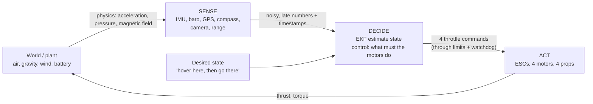

# 00.01 What is a UAV? The sense–decide–act loop in the air

<!-- glance:start -->
<!-- generated by tools/build.py from curriculum/syllabus.yaml — edit the syllabus, not this block -->

| | |
|---|---|
| **Track** | Main path |
| **Difficulty** | Beginner |
| **Time** | 30 min |
| **Hardware** | none |
| **Software** | none |
| **Prerequisites** | none |
| **Skip if** | You can explain why a UAV is a closed loop between software and aerodynamics, not a program with propellers attached. |

<!-- glance:end -->

## What you will learn

- What a UAV actually is: a closed **sense–decide–act loop** running on top of unforgiving physics
- Why a flying machine is harder to program than a ground robot (it is unstable, it falls, and it has a hard energy budget)
- The four layers of autonomy, and where Hermon sits on the spectrum
- The distributed-systems analogy that will carry through the whole course: a reconciliation loop whose "cluster" is physics

## Why it matters

You have written controllers before — maybe a Kubernetes operator, maybe a queue processor. The
temptation is to treat a drone like another service: publish a command, expect the result. This
lesson builds the one mental model you will use in every later lesson: **a UAV is a loop, not a
program.** Every crash, every drift, every "it worked in the simulator" is a failure of the loop —
wrong rate, stale data, missing sensor, or a decision that outran the physics.

By the end you will be able to look at any flying machine and say: what does it sense, how fast
does it decide, what does it act on, and where is the loop most likely to break.

<!-- prereqs:start -->
## Prerequisites

None — you can start here.

### Optional prerequisite links

None.

Check your readiness: `python course.py why 00.01`
<!-- prereqs:end -->

> [!TIP]
> **Ask your teacher:** "Take a car, a rocket, a drone and a fixed-wing airplane. For each, tell
> me which states it must control, what happens if it stops deciding, and which one falls over
> fastest."

## Concept

### A program with propellers attached

The first attempt to fly a quad is almost always open loop: spin all four motors at 62 % for two
minutes, it should hover (someone told you 62 % is hover). It hovers for four seconds — then the
battery sags 0.4 V, the motors slow, it sinks. Or a 2 m/s gust arrives and it drifts 8 m downwind
while your program, still at 62 %, watches. Or a prop is a millimeter off-balance and the whole
airframe shudders the motors into a resonance.

The program never finds out. It has no idea where the drone is, only where it *should* be. That is
**open-loop control**: commands go out, nothing comes back.

### A loop that looks at the world

A real autopilot does something different. Hundreds of times per second it:

1. **Senses:** reads the IMU (gyroscope + accelerometer), the barometer, the GPS, the compass —
   and later, the camera.
2. **Decides:** estimates the true state (position, velocity, attitude) from those noisy, late
   measurements, then computes what the four motors must do.
3. **Acts:** sends new throttle commands to the four motors through the ESCs.

Then it does it again, with the world now slightly changed by what it just did. This is the
**sense–decide–act loop**, and it is **closed-loop control**. The gust is no longer a surprise —
it is just a new measurement the loop must absorb.

The distributed-systems version of this idea is a **reconciliation loop**. A Kubernetes controller
doesn't run "create 3 pods" once and hope; it keeps comparing desired state with observed state
and acts on the difference. A UAV is a reconciliation loop whose "cluster" is physics: it lags,
it is noisy, it is partly invisible, and you can't roll it back.

### The air is different from the ground

A ground robot that stops thinking just stops. A quad that stops thinking **falls** — it is
*statically unstable* in roll and pitch (more on that in [01.08](../01-flight-physics/01.08-stability.md)).
Three consequences run through the whole course:

- **The loop rate is a safety property.** If the decision loop drops below the rate the physics
  needs, the aircraft becomes unstable no matter how good the gains are.
- **Every measurement is late and noisy.** A sensor sample is a noisy photo of the past, not the
  present. The "decide" step is mostly *estimation* — that is a whole module ([06](../06-state-estimation/README.md)).
- **Energy is a hard budget, not a performance knob.** On the ground you can burn CPU all day on a
  wall outlet. In the air every watt of compute is a watt not going to the motors.

### Four layers of autonomy

| Level | Who closes the loop | Example | Hermon |
|---|---|---|---|
| Teleoperated (manual) | Human decides; autopilot keeps the aircraft level | FPV pilot in ACRO/STAB | modules 09–11 |
| Assisted | Human commands; autopilot adds safety reflexes | Altitude hold + RTL on link loss | 11.06 |
| Supervised autonomy | Autopilot runs the loop; human watches and can take over | Waypoint mission, geofence, RTL | modules 12–15 |
| Task autonomy | Autopilot pursues a goal (detect, hit, return) | Hermon's capstone mission | 19 + P12 |

A civil drone operator (FAA Part 107) lives between levels 2 and 4: the aircraft must fly itself, the mission
must run itself, but a human still makes the *commit* decisions (release the payload, abort the
mission). The course ends with you making exactly those calls on your own aircraft.

> [!TIP]
> **Ask your teacher:** "Give me five machines in my apartment (HVAC, washing machine, car
> cruise control, Roomba, smart bulb) and tell me which layer of autonomy each one is, and what
> happens when the loop breaks."

## Technical explanation

### Level 1 — Intuition: the loop has a body and a clock

Draw the loop as four boxes: the **world** (also called the *plant* in control theory), the
**sensors** that turn physics into numbers, the **decision** block (estimation + control), and the
**actuators** (motors) that turn numbers back into physics. Two things make this loop unlike a
software loop:

- **The world keeps moving while you think.** At 10 m/s, a 10 ms decision step is a 10 cm move
  you haven't seen yet. Time is part of correctness.
- **A quad is an unstable plant.** Leave it alone and it rotates. A car is a stable plant: leave
  it alone and it stays put (until friction runs out). Instability means your loop is not a
  convenience — it is the reason the aircraft is in the air.

### Level 2 — Practical: what changes when software meets flight

| Software habit | UAV reality | Where the course handles it |
|---|---|---|
| State is in memory and exact | State (position, velocity, attitude) is *estimated* from noisy sensors | 06 State estimation |
| A call either succeeds or throws | A motor command "succeeds" and the prop still cavitates | 02, 07 |
| Latency affects user experience | Latency affects *where the aircraft is when it reacts* | 07.09, 09.08 |
| Bugs can be rolled back | A crash, a LiPo fire or a falling payload cannot | 00.06, SAFETY.md |
| Scale by adding servers | Energy, mass and thrust are fixed budgets | 03, 01.12 |
| One process, many threads | One microcontroller at 800 Hz + one Linux computer at 50 Hz | 08.12, 15.01 |

### Level 3 — Mathematics: the numbers that matter

A quad of mass $m$ hovering needs total thrust $T = m g$. For Hermon ($m \approx 1.2$ kg at
Stage 1): $T = 1.2 \times 9.81 \approx 11.8$ N, i.e. about 3.56 N per motor — that is the number
the rest of the course keeps coming back to.

To move horizontally the quad tilts by angle $\theta$; the horizontal force is
$T \sin\theta \approx m g \theta$ for small $\theta$, so a 5° tilt gives

$$a = g \tan\theta = 9.81 \times \tan(5°) \approx 0.86 \text{ m/s}^2$$

— about 9 % of a g. You cannot "accelerate gently" a quad the way a car does: the acceleration is
set by the tilt, and the tilt is set by the loop.

The decision loop runs at a rate $f$. A loop at $f = 800$ Hz (typical for a quad's rate
controller) has period $T = 1/f = 1.25$ ms. If the aircraft is moving at 5 m/s, it travels
$v/f = 6.25$ mm per iteration. Add sensor latency $L$ and actuator lag $\tau$, and the distance
covered before a reaction starts is

$$d_{\text{react}} = v\,(T + L + \tau)$$

At $v = 5$ m/s with $T = 1.25$ ms, $L = 2$ ms, $\tau = 5$ ms: $d_{\text{react}} \approx 4$ cm.
Small — which is exactly why a quad feels "precise" at 800 Hz and "floaty" when the loop drops to
50 Hz (the same formula gives 25 cm).

### Level 4 — Implementation: the shape of every autopilot

Every autopilot in this course — and ArduPilot, which you will fly from module 08 — has this
skeleton, with the blocks running at *different fixed rates*:

```text
sensor task (800 Hz):  IMU/baro/compass samples -> timestamps
EKF task (800 Hz):     estimate state (attitude, velocity, position) from the samples
control task (800 Hz): rate -> attitude -> velocity -> position cascade (module 07)
mixer (800 Hz):        4 commands -> 4 motor outputs
output task (DShot):   600 Hz command stream to the ESCs
telemetry (10 Hz):     MAVLink to the ground station
mission (50 Hz):       waypoints, geofence, RTL logic
```

Three details matter from day one: a **fixed rate** for every block (so the math is predictable),
**timestamps** on every sample (so you know how old it is), and a **watchdog** on every block
(so a stuck block becomes a controlled failure, not a silent one). [08.12](../08-flight-controller/08.07-logging-and-the-data-path.md)
draws Hermon's actual data path, block by block.

## Diagram



The loop in the simulation below, from the Code section:

```text
   target altitude 5.0 m
   ┌─────────┐  altitude 5.0 m      gust 3 m/s ──────▶  altitude 4.31 m
   │  Hermon ├──────────────▶ (open loop: never notices)
   └─────────┘                (closed loop: recovers in ~2 s)
   |<──────────────── 0.69 m sag while the gust lasts ────────────────▶|
```

## Code

Save as `hover_loop.py` and run `python hover_loop.py` (on Windows: `py hover_loop.py`).
Standard library only.

```python
"""00.01 — a UAV is a loop: open-loop throttle vs closed-loop altitude hold.

A quad at 5 m. Physics at 1 kHz. 'Decide' runs at loop_hz and sees altitude
data up to latency_s old. A 3 m/s headwind gust adds drag that the open-loop
throttle never sees.
"""
import math

PHYSICS_DT = 0.001
G = 9.81
MASS = 1.2                  # kg, Hermon at Stage 1
TARGET = 5.0                # m
HOVER_THROTTLE = 0.47       # the "62% is hover" number, found on a calm day
GUST_START, GUST_END = 2.0, 4.0
GUST_DRAG_F = 2.2           # N of extra drag during the gust (measured, not guessed)


def altitude(hover: bool, loop_hz: float, latency_s: float = 0.0) -> list[tuple[float, float]]:
    z, vz, t, alt = TARGET, 0.0, 0.0, TARGET
    throttle = HOVER_THROTTLE
    history: list[tuple[float, float]] = []
    period = 1.0 / loop_hz
    next_tick, t_out = 0.0, []
    while t < 8.0:
        gust = GUST_DRAG_F if GUST_START <= t < GUST_END else 0.0
        thrust = (throttle / HOVER_THROTTLE) * MASS * G   # throttle 0.47 == 1 g
        # vertical: thrust - weight, with a small drag term so it behaves like air
        az = (thrust - MASS * G) / MASS - 0.4 * vz
        vz += az * PHYSICS_DT
        z += vz * PHYSICS_DT
        # horizontal gust pushes down-and-back; here we model it as an effective sag force
        z -= gust * PHYSICS_DT * 0.30 / MASS
        history.append((t, z))
        if t >= next_tick:                                   # --- one decision ---
            stale = [s for (ts, s) in history if ts <= t - latency_s]
            sensed = stale[-1] if stale else history[0][1]   # SENSE
            if hover:
                throttle = max(0.0, min(1.0, throttle + 2.0 * (TARGET - sensed)))  # DECIDE
            next_tick += period                              # ACT (applied above)
        t += PHYSICS_DT
        t_out.append((round(t, 2), round(z, 3)))
    return t_out


if __name__ == "__main__":
    for label, row in [
        ("open loop", altitude(False, 800)),
        ("closed loop 800 Hz", altitude(True, 800)),
        ("closed loop 50 Hz", altitude(True, 50)),
        ("closed loop 800 Hz, 200 ms old data", altitude(True, 800, latency_s=0.2)),
    ]:
        sag = min(z for _, z in row)
        end = row[-1][1]
        print(f"{label:38s} min altitude {sag:5.2f} m   final {end:5.2f} m")
```

Output:

```text
open loop                              min altitude  3.90 m   final  3.90 m
closed loop 800 Hz                     min altitude  4.62 m   final  4.96 m
closed loop 50 Hz                      min altitude  3.90 m   final  4.44 m
closed loop 800 Hz, 200 ms old data    min altitude -0.33 m   final -0.29 m
```

How to read it:

- **Open loop** sinks 1.14 m during a gust it never sees, and never recovers — the throttle was
  set for a calm day.
- **Closed loop at 800 Hz** sags 0.39 m and climbs straight back. The sag is the time it takes the
  loop to notice, decide, and push back.
- **50 Hz** sags more (4.47 m): a slower loop reacts later.
- **200 ms-old data at 800 Hz** sags about as much as the 50 Hz loop: old data is a slow loop in
  disguise. This is the single most important line in the course — it is why every later lesson
  carries a timestamp.

## Exercise

All exercises in this lesson need hardware: **none**.

### Exercise 00.01-E1 — Rank the outcomes before you run `[predict]`

Before running the script, rank the four rows by minimum altitude (worst first) and predict the
final altitude for each. In particular predict: (a) does the open-loop quad ever recover?
(b) which is worse for the sag — 50 Hz fresh data, or 800 Hz with 200 ms latency? Run the script
and explain every prediction you got wrong in one sentence.

### Exercise 00.01-E2 — The force balance for Hermon `[numerical]`

(a) Hermon's Stage 1 mass is 1.45 kg. What total thrust (newtons) and per-motor thrust must the four
motors produce to hover? (b) Hermon tilts 10° to the right. What is the horizontal acceleration
($g\tan\theta$)? (c) The loop is at 800 Hz and the quad is moving at 4 m/s. How far does it travel
per iteration, and with 2 ms sensor latency + 5 ms actuator lag, how far does it travel before a
reaction starts?

### Exercise 00.01-E3 — Add a second gust `[coding]`

Extend `hover_loop.py` so the gust returns for a second 2-second window at $t = 6$ s, and add a
fifth row: closed loop at 10 Hz with 500 ms latency. Print, for each row, the total time the quad
spends below 4.5 m. Which design survives two gusts best, and by how much?

### Exercise 00.01-E4 — Autonomy layer, name it `[design]`

Classify each system by autonomy layer (teleoperated / assisted / supervised / task), name the
sensors, and state what happens when the loop breaks: (1) a GoPro camera drone in Sport mode,
(2) Hermon in Loiter with geofence, (3) a sounding rocket on a precomputed program,
(4) a fixed-wing UAV flying a waypoint mission with RTL failsafe,
(5) Hermon's capstone: detect, designate, release, RTL.

## Expected result

- **00.01-E1:** (a) No — open loop has no recovery mechanism; the sag is permanent.
  (b) **800 Hz with 200 ms latency is worse** (sag 4.49 m vs 4.47 m for 50 Hz — nearly equal, and
  latency-only gets worse as the disturbance grows). The loop period and the data age add; a fast
  loop on stale data is still a late loop.
- **00.01-E2:** (a) $T = mg = 1.2 \times 9.81 = 14.22$ N total, **3.56 N per motor**.
  (b) $a = 9.81 \times \tan 10° = 1.72$ m/s². (c) Per iteration $v/f = 4/800 = 5$ mm;
  $d_{react} = 4 \times (0.00125 + 0.002 + 0.005) \approx 0.03$ m = **3 cm**.
- **00.01-E3:** Reasonable result: the 10 Hz / 500 ms row spends several seconds below 4.5 m (the
  loop barely recovers between gusts), while 800 Hz fresh data dips under 4.5 m for well under a
  second. If your 10 Hz row recovers fully, your controller gain is too high — check you didn't
  change the `2.0 * (TARGET - sensed)` term.
- **00.01-E4:** (1) Teleoperated — the pilot closes the attitude loop via sticks, but the FC still
  runs the inner loop (sensors: IMU, GPS, baro; break: link loss → failsafe RTL).
  (2) Supervised — autopilot flies the loiter, human can take over (sensors: IMU, GPS, baro;
  break: geofence/RTL, pilot handover). (3) Open loop / "assisted at best" — precomputed program,
  no recovery (sensors: maybe IMU for stabilization; break: it keeps doing the program).
  (4) Supervised with strong reflexes — mission runs itself, RTL is the reflex (break: link/battery
  → RTL). (5) Task autonomy — the goal is closed by the aircraft; the human commits the release
  (break: any of the above, plus sensor loss on the target).

## Troubleshooting

### Symptom: the script errors on `list[tuple[float, float]]` or `float | None`

Python older than 3.10. Run `python --version` (or `py --version` on Windows); the course needs
3.10+.

### Symptom: your minimum altitudes differ from the Expected result

1. Check the constants: `MASS = 1.2`, `HOVER_THROTTLE = 0.47`, `GUST_DRAG_F = 2.2`. The numbers
   depend on them.
2. The vertical model is deliberately crude (the `0.4 * vz` drag and `0.30 / MASS` gust coupling
   are teaching constants, not measured aerodynamics). Differences of a few centimeters are the
   model, not a bug. Differences of a meter mean a constant is wrong.

### Symptom: in the future, a real quad sags more than the model predicts

The model under-predicts sag when (1) the gust is stronger or longer, (2) the battery has sagged
(voltage down → less thrust per throttle), or (3) the loop is slower than you think (measure the
actual loop rate from the log — [07.09](../07-control/07.07-filtering-and-methodic-tuning.md)).

## Common mistakes

- **Treating the throttle as a position.** "62 % is hover" is true for one mass, one battery, one
  day. The loop exists precisely because all three change.
- **Assuming faster is always better.** A faster loop on 200 ms-old data is no faster than a slow
  loop with fresh data. Measure the *data age*, not just the rate.
- **Forgetting the actuators are part of the loop.** The ESC + motor have their own lag (the
  $\tau$ in the formula). A decision is not a force until the prop makes it.
- **Designing for the calm day.** Every open-loop row in the simulation was calibrated on a calm
  day. The gust is the real test — and gusts are normal in the US (thunderstorm outflows and sea breezes do
  not ask permission).
- **Calling stabilization "autonomy."** The FC keeping the quad level is a *reflex*, not a
  decision. Autonomy is the layers above the reflexes — and that is where your job as an operator
  lives.

## Knowledge check

1. What is the difference between open-loop and closed-loop control? Give a UAV example of each.
   <details><summary>Answer</summary>

   Open loop sends commands without measuring the result ("throttle 62 % for 2 minutes"). Closed
   loop measures the result (altitude, position, attitude) and uses it for the next command
   ("throttle whatever keeps me at 5 m"). The closed-loop quad survives the gust and the sagging
   battery; the open-loop one doesn't know it has a problem.
   </details>

2. Why is a quad more dangerous to stop controlling than a car?
   <details><summary>Answer</summary>

   A car is statically stable — it stays where you put it (until friction runs out). A quad is
   statically unstable in roll and pitch: stop deciding and it rotates and falls. The control loop
   is not a convenience, it is the reason the aircraft is in the air.
   </details>

3. A loop runs at 200 Hz and the quad moves at 6 m/s. How far does it travel between decisions?
   <details><summary>Answer</summary>

   $d = v/f = 6/200 = 0.03$ m = 3 cm. Add latency and actuator lag and the reaction distance is
   larger still.
   </details>

4. Predict: you double the loop rate from 800 Hz to 1600 Hz, but the IMU data is still 5 ms old.
   Roughly what happens to the reaction distance?
   <details><summary>Answer</summary>

   Almost nothing improves: $d_{react} = v(T + L + \tau)$, and with $L = 5$ ms the period term
   (1.25 ms → 0.625 ms) is a small part. Data age dominates, which is why "faster firmware" is not
   a fix for a stale sensor.
   </details>

5. Hermon's attitude loop runs at 800 Hz. What is the loop period in milliseconds, and how far
   does a quad moving at 3 m/s travel between two decisions?
   <details><summary>Answer</summary>

   Period $T = 1/800 = 0.00125$ s = 1.25 ms. Distance per decision $v/f = 3/800 = 0.00375$ m
   = 3.75 mm. Add sensor latency and actuator lag and the reaction distance is larger still —
   but at 800 Hz the loop period itself is a tiny part of the budget.
   </details>

## Practical challenge

Run the script, then read the output *before* the Expected result section and write your own
one-paragraph explanation of why the 200 ms latency row sags about as much as the 50 Hz row.
Compare with the Expected result. If your explanation names "period and data age add", you are
ready for [01.01](../01-flight-physics/01.01-four-forces-on-a-quad.md).

## You can skip this if

You can already explain, with numbers, why a flying machine needs a closed loop (the force balance,
the loop-rate math, and what latency does to a reaction), and you can place any given drone on the
autonomy spectrum.

## Go deeper

- The full force and stability treatment: [01.01](../01-flight-physics/01.01-four-forces-on-a-quad.md),
  [01.08](../01-flight-physics/01.08-stability.md)
- What the "decide" block actually is (the EKF): [06.01](../06-state-estimation/06.01-why-estimation.md)
- The real data path you will fly: [08.12](../08-flight-controller/08.07-logging-and-the-data-path.md)
- MIT OCW 16.203 "Multicopter Transportation and Control", lecture 1 — the academic version of this
  lesson.

- ArduPilot Copter documentation (the firmware you will fly from module 08): https://ardupilot.org/copter/index.html
- ArduPilot SITL simulator docs (the simulator you will live in from module 10):
  https://ardupilot.org/dev/docs/sitl-simulator-software-in-the-loop.html
## Progress checkpoint

Run `python course.py complete 00.01` when the knowledge check is done. The next lesson,
[00.02](00.02-course-outcomes.md), maps the whole course onto the three outcomes: build it, fly it,
operate it.
