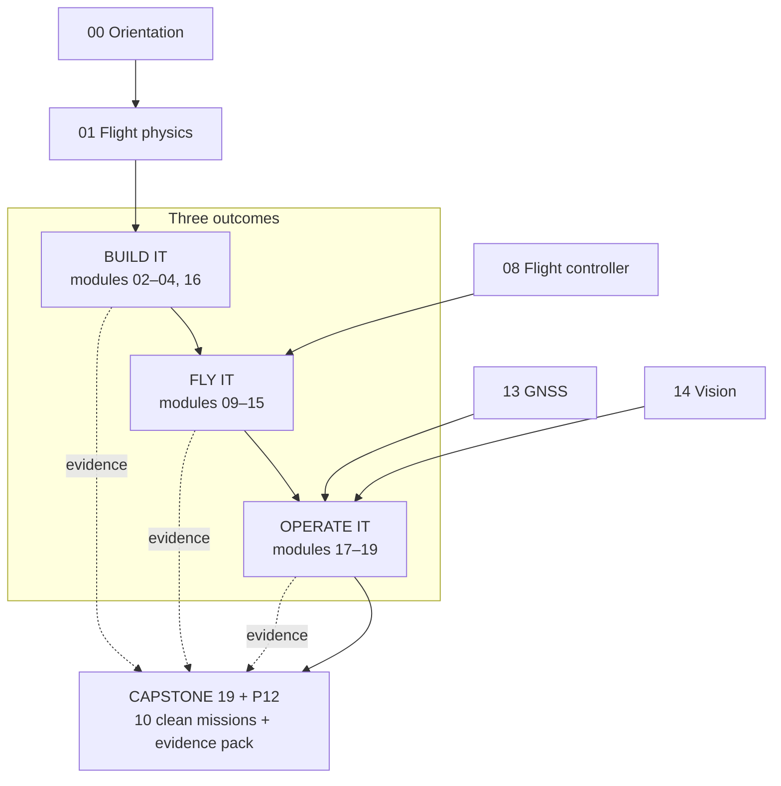

# 00.02 Where this course takes you: build it, fly it, operate it

<!-- glance:start -->
<!-- generated by tools/build.py from curriculum/syllabus.yaml — edit the syllabus, not this block -->

| | |
|---|---|
| **Track** | Main path |
| **Difficulty** | Beginner |
| **Time** | 30 min |
| **Hardware** | none |
| **Software** | none |
| **Prerequisites** | [00.01 What is a UAV? The sense–decide–act loop in the air](00.01-what-is-a-uav.md) |
| **Skip if** | You can state the three end outcomes and which modules produce each. |

<!-- glance:end -->

## What you will learn

- The three end outcomes of the course: **build it**, **fly it**, **operate it** — and what "done"
  means for each
- How the 20 modules map onto those outcomes, and the hardware stages that gate them
- What "civil drone operator (FAA Part 107)" means as a job, and the evidence pack that proves you can do it

## Why it matters

Courses fail in one of two ways: they end with a robot that worked in the tutorial, or they end
with a certificate and no aircraft. This lesson pins down what *done* means for Hermon, so that
every later decision — which module to push through, which hardware to buy, which exercise to
finish — has a destination.

By the end you will be able to look at any lesson in this course and say which of the three
outcomes it feeds, and what the capstone will require of it.

<!-- prereqs:start -->
## Prerequisites

You need these first:

- [00.01 What is a UAV? The sense–decide–act loop in the air](00.01-what-is-a-uav.md)

### Optional prerequisite links

None.

Check your readiness: `python course.py why 00.02`
<!-- prereqs:end -->

> [!TIP]
> **Ask your teacher:** "I have 40 free hours this month. Which three modules should I do, in what
> order, and what will I be able to do that I can't do now?"

## Concept

### Three outcomes, one aircraft

The course has exactly three end outcomes, all on the same aircraft — **Hermon**:

1. **Build it.** You can design, assemble, wire and test a 1.45 kg quadcopter from a parts list to a
   flying machine, with measured mass, measured hover thrust, and a power budget that matches
   reality within 5 percent. Evidence: the build log, the thrust-stand data, the power budget
   sheet (modules 02–04, 16).
2. **Fly it.** You can pilot Hermon manually (takeoff, maneuvers, wind, landings), and you can make
   it fly itself (waypoint missions, RTL, precision landing, GNSS-denied, ROS 2 offboard).
   Evidence: flight logs, the pilot's logbook, the mission regression matrix (modules 10–15, 16).
3. **Operate it.** You can plan a mission (OPORD, airspace, legal permit), fly it as an operator
   (comms, night ops, comms discipline), manage the payload (designate, release, confirm), and
   certify it (test campaign, safety case, qualification). Evidence: the capstone pack — ten clean
   missions and the report (modules 17–19).

The capstone ([19](../19-capstone-hermon-mission/README.md)) is where the three outcomes meet:
Hermon takes off by itself, surveys a perimeter, detects a target with a camera, you confirm the
release from the ground station, the 250 g payload hits the target, and Hermon lands itself on the
pad — ten times, with the evidence to prove it.

### Why a quadcopter, and why "Hermon"

A quadcopter is the standard training and light-delivery airframe: four motors give full 6-DoF
control with a simple mechanical layout, hover efficiency is high enough for 25+ minute loiter,
and the same airframe scales from a 250 g trainer to a 10 kg civil platform. You will see
fixed-wing and VTOL later as *options* (they appear in 18.01 as mission types), but your hands
learn on the quad.

The name is a working name — a mountain (like karmel in the robotics course) — and it is also a
callsign. When you brief the capstone mission, you will say "Hermon is on station", and it will
mean exactly what it says.

### The modules, mapped

| Outcome | Modules | Hardware stage |
|---|---|---|
| Understand the physics and the stack | 00–01 | none (laptop) |
| Build it | 02–04, 16 | Stage 1 (frame, motors, ESC, FC, battery, link) |
| Fly it (manual) | 09–11 | Stage 1 |
| Fly it (autonomous) | 12–15 | Stage 1–2 (Pi + camera + thermal) |
| Understand where it is | 13 | Stage 1 (GPS); Stage 3 for RTK (optional) |
| See and know | 14, 17 | Stage 2 (camera, thermal); Stage 4 (payload, rangefinder) |
| Operate it | 18, 19 | Stage 4–5 |
| The capstone | 19 + P12 | all stages |

The dependency chain is the course: physics → motors/props → power → structure → sensors →
state estimation → control → flight controller → telemetry → simulation → first flights →
autonomy → GNSS → vision → onboard autonomy → testing → payload → operations → capstone.
Module 10 (simulation) is the cheat code: everything from 08 onward can be practiced in SITL
before you spend a battery.

### What "civil drone operator (FAA Part 107)" actually requires

The job, in one sentence: **make the aircraft do a job, with a payload or a sensor, over
someone else's airspace, and be able to explain every decision afterwards.** That breaks into
five skills the course certifies:

1. **Aircraft** — you know the machine (mass, thrust, endurance, failure modes) because you built it.
2. **Pilot** — you can fly it manually when the autopilot is not enough (11.10 syllabus).
3. **Navigator** — you know where it is, where it is going, and what happens when the GPS lies
   (modules 12–13).
4. **Sensor/payload manager** — you know what the camera sees, what the rangefinder means, and
   when the release will work (modules 14, 17).
5. **Operator** — you can run the mission: plan, brief, fly, comms, debrief, certify (18, 19).

A hiring unit does not ask "did you finish a course". It asks for evidence: logs, test reports,
debriefs. That is why every project in this course ends with an evidence file, and the capstone
ends with a safety case.

> [!TIP]
> **Ask your teacher:** "Pick one of the five operator skills and give me the three lessons that
> train it hardest."

## Technical explanation

### Level 1 — Intuition: evidence is the curriculum

A software engineer's instinct is: read, understand, move on. A drone operator's evidence is:
*measured, logged, repeatable.* This course grades you the way a flight line grades a pilot — by
what the data shows you can do, not by what you can explain about it. Every "practical challenge"
and every project produces an artifact: a CSV, a log, a photo, a short report. The capstone pack
is the union of those artifacts.

### Level 2 — Practical: the three gates

The course has three hard gates, each a project:

| Gate | Project | What it proves |
|---|---|---|
| Build gate | P04 + P11 | Hermon flies on numbers, not vibes: SITL regression green, test matrix executed |
| Flight gate | P06 + P09 + P10 | missions, precision landing, ROS 2 offboard — all with measured acceptance |
| Operations gate | P12 (capstone) | 10 clean autonomous missions with the full evidence pack |

You can read every lesson in the course and still fail a gate. The gates are where the course
becomes a certification.

### Level 3 — Mathematics: the time budget

The core path is ≈ 342 hours (see the hours table in COURSE_MAP.md). At 20 h/week that is about
17 weeks; at 6 h/week, about a year. The hardware gates add calendar time (parts shipping, build,
weather), so plan the build (Stage 1) to arrive **before module 11**, not during it: order in
week 4–6 of the course, not week 12.

### Level 4 — Implementation: how the course tracks you

`course.py` (module 00.07) holds your state: every lesson, exercise, project and skill has a
status, and `python course.py why <id>` tells you exactly what you are missing before any lesson.
The three gates above are just projects with acceptance criteria — the same mechanism as every
other project, which is deliberate: a certification is a project with a high bar, not a special
kind of magic.

## Diagram



## Code

Save as `course_budget.py` and run `python course_budget.py`. Standard library only.

```python
"""00.02 — the course as a time budget: hours, gates, and when to order parts.

Reads nothing; the numbers are the course plan (see COURSE_MAP.md hours table).
"""
MODULES_HOURS = {
    "00": 6, "01": 14, "02": 18, "03": 14, "04": 16, "05": 16, "06": 20, "07": 22,
    "08": 18, "09": 16, "10": 20, "11": 18, "12": 16, "13": 14, "14": 20, "15": 20,
    "16": 16, "17": 18, "18": 16, "19": 24,
}
STAGE1_ARRIVES_AFTER_WEEKS = 6      # order early; parts take 2–4 weeks in the US
FIRST_FLIGHT_MODULE = "11"


def week_of(module: str, hours_per_week: float) -> int:
    """Which week of the course does a module land in, given a pace."""
    done = 0
    for m in sorted(MODULES_HOURS):
        done += MODULES_HOURS[m]
        if m == module:
            return int(done / hours_per_week) + 1
    raise KeyError(module)


if __name__ == "__main__":
    total = sum(MODULES_HOURS.values())
    print(f"Core path total: {total} h")
    for pace in (20, 10, 6):
        w11 = week_of(FIRST_FLIGHT_MODULE, pace)
        ok = "OK — order Stage 1 in week 1" if STAGE1_ARRIVES_AFTER_WEEKS + 4 <= w11 else \
             "TIGHT — order Stage 1 immediately"
        print(f"  {pace:2d} h/week: first flight (module 11) in week {w11:2d}  {ok}")
    sim_only = sum(MODULES_HOURS[m] for m in ("00", "01", "06", "07", "08", "10"))
    print(f"Sim-only hours before Stage 1 hardware is needed: {sim_only} h "
          f"(modules 00, 01, 06, 07, 08, 10)")
```

Output:

```text
Core path total: 342 h
  20 h/week: first flight (module 11) in week 10  OK — order Stage 1 in week 1
  10 h/week: first flight (module 11) in week 20  OK — order Stage 1 in week 1
   6 h/week: first flight (module 11) in week 34  OK — order Stage 1 in week 1
Sim-only hours before Stage 1 hardware is needed: 100 h (modules 00, 01, 06, 07, 08, 10)
```

How to read it: at any realistic pace you get **94 hours of sim-only study** (physics, state
estimation, control, flight controller, simulation) before you need a single part. Order Stage 1
when you start module 02 — the parts will arrive around module 10, and module 11 (first flights)
will start with a built, tested airframe instead of a box on the floor.

## Exercise

All exercises in this lesson need hardware: **none**.

### Exercise 00.02-E1 — Your pace, your plan `[numerical]`

Run `course_budget.py`. (a) At your realistic weekly pace, what week does module 11 (first
flight) land in? (b) Given a 3-week part delivery to the US, what is the latest module at which
you can order Stage 1 and still have it in hand before first flight? (c) How many sim-only hours
do you have before you need hardware, and which modules would you actually do in that window?

### Exercise 00.02-E2 — Map five lessons `[predict]`

For each of 03.05 (power budget), 06.06 (EKF3 tour), 09.05 (link budget in practice), 13.09
(jamming/spoofing) and 17.07 (target motion and lead), state in one sentence which outcome
(build/fly/operate) it feeds and which gate it contributes evidence to.

### Exercise 00.02-E3 — The five operator skills `[design]`

Write a one-paragraph job description for "drone operator, light civil UAV" using only the five
skills from the Concept section. Then list, for each skill, the single lesson in this course that
trains it hardest. (There is no single right answer; the mapping is what counts.)

## Expected result

- **00.02-E1:** (a) At 10 h/week, week 21; at 6 h/week, week 36 (the script computes it for you —
  substitute your own pace). (b) Latest order = first-flight week minus 3 delivery weeks; at
  10 h/week that is week 18, but the *sane* answer is much earlier, because module 02 (motors)
  is where you pick the actual parts — order as soon as 02.11 is done. (c) 94 h: modules 00, 01,
  06, 07, 08, 10 — do 00–01 first (physics), then 06–08 (estimation/control/FC) with SITL, then
  10 (simulation) so you can practice 06–08 properly.
- **00.02-E2:** 03.05 → build (P11 evidence: power budget sheet). 06.06 → fly (P04/P11: EKF is the
  flight gate's core). 09.05 → fly/operate (P05 datalink evidence; operations needs a known link).
  13.09 → operate (expert: the contested environment is where GNSS lies). 17.07 → operate (P12:
  the release math is the capstone's hardest number).
- **00.02-E3:** A reasonable mapping: Aircraft → 04.10 (building Hermon) or 16.10 (certification).
  Pilot → 11.10 (the 20-session syllabus). Navigator → 13.10 (GNSS-denied) or 12.04 (RTL logic).
  Sensor/payload manager → 17.07 (lead math) or 14.11 (vision-guided behavior). Operator → 18.03
  (OPORD/METTLE) or 18.10 (qualification). Full credit if each skill maps to a lesson whose
  *evidence* would appear in the capstone pack.

## Troubleshooting

### Symptom: the script's week numbers don't match your plan

The script assumes you do modules in order at a steady pace. If you are doing the foundations
tracks (FA/FEL/…) in parallel, add their hours (~20 h total) to the total and recompute — or just
track your real pace with `course.py status` and compare.

### Symptom: "I don't have 20 hours a week"

You don't need to. At 6 h/week the course takes about a year, and the sim-only window (94 h)
grows, not shrinks. The only thing that changes is when the parts arrive — order them at module
02 regardless of pace.

## Common mistakes

- **Buying hardware in week 1.** The parts sit on the bench while you do physics; the prop
  guards collect dust; one motor gets a hairline crack. Buy when the lessons need it (module 02
  for Stage 1).
- **Reading past a gate.** You can finish module 15 and still not be able to land Hermon. The
  gates (P04, P11, P12) are not optional decoration — they are the course.
- **Confusing "done the course" with "done the aircraft."** The course is done when the capstone
  pack exists: 10 clean missions, the evidence, the safety case.
- **Planning for one pace.** Your pace will vary (work, weather, a crashed motor). The plan that
  survives is the one with slack before the gates, not after them.

## Knowledge check

1. What are the three outcomes of the course, and which modules produce each one?
   <details><summary>Answer</summary>

   Build it (02–04, 16 — the airframe, the power budget, the test campaign), fly it (09–15 —
   manual piloting, missions, autonomy, GNSS, vision, ROS 2), operate it (17–19 — payload,
   operations, capstone). The capstone (19 + P12) is where all three meet.
   </details>

2. Why does the course require 94 sim-only hours before hardware is needed, and why is that good?
   <details><summary>Answer</summary>

   Modules 00, 01, 06, 07, 08 and 10 run on the laptop and SITL. It is good because (1) you can
   start immediately, (2) you understand the aircraft before you buy it, and (3) the parts arrive
   exactly when module 11 needs them — no dust-collecting box, no panic order.
   </details>

3. Name the three gates and what each one proves.
   <details><summary>Answer</summary>

   Build gate (P04 + P11): Hermon flies on numbers — SITL regression green, test matrix executed.
   Flight gate (P06 + P09 + P10): missions, precision landing and ROS 2 offboard all with measured
   acceptance. Operations gate (P12): 10 clean autonomous capstone missions with the full evidence
   pack.
   </details>

4. A hiring unit asks for evidence of your navigation skill. Which three artifacts do you hand
   them?
   <details><summary>Answer</summary>

   The P06 mission logs (5 clean waypoint missions), the P09 precision-landing offset table
   (mean ≤ 0.3 m), and the 13.10 GNSS-denied flight log (3 min square, no GPS, position error
   under 1 m).
   </details>

5. Name one piece of evidence you would hand a hiring unit for each of the three outcomes
   (build, fly, operate).
   <details><summary>Answer</summary>

   Build: the 04.10 build log with the measured mass table + the 02.09 thrust-stand CSV.
   Fly: the P06 mission logs (5 clean waypoint missions) + the 13.10 GNSS-denied flight log.
   Operate: the 18.03 OPORD you wrote + the 19.07 evidence pack (10 clean capstone missions,
   the safety case). One artifact each, all in `projects/evidence/`.
   </details>

## Practical challenge

Write your one-page course plan: your weekly pace, the week each gate lands in, the week you will
order Stage 1, and the three modules you will do in the first sim-only month. Save it as
`projects/evidence/00.02-course-plan.md`. You will update it (not rewrite it) at every gate.

## You can skip this if

You already have a written plan for Hermon (pace, gates, hardware order, capstone target date) and
can state the three outcomes and the three gates without notes.

## Go deeper

- The full module-by-module map with hours: [COURSE_MAP.md](../COURSE_MAP.md)
- The 11 architecture deliverables (what this course is and why): [ARCHITECTURE.md](../ARCHITECTURE.md)
- The hours table and the sim-only window: §3 of ARCHITECTURE.md

- The robotics course (the sibling repo this course cross-references): https://github.com/tal-giladi/robotics-course
- ArduPilot firmware repository (Hermon's flight controller, 4.7.0 stable):
  https://github.com/ArduPilot/ardupilot
## Progress checkpoint

Run `python course.py complete 00.02` when your one-page plan is written. Next:
[00.03](00.03-hermon-the-build-vehicle.md) — the aircraft itself, spec by spec.
