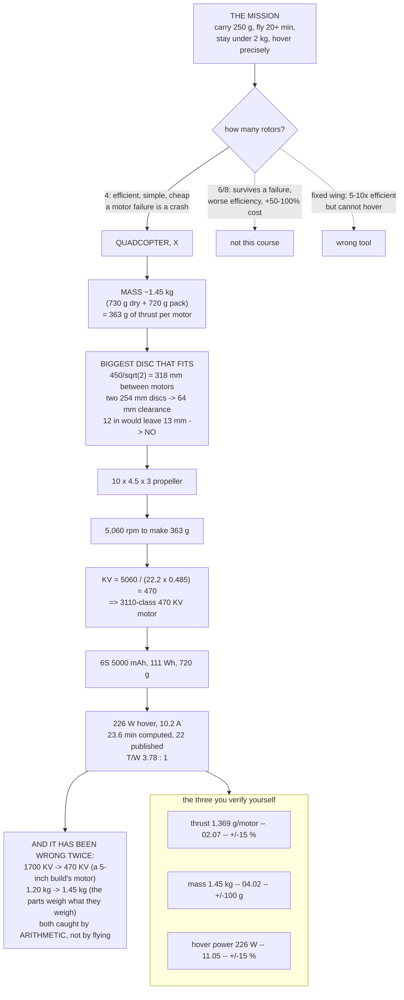

# 00.03 Hermon: our build vehicle (spec and why a quad)

<!-- glance:start -->
<!-- generated by tools/build.py from curriculum/syllabus.yaml — edit the syllabus, not this block -->

| | |
|---|---|
| **Track** | Main path |
| **Difficulty** | Beginner |
| **Time** | 45 min |
| **Hardware** | none |
| **Software** | none |
| **Prerequisites** | [00.02 Where this course takes you: build it, fly it, operate it](00.02-course-outcomes.md) |
| **Skip if** | You can state Hermon's mass, battery, prop and payload spec and defend each number. |

<!-- glance:end -->

## What you will learn

- Hermon's complete specification, and **where every number comes from** — none of them are
  preferences
- Why a **quadcopter**, and not a hexacopter, an octocopter, a fixed wing or a VTOL
- Why **450 mm, 10-inch propellers, 6S and 1.45 kg** are one decision rather than four
- The four **stages** the aircraft is built in, and what each one adds
- How to read a specification sheet adversarially: which numbers are physics, which are
  measurements, and which are claims
- The three numbers you will personally be asked to verify before the course ends

## Why it matters

Every lesson in this course is about a real aircraft with real numbers. That aircraft is
**Hermon** — a 450 mm quadcopter you will design, buy, build, tune, fly and eventually trust with
a mission.

Having one specific aircraft rather than a generic one changes what a course can teach. A generic
course says "choose a motor with enough thrust". This course says "Hermon needs 1,369 g per motor
at full throttle, here is the derivation, here is the part, here is where to buy it in Israel,
and here is the thrust stand you will build to check whether the manufacturer was telling the
truth."

Every number on this page is frozen in
[`references/hermon-numbers.md`](../references/hermon-numbers.md), and **no lesson is allowed to
invent a different one.** When a number changes, it changes there and propagates. It has already
happened twice, and the log of why is part of the course.

## Prerequisites

<!-- prereqs:start -->
## Prerequisites

You need these first:

- [00.02 Where this course takes you: build it, fly it, operate it](00.02-course-outcomes.md)

### Optional prerequisite links

None.

Check your readiness: `python course.py why 00.03`
<!-- prereqs:end -->

## Concept

### The specification

| | | Where it comes from |
|---|---|---|
| **Configuration** | Quadcopter, X | This lesson |
| **Wheelbase** | **450 mm** | Set by the propeller — see below |
| **Propeller** | **10 × 4.5 × 3** (254 mm, 3-blade) | [02.05](../02-motors-escs-props/02.05-propellers.md) |
| **Motor** | 4 × 3110-class, **470 KV** | [02.06](../02-motors-escs-props/02.06-prop-motor-matching.md) |
| **ESC** | 4-in-1, 65 A, 4–6S, DShot600 | [02.03](../02-motors-escs-props/02.03-esc-basics.md) |
| **Pack** | **6S 5000 mAh**, 22.2 V, **111 Wh**, 720 g | [03.02](../03-power-system/03.02-pack-configuration.md) |
| **Dry mass** (no pack) | **730 g** | [04.02](../04-frame-and-assembly/04.02-mass-and-center-of-mass.md) |
| **All-up mass, clean** | **1.45 kg** | 730 + 720 |
| **Maximum takeoff mass** | **2.0 kg** | Structure, and the 2 kg regulatory line |
| **Thrust per motor** | **1,369 g (13.43 N)** at full throttle | [02.07](../02-motors-escs-props/02.07-static-thrust-test.md) |
| **Thrust-to-weight** | **3.78 : 1** clean, 3.22 : 1 with the pod | [01.03](../01-flight-physics/01.03-thrust-to-weight.md) |
| **Hover** | **5,060 rpm · 48 % throttle · 226 W · 10.2 A** | [03.05](../03-power-system/03.05-power-budget.md) |
| **Endurance** | **23.6 min computed, 22 min published** | [03.09](../03-power-system/03.09-endurance-prediction.md) |
| **Cruise** | 10 m/s, 202 W, 15.8 km still-air range | [03.09](../03-power-system/03.09-endurance-prediction.md) |
| **Round-trip radius** | 7.9 km calm, **4.1 km planning radius at the 6 m/s wind limit** | [03.09](../03-power-system/03.09-endurance-prediction.md) |
| **Flight controller** | STM32H743-class, dual IMU, 5+ UARTs | [08.03](../08-flight-controller/08.03-choosing-hermons-fc.md) |
| **Control link** | ExpressLRS **2.4 GHz** | [09.02](../09-telemetry-datalink/09.02-control-link-elrs.md) |
| **Telemetry** | SiK 900 MHz, **constrained to 917–920 MHz** | [09.04](../09-telemetry-datalink/09.04-telemetry-917.md) |
| **Payload** | 250 g delivery pod | [17.06](../17-payloads-delivery/17.06-building-hermons-pod.md) |
| **Wind limit** | 6 m/s for training and for the capstone | [11.04](../11-first-flights/11.04-flying-in-wind.md) |

### Why a quadcopter

Four is not a compromise; it is the smallest number of rotors that can control all six degrees of
freedom, and everything above four buys redundancy at a cost.

| | Rotors | Can it fly on a motor failure? | Efficiency | Complexity | Cost |
|---|---|---|---|---|---|
| **Quad** | **4** | **No** | Best per rotor | Lowest | Lowest |
| Hexacopter | 6 | Yes, degraded | Worse — smaller discs for the same span | Higher | +50 % |
| Octocopter | 8 | Yes, comfortably | Worse again | Highest | +100 % |
| Coaxial X8 | 8 (4 pairs) | Yes | ~15 % worse than 4 separate | Medium | +80 % |
| Fixed wing | 1 | Glides | 5–10× better | Different | Similar |

**The quad's honest weakness is that a motor failure is a crash.** A hexacopter can land on five.
That matters enormously for an expensive cinema rig over a crowd and very little for a training
aircraft flown over an empty field with a safety case that assumes it can fall
([16.05](../16-testing-analysis/16.05-field-protocols-and-the-safety-case.md)).

**Why not fixed wing**, which is five to ten times more efficient? Because it cannot hover, and
every skill this course teaches — precision hover, station keeping, vertical inspection, a
controlled release over a point — requires hovering. A fixed wing is the right answer for
"photograph 400 hectares" and the wrong answer for everything else here.

**Why not a VTOL hybrid**, which does both? Because it is two aircraft in one airframe, with two
control modes and a transition between them that is where the accidents happen. It is a second
course, not a first one.

### Why 450 mm, 10 inch, 6S and 1.45 kg are one decision

These look like four independent choices. They are one, and the chain runs in a specific
direction.

```text
  "carry 250 g, fly 20+ min, be legal under 2 kg"
            |
            v
  MASS ~1.45 kg  ->  needs ~363 g of thrust per motor at hover
            |
            v
  DISC AREA: bigger disc = less power (01.06)
            |         but the frame has to hold it
            v
  10-INCH PROP is the biggest that fits a 450 mm X quad
     adjacent motors are 450/sqrt(2) = 318 mm apart
     two 254 mm discs need 254 mm -> 64 mm clearance
     a 12-inch prop leaves 13 mm -> impossible
            |
            v
  10-inch at 363 g of thrust turns at ~5,060 rpm (02.06)
            |
            v
  6S (22.2 V) x 48 % throttle -> KV = 5060/(22.2 x 0.485) = 470
            |
            v
  470 KV on a 3110 stator, 65 A 4-in-1 ESC, 6S 5000 mAh pack
```

**Read the chain backwards and it makes no sense.** "I want a 470 KV motor" is not a design
decision; it is the *output* of one. Every number in the specification is downstream of the
mission and the geometry.

**And the 450 mm is downstream of the propeller, not the other way round.** People pick a frame
first because frames are what you see in photographs. The propeller sets the power, the power
sets the endurance, and the frame is just the thing that holds the propellers apart.

### The four stages

You do not build all of this at once. Each stage flies before the next one is bought.

| Stage | What it adds | Mass | Cost | Flies after |
|---|---|---|---|---|
| **1 — First flight** | Frame, motors, ESC, FC, pack, radios | **1.45 kg** | ≈ ₪3,200–4,300 | [11.01](../11-first-flights/11.01-first-flight.md) |
| **2 — Computer and vision** | Raspberry Pi 5, camera, UBEC | 1.58 kg | + ≈ ₪900 | [15.06](../15-onboard-autonomy/15.06-deployment-and-first-autonomous-flight.md) |
| **3 — Precision positioning** | RTK GNSS, rangefinder, optical flow | 1.66 kg | + ≈ ₪1,800 | [13.03](../13-navigation-gnss/13.03-rtk-and-ppk.md) |
| **4 — Payload** | 250 g delivery pod and release | 1.83 kg (stage 2 + pod) | + ≈ ₪300 | [17.06](../17-payloads-delivery/17.06-building-hermons-pod.md) |

**Stage 1 is the only one that is not optional.** The rest are capability you add once the
aircraft is trustworthy. [`HARDWARE.md`](../HARDWARE.md) has the full parts list with Israeli
sourcing, and [03.10](../03-power-system/03.10-lipo-in-israel.md) explains why the battery is the
one thing you cannot order from abroad.

### Reading a specification sheet adversarially

Every number on a specification sheet is one of three things, and telling them apart is a skill.

| Kind | Example from Hermon's sheet | How much to trust it |
|---|---|---|
| **Physics** | 22.2 V = 6 × 3.7 V; 318 mm motor spacing on a 450 mm X | Completely. It is arithmetic |
| **Measurement** | 1,369 g thrust per motor; 0.040 Ω pack resistance | As far as the measurement. **Repeat it yourself** |
| **Claim** | "50C" on the battery; the manufacturer's thrust table | **Discount it.** C-ratings are 3–5× optimistic ([03.03](../03-power-system/03.03-c-rating-voltage-sag.md)); thrust tables 10–20 % |

**Hermon's own sheet contains all three**, and the course is explicit about which is which. The
22 minutes of endurance is a *computed* 23.6 minutes with a margin; the 1,369 g is a *predicted*
figure you will measure in [02.07](../02-motors-escs-props/02.07-static-thrust-test.md); the
226 W hover is a *budget* you will check in
[11.05](../11-first-flights/11.05-battery-discipline.md) and are allowed to miss by ±15 %.

> [!IMPORTANT]
> **The three numbers you will personally verify**, and the acceptance for each:
>
> | Number | Predicted | Measured in | Accept if |
> |---|---|---|---|
> | Static thrust per motor | 1,369 g | [02.07](../02-motors-escs-props/02.07-static-thrust-test.md) | within 15 % |
> | All-up mass | 1.45 kg | [04.02](../04-frame-and-assembly/04.02-mass-and-center-of-mass.md) | within 100 g |
> | Hover power | 226 W | [11.05](../11-first-flights/11.05-battery-discipline.md) | within 15 % |
>
> A gap is a **finding**, not a failure. It tells you which part of the design to go and look at.

### When the numbers were wrong

They have been, twice, and both are in the course's build log because the corrections are more
instructive than the answers.

1. **The motor was specified at 1700 KV.** A 1700 KV motor on 6S free-spins at 37,700 rpm; a
   10-inch propeller is destroyed well below 12,000. The error came from copying a 5-inch racing
   build. Corrected to 700 KV, then — once the motor–propeller equilibrium was actually solved —
   to **470 KV**.
2. **The all-up mass was specified at 1.20 kg.** Four 3110-class motors (352 g) plus a 6S 5000 mAh
   pack (720 g) is 1,072 g *before* the frame, propellers, ESC, flight controller, radios, wiring
   or a single bolt. 1.20 kg left 480 g for all of that. Corrected to **1.45 kg**, which moved the
   hover power from 194 W to 226 W and the endurance from 25 minutes to 22.

**Both were caught by arithmetic, not by flying.** That is the habit this course is trying to
build: a specification is a set of claims that must be consistent with each other, and checking
that consistency is free.

> [!TIP]
> **Ask your teacher:** "Hermon's thrust-to-weight is 3.78 : 1 and its maximum takeoff mass is
> 2.0 kg. Work out the thrust-to-weight at MTOM, the hover throttle there, and tell me whether
> the payload limit is set by the powertrain or by something else — and if it is something else,
> what."

## Technical explanation

### Level 1 — Intuition: a specification is an argument

A specification sheet looks like a list of facts. It is really a **chain of arguments**, each one
depending on the last, and the interesting question about any number is "what breaks if this
changes?"

Change Hermon's mass and you change the hover rpm, which changes the throttle, which changes the
required KV, which changes the motor you buy. Change the frame size and you change the largest
propeller that fits, which changes the disc area, which changes the power, which changes the
endurance.

**Almost nothing on the sheet is independent.** That is why the numbers live in one frozen file
rather than being restated in each lesson, and why changing one of them is a project rather than
an edit.

### Level 2 — Practical: defending each number

If someone asks "why 6S?" you should have a two-sentence answer for every line. Here they are:

| Number | The defence |
|---|---|
| Quad, not hexa | A motor failure is a crash either way at this cost level; four rotors are more efficient, simpler and cheaper, and the safety case assumes an empty field |
| 450 mm | The smallest frame that carries a 10-inch propeller with clearance |
| 10 inch | The largest propeller that fits 450 mm; bigger discs are more efficient ([01.06](../01-flight-physics/01.06-momentum-theory.md)) |
| 3-blade | Better thrust per disc area than 2-blade at the cost of some efficiency; also quieter and smoother |
| 6S | At fixed energy the pack behaves identically at any cell count — but 6S quarters the loss in the wiring and connector compared with 4S ([03.02](../03-power-system/03.02-pack-configuration.md)) |
| 5000 mAh | 111 Wh, which is 23.6 min at 226 W; a bigger pack helps but breaks the 2.0 kg MTOM |
| 470 KV | $5060 / (22.2 \times 0.485)$ — the output of the chain, not an input |
| 1.45 kg | What the parts actually weigh |
| 3.78 : 1 | Enough that the controller's tilt limit binds before the physics does, with payload headroom |
| 2.4 GHz control | Licence-exempt in Israel, and the hardware is the same everywhere |
| 917–920 MHz telemetry | The **only** licence-exempt sub-GHz window in Israel ([09.05](../09-telemetry-datalink/09.05-spectrum-and-regulation.md)) |
| 6 m/s wind | Where the round-trip radius has already fallen by a third; beyond it the training value drops and the risk does not |

### Level 3 — Mathematics: the closure check

A specification is **closed** when every number can be derived from the others plus physics. Here
is Hermon's closure, in one pass:

$$T_{motor} = \frac{mg}{4} = \frac{1.45 \times 9.81}{4} = 3.556\ \text{N}$$

$$n_{hover} = \sqrt{\frac{T}{C_T \rho D^4}} = \sqrt{\frac{3.556}{0.098 \times 1.225 \times 0.254^4}} = 84.4\ \text{rev/s} = 5{,}060\ \text{rpm}$$

$$KV = \frac{n_{hover} \times 60}{V_{pack} \times \text{throttle}} = \frac{5060}{22.2 \times 0.485} = 470$$

$$P_{shaft} = 4 C_P \rho n^3 D^5 = 155\ \text{W} \;\longrightarrow\; P_{elec} = \frac{155}{0.84 \times 0.96} \times 1.12 + 10 = 226\ \text{W}$$

$$t = \frac{0.8 \times 111\ \text{Wh}}{226\ \text{W}} = 23.6\ \text{min}$$

**Every number in the specification appears in that chain**, and if you change any one of them
the rest move. That is what "frozen numbers" means: not that they are sacred, but that they are
*coupled*, and you may not move one without moving the others.

**The check that catches most errors** is the mass closure:

$$m_{total} = m_{pack} + \sum m_{components}$$

720 g of pack plus 352 g of motors is 1,072 g. If your specification's total is below about
1.3 kg, you have not added up the frame, propellers, ESC, flight controller, radios, wiring and
fasteners — and that is exactly the error this course made and corrected.

### Level 4 — Implementation: living with the frozen numbers

| Rule | Why |
|---|---|
| Every Hermon number lives in [`references/hermon-numbers.md`](../references/hermon-numbers.md) | One source, so a change propagates |
| A lesson either **quotes** it or **derives** it from other frozen numbers | Never invents |
| Changing one runs `py tools/validate.py` and a grep for the old value | The coupling is real |
| Predictions carry an **acceptance band** | 15 % on power and thrust, 100 g on mass |
| A measurement outside the band is a **finding**, logged | Not a failure, and not something to hide |
| Corrections go in `BUILD_LOG.md` with the reasoning | The corrections teach more than the answers |

**If your build differs from the specification, that is normal and you should write it down.** A
first build typically lands 50–150 g over. At 0.223 W per gram that is 11–33 W, or roughly 1 to 3
minutes of endurance ([03.05](../03-power-system/03.05-power-budget.md)). Knowing the number is
what separates an engineer from an enthusiast.

## Diagram



## Code

Save as `hermon.py` and run `python hermon.py`. Standard library only.

```python
"""00.03 - Hermon's specification, closed.

Every number is derived from the mission and the geometry. Change one input and
watch the rest move -- that is what a coupled specification means.
"""
import math

PAYLOAD_G = 250
MTOM_KG = 2.00
WHEELBASE_MM = 450
PROP_IN = 10.0
PROP_BLADES = 3
CELLS = 6
PACK_MAH = 5000
PACK_G = 720
C_T, C_P = 0.098, 0.050       # measured, 02.07
RHO, G = 1.225, 9.81
ETA_MOTOR, ETA_ESC, K_INSTALL = 0.84, 0.96, 1.12
AVIONICS_W = 10.0
THROTTLE_HOVER = 0.485
DOD = 0.80
T_MOTOR_MAX_G = 1369

# the dry mass budget: 04.02
DRY = [
    ("frame, 450 mm carbon", 180), ("motors, 4 x 3110", 340),
    ("propellers, 4 x 10x4.5x3", 48), ("ESC, 4-in-1 65 A", 38),
    ("flight controller + mount", 18), ("GNSS + mast", 24),
    ("ELRS receiver", 4), ("SiK telemetry + antenna", 22),
    ("wiring harness", 34), ("hardware, feet, strap", 18),
    ("buzzer, LEDs, switch", 4),
]
TYPICAL_OVERSHOOT_G = 100   # what a first build actually lands at


def hover_rpm(thrust_n, d_in=PROP_IN):
    d = d_in * 0.0254
    return math.sqrt(thrust_n / (C_T * RHO * d ** 4)) * 60


def shaft_power(rpm, d_in=PROP_IN):
    d, n = d_in * 0.0254, rpm / 60
    return C_P * RHO * n ** 3 * d ** 5


if __name__ == "__main__":
    dry_g = sum(g for _, g in DRY)
    mass = (dry_g + PACK_G) / 1000
    print("The mass budget (04.02):")
    for name, g in DRY:
        print(f"  {name:28s} {g:5d} g")
    print(f"  {'DRY TOTAL':28s} {dry_g:5d} g")
    print(f"  {'+ 6S 5000 mAh pack':28s} {PACK_G:5d} g")
    print(f"  {'ALL-UP MASS':28s} {dry_g + PACK_G:5d} g = {mass:.2f} kg")
    print(f"  the motors and the pack alone are "
          f"{(352 + PACK_G) / (dry_g + PACK_G):.0%} of the aircraft")

    print("\nProp clearance -- why 450 mm means 10 inch:")
    adj = WHEELBASE_MM / math.sqrt(2)
    for d_in in (9, 10, 11, 12):
        need = d_in * 25.4
        gap = adj - need
        verdict = "OK" if gap > 30 else ("TOO TIGHT" if gap > 0 else "DOES NOT FIT")
        print(f"  {d_in:2.0f} in ({need:5.1f} mm): clearance {gap:6.1f} mm  {verdict}")
    print(f"  adjacent motors are {adj:.0f} mm apart on a {WHEELBASE_MM} mm X quad")

    print("\nThe closure chain:")
    w = mass * G
    t_motor = w / 4
    rpm = hover_rpm(t_motor)
    kv = rpm / (CELLS * 3.7 * THROTTLE_HOVER)
    ps = shaft_power(rpm) * 4
    pe = ps / (ETA_MOTOR * ETA_ESC) * K_INSTALL + AVIONICS_W
    wh = CELLS * 3.7 * PACK_MAH / 1000
    t_min = wh * DOD / pe * 60
    for k, v in [
        ("all-up mass", f"{mass:.2f} kg"),
        ("weight", f"{w:.2f} N"),
        ("thrust per motor at hover", f"{t_motor:.3f} N ({t_motor / G * 1000:.0f} g)"),
        ("hover rpm", f"{rpm:.0f} rpm"),
        ("blade-pass frequency", f"{rpm / 60 * PROP_BLADES:.0f} Hz"),
        ("required KV at 48 % throttle", f"{kv:.0f}"),
        ("shaft power, 4 motors", f"{ps:.1f} W"),
        ("electrical hover power", f"{pe:.0f} W"),
        ("hover current at 22.2 V", f"{pe / (CELLS * 3.7):.1f} A"),
        ("pack energy", f"{wh:.0f} Wh ({wh * DOD:.1f} Wh usable)"),
        ("endurance", f"{t_min:.1f} min"),
        ("thrust-to-weight", f"{4 * T_MOTOR_MAX_G / (mass * 1000):.2f} : 1"),
    ]:
        print(f"  {k:30s} {v}")

    print("\nThe stages:")
    print(f"  {'stage':28s} {'kg':>6s} {'T/W':>6s} {'hover W':>8s} {'min':>6s}")
    for name, extra_g, extra_w in (("1 - first flight", 0, 0),
                                   ("2 - computer and vision", 130, 25),
                                   ("3 - precision positioning", 210, 28),
                                   ("4 - stage 2 + the 250 g pod", 380, 25)):
        m = mass + extra_g / 1000
        p = (pe - AVIONICS_W) * (m / mass) ** 1.5 + AVIONICS_W + extra_w
        print(f"  {name:28s} {m:6.2f} {4 * T_MOTOR_MAX_G / (m * 1000):6.2f} "
              f"{p:7.0f}W {wh * DOD / p * 60:5.1f}")
    print(f"  the 2.0 kg MTOM is the binding limit, not the thrust")

    print("\nWhat happens if the mass is wrong (the 2026 correction):")
    for label, m in (("the old 1.20 kg figure", 1.20), ("50 g over", mass + 0.05),
                     ("as designed", mass), ("150 g over", mass + 0.15),
                     ("at MTOM", MTOM_KG)):
        tm = m * G / 4
        r = hover_rpm(tm)
        p = shaft_power(r) * 4 / (ETA_MOTOR * ETA_ESC) * K_INSTALL + AVIONICS_W
        print(f"  {label:24s} {m:.2f} kg  {r:5.0f} rpm  "
              f"KV {r / (CELLS * 3.7 * THROTTLE_HOVER):3.0f}  {p:5.0f} W  "
              f"{wh * DOD / p * 60:5.1f} min")
    print("  note the KV column: it moves with mass, which is why a mass error")
    print("  is a powertrain error and not just a number on a sheet")
```

Output:

```text
The mass budget (04.02):
  frame, 450 mm carbon           180 g
  motors, 4 x 3110               340 g
  propellers, 4 x 10x4.5x3        48 g
  ESC, 4-in-1 65 A                38 g
  flight controller + mount       18 g
  GNSS + mast                     24 g
  ELRS receiver                    4 g
  SiK telemetry + antenna         22 g
  wiring harness                  34 g
  hardware, feet, strap           18 g
  buzzer, LEDs, switch             4 g
  DRY TOTAL                      730 g
  + 6S 5000 mAh pack             720 g
  ALL-UP MASS                   1450 g = 1.45 kg
  the motors and the pack alone are 74% of the aircraft

Prop clearance -- why 450 mm means 10 inch:
   9 in (228.6 mm): clearance   89.6 mm  OK
  10 in (254.0 mm): clearance   64.2 mm  OK
  11 in (279.4 mm): clearance   38.8 mm  OK
  12 in (304.8 mm): clearance   13.4 mm  TOO TIGHT
  adjacent motors are 318 mm apart on a 450 mm X quad

The closure chain:
  all-up mass                    1.45 kg
  weight                         14.22 N
  thrust per motor at hover      3.556 N (362 g)
  hover rpm                      5062 rpm
  blade-pass frequency           253 Hz
  required KV at 48 % throttle   470
  shaft power, 4 motors          155.5 W
  electrical hover power         226 W
  hover current at 22.2 V        10.2 A
  pack energy                    111 Wh (88.8 Wh usable)
  endurance                      23.6 min
  thrust-to-weight               3.78 : 1

The stages:
  stage                            kg    T/W  hover W    min
  1 - first flight               1.45   3.78     226W  23.6
  2 - computer and vision        1.58   3.47     281W  19.0
  3 - precision positioning      1.66   3.30     303W  17.6
  4 - stage 2 + the 250 g pod    1.83   2.99     341W  15.6
  the 2.0 kg MTOM is the binding limit, not the thrust

What happens if the mass is wrong (the 2026 correction):
  the old 1.20 kg figure   1.20 kg   4605 rpm  KV 428    173 W   30.9 min
  50 g over                1.50 kg   5148 rpm  KV 478    237 W   22.5 min
  as designed              1.45 kg   5062 rpm  KV 470    226 W   23.6 min
  150 g over               1.60 kg   5317 rpm  KV 494    260 W   20.5 min
  at MTOM                  2.00 kg   5945 rpm  KV 552    360 W   14.8 min
  note the KV column: it moves with mass, which is why a mass error
  is a powertrain error and not just a number on a sheet
```

How to read it:

- **The mass budget is the argument.** The motors and the pack alone are **74 %** of the
  aircraft, and they are the two things you cannot make lighter without changing what it is.
  That is why 1.20 kg was impossible and why the correction was to the mass rather than to the
  parts.
- **The clearance table shows the 450 mm decision in one line.** A 10-inch propeller leaves 64 mm
  between adjacent discs; an 11-inch leaves 39 mm; a 12-inch leaves 13 mm and cannot be flown.
  **The frame did not choose the propeller — the propeller chose the frame.**
- **The closure chain runs top to bottom with no free parameters.** Mass → thrust → rpm → KV →
  power → endurance. Every arrow is a physical law or an arithmetic identity, which is what makes
  the specification checkable rather than merely plausible.
- **The stages table shows where the design runs out.** Stage 2 plus the pod is 1.83 kg, hovering
  at 341 W for 15.6 minutes with the thrust-to-weight down to 2.99 : 1 — inside the 2.0 kg MTOM,
  but that is the binding limit, and it is structural and regulatory rather than electrical.
- **The 730 g dry figure is a target, not a promise.** It needs light part selection at every
  line. A typical first build lands 100 g over, at 1.55 kg — which the last table prices at
  **2.2 minutes** of endurance.
- **The last table is the correction, quantified.** The old 1.20 kg figure implies a different
  motor KV and 194 W; the real aircraft implies 470 KV and 226 W. A mass error is not a cosmetic
  error — it propagates into the part you buy.

## Exercise

All four are paper and Python.

### Exercise 00.03-E1 — Defend the sheet `[analysis]`

Pick any five numbers from the specification table. For each: state whether it is physics, a
measurement or a claim; give the two-sentence defence; and name the one other number that would
have to change if it changed. Then find the number you think is **least** well defended and say
what you would measure to settle it.

### Exercise 00.03-E2 — Re-close the specification `[coding]`

Using `hermon.py`, change the mass to 1.65 kg (a heavy first build) and recompute the whole
chain. Report: hover rpm, required KV, hover throttle on the *existing* 470 KV motors, hover
power, endurance and thrust-to-weight. Then state whether the 470 KV motor is still the right
part, and what you would do if it is not.

### Exercise 00.03-E3 — A different aircraft `[design]`

Redesign Hermon for a 1 kg payload instead of 250 g, keeping the 22-minute endurance. Work the
chain forwards: required thrust per motor, propeller size, frame size, cell count, pack energy,
and the resulting all-up mass. Iterate until it closes. State the mass it lands at, and whether
it is still a quad.

### Exercise 00.03-E4 — Find the next error `[analysis]`

The specification has been wrong twice. Go through it looking for a third inconsistency: pick any
two numbers that should be related and check them against each other. Candidates worth checking:
full-throttle current against $C_P$; the 65 A ESC against the 57 A peak; the 2.0 kg MTOM against
the stage-4 mass; the 6 m/s wind limit against the tilt required to hold position in it. Report
what you find, even if the answer is "they agree".

## Expected result

- **00.03-E1:** The best-defended numbers are the **physics** ones — 22.2 V, the 318 mm motor
  spacing, the 64 mm clearance — because they are arithmetic. The least well defended is usually
  the **flat-plate area implied by the cruise figures** (never measured; see
  [03.09](../03-power-system/03.09-endurance-prediction.md)) or the **pack's 720 g** (taken from a
  shop listing that also claimed 225 g). Both are settled by a measurement you can make in an
  afternoon.
- **00.03-E2:** At 1.65 kg: hover thrust 4.05 N per motor, **5,398 rpm**, required KV 501, so on
  the existing 470 KV motors hover throttle rises to about **52 %** — still inside the 40–60 %
  band. Hover power ≈ **274 W**, endurance ≈ **19.4 min**, T/W **3.32 : 1**. **The 470 KV motor is
  still the right part**, which is the reassuring answer: the design has enough margin that a
  200 g overshoot costs endurance but not the powertrain. Below about 40 % or above 60 % hover
  throttle you would have to change motors.
- **00.03-E3:** A 1 kg payload takes the all-up mass to roughly **2.6–3.0 kg** once the bigger
  motors, bigger pack and bigger frame are accounted for. That needs about **12–13 inch
  propellers** on a **600–650 mm frame**, a 6S 8000–10000 mAh pack, and motors around 350–400 KV.
  **It is still a quad** — the configuration argument does not change with scale until a single
  motor failure becomes unacceptable, which is about risk rather than size. The iteration
  converges because propeller efficiency improves with diameter faster than mass grows.
- **00.03-E4:** Two real inconsistencies are findable. **(a)** The full-throttle current: $C_P$ at
  9,836 rpm predicts about 15.9 A per motor electrical, while the frozen figure is 14.1 A — they
  differ by 13 %, because the frozen figure comes from the motor–propeller equilibrium *with pack
  sag* and the $C_P$ figure assumes a stiff 22.2 V supply. **(b)** The 6 m/s wind limit is not
  derived from anything in the specification — it is a training convention, and the tilt it
  actually requires is trivially inside the envelope. Finding that a number is a convention rather
  than a derivation is a legitimate result.

## Troubleshooting

### Symptom: your parts list comes out much heavier than 1.45 kg

Normal for a first build; 50–150 g over is typical. Weigh every component individually and
compare against the mass budget above. The usual culprits, in order: a heavier frame than
specified, over-long wiring, unnecessary mounting hardware, and a pack heavier than the listing
claimed. At 0.223 W per gram, 150 g costs about 3 minutes.

### Symptom: the propeller you can buy is 10 × 4.7 or 10 × 5, not 10 × 4.5

Fine. Pitch changes the thrust and power coefficients by a few percent, which moves the hover rpm
and the hover throttle slightly. Measure it in
[02.07](../02-motors-escs-props/02.07-static-thrust-test.md) and use **your** $C_T$ and $C_P$ in
the chain. What you must not substitute is the *diameter* — that is the frame's constraint.

### Symptom: you cannot find a 470 KV 3110 motor in stock

Anything in **440–520 KV** on a 3110–3115-class stator rated for 6S and at least 15 A continuous
will work; the hover throttle moves by a few points either way. Outside that range you are outside
the 40–60 % hover band and the aircraft gets either inefficient or short of authority.
[02.11](../02-motors-escs-props/02.11-hermon-powertrain-design.md) has the substitute
specification.

### Symptom: the specification numbers here disagree with a lesson

The frozen file wins: [`references/hermon-numbers.md`](../references/hermon-numbers.md). If a
lesson disagrees with it, that is a bug — the file is the single source and every lesson quotes or
derives from it. Report it the way you would report any other defect.

## Common mistakes

- **Choosing the frame first.** The propeller sets the power and the endurance; the frame just
  holds the propellers apart.
- **Treating the KV as an input.** It is the output of mass → thrust → rpm → voltage → throttle.
- **Believing the specification sheet's claims.** Separate physics from measurements from claims,
  and discount the last category.
- **Building all four stages before flying.** Each stage flies before the next is bought, because
  a fault in a 1.45 kg aircraft is far easier to find than the same fault in a 1.83 kg one with a
  companion computer.
- **Not writing down where your build differs.** A 100 g overshoot is fine and knowing about it is
  the difference between engineering and hoping.
- **Assuming a hexacopter is safer without pricing it.** It is, and it costs 50 % more, weighs more
  and flies less far — which may or may not be worth it for your mission.

## Knowledge check

1. Why is Hermon a quadcopter rather than a hexacopter?
   <details><summary>Answer</summary>

   Four rotors are the minimum for full control, and for a given span they give the largest discs
   and therefore the best efficiency, at the lowest complexity and cost. The hexacopter's real
   advantage is surviving a motor failure — which matters for an expensive payload over people and
   matters little for a training aircraft flown over an empty field under a safety case that
   assumes it can fall. It costs about 50 % more and flies less far.
   </details>

2. Why is Hermon a 450 mm aircraft?
   <details><summary>Answer</summary>

   Because it is a 10-inch aircraft. Adjacent motors on a 450 mm X quad are $450/\sqrt2 = 318$ mm
   apart; two 254 mm discs need 254 mm, leaving **64 mm** of clearance. A 12-inch propeller would
   leave 13 mm, which is unflyable. **The propeller chose the frame**, and the propeller was chosen
   because a bigger disc needs less power for the same thrust.
   </details>

3. Where does the 470 KV come from?
   <details><summary>Answer</summary>

   It is the *output* of the design chain, not an input. Mass 1.45 kg → 3.56 N of thrust per motor
   → 5,060 rpm on a 10-inch propeller with $C_T = 0.098$ → and then
   $KV = 5060/(22.2 \times 0.485) = 470$, where 22.2 V is the 6S pack and 48.5 % is the target
   hover throttle. Change the mass and the KV moves with it, which is why a mass error is a
   powertrain error.
   </details>

4. A specification sheet has three kinds of number on it. Name them and give an example of each
   from Hermon.
   <details><summary>Answer</summary>

   **Physics** — 22.2 V = 6 × 3.7 V, or the 318 mm motor spacing: arithmetic, trust completely.
   **Measurements** — 1,369 g of thrust per motor, 0.040 Ω of pack resistance: trust as far as the
   measurement, and repeat it yourself. **Claims** — the battery's "50C", the manufacturer's thrust
   table: discount them, by 3–5× and 10–20 % respectively.
   </details>

5. Hermon's specification has been wrong twice. What were the errors and what do they have in
   common?
   <details><summary>Answer</summary>

   **1700 KV**, copied from a 5-inch racing build, which on 6S free-spins at 37,700 rpm and would
   destroy a 10-inch propeller — corrected to 470 KV. **1.20 kg all-up mass**, which left 480 g for
   everything except the pack when the motors alone are 352 g — corrected to 1.45 kg, moving hover
   power from 194 W to 226 W and endurance from 25 to 22 minutes. What they share: **both were
   caught by arithmetic rather than by flying**, and both propagated into other numbers because the
   specification is coupled.
   </details>

6. What are the three numbers you will personally verify, and what happens if your measurement
   misses?
   <details><summary>Answer</summary>

   **Static thrust per motor** (1,369 g predicted, measured in 02.07, accept within 15 %);
   **all-up mass** (1.45 kg, measured in 04.02, accept within 100 g); and **hover power** (226 W,
   measured in 11.05, accept within 15 %). A miss is a **finding, not a failure** — it tells you
   which part of the design to investigate, and the investigation is where most of the learning is.
   </details>

## Practical challenge

Write `projects/evidence/00.03-spec.md`, which will become the front page of your build
documentation:

1. Hermon's specification table, copied, with a **third column**: physics, measurement or claim.
2. For each measurement, the lesson where you will verify it and the acceptance band.
3. Your own mass budget, component by component, with the parts you actually intend to buy — and
   the total, against 1.45 kg.
4. Your closure check: mass → thrust → rpm → KV → power → endurance, computed with **your**
   numbers.
5. One paragraph on which number in your build you are least confident about, and the measurement
   that would settle it.

Date it. You will come back to it after
[04.02](../04-frame-and-assembly/04.02-mass-and-center-of-mass.md) with a scale and after
[11.05](../11-first-flights/11.05-battery-discipline.md) with a flight log, and the diffs are the
record of the aircraft becoming real.

## You can skip this if

You can state Hermon's mass, pack, propeller, motor, thrust-to-weight, hover power and endurance
from memory and defend each one; explain why a quad rather than more rotors or a wing; derive the
470 KV from the mass and the propeller; distinguish physics, measurements and claims on a
specification sheet; name the three numbers you must verify and their acceptance bands; and
explain why a mass error propagates into the motor you buy.

## Go deeper

- [00.04](00.04-the-uav-stack.md) (next): the software and hardware layers that sit on this
  airframe.
- [01.03](../01-flight-physics/01.03-thrust-to-weight.md) (later): the thrust-to-weight ratio in
  full.
- [02.11](../02-motors-escs-props/02.11-hermon-powertrain-design.md) (later): the powertrain design
  loop this page summarises.
- [04.02](../04-frame-and-assembly/04.02-mass-and-center-of-mass.md) (later): the mass budget,
  weighed.
- [`references/hermon-numbers.md`](../references/hermon-numbers.md): the frozen source, including
  the revision history for both corrections.
- [`HARDWARE.md`](../HARDWARE.md): the parts list with Israeli sourcing and prices.
- Multirotor configurations compared:
  https://en.wikipedia.org/wiki/Multirotor
- Why disc area dominates hover efficiency (the argument behind the 10-inch choice):
  https://en.wikipedia.org/wiki/Disk_loading

## Progress checkpoint

Run `python course.py complete 00.03` when your specification sheet and mass budget are written.
Next: [00.04](00.04-the-uav-stack.md) — the aircraft is specified; now see the whole stack of
hardware, firmware and software that turns it from a frame into a flying machine.
