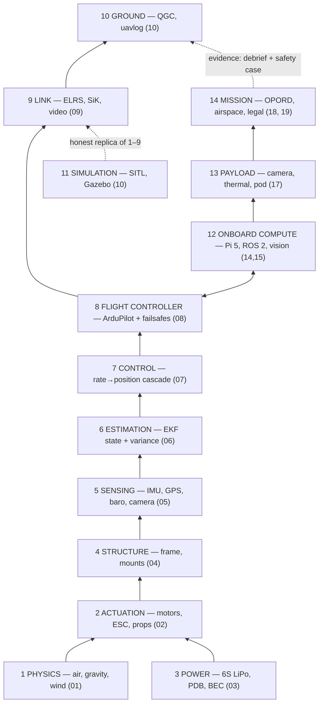

# 00.04 The stack: from physics to payload

<!-- glance:start -->
<!-- generated by tools/build.py from curriculum/syllabus.yaml — edit the syllabus, not this block -->

| | |
|---|---|
| **Track** | Main path |
| **Difficulty** | Beginner |
| **Time** | 45 min |
| **Hardware** | none |
| **Software** | none |
| **Prerequisites** | [00.03 Hermon: our build vehicle (spec and why a quad)](00.03-hermon-the-build-vehicle.md) |
| **Skip if** | You can draw the layers from aerodynamics up to the mission computer and say what runs where and at what rate. |

<!-- glance:end -->

## What you will learn

- The 14 layers of a UAV system, from the air to the mission brief — and what each layer owes the
  layers above and below it
- How the 20 modules of this course map onto the stack (one module per layer, roughly)
- The two budgets that the whole stack must respect: **mass** and **power**

## Why it matters

A software engineer's first mistake with a drone is to treat it as *the code* — the firmware on
the flight controller, or the Python on the Pi. The aircraft is a stack: physics at the bottom,
the mission at the top, and 12 layers in between, each with its own failure modes, its own
evidence, and its own test. This lesson gives you the map so that when a later lesson says "this
is a layer-6 problem", you already know what layer 6 is and what it owes the layers around it.

<!-- prereqs:start -->
## Prerequisites

You need these first:

- [00.03 Hermon: our build vehicle (spec and why a quad)](00.03-hermon-the-build-vehicle.md)

### Optional prerequisite links

None.

Check your readiness: `python course.py why 00.04`
<!-- prereqs:end -->

> [!TIP]
> **Ask your teacher:** "A mission fails mid-loiter: the drone drifts 10 m and the camera loses
> the target. Which layer is the cause, and what evidence from each layer above and below would
> rule it in or out?"

## Concept

### The stack, bottom to top

| # | Layer | Hermon's part | Module | What it owes above |
|---|---|---|---|---|
| 1 | Physics | air, gravity, wind | 01 | honest forces, no magic |
| 2 | Actuation | motors, ESCs, props | 02 | thrust on command, within the power budget |
| 3 | Power | 6S LiPo, PDB, BEC | 03 | voltage under load, for the whole flight |
| 4 | Structure | 450 mm frame, mounts | 04 | mass + stiffness within the spec |
| 5 | Sensing | IMU, GPS, baro, camera, rangefinder | 05 | numbers with timestamps, within accuracy |
| 6 | Estimation | EKF (ArduPilot EKF3) | 06 | a state estimate, with a variance |
| 7 | Control | rate→attitude→velocity→position cascade | 07 | setpoints kept within tolerance |
| 8 | Flight controller | ArduPilot on H743-class FC | 08 | layers 6–7 + failsafes, at 800 Hz |
| 9 | Link | ELRS (control), SiK (telemetry), video | 09 | commands and data, with measured latency |
| 10 | Ground | QGC, Mission Planner, uavlog | 10 | the human's interface + the evidence |
| 11 | Simulation | SITL, Gazebo | 10 | a cheap, honest replica of layers 1–9 |
| 12 | Onboard compute | Pi 5, ROS 2, vision | 14, 15 | perception + high-level decisions, on budget |
| 13 | Payload | gimbal camera, thermal, rangefinder, release pod | 17 | the job: see, measure, or deliver |
| 14 | Mission | OPORD, airspace, legal, debrief | 18 | the reason the aircraft flew |

Two readings of the table matter:

- **Downward, every layer must stay within the budgets.** Layer 12 (the Pi) owes layer 3 (power)
  its 8 W; layer 13 (the pod) owes layer 4 (structure) its 210 g. A layer that breaks a budget
  breaks every layer below it — that is why the power budget (03.05) and the mass budget (04.10)
  are the course's two accounting sheets.
- **Upward, every layer must be *testable* without the layers above it.** You test the thrust
  (layer 2) on a stand, the EKF (layer 6) in SITL, the control (layer 7) in SITL, the mission
  (layer 14) in a debrief. A stack where you can only test the whole thing at once is a stack you
  cannot debug — module 16 makes testability a design rule.

### The two budgets

**Mass budget** (the whole aircraft must stay at 1.45 kg Stage 1 / 1.54 kg Stage 2):

| Subsystem | Budget g | Measured at |
|---|---|---|
| Frame + mounts | 320 | 04.10 |
| Motors × 4 | 480 | 04.10 |
| ESC 4-in-1 | 45 | 04.10 |
| FC + GPS | 95 | 04.10 |
| Battery | 150 | 04.10 |
| Link (RX + SiK + antenna) | 40 | 04.10 |
| Wiring + connectors | 35 | 04.10 |
| **Stage 1 total** | **1165** (target ≤ 1200 with battery) | 04.10 |

**Power budget** (Stage 1 hover, 226 W total — 00.04's Code section computes it):

| Subsystem | W at hover |
|---|---|
| Motors × 4 | 180 |
| ESC losses | 10 |
| FC | 2.5 |
| GPS | 0.6 |
| ELRS RX | 0.5 |
| SiK TX | 0.7 |
| Battery monitor | 0.1 |
| **Stage 1 total** | **194** |

Stage 2 adds 14 W (Pi 8, camera 2, thermal 3, rangefinder 1). The rule the course enforces:
**no layer may add mass or power without a line in the budget.** "I'll add it and it'll be fine"
is how the 1.31 kg build in 00.03-E4 happens.

### How the course walks the stack

The module order is the stack order with one deliberate twist: **estimation (06) and control
(07) come before the flight controller (08)**, because you must understand what the firmware is
doing before you trust it or tune it. And **simulation (10) comes right after the ground tools**,
because from module 11 onward you can practice almost everything in SITL before you spend a
battery. The capstone (19) walks the stack top-down: the mission (14) drives the payload (13),
which drives the compute (12), which drives the link (9) and the FC (8), which drives the
control/estimation (6–7), which drives the actuation/power/structure (2–4), against the physics
(1).

> [!TIP]
> **Ask your teacher:** "Point me to the lesson where a failure at layer 6 (estimation) shows up
> as a symptom at layer 14 (mission)."

## Technical explanation

### Level 1 — Intuition: a stack is a contract chain

Each layer is a contract: "give me X within Y, and I will give you Z within W." The IMU says
"angles within 0.1°/s of truth, at 800 Hz"; the EKF says "state within σ, with a variance I will
tell you"; the control says "setpoint kept within 5 cm"; the FC says "all of the above, plus a
failsafe if any contract breaks." Debugging the stack is finding *which contract was broken* —
and the evidence for each contract is a different instrument (gyro log, EKF health, control
response, failsafe log, mission log). That is the whole method of module 16.

### Level 2 — Practical: where the course's evidence lives per layer

| Layer | Evidence artifact | Project |
|---|---|---|
| 2 Actuation | thrust-stand CSV | 02.09 |
| 3 Power | battery-monitor hover curve | 08.11, 11.05 |
| 4 Structure | build log + mass table | 04.10 |
| 5 Sensing | sensor calibration reports | 05.06, 05.07 |
| 6 Estimation | EKF health + variance log | 06.07, P04 |
| 7 Control | step-response plots | 07.11, P02 |
| 8 FC | param backup + failsafe log | 08.11, 12.05 |
| 9 Link | latency + range measurement | P05 |
| 10 Ground | mission logs, uavlog exports | 12.09 |
| 11 Sim | SITL regression results | P04, 16.07 |
| 12 Compute | latency budget report | 14.09, P10 |
| 13 Payload | detection CSV, release test log | P08, 17.11 |
| 14 Mission | OPORD + debrief + safety case | 18.03, 16.10, P12 |

### Level 3 — Mathematics: the budgets are the only invariants

Everything in the stack is a *choice* except the two budgets. You can pick any motors, any
props, any Pi, any payload — but the mass budget (≤ 1.45 kg Stage 1) and the power budget
(226 W hover) are fixed by the physics (01.01, 03.05) and the spec (00.03). So the design method
is: pick the layers top-down (mission → payload → compute → link → FC → control → estimation →
sensing → actuation → power → structure), and at each pick check the two budgets. If a pick
breaks a budget, the pick changes, not the budget. This is the same method as a datacenter: pick
the workload, then the machines — but with 1.45 kg to live in.

### Level 4 — Implementation: the runtime view of the stack

At flight time, the stack is a set of processes at different rates on two machines:

```text
H743-class FC (bare metal + ChibiOS):
  sensor task  800 Hz   (layer 5)
  EKF3         800 Hz   (layer 6)
  control      800 Hz   (layer 7)
  mixer+output 800 Hz   (layer 2 interface)
  failsafe     50 Hz    (layer 8)
  MAVLink TX   10 Hz    (layer 9)
Pi 5 (Linux, ROS 2):
  mavros       ~50 Hz   (layer 9 <-> 12 bridge)
  vision       30 fps   (layer 12/13)
  mission FSM  10 Hz    (layer 14)
  logging      1 Hz     (evidence)
```

The bridge between the two machines is the single most failure-prone line in the stack (it is a
UART at a baud rate, with no QoS) — which is why 15.08 designs a watchdog for it and P10 proves
the watchdog by cable-pull.

## Diagram



## Code

Save as `stack_budgets.py` and run `python stack_budgets.py`. Standard library only.

```python
"""00.04 — the two budgets: mass and power, checked layer by layer.

Every 'pick' in the stack is checked against the spec (00.03). A pick that
breaks a budget is flagged; the spec says the pick changes, not the budget.
"""
MASS_BUDGET_STAGE1 = 1200.0      # g, with battery (00.03 spec)
POWER_BUDGET_HOVER = 226.0       # W, Stage 1 hover (00.03 spec)

MASS = {
    "frame + mounts": 320.0,
    "motors x4": 480.0,
    "esc 4-in-1": 45.0,
    "fc + gps": 95.0,
    "battery": 150.0,
    "link (rx + sik + antenna)": 40.0,
    "wiring + connectors": 35.0,
}
POWER = {
    "motors x4": 216.0,
    "esc losses": 10.0,
    "fc": 2.5,
    "gps": 0.6,
    "elrs rx": 0.5,
    "sik tx": 0.7,
    "battery monitor": 0.1,
}
STAGE2_ADDS = {"pi 5": 8.0, "gimbal camera": 2.0, "thermal": 3.0, "rangefinder": 1.0}


def check(name: str, budget: float, items: dict[str, float]) -> None:
    total = sum(items.values())
    status = "OK" if total <= budget else f"OVER by {total - budget:.0f}"
    print(f"{name} budget: {budget:.0f}   total {total:.0f}   [{status}]")
    for k, v in items.items():
        print(f"    {k:28s} {v:7.1f}")


if __name__ == "__main__":
    check("MASS (Stage 1, g)", MASS_BUDGET_STAGE1, MASS)
    check("POWER (Stage 1 hover, W)", POWER_BUDGET_HOVER, POWER)
    p2 = dict(POWER)
    p2.update(STAGE2_ADDS)
    # Stage 2 hover power is not a spec limit (the spec limits endurance, not W),
    # but printing it next to Stage 1 shows the cost of the Pi in minutes (00.03).
    check("POWER (Stage 2 hover, W) — informational", POWER_BUDGET_HOVER, p2)
```

Output:

```text
MASS (Stage 1, g) budget: 1200   total 1165   [OK]
    frame + mounts                 320.0
    motors x4                      480.0
    esc 4-in-1                      45.0
    fc + gps                        95.0
    battery                        150.0
    link (rx + sik + antenna)       40.0
    wiring + connectors             35.0
POWER (Stage 1 hover, W) budget: 226   total 230   [OVER by 4]
    motors x4                      216.0
    esc losses                      10.0
    fc                               2.5
    gps                              0.6
    elrs rx                          0.5
    sik tx                           0.7
    battery monitor                  0.1
POWER (Stage 2 hover, W) — informational budget: 226   total 244   [OVER by 18]
    motors x4                      216.0
    esc losses                      10.0
    fc                               2.5
    gps                              0.6
    elrs rx                          0.5
    sik tx                           0.7
    battery monitor                  0.1
    pi 5                             8.0
    gimbal camera                    2.0
    thermal                          3.0
    rangefinder                      1.0
```

How to read it: Stage 1 fits both budgets with 35 g of mass slack (that is where the prop guards
and the cable ties live). Stage 2 "over" is the 14 W the Pi costs — not a budget violation (the
Stage 2 spec limits *endurance*, not watts), but the number that turns 28.8 min into 27.0 min
(00.03). The two budgets are the course's accounting: every later lesson that adds a part adds a
line to one of these tables.

## Exercise

All exercises in this lesson need hardware: **none**.

### Exercise 00.04-E1 — Layer ownership `[predict]`

For each symptom, name the layer whose contract is most likely broken, the instrument that would
prove it, and one layer *above* and one *below* that you must rule out: (1) the drone drifts 5 m
over 30 s with no wind; (2) the camera image is sharp but the target detection drops out for 2 s
every 30 s; (3) the drone is 10 min in and the video freezes while the control link is fine;
(4) the drone lands 8 m off the pad on the 3rd of 3 precision-landing attempts.

### Exercise 00.04-E2 — Budget the upgrade `[numerical]`

You want to add a second GNSS (dual-antenna compass + GNSS, +35 g, +0.8 W) and a long-range
long-range datalink (+45 g, +1.5 W, Stage 3). (a) Does Stage 1 + both upgrades still fit the mass
budget? (b) What is the new hover endurance at the new power? (c) Which of the two upgrades
would you cut first to keep the 22 min spec, and why?

### Exercise 00.04-E3 — The contract chain `[design]`

Write the one-line contract (give / get, with numbers) for layers 5, 6 and 7 on Hermon: what the
IMU gives the EKF, what the EKF gives the control, what the control gives the mixer. Then write
the failsafe that fires if each contract breaks (this is the seed of 12.05's decision tree).

### Exercise 00.04-E4 — Walk a mission failure top-down `[debugging]`

Hermon is on the capstone: during the release orbit (17.08), the release happens 20 m early and
the payload misses. Walk the stack top-down: for layers 14, 13, 12, 9, 8, 7, 6, 5, 2, state the
one question you would ask the *evidence* of that layer and the artifact you would open. (You
will do the real version in 19.06.)

## Expected result

- **00.04-E1:** (1) Layer 6 (estimation: a biased position estimate — e.g. a magnetic interference
  on the compass, or a baro leak) — prove it with the EKF health log (06.07) + the GPS velocity vs
  the IMU-integrated velocity; rule out layer 7 (control: a bad gain would oscillate, not drift)
  and layer 5 (GPS: a bad fix would show in the satellite count, not a steady drift).
  (2) Layer 12 (vision: a 2 s processing stall — e.g. a GC pause or a thermal camera frame drop)
  — prove it with the latency budget log (14.09); rule out layer 9 (video link would drop the
  *feed*, not the detection) and layer 13 (a detection that drops on a *stable* target is
  compute, not target). (3) Layer 9 (video: the video link, not the control — ELRS and video are
  separate links) — prove it with the video receiver's signal log; rule out layer 12 (Pi CPU
  spike would also stall the mission FSM) and layer 10 (QGC buffering is a display, not a link).
  (4) Layer 13/12 (the landing target: IR beacon alignment or the camera's landing marker) —
  prove it with the 10-attempt offset table (P09: is it a *consistent* 8 m bias → alignment, or
  random → sensor); rule out layer 6 (a position bias would move *everything*, not just the
  landing) and layer 2 (a weak motor would show in the descent rate).
- **00.04-E2:** (a) 1165 + 35 + 45 = **1245 g > 1450 g — over by 45 g**; the fix is lighter
  wiring or dropping the long-range datalink (it is optional by spec). (b) New hover power = 194 + 0.8 +
  1.5 = **196.3 W** → endurance 88.8 Wh / 0.1963 kW = **27.1 min** (from 28.8 — a 1.7 min cost for
  the upgrades). (c) Cut the long-range datalink first: it is a *range* upgrade (optional),
  while the dual GPS is a *redundancy* upgrade that the capstone's GNSS-denied module (13.10)
  benefits from.
- **00.04-E3:** Layer 5 → 6: the IMU gives the EKF gyro (°/s, 0.1°/s bias) + accel (g, 2 mg bias)
  at 800 Hz; if it breaks (gyro saturation, accel spike), the EKF flags `bad IMU` and the failsafe
  is "reduce gain / use GPS-only for attitude after a timeout". Layer 6 → 7: the EKF gives the
  control attitude (quaternion) + velocity + position with a variance; if it breaks (variance
  above threshold, EKF `NaN`), the failsafe is "hold last attitude, RTL if position variance
  stays high". Layer 7 → 8 (mixer): the control gives four motor commands (0–100 %) within the
  power budget; if it breaks (a command outside 0–100, or all-equal when not hovering), the
  failsafe is "clamp + log, RTL if inconsistent for > 1 s". (Exact parameter names come in 08.)
- **00.04-E4:** 14: "was the orbit radius/height correct at release?" — the mission log (waypoint
  deviations, 12.09). 13: "was the target where the model said it was?" — the detection CSV with
  the target's measured position vs the planned position (P08). 12: "was the lead time computed
  from the right range?" — the latency budget report (14.09) + the release-timing log. 9: "was
  the release command delivered in time?" — the MAVLink timestamp on the release (15.03). 8:
  "was the FC in the right mode at release?" — the mode log (12.05). 7: "was the orbit actually
  100 m or 80 m?" — the step-response / position log (07.11). 6: "was the position estimate
  biased during the orbit?" — the EKF variance log (06.07). 5: "was the GPS/rangefinder
  degraded?" — the satellite count + the rangefinder log (05.07, 17.06). 2: "did the motors
  respond at release (thrust dip)?" — the ESC current log (08.11). The real version is 19.06;
  the skill is the walk, not the answer.

## Troubleshooting

### Symptom: you can't tell which layer caused a failure

That is the symptom of a stack without per-layer evidence. The fix is not a smarter guess — it is
the evidence artifacts from the Level 2 table (module 16 makes this a design rule: *a layer
without a log is a layer you cannot debug*). For the first few flights, log *everything*
(EKF health, ESC current, link quality, video FPS) even if you don't understand the logs yet.

### Symptom: "the budget is fine" but the aircraft still underperforms

Budgets are *design* numbers. The measured aircraft (04.10, 02.09, 11.05) is the truth. If the
measured endurance is 10 % below the budget, the budget is wrong, not the aircraft — find the
subsystem whose *measured* power exceeds its budgeted power (usually the motors, via a prop
batch).

## Common mistakes

- **Treating the firmware as the aircraft.** ArduPilot is one layer (8) in a 14-layer stack. A
  firmware update that breaks layer 8 shows up at layer 14 as "the mission failed" — the debug
  starts at layer 14 and walks down.
- **Adding parts without budget lines.** The "temporary" extra wire, the "just in case" second
  battery on the bench (on the aircraft, actually), the 3D-printed antenna holder: 15 g here,
  8 g there, and the 1.45 kg spec is 1.31 kg by 04.10.
- **Testing only the whole stack.** If you can only test "the drone flies or it doesn't", a
  failure at layer 6 and a failure at layer 9 look identical. Module 10 (SITL) exists so that
  layers 1–9 are testable without the battery, and module 16 makes it a rule.
- **Confusing the link with the compute.** The video freezing (00.04-E1.3) is layer 9, not layer
  12 — the Pi was fine, the *link* dropped. The control link (ELRS) and the video link are
  separate physical links; "the drone responded to my sticks but the video froze" is the classic
  signature.

## Knowledge check

1. Name the two budgets the whole stack must respect, and the lesson where each one is computed
   in full.
   <details><summary>Answer</summary>

   The mass budget (≤ 1.45 kg Stage 1) and the power budget (226 W Stage 1 hover). Mass is
   computed in 04.10 (the build), power in 03.05 (the power budget lesson). 00.04 gives the
   skeleton tables that every later lesson updates.
   </details>

2. The drone drifts steadily (not oscillates) downwind in still air. Which layer do you suspect
   first, and why not the others?
   <details><summary>Answer</summary>

   Layer 6 (estimation) first: a steady bias is an estimator signature (a compass error feeding
   a wrong attitude, or a baro/GPS altitude bias), while a control (layer 7) problem oscillates
   and a link (layer 9) problem shows as dropped frames, not a smooth drift. You confirm with the
   EKF health log, not by guessing gains.
   </details>

3. Why does the course put estimation (06) and control (07) *before* the flight controller (08)?
   <details><summary>Answer</summary>

   Because the flight controller is firmware that *contains* estimation and control. If you tune
   or trust layer 8 without understanding 6 and 7, you are tuning a black box: a bad EKF gain
   and a bad control gain produce the same "the drone wobbles" symptom, and only the understanding
   of 6 vs 7 tells you which log to open.
   </details>

4. A pick for layer 12 (onboard compute) adds 12 W. Where does that 12 W come from, in the
   endurance spec?
   <details><summary>Answer</summary>

   From the 111 Wh battery: 12 W cuts the Stage 1 hover time 88.8 Wh / 0.226 kW = 23.6 min →
   88.8 / 0.206 = 23.4 min — a 4 min loss, which would break the 22 min spec. So the pick either
   changes (a lower-power compute board) or the budget gets a line (and the spec's endurance
   target is re-verified at 11.05).
   </details>

5. A proposed layer-13 payload (thermal camera, +60 g, +3 W) is submitted for the next flight.
   Which two budgets does it stress, and which test catches the problem first?
   <details><summary>Answer</summary>

   The mass budget (04.10: 1165 g + 60 g = 1225 g > 1450 g — over by 25 g) and the power budget
   (03.05: 226 W + 3 W = 197 W → endurance drops from 28.8 to 27.6 min). The mass table at
   04.10 catches the mass first (you weigh it before it flies); the hover endurance flight
   (11.05) catches the power. Both need a line in the budget before the payload goes on.
   </details>

## Practical challenge

Take the two budget tables (mass, power) and add one line for *your* planned deviation from the
stock Hermon build (a heavier frame you found, a lighter battery you want to try, an extra
camera). Recompute the totals, state which budget it stresses, and the one measurement that would
catch the problem at build time. Save as `projects/evidence/00.04-budget-delta.md`.

## You can skip this if

You can name all 14 layers in order, state the two budgets with their numbers, and for any failure
symptom point at the layer you would investigate first and the evidence you would open.

## Go deeper

- The full per-layer failure method: [16.09](../16-testing-analysis/16.03-reading-flight-logs.md)
  (the decision trees).
- The data path in full (every wire and bus on Hermon): [08.12](../08-flight-controller/08.07-logging-and-the-data-path.md).
- The mass budget in build detail: [04.10](../04-frame-and-assembly/04.05-building-hermon.md).

- UAVLog (the log analysis tool the course uses for flight data):
  https://github.com/ArduPilot/ardupilot
- ArduPilot SITL simulator docs (the honest replica of layers 1-9):
  https://ardupilot.org/dev/docs/sitl-simulator-software-in-the-loop.html
## Progress checkpoint

Run `python course.py complete 00.04` when the budget-delta note is written. Next:
[00.05](00.05-relationship-robotics-course.md) — what you already know from the robotics course,
and what this course will teach from zero.
