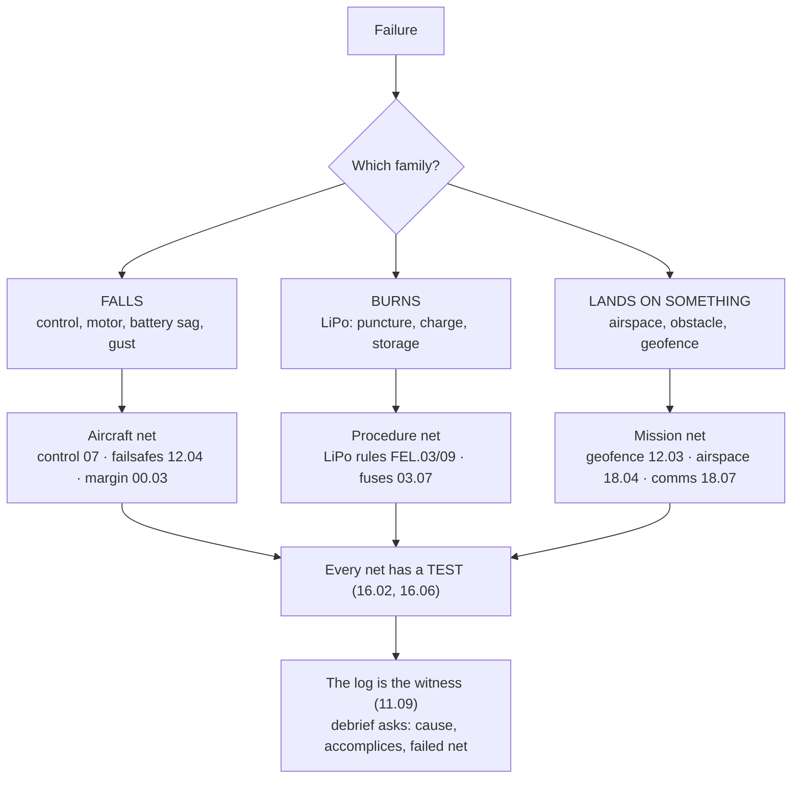

# 00.06 Safety mindset: flying is different

<!-- glance:start -->
<!-- generated by tools/build.py from curriculum/syllabus.yaml — edit the syllabus, not this block -->

| | |
|---|---|
| **Track** | Main path |
| **Difficulty** | Beginner |
| **Time** | 45 min |
| **Hardware** | none |
| **Software** | none |
| **Prerequisites** | [00.05 Relationship to the robotics course: assumed vs taught](00.05-relationship-robotics-course.md) |
| **Skip if** | You can name the three things that can kill you on a quad bench (props, LiPo, mains) and the rule for each. |

<!-- glance:end -->

## What you will learn

- The three ways a flying machine fails that software does not: it falls, it burns, it lands on
  something
- The course's safety rules, and the one rule that overrides all the others
- How to run a pre-flight check that is a *check* and not a ritual
- The evidence habit: every safety decision is logged, because the debrief (18.07) will ask

## Why it matters

A software bug costs an afternoon. A drone crash costs a motor ($105), a battery ($210), a
weekend, and — if it lands on a pedestrian in the city — a lawsuit. The FAA job multiplies
the stakes: the aircraft is over someone else's airspace, carrying a sensor or a 250 g payload.
This lesson installs the mindset before you ever spin a motor, because a safety mindset installed
*after* the first crash is a post-mortem, not a habit.

<!-- prereqs:start -->
## Prerequisites

You need these first:

- [00.05 Relationship to the robotics course: assumed vs taught](00.05-relationship-robotics-course.md)

### Optional prerequisite links

None.

Check your readiness: `python course.py why 00.06`
<!-- prereqs:end -->

> [!TIP]
> **Ask your teacher:** "Name a crash you have seen (yours or a friend's). Walk me through the
> three layers where the safety net was supposed to catch it and didn't."

## Concept

### The three failure families

A flying machine fails in one of three ways, and each needs its own safety net:

1. **It falls.** The aircraft loses the fight with gravity: a control failure, a motor out, a
   battery sag, a gust, a pilot error. The safety net is the *aircraft's* net: the control loop
   (07), the failsafes (12.04–12.05), the thrust margin (00.03). A ground robot that fails just
   stops; a drone that fails is in the air, falling, with a battery of energy to spend on the
   fall.
2. **It burns.** LiPo chemistry: a punctured cell, a charger left unattended, a battery stored at
   4.2 V/cell in a 40° garage. The safety net is *procedure*: the LiPo rules (FEL.03, FEL.09) —
   charge on a fire-safe surface, never store full, carry in a LiPo bag. This is the family that
   kills the aircraft while it is on the bench, which makes it the least "aviation-feeling" and
   the most dangerous.
3. **It lands on something.** The aircraft is fine and the world is not: a person under the
   flight path, a power line at the loiter altitude, a tree the geofence doesn't know about. The
   safety net is the *mission's* net: the pre-flight (airspace, weather, the area), the geofence
   (12.03), the comms discipline (18.07).

A crash is usually one family with the others as accomplices: the battery sags (1), the pilot
chases the altitude instead of the geofence (3), and the aircraft lands on the neighbor's roof
(3) — with a punctured cell from the impact (2). The mindset is to ask, for every incident:
*which family was the cause, which were the accomplices, and which safety net was supposed to
catch it?*

### The rules

The course's safety rules, in the order they are applied:

1. **Props off until you mean it.** Until the motors are armed and you have called "props on",
   the aircraft is a bench part. This is the rule that prevents 90 % of bench crashes.
2. **The battery is a bomb until it is not.** LiPos are charged on a fire-safe surface, in
   sight, with a bag ready; they are stored at ~3.8 V/cell, never at 4.2. (FEL.03, FEL.09.)
3. **Fly within the measured envelope, not the datasheet one.** The 22 min, the 1,369 g, the 3.78 : 1
   are *measured* (00.03) — until they are measured, the envelope is the simulator's.
4. **The geofence is smaller than the sky you think you have.** Set the fence to the area you
   have *checked* (airspace, obstacles, the neighbor's complaints tolerance), not to the maximum
   the radio can reach.
5. **One new thing per flight.** A new battery *or* a new prop *or* a new firmware — not all
   three. When it crashes, you must be able to say which one did it.
6. **The abort is part of the mission.** A mission that cannot be aborted is not a mission, it is
   a prayer. The abort criteria are written before takeoff (12.05's failsafe tree is the general
   form).
7. **The log is the witness.** Every safety decision (the gust you flew in, the battery you
   skipped, the fence you enlarged) goes in the log, because the debrief will ask and your memory
   will have decided to forgive you.

**The one rule that overrides all the others: when in doubt, the aircraft is on the ground.**
A grounded aircraft is a problem with a solution. A flying aircraft in doubt is an insurance
claim with a witness.

### Pre-flight is a check, not a ritual

A ritual is performed the same way every time, regardless of conditions. A check is *adaptive*:
the same list, but the conditions decide what you look at. The course's pre-flight list
(11.01 formalizes it) is short and the *reading* is long:

- **The machine:** mass (a new part?), props (cracks, balance), battery (swollen? sags?),
  link (latency, failsafe test), firmware (the one you tested in SITL).
- **The place:** airspace (the FAA rules, 18.04/18.05), obstacles (trees, wires, the building
  that is 3 m taller than the fence), weather (wind, temperature — the LiPo hates cold and heat).
- **The mission:** the abort criteria, the RTL altitude, the payload state (armed? safe?).
- **You:** sleep, coffee, the phone you will *not* be answering, the 20-second "what could go
  wrong" walk through the whole mission.

The evidence of a pre-flight is the log entry: date, conditions, the one new thing (rule 5), the
abort criteria. Ten minutes before takeoff, the log entry exists.

> [!TIP]
> **Ask your teacher:** "Give me a pre-flight item you skipped once. What did it cost, and which
> rule does it belong to?"

## Technical explanation

### Level 1 — Intuition: safety is a budget, like mass and power

The aircraft has three budgets: mass, power, and *attention*. Mass and power are accounted in
00.04; attention is accounted in the pre-flight and the log. A crash is a budget overrun in
attention: you spent attention on the new firmware and not on the wind. The rules above are the
accounting lines — rule 5 (one new thing) is the line item that keeps the attention budget from
being spent twice.

### Level 2 — Practical: the safety net per failure family

| Family | Net on the aircraft | Net in the mission | Lesson |
|---|---|---|---|
| Falls | control loop, failsafes, thrust margin | abort criteria, RTL altitude | 07, 12.04–12.05, 00.03 |
| Burns | LiPo procedure, fuses, PDB | charge location, storage rules | FEL.03, FEL.06–07, 03.07 |
| Lands on something | geofence, precision landing | airspace check, the area, comms | 12.03, 12.06, 18.04 |

The design rule (16.02): **every net has a test.** The failsafe tree is tested by injection
(16.06), the geofence by a fence-breach flight (12.03), the LiPo procedure by the storage habit
(FEL.09). A net you have never tested is a rumor.

### Level 3 — Mathematics: the margin arithmetic

Safety is margin accounting. The thrust margin (00.03): hover uses 26 % of available thrust → 74 % reserve for
gust/sag/tilt. The energy margin: 88.8 Wh usable for a 31.8 Wh mission → 2.8× reserve. The
attention margin: one new thing per flight → the attention budget is spent on *one* unknown.
A crash happens when a margin is *consumed twice*: the gust eats the thrust margin *and* the
pilot eats the attention margin (chasing altitude instead of the fence). The pre-flight's job is
to count the margins *before* takeoff and refuse the flight if any margin is already spent.

### Level 4 — Implementation: the log as a data structure

The flight log is a table with one row per flight:

```text
date | conditions (wind, temp) | one new thing | abort criteria | events | margin notes | debrief
```

The debrief (18.07, FOP.07) reads the table and asks: which family, which accomplices, which net
failed? The table is the witness — your memory is a hostile witness that testifies in its own
favor. Module 11.09 formalizes the log; the format above is the minimum that makes the debrief
possible.

## Diagram



## Code

Save as `safety_margins.py` and run `python safety_margins.py`. Standard library only.

```python
"""00.06 — the margin arithmetic: a flight is refused if any margin is already spent.

The pre-flight computes the margins and applies the course's rules. The output
is a GO/NO-GO with the reasons — the same decision the pilot makes in 30 seconds,
but written down.
"""
WIND_LIMIT = 4.0              # m/s, Hermon's measured wind limit (11.04)
THRUST_MARGIN_MIN = 0.20      # 20% reserve (01.03: the 2:1 floor)
ENERGY_RESERVE_MIN = 1.5      # 1.5x mission energy (03.05)
BATTERY_CYCLES_WARN = 80      # a tired battery sags more (FEL.03)


def preflight(wind_ms: float, hover_throttle: float, mission_wh: float, usable_wh: float,
              battery_cycles: int, new_things: list[str], fence_checked: bool) -> tuple[bool, list[str]]:
    reasons = []
    if wind_ms > WIND_LIMIT:
        reasons.append(f"wind {wind_ms:.1f} m/s > limit {WIND_LIMIT:.1f} (11.04)")
    if 1.0 - hover_throttle < THRUST_MARGIN_MIN:
        reasons.append(f"thrust margin {1.0 - hover_throttle:.0%} < {THRUST_MARGIN_MIN:.0%} (00.03)")
    if usable_wh / mission_wh < ENERGY_RESERVE_MIN:
        reasons.append(f"energy reserve {usable_wh / mission_wh:.1f}x < {ENERGY_RESERVE_MIN}x (03.05)")
    if battery_cycles > BATTERY_CYCLES_WARN:
        reasons.append(f"battery {battery_cycles} cycles > {BATTERY_CYCLES_WARN} — expect sag (FEL.03)")
    if len(new_things) > 1:
        reasons.append(f"{len(new_things)} new things: {new_things} — rule 5 (one per flight)")
    if not fence_checked:
        reasons.append("geofence not checked against the area (12.03, 18.04)")
    return (len(reasons) == 0, reasons)


if __name__ == "__main__":
    cases = [
        ("calm, fresh, one new thing", dict(wind_ms=1.0, hover_throttle=0.74, mission_wh=32.0,
                                            usable_wh=88.8, battery_cycles=12,
                                            new_things=["new props"], fence_checked=True)),
        ("gusty day",                  dict(wind_ms=5.2, hover_throttle=0.74, mission_wh=32.0,
                                            usable_wh=88.8, battery_cycles=12,
                                            new_things=[], fence_checked=True)),
        ("tired battery + two new things", dict(wind_ms=1.0, hover_throttle=0.86, mission_wh=32.0,
                                            usable_wh=88.8, battery_cycles=95,
                                            new_things=["new firmware", "new battery"],
                                            fence_checked=True)),
        ("big fence, unchecked",       dict(wind_ms=1.0, hover_throttle=0.74, mission_wh=32.0,
                                            usable_wh=88.8, battery_cycles=12,
                                            new_things=[], fence_checked=False)),
    ]
    for name, kw in cases:
        go, reasons = preflight(**kw)
        print(f"[{'GO' if go else 'NO-GO'}] {name}")
        for r in reasons:
            print(f"    - {r}")
```

Output:

```text
[GO] calm, fresh, one new thing
[NO-GO] gusty day
    - wind 5.2 m/s > limit 4.0 (11.04)
[NO-GO] tired battery + two new things
    - thrust margin 14% < 20% (00.03)
    - battery 95 cycles > 80 — expect sag (FEL.03)
    - 2 new things: ['new firmware', 'new battery'] — rule 5 (one per flight)
[NO-GO] big fence, unchecked
    - geofence not checked against the area (12.03, 18.04)
```

How to read it: the function is the pre-flight. A GO is not "the numbers are in the green" — it is
"*every* margin has reserve *and* the one new thing is identified *and* the fence is checked."
The third case is the classic crash: the tired battery eats the thrust margin, the two new things
eat the attention margin, and the aircraft is in the air with both budgets spent. The log entry
for that flight would have said NO-GO at the bench — the aircraft would have been a problem with
a solution, not an insurance claim.

## Exercise

All exercises in this lesson need hardware: **none**.

### Exercise 00.06-E1 — Classify the crashes `[predict]`

For each crash, name the primary family, the accomplices, and the net that should have caught it:
(1) a quad lands on a picnic table — the pilot was watching a text message;
(2) a bench quad smokes after a charge — the cell was dented by a dropped tool;
(3) a quad drifts into a tree at the fence — the fence was set to the radio's maximum, not the
park's size; (4) a quad sinks mid-mission — the battery was at 40 % at takeoff (a "quick flight").

### Exercise 00.06-E2 — The pre-flight, in 60 seconds `[numerical]`

Extend `safety_margins.py` with a `preflight_quick()` that takes only (wind, hover throttle,
battery cycles) and returns GO/NO-GO with the single worst margin. Run it for: wind 3.0,
throttle 0.74, cycles 12; wind 4.5, throttle 0.74, cycles 12; wind 3.0, throttle 0.86, cycles 95.
Which one is the "closest to the edge" GO, and what is its margin?

### Exercise 00.06-E3 — Write your abort criteria `[design]`

Write the abort criteria for Hermon's first flight (11.01): the five conditions that send the
aircraft down *now* (not "on the way back"). Each criterion must be measurable (a number or a
visible fact), not a feeling ("it looks off").

### Exercise 00.06-E4 — The log entry `[coding]`

Write the first log entry for a flight that *didn't happen*: a NO-GO you would have called with
`safety_margins.py` (use the "tired battery + two new things" case). The entry must contain: date,
conditions, the one new thing (or "n/a"), the abort criteria, the NO-GO reasons, and the
one-sentence debrief ("what did this teach me"). Format it as a markdown table row.

## Expected result

- **00.06-E1:** (1) Lands-on-something, accomplice: attention (the phone); net: the mission's
  net (a "head-down" rule or a spotter for first flights) + rule 7 (the log would have noted
  "pilot distracted"). (2) Burns, accomplice: the dent (a storage/inspection gap); net: the
  LiPo procedure (FEL.03: inspect before charge) + a fire-safe charge surface. (3)
  Lands-on-something, accomplice: the fence set to the *link* maximum instead of the *area*;
  net: 12.03's rule — the fence is the area you checked, not the sky you can reach. (4) Falls,
  accomplice: the "quick flight" that spent the energy margin before takeoff; net: the energy
  reserve check (03.05) — 40 % at takeoff is a margin already spent.
- **00.06-E2:** Case 1: GO, margins — wind 3.0/4.0 (60 % used), thrust 26 % (OK), battery fresh.
  Case 2: NO-GO (wind 4.5 > 4.0). Case 3: NO-GO (thrust margin 14 % < 20 %, battery 95 cycles).
  The "closest to the edge GO" is case 1, with the tightest margin at wind (3.0 of 4.0 m/s = 25 %
  reserve to the limit) — the answer should note that wind is the *live* margin: it can change in
  the air, unlike the battery.
- **00.06-E3:** A reasonable set (all measurable): (1) altitude error > 1 m from target for > 5 s
  (the control is losing the fight); (2) battery voltage < 21.0 V (6S, 3.5 V/cell) with the
  mission incomplete; (3) link quality below the failsafe threshold for > 2 s (the link is going);
  (4) any motor current above 90 % of max for > 5 s (a motor is working too hard); (5) the
  aircraft is outside the fence for > 3 s (the fence is not holding). The skill is *measurable*:
  "it feels off" is not a criterion, "altitude error > 1 m for > 5 s" is.
- **00.06-E4:** A reasonable row:
  `| 2026-10-05 | wind 1.0 m/s, 28 C, calm | n/a (two new things: firmware, battery) | E1–E5 (11.01) | NO-GO: thrust margin 14% < 20%, battery 95 cycles, 2 new things (rule 5) | A tired battery and two unknowns are the same as one crash with three causes — fly it after the firmware settles and the battery is rested |`.
  Full credit if the debrief names the *lesson* (the two unknowns), not just the numbers.

## Troubleshooting

### Symptom: the pre-flight says GO but your gut says no

The gut is the margin you haven't written down. Write it down *now* (in the log, as a margin
note), fly if the written margins still say GO, and next time that margin is a line in
`safety_margins.py`. A gut that is never written down is a margin that is never accounted.

### Symptom: the rules feel like they will slow every flight down

They do, at first — that is the point. A pre-flight is 10 minutes against a crash that costs a
weekend. After 20 flights the list is fast and the *reading* is fast too; the time cost goes to
~3 minutes and the crashes go to near zero. The FAA version of this is the "15-second
check" — the same list, trained to a reflex.

## Common mistakes

- **Doing the ritual, not the check.** Running the same 10 items in the same 30 seconds
  regardless of conditions is a ritual. The wind was 2 m/s last time and is 6 m/s now — the
  *reading* of "weather" changes, the list doesn't.
- **Skipping the log because the flight was "boring".** The boring flights are where the habits
  form; the exciting ones are where the habits are tested. A log with only the exciting flights
  is a highlight reel, not evidence.
- **Letting the geofence be the sky.** The fence is set to the radio's range (5 km) and the
  aircraft is over the neighbor's pool at 800 m. The fence is the *area you checked* (18.04),
  not the *area you can reach*.
- **Testing three things at once.** The new firmware *and* the new battery *and* the new props —
  when it crashes, you have three suspects and no evidence. Rule 5 is the only rule in this
  lesson that is a pure time-saver: it buys you a *diagnosable* crash.

## Knowledge check

1. Name the three failure families and one safety net for each.
   <details><summary>Answer</summary>

   Falls → the control loop (07) + failsafes (12.04). Burns → the LiPo procedure (FEL.03/09) +
   fuses (03.07). Lands-on-something → the geofence (12.03) + the airspace check (18.04).
   </details>

2. What is the one rule that overrides all the others, and why is it true?
   <details><summary>Answer</summary>

   "When in doubt, the aircraft is on the ground." Because a grounded aircraft is a problem with
   a solution (you can measure it, fix it, re-test it), while a flying aircraft in doubt is a
   problem with a *witness* — the cost of being wrong is paid by the ground, the battery, and
   possibly a person.
   </details>

3. Why must the abort criteria be measurable, not felt?
   <details><summary>Answer</summary>

   Because the abort decision is made in the air, under time pressure, by a human whose memory
   will later forgive them. A measurable criterion ("altitude error > 1 m for > 5 s") can be
   checked in 2 seconds and defended in the debrief; a feeling ("it looks off") can be argued
   with for 20 seconds and lost.
   </details>

4. A friend says "the log is bureaucracy, my memory is fine." Give them the one counter-argument
   from this lesson.
   <details><summary>Answer</summary>

   The log is the *witness* and memory is a hostile witness that testifies in its own favor: the
   debrief (18.07) asks "which net failed, and why did you fly in that wind?" — the log answers
   with the entry you wrote *before* the flight, when you were still honest.
   </details>

5. You are 15 minutes from takeoff. The pre-flight said GO at 10 minutes with wind 2 m/s; the
   wind is now 3.5 m/s (limit 4). What do you do, and which rule governs the decision?
   <details><summary>Answer</summary>

   Re-run the *reading* of the pre-flight (the list is the same, the conditions changed): wind
   is the live margin, and 3.5 of 4.0 m/s leaves 12.5 % reserve — still a GO if everything else
   is unchanged, but you write the change into the log entry (rule 7) and you re-check the
   abort criteria (a higher wind changes the drift the aircraft can correct). The governing
   rule is the override: if the gust pattern makes 4.0 a real possibility in the next 20
   minutes, "when in doubt, the aircraft is on the ground".
   </details>

## Practical challenge

Run `safety_margins.py` with *this week's* real conditions (check the weather for your flying
area, your battery's real cycle count, the real hover throttle from your last SITL hover). Write
the GO/NO-GO and the reasons as a log entry, even though the flight hasn't happened yet — this is
the habit: the decision is written *before* the flight, not reconstructed after. Save as
`projects/evidence/00.06-first-preflight.md`.

## You can skip this if

You can name the three failure families with their nets, state the seven rules (especially rule 5
and the overriding rule), and write five measurable abort criteria for a first flight without
notes.

## Go deeper

- The formal pre-flight and first-flight procedure: [11.01](../11-first-flights/11.01-first-flight.md)
- The failsafe decision tree (the general form of the abort criteria): [12.05](../12-autonomous-flight/12.05-auto-takeoff-land-precision.md)
- The LiPo rules in full: [FEL.03](../optional-foundations/drone-electronics-power/FEL.03-lipo-deep-dive.md),
  [FEL.09](../optional-foundations/drone-electronics-power/FEL.03-lipo-deep-dive.md)
- The debrief method: [FOP.07](../optional-foundations/civil-ops/FOP.03-debrief-and-aar.md)

- ArduPilot battery configuration docs (the firmware side of the LiPo rules): https://ardupilot.org/copter/docs/common-powermodule-landingpage.html
- UAVLog (the evidence tool for the log-is-the-witness rule):
  https://github.com/ArduPilot/ardupilot
## Progress checkpoint

Run `python course.py complete 00.06` when the first pre-flight log entry is written. Next:
[00.07](00.07-how-to-use-course.md) — the course tooling: `course.py`, statuses, skip rules,
and how to actually use the site.
