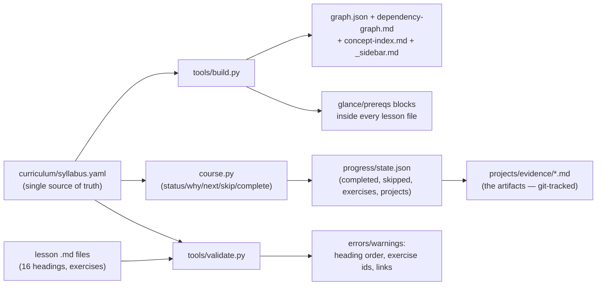

# 00.07 How to use this course (course.py, statuses, skip rules)

<!-- glance:start -->
<!-- generated by tools/build.py from curriculum/syllabus.yaml — edit the syllabus, not this block -->

| | |
|---|---|
| **Track** | Main path |
| **Difficulty** | Beginner |
| **Time** | 45 min |
| **Hardware** | none |
| **Software** | python |
| **Prerequisites** | [00.06 Safety mindset: flying is different](00.06-safety-mindset.md) |
| **Skip if** | You can run course.py status/next/why and explain every status it can show. |

<!-- glance:end -->

## What you will learn

- The full `course.py` command set: status, why, complete, skip, unskip, reset, list, next
- The state model: lessons, exercises, projects, skills — and what "complete" means for each
- The skip rule in practice: when a skip is a skip, when it is a debt
- How the docsify site, the syllabus, and the progress tool stay in sync (build.py)

## Why it matters

A course you cannot *track* is a pile of markdown. `course.py` is the course's memory: it knows
what you have done, what you can do next, and what you skipped (and why). The FAA version of
this is the training record — the job asks "show me your record", not "tell me about your
record". This lesson makes the tooling second nature so you never lose a week to "where was I?"

<!-- prereqs:start -->
## Prerequisites

You need these first:

- [00.06 Safety mindset: flying is different](00.06-safety-mindset.md)

### Optional prerequisite links

None.

Check your readiness: `python course.py why 00.07`
<!-- prereqs:end -->

> [!TIP]
> **Ask your teacher:** "You skipped three lessons in module 03 and are now at module 07. Run the
> commands that tell you whether those skips are safe, and what they cost."

## Concept

### The tool

`course.py` is a single-file, standard-library-only Python program at the repo root. It reads
`curriculum/syllabus.yaml` (the single source of truth for the course) and keeps your state in
`progress/state.json`. On Windows you run it with `py course.py ...`; anywhere else
`python course.py ...`.

The command set:

| Command | What it does | When you use it |
|---|---|---|
| `py course.py status` | Overall progress: lessons done by time %, projects done, the next lesson | Every session start |
| `py course.py next` | The next lesson you can start (all `requires` met) | After `status` |
| `py course.py why <id>` | Why you can (or can't) start a lesson: which prerequisites are missing | Before any lesson, and when the graph surprises you |
| `py course.py complete <id>` | Mark a lesson (or exercise/project) complete | At the Progress checkpoint of a lesson |
| `py course.py skip <id> --reason "..."` | Mark a lesson skipped, with a reason | At a lesson's "You can skip this if" — *with the reason* |
| `py course.py unskip <id>` | Undo a skip | When a later lesson proves the skip was a debt |
| `py course.py list [module]` | List lessons in a module (or all) with their state | When planning a week |
| `py course.py reset [--yes]` | Clear all state (with confirmation) | A new start, or a corrupted state |

The state model has four kinds of things, all in the syllabus:

- **Lessons** — 208 main + 39 foundations. Each has `requires` (hard prerequisites) and
  `optional` (soft, foundations).
- **Exercises** — embedded in lessons, ids like `00.07-E1`. Completing a lesson's exercises is
  how the lesson's knowledge check gets done.
- **Projects** — P01–P12, with their own `requires` and hardware gates.
- **Skills** — the five operator skills from 00.02, tracked as the projects that evidence them
  complete.

### Complete vs skip: the two honest verbs

`complete` means: the knowledge check is answered, the exercises are done (or the practical
challenge is written), and you would pass a stranger's re-ask of the lesson. `skip` means: the
"You can skip this if" statement is true *for you*, and you wrote the reason. A skip without a
reason is a guess; a skip with a reason is a *debt with an address* — when a later lesson fails
because of it, the address tells you exactly which skip to unskip.

The rule that keeps skips honest: **a skip is a skip only while its downstream lessons pass.**
If you skip 03.09 (LiPo deep dive) because "I know batteries" and then 11.05 (battery discipline)
catches you out, the unskip is not a setback — it is the debt coming due, at the cheapest
possible moment.

### How the site, the syllabus, and the tool stay in sync

`curriculum/syllabus.yaml` is the single source of truth. `tools/build.py` (PyYAML) reads it and
generates: `curriculum/graph.json` (the machine-readable graph), `dependency-graph.md`,
`concept-index.md`, `_sidebar.md` (the docsify navigation), the module READMEs, and the glance/
prereqs blocks in every lesson file. `tools/validate.py` checks that the lesson files match the
syllabus (headings, exercise ids, links). So: **edit the syllabus, run build.py, the site and the
tool update.** If a lesson file and the syllabus disagree, validate.py says which one is wrong.

> [!TIP]
> **Ask your teacher:** "You add a new lesson to the syllabus. Which files change, and in what
> order do you run the tools?"

## Technical explanation

### Level 1 — Intuition: the syllabus is a graph, the tool is a topological sort

The syllabus is a directed acyclic graph (DAG): lessons are nodes, `requires` are edges. "What
can I do next?" is a topological question: the ready set is the nodes whose in-edges are all
complete (or skipped). `course.py next` computes that set and picks the one the course order
suggests. The DAG also means: no cycles (a lesson cannot require itself, directly or through
other lessons) — `validate.py` checks that, because a cycle is a course you can never finish.

### Level 2 — Practical: the session ritual

The session ritual is three commands:

```text
py course.py status      # where am I? (%, the next lesson)
py course.py next        # what do I do now?
py course.py why <id>    # (if next surprises me) what am I missing?
```

At the end of a session: `py course.py complete <id>` for each lesson finished (with the
exercises done), and a git commit of your evidence files (the course is crash-resilient because
the *evidence* is in git, not just the state). The evidence files (`projects/evidence/...`) are
the artifacts; `state.json` is the index. You can lose `state.json` and rebuild your record from
the evidence — you cannot lose the evidence and rebuild the record.

### Level 3 — Mathematics: the progress number

`status` reports progress **by time**, not by count: a 120-min capstone lesson counts 4× a 30-min
orientation lesson. The formula is

$$p = \frac{\sum_{l \in \text{done}} \text{time}(l)}{\sum_{l \in \text{main}} \text{time}(l)}$$

over the 208 main lessons (342 h). Count-based progress ("10 of 208 lessons") lies: 10 early
orientation lessons is 3 % of the work by time, not 5 %. The by-time number is the honest one,
and it is the number you compare against the 342 h plan in 00.02.

### Level 4 — Implementation: the state file

`progress/state.json` is a JSON object:

```json
{
  "completed": {"00.01": "2026-10-05", "00.02": "2026-10-05"},
  "skipped":   {"FA.07": {"reason": "units are second nature", "date": "2026-10-06"}},
  "exercises": {"00.01-E1": "2026-10-05"},
  "projects":  {}
}
```

The dates are the evidence trail: a `completed` without a date is a claim, with a date it is a
record. `reset` clears the object (not the evidence files — the evidence survives a reset, which
is deliberate: a reset is "start the course again", not "lose my record").

## Diagram



## Code

Save as `use_course.py` and run `python use_course.py`. Standard library only.

```python
"""00.07 — the session ritual, scripted: status, next, why, and a dry-run of a skip.

Run it from the repo root:  python use_course.py
It shells out to course.py so you see the real tool's output.
"""
import subprocess
import sys


def run(*args: str) -> str:
    cmd = [sys.executable, "course.py", *args]
    r = subprocess.run(cmd, capture_output=True, text=True)
    return (r.stdout + r.stderr).strip()


if __name__ == "__main__":
    print("=== status ===")
    print(run("status"))
    print("\n=== next ===")
    print(run("next"))
    print("\n=== why 01.01 (the first physics lesson) ===")
    print(run("why", "01.01"))
    print("\n=== dry run: what a skip looks like (FA.07, units) ===")
    print('py course.py skip FA.07 --reason "units and conversions are second nature"')
    print("(run it for real when FA.07's 'You can skip this if' is true for you —")
    print(" with the reason, because a skip without a reason is a guess)")
```

Output (on a fresh course):

```text
=== status ===
Main path: 0/208 lessons (0% by time)
Projects done: 0/12

Next lesson:
  00.01 What is a UAV? The sense–decide–act loop in the air

=== next ===
00.01 What is a UAV? The sense–decide–act loop in the air

=== why 01.01 (the first physics lesson) ===
01.01 requires: 00.04 (missing)
optional: FA.02 (not done — the main lesson is self-contained; do FA.02 if you want the general math)

=== dry run: what a skip looks like (FA.07, units) ===
py course.py skip FA.07 --reason "units and conversions are second nature"
(run it for real when FA.07's 'You can skip this if' is true for you —
 with the reason, because a skip without a reason is a guess)
```

How to read it: the ritual is *three lines of output*, and the interesting line is `why`: it is
the graph telling you the truth about your state. "01.01 requires: 00.04 (missing)" is not a
blocker — it is the course saying "do 00.04 first, and 01.01 will be ready." The `optional`
line is the skip system working: FA.02 is not required, and the line says exactly what it is for.

## Exercise

All exercises in this lesson need hardware: **none**.

### Exercise 00.07-E1 — The ritual, for real `[coding]`

Run `use_course.py` from the repo root. (a) What does `status` say on a fresh course? (b) Complete
lessons 00.01–00.04 (you have done them), then run `next` — what does it say now, and why?
(c) Run `why 11.01` (the first-flight lesson) on the fresh course: how many prerequisites does it
list, and which module is the longest chain back from it?

### Exercise 00.07-E2 — A skip with an address `[predict]`

You decide to skip 03.09 (LiPo deep dive) — the "You can skip this if" is true for you (you have
flown 6S before). (a) Write the skip command *with the reason*. (b) Which three later lessons
would expose the skip if it was wrong (name the lesson and the specific thing it would catch you
out on)? (c) If 11.05 catches you out, what is the unskip command, and what does the log show
about the debt?

### Exercise 00.07-E3 — The progress number `[numerical]`

The 208 main lessons total 342 h. (a) After completing modules 00–01 (6 + 14 = 20 h), what is
the by-time progress? (b) A friend counts lessons: 19 of 208 = 9.1 %. Why is the by-time number
different, and which one is the honest one? (c) You have 6 h/week. How many weeks to 50 % by
time, and which module is the 50 % mark in?

### Exercise 00.07-E4 — Break the sync, fix the sync `[debugging]`

In a *copy* of the repo (not the real one): add a lesson `99.99` to the syllabus with a `requires`
that does not exist, and a lesson file with a wrong heading order. Run `tools/build.py` and
`tools/validate.py`. Name each error you get, which file caused it, and the one-line fix for each.
(This is the maintenance skill: the course is a system you will keep, not just read.)

## Expected result

- **00.07-E1:** (a) 0/208, 0 % by time, next is 00.01. (b) After 00.01–00.04, `next` says 00.05
  (the orientation continues in order) — the ready set is 00.05 because 00.01–00.04 are complete
  and 00.05 requires 00.04. (c) 11.01 requires 04.10, 08.07 and 09.02 — three direct
  prerequisites; the longest chain back is the build chain (02 → 03 → 04) plus the
  estimation/control chain (05 → 06 → 07 → 08) and the link chain (05 → 06 → 07 → 08 → 09): the
  longest is ~8 modules (00 → 01 → 02 → 03 → 04 → … and 05 → 06 → 07 → 08 → 09), which is why
  11.01 is the course's first *flight* and not its first *week*.
- **00.07-E2:** (a) `py course.py skip 03.09 --reason "have flown 6S 5000 before; sag and C-rating are known"`.
  (b) 11.05 (battery discipline: the in-air voltage floor — a skipper misses that sag changes the
  floor as the pack ages), 16.08 (field test protocols: the battery swap procedure — a skipper
  swaps under load without the FEL.09 rule), 18.09 (maintenance: the storage/cycle-count rule
  that keeps the fleet flying). (c) `py course.py unskip 03.09`; the log shows the skip's date
  and reason next to the unskip — the debt had an address, and the address is what made the
  unskip a 2-minute fix instead of a "wait, what did I skip and why" search.
- **00.07-E3:** (a) 20/342 = **5.8 %** by time (vs 9.1 % by count — the early lessons are
  shorter than the course average). (b) By time is honest: it is the plan in 00.02 (342 h)
  measured against itself; by count weights a 30-min orientation lesson the same as a 120-min
  capstone, which misleads the pace estimate. (c) 50 % = 171 h → 171/6 = **28.5 weeks**; the 50 %
  mark is inside module 14 (the cumulative hours cross 171 h between 13 and 14 — run the
  `week_of`-style computation from 00.02 to confirm the exact module).
- **00.07-E4:** build.py error: `99.99: unknown requires id 99.98` (the requires target does not
  exist) — fix: point the requires at a real id or add the missing lesson. validate.py errors:
  `99.99: heading order — 'Diagram' before 'Code'` (or whatever the wrong order is) — fix:
  reorder the headings to the 16-heading sequence. The skill: **build.py checks the graph,
  validate.py checks the files** — a broken edge is a build error, a broken file is a validate
  error, and the two tools together are the course's CI.

## Troubleshooting

### Symptom: `course.py` says a lesson is ready but you feel unprepared

"Ready" means the `requires` are met — the *hard* prerequisites. The soft ones are in `optional`:
run `py course.py why <id>` and look at the optional line. If the optional foundations lesson is
the thing you feel unprepared for, do it (it is 30–75 min and self-contained). "Ready" is a
graph statement, not a confidence statement.

### Symptom: `state.json` got corrupted (or OneDrive synced a bad version)

`py course.py reset --yes` clears the state; rebuild your record from the evidence files
(`projects/evidence/*.md` — they have the dates). This is why the evidence is git-tracked and the
state is a cheap index. (On Windows + OneDrive, a sync conflict on `state.json` is the usual
cause — the evidence files rarely conflict because you edit them at session ends, not mid-sync.)

### Symptom: the site (docsify) shows a lesson that `course.py` doesn't know about

The syllabus and the site are out of sync: someone edited a lesson file without the syllabus (or
vice versa), and `build.py` hasn't run since. Run `py tools/build.py` (it regenerates the
sidebar and the blocks), then `py tools/validate.py` to see what disagrees. The rule: **the
syllabus is the truth; the files must match it.**

## Common mistakes

- **Completing a lesson before the exercises.** The lesson's Progress checkpoint says the
  knowledge check is done — the exercises *are* the knowledge check (or most of it). A `complete`
  without the exercises is a `complete` that the next lesson will refund.
- **Skipping without a reason.** The tool accepts `skip <id>` with a reason; the reason is the
  address of the debt. A skip without a reason is a skip you cannot find again.
- **Resetting to fix a bad skip.** `reset` clears *everything* — the completed, the skipped, the
  dates. For one bad skip, `unskip` is the surgery; `reset` is the amputation.
- **Trusting `status` over the evidence.** `status` is the index; the evidence files are the
  record. If they disagree (a `complete` with no evidence file), the evidence is wrong *or the
  complete is a claim* — check which, and fix the cheaper one.

## Knowledge check

1. What are the four kinds of things `course.py` tracks, and which one has a hardware gate?
   <details><summary>Answer</summary>

   Lessons, exercises, projects, skills. Projects have the hardware gate (their `hardware` field
   — e.g. P12 needs stage 4 + 5), which is why a project can be "ready" in the graph and still
   blocked by the parts list.
   </details>

2. Why is progress measured by time instead of lesson count?
   <details><summary>Answer</summary>

   Because lessons have very different lengths (30 min orientation vs 120 min capstone). By time
   is the honest measure against the 342 h plan; by count weights a 30-min lesson the same as a
   120-min one and misleads the pace estimate.
   </details>

3. What is the difference between a skip and a debt, and how does the tool keep the distinction?
   <details><summary>Answer</summary>

   A skip is a lesson you did not do because its "You can skip this if" was true (with a reason
   recorded). A debt is a skip whose downstream lesson later fails because of it. The tool keeps
   the distinction by storing the skip's *reason and date* — when the downstream lesson fails,
   the reason points at the skip to unskip, so the debt comes due at the cheapest moment instead
   of as a mystery.
   </details>

4. You add a lesson to the syllabus. In what order do you run the tools, and what does each check?
   <details><summary>Answer</summary>

   `py tools/build.py` first (regenerates graph.json, the sidebar, the glance/prereqs blocks,
   checks the graph: unknown ids, unknown hardware, cycles), then `py tools/validate.py` (checks
   the lesson files: the 16-heading order, the exercise ids, the links). Build checks the
   *syllabus*, validate checks the *files*; both must be clean before a commit.
   </details>

5. `state.json` says lesson 12.04 is complete, but there is no evidence file for it. Which is
   more likely wrong — the state or your memory — and what do you do?
   <details><summary>Answer</summary>

   The state is the index and the evidence is the record, so "complete" without evidence is a
   claim, not a fact: check the lesson's knowledge check (can you answer it now?). If yes,
   write the missing evidence file (the claim was real, the record was lazy). If no, undo the
   complete and do the lesson. Either way the fix is cheap because the state is a cheap index —
   the evidence is what you rebuild the record from.
   </details>

## Practical challenge

Set up your real session ritual: from the repo root, run `status`, `next`, and `why 01.01`, and
write the three outputs into `projects/evidence/00.07-session-ritual.md` with a one-line note on
what you will do with each. Then commit your git state (the evidence + this file) so the course
is crash-resilient from today forward.

## You can skip this if

You can run the full command set from memory (`status`, `next`, `why`, `complete`, `skip` with a
reason, `unskip`, `list`, `reset`), explain the state model (completed/skipped/exercises/projects,
with dates), and name what build.py vs validate.py each check — without looking at this lesson.

## Go deeper

- The syllabus schema in full: `curriculum/syllabus.yaml` (the header comments document every
  field) and ARCHITECTURE.md §1.
- The generated artifacts: `curriculum/graph.json`, `dependency-graph.md`, `concept-index.md`,
  `_sidebar.md` (all regenerated by `tools/build.py` — do not edit them by hand).
- The validate flags: `tools/validate.py --paths --links --final --versions --external --strict`
  (the course's CI, run in batch 30).

- Docsify (the static site that renders this course):
  https://docsify.js.org
  - YAML 1.2 spec (the syllabus format):
  https://yaml.org/spec/1.2.2/
## Progress checkpoint

Run `python course.py complete 00.07` when the session ritual file is written and committed.
Module 00 is done — the orientation is over. The next module, [01](../01-flight-physics/README.md),
starts the physics: the four forces on a hovering quad, and why a quad wants to fall.
