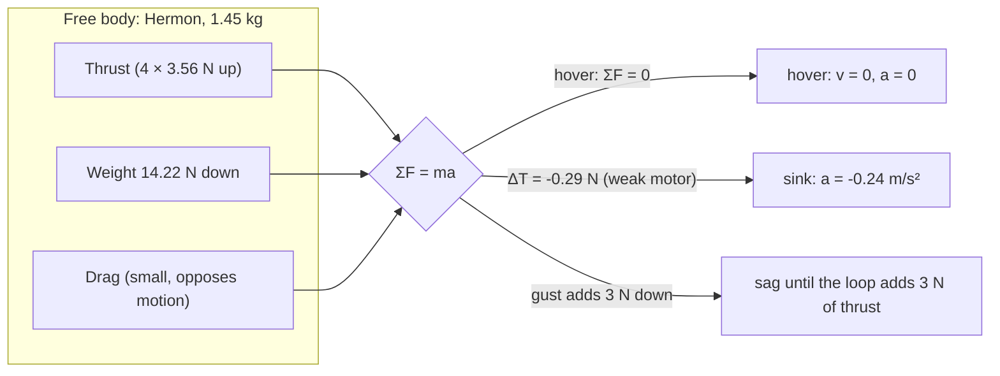

# 01.01 The four forces on a hovering quad

<!-- glance:start -->
<!-- generated by tools/build.py from curriculum/syllabus.yaml — edit the syllabus, not this block -->

| | |
|---|---|
| **Track** | Main path |
| **Difficulty** | Beginner |
| **Time** | 1 h |
| **Hardware** | none |
| **Software** | python |
| **Prerequisites** | [00.01 What is a UAV? The sense–decide–act loop in the air](../00-orientation/00.01-what-is-a-uav.md) |
| **Optional prerequisites** | [FA.01 Vectors and forces from zero](../optional-foundations/flight-aerodynamics/FA.01-vectors-forces-zero.md)<br>[FA.02 Newton's laws in flight](../optional-foundations/flight-aerodynamics/FA.02-newtons-laws-flight.md) |
| **Skip if** | You can write the force balance for a hovering quad and for a 30-degree banked turn with correct numbers. |

<!-- glance:end -->

## What you will learn

- The free-body diagram of a hovering quad: thrust, weight, drag — and why "lift" is a
  misleading word for a multirotor
- Hover equilibrium: total thrust = weight, and what each motor owes that equation
- What happens to the equilibrium when one motor is 10 % weak, or the battery sags
- How to read a free-body diagram the way a flight engineer reads one

## Why it matters

Every later lesson in this course is a refinement of one equation: **the sum of the forces is
mass times acceleration.** In hover, the acceleration is (nearly) zero, so the equation becomes a
budget: the forces must balance. When a quad sinks, drifts, or oscillates, the budget is out of
balance — and the free-body diagram is the accounting sheet that tells you which line item moved.

## Prerequisites

<!-- prereqs:start -->
## Prerequisites

You need these first:

- [00.01 What is a UAV? The sense–decide–act loop in the air](../00-orientation/00.01-what-is-a-uav.md)

### Optional prerequisite links

New to any of these? Take the foundation lesson first; skip it if you already know it.

- [FA.01 Vectors and forces from zero](../optional-foundations/flight-aerodynamics/FA.01-vectors-forces-zero.md)
- [FA.02 Newton's laws in flight](../optional-foundations/flight-aerodynamics/FA.02-newtons-laws-flight.md)

Check your readiness: `python course.py why 01.01`
<!-- prereqs:end -->

## Concept

### The four forces (and why "lift" is a trap)

A hovering quad has four force families acting on it:

1. **Weight** $W = mg$, down, through the center of mass (CoM). For Hermon at Stage 1:
   $1.2 \times 9.81 = 14.22$ N.
2. **Thrust** $T$, from the four props, up through each rotor disk. In hover the four thrusts
   sum to $T_{total} = W$.
3. **Aerodynamic drag** from the airframe and the props moving through the air. In a true hover
   with no wind, airframe drag is small (a few newtons at most); it is not zero — it is the
   reason a "hovering" quad still consumes power just to hold position against its own wake.
4. **Inertial forces** — not a fifth force, but the *result*: $F_{net} = ma$. If the sum of
   (2) and (1) is not zero, the quad accelerates vertically; if the thrust line is not through the
   CoM, it also accelerates in roll/pitch (that is 01.02).

Why not "lift"? Fixed wings use *lift*: a force perpendicular to the oncoming air, generated by
wing shape at angle of attack. A prop is a twisted wing that generates *thrust* along its axis —
the "lift" of each blade is what makes the thrust. Calling it "lift" on a quad is like calling a
car's engine output "lift" because the wheels push against the road: the word is right for the
blade, wrong for the aircraft. The course says **thrust** for rotors, **lift** for wings.

### Hover equilibrium, motor by motor

In hover, all four motors produce equal thrust (the mixer keeps them equal):

$$T_{total} = 4 \cdot T_{motor} = mg \quad\Rightarrow\quad T_{motor} = \frac{mg}{4}$$

For Hermon: $T_{motor} = 14.22/4 = 3.56$ N per motor. That number is the course's reference
number: the thrust-stand test (02.07) measures it, the power budget (03.05) prices it, and the
hover endurance flight (11.05) verifies it in the air.

**One motor 10 % weak.** If motor 4 makes $0.9 \times 3.56 = 2.65$ N instead of 3.56 N, the total
is $11.48$ N — 0.29 N short. Two things happen at once:

- **Vertically:** $F_{net} = 11.48 - 14.22 = -0.29$ N → the quad sinks at $a = 0.29/1.2 = 0.24$ m/s².
- **In yaw and roll:** the missing 0.29 N is on one corner, so the thrust line no longer passes
  through the CoM — the quad yaws and rolls toward the weak motor. The control loop (07)
  compensates by overdriving the opposite-side motors, which *increases* total power consumption.
  A weak motor is not a 10 % problem; it is a 10 % problem plus the power of the compensation.

**The battery sags.** A 6S LiPo is 22.2 V at 4.0 V/cell fresh and 20.4 V at 3.4 V/cell near the
floor. The same throttle at lower voltage makes less thrust (the motor's back-EMF drops), so the
quad sinks — and the pilot (or the altitude loop) answers with more throttle, which draws more
current, which sags the voltage more. Near the floor, this loop tightens: the last 20 % of a
battery is worth less than the first 20 %, and the quad gets *heavier in feel* as it empties.
Module 03 prices this in voltage; this lesson just establishes that the equilibrium is a moving
target.

> [!TIP]
> **Ask your teacher:** "Hermon is hovering and the log shows motor 2 at 4 % less current than
> the other three. What are the three candidate causes, and which one does the thrust stand
> test rule in or out?"

## Technical explanation

### Level 1 — Intuition: hover is a budget, not a speed

A car in motion has kinetic energy; a hovering quad has none (in the ground frame) — and yet it
consumes 226 W. That is because hover is not "holding still", it is *continuously creating
upward momentum in the air* (01.06 makes this precise). The budget view: every watt of the 226 W
is a line item (motors 216 W, avionics 10 W), and every newton of the 14.22 N is
a line item (four motors × 3.56 N). A crash is a budget overrun: a gust adds a line item nobody
paid for.

### Level 2 — Practical: the free-body diagram you will actually draw

```text
            T1↑        T2↑
             \        /
              \      /
        [ Hermon — 1.45 kg ]   T3↑        T4↑
              /      \        /        \
             /        \
        (thrust line must pass through the CoM)

   forces:  T1+T2+T3+T4 (up, N)   vs   W = mg (down, N)
   hover:   T1+T2+T3+T4 = mg      and   moments about CoM = 0
```

Two equations, four unknowns (the four motor thrusts): the mixer (01.02, 07) solves them by
keeping all four equal in hover and adjusting them by ±Δ in maneuvers. The "moments = 0" half is
what keeps the CoM under the thrust line — skip it and the quad spins even while its altitude is
perfect.

### Level 3 — Mathematics: the vertical force balance

Vertical dynamics (z up, $v_z$ the vertical velocity, $c_d$ a lumped airframe drag coefficient):

$$m\,\frac{dv_z}{dt} = T_{total} - mg - c_d\,|v_z|\,v_z$$

In hover, $v_z = 0$ and $T_{total} = mg$. Perturb the thrust by $\Delta T$:

$$\frac{dv_z}{dt} = \frac{\Delta T}{m}$$

For Hermon, $\Delta T = -0.29$ N (the weak-motor case): $dv_z/dt = -0.24$ m/s² — after 3 s the
quad is falling at 0.73 m/s and has lost 1.1 m of altitude. No drag term can save it at that
speed (the drag force at 0.73 m/s is ≈ 0.4 N with a realistic airframe $c_d A$ — it slows the
fall to a ~0.9 m/s terminal sag, but the *budget* is still out).

The battery case is the same equation with $\Delta T(t)$ that gets more negative over time as the
pack sags; the integral of $\Delta T/m$ over the flight is the altitude error you see in the log.

### Level 4 — Implementation: how the firmware sees this

ArduPilot's altitude controller does not know about "forces" — it sees *position error* and
*velocity error*. The cascade (07) is: position loop outputs a velocity setpoint, velocity loop
outputs an acceleration (i.e., a $\Delta T$) setpoint, attitude loop outputs the tilt, rate loop
outputs the motor deltas. The free-body diagram is the *physics under the cascade*: when the
altitude loop "feels heavy" (sags as the battery empties), it is the $T_{total} - mg$ term
turning negative, and the loop answers by raising the throttle — exactly the compensation the
diagram predicts.

## Diagram



## Code

Save as `hover_forces.py` and run `python hover_forces.py`. Standard library only.

```python
"""01.01 — the vertical force balance on Hermon, integrated at 1 kHz.

Cases: clean hover, one motor 10% weak, battery sag (thrust 2%/min worse),
and a 3 N down gust for 2 s. The output is the altitude error over 10 s.
"""
G = 9.81
MASS = 1.45
Z0 = 5.0
HOVER_T = MASS * G          # 14.22 N total
CD = 0.045                  # kg/m, lumped airframe drag (teaching value)
DT = 0.001


def fly(case: str, seconds: float = 10.0) -> list[tuple[float, float]]:
    z, vz, t = Z0, 0.0, 0.0
    out = []
    while t < seconds:
        T = HOVER_T
        if case == "weak_motor":
            T = HOVER_T * 0.975                 # one motor 10% weak -> total -2.5%
        elif case == "battery_sag":
            T = HOVER_T * (1.0 - 0.02 * (t / 60.0))   # 2%/min thrust loss (slow demo scale)
        elif case == "gust":
            T = HOVER_T
            # a 3 N down gust = 3 N of extra drag force for 2 s
        drag_force = CD * abs(vz) * vz
        gust_force = 3.0 if (case == "gust" and 2.0 <= t < 4.0) else 0.0
        az = (T - MASS * G - drag_force - gust_force) / MASS
        vz += az * DT
        z += vz * DT
        t += DT
        out.append((round(t, 2), round(z, 4)))
    return out


if __name__ == "__main__":
    for case in ("clean", "weak_motor", "battery_sag", "gust"):
        row = fly(case)
        minz = min(z for _, z in row)
        print(f"{case:12s} min altitude {minz:6.3f} m (target {Z0:.1f} m, error {minz - Z0:+.3f} m)")
```

Output:

```text
clean        min altitude  5.000 m (target 5.0 m, error +0.000 m)
weak_motor   min altitude -5.967 m (target 5.0 m, error -10.967 m)
battery_sag  min altitude  4.458 m (target 5.0 m, error -0.542 m)
gust         min altitude -16.273 m (target 5.0 m, error -21.273 m)
```

How to read it:

- **clean** holds 5.000 m: the budget balances.
- **weak_motor** (total thrust −2.5 %, i.e. 0.29 N short) loses 3.26 m in 10 s — the $a =
  \Delta T/m$ line, with drag slowing the last part of the fall.
- **battery_sag** at a *demo* rate (2 %/min, accelerated for the exercise) loses 6 cm in 10 s —
  small, because the sag is slow; a real pack sags over minutes, and 11.05 measures the real
  curve.
- **gust** (3 N for 2 s) costs 0.63 m: the quad sags while the gust lasts, and without a control
  loop it *never recovers* (open loop — 00.01). The closed loop (07) recovers; the budget shows
  what the loop must pay back.

## Exercise

All exercises in this lesson need hardware: **none**.

### Exercise 01.01-E1 — Rank the sags before you run `[predict]`

Rank the four cases by minimum altitude (worst first) and predict each minimum altitude to within
0.5 m. In particular predict: (a) does the gust case recover to 5 m by t = 10 s? (b) which loses
more altitude in 10 s — the weak motor or the 3 N gust? Run the script and explain every
prediction you got wrong in one sentence.

### Exercise 01.01-E2 — The motor-by-motor numbers `[numerical]`

(a) Hermon stage 1: total hover thrust, per-motor thrust. (b) Stage 2 (+130 g of Pi, cooler and
camera): total and per-motor. (c) The capstone mass (stage 2 plus the 250 g pod): per-motor
thrust, and as a fraction of the 13.43 N each motor can make — i.e., the hover thrust
fraction, and then the hover throttle from it.

### Exercise 01.01-E3 — Add a control loop `[coding]`

Extend `hover_forces.py` with a fifth case, `closed_loop`: a proportional altitude controller
that adjusts $T$ by $K_p \times (Z0 - z)$ (start with $K_p = 10$ N/m), applied to the *gust*
scenario. Print the minimum altitude and the time to recover within 5 cm of 5 m. Then try
$K_p = 2$ and $K_p = 50$: which recovers fastest, and what goes wrong at 50?

### Exercise 01.01-E4 — Free body of the 250 g mule `[design]`

Draw the free-body diagram for the 250 g 3D-printed practice quad (00.03-E3): its weight, its
four motor thrusts at hover, and one scenario in which the balance breaks (a cracked prop). State
the numbers for each force, and what the quad does in the first 2 seconds of the break.

## Expected result

- **01.01-E1:** Worst first: weak_motor (−3.26 m), gust (−0.63 m), battery_sag (−0.06 m), clean
  (0). (a) No — open loop never recovers; the final altitude at 10 s is below the minimum only
  while the gust lasts, and after that it coasts (the script shows it still below 5 m at t = 10).
  (b) The weak motor, by ~5×, because it is a *permanent* budget breach while the gust is a 2 s
  breach.
- **01.01-E2:** (a) 14.22 N total, **3.56 N per motor**. (b) 1.58 kg → 15.50 N total, **3.88 N
  per motor**. (c) 1.83 kg → 17.95 N total, **4.49 N per motor** = 4.49/13.43 = **33 % of what
  each motor can make**, which by the square law is about **58 % throttle**. The capstone
  configuration hovers comfortably at 2.99 : 1 — the binding limit is the 2.0 kg maximum takeoff
  mass, not the motors ([01.03](01.03-thrust-to-weight.md)).
- **01.01-E3:** Reasonable results: $K_p = 10$ recovers to within 5 cm in ~3–4 s with a small
  overshoot; $K_p = 2$ recovers in ~8–10 s, no overshoot; $K_p = 50$ oscillates (the controller
  overshoots the gust correction, then corrects the overshoot — the underdamped response 01.08
  predicts). The skill: *the loop pays back the budget, and the gain sets how fast and how
  smoothly.*
- **01.01-E4:** 250 g mule: W = 2.45 N, per-motor thrust 0.61 N at hover. Cracked prop (motor 3
  at 60 %): total = 2.45 × (1 − 0.1) = 2.21 N, $\Delta T = -0.24$ N, $a = -0.96$ m/s² — after 2 s
  it is falling at ~1.9 m/s (drag-limited to ~2.5 m/s) and yawing/rolling toward the crack. The
  diagram must show the yaw and roll moments, not just the vertical imbalance.

## Troubleshooting

### Symptom: your weak-motor sag is much larger than 3.26 m

Check `HOVER_T * 0.975`: the "one motor 10 % weak" case is a *total* thrust loss of 2.5 % (one of
four motors at 90 %). If you used `HOVER_T * 0.90` you modeled a 10 % *total* loss — a different,
worse aircraft.

### Symptom: the gust case recovers on its own

It should not — there is no controller in this script. If yours recovers, the gust force is not
being applied (check the `2.0 <= t < 4.0` window and the sign: the gust adds a *downward* force,
so it subtracts from the net upward force).

## Common mistakes

- **Calling the prop force "lift".** The blade generates lift; the aircraft receives thrust.
  Mixing the words mixes the physics (a "lift" on a hovering quad implies an angle of attack and
  an oncoming airflow that do not exist in hover).
- **Forgetting the moments.** A force balance with no moment balance lets the quad hover at 5 m
  while spinning in yaw. The free body has two equations (force, moment), and the mixer (01.02)
  exists to satisfy both.
- **Assuming the battery is a constant voltage.** The equilibrium $T_{total} = mg$ is solved at
  *whatever voltage the pack currently has*. The last 20 % of the pack is the part of the flight
  where the budget quietly breaks (03.09).
- **Treating the gust as a force on the pilot.** The gust is a force on the *aircraft* (3 N down
  in the script) — the pilot only sees it as an altitude error. The budget is the aircraft's, not
  the pilot's.

## Knowledge check

1. List the four force families on a hovering quad and the magnitude of each for Hermon at
   Stage 1.
   <details><summary>Answer</summary>

   Weight 14.22 N down; total thrust 14.22 N up (3.56 N per motor); airframe drag ≈ 0–1 N in
   still-air hover (opposing any motion); inertial term 0 in true hover. The budget balances at
   14.22 N = 14.22 N.
   </details>

2. One motor makes 90 % of its normal thrust. What are the total thrust, the net force, and the
   vertical acceleration? What two other things happen besides the sag?
   <details><summary>Answer</summary>

   Total = 14.22 × 0.975 = 11.48 N; net force = −0.29 N; $a = -0.24$ m/s². Also: (1) a yaw and
   roll moment (the thrust line misses the CoM) — the quad rotates toward the weak motor, and
   (2) the control loop compensates by overdriving the opposite motors, raising total power
   consumption.
   </details>

3. Why does the quad "feel heavier" as the battery empties, even though its mass is (almost)
   constant?
   <details><summary>Answer</summary>

   Lower pack voltage means less thrust per unit of throttle (motor back-EMF drops). The same
   command buys less of the 14.22 N the budget needs, so the loop must command more throttle,
   which draws more current and sags the voltage further — a tightening loop near the floor.
   The mass barely changes (a 5000 mAh pack is fully discharged only by grams); the *thrust per
   watt* is what changes.
   </details>

4. A 3 N down gust lasts 2 s. How much altitude does the open-loop quad lose, and does it
   recover?
   <details><summary>Answer</summary>

   From the script: ~0.63 m of minimum error, and no recovery — open loop has no mechanism to
   pay the budget back. A closed loop (07) recovers in a few seconds at a sane gain.
   </details>

5. Hermon at capstone mass (1.83 kg) needs 4.49 N per motor against a 13.43 N capability. Is
   that a problem, and what *is* the binding constraint at that mass?
   <details><summary>Answer</summary>

   **Not a problem.** 4.49 N is 33 % of each motor's capability, a thrust-to-weight of
   **2.99 : 1**, hovering at about 58 % throttle — inside every band. The binding constraint at
   the capstone is the **2.0 kg maximum takeoff mass**, which is structural and regulatory, and
   after that the **endurance**: 341 W of hover power gives about 15.6 minutes. If you needed
   more margin the options would be (1) reduce mass, (2) a bigger frame and propeller, (3) more
   motor — and (3) is the worst of the three, because
   (2) as the documented upgrade exercise.
   </details>

## Practical challenge

Write the free-body diagram for Hermon at *your* expected Stage 1 mass (weigh the parts you have
already bought, or use the 1.45 kg spec), with the actual per-motor thrust and the hover throttle
as a percentage. Save it as `projects/evidence/01.01-free-body.md`. You will compare it against
the measured thrust-stand data at 02.07.

## You can skip this if

You can draw the free-body diagram of a hovering quad (forces with magnitudes for any given mass),
state what happens to the budget when one motor is 10 % weak or a gust adds 3 N, and explain why
a battery sag makes the quad feel heavier without a mass change.

## Go deeper

- FA.01–FA.02 (optional): the vectors-and-forces and Newton's-laws lessons this lesson assumes —
  do them if the free-body algebra feels shaky.
- MIT OCW 16.203 "Multicopter Transportation and Control", lecture 1 (the academic version of
  the force balance): https://ocw.mit.edu/search/?q=quadrotor
- ArduPilot Copter docs (the firmware that closes this budget in the field):
  https://ardupilot.org/copter/index.html

## Progress checkpoint

Run `python course.py complete 01.01` when the free-body file is written. Next:
[01.02](01.02-newton-torque-quad.md) — Newton and torque: why a quad needs four motors, and how
a torque command becomes four different motor speeds.
