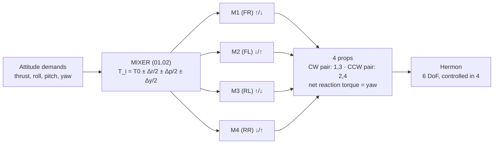

# 01.02 Newton & torque: why a quad needs four motors

<!-- glance:start -->
<!-- generated by tools/build.py from curriculum/syllabus.yaml — edit the syllabus, not this block -->

| | |
|---|---|
| **Track** | Main path |
| **Difficulty** | Beginner |
| **Time** | 1 h |
| **Hardware** | none |
| **Software** | python |
| **Prerequisites** | [01.01 The four forces on a hovering quad](01.01-four-forces-on-a-quad.md) |
| **Optional prerequisites** | [FA.02 Newton's laws in flight](../optional-foundations/flight-aerodynamics/FA.02-newtons-laws-flight.md) |
| **Skip if** | You can explain, with numbers, why two counter-rotating pairs cancel spin and how a quad generates roll, pitch and yaw. |

<!-- glance:end -->

## What you will learn

- Newton's second law in the air, and the torque equation $\tau = r \times F$ that makes a
  quad rotate
- Why two motors (or three) cannot control a quad's six degrees of freedom, and what four buys
- The mixer: how a commanded roll/pitch/yaw + thrust becomes four motor commands
- Why opposite-rotating motor pairs (the X configuration) are the standard

## Why it matters

The force balance of [01.01](01.01-four-forces-on-a-quad.md) keeps the quad at the right
*altitude*. Torque keeps it at the right *attitude* — and attitude is what lets it point, turn,
and fly. The mixer (the mapping from "roll 5° right" to "motors 1,2,3,4 at these speeds") is the
most under-appreciated part of a quad: it is the reason a quad can hover, and the thing that
fails first when a motor dies. Module 07 tunes the loops that sit on top of the mixer; this
lesson gives you the mixer's math.

## Prerequisites

<!-- prereqs:start -->
## Prerequisites

You need these first:

- [01.01 The four forces on a hovering quad](01.01-four-forces-on-a-quad.md)

### Optional prerequisite links

New to any of these? Take the foundation lesson first; skip it if you already know it.

- [FA.02 Newton's laws in flight](../optional-foundations/flight-aerodynamics/FA.02-newtons-laws-flight.md)

Check your readiness: `python course.py why 01.02`
<!-- prereqs:end -->

## Concept

### From force to rotation

A force applied *through* the center of mass (CoM) translates the quad. The same force applied at
a *distance* from the CoM also rotates it. The rotation is measured by **torque**:

$$\tau = r \times F \quad\Rightarrow\quad |\tau| = r\,|F|\,\sin\alpha$$

where $r$ is the distance from the CoM to the force's line of action and $\alpha$ the angle
between them. For a quad, each motor sits at distance $r$ from the CoM (about 0.16 m on a 450 mm
frame), so each motor's thrust produces a torque about the CoM. The *difference* between
opposite motors' thrust is what rotates the quad:

- **Roll** (rotation about the forward axis): motors on the left side push harder than the right.
- **Pitch** (about the sideways axis): front vs back motors differ.
- **Yaw** (about the vertical axis): this one has no force at all — it is *reaction torque*.

### The yaw trick: reaction torque

Each prop spinning one way drags its motor — and the airframe — the other way (Newton's third
law). A single spinning prop yaws the quad. With four props, the standard X configuration pairs
them: motors 1 and 3 spin clockwise, motors 2 and 4 spin counter-clockwise (or vice versa). In
hover the two pairs cancel: net reaction torque = 0. To **yaw** the quad, the mixer raises the
thrust of one rotation-direction pair and lowers the other — the unbalanced reaction torque
yaws the quad, while the total thrust is kept equal to $mg$ (that is why a hard yaw costs
battery: the raised pair pushes harder than the airframe "wants").

### Why four, not two or three

A rigid body has six degrees of freedom (DoF): three translations (x, y, z) and three rotations
(roll, pitch, yaw). A motor can only push *along its own axis* — so $N$ motors give $N$
independent force directions, and the quad's control authority is the span of those directions:

| Motors | Independent commands | Can it… |
|---|---|---|
| 2 | 2 (thrust, and one rotation) | hover and roll, but not pitch or yaw independently — a "dicycle", not a quad |
| 3 | 3 (thrust, two rotations) | hover + roll + pitch + yaw *in principle*, but with no margin: one motor dead and a DoF is gone (a tricopter adds a servo to fake the third) |
| **4** | **4 (thrust, roll, pitch, yaw)** | **full authority over the four commands a quad needs, with one motor of redundancy** |
| 6 | 6 | two motors of redundancy — the civil heavy-lift choice, at 50 % more mass |

The four-rotor sweet spot: **exactly the four commands** (thrust + roll + pitch + yaw) **plus
one motor of redundancy** — kill one motor and a well-tuned quad can still fly home (limping,
at reduced performance), which 16.06 makes a test.

> [!TIP]
> **Ask your teacher:** "Draw the X configuration with motor numbers. Which motors do you raise
> to roll right? To pitch forward? To yaw clockwise (as seen from above)?"

## Technical explanation

### Level 1 — Intuition: the mixer is a translator

The pilot (or the position loop) says *attitudes*: "roll 5° right, pitch 3° back, hold altitude,
yaw slowly left." The motors understand only *thrust*: four numbers between 0 and 100 %. The
mixer is the translator. Its job has two halves:

1. **The attitude→torque half** (the physics): a desired roll angle means a desired roll
   torque, which means a left-right thrust difference of $\Delta T_{roll}$, and so on.
2. **The torque→motors half** (the algebra): distribute each $\Delta T$ across the four motors
   so that the sum is exactly right *and* no motor saturates (hits 0 % or 100 %).

Saturation is the mixer's failure mode: "roll right hard" while "climbing hard" can push motor
1 to 100 % — and then every additional roll command has nowhere to go. The quad *feels* like it
ran out of authority, and the pilot's hand knows it before the instruments show it.

### Level 2 — Practical: the X configuration and the mixer table

ArduPilot's standard quad (X frame, motor 1 = front-right, 2 = front-left, 3 = rear-left,
4 = rear-right; motors 1,3 clockwise, 2,4 counter-clockwise):

| Command | M1 (FR) | M2 (FL) | M3 (RL) | M4 (RR) |
|---|---|---|---|---|
| Hover (all equal) | + | + | + | + |
| Roll right | ↑ | ↓ | ↑ | ↓ |
| Pitch forward (nose down) | ↓ | ↓ | ↑ | ↑ |
| Yaw left (CCW from above) | ↑ | ↓ | ↑ | ↓ |
| Yaw right (CW from above) | ↓ | ↑ | ↓ | ↑ |

(↑ = raise thrust, ↓ = lower it.) Read the table and the yaw rows *cancel* in total thrust
(raise two, lower two) — that is the reaction-torque trick keeping $T_{total} = mg$ while the
quad rotates.

### Level 3 — Mathematics: the mixer equations

Let $T_0$ be the per-motor hover thrust, $\Delta_r$ the roll torque demand, $\Delta_p$ the pitch
demand, $\Delta_y$ the yaw demand (each a thrust *difference*, in newtons, distributed as
±Δ/2 per affected pair — the exact scaling is the mixer gain). The mixer solves, for the four
motor outputs:

$$\begin{aligned}
T_1 &= T_0 + \tfrac{\Delta_r}{2} + \tfrac{\Delta_p}{2} + \tfrac{\Delta_y}{2} \\
T_2 &= T_0 - \tfrac{\Delta_r}{2} - \tfrac{\Delta_p}{2} + \tfrac{\Delta_y}{2} \\
T_3 &= T_0 + \tfrac{\Delta_r}{2} - \tfrac{\Delta_p}{2} - \tfrac{\Delta_y}{2} \\
T_4 &= T_0 - \tfrac{\Delta_r}{2} + \tfrac{\Delta_p}{2} - \tfrac{\Delta_y}{2}
\end{aligned}$$

(The signs follow the table: roll right raises the right-side motors M1/M4… adjust to your
numbering — the *structure* is what matters: one term per demand, ±½ per motor, and the yaw term
always adds to one rotation pair and subtracts from the other.)

Check the invariants: $T_1+T_2+T_3+T_4 = 4T_0$ (total thrust unchanged by any rotation demand —
that is the yaw trick in algebra), and each demand appears in exactly two motors with opposite
signs (a pure torque, no net force).

For Hermon: $T_0 = 3.56$ N and each motor can produce **13.43 N**
([02.07](../02-motors-escs-props/02.07-static-thrust-test.md)). A roll demand of
$\Delta_r = 1$ N of differential gives ±0.5 N per affected motor — a 14 % change on the 3.56 N
base, well inside the motor's range.

A *saturated* mixer is one where some $T_i$ hits 0 or the maximum. At hover there is
**9.87 N of headroom above** each motor and only **3.56 N below** — and that asymmetry, not the
absolute headroom, is what actually bites. **A quad can always push harder; it cannot pull.**
That is the margin arithmetic of [01.03](01.03-thrust-to-weight.md) in mixer form, and it is why
the floor matters more than the ceiling on a 3.78 : 1 aircraft.

### Level 4 — Implementation: the mixer in the firmware

In ArduPilot the mixer is a small, fixed piece of math in the flight controller (the "mixer"
task at 800 Hz in 00.04's runtime view): it takes the four commands (thrust, roll torque, pitch
torque, yaw torque) from the rate loops and outputs the four motor values through a
saturation-aware allocation. Two details you will meet in 07: (1) the mixer runs *after* the
rate loops, so the loops command *torques* and the mixer does the algebra; (2) when a motor
saturates, the mixer can trade off demands (drop yaw authority first) — the "mixing limits"
parameters. The simulation below is the mixer in one file.

## Diagram



## Code

Save as `torque_mix.py` and run `python torque_mix.py`. Standard library only.

```python
"""01.02 — the quad mixer: attitude demands -> four motor commands.

The mixer table from the Technical explanation, checked against its
invariants (total thrust preserved, each demand a pure torque).
"""
T0 = 3.56          # N per motor at hover (Hermon, 01.01)
TMAX = 13.43       # N per motor at full throttle (1,369 g) -- 02.07


def mix(thrust: float, dr: float, dp: float, dy: float) -> list[float]:
    """thrust: total thrust command (N); dr,dp,dy: torque demands as N of differential."""
    t0 = thrust / 4.0
    return [
        t0 + dr / 2 + dp / 2 + dy / 2,
        t0 - dr / 2 - dp / 2 + dy / 2,
        t0 + dr / 2 - dp / 2 - dy / 2,
        t0 - dr / 2 + dp / 2 - dy / 2,
    ]


def show(label: str, thrust: float, dr: float, dp: float, dy: float) -> None:
    t = mix(thrust, dr, dp, dy)
    sat = [i + 1 for i, x in enumerate(t) if x > TMAX or x < 0]
    print(f"{label:34s} motors {[f'{x:5.2f}' for x in t]}  sum {sum(t):5.2f} N"
          f"  {'SATURATED: ' + str(sat) if sat else 'ok'}")


if __name__ == "__main__":
    show("hover (no demands)", 14.22, 0, 0, 0)
    show("roll right, 1 N differential", 14.22, 1.0, 0, 0)
    show("pitch forward, 1 N differential", 14.22, 0, 1.0, 0)
    show("yaw left, 1 N differential", 14.22, 0, 0, 1.0)
    show("climb + roll: 13 N total, 1 N roll", 13.0, 1.0, 0, 0)
    show("hard: 15 N total, 1.5 N roll, 1 N yaw", 15.0, 1.5, 0, 1.0)
    show("aggressive: 20 N total, 6 N roll, 3 N yaw", 20.0, 6.0, 0, 3.0)
    show("LOW SAT: descent 6 N total, 4 N roll", 6.0, 4.0, 0, 0.0)
```

Output:

```text
hover (no demands)                 motors [' 3.56', ' 3.56', ' 3.56', ' 3.56']  sum 14.22 N  ok
roll right, 1 N differential       motors [' 4.05', ' 3.06', ' 4.05', ' 3.06']  sum 14.22 N  ok
pitch forward, 1 N differential    motors [' 4.05', ' 3.06', ' 3.06', ' 4.05']  sum 14.22 N  ok
yaw left, 1 N differential         motors [' 4.05', ' 4.05', ' 3.06', ' 3.06']  sum 14.22 N  ok
climb + roll: 13 N total, 1 N roll motors [' 3.75', ' 2.75', ' 3.75', ' 2.75']  sum 13.00 N  ok
hard: 15 N total, 1.5 N roll, 1 N yaw motors [' 5.00', ' 3.50', ' 4.00', ' 2.50']  sum 15.00 N  ok
aggressive: 20 N total, 6 N roll, 3 N yaw motors [' 9.50', ' 3.50', ' 6.50', ' 0.50']  sum 20.00 N  ok
LOW SAT: descent 6 N total, 4 N roll motors [' 3.50', '-0.50', ' 3.50', '-0.50']  sum  6.00 N  SATURATED: [2, 4]
```

How to read it:

- The first four rows all sum to 14.22 N: the invariants hold — a rotation demand never changes
  the total thrust (the yaw trick), and each demand is a pure ±pair (a torque, not a force).
- **climb + roll** is comfortable: the highest motor is nowhere near 13.43 N.
- **hard** pushes motor 1 to 5.00 N — still only 37 % of what it can make. **On a 3.78 : 1
  aircraft the upper saturation is not the binding constraint**; the *lower* one is, because a
  motor cannot produce negative thrust. Watch the minimum column instead: when a demand drives
  any motor towards zero, the mixer has to scale the whole output down, and *that* is the "ran
  out of authority" feeling. The fix is the same — less demand, not more gain.

## Exercise

All exercises in this lesson need hardware: **none**.

### Exercise 01.02-E1 — Read the mixer table `[predict]`

Before running the script: (a) which two motors does the mixer raise to pitch the nose *down*?
(b) does a yaw command change the total thrust? (c) in the "hard" row, why is motor 1 the one
that saturates and not motor 3? Run the script and check.

### Exercise 01.02-E2 — The headroom number `[numerical]`

Hermon hovers at 3.56 N per motor and each motor can make 13.43 N. (a) What is the headroom
*above* hover per motor, in newtons and as a multiple of hover thrust? (b) What is the headroom
*below*? (c) Which of the two limits the maximum roll differential the mixer can command from a
hover, and by how much? (d) Repeat for the capstone configuration (1.83 kg, hover 4.49 N per
motor) and say what changes.

### Exercise 01.02-E3 — Mix a maneuver `[coding]`

Extend `torque_mix.py` with a function `maneuver()` that takes (climb_rate_m_s2, roll_deg) and
produces the mixer inputs: climb rate $a$ needs total thrust $m(g+a)$; a roll of $\theta$ needs
the differential $m g \tan\theta$… (derive it: the tilt produces $T\sin\theta = ma_{lat}$ and
$T\cos\theta = mg$). Print the four motor commands for: hover at 5° roll; 3 m/s² climb at 10°
roll; 6 m/s² climb at 15° roll. Which saturates?

### Exercise 01.02-E4 — One motor dead `[design]`

With motor 4 dead, the mixer has three unknowns for four demands. (a) Which demand can no longer
be controlled exactly? (b) Describe the "limp home" the quad can still fly (this is the 16.06
test). (c) What must the pilot (or the failsafe) do differently on the way home?

## Expected result

- **01.02-E1:** (a) The rear pair (M3, M4) raises, the front pair lowers — nose down is a pitch
  demand that pushes the rear harder. (b) No — the yaw row raises two and lowers two; the sum is
  unchanged (that is the reaction-torque trick). (c) Motor 1 carries +dr/2 +dp/2 +dy/2 — in the
  "hard" row it has all three positive terms (roll + yaw both push it up), while motor 3 has
  +dr/2 −dp/2 −dy/2 — the signs cancel it. The saturation follows from the sign pattern.
- **01.02-E2:** (a) $13.43 - 3.56 =$ **9.87 N above**, which is 2.8× the hover thrust.
  (b) **3.56 N below**, because thrust cannot go negative. (c) **The lower limit binds**, and by a
  factor of 2.8: the maximum symmetric roll differential from a hover is $2 \times 3.56 =$
  **7.12 N**, set by the motors that must come *down*, not the ones that go up. (d) At 1.83 kg
  hover is 4.49 N, so the headroom becomes 8.94 N above and 4.49 N below — the differential
  limit *rises* to 8.98 N. **A heavier aircraft has more roll authority from a hover**, which is
  the opposite of what most people guess, and it is because the binding constraint is the floor.
  What the heavier aircraft loses is climb authority and endurance, not roll.
- **01.02-E3:** Derivation: $T = mg/\cos\theta$, lateral $a_{lat} = g\tan\theta$, and the climb
  adds $m a_{climb}$ to the vertical budget → total thrust $T_{total} = m(g + a_{climb})/\cos\theta$,
  roll differential $\Delta_r = T_{total}\sin\theta$. Reasonable outputs: hover at 5° roll →
  total 14.3 N, differential 1.25 N; 3 m/s² climb at 10° → total ≈ 18.9 N, differential
  ≈ 3.3 N; 6 m/s² climb at 15° → total ≈ 24.2 N, differential ≈ 6.3 N. **None of these saturate
  a 13.43 N motor upwards** — the highest single motor in the last case is about 7.6 N, 57 % of
  capability. The answer should note that on this aircraft the climb raises the base and
  therefore *increases* the downward room, so the authority limit is `ANGLE_MAX` and the rate
  controller's own limits, not the motors.
- **01.02-E4:** (a) Yaw (the dead motor's rotation pair is unbalanced — no motor can replace its
  reaction torque) and one roll/pitch axis is degraded. (b) The quad can still hover (three
  motors at 4.74 N each = 14.22 N — comfortably inside the 13.43 N capability, which is exactly
  what a 3.78 : 1 ratio buys you) and fly a slow, gently
  yaw-drifting path home with the alive motors compensating roll/pitch. (c) Fly lower (less
  energy to lose), avoid maneuvers (no hard turns), land as soon as the airspace allows, and the
  failsafe (12.05) treats "motor 4 dead" as a declared emergency, not a nuisance.

## Troubleshooting

### Symptom: your mixer rows do not sum to the total thrust

Check the signs: every demand appears in exactly two motors with opposite signs, and the yaw term
is + for one rotation pair, − for the other. A single flipped sign turns a torque into a force
(the sum changes) — the script's `sum` column is the check.

### Symptom: saturation appears in your "hover" row

Then `thrust/4` is above `TMAX`: you passed a total thrust above 4 × 13.43 N = 53.7 N, or your
`TMAX` is the *per-motor* spec used wrong. Hover is 14.22 N / 4 = 3.56 N — well under. If you are
seeing saturation at hover with the right numbers, check for a **lower** saturation instead: a
motor driven below zero.

## Common mistakes

- **Mixing up "torque" and "force" commands.** The rate loops command torques (differences); the
  mixer turns them into forces. A loop that commands *forces* directly has no yaw (there is no
  force that yaws — only reaction torque).
- **Forgetting the yaw costs thrust.** The yaw row keeps the *sum* constant, but the raised pair
  works harder than the lowered pair — the *average* motor current rises, and a hard yaw burns
  battery even at constant altitude.
- **Assuming more motors = better.** Six motors add redundancy but also 50 % more mass and more
  drag; the 4-rotor is the sweet spot for Hermon's mass class (17.01 does the hex comparison as
  an exercise).
- **Tuning the loops before the mixer is understood.** The loops (07) sit on top of the mixer;
  if you cannot read the mixer table, you are tuning a translation you don't understand.

## Knowledge check

1. A quad has six degrees of freedom but only four motors. What are the four commands the mixer
   produces, and which two DoF are *not* directly commanded?
   <details><summary>Answer</summary>

   The four commands: total thrust (vertical), roll torque, pitch torque, yaw torque. The two DoF
   not directly commanded are the horizontal translations (x, y) — they are the *result* of
   tilting (01.04): you command an attitude, the attitude produces a horizontal force, the force
   produces the translation. The position loop (07) closes that chain.
   </details>

2. Why does a yaw command not change the total thrust, and what does it cost?
   <details><summary>Answer</summary>

   The mixer raises one rotation pair and lowers the other by the same amount — the sum is
   unchanged, but the unbalanced *reaction torque* of the spinning props yaws the airframe. The
   cost: the raised pair works harder, so average motor current (and battery draw) rises during
   sustained yaw.
   </details>

3. Hermon hovers at 3.56 N per motor and each motor can make 13.43 N. What limits the maximum
   roll differential at hover?
   <details><summary>Answer</summary>

   **The floor, not the ceiling.** There is 9.87 N of headroom above hover and only 3.56 N below,
   because thrust cannot be negative — so the symmetric differential is limited to
   $2 \times 3.56 =$ **7.12 N** by the motors that have to come *down*. On a 3.78 : 1 aircraft
   the upper saturation is almost never reached; what eats the margin is climb (which raises the
   base and so *increases* the downward room), battery sag, and compensating for a weak motor.
   </details>

4. Why are motors 1 and 3 one rotation direction and 2 and 4 the other?
   <details><summary>Answer</summary>

   So that in hover the reaction torques of the two pairs cancel (net yaw torque = 0). Yaw is
   then available as the *difference* between the pairs. All four the same way and the quad would
   yaw continuously just from hovering.
   </details>

5. Motor 4 dies at 30 m. What can the quad still do, what can it no longer do, and what should
   the pilot do?
   <details><summary>Answer</summary>

   Still: hover, comfortably — the three live motors share 4.74 N each against a 13.43 N
   capability — and slow roll/pitch flight. No longer: clean yaw (the reaction pairs are unbalanced — a yaw drift) and
   any hard maneuver. Pilot: declare the emergency (12.05), fly low and straight, avoid turns,
   land as soon as the area allows. The 16.06 test proves exactly this behavior in SITL.
   </details>

## Practical challenge

Hand-compute the mixer output for: "climb at 2 m/s² while rolling 10° right" (total thrust
$= m(g+a)/\cos\theta$, roll differential $= T_{total}\sin\theta$), writing the four motor values
and checking the sum. Then run `torque_mix.py` with those inputs and compare. Save the
hand-computation as `projects/evidence/01.02-mixer-hand.md`.

## You can skip this if

You can read the mixer table (which motors rise for roll/pitch/yaw), derive the mixer equations
from the invariants (total thrust preserved, each demand a pure torque), compute the headroom
number for Hermon, and state what a quad can and cannot do with one motor dead.

## Go deeper

- The mixer in ArduPilot's source (the `mixer` task): https://github.com/ArduPilot/ardupilot
  (file `ArduCopter/Mixer.cpp` — the real version of `torque_mix.py`).
- FA.02 (optional): Newton's laws from zero, if the torque algebra needs the foundation.
- MIT OCW 16.203, lecture 2 (quadrotor dynamics and the body-frame equations):
  https://ocw.mit.edu/search/?q=quadrotor

## Progress checkpoint

Run `python course.py complete 01.02` when the hand-computation is checked against the script.
Next: [01.03](01.03-thrust-to-weight.md) — thrust, weight and the thrust-to-weight ratio: the
margin number that decides how much Hermon can do.
