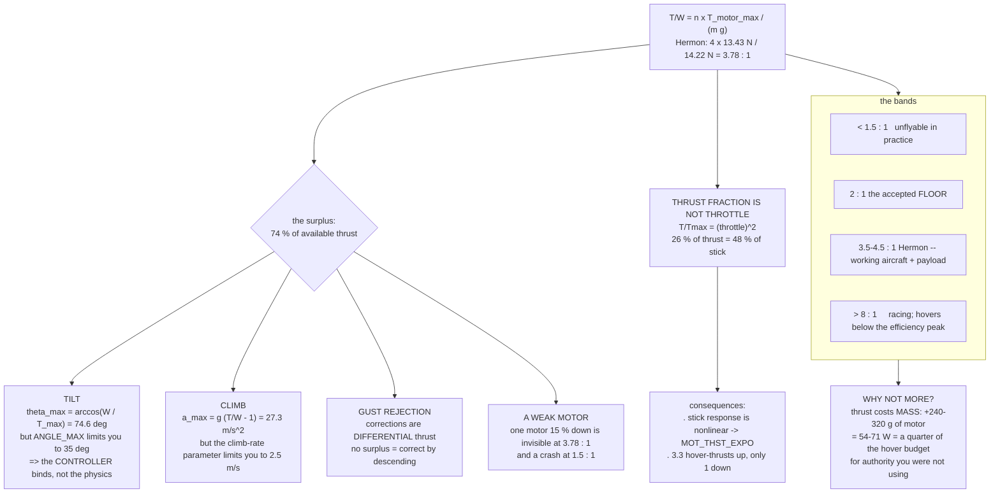

# 01.03 Thrust, weight and the thrust-to-weight ratio

<!-- glance:start -->
<!-- generated by tools/build.py from curriculum/syllabus.yaml — edit the syllabus, not this block -->

| | |
|---|---|
| **Track** | Main path |
| **Difficulty** | Beginner |
| **Time** | 45 min |
| **Hardware** | none |
| **Software** | python |
| **Prerequisites** | [01.02 Newton & torque: why a quad needs four motors](01.02-newton-torque-quad.md) |
| **Skip if** | You can size a motor count for a given payload and explain why 2:1 hover margin is not the same as 4:1 full-throttle margin. |

<!-- glance:end -->

## What you will learn

- What the **thrust-to-weight ratio** is, how to compute it, and why it is the single number that
  decides what an aircraft can *do* rather than whether it can fly
- The distinction that catches everyone: **thrust fraction is not throttle**, because thrust goes
  as the square of rpm
- What each level of T/W buys — tilt authority, climb rate, gust rejection, and the ability to
  survive a motor that is not pulling its weight
- Why **2 : 1 is the floor**, 3–4 : 1 is a working aircraft, and 8 : 1 is a racer that cannot
  carry anything
- How to **size a powertrain from a payload**, forwards and backwards
- Hermon's numbers, and why 3.78 : 1 is a deliberate choice rather than what was left over

## Why it matters

"Can it lift it?" is the wrong question. Almost any multirotor can lift almost anything once, for
a moment, in still air. The right question is **"what is left over?"** — and that surplus is what
pays for every manoeuvre, every gust, every climb, every degree of bank, and every bit of margin
between a recoverable wobble and a crash.

The thrust-to-weight ratio is the accounting for that surplus. It is the first number on a
specification sheet and the first one an experienced person checks, because it constrains
everything downstream: the tilt limit in [01.04](01.04-tilt-to-translate.md), the wind limit in
[01.10](01.10-wind.md), the control authority in [07.03](../07-control/07.03-rate-loops.md), and
the payload capacity in [17.01](../17-payloads-delivery/17.01-payload-mass-and-com.md).

Get it wrong at the design stage and there is no tuning, no firmware and no piloting skill that
recovers it.

## Prerequisites

<!-- prereqs:start -->
## Prerequisites

You need these first:

- [01.02 Newton & torque: why a quad needs four motors](01.02-newton-torque-quad.md)

### Optional prerequisite links

None.

Check your readiness: `python course.py why 01.03`
<!-- prereqs:end -->

## Concept

### The definition

$$\frac{T}{W} = \frac{n_{motors} \times T_{motor,max}}{m g}$$

where $T_{motor,max}$ is what **one** motor produces at full throttle with its actual propeller,
on its actual pack, measured on a thrust stand
([02.07](../02-motors-escs-props/02.07-static-thrust-test.md)) — not the number in the
manufacturer's table, which was measured on a fresh pack at 25 °C with a propeller you did not
buy.

For Hermon:

| | |
|---|---|
| Mass, clean | 1.45 kg |
| Weight | $1.45 \times 9.81 =$ **14.22 N** |
| Thrust per motor at full throttle | **13.43 N (1,369 g)** |
| Total thrust | $4 \times 13.43 =$ **53.7 N** |
| **Thrust-to-weight** | $53.7 / 14.22 =$ **3.78 : 1** |
| With the 250 g delivery pod (1.70 kg) | **3.22 : 1** |

**Hover uses 26 % of the available thrust.** The other 74 % is the surplus, and the rest of this
lesson is about what it is for.

### Thrust fraction is not throttle

This is the distinction that separates people who have flown from people who have only read, and
it catches everyone once.

**Thrust is roughly proportional to the square of rpm**
([02.05](../02-motors-escs-props/02.05-propellers.md)), and rpm is roughly proportional to
throttle. So:

$$\frac{T}{T_{max}} \approx \left(\frac{\text{throttle}}{100\,\%}\right)^2 \quad\Longrightarrow\quad \text{throttle}_{hover} \approx \sqrt{\frac{1}{T/W}}$$

| T/W | Hover thrust fraction | **Hover throttle** |
|---|---|---|
| 1.5 : 1 | 67 % | 82 % |
| 2 : 1 | 50 % | 71 % |
| 3 : 1 | 33 % | 58 % |
| **3.78 : 1 — Hermon** | **26 %** | **51 %** |
| 5 : 1 | 20 % | 45 % |
| 8 : 1 | 12 % | 35 % |

Hermon's measured hover throttle is **48 %**, a little below the 51 % this simple square law
predicts, because the real thrust curve is not quite a perfect square and the pack sags at full
throttle ([02.06](../02-motors-escs-props/02.06-prop-motor-matching.md) solves it properly). The
principle holds: **a 3.78 : 1 aircraft hovers at about half stick.**

> [!IMPORTANT]
> **Two numbers, two purposes, and people mix them up constantly.** *Thrust fraction* (26 %) is
> the physics: how much of the available force you are using. *Throttle* (48 %) is the stick
> position, and it is what the pilot and the flight controller actually see. A specification that
> says "hovers at 50 %" is talking about throttle; one that says "26 % of maximum thrust" is
> talking about force. They describe the same aircraft.

### What the surplus buys

Four things, and they all draw on the same account.

**1. Tilt.** To fly level at a bank angle $\theta$, the vertical component of thrust must still
equal weight, so the total thrust must rise:

$$T = \frac{mg}{\cos\theta} \quad\Longrightarrow\quad \theta_{max} = \arccos\left(\frac{W}{T_{max}}\right) = \arccos\left(\frac{1}{T/W}\right)$$

| T/W | Maximum theoretical tilt | What that means |
|---|---|---|
| 1.5 : 1 | 48° | Usable, but nothing left at the limit |
| 2 : 1 | 60° | Comfortable |
| **3.78 : 1** | **74.6°** | Far beyond anything you would fly |
| 8 : 1 | 82.8° | Racing |

Hermon's tilt is limited to **35°** by `ANGLE_MAX`, not by thrust — which is the point. **When
the controller's limit binds before the physics does, you have enough thrust.**
[01.04](01.04-tilt-to-translate.md) converts tilt into speed.

**2. Climb.** A vertical acceleration $a$ needs $T = m(g + a)$:

$$a_{max} = g\left(\frac{T}{W} - 1\right)$$

Hermon: $9.81 \times 2.78 =$ **27.2 m/s²**, or 2.8 g. That is far more than you would ever
command — ArduPilot limits the climb rate to 2.5 m/s by default — and again, the limit that binds
is a parameter, not the aircraft.

**3. Gust rejection.** A gust does two things: it changes the effective airspeed over the discs,
and it demands a correcting moment. The correcting moment is made by **differential** thrust —
speeding two motors up and slowing two down — and that differential has to come out of the
surplus. An aircraft hovering at 90 % throttle has almost nothing to give the two motors that
need to speed up, so it corrects by *slowing the others*, which makes it descend while it
corrects. [01.10](01.10-wind.md) and [07.03](../07-control/07.03-rate-loops.md).

**4. Surviving a weak motor.** Motors are not identical, propellers get damaged, and bearings
drag. A quad with one motor 15 % down must compensate with the other three, and that
compensation comes from the surplus. At 3.78 : 1 it is invisible. At 1.5 : 1 it is a crash.

### The bands

| T/W | Class | What it is good for |
|---|---|---|
| **< 1.5 : 1** | **Unflyable in practice** | It hovers in still air and nothing else. Any disturbance is unrecoverable |
| 1.5–2 : 1 | Marginal | Heavy-lift at maximum load, in calm air, by a careful pilot |
| **2 : 1** | **The accepted floor** | The minimum any serious design targets |
| 2.5–3.5 : 1 | Working aircraft | Survey, inspection, delivery — stable, efficient, adequate authority |
| **3.5–4.5 : 1** | **Hermon's band** | A working aircraft with real payload headroom and comfortable margins |
| 5–8 : 1 | Sport / freestyle | Excellent authority, poor efficiency, little payload |
| > 10 : 1 | Racing | Nothing left over for anything but going fast |

**Why not more?** Because thrust costs mass. A motor that makes twice the thrust weighs more,
needs a bigger ESC, a bigger propeller and a frame to hold them, and — critically — it **hovers
further down its efficiency curve**. [02.08](../02-motors-escs-props/02.08-efficiency-watts-to-sky.md)
shows that a powertrain's grams-per-watt peaks around 40–50 % throttle, and an 8 : 1 aircraft
hovers at 35 %, below the peak, wasting energy to carry authority it does not use.

**Hermon's 3.78 : 1 is a choice**: enough authority that the controller's limits bind first,
enough payload headroom for a 250 g pod, and a hover throttle that sits on the efficiency peak.

> [!TIP]
> **Ask your teacher:** "My quad has a thrust-to-weight of 1.8 : 1 and I want to add a 300 g
> camera. Work out the new ratio, the new hover throttle, the new tilt ceiling, and tell me
> specifically which of the four things the surplus buys I will lose first — and what that will
> feel like in the air."

### Sizing, forwards and backwards

**Forwards** — you have the motors, what can you lift?

$$m_{max} = \frac{n \, T_{motor,max}}{g \times (T/W)_{target}}$$

Hermon at a 2 : 1 floor: $53.7 / (9.81 \times 2) =$ **2.74 kg**. So the thrust is not what limits
Hermon's payload — the 2.0 kg maximum takeoff mass is, and that comes from structure and
regulation, not from the powertrain. That is a comfortable place to be.

**Backwards** — you have the mass, what motors do you need?

$$T_{motor,max} = \frac{m g \times (T/W)_{target}}{n}$$

A 1.45 kg quad at 3.5 : 1 needs $14.22 \times 3.5 / 4 =$ **12.4 N = 1,270 g per motor**, which is
what sent [02.11](../02-motors-escs-props/02.11-hermon-powertrain-design.md) looking for a
10-inch propeller on a 3110-class motor.

**The trap in both directions** is the manufacturer's thrust table. It is measured at 25 °C on a
fully charged pack with the manufacturer's own propeller, and it is routinely **10–20 %
optimistic** for a real aircraft on a warm day with a half-empty pack. Design to your own thrust
stand's numbers ([02.07](../02-motors-escs-props/02.07-static-thrust-test.md)), or design with a
20 % haircut on the catalogue figure.

## Technical explanation

### Level 1 — Intuition: a bank account, not a bank balance

Weight is the standing order that goes out every month whether you like it or not. Maximum
thrust is your income. The thrust-to-weight ratio is income divided by the standing order, and
the surplus is what you have left to live on.

Hovering is paying the standing order and nothing else. Every manoeuvre — banking, climbing,
correcting a gust, compensating for a tired motor — is spent from the surplus, and **they all
draw on the same account at the same time.** A hard turn in a gust with a sagging pack is three
withdrawals at once, which is exactly the situation in which an aircraft with a thin margin
discovers it.

At 3.78 : 1 the surplus is nearly three times the standing order. At 1.36 : 1 it is a third of
it, and the aircraft is living hand to mouth.

### Level 2 — Practical: Hermon's margin table

| Configuration | Mass | Weight | $T_{max}$ | T/W | Hover thrust | Hover throttle | Tilt ceiling |
|---|---|---|---|---|---|---|---|
| **Stage 1, clean** | **1.45 kg** | 14.22 N | 53.7 N | **3.78** | 26 % | **51 %** | 74.6° |
| Stage 2 (+Pi, camera) | 1.58 kg | 15.50 N | 53.7 N | 3.47 | 29 % | 54 % | 73.2° |
| With the 250 g pod | 1.70 kg | 16.68 N | 53.7 N | 3.22 | 31 % | 56 % | 71.9° |
| Stage 2 **and** pod | 1.83 kg | 17.95 N | 53.7 N | 2.99 | 33 % | 58 % | 70.5° |
| At the 2.0 kg MTOM | 2.00 kg | 19.62 N | 53.7 N | **2.74** | 37 % | 60 % | 68.6° |

(The throttle column is the square-law estimate; Hermon *measures* 48 % clean, because the real
thrust curve is not a perfect square and the pack sags —
[02.06](../02-motors-escs-props/02.06-prop-motor-matching.md) solves it exactly.)

Read the last row: **even fully loaded to its maximum takeoff mass, Hermon keeps 2.74 : 1** —
above the 2 : 1 floor, hovering at 60 % throttle, with a 68° tilt ceiling it will never
approach.
That is what a well-sized powertrain looks like, and it is why the aircraft's limits are set by
mass, structure and regulation rather than by thrust.

**The warm-day check.** At 42 °C the air is 9 % thinner, so $T_{max}$ falls to 49.1 N
([03.10](../03-power-system/03.10-lipo-in-israel.md)). Hermon at MTOM then has **2.50 : 1** —
still fine. This is the calculation that tells you a hot day is not a no-fly day for this
aircraft, and would tell you the opposite for a 1.8 : 1 design.

### Level 3 — Mathematics: where the square law comes from, and what it costs

Thrust from a propeller ([02.05](../02-motors-escs-props/02.05-propellers.md)):

$$T = C_T \rho n^2 D^4$$

For a fixed propeller on a fixed pack, everything but $n$ is constant, so $T \propto n^2$. The
motor's speed is roughly proportional to the applied voltage, and the ESC applies a duty cycle
proportional to throttle, so $n \propto \text{throttle}$ and therefore:

$$\frac{T}{T_{max}} = \left(\frac{\text{throttle}}{100\,\%}\right)^2$$

**Two consequences that matter in the air:**

1. **Stick response is not linear.** Moving the throttle from 45 % to 55 % changes thrust by
   $(0.55^2 - 0.45^2)/0.48^2 = 43\ \%$ of hover thrust. Moving it from 85 % to 95 % changes it by
   78 %. The same stick movement does nearly twice as much at the top. This is why
   `MOT_THST_EXPO` exists ([02.10](../02-motors-escs-props/02.10-esc-tuning.md)) — it
   linearises the relationship so the controller's gains mean the same thing everywhere.
2. **Control authority is not symmetric.** At 48 % hover throttle you have 52 points of throttle
   above you and 48 below, but in *thrust* you have 3.3 hover-thrusts above and 1 below. Going up
   is cheap; going down is limited by the fact that thrust cannot be negative.
   [07.03](../07-control/07.03-rate-loops.md) is where that asymmetry becomes a tuning problem.

**Power, and why more thrust is not free.** From [01.06](01.06-momentum-theory.md),
$P \propto T^{3/2}$ for a given disc, so the hover power of an aircraft depends on its mass, not
on how much thrust it *could* make. But a higher-T/W aircraft carries bigger motors, and those
motors have mass:

$$\frac{\Delta P}{P} = \frac{3}{2}\frac{\Delta m}{m}$$

For Hermon, **every gram costs 0.223 W** of hover power, and a motor upgrade that doubles thrust
typically adds 60–80 g per motor — 240–320 g, or **54–71 W**, a quarter to a third of the hover
budget, for authority you were not using. That is the quantitative reason not to over-size.

### Level 4 — Implementation: what the flight controller does with it

ArduPilot does not know your thrust-to-weight ratio, but three parameters encode it:

| Parameter | Hermon | What it is |
|---|---|---|
| `MOT_THST_HOVER` | ~0.26 | The **thrust fraction** at hover, learned in flight |
| `MOT_THST_EXPO` | 0.55–0.75 | Linearises the square law |
| `ANGLE_MAX` | 3500 (35°) | The tilt limit, well inside the 74.6° physical ceiling |

**`MOT_THST_HOVER` is learned, and watching it is free diagnostics.** ArduPilot updates it during
stable flight. If it climbs over successive flights, either the aircraft has gained mass, the
propellers are worn, or the pack is aged — all of which are findings. A value above 0.40 on
Hermon means the thrust-to-weight has fallen below 2.5 : 1 and something is wrong.

**And the pre-flight check that costs nothing:** if hover throttle is much above 55 %, do not
fly the mission. Weigh the aircraft, check the propellers, check the pack. The aircraft is
telling you its margin has gone.

## Diagram



## Code

Save as `twr.py` and run `python twr.py`. Standard library only.

```python
"""01.03 - thrust-to-weight: the surplus, and what it buys.

Every number here is Hermon's, from references/hermon-numbers.md.
"""
import math

G = 9.81
N_MOTORS = 4
T_MOTOR_MAX = 13.43       # N per motor at full throttle (1,369 g) -- 02.07
T_MAX = N_MOTORS * T_MOTOR_MAX
HOVER_W_AT_REF = 216.0    # propulsion watts at the reference mass
REF_KG = 1.45
W_PER_GRAM = 1.5 * HOVER_W_AT_REF / (REF_KG * 1000)

CONFIGS = [
    ("stage 1, clean",        1.45),
    ("stage 2 (+Pi, camera)", 1.58),
    ("with the 250 g pod",    1.70),
    ("stage 2 AND pod",       1.83),
    ("at the 2.0 kg MTOM",    2.00),
]


def twr(mass_kg, t_max=T_MAX):
    return t_max / (mass_kg * G)


def hover_fraction(mass_kg, t_max=T_MAX):
    return 1.0 / twr(mass_kg, t_max)


def hover_throttle(mass_kg, t_max=T_MAX):
    """Thrust goes as throttle squared, so throttle goes as the square root."""
    return math.sqrt(hover_fraction(mass_kg, t_max))


def tilt_ceiling_deg(mass_kg, t_max=T_MAX):
    f = hover_fraction(mass_kg, t_max)
    return math.degrees(math.acos(min(1.0, f)))


def climb_accel(mass_kg, t_max=T_MAX):
    return G * (twr(mass_kg, t_max) - 1)


if __name__ == "__main__":
    print(f"Hermon: {N_MOTORS} x {T_MOTOR_MAX:.2f} N = {T_MAX:.1f} N of thrust\n")
    print(f"  {'configuration':24s} {'kg':>5s} {'W(N)':>6s} {'T/W':>6s} "
          f"{'hover T':>8s} {'throttle':>9s} {'tilt':>7s} {'climb':>8s}")
    for name, m in CONFIGS:
        print(f"  {name:24s} {m:5.2f} {m * G:6.2f} {twr(m):6.2f} "
              f"{hover_fraction(m):7.0%} {hover_throttle(m):8.0%} "
              f"{tilt_ceiling_deg(m):6.1f}d {climb_accel(m):6.1f}m/s2")
    print(f"\n  even at MTOM the ratio is {twr(2.00):.2f} : 1 -- above the 2 : 1 floor")

    print("\nThrust fraction is NOT throttle:")
    print(f"  {'T/W':>7s} {'hover thrust':>13s} {'hover throttle':>15s}")
    for r in (1.5, 2.0, 3.0, 3.78, 5.0, 8.0):
        tag = "  <-- Hermon" if abs(r - 3.78) < 0.01 else ""
        print(f"  {r:6.2f}: {1 / r:12.0%} {math.sqrt(1 / r):14.0%}{tag}")
    print("  Hermon measures 48 % in the air: the square law is an approximation,")
    print("  and 02.06 solves the real motor-propeller equilibrium.")

    print("\nStick response is nonlinear -- the same 10 points of throttle:")
    for lo, hi in ((0.45, 0.55), (0.65, 0.75), (0.85, 0.95)):
        d = (hi ** 2 - lo ** 2) / 0.48 ** 2
        print(f"  {lo:.0%} -> {hi:.0%} changes thrust by {d:5.0%} of hover thrust")
    print("  => MOT_THST_EXPO linearises this so the PIDs mean the same thing")

    print("\nWhat a hot day costs (42 C: air 9 % thinner, thrust scales with rho):")
    for label, f in (("ISA 15 C", 1.000), ("Tel Aviv 33 C", 0.941),
                     ("sharav 42 C", 0.914), ("Golan 1000 m, 42 C", 0.811)):
        t = T_MAX * f
        print(f"  {label:20s} T_max {t:5.1f} N   clean {twr(1.45, t):5.2f} : 1   "
              f"at MTOM {twr(2.00, t):5.2f} : 1")

    print("\nSizing forwards -- what can these motors lift?")
    for target in (2.0, 2.5, 3.0, 3.78):
        print(f"  at a {target:.2f} : 1 target -> {T_MAX / (G * target):5.2f} kg")
    print(f"  Hermon's limit is the 2.00 kg MTOM, not the thrust")

    print("\nSizing backwards -- what motor does a given aircraft need?")
    print(f"  {'aircraft':22s} {'kg':>5s} {'target':>7s} {'N/motor':>9s} {'g/motor':>9s}")
    for name, m, r, n in (("Hermon", 1.45, 3.5, 4), ("a 250 g micro", 0.25, 4.0, 4),
                          ("a 6 kg survey quad", 6.0, 2.5, 4),
                          ("a 25 kg agri hexa", 25.0, 2.2, 6)):
        need = m * G * r / n
        print(f"  {name:22s} {m:5.2f} {r:6.1f}: {need:8.2f} {need / G * 1000:8.0f}")

    print("\nWhy not more thrust? (motor upgrade doubling thrust adds ~70 g each)")
    base = 1.45
    for extra_g in (0, 120, 240, 320):
        m = base + extra_g / 1000
        dp = W_PER_GRAM * extra_g
        print(f"  +{extra_g:3d} g of motor -> {m:.2f} kg, +{dp:4.1f} W "
              f"({dp / 226 * 100:4.1f} % of the hover budget), T/W {twr(m) * 2:5.2f} : 1")
    print("  the T/W column assumes the new motors make twice the thrust --")
    print("  you buy authority you were not using, and pay for it every second")
```

Output:

```text
Hermon: 4 x 13.43 N = 53.7 N of thrust

  configuration               kg   W(N)    T/W  hover T  throttle    tilt    climb
  stage 1, clean            1.45  14.22   3.78     26%      51%   74.6d   27.2m/s2
  stage 2 (+Pi, camera)     1.58  15.50   3.47     29%      54%   73.2d   24.2m/s2
  with the 250 g pod        1.70  16.68   3.22     31%      56%   71.9d   21.8m/s2
  stage 2 AND pod           1.83  17.95   2.99     33%      58%   70.5d   19.5m/s2
  at the 2.0 kg MTOM        2.00  19.62   2.74     37%      60%   68.6d   17.0m/s2

  even at MTOM the ratio is 2.74 : 1 -- above the 2 : 1 floor

Thrust fraction is NOT throttle:
      T/W  hover thrust  hover throttle
    1.50:          67%            82%
    2.00:          50%            71%
    3.00:          33%            58%
    3.78:          26%            51%  <-- Hermon
    5.00:          20%            45%
    8.00:          12%            35%
  Hermon measures 48 % in the air: the square law is an approximation,
  and 02.06 solves the real motor-propeller equilibrium.

Stick response is nonlinear -- the same 10 points of throttle:
  45% -> 55% changes thrust by   43% of hover thrust
  65% -> 75% changes thrust by   61% of hover thrust
  85% -> 95% changes thrust by   78% of hover thrust
  => MOT_THST_EXPO linearises this so the PIDs mean the same thing

What a hot day costs (42 C: air 9 % thinner, thrust scales with rho):
  ISA 15 C             T_max  53.7 N   clean  3.78 : 1   at MTOM  2.74 : 1
  Tel Aviv 33 C        T_max  50.6 N   clean  3.55 : 1   at MTOM  2.58 : 1
  sharav 42 C          T_max  49.1 N   clean  3.45 : 1   at MTOM  2.50 : 1
  Golan 1000 m, 42 C   T_max  43.6 N   clean  3.06 : 1   at MTOM  2.22 : 1

Sizing forwards -- what can these motors lift?
  at a 2.00 : 1 target ->  2.74 kg
  at a 2.50 : 1 target ->  2.19 kg
  at a 3.00 : 1 target ->  1.83 kg
  at a 3.78 : 1 target ->  1.45 kg
  Hermon's limit is the 2.00 kg MTOM, not the thrust

Sizing backwards -- what motor does a given aircraft need?
  aircraft                  kg  target   N/motor   g/motor
  Hermon                  1.45    3.5:    12.45     1269
  a 250 g micro           0.25    4.0:     2.45      250
  a 6 kg survey quad      6.00    2.5:    36.79     3750
  a 25 kg agri hexa      25.00    2.2:    89.93     9167

Why not more thrust? (motor upgrade doubling thrust adds ~70 g each)
  +  0 g of motor -> 1.45 kg, + 0.0 W ( 0.0 % of the hover budget), T/W  7.55 : 1
  +120 g of motor -> 1.57 kg, +26.8 W (11.9 % of the hover budget), T/W  6.98 : 1
  +240 g of motor -> 1.69 kg, +53.6 W (23.7 % of the hover budget), T/W  6.48 : 1
  +320 g of motor -> 1.77 kg, +71.5 W (31.6 % of the hover budget), T/W  6.19 : 1
  the T/W column assumes the new motors make twice the thrust --
  you buy authority you were not using, and pay for it every second
```

How to read it:

- **The MTOM row is the headline.** Loaded to 2.00 kg — its regulatory and structural ceiling —
  Hermon still holds 2.74 : 1. **The powertrain is not what limits this aircraft**, and knowing
  which constraint binds is most of engineering.
- **The thrust-fraction table is the one to internalise.** A 3.78 : 1 aircraft uses a quarter of
  its thrust to hover and half its stick. Those are different numbers describing the same
  condition, and confusing them is how people conclude their aircraft is "working too hard".
- **The stick-response block explains a real flying sensation.** The same ten points of throttle
  do 43 % of hover thrust near hover and 78 % near the top. An untuned quad feels sluggish low
  and twitchy high for exactly this reason, and `MOT_THST_EXPO` is the fix.
- **The hot-day rows say a sharav is not a no-fly day for Hermon** — 3.45 : 1 clean, 2.50 : 1 at
  MTOM — and they are the calculation that would say the opposite for a 1.8 : 1 design. **Margin
  is what lets you ignore the weather.**
- **The sizing-backwards table scales across three orders of magnitude** and always asks the same
  question. Note how the *target ratio* falls as aircraft get bigger: a 25 kg agricultural
  hexacopter targets 2.2 : 1, because at that scale the surplus costs too much mass to buy.
- **The last block is the argument against over-sizing.** 320 g of extra motor costs **71.5 W —
  32 % of Hermon's hover budget**, about six minutes of flight — to buy tilt authority that
  `ANGLE_MAX` is already limiting away.

## Exercise

All four are paper and Python.

### Exercise 01.03-E1 — Your own ratio `[numerical]`

For an aircraft you have or plan: (a) total maximum thrust from the manufacturer's table;
(b) apply a 20 % haircut and recompute; (c) T/W at your real all-up mass, both ways;
(d) hover thrust fraction and hover throttle; (e) the tilt ceiling. State which of the two T/W
values you would put on a specification sheet, and why.

### Exercise 01.03-E2 — The payload question, properly `[numerical]`

A client wants Hermon to carry a 400 g sensor. Compute: (a) the new mass and T/W; (b) the new
hover throttle; (c) the new hover power using $P \propto m^{3/2}$ and the endurance;
(d) whether it is inside the 2.0 kg MTOM; (e) whether the answer is "yes", "yes but", or "no" —
and write the one-paragraph reply you would actually send.

### Exercise 01.03-E3 — Size a different aircraft `[coding]`

Extend `twr.py` with `size(mass_kg, target_twr, n_motors)` returning the required thrust per
motor in newtons and grams. Then size the powertrain for: (a) a 250 g micro at 4 : 1; (b) a 6 kg
survey quad at 2.5 : 1; (c) a 25 kg agricultural hexacopter at 2.2 : 1; (d) Hermon at 8 : 1.
For (d), estimate the extra motor mass, recompute the aircraft mass, and iterate until it
converges. Does it converge?

### Exercise 01.03-E4 — Diagnose from `MOT_THST_HOVER` `[analysis]`

Over ten flights a log shows `MOT_THST_HOVER` rising from 0.26 to 0.31. (a) What thrust-to-weight
does each value imply? (b) List three physical causes, ranked by likelihood. (c) For each, give
the measurement that would confirm it. (d) At what value would you ground the aircraft, and why
that value?

## Expected result

- **01.03-E1:** Manufacturer tables are typically **10–20 % optimistic** for a real aircraft on a
  warm day with a part-used pack. **Put the haircut figure on the specification sheet** — it is
  the one that survives contact with a customer, and the difference between 3.78 : 1 and 3.02 : 1
  is the difference between a claim you can demonstrate and one you cannot.
- **01.03-E2:** (a) 1.85 kg, **2.96 : 1**. (b) 34 % thrust, **58 % throttle**. (c)
  $226 \times (1.85/1.45)^{1.5} = 325$ W, endurance $88.8/325 \times 60 =$ **16.4 min**.
  (d) Yes — 1.85 kg is inside the 2.0 kg MTOM with 150 g to spare. (e) **"Yes, but"**: the
  aircraft carries it comfortably with nearly 3 : 1 of margin, and the cost is endurance — 16
  minutes instead of 23. The honest reply names the trade rather than the capability.
- **01.03-E3:** (a) 2.45 N = **250 g per motor**; (b) 36.8 N = **3,750 g per motor**; (c) 89.9 N =
  **9,167 g per motor**; (d) Hermon at 8 : 1 needs 28.4 N = 2,900 g per motor, which is a 4114-class
  motor at roughly 150 g each — **+62 g × 4 = 250 g**, taking the aircraft to 1.70 kg, which needs
  33.3 N per motor, which is heavier again. **It converges, at about 1.78 kg and 3,400 g per
  motor** — but the aircraft now weighs 23 % more, burns 34 % more power and has lost its payload
  capacity, to buy tilt authority that `ANGLE_MAX` forbids it from using. That is the lesson.
- **01.03-E4:** (a) $T/W = 1/0.26 = 3.85$ falling to $1/0.31 = 3.23$ — a **16 % loss of margin**.
  (b) Ranked: **mass gain** (added hardware, absorbed water, mud — check the scale first, it is
  almost always this); **propeller wear or damage** (chips, erosion, a bent blade); **pack
  ageing** (higher resistance, more sag, less voltage at the motors). (c) Weigh it; inspect and
  swap the propellers; measure the pack's internal resistance
  ([03.03](../03-power-system/03.03-c-rating-voltage-sag.md)). (d) **Ground it at 0.40**, which
  is 2.5 : 1 — the point at which loaded configurations drop under the 2 : 1 floor and the gust
  margin stops being comfortable.

## Troubleshooting

### Symptom: hover throttle is much higher than the ratio predicts

Three causes in order. **The aircraft is heavier than you think** — weigh it, including every
cable tie; this is the answer most of the time. **The propellers are not what you think** — a
10×4.5 and a 10×3.8 look identical and differ by 15 % in thrust. **The pack is sagging** — at a
low state of charge the motors see less voltage, so full throttle makes less thrust and hover
needs more of it.

### Symptom: the aircraft feels twitchy at high throttle and sluggish near hover

The square law, untuned. `MOT_THST_EXPO` linearises the thrust-versus-throttle curve so the rate
controller's gains mean the same thing across the range. Left at zero, the effective gain at 90 %
throttle is nearly twice the gain at hover.
[02.10](../02-motors-escs-props/02.10-esc-tuning.md).

### Symptom: it hovers fine but will not hold altitude in wind

That is the surplus running out under a differential demand rather than a collective one. Check
hover throttle: above about 65 % there is not enough left for the two motors that have to speed
up during a correction, so the controller corrects by slowing the other two — and the aircraft
sinks while it levels. [01.10](01.10-wind.md).

### Symptom: one corner of the aircraft runs hot

That motor is doing more work, which means the others are doing less, which means your effective
thrust-to-weight is lower than the arithmetic says. Causes: a damaged or unbalanced propeller, a
dragging bearing, an arm out of true, or a centre of mass that is not centred
([04.02](../04-frame-and-assembly/04.02-mass-and-center-of-mass.md)). Per-motor ESC current
telemetry finds it in one flight ([03.06](../03-power-system/03.06-battery-monitoring.md)).

### Symptom: the thrust stand gives much less than the manufacturer's table

Normal, and the reason the haircut exists. Check that you are measuring at the pack voltage you
actually fly ([02.07](../02-motors-escs-props/02.07-static-thrust-test.md)), out of ground effect
([01.11](01.11-ground-effect.md)), with the propellers you actually fly. 10–20 % below the table
is expected; more than 30 % means something is wrong.

## Common mistakes

- **Confusing thrust fraction with throttle.** 26 % of thrust is 48 % of stick, because thrust
  goes as the square of rpm.
- **Using the manufacturer's thrust table without a haircut.** It is 10–20 % optimistic for a real
  aircraft.
- **Computing T/W at empty mass.** Compute it at the mass you will actually fly, with the payload,
  with the biggest pack you use.
- **Treating 2 : 1 as a target rather than a floor.** It is the minimum any serious design
  accepts, not a goal.
- **Over-sizing for authority you cannot use.** `ANGLE_MAX` limits tilt to 35° long before the
  74° physical ceiling, and the extra motor mass costs power every second of every flight.
- **Forgetting the hot-day case.** 9 % thinner air is 9 % less thrust, and it lands on the margin,
  not on the hover.
- **Ignoring `MOT_THST_HOVER` drift.** It is a free, continuous measurement of your margin.

## Knowledge check

1. Define the thrust-to-weight ratio and give Hermon's.
   <details><summary>Answer</summary>

   $T/W = n \times T_{motor,max} / (mg)$, using **measured** full-throttle thrust per motor, not
   the catalogue figure. Hermon: $4 \times 13.43\ \text{N} / (1.45 \times 9.81) = 53.7/14.22 =$
   **3.78 : 1** clean, 3.22 : 1 with the 250 g pod, and 2.74 : 1 at the 2.0 kg maximum takeoff
   mass.
   </details>

2. Hermon hovers using 26 % of its thrust. Why is its hover throttle 48 %?
   <details><summary>Answer</summary>

   Because **thrust goes as the square of rpm**, and rpm is roughly proportional to throttle:
   $T/T_{max} = (\text{throttle})^2$, so $\text{throttle} = \sqrt{0.26} = 51\ \%$ — and the real
   aircraft measures 48 % once pack sag and the true thrust curve are accounted for. Thrust
   fraction is physics; throttle is stick position. They describe the same condition.
   </details>

3. Name the four things the thrust surplus pays for.
   <details><summary>Answer</summary>

   **Tilt** (level flight at angle $\theta$ needs $T = mg/\cos\theta$); **climb**
   ($a_{max} = g(T/W - 1)$); **gust rejection**, where corrections are made by *differential*
   thrust that has to come from somewhere; and **surviving a weak motor**, where the other three
   compensate out of the same surplus. They all draw on the same account, often at the same
   moment.
   </details>

4. Why is more thrust-to-weight not simply better?
   <details><summary>Answer</summary>

   Because thrust costs mass, and mass costs power every second. A motor upgrade that doubles
   thrust adds roughly 70 g per motor — 280 g, or about 63 W at 0.223 W/g, **28 % of Hermon's
   hover budget**. The aircraft also hovers further down its efficiency curve: grams-per-watt peaks
   near 40–50 % throttle, and an 8 : 1 aircraft hovers at 35 %. You pay continuously for authority
   that `ANGLE_MAX` forbids you from using.
   </details>

5. Your `MOT_THST_HOVER` has risen from 0.26 to 0.31 over ten flights. What does that mean and
   what do you check?
   <details><summary>Answer</summary>

   The thrust-to-weight ratio has fallen from 3.85 : 1 to 3.23 : 1 — a 16 % loss of margin. Check,
   in this order: **mass** (weigh it; added hardware or absorbed moisture is the usual answer),
   **propellers** (chips, erosion, a bent blade), and **pack ageing** (higher internal resistance
   means less voltage at the motors). Ground the aircraft at 0.40, which is 2.5 : 1.
   </details>

6. A 1.45 kg quad needs 3.5 : 1. What thrust must each of four motors make?
   <details><summary>Answer</summary>

   $T_{motor} = mg \times (T/W) / n = 14.22 \times 3.5 / 4 =$ **12.4 N, or 1,270 g per motor** —
   and then apply a 20 % haircut to any catalogue figure you compare against, so you are really
   shopping for a motor rated at about 1,590 g. That is what sent Hermon to a 10-inch propeller on
   a 3110-class motor.
   </details>

## Practical challenge

Write `projects/evidence/01.03-margin.md` containing:

1. Your aircraft's thrust-to-weight table for every configuration you intend to fly: clean, with
   each payload, and at your maximum takeoff mass.
2. For each row: weight, maximum thrust, T/W, hover thrust fraction, hover throttle, tilt ceiling
   and climb acceleration.
3. **Both a catalogue-figure and a haircut-figure column**, and a sentence saying which you will
   quote.
4. Your hot-day row, at 42 °C.
5. The configuration at which you would refuse to fly, with the number that triggers it.
6. After your first flights ([11.01](../11-first-flights/11.01-first-flight.md)), add your
   measured `MOT_THST_HOVER` and compare it against the predicted hover fraction. Date both.

## You can skip this if

You can compute a thrust-to-weight ratio from measured motor thrust, explain why thrust fraction
and throttle differ and convert between them, name the four things the surplus buys and what each
costs, state the practical bands and where Hermon sits, size a powertrain forwards and backwards
including the catalogue haircut, explain why over-sizing costs power continuously, and diagnose a
rising `MOT_THST_HOVER`.

## Go deeper

- [01.01](01.01-four-forces-on-a-quad.md) (earlier): where weight and thrust come from.
- [01.04](01.04-tilt-to-translate.md) (next): turning tilt into speed, which spends this surplus.
- [01.10](01.10-wind.md) (later): the gust case, in numbers.
- [02.07](../02-motors-escs-props/02.07-static-thrust-test.md) (later): measuring
  $T_{motor,max}$ yourself.
- [02.11](../02-motors-escs-props/02.11-hermon-powertrain-design.md) (later): the full sizing
  loop this lesson is one step of.
- Thrust-to-weight ratio, the general aeronautical treatment:
  https://en.wikipedia.org/wiki/Thrust-to-weight_ratio
- ArduPilot's `MOT_THST_HOVER` and thrust linearisation:
  https://ardupilot.org/copter/docs/motor-thrust-scaling.html

## Progress checkpoint

Run `python course.py complete 01.03` when the margin table is written. Next:
[01.04](01.04-tilt-to-translate.md) — you now know how much surplus there is. The next lesson
spends it, by tilting the whole aircraft to go somewhere.
