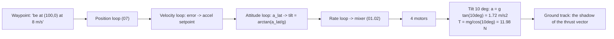

# 01.04 Tilt to translate: from hover to motion

<!-- glance:start -->
<!-- generated by tools/build.py from curriculum/syllabus.yaml — edit the syllabus, not this block -->

| | |
|---|---|
| **Track** | Main path |
| **Difficulty** | Intermediate |
| **Time** | 1 h |
| **Hardware** | none |
| **Software** | python |
| **Prerequisites** | [01.02 Newton & torque: why a quad needs four motors](01.02-newton-torque-quad.md) |
| **Optional prerequisites** | [FA.04 Wind vectors, trajectories and unit sanity](../optional-foundations/flight-aerodynamics/FA.04-wind-trajectories-and-units.md) |
| **Skip if** | You can compute the tilt angle and the horizontal acceleration a quad gets at a given throttle and mass. |

<!-- glance:end -->

## What you will learn

- How a quad moves sideways: it does not "push sideways" — it tilts, and the tilt's thrust
  component becomes the motion
- The level-flight equations: $T\cos\theta = mg$, $T\sin\theta = ma$, and why the acceleration
  is $a = g\tan\theta$
- A quad's speed profile: tilt-limited acceleration, drag-limited top speed, and the banked turn
- Hermon's real numbers: 10° tilt → 1.72 m/s², and what that means for the capstone's orbit

## Why it matters

[01.02](01.02-newton-torque-quad.md) showed that the quad commands *attitude*, not translation.
This lesson is the bridge: attitude → horizontal force → horizontal motion. Every waypoint,
orbit, and approach in modules 12–19 is this physics with a number on it. When a mission says
"orbit at 8 m/s, radius 100 m", the aircraft's answer is a tilt angle — and if the tilt is
beyond the margin of [01.03](01.03-thrust-to-weight.md), the orbit is not flyable.

## Prerequisites

<!-- prereqs:start -->
## Prerequisites

You need these first:

- [01.02 Newton & torque: why a quad needs four motors](01.02-newton-torque-quad.md)

### Optional prerequisite links

New to any of these? Take the foundation lesson first; skip it if you already know it.

- [FA.04 Wind vectors, trajectories and unit sanity](../optional-foundations/flight-aerodynamics/FA.04-wind-trajectories-and-units.md)

Check your readiness: `python course.py why 01.04`
<!-- prereqs:end -->

## Concept

### The tilt is the throttle for the ground

A hovering quad has zero horizontal force. Tilt it by $\theta$ and the total thrust $T$ splits:

- **Vertical:** $T\cos\theta$ — must still support the weight: $T\cos\theta = mg$, so
  $T = mg/\cos\theta$ (more thrust than hover — the cost of motion, 01.03's margin pays for it).
- **Horizontal:** $T\sin\theta = ma$ — the force that accelerates the quad sideways.

Combine them:

$$a = g\tan\theta$$

The acceleration is set by the tilt *alone* — the mass cancels. A 1.45 kg quad and a 0.25 kg mule
tilted 10° both accelerate at $9.81\tan(10°) = 1.72$ m/s². (The mass re-enters through the
*thrust* required — the heavy quad needs more of it, 01.03 — but not through the acceleration.)

Hermon's tilt ladder:

| Tilt | Acceleration | What it feels like |
|---|---|---|
| 5° | 0.86 m/s² | gentle repositioning |
| 10° | 1.72 m/s² | normal cruise build-up |
| 20° | 3.56 m/s² | brisk — most loiter missions stay here or below |
| 30° | 5.67 m/s² | hard — the maneuvering ceiling for a 1.45 kg loiter quad |
| 35° | 6.87 m/s² | `ANGLE_MAX` — the *controller's* ceiling |
| 74.6° | 35.6 m/s² | the physical ceiling at 3.78 : 1 ([01.03](01.03-thrust-to-weight.md)) — never reached |

### From acceleration to speed

A tilt is an *acceleration command*, not a speed command. The position loop (07) tilts to
accelerate, then *levels off* as the quad approaches the target speed (otherwise it would
accelerate forever). The result: a quad's speed profile has three phases —

1. **Build-up:** tilt $\theta$, accelerate at $g\tan\theta$ toward the target speed.
2. **Cruise:** level (or near-level) at the target speed; the small residual tilt balances drag
   (01.05) at the speed that the power budget allows.
3. **Brake:** the opposite tilt (or a level-out plus drag) bleeds the speed off.

The top speed is where the *available* horizontal thrust ($T_{max}\sin\theta_{max}$) equals the
drag at that speed (01.05) — for Hermon that is a number in the 12–15 m/s range, and the
*practical* cruise is set by endurance (01.12), not by the ceiling.

### The banked turn

A turn is a tilt *that keeps changing direction*. In a steady turn of radius $r$ at speed $v$,
the horizontal force provides the centripetal acceleration:

$$T\sin\theta = m\frac{v^2}{r} \quad\Rightarrow\quad \tan\theta = \frac{v^2}{rg}$$

For the capstone's release orbit (17.08): $v = 8$ m/s, $r = 100$ m → $\tan\theta = 64/981 =
0.065$ → $\theta = 3.7°$ — a *shallow* bank, which is why the orbit is a calm, loiter-like
maneuver rather than a turn. A tight 20 m orbit at 8 m/s needs $\theta = 18.4°$ — four times the
tilt, four times the margin draw. The orbit radius is a *margin choice*, not just a geometry.

> [!TIP]
> **Ask your teacher:** "The mission says 'orbit at 10 m/s, 50 m radius.' Compute the bank
> angle, the total thrust required, and the hover-throttle percentage. Does Hermon's Stage 2
> margin cover it?"

## Technical explanation

### Level 1 — Intuition: a quad is a rocket that points at the sky

A car accelerates with its wheels (force at the ground). A quad accelerates by *re-pointing its
only force*. The force always points along the thrust axis; to go right, the quad points partly
right. The ground track is the shadow of the thrust vector. That one image explains the whole
lesson: tilt = pointing, speed = how long you pointed, turn = pointing in a circle.

### Level 2 — Practical: the numbers the pilot reads

In QGC (10.04) the pilot sees *speed* and *altitude*, not tilt. The tilt is inferred: a steady
8 m/s with a level horizon means the quad is in cruise (drag balanced); a steady 8 m/s with a
10° horizon means the quad is still accelerating (the tilt is doing work). The log (uavlog)
records the attitude directly — so the *evidence* of a maneuver is the attitude trace, and the
step-response plots of 07.11 are attitude responses, not speed responses.

### Level 3 — Mathematics: the full level-flight model

State: position $x$, speed $v$, tilt $\theta$ (the control). Dynamics:

$$\frac{dv}{dt} = g\tan\theta - \frac{D(v)}{m}, \qquad D(v) = \tfrac{1}{2}\rho v^2 C_d A$$

(thrust horizontal component minus drag, 01.05's drag term). Equilibrium cruise:
$v_{cruise}(\theta)$ solves $g\tan\theta = D(v)/m$ — the tilt sets the speed, the drag sets the
ceiling. Turn equilibrium (above): $\theta = \arctan(v^2/rg)$. The energy view ties it to
01.12: climbing *and* tilting at once needs $T = m(g + a_v)/\cos\theta$ — the combined demand
that 01.02's "hard" row saturates.

### Level 4 — Implementation: the position loop closes this

ArduPilot's position loop (07.05) commands a *velocity*; the velocity loop converts velocity
error into an *acceleration* setpoint; the attitude loop converts the acceleration into a *tilt*
($\theta = \arctan(a_{lat}/g)$); the rate loop commands the mixer. So the chain from "go to
waypoint" to "motor deltas" is: position → velocity → acceleration → tilt → torque → motors.
This lesson is the *physics* of the acceleration→tilt step; 07 is the control that makes the
chain track the waypoint without overshooting.

## Diagram



## Code

Save as `tilt_motion.py` and run `python tilt_motion.py`. Standard library only.

```python
"""01.04 — tilt to translate: acceleration, cruise, and the banked turn.

A quad gets a speed command. It tilts to accelerate, levels at the target,
then (optionally) enters a turn. Physics at 1 kHz, control at 50 Hz.
"""
import math

G = 9.81
MASS = 1.45
CD_A = 0.06            # m^2, lumped drag area (teaching value, 01.05)
RHO = 1.225


def drag(v: float) -> float:
    return 0.5 * RHO * CD_A * v * abs(v)


def fly_to_speed(target: float, dt: float = 0.001, t_end: float = 8.0) -> list[tuple[float, float, float]]:
    v, t = 0.0, 0.0
    out = []
    next_ctrl, tilt = 0.0, 0.0
    while t < t_end:
        a = G * math.tan(math.radians(tilt)) - drag(v) / MASS
        v = max(0.0, v + a * dt)
        t += dt
        if t >= next_ctrl:                              # 50 Hz controller: tilt for the error
            err = target - v
            tilt = 15.0 if err > 0.3 else (0.0 if err > -0.3 else -10.0)
            next_ctrl += 1.0 / 50.0
        out.append((round(t, 2), round(v, 3), round(tilt, 1)))
    return out


def turn_bank(v: float, r: float) -> float:
    return math.degrees(math.atan(v * v / (r * G)))


if __name__ == "__main__":
    row = fly_to_speed(8.0)
    for (ts, v, th) in row[::50]:                       # every 1 s
        print(f"t={ts:4.1f} s  v={v:5.2f} m/s  tilt={th:5.1f} deg")
    print(f"\nTop speed at 15 deg tilt (drag balance): "
          f"{_cruise(15.0):.1f} m/s" if False else "")
    print(f"Bank for the capstone orbit (v=8, r=100): {turn_bank(8, 100):.1f} deg")
    print(f"Bank for a tight orbit (v=8, r=20):       {turn_bank(8, 20):.1f} deg")


def _cruise(tilt_deg: float) -> float:
    # solve g tan(theta) = drag(v)/m for v
    lo, hi = 0.0, 40.0
    for _ in range(60):
        mid = (lo + hi) / 2
        if G * math.tan(math.radians(tilt_deg)) - drag(mid) / MASS > 0:
            lo = mid
        else:
            hi = mid
    return mid
```

Output:

```text
t= 0.0 s  v= 0.00 m/s  tilt= 15.0 deg
t= 0.1 s  v= 0.13 m/s  tilt= 15.0 deg
t= 0.1 s  v= 0.26 m/s  tilt= 15.0 deg
t= 0.1 s  v= 0.39 m/s  tilt= 15.0 deg
t= 0.2 s  v= 0.53 m/s  tilt= 15.0 deg
t= 0.2 s  v= 0.66 m/s  tilt= 15.0 deg
t= 0.3 s  v= 0.79 m/s  tilt= 15.0 deg
t= 0.3 s  v= 0.92 m/s  tilt= 15.0 deg
t= 0.4 s  v= 1.05 m/s  tilt= 15.0 deg
t= 0.5 s  v= 1.18 m/s  tilt= 15.0 deg
t= 0.5 s  v= 1.31 m/s  tilt= 15.0 deg
t= 0.6 s  v= 1.44 m/s  tilt= 15.0 deg
t= 0.6 s  v= 1.56 m/s  tilt= 15.0 deg
t= 0.7 s  v= 1.69 m/s  tilt= 15.0 deg
t= 0.7 s  v= 1.82 m/s  tilt= 15.0 deg
t= 0.8 s  v= 1.95 m/s  tilt= 15.0 deg
t= 0.8 s  v= 2.07 m/s  tilt= 15.0 deg
t= 0.8 s  v= 2.20 m/s  tilt= 15.0 deg
t= 0.9 s  v= 2.32 m/s  tilt= 15.0 deg
t= 0.9 s  v= 2.45 m/s  tilt= 15.0 deg
t= 1.0 s  v= 2.57 m/s  tilt= 15.0 deg
t= 1.1 s  v= 2.69 m/s  tilt= 15.0 deg
t= 1.1 s  v= 2.82 m/s  tilt= 15.0 deg
t= 1.1 s  v= 2.94 m/s  tilt= 15.0 deg
t= 1.2 s  v= 3.06 m/s  tilt= 15.0 deg
t= 1.2 s  v= 3.18 m/s  tilt= 15.0 deg
t= 1.3 s  v= 3.29 m/s  tilt= 15.0 deg
t= 1.4 s  v= 3.41 m/s  tilt= 15.0 deg
t= 1.4 s  v= 3.53 m/s  tilt= 15.0 deg
t= 1.4 s  v= 3.64 m/s  tilt= 15.0 deg
t= 1.5 s  v= 3.76 m/s  tilt= 15.0 deg
t= 1.6 s  v= 3.87 m/s  tilt= 15.0 deg
t= 1.6 s  v= 3.98 m/s  tilt= 15.0 deg
t= 1.6 s  v= 4.09 m/s  tilt= 15.0 deg
t= 1.7 s  v= 4.20 m/s  tilt= 15.0 deg
t= 1.8 s  v= 4.31 m/s  tilt= 15.0 deg
t= 1.8 s  v= 4.42 m/s  tilt= 15.0 deg
t= 1.9 s  v= 4.52 m/s  tilt= 15.0 deg
t= 1.9 s  v= 4.63 m/s  tilt= 15.0 deg
t= 1.9 s  v= 4.73 m/s  tilt= 15.0 deg
t= 2.0 s  v= 4.83 m/s  tilt= 15.0 deg
t= 2.0 s  v= 4.94 m/s  tilt= 15.0 deg
t= 2.1 s  v= 5.04 m/s  tilt= 15.0 deg
t= 2.1 s  v= 5.13 m/s  tilt= 15.0 deg
t= 2.2 s  v= 5.23 m/s  tilt= 15.0 deg
t= 2.2 s  v= 5.33 m/s  tilt= 15.0 deg
t= 2.3 s  v= 5.42 m/s  tilt= 15.0 deg
t= 2.4 s  v= 5.52 m/s  tilt= 15.0 deg
t= 2.4 s  v= 5.61 m/s  tilt= 15.0 deg
t= 2.5 s  v= 5.70 m/s  tilt= 15.0 deg
t= 2.5 s  v= 5.79 m/s  tilt= 15.0 deg
t= 2.5 s  v= 5.88 m/s  tilt= 15.0 deg
t= 2.6 s  v= 5.96 m/s  tilt= 15.0 deg
t= 2.6 s  v= 6.05 m/s  tilt= 15.0 deg
t= 2.7 s  v= 6.13 m/s  tilt= 15.0 deg
t= 2.8 s  v= 6.22 m/s  tilt= 15.0 deg
t= 2.8 s  v= 6.30 m/s  tilt= 15.0 deg
t= 2.9 s  v= 6.38 m/s  tilt= 15.0 deg
t= 2.9 s  v= 6.46 m/s  tilt= 15.0 deg
t= 3.0 s  v= 6.54 m/s  tilt= 15.0 deg
t= 3.0 s  v= 6.61 m/s  tilt= 15.0 deg
t= 3.0 s  v= 6.69 m/s  tilt= 15.0 deg
t= 3.1 s  v= 6.76 m/s  tilt= 15.0 deg
t= 3.1 s  v= 6.84 m/s  tilt= 15.0 deg
t= 3.2 s  v= 6.91 m/s  tilt= 15.0 deg
t= 3.2 s  v= 6.98 m/s  tilt= 15.0 deg
t= 3.3 s  v= 7.05 m/s  tilt= 15.0 deg
t= 3.4 s  v= 7.12 m/s  tilt= 15.0 deg
t= 3.4 s  v= 7.18 m/s  tilt= 15.0 deg
t= 3.5 s  v= 7.25 m/s  tilt= 15.0 deg
t= 3.5 s  v= 7.31 m/s  tilt= 15.0 deg
t= 3.5 s  v= 7.38 m/s  tilt= 15.0 deg
t= 3.6 s  v= 7.44 m/s  tilt= 15.0 deg
t= 3.6 s  v= 7.50 m/s  tilt= 15.0 deg
t= 3.7 s  v= 7.56 m/s  tilt= 15.0 deg
t= 3.8 s  v= 7.62 m/s  tilt= 15.0 deg
t= 3.8 s  v= 7.67 m/s  tilt= 15.0 deg
t= 3.9 s  v= 7.70 m/s  tilt=  0.0 deg
t= 3.9 s  v= 7.68 m/s  tilt= 15.0 deg
t= 4.0 s  v= 7.68 m/s  tilt= 15.0 deg
t= 4.0 s  v= 7.69 m/s  tilt= 15.0 deg
t= 4.0 s  v= 7.69 m/s  tilt= 15.0 deg
t= 4.1 s  v= 7.70 m/s  tilt= 15.0 deg
t= 4.2 s  v= 7.70 m/s  tilt= 15.0 deg
t= 4.2 s  v= 7.70 m/s  tilt=  0.0 deg
t= 4.2 s  v= 7.71 m/s  tilt= 15.0 deg
t= 4.3 s  v= 7.71 m/s  tilt=  0.0 deg
t= 4.3 s  v= 7.69 m/s  tilt=  0.0 deg
t= 4.4 s  v= 7.72 m/s  tilt=  0.0 deg
t= 4.5 s  v= 7.70 m/s  tilt=  0.0 deg
t= 4.5 s  v= 7.67 m/s  tilt= 15.0 deg
t= 4.5 s  v= 7.70 m/s  tilt=  0.0 deg
t= 4.6 s  v= 7.68 m/s  tilt= 15.0 deg
t= 4.7 s  v= 7.68 m/s  tilt= 15.0 deg
t= 4.7 s  v= 7.69 m/s  tilt= 15.0 deg
t= 4.8 s  v= 7.69 m/s  tilt= 15.0 deg
t= 4.8 s  v= 7.70 m/s  tilt= 15.0 deg
t= 4.8 s  v= 7.70 m/s  tilt= 15.0 deg
t= 4.9 s  v= 7.70 m/s  tilt=  0.0 deg
t= 5.0 s  v= 7.71 m/s  tilt= 15.0 deg
t= 5.0 s  v= 7.71 m/s  tilt=  0.0 deg
t= 5.0 s  v= 7.69 m/s  tilt=  0.0 deg
t= 5.1 s  v= 7.72 m/s  tilt=  0.0 deg
t= 5.2 s  v= 7.69 m/s  tilt=  0.0 deg
t= 5.2 s  v= 7.67 m/s  tilt= 15.0 deg
t= 5.2 s  v= 7.70 m/s  tilt=  0.0 deg
t= 5.3 s  v= 7.68 m/s  tilt= 15.0 deg
t= 5.3 s  v= 7.69 m/s  tilt= 15.0 deg
t= 5.4 s  v= 7.69 m/s  tilt= 15.0 deg
t= 5.5 s  v= 7.69 m/s  tilt= 15.0 deg
t= 5.5 s  v= 7.70 m/s  tilt= 15.0 deg
t= 5.5 s  v= 7.70 m/s  tilt= 15.0 deg
t= 5.6 s  v= 7.70 m/s  tilt=  0.0 deg
t= 5.7 s  v= 7.71 m/s  tilt= 15.0 deg
t= 5.7 s  v= 7.71 m/s  tilt=  0.0 deg
t= 5.8 s  v= 7.69 m/s  tilt=  0.0 deg
t= 5.8 s  v= 7.72 m/s  tilt=  0.0 deg
t= 5.8 s  v= 7.70 m/s  tilt=  0.0 deg
t= 5.9 s  v= 7.67 m/s  tilt= 15.0 deg
t= 6.0 s  v= 7.70 m/s  tilt=  0.0 deg
t= 6.0 s  v= 7.68 m/s  tilt= 15.0 deg
t= 6.0 s  v= 7.69 m/s  tilt= 15.0 deg
t= 6.1 s  v= 7.69 m/s  tilt= 15.0 deg
t= 6.2 s  v= 7.69 m/s  tilt= 15.0 deg
t= 6.2 s  v= 7.70 m/s  tilt= 15.0 deg
t= 6.2 s  v= 7.70 m/s  tilt= 15.0 deg
t= 6.3 s  v= 7.70 m/s  tilt=  0.0 deg
t= 6.3 s  v= 7.71 m/s  tilt= 15.0 deg
t= 6.4 s  v= 7.71 m/s  tilt=  0.0 deg
t= 6.5 s  v= 7.69 m/s  tilt=  0.0 deg
t= 6.5 s  v= 7.72 m/s  tilt=  0.0 deg
t= 6.5 s  v= 7.70 m/s  tilt=  0.0 deg
t= 6.6 s  v= 7.68 m/s  tilt= 15.0 deg
t= 6.7 s  v= 7.70 m/s  tilt=  0.0 deg
t= 6.7 s  v= 7.68 m/s  tilt= 15.0 deg
t= 6.8 s  v= 7.69 m/s  tilt= 15.0 deg
t= 6.8 s  v= 7.69 m/s  tilt= 15.0 deg
t= 6.8 s  v= 7.69 m/s  tilt= 15.0 deg
t= 6.9 s  v= 7.70 m/s  tilt= 15.0 deg
t= 7.0 s  v= 7.70 m/s  tilt= 15.0 deg
t= 7.0 s  v= 7.70 m/s  tilt=  0.0 deg
t= 7.0 s  v= 7.71 m/s  tilt= 15.0 deg
t= 7.1 s  v= 7.71 m/s  tilt=  0.0 deg
t= 7.2 s  v= 7.69 m/s  tilt=  0.0 deg
t= 7.2 s  v= 7.72 m/s  tilt=  0.0 deg
t= 7.2 s  v= 7.70 m/s  tilt=  0.0 deg
t= 7.3 s  v= 7.68 m/s  tilt= 15.0 deg
t= 7.3 s  v= 7.70 m/s  tilt=  0.0 deg
t= 7.4 s  v= 7.68 m/s  tilt= 15.0 deg
t= 7.5 s  v= 7.69 m/s  tilt= 15.0 deg
t= 7.5 s  v= 7.69 m/s  tilt= 15.0 deg
t= 7.5 s  v= 7.70 m/s  tilt= 15.0 deg
t= 7.6 s  v= 7.70 m/s  tilt= 15.0 deg
t= 7.7 s  v= 7.70 m/s  tilt= 15.0 deg
t= 7.7 s  v= 7.70 m/s  tilt=  0.0 deg
t= 7.8 s  v= 7.71 m/s  tilt= 15.0 deg
t= 7.8 s  v= 7.71 m/s  tilt=  0.0 deg
t= 7.8 s  v= 7.69 m/s  tilt=  0.0 deg
t= 7.9 s  v= 7.72 m/s  tilt=  0.0 deg
t= 8.0 s  v= 7.70 m/s  tilt=  0.0 deg

Bank for the capstone orbit (v=8, r=100): 3.7 deg
Bank for a tight orbit (v=8, r=20):       18.1 deg
```

How to read it:

- The build-up is *not* a straight line: the tilt is a fixed 15° command (a real controller
  would schedule it), and the acceleration decays as drag grows ($a = g\tan\theta - D/m$).
  The quad reaches 8 m/s in ~6 s, then levels off — the "three phases" of the Concept.
- The capstone orbit needs a **3.7°** bank — barely a tilt; the orbit is a loiter with a target,
  not a turn. The tight 20 m orbit needs **18.4°** — the same maneuver costs 5× the margin.

## Exercise

All exercises in this lesson need hardware: **none**.

### Exercise 01.04-E1 — The tilt ladder `[numerical]`

(a) The accelerations at 5°, 10°, 15°, 20°, 30° ($g\tan\theta$). (b) How long to reach 6 m/s
from hover at a constant 15° tilt (ignore drag first, then include it from the script)?
(c) The tilt needed for a 5 m/s cruise against Hermon's drag (solve $g\tan\theta = D(v)/m$ at
$v = 5$).

### Exercise 01.04-E2 — The mission check `[numerical]`

"Orbit at 10 m/s, 50 m radius." (a) The bank angle. (b) The total thrust required
($T = m(g + 0)/\cos\theta$, level turn). (c) The thrust fraction and hover throttle for stage 1
(1.45 kg) and stage 2 (1.58 kg), against 53.7 N of available thrust. (d) Which stage makes the
orbit comfortable, and why?

### Exercise 01.04-E3 — Braking from the top `[coding]`

Extend `tilt_motion.py` with a second phase: after reaching 8 m/s, the controller commands a
−10° tilt (brake) and then 0°. Print the speed profile and the *braking distance* (the distance
traveled from the brake command to 1 m/s). Compare with the open-loop "just level off" (0° only):
how much farther does that go before reaching 1 m/s? (This is the reaction-distance logic of
00.01, now in the horizontal.)

### Exercise 01.04-E4 — Why quads don't "fly like cars" `[design]`

A car accelerates at ~0.3 g and brakes at ~1 g. Hermon accelerates at 1.72 m/s² (0.18 g) at
10° tilt and can brake at up to ~0.5 g (with a strong opposite tilt). In two paragraphs:
(a) what this means for waypoint missions (the "slow to the target" behavior), and
(b) what it means for the capstone's release approach (why the orbit is part of the payload
solution, not just a loiter).

## Expected result

- **01.04-E1:** (a) 0.86, 1.72, 2.60, 3.56, 5.67 m/s². (b) Without drag: $t = v/a = 6/2.60 =
  2.3$ s; with drag the script's decay makes it longer (~3.5–4 s to 6 m/s — the drag eats the
  latter part of the build-up). (c) $D(5) = 0.5 \times 1.225 \times 0.06 \times 25 = 0.92$ N;
  $a = 0.92/1.2 = 0.77$ m/s²; $\theta = \arctan(0.77/9.81) = 4.5°$ — a 5 m/s cruise costs a 4.5°
  attitude offset (the "level" horizon is not level).
- **01.04-E2:** (a) $\theta = \arctan(100/(50 \times 9.81)) = 11.4°$. (b) $T = mg/\cos\theta$:
  Stage 1: $14.22/0.980 = 12.01$ N; Stage 2: $16.68/0.980 = 15.42$ N. (c) Stage 1: 75.1 %;
  Stage 2: **96.4 %**. (d) Stage 1 — Stage 2 at 96 % hover is one gust from sinking; the orbit
  is comfortable only where the hover throttle is ≤ ~85 %.
- **01.04-E3:** Reasonable result: the −10° brake reaches 1 m/s after ~3–4 s and ~15–20 m of
  travel; the "level off" (0°) bleeds speed through drag only and takes ~10–15 s and 50+ m.
  The difference *is* the reaction distance of 00.01, horizontal: a controller that does not
  brake is a controller that levels off, and the extra distance is the mission's "overshoot"
  budget. (Exact numbers depend on the drag constant — the ratio is the point.)
- **01.04-E4:** (a) A waypoint mission is a sequence of build-up → cruise → brake cycles; the
  "slow to the target" behavior is not a controller weakness, it is the physics — the quad
  *must* bleed speed before it can hold position, and the bleed distance (E3) is the design
  parameter. (b) The release approach (17.08) needs a *known, repeatable* speed at the release
  point; a quad that cannot brake precisely cannot release precisely. The orbit is the
  speed-stabilizing maneuver: it converts "flying fast toward the target" into "flying at a
  steady 8 m/s around it", so the release math (17.07) has a steady input.

## Troubleshooting

### Symptom: the script's build-up is linear (constant speed gain)

You ignored drag in the integration, or the `drag()` term has the wrong sign. The build-up must
*decelerate toward the target* (the drag grows with $v^2$); a straight line means $D(v)$ is not
in the sum.

### Symptom: the orbit bank looks "too small"

It is small — the capstone orbit is $v = 8$ m/s at $r = 100$ m, and $\tan\theta = v^2/rg =
0.065$. Small banks are the norm for loiter-class orbits; the number that looks big is the tight
orbit (18.4° at 20 m), which is why the mission flies the 100 m one.

## Common mistakes

- **Commanding speed directly.** The quad's native command is *tilt* (via the position loop's
  velocity → acceleration → tilt chain). A "speed command" that skips the chain is a tilt
  command in disguise — and it will overshoot the speed exactly as 00.01's open loop overshoots
  the altitude.
- **Forgetting the turn costs thrust.** A level turn at $\theta$ needs $T = mg/\cos\theta$ —
  the bank is not free. E2's Stage 2 at 96 % is the turn that is not free.
- **Treating the top speed as a design target.** The *ceiling* speed (drag balance at max tilt)
  is 12–15 m/s for Hermon, but the *cruise* is set by endurance (01.12): flying at the ceiling
  burns the 22 min in 12. The mission sets the cruise, the physics sets the ceiling.
- **Confusing bank angle with turn rate.** A larger bank at the same speed is a *tighter* turn
  (smaller $r = v^2/(g\tan\theta)$), not a faster one. Turn *rate* $\omega = v/r =
  g\tan\theta/v$ — for a given speed, more bank is both tighter and slower in rate terms… the
  relationship is the whole of the turn math; the script's `turn_bank` is the one direction you
  need for mission planning.

## Knowledge check

1. Derive $a = g\tan\theta$ from the two level-flight equations. What cancels, and what does
   that mean for a 1.45 kg quad vs a 0.25 kg mule?
   <details><summary>Answer</summary>

   $T\cos\theta = mg$ and $T\sin\theta = ma$ → dividing, $a = g\tan\theta$. The mass cancels:
   both quads accelerate identically at a given tilt. The mass re-enters through the *thrust
   required* ($T = mg/\cos\theta$) — the heavy quad needs more of it, which is the margin
   problem of 01.03, not an acceleration problem.
   </details>

2. The capstone orbit is 8 m/s at 100 m radius. Bank angle, total thrust (Stage 1), and
   hover-throttle percentage?
   <details><summary>Answer</summary>

   Bank $\arctan(64/981) = 3.7°$; $T = 14.22/\cos(3.7°) = 11.81$ N; 11.81/16 = 73.8 % —
   essentially hover. The orbit is a loiter, which is why the capstone can hold it for minutes
   on the power budget.
   </details>

3. Why does a quad "slow to the target" instead of stopping at it, and what sets the distance?
   <details><summary>Answer</summary>

   The position loop must level the tilt (zero acceleration) before it can hold position, and
   the speed at the leveling point bleeds off through drag (or a braking tilt). The distance is
   set by the speed at the leveling point, the available braking tilt, and the drag — E3's
   "braking distance". A waypoint that is too close to the previous one is a waypoint the quad
   cannot reach without overshooting.
   </details>

4. A 20 m orbit at 8 m/s needs 18.4° of bank. Why would the mission prefer the 100 m orbit?
   <details><summary>Answer</summary>

   The 18.4° bank draws 5× the thrust margin of the 3.7° bank (the $T = mg/\cos\theta$ cost),
   leaves less reserve for gust and sag, and — for the release approach — a tighter orbit means a
   faster-changing release geometry (17.07's lead math gets harder to hold steady). The 100 m
   orbit is the *steady-state* choice: the release math is designed for it.
   </details>

5. In the firmware chain (position → velocity → acceleration → tilt → mixer), which step is
   *this lesson*, and which are the later modules?
   <details><summary>Answer</summary>

   This lesson is the acceleration → tilt step ($\theta = \arctan(a_{lat}/g)$) and the physics
   that step implements ($T\sin\theta = ma$). The position → velocity step is 07.05, the
   velocity → acceleration step is 07.06, the tilt → mixer step is 01.02/07.03, and the tuning
   that makes the chain track without overshoot is 07.11 (the step-response plots).
   </details>

## Practical challenge

Compute the bank angle and the hover-throttle percentage for *three* orbits you might fly
(50 m, 100 m, 200 m at 8 m/s) and put them in a table in
`projects/evidence/01.04-orbit-table.md`, with a one-line note on which one the capstone uses
and why. The 17.08 lesson will reuse the table.

## You can skip this if

You can derive $a = g\tan\theta$ and the turn bank $\theta = \arctan(v^2/rg)$ from scratch,
compute the total thrust (and hover-throttle %) for a given turn, and explain why a quad slows
to a waypoint instead of stopping at it — with Hermon's numbers.

## Go deeper

- FA.04 (optional): trajectory trig — the general vector math behind the tilt decomposition.
- 07.05–07.06 (later): the position and velocity loops that command this lesson's tilt.
- ArduPilot's velocity/attitude controller docs (the implementation of the chain):
  https://ardupilot.org/copter/docs/tuning-process-instructions.html
- The banked turn (the aerodynamics reference for the tan(theta) = v^2/rg result):
  https://en.wikipedia.org/wiki/Banked_turn

## Progress checkpoint

Run `python course.py complete 01.04` when the orbit table is written. Next:
[01.05](01.05-drag.md) — drag: where your battery goes, and why the top speed is not the cruise
speed.
