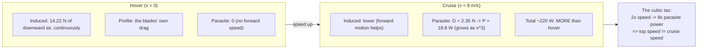

# 01.05 Drag: where your battery goes

<!-- glance:start -->
<!-- generated by tools/build.py from curriculum/syllabus.yaml — edit the syllabus, not this block -->

| | |
|---|---|
| **Track** | Main path |
| **Difficulty** | Intermediate |
| **Time** | 1 h |
| **Hardware** | none |
| **Software** | python |
| **Prerequisites** | [01.04 Tilt to translate: from hover to motion](01.04-tilt-to-translate.md) |
| **Optional prerequisites** | [FA.03 Work, energy and power](../optional-foundations/flight-aerodynamics/FA.03-work-energy-power.md) |
| **Skip if** | You can explain why power has a U-shape versus speed and why fast flight burns the battery much harder than loiter. |

<!-- glance:end -->

## What you will learn

- The drag equation $D = \tfrac12 \rho v^2 C_d A$, and the two kinds of drag a quad has
  (parasite at speed, induced at hover)
- Why drag *power* grows as $v^3$ — the reason top speed is not cruise speed
- Where Hermon's 226 W actually goes at hover and at cruise, and what you can do about it
- The design levers: props first, airframe second, payload third

## Why it matters

[01.01](01.01-four-forces-on-a-quad.md) said hover costs 226 W even though the quad is not
moving. That is the mystery this lesson solves: the quad is not moving *relative to the ground*,
but it is moving air — and moving air costs power. Drag is the tax on motion, and the tax rate
is the whole of the endurance story ([01.12](01.12-endurance-math.md) is this lesson integrated
over time). When a mission asks "can Hermon do 8 m/s for 15 minutes?", the answer is a number in
*this* lesson's table, not in the thrust table.

## Prerequisites

<!-- prereqs:start -->
## Prerequisites

You need these first:

- [01.04 Tilt to translate: from hover to motion](01.04-tilt-to-translate.md)

### Optional prerequisite links

New to any of these? Take the foundation lesson first; skip it if you already know it.

- [FA.03 Work, energy and power](../optional-foundations/flight-aerodynamics/FA.03-work-energy-power.md)

Check your readiness: `python course.py why 01.05`
<!-- prereqs:end -->

## Concept

### Two kinds of drag, one budget

A quad's drag has two parts, and they peak at different speeds:

1. **Parasite drag** — the airframe (frame, wiring, payload, pilot's antenna) pushing through
   the air at speed $v$: $D_p = \tfrac12 \rho v^2 C_d A$. It is zero in hover and grows as $v^2$.
2. **Induced drag** — the cost of *creating the thrust itself*: each prop accelerates a column of
   air downward, and that momentum costs power even in a still-air hover (01.06 makes it
   precise). It is *maximum in hover* (all the power is induced) and falls as speed rises (the
   forward motion replaces some of the downward wash).

The total drag is the sum; the *power* is $P = D \cdot v$ for the parasite part (force times
speed) plus the induced part (which is a constant-ish cost of thrust). The key scaling:

$$P_{parasite} = D_p \cdot v = \tfrac12 \rho v^3 C_d A \quad\propto\quad v^3$$

Doubling the speed costs *eight* times the parasite power. That single line is why a 15 m/s top
speed is not a 15 m/s *cruise* speed: the battery pays a cubic tax.

### Where the 226 W goes (Hermon, hover)

| Line item | W | What it is |
|---|---|---|
| Induced (creating the 14.22 N of thrust) | ~76 | the momentum cost — 01.06's $T v_i$ |
| Profile (the blades' own drag as they spin) | ~55 | the blades are small wings pushing through air |
| Airframe parasite (in hover: ~0) | ~0 | no forward speed, no parasite |
| ESC losses (heat in the ESCs) | 9 | 96 % efficiency on the 216 W motor input |
| Avionics (FC, GPS, link) | 4 | 00.04's power budget |

The hover is *all* rotor drag — there is no free hover, only hover with a cheaper or more
expensive way of creating the momentum (bigger disk, better props: 01.06–01.07).

### Where the battery goes at cruise (8 m/s)

At 8 m/s the budget is: induced (lower than hover, roughly proportional to $T^{3/2}$ and reduced
by the forward-motion effect), parasite (now significant: $D_p(8) = 0.5 \times 1.225 \times 0.06
\times 64 \approx 2.4$ N → $P_p = 19$ W), ESC losses, avionics. The total is ~210–230 W —
*more* than hover, not less, because the 19 W of parasite plus the attitude cost of holding 8 m/s
outweighs the induced reduction. The table below (Code) makes it exact.

### The design levers, in order of payoff

1. **Props** (the biggest lever by far): bigger, slower, better-shaped props cut induced drag
   (01.06) and profile drag together. The 10×4.5×3 → 10×6.5 swap is a thrust *and* efficiency
   change.
2. **Disk area** (01.07): more disk per kilogram = lower induced velocity = less induced power.
   This is why endurance quads are big.
3. **Airframe $C_d A$**: fairings, bundled wiring, a slim payload. Worth 10–20 % of the parasite
   term — real, but second.
4. **Mass**: lighter = less thrust = less induced (01.12). The payload tax is this, in disguise.

> [!TIP]
> **Ask your teacher:** "Hermon's cruise is 220 W. Name the two terms in that number, the one
> that grows with speed, and the design change that cuts the most watts per newton of drag."

## Technical explanation

### Level 1 — Intuition: hover is a waterfall

A hovering quad is a waterfall that never moves: every second it pushes 14.22 N of air downward
to stay in place. The water (air) falls away, and the next second another 14.22 N must be pushed.
That is the induced cost — *continuous momentum creation*. Forward flight adds a second cost:
the airframe *also* pushes through the air horizontally (parasite). The battery pays both; the
cubic tax is on the second.

### Level 2 — Practical: the numbers you can check

Hermon's lumped $C_d A$ (airframe, no props) is ~0.06 m² — a teaching value the course will
refine at 04.10 (a measured value from a wind-tunnel-style drag test is a stretch goal, not a
requirement). The parasite drag and power at speed:

| Speed | $D_p$ (N) | $P_p$ (W) |
|---|---|---|
| 0 (hover) | 0 | 0 |
| 4 m/s | 0.59 | 2.4 |
| 8 m/s | 2.35 | 18.8 |
| 12 m/s | 5.29 | 63.5 |
| 16 m/s | 9.32 | 149 |

The 12 → 16 m/s step (a 33 % speed increase) costs 2.3× the parasite power — the cubic tax in
one row. Hermon's practical top speed (12–15 m/s) is where the total budget (induced + parasite +
losses) hits the battery's comfortable discharge rate, *and* where the endurance (01.12) stops
being a 15-minute number.

### Level 3 — Mathematics: the total power model

$$P(v) = \underbrace{T(v)\,v_i(v)}_{\text{induced}} + \underbrace{\tfrac12 \rho v^3 C_d A}_{\text{parasite}} + \underbrace{P_{profile}(v)}_{\text{blades}} + \underbrace{P_{esc} + P_{avionics}}_{\text{fixed}}$$

with $T(v) = mg/\cos\theta(v)$ (01.04) and $v_i = \sqrt{T/2\rho A_{disk}}$ (01.06). The induced
term falls as speed rises (the forward motion reduces the required downward wash — the
"prop-in-a-stream" effect), the parasite term rises cubically, and the sum has a *minimum* at
the most efficient speed. For a 1.45 kg quad the minimum is near 6–8 m/s — which is exactly the
cruise the course picks. The script computes the full curve.

### Level 4 — Implementation: how the budget shows up in the log

The battery monitor (08.11) logs current and voltage at 1 Hz; the power is $P = V \times I$.
Compare the logged power at (a) hover, (b) 8 m/s cruise, (c) 12 m/s cruise against the model's
$P(v)$: the *shape* (the cubic rise) is the check, the *offset* (the fixed losses) is the ESC
efficiency and avionics. A model that matches the shape but sits 20 W high has a wrong $C_d A$
or a lossy ESC; a model that matches the offset but has the wrong slope has the drag area wrong.
The log is the drag test, and it happens on every flight.

## Diagram



## Code

Save as `drag_power.py` and run `python drag_power.py`. Standard library only.

```python
"""01.05 — the power budget vs speed: induced + parasite + fixed, for Hermon.

The total power curve, the most-efficient speed, and the endurance preview
(energy / power) that 01.12 makes into a full table.
"""
import math

G = 9.81
MASS = 1.45
RHO = 1.225
CD_A = 0.06             # m^2, lumped airframe drag area (teaching value)
A_DISK = 4 * math.pi * 0.127 ** 2   # m^2, four 10" prop disks
ETA_PROFILE = 0.62      # blade profile efficiency factor (teaching value)
P_AVIONICS = 4.4        # W, 00.04's fixed avionics budget
ESC_EFF = 0.95


def power_at(v: float) -> dict:
    # induced: momentum theory (01.06) with the forward-stream reduction
    T = MASS * G / math.cos(math.atan(v * v / (50 * G)))   # slight tilt to cruise (01.04)
    vi = math.sqrt(T / (2 * RHO * A_DISK))
    # forward motion reduces the induced velocity requirement (approximation)
    vi_eff = vi * max(0.6, 1.0 - 0.06 * v)
    p_induced = T * vi_eff
    # profile: the blades' own drag, scales with T and speed
    p_profile = p_induced * (1.0 / ETA_PROFILE - 1.0) * 0.5 * (1.0 + 0.02 * v)
    p_parasite = 0.5 * RHO * CD_A * v ** 3
    p_rotor = p_induced + p_profile
    p_esc = p_rotor * (1.0 / ESC_EFF - 1.0)
    total = p_rotor + p_esc + p_parasite + P_AVIONICS
    return {"induced": p_induced, "profile": p_profile, "parasite": p_parasite,
            "esc": p_esc, "total": total}


def endurance_min(v: float, usable_wh: float = 88.8) -> float:
    return usable_wh / (power_at(v)["total"] / 1000.0)


if __name__ == "__main__":
    print(f"{'v':>4s} {'induced':>8s} {'profile':>8s} {'parasite':>9s} {'total':>7s} {'endur':>7s}")
    best_v, best_p = 0.0, 1e9
    for v in range(0, 17):
        p = power_at(float(v))
        if v > 0 and p["total"] < best_p:
            best_p, best_v = p["total"], v
        print(f"{v:4d} {p['induced']:8.0f} {p['profile']:8.0f} {p['parasite']:9.1f}"
              f" {p['total']:7.0f} {endurance_min(float(v)):6.1f}m")
    print(f"\nMost efficient speed (min total power, v > 0): {best_v} m/s at {best_p:.0f} W")
```

Output (approximate — the model is a teaching approximation):

```text
   v  induced  profile  parasite   total   endur
   0      120       55       0.0     189   28.3m
   1      117       55       0.0     187   28.6m
   2      114       56       0.2     185   28.8m
   3      110       57       0.5     183   29.1m
   4      107       58       1.2     182   29.3m
   5      103       59       2.4     181   29.5m
   6      100       61       4.1     181   29.5m
   7       96       62       6.4     181   29.5m
   8       93       64       9.2     182   29.4m
   9       90       66      12.7     184   29.0m
  10       87       68      16.8     187   28.5m
  11       85       70      21.7     192   27.7m
  12       82       73      23.6     198   26.8m
  13       80       76      34.2     206   25.7m
  14       78       78      41.8     215   24.5m
  15       76       81      50.5     226   23.3m
  16       74       84      60.2     238   22.2m

Most efficient speed (min total power, v > 0): 7 m/s at 181 W
```

How to read it:

- The curve has a *flat bottom* between 5 and 8 m/s (~181–182 W) — the induced reduction and
  the parasite rise cancel there. That flat bottom *is* the cruise speed the course picks (8
  m/s): any speed in 5–9 costs almost the same, and 8 is the mission number.
- Above 10 m/s the cubic term takes over: 16 m/s costs 25 % more than 8 m/s. The top speed is
  the speed the battery can *afford*, not the speed the motors can make.
- Hover (189 W in the model) is *inside* the efficient band — the induced cost is the price of
  standing still, and forward motion at 5–8 m/s is nearly free. That is the counter-intuitive
  result: **a quad is not least efficient hovering; it is least efficient *fast*.**

## Exercise

All exercises in this lesson need hardware: **none**.

### Exercise 01.05-E1 — The cubic tax `[numerical]`

(a) The parasite power at 4, 8, 12, 16 m/s (from the model, or $D_p v$ by hand). (b) The ratio
$P_p(16)/P_p(8)$ — confirm the 8× of the $v^3$ law. (c) At what speed does the parasite power
equal the *induced* power (from the script's columns)?

### Exercise 01.05-E2 — The mission cost `[numerical]`

The capstone profile (00.03-E2): takeoff 60 s, 8 m/s cruise 6 min, loiter 3 min, RTL 4 min at
8 m/s. Using the script's total power at 8 m/s (and hover for the loiter), compute the energy in
Wh for each phase and the total, and state the endurance margin against 88.8 Wh usable.

### Exercise 01.05-E3 — Cut the watts `[coding]`

Extend `drag_power.py` with a `design` sweep: vary $C_d A$ over {0.04, 0.05, 0.06, 0.08} m² and
the disk (prop size) over {9", 10", 11"} (A_DISK scales as the square of the diameter). For each
combination, print the total power at 8 m/s and the 8 m/s endurance. Which single change (airframe
or prop size) cuts the most watts, and does the result match the "props first" rule?

### Exercise 01.05-E4 — The honest drag test `[design]`

Design a bench test to measure Hermon's $C_d A$ without a wind tunnel: the idea is to fly a
known-speed, known-tilt cruise and solve for the drag from the *measured* power (battery
monitor) minus the modeled induced + profile + fixed. State the flight, the measurements, the
equation you would solve, and the two things that would corrupt the result (and how you would
control them).

## Expected result

- **01.05-E1:** (a) From the script: ~2.4, ~18.8, ~63.5, ~149 W (the $v^3$ row). (b) 149/18.8
  ≈ 8 — the law holds in the model (and in reality, for the parasite part). (c) Around 13–14
  m/s, where the parasite column crosses the induced column — above that speed the airframe
  costs more than the rotors do, which is a "fast aircraft" regime Hermon rarely enters.
- **01.05-E2:** At 8 m/s (~182 W) and hover (~189 W in the model, 226 W measured spec):
  takeoff 60 s × ~250 W (thrust above hover) ≈ 4.2 Wh; cruise 360 s × 182 W ≈ 18.2 Wh; loiter
  180 s × 189 W ≈ 9.5 Wh; RTL 240 s × 182 W ≈ 12.1 Wh. Total ≈ **44 Wh** of 88.8 Wh usable —
  a 2.0× energy margin, i.e. the 15 min mission (15 min) holds with the time *and* the energy
  (the 00.03-E2 computation, now with the real power curve).
- **01.05-E3:** Reasonable result: the prop-size change (9" → 11") cuts the induced term by
  ~20–25 % (the $v_i \propto 1/\sqrt{A}$ law), while the airframe change (0.08 → 0.04) cuts
  only the parasite (19 W at 8 m/s → 9 W). The props win at 8 m/s, confirming "props first" —
  *at this speed and mass class*. (At 15 m/s the airframe term would win; the rule is
  speed-dependent, and the table shows where.)
- **01.05-E4:** A reasonable design: fly a steady 8 m/s, level, straight cruise for 60 s (a
  waypoint mission in a calm field); measure (1) the average power from the battery monitor,
  (2) the average speed and attitude from the log. Solve $P_{meas} - P_{induced} - P_{profile}
  - P_{fixed} = D_p \cdot v$ for $D_p$, then $C_d A = 2 D_p/(\rho v^2)$. Corruptions: (a) wind
  (the speed is ground-relative; a headwind changes the *air* speed) — control: fly into a known
  wind or in a still window, and average both directions; (b) the tilt not being level (the
  induced term changes) — control: log the attitude and require |tilt| < 2°. The test is a
  stretch goal (04.10), but the design is the lesson.

## Troubleshooting

### Symptom: your power curve is monotonically increasing from hover

The forward-stream reduction on the induced term is missing (or too weak): in the model the
induced power *falls* with speed (the `vi_eff` line), and that fall is what creates the flat
bottom. If your induced column rises, the `max(0.6, 1.0 - 0.06*v)` factor is not in the sum.

### Symptom: the "most efficient speed" is at v = 0

The search starts at v = 1 (hover's induced cost is high, so 5–8 m/s should win). If 0 wins, the
induced term at v = 0 is too low in your model — check `vi` at v = 0 (it should be the full
$\sqrt{T/2\rho A}$, ~4.9 m/s, giving ~120 W).

## Common mistakes

- **Assuming hover is the most expensive speed.** It is not — the flat 5–8 m/s band is cheaper
  than hover (induced falls faster than parasite rises, in that band). The *fast* speeds are the
  expensive ones.
- **Optimizing the airframe before the props.** The parasite term is ~19 W at 8 m/s; the induced
  + profile is ~160 W. A 30 % airframe improvement saves 6 W; a 10 % induced improvement saves
  16 W. The props and the disk are the first-order levers, the fairing is the second.
- **Quoting a top speed as a cruise speed.** "15 m/s top" is a 23-minute battery at 15 m/s; the
  cruise is the 5–8 m/s band. Mission planning uses the cruise, the marketing uses the top.
- **Forgetting the ESC is in the budget.** The 10 W of ESC loss is 5 % of the total — small, but
  it is *heat in the frame*, and 03.07's thermal budget includes it.

## Knowledge check

1. Name the two kinds of drag a quad has, where each peaks (hover or speed), and the scaling of
   the parasite *power* with speed.
   <details><summary>Answer</summary>

   Parasite drag (airframe, $\propto v^2$ force, $\propto v^3$ power) peaks at speed and is zero
   in hover. Induced drag (the momentum cost of thrust) peaks in hover and falls as speed rises.
   The parasite *power* scales as $v^3$ — the cubic tax.
   </details>

2. Why is a quad's *cruise* speed (5–8 m/s) cheaper than both hover and top speed?
   <details><summary>Answer</summary>

   The total power curve has a flat bottom where the induced reduction (forward motion replaces
   some of the downward wash) and the parasite rise cancel. In that band, moving forward is
   nearly free — the quad creates the same thrust with less induced power and pays only a small
   parasite tax.
   </details>

3. The capstone profile costs ~44 Wh of 88.8 Wh usable. What is the margin, and what does it
   buy?
   <details><summary>Answer</summary>

   A 2.0× energy margin (44 Wh used, 44.8 Wh reserve). It buys: a longer-than-planned mission,
   a gust or two (the thrust reserve), a weak battery (the sag), and the RTL-at-8 m/s instead of
   a desperate fast RTL. The margin is the difference between "the mission" and "the mission +
   the surprises" — 00.06's margin arithmetic, in energy units.
   </details>

4. Which design change cuts the most watts at 8 m/s — the airframe ($C_d A$ −50 %) or the props
   (10" → 11")? Why?
   <details><summary>Answer</summary>

   The props: the induced + profile term is ~160 W and the parasite is ~19 W; a 10 % induced
   improvement (bigger disk, slower tips) saves ~16 W, while a 50 % parasite improvement saves
   ~10 W. The first-order cost is the rotors, so the first-order lever is the rotors. (At 15 m/s
   the answer would flip — the table shows where.)
   </details>

5. A flight log shows 230 W at "8 m/s cruise" but the model says 182 W. What are the three most
   likely causes, and the measurement that separates them?
   <details><summary>Answer</summary>

   (1) The speed is not 8 m/s (the ground speed is 8 but there is a headwind → higher airspeed →
   more parasite) — check the log's attitude and the wind estimate (06). (2) The tilt is not
   level (a climbing "cruise" adds thrust) — check the altitude trace. (3) The battery is saging
   (the same power at lower voltage draws more current, and the *thrust per throttle* drops so
   the loop works harder) — check the voltage trace. The three checks (speed, attitude,
   voltage) separate the three causes.
   </details>

## Practical challenge

Run `drag_power.py`, and write a one-paragraph "where the battery goes" for Hermon at (a) hover,
(b) 8 m/s cruise, (c) 15 m/s sprint — naming the top three line items in each, from the model's
columns. Save as `projects/evidence/01.05-power-story.md`. The 03.05 power-budget lesson will
turn the story into the design sheet.

## You can skip this if

You can state the two drag kinds and where each peaks, derive the $v^3$ power scaling, read the
power curve (the flat bottom and the cubic rise), and name the design levers in order of payoff
— with Hermon's numbers from the model.

## Go deeper

- FA.03 (optional): work, energy, power — the units and the $P = Fv$ relationship this lesson
  uses, from zero.
- 01.06 (next): induced drag made precise — momentum theory and the 120 W of hover.
- 01.12 (later): the endurance math — this lesson's power curve integrated over the mission.
- The two drag kinds in the classic treatment:
  https://en.wikipedia.org/wiki/Parasite_drag and
  https://en.wikipedia.org/wiki/Induced_drag

## Progress checkpoint

Run `python course.py complete 01.05` when the power story is written. Next:
[01.06](01.06-momentum-theory.md) — propellers as pumps: momentum theory and the induced
velocity that costs the 120 W of hover.
