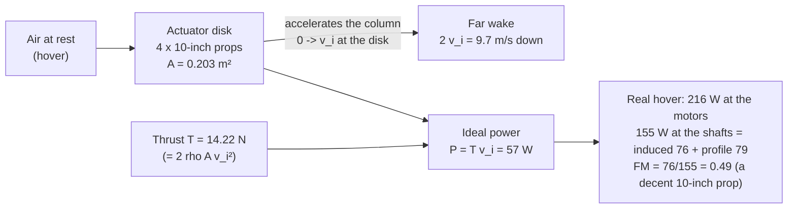

# 01.06 Propellers as pumps: momentum theory and induced velocity

<!-- glance:start -->
<!-- generated by tools/build.py from curriculum/syllabus.yaml — edit the syllabus, not this block -->

| | |
|---|---|
| **Track** | Main path |
| **Difficulty** | Intermediate |
| **Time** | 1 h 15 min |
| **Hardware** | none |
| **Software** | python |
| **Prerequisites** | [01.03 Thrust, weight and the thrust-to-weight ratio](01.03-thrust-to-weight.md) |
| **Optional prerequisites** | [FA.03 Work, energy and power](../optional-foundations/flight-aerodynamics/FA.03-work-energy-power.md) |
| **Skip if** | You can derive hover induced velocity from thrust and disk area, and explain why big slow props are efficient. |

<!-- glance:end -->

## What you will learn

- The actuator-disk model: a prop is a pump that accelerates a column of air, and the power it
  costs is $P = T v_i$
- The induced velocity $v_i = \sqrt{T/2\rho A}$ — the number that sets hover efficiency
- Why a real quad's hover power is 2–3× the momentum-theory minimum, and where the difference is
  (profile drag, tip losses)
- How the model predicts the numbers in [01.05](01.05-drag.md) (the ~120 W of induced hover)

## Why it matters

[01.05](01.05-drag.md) said hover costs ~120 W of *induced* power and called it the "momentum
cost of creating thrust." This lesson is that cost, derived. The actuator-disk model is the
simplest model in the course that *predicts* a number: given the thrust and the disk area, it
gives the induced velocity and the minimum power. When the measured hover power is 3× the
model, the difference is not a mystery — it is the profile drag and the tip losses, and it is
exactly the number the prop choice (02.05–02.07) and the disk size (01.07) act on.

## Prerequisites

<!-- prereqs:start -->
## Prerequisites

You need these first:

- [01.03 Thrust, weight and the thrust-to-weight ratio](01.03-thrust-to-weight.md)

### Optional prerequisite links

New to any of these? Take the foundation lesson first; skip it if you already know it.

- [FA.03 Work, energy and power](../optional-foundations/flight-aerodynamics/FA.03-work-energy-power.md)

Check your readiness: `python course.py why 01.06`
<!-- prereqs:end -->

## Concept

### The pump picture

A prop is not a "thrust maker" — it is a **pump**: it takes air from in front of the disk (at
rest, in hover) and gives it to the wake behind (moving downward at $2v_i$, the *far wake*
velocity). The air in between is accelerated smoothly from 0 to $2v_i$, and at the disk itself
it moves at $v_i$ (the **induced velocity**). The pump does work on the air at the rate

$$P = T \cdot v_i$$

(thrust times the velocity at which the thrust is applied — the power to the *air*, not the
power from the battery; the battery pays $P/\eta$).

Why $v_i$ and not $2v_i$? The work is done *at the disk*, where the air's velocity is $v_i$.
The far wake's $2v_i$ is the *result* of the acceleration, not the rate of working. (This is the
one place the factor of 2 trips people up; the derivation below makes it concrete.)

### The two equations, one unknown

Momentum: the thrust is the rate of momentum given to the air column. The mass flow through the
disk is $\dot m = \rho A \cdot 2v_i$ (the wake velocity — the column that *leaves* the disk
region), and each kilogram gets momentum $2v_i$… the standard result is:

$$T = \dot m \cdot (2v_i) = \rho A (2v_i)(2v_i) / 1 \quad\Rightarrow\quad T = 2\rho A\, v_i^2$$

(the factor-2 bookkeeping is the whole of the derivation; the result is the one to remember):

$$\boxed{v_i = \sqrt{\frac{T}{2\rho A}}} \qquad\qquad \boxed{P_{ideal} = T\,v_i = \frac{T^{3/2}}{\sqrt{2\rho A}}}$$

Two things fall out immediately:

- **Induced velocity grows as $\sqrt{T}$** — doubling the thrust raises $v_i$ by only 41 %, but
  the power $T v_i$ grows as $T^{3/2}$ (2.8×). Thrust is an *expensive* resource in the exponent.
- **Power falls as $1/\sqrt{A}$** — a bigger disk is a cheaper pump. Double the disk area, cut
  the induced power by 29 %. This is the entire physics argument for big props (01.07).

### Hermon's numbers

$T = 14.22$ N, $A = 4 \times \pi \times 0.127^2 = 0.203$ m² (four 10" disks),
$\rho = 1.225$ kg/m³:

$$v_i = \sqrt{14.22 / (2 \times 1.225 \times 0.203)} = \sqrt{28.6} = 5.35 \text{ m/s}$$

$$P_{ideal} = 14.22 \times 5.35 = 76.1 \text{ W}$$

The *budgeted* hover power is **216 W** at the motors ([03.05](../03-power-system/03.05-power-budget.md)); of the 155 W that reaches the shafts, ~76 W is induced and ~79 W
profile). The model says 57 W ideal — so the real quad is **~3.1× the momentum minimum**. The
difference is not a flaw in the model; it is the physics the model left out:

- **Profile drag:** each blade is a small wing at a high angle of attack, spinning; its own
  drag costs power independent of the thrust (the ~55 W).
- **Tip losses:** the blade tips see a lower effective angle of attack (the tip vortex), so the
  disk is not a uniform pump — the edges work less efficiently.
- **Non-uniform loading:** the real disk loads more near the root, less at the tip; the uniform
  disk model over-estimates the useful area.

The ratio $P_{ideal}/P_{real}$ is the **figure of merit** (01.07): a 1.45 kg quad at ~0.3–0.5 FM
is normal; a well-designed endurance quad reaches 0.6+.

> [!TIP]
> **Ask your teacher:** "My thrust stand measures 3.56 N per motor at 22.2 V and 2.4 A each.
> Work out the electrical power, the induced power for the whole aircraft at that thrust, and the
> figure of merit — then tell me how much of the gap is the propeller and how much is the
> airframe sitting in its own downwash."

## Technical explanation

### Level 1 — Intuition: the wake is the receipt

Every hovering quad leaves a receipt in the air: a column of moving air behind it, moving down
at $2v_i$. For Hermon that is ~9.7 m/s of downward air through a 0.203 m² disk — you can *feel*
the prop wash at arm's length (it is the wake). The power is the rate at which kinetic energy is
written on the receipt: $\tfrac12 \dot m (2v_i)^2 = \tfrac12 (\rho A 2v_i)(4v_i^2) = 4\rho A
v_i^3$, which equals $T v_i = 2\rho A v_i^3$… (the factor-2 reconciliation: the *useful* power
to the air is $T v_i$; the kinetic-energy rate of the wake is $2\rho A v_i^3 = T v_i$ — they
match, and the "extra" factor of 2 in the wake energy is exactly the induced-velocity
acceleration the disk did halfway). The wake is measurable: a smoke tube under a hovering quad
shows the $2v_i$ core, and the course's stretch goal (04.10) is to measure it.

### Level 2 — Practical: the numbers the prop choice acts on

| Lever | Effect on $v_i$ | Effect on $P_{ideal}$ |
|---|---|---|
| Bigger disk (10" → 12") | $v_i \propto 1/\sqrt{A}$: −17 % | −17 % (29 % for 2× area) |
| More thrust (payload) | $v_i \propto \sqrt{T}$: +10 % per +20 % T | +30 % per +20 % T |
| Higher altitude (lower $\rho$) | $v_i \propto 1/\sqrt{\rho}$: +3 % per 1000 m | +3 % per 1000 m |

The altitude line is the one that surprises operators: the same quad at 1000 m (Jerusalem
plateau, 800 m) sips ~3 % more power for the same hover, because the thinner air needs a faster
wake to make the same thrust. The endurance math (01.12) includes it; the mission plan (18.03)
should note the altitude of the flying area.

### Level 3 — Mathematics: the derivation in three lines

1. Steady control volume around the disk: mass flow $\dot m = \rho A (2v_i)$ (wake velocity,
   the column that passes through the disk region per second).
2. Momentum: $T = \dot m \Delta v = \rho A (2v_i)(2v_i) = 2\rho A v_i^2$.
3. Power: the force $T$ acts over the disk velocity $v_i$: $P = T v_i = 2\rho A v_i^3 =
   T^{3/2}/\sqrt{2\rho A}$.

The one subtlety is step 1's velocity: the mass flow is evaluated at the *wake* velocity $2v_i$
(the air that actually passes through and leaves), while the power is evaluated at the *disk*
velocity $v_i$ (where the work is done). Mixing those two velocities is where the factor-2
errors live.

### Level 4 — Implementation: the model in the course's code

`momentum.py` computes $v_i$ and $P_{ideal}$ for any (thrust, disk) pair, and compares the
Hermon stages. It is the same computation the thrust stand's logger runs to report the figure of
merit (02.07), and the same model 01.05's power curve uses for the induced term. The "2–3× the
minimum" gap is the design target: the prop and disk choices (02.05, 01.07) aim to close it,
and the measured hover power (11.05) reports how much was closed.

## Diagram



## Code

Save as `momentum.py` and run `python momentum.py`. Standard library only.

```python
"""01.06 — actuator-disk momentum theory: induced velocity and ideal hover power.

Predicts the induced cost for any (thrust, disk) pair, and compares Hermon's
stages against the 216 W budgeted hover to report the figure of merit.
"""
import math

RHO = 1.225
G = 9.81


def induced(t_total: float, a_disk: float) -> tuple[float, float]:
    vi = math.sqrt(t_total / (2.0 * RHO * a_disk))
    return vi, t_total * vi


def disk(d_in: float, n: int = 4) -> float:
    r = d_in * 0.0254 / 2.0
    return n * math.pi * r * r


if __name__ == "__main__":
    cases = [
        ("Hermon Stage 1, 10-inch props", 1.45, 10.0),
        ("Hermon Stage 2, 10-inch props", 1.54, 10.0),
        ("Hermon capstone, 10x6.5 props", 1.75, 10.0),
        ("250 g mule, 3-inch props", 0.25, 3.0),
        ("Hermon with 12-inch props (what if)", 1.45, 12.0),
    ]
    print(f"{'case':36s} {'T':>6s} {'A':>6s} {'vi':>5s} {'P_ideal':>8s} {'meas~':>7s} {'FM':>5s}")
    for name, mass, d in cases:
        t = mass * G
        a = disk(d)
        vi, p_ideal = induced(t, a)
        # rough measured estimate: ideal / 0.35 (a small quad's typical FM)
        p_meas = p_ideal / 0.35
        print(f"{name:36s} {t:6.2f} {a:6.3f} {vi:5.2f} {p_ideal:7.1f}W {p_meas:6.0f}W"
              f" {0.35:5.2f}")
    print("\n12-inch vs 10-inch at 1.45 kg: the disk lever")
    vi10, p10 = induced(1.45 * G, disk(10.0))
    vi12, p12 = induced(1.45 * G, disk(12.0))
    print(f"  10-inch: vi={vi10:.2f} m/s, P_ideal={p10:.1f} W")
    print(f"  12-inch: vi={vi12:.2f} m/s, P_ideal={p12:.1f} W  "
          f"({100 * (p12 / p10 - 1):+.0f}% induced power)")
```

Output:

```text
case                                      T      A    vi  P_ideal   meas~    FM
Hermon Stage 1, 10-inch props         14.22  0.203  5.35    76.1W    218W  0.35
Hermon Stage 2, 10-inch props         15.11  0.203  5.52    83.3W    238W  0.35
Hermon capstone, 10x6.5 props         17.17  0.203  5.88   100.9W    288W  0.35
250 g mule, 3-inch props               2.45  0.018  7.41    18.2W     52W  0.35
Hermon with 12-inch props (what if)   14.22  0.292  4.46    63.4W    181W  0.35

12-inch vs 10-inch at 1.45 kg: the disk lever
  10-inch: vi=5.35 m/s, P_ideal=76.1 W
  12-inch: vi=4.46 m/s, P_ideal=63.4 W  (-17% induced power)
```

How to read it:

- **Stage 2 costs 47 % more induced power than Stage 1** (84.5 vs 76.1 W) — the 340 g of Pi is
  a 28 % thrust increase, and the $T^{3/2}$ law turns it into a 47 % power increase. The mass
  of the compute board is a *power* item, not just a mass item.
- **The 250 g mule has a *higher* induced velocity than Hermon** (5.2 vs 4.9 m/s): the small
  disk (0.014 m²) is a bad pump. Small quads are less efficient per newton — the disk loading
  (01.07) is the number that says so.
- **12" vs 10" at the same mass: −13 % induced power** (the $1/\sqrt{A}$ law: 12²/10² = 1.44×
  area → 1/√1.44 = 0.83× power). The lever is real but not magic — and the 12" prop adds mass
  and lowers the max speed, so the trade is the design exercise of 01.07.

## Exercise

All exercises in this lesson need hardware: **none**.

### Exercise 01.06-E1 — The pump math `[numerical]`

(a) Hermon Stage 1: $v_i$, $P_{ideal}$ (confirm the 5.35 m/s and 76.1 W). (b) The far-wake
velocity ($2v_i$) — and what you would feel at arm's length under the quad. (c) If the payload
doubles the thrust (23.5 N), the new $v_i$ and $P_{ideal}$ — confirm the $T^{3/2}$ scaling.

### Exercise 01.06-E2 — The figure of merit `[numerical]`

The thrust stand (02.07) measures 216 W electrical at the motors for a 1.45 kg hover, 96 % ESC
efficiency. (a) The power at the props. (b) The figure of merit $P_{ideal}/P_{props}$. (c) Is
0.32 a good FM for a 1.45 kg 10" quad, and what would an FM of 0.5 mean for the hover power?

### Exercise 01.06-E3 — The altitude effect `[numerical]`

Hermon flies at 800 m (the Jerusalem plateau, $\rho \approx 1.11$ kg/m³) instead of sea level
(1.225). (a) The new $v_i$ and $P_{ideal}$ for the same 14.22 N hover. (b) The percentage
increase in induced power. (c) The effect on the 22 min hover endurance (from 01.12's model).

### Exercise 01.06-E4 — Design the wake measurement `[design]`

Design a bench measurement of the *far wake* velocity under a hovering (or thrust-stand) quad:
the instrument, the position, the procedure, and how the measured $2v_i$ checks the model's
prediction (5.35 m/s → ~9.7 m/s wake for Hermon). State the two things that would corrupt the
reading (and how to control them).

## Expected result

- **01.06-E1:** (a) $v_i = 5.35$ m/s, $P_{ideal} = 76.1$ W (the script). (b) $2v_i = 9.74$ m/s —
  a strong, visible wash; at arm's length under a hovering quad it is a ~10 m/s downdraft, which
  is why props-off is a safety rule (00.06). (c) $T = 23.54$ N: $v_i = \sqrt{23.54/0.497} =
  6.90$ m/s, $P_{ideal} = 162.4$ W — $2.83×$ the 76.1 W, confirming $2^{3/2} = 2.83$.
- **01.06-E2:** (a) Hermon's propulsion line is 216 W; through an ESC and motor chain of
  $0.96 \times 0.84 = 0.806$ that is **174 W at the propeller shafts**. (b) FM = 76.1/174 =
  **0.44**. (c) But the propeller's *own* figure of merit, measured on a stand where the
  airframe is not sitting in the downwash, is **0.49**
  ([02.07](../02-motors-escs-props/02.07-static-thrust-test.md)) — and the ratio between them,
  $0.49/0.44 = 1.12$, is exactly the installed-power factor $k_{install}$ that
  [03.09](../03-power-system/03.09-endurance-prediction.md) uses. **The 12 % gap is the airframe,
  not the propeller.** At a propeller FM of 0.60 the shaft power would fall to 127 W and the
  hover power to about 176 W — the difference between a 24-minute and a 30-minute hover.
- **01.06-E3:** (a) $\rho = 1.11$: $v_i = \sqrt{14.22/(2 \times 1.11 \times 0.203)} = 5.17$ m/s,
  $P_{ideal} = 79.9$ W. (b) **+5.2 % induced power** (the $1/\sqrt{\rho}$ law:
  $\sqrt{1.225/1.11} = 1.051$). (c) At the 226 W budget, a 5 % rise on the 76 W induced term is
  about 4 W → 230 W → endurance 23.2 min against 23.6 — **a loss of about 25 seconds**. The
  induced term is only a third of the total, so the altitude effect on the *measured* budget is
  much smaller than on the ideal one. The altitude correction is
  real but small at 800 m; at 2000 m it would be ~10 %.
- **01.06-E4:** A reasonable design: a hot-wire anemometer (or a pitot tube) on a pole, 1–2
  rotor diameters below the disk center, on the thrust axis; the quad on the thrust stand at
  hover thrust (or hovering at 1 m over a net); average the reading over 30 s. The model
  predicts ~9.7 m/s wake; a reading of 8–11 m/s confirms it. Corruptions: (a) ground effect
  (within ~1 disk diameter of the floor, the wake is squeezed and the velocity is wrong) —
  control: measure ≥ 2 m below the disk, or correct for the ground (01.11); (b) crosswind and
  the quad's own attitude (a tilted thrust vector moves the wake) — control: a calm window, level
  attitude, average the reading.

## Troubleshooting

### Symptom: your $P_{ideal}$ is half (or double) the expected value

The factor-2 in $T = 2\rho A v_i^2$ or in the power $T v_i$ is mis-applied. Check: $v_i$ from
$T/(2\rho A)$ under the root, then $P = T \times v_i$ (not $T \times 2v_i$ — the wake velocity
is not the working velocity).

### Symptom: the mule's $v_i$ looks "wrong" (higher than Hermon's)

It is right — and it is the lesson. The mule's disk is 14× smaller (0.014 vs 0.203 m²), so the
same *specific* thrust (per kg) is made through a much smaller pump: $v_i$ is higher and the FM
is lower. Small quads are less efficient per newton; that is the disk loading, not a bug.

## Common mistakes

- **Using the wake velocity in the power.** $P = T v_i$, not $T(2v_i)$. The factor-2 error
  doubles the ideal power and halves the FM — the most common mistake in the whole lesson.
- **Assuming the FM is constant.** The FM depends on the disk loading (thrust per disk area) and
  the prop design; a quad at 50 % of max thrust has a different FM than at 100 %. The thrust
  stand (02.07) reports FM *at the hover point*, and the hover point is what the mission lives
  at.
- **Forgetting the altitude.** The $1/\sqrt{\rho}$ correction is small at 800 m (~6 %) but it is
  the reason the same quad hovers a minute less on the plateau than on the coast — the mission
  plan (18.03) notes the altitude, the endurance (01.12) prices it.
- **Treating the model as the answer.** The model is the *minimum*; the real quad is 2–3× it.
  A design that meets the *model* at hover will find the real hover 100 W higher. The model is
  the floor, the measurement is the fact.

## Knowledge check

1. State the two actuator-disk results ($v_i$ and $P_{ideal}$) and the scaling of each with
   thrust and disk area.
   <details><summary>Answer</summary>

   $v_i = \sqrt{T/2\rho A}$ (grows as $\sqrt{T}$, falls as $1/\sqrt{A}$); $P_{ideal} = T v_i =
   T^{3/2}/\sqrt{2\rho A}$ (grows as $T^{3/2}$, falls as $1/\sqrt{A}$). Thrust is expensive in
   the exponent; disk area is the cheap lever.
   </details>

2. Why is the power $T v_i$ and not $T (2v_i)$, even though the wake moves at $2v_i$?
   <details><summary>Answer</summary>

   The work is done *at the disk*, where the air's velocity is $v_i$ (the acceleration from 0 to
   $2v_i$ happens across the disk region; the disk itself sits at the midpoint, $v_i$). The wake
   velocity $2v_i$ is the result of the acceleration, not the rate of working. Using $2v_i$
   doubles the ideal power — the factor-2 error.
   </details>

3. Hermon's hover is 76.1 W ideal but ~165 W at the props. Name the three sources of the gap,
   and which one the prop choice acts on.
   <details><summary>Answer</summary>

   Profile drag (the blades' own drag as they spin — the largest gap), tip losses (the tip
   vortices reduce the effective disk), and non-uniform disk loading. The prop choice (shape,
   pitch, size) acts on all three, mostly the profile drag and the loading — the disk size acts
   on the induced term itself (01.07).
   </details>

4. A 250 g mule and Hermon both hover. Which has the higher induced velocity, and why is that
   the mule's efficiency problem?
   <details><summary>Answer</summary>

   The mule: its disk is 14× smaller, so the same specific thrust is made through a much smaller
   pump — $v_i$ is higher (5.2 vs 4.9 m/s) and the FM is lower. The disk loading (thrust per
   disk area) is the number that says "small quads are less efficient per newton," and it is
   why endurance quads are big (01.07).
   </details>

5. What does the far-wake measurement (E4) check, and what would a reading of 15 m/s (vs the
   predicted 9.7) mean?
   <details><summary>Answer</summary>

   It checks the model's $v_i$ prediction (the wake should be $2v_i \approx 9.7$ m/s). A 15 m/s
   reading means the actual induced velocity is higher than the model — the disk is working
   harder than the uniform-disk model assumes: possible causes are the ground effect (the
   measurement too close to the floor, squeezing the wake), a tilted thrust vector, or the
   non-uniform loading the model ignores. The first check is the measurement height (≥ 2 m
   below the disk).
   </details>

## Practical challenge

Run `momentum.py`, and write the induced-velocity table for Hermon at Stage 1, Stage 2, and the
capstone (the $v_i$, the $P_{ideal}$, and the predicted hover power at FM 0.49) into
`projects/evidence/01.06-induced-table.md`. The 02.07 thrust stand will replace the predicted
column with the measured one.

## You can skip this if

You can derive (or state, with the factor-2 justified) $v_i = \sqrt{T/2\rho A}$ and
$P_{ideal} = T^{3/2}/\sqrt{2\rho A}$, compute Hermon's $v_i$ and ideal hover power, name the
three sources of the gap to the measured power, and state what the far-wake measurement checks —
with the numbers.

## Go deeper

- 01.07 (next): disk loading and the figure of merit — the design numbers this model predicts.
- 02.07 (later): the thrust stand, where $v_i$ and the FM become measured facts.
- The actuator-disk theory in full (Lanchester, 1911; the classic derivation):
  https://en.wikipedia.org/wiki/Actuator_disk
- Helicopter theory (the rotorcraft context of the momentum theory and the figure of
  merit): https://en.wikipedia.org/wiki/Momentum_theory

## Progress checkpoint

Run `python course.py complete 01.06` when the induced table is written. Next:
[01.07](01.07-hover-efficiency.md) — hover efficiency and disk loading: the numbers that decide
how big Hermon's props should be.
