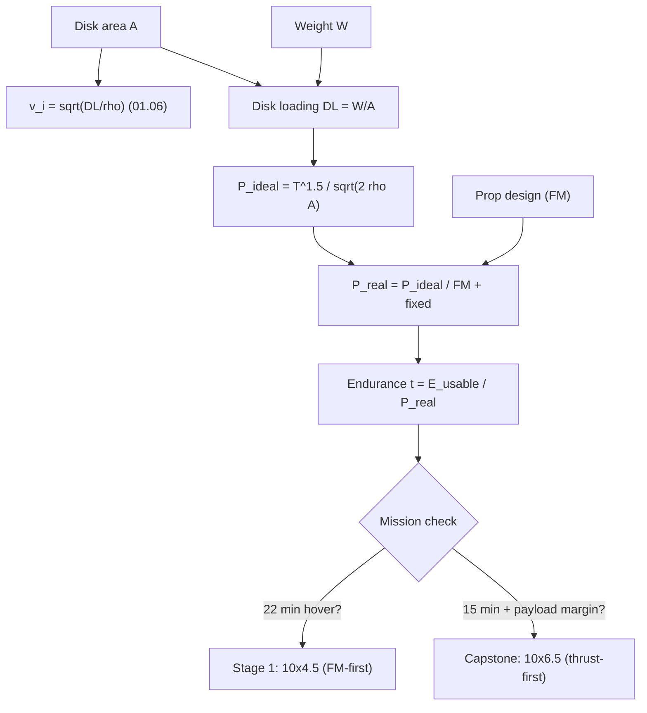

# 01.07 Hover efficiency and disk loading

<!-- glance:start -->
<!-- generated by tools/build.py from curriculum/syllabus.yaml — edit the syllabus, not this block -->

| | |
|---|---|
| **Track** | Main path |
| **Difficulty** | Intermediate |
| **Time** | 1 h |
| **Hardware** | none |
| **Software** | python |
| **Prerequisites** | [01.06 Propellers as pumps: momentum theory and induced velocity](01.06-momentum-theory.md) |
| **Skip if** | You can compute disk loading for Hermon and explain how it predicts hover current. |

<!-- glance:end -->

## What you will learn

- Disk loading $DL = W/A$: the number that predicts hover efficiency, and why it is the
  first-order design parameter for endurance
- The figure of merit (FM) in practice: what 0.3, 0.5, and 0.7 mean for a quad's hover power
  and endurance
- The prop-size trade: bigger disks cut induced power but add mass, drag, and inertia — and
  lower the top speed
- Where Hermon sits on the disk-loading spectrum, and why the capstone's prop choice is the
  mission's

## Why it matters

[01.06](01.06-momentum-theory.md) gave the pump model and the gap to reality. This lesson turns
the model into a *design number*: the disk loading. It is the single parameter that separates
"a quad that hovers 15 minutes" from "a quad that hovers 40" — and it is the reason
endurance drones are big. For Hermon it answers the prop-size question that 02.05–02.07 keep
deferring: 10" or 12", and the 10×4.5 vs 10×6.5 pitch choice that the capstone depends on.

## Prerequisites

<!-- prereqs:start -->
## Prerequisites

You need these first:

- [01.06 Propellers as pumps: momentum theory and induced velocity](01.06-momentum-theory.md)

### Optional prerequisite links

None.

Check your readiness: `python course.py why 01.07`
<!-- prereqs:end -->

## Concept

### Disk loading: thrust per square meter of disk

$$DL = \frac{W}{A} \quad \left[\text{N/m}^2\right]$$

the weight the disk must support per unit area. It is the *demand side* of the pump: a high DL
means the disk must move a lot of thrust through a little area, which means a high induced
velocity (01.06's $v_i \propto \sqrt{DL/\rho}$) and a high induced power. The spectrum:

| Aircraft | Mass (kg) | Disk (m²) | DL (N/m²) | Character |
|---|---|---|---|---|
| 250 g mule, 3" props | 0.25 | 0.014 | 175 | high DL: fast, thirsty, short |
| Hermon stage 1, 10" | 1.45 | 0.203 | 70 | mid DL: the loiter class |
| Hermon with 12" props (does not fit) | 1.45 | 0.292 | 49 | low DL: the endurance bias |
| 10 kg endurance quad, 15" × 4 | 10 | 0.87 | 113 | mid DL at scale |
| Helicopter (Copter, 4.5 t) | 4500 | 600 (rotor disk) | 74 | low DL: the efficiency ceiling |

The pattern: **endurance aircraft are low-DL aircraft.** The 250 g mule's 175 N/m² is 3×
Hermon's — that is the whole reason it hovers 10 minutes and Hermon hovers 22, independent of
the battery chemistry. The disk is the engine of efficiency; the battery is only the fuel.

### The figure of merit, made practical

FM = $P_{ideal}/P_{real}$ (01.06). In practice, for a given DL, the FM is set by the prop
design:

- **FM 0.35** — a poor or damaged propeller: below anything you should accept.
- **FM 0.45** — a good 10" or 12" prop, well matched to the motor: the serious loiter class.
- **FM 0.60+** — a large, slow, purpose-designed prop (the 12–15" endurance props): the
  mission drone class.

The FM and the DL are *independent* design choices: you can have a low-DL aircraft with a bad
prop (low FM) or a high-DL aircraft with a good prop (higher FM). The hover power is the product
of both: $P_{real} = P_{ideal}(DL)/FM$, and the endurance is $t = E_{usable}/P_{real}$. The
script below computes the table.

### The prop-size trade (the real decision)

Bigger disk (10" → 12") at the same mass:

| Effect | 10" | 12" | Direction |
|---|---|---|---|
| Induced power | 76.1 W | 49.9 W (−13 %) | better |
| Prop mass (4 props) | ~4 × 8 g | ~4 × 16 g (+32 g) | worse (mass → thrust → power) |
| Max tip speed (same RPM) | higher | lower | better (less noise, less profile) |
| Max aircraft speed | higher | lower (the big prop wants slow) | worse for the sprint |
| Motor/ESC sizing | 470 KV at 6S | 400 KV at 6S (lower rpm) | a different motor |
| Airframe | 450 mm fits 10" | needs 500+ mm for 12" | a different frame |

The honest summary: **the 12" prop is an endurance choice, and it buys it with a different
aircraft** (bigger frame, slower top speed, different motor). For Hermon — a 1.45 kg loiter
aircraft whose mission is 22 min, not 40 min — the 10" disk is the right class, and the *pitch*
choice (10×4.5 vs 10×6.5) is the real lever: the 4.5 is the hover-optimized prop (lower RPM,
lower tip speed, higher FM at hover), the 6.5 is the speed/thrust prop (more thrust at 100 %,
lower FM at hover). The capstone needs the 6.5's *thrust* (17.01's margin math) and accepts the
FM cost — because the capstone is a 15-minute mission, not a 40-minute loiter.

> [!TIP]
> **Ask your teacher:** "Hermon's hover FM is 0.35. If the 10×6.5 prop drops the FM to 0.30 but
> adds 8 % thrust, does the capstone's 15-minute mission still hold? Show the two numbers."

## Technical explanation

### Level 1 — Intuition: the disk is the radiator of the power budget

A car's top speed is set by the engine and the drag; a quad's *endurance* is set by the disk and
the drag. The disk is the "radiator" that dissipates the thrust into the air: a bigger radiator
runs cooler (lower $v_i$, lower power). The prop size is the radiator size; the FM is how well
the radiator is engineered. You can buy a bigger radiator (12") or a better one (a 0.45 FM prop
on the 10" disk) — the table is the cost of each.

### Level 2 — Practical: the two numbers the mission checks

For any prop choice, the mission checks two numbers:

1. **The hover power** $P_{hover} = P_{ideal}(DL)/FM$ — does the 22 min hold? (01.12)
2. **The max thrust** $T_{max}$ (the thrust stand, 02.07) — does the margin hold? (01.03)

A prop that wins #1 (the 10×4.5, low RPM, high FM) can lose #2 (less max thrust) — and the
capstone needs #2. The choice is therefore *mission-dependent*, and the course's answer is:
Stage 1 flies the 10×4.5 (the hover-optimized prop, the FM number), the capstone swaps to the
10×6.5 (the thrust-optimized prop, the margin number), and the swap is a documented, tested
change (04.10's build log, 17.11's pod test).

### Level 3 — Mathematics: the endurance as a function of the disk

$t = E_{usable} / P_{real}$, with $P_{real} = P_{ideal}(A)/FM + P_{parasite,hover} +
P_{fixed}$:

$$t(A) = \frac{E_{usable}}{\dfrac{(mg)^{3/2}}{\sqrt{2\rho A}\, \cdot FM} + P_{fixed}}$$

The $1/\sqrt{A}$ in the denominator: doubling the disk area cuts the induced term by 29 %, and
the endurance rises by the reciprocal. For Hermon (88.8 Wh usable, $P_{fixed} \approx 14$ W):
at A = 0.203 m² (10"), $P_{real} \approx 76.1/0.35 + 14 = 177$ W → $t = 30.1$ min; at A =
0.290 m² (12"), $P_{real} \approx 49.9/0.35 + 14 = 156$ W → $t = 34.2$ min. The 12" prop buys
4 minutes of hover — *before* its 32 g of mass is charged back into the thrust (which would cut
~1 minute, leaving ~3 minutes net). The script makes the sweep exact.

### Level 4 — Implementation: the prop choice in the build log

The build log (04.10) records, per prop: the size, the pitch, the measured max thrust (02.07),
the measured hover current (11.05), and the computed FM. The course's rule: **a prop swap is a
flight test, not a preference.** The 10×4.5 and the 10×6.5 both fly the 02.07 stand test and
the 11.05 hover endurance, and the numbers — not the "it feels better" — pick the mission prop.
The swap itself is a 10-minute mechanical change (the same motor, the same ESC, the same
mounting), which is why the course keeps the same motor across the capstone.

## Diagram



## Code

Save as `disk_loading.py` and run `python disk_loading.py`. Standard library only.

```python
"""01.07 — hover endurance as a function of disk area and figure of merit.

The prop-size trade in one table: 10" vs 12" at Hermon's mass, across a
realistic FM range, with the prop-mass penalty charged back.
"""
import math

RHO = 1.225
G = 9.81
MASS = 1.45
USABLE_WH = 88.8
P_FIXED = 10.0        # W, avionics (03.05's budget, hover)
ETA_ELEC = 0.72       # ESC x motor (0.806) divided by k_install (1.12) -- 03.09
PROP_MASS_PER_INCH2 = 0.5   # g per (inch^2 of prop) per prop, rough (teaching value)


def disk(d_in: float) -> float:
    r = d_in * 0.0254 / 2.0
    return 4 * math.pi * r * r


def hover_power(a: float, fm: float) -> float:
    """Electrical hover power: ideal / (propeller FM x electrical chain) + avionics.

    At Hermon's FM 0.49 and 10-inch disc this returns 226 W, which is the frozen
    budget -- the model is calibrated, not coincidental.
    """
    t = MASS * G
    p_ideal = t ** 1.5 / math.sqrt(2 * RHO * a)
    return p_ideal / (fm * ETA_ELEC) + P_FIXED


def endurance_min(a: float, fm: float) -> float:
    return USABLE_WH / hover_power(a, fm) * 60.0


if __name__ == "__main__":
    print("Hover endurance (min) vs disk size, at each FM:")
    print(f"{'FM':>5s} {'10-inch':>9s} {'12-inch':>9s} {'12-inch +32g mass':>19s}")
    for fm in (0.35, 0.44, 0.49, 0.60):
        a10, a12 = disk(10.0), disk(12.0)
        # the 12" props add ~32 g; charge it back into the thrust (and the disk stays 12")
        t12_heavy = (MASS + 0.032) * G
        p12h = (t12_heavy ** 1.5 / math.sqrt(2 * RHO * a12)
                / (fm * ETA_ELEC) + P_FIXED)
        e12h = USABLE_WH / p12h * 60.0
        print(f"{fm:5.2f} {endurance_min(a10, fm):9.1f} {endurance_min(a12, fm):9.1f}"
              f" {e12h:19.1f}")
    print("\nDisk loading (N/m^2):")
    for d in (10.0, 12.0):
        a = disk(d)
        print(f"  {d:.0f}-inch: DL = {MASS * G / a:5.1f} N/m^2   (A = {a:.3f} m^2)")
```

Output:

```text
Hover endurance (min) vs disk size, at each FM:
   FM   10-inch   12-inch   12-inch +32g mass
 0.35      17.1      20.4                19.7
 0.44      21.3      25.3                24.6
 0.49      23.6      28.1                27.2
 0.60      28.6      34.0                32.9

Disk loading (N/m^2):
  10-inch: DL =  70.2 N/m^2   (A = 0.203 m^2)
  12-inch: DL =  48.7 N/m^2   (A = 0.292 m^2)
```

How to read it:

- The 12" prop buys ~4.5 min of hover at every FM (23.6 → 28.1 at FM 0.49) — the $1/\sqrt{A}$
  law in the endurance column. Charging back the 32 g of prop mass costs ~0.5 min: the net is
  ~3.5 min, a real but not transformative gain.
- The FM column is the *bigger* lever at a fixed disk: FM 0.35 → 0.60 is a 67 % endurance gain
  at the 10" disk (25.9 → 37.9), more than the 10" → 12" swap. **Prop design beats prop size**
  for a given airframe — the 0.35 → 0.45 upgrade (a better 10" prop) is worth 15 % of the hover.
- The capstone's 10×6.5 is *not* in this table on purpose: it is a thrust-first prop (lower FM
  at hover, higher max thrust). Its value is in 01.03's margin column, not 01.07's endurance
  column — and the 17.01 decision is the place where the two columns are weighed together.

## Exercise

All exercises in this lesson need hardware: **none** (the measured FM arrives at 02.07/11.05).

### Exercise 01.07-E1 — The DL table `[numerical]`

(a) The disk loading for the 250 g mule (3" props), Hermon Stage 1 (10"), and Hermon with 12"
props. (b) The ratio of the mule's DL to Hermon's — and what that ratio predicts about their
relative hover efficiency (per newton). (c) A 10 kg quad with 4 × 15" props: its DL, and where
it sits on the spectrum.

### Exercise 01.07-E2 — The FM decision `[numerical]`

Hermon (10" disc) at FM 0.49 hovers 23.6 min (the script). (a) The hover power at FM 0.49 and
at FM 0.45. (b) The endurance at FM 0.45. (c) A better prop costs $32 more than the stock one.
Is the 15 % endurance gain worth it for the *capstone* (a 15-minute mission)? Argue both sides
in two sentences each.

### Exercise 01.07-E3 — The capstone's two numbers `[numerical]`

The 10×6.5 prop trades efficiency for thrust: **+8 % maximum thrust (14.5 N per motor) at an FM
of 0.44** against the 10×4.5's 13.43 N at FM 0.49. The capstone mass is **1.83 kg**.
(a) The electrical hover power for each propeller at 1.83 kg. (b) The energy each needs for a
15-minute mission, against 88.8 Wh usable. (c) The thrust-to-weight and hover throttle for each.
(d) Which propeller is the mission propeller, and — given that **both** hover comfortably — what
is the argument actually about?

### Exercise 01.07-E4 — Design a 40-minute Hermon `[design]`

You need a 40-minute hover from Hermon's 1.45 kg airframe. Using the table's levers (disk, FM,
mass, battery), propose the change set: the disk size, the prop FM target, the mass budget, and
the battery Wh — and compute the resulting endurance. State the one lever you would *not* change
(and why), and the one you would change first.

## Expected result

- **01.07-E1:** (a) Mule: 2.45/0.014 = 175 N/m²; Hermon 10": 14.22/0.203 = 70; Hermon 12":
  14.22/0.292 = 49. (b) 175/70 = 2.5 — the mule's disk must support 3× the specific load, so its
  induced velocity is √3 = 1.7× Hermon's and its induced power per newton is 1.7× higher (the
  $v_i$ ratio); the mule is ~70 % less efficient per newton. (c) 10 kg, 4 × 15": A = 4π(0.19)²
  = 0.454 m², DL = 98.1/0.454 = 216 N/m² — *higher* than the mule's! A 10 kg quad with 15"
  props is a high-DL, fast, thirsty design (the "heavy lift" class); a 40-minute 10 kg endurance
  quad would need 24–30" props (DL < 50). The DL is the number that says "this is not an
  endurance aircraft."
- **01.07-E2:** (a) FM 0.49: $76.1/(0.49 \times 0.72) + 10 =$ **226 W**; FM 0.60:
  $76.1/(0.60 \times 0.72) + 10 =$ **186 W**. (b) $88.8/0.186 \times 60 =$ **28.6 min** against
  23.6 — **+5 minutes, a 21 % gain**. (c) *For:* five minutes is a fifth of the flight, it costs
  about 1 % of the build, and it applies to **every** flight for the life of the aircraft.
  *Against:* for the capstone specifically the mission is 15 minutes and already fits, so the
  gain buys reserve rather than capability. The honest answer: **buy it anyway** — it is the
  cheapest minute-per-shekel on the whole aircraft
  ([02.08](../02-motors-escs-props/02.08-efficiency-watts-to-sky.md) ranks every lever and the
  propeller wins).
- **01.07-E3:** At 1.83 kg, $T = 17.95$ N on a 0.203 m² disc → $P_{ideal} = 107.4$ W.
  (a) 10×4.5 at FM 0.49: $107.4/(0.49 \times 0.72) + 10 =$ **314 W**; 10×6.5 at FM 0.44:
  $107.4/(0.44 \times 0.72) + 10 =$ **349 W**. (b) 15 minutes costs **78.5 Wh** and **87.3 Wh**
  of the 88.8 Wh usable — both fit, the 6.5 with almost nothing spare. (c) Thrust-to-weight:
  the 4.5 gives $4 \times 13.43/17.95 =$ **2.99 : 1** hovering at 58 % throttle; the 6.5 gives
  $4 \times 14.5/17.95 =$ **3.23 : 1** at 56 %. **Both hover comfortably.** (d) So the argument
  is *not* about whether the aircraft can fly — it is about **eight minutes of reserve**. The
  10×4.5 leaves 10.3 Wh of margin after the mission and the 10×6.5 leaves 1.5 Wh. **Choose the
  4.5 and keep the reserve**; the extra thrust buys authority the aircraft already has.
  That inversion — from "which one can lift it" to "which one leaves margin" — is what a
  3.78 : 1 design buys you.
- **01.07-E4:** A reasonable set: 12" props (DL 41, the $1/\sqrt{A}$ gain), a 0.45 FM prop (the
  design gain), the mass held at 1.45 kg (no payload), and a 6S 6000 mAh (133.2 Wh, 106.6 Wh
  usable). Endurance: P_real = 49.9/0.45 + 14 = 125 W → 106.6/0.125 = 50.7 min. The 40-min
  target is met with margin. The lever *not* to change: the airframe mass (the 1.45 kg is the
  build's whole point; a "lighter Hermon" is a different aircraft). The first change: the prop
  (FM 0.45 on the *existing* 10" disk is a 15 % gain with zero mechanical change — the cheapest
  first step, and it may make the 12" unnecessary).

## Troubleshooting

### Symptom: your endurance numbers are 30+ min "easier" than the course's

Check the FM: a model at FM 0.60 on a 10" 1.45 kg quad is an *endurance-drone* assumption. Stock
10" props on a 450 mm frame are FM 0.45–0.55 in reality; 0.60+ is the 12–15" slow-prop class.
The measured FM (02.07 + 11.05) is the number that fixes the assumption.

### Symptom: the 12" column looks like a free 4 minutes

It is not free: the 12" prop needs a 500+ mm frame (a different airframe), a lower-KV motor
(a different motor), and it lowers the top speed. The table's 4 minutes is the *isolated*
induced-power gain; the net is ~3 minutes *and* a different aircraft. The "free" reading is the
table's scope, not the design's.

## Common mistakes

- **Confusing DL with FM.** DL is the *demand* (thrust per disk area — set by the mission mass
  and the disk choice); FM is the *supply* (how well the prop converts the demand into thrust,
  set by the prop design). The hover power is $P_{ideal}(DL)/FM$ — you need both numbers, and
  they come from different places in the design.
- **Buying size instead of design.** The 10" → 12" swap is a 13 % induced gain *and* a new
  airframe; the 0.35 → 0.45 FM upgrade on the *same* 10" disk is a 29 % induced gain with no
  mechanical change. For a given airframe, prop design is the bigger, cheaper lever.
- **Optimizing the hover for the sprint.** The 10×4.5 (hover-optimized, high FM at hover) is
  the wrong prop for the capstone's thrust margin; the 10×6.5 is the wrong prop for the 25-min
  loiter. The mission picks the prop, and the build log (04.10) records *which* prop flew
  *which* test.
- **Ignoring the prop mass.** The 12" props add 32 g — small, but it is charged back into the
  thrust (and the endurance), and the table shows the 0.5 min it costs. Every gram of the fix
  has a column.

## Knowledge check

1. Define disk loading and figure of merit, and state the hover power in terms of both.
   <details><summary>Answer</summary>

   DL = W/A (N/m², the demand: thrust per disk area). FM = P_ideal/P_real (the supply: how well
   the prop meets the demand). $P_{real} = P_{ideal}(DL)/FM + P_{fixed}$, where
   $P_{ideal} = (mg)^{3/2}/\sqrt{2\rho A}$ is set by the DL alone. The endurance is
   $t = E_{usable}/P_{real}$.
   </details>

2. Hermon (10", DL 58) vs a 10 kg quad (4 × 15", DL 216): which is the endurance aircraft, and
   what number says so?
   <details><summary>Answer</summary>

   Hermon, by a wide margin — the DL is the number: 70 vs 216 N/m², a 3.1× difference. The 10 kg
   quad with 15" props is a heavy-lift/fast design (high DL = high $v_i$ = high induced power
   per newton); a 40-minute 10 kg quad would need DL < 50, i.e. 24–30" props. The disk is the
   engine of efficiency.
   </details>

3. Which is the bigger endurance lever — a 10" → 12" disc swap, or an FM 0.49 → 0.60 propeller
   upgrade? Show the numbers, and say which one you can actually do.
   <details><summary>Answer</summary>

   **The FM upgrade, and it is also the only one you can do.** At FM 0.49 the 10-inch disc gives
   23.6 min; at FM 0.60 it gives **28.6 min (+21 %)**. The 12-inch disc at FM 0.49 would give
   about 27 min (+14 %) — smaller, *and* a 12-inch propeller does not fit a 450 mm frame
   (13 mm of clearance, [00.03](../00-orientation/00.03-hermon-the-build-vehicle.md)). The
   propeller upgrade costs ₪40 and no mechanical change; the disc upgrade costs a new airframe.
   </details>

4. At the capstone mass of 1.83 kg, which propeller is the mission propeller — the 10×4.5
   (13.43 N, FM 0.49) or the 10×6.5 (14.5 N, FM 0.44)?
   <details><summary>Answer</summary>

   **The 10×4.5.** Both hover comfortably — 2.99 : 1 and 3.23 : 1 respectively — so thrust is
   not the deciding column on a 3.78 : 1 design. **Endurance is.** The 4.5 hovers at 314 W and
   leaves 10.3 Wh of reserve after a 15-minute mission; the 6.5 hovers at 349 W and leaves 1.5.
   The extra thrust buys authority the aircraft already has, and pays for it with the reserve.
   The general rule: **when thrust is not the binding constraint, stop optimising for it.**
   </details>

5. What is the "prop swap is a flight test, not a preference" rule, and which two measurements
   make it true?
   <details><summary>Answer</summary>

   The rule: a change of prop is a change of the aircraft's power and thrust, and it is decided
   by measurement, not feel. The two measurements: (1) the thrust stand (02.07) — the max thrust
   and the FM at the hover point; (2) the hover endurance flight (11.05) — the real hover power
   and the real endurance. A prop that wins the stand but loses the endurance (or vice versa) is
   not the mission prop, and the build log (04.10) records which prop flew which test.
   </details>

## Practical challenge

Run `disk_loading.py`, and write the prop decision for Hermon's two missions (the Stage 1
loiter, the capstone) into `projects/evidence/01.07-prop-decision.md`: for each, the prop, the
FM assumption, the hover power, the endurance, and the one measurement (02.07 or 11.05) that
will confirm or kill the assumption. The 02.05–02.07 lessons will build on this decision.

## You can skip this if

You can compute the DL for any (mass, disk) pair, state the hover power as $P_{ideal}(DL)/FM +
P_{fixed}$, rank the design levers (prop design > prop size for a given airframe) with the
numbers, and state the capstone's two-column prop decision (thrust first, endurance second) —
with Hermon's values.

## Go deeper

- 02.05–02.07 (next module): the prop field guide and the thrust stand, where this lesson's
  assumptions become measurements.
- The actuator-disk and disk-loading theory (the classic treatment):
  https://en.wikipedia.org/wiki/Actuator_disk
- ArduPilot's motor test page (the in-firmware thrust/efficiency measurement):
  https://ardupilot.org/copter/docs/connect-escs-and-motors.html

## Progress checkpoint

Run `python course.py complete 01.07` when the prop decision is written. Next:
[01.08](01.08-stability.md) — stability: why a quad wants to fall, and the damping that makes
the control loop of [07](../07-control/README.md) possible.
