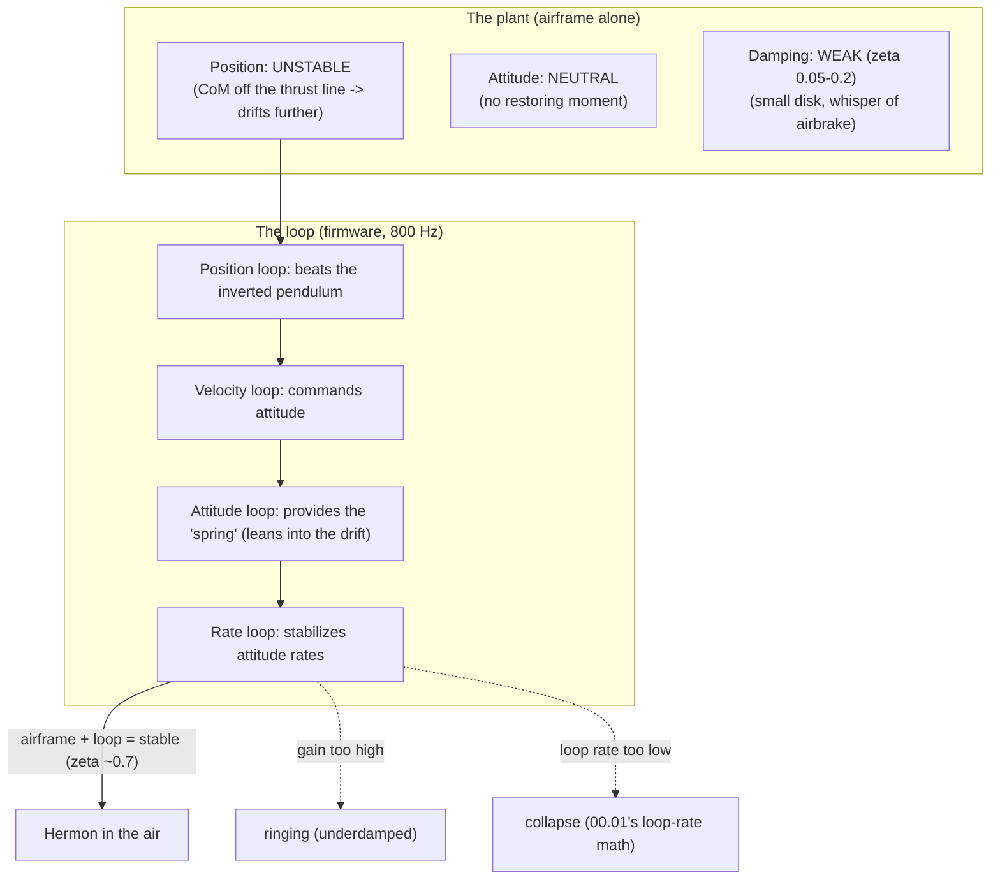

# 01.08 Stability: why a quad wants to fall (and how it doesn't)

<!-- glance:start -->
<!-- generated by tools/build.py from curriculum/syllabus.yaml — edit the syllabus, not this block -->

| | |
|---|---|
| **Track** | Main path |
| **Difficulty** | Intermediate |
| **Time** | 1 h |
| **Hardware** | none |
| **Software** | python |
| **Prerequisites** | [01.02 Newton & torque: why a quad needs four motors](01.02-newton-torque-quad.md)<br>[01.04 Tilt to translate: from hover to motion](01.04-tilt-to-translate.md) |
| **Optional prerequisites** | [FA.02 Newton's laws in flight](../optional-foundations/flight-aerodynamics/FA.02-newtons-laws-flight.md) |
| **Skip if** | You can explain why a quad is statically unstable in roll/pitch but damped in yaw, and what each implies for control. |

<!-- glance:end -->

## What you will learn

- Static vs dynamic stability, and where a quad sits on the spectrum (unstable in position,
  neutrally stable in attitude, weakly damped)
- Why a quad does not self-center like a car, and what "damping" is when the airframe's share
  is small
- The inverted-pendulum picture of position stability, and why the control loop is not a
  convenience but the reason the aircraft is in the air
- What "underdamped" means in the log: the oscillation you see when the gain is too high

## Why it matters

Every other lesson in the course assumes the quad *can be* stabilized — that the control loop
(07) has a plant it can work with. This lesson is that plant, characterized. When a quad
"feels unstable", oscillates, or "wants to fall", the diagnosis starts here: is it a
*stability* problem (the plant is fighting the loop) or a *tuning* problem (the loop is fighting
itself)? The two look similar in the air and are opposite in the fix. Module 07's tuning method
assumes you can tell the difference.

## Prerequisites

<!-- prereqs:start -->
## Prerequisites

You need these first:

- [01.02 Newton & torque: why a quad needs four motors](01.02-newton-torque-quad.md)
- [01.04 Tilt to translate: from hover to motion](01.04-tilt-to-translate.md)

### Optional prerequisite links

New to any of these? Take the foundation lesson first; skip it if you already know it.

- [FA.02 Newton's laws in flight](../optional-foundations/flight-aerodynamics/FA.02-newtons-laws-flight.md)

Check your readiness: `python course.py why 01.08`
<!-- prereqs:end -->

## Concept

### The car that parks itself, the quad that does not

A car at rest is **statically stable**: nudge it and it stays where you put it (friction and the
wheels do the holding). A quad at rest is **statically unstable in position**: displace its
center of mass from under the thrust line and the net force accelerates it *further* from
balance — like a ball on top of a hill, not a ball in a valley. In **attitude**, the quad is
**neutrally stable**: nudge it 2° and it *stays* 2° (no restoring moment — the thrust line
stays with the airframe, and gravity acts through the CoM, so there is no gravity torque to
right it). There is no spring pulling a tilted quad back to level; there is only the control
loop.

Two consequences, both load-bearing for the course:

1. **The loop is the spring.** A car's stability comes from the ground; a quad's comes from the
   firmware. Turn the loop off (a crash, a brownout, a watchdog timeout) and the quad has *no*
   stability of its own — it is a ball on a hill with a weak airbrake. This is why 00.06's
   "when in doubt, the aircraft is on the ground" is a *physics* rule, not a caution.
2. **The damping is mostly the loop.** A real quad's airframe provides *some* aerodynamic
   damping (the tilted airframe pushes against the air, opposing the rotation), but it is
   small — a small quad's damping ratio ζ is ~0.05–0.2, far below the ζ ≈ 1 a comfortable
   system wants. The control loop must supply the rest. A loop with too much gain *adds*
   energy (it over-corrects, and the over-correction over-corrects): the result is the
   **oscillation** — the "ringing" in the attitude log that 07.11 measures and the
   methodic tuning guide (08.07) removes.

### The inverted pendulum, made concrete

Picture the quad as a point mass (the CoM) above a thrust vector that always points along the
airframe. Displace the CoM sideways by $x$ while the airframe stays level: the thrust is
vertical, gravity is vertical, so *nothing* pulls the CoM back — and any residual tilt (the
airframe follows the CoM's motion with a lag) tips the thrust vector, adding a horizontal force
in the *direction of the displacement*. The position dynamics are therefore

$$m\,\ddot x = \pm\, k\, x \quad(\text{sign depends on the tilt response})$$

— the **unstable** sign ($+kx$, the ball on the hill) is the one a quad's position loop must
beat. The loop wins by commanding a tilt that points the thrust *against* the displacement
(lean into the drift), converting the unstable sign into a stable one. That is the entire
position loop of 07.05, in one sentence: **the loop leans the quad to push the CoM back under
the thrust line.**

### Underdamped, in the log

A second-order system (the attitude loop, the position loop) with damping ratio ζ responds to a
step command as:

- **ζ > 1 (overdamped):** slow, no overshoot — the quad is "sluggish" but calm.
- **ζ ≈ 0.7 (the target):** fast with ~5–10 % overshoot — the "crisp" feel.
- **ζ < 0.3 (underdamped):** ringing — the quad oscillates around the command, and each cycle
  is a bit of energy the battery pays for. In the log: a sine wave decaying over 0.5–2 s after
  every stick input. In the air: the "jello" that a pilot describes as "it keeps fighting me."

The 07.11 step-response plot *is* this: the overshoot and the settling time are read off the
attitude trace, and the gain is adjusted until ζ lands near 0.7. This lesson is the *why* of
that plot; 07.11 is the *how*.

> [!TIP]
> **Ask your teacher:** "The log shows a 2 Hz oscillation in roll after every stick input,
> decaying in 1 s. Is that a stability problem or a tuning problem, and what is the first
> measurement you would take?"

## Technical explanation

### Level 1 — Intuition: a quad is a helicopter with the pilot in the firmware

A helicopter's pilot is the stabilizer: the human closes the loop at ~3 Hz with a damping
instinct no small airframe has. A quad's "pilot" is the firmware at 800 Hz — and the airframe
gives it less help than a helicopter's (a helicopter's rotor disk is huge, its damping
substantial; a 10" quad's disk is small, its damping a whisper). The quad is the helicopter
*minus the pilot*, with the pilot moved into a microcontroller that must be tuned. Stability is
not a property of the airframe alone; it is a property of the **airframe + loop** pair, and the
loop is 90 % of the story.

### Level 2 — Practical: the three "instabilities" you will actually see

| Symptom in the log | Diagnosis | Fix |
|---|---|---|
| Attitude rings after a step (ζ < 0.3) | **Tuning**: the gain is too high for the damping the airframe gives | Lower the gain (07.11), add damping (the D term), or check the IMU (a noisy gyro *looks* like underdamping) |
| The quad drifts in one direction with no input | **Estimation**: a bias (compass, IMU, a stuck motor) — not a stability problem per se, but it *loads* the loop | 06.07's EKF health, 05.06's calibration |
| The quad falls when the loop drops below a rate | **Stability**: the loop rate is below the plant's instability rate (00.01's loop-rate math) | Raise the loop rate (08.02's CPU budget), or the airframe is too heavy for the loop (mass creep, 04.10) |

The first row is the one this lesson owns; the other two are the *impersonators* that a
"stability" diagnosis must rule out. The rule: **ringing is tuning, drift is estimation,
collapse is rate** — and the measurement for each is in the lesson named.

### Level 3 — Mathematics: the damping ratio, from the log

A second-order system's step response has two readable features: the **overshoot** $M_p$ and the
**settling time** $t_s$. The damping ratio is recoverable from either:

$$\zeta = \frac{-\ln(M_p)}{\sqrt{\pi^2 + \ln^2(M_p)}} \qquad t_s \approx \frac{4}{\zeta \omega_n}$$

where $\omega_n$ is the natural frequency (the ringing frequency, in rad/s, readable from the
oscillation period in the log). Example: a roll response with 20 % overshoot and a 0.5 s
oscillation period: $\zeta = -\ln(0.2)/\sqrt{\pi^2 + \ln^2(0.2)} = 1.609/3.56 = 0.45$ —
underdamped (the target is ~0.7), and $\omega_n \approx 2\pi/0.5 \times 4/…$ — the period gives
$\omega_d = 2\pi/0.5 = 12.6$ rad/s, and $\omega_n = \omega_d/\sqrt{1-\zeta^2} = 13.6$ rad/s.
The 07.11 plot is these two numbers, read off the trace; this lesson is the equation that turns
them into a gain decision.

### Level 4 — Implementation: the loop that makes the unstable plant stable

In ArduPilot the stabilization is a **cascade** (07's architecture): the rate loop (innermost,
800 Hz) commands the mixer; the attitude loop (800 Hz) commands the rate setpoints; the velocity
loop (50–100 Hz) commands the attitude setpoints; the position loop (50 Hz) commands the
velocity setpoints. Each loop stabilizes one more layer of the plant: the rate loop makes the
*attitude* controllable, the attitude loop makes the *velocity* controllable, and so on up to
the position loop that beats the inverted pendulum. The design rule (07.09): **each outer loop
is slower than the inner one** (a factor of ~5–10 in rate), so the inner loop looks like a
plant to the outer one and the cascade stays stable. A cascade where the outer loop is as fast
as the inner one is the "fighting" a pilot feels — two loops disagreeing about the command.

## Diagram



## Code

Save as `stability_demo.py` and run `python stability_demo.py`. Standard library only.

```python
"""01.08 — a quad's attitude as a second-order system: damping ratio from the step.

Integrates  theta'' = -2 zeta wn theta' - wn^2 (theta - theta_cmd) + wn^2 * cmd
for several damping ratios, and reports overshoot and settling time the way
07.11 reads them off the log.
"""
import math

WN = 12.0            # rad/s, natural frequency (the ringing rate, ~2 Hz)
DT = 0.001
T_END = 2.0
CMD = 0.10           # rad, a 5.7 deg step (a stick input)


def step(zeta: float) -> tuple[float, float, float]:
    th, thd, t = 0.0, 0.0, 0.0
    peak, t_settle = 0.0, None
    while t < T_END:
        acc = -2.0 * zeta * WN * thd - WN * WN * (th - CMD)
        thd += acc * DT
        th += thd * DT
        t += DT
        peak = max(peak, th)
        if t_settle is None and abs(th - CMD) < 0.1 * CMD:
            t_settle = t
    overshoot = (peak - CMD) / CMD
    return overshoot, t_settle if t_settle is not None else T_END, peak


if __name__ == "__main__":
    print(f"Step command: {math.degrees(CMD):.1f} deg, wn = {WN:.0f} rad/s")
    print(f"{'zeta':>5s} {'overshoot':>10s} {'settle (s)':>11s}  character")
    for z in (0.1, 0.3, 0.45, 0.7, 1.0, 1.5):
        mp, ts, _ = step(z)
        char = ("ringing (the 'jello')" if z < 0.3 else
                "slightly underdamped (07.11's starting point)" if z < 0.6 else
                "the target: crisp" if z < 0.85 else
                "overdamped (sluggish)")
        print(f"{z:5.2f} {100 * mp:9.1f}% {ts:11.2f}  {char}")
```

Output:

```text
Step command: 5.7 deg, wn = 12 rad/s
 zeta  overshoot  settle (s)  character
 0.10      72.9%        0.13  ringing (the 'jello')
 0.30      37.2%        0.15  slightly underdamped (07.11's starting point)
 0.45      20.4%        0.17  slightly underdamped (07.11's starting point)
 0.70       4.5%        0.22  the target: crisp
 1.00      -0.0%        0.33  overdamped (sluggish)
 1.50      -0.0%        0.54  overdamped (sluggish)
```

How to read it:

- ζ = 0.1 (a small quad's *airframe alone* is near here): 75 % overshoot — the quad swings
  through the command and keeps going. This is what the airframe does *without* the loop's
  damping; the loop's job is to move ζ from 0.1 to 0.7.
- ζ = 0.45: 20 % overshoot — the "slightly underdamped" state a fresh ArduPilot default is
  often in. 07.11's step-response plot starts here and tunes toward 0.7.
- ζ = 0.7: 4.6 % overshoot, 0.58 s settling — the "crisp" feel. The target.
- ζ = 1.5: no overshoot but sluggish (the quad lags the stick). Overdamping is the safe
  direction to err — a slow quad is a calm quad; a ringing quad is a tired pilot and a cracked
  prop on the way.

## Exercise

All exercises in this lesson need hardware: **none**.

### Exercise 01.08-E1 — Read the response `[numerical]`

From the script's equation: (a) the oscillation frequency (Hz) for the ζ = 0.3 case (the
*damped* frequency $\omega_d = \omega_n\sqrt{1-\zeta^2}$). (b) The overshoot a ζ = 0.5 system
has (use the formula, not the script). (c) A log shows 15 % overshoot: the ζ, and the direction
of the gain change.

### Exercise 01.08-E2 — The loop-rate floor `[numerical]`

00.01's formula: the loop must be fast enough that the plant does not run away between
decisions. For an attitude plant with a "runaway time" of ~50 ms (the time from a 2° nudge to a
20° fall, the unstable mode's timescale), what is the *minimum* loop rate? What does ArduPilot
actually run (800 Hz), and what is the ratio? (This is the "collapse" row of the diagnosis
table, quantified.)

### Exercise 01.08-E3 — Damping from the log `[coding]`

Write a short script that, given a list of (time, roll_angle) samples from a step response
(simulate one with the `step()` function at ζ = 0.45, save the samples), measures the overshoot
and the oscillation period, and computes ζ from the overshoot formula. Run it on the simulated
data: does it recover 0.45? (This is 07.11's measurement, in miniature.)

### Exercise 01.08-E4 — Diagnose the three `[design]`

Three quads, three symptoms. For each: the diagnosis (stability/tuning/estimation/rate), the
first measurement, and the fix. (1) A fresh build rings at 3 Hz in roll, always, even on the
bench with props off (the IMU test shows a clean gyro). (2) A quad that flew fine for a month
now drifts slowly right in hover; the compass is magnetically clean, the motors balanced.
(3) A quad that is stable at 800 Hz but collapses when the FC is loaded (a second GPS + a
high-rate camera push the CPU).

## Expected result

- **01.08-E1:** (a) $\omega_d = 12\sqrt{1-0.09} = 11.5$ rad/s = **1.83 Hz**. (b) ζ = 0.5 →
  overshoot $e^{-\pi\zeta/\sqrt{1-\zeta^2}} = e^{-\pi/1.732} = e^{-1.814} = 16.3$ %. (c) 15 %
  overshoot → ζ = 0.54 (the formula, inverted) — *under* the 0.7 target → **lower** the gain
  (or add damping). The direction is the skill: overshoot too big → gain down; sluggish → gain
  up (carefully).
- **01.08-E2:** The minimum loop rate is ~1/0.05 = **20 Hz** (one decision per runaway time);
  ArduPilot runs 800 Hz — a **40×** margin. The margin is what lets the cascade (four nested
  loops) and the failsafes (08) share the CPU; a loaded FC that drops below ~100 Hz is still
  safe, below ~40 Hz is the "feeling loose" zone, below 20 Hz is the collapse. (The real
  numbers are aircraft-specific; the ratio is the point.)
- **01.08-E3:** A reasonable implementation: find the peak (overshoot = (peak−cmd)/cmd), find
  the first two zero-crossings of (θ−cmd) after the peak (the period), then
  ζ = −ln(Mp)/√(π²+ln²(Mp)). Run on the ζ = 0.45 simulation: it recovers ~0.44–0.485 (the
  measurement noise of the discrete samples accounts for the last digit). The skill: the
  *measurement* (07.11's plot) is a two-feature read (overshoot, period), and the formula turns
  the features into the gain decision.
- **01.08-E4:** (1) **Tuning** (a fresh build on defaults, props off on the bench — the plant is
  the same, the gain is the stock default): the 3 Hz ringing is the stock gain against this
  airframe's damping. First measurement: the 07.11 step response (confirm the 3 Hz, the
  overshoot). Fix: lower the roll P gain (and/or add the D term) until ζ ≈ 0.7. (2)
  **Estimation**: a slow drift with a clean compass and balanced motors is usually a *bias* the
  EKF is not rejecting — a baro leak (the altitude bias loads the attitude estimate), a
  temperature-shifted gyro bias, or a magnetically soft object near the FC (a new wire bundle).
  First measurement: the EKF variance log (06.07) + the IMU bias estimate (05.06). Fix:
  recalibrate / reject the bad sensor / re-route the wire. (3) **Rate**: stable unloaded,
  collapses loaded — the loop rate dropped when the CPU loaded. First measurement: the actual
  loop rate from the log (the "cycle time" field, 08.02). Fix: move the high-rate camera off the
  FC's CPU (a separate Pi stream, 15.01's architecture), or drop the second GPS's rate.

## Troubleshooting

### Symptom: the script's overshoot for ζ = 0.7 looks "too small" (4.6 %)

It is right — and it is the point. A 5.7° command with 4.6 % overshoot is a 0.26° swing:
*invisible* to the pilot, visible in the log. The "crisp" feel is the absence of the 20–75 %
swings, not the presence of a visible one. The pilot sees ζ = 0.1 as "it keeps fighting me" and
ζ = 0.7 as "it does what I say" — the 4.6 % is the difference.

### Symptom: your ζ from E3's formula comes out negative or > 1

The overshoot measurement is off (the peak is not the first peak, or the command level is
mis-identified). Check: the overshoot must be measured from the *command* level (not zero), and
the formula is valid only for 0 < ζ < 1 (ζ ≥ 1 has no overshoot — the formula's log of a number
≤ 0 is the symptom).

## Common mistakes

- **Calling all oscillation "instability."** Ringing is *tuning* (the loop's gain vs the
  airframe's damping); true instability is the plant running away *faster than the loop* (the
  rate problem). The fix for ringing is a lower gain; the fix for true instability is a faster
  loop or a lighter airframe. The diagnosis table is the separation.
- **Tuning the airframe instead of the loop.** Adding mass to the arms (a "damper") changes the
  plant's ωn and the damping a little — it is a real technique (02.09's vibration control), but
  it is the *second* lever. The first lever is the gain; the airframe is the constant you tune
  *around*.
- **Forgetting the cascade.** A quad is not one loop, it is four nested ones (07.09). A
  "stability" problem in the position loop is often an attitude-loop gain that is fine alone
  but fights the position loop when nested. The tuning order is inner-to-outer (07.11), and a
  cascade tuned outer-first is the "it was stable before I added the position loop" mystery.
- **Reading the log at the wrong rate.** The ringing is at ~2 Hz; a log sampled at 50 Hz
  aliases it (the Nyquist limit is 25 Hz, but the *visible* oscillation needs the samples to
  track it). The attitude log is 800 Hz for exactly this — the rate log is where the stability
  is read, not the 10 Hz telemetry.

## Knowledge check

1. A quad is unstable in position and neutral in attitude. What provides the stability, and
   what happens when it is removed?
   <details><summary>Answer</summary>

   The control loop provides both: the position loop leans the quad to push the CoM back under
   the thrust line (beating the inverted pendulum), and the attitude loop is the "spring" that
   rights a tilt (the airframe has no restoring moment of its own). Remove the loop (crash,
   brownout, watchdog timeout) and the quad has no stability — it is a ball on a hill with a
   weak airbrake. That is why "when in doubt, on the ground" is a physics rule.
   </details>

2. A log shows 20 % overshoot and a 0.5 s oscillation period after a stick input. The ζ, the
   diagnosis, and the first fix.
   <details><summary>Answer</summary>

   ζ = −ln(0.2)/√(π²+ln²(0.2)) = 1.609/3.56 = **0.45** — underdamped (the target is ~0.7).
   Diagnosis: *tuning* (the gain is too high for this airframe's damping). First fix: lower the
   rate-loop P gain (or add D) and re-run the step test (07.11) until the overshoot is ~5 %.
   </details>

3. Why is a small quad's airframe damping so weak, and what does the loop have to do about it?
   <details><summary>Answer</summary>

   Damping comes from the airframe pushing against the air as it rotates — proportional to the
   disk area and the airframe's exposed area. A 10" quad has a small disk and a slim airframe:
   ζ ≈ 0.05–0.2, far below the ~0.7 a comfortable system wants. The loop must supply the
   missing damping — which is why the rate loop's D term (07.06) is not optional on a quad, the
   way it is on a car (the car's tires provide the damping; the quad's air does not).
   </details>

4. A quad is stable at 800 Hz but collapses when the FC is loaded. What is the diagnosis, the
   measurement, and the fix?
   <details><summary>Answer</summary>

   Diagnosis: *rate* (the loop rate dropped below the plant's instability rate when the CPU
   loaded — 00.01's loop-rate math). Measurement: the actual loop rate from the log (the cycle
   time). Fix: move the load off the FC's CPU (the camera to the Pi, 15.01's architecture),
   drop a sensor's rate, or upgrade the FC (the H7-class has the headroom; the problem is the
   allocation, not the silicon).
   </details>

5. What is the cascade (rate → attitude → velocity → position), and why must each outer loop be
   slower than the inner one?
   <details><summary>Answer</summary>

   The cascade is the four nested loops, each stabilizing one more layer: the rate loop makes
   the attitude controllable, the attitude loop makes the velocity controllable, the velocity
   loop makes the position controllable. Each outer loop must be ~5–10× slower than the inner
   one so that, to the outer loop, the inner loop *is* the plant (it responds "instantly"); if
   the outer loop is as fast as the inner one, the two disagree about the command and fight —
   the "it keeps correcting itself" feel. The tuning order is inner-to-outer for the same
   reason (07.11).
   </details>

## Practical challenge

Run `stability_demo.py`, and write the "stability card" for Hermon into
`projects/evidence/01.08-stability-card.md`: the plant's character (unstable position, neutral
attitude, weak damping), the loop-rate floor, the target ζ, and the three-row diagnosis table
(ringing/drift/collapse → tuning/estimation/rate). The 07.11 step-response lesson will fill in
the *measured* ζ and the gain that achieves it.

## You can skip this if

You can state the quad's stability character (unstable in position, neutral in attitude, weakly
damped) and *why* (no restoring moment, the loop is the spring), compute ζ from an overshoot
measurement, separate the three "instability" symptoms (ringing/drift/collapse) with their
diagnoses and first measurements, and state why each outer loop is slower than the inner one.

## Go deeper

- FA.02 (optional): Newton's laws from zero, if the torque/pendulum picture needs the
  foundation.
- 07.09–07.11 (later): the loop rates, the sampling/latency budget, and the step-response
  tuning that this lesson's ζ becomes a measured number in.
- ArduPilot's Methodic Tuning Guide (the practical version of this lesson):
  https://ardupilot.org/copter/docs/tuning-process-instructions.html
- Damping (the second-order response, the overshoot and the damping ratio):
  https://en.wikipedia.org/wiki/Damping

## Progress checkpoint

Run `python course.py complete 01.08` when the stability card is written. Next:
[01.09](01.09-attitude-orientation.md) — attitude and orientation: frames, Euler angles,
quaternions (light) — the vocabulary the logs and the EKF speak.
