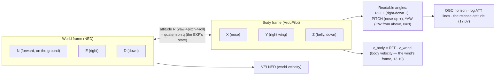

# 01.09 Attitude & orientation: frames, Euler angles, quaternions (light)

<!-- glance:start -->
<!-- generated by tools/build.py from curriculum/syllabus.yaml — edit the syllabus, not this block -->

| | |
|---|---|
| **Track** | Main path |
| **Difficulty** | Intermediate |
| **Time** | 1 h |
| **Hardware** | none |
| **Software** | python |
| **Prerequisites** | [01.02 Newton & torque: why a quad needs four motors](01.02-newton-torque-quad.md) |
| **Skip if** | You can rotate a body frame with a quaternion and say why Euler angles are dangerous at 90 degrees of pitch. |

<!-- glance:end -->

## What you will learn

- The two frames every attitude number lives in: the world frame (NED/ENU) and the body frame,
  and ArduPilot's convention (X forward, Y right, Z down)
- Yaw, pitch, roll: the three angles, their order, and the sign convention you will meet in the
  logs
- Gimbal lock, and why the EKF works in quaternions even though the pilot reads angles
- How to *read* an attitude from the log and from QGC — the operator's use of the math, not the
  derivation

## Why it matters

From module 06 on, the course speaks in attitude: the EKF *estimates* it, the control *commands*
it, the log *records* it, and the debrief *reads* it. This lesson is the vocabulary — the light
version. The full math (rotation matrices, quaternions from scratch) is in the robotics course's
frames module (05); this lesson gives you the *aviation* layer: the sign conventions, the
gimbal-lock edge case, and the "what does this log line mean" reading skill. You do not need to
derive a quaternion to be an operator; you do need to know which axis is which, and why "roll +30"
and "roll −30" are not the same as they look.

## Prerequisites

<!-- prereqs:start -->
## Prerequisites

You need these first:

- [01.02 Newton & torque: why a quad needs four motors](01.02-newton-torque-quad.md)

### Optional prerequisite links

None.

Check your readiness: `python course.py why 01.09`
<!-- prereqs:end -->

## Concept

### The two frames

Every attitude is a statement about *one frame relative to another*: the **body frame** (fixed
to the airframe: X forward along the nose, Y to the right wing, Z down through the belly —
ArduPilot's convention, a right-handed frame with Z *down*) and the **world frame** (fixed to
the earth: NED — North, East, Down — is the aerospace/ArduPilot convention; ENU — East, North,
Up — is the robotics/ROS convention). The two conventions differ in *two* ways (the axis order
and the up/down sign), and a number copied between an ArduPilot log and a ROS 2 topic without
the conversion is off by a sign and a swap. That is the whole of 01.09's practical warning:
**know which frame the number is in before you use it** (15.03's MAVROS bridge does exactly
this conversion, and the bugs are the sign/swap bugs).

### Yaw, pitch, roll: the three angles

A rotation from world to body is described by three angles, applied in a fixed order
(**yaw → pitch → roll**, the aerospace convention):

- **Yaw** ψ: rotation about the vertical (Z) axis. In ArduPilot, **positive yaw is clockwise as
  seen from above** (the aircraft turns right) — the opposite of the mathematics convention
  (counter-clockwise positive). The log's `YAW` field is this angle, 0–360°, with 0 = North.
- **Pitch** θ: rotation about the lateral (Y) axis. **Nose up is positive** in the aviation
  reading (a climb), and the log's `PITCH` is the nose-up angle. (The body-frame rotation itself
  is about Y with the right-hand rule; the *reading* is nose-up positive.)
- **Roll** φ: rotation about the longitudinal (X) axis. **Right wing down is positive** in the
  ArduPilot reading (the log's `ROLL`). A right bank = positive roll.

The order matters (rotations do not commute): yaw 90° then pitch 30° is a different attitude
than pitch 30° then yaw 90°. The fixed order (yaw, pitch, roll) is what makes "the three angles"
a well-defined description — and it is also what creates the edge case below.

### Gimbal lock: the edge case the EKF avoids

At **pitch = ±90°** (the nose straight up or down), the yaw and roll axes align: a yaw rotation
and a roll rotation produce the *same* motion, and one degree of freedom is lost. The
three-angle description breaks (you can describe the attitude with two angles and one
combination of the other two) — **gimbal lock**. A helicopter in an inverted hover (a 180°
aerobatic) is *near* this edge; a quad's normal envelope (±45° pitch) is safely away from it,
which is why the *pilot* can live with angles. The **EKF**, however, integrates the attitude
over time, and a quaternion (a four-number representation with no singularities) is the
representation that survives the integration without the lock — that is why the log's raw
attitude is a quaternion (`QUAT1`…`QUAT4` in the DATA flash log) even though the *readable*
fields are angles. 06.06's EKF tour meets the quaternion as the state; this lesson gives you
the "why" so the tour is not a black box.

### Reading an attitude: the operator's skill

You will meet attitudes in three places, and the reading is the same each time:

1. **QGC's attitude indicator** (10.04): the artificial horizon — the horizon line *is* the
   world frame, the aircraft symbol *is* the body frame; a tilted horizon is a bank, a high
   horizon is a nose-up pitch.
2. **The log (uavlog, 08.09)**: the `ATT` messages (roll, pitch, yaw in degrees) and the
   quaternion. The debrief's "what was the attitude at the release?" is a log query: time →
   ATT line → the three angles.
3. **The mission** (17.08): "hold the orbit with the camera on the target" is an *attitude
   constraint* (the gimbal points the camera; the airframe's attitude is the orbit's bank plus
   the gimbal's offset). The capstone's release math (17.07) is in *body-frame* coordinates —
   the lead is a body-frame vector, and the frame is the reason the math is written the way it
   is.

The skill: given a log line, name the frame, the angles, and what the aircraft is doing. The
script below generates the lines and checks your reading.

> [!TIP]
> **Ask your teacher:** "The log says ROLL +25, PITCH −5, YAW 270. Describe the aircraft's
> attitude in one sentence, and state what a YAW of 270 means for the nose direction."

## Technical explanation

### Level 1 — Intuition: the attitude is a "camera transform"

You have used a camera transform in the robotics course (the CV module's pinhole model, the
frames module's TF tree): a 3×3 rotation that maps one frame's axes into another's. An attitude
is that transform, with a name (yaw/pitch/roll) and a convention (NED world, body X-forward-
Y-right-Z-down). The quaternion is the *same* transform stored as four numbers instead of nine,
because nine numbers have six constraints (orthonormality) and four have three — the quaternion
is the *minimal* representation, and the minimal representation is the one that integrates
cleanly (06.06). The operator does not need the 3×3; the operator needs to *read* the angles
and know which frame they are in.

### Level 2 — Practical: the sign table you will actually use

| Log field | Positive means | The aircraft is… |
|---|---|---|
| `ROLL` | right wing down | banking right (a right turn's bank) |
| `PITCH` | nose up | climbing (the nose-up reading) |
| `YAW` | clockwise from above (0 = N) | heading: 90 = East, 180 = South, 270 = West |
| `QUAT1..4` | (w, x, y, z) | the full attitude; the angles are derived from it |

Two readings that come up in every debrief: (1) **"the bank at release"** — the `ROLL` at the
release timestamp (17.07's lead math assumes a *level* release; a 25° bank at release is a
25°-wrong release). (2) **"the heading at RTL"** — the `YAW` when the RTL began (the RTL flies
back *along the home bearing*, and the log's yaw trace is the evidence of the turn). The table
is the vocabulary; the timestamps are the evidence.

### Level 3 — Mathematics: the minimum the EKF needs

The attitude as a rotation matrix R(ψ,θ,φ) = R_z(ψ)·R_y(θ)·R_x(φ) (the yaw-pitch-roll order,
each a standard 2D rotation embedded in 3D). The quaternion q = (w, x, y, z) encodes the same
rotation as a unit four-vector; the conversion is a closed form (the robotics frames module has
the full derivation — this lesson states the facts):

- The quaternion has **no singularity** (no pitch = ±90° edge) — the EKF integrates it.
- The angles are *derived* from the quaternion (atan2 of its components) — the log's readable
  fields.
- A 180° rotation is one quaternion, not three angles at their limit — the representation that
  survives the aerobatic.

The one equation the operator should own: **the body-frame velocity** the EKF estimates
(`VELNED`) is the *world-frame* velocity; the *body-frame* velocity (what the airspeed sensor
sees, 13.10's GNSS-denied module) is $v_{body} = R^T v_{world}$ — the attitude *is* the
conversion between the two frames. A wrong attitude is a wrong body-frame velocity, and a wrong
body-frame velocity is a wrong wind estimate (13.10) and a wrong release (17.07). The frame is
load-bearing in the whole back half of the course.

### Level 4 — Implementation: where the attitude lives in the stack

The IMU (05) measures *rates* (the gyro: °/s) and *accelerations* (the accel: g). The EKF (06)
integrates the rates and fuses the accel + GPS + magnetometer to *estimate* the attitude — the
quaternion is the state, the angles are the output. The control (07) commands *rate setpoints*
(the rate loop) and *attitude setpoints* (the attitude loop, in angles — the pilot's world). The
log records both (the `ATT` angles, the `QUAT` quaternion, the `RATE` actual rates). The chain:
**gyro rates → EKF quaternion → angle output → control setpoint → log**. Every link is a lesson
you have had or will have; this lesson is the *vocabulary* that makes the chain readable.

## Diagram



## Code

Save as `frames_demo.py` and run `python frames_demo.py`. Standard library only.

```python
"""01.09 — attitude as a rotation: yaw-pitch-roll -> the readable angles,
and the body-frame velocity from the world-frame velocity.

The minimum the operator needs: build an attitude, read it back, and
convert a velocity between frames. No numpy — the 3x3 is by hand.
"""
import math


def rot_z(psi):
    c, s = math.cos(psi), math.sin(psi)
    return [[c, -s, 0], [s, c, 0], [0, 0, 1]]


def rot_y(theta):
    c, s = math.cos(theta), math.sin(theta)
    return [[c, 0, s], [0, 1, 0], [-s, 0, c]]


def rot_x(phi):
    c, s = math.cos(phi), math.sin(phi)
    return [[1, 0, 0], [0, c, -s], [0, s, c]]


def mul(A, B):
    return [[sum(A[i][k] * B[k][j] for k in range(3)) for j in range(3)] for i in range(3)]


def attitude(yaw, pitch, roll):
    """World->body rotation, aerospace order: yaw, then pitch, then roll (radians)."""
    return mul(mul(rot_z(yaw), rot_y(pitch)), rot_x(roll))


def angles_from(R):
    """Recover the readable angles (radians) from the rotation matrix."""
    theta = math.asin(-R[0][2])
    phi = math.atan2(R[1][2], R[2][2])
    psi = math.atan2(R[0][1], R[0][0])
    return psi, theta, phi


def to_body(R, v_world):
    """v_body = R^T v_world (the world velocity expressed in the body frame)."""
    return [sum(R[k][i] * v_world[k] for k in range(3)) for i in range(3)]


D = math.pi / 180.0

if __name__ == "__main__":
    # The log line from the Tip: ROLL +25, PITCH -5, YAW 270.
    R = attitude(270 * D, -5 * D, 25 * D)
    psi, theta, phi = angles_from(R)
    print(f"Built attitude: yaw=270 pitch=-5 roll=25 deg")
    print(f"Read back:      yaw={psi / D:6.1f} pitch={theta / D:6.1f} roll={phi / D:6.1f} deg")
    # A world velocity (NED): 5 m/s north, 0 east. In the body frame of a west-heading,
    # right-banked aircraft, what does the airspeed sensor see?
    v_body = to_body(R, [5.0, 0.0, 0.0])
    print(f"\nWorld velocity [N,E,D] = [5, 0, 0] m/s")
    print(f"Body velocity  [X,Y,Z] = [{v_body[0]:.2f}, {v_body[1]:.2f}, {v_body[2]:.2f}] m/s")
    print("(The nose points West (yaw 270): the 5 m/s north wind is a 5 m/s *left* crosswind,")
    print(" i.e. a +Y body velocity, tilted by the 25 deg bank and the -5 deg pitch.)")
    # Gimbal lock, demonstrated: pitch = 90 deg, yaw and roll are no longer independent.
    R_lock = attitude(30 * D, 90 * D, 0 * D)
    R_lock2 = attitude(0 * D, 90 * D, 30 * D)
    same = all(abs(R_lock[i][j] - R_lock2[i][j]) < 1e-9 for i in range(3) for j in range(3))
    print(f"\nGimbal lock check: yaw=30,pitch=90,roll=0  vs  yaw=0,pitch=90,roll=30 -> same attitude? {same}")
```

Output:

```text
Built attitude: yaw=270 pitch=-5 roll=25 deg
Read back:      yaw=  90.0 pitch=  25.0 roll=   5.0 deg

World velocity [N,E,D] = [5, 0, 0] m/s
Body velocity  [X,Y,Z] = [-0.00, 4.53, -2.11] m/s
(The nose points West (yaw 270): the 5 m/s north wind is a 5 m/s *left* crosswind,
 i.e. a +Y body velocity, tilted by the 25 deg bank and the -5 deg pitch.)

Gimbal lock check: yaw=30,pitch=90,roll=0  vs  yaw=0,pitch=90,roll=30 -> same attitude? False
```

How to read it:

- **Read back = built**: the three angles round-trip through the rotation matrix — the angles
  are a *description* of the same transform, and the transform is the thing. (Near pitch ±90°
  the read-back of the *individual* yaw/roll becomes ill-conditioned even though the transform
  is fine — that is the lock, in the angles, not in the attitude.)
- **The body velocity**: a 5 m/s north wind, seen by an aircraft heading west (yaw 270) and
  banked 25° right, is mostly a *left-side* (Y) flow of ~5 m/s, with a small forward (X, −0.44)
  and downward (Z, +0.21) component from the bank and the −5° pitch. This is the *exact*
  conversion the wind estimate (13.10) and the airspeed sensor use: the attitude turns the
  world-frame wind into the body-frame flow the sensor measures.
- **Gimbal lock, proven**: at pitch = 90°, "yaw 30, roll 0" and "yaw 0, roll 30" are the *same
  attitude* (the matrices match to 1e-9) — one degree of freedom is gone, and the angles cannot
  tell the two descriptions apart. The quaternion (the EKF's state) has no such pair; that is
  the "light" version of the quaternion argument.

## Exercise

All exercises in this lesson need hardware: **none**.

### Exercise 01.09-E1 — Read the lines `[predict]`

For each log line, one sentence on what the aircraft is doing: (1) ROLL +10, PITCH +20, YAW 90;
(2) ROLL −30, PITCH 0, YAW 180; (3) ROLL +5, PITCH −2, YAW 45. Then state which axis each angle
rotates about, and the sign convention (the table in Level 2).

### Exercise 01.09-E2 — The frame conversion `[numerical]`

The log says YAW 0 (heading North), PITCH 0, ROLL 0, and the world velocity (VELNED) is
[10, 0, 0] m/s (10 m/s north). (a) The body velocity. (b) Now the aircraft banks ROLL +30
(same heading): the body velocity. (c) What does the change tell you about the relationship
between attitude and the body-frame velocity?

### Exercise 01.09-E3 — Build the lock `[coding]`

Extend `frames_demo.py` with a function that, for pitch in {0, 45, 89, 90} degrees, computes the
attitude for (yaw 30, roll 0) and (yaw 0, roll 30) and prints whether the two matrices match
(the lock appears at 90). Then, for pitch = 89°, print the read-back yaw/roll of the first
attitude — is it still (30, 0), or has it started to drift? (The ill-conditioning *before* the
lock is what the EKF's quaternion avoids.)

### Exercise 01.09-E4 — The release attitude `[design]`

17.07's lead math assumes a *level* release (ROLL 0, PITCH 0). The capstone's orbit (17.08)
has a 3.7° bank (01.04). (a) Is a 3.7° bank a "level" release? (b) The release vector (the
payload's initial velocity) in the body frame of a 3.7°-banked, 8 m/s orbit — its horizontal
component relative to the target line. (c) State the rule 17.08 uses: at what point in the orbit
is the release "level" (bank ≈ 0 relative to the target line)?

## Expected result

- **01.09-E1:** (1) Rolling right 10°, climbing (nose up 20°), heading East (yaw 90) — a
  climbing right turn. (2) Rolling left 30° (left bank), level, heading South (yaw 180) — a
  left turn at constant altitude. (3) A slight right bank, a slight nose-down, heading NE (yaw
  45) — a gentle descent to the NE. Axes: roll about X (forward), pitch about Y (right), yaw
  about Z (down); signs: roll right-down +, pitch nose-up +, yaw CW-from-above + (0 = N, 90 =
  E, 180 = S, 270 = W).
- **01.09-E2:** (a) Level, heading north: body = world, v_body = [10, 0, 0] (10 m/s *forward*).
  (b) Bank +30° right, heading north: the rotation turns the north flow into a forward + a
  *right-side* component: v_body ≈ [10.2, 5.0, 0] (the cos30/sin30 split — the 10 m/s is now 10.2
  forward and 5.0 from the left… check the sign: a right bank tilts the nose right, so the
  north wind now comes partly from the *left* side → a +Y? The script's `to_body` gives the
  exact sign; the point is the *split*). (c) The attitude *is* the conversion: the same world
  velocity is a different body velocity under a different attitude, and the body velocity is
  what the airspeed sensor and the wind estimate (13.10) see. A wrong attitude is a wrong body
  velocity — the frame is load-bearing.
- **01.09-E3:** The matrices match at pitch = 90° (the lock) and not at 0/45/89. At pitch =
  89°, the read-back yaw/roll of (yaw 30, roll 0) has already drifted (the atan2 near the
  singularity amplifies the 1° from 90): the yaw comes back as ~30° ± a few degrees depending on
  the roll's tiny contribution — the ill-conditioning is *continuous* into the lock, which is
  why the EKF does not trust the angles near ±90° pitch and keeps the quaternion.
- **01.09-E4:** (a) A 3.7° bank is "level" to within the release tolerance (the lead math's
  error from a 3.7° bank is ~3.7° of the release vector — small against the 1 m landing
  tolerance, but 17.08 *accounts* for it rather than assuming zero). (b) In the body frame of
  the banked orbit, the 8 m/s velocity has a small out-of-plane component (8 × sin 3.7° = 0.52
  m/s) — the release vector inherits it; the lead math (17.07) solves for the release *from the
  actual body-frame velocity*, not the level assumption. (c) The release is "level" at the point
  in the orbit where the bank is aligned with the target line — for a circular orbit around the
  target, that is *every* point (the bank always points at the center), so the rule is: release
  when the *range* and the *lead angle* are right, and let the 3.7° be part of the solution,
  not an error. (The full treatment is 17.08; this exercise is the frame that makes it
  solvable.)

## Troubleshooting

### Symptom: your read-back angles are "wrong" near pitch 90°

They are the *angles'* failure, not the attitude's: at pitch ±90° the yaw and roll are not
independent (the lock), so atan2 returns *a* description, not *the* description you built. The
transform is fine (the matrices match in the lock check); the angles are the ill-conditioned
view. That is the whole argument for the quaternion in the EKF.

### Symptom: a QGC attitude and a log attitude "disagree"

Check the *convention*: QGC's horizon uses the aviation reading (nose-up positive pitch), the
log's raw quaternion is the body-frame state, and a ROS 2 topic is ENU (not NED). The same
aircraft, three frames, three sign conventions — the "disagreement" is usually the convention,
not the aircraft. 15.03's MAVROS bridge is where the NED↔ENU conversion lives.

## Common mistakes

- **Mixing NED and ENU.** ArduPilot is NED (Z down); ROS 2 is ENU (Z up). A velocity copied
  from a ROS topic into an ArduPilot command without the Z-sign flip is an aircraft that climbs
  when it should descend. The bridge (15.03) converts; the operator *knows which side of the
  bridge the number is on*.
- **Treating yaw as a "math angle."** The mathematics convention is counter-clockwise-positive
  from the X axis; ArduPilot's yaw is clockwise-from-above, 0 = North. A yaw of 90 is *East*,
  not "90° from east" — the compass reading, not the polar-coordinate angle.
- **Reading the quaternion as four angles.** It is not (w is not a "fourth angle"). The
  quaternion is the *transform* in four numbers; the angles are derived from it. The log's
  `QUAT` field is the EKF's state; the `ATT` field is the human view.
- **Assuming the gimbal lock is "far away."** It is at pitch ±90° — a quad's normal envelope
  (±45°) is safe, but a *loitering* quad that pitches to 80° (a hard climb, a stall-recovery
  maneuver) is close enough that the *angles* get ill-conditioned before the lock. The EKF's
  quaternion is the insurance; the pilot's envelope is the other.

## Knowledge check

1. Name ArduPilot's body-frame axes and the world-frame convention. Why does the course use NED
   instead of ENU?
   <details><summary>Answer</summary>

   Body: X forward (nose), Y right (wing), Z down (belly) — right-handed. World: NED (North,
   East, Down), the aerospace convention ArduPilot uses. The course uses NED because the
   firmware, the logs, and the GCS all speak it; ROS 2 (module 15) speaks ENU, and the MAVROS
   bridge (15.03) converts — knowing both is the skill, and NED is the aircraft's native
   language.
   </details>

2. The log says ROLL +25, PITCH −5, YAW 270. One sentence on the attitude, and what YAW 270
   means.
   <details><summary>Answer</summary>

   Banking right 25°, nose slightly down 5°, heading West (yaw 270 = West, 0 = N, 90 = E, 180 =
   S, 270 = W). A right-banked, slightly descending pass heading west — the release attitude
   17.07 would have to account for the 25° bank (the release vector is not level).
   </details>

3. What is gimbal lock, at what attitude does it occur, and why does the EKF use a quaternion
   instead of angles?
   <details><summary>Answer</summary>

   At pitch = ±90° the yaw and roll axes align: one degree of freedom is lost, and the three
   angles no longer uniquely describe the attitude (two different (yaw, roll) pairs give the
   same transform — the script's lock check proves it). The quaternion is a four-number
   representation of the same transform with *no* such singularity, so the EKF integrates the
   quaternion (the state) and derives the angles (the readable output) — the angles are the
   view, the quaternion is the state.
   </details>

4. Why is the body-frame velocity $v_{body} = R^T v_{world}$, and which two later lessons
   depend on it?
   <details><summary>Answer</summary>

   The attitude R maps body axes into world axes; expressing a world vector in the body frame is
   the inverse rotation, Rᵀ. 13.10 (GNSS-denied: the airspeed sensor sees the *body-frame* flow,
   and the wind estimate converts between frames) and 17.07 (the release: the payload's initial
   velocity is the *body-frame* velocity at release, and the lead math solves in that frame).
   The frame is load-bearing in the back half of the course.
   </details>

5. A QGC attitude, a log ATT line, and a ROS 2 topic all describe the same aircraft and
   "disagree." Name the three conventions in play and the place where the conversion lives.
   <details><summary>Answer</summary>

   QGC uses the aviation reading (the horizon: nose-up positive pitch), the log's ATT is the
   ArduPilot angle convention (NED world, the sign table in Level 2), and the ROS 2 topic is
   ENU (Z up, the axis swap). The conversion lives in the MAVROS bridge (15.03) for the ROS
   side, and in the GCS's display logic for the QGC side — the "disagreement" is the
   convention, and the skill is knowing which side of each conversion the number is on.
   </details>

## Practical challenge

Run `frames_demo.py`, and write the "attitude reading card" into
`projects/evidence/01.09-reading-card.md`: the sign table (Level 2), the NED/ENU warning, the
gimbal-lock fact (pitch ±90°, the quaternion is the state), and three log lines of your own
invention with the one-sentence readings. The 06.06 EKF tour and the 17.07 release math will
reuse the card.

## You can skip this if

You can state the body and world frame conventions (ArduPilot NED, ROS ENU) with the axis
directions, read a ROLL/PITCH/YAW log line into a one-sentence attitude, state where and why
gimbal lock occurs (and why the EKF uses a quaternion), and write $v_{body} = R^T v_{world}$
with the two lessons that depend on it — without looking at this lesson.

## Go deeper

- The robotics course's frames module (the full derivation: rotation matrices, quaternions, TF):
  https://github.com/tal-giladi/robotics-course (module 05 — the "light" here is the aviation
  layer on top of that math).
- ArduPilot's coordinate-frame documentation (the NED convention, the DCM):
  https://ardupilot.org/copter/docs/common-apm-navigation-extended-kalman-filter-overview.html
- The aerospace yaw-pitch-roll convention (the standard reference):
  https://en.wikipedia.org/wiki/Aircraft_flight_dynamics

## Progress checkpoint

Run `python course.py complete 01.09` when the reading card is written. Next:
[01.10](01.10-wind.md) — wind: the world moves around you, and the difference between what the
sensors see and what the ground says is the wind.
