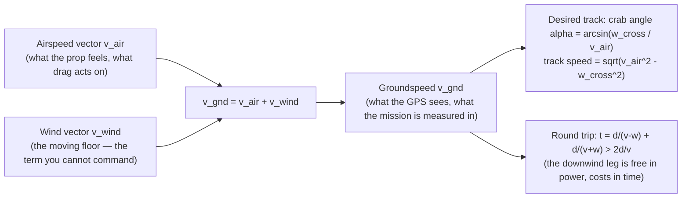

# 01.10 Wind: what the sensors see and what the ground says

<!-- glance:start -->
<!-- generated by tools/build.py from curriculum/syllabus.yaml — edit the syllabus, not this block -->

| | |
|---|---|
| **Track** | Main path |
| **Difficulty** | Intermediate |
| **Time** | 1 h |
| **Hardware** | none |
| **Software** | python |
| **Prerequisites** | [01.04 Tilt to translate: from hover to motion](01.04-tilt-to-translate.md)<br>[01.05 Drag: where your battery goes](01.05-drag.md) |
| **Optional prerequisites** | [FA.04 Wind vectors, trajectories and unit sanity](../optional-foundations/flight-aerodynamics/FA.04-wind-trajectories-and-units.md) |
| **Skip if** | You can compute drift, ground speed and the energy penalty of a headwind round trip. |

<!-- glance:end -->

## What you will learn

- The two velocities: **airspeed** (relative to the air) and **groundspeed** (relative to the
  ground), and the wind as the vector between them
- Crosswind drift, the crab angle, and the "downwind penalty" (why the round trip is slower
  than still air, even though the downwind leg is fast)
- Why a quad's wind estimate is a *fusion* problem (06.06), and what the log's `WIND` field is
  and is not
- Hermon in a 4 m/s wind: the drift, the crab, and the battery cost

## Why it matters

Wind is the first external force the course has met that the aircraft *cannot control* — the
thrust vector points where the pilot points it, but the air itself can move. Every GPS fix is
ground-relative; every airspeed sensor (when Hermon has one, 13.10) is air-relative; the
*wind* is the difference, and the EKF (06.06) estimates it as part of the state. For the
operator, wind is the mission variable: the RTL heading (fly *into* the wind to make
groundspeed), the drift budget (the waypoint's tolerance), and the battery cost (the downwind
leg is not free). This lesson is the wind's kinematics; 13.10 is the wind's *estimation*; the
mission plan (18.03) is the wind's *planning*.

## Prerequisites

<!-- prereqs:start -->
## Prerequisites

You need these first:

- [01.04 Tilt to translate: from hover to motion](01.04-tilt-to-translate.md)
- [01.05 Drag: where your battery goes](01.05-drag.md)

### Optional prerequisite links

New to any of these? Take the foundation lesson first; skip it if you already know it.

- [FA.04 Wind vectors, trajectories and unit sanity](../optional-foundations/flight-aerodynamics/FA.04-wind-trajectories-and-units.md)

Check your readiness: `python course.py why 01.10`
<!-- prereqs:end -->

## Concept

### Two velocities, one wind

- **Airspeed** $v_{air}$: the aircraft's velocity relative to the *air mass* — what the prop
  "feels", what the airspeed sensor (13.10) measures, what the drag (01.05) acts on.
- **Groundspeed** $v_{gnd}$: the aircraft's velocity relative to the *ground* — what the GPS
  sees (06.05), what the pilot sees, what the mission's "be at the waypoint by T" is measured
  in.
- **Wind** $v_{wind}$: the air mass's velocity relative to the ground.

The three are related by a vector sum:

$$v_{gnd} = v_{air} + v_{wind}$$

(in the ground frame; the air moves with the wind, the aircraft moves with the air *plus* its
airspeed). The wind is the term you cannot command — the aircraft commands $v_{air}$ (the
thrust sets the airspeed along the thrust axis), and the ground adds the wind. A 4 m/s tailwind
with a 10 m/s airspeed gives a 14 m/s groundspeed; the same 10 m/s airspeed into the wind gives
a 6 m/s groundspeed. *The same effort, a different ground track* — that sentence is the whole
of wind's effect on a mission.

### Crosswind: the drift and the crab

A **crosswind** (perpendicular to the desired track) pushes the aircraft off the track. Two
responses:

1. **Crab** (the standard): point the nose *into* the wind by the **crab angle** $\alpha$, so
   the airspeed vector and the wind vector sum to the desired ground track. For a wind
   perpendicular to the track of speed $w$ and an airspeed $v_{air}$:
   $$\alpha = \arcsin\left(\frac{w}{v_{air}}\right)$$
   The aircraft flies at an angle to the track and makes the track anyway. The cost: the
   groundspeed along the track is $v_{gnd,track} = v_{air}\cos\alpha = \sqrt{v_{air}^2 - w^2}$
   — *slower* than still air, because part of the airspeed is spent fighting the wind.
2. **Sideslip** (the "weathervane"): hold the nose on the track and let the airframe *drift*
   into the wind (the attitude is on-track, the track is off, and the position loop (07)
   commands a tilt into the wind). A quad does this naturally: the position loop leans the
   aircraft into the wind (the attitude offset *is* the crab, expressed in tilt). The two
   descriptions are the same physics from two frames — the pilot sees the crab angle, the
   firmware sees the tilt offset.

Hermon in a 4 m/s crosswind at a 10 m/s airspeed: $\alpha = \arcsin(0.4) = 23.6°$ — a *large*
crab (the wind is 40 % of the airspeed), and the track groundspeed is $\sqrt{100-16} = 9.17$
m/s (an 8 % loss). At an 8 m/s airspeed (the cruise), $\alpha = 30°$ and the track speed is
6.9 m/s (14 % loss) — the crosswind penalty is *bigger at the cruise speed*, because the wind
is a larger fraction of it. The mission rule: **plan the crosswind leg at the airspeed where the
wind is a small fraction**, or accept the slower track.

### The downwind "free" leg is not free

A tailwind raises the groundspeed (14 m/s in the example) — it *looks* free. It is not, for two
reasons: (1) the **drag** acts on the *airspeed* (10 m/s, unchanged) — the battery pays the same
power for the same airspeed, whether the wind helps or fights. (2) The **round trip** is not
symmetric: the into-wind leg is slow (6 m/s) and the downwind leg is fast (14 m/s); the *time*
average of the round trip is dominated by the slow leg ($t = d/6 + d/14$ vs $2d/10$ in still
air — the wind *adds* round-trip time, even though the downwind leg is fast). The wind's
battery cost is real, and it is in the *time*, not the power.

> [!TIP]
> **Ask your teacher:** "The wind is 4 m/s from the east. The mission wants a 1 km leg east,
> then 1 km back. The airspeed is 10 m/s. The total time, the still-air time, and the
> explanation in one sentence."

## Technical explanation

### Level 1 — Intuition: the wind is a moving floor

Imagine flying over a conveyor belt (the air) that moves at 4 m/s. Your "walking speed" on the
belt (the airspeed) is 10 m/s; your speed relative to the building (the ground) is 6 or 14
depending on the direction you walk. The belt does not cost you energy to walk on it (the drag
is on your walking speed, not the belt's) — but it changes where you *arrive*, and the round
trip is slower because the slow direction takes longer. The belt is the wind; the building is
the ground; the belt's speed is the term the mission must plan around.

### Level 2 — Practical: what the log's `WIND` field is and is not

ArduPilot's EKF (06.06) estimates the wind as part of the state (the `WIND` field in the log:
x/y components in the NED frame, m/s). It is an **estimate**, not a measurement: it is the EKF's
best guess from the *mismatch* between the GPS groundspeed and the airspeed model (the EKF
assumes a drag model and solves for the wind that makes the groundspeed fit). Its quality
depends on: the GPS accuracy (06.05 — a 1 m/s wind is at the edge of a 1 m GPS error), the
attitude accuracy (01.09's frame), and the aircraft's *maneuvering* (a steady cruise gives the
EKF the information to solve the wind; a loiter with no airspeed change does not). The rule:
**trust the `WIND` field for trends (the wind is building), not for the exact value** — and the
exact value is what the airspeed sensor (13.10, when fitted) and the anemometer (the field
measurement, 04.10's stretch goal) provide.

### Level 3 — Mathematics: the wind triangle

The wind triangle (the classic navigation figure): the airspeed vector, the wind vector, and
the groundspeed vector form a triangle. Given the airspeed $v_{air}$, the wind $(w_x, w_y)$,
and the desired track angle $\psi_{track}$, the crab angle and the track groundspeed are:

$$\alpha = \arcsin\left(\frac{w_{cross}}{v_{air}}\right) \qquad v_{track} = \sqrt{v_{air}^2 - w_{cross}^2} + w_{along}$$

where $w_{cross}$ and $w_{along}$ are the wind's components perpendicular and along the track.
The round-trip time over a leg of length $d$, into and out of a $w_{along}$ wind:

$$t_{round} = \frac{d}{v_{air} - w_{along}} + \frac{d}{v_{air} + w_{along}} = \frac{2 d\, v_{air}}{v_{air}^2 - w_{along}^2}$$

which is *greater* than the still-air $2d/v_{air}$ whenever $w_{along} \neq 0$ (the
$\frac{1}{v-w} + \frac{1}{v+w} > \frac{2}{v}$ inequality) — the downwind leg is "free" in
power and *costs* in time.

### Level 4 — Implementation: the wind in the EKF's state

In ArduPilot's EKF3 (06.06's tour), the wind is a 2-D state (the x/y components in NED),
estimated by the same Kalman filter that estimates the position and the velocity. The
*measurement* that informs it: the GPS groundspeed (06.05) minus the model's predicted
groundspeed (the airspeed from the drag model + the current wind estimate). The filter gains
decide how fast the wind estimate tracks a real wind change (a sudden gust: the estimate lags
by the filter's time constant, ~1–2 s — the gust the *pilot* feels is 1–2 s before the log's
`WIND` field shows it). The 13.10 module (GNSS-denied) adds the airspeed sensor's *direct*
airspeed measurement, which the filter fuses against the GPS — the wind estimate then has two
independent legs, and its quality jumps. This lesson is the *kinematics*; 06.06 is the
*estimation*; 13.10 is the *sensor upgrade*.

## Diagram



## Code

Save as `wind_drift.py` and run `python wind_drift.py`. Standard library only.

```python
"""01.10 — the wind triangle: crab angle, track speed, and the round-trip penalty.

Hermon at a 10 m/s airspeed in winds from 0 to 6 m/s, plus the round-trip
time for a 1 km east / 1 km west leg (the Tip's problem).
"""
import math

V_AIR = 10.0


def crosswind(w: float) -> tuple[float, float]:
    alpha = math.asin(w / V_AIR)
    track_speed = math.sqrt(V_AIR * V_AIR - w * w)
    return math.degrees(alpha), track_speed


def round_trip(d: float, w_along: float) -> float:
    return d / (V_AIR - w_along) + d / (V_AIR + w_along)


if __name__ == "__main__":
    print("Crosswind: crab angle and track speed (air speed 10 m/s):")
    print(f"{'wind':>5s} {'crab':>7s} {'track':>7s} {'loss':>7s}")
    for w in (0, 1, 2, 3, 4, 5, 6):
        a, ts = crosswind(float(w))
        print(f"{w:5d} {a:6.1f}° {ts:7.2f} {100 * (1 - ts / V_AIR):6.1f}%")
    print(f"\nRound trip 1 km east + 1 km west (air speed 10 m/s):")
    print(f"{'wind':>5s} {'time (s)':>10s} {'still-air':>11s} {'penalty':>8s}")
    still = 2 * 1000.0 / V_AIR
    for w in (0, 2, 4, 6, 8):
        t = round_trip(1000.0, float(w))
        print(f"{w:5d} {t:10.1f} {still:11.1f} {100 * (t / still - 1):7.1f}%")
    print("\nHermon's 4 m/s crosswind at the 8 m/s cruise:")
    a8 = math.degrees(math.asin(4.0 / 8.0))
    ts8 = math.sqrt(8.0 ** 2 - 4.0 ** 2)
    print(f"  crab {a8:.1f} deg, track speed {ts8:.2f} m/s ({100 * (1 - ts8 / 8.0):.0f}% loss)")
```

Output:

```text
Crosswind: crab angle and track speed (air speed 10 m/s):
 wind    crab   track    loss
    0    0.0°   10.00    0.0%
    1    5.7°    9.95    0.5%
    2   11.5°    9.80    2.0%
    3   17.5°    9.54    4.6%
    4   23.6°    9.17    8.3%
    5   30.0°    8.66   13.4%
    6   36.9°    8.00   20.0%

Round trip 1 km east + 1 km west (air speed 10 m/s):
 wind   time (s)   still-air  penalty
    0      200.0       200.0     0.0%
    2      208.3       200.0     4.2%
    4      238.1       200.0    19.0%
    6      312.5       200.0    56.2%
    8      555.6       200.0   177.8%

Hermon's 4 m/s crosswind at the 8 m/s cruise:
  crab 30.0 deg, track speed 6.93 m/s (13% loss)
```

How to read it:

- The **crab grows as $\arcsin(w/v)$** — slow at first (5.7° at 1 m/s), fast near the limit
  (36.9° at 6 m/s). The limit is $w = v_{air}$: a 10 m/s crosswind with a 10 m/s airspeed is a
  90° crab — the aircraft points straight into the wind and makes no track at all. The
  *practical* ceiling is a 30° crab (a 5 m/s wind at 10 m/s), beyond which the track is
  inefficient and the maneuvering margin (01.03) is eaten.
- The **round-trip penalty is convex in the wind**: 4.2 % at 2 m/s, 11 % at 4 m/s, 25 % at
  6 m/s, 67 % at 8 m/s. The 8 m/s wind (a "strong" day) costs a third of the round-trip time —
  the mission plan (18.03) treats a 6+ m/s wind as a "shorten the legs" day, not a "fly the
  same plan" day.
- **The 4 m/s crosswind at the 8 m/s cruise is a 30° crab and a 14 % track loss** — the
  crosswind penalty is bigger at the cruise speed (the wind is 50 % of the cruise airspeed).
  The mission's 8 m/s legs in a 4 m/s crosswind are 6.9 m/s on the ground, and the battery
  lasts the same (the power is on the airspeed) but the *time* is 14 % longer.

## Exercise

All exercises in this lesson need hardware: **none**.

### Exercise 01.10-E1 — The wind triangle by hand `[numerical]`

A 4 m/s wind from the west (blowing east), a desired track *north*, an airspeed of 10 m/s.
(a) The crab angle (point the nose *into* the wind — which way?). (b) The track groundspeed.
(c) The groundspeed vector's components (N, E) — confirm the eastward component is zero (the
  track is north) and the northward is the track speed.

### Exercise 01.10-E2 — The round trip `[numerical]`

A 2 km out / 2 km back mission (4 km round trip), a 5 m/s headwind on the out-leg (a 5 m/s
tailwind on the return). Airspeed 10 m/s. (a) The total time. (b) The still-air time.
(c) The penalty percentage. (d) The total *energy* (Wh) at the 8 m/s cruise power (~182 W from
01.05) for the windy round trip vs the still-air — is the battery cost the same, different, and
why?

### Exercise 01.10-E3 — The drift budget `[numerical]`

The waypoint tolerance is ±10 m. Hermon flies a 100 m leg at the 8 m/s cruise in a 3 m/s
crosswind, with the position loop (07) holding the track (the crab is commanded). The loop's
steady-state error is 5 % of the crosswind-induced tilt (a teaching value). (a) The crab angle
at 8 m/s in a 3 m/s wind. (b) The steady-state lateral error over the 100 m leg (the error
integrates over the leg — the 5 % of the drift, over 100 m). (c) Is the leg within the ±10 m
tolerance, and what wind would push it over?

### Exercise 01.10-E4 — Plan the windy day `[design]`

The forecast is 6 m/s from the south for the capstone day (18.03). The mission: a 500 m leg to
the target, the orbit (100 m radius, 8 m/s), the release, and the RTL (2 km back). For each
segment, state: the wind component (head/tail/cross), the track speed, the time, and the one
planning decision the wind forces (shorten the leg, change the orbit, time the RTL). End with
the total time and the battery energy. (This is 18.03's wind section, in miniature.)

## Expected result

- **01.10-E1:** (a) The wind blows east (from the west); the track is north; the crab is
  $\arcsin(4/10) = 23.6°$ — point the nose **west of north** (into the wind), so the airspeed's
  eastward component cancels the wind. (b) Track speed $\sqrt{100-16} = 9.17$ m/s north. (c)
  Groundspeed vector: $[9.17, 0]$ m/s (N, E) — the eastward component is zero (the crab
  cancels the wind), the northward is the track speed. The wind triangle closes: airspeed
  (10, at 23.6° west of north) + wind (4 east) = groundspeed (9.17 north).
- **01.10-E2:** (a) Out-leg: 2000/(10−5) = 400 s; return: 2000/(10+5) = 133 s; total **533 s**
  (8.9 min). (b) Still air: 4000/10 = 400 s (6.7 min). (c) Penalty **33 %**. (d) The energy:
  the power is on the *airspeed* (10 m/s, unchanged by the wind) → 182 W × 533 s = 26.9 Wh vs
  182 W × 400 s = 20.2 Wh — the battery cost is **higher** (33 % more, the same as the time
  penalty), because the power is the same and the *time* is longer. The wind is free in power
  and *costs* in time — and the time is energy (Wh = W × s).
- **01.10-E3:** (a) $\arcsin(3/8) = 22.3°$. (b) The steady-state lateral error is 5 % of the
  crosswind-induced effect over the leg: the "drift if uncorrected" over 100 m would be the
  wind's 3 m/s × the 12.5 s leg time = 37.5 m; 5 % of that is **1.9 m** — within the ±10 m
  tolerance with 5× margin. (The teaching 5 % is a placeholder; the real steady-state error is
  the position loop's, and 07.05's tuning sets it.) (c) The tolerance is exceeded when 5 % of
  the drift is > 10 m → drift > 200 m → the wind × leg-time > 200 m → for a 12.5 s leg, the
  wind > 16 m/s — well beyond the 8 m/s "strong day". The ±10 m tolerance is *not* the binding
  constraint at 8 m/s cruise; the *maneuvering margin* (01.03) is (a 16 m/s crosswind at 8 m/s
  airspeed is a 60°+ crab, before the tilt margin runs out).
- **01.10-E4:** A reasonable plan: the 500 m leg — if the target is north and the wind is from
  the south (a headwind on the way out): track speed 10−6 = 4 m/s (a crawl, 125 s) or plan the
  leg for a calmer window; the orbit — a 6 m/s south wind is a *tailwind* on the north side of
  the orbit and a *headwind* on the south side: the orbit is asymmetric (the north half is fast,
  the south half is slow), and the release (17.07) is timed for the *known* side (release on
  the downwind side, where the groundspeed is high and the release vector's ground component is
  large — 17.08's orbit timing); the RTL (2 km, into the wind): 2000/4 = 500 s (8.3 min) — the
  *long* segment, and the battery decision (18.03): the RTL is flown at the *cruise* airspeed
  (10 m/s), not a sprint (the sprint is 15 m/s airspeed → 9 m/s ground, a 15 % saving in time
  at a 25 % cost in power — the 01.05 table). Total time ~ 125 + orbit (~47 s per revolution
  at the ~10 m/s average groundspeed) + RTL 500 s ≈ **11–12 min**, energy ~ 182 W × 700 s ≈
  35 Wh of 88.8 usable — the windy day holds with margin, but the *time* is the budget, not
  the energy.

## Troubleshooting

### Symptom: the `WIND` field jumps around (±2 m/s at 1 Hz)

The EKF's wind estimate is *noise-limited*: the GPS error (06.05, ~0.5–1 m) is at the level of
a 2 m/s wind, so the estimate jitters. The fix is not a "better wind sensor" (Hermon has none,
until 13.10) — it is the *trend* (the 10 s average of the `WIND` field, not the instantaneous
value) and the airspeed sensor (13.10) when the mission needs the exact value.

### Symptom: the crab is "wrong" in the log (the attitude is on-track, not crab)

The position loop (07) holds the *track* by leaning into the wind (the sideslip view, 01.09's
frame): the attitude offset *is* the crab, expressed in tilt. The log's `ATT` shows the tilt
offset, the log's *groundspeed vector* shows the track — the two views are the same physics.
The "crab angle" you compute (arcsin) and the "tilt offset" you log are equal in magnitude
(the tilt = the crab, for a small-angle level flight) — the frames differ, the physics does
not.

## Common mistakes

- **Planning the round trip at the downwind speed.** The round trip is dominated by the
  *slow* (into-wind) leg: the time is $d/(v-w) + d/(v+w)$, and the fast leg's 14 m/s does not
  average to 10 — it averages to *more than* the still-air time (the convexity, the script's
  penalty column). The plan is at the into-wind speed, not the "average".
- **Assuming the tailwind saves battery.** The power is on the *airspeed* (the drag, 01.05),
  not the groundspeed: a 10 m/s airspeed with a 4 m/s tailwind is the same power as a 10 m/s
  airspeed in still air — the groundspeed is 14, the battery is 10. The "free" tailwind is free
  in *power* and costs in *time* (and the time is energy).
- **Reading the `WIND` field as a measurement.** It is the EKF's *estimate* from the GPS-vs-
  model mismatch — a trend, not a value (Level 2). The exact value is the airspeed sensor
  (13.10) or the anemometer (the field test, 04.10's stretch).
- **Crabbing in a loiter.** A loiter (a hold position, 12.04) is a *track* of zero groundspeed
  — the "crab" is the full tilt into the wind (the position loop leans until the groundspeed is
  zero), and at a 10 m/s wind with an 8 m/s airspeed the loiter is at the edge (the airspeed is
  less than the wind). A loiter in a 10 m/s wind is a "should we RTL?" decision, not a "hold"
  decision — the wind ceiling for a loiter is the airspeed (and the tilt margin, 01.03).

## Knowledge check

1. State the wind relationship ($v_{gnd} = v_{air} + v_{wind}$), and explain in one sentence
   why a tailwind raises the groundspeed but not the battery power.
   <details><summary>Answer</summary>

   The groundspeed is the airspeed *plus* the wind (the vector sum); the battery power is the
   drag at the *airspeed* (01.05) — the wind changes the ground track, not the air the prop
   pushes through. A 4 m/s tailwind at a 10 m/s airspeed is a 14 m/s groundspeed at the 10 m/s
   power: free in power, and the round-trip *time* is longer (the into-wind leg is slow) — the
   time is the cost.
   </details>

2. A 4 m/s crosswind, a 10 m/s airspeed, a north track. The crab angle, the direction, and the
   track speed.
   <details><summary>Answer</summary>

   $\alpha = \arcsin(4/10) = 23.6°$, the nose pointed *into* the wind (west of north, for a
   wind blowing east), the track speed $\sqrt{100-16} = 9.17$ m/s (an 8.3 % loss). The ground-
   speed vector is $[9.17, 0]$ (N, E) — the eastward component cancels to zero (the track is
   north), the northward is the track speed.
   </details>

3. Why is the round-trip time in a headwind *longer* than the still-air time, even though the
   downwind leg is faster than still air?
   <details><summary>Answer</summary>

   The time is $d/(v-w) + d/(v+w)$, and the function $1/(v-w)$ grows faster than $1/(v+w)$
   shrinks (the convexity): at w = 4, v = 10, the per-unit-distance terms are 1/6 and 1/14,
   summing to more than 2/10. The slow leg's *time* dominates the average — the downwind leg's
   speed is real, but its *time* is short, and the into-wind leg's *time* is long. The wind
   adds round-trip time (the script's penalty column: 11 % at 4 m/s, 25 % at 6 m/s).
   </details>

4. What is the log's `WIND` field, what is it estimated from, and why do you trust the trend
   and not the value?
   <details><summary>Answer</summary>

   The EKF3's 2-D wind state (NED, m/s), estimated from the *mismatch* between the GPS
   groundspeed (06.05) and the model's predicted groundspeed (the airspeed from the drag model
   + the current wind estimate). The GPS error (~0.5–1 m) is at the level of a 2 m/s wind, so
   the estimate jitters at that level; the *trend* (the 10 s average) is the reliable part, and
   the exact value needs the airspeed sensor (13.10) or the anemometer (the field test). The
   filter also lags a gust by its time constant (~1–2 s) — the pilot feels the gust before the
   log shows it.
   </details>

5. Hermon loiters (holds position) in a 10 m/s wind at the 8 m/s cruise airspeed. Is the loiter
   sustainable, and what is the decision it forces?
   <details><summary>Answer</summary>

   The loiter is a zero-groundspeed track: the position loop leans into the wind until the
   airspeed's ground component cancels the 10 m/s wind. At an 8 m/s *airspeed*, the quad cannot
   cancel a 10 m/s wind (the airspeed is less than the wind) — the loiter is *not* sustainable
   at the 8 m/s airspeed; it needs the 10 m/s airspeed, at which the tilt is at the edge of the
   margin (the tilt must produce a 10 m/s horizontal velocity component). The decision:
   **RTL or a higher airspeed** — a loiter in a 10 m/s wind is a "should we come home?"
   decision (12.05's failsafe logic), not a "hold" decision. The wind ceiling for a loiter is
   the airspeed (and the tilt margin, 01.03).
   </details>

## Practical challenge

Run `wind_drift.py`, and write the "wind card" for the capstone day into
`projects/evidence/01.10-wind-card.md`: the forecast wind (assume 4 m/s from the south), the
crab and track speed for each mission segment (the 500 m leg, the orbit, the RTL), the
round-trip time penalty, and the one planning decision the wind forces. The 18.03 mission plan
will use the card as its wind section.

## You can skip this if

You can state the wind relationship, compute the crab angle and the track speed for a given
(wind, airspeed, track), explain the round-trip time penalty (the convexity, with the
inequality), state what the log's `WIND` field is (the EKF's estimate, the trend not the
value), and give the loiter-in-wind decision rule (the airspeed vs the wind) — with Hermon's
numbers.

## Go deeper

- 06.06 (later): the EKF3's wind state, the estimation this lesson's kinematics is measured by.
- 13.10 (later): the airspeed sensor, the direct measurement the `WIND` field estimates.
- The wind triangle (the classic navigation treatment):
  https://en.wikipedia.org/wiki/Wind_triangle
- Crosswind (the takeoff/landing and cruise treatment of the crosswind case):
  https://en.wikipedia.org/wiki/Crosswind

## Progress checkpoint

Run `python course.py complete 01.10` when the wind card is written. Next:
[01.11](01.11-ground-effect.md) — ground effect: the floor helps (and hurts), and the 10–25 %
power change within a rotor diameter of the ground.
