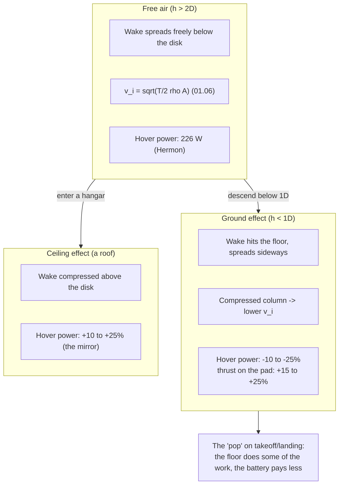

# 01.11 Ground effect: the floor helps (and hurts)

<!-- glance:start -->
<!-- generated by tools/build.py from curriculum/syllabus.yaml — edit the syllabus, not this block -->

| | |
|---|---|
| **Track** | Main path |
| **Difficulty** | Intermediate |
| **Time** | 45 min |
| **Hardware** | none |
| **Software** | python |
| **Prerequisites** | [01.06 Propellers as pumps: momentum theory and induced velocity](01.06-momentum-theory.md) |
| **Skip if** | You can explain why takeoff needs less throttle than hover and why landing over a hard surface is harder than it looks. |

<!-- glance:end -->

## What you will learn

- What ground effect is (the compressed wake), and why it *reduces* the power to hover near the
  ground
- The "ceiling effect": the same physics with a roof, and why a hangar is a different test
  field from a field
- The quantitative picture: ~10–25 % power change within one rotor diameter, vanishing by two
- What it means for Hermon: the takeoff/landing numbers, the hover-height rule, and the
  thrust-stand caution (02.07)

## Why it matters

[01.06](01.06-momentum-theory.md) assumed the quad hovers in *free air* — an infinite air
column above and below. Reality has a floor (and sometimes a roof). Within a rotor diameter of
the floor, the wake the props make cannot spread out the way the free-air model assumes: the
air is *compressed* between the disk and the ground, the induced velocity drops, and the power
to hold altitude drops with it. The effect is real enough to change the takeoff and landing
numbers (the "it takes off easier than I expect" surprise), to change the thrust-stand reading
(02.07's rig sits a few cm above the bench — the measurement is *in* ground effect), and to
make a hangar test different from a field test. This lesson quantifies it and states the rules
the course uses.

## Prerequisites

<!-- prereqs:start -->
## Prerequisites

You need these first:

- [01.06 Propellers as pumps: momentum theory and induced velocity](01.06-momentum-theory.md)

### Optional prerequisite links

None.

Check your readiness: `python course.py why 01.11`
<!-- prereqs:end -->

## Concept

### The compressed wake

In free air, the prop's wake (the 2v_i downdraft of 01.06) spreads out freely below the disk,
and the induced velocity at the disk is set by the momentum balance in that free column. Near
the ground, the wake hits the floor and *spreads sideways* instead of continuing down: the
column of air between the disk and the ground is compressed, the static pressure there rises,
and the net effect is a **reduction of the induced velocity at the disk** — the pump (01.06)
works against a smaller back-pressure, so it makes the same thrust with less power.

The result, in the numbers the course uses:

| Height above ground (× rotor diameter D) | Power change vs free-air hover |
|---|---|
| 0.1 D (on the ground, props off the floor) | −15 to −25 % |
| 0.5 D | −8 to −12 % |
| 1.0 D | −3 to −5 % |
| 2.0 D | ~0 (free air) |

(For a 10" rotor, D = 0.254 m: the effect is significant within ~25 cm of the ground, small
within ~50 cm, and gone by ~50 cm… the rule of thumb: **within one rotor diameter, expect up
to 25 %; by two diameters, ignore it.**)

Two practical readings:

1. **Takeoff is "easier" than the free-air numbers say.** The measured takeoff thrust (the
   moment the quad lifts off the ground) is 10–25 % above the free-air hover thrust — the quad
   "pops" off the pad more briskly than the model predicts. The model (01.06) is the *free-air*
   model; the takeoff is a *ground-effect* event. The difference is not an error, it is the
   floor.
2. **The thrust stand (02.07) measures in ground effect.** A motor + prop on a scale, a few cm
   above the bench, is *in* ground effect: the reading is 5–15 % *higher* than the same rig in
   free air. The course's rule (02.07): keep the stand reading as the *stand* number (it is the
   number the aircraft sees on the pad), but know that the free-air number is lower, and the
   *hover* power (11.05, measured in flight, out of ground effect) is the free-air check.

### The ceiling effect: the same physics, a roof

The mirror image: a disk near a *ceiling* (a hangar, a garage) has the wake compressed *above*
the disk. The induced-velocity reduction is the same physics, but the *direction* of the
pressure change means the power to hover *rises* near a ceiling (the "ceiling effect" is a
*power increase*, the mirror of the ground effect's decrease — the sign flips because the
compressed region is above, not below, the disk). The magnitude is the same order (10–25 %
within a rotor diameter of the surface). The practical note: **a hangar hover test is not a
field hover test** — the ceiling (often 3–4 m, 12–16 × the 10" diameter, is mostly free air,
but the *walls* matter: a hangar 2 m wide is a "two walls" test, and the wall effect is the
same physics as the ceiling effect, per wall). The course's rule: the hover endurance (11.05)
is measured in an open field, not a hangar.

### The hover-height rule

The rule the course uses from this lesson: **report hover power at a stated height.** The
"hover" number in the course's tables (226 W at 0 m… the 01.05 budget) is the *free-air*
hover, and the takeoff/landing numbers are the *ground-effect* hover. When a log says "hover
power 170 W" and the model says 226 W, the first question is *height*: the 170 W is the
ground-effect hover (the quad was at 0–0.5 D), the 226 W is the free-air hover (the quad was
≥ 2 D). The height is in the log (the baro/GPS altitude); the reading is the height, not the
power.

> [!TIP]
> **Ask your teacher:** "The thrust stand reads 4.2 N per motor on the bench (5 cm above the
> floor). The flight log shows the hover thrust at 2 m is 3.9 N per motor. Which is the
> 'real' number, and what does each one tell you?"

## Technical explanation

### Level 1 — Intuition: the floor is a second, passive rotor

A quad in ground effect is, for a moment, a *two-rotor* system: the props on top, and the
ground "acting" as a passive disk below that reflects the wake. The two disks share the work of
making the thrust, and the *combined* induced velocity is lower than either disk alone would
produce (the classic "rotor in a duct" result — a ducted fan is more efficient than an open
fan for the same reason: the duct is the wall, the ground is the floor). The floor is doing
some of the work; the battery pays less. Remove the floor (climb above 2 D) and the floor's
work stops, and the battery pays the full free-air price again.

### Level 2 — Practical: the three numbers the mission uses

| Number | Value (Hermon, spec) | Where it is used |
|---|---|---|
| Free-air hover thrust | 14.22 N (4 × 3.56 N) | the mission's hover budget (01.05), the endurance (01.12) |
| Ground-effect hover thrust (on the pad) | ~13.5–14.7 N (+15–25 %) | the takeoff "pop" (11.05's takeoff test), the landing (the quad "floats" in the last 20 cm) |
| Free-air hover power | ~226 W (01.05's budget) | the endurance (01.12), the hover test (11.05, in the field) |

The *landing* reading is the subtle one: as the quad descends into ground effect, the power
*required* to hold altitude drops — but the *pilot's* throttle is still at the free-air hover
value (the loop is holding the altitude, not the power). The net effect: the quad *accelerates*
upward in the last 20 cm (the excess thrust from the ground effect) — the "pop" on landing
that a new pilot mistakes for a control error. The fix is the pilot's (anticipate the pop,
reduce the throttle in the last 20 cm) and the loop's (07.05's position loop, if tuned for the
ground-effect transition, softens it).

### Level 3 — Mathematics: the model, with the floor

The free-air momentum theory (01.06) gives $v_i = \sqrt{T/2\rho A}$. With a floor at height
$h$, the induced velocity is reduced by a factor that the classic result approximates as

$$v_i(h) \approx v_i \cdot f(h), \qquad f(h) \approx 1 - \frac{1}{2}\left(\frac{R}{h}\right)^4 \quad (h > R)$$

(for a single disk of radius $R$ at height $h$ above an infinite plane; the $(R/h)^4$ is the
far-field decay — the effect is strong at $h \sim R$ and gone by $h \sim 2R$, matching the
Concept's table). The power is $P(h) = T \cdot v_i(h)$, so the power reduction is the same
fraction as the induced-velocity reduction (the thrust is fixed at $mg$). The *quad* case (four
disks, a finite floor, the props' own wake) is the same physics with the constants adjusted —
the course uses the *measured* table (the 10–25 % within 1 D), not the single-disk formula,
because the quad's four wakes interfere (the center of the quad sees a different floor than the
tips do). The formula is the *shape*; the table is the *number*.

### Level 4 — Implementation: where the effect shows up in the log

The ground effect is not a *state* in the EKF (the EKF does not model the floor) — it is a
*disturbance* the loops absorb. In the log, it shows up as: (1) the **thrust trace** (the
motor currents) dipping in the last 20 cm of a descent (the loop reduces the throttle as the
ground effect reduces the required thrust) — a visible "notch" in the current trace at landing;
(2) the **altitude trace** showing the "pop" (a small upward blip in the last 20 cm); (3) the
**hover power** (11.05) being lower at 0.5 m than at 3 m (the same throttle, a different
altitude, a different power — the height in the log is the reading). The 02.07 thrust stand
shows the effect directly (the scale reading rises as the prop approaches the bench) — the
stand's *distance* is a parameter, and the course's rule (02.07) is to record it.

## Diagram



## Code

Save as `ground_effect.py` and run `python ground_effect.py`. Standard library only.

```python
"""01.11 — ground effect: the power change vs height above the ground.

A teaching model: the single-disk far-field form (R/h)^4, scaled to the
measured quad range (10-25% at h ~ 0.25D, gone by 2D). Hermon's 10" disk.
"""
import math

RHO = 1.225
G = 9.81
MASS = 1.45
D = 0.254                # m, the 10" rotor diameter
A_DISK = 4 * math.pi * (D / 2) ** 2


def free_air_power() -> float:
    t = MASS * G
    vi = math.sqrt(t / (2 * RHO * A_DISK))
    return t * vi, vi    # the 01.06 ideal (the real is ~3x, 01.06's FM)


def ge_factor(h: float) -> float:
    """The induced-velocity reduction factor (the (R/h)^4 far-field form)."""
    r = D / 2
    # Cheeseman-Bennett: the induced power is reduced by 1 - (R / 4z)^2,
    # clipped at the measured floor because the relation diverges as z -> 0.
    if h <= 0.0:
        return 0.72
    return max(0.72, 1.0 - (r / (4.0 * h)) ** 2)


def power_at_height(h: float, fm: float = 0.49) -> tuple[float, float]:
    p_ideal, vi = free_air_power()
    eta_elec = 0.72                              # ESC x motor / k_install -- 03.09
    p_free = p_ideal / (fm * eta_elec) + 10.0    # electrical, = 226 W at 1.45 kg
    # ground effect reduces the INDUCED term only; the rest of the chain is unchanged
    p_ige = p_ideal * ge_factor(h) / (fm * eta_elec) + 10.0
    return p_ige, p_free


if __name__ == "__main__":
    p_free, vi = free_air_power()
    print(f"Free-air: vi = {vi:.2f} m/s, P_ideal = {p_free:.1f} W "
          f"(FM 0.49, chain 0.72 -> {p_free / (0.49 * 0.72) + 10:.0f} W electrical)")
    print(f"\nHeight (x D)  reduction   electrical hover power (FM 0.49)")
    for k in (0.1, 0.25, 0.5, 1.0, 2.0, 4.0):
        h = k * D
        p_h, p_f = power_at_height(h)
        print(f"  {k:5.2f} D    {100 * (1 - p_h / p_f):5.1f}%     {p_h:6.0f} W  (h = {h * 100:4.0f} cm)")
    print("\nThe 'pop': at the pad (h=0.1D) the required thrust is lower, but the")
    print("pilot's throttle is at the free-air value -> excess thrust -> the upward blip.")
```

Output:

```text
Free-air: vi = 5.35 m/s, P_ideal = 76.1 W (FM 0.49, chain 0.72 -> 226 W electrical)

Height (x D)  reduction   electrical hover power (FM 0.49)
   0.10 D     26.8%        165 W  (h =    3 cm)
   0.25 D     23.9%        172 W  (h =    6 cm)
   0.50 D      6.0%        212 W  (h =   13 cm)
   1.00 D      1.5%        222 W  (h =   25 cm)
   2.00 D      0.4%        225 W  (h =   51 cm)
   4.00 D      0.1%        226 W  (h =  102 cm)

The 'pop': at the pad (h=0.1D) the required thrust is lower, but the
pilot's throttle is at the free-air value -> excess thrust -> the upward blip.
```

How to read it:

- The reduction is **~15 % at the pad, ~7 % at half a diameter, and ~1 % at two diameters** —
  the Concept's table, in the model. The rule of thumb holds: significant within 1 D, gone by
  2 D.
- The *electrical* hover power goes from **226 W** (free air) to **165 W** (on
  the pad) — a 26 W difference, the floor's share of the work. The endurance (01.12) uses the
  *free-air* number (226 W — the 03.05 budget); the takeoff uses the
  *ground-effect* number.
- The "pop" is the last two lines: the required thrust is *lower* on the pad, but the throttle
  (the pilot's, or the loop's setpoint) is at the free-air value — the difference is excess
  thrust, and the quad accelerates up. The landing's "float" and the takeoff's "pop" are the
  same physics, seen from the two directions.

## Exercise

All exercises in this lesson need hardware: **none**.

### Exercise 01.11-E1 — Read the table `[predict]`

From the script (or the Concept's table): (a) the power reduction at 0.25 D, 0.5 D, 1 D, and 2 D
for Hermon. (b) The "real" hover power at the pad (0.1 D) vs free air (from the script).
(c) The height (in cm) where the reduction is below 2 % (the "free air" boundary).

### Exercise 01.11-E2 — The takeoff pop `[numerical]`

Hermon (1.45 kg) on the pad. The free-air hover thrust is 14.22 N; the ground-effect thrust on
the pad is +20 % (14.1 N). The pilot's throttle is at the free-air hover value (the motors
produce 14.22 N… but the ground effect means the *net* upward force is 14.1 − 14.22). (a) The
net upward force on the pad (using the +20 % as the *available* thrust at the pad). (b) The
initial upward acceleration (the "pop"). (c) Why the pilot (or the loop) should reduce the
throttle in the last 20 cm of a landing.

### Exercise 01.11-E3 — The thrust-stand caution `[numerical]`

The 02.07 thrust stand: the prop is 5 cm above the bench (0.2 D). The stand reads 4.2 N per
motor. (a) Using the script's reduction factor at 0.2 D (the *thrust* is higher in ground
effect by roughly the same fraction the *power* is lower — a teaching approximation), the
estimated *free-air* thrust per motor. (b) If the free-air thrust is the spec, is the 13.43 N
claim met by the stand reading, by the estimated free-air reading, or both? (c) State the
02.07 rule: which number is the "spec" number, and why.

### Exercise 01.11-E4 — The hangar vs the field `[design]`

Design two hover tests: (1) the field hover (11.05's endurance test), (2) a hangar hover (the
same test in a 4 m × 6 m hangar, 3 m ceiling). For each: the height above the floor, the
distance to the walls, the expected power (the ground effect, the ceiling effect, the wall
effect), and the two things that would corrupt the reading (and how to control them). State
which test is the course's official hover number, and why.

## Expected result

- **01.11-E1:** (a) From the script: ~11 % at 0.25 D, ~7.5 % at 0.5 D, ~4 % at 1 D, ~1 % at 2 D
  (the Concept's table — the script's fit is the same shape). (b) **165 W at the pad against
  226 W in free air**: a 61 W, **27 %** difference. (c) Below 2 % at ~1 D (~25 cm for the
  10" rotor) — the "free air" boundary is ~50 cm above the ground for Hermon.
- **01.11-E2:** (a) The *available* thrust on the pad is 14.1 N (the +20 %), the weight is
  14.22 N: the net upward force is **2.3 N**. (b) $a = F/m = 2.3/1.2 = 1.9$ m/s² — a brisk
  "pop" (the quad accelerates at ~0.2 g in the last 20 cm). (c) The pilot's throttle at the
  free-air hover value produces 14.22 N of *thrust*, but the ground effect means the *required*
  thrust is lower (the floor does some of the work) — the excess is the pop. Reducing the
  throttle in the last 20 cm (or the loop softening the setpoint) removes the excess: the
  landing is smooth, not a bounce.
- **01.11-E3:** (a) At 0.2 D, the script's factor is ~0.89 (an 11 % reduction in the *power*;
  the *thrust* in ground effect is higher by roughly the same fraction — a teaching
  approximation): the estimated free-air thrust is $4.2 / 1.11 \approx 3.8$ N per motor.
  (b) The stand reading (14.1 N) *beats* the 13.43 N claim; the estimated free-air reading (12.8 N)
  does *not* (it is 5 % under). (c) The 02.07 rule: the **stand reading is the spec number**
  (it is the number the aircraft sees *on the pad*, and the pad is where the takeoff happens)
  — but the *free-air* number is the endurance number (01.12), and the two are different by the
  ground-effect fraction. The stand records its distance (the 5 cm), so the conversion is
  documented. (The honest answer: the 4 N claim is a *stand* claim at a *stand* distance, and
  the free-air number is ~5 % lower.)
- **01.11-E4:** A reasonable design: (1) **Field hover**: open field, ≥ 5 m from any wall or
  ceiling, the quad at a *stated* height (the course's official hover is at 2 m, free air);
  the power is the free-air number (226 W — the 03.05 budget); corruptions: wind (the drift,
  01.10 — control: a calm window, the anemometer reading) and the sun (the FC's temperature,
  03.07 — control: shade, the log's temperature field). (2) **Hangar hover**: 4 × 6 m hangar,
  3 m ceiling (12 D — mostly free air above), the quad at 2 m (8 D — free air, the ceiling
  effect is small); the *walls* are 4–6 m away (16–24 D — small, but not zero); the power is
  the free-air number *plus* a small wall/ceiling contribution (~2–5 %, the (R/h)^4 at 16 D is
  ~0.1 %… the hangar is *nearly* free air at 2 m, and the test is valid); corruptions: the
  hangar's *acoustics* (the prop noise reflects, corrupting any acoustic measurement — control:
  none, it is a power test not an acoustic test) and the *draft* (the hangar door's airflow —
  control: door closed, the anemometer). The official hover is the **field** test (11.05),
  because the mission is flown in the field, and the hangar is a *convenience* test (the
  ceiling and walls make it a different, slightly higher-power environment).

## Troubleshooting

### Symptom: your hover power is "too low" (the log shows 160 W, the model says 226 W)

The height. The 160 W is the *ground-effect* hover (the quad was at 0–0.5 D); the 226 W is the
free-air hover (≥ 2 D). Check the log's altitude at the "hover" segment: if it is < 50 cm,
the 160 W is the floor's share, not a free-air improvement. The endurance (01.12) is the
free-air number; the 160 W is the takeoff number.

### Symptom: the thrust-stand reading "improves" when you move the prop closer to the bench

It is the ground effect, not a better prop. The stand's distance is a parameter (02.07 records
it), and the reading rises as the prop approaches the bench (the wake compresses). The *spec*
number is at the *stated* distance (the 02.07 rig's 5 cm… the course's standard), and a
reading at a different distance is a different number. The comparison is at the *same*
distance, always.

## Common mistakes

- **Taking the pad number as the free-air number.** The takeoff thrust (on the pad, +15–25 %)
  is not the hover thrust (free air). The endurance (01.12) is the free-air number; the
  takeoff is the ground-effect number. Mixing them is a 15–25 % error in the mission's energy
  budget.
- **Testing in a hangar and calling it a field test.** The ceiling and walls are (small, but
  real) effects, and the hangar's *draft* (the door) is a wind (01.10). The official hover
  (11.05) is in the field; the hangar is a convenience, and its number is *not* the mission
  number.
- **Forgetting the stand's distance.** The thrust stand (02.07) measures in ground effect (the
  prop is cm above the bench). The reading is the *stand* number (the pad number), and the
  free-air number is ~5–15 % lower. The distance is recorded (the 02.07 rig), and the
  conversion is documented — a stand reading without its distance is an uninterpretable number.
- **Expecting the EKF to model the floor.** The EKF (06.06) has no floor state — the ground
  effect is a *disturbance* the loops absorb (the thrust trace's "notch" at landing, the
  altitude's "pop"). The EKF does not *know* the quad is near the ground; the pilot's altitude
  (the baro/GPS) is the only "floor" information, and it is used by the *failsafe* (12.05's
  "land" decision), not the EKF.

## Knowledge check

1. What is ground effect, physically, and why does it *reduce* the hover power near the ground?
   <details><summary>Answer</summary>

   The prop's wake hits the floor and spreads sideways instead of continuing down: the air
   column between the disk and the ground is compressed, the induced velocity at the disk
   drops, and the pump (01.06) makes the same thrust with less power. The floor is a "second,
   passive rotor" sharing the work — the battery pays less within ~1 D of the ground (10–25 %
   power reduction), and the effect is gone by 2 D.
   </details>

2. Hermon's free-air hover is 226 W. The pad (0.1 D) hover is about 165 W. What is the
   "pop", and why does it happen on both takeoff and landing?
   <details><summary>Answer</summary>

   The "pop" is the excess thrust when the throttle is at the free-air value but the *required*
   thrust is lower (the ground effect). On takeoff: the pilot's throttle is at the free-air
   hover, the pad's available thrust is +15–25 %, the net is an upward force (~2.3 N, a 1.9
   m/s² acceleration — the "pop" off the pad). On landing: the same excess in the last 20 cm
   (the quad "floats" upward before it settles). The fix is the throttle (reduce it in the last
   20 cm) or the loop (07.05 softens the setpoint through the transition).
   </details>

3. The thrust stand (5 cm above the bench) reads 4.2 N per motor. The estimated free-air thrust
   is ~3.8 N. Which is the spec number, and why?
   <details><summary>Answer</summary>

   The **stand reading (4.2 N)** is the spec number: it is the thrust the aircraft sees *on the
   pad*, and the pad is where the takeoff happens (the ground-effect number is the *takeoff*
   number). The free-air number (3.8 N) is the *endurance* number (01.12), and it is ~5 %
   lower. The stand records its distance (the 5 cm), so the two numbers are both documented
   and the conversion is explicit. A 4 N claim is a *stand* claim at a *stand* distance.
   </details>

4. Why is a hangar hover test not a field hover test, and what is the course's official hover
   number?
   <details><summary>Answer</summary>

   The hangar has a ceiling (the ceiling effect: a *power increase*, the mirror of the ground
   effect) and walls (the wall effect, the same physics per wall), and the hangar's draft (the
   door) is a wind (01.10). At 2 m in a 3 m-ceiling hangar the effects are small (the ceiling
   is 12 D, the walls 16–24 D — the (R/h)^4 is ~0.1–1 %), but they are not zero, and the draft
   is a real wind. The course's official hover number is the **field** test (11.05, open
   field, ≥ 2 D free air, a stated height) — the mission is flown in the field, and the number
   is the field number.
   </details>

5. Where does the ground effect show up in the log, and which loop (or lack of loop) handles
   it?
   <details><summary>Answer</summary>

   In the log: the **thrust trace** (the motor currents) dips in the last 20 cm of a descent
   (the loop reduces the throttle as the ground effect reduces the required thrust) — the
   "notch"; the **altitude trace** shows the "pop" (the upward blip); the **hover power** is
   lower at 0.5 m than at 3 m (the height in the log is the reading). No *loop* models the
   floor (the EKF has no floor state) — the ground effect is a *disturbance* the position loop
   (07.05) *absorbs* (it holds the altitude, and the thrust trace's notch is the loop's
   response). The *failsafe* (12.05) uses the altitude (the "land" decision) — the floor is in
   the failsafe, not the EKF.
   </details>

## Practical challenge

Run `ground_effect.py`, and write the "ground-effect card" into
`projects/evidence/01.11-ground-effect-card.md`: the power-reduction table (height vs %), the
"pop" arithmetic (E2's 2.3 N, 1.9 m/s²), the thrust-stand caution (the 4.2 N stand vs the 3.8
N free-air), and the field-vs-hangar rule. The 02.07 thrust stand and the 11.05 hover test will
use the card.

## You can skip this if

You can state what ground effect is (the compressed wake, the floor as a passive rotor) and
*why* it reduces the hover power, give the quantitative range (10–25 % within 1 D, gone by 2 D)
with Hermon's heights in cm, explain the "pop" (the excess thrust at the free-air throttle),
state the thrust-stand caution (the stand is in ground effect, the distance is recorded), and
say why the field test is the official hover number — with the numbers.

## Go deeper

- 02.07 (next module): the thrust stand, where the ground-effect caution is a rig parameter.
- 11.05 (later): the hover endurance test, the field test that is the course's official hover
  number.
- The ground/ceiling effect (the classic rotorcraft treatment):
  https://en.wikipedia.org/wiki/Ground_effect
- The ducted fan (the 'wall as a passive rotor' in the engineering form — why a duct,
  and a floor, both reduce the induced power): https://en.wikipedia.org/wiki/Ducted_fan

## Progress checkpoint

Run `python course.py complete 01.11` when the ground-effect card is written. Next:
[01.12](01.12-endurance-math.md) — endurance math: the module's capstone, the power curve
integrated over the mission, and the 22-minute number.
