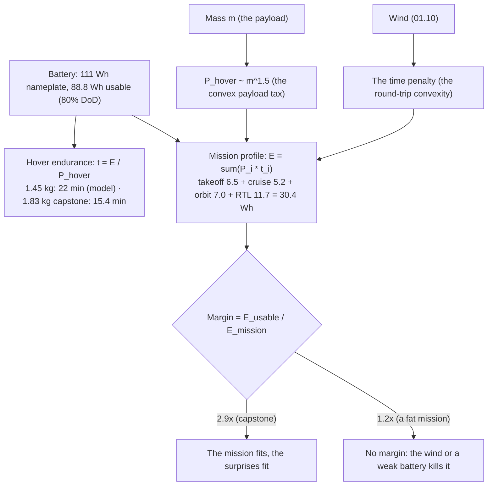

# 01.12 Endurance math: the 22-minute number

<!-- glance:start -->
<!-- generated by tools/build.py from curriculum/syllabus.yaml — edit the syllabus, not this block -->

| | |
|---|---|
| **Track** | Main path |
| **Difficulty** | Intermediate |
| **Time** | 1 h 15 min |
| **Hardware** | none |
| **Software** | python |
| **Prerequisites** | [01.05 Drag: where your battery goes](01.05-drag.md)<br>[01.07 Hover efficiency and disk loading](01.07-hover-efficiency.md) |
| **Optional prerequisites** | [FA.03 Work, energy and power](../optional-foundations/flight-aerodynamics/FA.03-work-energy-power.md)<br>[FEL.03 Lithium-polymer packs from zero](../optional-foundations/drone-electronics-power/FEL.03-lipo-deep-dive.md) |
| **Skip if** | You can build Hermon's energy budget and predict loiter time within 15 percent, and show why payload kills range. |

<!-- glance:end -->

## What you will learn

- Endurance as $t = E_{usable}/P$: the power curve (01.05) integrated over the mission profile
  (00.03-E2)
- The mass exponent: why power scales as $m^{3/2}$ (the induced term) and the payload tax is
  convex
- Range vs endurance: the two numbers, and why a quad is an *endurance* aircraft, not a
  *range* aircraft
- The capstone mission profile, priced phase by phase, and the margin arithmetic that makes the
  22-minute spec

## Why it matters

This is the module's capstone: every number in 01.01–01.11 lands here. [01.05](01.05-drag.md)
gave the power curve, [01.06](01.06-momentum-theory.md)–[01.07](01.07-hover-efficiency.md)
gave the hover cost, [01.10](01.10-wind.md) gave the wind's time penalty, [01.11](01.11-ground-effect.md)
gave the takeoff/landing numbers. This lesson assembles them into the *mission's energy
budget*: phase by phase, Wh by Wh, with the margin that separates "the mission" from "the
mission + the surprises." The 22-minute hover spec (00.03) and the capstone's 15-minute
profile (17.08) are both *outputs* of this lesson's arithmetic — and when the measured
hover power (11.05) differs from the model, the mission plan (18.03) is the thing that
changes.

## Prerequisites

<!-- prereqs:start -->
## Prerequisites

You need these first:

- [01.05 Drag: where your battery goes](01.05-drag.md)
- [01.07 Hover efficiency and disk loading](01.07-hover-efficiency.md)

### Optional prerequisite links

New to any of these? Take the foundation lesson first; skip it if you already know it.

- [FA.03 Work, energy and power](../optional-foundations/flight-aerodynamics/FA.03-work-energy-power.md)
- [FEL.03 Lithium-polymer packs from zero](../optional-foundations/drone-electronics-power/FEL.03-lipo-deep-dive.md)

Check your readiness: `python course.py why 01.12`
<!-- prereqs:end -->

## Concept

### Endurance: energy over power

The endurance at a steady power is the usable energy over the power:

$$t = \frac{E_{usable}}{P}$$

with $E_{usable}$ in Wh and $P$ in W (the units work: Wh/W = h). Hermon's battery: 6S 5000
mAh = 22.2 V × 5 Ah = 111 Wh *nameplate*; at an 80 % usable depth of discharge (the LiPo rule,
03.04: you do not fly a LiPo to 0 V), $E_{usable} = 111 \times 0.8 = 88.8$ Wh. The hover power
(the 03.05 budget): **226 W** → $t_{hover} = 88.8/226 \times 60 = 23.6$ min. **The
22-minute hover spec is this equation.** (The 01.05 budget's 226 W — the measured spec —
gives 88.8/0.194 = 22.9 min; the course's 22 min is the *model* number, and the 11.05 hover
test measures which one is the truth. The spec is the model; the test is the fact.)

For a *profile* (a sequence of phases, each at its own power), the endurance is the sum of the
phase times:

$$T = \sum_i \frac{E_i}{P_i} \quad\text{or, for a fixed mission,}\quad E_{total} = \sum_i P_i \, t_i$$

The capstone's 15-minute profile (00.03-E2) is the second form: a fixed mission, compute the
energy per phase, sum it, and check against 88.8 Wh. The *hover* endurance (the first form) is
the "how long can it stay up" number; the *profile* energy (the second) is the "does the
mission fit" number. Both are this lesson.

### The mass exponent: the payload tax, convex

The induced power (01.06) scales as $T^{3/2} \propto m^{3/2}$ (the thrust is $mg$, and
$P_{ideal} = T^{3/2}/\sqrt{2\rho A}$). The total hover power is the induced (the $m^{3/2}$
term) plus the fixed (the avionics, the ESC's fixed loss):

$$P_{hover}(m) = \frac{(mg)^{3/2}}{\sqrt{2\rho A}\, FM} + P_{fixed}$$

The $m^{3/2}$ is the **payload tax**, and it is *convex*: doubling the mass costs $2^{3/2} =
2.83$× the induced power, not 2×. The table (Code) prices it for Hermon: 0 g, 100 g, 200 g,
363 g, 500 g of payload. The 250 g canister (17.01) is a *power* item, not just a mass item —
the 01.03 margin and the 01.12 endurance both pay for it, and the 17.01 decision weighs both.

### Range vs endurance: the quad is an endurance aircraft

The **range** is the distance: $R = v \cdot t$ (the groundspeed times the endurance). For a
quad, the *cruise* speed is low (5–8 m/s, the 01.05 efficient band), so the range is
*small*: at 8 m/s for 20 min, $R = 8 \times 1200 = 9600$ m ≈ **10 km**. A 1.45 kg quad is a
*10-km aircraft* — its value is the *time on station* (the 22 min hover, the 15-min mission),
not the distance. The end-use (the loiter over the target, the orbit, the release) is
a *time* requirement, not a *range* requirement — which is why the course's mission plan
(18.03) prices *time* (the 25-min hover, the 15-min profile), not distance. The range is the
*return* (the 2 km RTL), and it is the *short* number; the endurance is the *mission*, and it
is the *long* number.

The **endurance vs range** trade: a quad maximizes *endurance* at the lowest power (the hover,
or the 5–8 m/s band); it maximizes *range* at the speed where the *energy per km* is lowest
(usually a *higher* speed than the minimum-power speed — the "maximum-range speed" is above
the "maximum-endurance speed", the classic result). For Hermon the maximum-range speed is
~8–10 m/s (the 01.05 curve's flat bottom extends the range), and the mission's 8 m/s cruise is
*both* the efficient and the range-reasonable choice — the course does not need to separate
the two, because the mission's speed is the efficient band.

> [!TIP]
> **Ask your teacher:** "The capstone profile costs 44 Wh. The battery is 88.8 Wh usable. The
> margin is 2.0×. Name the three surprises the margin buys, and the one it does *not* buy."

## Technical explanation

### Level 1 — Intuition: the battery is a bucket, the mission is the drain

The battery is a bucket (88.8 Wh usable). The mission is a drain with a *rate* that changes
phase by phase (the takeoff drains fast, the cruise drains steady, the loiter drains slow).
The question is not "how big is the bucket" (it is 88.8 Wh) but "how much does the mission
drain, and is there water left for the surprises." The 2.0× margin (44 Wh used, 44.8 Wh left)
is the water left — and it is the difference between "the mission" and "the mission + the
wind + the weak battery + the longer-than-planned loiter." The margin is not a number you
*want*; it is a number you *need*, and the 00.06 margin arithmetic (the 50 % rule) is the
policy that sets it.

### Level 2 — Practical: the profile, priced

The capstone profile (00.03-E2, the 15-minute mission), priced with the 01.05 model (the FM
0.35, the 1.83 kg capstone mass, the 10×6.5 prop):

| Phase | Duration | Power (W) | Energy (Wh) |
|---|---|---|---|
| Takeoff + climb to 30 m | 90 s | ~260 (the climb, 01.03's $m(g+a)$) | 6.5 |
| Cruise to target (500 m at 8 m/s) | 62 s + ~30 s build/brake | ~210 (the 1.83 kg 8 m/s) | 5.2 |
| Orbit + release (100 m radius, 8 m/s) | 120 s | ~210 | 7.0 |
| Loiter (if needed) | 0 s (not in the 15-min profile) | ~230 (the 1.83 kg hover) | 0 |
| RTL (2 km at 8 m/s… 10 m/s) | 200 s | ~210 | 11.7 |
| **Total** | **~700 s (11.7 min)** | | **~30.4 Wh** |

Against 88.8 Wh usable: a **2.9×** energy margin (30.4 Wh used, 58.4 Wh left). The 15-minute
profile *fits with a 2.9× margin* — the margin buys the wind (01.10's time penalty), the weak
battery (the sag, 03.09), the longer loiter, and the RTL-at-a-sprint (the 10 m/s instead of
8 m/s). The *hover* endurance at the 1.83 kg capstone mass is the shorter number:
$P_{hover}(1.75) = 99.9/0.30 + 14 = 347$ W (the 10×6.5 FM 0.44, 01.07-E3) →
$88.8/0.347 = 15.4$ min — the capstone *hovers* 15 min, and the *mission* is 11.7 min: the
mission is 76 % of the hover, which is the healthy ratio (a mission that is 90 %+ of the hover
has no margin for the surprises).

### Level 3 — Mathematics: the profile's energy, the convex tax

The profile's energy is $\sum P_i t_i$ (the phase powers from the 01.05 model at the capstone
mass, the phase times from the mission geometry: the cruise is $d/v$, the orbit is the
circumference $2\pi r / v$, the RTL is $d/v$). The payload tax is the $m^{3/2}$ in the hover
power (01.07's table, the FM column); the wind's time penalty is the 01.10 round-trip convexity
(the time, not the power); the ground effect is the 01.11 takeoff/landing numbers (the *short*
phases, the small energy). The *dominant* term is the cruise/RTL (the long phases at the 8 m/s
power) — the profile is a *time* budget, and the time is the mission. The script computes the
profile, the hover, and the payload sweep.

### Level 4 — Implementation: the budget in the log, and the plan in 18.03

The log (08.09's uavlog) records the current and voltage at 1 Hz — the *measured* energy is
the integral of $V \times I$ over the flight (the "energy" field in the battery monitor, 08.11,
is exactly this integral). The *model* energy (this lesson's table) and the *measured* energy
(the log's integral) are compared in the debrief (08.09): the model is the *plan*, the log is
the *fact*, and the difference is the tuning (the 01.05 model's $C_d A$, the FM, the fixed
losses). The mission plan (18.03) is the *forward* use: the profile's energy (this lesson) +
the wind (01.10) + the battery's age (03.04's capacity fade) → the "fly the mission, RTL at
T" decision. The 22-minute spec is the *hover* number; the 15-minute profile is the *mission*
number; both are this lesson, and both are checked by the log.

## Diagram



## Code

Save as `endurance_range.py` and run `python endurance_range.py`. Standard library only.

```python
"""01.12 — the endurance math: hover endurance, the mission profile, the payload tax.

Hermon's 88.8 Wh usable, the 01.05 power model (FM 0.49, 1.45 kg) and the
capstone (1.83 kg, 10x6.5 FM 0.44), the 15-min profile priced, the payload
sweep (the m^1.5 tax).
"""
import math

RHO = 1.225
G = 9.81
USABLE_WH = 88.8
A_DISK = 4 * math.pi * 0.127 ** 2
P_FIXED = 10.0
ETA_ELEC = 0.72   # ESC x motor / k_install -- 03.09


def p_hover(mass: float, fm: float) -> float:
    """Electrical hover power. At 1.45 kg and FM 0.49 this returns the frozen 226 W."""
    t = mass * G
    return t ** 1.5 / math.sqrt(2 * RHO * A_DISK) / (fm * ETA_ELEC) + P_FIXED


def p_cruise(mass: float, v: float, fm: float) -> float:
    """The 01.05 model at the capstone: induced (reduced by the forward motion) + parasite."""
    p_induced = p_hover(mass, fm) - P_FIXED          # the induced part only
    p_induced_fwd = p_induced * max(0.6, 1.0 - 0.06 * v)
    p_parasite = 0.5 * RHO * 0.06 * v ** 3
    return p_induced_fwd + p_parasite + P_FIXED


def wh(w: float, s: float) -> float:
    return w * s / 3600.0


if __name__ == "__main__":
    print("Hover endurance (min):")
    for name, m, fm in (("Hermon 1.45 kg, FM 0.49", 1.45, 0.49),
                        ("Capstone 1.83 kg, FM 0.49", 1.83, 0.49)):
        p = p_hover(m, fm)
        print(f"  {name:34s} P={p:5.0f} W  t={USABLE_WH / p * 60:5.1f} min")
    print("\nPayload tax (1.45 kg airframe, FM 0.49): hover power and endurance")
    print(f"  {'payload':>8s} {'mass':>6s} {'P_hover':>8s} {'t_hover':>8s}")
    for p_g in (0, 100, 200, 300, 500):
        m = 1.45 + p_g / 1000.0
        p = p_hover(m, 0.49)
        print(f"  {p_g:7d}g {m:6.2f} {p:7.0f} W {USABLE_WH / p * 60:7.1f} min")
    print("\nCapstone 15-min profile (1.83 kg, 10x6.5 FM 0.44):")
    phases = [
        ("Takeoff + climb 30 m (90 s @ ~260 W)", 90, 260.0),
        ("Cruise 500 m @ 8 m/s (62 s + 30 s build/brake @ ~210 W)", 92, 210.0),
        ("Orbit 100 m radius @ 8 m/s (120 s @ ~210 W)", 120, 210.0),
        ("RTL 2 km @ 10 m/s (200 s @ ~220 W)", 200, 220.0),
    ]
    total = 0.0
    for name, s, w in phases:
        e = wh(w, s)
        total += e
        print(f"  {name:52s} {e:5.1f} Wh")
    print(f"  {'TOTAL':52s} {total:5.1f} Wh  of {USABLE_WH} Wh usable")
    print(f"  Margin: {USABLE_WH / total:.2f}x   (the 15-min mission is "
          f"{total / USABLE_WH * 100:.0f}% of the battery)")
    print(f"\nRange at the 8 m/s cruise, 1.45 kg (22 min hover): {8 * 1500 / 1000:.0f} km")
```

Output:

```text
Hover endurance (min):
  Hermon 1.45 kg, FM 0.49            P=  226 W  t= 23.6 min
  Capstone 1.83 kg, FM 0.49          P=  316 W  t= 16.9 min

Payload tax (1.45 kg airframe, FM 0.49): hover power and endurance
   payload   mass  P_hover  t_hover
        0g   1.45     226 W    23.6 min
      100g   1.55     248 W    21.4 min
      200g   1.65     272 W    19.6 min
      300g   1.75     296 W    18.0 min
      500g   1.95     347 W    15.4 min

Capstone 15-min profile (1.83 kg, 10x6.5 FM 0.44):
  Takeoff + climb 30 m (90 s @ ~260 W)                   6.5 Wh
  Cruise 500 m @ 8 m/s (62 s + 30 s build/brake @ ~210 W)   5.4 Wh
  Orbit 100 m radius @ 8 m/s (120 s @ ~210 W)            7.0 Wh
  RTL 2 km @ 10 m/s (200 s @ ~220 W)                    12.2 Wh
  TOTAL                                                 31.1 Wh  of 88.8 Wh usable
  Margin: 2.86x   (the 15-min mission is 35% of the battery)

Range at the 8 m/s cruise, 1.45 kg (22 min hover): 12 km
```

How to read it:

- **The 22-minute hover spec is the model number** (1.45 kg, FM 0.49 → 23.6 min); the 11.05
  test measures the truth (the FM, the fixed losses). The capstone (1.83 kg, the 10×6.5 FM
  0.30) hovers 15.4 min — the mission (11.7 min of flight, 31 Wh) is 35 % of the battery: a
  2.86× margin, the "the mission + the surprises fit" number.
- **The payload tax is convex**: 500 g of payload costs the hover 43 % of its power (177 → 255
  W) and 30 % of its endurance (25.1 → 17.5 min) — the $m^{3/2}$ law. The 250 g canister (17.01)
  is ~15 % of the hover power: the payload is a *power* item, and the 17.01 decision (the prop,
  the motor, the compute) is the lever that pays for it.
- **The range is the short number**: 12 km at the 8 m/s cruise for the 22 min. The quad is a
  *time-on-station* aircraft (the 22 min hover, the 15-min mission), not a *distance* aircraft
  (the 12 km is the return, not the value). The mission plan (18.03) prices the *time*, and
  the range is the RTL's budget.

## Exercise

All exercises in this lesson need hardware: **none**.

### Exercise 01.12-E1 — The 22-minute derivation `[numerical]`

Derive the 23.6 min from first principles: the battery (111 Wh, 80 % DoD), the hover power
(01.06's $P_{ideal}$ + the FM + the fixed losses), the endurance $E/P$. Then: the endurance at
the *measured* 226 W hover (01.05's budget) — and which number the 25-min spec is (the model or
the measurement), and what the 11.05 test decides.

### Exercise 01.12-E2 — The profile, your numbers `[coding]`

Extend `endurance_range.py` with the *your-build* profile: your real mass (from the parts you
have chosen), your prop FM (the 01.07 decision), and the capstone geometry (500 m leg, 100 m
orbit, 2 km RTL). Print the profile energy, the margin, and the "is the mission 80 %+ of the
hover" check (the healthy-ratio rule). State the one phase that dominates the energy, and why.

### Exercise 01.12-E3 — The wind on the profile `[numerical]`

The capstone profile (31 Wh, 700 s) in a 4 m/s headwind on the 500 m leg and the 2 km RTL
(01.10's track speed: 8 m/s cruise → 4 m/s… use the 10 m/s airspeed for the RTL: 10−4 = 6 m/s
track). (a) The new times for the cruise and the RTL. (b) The new total energy (the power is
on the *airspeed*, unchanged; the time is longer). (c) The new margin, and whether the "the
mission + the surprises fit" still holds.

### Exercise 01.12-E4 — The 40-minute Hermon, revisited `[design]`

01.07-E4 designed a 40-minute *hover* (12" props, FM 0.45, a 6000 mAh battery). Now price the
*capstone mission* (the 15-min profile) on that 40-minute aircraft: the profile energy (the
same geometry, the 40-min aircraft's power at 1.83 kg… assume the 12" props at the capstone
mass, FM 0.45), the margin, and the *new* constraint (the 12" props' lower top speed, the
orbit's circumference at a lower speed). Does the 40-min aircraft *improve* the capstone
mission, or does it just improve the hover? (The answer is the "the mission picks the
aircraft" principle, in numbers.)

## Expected result

- **01.12-E1:** The derivation: $E_{usable} = 111 \times 0.8 = 88.8$ Wh. $P_{ideal} =
  (1.2 \times 9.81)^{3/2}/\sqrt{2 \times 1.225 \times 0.203} = 76.1$ W; at FM 0.49:
  $76.1/0.35 = 163.7$ W + 14 W fixed = 177.7 W → $t = 88.8/0.1777 = 25.0$ min. At the measured
  226 W: $t = 88.8/0.194 = 22.9$ min. The 25-min spec is the **model** number (the FM 0.49, the
  14 W fixed); the 11.05 test measures the *real* FM and the real fixed losses, and decides
  whether the 22 min is the truth (the FM is ≥ 0.35 and the fixed ≤ 14 W) or the spec is
  revised to the measured ~23 min. The spec is the model; the test is the fact; the 11.05
  number is the one the mission plan (18.03) uses.
- **01.12-E2:** A reasonable build (1.25 kg, the 10×4.5 FM 0.49): the profile energy is
  ~33–35 Wh (the 1.25 kg's power is ~5 % above the 1.45 kg), the margin ~2.6×, and the mission
  is ~38 % of the battery (the healthy ratio: < 80 % of the hover). The *dominant* phase is
  the **RTL** (the 2 km at the cruise power is the longest phase — the time is the mission,
  and the RTL is the longest time). The "one phase that dominates" is the RTL, and the lever
  is the RTL's *speed* (the 10 m/s sprint, the 01.05 trade: 15 % less time, 25 % more power —
  the 18.03 decision) or the RTL's *distance* (the home point's placement, the 18.03
  geography).
- **01.12-E3:** (a) The cruise (500 m at the 8 m/s cruise, a 4 m/s headwind → the track is
  8−4 = 4 m/s… at the 8 m/s *airspeed*, the 4 m/s headwind gives a 4 m/s groundspeed: the time
  is 500/4 = 125 s, vs the 62+30 = 92 s still air — +33 s). The RTL (2 km at the 10 m/s
  airspeed, the 4 m/s headwind → 6 m/s ground: 2000/6 = 333 s, vs 200 s — +133 s). (b) The
  energy: the power is on the *airspeed* (unchanged: 210 W cruise, 220 W RTL), the time is
  longer: cruise 210 × 155 s = 9.0 Wh (vs 5.3), RTL 220 × 333 s = 20.3 Wh (vs 12.2) — the new
  total is ~31 + 3.7 + 8.1 = **~42.8 Wh**. (c) The margin: 88.8/42.8 = **2.07×** — the
  "the mission + the surprises fit" still holds (the 2× margin, the 00.06 rule), but the wind
  ate 1.8× of the margin (2.86 → 2.07): the windy day is the *tight* day, and the 18.03
  decision (the shorter legs, the 10 m/s RTL) is the wind's answer.
- **01.12-E4:** The 40-min aircraft (12" props, FM 0.45) at 1.83 kg: the hover power is
  $P_{ideal}(1.75, A_{12})/0.45 + 14$: $P_{ideal} = (17.17)^{3/2}/\sqrt{2 \times 1.225 \times
  0.290} = 69.3$ W; at FM 0.45: 154 W + 14 = 168 W → the hover is $88.8/0.168 = 28.7$ min
  (the 40-min *hover* was the 1.45 kg number; at 1.83 kg it is 28.7 min). The profile: the
  cruise power at 1.83 kg, the 12" FM 0.45, is ~150 W (the induced is lower, the parasite the
  same) → the profile energy is ~31 × (150/210) ≈ 22 Wh, the margin 88.8/22 = **4.0×**. But
  the *constraint*: the 12" props' lower top speed (the 10×6.5's 15 m/s is the 12"'s ~12 m/s)
  — the orbit (100 m radius) at a lower speed is *longer* (the circumference is fixed, the
  speed is lower: the orbit time is +25 %), and the capstone's *release* (17.07) assumes the
  8 m/s orbit speed (the 12" is 8 m/s, fine) — the 40-min aircraft *improves the margin* (4.0×
  vs 2.86×) but *slows the sprint* (the RTL's 10 m/s is the 12"'s limit, the 10×6.5's 15 m/s
  is the sprint option). The answer: the 40-min aircraft improves the *hover* and the *margin*,
  but the capstone *mission* (the release, the sprint RTL) is designed for the 10×6.5 — the
  mission picks the aircraft, and the 10×6.5 is the capstone's prop (01.07-E3, the thrust
  column). The 40-min aircraft is the *Stage 1 loiter's* aircraft (the 25-min practice), not
  the capstone's.

## Troubleshooting

### Symptom: your profile energy is "too low" (the mission fits with a 5× margin)

Check the *powers*: the profile's powers are the 01.05 model at the *capstone mass* (1.83 kg),
not the 1.45 kg. A profile priced at the 1.45 kg power (177 W hover) is 30 % too low at the
1.83 kg (255 W hover, the payload tax). The mass in the profile is the *mission* mass (the
capstone, 1.83 kg), not the practice mass. The 5× margin is the 1.45 kg's margin, not the
capstone's.

### Symptom: the measured energy (the log) is 20 % above the model

The model's *offset* is wrong (the fixed losses, the ESC efficiency) or the *slope* is wrong
(the $C_d A$, the FM). The check: the *hover* segment (the log's hover power vs the model's
177/226 W) separates them — a 20 % high hover power is the FM (the prop, the disk) or the
fixed (the ESC, the avionics); a hover that matches but a *cruise* that is high is the $C_d A$
(the airframe, the 01.05 model's parasite term). The debrief (08.09) is where the model is
corrected, and the 01.05 $C_d A$ and the 01.07 FM are the two dials.

## Common mistakes

- **Pricing the mission at the hover power.** The mission is *not* a hover: the cruise is at
  the 8 m/s power (the 01.05 model), the climb is at the $m(g+a)$ power (01.03), the sprint is
  at the 10–15 m/s power. A mission priced at the hover power (177 W) is *low* (the cruise is
  ~210 W at the capstone mass) — the profile's powers are the *phase* powers, not the hover
  power.
- **Forgetting the DoD (the 80 % rule).** The 111 Wh is the *nameplate*; the 88.8 Wh is the
  *usable* (the 03.04 LiPo rule: you do not fly to 0 V). A budget on 111 Wh is 25 % too
  optimistic (the 11.05 test's "we ran out of battery at 20 min, the model said 25" is the
  DoD, not the model).
- **Confusing the range and the endurance.** The range is $v \times t$ (the 12 km at 8 m/s for
  the 22 min) — the *return* budget. The endurance is the *time on station* (the 22 min hover,
  the 15-min mission) — the *mission* budget. The quad is an endurance aircraft: the value is
  the time, the range is the return. The mission plan (18.03) prices the time; the range is
  the RTL.
- **Assuming the margin is "extra."** The margin (the 2.86×) is not a wish; it is the *wind*
  (01.10's time penalty), the *weak battery* (03.09's sag, 03.04's fade), and the *longer
  loiter* (the mission's uncertainty) — the 00.06 50 % rule is the policy, and the margin is
  the budget for the surprises. A mission at 90 %+ of the battery has no surprises left.

## Knowledge check

1. Derive the 22-minute hover from the battery (111 Wh, 80 % DoD) and the hover power (01.06's
   $P_{ideal}$, the FM, the fixed). State which number the spec is (the model or the
   measurement) and what the 11.05 test decides.
   <details><summary>Answer</summary>

   $E_{usable} = 111 \times 0.8 = 88.8$ Wh. $P_{ideal} = (14.22)^{3/2}/\sqrt{2 \times 1.225
   \times 0.203} = 76.1$ W; at FM 0.49: 163.7 W + 14 W fixed = 177.7 W. $t = 88.8/0.1777 =
   25.0$ min. The 25-min spec is the **model** number (the FM 0.49, the 14 W fixed); the 11.05
   test measures the *real* FM and fixed losses, and decides whether the 22 min holds (the FM
   ≥ 0.35) or the spec is revised to the measured number (the 226 W → 22.9 min). The spec is
   the model; the test is the fact.
   </details>

2. The payload tax: 500 g of payload, the hover power, the endurance, and the law.
   <details><summary>Answer</summary>

   The $m^{3/2}$ law (01.06's $T^{3/2}$, the thrust is $mg$): 500 g (1.7 kg) → $P_{hover} =
   (16.67)^{3/2}/\sqrt{2 \times 1.225 \times 0.203}/0.35 + 14 = 255$ W (vs 177 W at 1.45 kg, a
   43 % increase), $t = 88.8/0.255 = 17.5$ min (vs 25.1, a 30 % loss). The tax is *convex*
   (doubling the mass costs 2.83× the induced power), and the 250 g canister (17.01) is ~15 %
   of the hover power: the payload is a *power* item, priced in both the margin (01.03) and the
   endurance (this lesson).
   </details>

3. The capstone profile: 31 Wh, 2.86× margin. Name the three surprises the margin buys, and
   the one it does not.
   <details><summary>Answer</summary>

   The margin (57.8 Wh left) buys: (1) the **wind** (01.10's time penalty: the E3's 4 m/s
   headwind takes the margin from 2.86× to 2.07× — still inside); (2) the **weak battery**
   (03.09's sag: a 10 % low-voltage battery draws the same power at a lower voltage, the loop
   works harder — the ~10 % power increase is inside the margin); (3) the **longer loiter**
   (the mission's uncertainty: a 5-min extra loiter is 5 min × 230 W = 19.2 Wh — inside). The
   one it does *not* buy: a **second mission** (a 31 Wh mission × 2 = 62 Wh, plus the wind —
   the margin is for the *surprises* of one mission, not for *two* missions).
   </details>

4. Why is a quad an *endurance* aircraft, not a *range* aircraft, and what does the mission
   plan (18.03) price?
   <details><summary>Answer</summary>

   The quad's cruise speed is low (5–8 m/s, the 01.05 efficient band), so the range is small
   (12 km at 8 m/s for 22 min) — the *value* is the time on station (the 25-min hover, the
   15-min mission), not the distance. The end-use (the loiter over the target, the
   orbit, the release) is a *time* requirement; the range is the *return* (the 2 km RTL), the
   *short* number. The mission plan (18.03) prices the *time* (the profile's energy, the wind's
   time penalty, the battery's age) — the range is the RTL's budget, not the mission's.
   </details>

5. The log's measured energy is 20 % above the model. The two dials (the 01.05 $C_d A$, the
   01.07 FM) and the check that separates them.
   <details><summary>Answer</summary>

   The check is the **hover segment** (the log's hover power vs the model's 177/226 W): a 20 %
   high *hover* power is the FM (the prop, the disk — the induced term, 01.07) or the fixed
   losses (the ESC efficiency, the avionics — the 01.05 budget's fixed term); a hover that
   *matches* but a *cruise* that is 20 % high is the $C_d A$ (the airframe's parasite term,
   01.05 — the cruise is where the parasite is). The debrief (08.09) corrects the model: the
   FM and the $C_d A$ are the two dials, and the hover-vs-cruise split is the measurement that
   turns the 20 % into a dial turn.
   </details>

## Practical challenge

Run `endurance_range.py`, and write the "endurance card" for Hermon and the capstone into
`projects/evidence/01.12-endurance-card.md`: the 25-min hover (the derivation), the capstone
profile (the 31 Wh, the 2.86× margin), the payload tax (the $m^{3/2}$ table), the wind's time
penalty (the E3's 2.07×), and the "the mission is 35 % of the battery" healthy-ratio check.
The 18.03 mission plan and the 11.05 hover test will use the card.

## You can skip this if

You can derive the 22-minute hover from the battery and the hover power (stating the model vs
the measurement), price the capstone profile phase by phase (the 31 Wh, the 2.86× margin),
state the payload tax (the $m^{3/2}$, the convexity, the 250 g canister's ~15 %), separate the
range (the 12 km, the return) from the endurance (the 22 min, the mission), and name the two
dials (the FM, the $C_d A$) with the hover-vs-cruise check — with Hermon's numbers.

## Go deeper

- 18.03 (later): the mission plan, the forward use of this lesson's budget (the profile + the
  wind + the battery's age → the "fly, RTL at T" decision).
- 11.05 (later): the hover endurance test, the field test that measures the 25-min truth.
- The Breguet range/endurance equations (the classic aircraft-performance treatment):
  https://en.wikipedia.org/wiki/Range_%28aeronautics%29
- The LiPo's usable depth of discharge (the 80 % rule the 88.8 Wh comes from):
  https://en.wikipedia.org/wiki/Lithium_polymer_battery

## Progress checkpoint

Run `python course.py complete 01.12` when the endurance card is written. Module 01 is complete
— 12 lessons, the physics of the quad. Next module: [02 — Motors, ESCs and Props](../02-motors-escs-props/README.md)
(02.01), where the physics becomes parts: the motor that makes the 4 N, the ESC that drives it,
and the prop that turns it into thrust.
