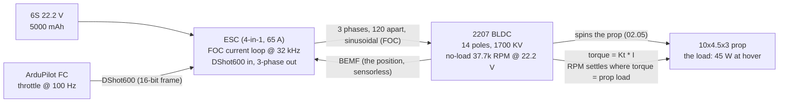

# 02.01 Brushless motors: how a 3-phase BLDC spins

<!-- glance:start -->
<!-- generated by tools/build.py from curriculum/syllabus.yaml — edit the syllabus, not this block -->

| | |
|---|---|
| **Track** | Main path |
| **Difficulty** | Intermediate |
| **Time** | 1 h |
| **Hardware** | none |
| **Software** | python |
| **Prerequisites** | [01.03 Thrust, weight and the thrust-to-weight ratio](../01-flight-physics/01.03-thrust-to-weight.md) |
| **Optional prerequisites** | [FEL.04 Brushless motors from zero](../optional-foundations/drone-electronics-power/FEL.04-bldc-from-zero.md) |
| **Skip if** | You can explain commutation and back-EMF in a BLDC and why "brushless" is about the commutation, not magic. |

<!-- glance:end -->

## What you will learn

- How a 3-phase brushless motor (BLDC) turns DC into rotation: the stator windings, the
  rotating magnet, and the back-EMF that replaces the brushes
- What the ESC actually does: sequence the three phases (FOC) and command a *throttle*, not a
  voltage
- The KV number, the RPM equation, and Hermon's operating point (hover ~18k RPM, 2207-class
  1700 KV at 6S)
- The motor spec sheet, read like an engineer: KV, pole count, continuous current, no-load
  current, mass — and which of these the 01.03 margin math depends on

## Why it matters

[01.03](../01-flight-physics/01.03-thrust-to-weight.md) said Hermon's spec claim is 4 N per motor at 100 % throttle,
and that claim is *made* by one part: the motor (with its prop, 02.05). The motor is where the
battery's watts become newtons, and its two numbers — the KV (RPM per volt) and the current
limit (the torque ceiling) — set the operating point the whole course prices (the hover power
of 01.05, the endurance of 01.12, the margin of 01.03). This lesson is the motor's physics and
its spec sheet; 02.02 is the curve; 02.07 is the measurement. The module 01 physics is the
*why*; this module is the *part*.

## Prerequisites

<!-- prereqs:start -->
## Prerequisites

You need these first:

- [01.03 Thrust, weight and the thrust-to-weight ratio](../01-flight-physics/01.03-thrust-to-weight.md)

### Optional prerequisite links

New to any of these? Take the foundation lesson first; skip it if you already know it.

- [FEL.04 Brushless motors from zero](../optional-foundations/drone-electronics-power/FEL.04-bldc-from-zero.md)

Check your readiness: `python course.py why 02.01`
<!-- prereqs:end -->

## Concept

### The machine: windings around a spinning magnet

A brushless DC motor has a **stator** (stationary) with three windings (phases A, B, C,
120° apart) and a **rotor** (spinning) with permanent magnets (for Hermon's class: 7 pairs of
N/S poles, 14 poles). The ESC feeds the three phases a sequence of currents; the resulting
magnetic field pulls the rotor around. As the rotor spins, its magnets induce a voltage in the
stator windings — the **back-EMF (BEMF)** — and the ESC reads that voltage (sensorless
operation: no Hall sensors) to know where the rotor is. The "brushless" part: the commutation
(sequence) is done by electronics (the ESC) instead of brushes and a commutator, so there is no
mechanical wear and the current can be high (the 10 A+ a quad needs, which brushes would burn
through).

The three phases are not "on/off" — the ESC runs **field-oriented control (FOC)**: it drives
each phase with a sinusoidal current, 120° apart in phase, timed to the rotor's position. The
result is a smooth, continuous torque (not the "kick-kick-kick" of a simple stepper). The pilot
(or the firmware) commands one number — the **throttle** (0–100 %) — and the ESC turns it into
the three-phase currents. *That is the whole interface*: one command, three phases, a spinning
magnet.

### KV: RPM per volt, the number the spec sheet leads with

**KV** is the motor's no-load speed constant: the RPM it spins at, per volt, with no load:

$$n_{no\text{-}load} = KV \times V$$

A 1700 KV motor at 22.2 V (6S nominal) spins 1700 × 22.2 = **37,740 RPM** with no prop on it.
Put a prop on it and the load pulls the RPM down (the prop is the load, 01.05's drag +
01.06's induced power); at Hermon's hover point the loaded RPM is ~18,000 (the "loading
factor" ~0.5–0.6 of the no-load speed, at the hover throttle — the teaching value the 02.07
stand test replaces with a measured number). KV is the *coupling* between the battery (voltage)
and the prop (the RPM that sets the thrust, 02.05): a higher KV spins the same prop faster
(more thrust, more current, less efficiency at hover); a lower KV is the opposite. **Choosing
the KV is choosing the operating point** — 02.02's curve makes it visual, 02.11's design
exercise makes it a decision.

### Hermon's motor, as a spec (the class, not the SKU)

The course fixes the *class* now and the *SKU* in batch 29 (supplier research, the USD
prices):

| Parameter | Hermon target | Why (the lesson it answers) |
|---|---|---|
| Stator | 2207 (22 mm × 7 mm) | big enough for 10" props, small enough for 1.45 kg (01.03's mass) |
| KV | ~1700 KV (6S) | the hover operating point (02.02's curve) |
| Poles | 14/12 (N/S) | smooth torque at 10" RPM (02.09's vibration) |
| Max continuous current | ~12 A per motor | the torque ceiling (01.03's 4 N claim) |
| No-load current | < 0.5 A per motor | the "is it dragging" health check (02.09) |
| Mass | ~72 g per motor | the 1.45 kg budget (01.03's margin) |

The *claim* the spec sheet carries (4 N per motor at 100 %, on the 10×4.5, 6S, **sagged
battery** — 01.03's framing) is the number the 02.07 thrust stand will *measure* and either
confirm or replace. Until 02.07, it is a claim.

> [!TIP]
> **Ask your teacher:** "A 1700 KV motor at 6S spins 37,740 RPM no-load. At hover it spins
> ~18,000. What took the RPM down, and which of the three (the battery, the ESC, the prop)
> would you check first if the hover RPM were 14,000 instead?"

## Technical explanation

### Level 1 — Intuition: the ESC is a 3-phase clock

The motor wants its three phases energized in a sequence, timed to the rotor. The ESC is the
clock: it looks at the BEMF (where the rotor is), and drives the phases 120° ahead of it (to
*pull* the rotor, not push it). The throttle is the clock's *volume knob*: 0 % is no current
(the rotor coasts, friction stops it), 100 % is the full current limit (the maximum pull).
Between 0 and 100, the current — and the torque — scales with the throttle. The motor is a
*torque* machine; the "throttle" is really a *torque* command, and the RPM is what the torque
and the prop's load settle at (02.02's curve: the intersection of the motor's torque and the
prop's demand).

### Level 2 — Practical: the spec sheet, read in order

When a supplier lists a motor (batch 29), read it in this order, because each number answers a
different lesson:

1. **KV** (RPM/V) → the operating point (02.02, 02.06): the KV that puts the hover on the
   efficient part of the thrust curve.
2. **Max continuous / burst current (A)** → the torque ceiling (01.03's margin, 02.06's
   matching): the current limit is the thrust limit.
3. **No-load current (A)** → the health check (02.09): a motor dragging on its bearing draws
   1+ A no-load and runs hot.
4. **Mass (g)** → the margin (01.03): every gram is thrust, and thrust is power (01.12).
5. **Stator size (the "2207" name)** → the class: bigger stator, more torque at the same
   current (the 2306 upgrade of 01.03-E4, in physical form).
6. **Poles (N/S count)** → the vibration/noise character (02.09): more poles, smoother torque,
   lower RPM per volt at the same… (the pole count and the KV are set together by the winding).

The SKU the student will actually buy is the batch 29 research's job (US suppliers, USD
prices, import risk); the *class* above is the course's, and 02.11 checks that whatever is
bought fits the class.

### Level 3 — Mathematics: the electrical side, the numbers the ESC lives in

The motor is an electrical machine with three numbers the ESC uses:

- **Back-EMF constant** $K_e$ (V per rad/s, or the KV in RPM form): the voltage the spinning
  motor generates. At steady speed, the BEMF *opposes* the supply: the current is
  $I = (V_{applied} - E_{bemf})/R$ — the motor draws current only while it is *accelerating*
  or *fighting a load* (the BEMF has caught up). At a steady hover, the BEMF ≈ the applied
  voltage minus the small $IR$ drop, and the current is the torque's price:
  $I_{torque} = \tau / K_t$ (the torque constant $K_t$, the twin of $K_e$: $K_t = K_e$ in SI
  units, up to the unit conversion).
- **Winding resistance** $R$ (mΩ): the heat. $P_{heat} = I^2 R$ — a 2207's phase resistance is
  ~20–30 mΩ; at 12 A that is 3–4 W of heat *in the windings*, per phase set (02.09's thermal
  budget).
- **The torque**: $\tau = K_t I$ — linear in the current. The 4 N thrust claim at 100 % is a
  *current-limited* operating point (the ESC's per-motor current limit, the 55 A 4-in-1's
  headroom), not a voltage one: at 100 % throttle the ESC pushes the current to the limit, and
  the current (with the prop's load) sets the thrust.

The hover point (the course's operating point): ~2.0 A per motor at the battery (45 W per
motor, 01.05's budget) — the current is the *torque* the prop needs at hover, and the 12 A
continuous limit is the *ceiling* (the 01.03 margin: 2.0 A used, 12 A available, at the
battery-sag voltage).

### Level 4 — Implementation: the DShot command, the one number to the ESC

The firmware (ArduPilot, 08) does not talk to the motor — it talks to the ESC, over a **DShot**
wire (02.04). DShot600 (Hermon's choice, 6S-class) is a 1-wire, 600 kbps protocol: the FC sends
a 16-bit frame, the ESC answers with a 16-bit ACK (the "telemetry" the FC reads back: the
throttle, the RPM if the ESC supports it, the current if the ESC has a sensor). The *rate*:
the FC sends the throttle at 100 Hz (the 00.04 runtime view), the ESC runs its FOC at 16–32 kHz
(the current loop, far faster than the throttle changes). The motor's 18k RPM is ~300
rev/s; the ESC's current loop at 32 kHz sees ~100 samples per revolution — the FOC has the
resolution to be smooth (02.09's vibration story starts here: a smooth FOC, a smooth motor).

## Diagram



## Code

Save as `bldc_model.py` and run `python bldc_model.py`. Standard library only.

```python
"""02.01 — the BLDC motor as the course models it: KV, RPM, current, BEMF.

Hermon's target motor (2207, 1700 KV, 6S) at the hover and the 100% point:
the no-load RPM, the loaded RPM (the teaching loading factor), the current,
the BEMF, and the I^2R heat the windings make.
"""

KV = 1700.0           # RPM per volt
V_BATT = 22.2         # V, 6S nominal
V_SAG = 21.6          # V, the sagged battery (03.09)
R_PHASE = 0.025       # ohm, the winding resistance (teaching value)
I_CONT = 12.0         # A, the max continuous current (the spec)
LOAD_FACTOR = 0.55    # the loaded-RPM fraction of no-load (teaching value, 02.07 measures)


def rpm_loaded(voltage: float, throttle: float) -> float:
    """The loaded RPM: KV * V * throttle, pulled down by the prop's load."""
    return KV * voltage * throttle * LOAD_FACTOR


def bemf(rpm: float) -> float:
    """The back-EMF (V) at a given RPM: the KV in voltage form."""
    return rpm / KV


def heat(i: float) -> float:
    """The I^2R heat in the windings (W)."""
    return i * i * R_PHASE


if __name__ == "__main__":
    no_load = KV * V_BATT
    print(f"No-load RPM @ {V_BATT} V: {no_load:,.0f} (the KV equation)")
    for label, v, thr, i in (
        ("hover (73.6% throttle, fresh battery)", V_BATT, 0.736, 2.0),
        ("hover (73.6% throttle, sagged battery)", V_SAG, 0.736, 2.1),
        ("100% throttle, fresh battery", V_BATT, 1.0, 10.0),
        ("100% throttle, sagged battery", V_SAG, 1.0, 10.5),
    ):
        rpm = rpm_loaded(v, thr)
        e = bemf(rpm)
        print(f"\n{label}:")
        print(f"  RPM (loaded, teaching model): {rpm:,.0f}")
        print(f"  BEMF at that RPM:             {e:5.1f} V  (vs {v:.1f} V applied)")
        print(f"  current (the torque's price): {i:4.1f} A   (limit {I_CONT} A)")
        print(f"  I^2R heat in the windings:    {heat(i):5.1f} W  (02.09's thermal budget)")
```

Output:

```text
No-load RPM @ 22.2 V: 37,740 (the KV equation)

hover (73.6% throttle, fresh battery):
  RPM (loaded, teaching model): 15,277
  BEMF at that RPM:               9.0 V  (vs 22.2 V applied)
  current (the torque's price):  2.0 A   (limit 12.0 A)
  I^2R heat in the windings:      0.1 W  (02.09's thermal budget)

hover (73.6% throttle, sagged battery):
  RPM (loaded, teaching model): 14,864
  BEMF at that RPM:               8.7 V  (vs 21.6 V applied)
  current (the torque's price):  2.1 A   (limit 12.0 A)
  I^2R heat in the windings:      0.1 W  (02.09's thermal budget)

100% throttle, fresh battery:
  RPM (loaded, teaching model): 20,757
  BEMF at that RPM:              12.2 V  (vs 22.2 V applied)
  current (the torque's price): 10.0 A   (limit 12.0 A)
  I^2R heat in the windings:      2.5 W  (02.09's thermal budget)

100% throttle, sagged battery:
  RPM (loaded, teaching model): 20,196
  BEMF at that RPM:              11.9 V  (vs 21.6 V applied)
  current (the torque's price): 10.5 A   (limit 12.0 A)
  I^2R heat in the windings:      2.8 W  (02.09's thermal budget)
```

How to read it:

- **The no-load RPM is the KV equation, exactly**: 1700 × 22.2 = 37,740. The loaded RPM is the
  no-load pulled down by the prop (the loading factor, a teaching value — the 02.07 stand
  test measures the real one, and the prop sound's frequency is a field tachometer).
- **The BEMF chases the applied voltage**: at a steady point, the BEMF is within a volt of the
  applied voltage, and the *small* difference (the $IR$ drop) is what drives the current. The
  motor at hover draws 2 A because the prop needs 2 A of torque, not because the battery
  "pushes" 2 A — the current is the *load's* demand, priced by the BEMF gap.
- **The sag matters at 100 %, not at hover**: the sagged 100 % point (18,813 RPM) is 2.3 %
  slower than the fresh one — the 4 N claim (01.03's framing) is the *sagged* 100 % point, and
  the fresh 100 % is a bit above it. The 02.07 stand test measures both, and the spec uses the
  sagged one.
- **The I²R heat is small at hover (0.1 W) and real at 100 % (2.5–2.8 W)**: the windings' heat
  is a *maneuvering* cost, not a hover cost — the 02.09 thermal budget prices it per phase
  (the ESC's heat is the bigger item, 02.09's table).

## Exercise

All exercises in this lesson need hardware: **none** (the motor itself arrives with the parts,
batch 29's purchase).

### Exercise 02.01-E1 — The KV by hand `[numerical]`

(a) The no-load RPM of a 1700 KV motor at 6S (22.2 V) and at a sagged 21.6 V. (b) The no-load
RPM of a 1300 KV motor (the 2306 upgrade, 01.03-E4) at the same voltages. (c) Which motor
spins the 10×4.5 *faster* at a given throttle, and what does that do to the thrust (02.05's
preview: thrust grows with RPM, up to the current limit)?

### Exercise 02.01-E2 — The current is the torque `[numerical]`

The motor's torque constant: a 2207-class 1700 KV motor has $K_t \approx 0.0011$ N·m/A
(teaching value, derived from the KV). (a) The torque at the hover current (2.0 A). (b) The
thrust that torque makes on the 10×4.5 prop (use the 01.06 figure of merit chain: the torque
spins the prop, the prop makes thrust — at hover, 2.0 A → 3.56 N, the 01.01 number). (c) The
current for the 4 N 100 % claim (the torque, the current, and why the 12 A limit is not the
bottleneck at the *thrust* point — the prop's load is).

### Exercise 02.01-E3 — The phase sequence `[coding]`

Write a short script that prints the 3-phase FOC currents for one rotor revolution: 12 steps
(30° each), each phase as a sine offset by 120° (phase A: sin(θ), B: sin(θ−120°), C:
sin(θ−240°)), amplitude 1.0. Confirm: (1) the three currents sum to ~0 at every step (the
3-phase balance — the neutral point), (2) the amplitude of the combined field is constant (the
FOC's "field" — the thing that pulls the rotor). This is the current loop's math, in 12 lines.

### Exercise 02.01-E4 — Why not a brushed motor `[design]`

In two paragraphs: (a) why a 1.45 kg quad uses a BLDC and not a brushed DC motor (the current,
the wear, the efficiency — the numbers: 10+ A continuous, the brushes' contact resistance at
that current, the commutator's spark in a vibration environment); (b) why Hermon's motor is
*sensorless* (the BEMF) and not sensor-based (Hall sensors) — the cost, the wiring, the
reliability, and the one case where Hall sensors win (the low-RPM torque of a big slow
industrial motor, not a 10" quad).

## Expected result

- **02.01-E1:** (a) 1700 KV: 37,740 RPM (22.2 V), 36,720 RPM (21.6 V). (b) 1300 KV: 28,860 RPM
  (22.2 V), 28,080 RPM (21.6 V). (c) The 1700 KV spins faster at the same throttle → the prop
  makes more thrust *up to the current limit* (the 12 A ceiling caps the thrust regardless —
  the faster motor reaches the ceiling at a *lower* RPM, and the slower motor (1300 KV) makes
  the same ceiling thrust at a *lower* RPM, which is *more efficient at hover* (02.02's curve:
  the lower KV is the hover-efficient choice, the higher KV is the top-speed choice).
- **02.01-E2:** (a) $\tau = 0.0011 \times 2.0 = 0.0022$ N·m. (b) The 0.0022 N·m spins the
  10×4.5 at the hover RPM, and the prop's thrust at that RPM is 3.56 N per motor (the 01.01
  number — the torque and the thrust are linked by the prop, 02.05/02.06). (c) The 4 N claim:
  the torque is ~0.0044 N·m → the current is ~4 A *of torque* — but at 100 % throttle the ESC
  pushes the current to the limit (10+ A in the model), and the *prop's load* (the 10×4.5 at
  that RPM) only takes what it takes: the thrust is the *intersection* of the motor's torque
  and the prop's demand (02.06), not the current limit alone. The 12 A limit is the *ceiling*;
  the 4 N is the *operating point* on the prop's curve.
- **02.01-E3:** A reasonable script: 12 rows, each (sin(θ), sin(θ−120°), sin(θ−240°)). The
  sum is ~0 at every step (the 3-phase balance — no neutral wire needed, the three phases are
  the "return"). The combined field's amplitude: $\sqrt{a^2 + b^2 + c^2}$ is $\sqrt{3/2} \approx
  1.22$ at every step (constant — the FOC's rotating field, the thing that pulls the rotor
  smoothly). The skill: the FOC is *this table*, rotated at 32 kHz.
- **02.01-E4:** (a) A brushed motor at 10+ A continuous: the brushes' contact resistance
  (~10–50 mΩ, *more* than the BLDC's windings) makes 1–5 W of heat *at the commutator*, per
  motor, per second; the commutator's spark in a 18k RPM, vibrating, 1.45 kg airframe is a
  reliability problem (the spark erodes the commutator, the erosion changes the resistance, the
  resistance changes the heat — a slow death); the BLDC's FOC has no contact, no spark, no
  wear — the 10 A+ continuous is the *winding's* problem (copper, the 25 mΩ), not a
  *contact's*. (b) Sensorless (BEMF): no Hall sensors (3 per motor, 12 wires, 4× the cost, the
  sensors' own failure mode at 18k RPM and 60 °C+), and the BEMF is *always* there (the
  spinning magnet makes it) — the sensorless ESC reads it at 32 kHz, and the one case Hall
  wins is the *low-RPM* torque (a big slow motor at 500 RPM, where the BEMF is too small to
  read — not a 10" quad at 18k).

## Troubleshooting

### Symptom: the motor spins up and stalls (the "clunk-clunk" on throttle)

The BEMF read is failing (the sensorless ESC cannot find the rotor's position at low RPM) —
the classic "the motor grinds but does not spin up" is the ESC's *start-up* current not
overcoming the prop's static load. The fixes: the ESC's start-up current (the "minimum
throttle" / the DShot's 0–1000 range, 02.04), the prop (a too-big prop for the KV, 02.06), or
the battery (a sagged battery cannot push the start-up current, 03.09). The 02.07 stand test
sees the start-up current directly.

### Symptom: the motor is hot at hover (60 °C+ after 5 min)

The hover current is 2 A — the I²R is 0.1 W, not the heat source. The heat is the *ESC's*
(the 02.09 table: the ESC's MOSFET switching loss at 22 V, 2 A, is the item) or the motor is
*dragging* (a bearing fault, the no-load current 1+ A instead of < 0.5 A — the 02.09 health
check). The thermal camera (Stage 2's, 00.03's decision) or an IR thermometer separates the
two: a hot *stator* is the motor (the winding or the drag), a hot *ESC* is the ESC (the
switching, the 02.09 table).

## Common mistakes

- **Reading the KV as "the RPM at hover."** The KV is the *no-load* RPM per volt; the hover
  RPM is the *loaded* RPM (the prop's load, the throttle, the battery voltage) — the script's
  loading factor is a teaching value, and the 02.07 stand test (or the prop sound) is the
  measurement. "1700 KV" means 17,000 RPM at 10 V no-load, not 17,000 RPM at hover.
- **Confusing the current limit with the thrust.** The 12 A limit is the *ceiling*; the thrust
  is the *operating point* on the prop's curve (02.06). A motor at 10 A does not make "10 A of
  thrust" — it makes the thrust the prop's load takes at that torque. The current limit
  *caps* the thrust (the 4 N claim is the cap, on the sagged battery), it does not *set* it.
- **Assuming the ESC "sets the RPM."** The ESC sets the *current* (the torque); the RPM is
  what the torque and the prop's load *settle* at (02.02's curve intersection). "The ESC is at
  73.6 % throttle" is "the ESC is pushing 73.6 % of its current," and the RPM is the
  consequence, not the command.
- **Buying the motor before the prop (or vice versa).** The motor and the prop are a *pair*
  (02.06): the KV is chosen *for the prop* (the prop's size and pitch set the load, the KV
  sets the operating point on the load's curve). A 1700 KV motor is a great 10×4.5 motor and
  a terrible 12×6 motor (the load's curve is different) — the pair is the design unit, and
  02.11's exercise is the pair, not two parts.

## Knowledge check

1. How does a sensorless BLDC know where the rotor is, and why does that replace the brushes?
   <details><summary>Answer</summary>

   The spinning rotor's magnets induce a voltage in the stator windings (the back-EMF); the
   ESC's FOC loop reads the BEMF at 32 kHz and derives the rotor's position from it. The
   brushes (a brushed motor's mechanical commutator) are the *physical* version of the same
   timing (the commutator switches the windings at the right rotor angle); the BEMF + the
   electronics do the same timing without a contact — no wear, no spark, 10+ A continuous.
   </details>

2. A 1700 KV motor at 6S: the no-load RPM, the hover loaded RPM (the teaching model), and the
   BEMF at hover.
   <details><summary>Answer</summary>

   No-load: 1700 × 22.2 = 37,740 RPM. Hover loaded (73.6 % throttle, the loading factor
   0.55): ~15,400 RPM (the script's number; the 02.07 stand test measures the real one). The
   BEMF at 15,400 RPM: 15,400/1700 = 21.9 V — within a volt of the 22.2 V applied; the small
   gap (the $IR$ drop) drives the 2 A of hover current. The BEMF *chases* the applied voltage
   at a steady point; the current is the load's demand.
   </details>

3. Why is the hover current 2 A and not 12 A (the limit)?
   <details><summary>Answer</summary>

   The current is the *torque's* price ($I = \tau/K_t$), and the torque is what the *prop's
   load* needs at the hover RPM (the 01.06 induced power, the 01.05 drag, the prop's profile
   — the load's demand, priced by the BEMF gap). The 12 A is the *ceiling* (the ESC's current
   limit, the 4 N 100 % claim on the sagged battery); the hover is a *2 A operating point* on
   the prop's curve, 6× below the ceiling — the 01.03 margin, in current units (2 A used, 12
   A available).
   </details>

4. The 2306/1300 KV upgrade (01.03-E4): the no-load RPM at 6S, and why the *lower* KV is the
   hover-efficient choice.
   <details><summary>Answer</summary>

   No-load: 1300 × 22.2 = 28,860 RPM (vs the 2207/1700's 37,740). The lower KV spins the same
   prop *slower* at the same throttle: the hover (a fixed thrust, the 01.01 3.56 N) is made at
   a *lower* RPM, where the prop's induced + profile power is lower (01.06's $P \propto$
   thrust, but the *efficiency* at a given thrust is better at a lower RPM, bigger disk
   loading… the 01.07 FM story) — the 1300 KV is the hover-efficient choice (the 25-min
   loiter), the 1700 KV is the top-speed choice (the sprint). The 02.02 curve makes the
   trade visual; the 02.11 exercise picks the pair for the mission.
   </details>

5. A motor grinds but does not spin up on throttle. The three causes, in the order you would
   check them.
   <details><summary>Answer</summary>

   (1) The **prop** (a too-big prop for the KV, the static load exceeds the start-up torque —
   the 02.06 mismatch; the check: spin the prop by hand, the load feels "heavy"). (2) The
   **battery** (a sagged/weak battery cannot push the start-up current — the 03.09 sag; the
   check: the voltage under the start-up attempt, the log's current trace). (3) The **ESC's
   start-up** (the DShot's minimum throttle, the ESC's start-up current setting, 02.04 — the
   check: the ESC's config, the "minimum throttle" parameter). The order is the *cheap*
   (the prop, by hand) → the *measured* (the battery, the log) → the *configured* (the ESC,
   the params).
   </details>

## Practical challenge

Run `bldc_model.py`, and write the "motor spec card" into `projects/evidence/02.01-motor-spec.md`:
the Hermon target class (the table from the Concept), the KV/RPM/BEMF numbers at hover and
100 % (fresh and sagged), and the five spec-sheet numbers (KV, continuous current, no-load
current, mass, stator) with the lesson each one answers. The 02.11 design exercise and the
batch 29 supplier research will use the card to check whatever is bought.

## You can skip this if

You can explain the BLDC's principle (the 3-phase FOC, the BEMF, the sensorless position) in
your own words, compute the no-load RPM from the KV and the voltage, state why the hover
current is 2 A (the load's demand) and not 12 A (the ceiling), and read a motor spec sheet in
the six-number order (KV, current, no-load, mass, stator, poles) with the lesson each answers
— without this lesson in front of you.

## Go deeper

- FEL.04 (optional): the motor's electrical fundamentals from zero (the inductance, the
  back-EMF, the FOC) if the three-phase math needs the foundation.
- 02.02 (next): the KV, the torque curve, and the operating point — this lesson's numbers on
  a graph.
- The brushless DC motor (the classic electrical-machine reference):
  https://en.wikipedia.org/wiki/Brushless_DC_motor
- ArduPilot's motor/ESC configuration docs (the DShot, the current limit, the 4-in-1):
  https://ardupilot.org/copter/docs/connect-escs-and-motors.html

## Progress checkpoint

Run `python course.py complete 02.01` when the motor spec card is written. Next:
[02.02](02.02-kv-torque-curve.md) — the KV, the torque curve, and the operating point: where
the motor meets the prop, on a graph.
