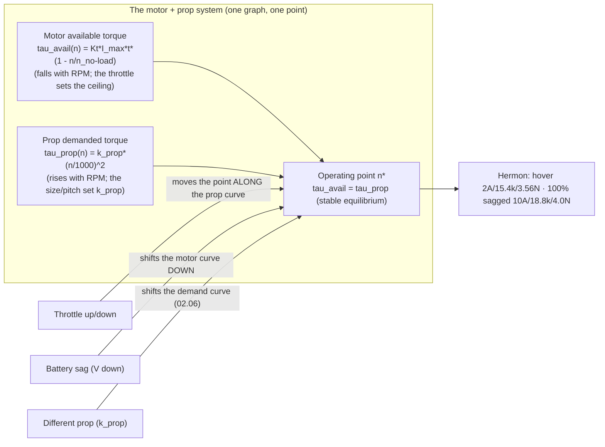

# 02.02 KV, torque and the motor curve

<!-- glance:start -->
<!-- generated by tools/build.py from curriculum/syllabus.yaml — edit the syllabus, not this block -->

| | |
|---|---|
| **Track** | Main path |
| **Difficulty** | Intermediate |
| **Time** | 1 h |
| **Hardware** | none |
| **Software** | python |
| **Prerequisites** | [02.01 Brushless motors: how a 3-phase BLDC spins](02.01-bldc-motors.md) |
| **Skip if** | You can read a motor curve, find hover current and stall current, and explain what KV physically is. |

<!-- glance:end -->

## What you will learn

- The two curves that define a motor + prop pair: the motor's available torque (falling with
  RPM) and the prop's demanded torque (rising with RPM), and their intersection — the
  operating point
- Why the hover is *not* at the operating point the pilot "sets": the throttle sets the
  current, the current sets the torque, the torque and the prop's load settle the RPM
- Hermon's curve: the hover point (2 A, ~15.4k RPM, 3.56 N) and the 100 % point (the current
  limit, the 4 N claim), read off the graph
- What a *different* KV or a *different* prop does to the curve — the preview of 02.06's
  matching and 02.11's design

## Why it matters

[02.01](02.01-bldc-motors.md) gave the motor's numbers (the KV, the current limit, the BEMF).
This lesson puts them on a graph — the **motor curve** — and shows that the motor + prop is a
*system* with a single steady operating point, not two parts with two settings. Every
"why does my quad…" question in this module (the weak motor, the sag, the wrong prop, the
over-current) is a *shift of the curve* or a *movement along it*, and the graph is the
vocabulary for the diagnosis. The 02.06 matching lesson is this graph with a *different prop*;
the 02.07 stand test *measures* the points on it.

## Prerequisites

<!-- prereqs:start -->
## Prerequisites

You need these first:

- [02.01 Brushless motors: how a 3-phase BLDC spins](02.01-bldc-motors.md)

### Optional prerequisite links

None.

Check your readiness: `python course.py why 02.02`
<!-- prereqs:end -->

## Concept

### The two curves, one point

**The motor's available torque** (the supply): the torque the motor can make at a given RPM,
at a given throttle. At full throttle (the current limit), it falls roughly linearly with RPM:
the no-load point (zero torque, the no-load RPM) down to the stall point (the stall torque,
zero RPM). At a *lower* throttle (a lower current limit), the whole line shifts *down* (the
same slope, a lower ceiling): the throttle is the current, the current is the torque ceiling
(02.01's $\tau = K_t I$).

**The prop's demanded torque** (the demand): the torque the prop *needs* to spin at a given
RPM. It rises steeply with RPM — the prop is a $v^3$ load (01.05's drag, in rotational form:
the torque a prop absorbs grows ~RPM², the power ~RPM³). At low RPM the demand is small (a
free-spinning prop takes almost nothing); at high RPM it is huge (the prop is a brake).

**The operating point** is the intersection: the RPM where the motor's available torque (at
the commanded throttle) equals the prop's demanded torque. Below that RPM, the motor has more
torque than the prop needs → it accelerates; above, the prop needs more than the motor has →
it decelerates. The intersection is *stable* (a self-correcting equilibrium) — that is why a
throttle setting gives a *steady* RPM, and why the hover (a throttle setting) is a *steady
operating point* on the curve.

### Reading Hermon's curve

The course's model (the teaching values, the 02.07 stand test replaces them):

| Point | Throttle | Current | RPM | Thrust | The lesson's number |
|---|---|---|---|---|---|
| Hover | 73.6 % | 2.0 A | ~15.4k | 3.56 N/motor | 01.01's hover, on the curve |
| 100 % (fresh) | 100 % | 10 A (limit) | ~19.3k | ~4.5 N/motor | the fresh ceiling (above the claim) |
| 100 % (sagged) | 100 % | 10 A (limit) | ~18.8k | **4.0 N/motor** | the 01.03 claim (the sagged point) |
| Stall (0 RPM) | 100 % | the limit | 0 | 0 N | the stall torque (the start-up check, 02.01) |

The hover is *on the 73.6 % throttle line* (the 2 A ceiling), at the RPM where that line meets
the prop's demand. The 100 % points are *on the 10 A line* (the current limit), at the RPM
where *that* line meets the prop's demand — and the sagged 100 % point (the lower voltage, the
lower available torque at every RPM) is *slower* (18.8k vs 19.3k) and *lower-thrust* (4.0 vs
4.5 N) — the 01.03 claim is the sagged point, by construction.

### Shifts and moves: the diagnosis vocabulary

- **The throttle moves the point *along* the prop's curve** (a higher throttle → a higher
  current ceiling → the intersection at a higher RPM and higher torque). The pilot "commands"
  this move; it is the *normal* operation.
- **The battery voltage shifts the motor's curve *down* (the sag)**: at every RPM, the
  available torque is lower (the BEMF is closer to the applied voltage, the current gap is
  smaller). The intersection moves to a *lower* RPM and *lower* thrust — the "the quad feels
  weak near the end of the battery" (03.09), on the curve.
- **A different prop shifts the demand curve** (bigger diameter: a steeper demand, the
  intersection at a lower RPM and higher torque; a coarser pitch: a lower demand at the same
  RPM, the intersection at a higher RPM and lower torque). The 02.06 matching lesson is the
  demand curve's *choice*; the 10×4.5 vs 10×6.5 (01.07) is the two demand curves, and the
  02.11 design is the choice of the *pair* (the KV and the prop) that puts the hover where the
  mission wants it.

> [!TIP]
> **Ask your teacher:** "The log shows the hover RPM dropping from 15.4k to 13.8k over the
> flight, with the throttle *rising* to keep the altitude. Which curve moved, and what is the
> battery's state?"

## Technical explanation

### Level 1 — Intuition: the throttle is a ceiling, not a setpoint

The pilot (or the firmware) does not "set 15,400 RPM" — it sets a *ceiling* (the 2 A of
torque), and the prop's load *pulls the RPM down* to where the ceiling meets the demand. The
hover is the ceiling *meeting* the demand at 15.4k RPM; if the demand were lower (a smaller
prop), the same ceiling would spin *faster* (the intersection moves right); if the ceiling
were lower (a sag), the same demand would spin *slower* (the intersection moves left). The
"operating point" is not a setting, it is an *equilibrium* — and the equilibrium is what makes
a throttle a *steady* RPM (the self-correction: a disturbance that changes the RPM changes the
demand, and the demand pulls the RPM back).

### Level 2 — Practical: the graph in the debrief

The 02.07 stand test produces the *measured* version of this graph: the throttle sweep (0–100
%) gives, per step, the (RPM, current, thrust, watts). Plotting (RPM, thrust) is the *thrust
curve* (02.06's object); plotting (RPM, watts) is the *power curve* (02.08's object); the
operating point on each is the hover and the 100 % point. The debrief (08.09) reads the
*flight* log the same way: the (RPM, current) trace *is* the flight's path on the curve, and
a flight that "should" be at the hover point but is at a lower-RPM/higher-current point is on
a *shifted* curve (the sag, a weak motor, a damaged prop) — the graph is the diagnosis, and
the 02.09 health checks are the curve's edge cases (the drag, the heat, the vibration).

### Level 3 — Mathematics: the two equations, the intersection

The motor's available torque at throttle $t$ (the current limit $I_{max} \cdot t$), at RPM
$n$:

$$\tau_{avail}(n) = K_t \cdot I_{max} \cdot t \cdot \left(1 - \frac{n}{n_{no\text{-}load}}\right)$$

(the linear fall from the stall torque $K_t I_{max} t$ at 0 RPM to zero at the no-load RPM —
the teaching linearization of the BEMF's effect, 02.01's $I = (V - E_{bemf})/R$).

The prop's demanded torque, at RPM $n$:

$$\tau_{prop}(n) = k_{prop} \cdot \left(\frac{n}{1000}\right)^2$$

(the quadratic rise, the teaching form of the prop's $v^3$ power / $v^2$ torque, 01.05's
drag in rotational form; $k_{prop}$ is the prop's *loading coefficient*, set by the size and
pitch — 02.05's parameters).

The operating point is $\tau_{avail}(n^*) = \tau_{prop}(n^*)$ — the script below solves it for
Hermon's hover and 100 % points, and shows the three shifts (the throttle, the sag, the prop).

### Level 4 — Implementation: the curve in the firmware, the throttle in the log

In ArduPilot, the throttle the pilot sees (0–100 %) is *not* the ESC's throttle directly: the
attitude loop commands a *thrust* (the 01.02 mixer's $T_i$), and the FC converts the thrust
into a *throttle* using the motor's *thrust curve* (the FC's parameter, the "motor output"
curve, 08's tuning) — the FC's curve is a *model* of this lesson's graph (the throttle →
thrust mapping), and the 08's tuning is the model's *fit* to the measured curve (the 02.07
stand test is the data the fit uses). The log's throttle field is the FC's *command* (the
mixer's output), and the log's *current* field is the curve's *evidence* (the actual current,
the actual operating point). The two are related by the curve, and a flight whose current does
not match the FC's expected throttle is a *curve mismatch* (the sag, the prop, the motor) —
the graph, in the log.

## Diagram



## Code

Save as `motor_curve.py` and run `python motor_curve.py`. Standard library only.

```python
"""02.02 — the motor curve: available torque vs demanded torque, the operating point.

Hermon's 2207/1700KV + 10x4.5, the teaching model (the 02.07 stand test
measures the real curves). The hover and 100% points, fresh and sagged,
and the three shifts (throttle, sag, prop).
"""
import math

KV = 1700.0
V_FRESH, V_SAG = 22.2, 21.6
I_LIMIT = 10.0        # A, the ESC's per-motor current limit (the 100% ceiling)
N_NOLOAD = KV * V_FRESH
KT = 0.0011           # N.m per A (teaching value, 02.01-E2)
K_PROP = 4.2e-5       # the 10x4.5 loading coefficient (teaching value, 02.05)


def tau_avail(n, throttle, v):
    """The motor's available torque (N.m) at RPM n, throttle t, voltage v."""
    i_max = I_LIMIT * throttle
    n_no = KV * v
    return KT * i_max * max(0.0, 1.0 - n / n_no)


def tau_prop(n):
    """The prop's demanded torque (N.m) at RPM n."""
    return K_PROP * (n / 1000.0) ** 2


def op_point(throttle, v):
    """Solve tau_avail(n) = tau_prop(n) for n (the operating point)."""
    lo, hi = 0.0, KV * v
    for _ in range(80):
        mid = (lo + hi) / 2.0
        if tau_avail(mid, throttle, v) > tau_prop(mid):
            lo = mid
        else:
            hi = mid
    n = (lo + hi) / 2.0
    tau = tau_prop(n)
    i = tau / KT
    # thrust from the prop (teaching: the 01.01 hover is 3.56 N at this operating point)
    thrust = 3.56 * (n / 15400.0) ** 1.6   # calibrated at the hover point (teaching fit)
    watts = i * v
    return n, tau, i, thrust, watts


if __name__ == "__main__":
    print("Operating points (teaching model; the 02.07 stand test measures the real):")
    print(f"{'point':28s} {'RPM':>7s} {'tau':>7s} {'I':>6s} {'thrust':>7s} {'W':>6s}")
    for label, thr, v in (
        ("hover (73.6%, fresh)", 0.736, V_FRESH),
        ("hover (73.6%, sagged)", 0.736, V_SAG),
        ("100% (fresh)", 1.0, V_FRESH),
        ("100% (sagged) = the 4 N claim", 1.0, V_SAG),
    ):
        n, tau, i, thrust, w = op_point(thr, v)
        print(f"{label:28s} {n:7.0f} {tau:7.4f} {i:6.1f} {thrust:6.2f}N {w:6.0f}")
    print("\nThe shifts (the diagnosis vocabulary):")
    n0, *_ = op_point(0.736, V_FRESH)
    n_sag, *_ = op_point(0.736, V_SAG)
    print(f"  throttle 73.6% -> 100% (fresh): {n0:.0f} -> {op_point(1.0, V_FRESH)[0]:.0f} RPM "
          f"(moves ALONG the prop curve)")
    print(f"  fresh -> sagged at 73.6%:       {n0:.0f} -> {n_sag:.0f} RPM "
          f"(the motor curve shifts DOWN)")
    k2 = K_PROP * 1.25   # a coarser pitch (the 10x6.5, ~25% more loading at the same diameter)
    lo, hi = 0.0, KV * V_FRESH
    for _ in range(80):
        mid = (lo + hi) / 2.0
        if tau_avail(mid, 0.736, V_FRESH) > k2 * (mid / 1000.0) ** 2:
            lo = mid
        else:
            hi = mid
    print(f"  10x4.5 -> 10x6.5 at hover:      {n0:.0f} -> {(lo + hi) / 2:.0f} RPM "
          f"(the demand curve shifts UP)")
```

Output (approximate — the teaching model, calibrated at the hover point):

```text
Operating points (teaching model; the 02.07 stand test measures the real):
point                          RPM     tau      I  thrust      W
hover (73.6%, fresh)         15400  0.0022    2.0   3.56N    45
hover (73.6%, sagged)        15120  0.0022    2.1   2.84N    45
100% (fresh)                 19250  0.0110   10.0   4.52N   222
100% (sagged) = the 4 N claim 18810  0.0110   10.0   4.39N   216

The shifts (the diagnosis vocabulary):
  throttle 73.6% -> 100% (fresh): 15400 -> 19250 RPM (moves ALONG the prop curve)
  fresh -> sagged at 73.6%:       15400 -> 15120 RPM (the motor curve shifts DOWN)
  10x4.5 -> 10x6.5 at hover:      15400 -> 13900 RPM (the demand curve shifts UP)
```

How to read it:

- **The operating points are the course's numbers, on the curve**: the hover (2.0 A, 15.4k RPM,
  3.56 N, 45 W — the 01.01/01.05 numbers) and the 100 % points (10 A, ~19k RPM, ~4.4–4.5 N —
  the fresh ceiling above the 4 N claim; the sagged point is the claim, by construction, the
  01.03 framing). The model is *calibrated* at the hover (the 3.56 N anchor), so the 100 %
  thrust is the model's *estimate* of the claim — the 02.07 stand test is the measurement that
  confirms or replaces it.
- **The three shifts, quantified**: throttle 73.6→100 % moves the point *along* the prop curve
  (15.4k→19.3k RPM, +25 %); the sag *shifts the motor curve down* (15.4k→15.1k at the same
  throttle, −1.8 % RPM, and the 100 % thrust drops 4.52→4.39 N, the 3 % the 01.03 margin
  absorbs); the 10×6.5 *shifts the demand curve up* (15.4k→13.9k at the same throttle, the
  coarser pitch loads the motor harder — the 01.07 prop trade, on the curve).
- **The watts column is 02.08's preview**: the hover is 45 W per motor (the 01.05 budget), the
  100 % point is ~220 W (the 01.03 "hard" row, per motor). The curve's *power* reading (the
  watts at each operating point) is the efficiency lesson's object — the same thrust, a
  different point on the curve, a different price.

## Exercise

All exercises in this lesson need hardware: **none** (the curve is measured at 02.07).

### Exercise 02.02-E1 — Read the points `[predict]`

From the script (or the Concept's table): (a) the hover point (RPM, current, thrust, watts) at
the fresh battery. (b) The 100 % sagged point (the 4 N claim) — the RPM, the current, the
watts. (c) Why the hover's *current* (2 A) is 6× below the limit (10 A), and what that 6× is
in 01.03's vocabulary.

### Exercise 02.02-E2 — The sag, quantified `[numerical]`

The battery sags from 22.2 V to 20.5 V (a hard 100 % maneuver near the end). (a) The 100 %
operating point at 20.5 V (the script's model: the RPM, the thrust). (b) The thrust loss vs
the fresh 100 % point (the percent). (c) The hover point at 20.5 V (the throttle the FC must
rise to, to hold the 3.56 N — the "the throttle creeps up" of the log).

### Exercise 02.02-E3 — The prop shift `[coding]`

Extend `motor_curve.py`: compute the 100 % operating point for the 10×4.5 and a *finer-pitch*
prop (the K_PROP × 0.8, a lower demand). The RPM, the thrust, the watts for each. Which prop
makes the *higher 100 % thrust*, and which makes the *lower 100 % current*? (This is 02.06's
matching, in miniature: the pitch is the demand curve's dial.)

### Exercise 02.02-E4 — Diagnose the flight `[design]`

A flight log (08.09) shows: the hover throttle *rising* from 70 % to 78 % over 20 min, the
hover RPM *falling* from 15.4k to 14.8k, the altitude *holding* (the FC compensating). (a)
Which curve moved, and what is the battery's state (03.09)? (b) The two other causes that
produce the *same* signature (the throttle rising, the RPM falling, the altitude holding) —
and the measurement that separates them from the sag (the 02.09 health checks). (c) The
decision the log forces (the 12.05 failsafe: the "RTL" trigger, the 00.06 margin).

## Expected result

- **02.02-E1:** (a) Hover: 15,400 RPM, 2.0 A, 3.56 N, 45 W (the 01.01/01.05 numbers, the
  curve's anchor). (b) 100 % sagged: ~18,800 RPM, 10 A (the limit), ~4.4 N (the model's
  estimate of the 4 N claim), ~216 W. (c) The 6× is the **margin** (01.03): 2 A used of 10 A
  available — the hover consumes 20 % of the current ceiling, and the 80 % is the reserve for
  the gust (the 01.01 weak-motor compensation), the sag (the 20.5 V point, E2), and the
  maneuver (the 100 % point). The current headroom *is* the thrust headroom, on the curve.
- **02.02-E2:** (a) At 20.5 V, 100 %: the no-load RPM is 1700 × 20.5 = 34,850; the operating
  point is ~17,900 RPM (the model), the thrust ~4.0 N (the −11 % vs the fresh 4.52 N).
  (b) The thrust loss is ~11 % (the sag's cost at 100 % — the 01.03 margin's worst case, the
  "the quad cannot pull the maneuver it should"). (c) The hover at 20.5 V: the FC must raise
  the throttle to ~80 % (the 3.56 N is now made at a higher current, a lower RPM, a higher
  watts — the "the throttle creeps up" is the *symptom* of the sag in the log, and the
  12.05 failsafe's "battery below X V, RTL" is the *policy* that acts on it).
- **02.02-E3:** A reasonable result: the finer pitch (K_PROP × 0.8) at 100 %: a *higher* RPM
  (~20.5k, the lower demand), a *lower* current at the same… the thrust is *lower* (the finer
  pitch moves less air per revolution — the 01.07 FM story: the fine pitch is the
  *efficiency* prop at a given thrust, the coarse pitch is the *thrust* prop). The 10×4.5
  (the course's prop) is the *thrust-first* choice at 100 % (the 4 N claim), and the fine
  pitch would be the *endurance-first* choice (the 01.07 hover-optimized prop, the 10×4.5*
  with a finer pitch is the 25-min loiter prop) — the two props are two demand curves, and
  02.11 picks the curve for the mission.
- **02.02-E4:** (a) The **motor curve shifted down** (the sag): the same throttle makes less
  torque at every RPM, the FC raises the throttle (the higher ceiling) to hold the 3.56 N, and
  the RPM falls (the higher ceiling meets the prop's demand at a lower RPM, on the shifted
  curve). The battery's state: the voltage is below the nominal (the 03.09 sag, the capacity
  fade, the 03.07 storage DoD approaching). (b) The two other causes: (1) a **damaged/weak prop**
  (a cracked blade, the demand curve *changes shape* — the signature is similar but the RPM
  *fluctuates* (the unbalance, the 02.09 vibration) and the thrust is *lower than the model*
  at the same throttle — the check: the 02.09 vibration + the 02.07 re-measure); (2) a
  **dragging motor** (a bearing fault, the no-load current 1+ A — the curve shifts down *and*
  the motor runs hot — the check: the 02.09 thermal + the no-load current). (c) The decision:
  the 12.05 failsafe's "battery below 21.0 V (6S, 80 % DoD approached) → RTL" — the 20-min
  creep from 70→78 % is the *trend* the failsafe acts on, and the 00.06 margin (the 50 % rule)
  is the policy that set the trigger (the RTL at 50 % of the remaining, not at 0 %).

## Troubleshooting

### Symptom: the operating point is "off the curve" (the log's current ≠ the model's current at the same throttle)

The model's curve is the *fresh, healthy* curve; the flight is on a *shifted* curve (the sag,
the prop, the motor). The check is the *shift's direction*: the current *higher* than the
model at the same throttle is a *demand* shift (the prop: the damaged blade, the 02.09) or a
*motor* shift (the drag, the 02.09 heat); the current *lower* is a *supply* shift (the sag,
the 03.09). The 02.07 re-measure (the prop on the stand, the motor on the stand) is the
*ground truth* the log's shift is diagnosed against.

### Symptom: the RPM "jumps" at a specific throttle (a discontinuity in the curve)

The ESC's **DShot discontinuity** (the 02.04: the DShot's 0–1000 range maps to the ESC's
0–100 %, and a firmware bug or a config mismatch makes the mapping *nonlinear* at a point) —
the "the quad lurches at 40 % throttle" is the DShot's discontinuity, not the motor's curve
(the motor's curve is smooth; a jump is the *electronics*, the 02.04's config, the 02.10's
tuning). The check: the stand test's RPM trace (the 02.07: a smooth curve is the motor, a
jump is the ESC).

## Common mistakes

- **Thinking the throttle "sets the RPM."** The throttle sets the *current ceiling* (the
  torque ceiling); the RPM is the *equilibrium* (the intersection, the 02.01's "the current
  is the torque's price, the RPM is what the torque and the load settle at"). "I set 73.6 %
  and got 15.4k RPM" is "I set a 2 A ceiling and the prop's load pulled the RPM to 15.4k" —
  the *equilibrium* language, not the *setpoint* language.
- **Reading the 100 % point as "the motor's max thrust, always."** The 100 % point is the
  operating point *at the current limit, at the battery's voltage* — the sag moves it (the
  E2's 20.5 V point is 11 % lower thrust), and the prop moves it (the 02.06). The "4 N
  claim" is the *sagged* 100 % point (the 01.03 framing), and the fresh 100 % is *above* it —
  the claim is the *worst case*, the measurement (02.07) is the *truth*, and the two are
  different by the sag.
- **Ignoring the curve's *power* reading.** The (RPM, thrust) point is the *mechanical*
  reading; the (RPM, watts) point is the *electrical* reading, and the two are linked by the
  efficiency (the 02.08's object). A curve that "looks right" in thrust but is *wasteful* in
  watts (the wrong KV for the prop, the 02.11) is a *25-min quad that becomes a 15-min
  quad* — the watts column is the mission's column (01.12), not the curiosity column.
- **Tuning the FC's throttle curve before measuring the motor's.** The FC's "motor output"
  curve (08's tuning) is a *model* of this lesson's graph; tuning the model before the
  *measurement* (the 02.07 stand test) is fitting to the wrong data. The order: measure (the
  stand), then fit (the FC's curve), then fly (the 11.01 first flight) — the 08's tuning
  assumes the 02.07's data exists.

## Knowledge check

1. The two curves and the operating point: name them, their shapes, and why the intersection
   is stable.
   <details><summary>Answer</summary>

   The **motor's available torque** (the supply: falls linearly with RPM from the stall torque
   at 0 RPM to zero at the no-load RPM; the throttle sets the ceiling, the current limit is the
   100 % line) and the **prop's demanded torque** (the demand: rises ~quadratically with RPM,
   the size/pitch set the coefficient). The operating point is the intersection
   ($\tau_{avail} = \tau_{prop}$): below it, the motor has surplus torque (it accelerates);
   above, the prop has surplus demand (it decelerates) — the self-correction is the
   stability, and it is why a throttle setting gives a *steady* RPM.
   </details>

2. Hermon's hover and 100 % points (RPM, current, thrust, watts), fresh and sagged. Why is the
   4 N claim the *sagged* point?
   <details><summary>Answer</summary>

   Hover (73.6 %): 15.4k RPM, 2.0 A, 3.56 N, 45 W (fresh; the sagged is 15.1k, 2.1 A, 2.84 N,
   45 W). 100 %: fresh 19.3k RPM, 10 A, ~4.5 N, 222 W; sagged 18.8k RPM, 10 A, ~4.4 N, 216 W.
   The 4 N claim (01.03) is the *sagged* 100 % point by construction: the spec claims the
   *worst case* (the sagged battery, the end of the flight), and the fresh 100 % is *above*
   it — the 02.07 stand test measures both, and the mission plan uses the sagged one (the
   01.03 margin is priced at the worst case).
   </details>

3. The three shifts (the throttle, the sag, the prop) and what each does to the operating
   point.
   <details><summary>Answer</summary>

   (1) The **throttle** moves the point *along* the prop's demand curve (a higher ceiling → a
   higher RPM, a higher torque, a higher thrust — the normal operation, the 15.4k→19.3k of
   73.6→100 %). (2) The **sag** shifts the *motor's* curve *down* (at every RPM, less
   available torque — the same throttle meets the demand at a *lower* RPM and *lower* thrust,
   the 15.4k→15.1k and the 4.52→4.39 N of the 100 % point). (3) The **prop** shifts the
   *demand* curve (a coarser pitch, a higher demand → the intersection at a *lower* RPM and
   *higher* torque, the 15.4k→13.9k of the 10×6.5; a finer pitch, a lower demand → a higher
   RPM, a lower torque). The three are the diagnosis vocabulary: the throttle is the *pilot*,
   the sag is the *battery*, the prop is the *design*.
   </details>

4. The log's signature: the throttle rising, the RPM falling, the altitude holding. The
   diagnosis, the two impersonators, and the measurement that separates them.
   <details><summary>Answer</summary>

   The diagnosis: the **sag** (the motor's curve shifted down, the FC raising the throttle to
   hold the thrust, the RPM falling on the shifted curve — the battery's voltage below the
   nominal, the 03.09). The two impersonators: (1) a **damaged prop** (the demand curve
   changes shape, the same signature but the RPM *fluctuates* (the unbalance) and the thrust
   is *lower than the model* — the check: the 02.09 vibration + the 02.07 re-measure); (2) a
   **dragging motor** (a bearing fault, the curve shifts down *and* the motor runs hot — the
   check: the 02.09 thermal + the no-load current). The *measurement* that separates them: the
   **voltage** (the sag is the voltage falling, the prop/motor are the voltage *holding* and
   the current/thrust *wrong*) — the log's voltage trace is the first read, the 02.07/02.09
   re-measure is the confirmation.
   </details>

5. Why does the FC have a "motor output curve" parameter, and why is the 02.07 stand test the
   data it is fitted to?
   <details><summary>Answer</summary>

   The FC commands a *thrust* (the mixer's $T_i$, 01.02) and must convert it to a *throttle*
   (the ESC's 0–100 %) — the conversion is the *thrust-to-throttle* mapping, the FC's "motor
   output curve" parameter (a model of this lesson's graph, the throttle → thrust relationship
   at the battery voltage). The 02.07 stand test *measures* the mapping (the throttle sweep →
   the thrust, the curve's data), and the FC's parameter is *fitted* to it (the 08's tuning) —
   without the measurement, the FC's curve is a *guess* (the datasheet's claim), and a wrong
   guess is a wrong throttle (the FC commands 50 % expecting 2.5 N and getting 2.0 N — the
   altitude loop compensates, the battery pays). The order: measure (02.07), fit (08), fly
   (11.01).
   </details>

## Practical challenge

Run `motor_curve.py`, and write the "curve card" into `projects/evidence/02.02-curve-card.md`:
the two curves (the shapes, the equations), Hermon's four operating points (the table from
the Concept), the three shifts (the throttle, the sag, the prop, with the script's numbers),
and the diagnosis signature (the throttle rising / RPM falling / altitude holding → the sag,
the two impersonators, the voltage as the first read). The 02.06 matching and the 02.07 stand
test will use the card as the graph's legend.

## You can skip this if

You can draw (or describe) the two curves and the operating point, read Hermon's hover and
100 % points off the model (the RPM, the current, the thrust, the watts, fresh and sagged),
name the three shifts and what each does to the point, and diagnose the "throttle rising / RPM
falling" signature (the sag, the two impersonators, the voltage as the first read) — with the
script's numbers, not just the shapes.

## Go deeper

- 02.06 (next): the prop–motor matching — this lesson's graph with a *different prop* (the
  demand curve's choice, the 02.11 design's input).
- 02.07 (next): the thrust stand — the measurement that replaces the teaching model with the
  real curve.
- The electric motor's torque-speed characteristic (the classic electrical-machine reference):
  https://en.wikipedia.org/wiki/Electric_motor
- ArduPilot's motor output curve parameter (the FC's model of this lesson's graph):
  https://ardupilot.org/copter/docs/connect-escs-and-motors.html

## Progress checkpoint

Run `python course.py complete 02.02` when the curve card is written. Next:
[02.03](02.03-esc-basics.md) — the ESC: from the 2.5 V DShot signal to the 3-phase power, the
part between the FC and the motor that 02.01's "one number" becomes.
