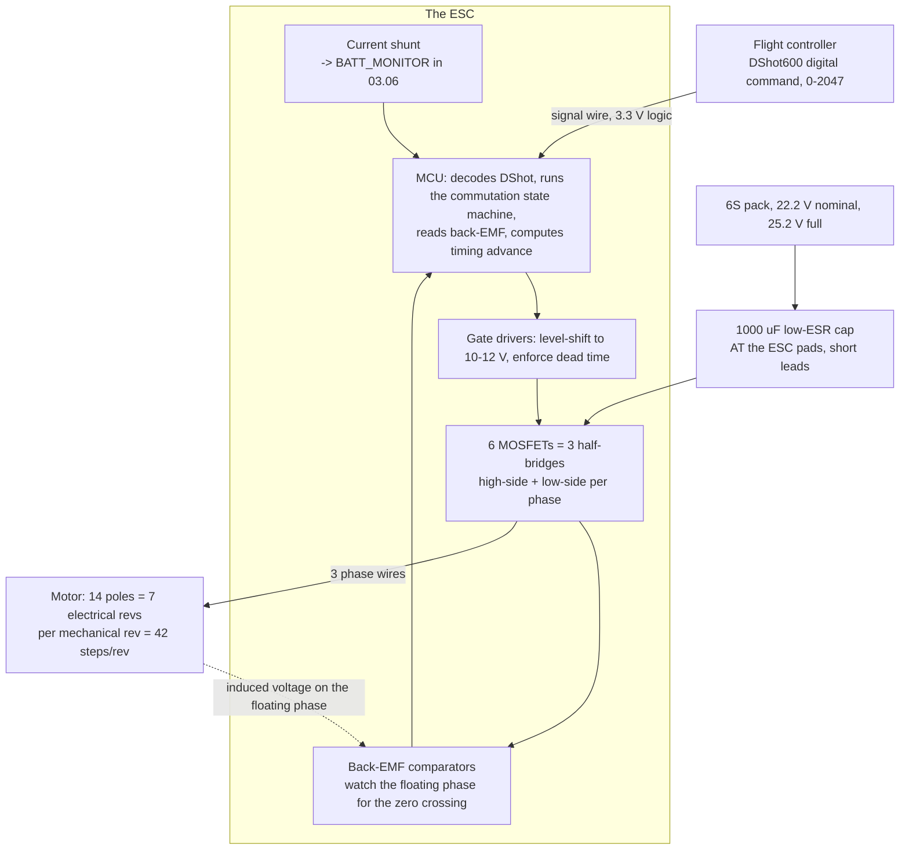

# 02.03 ESCs: from a 2.5 V signal to 3-phase power

<!-- glance:start -->
<!-- generated by tools/build.py from curriculum/syllabus.yaml — edit the syllabus, not this block -->

| | |
|---|---|
| **Track** | Main path |
| **Difficulty** | Intermediate |
| **Time** | 1 h |
| **Hardware** | none |
| **Software** | python |
| **Prerequisites** | [02.01 Brushless motors: how a 3-phase BLDC spins](02.01-bldc-motors.md) |
| **Optional prerequisites** | [FEL.01 Electricity for drone builders: voltage, current, resistance](../optional-foundations/drone-electronics-power/FEL.01-electricity-refresher.md)<br>[FEL.02 DC power maths for a flying machine](../optional-foundations/drone-electronics-power/FEL.02-dc-power-math.md) |
| **Skip if** | You can trace the path from a DShot command to 3-phase gate drives and explain the BEC's job. |

<!-- glance:end -->

## What you will learn

- What is physically inside an ESC: the MCU, the gate drivers, the six MOSFETs, the shunt and
  the capacitor — and which of them fails when you get it wrong
- How a 3.3 V digital command becomes three high-current phase voltages, and why the answer is
  "six switches and a lookup table"
- **Commutation**: the six-step sequence, how the ESC knows where the rotor is without a sensor,
  and why that knowledge is unreliable at low rpm
- The **BEC/UBEC** question: where the 5 V for your flight controller comes from, and why a
  4-in-1 ESC's BEC is not always the right source
- Hermon's ESC requirement — **65 A, 4–6S, 4-in-1** — derived rather than copied

## Why it matters

[02.01](02.01-bldc-motors.md) showed you a motor that spins when three wires are energised in
the right order. Nothing in that lesson said *who* energises them. The ESC does, 100,000 times
a second, and it is the single component in Hermon most likely to destroy itself and take a
motor with it.

More practically: every number in Hermon's power budget passes through the ESC. The 10.2 A of
hover current is measured by the ESC's shunt ([03.06](../03-power-system/03.06-battery-monitoring.md)).
The 40 A punch-out is survived — or not — by the ESC's MOSFETs
([03.03](../03-power-system/03.03-c-rating-voltage-sag.md)). The DShot command rate that the
rate loop depends on ([07.03](../07-control/07.03-rate-loops.md)) is an ESC firmware setting.
This lesson is where you stop treating it as a black box.

## Prerequisites

<!-- prereqs:start -->
## Prerequisites

You need these first:

- [02.01 Brushless motors: how a 3-phase BLDC spins](02.01-bldc-motors.md)

### Optional prerequisite links

New to any of these? Take the foundation lesson first; skip it if you already know it.

- [FEL.01 Electricity for drone builders: voltage, current, resistance](../optional-foundations/drone-electronics-power/FEL.01-electricity-refresher.md)
- [FEL.02 DC power maths for a flying machine](../optional-foundations/drone-electronics-power/FEL.02-dc-power-math.md)

Check your readiness: `python course.py why 02.03`
<!-- prereqs:end -->

## Concept

### Six switches and a table

An ESC has exactly one job: connect each of the motor's three wires to the battery's positive
rail, to its negative rail, or to nothing. Three wires × three states is all the hardware there
is. It is built from **six MOSFETs** arranged as three half-bridges — one high-side and one
low-side switch per phase.

| Phase | High-side FET | Low-side FET | Result |
|---|---|---|---|
| A | ON | OFF | A connected to +22.2 V |
| A | OFF | ON | A connected to ground |
| A | OFF | OFF | A floating |
| A | ON | ON | **short circuit across the pack** — "shoot-through", the classic ESC death |

The last row is why gate drivers exist. A MOSFET does not turn off instantly, so the driver
inserts a **dead time** of a few hundred nanoseconds between turning one switch off and the
other on. Too little dead time and the ESC vaporises; too much and you lose efficiency and gain
noise.

### The six-step sequence

At any instant, one phase is high, one is low, and one is floating. Rotating that pattern pulls
the rotor round:

| Step | A | B | C |
|---|---|---|---|
| 1 | + | − | float |
| 2 | + | float | − |
| 3 | float | + | − |
| 4 | − | + | float |
| 5 | − | float | + |
| 6 | float | − | + |

Six steps is one **electrical revolution**. Hermon's motors have 14 poles (7 pole pairs), so
seven electrical revolutions make one mechanical turn — 42 commutation steps per revolution of
the propeller. At Hermon's hover speed of about 5,060 rpm that is **3,290 commutations per
second**, and at the ~9,800 rpm of full throttle it is **6,860 per second**. The ESC has to get
every one of them right.

### How it knows where the rotor is: back-EMF

There is no sensor. The trick is the floating phase. A spinning permanent-magnet rotor induces
a voltage in every winding — the **back-EMF** from [02.01](02.01-bldc-motors.md). The two
driven phases are clamped to the rails, but the floating one is free to show its induced
voltage, and the moment that voltage crosses the midpoint of the supply (the **zero crossing**)
tells the ESC exactly where the rotor is. It waits 30 electrical degrees and commutates.

This is elegant and it has one fatal property: **back-EMF is proportional to speed.** At zero
rpm there is none. So an ESC cannot start a motor by sensing — it has to *guess*, running an
open-loop ramp that blindly steps the field round and hopes the rotor follows. That is why:

- A motor sometimes stutters or twitches on arming instead of spinning up.
- A motor with a propeller on it (high inertia) is harder to start than a bare one.
- A desynchronisation at speed — a lost zero crossing — sounds like a screech and then silence,
  because the ESC has to drop back to the blind ramp while the prop is still spinning.

[02.10](02.10-esc-tuning.md) is where you tune the parameters that govern this. For now, the
important fact is that **the region where the ESC is least sure of itself is exactly the region
where you arm and take off.**

### The BEC question

Your flight controller wants 5 V at up to 2 A. The pack gives 22.2 V. Something has to step it
down, and there are three candidates:

| Source | What it is | Verdict for Hermon |
|---|---|---|
| ESC's built-in BEC | A linear or switching regulator on the ESC board | Often absent on a 6S 4-in-1; when present, frequently only 2 A and sharing a ground with the switching noise |
| Separate UBEC | A dedicated switching regulator off the pack | **This is Hermon's choice.** Clean, sized independently, and it survives an ESC failure |
| Flight controller's own regulator | Many H7 boards accept 6S directly | Fine for the FC alone; not enough for the FC *plus* a GNSS, two radios and a servo |

The word "BEC" means *battery eliminator circuit* — it exists because model aircraft used to
carry a second battery for the receiver. [03.04](../03-power-system/03.04-power-distribution.md)
builds Hermon's actual power tree; the rule established here is that **the thing that switches
40 A should not also be the thing that makes your flight controller's 5 V.**

> [!TIP]
> **Ask your teacher:** "Walk me through what physically happens inside an ESC in the 200 ms
> between me pushing the throttle from zero and the motor being under closed-loop back-EMF
> control. Where in that sequence can it fail, and what does each failure sound like?"

## Technical explanation

### Level 1 — Intuition: the ESC is a gearbox made of switches

A car's gearbox matches an engine's narrow useful speed range to the wheels' wide one. An ESC
does the same job with no moving parts: the pack sits at a fixed 22.2 V, the motor needs an
*effective* voltage that varies from near zero to 22.2 V, and the ESC produces the difference by
switching the full voltage on and off very fast. At 50 % duty cycle the motor sees an average of
11.1 V and behaves as though it were on a 3S pack. The switching is the gear ratio, the duty
cycle is the gear, and it changes gear thousands of times a second.

### Level 2 — Practical: sizing Hermon's ESC

Three numbers set the requirement.

1. **Continuous current per motor.** The MN3110-class motor is rated at **15 A continuous**. At
   hover it draws about 2.2 A (10.2 A total across four motors), and at full throttle about
   15.3 A — right at the rating. **Full throttle on Hermon is a burst condition, not a cruise**,
   and [02.06](02.06-prop-motor-matching.md) is where that falls out of the arithmetic.
2. **Burst current per motor.** [03.03](../03-power-system/03.03-c-rating-voltage-sag.md) sets
   Hermon's punch-out at 40 A total — 10 A per motor — but a single-motor recovery from a gust
   can briefly put one motor near its 21 A limit while the others idle.
3. **Voltage.** 6S fully charged is 25.2 V. A 6S-rated ESC has MOSFETs with at least a 40 V
   rating so that inductive spikes on commutation do not exceed them.

| Requirement | Number | Why |
|---|---|---|
| Continuous per phase | ≥ 15 A | The motor's own continuous rating |
| Burst per phase | ≥ 40 A for ≥ 5 s | A recovery, not a cruise |
| Voltage | 4–6S (≥ 40 V FETs) | 25.2 V full pack plus commutation spikes |
| Protocol | DShot600 | [07.03](../07-control/07.03-rate-loops.md) needs the command rate |
| Current sensing | Yes, on the board | [03.06](../03-power-system/03.06-battery-monitoring.md) |

**Hermon's ESC is a 65 A 4-in-1.** The 65 A is a headline rating per phase; a 45 A part would
meet the requirement on paper. Buying at 65 A is not over-specifying, because ESC headline
ratings are optimistic and are measured with airflow you will not have inside a closed frame.

### Level 3 — Mathematics: what the switching actually produces

The ESC switches at a **PWM frequency** $f_{sw}$ — typically 24 kHz on BLHeli_32, up to 96 kHz
on modern firmware. The motor's winding inductance $L$ and resistance $R$ form a low-pass filter
with time constant $\tau = L/R$. For a 3110-class motor, $L \approx 25\ \mu\text{H}$ and
$R \approx 0.09\ \Omega$, so:

$$\tau = \frac{25 \times 10^{-6}}{0.09} \approx 280\ \mu\text{s}$$

The switching period at 24 kHz is $1/24000 = 42\ \mu\text{s}$, which is **6.7 times shorter**
than $\tau$. The winding therefore sees an almost perfectly smoothed average current — the
current ripple is roughly:

$$\Delta I \approx \frac{V_{pack}}{L} \cdot \frac{D(1-D)}{f_{sw}}$$

At 50 % duty ($D = 0.5$), 22.2 V, 25 µH and 24 kHz:

$$\Delta I \approx \frac{22.2}{25 \times 10^{-6}} \cdot \frac{0.25}{24000} \approx 9.3\ \text{A peak-to-peak}$$

That is not negligible, and it is why the switching frequency matters: doubling $f_{sw}$ halves
the ripple. Ripple current heats the winding (it is $I^2R$ loss with no torque to show for it)
and it is the source of the audible whine. But every switching transition also costs energy in
the MOSFET, so higher $f_{sw}$ means lower ripple loss and higher switching loss. The optimum
for this motor class sits near 24–48 kHz, which is why that is what the firmware defaults to.

### Level 4 — Implementation: the capacitor is not optional

Every ESC datasheet says "add a low-ESR capacitor across the power input." People skip it and
then lose an ESC.

Here is the physics. The pack is connected through maybe 200 mm of 12 AWG wire, which has an
inductance of roughly 0.2 µH per 100 mm — call it 0.4 µH. When the ESC switches 40 A off in
100 ns:

$$V_{spike} = L \frac{dI}{dt} = 0.4 \times 10^{-6} \cdot \frac{40}{100 \times 10^{-9}} = 160\ \text{V}$$

That is a catastrophic over-voltage on a 40 V MOSFET. In practice the spike is clamped by the
ESC's own small capacitors and by the FET body diodes, and it is far smaller than 160 V — but
the *mechanism* is real, and the fix is to put a **low-ESR electrolytic capacitor (1000 µF,
35 V minimum for 6S) directly at the ESC's power pads**, with leads as short as you can make
them. The capacitor is a local reservoir of charge that the switching event draws from instead
of from the far end of the wire.

[04.03](../04-frame-and-assembly/04.03-wiring-harness.md) puts this into the build. The rule:
**short battery leads, and a capacitor at the ESC, always.**

## Diagram



## Code

Save as `esc_commutation.py` and run `python esc_commutation.py`. Standard library only.

```python
"""02.03 - what the ESC is doing, in numbers.

The six-step table, the commutation rate at Hermon's hover rpm, the PWM
current ripple, and the switching-vs-conduction loss trade that sets the
switching frequency.
"""
import math

POLES = 14                 # Hermon's motor: 14 poles = 7 pole pairs
HOVER_RPM = 5060           # from 02.06's prop-motor match at 363 g per motor
FULL_RPM = 9800            # full throttle, same match
V_PACK = 22.2              # 6S nominal
L_WINDING = 25e-6          # H, phase inductance, 3110-class
R_WINDING = 0.09           # ohm, phase resistance
I_HOVER_PER_MOTOR = 2.2    # A, 10.2 A total / 4
I_BURST_PER_MOTOR = 10.0   # A, 40 A punch-out / 4

SIX_STEP = [
    ("A+", "B-", "C "),
    ("A+", "B ", "C-"),
    ("A ", "B+", "C-"),
    ("A-", "B+", "C "),
    ("A-", "B ", "C+"),
    ("A ", "B-", "C+"),
]


def commutations_per_second(rpm: float) -> float:
    """6 steps per electrical rev, (POLES/2) electrical revs per mechanical rev."""
    return rpm / 60.0 * (POLES / 2) * 6


def ripple_amps(f_sw: float, duty: float = 0.5) -> float:
    """Peak-to-peak current ripple in the winding."""
    return V_PACK / L_WINDING * duty * (1 - duty) / f_sw


def losses(f_sw: float, current: float) -> tuple:
    """Conduction loss (I^2 R, ripple-inflated) and switching loss, in W per phase."""
    i_rms = math.sqrt(current ** 2 + (ripple_amps(f_sw) ** 2) / 12.0)
    conduction = i_rms ** 2 * R_WINDING
    # switching loss ~ 0.5 * V * I * t_sw * f_sw, with t_sw ~ 100 ns
    switching = 0.5 * V_PACK * current * 100e-9 * f_sw
    return conduction, switching


if __name__ == "__main__":
    print("The six-step sequence (one electrical revolution):")
    for i, step in enumerate(SIX_STEP, 1):
        print(f"  step {i}: {' '.join(step)}")

    tau = L_WINDING / R_WINDING
    print(f"\nWinding time constant tau = L/R = {tau * 1e6:.0f} us")

    for label, rpm in (("hover", HOVER_RPM), ("full throttle", FULL_RPM)):
        c = commutations_per_second(rpm)
        print(f"\nAt {label} ({rpm} rpm, {POLES} poles):")
        print(f"  electrical revs/s : {rpm / 60 * POLES / 2:.0f}")
        print(f"  commutations/s    : {c:.0f}")
        print(f"  time per step     : {1e6 / c:.0f} us")

    print("\nSwitching frequency trade (per phase, at the 10 A burst current):")
    print(f"  {'f_sw':>8s} {'ripple':>9s} {'conduct':>9s} {'switch':>9s} {'total':>9s}")
    best_f, best_p = 0.0, 1e9
    for khz in (8, 16, 24, 32, 48, 64, 96):
        f = khz * 1000.0
        cond, sw = losses(f, I_BURST_PER_MOTOR)
        total = cond + sw
        if total < best_p:
            best_p, best_f = total, khz
        print(f"  {khz:5d}kHz {ripple_amps(f):7.1f}A {cond:8.2f}W {sw:8.2f}W {total:8.2f}W")
    print(f"\n  Lowest total loss at {best_f} kHz ({best_p:.2f} W per phase)")

    print("\nESC sizing for Hermon:")
    print(f"  hover current per phase   : {I_HOVER_PER_MOTOR:.1f} A")
    print(f"  burst current per phase   : {I_BURST_PER_MOTOR:.1f} A")
    print(f"  motor continuous rating   : 15 A  <- the real requirement")
    print(f"  full pack voltage         : {6 * 4.2:.1f} V -> need >= 40 V FETs")
    print(f"  chosen ESC                : 65 A 4-in-1, 4-6S, DShot600")
```

Output:

```text
The six-step sequence (one electrical revolution):
  step 1: A+ B- C 
  step 2: A+ B  C-
  step 3: A  B+ C-
  step 4: A- B+ C 
  step 5: A- B  C+
  step 6: A  B- C+

Winding time constant tau = L/R = 278 us

At hover (5060 rpm, 14 poles):
  electrical revs/s : 590
  commutations/s    : 3542
  time per step     : 282 us

At full throttle (9800 rpm, 14 poles):
  electrical revs/s : 1143
  commutations/s    : 6860
  time per step     : 146 us

Switching frequency trade (per phase, at the 10 A burst current):
      f_sw    ripple   conduct    switch     total
      8kHz    27.7A    14.78W     0.09W    14.86W
     16kHz    13.9A    10.44W     0.18W    10.62W
     24kHz     9.2A     9.64W     0.27W     9.91W
     32kHz     6.9A     9.36W     0.36W     9.72W
     48kHz     4.6A     9.16W     0.53W     9.69W
     64kHz     3.5A     9.09W     0.71W     9.80W
     96kHz     2.3A     9.04W     1.07W    10.11W

  Lowest total loss at 48 kHz (9.69 W per phase)

ESC sizing for Hermon:
  hover current per phase   : 2.2 A
  burst current per phase   : 10.0 A
  motor continuous rating   : 15 A  <- the real requirement
  full pack voltage         : 25.2 V -> need >= 40 V FETs
  chosen ESC                : 65 A 4-in-1, 4-6S, DShot600
```

How to read it:

- **304 µs per commutation step at hover, 146 µs at full throttle.** That is the budget the
  ESC's MCU has to detect a zero crossing, apply the timing advance, and switch three
  half-bridges. It **halves** between hover and full power — which is exactly why desyncs happen
  during fast throttle changes and not in steady hover.
- **The floor of the loss curve is 9 W, and that is the useful current, not waste.** At 10 A
  through 0.09 Ω the unavoidable $I^2R$ is $10^2 \times 0.09 = 9.0$ W. Everything above that
  line is what the switching frequency costs you.
- **The ripple penalty is what the curve is really showing.** At 8 kHz the total is 14.86 W —
  **5.9 W of pure waste** on top of the 9 W floor, because 27.7 A peak-to-peak of ripple raises
  the RMS current well above the 10 A average. At 48 kHz the waste is down to 0.69 W. Going
  further to 96 kHz costs more in switching transitions than it saves in ripple, so the curve
  turns back up.
- **The ripple at 8 kHz is nearly three times the burst current itself.** That single number
  explains why old, slow ESCs ran hot and sounded awful, and why every modern firmware defaults
  into the 24–48 kHz flat bottom.

## Exercise

All exercises in this lesson need hardware: **none**.

### Exercise 02.03-E1 — Count the switching `[numerical]`

(a) Hermon's motors have 14 poles. How many commutation steps per *mechanical* revolution?
(b) At the 5,060 rpm hover, how many per second? (c) At the 9,800 rpm of full throttle?
(d) State the time available per step in each case, and say which one worries you.

### Exercise 02.03-E2 — Size an ESC from first principles `[design]`

You are given a different aircraft: 2.5 kg, 6 motors, each rated 30 A continuous, 6S, and a
design punch-out of 120 A total. Write the ESC requirement as a five-row table like the one in
Level 2 — continuous per phase, burst per phase, voltage, protocol, current sensing — and state
the ESC you would buy and why. Then say what changes if the same aircraft runs 12S instead.

### Exercise 02.03-E3 — The ripple sweep `[coding]`

Extend `esc_commutation.py`: sweep the winding inductance over {10, 25, 50, 100} µH at a fixed
24 kHz, and print the ripple and conduction loss for each. Which motors (low or high inductance)
tolerate a slow ESC, and how does that map onto motor size?

### Exercise 02.03-E4 — Diagnose it by ear `[debugging]`

For each symptom, name the most likely mechanism from this lesson and the one measurement that
would confirm it: (a) the motor twitches but does not spin when armed; (b) a loud screech during
a hard throttle punch, then one motor stops; (c) the ESC runs hot at hover but the motors are
cool; (d) the flight controller browns out and reboots at high throttle.

## Expected result

- **02.03-E1:** (a) 6 steps × 7 pole pairs = **42 steps per mechanical revolution**.
  (b) 5,060/60 × 42 = **3,290 per second**, 304 µs each. (c) 9,800/60 × 42 = **6,860 per
  second**, 146 µs each. (d) Full throttle worries you: the ESC has **less than half** the time
  per decision at exactly the moment the current, and therefore the back-EMF distortion, is
  highest. That is the desync regime.
- **02.03-E2:** Continuous ≥ 30 A per phase (the motor's rating); burst ≥ 20 A per phase
  (120 A ÷ 6); voltage 6S, so ≥ 40 V FETs; DShot600; current sensing yes — but on a hexacopter
  a 4-in-1 does not fit, so **6 discrete 40–50 A ESCs** with a separate current sensor on the
  main lead. At 12S the current halves for the same power (60 A total punch-out, 10 A per phase)
  but the FETs must be rated ≥ 75 V, and the ESC selection moves to a different, more expensive
  class of part. This is the fundamental high-voltage trade: **less copper, more insulation.**
- **02.03-E3:** Ripple scales as $1/L$: at 24 kHz, 10 µH gives about 23 A of ripple and 100 µH
  about 2.3 A. The conduction loss follows, because $I_{rms}^2 = I^2 + \Delta I^2/12$: the
  10 µH motor pays roughly 13 W per phase against the 9 W floor, while the 100 µH motor is
  within 1 % of the floor. Low-inductance motors — which means **small, high-KV racing motors**
  — need a fast ESC, and that is exactly why the 5-inch world pushed switching frequencies up.
  Hermon's 3110-class motor at 25 µH is comfortable at the default.
- **02.03-E4:** (a) The open-loop start-up ramp failing — the ESC never acquired back-EMF.
  Measurement: try it with the propeller off; if it starts cleanly, the problem is inertia or
  start-up power. (b) A desync — a lost zero crossing under high $dI/dt$. Measurement: the
  DShot bidirectional rpm telemetry in the log will show the rpm going to zero while the
  throttle command is high. (c) Switching or conduction loss in the ESC, not the motor:
  either the switching frequency is wrong for the motor, or the input capacitor is missing and
  the ripple is being dissipated in the FETs. Measurement: thermal camera or a finger, plus
  checking whether the capacitor is fitted. (d) The ESC's BEC sagging under load, sharing a
  ground with 40 A of switching. Measurement: scope or a logging voltmeter on the 5 V rail
  during a throttle ramp — and the fix is the separate UBEC from the Concept section.

## Troubleshooting

### Symptom: a motor spins the wrong way

Swap any two of the three phase wires. There is no "correct" order — the ESC's sequence is
fixed, and which direction the rotor turns depends on how you wired it. Modern ESCs also let
you reverse direction in firmware ([02.04](02.04-esc-firmware.md)), which is the better answer
once the aircraft is built and the wires are tidy.

### Symptom: one ESC in the 4-in-1 runs 20 °C hotter than the other three

Almost always a mechanical or electrical asymmetry, not an ESC fault: a bent propeller, a motor
bearing dragging, a poorly soldered phase joint adding resistance, or a motor mounted with a
screw long enough to touch the windings. Measure the phase-to-phase resistance of all four
motors with a milliohm-capable meter; a joint or a winding fault shows up as a percent-level
difference. [02.09](02.09-heat-vibration-noise.md) goes into the thermal side.

### Symptom: the ESC works on the bench and fails in the air

Airflow. A 65 A ESC's rating assumes cooling. In a closed frame at hover throttle it may see no
moving air at all. Check where the ESC sits relative to the propwash before you blame the part
— [04.04](../04-frame-and-assembly/04.04-mounting-and-vibration.md) covers the placement.

## Common mistakes

- **Trusting the headline current rating.** A "65 A" ESC is 65 A with airflow, at 25 °C, for a
  short burst. Size against the *motor's* continuous rating, not the ESC's headline.
- **Leaving the capacitor off.** It is the cheapest part on the aircraft and the one whose
  absence most reliably kills the most expensive one.
- **Powering the flight controller from the ESC's BEC on a 6S build.** The 5 V rail is the one
  thing that must never glitch, and hanging it off the board that switches 40 A is a choice you
  will regret at altitude.
- **Assuming a bigger ESC is always safer.** A 65 A ESC driving a 5 A motor has larger FETs with
  higher gate charge, which means higher switching losses at low current. Oversizing has a cost;
  it is just usually worth paying.
- **Confusing PWM switching frequency with the DShot command rate.** The first is how fast the
  FETs chop (24–48 kHz); the second is how often the flight controller sends a new throttle
  value (DShot600 ≈ 37.5 kbit/s of commands). [02.04](02.04-esc-firmware.md) separates them.

## Knowledge check

1. An ESC has six MOSFETs. What are the four possible states of a single phase, and which one
   must never happen?
   <details><summary>Answer</summary>

   High-side on (phase at +V), low-side on (phase at ground), both off (phase floating), and
   both on — which is a **shoot-through short across the pack** and destroys the ESC. Gate
   drivers insert dead time specifically to prevent it.
   </details>

2. How does a sensorless ESC know where the rotor is, and why does that method fail at the
   moment you most need it?
   <details><summary>Answer</summary>

   It watches the **back-EMF on the floating phase** and commutates a fixed number of electrical
   degrees after the zero crossing. Back-EMF is proportional to speed, so at zero and very low
   rpm there is no signal — the ESC must run a blind open-loop ramp to get the motor moving.
   That is precisely the arming and take-off region.
   </details>

3. Hermon's motor has 14 poles and hovers at 5,060 rpm. How many commutations per second, and
   how long does the ESC have per step?
   <details><summary>Answer</summary>

   7 pole pairs × 6 steps = 42 steps per mechanical revolution. 5,060/60 × 42 = **3,290 per
   second**, so **304 µs per step**. At the ~9,800 rpm of full throttle it is 6,860 per second
   and **146 µs** — less than half the decision time.
   </details>

4. Why is the switching-loss curve a bowl rather than monotonic, and roughly where is its
   bottom for Hermon's motor?
   <details><summary>Answer</summary>

   Lower switching frequency means larger current ripple, and ripple current causes $I^2R$
   heating with no torque — so loss rises as $f_{sw}$ falls. Higher switching frequency means
   more transitions, each costing energy in the MOSFET — so loss rises as $f_{sw}$ rises. The
   sum has a minimum, which for a 25 µH winding at 10 A sits near **48 kHz** (9.69 W against a
   9.0 W unavoidable $I^2R$ floor), in a very flat region from about 24 kHz upward.
   </details>

6. Why does an ESC need a low-ESR capacitor at its power pads, and what is the mechanism if it
   is missing?
   <details><summary>Answer</summary>

   The battery leads have inductance — roughly 0.4 µH for 200 mm of 12 AWG. When the ESC
   switches tens of amps off in about 100 ns, $V = L\,dI/dt$ produces a large voltage spike
   that the MOSFETs must absorb. The capacitor is a local charge reservoir that supplies the
   switching transient instead of the far end of the wire, keeping the spike off the FETs. It is
   the cheapest part on the aircraft and its absence most reliably kills the most expensive one.
   </details>

5. Why does Hermon use a separate UBEC instead of the 4-in-1 ESC's BEC?
   <details><summary>Answer</summary>

   Independence and noise. The 5 V rail feeds the flight controller, the GNSS and both radios —
   a brown-out there is a crash. Taking it from the board that switches 40 A means sharing a
   ground plane with the noisiest thing on the aircraft, and it means an ESC failure takes the
   flight controller with it. A separate regulator off the pack is sized independently and fails
   independently.
   </details>

## Practical challenge

Find the datasheet or product page for the 4-in-1 ESC you intend to buy (Hermon's reference part
is a Holybro Tekko32 F4 Metal 65 A — see
[the Stage 1 list](../hardware/stage-1-first-flight.md)). Write a one-page assessment answering:

1. What are the continuous and burst ratings, and under what test conditions?
2. Which firmware does it run, and does it support bidirectional DShot?
3. Does it have a current sensor, what is its stated accuracy, and which ArduPilot
   `BATT_MONITOR` mode reads it?
4. Does it have a BEC? At what voltage and current? Would you use it?
5. What input capacitor is supplied, and is it enough for a 200 mm battery lead?

Save it as `projects/evidence/02.03-esc-assessment.md`. You will use this document again in
[02.11](02.11-hermon-powertrain-design.md) when you write the powertrain spec, and in
[03.06](../03-power-system/03.06-battery-monitoring.md) when you configure the battery monitor.

## You can skip this if

You can draw the three half-bridges, state the six-step table, explain zero-crossing detection
and why it fails at low rpm, derive Hermon's ESC current requirement from the motor's rating
rather than copying a build guide, and say where the flight controller's 5 V should come from
and why.

## Go deeper

- [FEL.01](../optional-foundations/drone-electronics-power/FEL.01-electricity-refresher.md) and
  [FEL.02](../optional-foundations/drone-electronics-power/FEL.02-dc-power-math.md) (optional):
  voltage, current and DC power from zero, if the $I^2R$ arithmetic above was unfamiliar.
- [02.04](02.04-esc-firmware.md) (next): the firmware that runs on that MCU — DShot, BLHeli_32,
  AM32, and bidirectional rpm telemetry.
- [02.10](02.10-esc-tuning.md) (later): timing advance, demag compensation, and the settings
  that prevent the desyncs described here.
- [03.04](../03-power-system/03.04-power-distribution.md) (later): Hermon's full power tree,
  including where the UBEC sits.
- ArduPilot's ESC documentation: https://ardupilot.org/copter/docs/common-escs-and-motors.html
- The sensorless back-EMF method, in the classic treatment:
  https://en.wikipedia.org/wiki/Brushless_DC_electric_motor#Controller_implementations
- Power MOSFET switching losses and dead time:
  https://en.wikipedia.org/wiki/Power_MOSFET

## Progress checkpoint

Run `python course.py complete 02.03` when the ESC assessment is written. Next:
[02.04](02.04-esc-firmware.md) — the firmware that turns a digital command into that six-step
sequence, and the rpm telemetry that the notch filter in
[07.07](../07-control/07.07-filtering-and-methodic-tuning.md) will depend on.
