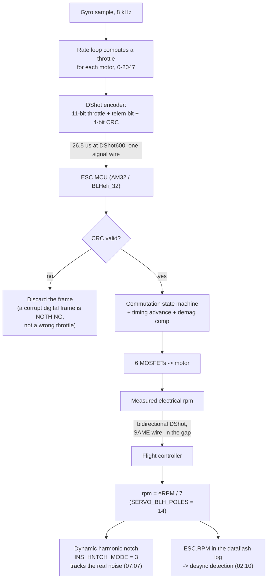

# 02.04 ESC firmware: BLHeli_32, AM32, Bluejay and DShot

<!-- glance:start -->
<!-- generated by tools/build.py from curriculum/syllabus.yaml — edit the syllabus, not this block -->

| | |
|---|---|
| **Track** | Main path |
| **Difficulty** | Intermediate |
| **Time** | 1 h |
| **Hardware** | none |
| **Software** | none |
| **Prerequisites** | [02.03 ESCs: from a 2.5 V signal to 3-phase power](02.03-esc-basics.md) |
| **Optional prerequisites** | [FEL.04 Brushless motors from zero](../optional-foundations/drone-electronics-power/FEL.04-bldc-from-zero.md) |
| **Skip if** | You can configure a 4-in-1 ESC (DShot600, bidirectional DShot, RPM filtering) and explain what each setting does. |

<!-- glance:end -->

## What you will learn

- The throttle protocols in order — PWM, OneShot, Multishot, **DShot** — and what each one
  actually costs in latency and jitter
- The **DShot frame**: 16 bits, how the checksum works, and why a digital protocol removes the
  calibration step that analogue protocols required
- **Bidirectional DShot**: how the ESC sends rpm *back* up the same wire, and why that single
  feature is the most important thing in this lesson
- The firmware landscape — **BLHeli_32**, **AM32**, **Bluejay** — and which one Hermon runs
- The settings you will actually change, and the ones you should leave alone

## Why it matters

[02.03](02.03-esc-basics.md) left a microcontroller sitting between your flight controller and
six MOSFETs. This lesson is what runs on it.

The reason to care is one feature. **Bidirectional DShot** makes each ESC report the motor's
real rpm back to the flight controller, roughly 2,000 times a second. That rpm feed drives the
**dynamic harmonic notch filter** in [07.07](../07-control/07.07-filtering-and-methodic-tuning.md),
which is what lets you run a useful D term without amplifying propeller noise into the motors.
Without it, you tune Hermon with static filters and accept a softer aircraft. With it, the
filter tracks the noise as the rpm changes. Everything else in this lesson is plumbing; that
one feature changes how well the aircraft flies.

## Prerequisites

<!-- prereqs:start -->
## Prerequisites

You need these first:

- [02.03 ESCs: from a 2.5 V signal to 3-phase power](02.03-esc-basics.md)

### Optional prerequisite links

New to any of these? Take the foundation lesson first; skip it if you already know it.

- [FEL.04 Brushless motors from zero](../optional-foundations/drone-electronics-power/FEL.04-bldc-from-zero.md)

Check your readiness: `python course.py why 02.04`
<!-- prereqs:end -->

## Concept

### The protocol ladder

Throttle protocols evolved because each generation's latency became the limiting factor in the
rate loop. Here is the whole family, in order:

| Protocol | Signalling | Frame length | Max rate | Calibration needed? |
|---|---|---|---|---|
| Standard PWM | Analogue pulse width, 1000–2000 µs | 1–2 ms | ~490 Hz | **Yes** |
| OneShot125 | Same, compressed 8× (125–250 µs) | 125–250 µs | ~4 kHz | **Yes** |
| Multishot | Compressed further (5–25 µs) | 5–25 µs | ~32 kHz | **Yes** |
| **DShot150/300/600/1200** | **Digital, 16-bit frame** | 106 µs at DShot150, **26.5 µs at DShot600** | limited by the loop, not the wire | **No** |

The analogue protocols all share one flaw: the ESC has to *learn* what your flight controller
calls "zero throttle" and "full throttle", because component tolerances shift the pulse widths.
That is throttle calibration, and getting it wrong means a motor that spins on arming or never
reaches full power. DShot sends a **number**, not a duration. 0 is 0 and 2047 is 2047 on every
board ever made. Calibration disappears as a concept.

### The DShot frame

Sixteen bits, sent as a burst of timed pulses:

```text
 15                                    4     3     2  1  0
+---------------------------------------+-------+-----------+
|         throttle value, 11 bits        | telem |  CRC, 4   |
|         0, or 48..2047                 | 1 bit |   bits    |
+---------------------------------------+-------+-----------+
```

- **Throttle, 11 bits.** Value 0 is "motor stop". Values 1–47 are reserved for **special
  commands** — beep, reverse direction, save settings, enable extended telemetry. Values 48–2047
  are the 2,000 usable throttle steps.
- **Telemetry request, 1 bit.** In the original (unidirectional) DShot, setting this asks the
  ESC to send a telemetry packet on a *separate* wire.
- **CRC, 4 bits.** The XOR of the three preceding nibbles. A corrupted frame is detected and
  discarded rather than acted on — which is the safety difference between digital and analogue.
  A glitched PWM pulse is just a different throttle value; a glitched DShot frame is *nothing*.

A bit is encoded by pulse width: a long high is a 1, a short high is a 0, at a fixed bit period.
DShot600 means 600 kbit/s, so 16 bits take **26.5 µs**. At an 8 kHz flight-controller loop rate
that is 21 % of the loop period — comfortable. At DShot1200 it would be 10 %, which is why
DShot1200 exists and why almost nobody needs it.

### Bidirectional DShot: the rpm comes back

Ordinary DShot is one-way. Bidirectional DShot — also called *DShot telemetry* or *RPM
telemetry* — reuses the same single wire in the gaps between frames. The flight controller sends
a throttle frame, then releases the line; the ESC drives it with a 16-bit **eRPM** frame in
reply; then the cycle repeats.

The value returned is **electrical rpm**, so you divide by the number of pole pairs to get
mechanical rpm:

$$\text{rpm} = \frac{\text{eRPM}}{\text{pole pairs}} = \frac{\text{eRPM}}{7} \quad\text{for Hermon's 14-pole motors}$$

Getting `MOT_PWM_TYPE` and the pole count wrong is the single most common setup error here, and
its signature is a notch filter tracking a frequency seven times too high or too low.

What the rpm feed buys you:

1. **A dynamic harmonic notch** that follows each motor's actual noise frequency instead of
   sitting at a fixed guess ([07.07](../07-control/07.07-filtering-and-methodic-tuning.md)).
2. **Desync detection** — an rpm that collapses while the throttle command is high is a
   desynchronisation, visible in the log rather than only audible
   ([02.10](02.10-esc-tuning.md)).
3. **A cross-check on the thrust model** — you predicted a hover rpm in
   [02.06](02.06-prop-motor-matching.md); now the aircraft tells you the real one.
4. **No extra wire.** Unidirectional DShot telemetry needs a separate serial line from the ESC
   to a spare UART. Bidirectional does not.

### The firmware landscape

| Firmware | Target hardware | Licence | Status | Verdict for Hermon |
|---|---|---|---|---|
| **BLHeli_S** | 8-bit EFM8 MCUs, older 4-in-1s | Open, unmaintained | Legacy | Only if you inherit the hardware |
| **Bluejay** | Same 8-bit hardware as BLHeli_S | Open, active | Community-maintained BLHeli_S replacement; adds bidirectional DShot and 48 kHz PWM to old boards | An excellent free upgrade for BLHeli_S hardware |
| **BLHeli_32** | 32-bit ARM ESCs | **Closed source; development ceased in 2023** | Still widespread on shipping hardware | Works, but it is a dead end |
| **AM32** | 32-bit ARM ESCs | **Open source, active** | The successor most new ESCs ship with | **Hermon's choice** where the hardware supports it |

The practical situation in 2026: BLHeli_32 ended, and AM32 inherited its hardware and its users.
Hermon's reference ESC ships with AM32. If yours ships with BLHeli_32 it will fly perfectly
well; the difference is whether you can still get updates.

> [!TIP]
> **Ask your teacher:** "I have bidirectional DShot600 enabled and the ESCs are reporting rpm,
> but my harmonic notch is centred at 548 Hz when the props are doing about 78 revolutions a
> second. What single parameter is wrong, what should the notch frequency be, and what is the
> arithmetic that proves it?"

## Technical explanation

### Level 1 — Intuition: digital removes a whole class of problem

Imagine ordering coffee by holding up your hand for a length of time — two seconds means a
double espresso. It works, but every barista's stopwatch is slightly different, so each new
café needs a calibration session. Now imagine saying "two". That is the entire difference
between PWM and DShot. The number arrives exactly as sent, or it arrives visibly corrupted and
is thrown away. No calibration, no drift, no tolerance stack-up — and, as a bonus, you can also
say things that are not numbers, like "beep" or "spin backwards", which is what DShot values
1–47 are for.

### Level 2 — Practical: Hermon's ESC settings

These are the values you set, and what each one does.

| Setting | Hermon's value | Why |
|---|---|---|
| Protocol | **DShot600** | 26.5 µs per frame; comfortable at an 8 kHz loop |
| Bidirectional DShot | **On** | The rpm feed for the dynamic notch |
| PWM frequency | 24–48 kHz | The flat bottom of the loss curve from [02.03](02.03-esc-basics.md) |
| Motor direction | Set in firmware, not by swapping wires | Tidier, and reversible without a soldering iron |
| Motor timing | **Auto** (or medium, ~16°) | [02.10](02.10-esc-tuning.md) tunes this from measured data, not from a forum post |
| Demag compensation | **Medium** | Prevents the desync described in [02.03](02.03-esc-basics.md) |
| Startup power | Default, raise only if it stutters | Too high stresses the motor on every arm |
| Low-rpm power protect | **On** | Limits current when back-EMF is unreliable |
| Brake on stop | Off | A braking motor is a safety hazard on the bench |
| Current protection | Off at the ESC | ArduPilot's battery failsafe owns this decision ([03.06](../03-power-system/03.06-battery-monitoring.md)) |

The corresponding ArduPilot parameters:

```text
MOT_PWM_TYPE      6      # DShot600
SERVO_BLH_AUTO    1      # BLHeli/AM32 passthrough for configuration
SERVO_BLH_BDMASK  15     # bidirectional DShot on outputs 1-4 (bitmask: 1+2+4+8)
SERVO_BLH_POLES   14     # Hermon's motor pole count -- the common mistake
INS_HNTCH_ENABLE  1      # dynamic harmonic notch, fed by the rpm above
INS_HNTCH_MODE    3      # ESC rpm telemetry as the notch source
```

`SERVO_BLH_POLES` is **poles**, not pole pairs. 14 is correct for Hermon.

### Level 3 — Mathematics: the latency budget

Total command latency is the sum of four terms:

$$t_{total} = t_{loop} + t_{frame} + t_{esc} + t_{motor}$$

| Term | What it is | Hermon |
|---|---|---|
| $t_{loop}$ | Time from gyro sample to the output being written | 125 µs at an 8 kHz loop |
| $t_{frame}$ | Time on the wire | **26.5 µs** at DShot600 |
| $t_{esc}$ | ESC decode plus its own PWM period | ~40 µs at 24 kHz |
| $t_{motor}$ | Electrical time constant $L/R$ of the winding | **278 µs** (from [02.03](02.03-esc-basics.md)) |
| **Total** | | **≈ 470 µs** |

Two things fall out of that table:

1. **The motor dominates.** 278 µs of the 470 µs is the winding's own inductance — a physical
   property no protocol can improve. Moving from DShot600 to DShot1200 saves 13 µs, or **2.8 %
   of the total**. That is why DShot1200 is a solution to a problem that stopped existing.
2. **The loop rate matters more than the protocol.** Halving the loop rate from 8 kHz to 4 kHz
   adds 125 µs — ten times what the protocol upgrade saves.

For context, the phase lag that 470 µs introduces at the rate loop's 50 Hz region of interest
is $360° \times 50 \times 470\times10^{-6} = 8.5°$. That is real but manageable; the filters
in [07.07](../07-control/07.07-filtering-and-methodic-tuning.md) will add considerably more,
which is the argument for a notch (narrow, low lag) over a low-pass (wide, high lag).

### Level 4 — Implementation: reading rpm from a log

Once bidirectional DShot is running, the ArduPilot dataflash log gains an `ESC` message per
motor, at about 10 Hz by default, containing `RPM`, `Volt`, `Curr` and `Temp` where the ESC
supports them. The checks to run on your first armed bench test, **props off**:

1. **All four report.** A motor that never appears has a signal-wire problem or is missing from
   `SERVO_BLH_BDMASK`.
2. **The rpm is plausible.** At 50 % throttle on 6S with no load, expect roughly
   $0.5 \times 22.2 \times 470 \approx 5{,}220$ rpm — free-spinning, so higher than the
   ~5,060 rpm loaded hover figure.
3. **All four agree within a few percent** at the same throttle. A consistent outlier is a
   mechanical drag or a bad phase joint.
4. **The notch is tracking.** `FTN1.NDn` in the log should move with rpm, not sit still.

The one that catches people is (2). If your rpm reads seven times too high, `SERVO_BLH_POLES`
is set to 2. If it reads seven times too low, you have entered pole *pairs*. The arithmetic is
always the same: **eRPM ÷ pole pairs = rpm**, and Hermon has 7 pole pairs.

## Diagram



## Code

Save as `dshot_frame.py` and run `python dshot_frame.py`. Standard library only.

```python
"""02.04 - the DShot frame, the latency budget, and the eRPM arithmetic.

Encodes and decodes real DShot frames, shows what the CRC catches, and
prints where the 470 us of command latency actually goes on Hermon.
"""

POLES = 14
POLE_PAIRS = POLES // 2
KV = 470
V_PACK = 22.2
HOVER_RPM = 5060     # from 02.06's motor-propeller match


def dshot_encode(throttle: int, telemetry: bool = False) -> int:
    """Build a 16-bit DShot frame. throttle: 0 (stop) or 48..2047."""
    if throttle != 0 and not (48 <= throttle <= 2047):
        raise ValueError("throttle must be 0 or 48..2047 (1..47 are commands)")
    value = (throttle << 1) | (1 if telemetry else 0)     # 12 bits
    crc = (value ^ (value >> 4) ^ (value >> 8)) & 0x0F    # 4-bit XOR checksum
    return (value << 4) | crc


def dshot_decode(frame: int) -> dict:
    """Decode a frame and verify its CRC."""
    value, crc = frame >> 4, frame & 0x0F
    expect = (value ^ (value >> 4) ^ (value >> 8)) & 0x0F
    return {"throttle": value >> 1, "telemetry": bool(value & 1),
            "crc_ok": crc == expect}


def frame_time_us(kbit_per_s: int) -> float:
    return 16 / (kbit_per_s * 1000) * 1e6


def erpm_to_rpm(erpm: int) -> float:
    return erpm / POLE_PAIRS


if __name__ == "__main__":
    print("DShot frames:")
    print(f"  {'throttle':>9s} {'frame (bin)':>18s} {'hex':>7s}  decode")
    for t in (0, 48, 1024, 2047):
        f = dshot_encode(t)
        d = dshot_decode(f)
        print(f"  {t:9d} {f:016b} {f:#7x}  throttle={d['throttle']:4d} crc_ok={d['crc_ok']}")

    print("\nA single flipped bit is caught, not obeyed:")
    good = dshot_encode(1024)
    for bit in (5, 9, 14):
        bad = good ^ (1 << bit)
        d = dshot_decode(bad)
        print(f"  flip bit {bit:2d}: decodes as throttle={d['throttle']:4d}, crc_ok={d['crc_ok']}")

    print("\nFrame time on the wire:")
    for name, kbit in (("DShot150", 150), ("DShot300", 300),
                       ("DShot600", 600), ("DShot1200", 1200)):
        print(f"  {name:10s} {frame_time_us(kbit):6.1f} us")

    print("\nHermon's command latency budget (8 kHz loop, DShot600, 24 kHz ESC PWM):")
    terms = [("flight-controller loop", 125.0),
             ("DShot600 frame", frame_time_us(600)),
             ("ESC decode + PWM period", 40.0),
             ("motor L/R time constant", 278.0)]
    total = sum(v for _, v in terms)
    for name, v in terms:
        print(f"  {name:26s} {v:6.1f} us  ({v / total * 100:4.1f} %)")
    print(f"  {'TOTAL':26s} {total:6.1f} us")
    saved = frame_time_us(600) - frame_time_us(1200)
    print(f"\n  Upgrading to DShot1200 saves {saved:.1f} us = {saved / total * 100:.1f} % of the total.")
    print(f"  Halving the loop rate to 4 kHz costs 125 us = {125 / total * 100:.1f} %.")

    print("\neRPM arithmetic (SERVO_BLH_POLES = 14, so 7 pole pairs):")
    for erpm in (32900, 49000, 68600):
        rpm = erpm_to_rpm(erpm)
        print(f"  eRPM {erpm:6d} -> {rpm:8.0f} rpm -> blade-pass {rpm / 60 * 3:5.0f} Hz (3 blades)")
    print(f"\n  Free-spin rpm at 50 % throttle: {0.5 * V_PACK * KV:.0f} rpm (no load)")
    print(f"  Hover rpm from 02.06's match   : {HOVER_RPM} rpm (loaded, 363 g per motor)")
    print(f"  Hover eRPM you should see      : {HOVER_RPM * POLE_PAIRS} "
          f"-> notch at {HOVER_RPM / 60 * 3:.0f} Hz")
```

Output:

```text
DShot frames:
   throttle        frame (bin)     hex  decode
          0 0000000000000000     0x0  throttle=   0 crc_ok=True
         48 0000011000000110   0x606  throttle=  48 crc_ok=True
       1024 1000000000001000  0x8008  throttle=1024 crc_ok=True
       2047 1111111111101110  0xffee  throttle=2047 crc_ok=True

A single flipped bit is caught, not obeyed:
  flip bit  5: decodes as throttle=1025, crc_ok=False
  flip bit  9: decodes as throttle=1040, crc_ok=False
  flip bit 14: decodes as throttle=1536, crc_ok=False

Frame time on the wire:
  DShot150    106.7 us
  DShot300     53.3 us
  DShot600     26.7 us
  DShot1200    13.3 us

Hermon's command latency budget (8 kHz loop, DShot600, 24 kHz ESC PWM):
  flight-controller loop      125.0 us  (26.6 %)
  DShot600 frame               26.7 us  ( 5.7 %)
  ESC decode + PWM period      40.0 us  ( 8.5 %)
  motor L/R time constant     278.0 us  (59.2 %)
  TOTAL                       469.7 us

  Upgrading to DShot1200 saves 13.3 us = 2.8 % of the total.
  Halving the loop rate to 4 kHz costs 125 us = 26.6 %.

eRPM arithmetic (SERVO_BLH_POLES = 14, so 7 pole pairs):
  eRPM  32900 ->     4700 rpm -> blade-pass   235 Hz (3 blades)
  eRPM  49000 ->     7000 rpm -> blade-pass   350 Hz (3 blades)
  eRPM  68600 ->     9800 rpm -> blade-pass   490 Hz (3 blades)

  Free-spin rpm at 50 % throttle: 5217 rpm (no load)
  Hover rpm from 02.06's match   : 5060 rpm (loaded, 363 g per motor)
  Hover eRPM you should see      : 35420 -> notch at 253 Hz
```

How to read it:

- **Every flipped bit is caught.** Look at the middle block: flipping bit 5 turns a throttle of
  1024 into 1025 — a value the ESC would happily obey if this were PWM — but the CRC fails and
  the frame is discarded. That is the safety argument for digital in one experiment.
- **The motor is 59 % of the latency.** The protocol is 5.7 %. If you are shopping for
  responsiveness, the loop rate and the motor's electrical time constant are where it lives.
- **The free-spin figure is higher than the loaded one, and it should be.** 5,217 rpm with no
  propeller against 5,060 rpm in hover: the difference is the load pulling the motor below its
  no-load speed. If your bench test shows the *loaded* rpm above the free-spin figure, your KV
  or your pole count is wrong.
- **235 Hz is the number to remember.** That is where Hermon's harmonic notch sits in hover, and
  it is the cross-check on the whole chain — pole count, rpm feed, notch configuration.

## Exercise

All exercises in this lesson need hardware: **none**.

### Exercise 02.04-E1 — Decode a frame by hand `[numerical]`

Given the 16-bit frame `0x8008`: (a) extract the 11-bit throttle, the telemetry bit and the
4-bit CRC; (b) verify the CRC by computing the XOR of the three nibbles of the 12-bit value;
(c) state what the ESC does with it. Then do the same for `0x8009` and say what changes.

### Exercise 02.04-E2 — The pole-count trap `[debugging]`

Your log shows `ESC1.RPM` reading 32,900 at hover and the harmonic notch centred at 548 Hz.
(a) What rpm is the motor actually turning? (b) What frequency should the notch be at, given
3-blade propellers? (c) Which parameter is wrong and what should it be? (d) Describe what the
aircraft would feel like flying with the notch in the wrong place.

### Exercise 02.04-E3 — Extend the latency model `[coding]`

Extend `dshot_frame.py` to sweep the loop rate over {1, 2, 4, 8, 16} kHz and the protocol over
{DShot150, 300, 600, 1200}, printing the total latency for each combination as a table. Then
add a column for the phase lag in degrees at 50 Hz. Which single change buys the most, and at
what point does the protocol stop mattering at all?

### Exercise 02.04-E4 — Choose the firmware `[design]`

You are handed three ESCs: (a) a 2019 4-in-1 running BLHeli_S on 8-bit EFM8 MCUs; (b) a 2022
4-in-1 running BLHeli_32; (c) a 2026 4-in-1 shipping with AM32. For each, state whether you can
get bidirectional DShot, what you would have to do to get it, and whether you would put it on
Hermon. Justify each answer in two sentences.

## Expected result

- **02.04-E1:** `0x8008` = `1000000000001000` in binary. The low 4 bits are the CRC = `1000` =
  8. The remaining 12 bits are `100000000000` = 2048; bit 0 of that is the telemetry bit = 0,
  so the throttle is `10000000000` = **1024**. CRC check: nibbles of 0x800 are 8, 0, 0;
  8 XOR 0 XOR 0 = **8** ✓. The ESC sets roughly 50 % throttle. `0x8009` differs in the CRC
  nibble only (9 instead of 8), so **the CRC fails and the frame is discarded** — the ESC holds
  its previous value rather than acting on a corrupt one.
- **02.04-E2:** (a) 32,900 ÷ 7 = **4,700 erpm** → **5,060 rpm** = 84 rev/s. (b) A 3-blade propeller's
  fundamental blade-pass frequency is 78 × 3 = **235 Hz**. (c) The notch at 548 Hz corresponds
  exactly to 32,900/60 = 548 Hz — the notch is tracking the **electrical** rpm, because
  `SERVO_BLH_POLES` is set to **2** instead of **14**. (d) The notch would be attenuating a
  band with no propeller noise in it, while the real 235 Hz noise passes straight through to the
  D term. The aircraft would feel twitchy, the motors would run warm, and the log would show
  high-frequency content on `RATE.*Out`.
- **02.04-E3:** The total is dominated by the 278 µs motor term at every combination. At 1 kHz
  the loop contributes 1,000 µs and the protocol choice is irrelevant (< 8 % either way); at
  16 kHz the loop is 62.5 µs and the DShot150-vs-600 difference (80 µs) finally becomes
  comparable to it. **The protocol only matters once the loop rate is already high**, which is
  the historical reason DShot appeared *after* loop rates rose, not before. Phase lag at 50 Hz
  ranges from about 25° (1 kHz + DShot150) to about 6.5° (16 kHz + DShot1200).
- **02.04-E4:** (a) BLHeli_S on 8-bit hardware: flash **Bluejay**, which adds bidirectional
  DShot and 48 kHz PWM to exactly this hardware for free. Usable on Hermon if it has the current
  rating, though 2019-era 4-in-1s rarely do at 6S/65 A. (b) BLHeli_32: bidirectional DShot is
  supported natively — enable it. It will fly Hermon perfectly; the only cost is that the
  firmware is no longer developed, so a future bug is your problem. (c) AM32: supported, open
  source, actively developed. **This is the one to buy**, and it is what Hermon's reference ESC
  ships with.

## Troubleshooting

### Symptom: no rpm in the log, but the motors spin fine

Three things in order: `SERVO_BLH_BDMASK` must have a bit set for each output (1, 2, 4, 8 for
outputs 1–4, so 15 for all four); the outputs must be on a timer group that supports
bidirectional DShot on your board (check the board's documentation — not every output can);
and the ESC firmware must have it enabled in its own configuration, not just in ArduPilot.

### Symptom: rpm appears but the notch does not move

`INS_HNTCH_MODE` must be 3 (ESC telemetry). If it is 1 (throttle-based) the notch follows the
throttle value, not the measured rpm, which is a cruder approximation that ignores load. Also
check `INS_HNTCH_ENABLE` is 1 and that you have rebooted — the notch configuration is read at
start-up.

### Symptom: a motor beeps continuously and will not arm

You have sent it a DShot value in the 1–47 command range, usually because a mis-scaled output
is producing small non-zero values instead of a clean 0. Check `SERVO*_MIN` and the motor
output scaling. This is one of the few ways to make DShot behave worse than PWM, and it comes
from configuration rather than from the protocol.

### Symptom: motors spin up briefly on power-on

The flight controller is outputting a non-zero value before it has initialised, or the ESC is
interpreting a floating signal line as a command. Always power up **with the propellers off**
until you have seen this behave correctly three times in a row.

## Common mistakes

- **Setting `SERVO_BLH_POLES` to the pole *pair* count.** It wants poles. Hermon is 14. The
  symptom is a notch frequency out by a factor of seven.
- **Chasing DShot1200.** It saves 2.8 % of the command latency on this aircraft. Spend the
  effort on the loop rate or on the mechanical vibration instead.
- **Flashing ESC firmware with the propellers on.** Flashing can and does spin motors.
- **Enabling ESC-side current limiting.** ArduPilot's battery failsafe should own that decision
  so that there is one policy, in one place, that you can read in a log
  ([03.06](../03-power-system/03.06-battery-monitoring.md)).
- **Assuming BLHeli_32 and AM32 configuration tools are interchangeable.** They are not; use
  the tool that matches the firmware, through ArduPilot's passthrough (`SERVO_BLH_AUTO = 1`).

## Knowledge check

1. What are the four fields of a DShot frame, and what happens to a frame whose CRC fails?
   <details><summary>Answer</summary>

   An 11-bit throttle value (0 = stop; 1–47 = special commands; 48–2047 = throttle), a 1-bit
   telemetry request, and a 4-bit CRC which is the XOR of the three nibbles of the preceding
   12 bits. A frame whose CRC fails is **discarded**, and the ESC holds its previous value — as
   opposed to an analogue protocol, where a corrupted pulse is simply a different throttle.
   </details>

2. Why does DShot need no throttle calibration when PWM does?
   <details><summary>Answer</summary>

   PWM encodes throttle as a pulse *duration*, and every flight controller and ESC has slightly
   different timing tolerances, so the ESC must learn what "minimum" and "maximum" mean on this
   particular pair of boards. DShot sends an integer, which means the same thing on every board.
   </details>

3. Hermon's ESCs report an eRPM of 32,900 in hover. What is the mechanical rpm, and what is the
   fundamental noise frequency with 3-blade propellers?
   <details><summary>Answer</summary>

   32,900 ÷ 7 pole pairs = **5,060 rpm** = 78.3 rev/s. With 3 blades the blade-pass fundamental
   is 78.3 × 3 = **235 Hz**, which is where the dynamic harmonic notch should sit in hover. At
   full throttle (about 9,800 rpm) it moves to ~490 Hz — which is the whole reason the notch has
   to be *dynamic*.
   </details>

4. Where does most of Hermon's 470 µs command latency come from, and what does that imply about
   protocol upgrades?
   <details><summary>Answer</summary>

   **59 % is the motor's own $L/R$ electrical time constant** (278 µs) — a physical property no
   protocol can change. The DShot600 frame is only 5.7 %. Upgrading the protocol buys 2.8 %;
   raising the loop rate or choosing a motor with a lower time constant buys far more.
   </details>

5. Why is bidirectional DShot the most important feature in this lesson?
   <details><summary>Answer</summary>

   It gives the flight controller each motor's real rpm at high rate, over the existing signal
   wire. That feeds the **dynamic harmonic notch filter**, which tracks propeller noise as rpm
   changes instead of sitting at a fixed guess — which in turn is what lets you run a useful
   D term without amplifying noise into the motors. It also makes desyncs visible in the log
   and cross-checks the thrust model.
   </details>

## Practical challenge

Using ArduPilot SITL (which you will set up properly in
[10.04](../10-simulation/10.04-ardupilot-sitl.md), but which you can install now), or simply
from the ArduPilot parameter documentation, write Hermon's ESC parameter block as a `.param`
file: `MOT_PWM_TYPE`, `SERVO_BLH_AUTO`, `SERVO_BLH_BDMASK`, `SERVO_BLH_POLES`,
`INS_HNTCH_ENABLE`, `INS_HNTCH_MODE`, and the notch's reference and bandwidth parameters.

For each line, write a one-sentence comment saying *why that value*. Save it as
`labs/config/hermon-esc.param`. This file is the first piece of Hermon's real configuration,
and you will load it in [08.04](../08-flight-controller/08.04-firmware-and-parameters.md).

## You can skip this if

You can write out a DShot frame's fields, explain why the CRC matters, compute mechanical rpm
from eRPM for a 14-pole motor, name the latency budget's dominant term, and say which firmware
Hermon runs and why bidirectional DShot is enabled.

## Go deeper

- [FEL.04](../optional-foundations/drone-electronics-power/FEL.04-bldc-from-zero.md) (optional):
  brushless motors from zero, if pole pairs and commutation are still fuzzy.
- [02.10](02.10-esc-tuning.md) (later): timing advance, demag compensation, and using the rpm
  feed to diagnose a desync.
- [07.07](../07-control/07.07-filtering-and-methodic-tuning.md) (later): the harmonic notch that
  this lesson's rpm feed exists to drive.
- ArduPilot's DShot and bidirectional-DShot setup:
  https://ardupilot.org/copter/docs/common-dshot-escs.html
- The AM32 project: https://github.com/am32-firmware/AM32
- The Bluejay project (BLHeli_S replacement): https://github.com/bird-sanctuary/bluejay

## Progress checkpoint

Run `python course.py complete 02.04` when `hermon-esc.param` exists. Next:
[02.05](02.05-propellers.md) — the propellers those motors turn, and why 10 × 4.5 × 3 is a
different animal from the 5 × 4.3 × 3 on every racing quad.
