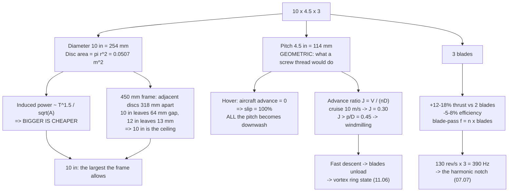

# 02.05 Propellers: size, pitch, blade count

<!-- glance:start -->
<!-- generated by tools/build.py from curriculum/syllabus.yaml — edit the syllabus, not this block -->

| | |
|---|---|
| **Track** | Main path |
| **Difficulty** | Beginner |
| **Time** | 45 min |
| **Hardware** | none |
| **Software** | python |
| **Prerequisites** | [02.02 KV, torque and the motor curve](02.02-kv-torque-curve.md) |
| **Skip if** | You can explain what prop size and pitch numbers mean and why 10x10x3 is a different animal from 5x4.3. |

<!-- glance:end -->

## What you will learn

- What the three numbers on a propeller actually mean — `10 × 4.5 × 3` — and which of them you
  can change without changing anything else (none of them)
- **Geometric pitch** versus the real thing, and why a "4.5 inch pitch" prop never advances
  4.5 inches per revolution
- **Advance ratio** $J$: the one dimensionless number that tells you whether a propeller is
  working in the regime it was designed for
- Why blade count is a compromise between thrust, efficiency and clearance — and why three
  blades is usually the wrong answer for endurance and the right answer for Hermon anyway
- Why a 10-inch propeller is a genuinely different machine from a 5-inch one, not a bigger
  version of it

## Why it matters

The propeller is the only part of Hermon that touches the air. Everything upstream — the pack,
the ESC, the motor — exists to turn it, and every watt of the 226 W hover budget is spent here.
It is also the cheapest part on the aircraft and the easiest to change, which makes it the
highest-leverage experiment you can run.

[01.06](../01-flight-physics/01.06-momentum-theory.md) gave you the physics of a disc that
accelerates air downwards. This lesson gives you the object that does it, the vocabulary for
talking about it, and the reason Hermon's propeller is 10 inches across and not 5 or 12.

## Prerequisites

<!-- prereqs:start -->
## Prerequisites

You need these first:

- [02.02 KV, torque and the motor curve](02.02-kv-torque-curve.md)

### Optional prerequisite links

None.

Check your readiness: `python course.py why 02.05`
<!-- prereqs:end -->

## Concept

### The three numbers

A propeller marked **`10 × 4.5 × 3`** (or sometimes `1045×3`, or `10045`) tells you:

| Number | Name | Meaning | Hermon |
|---|---|---|---|
| 10 | **Diameter**, inches | Tip-to-tip. The disc it sweeps | 10 in = 254 mm |
| 4.5 | **Pitch**, inches | The distance it would advance in one turn if the air were a solid nut | 4.5 in = 114 mm |
| 3 | **Blade count** | How many blades | 3 |

Diameter is the number that matters most, because the disc *area* goes as diameter squared and
the induced power goes as $1/\sqrt{A}$. Going from a 10 in to an 11 in propeller is a 21 %
increase in area for a 10 % increase in diameter.

### Pitch is a promise the air does not keep

"4.5 inch pitch" is a **geometric** statement: the blade is twisted such that, if it were a
screw thread cutting a solid material, one revolution would drive it 4.5 inches forward. Air is
not solid. The propeller always advances less than its geometric pitch, and the shortfall is
called **slip**.

$$\text{slip} = 1 - \frac{\text{actual advance per rev}}{\text{geometric pitch}}$$

In a hover the aircraft does not advance at all, so the slip is **100 %**. Every bit of the
pitch is being converted into downward air velocity rather than forward motion. This is worth
sitting with: **a hovering propeller is a propeller in its worst case**, operating at the one
condition where none of its geometric pitch does what pitch is for. That is why hover is
expensive and why the rest of this module is about making it less so.

### Advance ratio: the number that says which regime you are in

$$J = \frac{V_{axial}}{n D}$$

where $V_{axial}$ is the air speed **through the disc** in m/s, $n$ is the rotation rate in
**revolutions per second** (not per minute), and $D$ is the diameter in metres. $J$ is
dimensionless: it is the distance the air travels through the disc in one revolution, expressed
in diameters.

**The word "axial" is the whole trick for a multicopter.** On an aeroplane the propeller faces
forward, so $V_{axial}$ is the airspeed. On Hermon the discs are nearly *horizontal*, so in
level forward flight only the small component $V \sin\theta$ passes through them, where
$\theta$ is the tilt angle. A 10 m/s cruise at a 12° tilt gives just 2.1 m/s of axial inflow.
In a **vertical descent**, by contrast, the entire descent rate is axial.

| $J$ | Regime | Hermon |
|---|---|---|
| 0 | Hover | Hover, and the thrust-stand test in [02.07](02.07-static-thrust-test.md) |
| ~0.10 | 10 m/s level cruise (2.1 m/s axial at 12° tilt) | The mission cruise |
| **0.1–0.15** | **Vortex ring state begins** | A 2–3 m/s vertical descent |
| > pitch/diameter = 0.45 | Full **windmilling** — braking, not thrusting | A 9 m/s vertical descent |

The third row is the one that bites, and notice how close it is to the cruise row. In a vertical
descent the aircraft falls into its own downwash: the blades meet air that is already moving
downwards, their angle of attack collapses, thrust falls, and the aircraft descends faster — a
runaway. That is the **vortex ring state**, it begins at a descent rate of only **2–3 m/s**, and
it is why ArduPilot's default descent limits sit near 2.5 m/s.
[11.06](../11-first-flights/11.06-emergencies-and-the-logbook.md) teaches the recovery, which
follows straight from the definition: **add forward speed, not throttle**, so the discs move
into clean air and $V_{axial}$ drops back. The number that predicts all of it lives in this
lesson.

### Blade count

More blades means more total blade area on the same disc. That buys thrust and costs efficiency:

| Blades | Thrust at the same rpm | Efficiency | Noise | Why you would |
|---|---|---|---|---|
| 2 | Baseline | **Best** | Lowest | Maximum endurance; long-range builds |
| 3 | +12–18 % | −5–8 % | Higher | Better response, smoother, tolerates a smaller disc |
| 4+ | +20–25 % | −12–18 % | Highest | Small frames where diameter is constrained |

Each blade flies in the wake of the one in front. Add blades and the wake interference rises,
so each blade produces less thrust than it would alone. The total goes up, the efficiency goes
down. This is why a serious endurance aircraft flies two big slow blades and a racing quad
flies four small fast ones.

**Hermon uses three**, and the honest reason is a compromise: two blades on a 10-inch disc would
be slightly more efficient, but three gives better control authority and a smoother thrust
response at the rpm where the rate loop is working, and three-blade 10-inch propellers are far
easier to buy than good two-blade ones. [02.11](02.11-hermon-powertrain-design.md) lets you
revisit the decision with your own measured data from
[02.07](02.07-static-thrust-test.md).

### Why 10 inches, and why not more

Two constraints meet:

1. **Bigger is more efficient.** Induced velocity $v_i = \sqrt{T/2\rho A}$, so induced power
   $T v_i \propto T^{3/2}/\sqrt{A}$. Doubling the disc area cuts induced power by 29 %.
2. **The frame sets a hard ceiling.** On a 450 mm X quad, adjacent motors are $450/\sqrt{2} =
   318$ mm apart. Two 10-inch (254 mm) discs side by side leave 64 mm of gap — 32 mm per side.
   Two 12-inch (305 mm) discs leave 13 mm, which is not enough once the arms flex in a gust.

So Hermon is a 10-inch aircraft *because of its frame*, and the frame is 450 mm because that is
the size that carries 1.45 kg with 10-inch props. The two decisions were made together, and
[02.11](02.11-hermon-powertrain-design.md) is where you get to check the arithmetic.

> [!TIP]
> **Ask your teacher:** "Hermon hovers at 5,060 rpm on a 10 × 4.5 × 3. Compute the blade tip
> speed and the tip Mach number, then tell me what would change if I fitted an 11 × 4.5 × 3 on
> the same frame — the rpm it would need for the same thrust, the induced power, the blade-pass
> frequency, the tip clearance, and what I would hear."

## Technical explanation

### Level 1 — Intuition: a propeller is a ring of small wings

Take a wing. Bend it into a circle and spin it. Each blade section is now an aerofoil moving
through the air at a speed that depends on how far out it sits — the tip moves much faster than
the root. To make every section work at a sensible angle of attack, the blade must be **twisted**:
steep at the root where the local speed is low, shallow at the tip where it is high. That twist
is what "pitch" is describing, and the fact that it is a single number for a blade whose ideal
twist varies continuously is why propeller specifications are approximations.

The thrust comes from lift on those sections. The drag on them is what the motor has to
overcome. A propeller is therefore a compromise between lift you want and drag you do not, at
every radius simultaneously.

### Level 2 — Practical: Hermon's numbers

At Hermon's hover rpm of 5,060 on a 10-inch propeller:

$$n = \frac{5060}{60} = 78.3 \text{ rev/s}, \qquad \omega = 2\pi n = 492 \text{ rad/s}$$

$$v_{tip} = \omega \cdot \frac{D}{2} = 492 \times 0.127 = 63 \text{ m/s}$$

Tip Mach number at sea level ($a = 343$ m/s): $M_{tip} = 63/343 = 0.18$ in hover, rising to
0.38 at the ~9,800 rpm of full throttle. Both are comfortable — propeller efficiency starts
falling above about $M = 0.6$ and drops sharply above 0.7. **Hermon has a large tip-speed
margin, and that margin is why it is quiet.**

The **blade-pass frequency**, which is the number you will hand to the notch filter in
[07.07](../07-control/07.07-filtering-and-methodic-tuning.md):

$$f_{blade} = n \times \text{blades} = 78.3 \times 3 = 235 \text{ Hz in hover}$$

rising to about 490 Hz at full throttle — which is exactly why that notch has to be *dynamic*
and fed by the rpm telemetry from [02.04](02.04-esc-firmware.md).

And the comparison that makes the point about scale:

| | Hermon, 10 × 4.5 × 3 | A racing quad, 5 × 4.3 × 3 |
|---|---|---|
| Hover rpm | ~5,060 | ~15,000 |
| Tip speed at hover | 63 m/s | 100 m/s |
| Tip Mach at hover | 0.18 | 0.29 |
| Disc area (per prop) | 0.0507 m² | 0.0127 m² |
| Blade-pass at hover | 235 Hz | 750 Hz |
| Moment of inertia | ~4× higher | baseline |
| Time to change rpm | Slow | Fast |

Hermon hovers at **a third of the racing quad's rpm on four times the disc**. That is the whole
endurance argument in one row, and it is bought with rotational inertia: the big propeller takes
much longer to change speed, so the rate loop has less authority and the aircraft feels heavy.
**The large propeller is efficient and sluggish; the small one is inefficient and
instantaneous.** That trade is why Hermon's control tuning in module 07 will look nothing like a
Betaflight preset.

### Level 3 — Mathematics: the non-dimensional coefficients

Propeller performance is published in three dimensionless numbers, and once you know them you
can read any manufacturer's data:

$$C_T = \frac{T}{\rho n^2 D^4} \qquad C_P = \frac{P}{\rho n^3 D^5} \qquad \eta = \frac{C_T}{C_P} J$$

with $T$ in newtons, $P$ in watts, $\rho$ in kg/m³, $n$ in rev/s and $D$ in metres.

The exponents are the useful part:

- **Thrust goes as $n^2 D^4$.** Doubling the rpm quadruples the thrust. Doubling the diameter
  multiplies it by **sixteen**.
- **Power goes as $n^3 D^5$.** Doubling the rpm costs eight times the power.

Combining them gives the rule that governs the whole design: **to make a given thrust, a larger
propeller turning slower always costs less power than a smaller one turning faster.** Rearrange
for the power needed at fixed thrust:

$$P \propto \frac{T^{3/2}}{D}$$

A 20 % larger propeller at the same thrust needs about 17 % less power. That is the single most
valuable sentence in this module, and it is why [01.07](../01-flight-physics/01.07-hover-efficiency.md)
called disc loading the master variable.

In hover ($J = 0$) efficiency $\eta$ is undefined — it is $C_T/C_P \times 0 = 0$ — which is
formally correct and practically useless, so hovering rotors are instead rated by **figure of
merit** and by the engineer's number, **grams per watt**. That is
[02.08](02.08-efficiency-watts-to-sky.md)'s subject.

### Level 4 — Implementation: what to look for in a real propeller

Beyond the three numbers, the things that separate a good propeller from a cheap one:

- **Material.** Glass-filled nylon is the standard: tough, forgiving, and it bends before it
  shatters. Carbon is stiffer and more efficient at high rpm but shatters, and the fragments are
  dangerous. **Hermon flies nylon.**
- **Balance.** An unbalanced propeller puts a once-per-revolution force into the airframe at
  130 Hz. That lands directly in the gyro's passband and the estimator has to reject it. A
  ₪40 balancer removes an entire class of vibration problem
  ([02.09](02.09-heat-vibration-noise.md)).
- **Hub fit.** The bore must match the motor shaft without play. A propeller that can shift on
  its hub will unbalance itself in flight.
- **Consistency.** Weigh a set of four. More than about 1 g of spread between nominally
  identical propellers means loose manufacturing, and it will show in the vibration log.
- **Pitch distribution.** Two propellers with the same "4.5" marking can have very different
  twist. This is why [02.07](02.07-static-thrust-test.md) makes you measure your own rather
  than trust a number stamped on a hub.

Mark your propeller sets. Number them 1–4 with a paint pen and keep sets together, so that when
one is damaged you replace the whole set and you know which set produced which log.

## Diagram



## Code

Save as `propeller.py` and run `python propeller.py`. Standard library only.

```python
"""02.05 - propeller geometry and the scaling laws.

Tip speed, blade-pass frequency, advance ratio, and the T ~ n^2 D^4 /
P ~ n^3 D^5 laws that decide why a bigger, slower propeller always wins
in hover.
"""
import math

RHO = 1.225          # kg/m^3, sea level
SPEED_OF_SOUND = 343.0
IN_TO_M = 0.0254

HERMON_D_IN = 10.0
HERMON_PITCH_IN = 4.5
HERMON_BLADES = 3
HOVER_RPM = 5060.0           # solved in 02.06
FULL_RPM = 9800.0
CRUISE_MS = 10.0
CRUISE_TILT_DEG = 12.0
THRUST_PER_MOTOR_N = 3.56    # 1.45 kg / 4, from hermon-numbers.md


def tip_speed(d_in: float, rpm: float) -> float:
    return 2 * math.pi * (rpm / 60.0) * (d_in * IN_TO_M / 2)


def blade_pass_hz(rpm: float, blades: int) -> float:
    return rpm / 60.0 * blades


def advance_ratio(v_axial_ms: float, rpm: float, d_in: float) -> float:
    """J from the AXIAL inflow -- for a multicopter that is not the airspeed."""
    return v_axial_ms / ((rpm / 60.0) * (d_in * IN_TO_M))


def disc_area(d_in: float) -> float:
    return math.pi * (d_in * IN_TO_M / 2) ** 2


def induced_power(thrust_n: float, d_in: float) -> float:
    """Ideal momentum-theory induced power for one rotor (01.06)."""
    a = disc_area(d_in)
    return thrust_n * math.sqrt(thrust_n / (2 * RHO * a))


if __name__ == "__main__":
    print("Hermon's propeller: 10 x 4.5 x 3 at 5060 rpm (hover)")
    vt = tip_speed(HERMON_D_IN, HOVER_RPM)
    vtf = tip_speed(HERMON_D_IN, FULL_RPM)
    print(f"  rotation rate      : {HOVER_RPM / 60:.1f} rev/s")
    print(f"  tip speed          : {vt:.0f} m/s   (full throttle: {vtf:.0f} m/s)")
    print(f"  tip Mach           : {vt / SPEED_OF_SOUND:.2f}   (full throttle: {vtf / SPEED_OF_SOUND:.2f})")
    print(f"  disc area          : {disc_area(HERMON_D_IN):.4f} m^2")
    print(f"  blade-pass freq    : {blade_pass_hz(HOVER_RPM, HERMON_BLADES):.0f} Hz"
          f"   (full throttle: {blade_pass_hz(FULL_RPM, HERMON_BLADES):.0f} Hz)  <- the notch (07.07)")
    print(f"  pitch/diameter     : {HERMON_PITCH_IN / HERMON_D_IN:.2f}")

    print("\nAdvance ratio -- AXIAL inflow, not airspeed:")
    v_ax_cruise = CRUISE_MS * math.sin(math.radians(CRUISE_TILT_DEG))
    cases = [
        ("hover", 0.0),
        (f"{CRUISE_MS:.0f} m/s level cruise at {CRUISE_TILT_DEG:.0f} deg tilt", v_ax_cruise),
        ("1 m/s vertical descent", 1.0),
        ("2 m/s vertical descent", 2.0),
        ("3 m/s vertical descent", 3.0),
        ("5 m/s vertical descent", 5.0),
    ]
    for name, v_ax in cases:
        j = advance_ratio(v_ax, HOVER_RPM, HERMON_D_IN)
        if j >= HERMON_PITCH_IN / HERMON_D_IN:
            note = "WINDMILLING"
        elif j >= 0.10:
            note = "vortex ring state risk"
        else:
            note = "ok"
        print(f"  {name:42s} v_ax={v_ax:4.1f} m/s  J={j:5.3f}  {note}")

    print("\nHermon vs a 5-inch racing quad (both at their hover rpm):")
    print(f"  {'':22s} {'Hermon 10x4.5x3':>17s} {'race 5x4.3x3':>15s}")
    rows = [
        ("hover rpm", f"{HOVER_RPM:.0f}", "15000"),
        ("tip speed (m/s)", f"{vt:.0f}", f"{tip_speed(5.0, 15000):.0f}"),
        ("tip Mach", f"{vt / SPEED_OF_SOUND:.2f}", f"{tip_speed(5.0, 15000) / SPEED_OF_SOUND:.2f}"),
        ("disc area (m^2)", f"{disc_area(10.0):.4f}", f"{disc_area(5.0):.4f}"),
        ("blade-pass (Hz)", f"{blade_pass_hz(HOVER_RPM, 3):.0f}", f"{blade_pass_hz(15000, 3):.0f}"),
    ]
    for name, a, b in rows:
        print(f"  {name:22s} {a:>17s} {b:>15s}")

    print(f"\nInduced power for {THRUST_PER_MOTOR_N:.2f} N per motor, by diameter:")
    print(f"  {'D (in)':>7s} {'area (m^2)':>11s} {'P_ind (W)':>10s} {'vs 10 in':>9s}")
    base = induced_power(THRUST_PER_MOTOR_N, 10.0)
    for d in (5, 7, 8, 9, 10, 11, 12, 13, 15):
        p = induced_power(THRUST_PER_MOTOR_N, float(d))
        print(f"  {d:7d} {disc_area(float(d)):11.4f} {p:10.1f} {p / base * 100:8.0f}%")

    print("\nThe scaling laws (T ~ n^2 D^4, P ~ n^3 D^5):")
    print(f"  double the rpm   -> thrust x {2**2:.0f}, power x {2**3:.0f}")
    print(f"  double the diam  -> thrust x {2**4:.0f}, power x {2**5:.0f}")
    print(f"  +20 % diameter at the SAME thrust -> power x {(1/1.2):.2f}"
          f"  ({(1 - 1/1.2) * 100:.0f} % saved)")

    print("\nFrame clearance check (450 mm X quad):")
    adj = 450 / math.sqrt(2)
    print(f"  adjacent motors are {adj:.0f} mm apart")
    for d in (10, 11, 12, 13):
        gap = adj - d * 25.4
        # rule of thumb: >= 40 mm of gap survives arm flex in a gust; below 25 mm, don't.
        verdict = "OK" if gap >= 40 else ("tight" if gap >= 25 else "NO")
        print(f"  {d:2d} in ({d * 25.4:.0f} mm): gap {gap:6.1f} mm  {verdict}")
```

Output:

```text
Hermon's propeller: 10 x 4.5 x 3 at 5060 rpm (hover)
  rotation rate      : 84.3 rev/s
  tip speed          : 67 m/s   (full throttle: 130 m/s)
  tip Mach           : 0.20   (full throttle: 0.38)
  disc area          : 0.0507 m^2
  blade-pass freq    : 253 Hz   (full throttle: 490 Hz)  <- the notch (07.07)
  pitch/diameter     : 0.45

Advance ratio -- AXIAL inflow, not airspeed:
  hover                                      v_ax= 0.0 m/s  J=0.000  ok
  10 m/s level cruise at 12 deg tilt         v_ax= 2.1 m/s  J=0.097  ok
  1 m/s vertical descent                     v_ax= 1.0 m/s  J=0.047  ok
  2 m/s vertical descent                     v_ax= 2.0 m/s  J=0.093  ok
  3 m/s vertical descent                     v_ax= 3.0 m/s  J=0.140  vortex ring state risk
  5 m/s vertical descent                     v_ax= 5.0 m/s  J=0.233  vortex ring state risk

Hermon vs a 5-inch racing quad (both at their hover rpm):
                           Hermon 10x4.5x3    race 5x4.3x3
  hover rpm                           5060           15000
  tip speed (m/s)                       67             100
  tip Mach                            0.20            0.29
  disc area (m^2)                   0.0507          0.0127
  blade-pass (Hz)                      253             750

Induced power for 3.56 N per motor, by diameter:
   D (in)  area (m^2)  P_ind (W)  vs 10 in
        5      0.0127       38.1      200%
        7      0.0248       27.2      143%
        8      0.0324       23.8      125%
        9      0.0410       21.2      111%
       10      0.0507       19.1      100%
       11      0.0613       17.3       91%
       12      0.0730       15.9       83%
       13      0.0856       14.7       77%
       15      0.1140       12.7       67%

The scaling laws (T ~ n^2 D^4, P ~ n^3 D^5):
  double the rpm   -> thrust x 4, power x 8
  double the diam  -> thrust x 16, power x 32
  +20 % diameter at the SAME thrust -> power x 0.83  (17 % saved)

Frame clearance check (450 mm X quad):
  adjacent motors are 318 mm apart
  10 in (254 mm): gap   64.2 mm  OK
  11 in (279 mm): gap   38.8 mm  tight
  12 in (305 mm): gap   13.4 mm  NO
  13 in (330 mm): gap  -12.0 mm  NO
```

How to read it:

- **Hermon hovers with an enormous tip-speed margin.** 63 m/s against the racing quad's 100 m/s,
  and both are far below the Mach 0.6 where compressibility starts to hurt. That margin is why
  Hermon is quiet in hover and why it still has headroom at full throttle (130 m/s, Mach 0.38).
- **The level cruise and a 2 m/s descent have the same advance ratio.** Look at the two rows:
  $J = 0.104$ and $J = 0.101$. Aerodynamically the disc cannot tell them apart. The difference
  is that in cruise the aircraft is flying *out of* its own wake, and in a vertical descent it
  is flying *into* it — which is what makes one benign and the other a runaway.
- **The induced-power column is the argument for going bigger.** A 5-inch propeller needs
  **twice** the induced power of a 10-inch one for the same thrust; a 15-inch one needs a third
  less than the 10-inch. If efficiency were the only consideration, Hermon would be a 15-inch
  aircraft.
- **The clearance table is why it is not.** 11 inches is already tight on a 450 mm frame and
  12 inches does not fit. The frame and the propeller were chosen together.
- **235 Hz is the number to remember.** Write it on the build log. It is the frequency you will
  see in the FFT in [07.07](../07-control/07.07-filtering-and-methodic-tuning.md) at hover, and
  if the notch is not there, something is misconfigured.

## Exercise

All exercises in this lesson need hardware: **none**.

### Exercise 02.05-E1 — Read the markings `[numerical]`

For each propeller, state the diameter in mm, the pitch-to-diameter ratio, the blade-pass
frequency **at its own realistic hover rpm** (estimate it), and one sentence on what aircraft it
belongs on: (a) `5 × 4.3 × 3`; (b) `10 × 4.5 × 3`; (c) `15 × 5.5 × 2`; (d) `7 × 4 × 4`.

### Exercise 02.05-E2 — Where does the windmilling start `[numerical]`

Hermon is descending vertically at its 5,060 rpm hover speed. (a) What descent rate gives an
advance ratio equal to the pitch-to-diameter ratio of 0.45? (b) Is that a descent rate you would
ever command? (c) The vortex ring state begins far below that, at roughly $J = 0.10$–0.15 — what
descent rate is that, and what does it tell you about a safe maximum for Hermon? (d) A 10 m/s
level cruise has the *same* axial advance ratio as a 2 m/s descent. Why is one safe and the
other not? (e) Name the recovery that
[11.06](../11-first-flights/11.06-emergencies-and-the-logbook.md) will teach, from the physics
alone.

### Exercise 02.05-E3 — The diameter sweep `[coding]`

Extend `propeller.py`: for diameters 8–13 inches, compute the rpm needed to produce 3.56 N
assuming $T \propto n^2 D^4$ with Hermon's 10-inch/5,060 rpm point as the reference. Print
diameter, required rpm, tip speed, blade-pass frequency and induced power. At what diameter does
the tip speed fall below 50 m/s, and what would that buy you in noise?

### Exercise 02.05-E4 — Choose a propeller for a different aircraft `[design]`

Design the propeller for a 3.5 kg quadcopter with a 700 mm wheelbase intended for 40-minute
survey flights on a 6S pack. State the diameter (with the clearance arithmetic), the blade
count (with the reason), the approximate pitch, and the hover rpm you would expect. Then state
the motor KV that follows, and compare it to Hermon's 700 KV.

## Expected result

- **02.05-E1:** (a) 127 mm, p/D = **0.86**; at a realistic ~15,000 rpm hover that is 750 Hz; a
  racing or freestyle quad — the high p/D says it is built for forward speed. (b) 254 mm,
  p/D = **0.45**; at Hermon's 5,060 rpm hover, 235 Hz; a hover-biased endurance propeller.
  (c) 381 mm, p/D = **0.37**; at a realistic ~3,000 rpm hover, 100 Hz; a large survey or
  cinematography multirotor — two blades and low pitch say endurance, and the low blade-pass
  frequency means the notch sits uncomfortably close to the control bandwidth. (d) 178 mm,
  p/D = **0.57**; at ~9,000 rpm, 600 Hz; a small long-range or cinewhoop build where the frame
  limits diameter, so blade count makes up the thrust.
- **02.05-E2:** (a) $J = V_{axial}/(nD)$, so $V = 0.45 \times 78.3 \times 0.254 = **8.9 m/s**$.
  (b) No — a 32 km/h vertical descent is far beyond anything you would command. (c) $J = 0.10$
  gives $V = 0.10 \times 78.3 \times 0.254 = **2.0 m/s**$ and $J = 0.15$ gives **3.0 m/s**. Those
  are descent rates you absolutely could command, which is why ArduPilot's defaults sit near
  2.5 m/s. **Hermon's safe maximum vertical descent is about 2 m/s**; anything faster is flown
  with forward speed. (d) In level cruise the aircraft continuously moves *out of* the column of
  air it has just pushed down, so the disc always meets fresh air. In a vertical descent it
  follows its own downwash down and re-ingests it, so the inflow keeps growing — the same $J$,
  but one is transient and the other self-reinforcing. (e) **Break the advance ratio**: pitch
  forward and fly out of the wake. Adding throttle only pushes more air into the recirculation
  and makes it worse.
- **02.05-E3:** With $T \propto n^2 D^4$, $n \propto D^{-2}$ at constant thrust. From the
  10 in/5,060 rpm reference: 8 in needs ~7,340 rpm (tip 78 m/s), 11 in needs ~3,880 rpm (tip
  56 m/s), 13 in needs ~2,780 rpm (tip 47 m/s). **The tip speed falls below 50 m/s at about
  13 inches.** Propeller noise scales steeply with tip speed — roughly as the fifth to sixth
  power — so dropping from 63 to 47 m/s is a very large subjective reduction. That is why large
  survey aircraft are so much quieter than small ones carrying the same mass.
- **02.05-E4:** Wheelbase 700 mm → adjacent motors $700/\sqrt{2} = 495$ mm apart → a 15 in
  (381 mm) propeller leaves 114 mm of gap, comfortable; 17 in (432 mm) leaves 63 mm, still
  workable. Choose **15 or 16 inches**. **Two blades**, because the mission is endurance and the
  disc is large enough not to need the extra thrust. Pitch around 5–5.5 in (p/D ≈ 0.34), biased
  to hover. Hover thrust is $3.5 \times 9.81/4 = 8.6$ N per motor; scaling from Hermon via
  $T \propto n^2D^4$ gives roughly 4,500–5,000 rpm. On 6S at ~45 % throttle that implies
  $n/(V \cdot \text{throttle}) \approx 4750/(22.2 \times 0.45) \approx$ **470 KV** — so a
  3510-class 400–500 KV motor. Hermon's 700 KV and this aircraft's 470 KV differ for exactly the
  reason the lesson gives: **bigger propeller, lower rpm, lower KV.**

## Troubleshooting

### Symptom: the aircraft is loud and inefficient with the "right" propeller fitted

Check the direction. Propellers are handed: CW and CCW versions are mirror images, and a quad
needs two of each. A propeller fitted to the wrong motor still produces *some* thrust — running
backwards, at perhaps 60 % efficiency, very loudly. Look at the leading edge: it should be the
thick, rounded one, and it should meet the air first.

### Symptom: a new set of propellers made the vibration worse

Weigh them. A 2 g spread across a set of four is enough to produce a visible once-per-revolution
signature in the gyro log at 130 Hz. Balance them ([02.09](02.09-heat-vibration-noise.md)), or
return the set.

### Symptom: the thrust is well below the published curve

Three usual causes, in order of likelihood: (1) the propeller is a cheap copy of the named part
with a different twist distribution; (2) it is mounted on a hub with play and is not running
true; (3) you are measuring in the wash of a bench or a wall — a static thrust test needs at
least one diameter of clearance in every direction, which [02.07](02.07-static-thrust-test.md)
sets out properly.

## Common mistakes

- **Treating pitch as "how fast it goes".** Pitch is a geometric property of the blade twist. In
  hover, none of it does what it says; the entire pitch becomes downwash.
- **Comparing propellers across different diameters by pitch alone.** A `5 × 4.3` and a
  `10 × 4.5` have almost the same pitch number and completely different pitch-to-diameter
  ratios (0.86 versus 0.45), which is the number that actually characterises them.
- **Fitting the biggest propeller that physically clears.** Clearance is not the only limit: the
  motor must be able to turn it, and the arms must be stiff enough not to let the discs move
  into each other under load. An 11-inch propeller on Hermon is a legitimate experiment; a
  12-inch one is not.
- **Buying carbon propellers for a first build.** Stiffer and slightly more efficient, but they
  shatter into sharp fragments instead of bending, and you *will* hit something during module 11.
- **Ignoring the blade-pass frequency.** It is the single number connecting this lesson to the
  control tuning in module 07. Write it down now.

## Knowledge check

1. What do the three numbers in `10 × 4.5 × 3` mean, and which one has the most influence on
   hover efficiency?
   <details><summary>Answer</summary>

   Diameter in inches, geometric pitch in inches, and blade count. **Diameter** dominates:
   induced power goes as $T^{3/2}/\sqrt{A}$ and area goes as diameter squared, so
   $P \propto T^{3/2}/D$. A 20 % larger propeller at the same thrust costs about 17 % less power.
   </details>

2. Why is the slip 100 % in a hover, and what does that say about hover as an operating point?
   <details><summary>Answer</summary>

   Slip is the shortfall between the geometric pitch and the actual advance per revolution. In
   hover the aircraft does not advance at all, so the actual advance is zero and the slip is
   100 %. Every bit of the blade's pitch is being converted into downward air velocity instead
   of forward motion — **hover is the propeller's worst operating point**, which is exactly why
   it is expensive.
   </details>

3. Compute Hermon's tip speed and blade-pass frequency at its 5,060 rpm hover, and say what
   each is used for.
   <details><summary>Answer</summary>

   $n = 78.3$ rev/s; $v_{tip} = 2\pi \times 78.3 \times 0.127 = $ **63 m/s** (Mach 0.18), which
   is checked against the compressibility limit around Mach 0.6 — a large margin. Blade-pass
   $= 78.3 \times 3 = $ **235 Hz**, which is the centre frequency for the dynamic harmonic notch
   in [07.07](../07-control/07.07-filtering-and-methodic-tuning.md). At full throttle both rise:
   130 m/s and 490 Hz.
   </details>

4. Why can Hermon not use a 12-inch propeller?
   <details><summary>Answer</summary>

   Geometry. On a 450 mm X quad, adjacent motors are $450/\sqrt{2} = 318$ mm apart. Two 12-inch
   (305 mm) discs leave only 13 mm of gap — under 7 mm per side — which disappears the moment
   the arms flex in a gust. 10 inches leaves 64 mm and is the practical ceiling.
   </details>

5. Given $T \propto n^2 D^4$ and $P \propto n^3 D^5$, why does a larger, slower propeller always
   win in hover?
   <details><summary>Answer</summary>

   Eliminate $n$ at constant thrust: $n \propto D^{-2}$, so $P \propto (D^{-2})^3 D^5 =
   D^{-1}$. Power at a given thrust is **inversely proportional to diameter** — bigger is always
   cheaper. The only reasons not to go bigger are frame clearance, motor torque, and the
   propeller's own rotational inertia slowing the control response.
   </details>

## Practical challenge

Write `projects/evidence/02.05-propeller-spec.md` containing:

1. Hermon's propeller specification with every number derived, not asserted: diameter (with the
   clearance arithmetic), pitch-to-diameter, blade count (with the trade), hover rpm, tip speed,
   tip Mach, blade-pass frequency.
2. The two alternatives you considered — a 10 × 4.5 × 2 and an 11 × 4.5 × 3 — with the expected
   change in induced power, hover rpm and blade-pass frequency for each, computed from the
   script.
3. A sentence on what you would have to change elsewhere in the aircraft to fly each alternative.

You will test this specification against reality in [02.07](02.07-static-thrust-test.md) and
commit to it in [02.11](02.11-hermon-powertrain-design.md).

## You can skip this if

You can read a propeller's markings and say what aircraft it belongs on, explain geometric pitch
and slip, compute the **axial** advance ratio and say why a 2 m/s descent is dangerous when a
10 m/s cruise is not, derive $P \propto T^{3/2}/D$ from the scaling laws, and state Hermon's
hover rpm, tip speed and blade-pass frequency from memory.

## Go deeper

- [01.06](../01-flight-physics/01.06-momentum-theory.md) (earlier): the momentum theory behind
  the induced-power column in this lesson's output.
- [01.07](../01-flight-physics/01.07-hover-efficiency.md) (earlier): disc loading, which is this
  lesson's diameter argument stated as a design rule.
- [02.06](02.06-prop-motor-matching.md) (next): pairing this propeller with a motor so that
  hover lands at 40–60 % throttle.
- [02.09](02.09-heat-vibration-noise.md) (later): balancing, and what an unbalanced propeller
  does to the estimator.
- Propeller theory and the non-dimensional coefficients:
  https://en.wikipedia.org/wiki/Propeller_%28aeronautics%29
- Blade element theory, if you want the full treatment:
  https://en.wikipedia.org/wiki/Blade_element_theory

## Progress checkpoint

Run `python course.py complete 02.05` when the propeller specification is written. Next:
[02.06](02.06-prop-motor-matching.md) — reading a manufacturer's thrust curve and matching this
propeller to a motor so Hermon hovers where you want it to.
