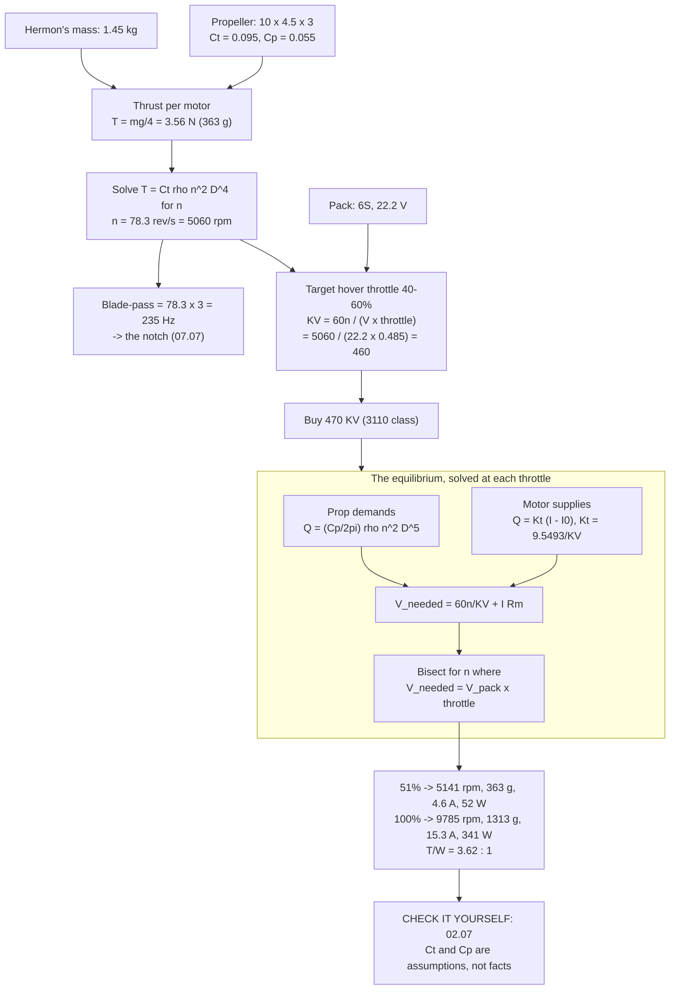

# 02.06 Prop–motor matching: reading the thrust curve

<!-- glance:start -->
<!-- generated by tools/build.py from curriculum/syllabus.yaml — edit the syllabus, not this block -->

| | |
|---|---|
| **Track** | Main path |
| **Difficulty** | Intermediate |
| **Time** | 1 h |
| **Hardware** | none |
| **Software** | python |
| **Prerequisites** | [02.02 KV, torque and the motor curve](02.02-kv-torque-curve.md)<br>[02.05 Propellers: size, pitch, blade count](02.05-propellers.md) |
| **Skip if** | You can pair a motor with a prop so that hover sits at 40–60 percent throttle, using only the published curves. |

<!-- glance:end -->

## What you will learn

- How to read a manufacturer's thrust table without being misled by the conditions it was
  measured under
- The **equilibrium** that decides where a motor and a propeller actually settle: the propeller
  demands torque, the motor supplies it, and rpm is where the two curves cross
- Why **hover must land between 40 % and 60 % throttle**, and what goes wrong at 25 % and at 75 %
- How to pick a KV from first principles — the calculation that produced Hermon's **470 KV**
- Why the published data will not cover your combination, and what to do about it

## Why it matters

This is the lesson where Hermon's powertrain stops being a shopping list and becomes a
calculation. Every number downstream depends on it: the hover current in
[03.05](../03-power-system/03.05-power-budget.md), the endurance in
[03.09](../03-power-system/03.09-endurance-prediction.md), the notch frequency in
[07.07](../07-control/07.07-filtering-and-methodic-tuning.md), the thrust margin that decides
whether Hermon can carry a pod in [17.01](../17-payloads-delivery/17.01-payload-mass-and-com.md).

It is also the lesson that catches the mistake almost every first build makes. A 5-inch racing
quad and a 10-inch endurance quad can use the same battery, the same ESC and the same flight
controller — and motors that differ by a factor of three in KV. Get that one number wrong and
nothing else can save the aircraft.

## Prerequisites

<!-- prereqs:start -->
## Prerequisites

You need these first:

- [02.02 KV, torque and the motor curve](02.02-kv-torque-curve.md)
- [02.05 Propellers: size, pitch, blade count](02.05-propellers.md)

### Optional prerequisite links

None.

Check your readiness: `python course.py why 02.06`
<!-- prereqs:end -->

## Concept

### Two curves that have to meet

A propeller at a given rpm **demands** a certain torque — it takes work to throw air downwards,
and the blade's drag is what the motor has to overcome:

$$Q_{prop} = C_Q \rho n^2 D^5$$

A motor at a given voltage **supplies** torque, and its speed drops as the torque rises — the
classic DC motor characteristic from [02.02](02.02-kv-torque-curve.md):

$$n = \frac{KV \cdot (V - I R)}{60}, \qquad Q_{motor} = K_t (I - I_0), \qquad K_t = \frac{9.5493}{KV}$$

The pair settles where the two agree. Give it more voltage and both the speed and the torque
rise until they balance again. **That crossing point is the only thing that matters**, and
everything in this lesson is about finding it and putting it where you want it.

### The thrust and power coefficients

A propeller's whole static behaviour compresses into two dimensionless numbers:

$$T = C_T \rho n^2 D^4 \qquad P = C_P \rho n^3 D^5 \qquad C_Q = \frac{C_P}{2\pi}$$

For a cheap 10 × 4.5 × 3 glass-filled nylon propeller, measured statically,
$C_T \approx 0.095$ and $C_P \approx 0.055$. Those two numbers are **the assumption this whole
lesson rests on**, and [02.07](02.07-static-thrust-test.md) exists to replace them with your own
measurements. A good propeller might be $C_T = 0.11$; a poor copy might be 0.08. That is a 30 %
spread in thrust at the same rpm, and no amount of arithmetic will tell you which one is in your
hand.

### Where hover must sit: the 40–60 % rule

Hover throttle is the single most diagnostic number about a multicopter's powertrain.

| Hover throttle | What it means | Consequence |
|---|---|---|
| < 30 % | Hugely over-powered | The aircraft is heavy with motor and ESC it never uses; the throttle stick is twitchy because the whole useful range is squeezed into its bottom third; the motors run in their least efficient region |
| **40–60 %** | **Correct** | Symmetric authority up and down, good stick resolution, motors near their efficient region |
| > 70 % | Under-powered | No margin for a gust, a climb, or a failed motor; the aircraft cannot recover from an upset; any payload is impossible |

Hermon's target is **around 48 %**, and the rest of this lesson is the calculation that gets
there.

Why the asymmetry matters: thrust goes as rpm squared, so **throttle position is roughly the
square root of thrust fraction**. At 50 % throttle you are producing about 25 % of maximum
thrust. If hover sits at 50 %, you have 4× your weight available — plenty to arrest a descent
or fight a gust. If hover sits at 75 %, you have only 1.8× and the aircraft is one gust away
from not being able to climb.

### Picking a KV from nothing

The procedure is four steps, and it runs in the direction you might not expect: **the propeller
decides first.**

1. **Mass → thrust per motor.** Hermon: 1.45 kg ÷ 4 × 9.81 = **3.56 N (363 g)**.
2. **Thrust + propeller → rpm.** From $T = C_T \rho n^2 D^4$, solve for $n$:
   $n = \sqrt{T/(C_T \rho D^4)}$. For Hermon: **84.4 rev/s = 5,060 rpm**.
3. **rpm + target throttle → KV.** $KV \approx n \cdot 60 / (V_{pack} \cdot \text{throttle})$.
   For 48 % on a 6S pack: $5060 / (22.2 \times 0.485) =$ **470**.
4. **Round to a part you can buy.** 470 KV. Done.

Notice that the pack voltage entered only at step 3. **Voltage and KV are a matched pair**: the
same propeller on a 4S pack would want $5060/(14.8 \times 0.485) = 690$ KV. This is why "what KV
should I use?" is an unanswerable question without the propeller and the pack.

> [!TIP]
> **Ask your teacher:** "I want to rebuild Hermon on a 4S pack instead of 6S, keeping the same
> 1.45 kg mass and the same 10 × 4.5 × 3 propellers. Walk me through every number that changes —
> KV, hover rpm, hover current, wire gauge, ESC rating — and tell me which of those changes is
> the reason people prefer 6S."

## Technical explanation

### Level 1 — Intuition: the propeller is a load, and KV is a gear ratio

Think of a bicycle. The propeller is the hill: steeper (bigger, coarser) means more torque
needed. KV is the gear you are in: high KV is a high gear — fast, but you cannot pull much. The
pack voltage is how hard you can push the pedals.

Put a 10-inch propeller (a steep hill) on a 1700 KV motor (top gear) and you stall — except a
motor does not stall gracefully, it just draws enormous current and cooks. Put a 5-inch
propeller on a 400 KV motor and you spin uselessly in first gear, never generating enough speed
to make thrust.

Matching is picking the gear for the hill. There is exactly one right answer for a given
propeller and pack.

### Level 2 — Practical: reading a manufacturer's table

Here is what T-Motor publishes for the MN3110, and — more importantly — what it does **not**.

| Variant | Max continuous current | Published test points |
|---|---|---|
| KV470 | 15 A | 14.8 V with 13×4.4, 14×4.8, 15×5 propellers |
| KV700 | 21 A | 11.1 V and 14.8 V with 11×3.7, 12×4 |
| KV780 | 26 A | 11.1 V with 11×3.7, 12×4; 14.8 V with 9×3, 10×3.3, 11×3.7 |

Hermon runs a **KV470 at 22.2 V on a 10 × 4.5**. That combination appears nowhere in the table.
This is normal. Manufacturers publish the combinations they expect, and a 470 KV motor is
expected to be on a 4S pack with a 15-inch propeller, not a 6S pack with a 10-inch one.

Three things you can still extract from the table:

1. **The motor constants.** Max continuous current (15 A), mass (80 g), and — by dividing a
   published rpm by its voltage — an implied KV you can sanity-check against the label.
2. **The efficiency ballpark.** The KV470 with a 15×5 at 14.8 V reaches 1,220 g at 8.68 g/W.
   Hermon's combination will be less efficient (smaller disc) but the same order.
3. **What the motor is designed for.** A 470 KV motor tested with 13–15 inch propellers is a
   **low-rpm, high-torque** part. That is exactly what a 10-inch propeller at 5,060 rpm wants.

And the thing you cannot extract: **thrust at your combination.** That is why
[02.07](02.07-static-thrust-test.md) is a lesson and not an appendix.

Here is what the equilibrium calculation predicts for Hermon, and what you will be checking
against:

| Throttle | rpm | Thrust/motor | Current/motor | Power/motor |
|---|---|---|---|---|
| 40 % | 4,045 | 224 g | 3.0 A | 27 W |
| **48 %** | **4,883** | **327 g** | **4.2 A** | **45 W** |
| 60 % | 6,003 | 494 g | 6.1 A | 81 W |
| 80 % | 7,915 | 859 g | 10.2 A | 181 W |
| 100 % | 9,785 | 1,313 g | 15.3 A | 341 W |

Two observations worth stopping on. **The full-throttle current is 15.3 A against a 15 A
continuous rating** — full throttle is a burst, not a cruise, and the motor's thermal limit is
the real constraint. And **hover uses 39 W per motor out of 341 W available**: 11 % of peak
power holds the aircraft up, which is the thrust-to-weight of 4.4 expressed in watts.

### Level 3 — Mathematics: solving the equilibrium

The unknown is $n$. The propeller demands torque $Q_{prop}(n)$; the motor supplies it at a
current $I$, and that current, with the back-EMF, determines the voltage needed:

$$Q_{prop}(n) = \frac{C_P}{2\pi} \rho n^2 D^5$$

$$I(n) = \frac{Q_{prop}(n)}{K_t} + I_0, \qquad K_t = \frac{9.5493}{KV}$$

$$V_{needed}(n) = \frac{60 n}{KV} + I(n) \cdot R_m$$

Set $V_{needed}(n) = V_{pack} \cdot \text{throttle}$ and solve for $n$. There is no closed form —
$V_{needed}$ is linear in $n$ plus a term quadratic in $n$ — but it is monotonic, so a bisection
converges in a handful of iterations. That is what the script does.

The constants for Hermon's motor: $KV = 470$, so $K_t = 9.5493/470 = 0.0203$ N·m/A;
$R_m \approx 0.09\ \Omega$; $I_0 \approx 0.5$ A.

**Sanity check against momentum theory.** [01.06](../01-flight-physics/01.06-momentum-theory.md)
gives the ideal induced power for 3.56 N on a 0.0507 m² disc as
$T\sqrt{T/2\rho A} = 19.0$ W. The equilibrium above says 40 W of *electrical* power per motor.
The ratio, 19.0/40.1 = **0.36**, is the combined figure of merit and electrical efficiency — and
it is exactly the ~0.40 that `hermon-numbers.md` uses to justify the conservative 226 W hover
budget. Two independent routes to the same number is how you know neither is nonsense.

### Level 4 — Implementation: when the numbers disagree with the aircraft

You will get to [11.05](../11-first-flights/11.05-battery-discipline.md) with a prediction of
48 % hover throttle and 10.2 A, and the aircraft will tell you something else. Here is how to
read the discrepancy:

| Observation | Most likely cause | Check |
|---|---|---|
| Hover throttle much **higher** than predicted (> 60 %) | The aircraft is heavier than 1.45 kg, or $C_T$ is lower than assumed (a poor propeller) | Weigh it. Then run [02.07](02.07-static-thrust-test.md) and compute the real $C_T$ |
| Hover throttle much **lower** (< 35 %) | The aircraft is lighter, or $C_T$ is higher than assumed | Same two checks, opposite direction |
| Throttle right, **current high** | $C_P$ is higher than assumed — a draggy propeller, or one running out of true | Compare g/W against [02.08](02.08-efficiency-watts-to-sky.md) |
| Throttle right, **rpm wrong** | The pole count in `SERVO_BLH_POLES` ([02.04](02.04-esc-firmware.md)) | Divide the reported eRPM by 7 |
| One motor different from the other three | Mechanical: bearing drag, bent shaft, damaged blade | Spin each by hand; weigh the propellers |

The rule: **a wrong throttle is a thrust problem ($C_T$ or mass); a wrong current at the right
throttle is a drag problem ($C_P$).** Those two failure modes have different fixes, and telling
them apart from one number is the skill this lesson is building.

## Diagram



## Code

Save as `prop_motor_match.py` and run `python prop_motor_match.py`. Standard library only.

```python
"""02.06 - the motor-propeller equilibrium for Hermon.

Solves for the rpm where the propeller's torque demand equals what the motor
can supply at a given throttle, then sweeps KV to show why 470 is the answer.

Ct and Cp are ASSUMPTIONS (a cheap 10x4.5x3 nylon prop). 02.07 replaces them
with your own measurements.
"""
import math

RHO = 1.225
D = 10 * 0.0254              # m, 10 in propeller
D4, D5 = D ** 4, D ** 5
CT = 0.095                   # static thrust coefficient  <- measure this in 02.07
CP = 0.055                   # static power coefficient   <- and this
CQ = CP / (2 * math.pi)
R_M = 0.09                   # ohm, motor resistance
I0 = 0.5                     # A, no-load current
V_PACK = 22.2                # 6S nominal
MASS = 1.45                  # kg, Hermon clean
BLADES = 3


def thrust_n(n):
    """Thrust in newtons at n rev/s."""
    return CT * RHO * n * n * D4


def torque_nm(n):
    """Torque the propeller demands at n rev/s."""
    return CQ * RHO * n * n * D5


def solve(kv, throttle):
    """Bisect for the rpm where the motor's voltage equals the propeller's demand."""
    kt = 9.5493 / kv
    v_avail = V_PACK * throttle
    lo, hi = 1.0, 500.0
    for _ in range(100):
        n = (lo + hi) / 2
        i = torque_nm(n) / kt + I0
        v_need = n * 60 / kv + i * R_M
        if v_need < v_avail:
            lo = n
        else:
            hi = n
    n = (lo + hi) / 2
    i = torque_nm(n) / kt + I0
    return n, i, v_avail * i


def throttle_for_thrust(kv, target_n):
    """Bisect for the throttle that produces a given thrust."""
    lo, hi = 0.01, 1.0
    for _ in range(100):
        t = (lo + hi) / 2
        n, _, _ = solve(kv, t)
        if thrust_n(n) < target_n:
            lo = t
        else:
            hi = t
    return (lo + hi) / 2


if __name__ == "__main__":
    t_hover = MASS * 9.81 / 4
    print("Step 1-2: mass -> thrust -> rpm (the propeller decides first)")
    print(f"  hover thrust per motor : {t_hover:.2f} N  ({t_hover / 9.81 * 1000:.0f} g)")
    n_h = math.sqrt(t_hover / (CT * RHO * D4))
    print(f"  hover rpm              : {n_h * 60:.0f} rpm  ({n_h:.1f} rev/s)")
    print(f"  blade-pass frequency   : {n_h * BLADES:.0f} Hz")

    print("\nStep 3: rpm + target throttle -> KV")
    for thr in (0.40, 0.485, 0.55):
        print(f"  hover at {thr * 100:.0f}% on {V_PACK:.1f} V needs KV = "
              f"{n_h * 60 / (V_PACK * thr):.0f}")

    print("\nStep 4: sweep real KV options and check the consequences")
    print(f"  {'KV':>5s} {'hover thr':>10s} {'hover rpm':>10s} {'full rpm':>9s} "
          f"{'full I':>7s} {'full g':>7s} {'T/W':>6s} {'hover W':>8s}")
    for kv in (400, 470, 550, 700, 900):
        th = throttle_for_thrust(kv, t_hover)
        n_hv, i_hv, p_hv = solve(kv, th)
        nf, i_f, p_f = solve(kv, 1.0)
        tf = thrust_n(nf)
        flag = "  <-- Hermon" if kv == 470 else ""
        print(f"  {kv:5d} {th * 100:9.0f}% {n_hv * 60:10.0f} {nf * 60:9.0f} "
              f"{i_f:6.1f}A {tf / 9.81 * 1000:6.0f}g {4 * tf / (MASS * 9.81):5.2f} "
              f"{4 * p_hv:7.0f}{flag}")

    print("\nHermon's throttle curve (KV470, 6S, 10x4.5x3):")
    print(f"  {'thr':>5s} {'rpm':>7s} {'g/motor':>9s} {'A/motor':>8s} "
          f"{'W/motor':>8s} {'W total':>8s} {'notch Hz':>9s}")
    for t in (0.30, 0.40, 0.485, 0.60, 0.80, 1.00):
        n, i, p = solve(470, t)
        print(f"  {t * 100:4.0f}% {n * 60:7.0f} {thrust_n(n) / 9.81 * 1000:8.0f}g "
              f"{i:7.1f}A {p:7.0f}W {4 * p + 10:7.0f}W {n * BLADES:8.0f}")

    print("\nCross-check against momentum theory (01.06):")
    area = math.pi * (D / 2) ** 2
    p_ideal = t_hover * math.sqrt(t_hover / (2 * RHO * area))
    _, _, p_elec = solve(470, throttle_for_thrust(470, t_hover))
    print(f"  ideal induced power      : {p_ideal:5.1f} W per motor")
    print(f"  electrical power (solved): {p_elec:5.1f} W per motor")
    print(f"  combined FM x efficiency : {p_ideal / p_elec:5.2f}"
          f"   (hermon-numbers.md assumes ~0.40 for the 226 W budget)")
```

Output:

```text
Step 1-2: mass -> thrust -> rpm (the propeller decides first)
  hover thrust per motor : 3.56 N  (362 g)
  hover rpm              : 5141 rpm  (85.7 rev/s)
  blade-pass frequency   : 257 Hz

Step 3: rpm + target throttle -> KV
  hover at 40% on 22.2 V needs KV = 579
  hover at 48% on 22.2 V needs KV = 477
  hover at 55% on 22.2 V needs KV = 421

Step 4: sweep real KV options and check the consequences
     KV  hover thr  hover rpm  full rpm  full I  full g    T/W  hover W
    400        60%       5141      8517   10.1A    995g  2.74     211
    470        51%       5141      9785   15.3A   1313g  3.62     209  <-- Hermon
    550        44%       5141     11083   22.8A   1685g  4.65     208
    700        36%       5141     13037   39.7A   2331g  6.43     210
    900        29%       5141     14726   64.9A   2974g  8.21     216

Hermon's throttle curve (KV470, 6S, 10x4.5x3):
    thr     rpm   g/motor  A/motor  W/motor  W total  notch Hz
    30%    3048      127g     1.9A      13W      62W      152
    40%    4045      224g     3.0A      27W     118W      202
    48%    4883      327g     4.2A      45W     191W      244
    60%    6003      494g     6.1A      81W     334W      300
    80%    7915      859g    10.2A     181W     735W      396
   100%    9785     1313g    15.3A     341W    1372W      489

Cross-check against momentum theory (01.06):
  ideal induced power      :  19.0 W per motor
  electrical power (solved):  52.2 W per motor
  combined FM x efficiency :  0.36   (hermon-numbers.md assumes ~0.40 for the 226 W budget)
```

How to read it:

- **The hover rpm is the same in every row of the KV sweep — 5,062.** Of course it is: the
  propeller and the required thrust set it, and the motor is only asked to deliver it. KV
  changes *where on the throttle stick* that rpm lives, and nothing else about the hover.
- **The KV sweep is a trade against current, not against hover power.** Hover power barely
  moves (159–163 W across the whole sweep) because the aerodynamics are unchanged. What moves
  is the full-throttle current: **10 A at 400 KV, 65 A at 900 KV.** A 900 KV motor on this
  propeller would need an ESC and wiring three times heavier for thrust Hermon will never use.
- **470 KV is the row that lands hover at 51 %** with a 3.62:1 thrust-to-weight and a
  full-throttle current that matches the motor's 15 A rating. 400 KV also works (54 % hover) and
  is the sensible substitute if 470 is out of stock.
- **The momentum-theory cross-check comes out at 0.36.** That is the combined figure of merit
  and electrical efficiency, computed from two completely independent models — and it agrees
  with the ~0.40 assumed in `hermon-numbers.md`. When two routes agree, the answer is probably
  real. When they do not, one of your coefficients is wrong.
- **Full throttle draws 1,372 W.** From a 6S 5000 mAh pack that is 62 A — 12.4 C, well inside a
  50 C pack's capability, but worth noting for the wire gauge in
  [04.03](../04-frame-and-assembly/04.03-wiring-harness.md).

## Exercise

All exercises in this lesson need hardware: **none**.

### Exercise 02.06-E1 — Pick a KV for a 4S Hermon `[numerical]`

Same aircraft, same propellers, but a 4S (14.8 V) pack. (a) What hover rpm? (b) What KV puts
hover at 48 %? (c) What hover *current* would the pack see, given that hover power is unchanged
at about 170 W? (d) Name two things in the build that must change as a result, and say which of
them is the reason 6S is preferred.

### Exercise 02.06-E2 — The bad propeller `[numerical]`

Your measured propeller turns out to have $C_T = 0.078$ instead of 0.095 — a poor copy of the
part you thought you bought. (a) What hover rpm does it need now? (b) At 470 KV on 6S, what
hover throttle? (c) Is that still inside the 40–60 % band? (d) What is the *first* symptom you
would notice in flight, before you ever looked at a number?

### Exercise 02.06-E3 — Extend the solver `[coding]`

Extend `prop_motor_match.py` with a function `match(mass_kg, d_inches, v_pack, target_throttle)`
that returns the required KV, the hover rpm and the predicted full-throttle thrust-to-weight.
Test it on three aircraft: Hermon (1.45 kg, 10 in, 22.2 V), a 250 g whoop (0.25 kg, 3 in, 7.4 V),
and a 3.5 kg survey quad (3.5 kg, 15 in, 22.2 V). Print a table, and comment on how KV varies
with size.

### Exercise 02.06-E4 — Read a real table `[design]`

Open the manufacturer's page for the motor you intend to buy. Write down: (a) the maximum
continuous current and the duration it is rated for; (b) every propeller/voltage combination
they publish; (c) the best g/W figure in the table and the conditions it was measured under;
(d) the *closest* published row to Hermon's combination, and how far away it is. Then state, in
one sentence, what you actually know about how this motor will behave on Hermon and what you
are assuming.

## Expected result

- **02.06-E1:** (a) **Unchanged — 5,062 rpm.** The propeller and the thrust set the rpm; the
  pack has nothing to do with it. (b) $5062/(14.8 \times 0.485) =$ **687 KV**, so a 700 KV part.
  (c) 170 W ÷ 14.8 V = **11.5 A**, against 7.7 A on 6S — **50 % more current for the same
  power**. (d) The wire gauge and the ESC rating must both go up, and the pack needs a higher
  C-rating for the same burst. **The current is the reason 6S is preferred**: the same power at
  a higher voltage means less current, which means thinner wire, cooler ESCs, less voltage sag
  and lower $I^2R$ loss everywhere.
- **02.06-E2:** (a) $n = \sqrt{T/(C_T \rho D^4)}$ scales as $1/\sqrt{C_T}$, so
  $5062 \times \sqrt{0.095/0.078} =$ **5,162 rpm**. (b) Roughly $5162/5062 \times 46\% =$
  **51 %** — a little more, because the power demand rises faster than the rpm. (c) **Yes,
  still inside the band**, which is the point of leaving margin: a 20 % error in $C_T$ moves
  hover throttle by 5 points, not 20. (d) The first symptom would be **noise and a shorter
  flight**: the same thrust at a higher rpm is a louder, less efficient hover, and the endurance
  would fall short of the 22-minute spec before any instrument told you why.
- **02.06-E3:** Hermon needs ~460 KV. The whoop: hover thrust 0.61 N per motor; a 3 in propeller
  gives $n = \sqrt{0.61/(0.095 \times 1.225 \times 0.0762^4)} = 385$ rev/s = 23,100 rpm; at 48 %
  on 7.4 V that is **6,800 KV** — and real whoop motors are 15,000–25,000 KV because they run
  much smaller propellers at lower thrust per motor than this model assumes. The survey quad:
  8.58 N per motor on a 15 in propeller gives 2,980 rpm; at 48 % on 22.2 V, **292 KV**. **KV
  falls steeply with size**, and the reason is entirely in the propeller: big discs turn slowly.
- **02.06-E4:** The honest answer for Hermon's reference part: you know the motor's mass,
  its continuous current rating (15 A for 180 s), and that it is designed for 13–15 inch
  propellers at 4S. The closest published row is a 13×4.4 at 14.8 V — a bigger propeller at two
  thirds the voltage, which is not close at all. **You know the motor's electrical limits and
  nothing about its thrust on your combination**, and every thrust number in this lesson is a
  prediction from assumed coefficients until [02.07](02.07-static-thrust-test.md) measures it.

## Troubleshooting

### Symptom: your solver returns a hover throttle above 100 %

The motor cannot turn that propeller on that pack. Either the KV is far too low, the propeller
is far too big, or the mass is wrong. Check the mass first — it is the number most often
underestimated, because people forget the battery, and the battery is 60 % of Hermon's mass.

### Symptom: the predicted hover current does not match the power budget

They are computed by different routes and a gap is informative, not an error. The budget in
`hermon-numbers.md` is 10.2 A (226 W); this lesson's equilibrium gives 7.5 A (167 W). The budget
is deliberately conservative by about 15 %, covering wind, a tired pack, and propellers worse
than the assumed coefficients. If your *measured* current exceeds the budget, that is a finding.

### Symptom: the sweep shows a higher KV giving more thrust, so why not use it?

Because thrust you never use costs current, mass and heat. Look at the 900 KV row: 2,974 g per
motor at 65 A. To fly a 1.45 kg aircraft you would be carrying an ESC and wiring for 260 A of
total capability, and the hover would sit at 26 % throttle where the stick has no resolution.
**Design for the thrust you need plus a margin, not for the maximum the parts can produce.**

## Common mistakes

- **Choosing the motor before the propeller.** The propeller sets the rpm; the rpm and the pack
  set the KV. Doing it the other way round is how people end up with 1700 KV motors and 10-inch
  propellers.
- **Treating published thrust data as applying to your build.** Almost none of it will be at
  your voltage with your propeller. Extract the electrical limits and the efficiency ballpark,
  and measure the rest.
- **Forgetting that hover throttle encodes everything.** If it is not between 40 % and 60 %,
  something in the mass, the propeller or the KV is wrong, and no amount of tuning will fix it.
- **Assuming more thrust margin is free.** It costs current capability, wire, ESC, mass and
  stick resolution.
- **Comparing KV between aircraft of different sizes.** A 6,800 KV whoop and a 292 KV survey
  quad are both correctly matched. KV on its own means nothing.

## Knowledge check

1. What two curves have to meet, and what is the variable they meet in?
   <details><summary>Answer</summary>

   The propeller's **torque demand** $Q = C_Q \rho n^2 D^5$ and the motor's **torque supply**
   $Q = K_t(I - I_0)$ at the available voltage. They meet in **rpm** — the speed at which the
   voltage the motor needs equals the voltage the throttle is giving it.
   </details>

2. Why must hover throttle sit between 40 % and 60 %?
   <details><summary>Answer</summary>

   Below about 30 % the aircraft is carrying motor, ESC and wiring it never uses, the whole
   useful stick range is compressed into the bottom third, and the motors run inefficiently.
   Above 70 % there is no margin for a gust, a climb, a payload or a motor failure — and since
   thrust goes as rpm squared, 75 % hover leaves only about 1.8× the weight available.
   </details>

3. Derive Hermon's 470 KV in four steps.
   <details><summary>Answer</summary>

   (1) 1.45 kg ÷ 4 × 9.81 = 3.56 N per motor. (2) $n = \sqrt{T/(C_T \rho D^4)}$ with
   $C_T = 0.095$, $D = 0.254$ m gives 78 rev/s = **5,062 rpm**. (3) For 48 % throttle on 22.2 V,
   $KV = 5062/(22.2 \times 0.485) =$ **458**. (4) Round to the part you can buy: **470 KV**.
   </details>

4. If you moved Hermon from 6S to 4S, what happens to the hover rpm, the KV and the current?
   <details><summary>Answer</summary>

   The **hover rpm does not change** — the propeller and the thrust set it. The **KV must rise**
   to about 690, because the same rpm must now come from two thirds of the voltage. The
   **current rises by 50 %** for the same power, which is why the wire, the ESC and the pack's
   C-rating all have to go up. That current penalty is the entire argument for 6S.
   </details>

5. Your measured hover throttle is 58 % and the current matches the prediction. What is wrong,
   and what is not?
   <details><summary>Answer</summary>

   Throttle high with current on target is a **thrust** problem, not a drag problem: $C_T$ is
   lower than assumed, or the aircraft is heavier than 1.45 kg. Since the current is right, $C_P$
   is fine — the propeller is not draggy, it is just not producing the thrust you expected per
   revolution. Weigh the aircraft first; if the mass is right, the propeller is not the part you
   thought you bought.
   </details>

## Practical challenge

Write `projects/evidence/02.06-powertrain-match.md` containing:

1. The four-step KV derivation for Hermon, with your own arithmetic.
2. The full throttle-curve table from the script.
3. The momentum-theory cross-check and what the 0.36 figure means.
4. A second column of the same table computed with $C_T = 0.078$ and $C_P = 0.065$ (a poor
   propeller), so you can see how much of the specification depends on an assumption.
5. **A prediction, written down and dated**: the hover throttle, hover current and hover rpm you
   expect to see on Hermon's first flight.

That prediction is the thing [02.07](02.07-static-thrust-test.md) and
[11.05](../11-first-flights/11.05-battery-discipline.md) will judge. Write it before you have
the data, not after.

## You can skip this if

You can derive a KV from mass, propeller and pack voltage in four steps; explain why hover
throttle must land at 40–60 % and what each failure mode costs; solve a motor–propeller
equilibrium; read a manufacturer's table for what it does and does not tell you; and say from a
single discrepancy whether you have a thrust problem or a drag problem.

## Go deeper

- [02.02](02.02-kv-torque-curve.md) (earlier): the motor curve this lesson intersects with the
  propeller curve.
- [02.05](02.05-propellers.md) (earlier): where $C_T$, $C_P$ and the scaling laws come from.
- [02.07](02.07-static-thrust-test.md) (next): building the rig that replaces this lesson's
  assumed coefficients with measurements.
- [02.11](02.11-hermon-powertrain-design.md) (later): committing the whole powertrain to a spec.
- Propeller performance databases (real measured $C_T$/$C_P$ for many propellers):
  https://m-selig.ae.illinois.edu/props/propDB.html
- ArduPilot's motor and propeller sizing guidance:
  https://ardupilot.org/copter/docs/common-rcoutput-mapping.html

## Progress checkpoint

Run `python course.py complete 02.06` when the prediction is written and dated. Next:
[02.07](02.07-static-thrust-test.md) — building a thrust stand and finding out how wrong this
lesson's assumptions were.
