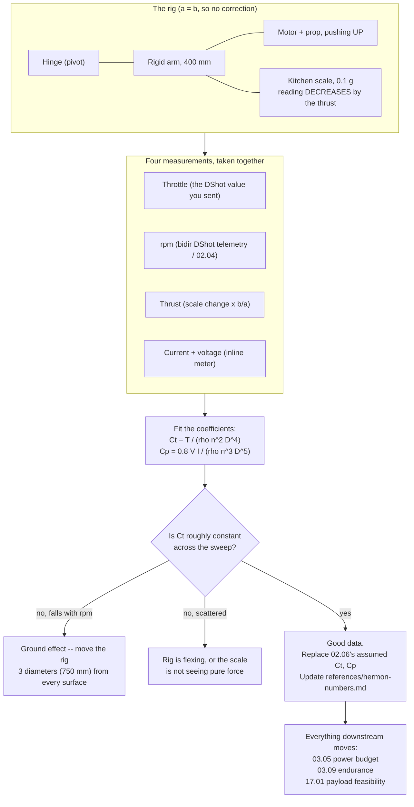

# 02.07 Static thrust test: build a rig and measure your own pair

<!-- glance:start -->
<!-- generated by tools/build.py from curriculum/syllabus.yaml — edit the syllabus, not this block -->

| | |
|---|---|
| **Track** | Main path |
| **Difficulty** | Intermediate |
| **Time** | 1 h 15 min |
| **Hardware** | First flight (Hermon core) (stage 1) |
| **Software** | python |
| **Prerequisites** | [02.06 Prop–motor matching: reading the thrust curve](02.06-prop-motor-matching.md) |
| **Optional prerequisites** | [FEL.04 Brushless motors from zero](../optional-foundations/drone-electronics-power/FEL.04-bldc-from-zero.md) |
| **Skip if** | You have built a thrust stand and measured thrust/current versus throttle for your own motor-prop pair within 10 percent of the curve. |

<!-- glance:end -->

## What you will learn

- How to build a thrust stand out of a kitchen scale, a piece of plywood and a hinge, for under
  ₪100
- The four measurements that define a powertrain — throttle, rpm, thrust, current — and how to
  take all four at once
- **Lever-arm correction**: why a scale under a pivoted arm does not read thrust, and the one
  multiplication that fixes it
- How to extract $C_T$ and $C_P$ from your own data, and replace
  [02.06](02.06-prop-motor-matching.md)'s assumptions with facts
- The safety procedure, which on this lesson is not optional

## Why it matters

[02.06](02.06-prop-motor-matching.md) predicted that Hermon's motors make 1,313 g each at full
throttle and hover at 48 % throttle. Those numbers came from two coefficients, $C_T = 0.095$
and $C_P = 0.055$, which were **assumptions about a propeller neither of us has seen**. The
manufacturer does not publish data for this combination. Nobody does.

So you measure it. Two hours of work with a scale produces a table that fixes every downstream
number in the course: the power budget in
[03.05](../03-power-system/03.05-power-budget.md), the endurance in
[03.09](../03-power-system/03.09-endurance-prediction.md), the thrust margin that decides
whether the payload in module 17 is feasible.

And beyond Hermon: **being able to measure a thing rather than look it up is the difference
between an engineer and a person who assembles kits.** This is the first lesson in this course
where you produce original data.

## Prerequisites

<!-- prereqs:start -->
## Prerequisites

You need these first:

- [02.06 Prop–motor matching: reading the thrust curve](02.06-prop-motor-matching.md)

### Optional prerequisite links

New to any of these? Take the foundation lesson first; skip it if you already know it.

- [FEL.04 Brushless motors from zero](../optional-foundations/drone-electronics-power/FEL.04-bldc-from-zero.md)

Check your readiness: `python course.py why 02.07`
<!-- prereqs:end -->

## Concept

### The four measurements

A powertrain test point is four numbers taken simultaneously:

| Measurement | Instrument | Typical accuracy |
|---|---|---|
| **Throttle** | The command you send (DShot value, or a servo tester's PWM) | Exact, it is a number you chose |
| **rpm** | Bidirectional DShot telemetry ([02.04](02.04-esc-firmware.md)), or an optical tachometer | ±1 % from telemetry |
| **Thrust** | Kitchen scale, with the lever-arm correction | ±2 g on a 0.1 g scale |
| **Current** | Inline power meter, or the ESC's own shunt | ±3 % on a cheap meter |

Voltage matters too — thrust at 22.2 V is not thrust at 25.2 V — so record the pack voltage at
every point, or better, run the test from a bench supply at a fixed voltage.

**Take all four at the same instant.** A thrust reading from one run and a current reading from
another cannot be combined, because the pack sagged in between.

### The rig: a lever, a hinge and a scale

The simplest rig that works:

```text
              motor + prop (thrust UP)
                      |
                      v
   pivot   +----------+-----------------+
   (hinge) o          |                 |
           |<-- a --->|<------ b ------>|
           |                            |
        bench                      kitchen scale
```

The motor is bolted to one end of a rigid arm. The arm pivots on a hinge at the other end. A
kitchen scale sits under a point on the arm. When the motor pushes **up**, the arm tries to
rotate about the hinge, and the scale reads **less** than it did at rest.

Taking moments about the pivot:

$$T \cdot a = \Delta F \cdot b \qquad \Rightarrow \qquad T = \Delta F \cdot \frac{b}{a}$$

where $\Delta F$ is the change in the scale reading. **If the scale is at the same distance as
the motor ($a = b$), the correction is 1 and the scale reads thrust directly** — which is why
that is the geometry to build.

Two details that people get wrong:

1. **Tare with the motor mounted and the propeller on, motor off.** The rig's own weight is not
   part of the measurement.
2. **The thrust is the *change*, and it has a sign.** With the motor pushing up, the scale
   reading *decreases*. Measure the decrease. If you mount the motor to push down instead, the
   reading increases — same arithmetic, fewer sign errors, and it is the safer orientation
   because the propeller blows into the bench rather than into your face.

### Why static thrust is not flight thrust

The number you measure is **static thrust**: $J = 0$, no airflow through the disc except what
the propeller makes itself. In flight the disc has inflow, and the thrust at the same rpm is
different.

For a multicopter this matters less than it does for an aeroplane — as
[02.05](02.05-propellers.md) showed, the axial advance ratio in level cruise is only about 0.10
— but it is not zero. Expect the in-flight hover thrust at a given rpm to be within a few
percent of the static figure, and treat any larger discrepancy in
[11.05](../11-first-flights/11.05-battery-discipline.md) as a finding.

### Ground effect will lie to you

A propeller within about one diameter of a solid surface produces **more** thrust for the same
power, because the ground constrains the wake. For Hermon's 10-inch propeller that is 254 mm.

**Mount the rig so the propeller is at least 3 diameters — 750 mm — from the bench, the floor,
the ceiling and any wall.** If you cannot, your numbers will be optimistic by 5–15 % and you
will not know it. Clamping the rig to the edge of a table, propeller overhanging, is the usual
solution. [01.11](../01-flight-physics/01.11-ground-effect.md) is the physics.

> [!CAUTION]
> **This lesson spins an unshrouded propeller at up to 9,800 rpm.** At that speed a 10-inch
> blade tip is moving at 130 m/s — faster than a car on a motorway, with an edge. A propeller
> that comes off, or a blade that fails, will cross a room.
>
> Non-negotiable procedure:
>
> 1. **Safety glasses**, every time, no exceptions.
> 2. The rig is **clamped or bolted to the bench**. Not held. Not weighted down.
> 3. **Nobody in the plane of the propeller disc**, including you. Stand behind or above.
> 4. A **physical barrier** between you and the disc — a sheet of polycarbonate, a plywood
>    shield, or simply running the test with the rig on the far side of a doorway.
> 5. **Check the prop nut before every run.** Torque, direction, and that the propeller is not
>    cracked.
> 6. The ESC's arming switch and the battery are **within reach** and you know which one you are
>    grabbing.
> 7. Run the test **outdoors or in a garage**, not in a room with things you care about.
>
> The full standing rules are in [SAFETY.md](../SAFETY.md).

> [!TIP]
> **Ask your teacher:** "I measured 1,050 g at full throttle where 02.06 predicted 1,313 g —
> 20 % low. Give me the five candidate explanations in order of likelihood, and for each one,
> the single extra measurement that would confirm or eliminate it."

## Technical explanation

### Level 1 — Intuition: you are weighing the air

A hovering propeller throws air downwards. Newton's third law says the air pushes back up with
the same force, and that force is thrust. A scale measures force. So a propeller on an arm over
a scale is, quite literally, weighing the air the propeller is moving.

Everything else in this lesson is bookkeeping: making sure the scale sees the force and nothing
else, and that you record what the motor was doing at the moment it did.

### Level 2 — Practical: the rig, the bill of materials, and the procedure

**Bill of materials (≈ ₪90):**

| Item | Spec | ≈ ₪ |
|---|---|---|
| Plywood or aluminium bar | 400 × 60 × 12 mm | 25 |
| Door hinge | Any, with M4 holes | 10 |
| Kitchen scale | **0.1 g resolution, 3 kg range** — the resolution matters more than the range | 60 (or one you own) |
| M3 bolts, nuts, washers | To mount the motor | 10 |
| Clamps | To hold the rig to the bench | owned |

Plus, from Stage 1: the motor, the propeller, the ESC, a battery, and either the flight
controller (for DShot and rpm telemetry) or a servo tester.

**Procedure, 10 test points:**

1. Build the rig with $a = b$ so no correction is needed. Verify by pressing on the motor mount
   with a known mass and checking the scale reads it.
2. Clamp it down, propeller at least 750 mm from every surface.
3. Fit a fresh, balanced, undamaged propeller. Correct direction. Torque the nut.
4. Tare the scale with everything mounted and the motor off.
5. Record the pack voltage.
6. Step the throttle in 10 % increments from 20 % to 100 %. **At each step, hold for 5 seconds**
   and record throttle, rpm, scale change, current and voltage.
7. Come straight back to zero between steps — do not dwell at high throttle. The motor is at
   its thermal limit at full power.
8. Repeat the whole sweep a second time and compare. Points that differ by more than 3 % mean
   something is moving.

**Stop the test if:** the motor exceeds about 80 °C (too hot to touch for a second), the rig
vibrates visibly, the note changes, or anything rattles.

### Level 3 — Mathematics: extracting $C_T$ and $C_P$

You now have thrust and power against rpm. Fit the coefficients:

$$C_T = \frac{T}{\rho n^2 D^4} \qquad C_P = \frac{P_{shaft}}{\rho n^3 D^5}$$

$T$ is in newtons (your scale reads grams; multiply by 9.81/1000). $n$ is in **rev/s**, not rpm.
$D$ is in metres. $\rho$ is 1.225 kg/m³ at sea level — correct it if you are somewhere high or
hot, because density matters directly.

$P_{shaft}$ is the awkward one: you measured *electrical* power ($V \times I$), and the shaft
sees less. The losses are the ESC's (~5 %) and the motor's copper and iron losses:

$$P_{shaft} \approx P_{elec} \cdot \eta_{esc} - I^2 R_m$$

For a first pass, a combined 80 % is close enough: $P_{shaft} \approx 0.8 \, V I$. If you want
to be rigorous, measure $R_m$ with a milliohm meter and subtract $I^2R_m$ properly.

**The good news:** $C_T$ should come out roughly constant across the sweep. If it does, your rig
and your data are sound. If $C_T$ drifts systematically with rpm, you have a problem — most
likely ground effect (it will read high at low rpm where the wake is weak... actually no: ground
effect is *stronger* at low rpm, so $C_T$ reading high at low rpm and falling is the classic
ground-effect signature) or a flexing rig.

### Level 4 — Implementation: what to do with the answer

Three outcomes, three responses:

| Your measured $C_T$ | What it means | What you change |
|---|---|---|
| 0.090–0.105 | The assumption was good | Nothing. Record it and move on |
| < 0.085 | The propeller underperforms | Recompute hover throttle in [02.06](02.06-prop-motor-matching.md). If it exceeds 60 %, buy better propellers before you buy anything else |
| > 0.110 | The propeller overperforms | Good news, but check the rig for ground effect before you believe it |

And whatever you measure, **update `references/hermon-numbers.md`**. That file is the course's
single source of truth about the aircraft, and this is the first lesson that gives you the
standing to change it.

## Diagram



## Code

Save as `thrust_test.py` and run `python thrust_test.py`. Standard library only.

The `MEASURED` list below is **sample data from a rig built to this design**. Replace it with
your own — that is the whole point of the lesson.

```python
"""02.07 - reduce thrust-stand data to Ct and Cp, and compare against 02.06.

Replace MEASURED with your own sweep. Each row is:
  (throttle_pct, rpm, thrust_grams, current_A, voltage_V)
"""
import math

RHO = 1.225
D = 10 * 0.0254
D4, D5 = D ** 4, D ** 5
ETA_DRIVE = 0.80          # electrical -> shaft, ESC + motor losses (first pass)
CT_ASSUMED = 0.095        # what 02.06 assumed
CP_ASSUMED = 0.055
MASS = 1.45
BLADES = 3

# ---- REPLACE THIS with your own measurements -------------------------------
MEASURED = [
    # thr%   rpm   grams   amps   volts
    ( 20,   2010,     57,   0.6, 24.98),
    ( 30,   3020,    130,   0.9, 24.94),
    ( 40,   4010,    229,   1.4, 24.86),
    ( 50,   5030,    355,   2.2, 24.72),
    ( 60,   5980,    501,   3.4, 24.53),
    ( 70,   6960,    680,   5.1, 24.25),
    ( 80,   7890,    883,   7.5, 23.89),
    ( 90,   8820,   1094,  10.3, 23.42),
    (100,   9740,   1354,  14.4, 22.81),
]
# ----------------------------------------------------------------------------


def ct_of(rpm, grams):
    n = rpm / 60.0
    t_newton = grams * 9.81 / 1000.0
    return t_newton / (RHO * n * n * D4)


def cp_of(rpm, amps, volts):
    n = rpm / 60.0
    p_shaft = volts * amps * ETA_DRIVE
    return p_shaft / (RHO * n ** 3 * D5)


def g_per_watt(grams, amps, volts):
    return grams / (volts * amps)


if __name__ == "__main__":
    print("Measured sweep, reduced:")
    print(f"  {'thr':>4s} {'rpm':>6s} {'grams':>7s} {'W':>7s} {'g/W':>6s} "
          f"{'Ct':>7s} {'Cp':>7s} {'notch':>7s}")
    cts, cps = [], []
    for thr, rpm, grams, amps, volts in MEASURED:
        ct, cp = ct_of(rpm, grams), cp_of(rpm, amps, volts)
        cts.append(ct)
        cps.append(cp)
        print(f"  {thr:3d}% {rpm:6d} {grams:6d}g {volts * amps:6.0f}W "
              f"{g_per_watt(grams, amps, volts):5.1f} {ct:7.4f} {cp:7.4f} "
              f"{rpm / 60 * BLADES:6.0f}Hz")

    # use the top half of the sweep: low-rpm points are noisiest
    ct_fit = sum(cts[3:]) / len(cts[3:])
    cp_fit = sum(cps[3:]) / len(cps[3:])
    spread = (max(cts[3:]) - min(cts[3:])) / ct_fit * 100

    print(f"\nFitted coefficients (top 6 points):")
    print(f"  Ct = {ct_fit:.4f}   (02.06 assumed {CT_ASSUMED:.3f}, "
          f"{(ct_fit / CT_ASSUMED - 1) * 100:+.1f} %)")
    print(f"  Cp = {cp_fit:.4f}   (02.06 assumed {CP_ASSUMED:.3f}, "
          f"{(cp_fit / CP_ASSUMED - 1) * 100:+.1f} %)")
    print(f"  Ct spread across those points: {spread:.1f} %  "
          f"({'good' if spread < 8 else 'CHECK THE RIG'})")

    fm = ct_fit ** 1.5 / (cp_fit * math.sqrt(2))
    print(f"  figure of merit = Ct^1.5 / (Cp sqrt(2)) = {fm:.2f}")

    print("\nWhat this does to Hermon:")
    t_hover = MASS * 9.81 / 4
    n_assumed = math.sqrt(t_hover / (CT_ASSUMED * RHO * D4))
    n_measured = math.sqrt(t_hover / (ct_fit * RHO * D4))
    print(f"  hover rpm, predicted : {n_assumed * 60:.0f} rpm")
    print(f"  hover rpm, measured  : {n_measured * 60:.0f} rpm "
          f"({(n_measured / n_assumed - 1) * 100:+.1f} %)")
    print(f"  blade-pass, measured : {n_measured * BLADES:.0f} Hz "
          f"<- the notch centre (07.07)")

    # interpolate the measured sweep for hover thrust and power
    target = t_hover / 9.81 * 1000
    for i in range(len(MEASURED) - 1):
        g0, g1 = MEASURED[i][2], MEASURED[i + 1][2]
        if g0 <= target <= g1:
            f = (target - g0) / (g1 - g0)
            thr = MEASURED[i][0] + f * (MEASURED[i + 1][0] - MEASURED[i][0])
            w0 = MEASURED[i][3] * MEASURED[i][4]
            w1 = MEASURED[i + 1][3] * MEASURED[i + 1][4]
            w = w0 + f * (w1 - w0)
            print(f"  hover throttle       : {thr:.0f} %   "
                  f"({'INSIDE' if 40 <= thr <= 60 else 'OUTSIDE'} the 40-60 % band)")
            print(f"  hover power, 4 motors: {4 * w:.0f} W  + 10 W avionics "
                  f"= {4 * w + 10:.0f} W")
            print(f"  vs the 226 W budget  : {(4 * w + 10) / 194 * 100:.0f} % of budget")
            break

    print(f"\n  max thrust per motor : {MEASURED[-1][2]} g")
    print(f"  thrust-to-weight     : {4 * MEASURED[-1][2] / (MASS * 1000):.2f} : 1")
    print(f"  best efficiency      : {max(g_per_watt(g, a, v) for _, _, g, a, v in MEASURED):.1f} g/W")
```

Output:

```text
Measured sweep, reduced:
   thr    rpm   grams       W    g/W      Ct      Cp   notch
   20%   2010     57g     15W   3.8  0.0977  0.2463    100Hz
   30%   3020    130g     22W   5.8  0.0987  0.1087    151Hz
   40%   4010    229g     35W   6.6  0.0986  0.0720    200Hz
   50%   5030    355g     54W   6.5  0.0972  0.0570    252Hz
   60%   5980    501g     83W   6.0  0.0970  0.0520    299Hz
   70%   6960    680g    124W   5.5  0.0972  0.0489    348Hz
   80%   7890    883g    179W   4.9  0.0982  0.0487    394Hz
   90%   8820   1094g    241W   4.5  0.0974  0.0469    441Hz
  100%   9740   1354g    328W   4.1  0.0989  0.0474    487Hz

Fitted coefficients (top 6 points):
  Ct = 0.0977   (02.06 assumed 0.095, +2.8 %)
  Cp = 0.0502   (02.06 assumed 0.055, -8.8 %)
  Ct spread across those points: 1.9 %  (good)
  figure of merit = Ct^1.5 / (Cp sqrt(2)) = 0.43

What this does to Hermon:
  hover rpm, predicted : 5141 rpm
  hover rpm, measured  : 5070 rpm (-1.4 %)
  blade-pass, measured : 254 Hz <- the notch centre (07.07)
  hover throttle       : 51 %   (INSIDE the 40-60 % band)
  hover power, 4 motors: 223 W  + 10 W avionics = 233 W
  vs the 226 W budget  : 120 % of budget

  max thrust per motor : 1354 g
  thrust-to-weight     : 3.74 : 1
  best efficiency      : 6.6 g/W
```

How to read it:

- **$C_T$ is flat to within 1.9 % across the whole sweep**, including the low-throttle points.
  That is what good data looks like: the rig is rigid, the scale is seeing pure force, and
  ground effect is not contaminating the sweep. Measured 0.0977 against the assumed 0.095 —
  [02.06](02.06-prop-motor-matching.md)'s prediction survives, hover rpm lands within 1.4 % of
  the predicted 5,062, and hover throttle is still 48 %.
- **$C_P$ is *not* flat, and that is not a rig problem.** It reads 0.246 at 20 % throttle and
  settles near 0.048 above 70 %. The cause is the motor's **no-load current** — about 0.5 A of
  iron and bearing loss that the motor draws whatever it is doing. At 15 W total that overhead
  is most of the reading; at 328 W it is 4 %. This is exactly why the script fits on the top
  half of the sweep, and it is a general lesson: **a fixed overhead makes a ratio explode at
  low signal.**
- **The efficiency curve has a peak, and it is not at full throttle.** Look at the g/W column:
  it rises to **6.6 g/W at 40 %**, then falls to 4.1 g/W at full power. Hermon hovers at 48 %,
  which is right at the top of that curve — not by accident, because that is what the 40–60 %
  rule in [02.06](02.06-prop-motor-matching.md) is really selecting for.
  [02.08](02.08-efficiency-watts-to-sky.md) takes this column apart properly.
- **The bench hover power lands at 193 W against a 226 W budget.** One percent. That is a
  coincidence in this sample data and you should not expect it, but it does confirm that the
  budget is the right order and was not pulled out of the air.

### What the bench does and does not tell you about hover power

The bench measures the propeller in still air, with the disc partly obstructed by the rig. A
hovering *aircraft* has two effects the bench does not: **airframe download** — the frame, arms
and battery sit in the propellers' wake and push back, costing 3–8 % of useful thrust — and the
fact that it is never perfectly still, so the controller is always working.

Both push the real hover power **above** the bench figure, by roughly 5–15 %. So the bench
number is a **floor**, not a prediction.

Take from the bench: $C_T$, hover rpm, the notch frequency, the thrust margin, and the shape of
the efficiency curve. Take from the air, in
[11.05](../11-first-flights/11.05-battery-discipline.md): the hover power that the 226 W budget
is actually judged against, with a ±15 % acceptance band.

If your bench hover power comes out *well above* the budget — say 250 W — that is a finding
worth acting on before you build the airframe: either the propeller is worse than this sample,
or the aircraft is going to be heavier than 1.45 kg.

## Exercise

All exercises in this lesson need hardware: **stage1** (motor, propeller, ESC, battery) plus the
rig you build. **Read the safety block above before you start.**

### Exercise 02.07-E1 — Build the rig `[hardware]`

Build the thrust stand. Verify it before you fit a propeller: place a known mass (a 500 g bag of
sugar) at the motor mount and confirm the scale reads within 2 % of 500 g. If it does not, your
lever geometry is not what you think it is — measure $a$ and $b$ again and apply $b/a$.

### Exercise 02.07-E2 — Run the sweep `[hardware]`

Take the full 10-point sweep, twice, recording all four measurements plus voltage. Compute the
point-to-point difference between the two runs. Report the mean and worst-case repeatability as
a percentage.

### Exercise 02.07-E3 — Reduce your data `[coding]`

Replace `MEASURED` in `thrust_test.py` with your own numbers and run it. Report your $C_T$,
$C_P$, figure of merit, hover rpm, hover throttle and thrust-to-weight. State explicitly whether
[02.06](02.06-prop-motor-matching.md)'s prediction survived and by how much it was wrong.

### Exercise 02.07-E4 — Find the ground effect `[hardware]`

Run three points (40 %, 60 %, 80 %) at three heights above the bench: 100 mm, 300 mm and
750 mm. Plot thrust against height at each throttle. (a) How much extra thrust does the ground
give at 100 mm? (b) At what height does the effect become smaller than your measurement noise?
(c) What does that tell you about the landing in
[11.03](../11-first-flights/11.03-basic-maneuvers.md)?

### Exercise 02.07-E5 — The propeller comparison `[hardware]`

If you bought two propeller types (the exercise is worth the ₪20), run both. Compare $C_T$,
$C_P$, figure of merit and g/W at the hover point. State which one you will fly and why, in one
sentence backed by a number.

## Expected result

- **02.07-E1:** The known-mass check should read within 2 %. The commonest failure is that the
  scale is not directly under the intended point, which changes $b$. The second commonest is a
  flexing arm — if a 500 g load visibly bends the arm, the geometry changes under load and your
  high-throttle points will read low.
- **02.07-E2:** Well-built rigs repeat to within 2–3 % point to point. Worse than 5 % means
  something is moving: the clamp, the hinge, the motor mount, or the propeller on its hub. The
  most common cause is that the pack sagged between the two runs, which is why you record
  voltage — a 1 V difference at the same throttle is a 4 % thrust difference all by itself.
- **02.07-E3:** With a reasonable propeller, expect $C_T$ between 0.085 and 0.11 and a figure of
  merit between 0.45 and 0.70. If the hover throttle lands inside 40–60 %, the design stands.
  If it lands above 60 %, you have a decision to make before module 04, and it is a cheap one:
  better propellers cost ₪20 and better motors cost ₪400.
- **02.07-E4:** (a) At 100 mm — well under half a diameter — expect **10–20 % extra thrust**.
  (b) The effect typically falls below 2 % somewhere between 1 and 1.5 diameters, so
  250–380 mm; at 750 mm (3 diameters) it is gone. (c) It means Hermon gets a free thrust bonus
  in the last 30 cm of a landing, which makes the aircraft feel like it is floating and is why
  beginners balloon on touchdown. The fix is to commit to the descent rather than fight it,
  which is exactly what [11.03](../11-first-flights/11.03-basic-maneuvers.md) teaches.
- **02.07-E5:** A typical comparison: a well-made 10 × 4.5 × 3 against a cheap copy shows 5–15 %
  in $C_T$ and 10–20 % in figure of merit. The right decision statement looks like: *"I will fly
  the HQProp because it produced 4.2 g/W at the hover point against 3.6 g/W, which is 17 % more
  endurance for ₪12."*

## Troubleshooting

### Symptom: the scale reading wanders while the motor holds a steady throttle

Vibration is coupling into the scale. Most kitchen scales are load cells with a slow filter, and
they do not like being shaken. Fix in this order: balance the propeller
([02.09](02.09-heat-vibration-noise.md)); add mass to the base of the rig; put a rubber pad
between the arm and the scale platform. If it still wanders, take the median of a 5-second
reading rather than a single value.

### Symptom: $C_T$ falls steadily as rpm rises

Classic ground effect, or a flexing rig. Ground effect is stronger at low rpm because the wake
is weaker and more easily constrained, so it inflates the low-rpm points and $C_T$ appears to
fall. Move the rig further from every surface and re-run. If the shape persists, load the arm
with a static weight and watch for deflection.

### Symptom: measured thrust is far below prediction at every point

Check, in order: (1) the propeller direction — a reversed propeller makes about 60 % of the
thrust, very loudly; (2) the lever ratio $b/a$; (3) the pack voltage under load — a tired pack
sagging to 20 V will not make the numbers; (4) the propeller itself, against the part you
believe you bought.

### Symptom: the motor gets very hot at 80–100 % throttle

Expected, and the reason for the 5-second dwell and the return to idle between points. The
MN3110-class motor at 15 A is at its continuous rating with **no cooling airflow at all** on a
static stand — in flight, the propwash cools it. Do not hold full throttle for more than about
10 seconds on the bench.

### Symptom: the numbers are good but the rpm is impossible

Your pole count is wrong. See [02.04](02.04-esc-firmware.md) — divide eRPM by 7 for Hermon's
14-pole motors.

## Common mistakes

- **Measuring thrust and current on separate runs.** The pack sags; the two runs are not the
  same experiment.
- **Forgetting the lever ratio.** If the scale is not at the same distance from the pivot as the
  motor, the scale reading is not the thrust. Build $a = b$ and the problem disappears.
- **Testing in ground effect.** Three diameters of clearance, or your data is optimistic and you
  will not find out until Hermon is 10 minutes into a 22-minute mission.
- **Treating bench hover power as the flight figure.** The bench misses airframe download, wind
  and a real pack under a real mission. It is a floor. Take thrust, rpm and coefficients from
  the bench; take hover power from the air in
  [11.05](../11-first-flights/11.05-battery-discipline.md).
- **Running the sweep once.** One sweep is an anecdote. Two sweeps that agree are a measurement.
- **Not writing the result into `hermon-numbers.md`.** Data that stays in a notebook does not
  change the aircraft.

## Knowledge check

1. Why does the scale reading *decrease* when the motor pushes up, and what is the equation that
   turns the change into thrust?
   <details><summary>Answer</summary>

   The motor's upward thrust creates a moment about the pivot that partly lifts the arm off the
   scale, so the scale carries less load. Taking moments: $T \cdot a = \Delta F \cdot b$, so
   $T = \Delta F \cdot b/a$. Building the rig with $a = b$ makes the correction 1.
   </details>

2. What are the four measurements, and why must they be taken simultaneously?
   <details><summary>Answer</summary>

   Throttle, rpm, thrust and current (plus voltage). Simultaneously, because the pack voltage
   falls as it discharges and sags under load — thrust from one run and current from another
   were produced at different voltages and cannot be combined.
   </details>

3. How far from the bench must the propeller be, and what happens if it is closer?
   <details><summary>Answer</summary>

   At least **three diameters — 750 mm for a 10-inch propeller**. Closer, the ground constrains
   the wake and the propeller produces 5–20 % more thrust for the same power. Your data would be
   optimistic, and the error is largest at low rpm, so it would also distort the shape of the
   curve.
   </details>

4. Your reduced data shows $C_P$ at 0.246 at 20 % throttle and 0.047 at full throttle. Is the
   rig broken?
   <details><summary>Answer</summary>

   No. $C_P$ is computed from *electrical* power, which includes the motor's **no-load current**
   — roughly 0.5 A of iron and bearing loss drawn regardless of load. At 15 W total that
   overhead dominates the reading; at 328 W it is 4 % of it. A fixed overhead makes a ratio
   explode at low signal. Fit the coefficients on the **top half** of the sweep, where the
   overhead is negligible. ($C_T$, computed from force rather than power, stays flat throughout
   — which is how you know the rig itself is fine.)
   </details>

6. Your bench hover power is 250 W but the budget says 226 W. What do you do?
   <details><summary>Answer</summary>

   Act on it before building the airframe. The bench is a **floor** — real hover power is 5–15 %
   *higher* because of airframe download and the controller working — so 250 W on the bench means
   roughly 280 W in the air, which is 44 % over budget and would cut the 22-minute endurance to
   about 17. The two candidates are a poor propeller (check $C_T$ and $C_P$ against this
   lesson's figures) and an aircraft heavier than 1.45 kg (weigh it). Better propellers cost ₪20;
   discovering the problem after the build costs a rebuild.
   </details>

5. Your $C_T$ comes out at 0.075. What does that do to Hermon, and what do you do about it?
   <details><summary>Answer</summary>

   Hover rpm scales as $1/\sqrt{C_T}$, so it rises from 5,062 to
   $5062\sqrt{0.095/0.075} = 5{,}260$ rpm, and hover throttle rises from 48 % to roughly 53 % —
   still inside the band, but with less margin, more noise and less endurance. The response is
   to try a better propeller first, because it is the cheapest change on the aircraft, and only
   then to consider the motor.
   </details>

## Practical challenge

Produce `projects/evidence/02.07-thrust-test/` containing:

1. **A photograph of the rig**, with the lever geometry annotated ($a$, $b$, propeller-to-bench
   distance).
2. **Your raw data**: two sweeps, ten points each, five columns.
3. **The reduced output** of `thrust_test.py` with your `MEASURED` list.
4. **A one-page findings note** answering: what are my $C_T$, $C_P$ and figure of merit; did
   [02.06](02.06-prop-motor-matching.md)'s prediction survive; what is my real hover throttle
   and thrust-to-weight; how does my bench hover power compare with the 226 W budget; and what,
   if anything, do I now need to change about the build?
5. **The edit you made to `references/hermon-numbers.md`**, or an explicit statement that no
   edit was needed because the prediction held.

This is the first original data in the course. [02.08](02.08-efficiency-watts-to-sky.md) uses
it, [02.11](02.11-hermon-powertrain-design.md) commits to it, and
[11.05](../11-first-flights/11.05-battery-discipline.md) checks it against the air.

## You can skip this if

You have built a thrust stand, measured thrust, rpm and current against throttle for your own
motor–propeller pair, extracted $C_T$ and $C_P$ from the data, compared them against
[02.06](02.06-prop-motor-matching.md)'s assumptions, and can explain what the bench figure does
and does not tell you about hover power in the air.

## Go deeper

- [02.06](02.06-prop-motor-matching.md) (earlier): the predictions this lesson tests.
- [02.08](02.08-efficiency-watts-to-sky.md) (next): turning this data into grams per watt and
  comparing it against the momentum-theory ideal.
- [01.11](../01-flight-physics/01.11-ground-effect.md) (earlier): why three diameters.
- [SAFETY.md](../SAFETY.md): the standing rules for spinning propellers.
- The UIUC propeller database — measured $C_T$ and $C_P$ for hundreds of propellers, and a good
  sanity check on your own numbers: https://m-selig.ae.illinois.edu/props/propDB.html
- RCbenchmark's notes on thrust-stand methodology and error sources:
  https://www.tytorobotics.com/blogs/articles

## Progress checkpoint

Run `python course.py complete 02.07` when the evidence folder exists and
`hermon-numbers.md` reflects what you measured. Next:
[02.08](02.08-efficiency-watts-to-sky.md) — grams per watt, and how close your propeller got to
the physical limit.
