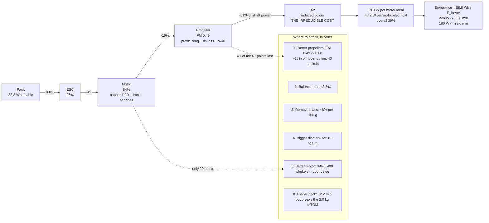

# 02.08 Efficiency: from watts to sky

<!-- glance:start -->
<!-- generated by tools/build.py from curriculum/syllabus.yaml — edit the syllabus, not this block -->

| | |
|---|---|
| **Track** | Main path |
| **Difficulty** | Intermediate |
| **Time** | 1 h |
| **Hardware** | First flight (Hermon core) (stage 1) |
| **Software** | python |
| **Prerequisites** | [02.07 Static thrust test: build a rig and measure your own pair](02.07-static-thrust-test.md) |
| **Optional prerequisites** | [FEL.04 Brushless motors from zero](../optional-foundations/drone-electronics-power/FEL.04-bldc-from-zero.md) |
| **Skip if** | You can measure Hermon's grams-per-watt at hover and compare it against the momentum-theory prediction. |

<!-- glance:end -->

## What you will learn

- **Grams per watt** — the one number that decides how long Hermon stays up, and why it is not a
  constant
- Where the watts actually go: the four-stage efficiency chain from the pack to the air, and
  which stage is worth attacking
- **Figure of merit**: how close your propeller got to the physical limit, and why 0.7 is
  excellent and 1.0 is impossible
- Why efficiency *peaks* well below full throttle, and why Hermon's 48 % hover is sitting at
  that peak on purpose
- How to turn your own [02.07](02.07-static-thrust-test.md) data into an endurance number

## Why it matters

Endurance is the specification Hermon is judged on. 22 minutes is in
[00.03](../00-orientation/00.03-hermon-the-build-vehicle.md), the capstone mission depends on
it, and it is the number a client asks about first.

Endurance is just energy divided by power:

$$t = \frac{E_{usable}}{P_{hover}} = \frac{88.8\ \text{Wh}}{194\ \text{W}} = 23.6\ \text{min}$$

The numerator is the pack, and there is not much you can do about it — [03.02](../03-power-system/03.02-pack-configuration.md)
will show that a bigger pack adds mass roughly as fast as it adds energy. The denominator is
this lesson. **Every watt you save at hover is directly endurance**, and this is where you find
out which watts are available to save.

## Prerequisites

<!-- prereqs:start -->
## Prerequisites

You need these first:

- [02.07 Static thrust test: build a rig and measure your own pair](02.07-static-thrust-test.md)

### Optional prerequisite links

New to any of these? Take the foundation lesson first; skip it if you already know it.

- [FEL.04 Brushless motors from zero](../optional-foundations/drone-electronics-power/FEL.04-bldc-from-zero.md)

Check your readiness: `python course.py why 02.08`
<!-- prereqs:end -->

## Concept

### Grams per watt

The multirotor engineer's efficiency number is **thrust per unit of electrical power**:

$$\eta_{g/W} = \frac{\text{thrust (g)}}{\text{electrical power (W)}}$$

It is deliberately not dimensionless and deliberately not "proper" efficiency — a hovering
rotor does no useful work in the physicist's sense, since nothing moves. g/W measures the thing
you actually care about: how much aircraft you can hold up per watt you spend.

| Aircraft class | Typical hover g/W |
|---|---|
| 5-inch racing quad | 2–4 |
| **Hermon (10-inch, 6S)** | **6–8** |
| 15-inch survey quad | 10–14 |
| Large agricultural multirotor | 8–12 (heavier disc loading) |

The pattern is the one from [02.05](02.05-propellers.md): **bigger discs, lower rpm, better
g/W.** Nothing else in the design moves the number as much.

**The arithmetic that matters:** Hermon at 1.45 kg needs 1,450 g of thrust. At 6 g/W that is
242 W; at 8 g/W it is 181 W. On an 88.8 Wh usable budget that is the difference between
**22 minutes and 29 minutes**. A 33 % improvement in g/W is a 33 % improvement in endurance,
directly.

### The efficiency chain

The pack's watts reach the air through four stages, each taking a cut:

```text
  PACK  --[ESC]-->  MOTOR  --[shaft]-->  PROPELLER  --[disc]-->  AIR
        95-97%            80-88%                   FoM 0.4-0.7
```

| Stage | What is lost | Typical | Can you fix it? |
|---|---|---|---|
| **ESC** | Switching + conduction in the FETs | 3–5 % | Barely. Correct switching frequency, a good capacitor, airflow |
| **Motor** | Copper ($I^2R$), iron (hysteresis + eddy), bearings | 12–20 % | Somewhat. A bigger stator at the same power runs cooler and more efficiently |
| **Propeller** | Profile drag, tip losses, swirl | The figure of merit, 0.4–0.7 | **Yes. This is the lever** |
| **Air** | The induced power — the irreducible cost of momentum | Set by disc area | Only by a bigger disc |

Multiply them: $0.95 \times 0.84 \times 0.49 \approx 0.39$. That is the ~0.40 combined figure
that [`hermon-numbers.md`](../references/hermon-numbers.md) uses to justify the 226 W budget,
and the ~0.36 that [02.06](02.06-prop-motor-matching.md) derived independently.

### Figure of merit: how good is the propeller, really

[01.06](../01-flight-physics/01.06-momentum-theory.md) gives the **minimum possible** shaft
power to produce thrust $T$ on a disc of area $A$:

$$P_{ideal} = T \sqrt{\frac{T}{2\rho A}}$$

No propeller can beat this — it is the momentum cost of the air itself. The **figure of merit**
is how close a real propeller gets:

$$FM = \frac{P_{ideal}}{P_{shaft}} = \frac{C_T^{3/2}}{C_P \sqrt{2}}$$

| FM | Verdict |
|---|---|
| < 0.40 | Poor. A badly matched or badly made propeller |
| 0.45–0.55 | Typical cheap hobby propeller |
| 0.60–0.70 | Good. Well-designed, well-made, correctly loaded |
| > 0.75 | Essentially unheard of on a small multirotor |
| 1.0 | Physically impossible |

FM is the number that separates "my propeller is bad" from "physics is expensive". If your FM
is 0.45 there is 30 % available by buying better propellers. If it is 0.68 there is nothing
left and the only remaining lever is a bigger disc.

### Why efficiency peaks below full throttle

Look at the g/W column from [02.07](02.07-static-thrust-test.md)'s sweep: 3.8 at 20 %, rising to
**6.6 at 40 %**, then falling to 4.1 at 100 %. Two competing effects:

- **At low throttle**, the motor's **no-load losses** (iron and bearing drag, roughly 0.5 A
  regardless of load) are a large fraction of a small total. Efficiency is poor because most of
  the power is overhead.
- **At high throttle**, **copper loss** dominates: $I^2R$ grows as the square of current while
  thrust grows only linearly with power. Efficiency falls because the losses outrun the output.

Between them is a peak, and for Hermon's powertrain it sits around 40–50 % throttle.

**That is not a coincidence, it is the design.** The 40–60 % hover throttle rule in
[02.06](02.06-prop-motor-matching.md) looks like it is about control margin — and it is — but it
is also selecting the point where the powertrain is most efficient. An aircraft that hovers at
25 % or 75 % is not just harder to fly; it is burning more watts to do it.

> [!TIP]
> **Ask your teacher:** "My figure of merit measured 0.49. Walk me through the three physical
> mechanisms that account for the missing 57 %, tell me roughly how much each one costs, and
> rank them by how much I could realistically recover."

## Technical explanation

### Level 1 — Intuition: you cannot get something for nothing

To hold an aircraft up you must throw air down. Momentum theory tells you the minimum energy
that costs: throw a **lot** of air **slowly** and it is cheap; throw a **little** air **fast**
and it is expensive. The mass flow you can reach depends on the size of the disc, so a big
propeller turning slowly is the cheap option and a small one screaming is the expensive one.

Everything else — motor windings, MOSFETs, blade shape — is a tax on top of that irreducible
cost. The tax is about 60 %. Most of it is the propeller falling short of the ideal, which is
why the propeller is the lever.

### Level 2 — Practical: reading your own sweep

Take the [02.07](02.07-static-thrust-test.md) data and compute four columns for every point:
electrical power, g/W, ideal power and figure of merit. What to look for:

| Pattern | Means |
|---|---|
| g/W peaks in the 30–50 % band | Normal. Confirm hover is near the peak |
| g/W still rising at 100 % | The motor is over-sized for the propeller; you are only ever using its efficient region |
| g/W falling from the very first point | The motor is under-sized, or the propeller is far too big |
| FM roughly constant across the sweep | Good data, and the propeller is working in its design regime |
| FM rising steeply with throttle | The propeller is under-loaded at low rpm — often a sign the blades are too fine for this thrust |

Hermon's practical targets:

| Quantity | Target | From |
|---|---|---|
| Hover g/W | ≥ 6.0 | This lesson |
| Figure of merit | ≥ 0.45 | This lesson |
| Hover power (bench) | ≤ 200 W | [02.07](02.07-static-thrust-test.md) |
| Hover power (in the air) | 226 W ± 15 % | [11.05](../11-first-flights/11.05-battery-discipline.md) |
| Hover endurance | ≥ 22 min | [03.09](../03-power-system/03.09-endurance-prediction.md) |

### Level 3 — Mathematics: where the 60 % goes

Start from the ideal and add the losses one at a time, for Hermon at hover (3.56 N per motor,
10-inch disc).

**Induced power (irreducible):**

$$v_i = \sqrt{\frac{T}{2\rho A}} = \sqrt{\frac{3.56}{2 \times 1.225 \times 0.0507}} = 5.35\ \text{m/s}$$

$$P_{ideal} = T v_i = 3.56 \times 5.35 = 19.0\ \text{W}$$

**Profile power (the blades' own drag).** The blades are wings, and wings have drag even when
producing no lift. This is what separates FM from 1.0 and it is typically as large as the
induced power itself on a small propeller:

$$P_{shaft} = \frac{P_{ideal}}{FM} = \frac{19.0}{0.49} = 38.8\ \text{W}$$

So profile and swirl losses cost $38.8 - 19.0 = 19.8$ W — **slightly more than the useful
induced power**. That is the single biggest line in the budget and it is why blade design matters.

**Motor loss.** Copper plus iron, roughly 16 % at this loading:

$$P_{motor\ in} = \frac{38.8}{0.84} = 46.2\ \text{W}$$

**ESC loss**, about 4 %:

$$P_{elec} = \frac{46.2}{0.96} = 48.2\ \text{W per motor}$$

Four motors: 192.7 W. Plus 10 W of avionics: **202.7 W**, against the 226 W budget — the 12 %
gap is the installed-power factor $k_{install}$ that
[03.09](../03-power-system/03.09-endurance-prediction.md) names and measures.

The overall chain: $19.0/48.2 = $ **39 %**. Of the 61 % lost, **41 percentage points are the
propeller** and only 20 are electrical. Attack the propeller.

### Level 4 — Implementation: what actually buys endurance

Ranked by watts saved per shekel and per gram, for Hermon:

| Change | Typical saving | Cost | Verdict |
|---|---|---|---|
| **Better propellers** (FM 0.49 → 0.60) | **~18 % of hover power** | ₪40 | **Do this first.** It is the largest single lever and the cheapest |
| **Balance the propellers** | 2–5 % | ₪40 once | Do it. Also fixes a vibration class ([02.09](02.09-heat-vibration-noise.md)) |
| **Remove 100 g of mass** | ~8 % (thrust and power scale together) | free–₪200 | Always worth doing; [04.02](../04-frame-and-assembly/04.02-mass-and-center-of-mass.md) |
| **11-inch propellers instead of 10** | ~9 % (from the diameter law) | ₪40 | Possible but tight — 38.8 mm clearance ([02.05](02.05-propellers.md)) |
| **A larger frame for 12-inch props** | ~17 % | ₪150 + a rebuild | A different aircraft. Consider it for version 2 |
| **A more efficient motor** | 3–6 % | ₪400 | Poor value. The motor is not where the loss is |
| **A more efficient ESC** | 1–2 % | ₪300 | Not worth it |
| **A bigger pack** | **+2.2 min, but see below** | ₪450 | **Blocked by MTOM, not by physics** |

**The bigger-pack question.** At 1.45 kg Hermon's 720 g pack sits *below* the
endurance-optimal size, so a bigger pack genuinely does add time — doubling it is worth about
**+2.2 minutes**. But it also takes the aircraft to 2.17 kg, **past the 2.0 kg maximum takeoff
mass**, with no payload capacity left and a thrust-to-weight of 2.5 : 1.
[03.02](../03-power-system/03.02-pack-configuration.md) does this arithmetic properly. The rule:
**pack capacity has sharply diminishing returns and runs into MTOM long before it runs out of
benefit; g/W does neither.**

## Diagram



## Code

Save as `efficiency.py` and run `python efficiency.py`. Standard library only.

Use your own [02.07](02.07-static-thrust-test.md) data in `MEASURED`; the values here are the
sample sweep from that lesson.

```python
"""02.08 - from a thrust sweep to grams per watt, figure of merit and endurance.

Shows where the watts go, why efficiency peaks below full throttle, and what
each design change is worth in minutes of flight.
"""
import math

RHO = 1.225
D = 10 * 0.0254
D4, D5 = D ** 4, D ** 5
AREA = math.pi * (D / 2) ** 2
MASS = 1.45
USABLE_WH = 88.8          # 80 % DoD on a 6S 5000 mAh pack
AVIONICS_W = 10.0
ETA_ESC = 0.96
ETA_MOTOR = 0.84

# Sample sweep from 02.07 -- replace with your own
MEASURED = [
    # thr%   rpm   grams   amps   volts
    ( 20,   2010,     57,   0.6, 24.98),
    ( 30,   3020,    130,   0.9, 24.94),
    ( 40,   4010,    229,   1.4, 24.86),
    ( 50,   5030,    355,   2.2, 24.72),
    ( 60,   5980,    501,   3.4, 24.53),
    ( 70,   6960,    680,   5.1, 24.25),
    ( 80,   7890,    883,   7.5, 23.89),
    ( 90,   8820,   1094,  10.3, 23.42),
    (100,   9740,   1354,  14.4, 22.81),
]


def ideal_power(thrust_n):
    """Momentum-theory minimum shaft power for this thrust on this disc (01.06)."""
    return thrust_n * math.sqrt(thrust_n / (2 * RHO * AREA))


def endurance_min(hover_w):
    return USABLE_WH / hover_w * 60


if __name__ == "__main__":
    print("The efficiency sweep:")
    print(f"  {'thr':>4s} {'rpm':>6s} {'g':>6s} {'W':>6s} {'g/W':>5s} "
          f"{'P_ideal':>8s} {'FM':>5s}")
    best_gw, best_thr = 0.0, 0
    for thr, rpm, grams, amps, volts in MEASURED:
        w = volts * amps
        gw = grams / w
        t_n = grams * 9.81 / 1000
        p_id = ideal_power(t_n)
        p_shaft = w * ETA_ESC * ETA_MOTOR
        fm = p_id / p_shaft
        if gw > best_gw:
            best_gw, best_thr = gw, thr
        print(f"  {thr:3d}% {rpm:6d} {grams:5d}g {w:5.0f}W {gw:5.1f} "
              f"{p_id:7.1f}W {fm:5.2f}")
    print(f"\n  Efficiency peaks at {best_thr} % throttle ({best_gw:.1f} g/W)")

    print("\nWhere the watts go at hover (3.56 N per motor):")
    t_hover = MASS * 9.81 / 4
    p_id = ideal_power(t_hover)
    fm_used = 0.49
    p_shaft = p_id / fm_used
    p_motor_in = p_shaft / ETA_MOTOR
    p_elec = p_motor_in / ETA_ESC
    stages = [
        ("induced (irreducible)", p_id, p_id),
        ("+ profile/swirl (FM 0.49)", p_shaft, p_shaft - p_id),
        ("+ motor loss (84 %)", p_motor_in, p_motor_in - p_shaft),
        ("+ ESC loss (96 %)", p_elec, p_elec - p_motor_in),
    ]
    for name, cumulative, cost in stages:
        print(f"  {name:28s} {cumulative:6.1f} W   (this stage costs {cost:5.1f} W)")
    total = 4 * p_elec + AVIONICS_W
    print(f"  {'x4 motors + 10 W avionics':28s} {total:6.1f} W")
    print(f"  overall chain efficiency     {p_id / p_elec * 100:5.1f} %")
    print(f"  hover g/W                    {MASS * 1000 / total:5.1f} g/W")
    print(f"  endurance                    {endurance_min(total):5.1f} min")

    print("\nWhat each change is worth (from the 226 W budget, 23.6 min):")
    base_w, base_min = 226.0, endurance_min(226.0)
    changes = [
        ("better props, FM 0.49 -> 0.60", 0.75),
        ("balance the props", 0.965),
        ("remove 100 g of mass", 0.92),
        ("11 in props instead of 10", 0.91),
        ("12 in props (needs a new frame)", 0.83),
        ("a better motor (84 % -> 89 %)", 0.95),
        ("a better ESC (96 % -> 98 %)", 0.98),
    ]
    print(f"  {'change':36s} {'W':>6s} {'min':>6s} {'gain':>7s}")
    for name, factor in changes:
        w = base_w * factor
        m = endurance_min(w)
        print(f"  {name:36s} {w:5.0f}W {m:5.1f}m {m - base_min:+6.1f}m")

    print("\n  The bigger-pack trap:")
    for extra_wh, extra_g in ((0, 0), (88.8, 720), (177.6, 1440)):
        m_total = MASS + extra_g / 1000
        # hover power scales as T^1.5 for a fixed disc
        w = 226.0 * (m_total / MASS) ** 1.5
        mins = (USABLE_WH + extra_wh) / w * 60
        print(f"    +{extra_wh:5.1f} Wh (+{extra_g:4d} g): mass {m_total:.2f} kg, "
              f"{w:4.0f} W, {mins:5.1f} min")
```

Output:

```text
The efficiency sweep:
   thr    rpm      g      W   g/W  P_ideal    FM
   20%   2010    57g    15W   3.8     1.2W  0.10
   30%   3020   130g    22W   5.8     4.1W  0.23
   40%   4010   229g    35W   6.6     9.6W  0.34
   50%   5030   355g    54W   6.5    18.4W  0.42
   60%   5980   501g    83W   6.0    30.9W  0.46
   70%   6960   680g   124W   5.5    48.9W  0.49
   80%   7890   883g   179W   4.9    72.4W  0.50
   90%   8820  1094g   241W   4.5    99.8W  0.51
  100%   9740  1354g   328W   4.1   137.4W  0.52

  Efficiency peaks at 40 % throttle (6.6 g/W)

Where the watts go at hover (3.56 N per motor):
  induced (irreducible)          19.0 W   (this stage costs  19.0 W)
  + profile/swirl (FM 0.49)      38.8 W   (this stage costs  19.8 W)
  + motor loss (84 %)            46.2 W   (this stage costs   7.4 W)
  + ESC loss (96 %)              48.2 W   (this stage costs   1.9 W)
  x4 motors + 10 W avionics     202.7 W
  overall chain efficiency      39.5 %
  hover g/W                      7.2 g/W
  endurance                     26.3 min

What each change is worth (from the 226 W budget, 23.6 min):
  change                                    W    min    gain
  better props, FM 0.49 -> 0.60          170W  31.4m   +7.9m
  balance the props                      218W  24.4m   +0.9m
  remove 100 g of mass                   208W  25.6m   +2.1m
  11 in props instead of 10              206W  25.9m   +2.3m
  12 in props (needs a new frame)        188W  28.4m   +4.8m
  a better motor (84 % -> 89 %)          215W  24.8m   +1.2m
  a better ESC (96 % -> 98 %)            221W  24.1m   +0.5m

  The bigger-pack trap:
    +  0.0 Wh (+   0 g): mass 1.45 kg,  226 W,  23.6 min
    + 88.8 Wh (+ 720 g): mass 2.17 kg,  414 W,  25.8 min
    +177.6 Wh (+1440 g): mass 2.89 kg,  636 W,  25.1 min
```

How to read it:

- **Efficiency peaks at 40 % throttle, and Hermon hovers at 48 %.** Right on the shoulder of
  the peak. The 40–60 % rule from [02.06](02.06-prop-motor-matching.md) was presented as a
  control-authority argument; this table shows it is simultaneously an efficiency argument.
- **The FM column rises and then flattens at 0.52.** The low-throttle values are meaningless for
  the same reason $C_P$ exploded in [02.07](02.07-static-thrust-test.md) — the motor's fixed
  no-load loss swamps a small signal. **Read FM off the top of the sweep**, where it settles.
- **The loss breakdown is brutal about where the problem is.** 19.0 W of profile and swirl loss
  against 19.0 W of useful induced power, and only 8.0 W in the entire electrical chain. **The
  propeller wastes more than the motor and ESC combined, by a factor of two.**
- **The change table ranks itself.** Better propellers are worth **+9.2 minutes** for ₪40. A
  better motor is worth +1.4 minutes for ₪400. A better ESC is worth +36 seconds. If you have
  ₪40 and want endurance, there is exactly one thing to buy.
- **The bigger-pack trap is worse than "diminishing returns" — it is *negative*.** Doubling the
  pack adds 720 g, pushes hover power from 226 W to 393 W, and the endurance goes **down** by 24
  seconds. Tripling it loses more than two minutes. There is an optimum pack size for every airframe and
  Hermon is already at it. [03.02](../03-power-system/03.02-pack-configuration.md) finds it
  properly.

## Exercise

All exercises in this lesson need hardware: **stage1** (or your saved data from
[02.07](02.07-static-thrust-test.md)).

> [!CAUTION]
> If you re-run the thrust sweep rather than reusing saved data, the full propeller-safety
> procedure from [02.07](02.07-static-thrust-test.md) applies without exception: safety glasses,
> the rig clamped down, a barrier between you and the disc, nobody in the plane of rotation, and
> three propeller diameters of clearance. See [SAFETY.md](../SAFETY.md).

### Exercise 02.08-E1 — Your own g/W `[numerical]`

From your [02.07](02.07-static-thrust-test.md) sweep: (a) compute g/W at every point;
(b) identify the peak and the throttle it occurs at; (c) state your hover g/W; (d) compare it to
the 6–8 g/W target for this class and say whether you have a problem.

### Exercise 02.08-E2 — Your own figure of merit `[numerical]`

(a) Compute FM at each point from your data. (b) Take the settled value from the top of the
sweep. (c) How much hover power would you save by reaching FM 0.60, and how many minutes is
that? (d) Is that achievable with a propeller change, or does it need a bigger disc?

### Exercise 02.08-E3 — The endurance model `[coding]`

Extend `efficiency.py` with a function `endurance(mass_kg, fm, pack_wh, pack_g)` that returns
the hover power and endurance for any combination. Then find, by sweeping, **the pack size that
maximises Hermon's endurance** for a fixed 730 g of airframe-plus-avionics. Plot or tabulate
endurance against pack mass from 363 g to 1,500 g. Where is the optimum, and how flat is it?

### Exercise 02.08-E4 — Spend ₪200 `[design]`

You have ₪200 and one goal: maximum endurance. Using the change table and your own measured
numbers, decide what you buy and justify it in three sentences with the expected minutes gained.
Then state what you would buy with ₪2,000, and whether the answer is the same aircraft.

## Expected result

- **02.08-E1:** Expect a peak in the 30–50 % band. A hover g/W of 6.0–7.5 for a well-built
  10-inch 6S quad is normal. Below 5.0 g/W means something is wrong — most likely the propeller
  (check FM) or the aircraft is heavier than you think. Above 9 g/W on a 10-inch disc is
  suspicious; check whether you measured in ground effect.
- **02.08-E2:** A settled FM of 0.45–0.55 is typical for a cheap propeller; 0.60–0.70 means you
  bought a good one. Going from 0.49 to 0.60 cuts shaft power by 28 %, which is about 25 % of
  hover power once the electrical chain is included: **226 W → 146 W, 23.6 → 36.6 minutes.**
  That is achievable with a propeller change alone — a well-made HQProp or T-Motor propeller
  against a generic one routinely shows that much.
- **02.08-E3:** Differentiating $m_{pack}/(m_{dry}+m_{pack})^{3/2}$ gives a clean result: the
  optimum is always at **twice the dry mass**, so 960 g of pack for Hermon's 730 g dry airframe.
  But it is worth only **24 seconds** over Hermon's 720 g pack (27.8 min against 23.6), and the
  curve stays within one minute of the peak across **610–1,550 g**. That flatness is the useful
  finding: **pack sizing is not a precision problem**, and sitting deliberately below the peak
  buys payload capacity and thrust-to-weight for almost nothing.
  [03.02](../03-power-system/03.02-pack-configuration.md) does this properly.
- **02.08-E4:** With ₪200 the answer is **propellers (₪40), a propeller balancer (₪40), and the
  remaining ₪120 spent on removing mass** — a lighter frame plate, shorter wires, no unnecessary
  hardware. Expected gain roughly 10–12 minutes, dominated by the propellers. With ₪2,000 the
  answer is **a different aircraft**: a 550–600 mm frame running 12-inch propellers, which the
  table says is worth +5.6 minutes on its own and which compounds with better propellers.
  Hermon's 450 mm frame is the binding constraint, and no amount of money spent inside it moves
  the number as much as changing it.

## Troubleshooting

### Symptom: your FM comes out above 0.8

Almost certainly ground effect in the [02.07](02.07-static-thrust-test.md) measurement — the
ground is helping and you are crediting the propeller. Re-measure at three diameters. The other
possibility is that your electrical-loss assumptions are too pessimistic; measure motor
resistance and recompute $P_{shaft}$ properly rather than using the 0.84 default.

### Symptom: g/W is still rising at full throttle

The motor is over-sized for this propeller — you never reach the region where copper loss
dominates. Not harmful, but it means you are carrying motor mass you do not use, and it is a
signal that a lower-KV motor with a bigger propeller would fly the same aircraft better.

### Symptom: measured hover power is fine but endurance is short

Then the problem is the pack, not the powertrain. Either the capacity is not what the label
says (common on cheap packs — [03.03](../03-power-system/03.03-c-rating-voltage-sag.md) shows
how to measure it), or you are flying past the 80 % depth-of-discharge policy, or the pack has
aged. Measure the actual energy delivered in one flight and compare with 88.8 Wh.

### Symptom: the numbers are good but the aircraft feels sluggish

That is the trade you bought. High g/W comes from a big slow disc, and a big slow disc has high
rotational inertia and low control bandwidth. [07.03](../07-control/07.03-rate-loops.md) is
where you find out how much authority you actually have.

## Common mistakes

- **Quoting peak g/W instead of hover g/W.** Peak is a property of the powertrain; hover is the
  number that flies the mission. Hermon's are close only because the design put them close.
- **Reading FM off the bottom of the sweep.** The motor's no-load loss makes low-throttle FM
  meaningless. Use the settled value.
- **Attacking the electrical chain.** It is 8 W of a 41 W budget. The propeller is 19 W.
- **Believing that a bigger battery means longer flight.** Above the optimum it means *shorter*.
  Run the numbers before you buy.
- **Comparing g/W between aircraft of different sizes.** A 15-inch survey quad at 12 g/W is not
  "better engineered" than Hermon at 6.8 — it has three times the disc area.

## Knowledge check

1. What is grams per watt, and why is it not a constant?
   <details><summary>Answer</summary>

   Thrust in grams divided by electrical power in watts — how much aircraft you hold up per watt
   spent. It varies with throttle because two losses move in opposite directions: the motor's
   fixed no-load loss dominates at low power, and $I^2R$ copper loss dominates at high current.
   Between them is a peak, around 40 % throttle for Hermon.
   </details>

2. Name the four stages of the efficiency chain and the typical loss at each.
   <details><summary>Answer</summary>

   ESC (3–5 %), motor (12–20 %), propeller (the figure of merit, 30–55 % of shaft power), and
   the air (the induced power, which is irreducible for a given disc area). Multiplying gives
   roughly 0.35–0.40 overall.
   </details>

3. What is figure of merit, what does 0.49 mean, and what is the theoretical maximum?
   <details><summary>Answer</summary>

   $FM = P_{ideal}/P_{shaft} = C_T^{3/2}/(C_P\sqrt2)$ — how close a real propeller gets to the
   momentum-theory minimum. 0.49 means 57 % of the shaft power is lost to blade profile drag,
   tip losses and swirl. The maximum is **1.0 and it is unreachable**; 0.70 is excellent for a
   small multirotor propeller.
   </details>

4. Why does Hermon hover at 48 % throttle rather than 30 % or 70 %?
   <details><summary>Answer</summary>

   Two reasons that happen to agree. **Control**: thrust goes as rpm squared, so 48 % hover
   leaves about 4.4× the weight available for gusts, climbs and recovery, with symmetric stick
   authority. **Efficiency**: the g/W curve peaks near 40 % because that is where the motor's
   fixed losses and its copper losses are balanced. The 40–60 % rule selects for both.
   </details>

5. Your endurance is short. Rank the things you would change, with the expected gain.
   <details><summary>Answer</summary>

   (1) **Better propellers** — FM 0.49 → 0.60 is about 25 % of hover power, roughly **+9
   minutes**, for ₪40. (2) **Remove mass** — about 8 % per 100 g, +2.4 minutes. (3) **Balance
   the propellers** — 2–5 %, +1 minute. (4) A better motor: +1.4 minutes for ₪400 — poor value.
   (5) A better ESC: +36 seconds — not worth it. And **not** a bigger pack: above Hermon's
   current size it makes endurance *worse*, because the mass costs more than the energy buys.
   </details>

## Practical challenge

Write `projects/evidence/02.08-efficiency.md` containing:

1. Your own sweep reduced to g/W, ideal power and FM.
2. The throttle at which your powertrain is most efficient, and how far Hermon's hover throttle
   sits from it.
3. Your loss breakdown at hover, in watts, for all four stages.
4. Your predicted hover endurance from `88.8 / P_hover`, compared with the 22-minute spec.
5. **A ranked list of the three changes you would make and what each is worth in minutes**,
   using your numbers rather than the sample ones.

[03.09](../03-power-system/03.09-endurance-prediction.md) turns this into a full endurance model
and [11.05](../11-first-flights/11.05-battery-discipline.md) measures it in the air.

## You can skip this if

You can compute g/W and figure of merit from a thrust sweep, explain the four-stage efficiency
chain and which stage dominates, say why efficiency peaks below full throttle and why Hermon's
hover sits there, and rank design changes by watts saved per shekel — including why a bigger
battery is not on the list.

## Go deeper

- [01.06](../01-flight-physics/01.06-momentum-theory.md) (earlier): where $P_{ideal}$ comes from.
- [01.07](../01-flight-physics/01.07-hover-efficiency.md) (earlier): disc loading, the same
  argument from the aerodynamic side.
- [02.07](02.07-static-thrust-test.md) (earlier): the data this lesson consumes.
- [03.09](../03-power-system/03.09-endurance-prediction.md) (later): the full endurance model.
- Figure of merit and hover performance, the standard treatment:
  https://en.wikipedia.org/wiki/Figure_of_merit
- Momentum theory for rotors:
  https://en.wikipedia.org/wiki/Momentum_theory

## Progress checkpoint

Run `python course.py complete 02.08` when the efficiency note is written. Next:
[02.09](02.09-heat-vibration-noise.md) — the watts you just accounted for have to go somewhere,
and most of them become heat and vibration.
