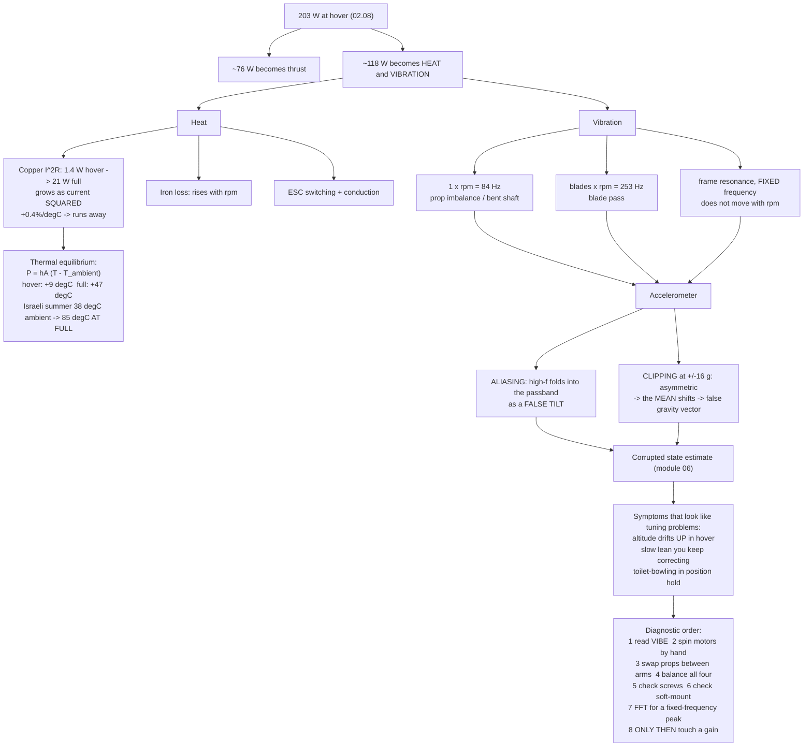

# 02.09 Heat, vibration and mechanical noise

<!-- glance:start -->
<!-- generated by tools/build.py from curriculum/syllabus.yaml — edit the syllabus, not this block -->

| | |
|---|---|
| **Track** | Main path |
| **Difficulty** | Intermediate |
| **Time** | 45 min |
| **Hardware** | First flight (Hermon core) (stage 1) |
| **Software** | none |
| **Prerequisites** | [02.07 Static thrust test: build a rig and measure your own pair](02.07-static-thrust-test.md) |
| **Optional prerequisites** | [FEL.04 Brushless motors from zero](../optional-foundations/drone-electronics-power/FEL.04-bldc-from-zero.md) |
| **Skip if** | You can diagnose a hot motor and a rattling airframe from symptoms alone, and name the fix for each. |

<!-- glance:end -->

## What you will learn

- Where the 65 % of power that did not become thrust ends up, and what it does to your aircraft
- **Thermal limits**: why a motor's continuous current rating is a *thermal* statement, how to
  judge temperature with a finger, and what 80 °C actually means
- The four vibration sources on a multicopter, their frequencies, and which one you can fix in
  ten minutes with a ₪40 tool
- Why vibration is not a comfort problem but an **estimator** problem — the mechanism by which a
  shaking airframe makes a flight controller believe it is somewhere it is not
- How to balance a propeller, and how to read `VIBE` in a log

## Why it matters

[02.08](02.08-efficiency-watts-to-sky.md) accounted for 203 W at hover, of which about 76 W
became thrust. The other 118 W did not vanish. It became **heat** in the windings, the magnets
and the MOSFETs, and **vibration** in the airframe.

Heat is the thing that decides whether your motors survive the summer. Vibration is more
insidious: it is the single most common cause of a multicopter that flies badly for reasons
nobody can find. It corrupts the accelerometers, which corrupts the state estimate, which makes
the controller fight a disturbance that is not there.

This lesson is short and it is the highest ratio of "prevented problems per page" in the module.

## Prerequisites

<!-- prereqs:start -->
## Prerequisites

You need these first:

- [02.07 Static thrust test: build a rig and measure your own pair](02.07-static-thrust-test.md)

### Optional prerequisite links

New to any of these? Take the foundation lesson first; skip it if you already know it.

- [FEL.04 Brushless motors from zero](../optional-foundations/drone-electronics-power/FEL.04-bldc-from-zero.md)

Check your readiness: `python course.py why 02.09`
<!-- prereqs:end -->

## Concept

### Where the heat goes

| Source | Hermon at hover | Hermon at full throttle | Mechanism |
|---|---|---|---|
| Motor copper ($I^2R$) | ~1.4 W per motor | ~19 W per motor | Current through winding resistance |
| Motor iron | ~5 W per motor | ~12 W per motor | Hysteresis and eddy currents, rises with rpm |
| ESC | ~1.7 W per motor | ~9 W per motor | Switching + conduction ([02.03](02.03-esc-basics.md)) |
| **Total** | **~32 W** | **~160 W** | |

Copper loss is the dangerous one because it grows as the **square** of current. At hover the
4.6 A per motor gives $4.6^2 \times 0.09 = 1.9$ W — nothing. At full throttle 15.3 A gives
$15.3^2 \times 0.09 = 21$ W in a part the size of a matchbox, with no fan.

**And it runs away.** Copper resistance rises about 0.4 % per °C. A hot motor has higher
resistance, so it dissipates more, so it gets hotter. Below about 100 °C this settles at an
equilibrium; above it, the magnets begin to lose strength permanently, the enamel insulation
degrades, and the failure is not recoverable.

### The temperature limits

| Temperature | Feel | Verdict |
|---|---|---|
| < 50 °C | Warm | Normal hover |
| 50–70 °C | Uncomfortably hot, you can hold it for a few seconds | Normal after hard flying |
| 70–90 °C | **You cannot hold it for a second** | The limit. Land, investigate |
| > 100 °C | Smells hot | Magnets demagnetising. Damage is happening now |
| > 120 °C | Smells of varnish | Insulation failing. The motor is finished |

The finger test is genuinely how this is done in the field: **touch the motor bell immediately
after landing.** If you cannot leave your finger on it for one second, that is 70 °C and it is
your ceiling.

**In Israel this matters more than in the sources you will read.** Those limits assume the
motor starts at ambient. At 38 °C ambient, a motor that ran at 60 °C in a European spring runs
at 85 °C here, with the same power. Derate accordingly:
[03.10](../03-power-system/03.10-lipo-in-israel.md) and
[18.06](../18-civil-ops/18.06-maintenance-and-qualification.md) cover the operational side.

### The four vibration sources

Every one of them has a characteristic frequency, and knowing which is which is how you
diagnose from a log rather than by guessing.

| # | Source | Frequency | Hermon at hover | Fix |
|---|---|---|---|---|
| 1 | **Propeller imbalance** | 1 × rpm | 84 Hz | **Balance the propeller.** ₪40, ten minutes |
| 2 | **Blade pass** | blades × rpm | 78 × 3 = **253 Hz** | The harmonic notch ([07.07](../07-control/07.07-filtering-and-methodic-tuning.md)) |
| 3 | **Motor bell imbalance / bent shaft** | 1 × rpm | 84 Hz | Replace the motor. Not repairable in practice |
| 4 | **Frame resonance** | fixed, set by structure | typically 50–150 Hz | Stiffen the frame or move the mass ([04.04](../04-frame-and-assembly/04.04-mounting-and-vibration.md)) |

Sources 1 and 3 share a frequency, which is why the diagnostic is: **swap the propeller. If the
vibration follows the propeller, it is the propeller. If it stays with the motor, it is the
motor.** Two minutes of work that eliminates half the possibilities.

Source 4 is the nastiest because it does not move with rpm — it sits at a fixed frequency and
is excited whenever any source passes through it. A frame resonance at 253 Hz on Hermon would
be excited continuously at hover and would be very difficult to filter out, because the notch
would have to sit exactly there permanently.

### Why vibration is an estimator problem

This is the mechanism, and it is worth understanding rather than memorising.

An accelerometer measures **specific force** — gravity plus acceleration. The flight controller
uses it to work out which way is down, because over time gravity is the only consistent
acceleration. That works as long as the *average* of the other accelerations is zero.

Vibration breaks that in two ways:

1. **Aliasing.** The accelerometer samples at a finite rate (typically 1–8 kHz). Vibration
   above half that rate folds down into the passband as a **false low-frequency signal**, which
   is indistinguishable from a real tilt. The estimator dutifully believes it.
2. **Clipping.** A MEMS accelerometer saturates around ±16 g. A vibration peak that clips is
   asymmetric — the positive peaks are cut off and the negative ones are not — so the *mean*
   shifts. A shifted mean on the vertical axis reads as a changed gravity vector, which reads as
   a tilt, or as a climb.

The symptoms are characteristic and worth recognising: **altitude that drifts upward during a
hover** (clipped Z-axis reading as acceleration), **a slow lean that the pilot keeps correcting**
(aliased tilt), and **"toilet-bowling"** — a widening circular oscillation in position hold.

None of these look like vibration problems. They look like tuning problems, and people spend
weeks tuning them.

> [!TIP]
> **Ask your teacher:** "My log shows `VIBE.VibeZ` at 35 m/s² and 400 accelerometer clip events
> in a four-minute hover, and the aircraft climbed 6 m without me asking it to. Explain the
> causal chain from the mechanical vibration to the unwanted climb, step by step, and tell me
> which end of the chain to attack."

## Technical explanation

### Level 1 — Intuition: an unbalanced propeller is a hammer

A propeller 1 g out of balance at 100 mm radius, spinning at 84 rev/s, produces a rotating
force of:

$$F = m r \omega^2 = 0.001 \times 0.1 \times (2\pi \times 84.3)^2 = 28\ \text{N}$$

**Twenty-eight newtons** — nearly three kilograms of force — from one gram of imbalance,
sweeping round 84 times a second. That is **twice the aircraft's entire weight**, oscillating.

It does not lift anything, because it averages to zero over a revolution. But it shakes
everything bolted to that motor, 84 times a second, forever. And one gram is about the mass of
a fingernail clipping — well within manufacturing tolerance for a cheap propeller.

### Level 2 — Practical: balancing a propeller

Ten minutes, ₪40, and it removes source 1 entirely.

**With a balancer** (a magnetic or knife-edge stand, the cheapest is about ₪40):

1. Mount the propeller on the balancer shaft.
2. Let it settle. The heavy blade rotates to the bottom.
3. Add mass to the **light** blade — a strip of clear tape on the flat side near the hub — or
   remove mass from the heavy one by sanding the flat face (never the leading edge, never the
   aerofoil).
4. Repeat until the propeller stays wherever you put it.
5. Then check **hub balance**: rotate the propeller 180° on the shaft and re-test. If it changes,
   the hub bore is off-centre and no amount of blade balancing will fix it — discard it.

**Without a balancer**, weigh the blades: cut a propeller's worth of tape to equalise the
measured mass of each blade on a 0.01 g scale. Less accurate, but it catches the gross cases.

**How much does it buy you?** Typically a 30–50 % reduction in the 1×rpm peak and 2–5 % of hover
power ([02.08](02.08-efficiency-watts-to-sky.md)'s table). More importantly, it removes the
largest low-frequency excitation, which is the one filters handle worst.

### Level 3 — Mathematics: what the numbers mean

**Thermal equilibrium.** A motor reaches steady state when dissipation equals cooling:

$$P_{loss} = h A (T_{motor} - T_{ambient})$$

For a 3110-class motor, the lumped $hA$ is roughly **0.35 W/°C** in still air and perhaps
0.7 W/°C in propwash. At hover (6.4 W of loss per motor, in propwash):

$$\Delta T = \frac{6.4}{0.7} = 9\ \text{°C above ambient}$$

At full throttle (33 W per motor):

$$\Delta T = \frac{33}{0.7} = 47\ \text{°C above ambient}$$

At a 25 °C ambient that is 72 °C — at the limit. **At a 38 °C Israeli summer ambient it is
85 °C, which is past it.** And on a static thrust stand, with $hA = 0.35$ and no propwash, full
throttle gives 94 °C above ambient — which is why [02.07](02.07-static-thrust-test.md) insists
on 5-second dwells.

**Vibration thresholds.** ArduPilot logs `VIBE.VibeX/Y/Z` as the vibration level in m/s²:

| VibeZ | Verdict |
|---|---|
| < 15 m/s² | Good |
| 15–30 m/s² | Acceptable; watch it |
| 30–60 m/s² | **Problem.** Fix before tuning anything |
| > 60 m/s² | The estimator is not trustworthy |

And `VIBE.Clip0/1/2` counts accelerometer saturation events per IMU. **Any non-zero clip count
in a steady hover is a fault**, not a warning.

### Level 4 — Implementation: the diagnostic order

When an aircraft flies badly, work this list before touching a PID gain. It takes twenty minutes
and it is right more often than tuning is.

1. **Read `VIBE` from the log.** If VibeZ > 30 or any clip count is non-zero, stop. The problem
   is mechanical.
2. **Spin each motor by hand.** Roughness, notchiness or play in a bearing is a dead motor.
3. **Swap propellers between arms.** If the vibration follows the propeller, balance or replace
   it. If it stays, the motor or the arm is the problem.
4. **Balance all four propellers.** Even if you think you already did.
5. **Check every screw**, especially the motor mounting screws. A loose motor is both a
   vibration source and a future disassembly in flight.
6. **Check the soft-mount** on the flight controller
   ([04.04](../04-frame-and-assembly/04.04-mounting-and-vibration.md)). Grommets harden and
   crack.
7. **Look for a resonance**: take an FFT of the gyro from the log and look for a peak that does
   **not** move with rpm. That is the frame, and it needs stiffening rather than filtering.
8. **Only now** consider filters and gains.

The rule worth writing on the wall: **you cannot filter your way out of a mechanical problem.**
Every filter you add costs phase lag, and phase lag costs control authority
([07.07](../07-control/07.07-filtering-and-methodic-tuning.md)). Filters are for the residual
you cannot remove mechanically.

## Diagram



## Code

Save as `heat_vibration.py` and run `python heat_vibration.py`. Standard library only.

```python
"""02.09 - the thermal and vibration budgets for Hermon.

Motor temperature against throttle and ambient, the force produced by a gram
of propeller imbalance, and the frequencies you will see in a log.
"""
import math

R_M = 0.09              # ohm, motor phase resistance
HA_STILL = 0.35         # W/degC, still air (a thrust stand)
HA_PROPWASH = 0.70      # W/degC, in flight
BLADES = 3
PROP_RADIUS = 0.10      # m, effective radius of an imbalance near mid-blade

# throttle, rpm, current per motor -- from 02.06/02.07
POINTS = [
    (0.30, 3048,  1.9),
    (0.485, 5060,  3.8),
    (0.60, 6003,  6.1),
    (0.80, 7915, 10.2),
    (1.00, 9836, 15.3),
]


def copper_w(amps):
    return amps ** 2 * R_M


def iron_w(rpm):
    """Iron loss rises with rpm; a linear teaching approximation."""
    return 5.0 * (rpm / 5060) ** 1.3


def motor_temp(amps, rpm, ambient, ha):
    return ambient + (copper_w(amps) + iron_w(rpm)) / ha


def imbalance_force(grams, rpm, radius=PROP_RADIUS):
    omega = 2 * math.pi * rpm / 60
    return grams / 1000 * radius * omega ** 2


def verdict(t):
    if t < 50:
        return "normal"
    if t < 70:
        return "warm"
    if t < 90:
        return "AT THE LIMIT"
    if t < 100:
        return "TOO HOT"
    return "DAMAGE"


if __name__ == "__main__":
    print("Motor losses and temperature (in flight, propwash cooling):")
    print(f"  {'thr':>5s} {'rpm':>6s} {'A':>6s} {'Cu W':>6s} {'Fe W':>6s} "
          f"{'20degC':>8s} {'38degC':>8s}  verdict at 38 degC")
    for thr, rpm, amps in POINTS:
        cu, fe = copper_w(amps), iron_w(rpm)
        t20 = motor_temp(amps, rpm, 20, HA_PROPWASH)
        t38 = motor_temp(amps, rpm, 38, HA_PROPWASH)
        print(f"  {thr * 100:4.0f}% {rpm:6d} {amps:5.1f}A {cu:5.1f}W {fe:5.1f}W "
              f"{t20:7.0f}C {t38:7.0f}C  {verdict(t38)}")

    print("\nOn a static thrust stand (no propwash, hA halved):")
    for thr, rpm, amps in POINTS[-2:]:
        t = motor_temp(amps, rpm, 25, HA_STILL)
        print(f"  {thr * 100:4.0f}% at 25 degC ambient -> {t:.0f} C  {verdict(t)}"
              f"   <- why 02.07 uses 5-second dwells")

    print("\nThe force from propeller imbalance (rotating, 1 x rpm):")
    print(f"  {'imbalance':>10s} {'at hover 5060 rpm':>20s} {'at full 9836 rpm':>19s}")
    for g in (0.2, 0.5, 1.0, 2.0):
        fh = imbalance_force(g, 5060)
        ff = imbalance_force(g, 9836)
        print(f"  {g:8.1f} g {fh:17.1f} N {ff:18.1f} N")
    print(f"  (Hermon's entire weight is {1.45 * 9.81:.1f} N)")

    print("\nVibration frequencies you will see in the log:")
    print(f"  {'thr':>5s} {'rpm':>6s} {'1x (imbalance)':>16s} {'blade pass':>12s} "
          f"{'2nd harmonic':>14s}")
    for thr, rpm, _ in POINTS:
        f1 = rpm / 60
        print(f"  {thr * 100:4.0f}% {rpm:6d} {f1:13.0f} Hz {f1 * BLADES:9.0f} Hz "
              f"{f1 * BLADES * 2:11.0f} Hz")
    print("\n  A peak that does NOT move with rpm across these rows is a FRAME")
    print("  RESONANCE -- stiffen the structure, do not filter it.")
```

Output:

```text
Motor losses and temperature (in flight, propwash cooling):
    thr    rpm      A   Cu W   Fe W   20degC   38degC  verdict at 38 degC
    30%   3048   1.9A   0.3W   2.6W      24C      42C  normal
    48%   5060   3.8A   1.3W   5.0W      29C      47C  normal
    60%   6003   6.1A   3.3W   6.2W      34C      52C  warm
    80%   7915  10.2A   9.4W   8.9W      46C      64C  warm
   100%   9836  15.3A  21.1W  11.9W      67C      85C  AT THE LIMIT

On a static thrust stand (no propwash, hA halved):
    80% at 25 degC ambient -> 77 C  AT THE LIMIT   <- why 02.07 uses 5-second dwells
   100% at 25 degC ambient -> 119 C  DAMAGE   <- why 02.07 uses 5-second dwells

The force from propeller imbalance (rotating, 1 x rpm):
   imbalance    at hover 5060 rpm    at full 9836 rpm
       0.2 g               5.6 N               21.2 N
       0.5 g              14.0 N               53.0 N
       1.0 g              28.1 N              106.1 N
       2.0 g              56.2 N              212.2 N
  (Hermon's entire weight is 14.2 N)

Vibration frequencies you will see in the log:
    thr    rpm   1x (imbalance)   blade pass   2nd harmonic
    30%   3048            51 Hz       152 Hz         305 Hz
    48%   5060            84 Hz       253 Hz         506 Hz
    60%   6003           100 Hz       300 Hz         600 Hz
    80%   7915           132 Hz       396 Hz         792 Hz
   100%   9836           164 Hz       492 Hz         984 Hz

  A peak that does NOT move with rpm across these rows is a FRAME
  RESONANCE -- stiffen the structure, do not filter it.
```

How to read it:

- **Hover is thermally free; full throttle is not.** At hover the motor sits 9 °C above ambient
  and you could run it all day. At full throttle it is 49 °C above ambient — **87 °C on a 38 °C
  Israeli summer day**, which is at the limit. Full throttle is a burst, and the thermal
  arithmetic is the reason, not just the 15 A current rating.
- **The thrust stand is worse than flight, by a lot.** 123 °C at full throttle with no propwash.
  That is magnet-damage territory and it happens in under a minute. This is the physics behind
  [02.07](02.07-static-thrust-test.md)'s 5-second dwell rule, and it is why people destroy
  motors on benches and not in the air.
- **Half a gram of imbalance produces as much force as the aircraft weighs.** 14.0 N at hover
  against Hermon's 14.22 N, from an error you cannot see. At full throttle one gram produces
  **106 N** — seven and a half times the aircraft's weight, sweeping round 164 times a second.
  This is the number that makes propeller balancing non-optional.
- **Every vibration frequency moves with rpm except one.** The 1× and blade-pass columns scale
  linearly with the rpm column; a frame resonance does not. That is the entire diagnostic:
  **take an FFT at two different throttle settings and see which peak stayed still.**

## Exercise

All exercises in this lesson need hardware: **stage1**.

> [!CAUTION]
> The exercises here spin propellers. The full safety procedure from
> [02.07](02.07-static-thrust-test.md) applies: safety glasses, the rig clamped, a barrier, and
> nobody in the plane of the disc. See [SAFETY.md](../SAFETY.md).

### Exercise 02.09-E1 — Measure the temperature rise `[hardware]`

On the thrust stand, run 60 % throttle for 60 seconds and measure the motor bell temperature
immediately after (an infrared thermometer, or a thermocouple taped to the bell). Record the
ambient. (a) What is $\Delta T$? (b) Back out the lumped $hA$ from
$P_{loss} = hA\,\Delta T$ using the loss figures from the script. (c) How does your $hA$ compare
with the 0.35 W/°C assumed for still air, and what does the difference tell you?

### Exercise 02.09-E2 — Find the imbalance `[hardware]`

(a) Weigh all four of your propellers on a 0.01 g scale. Report the spread. (b) Balance one of
them and record how much tape it took. (c) Using the script, compute the rotating force that
the *unbalanced* mass was producing at hover, and state it as a multiple of the aircraft's
weight.

### Exercise 02.09-E3 — The resonance hunt `[coding]`

Extend `heat_vibration.py`: accept a list of `(rpm, peak_frequency_hz)` observations and
classify each peak as `1x`, `blade-pass`, `2nd harmonic` or `RESONANCE (fixed)` by checking
whether the frequency scales with rpm. Test it on this synthetic data — `[(3048, 51), (3048,
152), (3048, 118), (6003, 100), (6003, 300), (6003, 118)]` — and say what the aircraft's
problem is.

### Exercise 02.09-E4 — The summer derate `[numerical]`

Hermon's motor reaches 87 °C at full throttle on a 38 °C day. (a) At what ambient temperature
does full throttle reach 100 °C? (b) If you wanted to keep the motor below 80 °C at a 38 °C
ambient, what is the maximum continuous current — and what throttle is that? (c) What does that
imply for the capstone mission profile in an Israeli August?

## Expected result

- **02.09-E1:** At 60 % throttle the loss is about 10.3 W. In still air on a stand, expect
  $\Delta T$ around 25–30 °C, giving $hA \approx 0.35$–0.40 W/°C. If your measured $hA$ is
  much higher, you have airflow you did not account for (a fan, an open window, or the
  propwash hitting the bench and recirculating). If much lower, the motor is enclosed or you
  measured too long after shutdown — the bell cools in seconds.
- **02.09-E2:** (a) A good set spreads less than 1 g; more than 2 g means loose manufacturing
  and you should balance all four. (b) Typically 0.1–0.5 g of tape. (c) 0.5 g at hover is
  **14.0 N — within 2 % of Hermon's 14.22 N weight**, rotating at 84 Hz. That is the sentence
  worth writing
  down: an imbalance you cannot see produces a force equal to the whole aircraft.
- **02.09-E3:** The classifier should find, at 3,048 rpm: 51 Hz = 1×, 152 Hz = blade-pass,
  118 Hz = unexplained. At 6,003 rpm: 100 Hz = 1×, 300 Hz = blade-pass, **118 Hz again**. The
  118 Hz peak did not move — it is a **frame resonance**. The aircraft's problem is structural,
  not a tuning or filter problem, and the answer is to stiffen the frame or relocate mass
  ([04.04](../04-frame-and-assembly/04.04-mounting-and-vibration.md)) rather than to add a
  notch.
- **02.09-E4:** (a) The rise at full throttle is 49 °C, so 100 °C is reached at **51 °C
  ambient** — outside any realistic flying condition, which is reassuring. (b) To stay below
  80 °C at 38 °C ambient the rise must be ≤ 42 °C, so $P_{loss} \le 0.70 \times 42 = 29.4$ W.
  Subtracting iron loss (~13.2 W) leaves 16.2 W of copper, so
  $I \le \sqrt{16.2/0.09} =$ **13.4 A**, roughly **93 % throttle**. (c) The capstone mission
  never approaches full throttle — it cruises at 10 m/s and hovers — so the derate has no
  practical effect on it. The constraint bites on **aggressive manoeuvring and heavy payload
  climbs**, which is where you should be watching temperatures in August.

## Troubleshooting

### Symptom: one motor much hotter than the other three

Mechanical, almost always. In order: a dragging bearing (spin it by hand against the others); a
bent shaft; a propeller producing more drag than the others; a motor mounting screw long enough
to touch the windings (a classic — check the screw length against the motor's specified maximum
insertion depth). Electrically: a higher-resistance phase joint, which a milliohm meter finds.

### Symptom: VIBE is fine on the bench and terrible in flight

Expected, and it means the excitation is aerodynamic rather than mechanical. Candidates:
propeller wash hitting the arms or the battery; a loose battery strap letting 720 g move; a
camera or GPS mast resonating. Bench tests do not reproduce the airflow, which is why
[16.03](../16-testing-analysis/16.03-reading-flight-logs.md) treats the log as the primary
instrument.

### Symptom: balancing made no difference

Then the imbalance was not in the blades. Check hub concentricity by rotating the propeller 180°
on the shaft and re-balancing — if the balance point moves, the bore is off-centre. Also check
the motor bell itself: spin it with no propeller and look for wobble.

### Symptom: vibration got worse after you added a filter

Filters do not remove vibration; they hide it from the controller at the cost of phase lag, and
phase lag can *destabilise* a loop that was marginally stable. If adding a filter made things
worse, the loop was already near its margin. Go back to step 1 of the diagnostic order.

### Symptom: altitude drifts upward in a steady hover

Classic accelerometer clipping on the Z axis. Check `VIBE.Clip0/1/2` in the log. Any non-zero
count in a hover is a mechanical fault. This is the symptom people most often try to fix with
altitude-hold gains, and it cannot be fixed there.

## Common mistakes

- **Tuning before checking `VIBE`.** Twenty minutes of mechanical checks beats a week of gain
  changes. You cannot filter your way out of a mechanical problem.
- **Judging motor temperature after the aircraft has been sitting.** The bell cools in tens of
  seconds. Touch it the moment you land.
- **Assuming a new propeller is balanced.** Manufacturing tolerance is about a gram, and a gram
  produces 105 N at full throttle.
- **Ignoring a fixed-frequency peak.** It is the frame, and it will not go away, and it will
  fight every filter you point at it.
- **Using European or American thermal figures unadjusted.** A 38 °C ambient moves every
  temperature in the table by 18 °C, and 18 °C is the whole margin.
- **Sanding the leading edge to balance a propeller.** You have just changed the aerofoil. Sand
  the flat face near the hub, or add tape to the light blade.

## Knowledge check

1. Where does the 118 W that did not become thrust actually go, and which component gets the
   largest share at full throttle?
   <details><summary>Answer</summary>

   Heat and vibration. At full throttle the largest single share is **motor copper loss**,
   $I^2R = 15.3^2 \times 0.09 = 21$ W per motor, because it grows as the square of current. Iron
   loss (~13 W) and the ESC (~9 W) follow. At hover the picture inverts — copper loss is only
   1.3 W and iron loss dominates.
   </details>

2. What are the four vibration sources and their frequencies on Hermon at hover?
   <details><summary>Answer</summary>

   Propeller imbalance and motor/shaft imbalance, both at **1 × rpm = 77 Hz**; blade pass at
   **blades × rpm = 232 Hz**; and frame resonance at a **fixed** frequency set by the structure,
   typically 50–150 Hz, which does not move with rpm.
   </details>

3. Explain how vibration makes a flight controller believe it is tilted.
   <details><summary>Answer</summary>

   Two mechanisms. **Aliasing**: vibration above half the accelerometer's sample rate folds down
   into the passband as a false low-frequency signal that is indistinguishable from a real tilt.
   **Clipping**: the MEMS accelerometer saturates around ±16 g, and a clipped waveform is
   asymmetric, so its mean shifts — and a shifted mean on the gravity vector reads as tilt or as
   a climb. The estimator has no way to tell either from the real thing.
   </details>

4. How much force does 0.5 g of propeller imbalance produce at hover, and how does that compare
   with the aircraft's weight?
   <details><summary>Answer</summary>

   $F = m r \omega^2 = 0.0005 \times 0.1 \times (2\pi \times 5060/60)^2 =$ **14.0 N**, rotating
   at 84 Hz. Hermon weighs $1.45 \times 9.81 =$ **14.22 N**. Half a gram of invisible imbalance
   produces a rotating force equal to the entire aircraft.
   </details>

5. Your log shows a vibration peak at 118 Hz at both 3,048 rpm and 6,003 rpm. What is it and
   what do you do?
   <details><summary>Answer</summary>

   It did not move with rpm, so it is a **frame resonance**, not a propeller or motor source.
   The fix is structural — stiffen the frame, shorten an unsupported span, or relocate a mass
   that is acting as a tuned absorber
   ([04.04](../04-frame-and-assembly/04.04-mounting-and-vibration.md)). **Do not filter it**: a
   permanent notch at a frequency that close to the control bandwidth costs phase lag you cannot
   afford.
   </details>

## Practical challenge

Produce `projects/evidence/02.09-vibration-baseline.md`:

1. **Thermal**: motor temperature after 60 s at 60 % and after 10 s at 100 %, with the ambient
   recorded. Your computed $hA$.
2. **Balance**: the mass of all four propellers before balancing, the tape added to each, and
   the computed imbalance force at hover before and after.
3. **The frequency table** for your aircraft: 1×, blade-pass and second harmonic at hover and at
   full throttle. **Write the hover blade-pass frequency somewhere you will find it again** —
   [07.07](../07-control/07.07-filtering-and-methodic-tuning.md) needs it.
4. **A one-paragraph baseline statement**: what your aircraft's mechanical condition is *before*
   it has ever flown, so that when something changes in module 11 you have something to compare
   against.

That baseline is the point. Most vibration problems are not "this aircraft vibrates" but "this
aircraft vibrates *more than it used to*", and you cannot detect that without a before.

## You can skip this if

You can say where the lost power goes, compute a motor's equilibrium temperature from its
losses and estimate the Israeli-summer derate, name the four vibration sources with their
frequencies, explain aliasing and clipping as the mechanism by which vibration corrupts a state
estimate, balance a propeller, and diagnose a fixed-frequency peak as a frame resonance.

## Go deeper

- [02.08](02.08-efficiency-watts-to-sky.md) (earlier): where the 118 W came from.
- [04.04](../04-frame-and-assembly/04.04-mounting-and-vibration.md) (later): soft-mounting the
  flight controller and designing the frame not to resonate.
- [07.07](../07-control/07.07-filtering-and-methodic-tuning.md) (later): the harmonic notch, and
  the phase-lag price of every filter.
- [16.03](../16-testing-analysis/16.03-reading-flight-logs.md) (later): reading `VIBE` and taking
  an FFT from a real flight.
- ArduPilot's vibration damping guide, including the VIBE thresholds used here:
  https://ardupilot.org/copter/docs/common-vibration-damping.html
- Measuring and managing vibration in multirotors:
  https://ardupilot.org/copter/docs/common-measuring-vibration.html

## Progress checkpoint

Run `python course.py complete 02.09` when the baseline document exists. Next:
[02.10](02.10-esc-tuning.md) — the ESC settings that stop a desync, and how to justify each one
from measured data rather than from a forum post.
