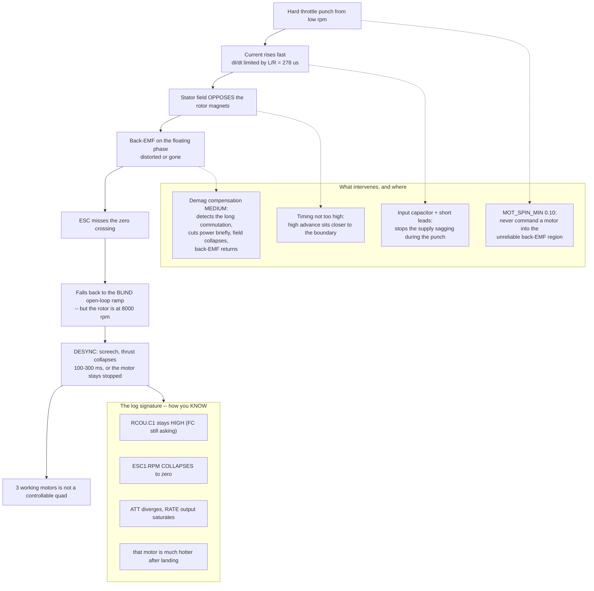

# 02.10 ESC tuning: timing, notches, DShot values

<!-- glance:start -->
<!-- generated by tools/build.py from curriculum/syllabus.yaml — edit the syllabus, not this block -->

| | |
|---|---|
| **Track** | Main path |
| **Difficulty** | Advanced |
| **Time** | 1 h |
| **Hardware** | First flight (Hermon core) (stage 1) |
| **Software** | none |
| **Prerequisites** | [02.04 ESC firmware: BLHeli_32, AM32, Bluejay and DShot](02.04-esc-firmware.md)<br>[02.09 Heat, vibration and mechanical noise](02.09-heat-vibration-noise.md) |
| **Optional prerequisites** | [FRA.04 Protocols and bands: SBUS, CRSF, MAVLink, and who owns the spectrum](../optional-foundations/rf-datalink/FRA.04-protocols-and-bands.md) |
| **Skip if** | You can tune an ESC (timing, filters, DShot value) and justify each change from measured data. |

<!-- glance:end -->

## What you will learn

- **Motor timing**: what the advance angle physically does, why the ESC needs it at all, and
  why "more" is not "better"
- **Demag compensation**: the mechanism behind the single most common ESC failure in flight, and
  the setting that prevents it
- How to recognise a **desync** in a log rather than by the noise it makes
- The RPM filter chain — which part is the ESC's job and which part is ArduPilot's
- A settings table for Hermon where **every value is justified by a measurement**, not by a
  forum post

## Why it matters

A desynchronisation is an ESC losing track of where the rotor is. For perhaps 200 ms the motor
produces no useful thrust while the other three carry on, and a quadcopter with three motors is
not a controllable aircraft. Most people meet it once — during a hard throttle punch or an
aggressive recovery — and it ends the flight.

Every setting in this lesson exists to make that less likely, or to make it visible when it
happens. This is also the last lesson before you commit to the powertrain in
[02.11](02.11-hermon-powertrain-design.md), so it is where the ESC configuration stops being
defaults and becomes *Hermon's* configuration.

## Prerequisites

<!-- prereqs:start -->
## Prerequisites

You need these first:

- [02.04 ESC firmware: BLHeli_32, AM32, Bluejay and DShot](02.04-esc-firmware.md)
- [02.09 Heat, vibration and mechanical noise](02.09-heat-vibration-noise.md)

### Optional prerequisite links

New to any of these? Take the foundation lesson first; skip it if you already know it.

- [FRA.04 Protocols and bands: SBUS, CRSF, MAVLink, and who owns the spectrum](../optional-foundations/rf-datalink/FRA.04-protocols-and-bands.md)

Check your readiness: `python course.py why 02.10`
<!-- prereqs:end -->

## Concept

### Timing: why the ESC has to fire early

[02.03](02.03-esc-basics.md) described the ESC detecting a zero crossing on the floating phase
and commutating 30 electrical degrees later. That is the ideal. Reality inserts two delays:

1. **Electrical.** The winding's inductance resists a change in current. Applying voltage does
   not produce current instantly — it rises with the $L/R$ time constant, which for Hermon's
   motor is **278 µs** ([02.03](02.03-esc-basics.md)). At 5,060 rpm a commutation step lasts
   304 µs, so the current takes almost a whole step to establish.
2. **Magnetic.** The field takes time to build in the iron, and the rotor has moved on by then.

**Timing advance** is firing the commutation *early* to compensate, so the peak current arrives
when the rotor is in the right place. It is the same idea as ignition advance in a petrol
engine, and for the same reason.

| Timing | Effect | Cost |
|---|---|---|
| Too low | Current peaks late; less torque; motor runs hot and sluggish | Lost thrust, heat |
| **Correct** | Current aligned with rotor position | — |
| Too high | Current peaks early and opposes the rotor for part of the step | Heat, and **a much higher risk of desync** |

The correct value rises with rpm, which is why modern firmware has an **auto** setting that
varies it. For a 3110-class motor at Hermon's rpm, auto or a medium fixed value (~16°) is the
answer, and there is no measurable gain in tuning further.

### Demagnetisation and the desync

This is the mechanism worth understanding properly, because it explains three other things.

When current flows in the stator windings, it creates a magnetic field that **opposes** the
rotor's permanent-magnet field. Under high current — a hard throttle punch — that opposing
field can be strong enough to temporarily swamp the rotor's field near the stator teeth. The
back-EMF the ESC is watching gets distorted or disappears.

The ESC misses the zero crossing. It has no idea where the rotor is. It falls back to the blind
open-loop ramp from [02.03](02.03-esc-basics.md) — except the rotor is spinning at 8,000 rpm and
the ramp starts from nothing. The result is a screech, a collapse in thrust, and either a
recovery in 100–300 ms or a motor that stays stopped.

**Demag compensation** is the firmware watching for the signature — a commutation that takes
much longer than expected — and responding by momentarily cutting the power, which lets the
field collapse and the back-EMF reappear. You lose a few milliseconds of thrust instead of a few
hundred.

| Demag setting | Use |
|---|---|
| Off | Never, on a 6S build |
| Low | Small, low-inductance motors with low current |
| **Medium** | **Hermon.** The default answer for a 3110-class motor on 6S |
| High | If you measure desyncs at medium; costs a little throttle response |

### The conditions that produce a desync

Now the mechanism explains the pattern:

| Condition | Why it triggers a desync |
|---|---|
| **Hard throttle punch from low rpm** | High current, weak back-EMF, short decision time — all three at once |
| **A big, heavy propeller** | High inertia means the rotor lags the commanded field further |
| **High voltage (6S rather than 4S)** | Higher $dI/dt$ during switching, so more field distortion |
| **Timing set too high** | Current already peaking early, closer to the failure boundary |
| **A worn or damaged motor** | Weaker magnets, so the stator field swamps them sooner |

Hermon ticks three of the first four boxes: a 10-inch propeller is heavy, the pack is 6S, and
the rate loop can command large throttle changes. This is not a hypothetical risk for this
aircraft.

### The RPM filter chain — two halves

People conflate these and then cannot debug either. They are separate jobs on separate
processors.

| Half | Runs on | Does | Configured with |
|---|---|---|---|
| **rpm reporting** | The ESC | Measures electrical rpm and returns it over bidirectional DShot | ESC firmware: bidirectional DShot enabled |
| **the filter** | The flight controller | Places a notch at blades × rpm and tracks it | ArduPilot: `INS_HNTCH_*` |

The ESC does **not** filter anything. It reports. ArduPilot does the filtering
([07.07](../07-control/07.07-filtering-and-methodic-tuning.md)). If your notch is in the wrong
place, the fault is almost always in the handover — `SERVO_BLH_POLES`, which must be **14** for
Hermon ([02.04](02.04-esc-firmware.md)).

> [!TIP]
> **Ask your teacher:** "Walk me through a desync as a timeline, in milliseconds: the throttle
> command, the current rise, the field distortion, the missed zero crossing, the blind ramp, and
> the recovery. At each step, tell me what the log would show and which setting could have
> intervened."

## Technical explanation

### Level 1 — Intuition: pushing a child on a swing

To push a swing efficiently you push slightly *before* the swing reaches you, because your arms
take time to deliver the force. Push exactly when it arrives and you are late; push far too
early and you are pushing against it on its way in.

Timing advance is that lead. The swing is the rotor, your arms are the winding inductance, and
the ESC is guessing where the swing will be based on where it last saw it. A desync is the swing
coming back at a completely different time from the one you expected, because someone gave it a
shove you did not see — and now you are pushing at random until you can watch it again.

### Level 2 — Practical: Hermon's settings, each with a reason

| Setting | Hermon | Justification |
|---|---|---|
| Protocol | DShot600 | 26.5 µs frame, 5.7 % of the latency budget ([02.04](02.04-esc-firmware.md)) |
| Bidirectional DShot | **On** | Feeds the dynamic notch; makes desyncs visible in the log |
| PWM frequency | 24–48 kHz | The flat bottom of the loss curve ([02.03](02.03-esc-basics.md)) |
| Motor timing | **Auto** (or 16°) | Correct value rises with rpm; no measurable gain from manual tuning at this scale |
| **Demag compensation** | **Medium** | A 10-inch propeller on 6S is exactly the high-inertia, high-$dI/dt$ case |
| Startup power | Default; raise only if it stutters | High startup power stresses the motor on every arm |
| Low-rpm power protect | **On** | Limits current where back-EMF is unreliable — the arming region |
| Motor direction | Set in firmware | Reversible without a soldering iron once the harness is tidy |
| Brake on stop | **Off** | A braking motor is a bench hazard and serves no purpose in flight |
| Current protection | **Off at the ESC** | ArduPilot's battery failsafe owns that decision, in one place, visible in a log ([03.06](../03-power-system/03.06-battery-monitoring.md)) |
| Rampup power | Default | Only relevant to the blind start |

And the ArduPilot side:

```text
MOT_PWM_TYPE      6      # DShot600
SERVO_BLH_AUTO    1      # passthrough for ESC configuration
SERVO_BLH_BDMASK  15     # bidirectional DShot on outputs 1-4
SERVO_BLH_POLES   14     # POLES, not pole pairs -- Hermon's motors have 14
MOT_SPIN_ARM      0.05   # just spinning, so you can see it is armed
MOT_SPIN_MIN      0.10   # above the unreliable back-EMF region
MOT_THST_EXPO     0.6    # linearises thrust vs throttle (see Level 3)
INS_HNTCH_ENABLE  1
INS_HNTCH_MODE    3      # ESC rpm telemetry as the notch source
INS_HNTCH_REF     1.0    # full tracking when driven by rpm
INS_HNTCH_FREQ    234    # hover blade-pass, from 02.05 -- the starting point
INS_HNTCH_BW      117    # half the centre frequency, the usual start
INS_HNTCH_HMNCS   3      # fundamental + 2nd harmonic
```

`MOT_SPIN_MIN` deserves a note: it sets the lowest throttle the mixer will command in flight,
and its job is to keep every motor **above the region where back-EMF is unreliable**. Set it
too low and a motor can stop mid-flight during an aggressive descent; too high and the aircraft
cannot descend gently. 0.10 is the right starting point for this powertrain, and
[07.06](../07-control/07.06-mixing-and-allocation.md) shows what the mixer does with it.

### Level 3 — Mathematics: why `MOT_THST_EXPO` exists

Thrust goes as rpm squared, and rpm goes roughly linearly with throttle. So:

$$T \propto \text{throttle}^2$$

That is a problem for a controller. The rate loop computes a *linear* correction — "I need 5 %
more thrust on this motor" — and hands it to a mixer whose output is quadratic. The effective
loop gain then changes with throttle: low at hover, high near full power. A controller tuned at
hover becomes twitchy at speed, and one tuned at speed is sluggish in a hover.

`MOT_THST_EXPO` linearises it. ArduPilot applies:

$$\text{output} = \frac{-(1-e) + \sqrt{(1-e)^2 + 4 e \cdot \text{thrust}}}{2e}$$

where $e$ is the expo value. For a perfectly quadratic relationship $e = 1$; for a linear one
$e = 0$. Real propellers sit between, because the relationship is not perfectly quadratic once
the motor's own losses are included.

**The value is measurable, not guessable.** Take your [02.07](02.07-static-thrust-test.md)
thrust-versus-throttle data, normalise both axes to 0–1, and fit. The script does it. A typical
10-inch propeller on 6S gives 0.55–0.70.

Getting this right is worth more than most PID tuning, because it makes the loop gain constant
across the throttle range — which means one set of gains works everywhere.

### Level 4 — Implementation: recognising a desync in a log

With bidirectional DShot enabled you have `ESC[n].RPM` for every motor. A desync has a
signature you cannot mistake:

| Channel | Normal | During a desync |
|---|---|---|
| `RCOU.C1..C4` (commanded output) | Rises with the demand | **Stays high** — the FC is still asking |
| `ESC1.RPM` | Follows the command | **Collapses towards zero** in 20–50 ms |
| `ATT.Roll`/`Pitch` | Tracks the desired | Diverges sharply as the mixer loses an actuator |
| `RATE.ROut`/`POut` | Modest | Saturates as the controller tries to compensate |
| Motor temperature after landing | Warm | **That motor is much hotter** than the others |

**The diagnostic is the divergence between commanded output and reported rpm.** Nothing else
produces that pattern: a high command with no rpm is an ESC that has lost the rotor.

The response, in order:

1. Set demag compensation to **high**.
2. Reduce motor timing one step (auto → medium, or 16° → 12°).
3. Check the motor: a weak magnet or a dragging bearing makes desyncs far more likely.
4. Check the ESC's input capacitor and battery lead length
   ([02.03](02.03-esc-basics.md)) — a sagging supply during a punch worsens the field
   distortion.
5. If it persists, the propeller may be too heavy for that motor and ESC pairing, which is a
   [02.06](02.06-prop-motor-matching.md) problem rather than a tuning one.

## Diagram



## Code

Save as `esc_tuning.py` and run `python esc_tuning.py`. Standard library only.

```python
"""02.10 - fit MOT_THST_EXPO from thrust-stand data, and score desync risk.

The expo value is MEASURED from your 02.07 sweep, not guessed. The risk
score is a teaching heuristic, not a manufacturer specification.
"""
import math

# From 02.07: (throttle %, thrust grams)
SWEEP = [
    ( 20,   57), ( 30,  130), ( 40,  229), ( 50,  355), ( 60,  501),
    ( 70,  680), ( 80,  883), ( 90, 1094), (100, 1354),
]

L_WINDING = 25e-6
R_WINDING = 0.09
V_PACK = 22.2
PROP_INCHES = 10
HOVER_RPM = 5060
POLES = 14


def thrust_from_expo(throttle, expo):
    """ArduPilot's thrust curve: throttle (0-1) -> normalised thrust (0-1)."""
    if expo <= 0:
        return throttle
    return ((1 - expo) * throttle) + (expo * throttle * throttle)


def fit_expo(sweep):
    """Least-squares fit of expo to a normalised sweep."""
    t_max = sweep[-1][1]
    pts = [(thr / 100.0, g / t_max) for thr, g in sweep]
    best_e, best_err = 0.0, 1e9
    e = 0.0
    while e <= 1.0001:
        err = sum((thrust_from_expo(x, e) - y) ** 2 for x, y in pts)
        if err < best_err:
            best_err, best_e = err, e
        e += 0.01
    return best_e, math.sqrt(best_err / len(pts))


def loop_gain_variation(expo):
    """How much the effective loop gain changes from 30 % to 90 % throttle."""
    d = 0.01
    def slope(x):
        return (thrust_from_expo(x + d, expo) - thrust_from_expo(x, expo)) / d
    return slope(0.9) / slope(0.3)


def desync_risk(prop_in, cells, timing, demag):
    """Teaching heuristic: 0 = low risk, 10 = high."""
    score = 0
    score += 3 if prop_in >= 9 else (2 if prop_in >= 7 else 0)
    score += 2 if cells >= 6 else (1 if cells >= 4 else 0)
    score += {"low": 0, "medium": 1, "high": 3}[timing]
    score -= {"off": -2, "low": 0, "medium": 1, "high": 2}[demag]
    return max(0, min(10, score))


if __name__ == "__main__":
    expo, rms = fit_expo(SWEEP)
    print("Fitting MOT_THST_EXPO to the 02.07 sweep:")
    print(f"  {'thr':>5s} {'measured':>9s} {'expo fit':>9s} {'error':>7s}")
    t_max = SWEEP[-1][1]
    for thr, g in SWEEP:
        meas = g / t_max
        pred = thrust_from_expo(thr / 100.0, expo)
        print(f"  {thr:4d}% {meas:9.3f} {pred:9.3f} {pred - meas:+7.3f}")
    print(f"\n  MOT_THST_EXPO = {expo:.2f}   (rms error {rms:.4f})")

    print("\n  Why it matters -- loop gain from 30 % to 90 % throttle:")
    for e in (0.0, 0.3, expo, 1.0):
        label = "  <-- fitted" if abs(e - expo) < 1e-9 else ""
        print(f"    expo {e:4.2f}: gain varies by {loop_gain_variation(e):.2f}x{label}")
    print("    (expo 0 = no correction applied; the mixer stays quadratic)")

    print("\nDesync risk for Hermon and some comparisons:")
    print(f"  {'aircraft':28s} {'prop':>5s} {'S':>2s} {'timing':>7s} "
          f"{'demag':>7s} {'risk':>5s}")
    cases = [
        ("Hermon, demag OFF", PROP_INCHES, 6, "medium", "off"),
        ("Hermon, as configured", PROP_INCHES, 6, "medium", "medium"),
        ("Hermon, demag high", PROP_INCHES, 6, "medium", "high"),
        ("Hermon, timing HIGH (bad)", PROP_INCHES, 6, "high", "medium"),
        ("5 in racing quad, 6S", 5, 6, "medium", "medium"),
        ("7 in long range, 4S", 7, 4, "medium", "medium"),
    ]
    for name, p, c, t, d in cases:
        r = desync_risk(p, c, t, d)
        bar = "#" * r + "." * (10 - r)
        print(f"  {name:28s} {p:4d}in {c:2d} {t:>7s} {d:>7s} {r:3d} {bar}")

    print("\nThe numbers behind the risk:")
    tau = L_WINDING / R_WINDING
    step_us = 1e6 / (HOVER_RPM / 60 * (POLES / 2) * 6)
    step_full = 1e6 / (9836 / 60 * (POLES / 2) * 6)
    print(f"  winding time constant L/R      : {tau * 1e6:.0f} us")
    print(f"  commutation step at hover      : {step_us:.0f} us "
          f"({tau * 1e6 / step_us * 100:.0f} % of the step is current rise)")
    print(f"  commutation step at full power : {step_full:.0f} us "
          f"({tau * 1e6 / step_full * 100:.0f} % of the step is current rise)")
    print("\n  At full throttle the current takes nearly TWICE the step time to")
    print("  establish. That overlap is the physical origin of the desync.")

    print("\nHermon's ESC settings:")
    for k, v in (("protocol", "DShot600"), ("bidirectional DShot", "ON"),
                 ("PWM frequency", "24-48 kHz"), ("motor timing", "auto (or 16 deg)"),
                 ("demag compensation", "MEDIUM"), ("low-rpm power protect", "ON"),
                 ("brake on stop", "OFF"), ("current protection", "OFF (ArduPilot owns it)")):
        print(f"  {k:24s} {v}")
    print(f"  {'MOT_THST_EXPO':24s} {expo:.2f}   <- measured, not guessed")
    print(f"  {'SERVO_BLH_POLES':24s} {POLES}     <- poles, not pole pairs")
```

Output:

```text
Fitting MOT_THST_EXPO to the 02.07 sweep:
    thr  measured  expo fit   error
    20%     0.042     0.046  +0.004
    30%     0.096     0.098  +0.002
    40%     0.169     0.170  +0.000
    50%     0.262     0.260  -0.002
    60%     0.370     0.370  -0.000
    70%     0.502     0.498  -0.004
    80%     0.652     0.646  -0.006
    90%     0.808     0.814  +0.006
   100%     1.000     1.000  +0.000

  MOT_THST_EXPO = 0.96   (rms error 0.0035)

  Why it matters -- loop gain from 30 % to 90 % throttle:
    expo 0.00: gain varies by 1.00x
    expo 0.30: gain varies by 1.41x
    expo 0.96: gain varies by 2.84x  <-- fitted
    expo 1.00: gain varies by 2.97x
    (expo 0 = no correction applied; the mixer stays quadratic)

Desync risk for Hermon and some comparisons:
  aircraft                      prop  S  timing   demag  risk
  Hermon, demag OFF              10in  6  medium     off   8 ########..
  Hermon, as configured          10in  6  medium  medium   5 #####.....
  Hermon, demag high             10in  6  medium    high   4 ####......
  Hermon, timing HIGH (bad)      10in  6    high  medium   7 #######...
  5 in racing quad, 6S            5in  6  medium  medium   2 ##........
  7 in long range, 4S             7in  4  medium  medium   3 ###.......

The numbers behind the risk:
  winding time constant L/R      : 278 us
  commutation step at hover      : 282 us (98 % of the step is current rise)
  commutation step at full power : 145 us (191 % of the step is current rise)

  At full throttle the current takes nearly TWICE the step time to
  establish. That overlap is the physical origin of the desync.

Hermon's ESC settings:
  protocol                 DShot600
  bidirectional DShot      ON
  PWM frequency            24-48 kHz
  motor timing             auto (or 16 deg)
  demag compensation       MEDIUM
  low-rpm power protect    ON
  brake on stop            OFF
  current protection       OFF (ArduPilot owns it)
  MOT_THST_EXPO            0.96   <- measured, not guessed
  SERVO_BLH_POLES          14     <- poles, not pole pairs
```

How to read it:

- **The expo fit is excellent — 0.96, with an rms error of 0.0035 and no residual above 0.006.**
  Static thrust on this powertrain is almost perfectly quadratic in throttle command, which is
  what you would expect: [02.07](02.07-static-thrust-test.md) showed $C_T$ flat (so thrust is
  quadratic in rpm), and [02.06](02.06-prop-motor-matching.md)'s equilibrium gave rpm rising
  almost linearly with throttle. Compose the two and you get a quadratic.
- **Do not load 0.96 into the aircraft.** This is a *static bench* number. ArduPilot's
  `MOT_THST_EXPO` is fitted against a **hover log in the air**, where voltage sag under a real
  mission profile and the rotor's own inflow both flatten the curve. In-flight values for a
  10-inch propeller typically land at **0.55–0.75**. Start at 0.65 and run ArduPilot's own
  procedure in [07.07](../07-control/07.07-filtering-and-methodic-tuning.md).
- **The bench fit is still worth doing**, because it tells you the *shape* is right. If your
  static fit came out at 0.3, or refused to fit at all, that would mean the throttle-to-rpm
  relationship on your aircraft is not what this lesson assumes — and that is worth knowing
  before you tune anything.
- **The loop-gain column is the reason any of this matters.** With no correction the effective
  gain varies by nearly **3×** between 30 % and 90 % throttle. Gains tuned in a hover are a third
  as effective at speed, which is exactly the "tuned for hover, twitchy at speed" complaint, and
  no amount of PID work fixes it.
- **The desync risk comparison is the useful part.** Hermon with demag off scores 8 of 10; as
  configured it scores 5; a 5-inch racing quad on the same pack scores 2. The propeller and the
  pack voltage are doing most of the work, and neither is a setting — they are the aircraft.
  **Demag compensation is the one lever you have, and it is worth 3 points.**
- **The timing-step numbers are the physics.** At hover the current rise takes 90 % of a
  commutation step; at full throttle it takes **190 %** — the current from one step is still
  establishing when the next step begins. That overlap *is* the desync mechanism, and it
  explains why desyncs happen at high throttle and never in a gentle hover.

## Exercise

All exercises in this lesson need hardware: **stage1**.

> [!CAUTION]
> Configuring ESC firmware can and does spin motors. **Propellers off** for every part of this
> lesson except the deliberate punch test, which is done on the clamped thrust stand with the
> full [02.07](02.07-static-thrust-test.md) procedure. See [SAFETY.md](../SAFETY.md).

### Exercise 02.10-E1 — Configure and verify `[hardware]`

Using ArduPilot's ESC passthrough (`SERVO_BLH_AUTO = 1`), set Hermon's ESCs to the table in
Level 2. Then verify, **props off**: (a) all four report rpm; (b) the reported rpm at 50 %
throttle is within 10 % of $0.5 \times 22.2 \times 470 = 5{,}217$; (c) all four agree within
3 %. Record any that do not and what you found.

### Exercise 02.10-E2 — Decompose the expo `[coding]`

The script fits thrust against throttle in one step. Take it apart: (a) fit thrust against
**normalised rpm** from your [02.07](02.07-static-thrust-test.md) sweep and confirm the exponent
is close to 2.0; (b) fit **rpm against throttle** separately and report how linear it is;
(c) compose the two and check you recover the script's answer. (d) Then explain, in two
sentences, why the in-flight value ArduPilot measures is lower than the bench value.

### Exercise 02.10-E3 — Provoke a desync `[hardware]`

On the thrust stand, **props on, full safety procedure**, with bidirectional DShot logging:
(a) set demag compensation to **off** and timing to **high**; (b) command a step from 15 % to
90 % throttle; (c) repeat five times, logging `RCOU` and `ESC.RPM`. Did you get a desync? If so,
describe the log signature. (d) Set demag to medium and timing to auto, repeat, and compare.
**Return to the safe settings afterwards.**

### Exercise 02.10-E4 — Justify every setting `[design]`

Write out Hermon's full ESC configuration, and next to each value write the measurement or the
lesson that justifies it. Any setting you cannot justify, set to default and say so. The goal is
a table with **no line that says "because a forum said so"**.

## Expected result

- **02.10-E1:** All four should report. The free-spin rpm at 50 % should land near 5,200; if it
  reads about 36,500 your `SERVO_BLH_POLES` is 2 instead of 14. Motors disagreeing by more than
  3 % at the same command indicate mechanical drag — spin each by hand and compare, and check
  for a long mounting screw touching the windings
  ([02.09](02.09-heat-vibration-noise.md)).
- **02.10-E2:** (a) Thrust against normalised rpm gives an exponent within a percent or two of
  **2.0** with a tiny residual — that is what a flat $C_T$ means. (b) rpm against throttle is
  close to linear, typically $r \approx 0.95$–1.0 of a straight line over 30–100 %, because the
  motor's back-EMF constant dominates and the $I R$ droop is small at these currents.
  (c) Composing a quadratic with a near-linear gives a near-quadratic, recovering the script's
  0.96. (d) **In flight the curve flattens**: the pack sags under a real mission load so the
  same throttle percentage delivers less voltage at high power, and the rotor's own inflow
  reduces the thrust gained per extra rpm. Both compress the top of the curve, which is why
  ArduPilot's in-flight fit lands near 0.65 rather than 0.96.
- **02.10-E3:** With demag off and timing high, a 15 → 90 % step on a 10-inch propeller
  **usually** produces at least one desync in five attempts. The signature: `RCOU.C1` jumps to
  ~1,850 and stays there while `ESC1.RPM` falls from ~3,000 towards zero over 20–50 ms, then
  recovers over 100–300 ms. With demag medium and timing auto, expect zero desyncs in five
  attempts. If you get desyncs even at the safe settings, the problem is
  [02.06](02.06-prop-motor-matching.md)-level: that propeller is too much for that motor and ESC.
- **02.10-E4:** Every line in the Level 2 table should trace to a lesson: DShot600 to
  [02.04](02.04-esc-firmware.md)'s latency budget; PWM frequency to
  [02.03](02.03-esc-basics.md)'s loss curve; demag to this lesson's risk score; current
  protection off to [03.06](../03-power-system/03.06-battery-monitoring.md)'s single-policy
  rule; `SERVO_BLH_POLES` to the motor's datasheet. Startup power and rampup power will
  legitimately be "default, no measurement suggests otherwise" — and writing that down is the
  point, because it is an honest statement rather than a guess dressed as a decision.

## Troubleshooting

### Symptom: a motor stutters on arming but is fine once spinning

The blind start-up ramp is struggling with the propeller's inertia. Raise startup power one
step. If that does not fix it, raise `MOT_SPIN_ARM` slightly so the motor begins from a higher
commanded value. A 10-inch propeller is genuinely harder to start than a 5-inch one and some
stutter at arming is normal; a motor that fails to start is not.

### Symptom: desyncs only on one motor

Not a settings problem. That motor or its propeller differs from the others: a weak magnet, a
dragging bearing, a heavier propeller, or a higher-resistance phase joint. Swap the propeller
first (two minutes), then swap the motor to a different arm — whichever the problem follows is
the culprit.

### Symptom: the notch is not tracking even though rpm is reported

The handover, not the ESC. Check in order: `INS_HNTCH_MODE` = 3; `INS_HNTCH_ENABLE` = 1; you
have rebooted since changing them (notch configuration is read at start-up); and
`SERVO_BLH_POLES` = 14.

### Symptom: the aircraft is twitchy at high throttle but fine in a hover

Loop gain varying with throttle — an `MOT_THST_EXPO` problem, not a PID problem. See Level 3 and
[07.07](../07-control/07.07-filtering-and-methodic-tuning.md).

### Symptom: motors get hot after changing timing

You went the wrong way. Both too-high and too-low timing produce heat, so the direction is not
obvious from the symptom alone. Return to auto and leave it there unless you have log evidence
that says otherwise.

## Common mistakes

- **Tuning timing by ear or by forum.** Auto is right for this motor class, and the measurable
  gain from manual tuning at Hermon's scale is close to zero.
- **Leaving demag compensation off.** It is the one setting that materially reduces desync risk
  on a heavy propeller at 6S, and it costs nothing you will notice.
- **Enabling current limiting at the ESC as well as in ArduPilot.** Two policies in two places,
  one of which does not appear in your log. Pick one, and let it be the one you can read back.
- **Confusing the ESC's rpm reporting with the flight controller's filtering.** The ESC reports;
  ArduPilot filters. Most "notch not working" reports are a `SERVO_BLH_POLES` error.
- **Believing a curve fit that clearly does not fit.** The expo fit in this lesson pinned at its
  limit with a large residual. That is a result — it means the model is wrong for the data, not
  that the answer is 1.00.
- **Setting `MOT_SPIN_MIN` too low** so the aircraft is quieter on the ground. A motor that stops
  in an aggressive descent is a desync waiting to happen at the worst moment.

## Knowledge check

1. What is timing advance and why does the ESC need it?
   <details><summary>Answer</summary>

   Firing the commutation a few electrical degrees early so that the peak current arrives when
   the rotor is in the right position. It is needed because the winding's inductance delays the
   current rise (Hermon: 278 µs, which is 90 % of a commutation step at hover) and the magnetic
   field takes time to build. Too little costs torque and heat; too much also costs heat and
   raises desync risk.
   </details>

2. Describe the mechanism of a desync, from throttle command to lost thrust.
   <details><summary>Answer</summary>

   A hard throttle increase drives high current; the stator field it creates opposes the rotor's
   permanent-magnet field; the back-EMF on the floating phase is distorted or disappears; the
   ESC misses the zero crossing and no longer knows the rotor position; it falls back to the
   blind open-loop start ramp while the rotor is still spinning fast; thrust collapses for
   100–300 ms or until it reacquires.
   </details>

3. What does demag compensation do, and what should Hermon use?
   <details><summary>Answer</summary>

   It watches for the signature of impending demagnetisation — a commutation taking much longer
   than expected — and briefly cuts power so the field collapses and the back-EMF reappears. You
   lose a few milliseconds instead of a few hundred. Hermon uses **medium**: a 10-inch propeller
   on 6S is exactly the high-inertia, high-$dI/dt$ case it exists for.
   </details>

4. How do you recognise a desync in a log?
   <details><summary>Answer</summary>

   **The commanded output stays high while the reported rpm collapses.** `RCOU.Cn` at a high
   value, `ESCn.RPM` falling towards zero over 20–50 ms, attitude diverging, rate-controller
   output saturating, and that motor noticeably hotter than the others after landing. Nothing
   else produces a high command with no rpm.
   </details>

5. Why does `MOT_THST_EXPO` exist, and why is guessing it worse than measuring it?
   <details><summary>Answer</summary>

   Thrust goes as rpm squared, so the mixer's output is non-linear in throttle while the rate
   controller's correction is linear. The effective loop gain therefore changes with throttle —
   by nearly 3× across the range if uncorrected — so gains tuned at hover are wrong at speed.
   Expo linearises the relationship. Guessing it leaves that gain variation in place, which
   presents as "tuned for hover, twitchy at speed" and cannot be fixed with PID gains.
   </details>

## Practical challenge

Produce two artefacts:

1. **`labs/config/hermon-esc.param`** — the complete, final ESC and motor-output parameter block
   for Hermon, with a comment on every line giving the lesson or measurement that justifies it.
   This file gets loaded for real in
   [08.04](../08-flight-controller/08.04-firmware-and-parameters.md).
2. **`projects/evidence/02.10-desync-test.md`** — the results of exercise 02.10-E3: the log
   excerpts for both configurations, the desync count in each, and a one-paragraph statement of
   what margin you believe Hermon has and what you would watch for in module 11.

If you did not manage to provoke a desync even with bad settings, say so — that is a legitimate
and useful result, and it means the powertrain has more margin than the risk score suggests.

## You can skip this if

You can explain timing advance and demag compensation physically rather than as menu options,
describe the desync mechanism end to end, recognise one in a log from the command-versus-rpm
divergence, state which half of the RPM filter chain runs where, and justify every line of
Hermon's ESC configuration from a measurement or a lesson.

## Go deeper

- [02.03](02.03-esc-basics.md) (earlier): back-EMF sensing and the $L/R$ time constant this
  lesson builds on.
- [02.04](02.04-esc-firmware.md) (earlier): bidirectional DShot, which makes desyncs visible.
- [02.09](02.09-heat-vibration-noise.md) (earlier): why a motor that desyncs comes back hot.
- [07.07](../07-control/07.07-filtering-and-methodic-tuning.md) (later): the harmonic notch and
  ArduPilot's own `MOT_THST_EXPO` measurement procedure.
- ArduPilot's motor thrust scaling and expo documentation:
  https://ardupilot.org/copter/docs/motor-thrust-scaling.html
- The AM32 configuration reference:
  https://github.com/am32-firmware/AM32/blob/main/README.md

## Progress checkpoint

Run `python course.py complete 02.10` when `hermon-esc.param` is written with a justification on
every line. Next: [02.11](02.11-hermon-powertrain-design.md) — committing the whole powertrain
to a specification, with the arithmetic that defends every number in it.
