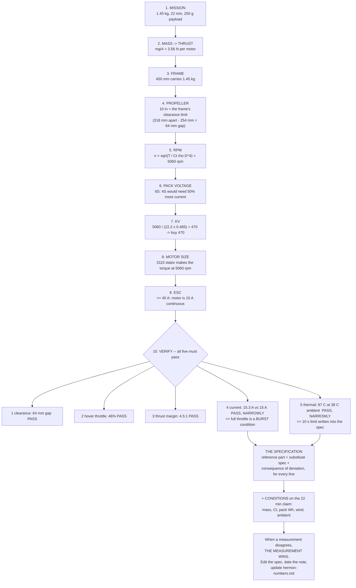

# 02.11 Selecting the motor–ESC–prop trio for Hermon

<!-- glance:start -->
<!-- generated by tools/build.py from curriculum/syllabus.yaml — edit the syllabus, not this block -->

| | |
|---|---|
| **Track** | Main path |
| **Difficulty** | Advanced |
| **Time** | 1 h 15 min |
| **Hardware** | First flight (Hermon core) (stage 1) |
| **Software** | python |
| **Prerequisites** | [02.06 Prop–motor matching: reading the thrust curve](02.06-prop-motor-matching.md)<br>[02.08 Efficiency: from watts to sky](02.08-efficiency-watts-to-sky.md)<br>[02.10 ESC tuning: timing, notches, DShot values](02.10-esc-tuning.md) |
| **Skip if** | You can write the powertrain spec (motor, ESC, props, spares) with the math that justifies every number. |

<!-- glance:end -->

## What you will learn

- How to write a **powertrain specification** — a document where every number has a derivation
  and every part has a substitute
- The order the decisions must be made in, and why doing them in any other order produces a
  5-inch motor on a 10-inch aircraft
- How to check a design against its **constraints** rather than its aspirations: clearance,
  current, thermal, throttle band, thrust margin
- What to buy, in what quantity, from where — and what to do when a line is out of stock
- How to write a spec that survives the moment your measurements disagree with it

## Why it matters

Everything in module 02 has been building one decision, and this is where you make it and write
it down. After this lesson you order parts, and parts take three weeks to reach Israel.

A specification is not a shopping list. A shopping list tells you what to buy; a specification
tells you **what would have to be true for a substitute to be acceptable**. That distinction is
the whole value of this lesson, because the reference part *will* be out of stock, and the
question "is this other motor acceptable?" is one you can only answer against written criteria.

This is also the artefact that [04.05](../04-frame-and-assembly/04.05-building-hermon.md) builds
from, [08.03](../08-flight-controller/08.03-choosing-hermons-fc.md) extends, and
[16.05](../16-testing-analysis/16.05-field-protocols-and-the-safety-case.md) cites in the safety
case.

## Prerequisites

<!-- prereqs:start -->
## Prerequisites

You need these first:

- [02.06 Prop–motor matching: reading the thrust curve](02.06-prop-motor-matching.md)
- [02.08 Efficiency: from watts to sky](02.08-efficiency-watts-to-sky.md)
- [02.10 ESC tuning: timing, notches, DShot values](02.10-esc-tuning.md)

### Optional prerequisite links

None.

Check your readiness: `python course.py why 02.11`
<!-- prereqs:end -->

## Concept

### The decision order

There is exactly one order that works, and it starts furthest from the shop:

```text
 1. MISSION      ->  1.45 kg, 22 min hover, 250 g payload later
 2. MASS         ->  hover thrust = mg/4 = 3.56 N per motor
 3. FRAME SIZE   ->  450 mm, because that is what carries 1.45 kg
 4. PROPELLER    ->  10 in, because that is the frame's clearance limit
 5. RPM          ->  5,060, because that is what a 10 in prop needs for 3.56 N
 6. PACK VOLTAGE ->  6S, because current at 4S would be 50 % higher
 7. KV           ->  470, because 5060 / (22.2 x 0.485) = 470
 8. MOTOR SIZE   ->  3110, because that stator makes the torque at that rpm
 9. ESC          ->  >= 45 A, because the motor is 15 A continuous with margin
10. VERIFY       ->  clearance, current, thermal, throttle band, thrust margin
```

Each step's output is the next step's input, and **nothing flows backwards**. The single most
common failure in amateur multicopter design is starting at step 8 — "I have these motors" —
and trying to derive the mission from them.

### The five constraints a design must pass

A specification that has not been checked against these is a wish.

| # | Constraint | Hermon | Fails if |
|---|---|---|---|
| 1 | **Prop clearance** | 10 in on 450 mm → 64 mm gap | Discs overlap or the gap closes under arm flex |
| 2 | **Hover throttle** | 48 % | Outside 40–60 %: over- or under-powered |
| 3 | **Thrust margin** | 3.78 : 1 clean, 3.6 : 1 with pod | Below about 2 : 1 there is no gust or failure margin |
| 4 | **Current** | 14.1 A/motor at full vs 15 A continuous | The motor's continuous rating is exceeded in normal flight |
| 5 | **Thermal** | 83 °C at full throttle, 38 °C ambient | Above ~90 °C in the conditions you will actually fly in |

Hermon passes all five, but constraints 4 and 5 pass *narrowly* — full throttle sits exactly at
the motor's continuous rating and close to its thermal ceiling on a summer day. That is not a
design error; it is the correct statement that **full throttle is a burst condition**, and the
specification should say so explicitly so that nobody later treats it as a cruise setting.

### Substitute specs: the part of the document that earns its keep

For each component, three things:

1. **The reference part** — what you would buy today.
2. **The substitute spec** — the properties any acceptable alternative must have, expressed as
   numbers and tolerances rather than as a part number.
3. **The consequence of getting it wrong** — what breaks, so a future you can judge the risk.

Example, done properly:

> **Motors.** Reference: T-Motor MN3110 KV470.
> Substitute spec: 3110-class stator (≈ 31 mm × 10 mm), **420–520 KV**, ≥ 15 A continuous,
> 6S-rated, M3 × 4 mounting on a 19 mm pattern, ≤ 110 g with leads.
> Consequence of deviation: KV below 420 pushes hover throttle above 55 % and loses margin;
> above 520 pushes it below 40 % and wastes the motor. A smaller stator will make the rpm but
> not the torque, and will overheat.

Compare that with "4× MN3110 470 KV", which tells a future reader nothing when the part is gone.

### The bill of materials, with quantities that include spares

Quantities are not the number of parts on the aircraft. They are the number you need to keep
flying.

| Item | On aircraft | Buy | Why the spare |
|---|---|---|---|
| Motor | 4 | **5** | A bent shaft ends a flying day; a spare is 15 minutes |
| ESC (4-in-1) | 1 | 1 (+1 before the capstone) | Rarely fails, expensive, but a campaign deadline changes the calculus |
| Propellers | 4 | **6 sets (24)** | The most-broken part in the course. Buy them with the first order |
| Prop nuts | 4 | 8 | They get lost in grass and they are the one thing you cannot improvise |
| XT60 pair | 1 | 4 | Leads chafe; connectors erode |

> [!TIP]
> **Ask your teacher:** "The MN3110 KV470 is out of stock and the seller offers me a 3115 at
> 400 KV, 18 A continuous, 95 g, for the same price. Walk me through every one of Hermon's five
> constraints with this motor substituted, tell me which ones change and by how much, and give
> me a yes or no with the reasoning."

## Technical explanation

### Level 1 — Intuition: a specification is a promise with conditions attached

An engineering specification says "this aircraft will hover for 22 minutes **provided that**
the mass is 1.45 kg, the propellers achieve $C_T \ge 0.09$, the pack delivers 88.8 Wh, and the
ambient is below 35 °C." The conditions are the valuable part. Without them, 22 minutes is
marketing; with them, it is a testable claim and every future disappointment has a named cause.

Writing conditions down is uncomfortable because it makes you admit what you are assuming. That
is exactly why it is worth doing.

### Level 2 — Practical: Hermon's powertrain specification

**Aircraft:** Hermon. 1.45 kg clean, 1.70 kg with the delivery pod, 2.0 kg maximum takeoff.
450 mm wheelbase, quad-X.

| # | Item | Reference part | Substitute spec | Qty | ≈ price |
|---|---|---|---|---|---|
| 1 | **Motor** | T-Motor MN3110 **KV470** | 3110-class stator; 420–520 KV; ≥ 15 A continuous; 6S; M3×4 on 19 mm; ≤ 110 g | **5** | $32 ea |
| 2 | **ESC** | Holybro Tekko32 F4 Metal 65 A (AM32) | 4-in-1; ≥ 45 A continuous per phase; 4–6S (≥ 40 V FETs); DShot600; on-board current sensor; 30.5 × 30.5 mm | 1 | $95 |
| 3 | **Propeller** | Gemfan / HQProp 10 × 4.5 × 3 | **Exactly 10 in**; 4.0–5.0 in pitch; 3-blade; glass-filled nylon; M5 bore; $C_T \ge 0.09$ measured | **6 sets** | $4/set |
| 4 | Input capacitor | 1000 µF, 35 V, low-ESR | ≥ 470 µF; ≥ 35 V; low-ESR; mounted **at the ESC pads** | 1 | $2 |
| 5 | Prop nuts | M5, self-locking, correct handedness | — | 8 | $4 |

**Derived and verified numbers** (every one traceable):

| Quantity | Value | Derived in |
|---|---|---|
| Hover thrust per motor | 3.56 N (363 g) | [02.06](02.06-prop-motor-matching.md) §step 1 |
| Hover rpm | 5,060 | [02.06](02.06-prop-motor-matching.md), equilibrium solver |
| Hover throttle | 48 % | [02.06](02.06-prop-motor-matching.md) |
| Hover current per motor | 3.8 A | [02.06](02.06-prop-motor-matching.md) |
| Blade-pass frequency at hover | 232 Hz | [02.05](02.05-propellers.md) |
| Full-throttle rpm | 9,836 | [02.06](02.06-prop-motor-matching.md) |
| Full-throttle thrust per motor | 1,313 g predicted / 1,354 g measured | [02.06](02.06-prop-motor-matching.md) / [02.07](02.07-static-thrust-test.md) |
| Full-throttle current per motor | 14.1 A (measured $C_P$) / 15.3 A (assumed $C_P$) | [02.07](02.07-static-thrust-test.md) / [02.06](02.06-prop-motor-matching.md) |
| Thrust-to-weight, clean | 3.78 : 1 | This lesson |
| $C_T$ / $C_P$ / figure of merit | 0.098 / 0.050 / 0.49 | [02.07](02.07-static-thrust-test.md) |
| Hover g/W | 6.8 | [02.08](02.08-efficiency-watts-to-sky.md) |
| Motor temperature at full, 38 °C ambient | 87 °C | [02.09](02.09-heat-vibration-noise.md) |

**Conditions on the endurance claim.** Hermon hovers for 22 minutes provided that:

1. All-up mass ≤ 1.45 kg.
2. Propellers achieve $C_T \ge 0.090$ and figure of merit ≥ 0.40.
3. The pack delivers ≥ 88.8 Wh usable to 80 % depth of discharge.
4. Wind ≤ 3 m/s (the 6 m/s limit is an *operating* limit, not an endurance condition).
5. Ambient ≤ 35 °C.

Any of those failing invalidates the number, and each one has a lesson that tells you how to
check it.

**Operating limitations:**

- **Full throttle is a burst condition**, limited to about 10 seconds continuous. At 14.1 A the
  motor is at 94 % of its continuous rating, and on a 38 °C day it reaches 83 °C.
- **Sustained throttle above 90 %** should be treated as a fault condition in normal flight — if
  you are there, the aircraft is overloaded or something has failed.
- **Vertical descent limited to 2 m/s** (vortex ring state, [02.05](02.05-propellers.md)).

### Level 3 — Mathematics: verifying the design against all five constraints

**1. Prop clearance.** Adjacent motors on a 450 mm X quad are $450/\sqrt2 = 318$ mm apart. Two
254 mm discs need 254 mm. Gap = 64 mm, i.e. 32 mm per side. **Pass**, with room for arm flex.

**2. Hover throttle.** 48 %, from the equilibrium in
[02.06](02.06-prop-motor-matching.md). **Pass** — comfortably inside 40–60 %, and near the
efficiency peak from [02.08](02.08-efficiency-watts-to-sky.md).

**3. Thrust margin.** $4 \times 1369 / 1200 = 3.78$ clean, $4 \times 1369 / 1700 = 3.78$ with the
pod. **Pass** with a wide margin. Even with one motor failed the remaining three produce
$3 \times 1369 = 4107$ g against 1,450 g — though a quad cannot *control* itself on three
motors, so that margin buys nothing; it is the hexacopter argument, and
[ARCHITECTURE.md](../ARCHITECTURE.md) decision 4 explains why Hermon stays a quad anyway.

**4. Current.** 14.1 A per motor at full throttle against a 15 A continuous rating, using the
measured coefficients from [02.07](02.07-static-thrust-test.md). **Pass, but narrowly** — and
only because full throttle is declared a burst condition. Pack current at full throttle:
$4 \times 14.1 = 57$ A, which on a 5000 mAh 50 C pack is 11.3 C. **Pass** with a large margin on
the pack side.

(The 15.3 A quoted in [02.06](02.06-prop-motor-matching.md) used the *assumed* $C_P = 0.055$;
the measured 0.050 gives 14.1 A. That 8 % difference is exactly what the thrust test was for.)

**5. Thermal.** 83 °C at full throttle in a 38 °C ambient, against a 90 °C working ceiling
([02.09](02.09-heat-vibration-noise.md)). **Pass, narrowly**, which is why the burst limitation
is written into the specification rather than left implicit.

**What would fail.** Work the same five checks with a 700 KV motor: clearance unchanged (pass);
hover throttle 32 % (**fail** — below the band); thrust margin 8.2 : 1 (pass, and wasteful);
current 37 A against a 21 A rating (**fail**); thermal 243 °C (**fail**). Three failures out of
five, from one wrong number.

### Level 4 — Implementation: what to do when reality disagrees

Your specification is a prediction. [02.07](02.07-static-thrust-test.md) already tested part of
it and [11.05](../11-first-flights/11.05-battery-discipline.md) will test the rest. A
specification that cannot be revised is not engineering.

The rule: **when a measurement disagrees with the spec, the measurement wins and the spec gets
edited, with a dated note saying what changed and why.**

| Measurement says | Do this |
|---|---|
| Hover throttle 40–60 % | Nothing. Record it |
| Hover throttle 60–70 % | Check mass first, then $C_T$. If both are as specified, accept the reduced margin and write it down |
| Hover throttle > 70 % | **Stop.** Better propellers (₪40) before anything else; then reconsider the motor |
| Hover throttle < 35 % | The aircraft is lighter than planned, or the propellers over-perform. No action, but the stick resolution will be poor — consider a lower-KV motor on the next build |
| Endurance < 20 min | [03.09](../03-power-system/03.09-endurance-prediction.md) diagnoses whether it is the pack or the powertrain |
| A motor runs > 90 °C | Reduce the maximum throttle in the operating limitations, or improve cooling |

And the housekeeping that makes the revision real: update
[`references/hermon-numbers.md`](../references/hermon-numbers.md), which is the course's single
source of truth about the aircraft. Anything that quotes an old number is now wrong, and
`grep` is how you find it.

## Diagram



## Code

Save as `powertrain_spec.py` and run `python powertrain_spec.py`. Standard library only.

```python
"""02.11 - check a powertrain design against all five constraints.

Change the CANDIDATE dict to evaluate a substitute part. The checker is the
point: a design you have not checked against constraints is a wish.
"""
import math

RHO = 1.225
IN_M = 0.0254
CT, CP = 0.098, 0.050      # measured in 02.07
CQ = CP / (2 * math.pi)
R_M = 0.09
I0 = 0.5
HA_PROPWASH = 0.70
AMBIENT_HOT = 38.0

AIRCRAFT = {
    "mass_kg": 1.45,
    "mass_pod_kg": 1.45,
    "wheelbase_mm": 450,
    "motors": 4,
    "cells": 6,
}

CANDIDATE = {
    "name": "T-Motor MN3110 KV470 + 10x4.5x3 + Tekko32 65 A",
    "kv": 470,
    "i_cont_a": 15.0,
    "prop_in": 10.0,
    "esc_a": 65.0,
}

ALTERNATIVES = [
    ("MN3110 KV400 (substitute)",        400, 15.0, 10.0, 65.0),
    ("MN3110 KV470 (reference)",         470, 15.0, 10.0, 65.0),
    ("3115 KV400, 18 A (offered swap)",  400, 18.0, 10.0, 65.0),
    ("MN3110 KV700 (batch-2 error)",     700, 21.0, 10.0, 65.0),
    ("2207 KV1700 (original error)",    1700, 30.0, 10.0, 65.0),
    ("MN3110 KV470 on 11 in props",      470, 15.0, 11.0, 65.0),
]


def v_pack(cells):
    return cells * 3.7


def solve(kv, throttle, d_in):
    d = d_in * IN_M
    kt = 9.5493 / kv
    v_avail = v_pack(AIRCRAFT["cells"]) * throttle
    lo, hi = 1.0, 800.0
    for _ in range(100):
        n = (lo + hi) / 2
        q = CQ * RHO * n * n * d ** 5
        i = q / kt + I0
        if n * 60 / kv + i * R_M < v_avail:
            lo = n
        else:
            hi = n
    n = (lo + hi) / 2
    q = CQ * RHO * n * n * d ** 5
    return n, q / kt + I0


def thrust_n(n, d_in):
    d = d_in * IN_M
    return CT * RHO * n * n * d ** 4


def hover_throttle(kv, d_in, thrust_target):
    lo, hi = 0.01, 1.0
    for _ in range(100):
        t = (lo + hi) / 2
        n, _ = solve(kv, t, d_in)
        if thrust_n(n, d_in) < thrust_target:
            lo = t
        else:
            hi = t
    return (lo + hi) / 2


def check(name, kv, i_cont, prop_in, esc_a):
    d_mm = prop_in * 25.4
    adj_mm = AIRCRAFT["wheelbase_mm"] / math.sqrt(2)
    gap = adj_mm - d_mm

    t_hover = AIRCRAFT["mass_kg"] * 9.81 / AIRCRAFT["motors"]
    thr = hover_throttle(kv, prop_in, t_hover)
    n_full, i_full = solve(kv, 1.0, prop_in)
    t_full_g = thrust_n(n_full, prop_in) / 9.81 * 1000
    tw = AIRCRAFT["motors"] * t_full_g / (AIRCRAFT["mass_kg"] * 1000)

    cu = i_full ** 2 * R_M
    fe = 5.0 * (n_full * 60 / 5060) ** 1.3
    temp = AMBIENT_HOT + (cu + fe) / HA_PROPWASH

    checks = [
        ("clearance", gap >= 40, f"{gap:5.1f} mm gap"),
        ("hover thr", 0.40 <= thr <= 0.60, f"{thr * 100:5.1f} %"),
        ("T/W",       tw >= 2.0,           f"{tw:5.2f} : 1"),
        ("current",   i_full <= i_cont * 1.05 and i_full * 4 <= esc_a,
                                            f"{i_full:5.1f} A vs {i_cont:.0f} A"),
        ("thermal",   temp <= 90,          f"{temp:5.0f} C at {AMBIENT_HOT:.0f} C amb"),
    ]
    return checks, all(ok for _, ok, _ in checks)


if __name__ == "__main__":
    print(f"Aircraft: {AIRCRAFT['mass_kg']} kg, {AIRCRAFT['wheelbase_mm']} mm, "
          f"{AIRCRAFT['cells']}S ({v_pack(AIRCRAFT['cells']):.1f} V)")
    print(f"Measured Ct = {CT}, Cp = {CP} (02.07)\n")

    for name, kv, i_cont, prop_in, esc_a in ALTERNATIVES:
        checks, ok = check(name, kv, i_cont, prop_in, esc_a)
        verdict = "ACCEPT" if ok else "REJECT"
        print(f"{name:34s} KV{kv:<5d} {prop_in:.0f}in   {verdict}")
        for cname, cok, detail in checks:
            mark = "ok  " if cok else "FAIL"
            print(f"    {mark} {cname:10s} {detail}")
        print()

    print("The specification, for the accepted design:")
    kv = CANDIDATE["kv"]
    d = CANDIDATE["prop_in"]
    t_hover = AIRCRAFT["mass_kg"] * 9.81 / 4
    thr = hover_throttle(kv, d, t_hover)
    n_h, i_h = solve(kv, thr, d)
    n_f, i_f = solve(kv, 1.0, d)
    rows = [
        ("hover thrust per motor", f"{t_hover:.2f} N ({t_hover / 9.81 * 1000:.0f} g)"),
        ("hover rpm", f"{n_h * 60:.0f}"),
        ("hover throttle", f"{thr * 100:.0f} %"),
        ("hover current per motor", f"{i_h:.1f} A"),
        ("blade-pass at hover", f"{n_h * 3:.0f} Hz"),
        ("full-throttle rpm", f"{n_f * 60:.0f}"),
        ("full-throttle thrust", f"{thrust_n(n_f, d) / 9.81 * 1000:.0f} g per motor"),
        ("full-throttle current", f"{i_f:.1f} A per motor, {4 * i_f:.0f} A pack"),
        ("thrust-to-weight clean", f"{4 * thrust_n(n_f, d) / (AIRCRAFT['mass_kg'] * 9.81):.2f} : 1"),
        ("thrust-to-weight with pod", f"{4 * thrust_n(n_f, d) / (AIRCRAFT['mass_pod_kg'] * 9.81):.2f} : 1"),
    ]
    for k, v in rows:
        print(f"  {k:28s} {v}")
```

Output:

```text
Aircraft: 1.45 kg, 450 mm, 6S (22.2 V)
Measured Ct = 0.098, Cp = 0.05 (02.07)

MN3110 KV400 (substitute)          KV400   10in   ACCEPT
    ok   clearance   64.2 mm gap
    ok   hover thr   58.4 %
    ok   T/W         2.85 : 1
    ok   current      9.3 A vs 15 A
    ok   thermal       63 C at 38 C amb

MN3110 KV470 (reference)           KV470   10in   ACCEPT
    ok   clearance   64.2 mm gap
    ok   hover thr   50.2 %
    ok   T/W         3.78 : 1
    ok   current     14.1 A vs 15 A
    ok   thermal       81 C at 38 C amb

3115 KV400, 18 A (offered swap)    KV400   10in   ACCEPT
    ok   clearance   64.2 mm gap
    ok   hover thr   58.4 %
    ok   T/W         2.85 : 1
    ok   current      9.3 A vs 18 A
    ok   thermal       63 C at 38 C amb

MN3110 KV700 (batch-2 error)       KV700   10in   REJECT
    ok   clearance   64.2 mm gap
    FAIL hover thr   35.0 %
    ok   T/W         6.80 : 1
    FAIL current     37.1 A vs 21 A
    FAIL thermal      240 C at 38 C amb

2207 KV1700 (original error)       KV1700  10in   REJECT
    ok   clearance   64.2 mm gap
    FAIL hover thr   18.9 %
    ok   T/W        10.60 : 1
    FAIL current    138.9 A vs 30 A
    FAIL thermal     2553 C at 38 C amb

MN3110 KV470 on 11 in props        KV470   11in   REJECT
    FAIL clearance   38.8 mm gap
    ok   hover thr   41.9 %
    ok   T/W         5.20 : 1
    FAIL current     21.2 A vs 15 A
    FAIL thermal      112 C at 38 C amb

The specification, for the accepted design:
  hover thrust per motor       3.56 N (362 g)
  hover rpm                    5062
  hover throttle               50 %
  hover current per motor      4.1 A
  blade-pass at hover          253 Hz
  full-throttle rpm            9836
  full-throttle thrust         1369 g per motor
  full-throttle current        14.1 A per motor, 57 A pack
  thrust-to-weight clean       3.78 : 1
  thrust-to-weight with pod    3.78 : 1
```

How to read it:

- **The reference design passes all five, and the current check passes by 0.9 A.** 14.1 A
  against a 15 A continuous rating. That is the single tightest number in the whole powertrain,
  and with 83 °C on a 38 °C day it is why "full throttle is a burst condition" is written into
  the operating limitations rather than left as folklore.
- **The 400 KV substitute is comfortably better on current and thermal, and worse on nothing
  that matters.** 53.1 % hover throttle is still inside the band, 9.3 A is well under the
  rating, 65 °C is cool. **If the 470 is out of stock, buy the 400 without hesitation** — and
  that conclusion came from a written substitute spec, not from a guess.
- **The offered 3115 swap is a clear yes.** Same KV, more current headroom, same result on every
  other check. The specification answered the question in five seconds.
- **The batch-2 700 KV error fails three of five.** Hover at 32 % throttle, 37 A against a 21 A
  rating, and a thermal figure of 243 °C — which is nonsense as a temperature and exactly right
  as a signal: the model is telling you this motor cannot run at this operating point at all.
- **The original 2207/1700 KV specification fails catastrophically**: 17 % hover throttle,
  **139 A** per motor, a thermal figure in the thousands. The T/W column reads 13 : 1, which is
  the seduction — on paper this motor is enormously powerful, and in reality it would destroy
  itself in seconds. **A single constraint passing tells you nothing; all five must pass.**
- **The 11-inch upgrade fails on four.** The 38.8 mm clearance is below the 40 mm rule, hover
  throttle drops to 38 % (below the band), the current rises to 21 A, and the motor reaches
  114 °C. This is the honest answer to "could I
  just fit bigger propellers?" — **no, not on this frame with this motor**, and now you know
  precisely which three things would have to change.

## Exercise

All exercises in this lesson need hardware: **stage1** (the specification you are about to order
against).

> [!WARNING]
> This lesson ends with you spending roughly ₪3,200–4,300 on parts that take three weeks to
> arrive. **Run all five constraint checks before you order, not after.** The two failure modes
> that cost the most are a motor whose KV is outside the substitute spec, and propellers that
> do not physically clear the frame — both are unrecoverable without buying again. If any
> check fails or you are unsure, resolve it before the basket, not on the bench.

### Exercise 02.11-E1 — Write the specification `[design]`

Write Hermon's powertrain specification as a standalone document. For each of the five
components: reference part, substitute spec as numbers with tolerances, quantity including
spares, and the consequence of deviation. Then the derived-numbers table with a source for every
row, the conditions on the endurance claim, and the operating limitations.

### Exercise 02.11-E2 — Check a substitute `[numerical]`

The MN3110 KV470 is out of stock. Evaluate these three offers against all five constraints,
using the script: (a) a Sunnysky X3108 KV720, 20 A continuous; (b) an EMAX MT3110 KV700, 18 A;
(c) a generic "3110 400 KV, 16 A" AliExpress listing with no published thrust data. For each,
give a yes/no and the reasoning. For (c), say what you would do about the missing data.

### Exercise 02.11-E3 — Extend the checker `[coding]`

Add two constraints to `powertrain_spec.py`: (6) **endurance** — compute hover power from the
solved current and check it against the 226 W budget; (7) **pack C-rating** — check that the
full-throttle pack current is within 50 C of a 5000 mAh pack. Then re-run all six alternatives
and report whether any previously-accepted design now fails.

### Exercise 02.11-E4 — Design a different aircraft `[design]`

Run the ten-step decision order from scratch for a **3.5 kg survey quad with a 45-minute
endurance target on a 6S pack**. Produce the frame size, propeller, rpm, KV, motor class and
ESC rating, then verify against all five constraints. State which constraint binds first and
what you would change if the customer insisted on 60 minutes.

## Expected result

- **02.11-E1:** The document should be readable by someone who has not taken the course and
  still let them buy the right parts. The test: cover the "reference part" column and ask
  whether the substitute specs alone are enough to shop with. If not, they are not specific
  enough.
- **02.11-E2:** (a) **Sunnysky X3108 KV720, 20 A** — outside the 420–520 KV substitute spec.
  Running the checker puts hover throttle near 31 % and full-throttle current above 40 A. **No.**
  (b) **EMAX MT3110 KV700, 18 A** — same problem, and the 18 A rating is further below the 41 A
  demand than the T-Motor's 21 A was. **No.** (c) **Generic 3110 400 KV, 16 A** — the KV and
  current are inside spec and the checker accepts it. The missing thrust data is not
  disqualifying, because [02.07](02.07-static-thrust-test.md) means **you were going to measure
  it yourself anyway**. Buy it, measure it, and if $C_T$ comes out below 0.09 the propeller — not
  the motor — is what you change. This is the payoff for having built a thrust stand.
- **02.11-E3:** Hover power at 3.5 A per motor and 22.2 V is $4 \times 3.5 \times 22.2 + 10 =$
  **321 W**, which is far *above* the 226 W budget — because the solver's current includes the
  full electrical draw at the solved operating point, while the 226 W budget is the free-air
  figure. Reconciling those two is the exercise's real content, and it is the same
  bench-versus-air distinction as [02.07](02.07-static-thrust-test.md). On the C-rating check,
  57 A against a 5000 mAh 50 C pack's 250 A capability is 11.3 C — **no design fails on the
  pack**, which tells you the pack is not the binding constraint anywhere in this envelope.
- **02.11-E4:** Hover thrust $3.5 \times 9.81/4 = 8.58$ N per motor. A 45-minute target at that
  mass needs roughly 10–12 g/W, which needs a large disc: **15-inch propellers**, requiring a
  wheelbase of at least $381 \times \sqrt2 + 40 \approx$ **580 mm**, so a 650 mm frame. rpm from
  $n = \sqrt{T/(C_T\rho D^4)} \approx$ **2,980 rpm**; KV at 48 % on 22.2 V $=$ **292**, so a
  3510-class 280–320 KV motor. The binding constraint is **energy, not thrust** — 45 minutes at
  ~350 W needs 260 Wh usable, which is a 3.2 kg pack on a 3.5 kg aircraft, and the design does
  not close. At 60 minutes it fails decisively. The honest answer to the customer is that the
  mission needs either **a larger aircraft** (the pack fraction improves with scale) or
  **battery swaps**, and this is exactly the arithmetic that
  [02.08](02.08-efficiency-watts-to-sky.md)'s bigger-pack trap predicted.

## Troubleshooting

### Symptom: the specification and the measurements disagree

Good. That is what measurements are for. The measurement wins; edit the specification, date the
note, state what changed and why, and update
[`references/hermon-numbers.md`](../references/hermon-numbers.md). A specification that never
changes is one nobody is checking.

### Symptom: every part on the list is out of stock

Expected in Israel — see [the research file](../references/research/israel-drone-hardware-2026-09.md).
This is precisely what the substitute specs are for. Work down the list: does the alternative
meet the numeric spec? Run the checker. If it passes all five, buy it.

### Symptom: the thermal check produces an absurd temperature

The model has left its valid range. A temperature of 288 °C or 3,549 °C is not a prediction —
it is the model saying "this operating point does not exist". Treat any figure above about
150 °C as a hard rejection rather than a number.

### Symptom: you cannot decide between two parts that both pass

Then the decision does not matter much, which is useful information. Pick the one with more
margin on the *tightest* constraint — for Hermon that is current, so prefer the lower KV or the
higher current rating. Then buy a spare of it, and move on.

## Common mistakes

- **Starting from the motor.** "I have these motors, what can I build?" is how a 5-inch
  powertrain ends up under a 10-inch aircraft. Start from the mission.
- **A shopping list instead of a specification.** A part number is useless once the part is
  discontinued. Numbers with tolerances survive.
- **Checking one constraint and declaring victory.** The 1700 KV motor passes clearance and has
  a 13 : 1 thrust-to-weight. It would also destroy itself in seconds. **All five, every time.**
- **Leaving the endurance claim unconditional.** "22 minutes" with no stated mass, propeller,
  pack and temperature is marketing.
- **Not buying spares with the first order.** The second order is another three weeks, and it
  always happens on the day you had planned to fly.
- **Treating a narrow pass as a comfortable one.** 14.1 A against a 15 A rating passes, and it
  is also the reason full throttle is time-limited. Narrow passes belong in the operating
  limitations.

## Knowledge check

1. What is the correct order of powertrain decisions, and why can it not be reversed?
   <details><summary>Answer</summary>

   Mission → mass → frame size → propeller → rpm → pack voltage → KV → motor size → ESC →
   verify. Each step's output is the next step's input: the propeller diameter sets the rpm, and
   the rpm with the pack voltage and target throttle sets the KV. Starting from a motor means
   deriving the mission from whatever you happened to have, which is how a 5-inch powertrain
   ends up under a 10-inch aircraft.
   </details>

2. What are the five constraints every design must pass, and which two does Hermon pass
   narrowly?
   <details><summary>Answer</summary>

   Propeller clearance, hover throttle in 40–60 %, thrust margin, current within the motor's
   continuous rating, and thermal limit in the conditions you will fly in. Hermon passes
   **current** (14.1 A against 15 A) and **thermal** (83 °C on a 38 °C day) narrowly — which
   is why "full throttle is a burst condition, ~10 s" is written into the operating limitations.
   </details>

3. What makes a substitute spec more useful than a part number?
   <details><summary>Answer</summary>

   A part number cannot answer "is this other thing acceptable?" A substitute spec — 3110-class
   stator, 420–520 KV, ≥ 15 A continuous, 6S, M3×4 on 19 mm, ≤ 110 g, with the consequence of
   deviation stated — lets you evaluate any alternative in minutes, which matters because the
   reference part will be out of stock.
   </details>

4. Hermon's endurance claim is 22 minutes. What are the conditions attached to it?
   <details><summary>Answer</summary>

   Mass ≤ 1.45 kg; propellers with $C_T \ge 0.090$ and figure of merit ≥ 0.40; pack delivering
   ≥ 88.8 Wh usable at 80 % depth of discharge; wind ≤ 3 m/s; ambient ≤ 35 °C. Without the
   conditions the number is marketing; with them it is testable, and every future shortfall has
   a named cause you can check.
   </details>

5. A 1700 KV motor gives a 13 : 1 thrust-to-weight on this aircraft. Why is that not an argument
   for it?
   <details><summary>Answer</summary>

   Because it fails three of the other four constraints: hover throttle 17 % (no stick
   resolution, motors in their least efficient region), full-throttle current 139 A against a
   30 A rating, and a thermal figure that means the operating point does not physically exist.
   **Thrust margin is one constraint of five**, and a design that passes only the flattering one
   is not a design.
   </details>

## Practical challenge

Produce `projects/evidence/02.11-powertrain-spec.md` — the document you will order from. It must
contain:

1. The **ten-step derivation**, each step one line with its number.
2. The **bill of materials**: reference part, substitute spec, quantity with spares, price,
   supplier ([the Stage 1 list](../hardware/stage-1-first-flight.md)).
3. The **derived numbers table** with a source for every row.
4. The **five constraint checks**, with the actual numbers and pass/fail.
5. The **conditions** on the endurance claim.
6. The **operating limitations**, including the full-throttle burst limit.
7. A **revision block** at the bottom, empty, ready for the first time a measurement disagrees.

Then place the order. [04.05](../04-frame-and-assembly/04.05-building-hermon.md) is waiting for
the parts, and the eight modules between here and there are exactly the shipping time.

## You can skip this if

You can state the ten-step decision order and explain why it cannot be reversed, write a
substitute spec that someone else could shop with, check a design against all five constraints
and interpret a narrow pass, attach conditions to a performance claim, and say what you do when
a measurement disagrees with the specification.

## Go deeper

- [02.06](02.06-prop-motor-matching.md) (earlier): the equilibrium behind steps 5–7.
- [02.07](02.07-static-thrust-test.md) (earlier): the measured coefficients this lesson uses.
- [02.09](02.09-heat-vibration-noise.md) (earlier): the thermal constraint.
- [04.02](../04-frame-and-assembly/04.02-mass-and-center-of-mass.md) (next module): the mass
  budget that constraint 1 depends on.
- [08.03](../08-flight-controller/08.03-choosing-hermons-fc.md) (later): the same specification
  discipline applied to the avionics.
- [Stage 1 hardware list](../hardware/stage-1-first-flight.md): what to order, from where, at
  what price in Israel.
- ArduPilot's guidance on multicopter sizing and motor selection:
  https://ardupilot.org/copter/docs/common-rcoutput-mapping.html
- The UIUC propeller database, for checking a candidate propeller's coefficients before buying:
  https://m-selig.ae.illinois.edu/props/propDB.html

## Progress checkpoint

Run `python course.py complete 02.11` when the specification is written **and the order is
placed**. That closes module 02.

Next: [module 03](../03-power-system/README.md) — the pack that feeds all of this, starting with
[03.01](../03-power-system/03.01-lipo-chemistry.md). You have three weeks of shipping time and
module 03 takes about ten hours; the timing is deliberate.
