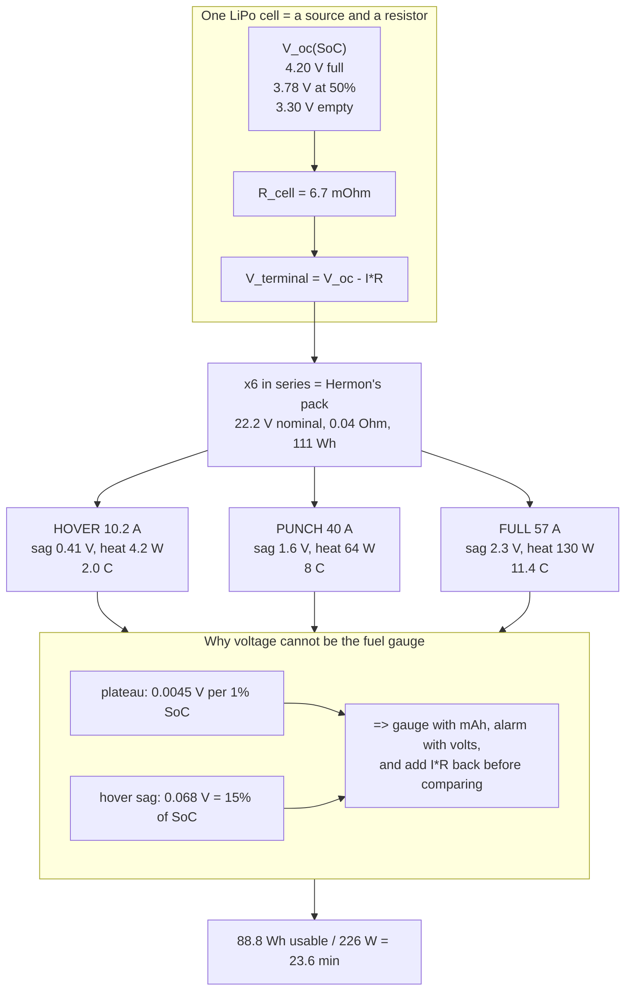

# 03.01 LiPo chemistry in 60 minutes (what the numbers mean)

<!-- glance:start -->
<!-- generated by tools/build.py from curriculum/syllabus.yaml — edit the syllabus, not this block -->

| | |
|---|---|
| **Track** | Main path |
| **Difficulty** | Intermediate |
| **Time** | 1 h |
| **Hardware** | none |
| **Software** | python |
| **Prerequisites** | [02.02 KV, torque and the motor curve](../02-motors-escs-props/02.02-kv-torque-curve.md) |
| **Optional prerequisites** | [FEL.03 Lithium-polymer packs from zero](../optional-foundations/drone-electronics-power/FEL.03-lipo-deep-dive.md) |
| **Skip if** | You can explain what "6S 5000 mAh 40C" means, what the voltage numbers mean, and why a LiPo is a fuel tank. |

<!-- glance:end -->

## What you will learn

- What is physically happening inside a lithium-polymer cell, and why the answer is "3.7 volts"
- How to read **"6S 5000 mAh 50C 111 Wh"** completely — every number, what sets it, and which one
  of the four is marketing
- The **discharge curve**: why a LiPo holds its voltage flat and then falls off a cliff, and why
  that shape makes voltage a poor fuel gauge and a good alarm
- Why **watt-hours**, not milliamp-hours, is the number you compare packs with
- **Internal resistance** — the one measurement that tells you whether a pack is healthy, fresh,
  lying about its C-rating, or about to be thrown away
- Why Hermon flies for 22 minutes and a petrol aircraft of the same mass flies for six hours

## Why it matters

Everything you did in module 02 spends energy. This module is where the energy comes from, and
the pack is the single component that decides more of Hermon's specification than any other: it
is the **heaviest item on the aircraft** (720 g of a 1,450 g machine — 60 % of the mass), it sets
the endurance, it sets the voltage every other component must tolerate, and it is the only part
that can set your workshop on fire.

It is also the part people understand worst. The label on a hobby LiPo contains one number that
is a physical constant, two that are approximately honest, and one that is very nearly fiction.
This lesson teaches you to tell them apart, because
[03.02](03.02-pack-configuration.md) and [03.03](03.03-c-rating-voltage-sag.md) both depend on
knowing which numbers you can build on.

## Prerequisites

<!-- prereqs:start -->
## Prerequisites

You need these first:

- [02.02 KV, torque and the motor curve](../02-motors-escs-props/02.02-kv-torque-curve.md)

### Optional prerequisite links

New to any of these? Take the foundation lesson first; skip it if you already know it.

- [FEL.03 Lithium-polymer packs from zero](../optional-foundations/drone-electronics-power/FEL.03-lipo-deep-dive.md)

Check your readiness: `python course.py why 03.01`
<!-- prereqs:end -->

## Concept

### What is inside the pouch

A lithium-polymer cell is a lithium-ion cell in a soft foil bag instead of a metal can. The
chemistry is the same; only the packaging differs. Inside, four layers repeat dozens of times:

```text
  [+] cathode : lithium cobalt oxide (LiCoO2) on aluminium foil
      separator : porous polymer soaked in electrolyte
  [-] anode   : graphite on copper foil
      separator
      ... repeat ...
```

Charging pushes lithium ions out of the cathode lattice, through the electrolyte, and into the
spaces between the graphite sheets of the anode. Discharging lets them go back. **Nothing burns,
nothing is consumed, and no mass moves in or out of the cell.** The lithium just shuttles.

Two consequences follow immediately and both matter for flight:

1. **The cell's voltage is set by chemistry, not by design.** The energy difference between
   "lithium in cobalt oxide" and "lithium in graphite" is about 3.7 electron-volts per ion, so
   every cell of this chemistry that has ever been made or ever will be made is a 3.7 V cell.
   You cannot buy a 5 V one. If you need more voltage you wire cells in series, which is what
   the "6S" means, and which is [03.02](03.02-pack-configuration.md).
2. **The pack does not get lighter as it empties.** A petrol aircraft burns 30 % of its takeoff
   mass and climbs as it flies; Hermon weighs exactly 1,450 g at minute 25 as it did at minute
   zero. Hover power is therefore **constant through the flight**, which makes the endurance
   arithmetic in [03.09](03.09-endurance-prediction.md) refreshingly simple and is why the
   226 W budget applies end to end.

### The label, decoded completely

Hermon's pack reads **6S 5000 mAh 50C 111 Wh**.

| Number | Means | Where it comes from | Trust it? |
|---|---|---|---|
| **6S** | 6 cells in **s**eries. 6 × 3.7 = **22.2 V** nominal, 6 × 4.20 = **25.2 V** full, 6 × 3.30 = 19.8 V empty | Physics × an integer. There is nothing to argue with | **Completely** |
| **5000 mAh** | 5.0 amp-hours of **charge**. The cell can deliver 5 A for one hour, or 10 A for half an hour | Electrode mass. Measurable, and usually within 5 % | **Mostly** — verify it once ([03.03](03.03-c-rating-voltage-sag.md)) |
| **50C** | Claimed continuous discharge = 50 × 5 Ah = **250 A** | Marketing | **No.** See below |
| **111 Wh** | 22.2 V × 5.0 Ah = 111 watt-hours of **energy** | Arithmetic on the first two | **Yes, if the mAh is honest** |

**The 50C number is the fiction.** 250 A through a 720 g pack with 0.04 Ω of internal resistance
would dissipate $I^2R = 250^2 \times 0.04 = 2{,}500$ W *inside the pack* — roughly the power of a
domestic kettle, in a foil bag. The pack would be at its venting temperature in a few seconds.
No 5000 mAh hobby cell delivers 250 A for any length of time, and the manufacturer knows it.

The honest way to read it: **C-ratings are a sorting label, not a specification.** A 50C pack is
better than a 25C pack from the same maker, and that is all the number reliably tells you. The
specification you can actually build on is **internal resistance**, and
[03.03](03.03-c-rating-voltage-sag.md) is built on it.

**What Hermon actually asks of the pack:**

| Condition | Current | As a C-rate |
|---|---|---|
| Hover | 10.2 A | **2.0 C** |
| Punch-out / hard climb | 40 A | 8 C |
| All four motors at full throttle | 57 A | 11.4 C |

Hermon never exceeds 12 C. The pack is claimed to do 50 C. Even discounting the claim by a
factor of four, there is margin — which is the real reason the specification is comfortable, not
the number printed on the shrink-wrap.

### mAh is charge; Wh is energy

This is the distinction that separates people who can size a power system from people who cannot.

- **Milliamp-hours (mAh)** count **charge** — how many electrons, regardless of how hard they
  were pushed. 5000 mAh on a 1S cell and 5000 mAh on a 6S pack are the same number of electrons
  and wildly different amounts of energy.
- **Watt-hours (Wh)** count **energy** — charge × voltage. This is the number that divides into
  power to give time.

$$E = V_{nominal} \times Q = 22.2\ \text{V} \times 5.0\ \text{Ah} = 111\ \text{Wh}$$

$$t = \frac{E_{usable}}{P} = \frac{88.8\ \text{Wh}}{194\ \text{W}} = 0.458\ \text{h} = 23.6\ \text{min}$$

Endurance is one division, and its numerator is watt-hours. **Any time you compare two packs of
different voltages, convert to Wh first or the comparison is meaningless.** A "7000 mAh" 4S pack
sounds bigger than Hermon's 5000 mAh 6S pack and carries 104 Wh against Hermon's 111 — it is
smaller.

And the 88.8: that is 80 % of 111. You never use the last 20 %, for reasons in
[03.08](03.08-battery-safety.md) and with the failsafes to enforce it in
[03.06](03.06-battery-monitoring.md).

### The discharge curve, and why it is shaped like that

Rest a cell at various states of charge and measure it, and you get this:

| State of charge | Resting volts per cell | 6S pack |
|---|---|---|
| 100 % | 4.20 | 25.20 |
| 90 % | 4.08 | 24.48 |
| 80 % | 3.97 | 23.82 |
| 70 % | 3.89 | 23.34 |
| 60 % | 3.83 | 22.98 |
| 50 % | 3.78 | 22.68 |
| 40 % | 3.75 | 22.50 |
| 30 % | 3.71 | 22.26 |
| **20 % — your floor** | **3.66** | **21.96** |
| 10 % | 3.56 | 21.36 |
| 0 % | 3.30 | 19.80 |

Three regions, and each one is a different engineering problem:

- **The top (100–80 %)** falls steeply, 0.23 V in 20 % of charge. Voltage is a decent fuel gauge
  here.
- **The plateau (70–30 %)** is almost flat — **0.18 V across 40 % of the pack's charge**, or
  about 0.045 V per 10 %. This is the physically desirable part (your motors see a nearly
  constant supply for most of the flight) and it is the part that makes voltage useless as a
  fuel gauge.
- **The cliff (below 20 %)** falls off fast, and below 3.30 V per cell the cell starts to damage
  itself permanently. This is where voltage becomes an excellent *alarm* even though it was a
  bad *gauge*.

**Now put a load on it.** At hover Hermon draws 10.2 A, and each cell has about 6.7 mΩ of
internal resistance:

$$\Delta V_{cell} = I R_{cell} = 10.2 \times 0.0067 = 0.068\ \text{V}$$

**68 mV of sag, against 45 mV per 10 % of state of charge.** Simply lifting off makes the pack
read as though it had lost 15 % of its charge, and it recovers the instant you land. Push the
throttle to a 40 A punch-out and the sag is 0.27 V per cell — **the pack reads empty while it is
half full.**

> [!IMPORTANT]
> **This is the single most important consequence of LiPo chemistry for flight software.**
> Under load, pack voltage is not a measurement of energy; it is a measurement of energy minus
> an unknown multiple of current. Which is why Hermon does not use voltage as its fuel gauge —
> it counts milliamp-hours out of the pack ([03.06](03.06-battery-monitoring.md)) and uses
> voltage only as a floor, with the sag explicitly compensated.

### Internal resistance: the number that is actually true

Every cell is a perfect voltage source in series with a small resistor. That resistor is where
all of LiPo's inconvenient behaviour lives:

| It causes | Because |
|---|---|
| Voltage sag | $\Delta V = IR$ |
| Heat in the pack | $P = I^2R$ |
| The real current limit | Sag and heat, not the printed C-rating |
| The ageing signal | $R$ rises as the cell degrades |

Hermon's pack: **0.04 Ω total, 6.7 mΩ per cell.** What that costs:

| Current | Sag (pack) | Heat burnt inside the pack |
|---|---|---|
| 10.2 A (hover) | 0.41 V | 4.2 W |
| 40 A (punch) | 1.6 V | 64 W |
| 57 A (full) | 2.3 V | 130 W |

At full throttle the pack is heating itself with 130 W while delivering 1,270 W — about 10 % of
the energy never leaves the battery. This is why hard flying warms a pack and hovering does not.

**As a cell ages, $R$ rises.** A pack whose internal resistance has doubled has not lost much
capacity, but it sags twice as much, heats four times as much at the same current, and will trip
your voltage failsafe early. Measuring $R$ once a month is how you know when to retire a pack —
[03.07](03.07-charging-balancing-storage.md) shows the measurement, which most balance chargers
will do for you in ten seconds.

### Why 22 minutes and not six hours

| Fuel | Energy density | Hermon's 720 g would hold |
|---|---|---|
| **LiPo pack** | **154 Wh/kg** | **111 Wh** |
| Petrol | ~12,000 Wh/kg | 8,640 Wh |
| Li-ion 21700 cell (18 650's big brother) | 250–290 Wh/kg | ~190 Wh |
| Hydrogen fuel cell system | 400–800 Wh/kg | ~430 Wh |

Petrol holds **78 times** more energy per kilogram. A petrol engine wastes three quarters of it
where an electric powertrain wastes a third, so the real-world advantage is nearer 25× — which
is exactly why a petrol model aircraft of Hermon's mass flies for hours and Hermon flies for
22 minutes.

Hermon's 154 Wh/kg is *pack-level*, including the foil, tabs, wiring and connector. Bare cells
of this chemistry reach 180–200 Wh/kg. The 21700 cylindrical cells in the third row look
tempting until you notice they cannot deliver 57 A without eight of them in parallel — **energy
density and power density are different specifications, and multirotors need both.** That trade
is [03.02](03.02-pack-configuration.md).

> [!TIP]
> **Ask your teacher:** "My pack's resting voltage reads 22.4 V but the moment I hover it shows
> 21.9 V. Walk me through exactly how much of that drop is sag and how much is real discharge,
> using an internal resistance of 0.04 Ω and a hover current of 10.2 A — and then tell me what
> state of charge I am actually at."

## Technical explanation

### Level 1 — Intuition: a tank with a narrow pipe

Think of the pack as a water tank. The **watt-hours are how much water is in it**. The
**internal resistance is how narrow the outlet pipe is.**

Draw water slowly and the tank's level (voltage) tells you honestly how full it is. Open the tap
wide and the pressure at the outlet drops — not because the tank emptied, but because the pipe
is fighting you. Close the tap and the pressure comes straight back.

That is voltage sag, and it is why a pack that shows 21.9 V in a hover shows 22.4 V thirty
seconds after you land. Nothing refilled. You just stopped pulling.

The narrow pipe also gets hot. All the pressure you lost across it became heat, which is the
$I^2R$ term, and it is the reason a pack that is warm after a gentle flight is a pack that is
telling you its pipe has narrowed with age.

### Level 2 — Practical: the five numbers to know about any pack

Before you fly a pack, you should be able to state these:

| Number | Hermon's | How you get it |
|---|---|---|
| Usable energy | 88.8 Wh | 0.8 × V_nom × Ah |
| Resting voltage now | 22.2–25.2 V | A cell checker, or the FC before arming |
| Internal resistance | 0.04 Ω | The balance charger's IR function |
| Cell spread at full charge | < 0.03 V | The cell checker, after charging |
| Cycle count | track it | Write it on the pack with a marker, from day one |

**Cell spread is the health headline.** Six cells in series all carry identical current, so they
should track each other exactly. If one cell reads 4.20 V and another 4.11 V after a balance
charge, that cell has higher resistance or lower capacity, it will hit the low-voltage cutoff
first, and it defines the pack. Over 0.05 V of spread on a charged pack means the pack is on
notice; over 0.10 V means retire it.

**Cycle count**: expect 150–300 flights before capacity falls to 80 % of nameplate — with wide
variance depending entirely on how you treat it. Storing a pack full at Israeli summer
temperatures can halve that.

### Level 3 — Mathematics: state of charge under load

The cell model is a voltage source $V_{oc}(\text{SoC})$ in series with $R$:

$$V_{terminal} = V_{oc}(\text{SoC}) - I R$$

Which means that if you measure $V_{terminal}$ and want SoC, you must invert it:

$$V_{oc} = V_{terminal} + I R \quad \Rightarrow \quad \text{SoC} = f^{-1}(V_{oc})$$

This is exactly what ArduPilot's `BATT_RESISTANCE` parameter does
([03.06](03.06-battery-monitoring.md)): it adds $IR$ back before comparing against the failsafe
threshold, so a punch-out does not trigger a landing.

**Sensitivity — the reason voltage is a bad gauge.** In the plateau the curve is

$$\frac{dV_{oc}}{d\text{SoC}} \approx \frac{3.89 - 3.71}{40\ \%} = 0.0045\ \text{V per \%}$$

so a voltage error $\epsilon$ becomes a state-of-charge error of $\epsilon / 0.0045$ percent:

| Voltage error, per cell | SoC error |
|---|---|
| 10 mV (a decent ADC) | 2.2 % |
| 68 mV (hover sag, uncompensated) | **15 %** |
| 267 mV (40 A sag, uncompensated) | **59 %** |

Compare **coulomb counting**, which integrates the current:

$$Q_{used} = \int_0^t I\,dt$$

A 2 % error in the current sensor gives a 2 % error in state of charge after a full flight,
independent of load. That is an order of magnitude better than voltage in the plateau, which is
why it is the primary gauge — with the caveat that it has no absolute reference and drifts if
you never reset it, which is why voltage still supervises it.

**Energy actually delivered, including the pack's own loss.** The pack's terminal energy is less
than its chemical energy by the $I^2R$ integral:

$$E_{delivered} = E_{chemical} - \int I^2 R\,dt$$

At hover that is $10.2^2 \times 0.04 = 4.2$ W out of 230 W — **1.8 %**, negligible. At a
continuous 40 A it is 64 W out of 952 W — **6.7 %**, not negligible. A pack flown hard delivers
measurably less energy than the same pack flown gently, and the difference is heat.

### Level 4 — Implementation: what this means for Hermon's software

Three rules fall straight out of the physics, and all three are implemented later in this
module:

1. **Gauge with coulombs, alarm with volts.** `BATT_CAPACITY = 5000`, `BATT_LOW_MAH = 4000`
   (80 % DoD) is the gauge. `BATT_LOW_VOLT` is the alarm, and it exists to catch the case where
   the coulomb counter is wrong — a pack that was not fully charged, a sensor that drifted, a
   pack that has aged. [03.06](03.06-battery-monitoring.md).
2. **Compensate the alarm for sag or it will fire on every climb.** `BATT_RESISTANCE = 0.04`.
   Without it, a 40 A punch-out at 50 % charge drops the pack to 20.6 V, which is below a naïve
   3.50 V/cell (21.0 V) threshold, and the aircraft returns to launch while half full.
3. **Set the floor by the weakest cell, not the pack average.** Six cells summed can read a
   comfortable 21.6 V while one of them sits at 3.2 V and is being damaged. Hermon's failsafe
   thresholds — 3.60 V warn, 3.50 V return, 3.30 V land — are all *per cell* for this reason,
   and a cell checker or per-cell telemetry is the only way to enforce them.

## Diagram



## Code

Save as `lipo.py` and run `python lipo.py`. Standard library only.

```python
"""03.01 - reading a LiPo pack: energy, sag, and why voltage is a bad fuel gauge.

Everything here uses Hermon's frozen pack numbers from references/hermon-numbers.md:
6S 5000 mAh, 22.2 V nominal, 111 Wh, 0.04 ohm internal, 80 % usable.
"""

CELLS = 6
CAPACITY_AH = 5.0
V_NOM_CELL = 3.7
R_PACK = 0.04
R_CELL = R_PACK / CELLS
DOD = 0.80
HOVER_W = 226.0

# Resting (open-circuit) volts per cell against state of charge
OCV = [
    (100, 4.20), (90, 4.08), (80, 3.97), (70, 3.89), (60, 3.83), (50, 3.78),
    (40, 3.75), (30, 3.71), (20, 3.66), (10, 3.56), (0, 3.30),
]


def ocv_cell(soc_pct):
    """Interpolate resting cell voltage at a given state of charge."""
    pts = sorted(OCV)
    if soc_pct <= pts[0][0]:
        return pts[0][1]
    for (s0, v0), (s1, v1) in zip(pts, pts[1:]):
        if s0 <= soc_pct <= s1:
            return v0 + (v1 - v0) * (soc_pct - s0) / (s1 - s0)
    return pts[-1][1]


def soc_from_ocv(v_cell):
    """Invert the curve: resting cell voltage -> state of charge."""
    pts = sorted(OCV, key=lambda p: p[1])
    if v_cell <= pts[0][1]:
        return 0.0
    for (s0, v0), (s1, v1) in zip(pts, pts[1:]):
        if v0 <= v_cell <= v1:
            return s0 + (s1 - s0) * (v_cell - v0) / (v1 - v0)
    return 100.0


if __name__ == "__main__":
    e_nameplate = CELLS * V_NOM_CELL * CAPACITY_AH
    e_usable = e_nameplate * DOD
    print("The label, decoded:")
    print(f"  6S                 {CELLS} cells in series")
    print(f"  nominal            {CELLS * V_NOM_CELL:.1f} V")
    print(f"  full / empty       {CELLS * 4.20:.1f} V / {CELLS * 3.30:.1f} V")
    print(f"  charge             {CAPACITY_AH:.1f} Ah")
    print(f"  energy nameplate   {e_nameplate:.1f} Wh")
    print(f"  energy usable      {e_usable:.1f} Wh at {DOD:.0%} DoD")
    print(f"  endurance at hover {e_usable / HOVER_W * 60:.1f} min at {HOVER_W:.0f} W")

    print("\nWhat Hermon asks of it, and what the pack does about it:")
    print(f"  {'case':22s} {'A':>5s} {'C':>6s} {'sag V':>7s} {'heat W':>7s} {'% lost':>7s}")
    for name, amps in (("hover", 10.2), ("cruise 10 m/s", 9.1),
                       ("punch-out", 40.0), ("all four full", 57.0)):
        sag = amps * R_PACK
        heat = amps ** 2 * R_PACK
        out = amps * (CELLS * V_NOM_CELL - sag)
        print(f"  {name:22s} {amps:5.1f} {amps / CAPACITY_AH:5.1f}C "
              f"{sag:6.2f}V {heat:6.1f}W {heat / (out + heat) * 100:6.1f}%")
    print(f"  nameplate claim        {50 * CAPACITY_AH:5.0f} {50:5d}C "
          f"{50 * CAPACITY_AH * R_PACK:6.2f}V "
          f"{(50 * CAPACITY_AH) ** 2 * R_PACK:6.0f}W   <-- fiction")

    print("\nThe discharge curve, and what a load does to it:")
    print(f"  {'SoC':>4s} {'rest/cell':>10s} {'rest pack':>10s} "
          f"{'hover 10.2A':>11s} {'punch 40A':>10s}")
    for soc in (100, 80, 60, 50, 40, 30, 20, 10):
        vc = ocv_cell(soc)
        print(f"  {soc:3d}% {vc:9.2f}V {vc * CELLS:9.2f}V "
              f"{(vc - 10.2 * R_CELL) * CELLS:10.2f}V "
              f"{(vc - 40.0 * R_CELL) * CELLS:9.2f}V")

    print("\nWhy voltage is a bad gauge: read the pack under load and believe it")
    print(f"  {'true SoC':>9s} {'load':>6s} {'reads/cell':>11s} "
          f"{'you infer':>10s} {'error':>7s}")
    for soc in (80, 60, 40, 30):
        for amps in (10.2, 40.0):
            v_seen = ocv_cell(soc) - amps * R_CELL
            inferred = soc_from_ocv(v_seen)
            print(f"  {soc:8d}% {amps:5.1f}A {v_seen:10.3f}V "
                  f"{inferred:9.1f}% {inferred - soc:+6.1f}%")

    print("\nSensitivity in the plateau (70 % -> 30 %):")
    slope = (ocv_cell(70) - ocv_cell(30)) / 40.0
    print(f"  the curve moves {slope * 1000:.1f} mV per 1 % of charge")
    for label, err_mv in (("a good ADC", 10), ("hover sag", 10.2 * R_CELL * 1000),
                          ("punch sag", 40.0 * R_CELL * 1000)):
        print(f"  {label:12s} {err_mv:6.1f} mV -> {err_mv / 1000 / slope:5.1f} % of SoC")
    print(f"  a 2 % current-sensor error over a whole flight -> 2.0 % of SoC")

    print("\nWhy 22 minutes and not six hours:")
    pack_kg = 0.720
    print(f"  {'fuel':28s} {'Wh/kg':>7s} {'in 720 g':>9s} {'x LiPo':>7s}")
    for fuel, whkg in (("Hermon's LiPo pack", e_nameplate / pack_kg),
                       ("bare LiPo cells", 190), ("21700 Li-ion cells", 270),
                       ("hydrogen fuel cell system", 600), ("petrol", 12000)):
        print(f"  {fuel:28s} {whkg:7.0f} {whkg * pack_kg:8.0f}Wh "
              f"{whkg / (e_nameplate / pack_kg):6.1f}x")
```

Output:

```text
The label, decoded:
  6S                 6 cells in series
  nominal            22.2 V
  full / empty       25.2 V / 19.8 V
  charge             5.0 Ah
  energy nameplate   111.0 Wh
  energy usable      88.8 Wh at 80% DoD
  endurance at hover 23.6 min at 226 W

What Hermon asks of it, and what the pack does about it:
  case                       A      C   sag V  heat W  % lost
  hover                   10.2   2.0C   0.41V    4.2W    1.8%
  cruise 10 m/s            9.1   1.8C   0.36V    3.3W    1.6%
  punch-out               40.0   8.0C   1.60V   64.0W    7.2%
  all four full           57.0  11.4C   2.28V  130.0W   10.3%
  nameplate claim          250    50C  10.00V   2500W   <-- fiction

The discharge curve, and what a load does to it:
   SoC  rest/cell  rest pack hover 10.2A  punch 40A
  100%      4.20V     25.20V      24.79V     23.60V
   80%      3.97V     23.82V      23.41V     22.22V
   60%      3.83V     22.98V      22.57V     21.38V
   50%      3.78V     22.68V      22.27V     21.08V
   40%      3.75V     22.50V      22.09V     20.90V
   30%      3.71V     22.26V      21.85V     20.66V
   20%      3.66V     21.96V      21.55V     20.36V
   10%      3.56V     21.36V      20.95V     19.76V

Why voltage is a bad gauge: read the pack under load and believe it
   true SoC   load  reads/cell  you infer   error
        80%  10.2A      3.902V      71.5%   -8.5%
        80%  40.0A      3.703V      28.7%  -51.3%
        60%  10.2A      3.762V      44.0%  -16.0%
        60%  40.0A      3.563V      10.3%  -49.7%
        40%  10.2A      3.682V      24.4%  -15.6%
        40%  40.0A      3.483V       7.1%  -32.9%
        30%  10.2A      3.642V      18.2%  -11.8%
        30%  40.0A      3.443V       5.5%  -24.5%

Sensitivity in the plateau (70 % -> 30 %):
  the curve moves 4.5 mV per 1 % of charge
  a good ADC     10.0 mV ->   2.2 % of SoC
  hover sag      68.0 mV ->  15.1 % of SoC
  punch sag     266.7 mV ->  59.3 % of SoC
  a 2 % current-sensor error over a whole flight -> 2.0 % of SoC

Why 22 minutes and not six hours:
  fuel                           Wh/kg  in 720 g  x LiPo
  Hermon's LiPo pack               154      111Wh    1.0x
  bare LiPo cells                  190      137Wh    1.2x
  21700 Li-ion cells               270      194Wh    1.8x
  hydrogen fuel cell system        600      432Wh    3.9x
  petrol                         12000     8640Wh   77.8x
```

How to read it:

- **The fiction line is the headline.** The nameplate 50C claim implies 250 A, which would burn
  2.5 kW inside a 720 g foil bag. Hermon's worst case is 57 A. The number you should care about
  is the 0.04 Ω, and it is the number the label does not print.
- **The heat column explains why hard flying warms a pack.** At hover the pack loses 1.5 % of
  its output to its own resistance; at full throttle it loses nearly 10 %. Both the energy and
  the temperature come out of the same term.
- **The load columns on the discharge curve are why voltage failsafes are hard.** At 30 % charge
  a 40 A punch drops the pack to under 20.7 V — below a naïve "3.50 V per cell" threshold — with
  30 % of the energy still in it.
- **The error table quantifies it.** Uncompensated hover sag makes the pack read about 13 % low;
  a punch-out makes it read most of the way to empty. Coulomb counting holds 2 % regardless.
- **The energy-density table is the honest answer to "why so short".** It is not the motors and
  it is not the propellers. Chemistry gives you 78× less energy per kilogram than petrol, and no
  amount of tuning recovers a factor of 78.

## Exercise

All exercises in this lesson can be done on paper and in Python. If you already have a pack,
exercise 03.01-E3 wants the real measurement instead of the model.

> [!WARNING]
> If you have a pack in front of you: do not short the terminals, do not puncture the pouch, do
> not charge it unattended, and do not leave it in a car. A LiPo stores 111 Wh in a container
> with no pressure relief and no fuse. [03.08](03.08-battery-safety.md) has the full rules and
> [SAFETY.md](../SAFETY.md) has the standing ones. Read them before the pack arrives, not after.

### Exercise 03.01-E1 — Read four labels `[analysis]`

For each of these packs, state the nominal voltage, the energy in Wh, the maximum current the
C-rating claims, and whether it could fly Hermon for 22 minutes at 226 W:

| Pack | |
|---|---|
| A | 4S 5200 mAh 35C |
| B | 6S 5000 mAh 50C (Hermon's) |
| C | 3S 10000 mAh 25C |
| D | 6S 3300 mAh 120C |

Then rank them by **usable watt-hours per kilogram**, assuming 154 Wh/kg at pack level for all
four, and say which one is the best buy for an endurance aircraft and which for a racer.

### Exercise 03.01-E2 — The sag inversion `[numerical]`

Your telemetry shows **21.74 V** while climbing at **28 A**. Hermon's pack resistance is 0.04 Ω.
(a) What is the open-circuit voltage? (b) What is the state of charge? (c) What state of charge
would you have inferred if you had trusted the reading directly? (d) At what current does the
uncompensated reading cross a 3.50 V/cell threshold when the pack is genuinely at 50 %?

### Exercise 03.01-E3 — Measure your own pack `[measurement]`

With a charged pack and a cell checker (or your charger's IR function): record resting voltage
per cell, the cell-to-cell spread, and the internal resistance per cell. Then compute the pack's
total resistance, its predicted sag at 10.2 A and at 40 A, and its $I^2R$ heat at both.
Write the date and the numbers on the pack itself with a marker. Repeat in a month.

### Exercise 03.01-E4 — The chemistry you did not buy `[design]`

Hermon could have used 21700 Li-ion cells at 270 Wh/kg instead of a LiPo at 154 Wh/kg — a 75 %
energy advantage. A single 21700 cell delivers about 15 A continuously. Work out how many cells
a 6S pack would need to supply Hermon's 57 A peak, what that pack would weigh, and how much
energy it would actually hold. Then state, in one sentence, why Hermon uses LiPo.

## Expected result

- **03.01-E1:** A = 14.8 V, 77 Wh, 182 A claimed — **no**, 77 × 0.8 / 194 × 60 = 19 min.
  B = 22.2 V, 111 Wh, 250 A claimed — **yes**, 23.6 min. C = 11.1 V, 111 Wh, 250 A claimed —
  the same energy as Hermon's pack, but at 11.1 V the hover current would be 17.5 A and the
  wiring losses four times worse; it also cannot spin a 470 KV motor fast enough. D = 22.2 V,
  73 Wh, 396 A claimed — 18 min, and the 120C is the most fictional number on the list.
  Per kilogram they are identical by construction, which is the point of the exercise: **within
  a chemistry, watt-hours track mass, and the pack you choose is a choice about voltage and
  current, not about energy density.** C is the racer's pack; B is the endurance pack.
- **03.01-E2:** (a) $21.74 + 28 \times 0.04 = 22.86$ V, i.e. 3.810 V/cell. (b) About **53 %**.
  (c) 21.74 V is 3.623 V/cell, which reads as about **17 %** — an error of 36 points.
  (d) At 50 % the cell rests at 3.78 V; it reads 3.50 V when $IR_{cell} = 0.28$ V, i.e.
  **$I = 42$ A**. Hermon's punch-out is 40 A, so you are within 5 % of tripping a naïve failsafe
  on a half-full pack every time you climb hard. This is why `BATT_RESISTANCE` exists.
- **03.01-E3:** Expect 6.0–8.0 mΩ per cell on a healthy new 5000 mAh pack, a spread under 0.02 V
  after a balance charge, and a total near 0.04 Ω. If your measured resistance is above 12 mΩ
  per cell the pack is either old, cold, or not what the label claims — repeat the measurement
  warm, and if it stays high, retire it.
- **03.01-E4:** 57 A ÷ 15 A per cell = **4 in parallel**, so a 6S4P pack = 24 cells. At 70 g and
  17 Wh each that is **1,680 g and 408 Wh**. It holds 3.7× the energy of the LiPo but weighs
  2.3× as much, taking Hermon from 1.45 kg to 2.16 kg — over the 2.0 kg MTOM, with hover power
  up by a factor of $(2.16/1.45)^{1.5} = 2.4$. Endurance works out *better* on paper, but it is
  a different, heavier, slower aircraft that cannot hold its own maximum takeoff mass. **LiPo is
  chosen for power density, not energy density** — a multirotor needs both and LiPo is the only
  chemistry that is adequate at both.

## Troubleshooting

### Symptom: a brand-new pack reads 3.85 V per cell out of the box

That is correct and deliberate. Reputable manufacturers ship packs at **storage charge**
(3.80–3.85 V/cell, roughly 50 %), because a LiPo stored full ages fast. Charge it before flying
and store it back at 3.80 V afterwards — [03.07](03.07-charging-balancing-storage.md).

### Symptom: the pack measures 4,300 mAh when you discharge it, not 5,000

Common, and it is worth knowing the difference between two causes. If the pack is new, the
label was optimistic — recalibrate `BATT_CAPACITY` to your measured value and move on. If the
pack was once 5,000, it has aged, and 4,300 is 86 % of nameplate; at 80 % the pack is done.
Measure the internal resistance at the same time: capacity fade and resistance rise usually
arrive together, and resistance rises first.

### Symptom: one cell is always 0.1 V below the others

That cell has lower capacity or higher resistance, and it will always hit the cutoff first, so
it defines the pack's usable energy no matter what the other five do. A balance charger will
bring it up at the top of the charge but cannot fix the underlying mismatch. Retire the pack —
a single weak cell in series is the classic precursor to a cell being driven below 3.0 V, which
is where the interesting failure modes start ([03.08](03.08-battery-safety.md)).

### Symptom: the pack is noticeably warm after a gentle flight

Resistance has risen. Compute $I^2R$ from your hover current and the measured resistance: at
10.2 A a healthy pack makes 3 W, which you would not feel. If it is warm, $R$ has gone up by a
large factor, and the pack is both losing energy and heading for a swelling.

### Symptom: the pack is puffy

Gas from electrolyte decomposition, which does not come back. The pack has been overcharged,
over-discharged, run too hot, or is simply old. It is not repairable and it is not safe to keep
cycling. Discharge it, and dispose of it as in [03.08](03.08-battery-safety.md) —
[03.10](03.10-lipo-in-israel.md) has where to take it in Israel.

## Common mistakes

- **Comparing packs by milliamp-hours.** mAh is charge, not energy. Convert to Wh or the
  comparison is meaningless across different cell counts.
- **Believing the C-rating.** It is a sorting label. Buy on internal resistance and on the
  manufacturer's reputation; verify by measuring sag under a known load.
- **Using pack voltage as a state-of-charge readout in flight.** In the plateau it moves 4.5 mV
  per percent and the sag is ten times that. Count coulombs; use voltage as a floor.
- **Setting a voltage failsafe without a resistance compensation.** It will fire on a climb with
  a half-full pack, and you will learn to ignore it, which is worse than not having it.
- **Judging the pack by its average voltage.** Six cells in series hide one weak cell perfectly
  until the moment it matters.
- **Discharging below 3.30 V per cell to squeeze out the last minutes.** You are trading a
  permanent fraction of the pack's life for 90 seconds of flight, every time.

## Knowledge check

1. What sets a LiPo cell's 3.7 V nominal voltage, and why can you not buy a 5 V cell?
   <details><summary>Answer</summary>

   The electrochemical potential difference between lithium in the cathode lattice (lithium
   cobalt oxide) and lithium intercalated in the graphite anode — about 3.7 eV per ion averaged
   over the discharge. It is a property of the chemistry, not a design parameter. Higher
   voltages are made by wiring cells in series, which is what the S number counts.
   </details>

2. Which of the four numbers on a LiPo label is essentially fiction, and what should you use
   instead?
   <details><summary>Answer</summary>

   The **C-rating**. Hermon's pack claims 50C = 250 A, which would dissipate 2,500 W inside the
   pack at its own 0.04 Ω. Use **internal resistance** instead: it sets the sag ($IR$), the heat
   ($I^2R$), the real current limit, and it is the number that rises as the pack ages.
   </details>

3. Why is voltage a bad fuel gauge but a good alarm?
   <details><summary>Answer</summary>

   Between 70 % and 30 % of charge the resting voltage moves only 0.0045 V per percent, while
   hover sag alone is 0.058 V per cell — worth about 13 % of state of charge — and it appears and
   disappears with throttle. So in the flat region voltage carries almost no information about
   charge. Below 20 % the curve falls off a cliff, and there voltage becomes unambiguous, which
   is exactly what an alarm needs.
   </details>

4. Hermon's pack is 111 Wh. Why is the usable figure 88.8 Wh, and what does that cost you?
   <details><summary>Answer</summary>

   80 % depth of discharge. The last 20 % is reserved because discharging below about 3.30 V per
   cell damages the cell permanently and shortens its life sharply, and because you need margin
   for the approach and landing. It costs 22.2 Wh, which at 226 W is 6.9 minutes — the difference
   between a 34-minute pack and a 27-minute flight. It buys back several times that in pack
   lifetime.
   </details>

5. A pack shows 21.5 V while the aircraft climbs at 35 A. Is it empty?
   <details><summary>Answer</summary>

   No. Add the sag back: $21.5 + 35 \times 0.04 = 22.9$ V open-circuit, which is 3.82 V per cell
   — about **55 %** state of charge. Reading 21.5 V directly would suggest 3.58 V per cell, or
   roughly 11 %. This is precisely the inversion `BATT_RESISTANCE` performs before a failsafe
   comparison.
   </details>

6. Why does Hermon fly for 22 minutes when a petrol model of the same mass flies for hours?
   <details><summary>Answer</summary>

   Energy density. Hermon's pack holds 154 Wh/kg; petrol holds about 12,000 Wh/kg — a factor of
   78. Electric powertrains are roughly three times more efficient at converting it, so the
   real-world gap is about 25×. No amount of propeller, motor or tuning work recovers that; it
   is chemistry, and it is the reason every multirotor specification sheet in the world quotes
   flight times in minutes.
   </details>

## Practical challenge

Write `projects/evidence/03.01-pack.md` containing:

1. Your pack's label transcribed, with every number converted: nominal, full, empty, Wh, usable
   Wh, and the claimed maximum current.
2. Your measured resting cell voltages and the spread.
3. Your measured internal resistance, per cell and for the pack.
4. Your pack's predicted sag and $I^2R$ heat at Hermon's four operating points (hover 10.2 A,
   cruise 6.9 A, punch 40 A, full 57 A).
5. **Your predicted endurance** from `usable Wh / 226 W`, and — in one sentence — what you expect
   to find different when you measure it for real in
   [11.05](../11-first-flights/11.05-battery-discipline.md).

Date it. You will compare against it in a month, and the comparison is the whole point.

## You can skip this if

You can decode a LiPo label completely, explain why the C-rating is not a specification and
internal resistance is, sketch the discharge curve and identify its three regions, invert a
loaded voltage reading to a state of charge, explain why coulomb counting beats voltage as a
fuel gauge in the plateau, and state why a 78× energy-density gap against petrol is the reason
for the 22-minute specification.

## Go deeper

- [02.08](../02-motors-escs-props/02.08-efficiency-watts-to-sky.md) (earlier): the 226 W this
  pack has to feed, and why a bigger pack does not help.
- [03.03](03.03-c-rating-voltage-sag.md) (next but one): internal resistance measured properly,
  and the sag curve under a real load.
- [03.06](03.06-battery-monitoring.md) (later): the coulomb counter and the failsafe thresholds.
- [03.08](03.08-battery-safety.md) (later): what happens when the chemistry goes wrong.
- Lithium-ion cell chemistry, the standard reference treatment:
  https://en.wikipedia.org/wiki/Lithium-ion_battery
- Battery University on charging and ageing lithium-ion:
  https://batteryuniversity.com/article/bu-409-charging-lithium-ion
- Open-circuit voltage and state-of-charge estimation:
  https://en.wikipedia.org/wiki/State_of_charge

## Progress checkpoint

Run `python course.py complete 03.01` when the pack sheet is written. Next:
[03.02](03.02-pack-configuration.md) — you know what a cell does; now decide how many of them
and in what arrangement, and find out why 6S beats 4S for Hermon by a wider margin than you
would guess.
