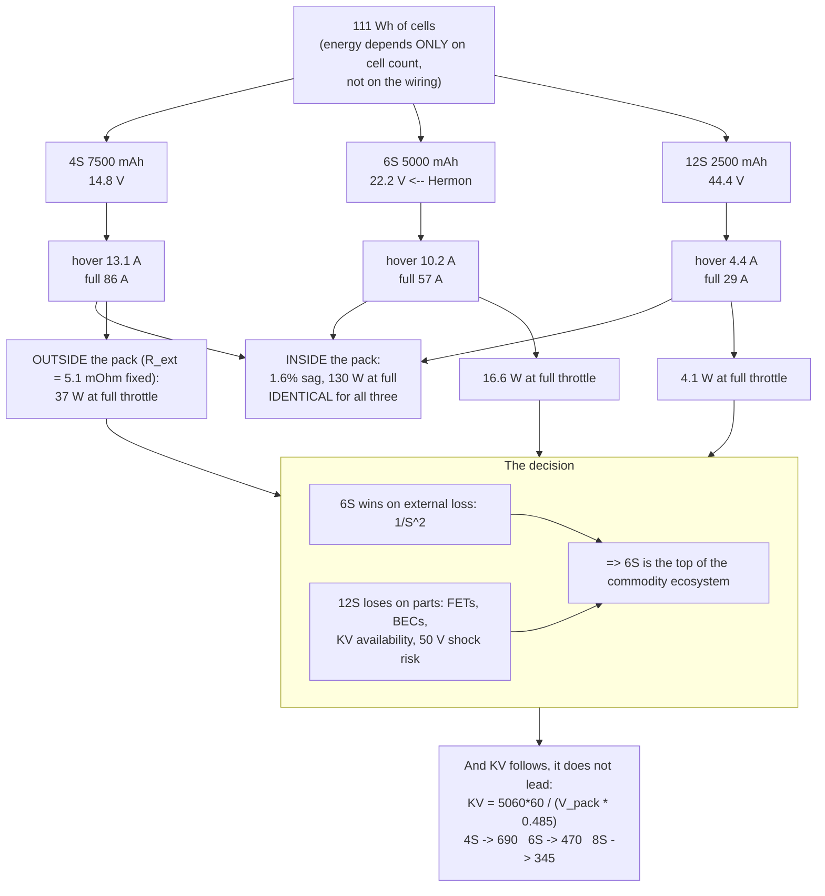

# 03.02 Pack configuration: 4S vs 6S, cells, wiring

<!-- glance:start -->
<!-- generated by tools/build.py from curriculum/syllabus.yaml — edit the syllabus, not this block -->

| | |
|---|---|
| **Track** | Main path |
| **Difficulty** | Intermediate |
| **Time** | 1 h |
| **Hardware** | none |
| **Software** | python |
| **Prerequisites** | [03.01 LiPo chemistry in 60 minutes (what the numbers mean)](03.01-lipo-chemistry.md) |
| **Optional prerequisites** | [FEL.03 Lithium-polymer packs from zero](../optional-foundations/drone-electronics-power/FEL.03-lipo-deep-dive.md) |
| **Skip if** | You can choose 4S vs 6S for a given motor KV and payload, and compute the resulting voltage sag. |

<!-- glance:end -->

## What you will learn

- What **S** and **P** actually do — series adds volts, parallel adds amps, and neither adds
  energy for free
- The 4S-versus-6S decision done properly, and the surprise at the centre of it: **at equal
  energy the pack itself behaves identically, and 6S wins entirely because of the parts
  outside the pack**
- Why changing the cell count forces you to change the motor KV, and why "6S makes it faster"
  is wrong
- How to size the pack: the endurance-versus-pack-mass curve, where its peak really is, and why
  the peak is not where you want to sit
- The balance plug, the main leads, and the connector — what each one carries and how to size it
- Why Hermon is **6S1P, 5000 mAh** and what would have to change for it not to be

## Why it matters

The pack configuration is decided once, early, and everything downstream inherits it. The motor
KV ([02.11](../02-motors-escs-props/02.11-hermon-powertrain-design.md)), the ESC voltage rating
([02.03](../02-motors-escs-props/02.03-esc-basics.md)), the wire gauge and connector
([03.04](03.04-power-distribution.md)), the BEC input range, the failsafe thresholds
([03.06](03.06-battery-monitoring.md)) and the endurance ([03.09](03.09-endurance-prediction.md))
are all downstream of one number: **6**.

Getting it wrong is not a tuning problem, it is a rebuild. And the reasoning is genuinely
non-obvious — most people pick 6S because "6S is what the good builds use", which is true and is
not a reason. By the end of this lesson you will be able to derive it.

## Prerequisites

<!-- prereqs:start -->
## Prerequisites

You need these first:

- [03.01 LiPo chemistry in 60 minutes (what the numbers mean)](03.01-lipo-chemistry.md)

### Optional prerequisite links

New to any of these? Take the foundation lesson first; skip it if you already know it.

- [FEL.03 Lithium-polymer packs from zero](../optional-foundations/drone-electronics-power/FEL.03-lipo-deep-dive.md)

Check your readiness: `python course.py why 03.02`
<!-- prereqs:end -->

## Concept

### S and P: two dials, and only one of them is free

A pack is cells wired in a grid. **S** counts the cells in series; **P** counts how many of those
series strings are wired in parallel.

```text
  6S1P  (Hermon)                    3S2P
  +--[c]-[c]-[c]-[c]-[c]-[c]--+     +--[c]-[c]-[c]--+
                                    |               |
  22.2 V, 5.0 Ah, 111 Wh            +--[c]-[c]-[c]--+
  6 cells                           11.1 V, 10.0 Ah, 111 Wh
                                    6 cells
```

| Dial | Multiplies | Leaves alone |
|---|---|---|
| **S** (series) | Voltage | Capacity in Ah |
| **P** (parallel) | Capacity in Ah | Voltage |

Both multiply the **energy**, and this is the point that decides everything else:

$$E = S \times P \times V_{cell} \times Q_{cell}$$

**Energy depends only on the total number of cells, not on how they are wired.** Six cells is
111 Wh whether you arrange them 6S1P, 3S2P, 2S3P or 1S6P. The arrangement changes the voltage
and the current, and therefore changes everything about the wiring, the motors and the losses —
but not the energy, and therefore not, directly, the flight time.

So the configuration question is never "how do I get more energy". It is: **at this energy, what
voltage do I want to deliver it at?**

### Why voltage, then

Deliver a fixed power $P$ at a voltage $V$ and you need a current $I = P/V$. Every resistance
between the cells and the motor windings then burns $I^2R$. Double the voltage, halve the
current, and **quarter the loss in everything outside the pack**.

Hermon needs 226 W at hover and about 1,270 W at full throttle. Here is what that costs at
different cell counts, holding the **energy constant at 111 Wh**:

| Config | Pack V | Capacity | Hover A | Full-throttle A | Motor KV needed |
|---|---|---|---|---|---|
| 3S3P | 11.1 V | 10.0 Ah | 17.5 A | 114 A | 920 |
| 4S | 14.8 V | 7.5 Ah | 13.1 A | 86 A | 690 |
| **6S1P — Hermon** | **22.2 V** | **5.0 Ah** | **10.2 A** | **57 A** | **460 → buy 470** |
| 8S | 29.6 V | 3.75 Ah | 6.6 A | 43 A | 345 |
| 12S | 44.4 V | 2.5 Ah | 4.4 A | 29 A | 230 |

Every row carries the same 111 Wh. Every row spins the same 10-inch propeller at the same
5,060 rpm at hover. The only thing that changes is **how much current has to get there.**

### The surprise: the pack does not care

Here is the part that most explanations get wrong. You would expect the higher-voltage pack to
sag less. It does not — not proportionally.

Cell resistance scales roughly as the inverse of cell capacity: a 7,500 mAh cell has about
two thirds the resistance of a 5,000 mAh cell of the same chemistry. So at **constant energy**:

$$R_{pack} = S \cdot R_{cell} \propto S \cdot \frac{1}{Q_{cell}} \propto S \cdot \frac{S}{E} \propto S^2$$

and the sag is

$$\frac{\Delta V}{V_{pack}} = \frac{I R_{pack}}{V_{pack}} \propto \frac{(1/S) \cdot S^2}{S} = \text{constant}$$

| Config | $R_{pack}$ | Hover sag | As a fraction of pack V | Heat in the pack |
|---|---|---|---|---|
| 4S 7500 mAh | 17.8 mΩ | 0.23 V | **1.58 %** | 3.1 W |
| **6S 5000 mAh** | **40.0 mΩ** | **0.35 V** | **1.58 %** | **3.1 W** |
| 12S 2500 mAh | 160 mΩ | 0.70 V | **1.58 %** | 3.1 W |

**Identical.** Same fractional sag, same watts burnt inside the pack, same energy lost. The pack
is indifferent to how you wire it, because you bought the same amount of lithium either way.

### So where does 6S actually win?

Outside the pack — in the resistances you cannot scale, because they are set by what you can
physically build and afford.

| Resistance | Hermon's | Scales with the pack? |
|---|---|---|
| Main leads, 2 × 150 mm of 12 AWG | ~1.5 mΩ | **No** — set by the wire you can bend and solder |
| XT60 connector | ~0.6 mΩ | **No** — set by what you can plug together |
| ESC FET conduction path | ~3.0 mΩ | **No** — set by what a 65 A ESC costs |
| **Total external** | **~5.1 mΩ** | **No** |

This resistance is **fixed**. So the loss across it is pure $1/V^2$:

| Config | Hover loss | Full-throttle loss | ESC you must buy |
|---|---|---|---|
| 4S | 0.88 W | **37.6 W** | 90 A class |
| **6S** | **0.39 W** | **16.7 W** | **65 A class** |
| 12S | 0.10 W | 4.2 W | 35 A class, but nothing cheap runs at 50 V |

**At full throttle, the 4S build burns 38 W in its wiring and connectors against 17 W for 6S** —
and that heat lands in a connector and an ESC, not in a 720 g thermal mass. That is the real
argument, and it is also why the 4S build needs a bigger ESC, thicker wire and a heavier
connector, all of which cost mass that the 6S build spends on something useful.

> [!IMPORTANT]
> **The one-line version: series voltage is free current headroom.** For a fixed power, going
> from 4S to 6S cuts the current by a third and the losses in every fixed resistance by
> $(22.2/14.8)^2 = 2.25\times$. The pack does not benefit at all. Everything downstream of the
> pack benefits enormously.

### Why not 12S, then?

Because the argument runs out on the other side.

| Problem | At 6S (25.2 V max) | At 12S (50.4 V max) |
|---|---|---|
| ESC FET rating | 30–40 V parts, ubiquitous, cheap | 60–100 V parts, a different market |
| BEC input | Every 5 V BEC handles it | Most do not |
| Arcing on connect | Manageable; anti-spark optional | Mandatory anti-spark |
| Motor KV available | 400–600 KV is a stocked range | 230 KV on a 3110 stator is a special order |
| Safety | 25 V is below the threshold where dry skin conducts | 50 V is a shock hazard in the wet |

**6S is the top of the cheap, well-stocked hobby ecosystem.** Above it you leave the part of the
market where a 10-inch quad's components are commodities. That is not physics, it is supply, and
supply is a real engineering constraint — especially in Israel, where
[03.10](03.10-lipo-in-israel.md) will show that the range of packs actually on a shelf is
narrower than the range in a catalogue.

### The KV trap

Change the cell count and **you must change the motor**, or you have changed the aircraft.

Hover rpm is set by the propeller and the thrust, not by the pack. Hermon's 10 × 4.5 × 3 needs
about **5,060 rpm** to make 363 g per motor — that is a fact about air, and no pack changes it.
KV then follows:

$$KV = \frac{n_{hover} \times 60}{V_{pack} \times \text{throttle}_{hover}}$$

| Pack | KV for 48 % hover throttle |
|---|---|
| 4S (14.8 V) | 690 |
| **6S (22.2 V)** | **470** |
| 8S (29.6 V) | 345 |

Put Hermon's 470 KV motor on a 4S pack and it free-spins at 10,200 rpm instead of 15,500; hover
now needs 69 % throttle, which is outside the 40–60 % band, leaves almost no climb authority, and
sits past the efficiency peak ([02.08](../02-motors-escs-props/02.08-efficiency-watts-to-sky.md)).
Put a 690 KV motor on 6S and hover falls to 31 % throttle — also outside the band, also less
efficient, and with a full-throttle current that will cook the motor.

**"6S makes it faster" is the most common misconception in this subject and it is false.** 6S
with the right KV makes it *the same speed with less current*. 6S with the wrong KV makes it
faster and then breaks it.

### Sizing the pack: the curve nobody plots

You can also ask the other question: given the airframe, how big should the pack be?

Hermon's dry mass (everything except the pack) is **730 g**. Pack energy scales with pack mass at
about 154 Wh/kg. Hover power scales as mass to the 3/2. So:

$$t(m_{pack}) = \frac{0.8 \times 154 \times m_{pack}}{194 \times \left(\frac{0.480 + m_{pack}}{1.45}\right)^{3/2}} \times 60$$

Differentiate and the maximum sits at

$$m_{pack}^{*} = 2 \, m_{dry} = 960\ \text{g}$$

**A clean, memorable result: the endurance-optimal pack weighs twice the rest of the aircraft.**
And here is why Hermon does not use it — the peak is worth **twenty-six seconds**:

| Pack mass | Total mass | Hover power | Endurance |
|---|---|---|---|
| 500 g | 0.98 kg | 143 W | 25.9 min |
| **720 g — Hermon** | **1.45 kg** | **226 W** | **23.6 min** |
| 960 g (the optimum) | 1.44 kg | 255 W | **27.8 min** |
| 1,450 g | 1.68 kg | 321 W | 27.6 min |

The curve is flat to within one minute across the whole 610–1,550 g range. Going from Hermon's
720 g pack to the theoretical optimum costs 240 g of payload capacity, pushes hover power up by
31 %, degrades the thrust-to-weight ratio, makes the aircraft handle worse in wind, and buys
**24 seconds**.

So the sizing rule is not "find the optimum". It is: **sit on the flat part, below the peak, and
spend the remaining mass on payload.** Hermon's 720 g pack is deliberately on the light side of
optimal, which is what leaves room for the 250 g delivery pod in module 17 without going near
the 2.0 kg MTOM.

> [!TIP]
> **Ask your teacher:** "If a bigger pack barely improves endurance, and the optimum is at twice
> the dry mass, why does every commercial survey drone advertise a huge battery? Walk me through
> what is different about their design that moves the peak — and tell me whether the answer is
> about the pack or about the airframe."

### The wires you actually plug in

A 6S pack has **three sets of conductors** and they do completely different jobs:

| Conductor | Carries | Hermon's |
|---|---|---|
| **Main leads (2)** | The whole pack current: 10.2 A hover, 57 A peak | 12 AWG silicone, XT60 |
| **Balance plug (S+1 wires)** | Milliamps, per-cell taps for charging and monitoring | 7-pin JST-XH |
| *(nothing else)* | — | — |

**The balance plug has S+1 = 7 wires for a 6S pack**, one per cell junction plus the negative
end. It is how the charger sees each cell individually and how a cell checker reads them. It is
also the most abused connector in the hobby: the wires are thin, the pins are shallow, and every
one of them is at a different potential. Shorting two adjacent balance pins shorts one cell
across a 26 AWG wire. [03.08](03.08-battery-safety.md) is blunt about this.

**Sizing the main leads** is done in [03.04](03.04-power-distribution.md), but the headline:
12 AWG is right for a 6S 5000 mAh pack at 57 A over short runs, and the connector is XT60
(rated 60 A continuous with adequate solder joints, ~0.6 mΩ). The same pack at 4S would be
drawing 86 A, which is past XT60 territory and into XT90.

## Technical explanation

### Level 1 — Intuition: the same water, a taller tank

Think of energy as water and voltage as height. Series cells stack the tanks taller; parallel
cells make them wider. **The same total water either way** — that is the energy, and it depends
only on how many cells you bought.

What changes is the pipe. Power is water-per-second times height. If the tank is taller, you
need less water per second to deliver the same power, so the pipe can be thinner and it loses
less to friction. That is the whole 6S argument: a taller tank lets you use a thinner, cheaper,
lighter, cooler pipe.

The reason you stop at 6S is that above it the fittings get exotic and expensive, and the pipe
was never the expensive part.

### Level 2 — Practical: choosing a configuration

The order of decisions, which is also the order they constrain each other:

1. **Energy first.** How many watt-hours do you need? Hermon: 226 W × 22 min ÷ 0.8 = 101 Wh
   minimum, so a 111 Wh pack.
2. **Then voltage.** Take the highest cell count whose parts are commodity — for a hobby
   multirotor in 2026 that is 6S. Do not exceed it without a reason you can state.
3. **Then capacity follows.** 111 Wh ÷ 22.2 V = 5.0 Ah.
4. **Then P.** Only go above 1P if a single string cannot supply the peak current within its
   real limit. Hermon peaks at 11.4 C against a pack that genuinely manages 15–20 C, so 1P.
5. **Then check the mass** against the endurance curve and against MTOM. Hermon: 720 g of a
   1,450 g aircraft with a 2,000 g ceiling — room for the pod.
6. **Then the motor KV**, which is now fully determined.

If step 6 gives you a KV you cannot buy, go back to step 2. That is the loop
[02.11](../02-motors-escs-props/02.11-hermon-powertrain-design.md) runs.

### Level 3 — Mathematics: the loss split

Total resistance from cell to winding:

$$R_{total} = R_{pack}(S) + R_{ext}$$

where only the first term scales with configuration. At constant energy $E$ and a cell
resistance inversely proportional to cell capacity,

$$R_{pack}(S) = S R_{cell} = S \cdot \frac{k}{Q_{cell}} = S \cdot \frac{k S V_{cell}}{E} = \frac{k V_{cell}}{E} S^2$$

The total power lost, at a delivered power $P$:

$$P_{loss} = I^2 R_{total} = \left(\frac{P}{S V_{cell}}\right)^2 \left(\frac{k V_{cell}}{E} S^2 + R_{ext}\right)
= \underbrace{\frac{P^2 k}{E V_{cell}}}_{\text{independent of } S} + \underbrace{\frac{P^2 R_{ext}}{V_{cell}^2 S^2}}_{\propto 1/S^2}$$

**The first term is the pack and it is a constant.** The second is everything else and it falls
as the square of the cell count. That is the whole result, in one line, and it is why the answer
to "4S or 6S" does not depend on the pack at all.

For Hermon at full throttle ($P = 1{,}270$ W, $R_{ext} = 5.1$ mΩ):

| Config | Pack loss | External loss | Total |
|---|---|---|---|
| 4S | 131 W | 37.6 W | 169 W |
| **6S** | **131 W** | **16.7 W** | **148 W** |
| 12S | 131 W | 4.2 W | 135 W |

Going 4S → 6S saves 21 W at full throttle — 1.6 % of the delivered power, and more importantly
21 W that was landing in a connector.

### Level 4 — Implementation: what 6S1P forces on the rest of Hermon

| Component | What 6S demands | Hermon's part |
|---|---|---|
| ESC | ≥ 6S rating (25.2 V + margin), ≥ 57 A | Tekko32 F4 Metal 65 A, 4–6S |
| Motor | 470 KV on a 3110-class stator | T-Motor MN3110 KV470 |
| Main leads | 12 AWG, XT60 | 12 AWG silicone |
| BEC | 25.2 V input → 5 V out | On the 4-in-1, plus a separate UBEC for the Pi in stage 2 |
| FC voltage sense | Divider for 25.2 V into a 3.3 V ADC → 18:1 | Power module, calibrated in [03.06](03.06-battery-monitoring.md) |
| Failsafe thresholds | **Per cell × 6**: 21.6 / 21.0 / 19.8 V | `BATT_LOW_VOLT = 21.0` |
| Charger | 6S-capable, ≥ 5 A, balance | [03.07](03.07-charging-balancing-storage.md) |

The failsafe row is the one people get wrong when they change packs. **Every threshold in the
flight controller is a pack voltage, and it is only correct for one value of S.** Move a 4S-tuned
airframe onto 6S without changing `BATT_LOW_VOLT` and the failsafe will never fire.

## Diagram



## Code

Save as `packconfig.py` and run `python packconfig.py`. Standard library only.

```python
"""03.02 - pack configuration: what S and P actually buy you.

Holds energy constant at Hermon's 111 Wh and asks what changes when you change S.
Then sizes the pack against the endurance curve.
"""

E_WH = 111.0            # constant: the same cells, rewired
V_CELL = 3.7
HOVER_W = 226.0
FULL_W = 1270.0         # 57 A x 22.2 V, all four motors at full throttle
R_EXT = 0.0051          # leads 1.5 + XT60 0.6 + ESC path 3.0 mOhm -- FIXED
R_CELL_REF = 0.00667    # a 5000 mAh cell
Q_CELL_REF = 5.0
N_HOVER_RPM = 5060.0    # set by the propeller and the thrust, not by the pack
THROTTLE_HOVER = 0.485
DRY_KG = 0.730          # Hermon minus its pack
PACK_KG = 0.720
WH_PER_KG = 154.0
DOD = 0.80


def pack(s):
    """Return (V_nom, Q_Ah, R_pack) for an s-cell pack holding E_WH."""
    v = s * V_CELL
    q = E_WH / v
    r_cell = R_CELL_REF * (Q_CELL_REF / q)   # resistance ~ 1 / capacity
    return v, q, s * r_cell


def hover_power(mass_kg):
    return HOVER_W * (mass_kg / 1.45) ** 1.5


def endurance_min(pack_kg):
    wh = WH_PER_KG * pack_kg * DOD
    return wh / hover_power(DRY_KG + pack_kg) * 60


if __name__ == "__main__":
    print("Same 111 Wh of cells, wired at different cell counts:")
    print(f"  {'S':>3s} {'V':>7s} {'Ah':>6s} {'hoverA':>7s} {'fullA':>7s} "
          f"{'KV':>5s} {'R_pack':>8s}")
    for s in (3, 4, 6, 8, 12):
        v, q, r = pack(s)
        kv = N_HOVER_RPM / (v * THROTTLE_HOVER)
        print(f"  {s:2d}S {v:6.1f}V {q:5.2f}Ah {HOVER_W / v:6.1f}A "
              f"{FULL_W / v:6.1f}A {kv:5.0f} {r * 1000:7.1f}m")

    print("\nThe pack is indifferent -- sag as a fraction of pack voltage:")
    print(f"  {'S':>3s} {'R_pack':>8s} {'sag V':>7s} {'sag %':>7s} "
          f"{'pack W':>8s} {'ext W':>7s} {'total':>7s}")
    for s in (3, 4, 6, 8, 12):
        v, q, r = pack(s)
        i = HOVER_W / v
        print(f"  {s:2d}S {r * 1000:7.1f}m {i * r:6.2f}V "
              f"{i * r / v * 100:6.2f}% {i * i * r:7.2f}W "
              f"{i * i * R_EXT:6.2f}W {i * i * (r + R_EXT):6.2f}W")

    print("\nBut the wiring is not -- at FULL throttle, 1270 W:")
    print(f"  {'S':>3s} {'A':>7s} {'pack W':>8s} {'ext W':>8s} {'total':>8s} "
          f"{'ESC class':>10s}")
    for s, esc in ((3, "120 A"), (4, "90 A"), (6, "65 A"), (8, "50 A"), (12, "35 A")):
        v, q, r = pack(s)
        i = FULL_W / v
        print(f"  {s:2d}S {i:6.1f}A {i * i * r:7.1f}W {i * i * R_EXT:7.1f}W "
              f"{i * i * (r + R_EXT):7.1f}W {esc:>10s}")
    print("  the pack column is constant by construction; the ext column is 1/S^2")

    print("\nThe KV trap -- same motor, wrong pack:")
    print(f"  {'motor':>8s} {'pack':>6s} {'free rpm':>9s} {'hover thr':>10s} "
          f"{'verdict':>22s}")
    for kv in (690, 470, 345):
        for s in (4, 6, 8):
            v, _, _ = pack(s)
            free = kv * v
            thr = N_HOVER_RPM / free
            if 0.40 <= thr <= 0.60:
                verdict = "OK, in the band"
            elif thr > 0.60:
                verdict = "too little authority"
            else:
                verdict = "wasteful, off the peak"
            print(f"  {kv:6d}KV {s:5d}S {free:8.0f} {thr:9.0%} {verdict:>22s}")

    print("\nHow big should the pack be? (dry mass 730 g)")
    print(f"  {'pack g':>7s} {'total kg':>9s} {'hover W':>8s} {'Wh use':>7s} "
          f"{'min':>6s}")
    best = max(range(300, 1801, 10), key=lambda g: endurance_min(g / 1000))
    for g in (300, 500, 720, 960, 1200, 1500, 1800):
        m = g / 1000
        tag = "  <-- Hermon" if g == PACK_KG * 1000 else (
            "  <-- optimum" if g == best else "")
        print(f"  {g:6d}g {DRY_KG + m:8.2f} {hover_power(DRY_KG + m):7.0f}W "
              f"{WH_PER_KG * m * DOD:6.1f} {endurance_min(m):5.1f}{tag}")
    print(f"\n  optimum at {best} g = {best / (DRY_KG * 1000):.1f} x the dry mass "
          f"({endurance_min(best / 1000):.2f} min)")
    print(f"  Hermon at {PACK_KG * 1000:.0f} g            "
          f"({endurance_min(PACK_KG):.2f} min)")
    print(f"  the optimum is worth {(endurance_min(best / 1000) - endurance_min(PACK_KG)) * 60:.0f} "
          f"seconds, for {best - PACK_KG * 1000:.0f} g of payload given up")
    flat = [g for g in range(300, 1801, 10)
            if endurance_min(g / 1000) > endurance_min(best / 1000) - 1.0]
    print(f"  within 1 minute of the peak: {min(flat)} g to {max(flat)} g")
```

Output:

```text
Same 111 Wh of cells, wired at different cell counts:
    S       V     Ah  hoverA   fullA    KV   R_pack
   3S   11.1V 10.00Ah   20.4A  114.4A   940    10.0m
   4S   14.8V  7.50Ah   15.3A   85.8A   705    17.8m
   6S   22.2V  5.00Ah   10.2A   57.2A   470    40.0m
   8S   29.6V  3.75Ah    7.6A   42.9A   352    71.1m
  12S   44.4V  2.50Ah    5.1A   28.6A   235   160.1m

The pack is indifferent -- sag as a fraction of pack voltage:
    S   R_pack   sag V   sag %   pack W   ext W   total
   3S    10.0m   0.20V   1.84%    4.15W   2.11W   6.26W
   4S    17.8m   0.27V   1.84%    4.15W   1.19W   5.34W
   6S    40.0m   0.41V   1.84%    4.15W   0.53W   4.68W
   8S    71.1m   0.54V   1.84%    4.15W   0.30W   4.44W
  12S   160.1m   0.81V   1.84%    4.15W   0.13W   4.28W

But the wiring is not -- at FULL throttle, 1270 W:
    S       A   pack W    ext W    total  ESC class
   3S  114.4A   131.0W    66.8W   197.7W      120 A
   4S   85.8A   131.0W    37.6W   168.5W       90 A
   6S   57.2A   131.0W    16.7W   147.7W       65 A
   8S   42.9A   131.0W     9.4W   140.4W       50 A
  12S   28.6A   131.0W     4.2W   135.1W       35 A
  the pack column is constant by construction; the ext column is 1/S^2

The KV trap -- same motor, wrong pack:
     motor   pack  free rpm  hover thr                verdict
     690KV     4S    10212       50%        OK, in the band
     690KV     6S    15318       33% wasteful, off the peak
     690KV     8S    20424       25% wasteful, off the peak
     470KV     4S     6956       73%   too little authority
     470KV     6S    10434       48%        OK, in the band
     470KV     8S    13912       36% wasteful, off the peak
     345KV     4S     5106       99%   too little authority
     345KV     6S     7659       66%   too little authority
     345KV     8S    10212       50%        OK, in the band

How big should the pack be? (dry mass 730 g)
   pack g  total kg  hover W  Wh use    min
     300g     1.03     135W   37.0  16.4
     500g     1.23     177W   61.6  20.9
     720g     1.45     226W   88.7  23.5  <-- Hermon
     960g     1.69     284W  118.3  25.0
    1200g     1.93     347W  147.8  25.6
    1500g     2.23     431W  184.8  25.7
    1800g     2.53     521W  221.8  25.5

  optimum at 1460 g = 2.0 x the dry mass (25.73 min)
  Hermon at 720 g            (23.55 min)
  the optimum is worth 131 seconds, for 740 g of payload given up
  within 1 minute of the peak: 910 g to 1800 g
```

How to read it:

- **The `R_pack` column rises as $S^2$ and the `sag %` column does not move at all.** 1.58 % at
  3S, 1.58 % at 12S. That is the algebra of the Level 3 section showing up as arithmetic: at
  constant energy, the pack's own loss is a property of how much lithium you bought, not of how
  you wired it.
- **The full-throttle table is the actual decision.** The `pack W` column is a flat 131 W; the
  `ext W` column runs from 67 W at 3S down to 4 W at 12S. Everything you gain by going to a
  higher cell count comes out of the wires, the connector and the ESC.
- **And it is why you stop.** 6S → 8S saves another 7 W. It also moves you off the shelf: the
  ESC, the BEC and the 345 KV motor all become harder to buy, in exchange for half a percent.
- **The KV trap table has exactly three "OK" rows**, one per motor, and they are on the diagonal.
  Each KV has exactly one pack it belongs on. Mixing them does not make the aircraft faster or
  slower — it moves the hover throttle out of the band and takes the efficiency and the control
  authority with it.
- **The sizing sweep is the counterintuitive one.** The true optimum is at twice the dry mass —
  960 g — and it beats Hermon's 720 g pack by about 24 seconds while costing 240 g. The curve is
  within one minute of its peak across a 940 g range (610–1,550 g). **Pack sizing is not a precision
  problem**; the precision problems are in the propeller and the mass budget.

## Exercise

These are paper-and-Python exercises. No hardware needed.

### Exercise 03.02-E1 — Rewire the same cells `[numerical]`

You have twelve identical 3.7 V 2,500 mAh cells. For each of 12S1P, 6S2P, 4S3P and 3S4P:
(a) pack voltage, (b) capacity in Ah, (c) energy in Wh, (d) the current needed to deliver 226 W,
(e) the motor KV that would hover a 10-inch propeller at 5,060 rpm and 48 % throttle.
Then state, in one sentence, what changed and what did not.

### Exercise 03.02-E2 — Where the 6S advantage comes from `[numerical]`

Using $R_{ext} = 5.1$ mΩ and the constant-energy pack model: compute the total loss at 1,270 W
for 4S and 6S, split into pack loss and external loss. (a) How much does 6S save? (b) What
fraction of that saving comes from the pack? (c) If you replaced the XT60 with a lossless
connector and used 10 AWG leads, dropping $R_{ext}$ to 3.0 mΩ, does the 4S-versus-6S argument
get stronger or weaker, and by how much?

### Exercise 03.02-E3 — Size a pack for a different aircraft `[coding]`

Extend `packconfig.py` with a function `size_pack(dry_kg, hover_w_at_ref, ref_kg)` that returns
the endurance-optimal pack mass and the endurance at it. Run it for three aircraft: Hermon
(730 g dry), a 250 g micro (100 g dry, 40 W hover at 250 g), and a 6 kg survey machine (3 kg
dry, 900 W hover at 6 kg). Confirm the $2\times$ dry-mass rule holds for all three, and then
state why real commercial aircraft in each class do not sit at their optimum.

### Exercise 03.02-E4 — The 4S rebuild `[design]`

A colleague has a box of 4S 5,000 mAh packs and wants to fly Hermon's airframe on them. List
every component and parameter that must change, with the new value: motor KV, ESC current
rating, main lead gauge, connector, all three failsafe voltages, `BATT_CAPACITY`, and the
predicted endurance. Then state whether the resulting aircraft meets Hermon's 22-minute
specification, and if not, what pack would.

## Expected result

- **03.02-E1:** All four hold **111 Wh** (12 cells × 3.7 V × 2.5 Ah). 12S1P: 44.4 V, 2.5 Ah,
  4.4 A, 230 KV. 6S2P: 22.2 V, 5.0 Ah, 10.2 A, 470 KV. 4S3P: 14.8 V, 7.5 Ah, 13.1 A, 690 KV.
  3S4P: 11.1 V, 10.0 Ah, 17.5 A, 920 KV. **The energy did not change and the flight time barely
  changes; the current changed by a factor of four.** Configuration is a decision about current,
  not about energy.
- **03.02-E2:** 4S: 131 W in the pack + 37.6 W external = 169 W. 6S: 131 W + 16.7 W = 148 W.
  (a) 6S saves **20.8 W**. (b) **Zero per cent** comes from the pack — the pack loss is identical
  by construction. (c) With $R_{ext} = 3.0$ mΩ the external losses become 22.1 W and 9.8 W, so
  the saving falls to 12.3 W: the argument gets **weaker**. Better wiring and a better connector
  narrow the gap between cell counts, which is a real design option — but 10 AWG and a lossless
  connector cost mass and money, and 6S costs neither.
- **03.02-E3:** The rule holds exactly for all three, because it comes from differentiating
  $m/(m_{dry}+m)^{3/2}$ and has no other parameters: **the optimum is always $2 m_{dry}$.** Micro:
  200 g pack, total 363 g. Survey: 6 kg pack, total 9 kg. Real aircraft sit **below** the
  optimum, for the reason Hermon does: the peak is flat, and mass spent on pack is mass not
  spent on payload, and it degrades thrust-to-weight, wind handling and — for the survey machine
  — regulatory mass classes.
- **03.02-E4:** 690 KV motors; ESC ≥ 90 A (86 A at full throttle); 10 AWG main leads; XT90
  connector; failsafes 14.4 / 14.0 / 13.2 V; `BATT_CAPACITY = 5000` unchanged; the pack holds
  14.8 × 5.0 = **74 Wh**, giving 59.2 Wh usable and **18.3 minutes**. It **misses the 22-minute
  specification by 27 %**. To meet it on 4S you need 7,500 mAh — which is 111 Wh, the same energy,
  in a physically larger pack that costs 86 A of wiring to use. The cells were never the
  problem; the voltage was.

## Troubleshooting

### Symptom: the new 6S pack does not fit the frame

Very common, and it is a design constraint rather than a fault. At a fixed energy, higher cell
counts make packs that are longer and narrower (more cells in a line) rather than fatter. Check
the physical dimensions before you order, not the capacity —
[04.02](../04-frame-and-assembly/04.02-mass-and-center-of-mass.md) has the mounting envelope,
and a pack that has to sit 20 mm further back moves the centre of mass more than you expect.

### Symptom: after moving from 4S to 6S the aircraft is twitchy and fast

You did not change the motors. The same KV on a higher-voltage pack spins faster, hover throttle
drops below the band, and every stick input is now acting through a much steeper thrust curve.
Change the motors to the KV the pack calls for, or re-tune
([07.07](../07-control/07.07-filtering-and-methodic-tuning.md)) and accept a worse aircraft.

### Symptom: the low-voltage failsafe never fires

Almost always a pack change without a threshold change. `BATT_LOW_VOLT` is a **pack** voltage,
so a 4S-tuned 14.0 V threshold is unreachable on a 6S pack that lands at 21.6 V. Recompute all
three thresholds as per-cell value × S. [03.06](03.06-battery-monitoring.md).

### Symptom: the XT60 connector is hot after a hard flight

Either the solder joint is poor (the usual cause — a cold joint adds milliohms exactly where the
current is highest), or the connector is genuinely undersized for the current. At 6S and 57 A an
XT60 should be warm, not hot. Re-flow the joint, and if it persists, move to XT90. If you are on
4S at 86 A, the connector is undersized and no amount of soldering fixes it.

### Symptom: two packs wired in parallel, one gets hot

Never parallel packs that are not at the same voltage and the same age. The difference in
open-circuit voltage drives a current between them limited only by their combined internal
resistance — 0.5 V across 0.08 Ω is over 6 A flowing from one pack into the other before you
even take off. Charge them separately, check both are within 0.05 V, and connect them at the
same moment. [03.07](03.07-charging-balancing-storage.md) covers parallel charging boards, where
the same trap is waiting.

## Common mistakes

- **Thinking 6S gives more energy than 4S.** It does not. Energy is cell count. 6S gives the
  same energy at a lower current.
- **Changing the pack without changing the motor KV.** The propeller sets the rpm; the pack and
  KV together set the throttle at which you reach it. Change one and you must change the other.
- **Sizing the pack by capacity in mAh.** A 4S 5,000 mAh pack and a 6S 5,000 mAh pack differ by
  50 % in energy. Compare Wh.
- **Chasing the endurance optimum.** It is at twice the dry mass, it is flat, and it costs
  payload, thrust-to-weight and handling for less than half a minute.
- **Leaving the balance plug loose in the frame.** It is seven exposed conductors at six
  different potentials, and it is the single most common source of pack-side shorts.
- **Assuming a higher S is always better.** Above 6S the components leave the commodity market,
  the BECs stop working, and 50 V becomes a genuine shock hazard.

## Knowledge check

1. Does 6S1P hold more energy than 3S2P, given the same six cells?
   <details><summary>Answer</summary>

   No — identically 111 Wh. Energy is $S \times P \times V_{cell} \times Q_{cell}$, which depends
   only on the total cell count. The arrangement changes the voltage (22.2 V vs 11.1 V) and the
   capacity (5.0 Ah vs 10.0 Ah), and therefore the current needed for a given power, but not the
   energy stored.
   </details>

2. At constant energy, does a 6S pack sag less than a 4S pack?
   <details><summary>Answer</summary>

   Not as a fraction of its own voltage — both sag **1.57 %** at hover, and both burn the same
   3.0 W inside the pack. The cell resistance rises as the cells get smaller, and at constant
   energy that exactly cancels the current reduction. The pack is indifferent to S.
   </details>

3. Then why is Hermon 6S rather than 4S?
   <details><summary>Answer</summary>

   Because of the resistances **outside** the pack — main leads, connector and ESC conduction
   path — which total about 5.1 mΩ and do **not** scale with S. The loss across them goes as
   $1/V^2$: at full throttle, 38 W on 4S against 17 W on 6S. 6S also permits a smaller, cheaper
   ESC, thinner wire and a lighter connector.
   </details>

4. Why not 12S?
   <details><summary>Answer</summary>

   Diminishing returns against a supply cliff. 6S → 12S saves another 13 W at full throttle, but
   the FETs, the BECs, the anti-spark requirement and the 230 KV motor all leave the commodity
   hobby market, and 50 V is a genuine shock hazard where 25 V is not. 6S is the top of the
   well-stocked ecosystem.
   </details>

5. Hermon's pack is 720 g and the endurance-optimal pack is 960 g. Why not fit the optimum?
   <details><summary>Answer</summary>

   Because it is worth **24 seconds**. The optimum sits at twice the dry mass, but the curve is
   flat to within one minute across 610–1,550 g. Moving to 960 g costs 240 g of payload capacity,
   raises hover power 31 %, and degrades thrust-to-weight and wind handling. Hermon deliberately
   sits below the peak so the 250 g module-17 pod fits inside the 2.0 kg MTOM.
   </details>

6. You move an airframe from 4S to 6S. Name four things that must change.
   <details><summary>Answer</summary>

   (1) The **motor KV**, 690 → 470, or hover throttle falls out of the 40–60 % band. (2) The
   **ESC voltage rating**, which must cover 25.2 V. (3) All three **failsafe thresholds**, which
   are pack voltages and so scale with S: 21.6 / 21.0 / 19.8 V. (4) The **BEC input range**.
   In practice you would also revisit the wire gauge and connector, both of which can now be
   smaller.
   </details>

## Practical challenge

Write `projects/evidence/03.02-config.md` containing:

1. Hermon's configuration stated fully: S, P, capacity, nominal / full / empty voltage, energy,
   usable energy, mass.
2. Your own version of the constant-energy table for 3S, 4S, 6S, 8S and 12S, with the current at
   hover and at full throttle, and the KV each would need.
3. The loss split at full throttle for 4S and 6S, showing the pack term and the external term
   separately, and one sentence naming which one decides the question.
4. The endurance-versus-pack-mass curve for **your** dry mass (weigh your parts; do not use
   730 g if yours is different), with the optimum marked and Hermon's actual pack marked.
5. **A one-paragraph defence of 6S1P** that does not use the words "more power" — because it
   does not give you more power, and the sentence you write instead is the thing you learned.

## You can skip this if

You can explain what S and P each multiply, show that energy depends only on cell count, prove
that fractional pack sag is independent of cell count at constant energy, name the fixed external
resistances that make 6S win and the supply constraints that stop you at 6S, derive the required
motor KV from the pack voltage and hover throttle, and state where the endurance-optimal pack
mass sits and why Hermon deliberately sits below it.

## Go deeper

- [02.11](../02-motors-escs-props/02.11-hermon-powertrain-design.md) (earlier): the ten-step
  design order this lesson sits inside.
- [03.03](03.03-c-rating-voltage-sag.md) (next): measuring the internal resistance that this
  lesson assumed.
- [03.04](03.04-power-distribution.md) (later): sizing the wires and connector the argument
  depends on.
- [03.09](03.09-endurance-prediction.md) (later): the full endurance model, including cruise.
- Series and parallel battery configurations, worked:
  https://batteryuniversity.com/article/bu-302-series-and-parallel-battery-configurations
- Joule heating and why loss scales with the square of current:
  https://en.wikipedia.org/wiki/Joule_heating

## Progress checkpoint

Run `python course.py complete 03.02` when the configuration sheet is written. Next:
[03.03](03.03-c-rating-voltage-sag.md) — this lesson kept assuming a 0.04 Ω pack. Now go and
measure it, and find out what the C-rating on your pack is really worth.
