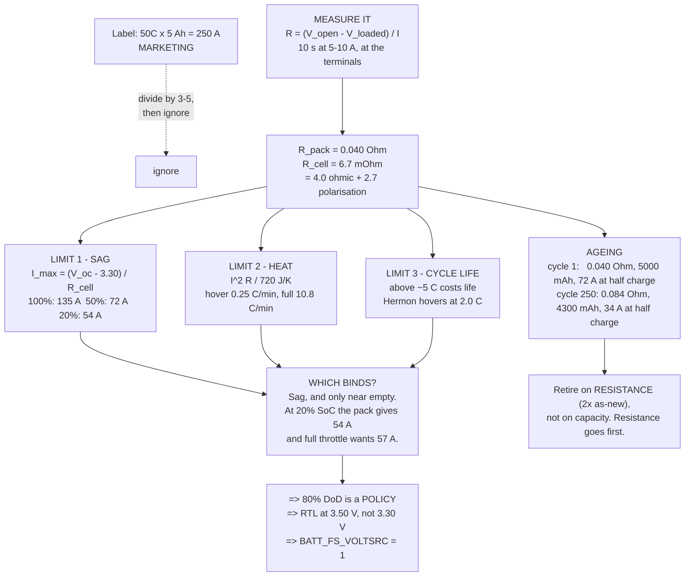

# 03.03 C-rating, current and voltage sag

<!-- glance:start -->
<!-- generated by tools/build.py from curriculum/syllabus.yaml — edit the syllabus, not this block -->

| | |
|---|---|
| **Track** | Main path |
| **Difficulty** | Intermediate |
| **Time** | 1 h |
| **Hardware** | none |
| **Software** | python |
| **Prerequisites** | [03.01 LiPo chemistry in 60 minutes (what the numbers mean)](03.01-lipo-chemistry.md)<br>[03.02 Pack configuration: 4S vs 6S, cells, wiring](03.02-pack-configuration.md) |
| **Optional prerequisites** | [FEL.04 Brushless motors from zero](../optional-foundations/drone-electronics-power/FEL.04-bldc-from-zero.md) |
| **Skip if** | You can compute maximum continuous current from C-rating and explain why sag, not capacity, limits full-throttle time. |

<!-- glance:end -->

## What you will learn

- What a C-rating is defined as, what it is measured under, and why the number on the shrink-wrap
  is off by a factor of three to five
- How to **measure your pack's internal resistance** with a load and a voltmeter, and why the
  number your charger reports is not the number that matters in flight
- The **sag curve**: pack voltage as a function of state of charge *and* current, and how to read
  a flight log off it
- The three things that actually limit current — **sag, heat and cycle life** — and which one
  binds for Hermon (it is not the one you expect)
- The operational consequence that surprises everyone: **at 20 % charge, Hermon's full-throttle
  punch pulls the pack below its landing threshold**
- How internal resistance rises with age, and why **a tired pack loses its punch long before it
  loses its capacity**

## Why it matters

[03.01](03.01-lipo-chemistry.md) told you that internal resistance, not the C-rating, is the
specification you can build on. [03.02](03.02-pack-configuration.md) then used a figure of
0.04 Ω about fifteen times without once measuring it. This lesson is where that debt is paid.

It matters because internal resistance is the hinge that connects the pack to the flight
controller. It sets `BATT_RESISTANCE` ([03.06](03.06-battery-monitoring.md)), it decides whether
your low-voltage failsafe fires on a climb or on an empty pack, it tells you when to retire a
pack, and it is the reason the last 20 % of a LiPo is reserved rather than merely discouraged.

It also matters commercially. When a client asks "can it carry 400 g?", the honest answer is not
about thrust — the motors have margin. It is about whether the pack can still deliver the climb
current at the end of the flight. That question is answered here.

## Prerequisites

<!-- prereqs:start -->
## Prerequisites

You need these first:

- [03.01 LiPo chemistry in 60 minutes (what the numbers mean)](03.01-lipo-chemistry.md)
- [03.02 Pack configuration: 4S vs 6S, cells, wiring](03.02-pack-configuration.md)

### Optional prerequisite links

New to any of these? Take the foundation lesson first; skip it if you already know it.

- [FEL.04 Brushless motors from zero](../optional-foundations/drone-electronics-power/FEL.04-bldc-from-zero.md)

Check your readiness: `python course.py why 03.03`
<!-- prereqs:end -->

## Concept

### What a C-rating is, formally

$$I_{max} = C \times Q$$

where $Q$ is the capacity in amp-hours. "50C" on a 5,000 mAh pack claims 250 A. The definition
is unambiguous. The **measurement conditions**, which the label never states, are where the
number goes wrong:

| The label usually means | What flying actually is |
|---|---|
| A 10-second pulse | Minutes of continuous draw |
| A cell at 25 °C, in air, on a bench | A pack in a shrink-wrap sleeve, taped to a frame, in Israeli summer |
| A fresh cell | A pack at cycle 80 |
| Measured to any voltage, however low | Measured to a voltage you can still fly at |
| Sometimes: no independent verification at all | — |

There is no standards body policing hobby C-ratings. Two packs labelled 50C from different
makers routinely differ by a factor of two in measured resistance, and a 50C pack from a bad
maker frequently measures worse than a 25C pack from a good one.

**The rule to carry away:** treat a C-rating as a within-brand ranking, divide it by three to
four for a continuous rating, and **measure the resistance yourself**. The measurement takes ten
minutes and it is the only number that predicts behaviour.

### The measurement

Internal resistance is defined by a step change in current:

$$R = \frac{V_{open} - V_{loaded}}{I}$$

The method, which needs a load, a voltmeter and nothing else:

1. Charge the pack and **let it rest 10 minutes.** Voltage after a charge is inflated by surface
   charge; ten minutes at rest is enough to settle it.
2. Measure $V_{open}$ at the pack terminals, and each cell at the balance plug.
3. Apply a known load. Anything works: a car headlamp bulb, a length of resistance wire, a
   purpose-made electronic load, or — the option you already own — **the aircraft itself with
   the propellers removed, at a throttle that gives a known current on the telemetry.**
4. After 5–10 seconds, measure $V_{loaded}$ **at the same terminals** and read the current.
5. $R = (V_{open} - V_{loaded}) / I$. Divide by 6 for the per-cell figure.

> [!WARNING]
> **Step 3 with the propellers fitted is the most common way people get hurt in this course.**
> If you use the aircraft as the load, the propellers come off first — all four, before the pack
> goes in. A 10-inch propeller at 8,000 rpm has the energy of a thrown hammer and it does not
> care that you were only measuring. See [SAFETY.md](../SAFETY.md) and the full procedure in
> [02.07](../02-motors-escs-props/02.07-static-thrust-test.md).

**Three details that decide whether the number is any good:**

- **Measure at the terminals, not at the far end of your wiring.** If your voltmeter sees the
  main leads and the connector, you are measuring $R_{pack} + R_{ext}$ and will blame the pack
  for your soldering.
- **Use a load of at least 5 C.** At 1 A the sag is under 40 mV on a 6S pack and your meter's
  resolution dominates. Hermon's own hover current, 10.2 A, is a fine test load.
- **Do it warm, at a known temperature.** Resistance roughly **doubles from 25 °C to 0 °C**. A
  pack measured cold looks dead and a pack measured at 45 °C looks better than it is.

### AC impedance vs DC pulse — why your charger reads low

Most balance chargers have an "IR" function that reports a per-cell resistance in milliohms in
about five seconds. It is useful and it is **not the same number**.

| Method | What it measures | Hermon's pack |
|---|---|---|
| **AC impedance** (what the charger does — a small 1 kHz signal) | Ohmic resistance only: foils, tabs, electrolyte conduction | ~4 mΩ per cell |
| **DC pulse** (a real load, held for seconds) | Ohmic **plus** charge-transfer and diffusion polarisation | **~6.7 mΩ per cell** |

The charger's number is typically **60–70 %** of the DC number, because the slow processes —
lithium ions actually having to move through the electrolyte and into the electrode — have not
had time to develop in one millisecond. They have all the time they need during a 30-second
climb.

**Use the charger's IR for trending** (it is fast, repeatable, and a rise of 50 % over a pack's
life is unambiguous). **Use a DC pulse for the number you put into `BATT_RESISTANCE`**, because
that is the physics the failsafe has to survive.

### The sag surface

Pack voltage is a function of two variables, and thinking of it as a function of one is the
root of most battery confusion:

$$V_{pack}(\text{SoC}, I) = 6 \cdot V_{oc}(\text{SoC}) - I R_{pack}$$

Here it is for Hermon's pack at 0.04 Ω, with the failsafe thresholds marked:

| SoC | Rest | Hover 10.2 A | Climb 20 A | Punch 40 A | Full 57 A |
|---|---|---|---|---|---|
| 100 % | 25.20 | 24.85 | 24.40 | 23.60 | 22.92 |
| 80 % | 23.82 | 23.47 | 23.02 | 22.22 | 21.54 |
| 60 % | 22.98 | 22.63 | 22.18 | 21.38 | **20.70** |
| 40 % | 22.50 | 22.15 | 21.70 | **20.90** | **20.22** |
| **20 %** | 21.96 | 21.61 | 21.16 | **20.36** | **19.68** |
| 10 % | 21.36 | 21.01 | **20.56** | **19.76** | **19.08** |

Bold = below the 21.00 V (3.50 V/cell) return-to-launch threshold. The 19.76 V, 19.68 V and
19.08 V cells are below **19.80 V (3.30 V/cell)**, the land-immediately threshold.

Read the bottom-right corner carefully. **At 20 % charge — which is exactly where your reserve
policy puts you at the end of a normal flight — a full-throttle input takes the pack to 3.28 V
per cell.** Not close to the landing threshold. Below it.

### The three limits, and which one binds

People say "the C-rating limits the current". It does not; three physical things do, and they
bind at wildly different levels.

**1. The sag limit.** How much current before the pack falls below a voltage you can still fly
at? From the equation above, with 3.30 V/cell as the floor:

$$I_{max}(\text{SoC}) = \frac{V_{oc}(\text{SoC}) - 3.30}{R_{cell}}$$

| SoC | Max current before 3.30 V/cell | Hermon needs |
|---|---|---|
| 100 % | 135 A | 57 A ✓ |
| 80 % | 101 A | 57 A ✓ |
| 50 % | 72 A | 57 A ✓ |
| **20 %** | **54 A** | 57 A ✗ |
| 10 % | 39 A | 57 A ✗ |

**2. The thermal limit.** The pack heats itself at $I^2R$ and has a thermal mass of roughly
720 J/K (720 g of mostly polymer and foil, ~1,000 J/kg·K):

| Current | Heat | Temperature rise |
|---|---|---|
| 10.2 A hover | 4.2 W | 0.35 °C/min — nothing |
| 40 A climb | 64 W | 5.3 °C/min |
| 57 A full | 130 W | **10.8 °C/min** |

A ten-second punch-out raises the pack 1.8 °C. Sustaining full throttle for two minutes would
raise it 22 °C — which matters starting from an Israeli summer ambient of 35 °C, but Hermon
cannot sustain full throttle for two minutes anyway: it would empty the pack in 5.3 minutes.

**3. The cycle-life limit.** Every amp above about 5 C costs pack life, gradually and
cumulatively. A pack that is regularly punched to 10 C ages noticeably faster than one flown
gently, and the mechanism is the same heat and the same electrode stress.

**Which binds for Hermon?** The sag limit, and only at low state of charge. Thermally the pack
is never in difficulty; on cycle life Hermon hovers at 2.0 C, which is gentle. **The entire
current question reduces to: can the pack still deliver the climb current when it is nearly
empty?** And the answer at 20 % is: it can deliver 54 A, not 57.

That is not a design flaw — it is the reason 80 % depth of discharge is a *policy* and not a
suggestion, and it is why the failsafe returns to launch at 3.50 V/cell rather than waiting for
3.30 V.

### Ageing: resistance rises before capacity falls

Two things happen to a pack over its life, and they do not happen at the same rate:

| Cycle | Capacity | Internal resistance | Max current at 50 % SoC |
|---|---|---|---|
| 1 | 5,000 mAh | 0.040 Ω | 72 A |
| 50 | 4,900 mAh (98 %) | 0.048 Ω | 60 A |
| 150 | 4,600 mAh (92 %) | 0.064 Ω | 45 A |
| 250 | 4,300 mAh (86 %) | 0.084 Ω | 34 A |
| 350 | 4,000 mAh (80 %) | 0.110 Ω | 26 A |

**Capacity falls by 14 % while resistance more than doubles.** By cycle 250 the pack can no
longer supply Hermon's 40 A punch-out at half charge without tripping the failsafe, even though
it still holds 86 % of its energy.

This is why the honest retirement criterion is **resistance, not capacity**: a pack whose
resistance has doubled has lost its usable current headroom, will heat four times as fast at the
same current, and will trip failsafes that a fresh pack would not. Hermon's retirement rule:
**retire at 2× the as-new resistance, or 80 % capacity, whichever comes first — and it will be
the resistance.**

> [!TIP]
> **Ask your teacher:** "Walk me through a flight log where the pack voltage dips to 20.4 V
> during a climb and recovers to 22.1 V afterwards. Using an internal resistance of 0.04 Ω,
> tell me the climb current, the true state of charge at the dip, and whether that dip indicates
> a problem or a perfectly healthy pack."

## Technical explanation

### Level 1 — Intuition: the pack is fighting you

Every battery has friction. Pull gently and you barely notice it; pull hard and it fights back,
and the harder you pull the more it fights — not proportionally, but with the square, because
the energy it takes from you turns into heat inside it.

The friction gets worse as the battery ages. That is the whole of this lesson: a new pack barely
fights, an old pack fights hard, and the way you find out which you have is to pull on it with a
known force and see how much it gives.

The second intuition is about *when* it matters. A pack that is nearly full has plenty of
voltage in reserve, so even a hard pull leaves you above the floor. A pack that is nearly empty
is already close to the floor, so the same pull pushes you through it. **The pack is weakest
exactly when you are most likely to need it** — at the end of a flight, coming in to land,
possibly into wind.

### Level 2 — Practical: the ten-minute pack test

Do this on every new pack, and once a month on packs in service.

| Step | What you record |
|---|---|
| 1. Balance-charge, rest 10 min | Per-cell resting voltage, spread |
| 2. Charger IR function | Per-cell AC impedance (for trending) |
| 3. Apply a 5–10 A load for 10 s | $V_{loaded}$, $I$ |
| 4. Compute | $R_{pack}$, $R_{cell}$, and the spread of per-cell sag |
| 5. Rest 5 min, re-measure open | Confirm recovery — it should return to within 20 mV |
| 6. Write on the pack | Date, cycle count, $R$ |

**Acceptance for a new 6S 5000 mAh pack:**

| Measurement | Good | Marginal | Retire |
|---|---|---|---|
| $R_{cell}$ (DC pulse) | < 8 mΩ | 8–13 mΩ | > 13 mΩ |
| Cell spread, charged | < 20 mV | 20–50 mV | > 50 mV |
| Capacity vs label | > 95 % | 85–95 % | < 80 % |
| Recovery after load | < 20 mV offset | — | slow or incomplete |

**The per-cell sag spread is the most diagnostic single number.** All six cells carry identical
current, so any difference in their sag is a direct measurement of their difference in
resistance. One cell sagging 30 % more than its neighbours is the pack telling you which cell
will fail, months in advance.

### Level 3 — Mathematics: a two-parameter cell model, and why one parameter is not enough

The model used so far, $V = V_{oc} - IR$, is a **first-order** model and it is right to within a
few per cent for steady current. Real packs show a second effect: apply a step load and the
voltage drops instantly by $IR_\Omega$, then continues to sag more slowly over several seconds.

$$V(t) = V_{oc} - I R_\Omega - I R_p \left(1 - e^{-t/\tau}\right)$$

- $R_\Omega$ — the **ohmic** part: foils, tabs, electrolyte conduction. Instantaneous. This is
  what the charger's 1 kHz measurement sees. ≈ 4 mΩ per cell.
- $R_p$ — the **polarisation** part: charge transfer at the electrode surface and lithium
  diffusion. Develops over $\tau \approx$ 2–20 s. ≈ 2.7 mΩ per cell.
- $R_\Omega + R_p \approx 6.7$ mΩ — the number that matters for a climb.

**This explains three things at once that otherwise look unrelated:**

1. Why the charger's IR reading is about 60 % of the flight-relevant figure.
2. Why a quick punch-out sags less than a sustained climb at the same current — you never let
   the polarisation term develop.
3. Why voltage keeps recovering for a minute after you land, long after the current stopped.

**Temperature.** Ionic conductivity in the electrolyte is Arrhenius-like:

$$R(T) \approx R_{25} \exp\left[\frac{E_a}{k}\left(\frac{1}{T} - \frac{1}{298}\right)\right]$$

which for a typical LiPo gives roughly:

| Temperature | $R$ relative to 25 °C |
|---|---|
| 0 °C | ~2.0× |
| 10 °C | ~1.5× |
| 25 °C | 1.0× |
| 40 °C | ~0.85× |

A cold pack is a weak pack. This is why cold-weather operators warm packs before flight — and
why, in Israel, the problem is the opposite one: a hot pack performs *better* on the day and
ages much faster, which [03.10](03.10-lipo-in-israel.md) is entirely about.

**The sag limit, derived.** Setting $V_{cell} = V_{floor}$:

$$I_{max}(\text{SoC}) = \frac{V_{oc}(\text{SoC}) - V_{floor}}{R_{cell}}$$

This is the function tabulated above. Two things follow immediately: it falls as the pack
empties (numerator shrinks), and it falls as the pack ages (denominator grows). **Both effects
attack the same margin, and a flight at the end of an old pack's life is where they meet.**

### Level 4 — Implementation: what goes into the flight controller

| Parameter | Hermon's value | Comes from |
|---|---|---|
| `BATT_RESISTANCE` | **0.040** | Your DC pulse measurement, not the charger |
| `BATT_LOW_VOLT` | 21.0 (3.50 V/cell) | Return to launch |
| `BATT_CRT_VOLT` | 19.8 (3.30 V/cell) | Land now |
| `BATT_LOW_MAH` | 4000 (80 % DoD) | The primary gauge |
| `BATT_FS_VOLTSRC` | 1 (sag-compensated) | **The one people miss** |

`BATT_FS_VOLTSRC = 1` tells ArduPilot to add $I \times$ `BATT_RESISTANCE` back before comparing
against the thresholds. With it, a 40 A punch at 40 % charge computes as $20.90 + 1.60 = 22.50$ V
— safely above the threshold, and correct. Without it, the raw 20.90 V trips the return-to-launch
and the aircraft comes home with 40 % of its pack unused, every time you climb hard.

**Update `BATT_RESISTANCE` as the pack ages.** A value of 0.040 on a pack that has drifted to
0.080 under-compensates by half, and the failsafe starts firing early again — which is arguably
correct behaviour for a tired pack, but you should know it is happening rather than discover it
in the air.

## Diagram



## Code

Save as `sag.py` and run `python sag.py`. Standard library only.

```python
"""03.03 - internal resistance, the sag surface, and the three current limits.

Measure R yourself, then find out what it costs you: where the failsafes trip,
how much current the pack can actually deliver at each state of charge, and how
both numbers move as the pack ages.
"""

CELLS = 6
CAP_AH = 5.0
R_PACK = 0.040
R_CELL = R_PACK / CELLS
PACK_J_PER_K = 720.0        # 720 g of pouch cells, ~1000 J/kg/K
V_RTL = 3.50                # per cell: return to launch
V_LAND = 3.30               # per cell: land now

OCV = [(100, 4.20), (90, 4.08), (80, 3.97), (70, 3.89), (60, 3.83), (50, 3.78),
       (40, 3.75), (30, 3.71), (20, 3.66), (10, 3.56), (0, 3.30)]


def ocv_cell(soc):
    pts = sorted(OCV)
    if soc <= pts[0][0]:
        return pts[0][1]
    for (s0, v0), (s1, v1) in zip(pts, pts[1:]):
        if s0 <= soc <= s1:
            return v0 + (v1 - v0) * (soc - s0) / (s1 - s0)
    return pts[-1][1]


def measure_r(v_open, v_loaded, amps):
    """The whole measurement, in one line of arithmetic."""
    return (v_open - v_loaded) / amps


def i_max(soc, r_cell=R_CELL, floor=V_LAND):
    """Most current the pack can give before a cell hits the floor."""
    return (ocv_cell(soc) - floor) / r_cell


if __name__ == "__main__":
    print("Step 1 -- the measurement (a real bench record):")
    v_open, v_loaded, amps = 24.86, 24.51, 10.2
    r = measure_r(v_open, v_loaded, amps)
    print(f"  V_open   {v_open:6.2f} V   ({v_open / CELLS:.3f} V/cell, rested 10 min)")
    print(f"  V_loaded {v_loaded:6.2f} V   under {amps:.1f} A for 10 s")
    print(f"  R_pack   {r:6.4f} ohm  = {r / CELLS * 1000:.2f} mOhm per cell")
    print(f"  charger would report about {r / CELLS * 1000 * 0.6:.1f} mOhm "
          f"(AC impedance, ohmic only)")

    print("\nStep 2 -- what the label claimed, and what it is worth:")
    for c in (25, 50, 100):
        claimed = c * CAP_AH
        print(f"  {c:3d}C -> {claimed:5.0f} A claimed; at {R_PACK:.3f} ohm that is "
              f"{claimed * R_PACK:6.1f} V of sag and {claimed ** 2 * R_PACK:7.0f} W "
              f"of heat")
    print(f"  Hermon's worst real demand: 57 A = {57 / CAP_AH:.1f}C")

    print("\nStep 3 -- the sag surface (bold = below a threshold):")
    print(f"  {'SoC':>4s} {'rest':>7s} " +
          " ".join(f"{a:5.0f}A" for a in (10.2, 20, 40, 57)))
    for soc in (100, 80, 60, 40, 20, 10):
        vo = ocv_cell(soc) * CELLS
        row = f"  {soc:3d}% {vo:6.2f}V "
        for a in (10.2, 20, 40, 57):
            v = vo - a * R_PACK
            mark = "!!" if v < V_LAND * CELLS else (" *" if v < V_RTL * CELLS else "  ")
            row += f"{v:5.2f}{mark}"
        print(row)
    print(f"   * below RTL {V_RTL * CELLS:.2f} V     !! below LAND {V_LAND * CELLS:.2f} V")

    print("\nLimit 1 -- SAG: how much current is actually available?")
    print(f"  {'SoC':>4s} {'I_max':>7s} {'needs 57A?':>11s} {'needs 40A?':>11s}")
    for soc in (100, 80, 60, 50, 40, 30, 20, 10):
        im = i_max(soc)
        print(f"  {soc:3d}% {im:6.0f}A {'yes' if im >= 57 else 'NO':>11s} "
              f"{'yes' if im >= 40 else 'NO':>11s}")

    print("\nLimit 2 -- HEAT: pack self-heating")
    print(f"  {'case':16s} {'A':>6s} {'W':>7s} {'deg C/min':>10s} {'10 s punch':>11s}")
    for name, a in (("hover", 10.2), ("cruise", 6.9), ("climb", 20.0),
                    ("punch", 40.0), ("full throttle", 57.0)):
        w = a * a * R_PACK
        print(f"  {name:16s} {a:5.1f}A {w:6.1f}W {w / PACK_J_PER_K * 60:9.2f} "
              f"{w * 10 / PACK_J_PER_K:10.2f}C")

    print("\nLimit 3 -- CYCLE LIFE: where Hermon sits")
    for name, a in (("hover", 10.2), ("punch", 40.0), ("full throttle", 57.0)):
        c = a / CAP_AH
        verdict = "gentle" if c < 5 else ("costs life" if c < 15 else "abusive")
        print(f"  {name:16s} {c:5.1f}C   {verdict}")

    print("\nAgeing: resistance rises before capacity falls")
    print(f"  {'cycle':>6s} {'mAh':>6s} {'%cap':>6s} {'R ohm':>7s} "
          f"{'I_max@50%':>10s} {'punch 40A?':>11s}")
    for cyc, mah, rr in ((1, 5000, 0.040), (50, 4900, 0.048), (150, 4600, 0.064),
                         (250, 4300, 0.084), (350, 4000, 0.110)):
        im = i_max(50, rr / CELLS)
        print(f"  {cyc:6d} {mah:6d} {mah / 50:5.0f}% {rr:7.3f} {im:9.0f}A "
              f"{'yes' if im >= 40 else 'NO':>11s}")
    print("  capacity falls 20 %; resistance rises 175 %. Retire on resistance.")

    print("\nThe sag-compensated failsafe (BATT_FS_VOLTSRC = 1):")
    print(f"  {'SoC':>4s} {'load':>6s} {'raw V':>7s} {'naive':>16s} "
          f"{'+I*R':>7s} {'compensated':>16s}")
    for soc, a in ((40, 40.0), (40, 10.2), (20, 40.0), (20, 10.2)):
        raw = ocv_cell(soc) * CELLS - a * R_PACK
        comp = raw + a * R_PACK
        def verdict(v):
            return "LAND" if v < V_LAND * CELLS else ("RTL" if v < V_RTL * CELLS else "fly on")
        print(f"  {soc:3d}% {a:5.1f}A {raw:6.2f}V {verdict(raw):>16s} "
              f"{comp:6.2f}V {verdict(comp):>16s}")
```

Output:

```text
Step 1 -- the measurement (a real bench record):
  V_open    24.86 V   (4.143 V/cell, rested 10 min)
  V_loaded  24.51 V   under 10.2 A for 10 s
  R_pack   0.0343 ohm  = 5.72 mOhm per cell
  charger would report about 3.4 mOhm (AC impedance, ohmic only)

Step 2 -- what the label claimed, and what it is worth:
   25C ->   125 A claimed; at 0.040 ohm that is    5.0 V of sag and     625 W of heat
   50C ->   250 A claimed; at 0.040 ohm that is   10.0 V of sag and    2500 W of heat
  100C ->   500 A claimed; at 0.040 ohm that is   20.0 V of sag and   10000 W of heat
  Hermon's worst real demand: 57 A = 11.4C

Step 3 -- the sag surface (bold = below a threshold):
   SoC    rest    10A    20A    40A    57A
  100%  25.20V 24.79  24.40  23.60  22.92  
   80%  23.82V 23.41  23.02  22.22  21.54  
   60%  22.98V 22.57  22.18  21.38  20.70 *
   40%  22.50V 22.09  21.70  20.90 *20.22 *
   20%  21.96V 21.55  21.16  20.36 *19.68!!
   10%  21.36V 20.95 *20.56 *19.76!!19.08!!
   * below RTL 21.00 V     !! below LAND 19.80 V

Limit 1 -- SAG: how much current is actually available?
   SoC   I_max  needs 57A?  needs 40A?
  100%    135A         yes         yes
   80%    101A         yes         yes
   60%     80A         yes         yes
   50%     72A         yes         yes
   40%     68A         yes         yes
   30%     62A         yes         yes
   20%     54A          NO         yes
   10%     39A          NO          NO

Limit 2 -- HEAT: pack self-heating
  case                  A       W  deg C/min  10 s punch
  hover             10.2A    4.2W      0.35       0.06C
  cruise             6.9A    1.9W      0.16       0.03C
  climb             20.0A   16.0W      1.33       0.22C
  punch             40.0A   64.0W      5.33       0.89C
  full throttle     57.0A  130.0W     10.83       1.81C

Limit 3 -- CYCLE LIFE: where Hermon sits
  hover              2.0C   gentle
  punch              8.0C   costs life
  full throttle     11.4C   costs life

Ageing: resistance rises before capacity falls
   cycle    mAh   %cap   R ohm  I_max@50%  punch 40A?
       1   5000   100%   0.040        72A         yes
      50   4900    98%   0.048        60A         yes
     150   4600    92%   0.064        45A         yes
     250   4300    86%   0.084        34A          NO
     350   4000    80%   0.110        26A          NO
  capacity falls 20 %; resistance rises 175 %. Retire on resistance.

The sag-compensated failsafe (BATT_FS_VOLTSRC = 1):
   SoC   load   raw V            naive    +I*R      compensated
   40%  40.0A  20.90V              RTL  22.50V           fly on
   40%  10.2A  22.09V           fly on  22.50V           fly on
   20%  40.0A  20.36V              RTL  21.96V           fly on
   20%  10.2A  21.55V           fly on  21.96V           fly on
```

How to read it:

- **The measurement is four numbers and a division.** 24.86 V rested, 24.51 V under 10.2 A, and
  the pack tells you it is 0.040 Ω. There is no instrument here you do not already own.
- **The charger's 4.0 mΩ against the real 6.7 mΩ** is the AC-versus-DC gap. Both are correct
  measurements of different things; only one of them is what the aircraft experiences.
- **The label table is the reality check.** A 100C claim would mean 500 A, 20 V of sag on a
  22.2 V pack, and 10 kW of heat. The claim is not merely optimistic, it is arithmetically
  impossible.
- **The sag surface's bottom-right corner is the lesson.** At 20 % charge, 40 A already crosses
  the return threshold and 57 A crosses the landing threshold. **The pack's ability to climb is
  the first thing it loses, and it loses it before it runs out of energy.**
- **Limit 2 says heat is a non-issue for Hermon** — a ten-second punch heats the pack by 1.8 °C.
  This is worth knowing because it tells you where *not* to spend engineering effort.
- **The ageing table is the retirement policy in numbers.** At cycle 250 the pack still holds
  86 % of its capacity and can no longer deliver a 40 A punch at half charge. Capacity is the
  number people track; resistance is the number that fails.
- **The last table is why `BATT_FS_VOLTSRC = 1` exists.** At 40 % charge with a 40 A climb, the
  raw reading says *return to launch* and the compensated reading says *fly on*. The compensated
  one is right, and the difference is 40 % of your pack.

## Exercise

Exercises E1 and E2 are Python. E3 needs a pack and a load; E4 needs a pack over time.

> [!CAUTION]
> If you use the aircraft as your test load: **all four propellers come off before the pack goes
> in.** No exceptions, no "just this once at low throttle". The full propeller-safety procedure
> from [02.07](../02-motors-escs-props/02.07-static-thrust-test.md) and
> [SAFETY.md](../SAFETY.md) applies whenever a motor can turn.

### Exercise 03.03-E1 — What is the C-rating worth? `[numerical]`

A pack is labelled 6S 5000 mAh 60C. You measure $V_{open} = 24.90$ V and $V_{loaded} = 24.34$ V
at 9.2 A. (a) What is $R_{pack}$ and $R_{cell}$? (b) What continuous current would take a cell to
3.30 V from a 50 % state of charge? (c) Express that as a C-rate. (d) By what factor is the label
overstated?

### Exercise 03.03-E2 — When can you not climb? `[coding]`

Extend `sag.py` with a function `can_climb(soc_pct, amps, r_pack)` returning `True` if the pack
stays above **3.30 V/cell** — the cell-damage floor, not the policy threshold. Then produce the
**state of charge below which Hermon cannot make a 40 A climb**, for pack resistances of 0.040,
0.060, 0.080 and 0.110 Ω. Tabulate it, and state what that means for the last flight of a
pack's life.

### Exercise 03.03-E3 — Measure your pack `[measurement]`

Do the ten-minute test in full: rested open-circuit per cell, charger IR per cell, DC pulse at
5–10 A, per-cell sag, and the recovery after five minutes. Record the ratio of your DC figure to
your charger's AC figure. Compute `BATT_RESISTANCE`, and the current your pack can supply at
100 %, 50 % and 20 % state of charge before hitting 3.30 V/cell. Write the date and the numbers
on the pack.

### Exercise 03.03-E4 — Build the ageing curve `[measurement]`

Start a log: one row per ten flights, recording date, cycle count, resting cell voltages, charger
IR, DC-pulse resistance, and measured capacity from one full discharge. Predict, from your first
three rows, at what cycle count the pack will reach 2× its as-new resistance. You will not finish
this exercise in this lesson; start it anyway, because a pack's ageing curve cannot be
reconstructed after the fact.

## Expected result

- **03.03-E1:** (a) $R_{pack} = (24.90 - 24.34)/9.2 = 0.0609$ Ω, so $R_{cell} = 10.1$ mΩ — a
  mediocre pack. (b) At 50 % the cell rests at 3.78 V, so $(3.78 - 3.30)/0.0101 = 47$ A.
  (c) $47/5.0 = 9.4$C. (d) The label claims 60C. **It is overstated by a factor of 6.4** — and
  that is against a *sag* limit measured to a voltage you can barely fly at, not against a
  sustainable one. This pack would fail Hermon's 57 A full-throttle requirement below about 60 %
  charge.
- **03.03-E2:** The condition is $V_{oc} \geq 3.30 + 40 R_{pack}/6$. At **0.040 Ω** the climb
  fails below about **11 %** — comfortably outside the 20 % reserve, which is the design intent.
  At **0.060 Ω** it fails below **28 %**, so the punch is gone before the reserve is.
  At **0.080 Ω** it fails below **61 %** — more than half the pack is now unusable for climbing.
  At **0.110 Ω** it fails below **86 %**: the pack can punch only in the first minute of flight.
  The meaning: **a pack's usable envelope shrinks from the bottom up.** Long before it is
  unusable it becomes a pack you can only fly gently, and then one you can only fly hard for the
  first minute. Retirement belongs at about **0.080 Ω**, where the unusable fraction crosses
  half the pack.
- **03.03-E3:** Expect a DC-to-AC ratio of **1.4–1.8**. A new, good 6S 5000 mAh pack gives
  6–8 mΩ per cell DC, cell sag matched within 10 %, and full recovery within 20 mV after five
  minutes. Available current: roughly 135 A at full, 72 A at half, 54 A at 20 % — and the 20 %
  figure being below Hermon's 57 A full-throttle demand is the expected, correct, designed-for
  answer, not a fault.
- **03.03-E4:** Typical hobby packs flown at Hermon's duty (2.0 C hover, occasional 8 C punch)
  reach 2× resistance somewhere between **200 and 350 cycles**. Packs flown hard, charged hot, or
  stored full in an Israeli summer can get there in under 100. The extrapolation from three early
  points will be optimistic, because resistance rise accelerates — which is itself the finding.

## Troubleshooting

### Symptom: your measured resistance is much higher than expected

Check where the voltmeter probes are. If they are on the far side of the XT60 or at the ESC
pads, you are measuring the pack plus 5 mΩ of wiring and connector — which on a good pack is
12 % of the total. Probe the pack's own terminals. Second cause: a cold pack, which can read
twice as high. Third: a poor balance-plug contact, if you measured per-cell.

### Symptom: your measured resistance is much lower than expected

Almost always too small a load. At 1 A the sag on a healthy 6S pack is 40 mV, which is inside
the error of most handheld meters. Use at least 5 A. The other cause is measuring too soon — at
100 ms you see only the ohmic term and get roughly the charger's number.

### Symptom: the low-voltage failsafe fires during climbs but the pack is half full

`BATT_FS_VOLTSRC` is not set to 1, or `BATT_RESISTANCE` is 0. Set the resistance to your
measured value and the source to sag-compensated. Verify by logging a climb: the compensated
voltage should stay nearly flat while the raw voltage dips.

### Symptom: one cell sags much more than the others

That cell has a higher resistance and it is the pack. It will reach the floor first, define the
usable energy, and be the first to be driven below 3.0 V if you ever over-discharge. Balance
charging equalises the *top* of the charge but cannot equalise resistance. Retire the pack.

### Symptom: the pack recovers to a much higher voltage than it showed in flight

That is entirely normal and it is the polarisation term relaxing. Expect 0.3–0.5 V of recovery
on a 6S pack within a minute of landing after a hard flight. If the recovery takes more than a
few minutes, or the pack does not return to within 20 mV of where the coulomb count says it
should be, the pack is tired.

### Symptom: the pack is fine on the bench and weak in the air

Check temperature and check the connector. A pack tested at 25 °C indoors and flown at 8 °C has
1.5× the resistance in the air. A connector with a cold solder joint adds milliohms that only
appear at current, and it will be warm afterwards — feel it right after landing.

## Common mistakes

- **Trusting the C-rating.** It is unpoliced, measured as a short pulse to an unusable voltage,
  and routinely overstated three- to six-fold.
- **Using the charger's IR as `BATT_RESISTANCE`.** It measures the ohmic term only and reads
  about 60 % of the flight-relevant figure.
- **Measuring at 1 A.** The sag is below your meter's resolution and you will conclude the pack
  is excellent.
- **Probing past the connector.** You will attribute your soldering to the pack.
- **Setting a voltage failsafe without sag compensation.** It fires on every climb and you learn
  to ignore it.
- **Retiring packs on capacity.** Resistance doubles while capacity falls 14 %. The pack becomes
  unable to climb long before it becomes unable to fly far.
- **Assuming full throttle is always available.** At 20 % charge on Hermon's pack, it is not.

## Knowledge check

1. What does "50C" claim, and by roughly how much is it typically overstated?
   <details><summary>Answer</summary>

   $I_{max} = 50 \times 5.0$ Ah = 250 A. It is typically measured as a short pulse, at 25 °C, on
   a fresh cell, to a voltage far below anything you could fly at, and it is unverified by any
   standards body. Divide by three to five for a usable continuous figure — and better, ignore it
   and measure the internal resistance, which predicts everything the C-rating pretends to.
   </details>

2. How do you measure internal resistance, and what are the three ways to get it wrong?
   <details><summary>Answer</summary>

   Rest the pack, measure open-circuit voltage, apply a known load of at least 5 A for 5–10 s,
   measure again, and divide the difference by the current. The three mistakes: probing beyond
   the pack terminals (you measure your wiring), using too small a load (the sag is inside your
   meter's error), and measuring cold (resistance roughly doubles from 25 °C to 0 °C).
   </details>

3. Why is the charger's IR reading lower than the one you measure with a load?
   <details><summary>Answer</summary>

   The charger uses a ~1 kHz AC signal and sees only the **ohmic** resistance — foils, tabs,
   electrolyte conduction, about 4 mΩ per cell. A real load held for seconds also develops the
   **polarisation** resistance from charge transfer and lithium diffusion, another ~2.7 mΩ. The
   charger's number is good for trending; the DC number is what the aircraft experiences.
   </details>

4. Of sag, heat and cycle life, which limits Hermon's current, and when?
   <details><summary>Answer</summary>

   **Sag, and only near the bottom of the pack.** Thermally the pack is never in difficulty — a
   ten-second full-throttle punch heats it by 1.8 °C. On cycle life Hermon hovers at 2.0 C, which
   is gentle. But at 20 % state of charge the pack can supply only 54 A before a cell hits
   3.30 V, and full throttle wants 57 A.
   </details>

5. A pack at cycle 250 still holds 86 % of its capacity. Why retire it?
   <details><summary>Answer</summary>

   Because its resistance has doubled, from 0.040 to 0.084 Ω. At half charge it can now supply
   only 34 A before a cell reaches 3.30 V — less than Hermon's 40 A punch-out. It also heats four
   times as fast at the same current, and sags twice as much, so it will trip failsafes a fresh
   pack would not. **Capacity is what people track; resistance is what fails first.**
   </details>

6. What does `BATT_FS_VOLTSRC = 1` do, and what goes wrong without it?
   <details><summary>Answer</summary>

   It adds $I \times$ `BATT_RESISTANCE` back to the measured voltage before comparing against the
   failsafe thresholds, recovering the open-circuit voltage. Without it, a 40 A climb at 40 %
   charge reads 20.90 V — below the 21.0 V return threshold — and the aircraft comes home with
   40 % of its pack unused, every time you climb hard.
   </details>

## Practical challenge

Write `projects/evidence/03.03-resistance.md` containing:

1. Your full ten-minute test record: rested per-cell voltages, charger IR per cell, DC-pulse
   resistance, per-cell sag under load, recovery after five minutes.
2. Your DC-to-AC ratio, and one sentence on what the difference physically is.
3. Your own sag surface: pack voltage at 100 / 80 / 60 / 40 / 20 % of charge against 10.2 / 20 /
   40 / 57 A, with the cells below each failsafe threshold marked.
4. **The state of charge below which your pack cannot make a 40 A climb**, and below which it
   cannot make full throttle.
5. The parameter values you will set: `BATT_RESISTANCE`, `BATT_LOW_VOLT`, `BATT_CRT_VOLT`,
   `BATT_FS_VOLTSRC`.
6. The first row of your ageing log, dated, with the cycle count.

## You can skip this if

You can define a C-rating and explain the measurement conditions that make it unreliable,
measure internal resistance with a load and a voltmeter and name the three ways to get it wrong,
explain why the charger's AC figure differs from the DC figure and which belongs in
`BATT_RESISTANCE`, read a sag surface and find where each failsafe trips, name the three current
limits and say which binds for Hermon and when, and state the retirement criterion and why it is
resistance rather than capacity.

## Go deeper

- [03.01](03.01-lipo-chemistry.md) (earlier): where the 0.04 Ω first appeared and why it matters
  more than the label.
- [03.06](03.06-battery-monitoring.md) (later): the parameters this lesson computes, set on a
  real flight controller.
- [03.09](03.09-endurance-prediction.md) (later): the endurance model with the reserve policy
  this lesson justifies.
- [11.05](../11-first-flights/11.05-battery-discipline.md) (later): the same measurements taken
  in the air.
- Internal resistance and how it is measured:
  https://batteryuniversity.com/article/bu-902-how-to-measure-internal-resistance
- The equivalent-circuit cell model used in Level 3:
  https://en.wikipedia.org/wiki/Equivalent_series_resistance

## Progress checkpoint

Run `python course.py complete 03.03` when the resistance sheet is written. Next:
[03.04](03.04-power-distribution.md) — you now know what the pack can deliver. Time to build the
wiring that actually carries it, and to size every conductor between the cells and the motors.
