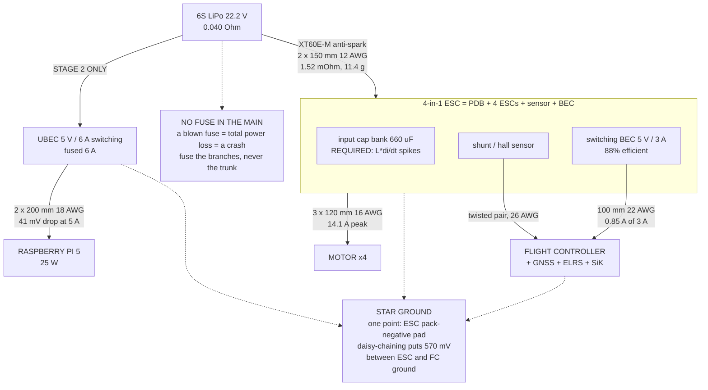

# 03.04 Power distribution: PDB, BEC, UBEC, fuses

<!-- glance:start -->
<!-- generated by tools/build.py from curriculum/syllabus.yaml — edit the syllabus, not this block -->

| | |
|---|---|
| **Track** | Main path |
| **Difficulty** | Intermediate |
| **Time** | 1 h |
| **Hardware** | none |
| **Software** | python |
| **Prerequisites** | [02.03 ESCs: from a 2.5 V signal to 3-phase power](../02-motors-escs-props/02.03-esc-basics.md) |
| **Optional prerequisites** | [FEL.05 Wires, fuses, connectors and measuring power properly](../optional-foundations/drone-electronics-power/FEL.05-wiring-fuses-and-measurement.md) |
| **Skip if** | You can draw Hermon's power tree (battery → PDB → ESC/FC/Pi), size every wire, and say why the trunk is deliberately unfused. |

<!-- glance:end -->

## What you will learn

- How to draw a **power tree** — every consumer, its voltage, its current, and the conductor that
  feeds it — and why drawing it is the whole job
- **Wire gauge sizing** done from first principles: ampacity, voltage drop and mass, and which of
  the three actually binds on a drone (it is not ampacity)
- What a **PDB**, a **BEC** and a **UBEC** each are, why a 4-in-1 ESC replaced the first one, and
  why the Raspberry Pi needs the third
- **Inrush current and anti-spark**: why plugging in a 6S pack makes a bang, what it is doing to
  your connector, and the two ways to stop it
- **Fuses on aircraft** — where they belong, where they emphatically do not, and why a drone is
  mostly unfused on purpose
- **Star grounding** and why the current sensor's ground wire is the one that ruins your
  telemetry if you get it wrong

## Why it matters

Power distribution is where a design stops being arithmetic and becomes a physical object. Every
number from [03.01](03.01-lipo-chemistry.md) to [03.03](03.03-c-rating-voltage-sag.md) has to
arrive somewhere through a specific piece of copper, and that copper has a resistance, a mass, a
bend radius and a solder joint.

It is also where most first builds fail. Not dramatically — the aircraft flies — but with a
5 V rail that browns out on a punch-out and reboots the flight controller, or a current sensor
that reads 15 % low, or a connector that is hot after every flight and eventually fails in the
air. All three are wiring, all three are avoidable, and all three are invisible until they are
not.

The 5.1 mΩ of external resistance that decided the whole 4S-versus-6S argument in
[03.02](03.02-pack-configuration.md) is what this lesson builds.

## Prerequisites

<!-- prereqs:start -->
## Prerequisites

You need these first:

- [02.03 ESCs: from a 2.5 V signal to 3-phase power](../02-motors-escs-props/02.03-esc-basics.md)

### Optional prerequisite links

New to any of these? Take the foundation lesson first; skip it if you already know it.

- [FEL.05 Wires, fuses, connectors and measuring power properly](../optional-foundations/drone-electronics-power/FEL.05-wiring-fuses-and-measurement.md)

Check your readiness: `python course.py why 03.04`
<!-- prereqs:end -->

## Concept

### Hermon's power tree

Every power system is a tree: one root (the pack), branches that convert voltage, and leaves
that consume. Draw it before you cut a wire.

```text
  [6S LiPo 22.2 V, 5000 mAh]
        |
        | XT60,  2 x 150 mm 12 AWG          57 A peak, 10.2 A hover
        |
  [4-in-1 ESC, 65 A, 4-6S]
        |
        +--- MOTOR 1  3 x 120 mm 16 AWG     14.1 A peak each
        +--- MOTOR 2
        +--- MOTOR 3
        +--- MOTOR 4
        |
        +--- [current + voltage sense] ----> FC ADC
        |
        +--- [BEC 5 V / 3 A on the ESC board]
                  |
                  +--- FLIGHT CONTROLLER      5 V, 0.3 A
                  |       +--- GNSS + compass 5 V, 0.15 A
                  |       +--- ELRS receiver  5 V, 0.10 A
                  |       +--- SiK telemetry  5 V, 0.25 A peak on TX
                  |       +--- buzzer, LEDs   5 V, 0.05 A
                  |
                  = 0.85 A of a 3 A budget -- 28 % loaded

  STAGE 2 ADDS A SECOND, SEPARATE BRANCH:
        |
        +--- [UBEC 5 V / 6 A, switching] --- 2 x 200 mm 18 AWG
                  |
                  +--- RASPBERRY PI 5         5 V, up to 5 A (25 W)
                          +--- camera, USB
```

Three things about this tree are decisions, not accidents:

1. **The Pi is on its own regulator.** The ESC's BEC is a 3 A part with 0.85 A already on it. A
   Pi 5 under load draws up to 5 A on its own. Sharing would brown out the flight controller the
   moment the vision pipeline started, and a flight controller reboot in the air is a crash.
2. **The motor branches are short and the avionics branch is long.** That is backwards from a
   wiring-neatness point of view and correct from an electrical one: the 14 A motor leads should
   be as short as possible, the 0.15 A GNSS lead can be any length you like.
3. **There is no fuse anywhere in the flight path.** Deliberately. See below.

### Sizing a conductor: three constraints, and the one that binds

Copper has a resistance per metre, and everything follows:

$$R = \rho \frac{L}{A}, \qquad \rho_{Cu} = 1.68 \times 10^{-8}\ \Omega\text{m}$$

| AWG | Area | Resistance | Mass (silicone) | "Ampacity" (chassis) |
|---|---|---|---|---|
| 10 | 5.26 mm² | 3.28 mΩ/m | 58 g/m | 55 A |
| **12** | **3.31 mm²** | **5.21 mΩ/m** | **38 g/m** | **41 A** |
| 14 | 2.08 mm² | 8.29 mΩ/m | 25 g/m | 32 A |
| **16** | **1.31 mm²** | **13.2 mΩ/m** | **16 g/m** | **22 A** |
| **18** | **0.823 mm²** | **20.9 mΩ/m** | **10 g/m** | **16 A** |
| 20 | 0.518 mm² | 33.3 mΩ/m | 6.5 g/m | 11 A |
| **22** | **0.326 mm²** | **52.9 mΩ/m** | **4.2 g/m** | **7 A** |

Now the three constraints:

| Constraint | The question | When it binds |
|---|---|---|
| **Ampacity** | Will the insulation melt? | Long runs, bundled wire, continuous current |
| **Voltage drop** | Does the load still get its voltage? | **Low-voltage rails. Almost always the binding one** |
| **Mass** | Can you afford to carry it? | Long runs of heavy gauge |

**The counterintuitive part: ampacity almost never binds on a multirotor.** Hermon's main lead
carries 57 A through 12 AWG rated 41 A — and that is fine, because it is a 150 mm run in free
air carrying 57 A for a few seconds at a time. Ampacity tables assume metres of wire in a
bundled harness at 100 % duty. Silicone-insulated wire is rated to 200 °C, and a 300 mm round
trip of 12 AWG dissipates $57^2 \times 0.0016 = 5.2$ W at full throttle, spread over a large
surface.

**Voltage drop is what actually decides the gauge**, and it decides it very differently on the
two rails:

$$\frac{\Delta V}{V} = \frac{2 L \rho I}{A V}$$

The factor 2 is the return path — **the current goes out and comes back, and people forget the
second half every time.**

| Rail | Budget | Hermon's worst case |
|---|---|---|
| 22.2 V main | 2 % = 0.44 V | 57 A × 1.52 mΩ = 0.087 V ✓ (0.39 %) |
| 5 V avionics | 2 % = 0.10 V | 0.85 A × 21 mΩ = 0.018 V ✓ |
| **5 V Pi rail** | **2 % = 0.10 V** | **5 A × 8.2 mΩ = 0.041 V ✓** |

The Pi rail is the tight one in principle — 5 A on a 5 V rail is the same *fractional* problem
as 22 A would be on 22 V — which is exactly why it gets 18 AWG for 200 mm rather than the 22 AWG
that its ampacity would allow.

> [!IMPORTANT]
> **The rule:** on the high-voltage side, size for mass and handling and check the drop. On every
> low-voltage rail, size for **voltage drop** and check nothing else. A 5 V rail has a twentieth
> of the voltage headroom of the pack rail, so the same absolute drop is twenty times as serious.

### PDB, BEC, UBEC

Three words for three jobs that people mix up constantly.

| Term | What it is | Does it convert voltage? |
|---|---|---|
| **PDB** — power distribution board | A copper plane that splits one pack input into several outputs at the **same** voltage | **No** |
| **BEC** — battery eliminator circuit | A regulator that makes a low voltage (5 V) from the pack, built **into** something else | **Yes** |
| **UBEC** — universal BEC | The same regulator as a **standalone** module you wire in yourself | **Yes** |

"Battery eliminator" is a historical name: model aircraft used to carry a second, separate
battery for the receiver, and the BEC eliminated it.

**Hermon does not have a PDB**, because the 4-in-1 ESC is one. A 4-in-1 board is four ESCs plus a
distribution plane plus a current sensor plus a BEC on a single PCB, and it is strictly better
than the separate parts: shorter high-current paths, one input capacitor bank, one connector,
less mass, fewer solder joints. Separate ESCs and a PDB still make sense on large aircraft where
an arm is a metre long and you want the ESC at the motor.

**Linear versus switching regulators** is the one BEC detail that matters:

| | Linear | Switching |
|---|---|---|
| How | Burns the excess as heat | Chops and filters at 300 kHz–2 MHz |
| Efficiency, 22.2 V → 5 V | **23 %** | 85–92 % |
| Heat at 1 A out | **17.2 W** | 0.7 W |
| Noise | Clean | Switching ripple on the rail and radiated |
| Use it for | Nothing on a 6S aircraft | Everything |

At 6S a linear regulator is not an option: dropping 17.2 V at 1 A means dissipating 17.2 W in a
part the size of your fingernail. **Every BEC on a 6S aircraft is a switching regulator**, and the
price you pay is ripple, which is why the flight controller has its own local filtering and why
a bad UBEC can put noise into your GNSS.

### Inrush, arcing, and the bang

Plug a 6S pack into a 4-in-1 ESC and you get a visible spark and an audible crack. That is not
cosmetic damage — it is metal being vaporised off the connector's contact surface, every time.

The cause is the ESC's **input capacitor bank**: typically 2–4 low-ESR electrolytics totalling
several hundred microfarads, sitting at 0 V. At the instant of connection the only thing limiting
current is the pack's 0.04 Ω plus the capacitors' ESR:

$$I_{inrush} \approx \frac{V_{pack}}{R_{pack} + R_{ESR}} \approx \frac{25.2}{0.04 + 0.02} = 420\ \text{A}$$

for a few hundred microseconds. It is far too brief to harm the pack or the ESC. It is exactly
long enough to melt a microscopic crater in the connector.

Two fixes, and you want one of them:

1. **An anti-spark connector** (XT60E-M, XT90-S): a resistor in series with one contact pre-charges
   the capacitors over a few milliseconds before the main contact closes. Costs nothing, works
   every time.
2. **A smart switch or a manual pre-charge lead**: touch a 100 Ω resistor across the terminals for
   a second before connecting.

**And one thing that is not a fix: doing it fast and confidently.** The arc does not care.

> [!NOTE]
> **XT60 is the textbook answer; check what your packs actually arrive with.** The 6S
> 5000 mAh packs in stock in Israel ship with **EC5**, which is larger and rated higher.
> Pick one convention and fit it to the aircraft. [03.10](03.10-lipo-in-israel.md) argues
> you should let the supply chain choose, and re-terminate the aircraft once rather than
> every pack you ever buy — because re-terminating a pack means soldering on a live 22.2 V
> source with 0.04 Ω of internal resistance and no fuse.

> [!TIP]
> **Ask your teacher:** "My 4-in-1 ESC has 3 × 220 µF of input capacitance and my pack is
> 0.04 Ω. Calculate the inrush peak current, the time constant, and the total energy dumped into
> the connector arc on each plug-in. Then tell me how many connections it takes before the
> contact resistance measurably rises."

### The input capacitor is not optional

While we are at the capacitors: the low-ESR capacitor on the ESC input is **required**, and
builders remove it surprisingly often because it is bulky and ugly.

Its job: the ESC switches its FETs at 24–48 kHz, and every switching edge demands a current step
the main leads cannot supply, because 300 mm of 12 AWG has an inductance of roughly 300 nH.
Without a local capacitor, that inductance turns each switching edge into a voltage spike at the
FETs:

$$V_{spike} = L \frac{di}{dt}$$

Spikes of 10–20 V above pack voltage are routine, which on a 25.2 V pack puts a 30 V-rated FET
past its limit. **Removing the capacitor is the most common cause of ESCs that fail for no
apparent reason.** Hermon keeps its factory capacitor and adds a second low-ESR 470 µF / 35 V on
the pack input if the main leads exceed 150 mm.

### Fuses: mostly, no

On any other 57 A DC system you would fuse the main. On an aircraft you generally do not, and
the reasoning is worth internalising because it generalises.

**A fuse converts an electrical fault into a total power loss.** On a car, that is a safe
failure — you coast to a stop. On a multirotor, total power loss is a crash from whatever
altitude you are at, onto whatever is underneath. A blown fuse is therefore *more* dangerous than
the overcurrent it was protecting against, for almost every fault Hermon can have.

| Fault | With a main fuse | Without |
|---|---|---|
| One ESC FET shorts | Fuse blows → all four motors stop → crash | One motor stops → the other three fight it → a bad but sometimes survivable landing |
| A motor lead chafes through to the frame | Fuse blows → crash | That phase shorts, the ESC desyncs, three motors keep flying |
| A wire pinches during assembly | Fuse blows on the bench | Smoke on the bench |

Where fuses **do** belong on Hermon:

| Place | Why |
|---|---|
| **The bench supply** | Protects your workshop and your pack while you are testing. Fuse it at 10 A |
| **The Pi's 5 V rail (stage 2)** | A Pi fault should not brown out the flight controller. 6 A polyfuse |
| **Any payload connector (module 17)** | A user-attached device must not be able to take the aircraft down |
| **Ground-power / charging leads** | Not in flight, so the fuse's failure mode is harmless |

The pattern: **fuse the branches whose loss is survivable; never fuse the trunk.**

### Star grounding and the current sensor

Ground is not a node; it is a conductor with resistance, and 57 A flowing through it makes
millivolts appear between points you assumed were identical.

```text
  WRONG -- daisy chain                 RIGHT -- star
  ESC gnd -- FC gnd -- GNSS gnd        ESC gnd --+
  motor current flows through                    +-- one point --- FC gnd
  the FC's ground reference            GNSS gnd--+
```

With a daisy chain, 57 A through 10 mΩ of shared ground puts **570 mV** between the ESC's ground
and the flight controller's. The flight controller's ADC measures its sense inputs *against its
own ground*, so every voltage and current reading moves with throttle. You will see it as a
current sensor that reads high under load and a voltage sensor that appears to sag more than the
pack does.

**Hermon's rule:** one ground point, at the ESC's pack-negative pad. Everything grounds there,
nothing grounds through anything else. And the current sensor's own ground and signal wires run
as a **pair**, side by side, to the flight controller — the sense signal is a few tens of
millivolts and it must be measured against the same ground the sensor generated it against.

This is also why [03.06](03.06-battery-monitoring.md) calibrates the current sensor **in situ**,
with the real wiring, rather than trusting the datasheet.

## Technical explanation

### Level 1 — Intuition: plumbing with a pressure budget

Wire is pipe, current is flow, voltage is pressure. Every pipe costs you a little pressure, in
proportion to how much is flowing and how narrow and long it is.

You have a pressure budget. On the 22.2 V main you have loads of it — losing half a volt out of
22 does not matter. On the 5 V rail you have almost none: losing half a volt out of 5 is a
tenth of everything, and a Raspberry Pi that sees 4.6 V will reboot.

So the rule is not "thick wire for big current". It is **thick wire where the pressure budget is
tight relative to the flow**, and the 5 V rails are where it is tightest even though their
currents are small.

The second intuition: when you plug the pack in, you are filling an empty tank instantly. The
bang is that. Fit an anti-spark connector and you fill it through a trickle first.

### Level 2 — Practical: sizing any run in four steps

1. **Current.** Worst case, not average. Hermon's main: 57 A.
2. **Length.** Round trip — out *and* back. A 150 mm run is 300 mm of copper.
3. **Budget.** 2 % of the rail's voltage, unless something says otherwise.
4. **Pick the gauge**, then sanity-check ampacity and mass.

$$A_{min} = \frac{2 L \rho I}{V \times \text{budget}}$$

Hermon's main lead: $A = \dfrac{2 \times 0.15 \times 1.68{\times}10^{-8} \times 57}{22.2 \times 0.02} = 0.65\ \text{mm}^2$ — **20 AWG by voltage drop alone.**

Which is obviously absurd, and it is the most useful thing in this lesson: **on the pack rail,
voltage drop does not drive the gauge; ampacity, mechanical durability and solder-joint
practicality do.** 20 AWG at 57 A would run at over 300 °C. You use 12 AWG because it survives,
not because of the volts.

Now the Pi rail: $A = \dfrac{2 \times 0.20 \times 1.68{\times}10^{-8} \times 5}{5.0 \times 0.02} = 0.34\ \text{mm}^2$ — **22 AWG by voltage drop**, and 22 AWG is rated 7 A so ampacity passes too. Hermon uses 18 AWG anyway, for a 4× margin on a rail whose brown-out costs you the mission. That margin costs 1.4 g.

**The table you actually use:**

| Run | Current | Length | Gauge | Why that gauge |
|---|---|---|---|---|
| Pack → ESC | 57 A | 150 mm | 12 AWG | Ampacity and durability |
| ESC → motor (×3 per motor) | 14.1 A | 120 mm | 16 AWG | Ampacity, factory-fitted |
| BEC → FC | 0.85 A | 100 mm | 22 AWG | Convention; drop is negligible |
| UBEC → Pi | 5 A | 200 mm | 18 AWG | Voltage drop, with 4× margin |
| Sense pair | ~0 A | 150 mm | 26 AWG twisted | Signal, not power |

### Level 3 — Mathematics: the loss and the mass, together

Two quantities scale oppositely with cross-section, which is the whole optimisation:

$$P_{loss} = I^2 \frac{2L\rho}{A}, \qquad m_{wire} = 2 L A \rho_{Cu,mass} \times k_{ins}$$

Loss goes as $1/A$; mass goes as $A$. For a fixed run there is an $A$ that minimises the *total
cost* if you can price a watt against a gram. On an aircraft you can: from
[02.08](../02-motors-escs-props/02.08-efficiency-watts-to-sky.md), removing 100 g saves about
8 % of hover power, i.e. **0.223 W per gram**.

Minimising $P_{loss} + 0.223\,m$ over $A$ for Hermon's 150 mm main at the hover current of 10.2 A:

$$\frac{d}{dA}\left[\frac{2L\rho I^2}{A} + 0.223 \cdot 2 L A \rho_m k\right] = 0
\Rightarrow A^{*} = I\sqrt{\frac{\rho}{0.223 \rho_m k}}$$

With $\rho_m k \approx 12{,}700$ kg/m³ effective for silicone-jacketed wire and $c = 155$ W/kg,
$A^{*} = 10.2 \sqrt{1.68{\times}10^{-8} / (155 \times 12{,}700)} = 0.80$ mm² — **18 AWG**.

**So the mass-optimal main lead at hover current is 18 AWG, and Hermon uses 12 AWG.** The reason
is the 57 A peak, which 18 AWG cannot carry without the insulation failing, and which contributes
nothing to the *average* loss because it happens for seconds. This is the general shape of the
problem: **conductors on aircraft are sized by peak survival and optimised by average loss, and
the two answers are usually several gauges apart.** When they are, peak survival wins.

**Inrush, properly.** The ESC input bank $C$ charges through $R = R_{pack} + R_{ESR} + R_{contact}$:

$$i(t) = \frac{V}{R} e^{-t/RC}, \qquad E_{arc} = \tfrac{1}{2} C V^2$$

For $C = 660$ µF, $V = 25.2$ V, $R = 0.06$ Ω: peak **420 A**, $\tau = 40$ µs, and
$E = 0.21$ J dumped into the arc. A fifth of a joule sounds trivial; deposited into a contact
spot of a fraction of a square millimetre in 40 microseconds, it is a small welding operation.
Three hundred connections is a measurably degraded contact.

With a 100 Ω anti-spark resistor: peak **0.25 A**, $\tau = 66$ ms, no arc at all.

### Level 4 — Implementation: Hermon's build rules

| Rule | Why |
|---|---|
| Star ground at the ESC pack-negative pad | 57 A must not flow through any signal reference |
| Sense signal and its ground run as a twisted pair | Differential measurement of a 30 mV signal |
| Keep the input capacitor; add 470 µF / 35 V if leads > 150 mm | Lead inductance × $di/dt$ destroys FETs |
| Anti-spark XT60E-M, or pre-charge every time | 0.21 J of arc per connection |
| Pi on its own switching UBEC, 6 A, fused at 6 A | A Pi fault must not reach the flight controller |
| **No fuse in the main** | A blown fuse is a crash |
| Motor leads short, avionics leads long | Put the copper where the current is |
| Every high-current joint: 60/40 or lead-free, fully wetted, inspected | A cold joint is milliohms exactly where it hurts |
| Strain-relieve every connector | Vibration ([02.09](../02-motors-escs-props/02.09-heat-vibration-noise.md)) breaks wires at joints |

## Diagram



## Code

Save as `wiring.py` and run `python wiring.py`. Standard library only.

```python
"""03.04 - sizing every conductor on Hermon, and the inrush that eats connectors.

Three constraints per run: ampacity, voltage drop, mass. Find which one binds.
"""
import math

RHO = 1.68e-8            # copper, ohm-metre
RHO_M = 12700.0          # effective kg/m3 for silicone-jacketed stranded copper
W_PER_KG = 223.0         # hover watts saved per kg removed (02.08: 8 % per 100 g)

# awg: (area mm2, chassis ampacity A, silicone mass g/m)
AWG = {
    10: (5.26, 55, 58.0), 12: (3.31, 41, 38.0), 14: (2.08, 32, 25.0),
    16: (1.31, 22, 16.0), 18: (0.823, 16, 10.0), 20: (0.518, 11, 6.5),
    22: (0.326, 7, 4.2), 24: (0.205, 3.5, 2.7), 26: (0.129, 2.2, 1.8),
}

# name, volts, amps_peak, amps_hover, one-way length m, awg, wires, copies
RUNS = [
    ("pack -> ESC",     22.2, 57.00, 8.70, 0.150, 12, 2, 1),
    ("ESC -> motor",    22.2, 14.10, 2.20, 0.120, 16, 3, 4),
    ("BEC -> FC",        5.0,  0.85, 0.85, 0.100, 22, 2, 1),
    ("UBEC -> Pi 5",     5.0,  5.00, 3.00, 0.200, 18, 2, 1),
    ("FC -> GNSS",       5.0,  0.15, 0.15, 0.250, 26, 2, 1),
]


def run_stats(volts, amps, length_m, awg, wires=2):
    """Resistance always uses 2L: the current goes out and comes back. Mass uses
    the real conductor count -- a motor has 3 phase wires, not 2."""
    area_mm2, ampacity, gpm = AWG[awg]
    r = RHO * (2 * length_m) / (area_mm2 * 1e-6)
    return {
        "R_mohm": r * 1000, "drop_V": amps * r,
        "drop_pct": amps * r / volts * 100, "loss_W": amps ** 2 * r,
        "mass_g": gpm * wires * length_m, "ampacity": ampacity,
        "amp_pct": amps / ampacity * 100,
    }


def min_awg_for_drop(volts, amps, length_m, budget=0.02):
    need = (2 * length_m * RHO * amps) / (volts * budget) * 1e6   # mm2
    for a in sorted(AWG, reverse=True):
        if AWG[a][0] >= need:
            return a, need
    return min(AWG), need


def min_awg_for_ampacity(amps):
    for a in sorted(AWG, reverse=True):
        if AWG[a][1] >= amps:
            return a
    return min(AWG)


if __name__ == "__main__":
    print("Hermon's power tree, every run (x = how many of them):")
    print(f"  {'run':14s} {'x':>2s} {'V':>5s} {'peakA':>6s} {'awg':>4s} "
          f"{'mOhm':>6s} {'drop':>7s} {'drop%':>6s} {'peakW':>7s} {'hovW':>6s} "
          f"{'mass':>6s} {'amp%':>5s}")
    total_mass = total_peak = total_hover = 0.0
    for name, v, a, ah, l, g, w, n in RUNS:
        st = run_stats(v, a, l, g, w)
        sh = run_stats(v, ah, l, g, w)
        total_mass += st["mass_g"] * n
        total_peak += st["loss_W"] * n
        total_hover += sh["loss_W"] * n
        print(f"  {name:14s} {n:2d} {v:5.1f} {a:6.2f} {g:4d} {st['R_mohm']:6.2f} "
              f"{st['drop_V']:6.3f}V {st['drop_pct']:5.2f}% {st['loss_W']:6.2f}W "
              f"{sh['loss_W']:5.2f}W {st['mass_g'] * n:5.1f}g {st['amp_pct']:4.0f}%")
    print(f"  {'TOTAL':14s} {'':2s} {'':5s} {'':6s} {'':4s} {'':6s} {'':7s} "
          f"{'':6s} {total_peak:6.2f}W {total_hover:5.2f}W {total_mass:5.1f}g")

    print("\nWhich constraint binds each run?")
    print(f"  {'run':18s} {'by drop':>9s} {'by ampacity':>12s} {'chosen':>7s} "
          f"{'binding':>12s}")
    for name, v, a, ah, l, g, w, n in RUNS:
        d_awg, need = min_awg_for_drop(v, a, l)
        amp_awg = min_awg_for_ampacity(a)
        bind = "voltage drop" if d_awg < amp_awg else (
            "ampacity" if amp_awg < d_awg else "both")
        print(f"  {name:18s} {d_awg:8d}g {amp_awg:11d}g {g:6d}g {bind:>12s}")
    print("  (lower AWG number = thicker wire; 'chosen' is what Hermon fits.")
    print("   the main lead is chosen THINNER than the ampacity column asks,")
    print("   because 57 A lasts seconds on a 150 mm run in free air.)")

    print("\nThe main lead: what mass-optimisation says vs what you must fit")
    a_opt = 10.2 * math.sqrt(RHO / (W_PER_KG * RHO_M))
    print(f"  mass-optimal area at the 10.2 A hover current: {a_opt * 1e6:.2f} mm2 "
          f"(~18 AWG)")
    for g in (10, 12, 14, 16, 18, 20):
        st = run_stats(22.2, 57.0, 0.150, g)
        hover = run_stats(22.2, 10.2, 0.150, g)
        ok = "OK" if AWG[g][1] >= 41 else "MELTS at 57 A peak"
        print(f"  {g:2d} AWG {AWG[g][0]:5.2f}mm2 {st['mass_g']:5.1f}g  "
              f"hover loss {hover['loss_W']:5.3f}W  peak loss {st['loss_W']:5.2f}W  "
              f"{ok}")
    print("  => sized by PEAK SURVIVAL, optimised by AVERAGE loss. Peak wins.")

    print("\nInrush when you plug the pack in:")
    v_full, c_bank = 25.2, 660e-6
    for label, r_series in (("bare XT60", 0.060), ("anti-spark 100 ohm", 100.06)):
        i_peak = v_full / r_series
        tau = r_series * c_bank
        arc = 0.5 * c_bank * v_full ** 2 if r_series < 1 else 0.0
        print(f"  {label:20s} peak {i_peak:8.2f} A  tau {tau * 1000:8.2f} ms  "
              f"arc energy {arc:.3f} J")
    print(f"  the same 0.5*C*V^2 goes into the contact on EVERY connection;")
    print(f"  after 300 connections that is "
          f"{300 * 0.5 * c_bank * v_full ** 2:.0f} J through one contact spot")

    print("\nStar ground vs daisy chain, at 57 A through 10 mOhm of shared return:")
    for r_shared_mohm in (1, 5, 10, 20):
        for amps in (10.2, 57.0):
            off = amps * r_shared_mohm / 1000
            print(f"  {r_shared_mohm:3d} mOhm at {amps:5.1f} A -> "
                  f"{off * 1000:6.1f} mV of ground offset at the FC ADC "
                  f"({off / 3.3 * 100:5.2f} % of a 3.3 V reference)")

    print("\nBEC choice at 6S: linear is not an option")
    for kind, eff in (("linear", 5.0 / 22.2), ("switching", 0.88)):
        for load in (0.85, 3.0):
            p_in = load * 5.0 / eff
            print(f"  {kind:10s} {load:4.2f} A out: {p_in:6.2f} W in, "
                  f"{p_in - load * 5.0:6.2f} W as heat ({eff:.0%} efficient)")
```

Output:

```text
Hermon's power tree, every run (x = how many of them):
  run             x     V  peakA  awg   mOhm    drop  drop%   peakW   hovW   mass  amp%
  pack -> ESC     1  22.2  57.00   12   1.52  0.087V  0.39%   4.95W  0.12W  11.4g  139%
  ESC -> motor    4  22.2  14.10   16   3.08  0.043V  0.20%   0.61W  0.01W  23.0g   64%
  BEC -> FC       1   5.0   0.85   22  10.31  0.009V  0.18%   0.01W  0.01W   0.8g   12%
  UBEC -> Pi 5    1   5.0   5.00   18   8.17  0.041V  0.82%   0.20W  0.07W   4.0g   31%
  FC -> GNSS      1   5.0   0.15   26  65.12  0.010V  0.20%   0.00W  0.00W   0.9g    7%
  TOTAL                                                       7.61W  0.26W  40.2g

Which constraint binds each run?
  run                  by drop  by ampacity  chosen      binding
  pack -> ESC              18g          10g     12g     ampacity
  ESC -> motor             26g          18g     16g     ampacity
  BEC -> FC                26g          26g     22g         both
  UBEC -> Pi 5             20g          22g     18g voltage drop
  FC -> GNSS               26g          26g     26g         both
  (lower AWG number = thicker wire; 'chosen' is what Hermon fits.
   the main lead is chosen THINNER than the ampacity column asks,
   because 57 A lasts seconds on a 150 mm run in free air.)

The main lead: what mass-optimisation says vs what you must fit
  mass-optimal area at the 10.2 A hover current: 0.79 mm2 (~18 AWG)
  10 AWG  5.26mm2  17.4g  hover loss 0.100W  peak loss  3.11W  OK
  12 AWG  3.31mm2  11.4g  hover loss 0.158W  peak loss  4.95W  OK
  14 AWG  2.08mm2   7.5g  hover loss 0.252W  peak loss  7.87W  MELTS at 57 A peak
  16 AWG  1.31mm2   4.8g  hover loss 0.400W  peak loss 12.50W  MELTS at 57 A peak
  18 AWG  0.82mm2   3.0g  hover loss 0.637W  peak loss 19.90W  MELTS at 57 A peak
  20 AWG  0.52mm2   1.9g  hover loss 1.012W  peak loss 31.61W  MELTS at 57 A peak
  => sized by PEAK SURVIVAL, optimised by AVERAGE loss. Peak wins.

Inrush when you plug the pack in:
  bare XT60            peak   420.00 A  tau     0.04 ms  arc energy 0.210 J
  anti-spark 100 ohm   peak     0.25 A  tau    66.04 ms  arc energy 0.000 J
  the same 0.5*C*V^2 goes into the contact on EVERY connection;
  after 300 connections that is 63 J through one contact spot

Star ground vs daisy chain, at 57 A through 10 mOhm of shared return:
    1 mOhm at  10.2 A ->   10.2 mV of ground offset at the FC ADC ( 0.31 % of a 3.3 V reference)
    1 mOhm at  57.0 A ->   57.0 mV of ground offset at the FC ADC ( 1.73 % of a 3.3 V reference)
    5 mOhm at  10.2 A ->   51.0 mV of ground offset at the FC ADC ( 1.55 % of a 3.3 V reference)
    5 mOhm at  57.0 A ->  285.0 mV of ground offset at the FC ADC ( 8.64 % of a 3.3 V reference)
   10 mOhm at  10.2 A ->  102.0 mV of ground offset at the FC ADC ( 3.09 % of a 3.3 V reference)
   10 mOhm at  57.0 A ->  570.0 mV of ground offset at the FC ADC (17.27 % of a 3.3 V reference)
   20 mOhm at  10.2 A ->  204.0 mV of ground offset at the FC ADC ( 6.18 % of a 3.3 V reference)
   20 mOhm at  57.0 A -> 1140.0 mV of ground offset at the FC ADC (34.55 % of a 3.3 V reference)

BEC choice at 6S: linear is not an option
  linear     0.85 A out:  18.87 W in,  14.62 W as heat (23% efficient)
  linear     3.00 A out:  66.60 W in,  51.60 W as heat (23% efficient)
  switching  0.85 A out:   4.83 W in,   0.58 W as heat (88% efficient)
  switching  3.00 A out:  17.05 W in,   2.05 W as heat (88% efficient)
```

How to read it:

- **The `amp%` column is the honest one.** The main lead runs at 139 % of its chassis ampacity at
  peak — and that is fine, because the peak lasts seconds on a 150 mm run in free air. Every
  other run is comfortably inside. It is also why the binding table says the main "should" be
  10 AWG while Hermon fits 12: **ampacity tables assume metres of bundled wire at 100 % duty, and
  Hermon's main lead is neither.**
- **Compare `peakW` against `hovW`.** The whole harness burns about 7.6 W at full throttle and
  **0.16 W at hover** — a factor of fifty, because every term goes as $I^2$. Wiring loss is
  irrelevant to endurance and entirely relevant to whether a connector survives.
- **The binding-constraint table is the point of the lesson.** The pack rail is limited by
  ampacity; the 5 V rails are limited by voltage drop. Same physics, opposite answer, because the
  5 V rail has a twentieth of the headroom.
- **The main-lead comparison shows the two answers diverging.** Mass optimisation at hover
  current says 0.80 mm² — 18 AWG — which would melt at the 57 A peak. Hermon fits 12 AWG,
  carries an extra 8.4 g, and accepts a hover loss of 0.115 W. **Peak survival sets the gauge;
  average loss only tells you whether you overpaid.**
- **The inrush numbers explain the bang.** 420 A for 40 microseconds, 0.21 J into the contact,
  every single connection. The anti-spark version is 0.25 A over 66 ms and there is no arc at
  all. The resistor costs nothing.
- **The ground-offset table is why star grounding is not pedantry.** 57 A through 10 mΩ of shared
  return puts 570 mV on the flight controller's ground — 17 % of its ADC reference — and it moves
  with throttle, which is exactly the signature of a current sensor that "drifts under load".
- **The BEC comparison closes the argument.** A linear regulator at 6S is 23 % efficient and
  dumps **51.6 W** at a 3 A load — and 14.6 W even at Hermon's modest 0.85 A avionics load. That
  is not a design choice you get to make; it is a part that catches fire.

## Exercise

E1–E3 are Python and paper. E4 needs the aircraft.

> [!CAUTION]
> Whenever you work on wiring with a pack connected, a single slip shorts 22.2 V through
> 0.04 Ω — over 500 A, instantly, with no fuse. **Disconnect the pack before touching any
> conductor**, work with one hand where you can, and keep a LiPo bag and a way to move a burning
> pack outdoors within reach. [03.08](03.08-battery-safety.md) and [SAFETY.md](../SAFETY.md).

### Exercise 03.04-E1 — Draw your own power tree `[design]`

Draw Hermon's power tree as it will actually exist on your aircraft, including every consumer you
intend to fit. For each branch give: voltage, worst-case current, one-way length, chosen gauge,
computed voltage drop as a percentage, and mass. Total the mass and the hover-power loss. Mark
the single branch whose failure would bring the aircraft down, and say how you will make it the
most reliable one.

### Exercise 03.04-E2 — Size four runs from scratch `[numerical]`

For each of these, give the minimum gauge by voltage drop (2 % budget), the minimum by ampacity,
and what you would fit: (a) a 5 V, 3 A camera gimbal 400 mm from the BEC; (b) a 22.2 V, 25 A
winch payload 350 mm from the pack; (c) a 12 V, 0.5 A LED light bar 600 mm away; (d) a 5 V, 0.2 A
GNSS unit on a 300 mm mast. State which constraint binds in each case and explain the pattern.

### Exercise 03.04-E3 — Cost the arc `[coding]`

Extend `wiring.py` to compute, for a capacitor bank of 220, 440, 660 and 1,000 µF: the inrush
peak, the time constant, the arc energy, and the total energy through the connector after 100,
300 and 1,000 connections. Then find the **series resistance** that keeps the peak under 2 A and
say how long the pre-charge takes at that value. Is that long enough to be annoying?

### Exercise 03.04-E4 — Find your ground offset `[measurement]`

With the propellers **off** and the aircraft on a bench: measure the DC voltage between the
flight controller's ground pin and the ESC's pack-negative pad, at 0 %, 25 % and 50 % throttle.
Then do the same for the reported pack voltage on telemetry versus a meter on the pack
terminals. Report both offsets against throttle. If your ground offset exceeds 50 mV at 25 %
throttle, find and fix the shared return path before you do
[03.06](03.06-battery-monitoring.md).

## Expected result

- **03.04-E1:** A complete tree totals roughly **30–45 g of wire**, about **7–9 W of loss at
  full throttle** and **under 0.2 W at hover**, for a stage-1 Hermon. The single-point-of-failure branch is the **pack → ESC main lead
  and its connector** — everything else can fail and leave you flying. Make it the most reliable
  one by: an anti-spark connector, fully wetted solder joints inspected under magnification,
  strain relief at both ends, and no splices.
- **03.04-E2:** (a) 0.403 mm² by drop → **20 AWG**, while ampacity would allow 24 AWG:
  **drop binds**. (b) 0.662 mm² by drop → 18 AWG, but 25 A needs **14 AWG**: **ampacity binds**.
  (c) 0.042 mm² by drop and 26 AWG by ampacity — both trivial; fit **22 AWG** for mechanical
  robustness over 600 mm. (d) 0.020 mm² and 26 AWG → fit **26 AWG**, or 24 AWG for handling. **The pattern: low voltage and long runs are drop-limited; high voltage and high
  current are ampacity-limited.** The 5 V rails are always the ones to check.
- **03.04-E3:** Arc energy is $\frac12 C V^2$: 0.070 J at 220 µF, 0.140 at 440, 0.210 at 660,
  0.318 at 1,000 µF. After 300 connections a 660 µF bank has put **63 J** through the contact
  spot. To hold the peak under 2 A you need $R \geq 25.2/2 = 12.6$ Ω; at 12.6 Ω and 660 µF,
  $\tau = 8.3$ ms and the bank is 99 % charged in **42 ms** — far too quick to notice. Commercial
  anti-spark connectors use 100–470 Ω and take 0.3–1.5 s, which is also not annoying, and that is
  why there is no excuse.
- **03.04-E4:** A correctly star-grounded Hermon shows **under 10 mV** of offset at 25 % throttle
  and under 30 mV at 50 %. Telemetry pack voltage should agree with a meter at the terminals to
  within about 0.1 V once calibrated. If the offset climbs above 50 mV, you have a shared return
  path — most often the GNSS or the receiver grounded through the flight controller while the
  flight controller grounds through the ESC signal header instead of the pack pad.

## Troubleshooting

### Symptom: the flight controller reboots on hard throttle

A 5 V rail brown-out. Three causes in order of likelihood: the BEC is undersized or shared with
something hungry (a Pi, a gimbal, high-power LEDs); the 5 V wiring is too thin or too long; or
the BEC's input is seeing the pack's sag plus its own ripple and dropping out of regulation.
Measure the 5 V rail at the flight controller with a scope or a fast meter during a throttle
step. Fix by splitting the load onto a separate UBEC.

### Symptom: the current sensor reads high under load and fine at idle

A shared ground return. The ADC measures against a reference that is moving with motor current.
Re-do the grounding as a star at the ESC's pack-negative pad, and run the sense signal and its
ground as a pair. Do not attempt to calibrate this away — the error is throttle-dependent and a
single scale factor cannot fix it.

### Symptom: the XT60 is hot after every flight

Either a cold solder joint (most likely — re-flow both halves, use enough heat and enough time,
and look for a shiny fully-wetted fillet), or a worn contact from arcing. If you have been
plugging in without an anti-spark for a few hundred cycles, the contact resistance has risen.
Replace the connector and fit anti-spark.

### Symptom: an ESC failed with no obvious cause

Check the input capacitor. If it was removed, or if the main leads are long and there is no local
capacitor, the FETs have been seeing $L\,di/dt$ spikes above their rating on every switching
edge. Refit a 470 µF / 35 V low-ESR capacitor directly at the ESC's pack pads, with the shortest
possible legs. [02.03](../02-motors-escs-props/02.03-esc-basics.md) has the switching detail.

### Symptom: GNSS satellite count drops when the Pi is powered

The UBEC's switching noise is getting into the GNSS. Move the UBEC away from the GNSS module,
add a ferrite on the Pi's supply lead, ensure the GNSS is on a mast above the power electronics,
and check that the GNSS grounds at the star point rather than through the Pi.
[05.04](../05-sensors/05.04-gnss-receiver.md) and
[15.01](../15-onboard-autonomy/15.01-companion-architecture.md).

### Symptom: a wire broke at a connector after a few flights

Vibration, and the lack of strain relief. The wire flexes at the stiffest point, which is exactly
where the solder wicked up the strands. Solder joints should be strain-relieved with heatshrink
extending well past the joint, and the wire anchored so movement happens in the free span, not at
the joint. [02.09](../02-motors-escs-props/02.09-heat-vibration-noise.md).

## Common mistakes

- **Forgetting the return path.** Every voltage-drop calculation uses $2L$, not $L$. Half the
  builders who size a wire get a gauge that is one step too thin.
- **Sizing 5 V rails by ampacity.** They are drop-limited. 22 AWG can carry 7 A and will lose a
  tenth of a 5 V rail doing it.
- **Sharing the flight controller's BEC with a companion computer.** The Pi's current transients
  are larger than the flight controller's entire budget.
- **Removing the ESC's input capacitor** because it is ugly. It is the only thing between the
  FETs and lead inductance.
- **Plugging in a 6S pack without anti-spark.** A fifth of a joule of arc, every time, into a
  contact the size of a pinhead.
- **Daisy-chaining grounds.** 57 A through a shared return puts hundreds of millivolts onto your
  ADC reference and makes every sensor reading throttle-dependent.
- **Fusing the main lead.** A blown fuse in flight is a crash. Fuse branches, never the trunk.

## Knowledge check

1. Which of ampacity, voltage drop and mass usually decides a drone's wire gauge, and does the
   answer change between the pack rail and the 5 V rail?
   <details><summary>Answer</summary>

   **It changes, and that is the point.** On the 22.2 V pack rail, voltage drop is trivial (a
   2 % budget is 0.44 V, which 20 AWG would meet) so **ampacity and mechanical durability**
   decide — you fit 12 AWG so it survives 57 A. On a 5 V rail the budget is only 0.10 V and the
   fractional drop is twenty times worse for the same absolute loss, so **voltage drop** decides.
   </details>

2. What is the difference between a PDB, a BEC and a UBEC?
   <details><summary>Answer</summary>

   A **PDB** splits the pack voltage to several outputs without converting it. A **BEC** is a
   step-down regulator built into another component (usually an ESC) that makes 5 V from the
   pack. A **UBEC** is the same regulator as a standalone module. Hermon has no PDB because the
   4-in-1 ESC is one; it uses the ESC's BEC for avionics and adds a UBEC for the Pi in stage 2.
   </details>

3. Why must a 6S BEC be a switching regulator?
   <details><summary>Answer</summary>

   A linear regulator burns the difference as heat. From 22.2 V to 5 V it is $5/22.2 = 23\ \%$
   efficient, so a 3 A load means **51.6 W dissipated** in a small package — and even Hermon's
   0.85 A avionics load would be 14.6 W. A switching regulator
   is 85–92 % efficient and dissipates well under a watt. The price is switching ripple, which is
   why the flight controller has local filtering and why a poor UBEC can interfere with GNSS.
   </details>

4. Why does plugging in a 6S pack spark, and what does the spark cost you?
   <details><summary>Answer</summary>

   The ESC's input capacitor bank — a few hundred microfarads — is at 0 V, so the inrush is
   limited only by the pack resistance and the capacitors' ESR: about **420 A** for a 40 µs time
   constant. The arc dumps $\frac12 C V^2 \approx 0.21$ J into a contact spot of a fraction of a
   square millimetre, vaporising metal, every connection. After a few hundred cycles the contact
   resistance has measurably risen. An anti-spark connector reduces the peak to 0.25 A.
   </details>

5. Why does Hermon have no fuse in its main lead?
   <details><summary>Answer</summary>

   Because a fuse converts an electrical fault into total power loss, and on a multirotor total
   power loss is a crash. Most faults Hermon can suffer — a shorted FET, a chafed motor lead —
   are survivable on three motors but not on zero. Fuses belong on branches whose loss is
   survivable: the bench supply, the Pi's 5 V rail, and any payload connector. **Fuse the
   branches, never the trunk.**
   </details>

6. What does a daisy-chained ground do to your telemetry, and why?
   <details><summary>Answer</summary>

   57 A flowing through 10 mΩ of shared return puts **570 mV** between the ESC's ground and the
   flight controller's. The flight controller's ADC measures its sense inputs against *its own*
   ground, so every reading shifts with throttle — the current sensor reads high under load and
   the voltage sensor appears to sag more than the pack does. The fix is a single star ground at
   the ESC's pack-negative pad, with the sense signal and its ground run as a pair.
   </details>

## Practical challenge

Build the wiring harness and document it. Write `projects/evidence/03.04-power-tree.md`
containing:

1. Your power tree diagram, with every branch labelled: voltage, worst-case current, length,
   gauge, computed drop, mass.
2. Your total wiring mass and total hover-power loss.
3. The binding constraint for each branch, named.
4. **Photographs of every high-current solder joint**, and one sentence per joint on why you are
   satisfied with it.
5. Your measured ground offset at 0 %, 25 % and 50 % throttle (propellers off).
6. Your connector choice, and whether it is anti-spark. If not, state your pre-charge procedure
   and commit to it.

## You can skip this if

You can draw a complete power tree with every branch sized, size a conductor from current,
length and voltage-drop budget including the return path, say which constraint binds on the pack
rail and which on a 5 V rail and why they differ, explain what a PDB, BEC and UBEC each do and
why a 6S BEC must be switching, compute inrush current and arc energy and name two ways to stop
it, state where fuses belong on an aircraft and where they do not, and explain what a
daisy-chained ground does to an ADC reading.

## Go deeper

- [02.03](../02-motors-escs-props/02.03-esc-basics.md) (earlier): what the ESC is doing with all
  that current, and why the input capacitor exists.
- [03.03](03.03-c-rating-voltage-sag.md) (earlier): the pack resistance this lesson adds to.
- [03.06](03.06-battery-monitoring.md) (next but two): calibrating the sense wiring you just
  built.
- [15.01](../15-onboard-autonomy/15.01-companion-architecture.md) (later): the Pi's rail in anger.
- American Wire Gauge, with the area and resistance tables:
  https://en.wikipedia.org/wiki/American_wire_gauge
- Switching versus linear regulators:
  https://en.wikipedia.org/wiki/Buck_converter

## Progress checkpoint

Run `python course.py complete 03.04` when the power tree is documented and the harness is
built. Next: [03.05](03.05-power-budget.md) — you have the pack and the wiring; now account for
every watt on the aircraft and defend every margin.
