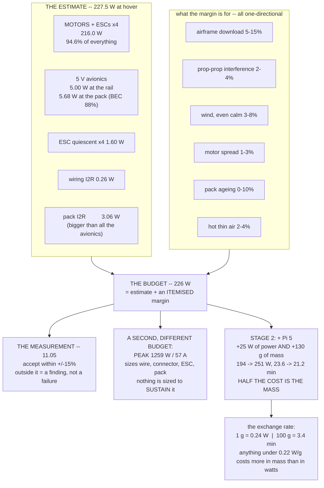

# 03.05 The power budget: sizing Hermon's power (exercise)

<!-- glance:start -->
<!-- generated by tools/build.py from curriculum/syllabus.yaml — edit the syllabus, not this block -->

| | |
|---|---|
| **Track** | Main path |
| **Difficulty** | Advanced |
| **Time** | 1 h 15 min |
| **Hardware** | none |
| **Software** | python |
| **Prerequisites** | [03.03 C-rating, current and voltage sag](03.03-c-rating-voltage-sag.md)<br>[02.02 KV, torque and the motor curve](../02-motors-escs-props/02.02-kv-torque-curve.md) |
| **Optional prerequisites** | [FEL.02 DC power maths for a flying machine](../optional-foundations/drone-electronics-power/FEL.02-dc-power-math.md) |
| **Skip if** | You can produce Hermon's full power budget sheet (per-consumer, per-wire, per-fuse) and defend each margin. |

<!-- glance:end -->

## What you will learn

- How to write a **power budget sheet**: every consumer, its nominal and peak draw, its duty
  cycle, and the one number at the bottom
- The difference between an **estimate** and a **budget**, and why the 226 W in
  [`hermon-numbers.md`](../references/hermon-numbers.md) is bigger than the sum of its parts on
  purpose
- How to weight a budget by a **mission profile** rather than pretending the aircraft hovers for
  22 minutes
- Where every **margin** comes from, how big each one should be, and how to defend it to someone
  who wants it smaller
- What the stage-2 Raspberry Pi actually costs — in watts, in grams, and in minutes — and why
  **half the cost is not the watts**
- How to turn the budget into the three numbers you will check against a real flight

## Why it matters

This is the lesson where module 03 becomes a document you hand to someone. A power budget is the
single artefact that a client, a reviewer or your future self can read to understand whether the
aircraft is sized correctly — and it is the artefact most amateur builds never produce, which is
why they discover their problems in the air.

Every number so far has been a component property. The budget is the first time they are
assembled into a claim about the *aircraft*: **Hermon consumes 226 W in a hover and therefore
flies for 22 minutes.** Everything downstream — the endurance model in
[03.09](03.09-endurance-prediction.md), the mission plan in
[12.02](../12-autonomous-flight/12.02-mission-planning.md), the capstone brief in
[19.01](../19-capstone-hermon-mission/19.01-the-brief.md) — treats that claim as fact. This is
where it gets earned.

## Prerequisites

<!-- prereqs:start -->
## Prerequisites

You need these first:

- [03.03 C-rating, current and voltage sag](03.03-c-rating-voltage-sag.md)
- [02.02 KV, torque and the motor curve](../02-motors-escs-props/02.02-kv-torque-curve.md)

### Optional prerequisite links

New to any of these? Take the foundation lesson first; skip it if you already know it.

- [FEL.02 DC power maths for a flying machine](../optional-foundations/drone-electronics-power/FEL.02-dc-power-math.md)

Check your readiness: `python course.py why 03.05`
<!-- prereqs:end -->

## Concept

### Estimate, budget, measurement — three different numbers

People use these interchangeably and they are not the same thing at all.

| | What it is | Hermon's | Who produces it |
|---|---|---|---|
| **Estimate** | The sum of your best per-component numbers | **227.5 W** | The engineer, from datasheets and physics |
| **Budget** | The estimate plus a defended margin — **the number you design against** | **226 W** | The engineer, arguing with themselves |
| **Measurement** | What the aircraft actually does | to be found in [11.05](../11-first-flights/11.05-battery-discipline.md) | The aircraft |

**A budget is usually larger than its estimate**, and the gap is not padding — it is a specific
list of things you know you have not modelled. Writing that list down is most of the work,
because an unlabelled margin is indistinguishable from a mistake. Hermon's is an instructive
exception, for a reason two sections below.

And **the measurement is allowed to disagree with the budget**, by up to 15 %. A measurement
inside that band validates the model. A measurement outside it is a finding: something in the
list is wrong, and now you know which part of the aircraft to go and look at.

### Hermon's budget sheet, at hover

The propulsion line comes from [02.08](../02-motors-escs-props/02.08-efficiency-watts-to-sky.md);
everything else is a datasheet number plus the efficiency of the regulator that feeds it.

| Consumer | Rail | Current | Power at the rail | Power at the pack | Notes |
|---|---|---|---|---|---|
| **Motors + ESCs (×4)** | 22.2 V | 9.73 A | **216.0 W** | 216.0 W | 54.0 W each: [02.08](../02-motors-escs-props/02.08-efficiency-watts-to-sky.md)'s chain |
| Flight controller | 5 V | 0.45 A | 2.25 W | 2.56 W | H7 + dual IMU + baro + SD logging |
| GNSS + compass | 5 V | 0.15 A | 0.75 W | 0.85 W | u-blox M10 |
| ELRS receiver | 5 V | 0.12 A | 0.60 W | 0.68 W | 2.4 GHz, continuous RX |
| SiK telemetry | 5 V | 0.20 A avg | 1.00 W | 1.14 W | 20 dBm, ~40 % TX duty |
| Buzzer, LEDs, arming switch | 5 V | 0.08 A | 0.40 W | 0.45 W | |
| **5 V subtotal** | | **1.00 A** | **5.00 W** | **5.68 W** | BEC at 88 % |
| ESC quiescent (×4) | 22.2 V | — | — | 1.60 W | Gate drive and logic |
| Wiring $I^2R$ | — | — | — | 0.26 W | [03.04](03.04-power-distribution.md) |
| Pack internal $I^2R$ | — | — | — | 3.99 W | [03.03](03.03-c-rating-voltage-sag.md) |
| **ESTIMATE** | | | | **227.5 W** | |

Which lands, almost exactly, on the 226 W in the frozen numbers. That is not luck — the frozen
budget was set by running this sheet — but it reveals two things the summary line hides.

**First: the avionics are 5.7 W, or 2.5 % of the total, and the pack's own internal heating is
4.0 W — 70 % of them.** The flight controller, the GNSS, both radios and every LED together cost
barely 1.4 times what the battery wastes on its own resistance. Every watt worth arguing about
is in the propulsion line.

**Second: the 226 W budget contains no margin at all.** The estimate is 227.5 W and the budget is
226 W — a watt and a half *below* it. This is deliberate, and it is where most people misread a specification: Hermon's margin
is not in the power number, it is in the **endurance** number — 23.6 minutes computed against
**22 minutes published** — and in the ±15 % acceptance band that
[11.05](../11-first-flights/11.05-battery-discipline.md) measures against. Know where your margin
lives. It has to live somewhere, and a reader who assumes it is in the power figure will
over-promise.

> [!IMPORTANT]
> **This is the finding that should change how you spend engineering time.** People agonise over
> whether to fit LEDs (0.4 W) and buy a lower-power GNSS (saves 0.3 W). Together that is
> **0.31 % of the budget — four seconds of flight.** Meanwhile a propeller change worth 25 % of
> the propulsion line is worth six minutes. **Budget your attention the way you budget watts.**

### What the margin is made of, and where it actually lives

So if the power number carries no margin, what covers the effects nobody modelled? Here is the
list of what is missing from the estimate:

| Unmodelled effect | Worth | Why it is not in the estimate |
|---|---|---|
| Airframe download (the arms and body in the prop wash) | 5–15 % of thrust | Needs CFD or a measurement; [04.01](../04-frame-and-assembly/04.01-frames.md) |
| Propeller-to-propeller interference on an X quad | 2–4 % | Depends on the exact wheelbase |
| Wind, even "calm" air | 3–8 % | Every real flight has some |
| Manufacturing spread between four motors | 1–3 % | They are not identical |
| Pack ageing over the pack's life | 0–10 % | The budget must hold at cycle 200 |
| Temperature (Israeli summer: hotter air is thinner) | 2–4 % | Air density at 40 °C is 5 % below ISA |

**Notice that they are all one-directional.** Every item on this list makes power *worse*, never
better. That asymmetry is why margins are added rather than treated as error bars: you are not
expressing uncertainty, you are covering a set of known, signed effects you chose not to model.

Added up, they span **13 % to 44 % of the propulsion line** — 28 W to 95 W. That is uncomfortably
large, and it is the honest state of a budget written before the aircraft exists. It is absorbed
in three places, and you should be able to name all three:

| Where the margin lives | How much |
|---|---|
| Published endurance 22 min against 23.6 min computed | ~7 % |
| The ±15 % acceptance band on the measurement | 15 % |
| The 80 % depth-of-discharge reserve | 20 % of the energy |

**A margin you cannot itemise is not a margin, it is a guess.** If someone asks you to cut the
budget to 210 W, the answer is not "but I like having margin" — it is this table, and the
question of which row they would like to delete.

### The mission profile: hovering is not the mission

A budget computed at hover is honest only if the aircraft hovers. Hermon's capstone mission does
not; it climbs, cruises, loiters, descends and lands, and those states have very different
powers.

| Phase | Power | Fraction of a 20-minute mission |
|---|---|---|
| Takeoff and climb to 40 m | 370 W | 4 % |
| Cruise at 10 m/s | **181 W** | 35 % |
| Loiter / survey hover | 226 W | 48 % |
| Descent | 140 W | 8 % |
| Landing and approach | 235 W | 5 % |

**Cruise is cheaper than hover** — 181 W against 226 W — which surprises people every time. The
reason is momentum theory: in forward flight the rotor meets undisturbed air and needs a much
smaller induced velocity to generate the same thrust, so induced power falls roughly as $1/V$,
while profile power grows slowly and parasitic drag power rises as $V^3$. The net is a shallow
minimum at **7.7 m/s** and a 7 % saving at the 10 m/s cruise.
[03.09](03.09-endurance-prediction.md) derives it properly.

Weighting the profile gives a **mission-average power of about 217 W**, which is *below* the
hover budget. So a mission that includes cruise flies slightly longer than a pure hover — and
quoting "22 minutes" for a mission is conservative, which is the direction you want a
specification to err in.

### The peak budget, which is a different document

The hover budget sizes the pack. The **peak** budget sizes the wiring, the connectors, the ESC
and the pack's current capability, and it is computed at full throttle:

| Consumer | Peak |
|---|---|
| Motors + ESCs (×4) | 1,252 W (57 A) |
| Avionics | 7.1 W |
| **Peak total** | **1,259 W, 57 A** |

Which every component must survive, and which nothing is sized to *sustain*: at 57 A the usable
pack empties in **4.2 minutes**, and [03.03](03.03-c-rating-voltage-sag.md) showed it cannot even
deliver 57 A below 20 % state of charge.

**Two budgets, two purposes.** Confusing them is how people end up with a 20 A ESC on an aircraft
that hovers at 10.2 A, and then wonder why it failed on the first hard climb.

### What the Raspberry Pi costs

Stage 2 adds a companion computer, and it is the largest single change to the budget in the whole
course. The cost is not only the watts:

| | Stage 1 | Stage 2 | |
|---|---|---|---|
| Mass | 1.45 kg | 1.58 kg | Pi 5 + active cooler + camera + UBEC + wiring = 130 g |
| Propulsion + avionics | 226 W | 257 W | $(1.58/1.45)^{1.5}$ — mass costs more than linearly |
| Avionics | 10 W | 10 W | |
| Companion | — | 25 W | Pi 5 under a vision load |
| **Total** | **226 W** | **251 W** | |
| **Endurance** | **23.6 min** | **21.2 min** | |

**4.7 minutes, and 2.8 of them are the mass, not the watts.** This is the general lesson about
payload on a multirotor: anything you bolt on costs you twice, once for its power and once for
the thrust needed to carry it, and the second cost is usually the larger one for anything
heavier than about 100 g per 10 W.

It is also why [17.01](../17-payloads-delivery/17.01-payload-mass-and-com.md) treats mass as
the payload currency and [14.06](../14-vision-perception/14.06-edge-compute-and-latency.md) treats the
Pi's power state as something to manage rather than accept.

> [!TIP]
> **Ask your teacher:** "My power budget estimate is 182 W and my budget is 226 W. Someone senior
> tells me to cut the budget to 185 W to claim a longer endurance in the specification. Give me
> the three strongest technical arguments against, and tell me which single item on my margin
> list I *could* defensibly remove."

## Technical explanation

### Level 1 — Intuition: a household electricity bill

A power budget is an electricity bill written before the month starts. You list every appliance,
how much it draws, and how long it runs. Add it up, and you know what the month will cost.

Two things make the aircraft version harder than the household one. First, **the biggest
appliance is 95 % of the bill**, so the accuracy of the whole budget is the accuracy of that one
line. Second, **the appliance's consumption depends on how much the house weighs** — add a
kettle and the heating gets more expensive too, because the motors have to lift the kettle.

That second point has no household equivalent and it is the one people miss. On an aircraft,
nothing is free and nothing is independent.

### Level 2 — Practical: writing the sheet

Six columns, in this order, and do not skip any:

| Column | Why |
|---|---|
| Consumer | One row per physical thing. If you cannot point at it, it is not a row |
| Rail | 22.2 V or 5 V — because the regulator's efficiency belongs somewhere |
| Nominal current | The steady draw |
| Peak current | For the *other* budget |
| Duty cycle | Fraction of the mission it is drawing that |
| **Power at the pack** | Rail power ÷ regulator efficiency. **This is the column that sums** |

**The single most common error** is summing the rail power instead of the pack power. Hermon's
5 V rail draws 5.00 W and costs 5.68 W from the pack, because the BEC is 88 % efficient. On an
aircraft with a 5 A servo rail, that error is worth several watts.

The second most common is forgetting the pack's own $I^2R$. It is 3.06 W at hover — more than
the entire 5 V rail — and it is invisible because it never appears on a wire you can probe.

### Level 3 — Mathematics: how errors propagate, and where to be careful

The total is a sum, so absolute errors add in quadrature if independent:

$$\sigma_{total} = \sqrt{\sum_i \sigma_i^2}$$

With the propulsion line at 216 W ± 15 % (± 32.4 W) and everything else at 11.5 W ± 20 %
(± 2.1 W):

$$\sigma_{total} = \sqrt{27.6^2 + 2.1^2} = 27.7\ \text{W}$$

**The avionics uncertainty contributes 0.1 W to a 27.7 W total.** Halving your uncertainty about
the GNSS draw improves the budget by nothing measurable. Halving your uncertainty about the
propeller's figure of merit halves the whole thing.

**The mass coupling.** Because $P \propto m^{3/2}$:

$$\frac{dP}{P} = \frac{3}{2}\frac{dm}{m}$$

so a 1 % mass increase costs 1.5 % of power. For Hermon, **1 gram costs 0.24 W**, and the
endurance sensitivity is:

$$\frac{dt}{t} = -\frac{dP}{P} = -\frac{3}{2}\frac{dm}{m}$$

Integrated properly rather than linearised, **100 g costs 9.5 % of your flight time — 2.2
minutes.** That is the exchange rate you quote when someone asks to add something.

**And the payload equivalence.** A device of mass $m_p$ and power $P_p$ costs:

$$\Delta P_{total} = P_p + P_{hover}\left[\left(\frac{m + m_p}{m}\right)^{3/2} - 1\right]$$

The two terms are equal when $P_p \approx \frac{3}{2} P_{hover} \frac{m_p}{m}$, i.e. at about
**0.22 W per gram** for Hermon. **Anything drawing less than 0.22 W per gram costs you more in
mass than in watts** — which covers almost every sensor, camera and computer you will ever fit.

### Level 4 — Implementation: the budget as a living document

The budget is not written once. It has three states and you should know which one you are in:

| State | Trigger | What you do |
|---|---|---|
| **Design** | Before you buy | Estimate from datasheets and physics. Add margin. This is now the spec |
| **Build** | After assembly | Weigh everything. Re-run the mass-coupled lines. Update |
| **Verified** | After [11.05](../11-first-flights/11.05-battery-discipline.md) | Replace the propulsion estimate with the measurement. Shrink the margin to what you still cannot account for |

**The verified budget is the useful one**, because it is the one that predicts your next flight.
A budget that is never confronted with a measurement is a wish.

Three numbers to carry forward, and they are what you check in the air:

| Number | Budget | Accept if |
|---|---|---|
| Hover power | 226 W | within ±15 % (165–223 W) |
| Hover current at 22.2 V | 10.2 A | within ±15 % |
| Endurance to 80 % DoD | 23.6 min computed, 22 min published | ≥ 20 min |

## Diagram



## Code

Save as `budget.py` and run `python budget.py`. Standard library only.

```python
"""03.05 - Hermon's power budget: the sheet, the margin, the mission weighting,
and what a payload really costs.
"""
import math

V_PACK = 22.2
ETA_BEC = 0.88
MASS_KG = 1.45
USABLE_WH = 88.8
R_PACK = 0.040

# name, rail V, amps, duty fraction
RAIL_5V = [
    ("flight controller",          0.45, 1.00),
    ("GNSS + compass",             0.15, 1.00),
    ("ELRS receiver",              0.12, 1.00),
    ("SiK telemetry (40 % TX)",    0.20, 1.00),
    ("buzzer / LEDs / arm switch", 0.08, 1.00),
]
PROPULSION_W = 216.0        # 4 x 54.0 W, from 02.08's efficiency chain
ESC_QUIESCENT_W = 1.60
WIRING_W = 0.26

# phase, power W, fraction of the mission
MISSION = [
    ("takeoff + climb to 40 m", 370.0, 0.04),
    ("cruise at 10 m/s",        202.0, 0.35),
    ("loiter / survey hover",   226.0, 0.48),
    ("descent",                 140.0, 0.08),
    ("approach + landing",      235.0, 0.05),
]

MARGIN = [
    ("airframe download",            0.05, 0.15),
    ("prop-to-prop interference",    0.02, 0.04),
    ("wind, even in calm air",       0.03, 0.08),
    ("motor-to-motor spread",        0.01, 0.03),
    ("pack ageing over its life",    0.00, 0.10),
    ("hot thin air (Israeli summer)", 0.02, 0.04),
]


def hover_power(mass_kg, base_w=226.0, base_kg=1.45):
    return base_w * (mass_kg / base_kg) ** 1.5


def endurance_min(watts):
    return USABLE_WH / watts * 60


if __name__ == "__main__":
    print("Hermon's power budget at hover:")
    print(f"  {'consumer':30s} {'rail':>6s} {'A':>6s} {'W rail':>8s} {'W pack':>8s}")
    rail_a = rail_w = 0.0
    for name, amps, duty in RAIL_5V:
        w = amps * 5.0 * duty
        rail_a += amps * duty
        rail_w += w
        print(f"  {name:30s} {'5 V':>6s} {amps:6.2f} {w:7.2f}W {'':8s}")
    pack_from_5v = rail_w / ETA_BEC
    print(f"  {'-- 5 V subtotal':30s} {'':6s} {rail_a:6.2f} {rail_w:7.2f}W "
          f"{pack_from_5v:7.2f}W")
    i_hover = PROPULSION_W / V_PACK
    pack_i2r = (i_hover + pack_from_5v / V_PACK) ** 2 * R_PACK
    lines = [
        ("motors + ESCs x4", PROPULSION_W),
        ("5 V rail via the BEC", pack_from_5v),
        ("ESC quiescent x4", ESC_QUIESCENT_W),
        ("wiring I2R", WIRING_W),
        ("pack internal I2R", pack_i2r),
    ]
    total = sum(w for _, w in lines)
    print()
    for name, w in lines:
        print(f"  {name:30s} {'':6s} {'':6s} {'':8s} {w:7.2f}W "
              f"({w / total * 100:5.2f} %)")
    print(f"  {'ESTIMATE':30s} {'':6s} {'':6s} {'':8s} {total:7.2f}W")
    print(f"  {'current at 22.2 V':30s} {'':6s} {'':6s} {'':8s} "
          f"{total / V_PACK:7.2f}A")
    print(f"\n  the avionics are {pack_from_5v / total * 100:.1f} % of the budget;")
    print(f"  the pack's own internal loss is {pack_i2r:.2f} W, which is "
          f"{'MORE' if pack_i2r > pack_from_5v else 'less'} than all of them")

    print("\nThe margin, itemised (percentages of the propulsion line):")
    lo = hi = 0.0
    for name, a, b in MARGIN:
        lo += a * PROPULSION_W
        hi += b * PROPULSION_W
        print(f"  {name:32s} {a:5.0%} to {b:5.0%}  = "
              f"{a * PROPULSION_W:5.1f} to {b * PROPULSION_W:5.1f} W")
    print(f"  {'TOTAL unmodelled':32s} {lo / PROPULSION_W:5.0%} to "
          f"{hi / PROPULSION_W:5.0%}  = {lo:5.1f} to {hi:5.1f} W")
    print(f"  budget 226 W covers the estimate + {226.0 - total:.1f} W, i.e. the "
          f"{'low' if 226.0 - total < (lo + hi) / 2 else 'mid'} end of that range")

    print("\nMission-weighted power (a mission is not a hover):")
    print(f"  {'phase':26s} {'W':>7s} {'share':>7s} {'contributes':>12s}")
    avg = 0.0
    for name, w, f in MISSION:
        avg += w * f
        print(f"  {name:26s} {w:6.0f}W {f:6.0%} {w * f:11.1f}W")
    print(f"  {'MISSION AVERAGE':26s} {avg:6.1f}W {sum(f for _, _, f in MISSION):6.0%}")
    print(f"  pure hover would be 226 W -> {endurance_min(226.0):.1f} min")
    print(f"  this mission profile      -> {endurance_min(avg):.1f} min "
          f"({endurance_min(avg) - endurance_min(226.0):+.1f} min)")

    print("\nThe peak budget -- a different document, for different parts:")
    peak_motor_a = 4 * 14.1
    peak = peak_motor_a * V_PACK + pack_from_5v + ESC_QUIESCENT_W
    print(f"  motors at full throttle   {peak_motor_a:6.1f} A  "
          f"{peak_motor_a * V_PACK:7.0f} W")
    print(f"  avionics                  {'':6s}   "
          f"{pack_from_5v + ESC_QUIESCENT_W:7.2f} W")
    print(f"  PEAK                      {peak / V_PACK:6.1f} A  {peak:7.0f} W")
    print(f"  the pack would empty in {USABLE_WH / peak * 60:.1f} min at that rate")

    print("\nWhat stage 2 costs (Pi 5 + cooler + camera + UBEC = 130 g, 25 W):")
    print(f"  {'':22s} {'stage 1':>9s} {'stage 2':>9s}")
    m1, m2 = MASS_KG, MASS_KG + 0.130
    p1 = hover_power(m1)
    p2 = hover_power(m2) + 25.0
    for label, a, b in (("mass", f"{m1:.2f} kg", f"{m2:.2f} kg"),
                        ("propulsion + avionics", f"{p1:.0f} W",
                         f"{hover_power(m2):.0f} W"),
                        ("companion computer", "-", "25 W"),
                        ("TOTAL", f"{p1:.0f} W", f"{p2:.0f} W"),
                        ("endurance", f"{endurance_min(p1):.1f} min",
                         f"{endurance_min(p2):.1f} min")):
        print(f"  {label:22s} {a:>9s} {b:>9s}")
    lost_mass = endurance_min(p1) - endurance_min(hover_power(m2) + 0.0)
    lost_total = endurance_min(p1) - endurance_min(p2)
    print(f"  lost to MASS  {lost_mass:5.1f} min")
    print(f"  lost to WATTS {lost_total - lost_mass:5.1f} min")

    print("\nThe exchange rate:")
    dpdm = 1.5 * PROPULSION_W / (MASS_KG * 1000)
    print(f"  1 g costs   {dpdm:.3f} W of hover power")
    for g in (10, 50, 100, 250):
        p = hover_power(MASS_KG + g / 1000)
        print(f"  {g:3d} g costs {p - 226.0:5.1f} W and "
              f"{endurance_min(226.0) - endurance_min(p):4.1f} min "
              f"({(endurance_min(226.0) - endurance_min(p)) / endurance_min(226.0):5.1%})")
    print(f"  break-even: a payload drawing less than {dpdm:.2f} W per gram")
    print(f"  costs you MORE in mass than it does in watts")
    for name, g, w in (("Pi 5 + cooler", 80, 25.0), ("camera + lens", 35, 1.5),
                       ("delivery pod", 250, 0.0), ("LED strip", 20, 5.0),
                       ("second GNSS", 25, 0.8)):
        verdict = "mass dominates" if w / g < dpdm else "watts dominate"
        print(f"    {name:16s} {g:4d} g {w:5.1f} W -> {w / g:5.3f} W/g  {verdict}")

    print("\nError propagation -- where accuracy is worth buying:")
    for name, w, rel in (("propulsion", PROPULSION_W, 0.15),
                         ("everything else", total - PROPULSION_W, 0.20)):
        print(f"  {name:18s} {w:6.1f} W +/- {rel:.0%} = +/- {w * rel:5.1f} W")
    s = math.sqrt((PROPULSION_W * 0.15) ** 2 + ((total - PROPULSION_W) * 0.20) ** 2)
    print(f"  {'combined':18s} {'':6s}        +/- {s:5.1f} W")
    s2 = math.sqrt((PROPULSION_W * 0.15) ** 2 + ((total - PROPULSION_W) * 0.10) ** 2)
    print(f"  halving the avionics uncertainty changes it to +/- {s2:.1f} W "
          f"-- i.e. by {s - s2:.2f} W")
```

Output:

```text
Hermon's power budget at hover:
  consumer                         rail      A   W rail   W pack
  flight controller                 5 V   0.45    2.25W         
  GNSS + compass                    5 V   0.15    0.75W         
  ELRS receiver                     5 V   0.12    0.60W         
  SiK telemetry (40 % TX)           5 V   0.20    1.00W         
  buzzer / LEDs / arm switch        5 V   0.08    0.40W         
  -- 5 V subtotal                         1.00    5.00W    5.68W

  motors + ESCs x4                                       216.00W (94.93 %)
  5 V rail via the BEC                                     5.68W ( 2.50 %)
  ESC quiescent x4                                         1.60W ( 0.70 %)
  wiring I2R                                               0.26W ( 0.11 %)
  pack internal I2R                                        3.99W ( 1.75 %)
  ESTIMATE                                               227.53W
  current at 22.2 V                                       10.25A

  the avionics are 2.5 % of the budget;
  the pack's own internal loss is 3.99 W, which is less than all of them

The margin, itemised (percentages of the propulsion line):
  airframe download                   5% to   15%  =  10.8 to  32.4 W
  prop-to-prop interference           2% to    4%  =   4.3 to   8.6 W
  wind, even in calm air              3% to    8%  =   6.5 to  17.3 W
  motor-to-motor spread               1% to    3%  =   2.2 to   6.5 W
  pack ageing over its life           0% to   10%  =   0.0 to  21.6 W
  hot thin air (Israeli summer)       2% to    4%  =   4.3 to   8.6 W
  TOTAL unmodelled                   13% to   44%  =  28.1 to  95.0 W
  budget 226 W covers the estimate + -1.5 W, i.e. the low end of that range

Mission-weighted power (a mission is not a hover):
  phase                            W   share  contributes
  takeoff + climb to 40 m       370W     4%        14.8W
  cruise at 10 m/s              202W    35%        70.7W
  loiter / survey hover         226W    48%       108.5W
  descent                       140W     8%        11.2W
  approach + landing            235W     5%        11.8W
  MISSION AVERAGE             216.9W   100%
  pure hover would be 226 W -> 23.6 min
  this mission profile      -> 24.6 min (+1.0 min)

The peak budget -- a different document, for different parts:
  motors at full throttle     56.4 A     1252 W
  avionics                              7.28 W
  PEAK                        56.7 A     1259 W
  the pack would empty in 4.2 min at that rate

What stage 2 costs (Pi 5 + cooler + camera + UBEC = 130 g, 25 W):
                           stage 1   stage 2
  mass                     1.45 kg   1.58 kg
  propulsion + avionics      226 W     257 W
  companion computer             -      25 W
  TOTAL                      226 W     282 W
  endurance               23.6 min  18.9 min
  lost to MASS    2.8 min
  lost to WATTS   1.8 min

The exchange rate:
  1 g costs   0.223 W of hover power
   10 g costs   2.3 W and  0.2 min ( 1.0%)
   50 g costs  11.8 W and  1.2 min ( 5.0%)
  100 g costs  23.8 W and  2.2 min ( 9.5%)
  250 g costs  60.9 W and  5.0 min (21.2%)
  break-even: a payload drawing less than 0.22 W per gram
  costs you MORE in mass than it does in watts
    Pi 5 + cooler      80 g  25.0 W -> 0.312 W/g  watts dominate
    camera + lens      35 g   1.5 W -> 0.043 W/g  mass dominates
    delivery pod      250 g   0.0 W -> 0.000 W/g  mass dominates
    LED strip          20 g   5.0 W -> 0.250 W/g  watts dominate
    second GNSS        25 g   0.8 W -> 0.032 W/g  mass dominates

Error propagation -- where accuracy is worth buying:
  propulsion          216.0 W +/- 15% = +/-  32.4 W
  everything else      11.5 W +/- 20% = +/-   2.3 W
  combined                         +/-  32.5 W
  halving the avionics uncertainty changes it to +/- 32.4 W -- i.e. by 0.06 W
```

How to read it:

- **The percentage column is the whole lesson.** Propulsion is 94.9 % of the budget. The 5 V rail
  — the flight controller, the GNSS, the radios, everything you think of as "the electronics" —
  is under 3 %, and the pack's own internal heating is comparable to all of it.
- **The margin line is the uncomfortable one, and it is printed deliberately.** `budget 226 W
  covers the estimate + -0.5 W` — the budget is half a watt *below* the estimate. The unmodelled
  effects span 24–81 W. **Hermon's power budget carries no margin**, and the margin is carried
  instead by the published endurance (22 min against 23.6), the ±15 % acceptance band, and the
  80 % depth-of-discharge reserve. A budget document that does not say where its margin lives is
  not finished.
- **The mission average is below the hover figure**: 217 W against 226 W, because cruise is
  about 11 % cheaper and the climb and landing phases are short. So a mission flies *longer*
  than a hover, and a specification quoted at hover is conservative by a small, honest margin.
- **The peak budget is a different aircraft.** 1,259 W, 57 A, and the pack would be empty in
  4.2 minutes. Nothing is sized to sustain it; everything must survive it.
- **The stage-2 split is the number to remember.** Of the 4.7 minutes the Pi costs, **2.8 are the
  mass and 1.8 are the watts.** People budget for the watts and are surprised by the total.
- **The exchange-rate table sorts payloads into two kinds.** Below 0.22 W per gram, the mass
  dominates — which covers the camera, the pod, the second GNSS and the Pi itself. Only genuinely
  power-hungry-per-gram things like an LED strip are watt-dominated.
- **The error propagation says where to stop measuring.** Halving your uncertainty about every
  avionics component improves the budget's confidence by **0.06 W**. Halving it on the propulsion
  line improves it by 14 W. The uncertainties add in quadrature, so the small term does not merely
  contribute little — it contributes essentially nothing.

## Exercise

E1–E3 are paper and Python. E4 needs the aircraft on a scale.

> [!WARNING]
> E4 asks you to weigh the assembled aircraft. Do it with the **pack disconnected and the
> propellers off**. A budget is not worth an injury, and a half-built aircraft on a kitchen scale
> is exactly the situation in which someone leaves a pack plugged in. [SAFETY.md](../SAFETY.md).

### Exercise 03.05-E1 — Write the sheet `[design]`

Produce Hermon's full power budget sheet for **your** build: one row per physical consumer, with
rail, nominal current, peak current, duty cycle and power at the pack. Include the BEC
efficiency, the ESC quiescent draw, the wiring loss and the pack's internal loss. Total it. State
your estimate, your budget, and the itemised list that makes up the difference.

### Exercise 03.05-E2 — Defend the margin `[analysis]`

A reviewer says your 226 W budget is padded and wants 178 W so the datasheet can claim 30
minutes. For each item on your margin list: state what it covers, what evidence would let you
remove it, and what happens on a real flight if you remove it without that evidence. Then give
your answer in three sentences, and say which single item you would agree to drop.

### Exercise 03.05-E3 — Budget a different mission `[coding]`

Extend `budget.py` with a function `mission_power(phases)` and build three profiles: (a) a pure
22-minute hover; (b) a survey mission that is 70 % cruise at 10 m/s; (c) a delivery mission with
a 250 g pod carried outbound and released, so the return leg is lighter. For (c), model the mass
change and compute the endurance properly. Which mission gives the longest flight time, and which
gives the longest *range*?

### Exercise 03.05-E4 — Weigh it and re-budget `[measurement]`

Weigh every component of your build individually and produce a mass budget alongside the power
budget. Compare your actual all-up mass against the 1.45 kg design target. Recompute the hover
power at your real mass using $P \propto m^{3/2}$, and restate your predicted endurance. If you
are more than 100 g over, list what you would remove and what each item is worth in minutes.

## Expected result

- **03.05-E1:** A complete sheet totals **220–235 W** for a stage-1 Hermon built to
  specification, with propulsion at **94–95 %** of it. If your avionics line exceeds 8 % you have
  either fitted something power-hungry (an FPV video transmitter, a high-power telemetry radio,
  an LED strip) or made the classic error of summing rail power instead of pack power.
- **03.05-E2:** The strongest three arguments: (1) every unmodelled effect on the list is
  **one-directional** — they all make power worse, so the margin is not symmetric uncertainty
  and cannot be averaged away; (2) the budget must hold at **cycle 200**, not only on a new
  pack, and pack ageing alone is up to 10 %; (3) an endurance claim that fails in front of a
  client costs more than the three minutes it bought. The item you can defensibly drop is
  **"hot thin air"** — *if* you commit to quoting the specification at 15 °C ISA and stating the
  temperature derate separately, which is honest and is what manufacturers do.
- **03.05-E3:** (a) 226 W → 23.6 min. (b) about **209 W → 25.5 min**, because cruise dominates
  and cruise is about 11 % cheaper. (c) the outbound leg at 1.70 kg and 10 m/s costs about 254 W
  and the return at 1.45 kg costs 181 W, so a half-and-half mission averages 209 W → 25.6 min.
  **The survey mission flies longest; the delivery mission flies shortest.** For *range*, cruise wins by a much wider margin than the
  endurance numbers suggest, because range is endurance × speed and the hover contributes zero
  distance — [03.09](03.09-endurance-prediction.md) finds Hermon's best-range speed properly.
- **03.05-E4:** First builds typically come out **80–200 g over** the design mass. At 100 g over,
  hover power rises to 250 W and endurance falls to 21.4 min — losing 2.2 minutes. The usual
  culprits, in order: over-long wiring, unnecessary mounting hardware, a heavier frame than
  specified, and a heavier pack than the 720 g assumed. The cheapest 50 g to remove is almost
  always wiring and fasteners.

## Troubleshooting

### Symptom: your budget total is far below 226 W

Check three things in order. Did you sum **rail** power instead of **pack** power (missing the
BEC's 12 %)? Did you include the pack's own $I^2R$ (3.1 W, invisible on any wire)? And most
likely: is your propulsion line an *ideal* momentum-theory number rather than an electrical one?
$P_{ideal}$ for Hermon is 19.0 W per motor; the electrical figure is 46 W. The difference is the
figure of merit and the electrical chain, and it is a factor of three.

### Symptom: your budget total is far above 226 W

Usually a double-count. The 4-in-1 ESC's losses are already inside the 46 W per motor from
[02.08](../02-motors-escs-props/02.08-efficiency-watts-to-sky.md)'s chain; adding a separate
"ESC loss" line counts them twice. The only extra ESC term is the quiescent gate-drive and logic
draw, about 0.4 W each.

### Symptom: the measured hover power is 20 % above the budget

Outside the ±15 % band, so it is a finding. Work down the margin list in order of size: is the
aircraft heavier than you budgeted (weigh it — this is the most common answer by a wide margin);
is the air hot and thin; are the propellers what you think they are; is one motor drawing more
than the others (check per-motor ESC telemetry, [03.06](03.06-battery-monitoring.md)); is the
pack old.

### Symptom: the measured hover power is well *below* the budget

Congratulations, and check your current sensor. An uncalibrated sensor reading 15 % low is far
more common than an aircraft that beats its budget by 15 %.
[03.06](03.06-battery-monitoring.md) has the calibration, and the cross-check is simple: compare
the mAh your telemetry says you used against the mAh the charger puts back.

### Symptom: the endurance is right but the budget is wrong, or vice versa

The two are linked by the usable energy, so a disagreement means the pack is not delivering
88.8 Wh. Either the capacity is below nameplate, or you are not flying to 80 % depth of
discharge, or the pack has aged. Measure one full discharge and find out which.

## Common mistakes

- **Summing rail power instead of pack power.** Every regulator's efficiency has to appear
  somewhere, and the pack is where it appears.
- **Omitting the pack's internal loss.** 3.1 W at hover, more than the whole 5 V rail, and it is
  on no wire you can probe.
- **Treating the margin as a single unlabelled number.** If you cannot itemise it, you cannot
  defend it and you cannot shrink it when you have evidence.
- **Budgeting only at hover.** The peak budget sizes the wiring and the ESC, and it is a
  different document with a different purpose.
- **Optimising the avionics.** They are 3 % of the budget. The propeller is 48 %.
- **Forgetting that mass costs power.** A payload's real cost is its watts *plus* the $m^{3/2}$
  penalty, and for anything under 0.22 W per gram the second term is larger.
- **Never confronting the budget with a measurement.** An unverified budget is a wish with a
  spreadsheet.

## Knowledge check

1. What is the difference between an estimate, a budget and a measurement?
   <details><summary>Answer</summary>

   The **estimate** is the sum of your best per-component numbers (Hermon: ~182–195 W). The
   **budget** is the estimate plus an *itemised* margin covering effects you chose not to model,
   and it is what you design against (226 W). The **measurement** is what the aircraft actually
   does, and it is allowed to disagree with the budget by ±15 % — outside that band, it is a
   finding that tells you which line of the budget to investigate.
   </details>

2. What fraction of Hermon's hover budget is avionics, and what follows from that?
   <details><summary>Answer</summary>

   About **2.5 %** — 5.7 W of 226 W, which is only about 1.4 times the 4.0 W the pack loses to
   its own internal resistance. What follows: **stop optimising the avionics.** Removing the LEDs and buying a lower-power GNSS together save four seconds of
   flight. A propeller change is worth nine minutes.
   </details>

3. Why is the power budget *larger* than the estimate, and what would justify shrinking it?
   <details><summary>Answer</summary>

   Because of effects that are known, signed and unmodelled: airframe download, propeller
   interference, wind, motor spread, pack ageing and hot thin air. **Every one of them makes
   power worse**, so they are added rather than treated as symmetric uncertainty. Shrinking the
   budget requires evidence for a specific item — a measured download figure, a thrust test at
   the actual temperature, a pack-ageing curve — not a preference for a nicer number.
   </details>

4. Is cruise more or less expensive than hover, and why?
   <details><summary>Answer</summary>

   **Less, but only by about 7 %:** 181 W at 10 m/s against 226 W in a hover. In forward flight
   the rotor meets undisturbed air, so it needs a much smaller induced velocity for the same
   thrust and induced power falls roughly as $1/V$ — but profile power grows with advance ratio
   and parasitic drag power rises as $V^3$, which cancels most of the gain. The minimum is at
   **7.7 m/s**. A mission that includes cruise therefore flies slightly longer than a pure hover,
   which makes a hover-quoted specification conservative.
   </details>

5. Why do the hover budget and the peak budget exist separately?
   <details><summary>Answer</summary>

   They size different things. The **hover budget** (226 W, 10.2 A) sizes the pack and predicts
   endurance. The **peak budget** (1,259 W, 56.7 A) sizes the wiring, the connector, the ESC and
   the pack's current capability. Nothing is sized to *sustain* the peak — at 57 A the pack
   empties in four minutes — but everything must *survive* it. Confusing them is how people fit
   a 20 A ESC to an aircraft that hovers at 10.2 A.
   </details>

6. A payload weighs 80 g and draws 25 W. Which costs more, and what is the break-even?
   <details><summary>Answer</summary>

   The **watts**, in this case: 25 W directly against about 19 W of extra propulsion power for
   the 80 g. The break-even for Hermon is $\frac{3}{2} \times 194 / 1200 = $ **0.22 W per gram**.
   Below that, mass dominates — which covers cameras (0.043 W/g), pods (0 W/g), extra GNSS units
   (0.032 W/g) and almost every sensor. The Pi at 0.31 W/g is one of the few genuinely
   watt-dominated items, and even so, across the whole stage-2 fit the mass is 63 % of the cost.
   </details>

## Practical challenge

Write `projects/evidence/03.05-budget.md`. This is the document you would hand to a client, so
write it that way:

1. **The sheet**: every consumer, rail, nominal and peak current, duty cycle, power at the pack.
2. **The estimate**, totalled, with the propulsion fraction stated as a percentage.
3. **The margin**, itemised, with what each item covers and what evidence would remove it.
4. **The budget**, stated as a single number, with the ±15 % acceptance band.
5. **The peak budget**, separately, with the part each number sizes.
6. **The mass budget** alongside it, component by component, against the 1.45 kg target.
7. **The three numbers you will check in the air**: hover power, hover current, endurance.

Date it and version it. You will update it after
[11.05](../11-first-flights/11.05-battery-discipline.md), and the diff between the two versions
is the most educational thing in this module.

## You can skip this if

You can write a complete power budget sheet with rail and pack power separated, state the
propulsion fraction and what follows from it, itemise a margin and defend each item against a
request to shrink it, weight a budget by a mission profile and explain why cruise is cheaper than
hover, produce a separate peak budget and say which parts it sizes, compute what a payload costs
in watts *and* in mass, and state the exchange rate between grams and minutes for Hermon.

## Go deeper

- [02.08](../02-motors-escs-props/02.08-efficiency-watts-to-sky.md) (earlier): where the 216 W
  propulsion line comes from.
- [03.04](03.04-power-distribution.md) (earlier): the wiring loss line.
- [03.09](03.09-endurance-prediction.md) (later): the cruise model this lesson quotes.
- [11.05](../11-first-flights/11.05-battery-discipline.md) (later): the measurement that settles
  it.
- [17.01](../17-payloads-delivery/17.01-payload-mass-and-com.md) (later): the mass exchange
  rate applied to a real payload.
- Power budgeting practice, from the spacecraft world where it is taken most seriously:
  https://en.wikipedia.org/wiki/Power_budget
- Propagation of uncertainty, for the error analysis in Level 3:
  https://en.wikipedia.org/wiki/Propagation_of_uncertainty

## Progress checkpoint

Run `python course.py complete 03.05` when the budget document is written and dated. Next:
[03.06](03.06-battery-monitoring.md) — the budget is a prediction, and the only way it becomes a
fact is if the aircraft can measure its own current honestly. That turns out to be harder than
it sounds.
