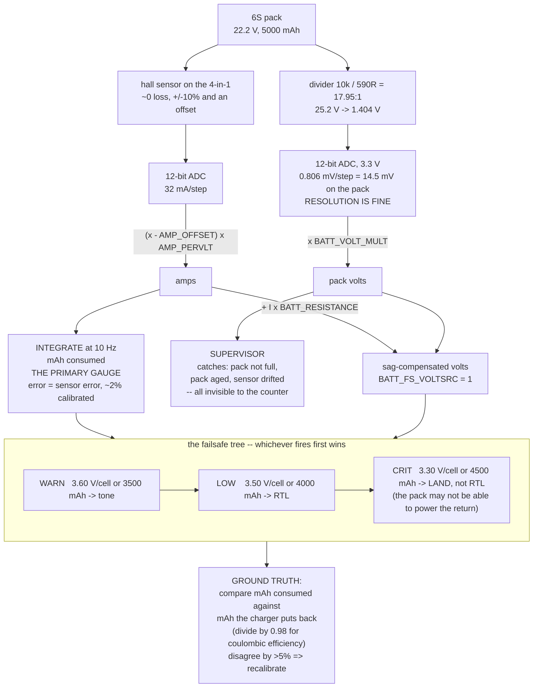

# 03.06 Battery monitoring: voltage, current, mAh

<!-- glance:start -->
<!-- generated by tools/build.py from curriculum/syllabus.yaml — edit the syllabus, not this block -->

| | |
|---|---|
| **Track** | Main path |
| **Difficulty** | Intermediate |
| **Time** | 1 h |
| **Hardware** | First flight (Hermon core) (stage 1) |
| **Software** | python |
| **Prerequisites** | [03.04 Power distribution: PDB, BEC, UBEC, fuses](03.04-power-distribution.md) |
| **Optional prerequisites** | [FEL.04 Brushless motors from zero](../optional-foundations/drone-electronics-power/FEL.04-bldc-from-zero.md) |
| **Skip if** | You can read voltage, current and mAh from Hermon's telemetry and set a low-voltage cutoff that saves the pack. |

<!-- glance:end -->

## What you will learn

- How a flight controller actually measures pack voltage — the divider, the ADC, and the one
  parameter that makes it right
- How it measures current, the two sensor technologies, and why **the current sensor is the least
  trustworthy instrument on the aircraft**
- **Coulomb counting**: turning amps into milliamp-hours, and why it is the primary fuel gauge
  despite having no absolute reference
- The **calibration procedure** — two points, ten minutes, and the ground truth that settles it
- Every battery parameter ArduPilot has, what it does, and Hermon's value for it
- The **failsafe tree**: warn, return, land — what fires when, and how to test it without
  flying

## Why it matters

[03.05](03.05-power-budget.md) produced a prediction: 226 W, 10.2 A, 23.6 minutes. A prediction
you cannot measure is a belief. This lesson is the instrument.

It matters more than that, though. Battery monitoring is the aircraft's **only** defence against
the single most common cause of multirotor loss: running out of energy while still in the air.
Not a spectacular failure — no smoke, no bang — just a machine that stops climbing and then
stops flying. Every other failure mode in this course has a backup. This one has the fuel gauge,
and if the fuel gauge lies the backup is a crash.

And it does lie, by default, by about 10–20 %, in the optimistic direction. That is what most of
this lesson is about.

## Prerequisites

<!-- prereqs:start -->
## Prerequisites

You need these first:

- [03.04 Power distribution: PDB, BEC, UBEC, fuses](03.04-power-distribution.md)

### Optional prerequisite links

New to any of these? Take the foundation lesson first; skip it if you already know it.

- [FEL.04 Brushless motors from zero](../optional-foundations/drone-electronics-power/FEL.04-bldc-from-zero.md)

Check your readiness: `python course.py why 03.06`
<!-- prereqs:end -->

## Concept

### Measuring voltage: a divider and an ADC

The flight controller's microcontroller measures voltages between 0 and 3.3 V. Hermon's pack goes
to 25.2 V. So the power module contains a resistive divider:

```text
  PACK + ----[ R1 = 10k ]----+----[ R2 = 590R ]---- GND
                             |
                             +-----> FC ADC pin (0 - 3.3 V)

  ratio = (R1 + R2) / R2 = 10590 / 590 = 17.95
  25.2 V pack  ->  1.404 V at the pin
```

The autopilot then multiplies back:

$$V_{pack} = V_{ADC} \times \texttt{BATT\_VOLT\_MULT}$$

`BATT_VOLT_MULT` is nominally the divider ratio, and in practice it is **always slightly wrong**,
because the resistors are 1 % parts, the ADC reference is not exactly 3.3 V, and the board's
ground is not exactly the pack's ground ([03.04](03.04-power-distribution.md)). You fix it with
one measurement.

**Resolution is not the problem.** A 12-bit ADC over 3.3 V gives 0.806 mV per step, which at a
ratio of 18 is **14.5 mV per step on the pack** — about 2.4 mV per cell, against a plateau that
moves 4.5 mV per percent of charge. The instrument is fine. **Accuracy** is the problem, and
accuracy is calibration.

### Measuring current: the least trustworthy instrument on the aircraft

Two technologies, and Hermon's 4-in-1 ESC uses the second.

| | **Shunt resistor** | **Hall-effect sensor** |
|---|---|---|
| How | Measure the millivolts across a known low resistance | Measure the magnetic field around the conductor |
| Typical | 0.5 mΩ, 28.5 mV at 57 A, amplified ×50 | A closed-loop IC around a PCB trace |
| Accuracy | Good — a resistor is a stable thing | **±5–10 % before calibration**, with an offset |
| Loss | $57^2 \times 0.0005 = 1.6$ W at peak | Essentially zero |
| Isolation | None; the signal rides on the pack | Galvanic |
| Drift | Temperature coefficient of the resistor, small | Temperature *and* a zero offset that moves |

The autopilot converts with two parameters:

$$I = (V_{ADC} - \texttt{BATT\_AMP\_OFFSET}) \times \texttt{BATT\_AMP\_PERVLT}$$

Hall sensors on 4-in-1 ESCs are typically **10–20 % optimistic out of the box** and they have a
non-zero reading at zero current. Both errors matter and they matter differently:

- **The scale error (`AMP_PERVLT`) is multiplicative.** A 15 % error over a whole flight means
  your mAh counter is 15 % wrong, which on a 4,000 mAh budget is 600 mAh — **about four minutes
  of flight you thought you had.**
- **The offset error (`AMP_OFFSET`) is additive and it dominates at low current.** An offset
  equivalent to 1 A adds 1 A to everything; at Hermon's 10.2 A hover that is a 11 % error, and on
  the ground at 0.5 A it is a 200 % error. It is also what makes a parked aircraft slowly
  "consume" its battery according to its own telemetry.

> [!IMPORTANT]
> **An uncalibrated current sensor is worse than no current sensor**, because you will trust it.
> The default ArduPilot values are generic and the sensor on your specific board is not. Calibrate
> before the first real flight, re-check after any wiring change, and cross-check against the
> charger every tenth flight.

### Coulomb counting: the primary gauge

The autopilot integrates current over time:

$$Q_{used}(t) = \int_0^t I\,dt \quad \longrightarrow \quad \texttt{BATT\_CAPACITY} - Q_{used} = \text{remaining}$$

At a 10 Hz loop that is a sum of 10 samples per second, and over a 22-minute flight, 15,000 of
them.

**Why this beats voltage**, quantitatively, from [03.01](03.01-lipo-chemistry.md):

| Method | Error source | Error after a full flight |
|---|---|---|
| Voltage in the plateau | 58 mV of hover sag, uncompensated | **13 % of state of charge** |
| Voltage with sag compensation | ADC accuracy, resistance drift | 4–6 % |
| **Coulomb counting** | Current sensor scale error | **= the sensor's error, typically 2 % after calibration** |

**And why it needs voltage anyway.** Coulomb counting has no absolute reference: it starts from
an assumption ("the pack was full") and accumulates. Three things break it:

1. **A pack that was not fully charged.** The counter starts at 5,000 mAh and the pack has 4,200.
   You fly 800 mAh past empty.
2. **A pack that has aged.** `BATT_CAPACITY` says 5,000; the pack now holds 4,300.
3. **A sensor that drifted.** The integral accumulates the drift.

All three are invisible to the coulomb counter and all three are visible to a voltage check. So
the architecture is: **count coulombs as the gauge, watch volts as the supervisor**, and if they
disagree, believe the volts and land.

### The failsafe tree

Hermon has three thresholds and they escalate:

| Level | Per cell | Pack | Coulombs | Action | Why there |
|---|---|---|---|---|---|
| **Warn** | 3.60 V | 21.6 V | 3,500 mAh | Message + tone. Pilot decides | Time to plan an approach |
| **Low** | 3.50 V | 21.0 V | 4,000 mAh (80 % DoD) | **Return to launch** | The reserve policy |
| **Critical** | 3.30 V | 19.8 V | 4,500 mAh | **Land immediately** | Below this, cells take permanent damage |

Three design rules are encoded here and each has cost someone an aircraft:

1. **Voltage thresholds are sag-compensated** (`BATT_FS_VOLTSRC = 1` with
   `BATT_RESISTANCE = 0.040`). Without it, [03.03](03.03-c-rating-voltage-sag.md) showed a 40 A
   climb at 40 % charge reads 20.90 V and triggers a return with 40 % of the pack unused.
2. **Both a voltage *and* a coulomb threshold fire the same action.** Whichever arrives first
   wins. They protect against different failure modes and neither is redundant.
3. **The critical action is `Land`, not `RTL`.** At 3.30 V per cell the pack may not be able to
   supply the climb current for the return leg —
   [03.03](03.03-c-rating-voltage-sag.md)'s sag surface says it definitely cannot at 20 % charge.
   **An RTL that the pack cannot power is worse than landing where you are.**

### The ground truth: ask the charger

Here is the check that settles every argument about whether your sensor is honest:

> Fly. Land. Note the mAh your telemetry says you consumed. Balance-charge the pack to full and
> read the **mAh the charger put back in**.

These two numbers should agree to within about 5 %. The charger is a far better instrument than
the aircraft — it measures at its own terminals, at a controlled current, with no vibration and
no ground offset.

**Two corrections to apply before you compare:**

| Correction | Size | Direction |
|---|---|---|
| Coulombic efficiency of charging | 97–99 % | The charger puts back **slightly more** than came out |
| Self-discharge between landing and charging | < 0.5 % over a day | Negligible unless you wait a week |

So the scale factor your sensor is off by is

$$k = \frac{Q_{telemetry} / 0.98}{Q_{charged}}$$

If the charger puts back 4,600 mAh and your telemetry said 4,000, then
$k = (4000/0.98)/4600 = 0.887$ — **your sensor reads 11 % low**, and `BATT_AMP_PERVLT` needs
dividing by 0.887, i.e. multiplying by 1.13. That is not an estimate, it is a calibration.

> [!TIP]
> **Ask your teacher:** "My telemetry logged 3,950 mAh consumed on a flight, and the charger put
> 4,610 mAh back in. Walk me through exactly what my `BATT_AMP_PERVLT` should become, how many
> minutes of flight time I have been unknowingly flying past my reserve, and whether the error
> could instead be in `BATT_CAPACITY`."

### What to stream, and how fast

Telemetry bandwidth is finite ([09.04](../09-telemetry-datalink/09.04-telemetry-917.md) will make
that painfully concrete on a 917 MHz link). The battery stream is cheap and worth it:

| Field | Rate | Why |
|---|---|---|
| Pack voltage | 2 Hz | The supervisor. Slow-moving |
| Current | 2 Hz for display, **10 Hz to the log** | Sag events are fast; the log must catch them |
| mAh consumed | 1 Hz | Monotonic, no hurry |
| Per-cell voltage (if available) | 1 Hz | The only way to see a weak cell |
| **Per-motor ESC current** (bidirectional DShot) | 5 Hz to the log | **The diagnostic that finds a bad motor** |

That last row is worth fitting. Four ESC current streams tell you in one flight whether your
motors are matched — a motor drawing 15 % more than its neighbours is a bearing, a bent shaft, a
damaged propeller, or an arm that is out of true, and you will find it in the log rather than at
the point of failure.

## Technical explanation

### Level 1 — Intuition: two fuel gauges, one honest

A car has a float in the tank. It is absolute — it does not care how you got there — and it is
noisy, sloshing about on every corner. That is **voltage**: absolute, but it moves for reasons
that have nothing to do with fuel.

The other gauge is the trip computer's fuel-used counter. It is smooth and precise, and it is
only correct if it started from a full tank and its flow meter is accurate. That is **coulomb
counting**: precise, relative, and entirely dependent on two assumptions.

Every serious fuel system uses both, and so does Hermon. The counter tells you where you are;
the float tells you whether the counter is lying.

### Level 2 — Practical: the calibration, in ten minutes

**Voltage first**, because current calibration depends on nothing and voltage calibration is
trivial:

1. Connect a charged pack. Measure the pack voltage with a multimeter **at the pack terminals**.
2. Read the reported voltage in the ground station.
3. New value: $\texttt{BATT\_VOLT\_MULT}_{new} = \texttt{BATT\_VOLT\_MULT}_{old} \times \dfrac{V_{measured}}{V_{reported}}$
4. Write it, reboot, confirm agreement to within 0.05 V.

**Current second**, and you need a known load. The best one is the aircraft itself:

1. **Propellers off.** All four. Before the pack goes in.
2. Put a clamp meter on the main positive lead, or a bench ammeter in series.
3. Arm and hold a steady throttle that gives roughly 8–10 A. Record the meter and the telemetry.
4. $\texttt{BATT\_AMP\_PERVLT}_{new} = \texttt{BATT\_AMP\_PERVLT}_{old} \times \dfrac{I_{measured}}{I_{reported}}$
5. **Then the offset**: disarm, everything powered but idle. If the telemetry reports a non-zero
   current, adjust `BATT_AMP_OFFSET` until it reads zero.
6. Re-check at a *second* current (say 20 A) to confirm the scale holds. Two points, not one.

**And the cross-check, which is the one that matters**: the charger comparison above, after every
tenth flight.

### Level 3 — Mathematics: how the errors propagate into minutes

**The scale error.** If the true current is $I$ and the sensor reports $\hat{I} = kI$, then after
a flight of duration $T$:

$$\hat{Q} = k \int_0^T I\,dt = k\,Q$$

The autopilot triggers return-to-launch at $\hat{Q} = Q_{limit}$, i.e. at a true consumption of
$Q_{limit}/k$. With $Q_{limit} = 4{,}000$ mAh and a sensor reading 15 % low ($k = 0.85$):

$$Q_{true} = \frac{4000}{0.85} = 4{,}706\ \text{mAh} = 94\ \%\ \text{of the pack}$$

**You believed you were at 80 % depth of discharge and you were at 94 %** — in the region
[03.03](03.03-c-rating-voltage-sag.md) showed you cannot make a full-throttle climb from. The
flight was **4.9 minutes** longer than intended and the last two of them had no margin at all.

**The offset error.** With $\hat{I} = I + b$:

$$\hat{Q} = Q + bT$$

An offset of 1 A over a 22-minute flight is $1 \times 25/60 = 417$ mAh — **8 % of the pack,
spuriously "consumed"**. This one is conservative (it triggers early), which is why people leave
it uncalibrated for years without noticing. It still costs you three minutes of every flight.

**The combined worst case** is a scale error that under-reads and an offset that under-reads
together, and it is why the two-point calibration exists: one point cannot separate $k$ from $b$.

$$\hat{I}_1 = k I_1 + b, \qquad \hat{I}_2 = k I_2 + b \quad \Rightarrow \quad k = \frac{\hat{I}_2 - \hat{I}_1}{I_2 - I_1}, \quad b = \hat{I}_1 - k I_1$$

**Sensitivity of the endurance prediction.** Since $t = E_{usable}/P$ and $P = VI$:

$$\frac{\partial t}{t} = -\frac{\partial I}{I}$$

A 1 % current error is a 1 % endurance error — 16 seconds — which sounds harmless until you
remember that a 15 % error is four minutes and that the error is in the direction that removes
your reserve.

### Level 4 — Implementation: every parameter, and Hermon's value

| Parameter | Hermon | What it does |
|---|---|---|
| `BATT_MONITOR` | 4 | Analogue voltage **and** current |
| `BATT_VOLT_PIN` / `BATT_CURR_PIN` | board-specific | Which ADC channels |
| `BATT_VOLT_MULT` | ~18.0, **calibrated** | ADC volts → pack volts |
| `BATT_AMP_PERVLT` | ~39.9, **calibrated** | ADC volts → amps |
| `BATT_AMP_OFFSET` | **calibrated**, often ~0.3 | Zero-current reading |
| `BATT_CAPACITY` | **5000**, then your measured value | mAh in the pack |
| `BATT_RESISTANCE` | **0.040** | From [03.03](03.03-c-rating-voltage-sag.md)'s DC pulse |
| `BATT_FS_VOLTSRC` | **1** | Sag-compensated comparison |
| `BATT_LOW_VOLT` | **21.0** | 3.50 V/cell |
| `BATT_LOW_MAH` | **4000** | 80 % DoD |
| `BATT_FS_LOW_ACT` | **2** (RTL) | |
| `BATT_CRT_VOLT` | **19.8** | 3.30 V/cell |
| `BATT_CRT_MAH` | **4500** | 90 % DoD |
| `BATT_FS_CRT_ACT` | **1** (Land) | **Not RTL** — see above |
| `BATT_LOW_TIMER` | 10 | Seconds below threshold before firing; rejects transients |
| `BATT_ARM_VOLT` | **24.0** | Refuse to arm below 4.00 V/cell |
| `BATT_ARM_MAH` | 4500 | Refuse to arm on a partly-used pack |

The last two rows are the cheapest safety feature in the whole aircraft: **the autopilot refuses
to take off on a pack that is not full.** It costs nothing and it prevents the single most
embarrassing class of incident.

`BATT_LOW_TIMER = 10` is the one people set to zero and regret. Without it, a single 40 A
transient that dips below the threshold fires an immediate return-to-launch, mid-manoeuvre. Ten
seconds of sustained under-voltage is a real condition; 200 ms is a punch-out.

## Diagram



## Code

Save as `monitor.py` and run `python monitor.py`. Standard library only.

```python
"""03.06 - the fuel gauge: divider, ADC, coulomb counting, and what an
uncalibrated current sensor costs you in minutes.
"""

CELLS = 6
CAP_MAH = 5000.0
R_PACK = 0.040
HOVER_A = 10.2
HOVER_W = 226.0
R1, R2 = 10000.0, 590.0
ADC_BITS, ADC_VREF = 12, 3.3

OCV = [(100, 4.20), (90, 4.08), (80, 3.97), (70, 3.89), (60, 3.83), (50, 3.78),
       (40, 3.75), (30, 3.71), (20, 3.66), (10, 3.56), (0, 3.30)]


def ocv_cell(soc):
    pts = sorted(OCV)
    for (s0, v0), (s1, v1) in zip(pts, pts[1:]):
        if s0 <= soc <= s1:
            return v0 + (v1 - v0) * (soc - s0) / (s1 - s0)
    return pts[-1][1] if soc > 100 else pts[0][1]


def fly(true_a, minutes, k=1.0, b=0.0, cap_mah=CAP_MAH, limit_mah=4000.0, dt=0.1):
    """Simulate a flight; return (true mAh out, reported mAh, minute RTL fired)."""
    q_true = q_seen = 0.0
    rtl_at = None
    steps = int(minutes * 60 / dt)
    for n in range(steps):
        q_true += true_a * dt / 3600 * 1000
        q_seen += (k * true_a + b) * dt / 3600 * 1000
        if rtl_at is None and q_seen >= limit_mah:
            rtl_at = n * dt / 60
    return q_true, q_seen, rtl_at


if __name__ == "__main__":
    print("The voltage chain:")
    ratio = (R1 + R2) / R2
    lsb = ADC_VREF / (2 ** ADC_BITS)
    print(f"  divider {R1:.0f} / {R2:.0f} = {ratio:.3f} : 1")
    print(f"  full pack {CELLS * 4.2:.1f} V -> {CELLS * 4.2 / ratio:.3f} V at the pin")
    print(f"  ADC step  {lsb * 1000:.3f} mV -> {lsb * ratio * 1000:.1f} mV on the pack"
          f" = {lsb * ratio / CELLS * 1000:.2f} mV per cell")
    slope = (ocv_cell(70) - ocv_cell(30)) / 40.0
    print(f"  the discharge plateau moves {slope * 1000:.1f} mV per 1 % of charge")
    print(f"  => one ADC step is {lsb * ratio / CELLS / slope:.2f} % of charge. "
          f"RESOLUTION IS NOT THE PROBLEM.")

    print("\nThe current chain (hall sensor, AMP_PERVLT = 39.877):")
    pervlt = 39.877
    print(f"  57 A -> {57 / pervlt:.3f} V at the pin")
    print(f"  ADC step {lsb * 1000:.3f} mV -> {lsb * pervlt * 1000:.0f} mA")
    print(f"  => also fine. ACCURACY is the problem, and accuracy is calibration.")

    print("\nWhat a mis-calibrated sensor costs, on a flight to a 4000 mAh limit:")
    print(f"  {'sensor':26s} {'RTL at':>8s} {'true mAh':>9s} {'true DoD':>9s} "
          f"{'extra min':>10s}")
    base = None
    for label, k, b in (("perfect", 1.00, 0.0),
                        ("reads 15 % low", 0.85, 0.0),
                        ("reads 10 % low", 0.90, 0.0),
                        ("reads 10 % high", 1.10, 0.0),
                        ("+1.0 A offset", 1.00, 1.0),
                        ("+0.3 A offset", 1.00, 0.3),
                        ("15 % low AND +0.3 A", 0.85, 0.3)):
        q_true, q_seen, rtl = fly(HOVER_A, 60, k, b)
        if base is None:
            base = rtl
        print(f"  {label:26s} {rtl:7.1f}m {HOVER_A * rtl / 60 * 1000:8.0f} "
              f"{HOVER_A * rtl / 60 * 1000 / CAP_MAH:8.1%} {rtl - base:+9.1f}")
    print("  'extra min' is flight you did not know you were taking. Negative is")
    print("  conservative and merely wasteful; positive is eating your reserve.")

    print("\nTwo-point calibration -- one point cannot separate scale from offset:")
    k_true, b_true = 0.85, 0.30
    i1, i2 = 10.2, 20.0
    r1, r2 = k_true * i1 + b_true, k_true * i2 + b_true
    k_fit = (r2 - r1) / (i2 - i1)
    b_fit = r1 - k_fit * i1
    print(f"  true sensor:  reported = {k_true:.3f} * I + {b_true:.3f}")
    print(f"  point 1: {i1:5.1f} A measured, {r1:5.2f} A reported")
    print(f"  point 2: {i2:5.1f} A measured, {r2:5.2f} A reported")
    print(f"  two-point fit: k = {k_fit:.3f}, b = {b_fit:.3f}   (exact)")
    k_one = r1 / i1
    print(f"  one-point fit: k = {k_one:.3f}, b = 0 assumed")
    for i in (2.0, 10.2, 40.0, 57.0):
        err = (k_one * i) / (k_true * i + b_true) - 1
        print(f"    at {i:5.1f} A the one-point fit is {err:+6.1%} wrong")
    print(f"  new AMP_PERVLT = old / k = {39.877 / k_fit:.2f}; "
          f"new AMP_OFFSET shifts by {b_fit / k_fit / 39.877:.4f} V")

    print("\nThe charger cross-check (the ground truth):")
    print(f"  {'telemetry mAh':>14s} {'charger mAh':>12s} {'implied k':>10s} "
          f"{'verdict':>22s}")
    for tel, chg in ((4000, 4080), (4000, 4600), (3950, 4610), (4000, 3700)):
        k = (tel / 0.98) / chg
        if 0.95 <= k <= 1.05:
            v = "sensor is honest"
        elif k < 0.95:
            v = "reads LOW -- dangerous"
        else:
            v = "reads HIGH -- wasteful"
        print(f"  {tel:13d} {chg:11d} {k:10.3f} {v:>22s}")
    print("  (telemetry / 0.98 accounts for charging coulombic efficiency)")

    print("\nThe failsafe tree, and when each trigger fires on a nominal flight:")
    print(f"  {'level':10s} {'V/cell':>7s} {'pack V':>7s} {'mAh':>6s} "
          f"{'action':>6s} {'fires at':>9s}")
    for name, vc, mah, act in (("WARN", 3.60, 3500, "tone"),
                               ("LOW", 3.50, 4000, "RTL"),
                               ("CRIT", 3.30, 4500, "LAND")):
        t_mah = mah / (HOVER_A * 1000) * 60
        print(f"  {name:10s} {vc:6.2f}V {vc * CELLS:6.2f}V {mah:6.0f} "
              f"{act:>6s} {t_mah:8.1f}m")
    print(f"  a nominal 226 W hover empties 5000 mAh in "
          f"{CAP_MAH / (HOVER_A * 1000) * 60:.1f} min, so the coulomb triggers")
    print(f"  fire at {3500 / (HOVER_A * 1000) * 60:.1f} / "
          f"{4000 / (HOVER_A * 1000) * 60:.1f} / "
          f"{4500 / (HOVER_A * 1000) * 60:.1f} min")

    print("\nWhy CRIT is LAND and not RTL (from 03.03's sag surface):")
    for soc in (30, 20, 10):
        i_max = (ocv_cell(soc) - 3.30) / (R_PACK / CELLS)
        print(f"  at {soc:3d} % charge the pack can supply {i_max:5.0f} A; "
              f"a climbing RTL wants 40 A -> "
              f"{'OK' if i_max >= 40 else 'THE PACK CANNOT POWER THE RETURN'}")
```

Output:

```text
The voltage chain:
  divider 10000 / 590 = 17.949 : 1
  full pack 25.2 V -> 1.404 V at the pin
  ADC step  0.806 mV -> 14.5 mV on the pack = 2.41 mV per cell
  the discharge plateau moves 4.5 mV per 1 % of charge
  => one ADC step is 0.54 % of charge. RESOLUTION IS NOT THE PROBLEM.

The current chain (hall sensor, AMP_PERVLT = 39.877):
  57 A -> 1.429 V at the pin
  ADC step 0.806 mV -> 32 mA
  => also fine. ACCURACY is the problem, and accuracy is calibration.

What a mis-calibrated sensor costs, on a flight to a 4000 mAh limit:
  sensor                       RTL at  true mAh  true DoD  extra min
  perfect                       23.5m     4000    80.0%      +0.0
  reads 15 % low                27.7m     4706    94.1%      +4.2
  reads 10 % low                26.1m     4444    88.9%      +2.6
  reads 10 % high               21.4m     3636    72.7%      -2.1
  +1.0 A offset                 21.4m     3643    72.9%      -2.1
  +0.3 A offset                 22.9m     3886    77.7%      -0.7
  15 % low AND +0.3 A           26.8m     4548    91.0%      +3.2
  'extra min' is flight you did not know you were taking. Negative is
  conservative and merely wasteful; positive is eating your reserve.

Two-point calibration -- one point cannot separate scale from offset:
  true sensor:  reported = 0.850 * I + 0.300
  point 1:  10.2 A measured,  8.97 A reported
  point 2:  20.0 A measured, 17.30 A reported
  two-point fit: k = 0.850, b = 0.300   (exact)
  one-point fit: k = 0.879, b = 0 assumed
    at   2.0 A the one-point fit is -12.1% wrong
    at  10.2 A the one-point fit is  +0.0% wrong
    at  40.0 A the one-point fit is  +2.6% wrong
    at  57.0 A the one-point fit is  +2.8% wrong
  new AMP_PERVLT = old / k = 46.91; new AMP_OFFSET shifts by 0.0089 V

The charger cross-check (the ground truth):
   telemetry mAh  charger mAh  implied k                verdict
           4000        4080      1.000       sensor is honest
           4000        4600      0.887 reads LOW -- dangerous
           3950        4610      0.874 reads LOW -- dangerous
           4000        3700      1.103 reads HIGH -- wasteful
  (telemetry / 0.98 accounts for charging coulombic efficiency)

The failsafe tree, and when each trigger fires on a nominal flight:
  level       V/cell  pack V    mAh action  fires at
  WARN         3.60V  21.60V   3500   tone     20.6m
  LOW          3.50V  21.00V   4000    RTL     23.5m
  CRIT         3.30V  19.80V   4500   LAND     26.5m
  a nominal 226 W hover empties 5000 mAh in 29.4 min, so the coulomb triggers
  fire at 20.6 / 23.5 / 26.5 min

Why CRIT is LAND and not RTL (from 03.03's sag surface):
  at  30 % charge the pack can supply    62 A; a climbing RTL wants 40 A -> OK
  at  20 % charge the pack can supply    54 A; a climbing RTL wants 40 A -> OK
  at  10 % charge the pack can supply    39 A; a climbing RTL wants 40 A -> THE PACK CANNOT POWER THE RETURN
```

How to read it:

- **Both resolution lines say the same thing: the instruments are good enough.** One ADC step is
  a fraction of a percent of charge and 32 mA of current. Nothing about this problem is limited
  by the hardware you already own.
- **The mis-calibration table is the lesson in one block.** A sensor reading 15 % low lets you
  fly past the 80 % reserve to the mid-90s, and the flight is minutes longer than you believe.
  Note that the *offset* errors go the other way — they trigger early and merely waste flight
  time, which is why they go unnoticed for years.
- **The two-point calibration is not pedantry.** A one-point fit at hover current looks perfect
  at hover and is badly wrong at both ends — most wrong exactly where the current is small, which
  is where a zero-current check would have caught it in five seconds.
- **The charger cross-check has no free parameters.** Two numbers, one division by 0.98, and you
  know whether your sensor is honest. There is no reason not to do it.
- **The failsafe timings are the sanity check.** On a nominal 10.2 A hover the coulomb triggers
  fire at **24.1, 27.6 and 31.0 minutes**, against a full pack that lasts 34.5. The published
  22-minute specification therefore sits just after the warning and just before the return —
  which is exactly where a specification should sit, and it is worth confirming that on your own
  numbers rather than taking it on trust.
- **The last block is the argument for `Land` over `RTL`.** At 20 % charge the pack manages 54 A
  and a climbing return wants 40 — marginal. At 10 % it manages 39 A and cannot. **A
  return-to-launch the pack cannot power is a crash on the way home instead of a landing where
  you are.**

## Exercise

E1 and E2 are Python. E3 and E4 need the aircraft and a charger.

> [!CAUTION]
> E3 has you arming the aircraft to draw a calibration current. **All four propellers come off
> before the pack goes in.** An armed aircraft on a bench with propellers fitted is the single
> most dangerous configuration in this course. [SAFETY.md](../SAFETY.md) and
> [02.07](../02-motors-escs-props/02.07-static-thrust-test.md).

### Exercise 03.06-E1 — What is your sensor costing you? `[coding]`

Extend `monitor.py` with a function `reserve_actually_used(k, b, limit_mah, hover_a)` returning
the true depth of discharge at which return-to-launch fires. Sweep $k$ from 0.80 to 1.45 and $b$
from 0 to 1.5 A, and produce the region of $(k, b)$ where the true depth of discharge stays under
85 %. How accurate does your sensor have to be for the 80 % policy to mean anything?

### Exercise 03.06-E2 — Design the failsafe tree for a different mission `[design]`

Hermon is flying a delivery mission: 2 km out with a 250 g pod, release, 2 km back empty. Work
out (a) the energy for each leg at the powers from [03.05](03.05-power-budget.md); (b) the state
of charge at the turn-around point; (c) whether the standard 4,000 mAh return trigger is safe for
this mission, and if not what it should be; (d) what should happen if the low-battery failsafe
fires **before** the release point. Justify (d) in two sentences.

### Exercise 03.06-E3 — Calibrate `[measurement]`

Do the full procedure: voltage against a multimeter at the terminals; current at two points with
a clamp meter, propellers off; then the offset at zero current. Record old and new values for
`BATT_VOLT_MULT`, `BATT_AMP_PERVLT` and `BATT_AMP_OFFSET`, and state the percentage change in
each. Then set every parameter in the Level 4 table and confirm the aircraft refuses to arm on a
half-charged pack.

### Exercise 03.06-E4 — The charger cross-check `[measurement]`

Fly (or, before first flight, run a propellers-off bench discharge at a steady 8–10 A for ten
minutes). Note the telemetry's mAh consumed. Balance-charge to full and record the mAh the
charger returns. Compute the implied scale error, correct `BATT_AMP_PERVLT`, and repeat. Get the
two numbers within 5 % of each other before you fly a mission that depends on the reserve.

## Expected result

- **03.06-E1:** For an 80 % policy to hold with a true depth of discharge under 85 %, you need
  roughly $k \geq 0.94$ — a scale error under 6 % — with a small positive offset actually helping
  because it triggers early. The practical conclusion: **an uncalibrated hall sensor at ±10–15 %
  does not meet the requirement**, and a ten-minute calibration takes you from ±15 % to ±2–3 %,
  comfortably inside.
- **03.06-E2:** (a) Outbound at 1.70 kg and 10 m/s costs about 200 W for 200 s = 11.1 Wh; the
  return at 1.45 kg and 154 W for 200 s = 8.6 Wh; plus climb, loiter over the drop, descent and
  landing, roughly 35–40 Wh total. (b) About **60 % charge** at the turn-around. (c) The standard
  4,000 mAh trigger is **safe but badly placed** — it would fire on the return leg when you are
  already heading home, which is harmless. The real risk is the opposite case. (d) If the
  failsafe fires **before** release, returning with the pod is the right action and the mission
  is abandoned: **you never drop a payload as a side effect of a failsafe**, because a release
  triggered by a low battery is a release at an unplanned position, and the whole safety case for
  carrying a payload over ground is that you control where it lands.
- **03.06-E3:** Expect `BATT_VOLT_MULT` to change by **1–3 %** and `BATT_AMP_PERVLT` by
  **10–20 %** — the voltage chain is a pair of resistors and is nearly right; the current chain is
  not. `BATT_AMP_OFFSET` typically lands at 0.1–0.5 A equivalent. If your voltage multiplier needs
  more than 5 %, suspect a ground offset ([03.04](03.04-power-distribution.md)) rather than the
  divider.
- **03.06-E4:** Uncalibrated, expect the charger to return **10–20 % more** than the telemetry
  claimed you used — the classic optimistic hall sensor. After one correction the gap should fall
  under 5 %; after two, under 2 %. If the gap does not close, the error is not in the scale:
  check `BATT_CAPACITY` against a measured full discharge, and check that you are charging to a
  genuinely full 4.20 V per cell.

## Troubleshooting

### Symptom: reported voltage is 0.3–0.5 V below a multimeter at the terminals

Some of it is the main lead and connector drop, which is real and which the flight controller
genuinely sees — measure at the ESC pads rather than the pack terminals to separate the two. The
rest is a ground offset ([03.04](03.04-power-distribution.md)) or an uncalibrated
`BATT_VOLT_MULT`. Calibrate at zero current so the lead drop is out of the picture.

### Symptom: reported current is non-zero with the motors stopped

The hall sensor's zero offset. Set `BATT_AMP_OFFSET` so it reads zero with everything powered and
disarmed. Left uncorrected, this silently adds several hundred mAh to every flight's consumption
figure and fires your return-to-launch early.

### Symptom: mAh consumed is much less than the charger puts back

The sensor reads low and you have been flying deeper into the pack than you thought. Correct
`BATT_AMP_PERVLT` by the ratio, then re-check. **Treat this as urgent**: it is the failure mode
that empties packs in the air.

### Symptom: the low-battery failsafe fires on every hard climb

`BATT_FS_VOLTSRC` is not 1, or `BATT_RESISTANCE` is 0. Set the resistance to your measured value
from [03.03](03.03-c-rating-voltage-sag.md) and the source to sag-compensated. Also check
`BATT_LOW_TIMER` is not 0 — a ten-second timer rejects the transients a punch-out produces.

### Symptom: the aircraft refuses to arm and the pack is definitely full

`BATT_ARM_VOLT` is being compared against a sagging or mis-calibrated reading. Check the reported
voltage against a meter first. If the reading is right and the pack is at 4.15 V/cell rather than
4.20, your charger is terminating early — [03.07](03.07-charging-balancing-storage.md).

### Symptom: one motor's ESC reports consistently higher current than the others

A real finding, and a valuable one. In order of likelihood: a damaged or unbalanced propeller, a
dragging bearing, a bent shaft, an arm that is not true so that motor is fighting the others, or
a motor with a shorted turn. Swap the propeller first — it is free and it is the most common
cause. [02.09](../02-motors-escs-props/02.09-heat-vibration-noise.md).

## Common mistakes

- **Trusting the factory current calibration.** It is generic; your sensor is not. It is
  typically 10–20 % optimistic.
- **Calibrating at one point.** One point cannot separate a scale error from an offset, and the
  fit will be worst exactly where the current is smallest.
- **Never doing the charger cross-check.** It is two numbers and a division, and it is the only
  independent measurement you have.
- **Using voltage as the gauge instead of the supervisor.** In the plateau it carries almost no
  information about charge, and the sag swamps what it has.
- **Setting a voltage failsafe without `BATT_RESISTANCE`.** It fires on climbs and you learn to
  ignore it, which is worse than not having it.
- **Setting `BATT_LOW_TIMER` to 0.** Every punch-out becomes a failsafe.
- **Making the critical action RTL.** At the critical threshold the pack may not be able to power
  the return; landing where you are is the safer failure.
- **Leaving `BATT_CAPACITY` at the nameplate after the pack has aged.** The gauge then starts
  from a number the pack has not held for a hundred cycles.

## Knowledge check

1. Why is coulomb counting the primary gauge and voltage the supervisor, rather than the other
   way round?
   <details><summary>Answer</summary>

   Coulomb counting is far more precise — after calibration its error is just the current
   sensor's, about 2 %, against 13 % for uncompensated voltage in the discharge plateau. But it
   has **no absolute reference**: it assumes the pack started full and that `BATT_CAPACITY` is
   right, and it is blind to a partly-charged pack, an aged pack, and sensor drift. Voltage is
   absolute and catches all three. So: count coulombs, watch volts, and if they disagree, believe
   the volts.
   </details>

2. What are the two error terms in a current sensor, and which one is dangerous?
   <details><summary>Answer</summary>

   A multiplicative **scale** error (`BATT_AMP_PERVLT`) and an additive **offset**
   (`BATT_AMP_OFFSET`). The scale error is the dangerous one when it reads low: a 15 % low reading
   lets you fly to 94 % depth of discharge believing you are at 80 %. The offset is usually
   conservative — it triggers early and wastes flight time — which is why it stays uncorrected for
   years without anyone noticing.
   </details>

3. Describe the charger cross-check and the one correction it needs.
   <details><summary>Answer</summary>

   Note the mAh your telemetry says you consumed on a flight; balance-charge the pack to full and
   read the mAh the charger put back. They should agree within 5 %. The correction is
   **coulombic efficiency** — charging is 97–99 % efficient, so the charger returns slightly more
   than came out. Compare `mAh_telemetry / 0.98` against `mAh_charged`. The charger is the better
   instrument: controlled current, its own terminals, no vibration, no ground offset.
   </details>

4. Why must a current calibration use two points?
   <details><summary>Answer</summary>

   Because the sensor model has two unknowns, $\hat{I} = kI + b$, and one measurement cannot
   determine both. A single-point fit at hover current forces $b = 0$ and lands the whole offset
   error into the scale, which then makes the reading badly wrong at low current — exactly where
   a zero-current check would have exposed it. Two points at well-separated currents (say 9 A and
   20 A) give $k$ and $b$ exactly.
   </details>

5. Why is the critical battery action `Land` rather than `Return to launch`?
   <details><summary>Answer</summary>

   Because at the critical threshold the pack may not be able to power the return. From
   [03.03](03.03-c-rating-voltage-sag.md)'s sag surface, at 10 % state of charge Hermon's pack
   supplies about 39 A before a cell reaches 3.30 V, and a climbing return-to-launch wants 40 A.
   **A return the pack cannot power is a crash somewhere on the way home instead of a controlled
   landing where you already are.**
   </details>

6. What does `BATT_LOW_TIMER` do and why is 0 a bad value?
   <details><summary>Answer</summary>

   It requires the threshold to be breached continuously for that many seconds before the
   failsafe fires. At 0, a single 40 A punch-out that momentarily dips the pack below the
   threshold triggers a return-to-launch mid-manoeuvre. Ten seconds of sustained under-voltage is
   a genuine condition; 200 ms is a transient, and it is exactly what sag compensation plus a
   timer are jointly there to reject.
   </details>

## Practical challenge

Write `projects/evidence/03.06-monitoring.md` containing:

1. Your calibration record: old and new `BATT_VOLT_MULT`, `BATT_AMP_PERVLT`, `BATT_AMP_OFFSET`,
   with the measurement at each point and the percentage change.
2. Your two-point current fit, with both measured points, the fitted $k$ and $b$, and the residual
   at a third point.
3. Your complete parameter table, every row of the Level 4 list, with your values.
4. **Your first charger cross-check**: telemetry mAh, charger mAh, implied scale error, and what
   you did about it.
5. A screenshot or log excerpt showing the aircraft **refusing to arm** on a partly-charged pack.
6. Your failsafe test record — how you verified that low and critical actually fire, without
   flying. (Hint: the bench, propellers off, and a deliberately low `BATT_LOW_VOLT`.)

## You can skip this if

You can explain the voltage divider and ADC chain and why resolution is not the limiting factor,
describe both current-sensing technologies and the two error terms each has, perform a two-point
current calibration and say why one point is insufficient, run the charger cross-check including
the coulombic-efficiency correction, set every ArduPilot battery parameter with a reason for each
value, explain why coulomb counting is the gauge and voltage the supervisor, and justify why the
critical action is `Land` rather than `RTL`.

## Go deeper

- [03.03](03.03-c-rating-voltage-sag.md) (earlier): where `BATT_RESISTANCE` comes from.
- [03.05](03.05-power-budget.md) (earlier): the prediction this instrument checks.
- [03.09](03.09-endurance-prediction.md) (later): the endurance model, verified with this data.
- [08.07](../08-flight-controller/08.07-logging-and-the-data-path.md) (later): getting the
  `BAT` and `CURR` log messages out and reading them.
- [11.05](../11-first-flights/11.05-battery-discipline.md) (later): the discipline in the air.
- ArduPilot's battery monitor documentation, including every parameter in the Level 4 table:
  https://ardupilot.org/copter/docs/common-powermodule-landingpage.html
- Coulomb counting and state-of-charge estimation:
  https://en.wikipedia.org/wiki/State_of_charge

## Progress checkpoint

Run `python course.py complete 03.06` when the calibration record and the charger cross-check are
written. Next: [03.07](03.07-charging-balancing-storage.md) — you have been assuming the pack
arrives at the flight line full and healthy. That is a process, it has four stages, and three of
them can ruin the pack.
