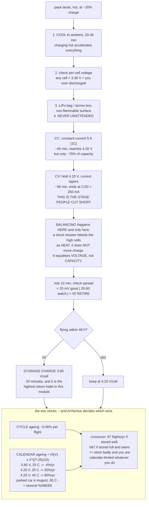

# 03.07 Charging, balancing and storage

<!-- glance:start -->
<!-- generated by tools/build.py from curriculum/syllabus.yaml — edit the syllabus, not this block -->

| | |
|---|---|
| **Track** | Main path |
| **Difficulty** | Intermediate |
| **Time** | 45 min |
| **Hardware** | First flight (Hermon core) (stage 1) |
| **Software** | python |
| **Prerequisites** | [03.02 Pack configuration: 4S vs 6S, cells, wiring](03.02-pack-configuration.md) |
| **Optional prerequisites** | [FEL.03 Lithium-polymer packs from zero](../optional-foundations/drone-electronics-power/FEL.03-lipo-deep-dive.md) |
| **Skip if** | You can run a full charge–balance–store cycle on a 6S pack and explain each stage's risk. |

<!-- glance:end -->

## What you will learn

- The **CC/CV charge profile** — what each of the two stages is doing chemically, why the second
  one takes as long as the first, and what happens if you skip it
- What **balancing** actually is (it is not what most people think), why it only works at the top
  of the charge, and what it cannot fix
- Charge rate: why 1C is the standard, what 2C costs you, and the one rule that has no exceptions
- **Storage charge** at 3.80 V per cell, and the arithmetic that shows why it is not optional
- How ageing splits into **cycle** ageing and **calendar** ageing, and the Arrhenius rule that
  makes the second one dominate in a hot climate
- The charging routine, start to finish, including the two things that must never happen

## Why it matters

A LiPo pack is the most expensive consumable on Hermon and the only component whose lifetime is
almost entirely decided by how you treat it between flights. Two identical packs, flown
identically, can differ by **a factor of four in service life** based purely on charging and
storage discipline. That is not a small effect at the edges — it is the difference between
replacing packs once a year and replacing them every quarter.

It also matters because this is the process during which packs catch fire. Not in flight, not on
the bench — **charging and storage** is when almost every LiPo incident happens, because it is
when the pack is unattended and receiving energy. [03.08](03.08-battery-safety.md) covers the
fire; this lesson covers not having one.

And there is a specifically Israeli dimension. The Arrhenius rule at the end of this lesson says
storage ageing doubles for every 10 °C, and a parked car in Tel Aviv in August reaches 65 °C.
[03.10](03.10-lipo-in-israel.md) turns that into a set of local rules; this lesson gives you the
physics that makes them non-negotiable.

## Prerequisites

<!-- prereqs:start -->
## Prerequisites

You need these first:

- [03.02 Pack configuration: 4S vs 6S, cells, wiring](03.02-pack-configuration.md)

### Optional prerequisite links

New to any of these? Take the foundation lesson first; skip it if you already know it.

- [FEL.03 Lithium-polymer packs from zero](../optional-foundations/drone-electronics-power/FEL.03-lipo-deep-dive.md)

Check your readiness: `python course.py why 03.07`
<!-- prereqs:end -->

## Concept

### The CC/CV charge profile

A lithium cell is charged in two stages, and they look nothing like each other.

```text
  current                                        voltage
  5 A |-----------------+                 4.20 V |        +--------------
      |   CONSTANT      |                        |       /
      |   CURRENT       |  CONSTANT              |      /  CC
      |   (~75% of      |  VOLTAGE               |     /
      |    capacity)    |   (~25%)               |    /
      |                 |\                3.70 V |---+       CV
      |                 | \___                   |
    0 +-----------------+-----\____              +------------------------
      0               45 min        80 min       0               80 min
```

| Stage | What the charger does | What the cell does | Duration |
|---|---|---|---|
| **CC — constant current** | Holds current at the set rate; voltage rises | Lithium intercalates into the graphite steadily | ~45 min at 1C, reaching ~4.20 V and ~75 % of capacity |
| **CV — constant voltage** | Holds 4.20 V/cell; current tapers | The last lithium diffuses into the electrode's interior | ~35 min more, ending when current falls below C/20 |

**The CV stage is the one people cut short, and it is the one that matters for balance.** At the
moment the cell first reaches 4.20 V it is only about three quarters full; the remaining quarter
arrives slowly, because lithium has to diffuse into places the fast part of the charge could not
reach. Terminating at the end of CC gives you a pack that reads 4.20 V and holds 75 % of its
capacity — a "full" pack that is nothing of the sort, and which will empty 25 % early.

The termination condition is a **current** threshold, not a time: stop when the taper current
falls to about C/20 (250 mA for a 5,000 mAh pack). Any charger worth using does this
automatically and shows you the taper.

### What balancing actually is

Here is the thing most people have wrong. **A balance charger does not move charge between
cells.** It does something much cruder:

> During the CV stage, any cell that reaches 4.20 V before the others has a small resistor
> switched across it, bleeding a few tens of milliamps as heat, so that cell charges more slowly
> while the others catch up.

That is all. It is a **shunt-bleed balancer**, it dissipates the excess rather than redistributing
it, and it works at a rate of perhaps 50–200 mA — which is why balancing a badly out-of-balance
pack can add half an hour to a charge.

Three consequences follow, and all three are practical:

1. **Balancing only works at the top of the charge**, during CV, because that is the only time
   cells diverge enough to detect and there is time to bleed. A pack in the middle of its
   discharge cannot be balanced.
2. **Balancing equalises voltage, not capacity.** Six cells brought to exactly 4.20 V may still
   hold 4,900, 5,000 and 4,600 mAh. On the way down they will diverge again, and the smallest one
   will hit the floor first. **A balancer masks a cell mismatch at the top and cannot fix it.**
3. **Persistent imbalance is a diagnosis, not a nuisance.** If a cell needs bleeding on every
   charge, that cell has a different capacity or resistance from its neighbours, it defines the
   pack's usable energy, and the pack is on its way out
   ([03.03](03.03-c-rating-voltage-sag.md)).

**Hermon's acceptance:** after a full balance charge and a ten-minute rest, cell-to-cell spread
**under 20 mV**. Between 20 and 50 mV, watch it. Over 50 mV, retire the pack.

### Charge rate

The convention is **1C** — 5 A for a 5,000 mAh pack — and it is a convention rather than a limit.
Most modern packs accept 2C. Here is the trade:

| Rate | Time (CC + CV) | Effect on cycle life | When |
|---|---|---|---|
| 0.5C (2.5 A) | ~2 h | Best | Overnight, or a pack you care about |
| **1C (5 A)** | **~80 min** | **The reference** | **Default** |
| 2C (10 A) | ~67 min | ~20–30 % fewer cycles | When you are at the field and need it |
| 3C+ | ~64 min | Significant; heating becomes real | Don't |

Note how little time you buy. Going from 1C to 2C halves only the *CC* stage — the CV taper is
set by diffusion inside the electrode and does not care how impatient you are, so it gets
*longer*. **Doubling the charge rate saves fourteen minutes and costs a quarter of the pack's
life.** Tripling it saves another two minutes.

> [!WARNING]
> **The one charging rule with no exceptions: never charge a lithium cell below 0 °C.** Below
> freezing, lithium ions cannot intercalate into the graphite fast enough and instead **plate as
> metallic lithium** on the anode surface. That plating is permanent, it is not recoverable by any
> subsequent cycle, and it grows dendrites that eventually pierce the separator and short the cell
> internally. A cell charged cold may work fine for weeks and then fail without warning. Warm the
> pack to at least 5 °C before charging. In Israel this is rarely the binding constraint; in a
> Golan winter it is.

### Storage charge, and why it is not optional

A lithium cell degrades faster the fuller it is, because a high state of charge means a highly
oxidising cathode that slowly attacks the electrolyte, thickening the passivation layer on the
electrodes and consuming lithium permanently.

| Storage state | Cell voltage | Capacity lost per year at 25 °C |
|---|---|---|
| Full | 4.20 V | **~20 %** |
| 80 % | 3.97 V | ~10 % |
| **Storage** | **3.80 V** | **~4 %** |
| Near-empty | 3.50 V | ~3 %, but risks over-discharge from self-discharge |

**Storage charge is 3.80–3.85 V per cell, which is 22.8–23.1 V on a 6S pack**, and it is a
setting on every balance charger — usually labelled "Storage" or "STO".

The rule in practice: **if the pack will not fly within 48 hours, put it at storage charge.** It
takes twenty minutes and it is the single highest-return habit in this module.

The reason 3.80 V rather than 3.50 V, which ages even more slowly: self-discharge. A healthy pack
loses 1–3 % of charge per month, and a damaged one considerably more. Starting from 3.80 V gives
you months of margin before any cell approaches the 3.00 V floor; starting from 3.50 V does not.

### The Arrhenius rule, and why it matters here more than elsewhere

Calendar ageing is a chemical reaction rate, and chemical reaction rates follow Arrhenius:

$$\text{rate}(T) = \text{rate}(25\,^\circ\text{C}) \times 2^{(T - 25)/10}$$

**Every 10 °C doubles the rate of degradation.** Combine it with the storage-state table and the
result is stark:

| Stored at | 25 °C | 35 °C | 45 °C | 55 °C |
|---|---|---|---|---|
| **Full (4.20 V)** | 20 %/yr | 40 %/yr | **80 %/yr** | 160 %/yr |
| **Storage (3.80 V)** | **4 %/yr** | 8 %/yr | 16 %/yr | 32 %/yr |

Read the two extremes. A pack stored at storage charge in an air-conditioned room loses about
4 % a year and lasts for years. **A pack left fully charged in a hot store room at 45 °C reaches
the 80 % retirement threshold in three months.** And a pack in a parked car in an Israeli August,
where the interior reaches 60–65 °C, is destroyed in **under a month**.

This is the mechanism behind every rule in [03.10](03.10-lipo-in-israel.md), and it is why "store
it cool and half-empty" is not fussiness — between a cool room at storage charge and a warm room
at full charge it is a factor of **twenty** in pack life.

### Cycle ageing versus calendar ageing

Two clocks run at once and you should know which one is beating you.

| | **Cycle ageing** | **Calendar ageing** |
|---|---|---|
| Driven by | Charge/discharge throughput | Time, temperature, state of charge |
| Rate for Hermon | ~0.06 % of capacity per cycle | 4–80 % per year |
| Dominates when | You fly often | You fly rarely, or store badly |
| Visible as | Gradual capacity fade + resistance rise | The same, but without the flying |

**A pack flown three times a week and stored properly is cycle-limited** and will do 200–300
flights. **A pack flown twice a month and stored full in a hot cupboard is calendar-limited** and
will be finished in a year having flown 24 times.

That asymmetry is worth internalising: **the pack you use most is not the one that dies first.**

> [!TIP]
> **Ask your teacher:** "I fly twice a month and I keep my packs fully charged in a cupboard that
> reaches 35 °C in summer. Using the Arrhenius rule and a 0.06 %-per-cycle figure, work out
> whether I am cycle-limited or calendar-limited, how many flights I will get out of a pack, and
> what single change buys me the most."

### The routine

The full sequence, every time, and the two lines in bold are the ones that are not negotiable.

| Step | | |
|---|---|---|
| 1 | After landing, let the pack cool to ambient | 20–30 min. Charging a hot pack accelerates everything |
| 2 | Check per-cell voltage | Any cell below 3.30 V means you over-discharged — note it |
| 3 | **Charge on a non-flammable surface, in a LiPo bag or an ammo box** | **Never on carpet, wood, or a bench you care about** |
| 4 | **Never unattended** | **Set a timer, be in the room** |
| 5 | Balance charge at 1C, terminate at C/20 taper | ~80 min |
| 6 | Rest 10 min, check spread | < 20 mV |
| 7 | Fly within 48 h, or **return to storage charge** | 3.80 V/cell |
| 8 | Log it: date, cycle number, spread, and the charger's IR | [03.03](03.03-c-rating-voltage-sag.md)'s ageing curve |

And the two things that must never happen:

- **Never charge a swollen, punctured, dented or dropped pack.** Gas means the electrolyte has
  decomposed; there is no repair and charging it adds energy to a damaged container.
- **Never leave a pack in a car**, charged or otherwise. This is the single most common way
  people in Israel destroy packs, and occasionally cars.

## Technical explanation

### Level 1 — Intuition: filling a sponge

Charging a lithium cell is like pouring water into a sponge. At first the water goes in as fast
as you pour — that is the constant-current stage, and it fills the accessible spaces.

Then the sponge is wet on the outside and you have to wait for the water to soak inwards. Pouring
faster does not help; the limit is diffusion, not supply. That is the constant-voltage stage, and
it is why the last quarter of the charge takes nearly half the time.

Balancing is a different picture entirely. Imagine six sponges that must all end up equally wet,
but they are plumbed in series so the same water passes through all of them. You cannot move
water from one to another. All you can do is **squeeze the ones that are getting too wet** — and
that is exactly what a shunt-bleed balancer does, wasting the excess as heat.

Storage is the third picture: **a full sponge rots faster than a half-full one, and warmth makes
everything rot faster.**

### Level 2 — Practical: choosing and using a charger

What matters, in order:

| Feature | Why | Hermon's minimum |
|---|---|---|
| Cell count | Must cover 6S | 6S |
| Charge current | 1C on your biggest pack | ≥ 5 A |
| Balance capability | Per-cell taps | Yes, always |
| **Storage mode** | The highest-value button on the device | Required |
| Internal-resistance measurement | Your ageing log | Strongly preferred |
| Discharge/capacity test | Measuring real capacity | Preferred |
| Power supply | 5 A × 25.2 V = 126 W plus losses | ≥ 150 W |

**The power supply is where people get caught.** A charger rated "100 W" cannot deliver 5 A into
a 6S pack, because 5 × 25.2 = 126 W at the end of the charge. It will silently reduce current and
your 80-minute charge becomes two hours. Check the charger's *wattage*, not just its current
rating.

**Reading the charge screen** — the three numbers to look at:

| Number | Healthy | Suspicious |
|---|---|---|
| mAh returned | Within 5 % of what telemetry said you used ([03.06](03.06-battery-monitoring.md)) | More than 10 % off |
| Time in CV | 25–40 % of the total | Very long = imbalance or an aged pack |
| Final spread | < 20 mV | > 50 mV = retire |

### Level 3 — Mathematics: charge time and the two ageing clocks

**Charge time.** The CC stage delivers a fixed rate; the CV stage is an exponential taper with a
time constant set by the cell's diffusion:

$$t_{CC} \approx \frac{f_{CC} \, Q}{I_{charge}}, \qquad I_{CV}(t) = I_{charge}\, e^{-t/\tau}$$

with $f_{CC} \approx 0.75$ and $\tau \approx 12$ minutes for a healthy pouch cell. Terminating at
$I = Q/20$:

$$t_{CV} = \tau \ln\!\left(\frac{20 I_{charge}}{Q}\right)$$

For a 5,000 mAh pack at 1C: $t_{CC} = 45$ min, $t_{CV} = 12\ln(20) = 36$ min, total **81
minutes**. At 2C: $t_{CC} = 22.5$ min, $t_{CV} = 12\ln(40) = 44$ min, total **67 minutes**.

**Doubling the charge current saves 14 minutes, not 40**, because the CV stage gets *longer* —
you arrive at 4.20 V with more of the charge still to diffuse in. That single result is the
honest argument against fast charging, and it is better than "it is bad for the pack" because it
is quantitative.

**The two ageing clocks, combined.** Total capacity fade over a period:

$$\text{fade} = \underbrace{n_{cycles} \times c_{cycle}}_{\text{cycle}} + \underbrace{t_{years} \times r_{cal}(V, T)}_{\text{calendar}}$$

with $c_{cycle} \approx 0.06\ \%$ per cycle for gentle use, and

$$r_{cal}(V, T) = r_0(V) \times 2^{(T-25)/10}$$

Setting them equal gives the **crossover flight rate**: below it, calendar ageing dominates.

$$f_{crossover} = \frac{r_{cal}(V, T)}{c_{cycle}} \quad \text{flights per year}$$

At storage charge and 25 °C: $4/0.06 = 67$ flights a year — about **1.3 a week**. Fly more often
than that and you are cycle-limited; less, and the pack is dying of neglect.

At **full charge and 35 °C**: $40/0.06 = 667$ flights a year, i.e. **13 a week**. Almost nobody
flies that much, so **storing full in a warm place makes essentially every user
calendar-limited** — which is to say, the pack is being destroyed by sitting still.

### Level 4 — Implementation: Hermon's pack routine

| When | Do |
|---|---|
| **Pack arrives** | Check voltage (should be ~3.85 V/cell). Measure IR. Number it. Start its log |
| **Night before flying** | Balance charge at 1C to 4.20 V/cell, C/20 taper |
| **At the field** | Check spread before each flight. Refuse any pack over 50 mV |
| **After each flight** | Cool 20 min. Record mAh from telemetry and mAh returned by the charger |
| **Same evening** | Storage charge if not flying within 48 h |
| **Every 10 flights** | Full IR measurement, charger cross-check, log row |
| **Every 25 flights** | Capacity test: full discharge at 1C, record mAh |
| **Retire when** | IR ≥ 2× as-new, **or** capacity ≤ 80 %, **or** spread > 50 mV, **or** any swelling |

That log is not bureaucracy. A pack's history is the only way to distinguish "this pack is tired"
from "this flight was unusual", and it is the input to
[03.03](03.03-c-rating-voltage-sag.md)'s ageing curve and to
[18.06](../18-civil-ops/18.06-maintenance-and-qualification.md)'s maintenance record, which a
commercial operation is required to keep.

## Diagram



## Code

Save as `charging.py` and run `python charging.py`. Standard library only.

```python
"""03.07 - charge time, balancing, and the two ageing clocks.

Shows why fast charging buys less than you think, and why storage state and
temperature matter more than how much you fly.
"""
import math

CAP_AH = 5.0
CELLS = 6
F_CC = 0.75          # fraction of capacity delivered during constant current
TAU_MIN = 12.0       # CV taper time constant, minutes
CYCLE_FADE = 0.06    # % of capacity lost per cycle, gentle use

# storage voltage per cell -> % capacity lost per year at 25 C
CAL_RATE = {4.20: 20.0, 4.10: 14.0, 3.97: 10.0, 3.90: 6.0, 3.80: 4.0, 3.50: 3.0}


def charge_time(c_rate, cap_ah=CAP_AH, f_cc=F_CC, tau=TAU_MIN):
    i = c_rate * cap_ah
    t_cc = f_cc * cap_ah / i * 60
    t_cv = tau * math.log(20 * i / cap_ah)
    return t_cc, t_cv, t_cc + t_cv


def calendar_rate(v_cell, temp_c):
    """%/year capacity fade, Arrhenius: doubles per 10 C."""
    base = CAL_RATE[min(CAL_RATE, key=lambda k: abs(k - v_cell))]
    return base * 2 ** ((temp_c - 25) / 10)


if __name__ == "__main__":
    print("Charge time: why fast charging buys less than you expect")
    print(f"  {'rate':>6s} {'amps':>6s} {'CC min':>7s} {'CV min':>7s} "
          f"{'total':>7s} {'saved':>7s}")
    base = charge_time(1.0)[2]
    for c in (0.5, 1.0, 1.5, 2.0, 3.0):
        cc, cv, tot = charge_time(c)
        print(f"  {c:5.1f}C {c * CAP_AH:5.1f}A {cc:6.1f} {cv:6.1f} {tot:6.1f} "
              f"{base - tot:+6.1f}")
    print("  the CV stage gets LONGER as you charge faster: you arrive at 4.20 V")
    print("  with more charge still to diffuse in. Diffusion does not negotiate.")

    print("\nWhat you are actually charging into (CC ends at ~75 % full):")
    for c in (1.0, 2.0):
        cc, cv, tot = charge_time(c)
        print(f"  at {c:.0f}C: stop at the end of CC ({cc:.0f} min) and you have "
              f"{F_CC:.0%} of the pack = {F_CC * CAP_AH * 1000:.0f} mAh")
        print(f"          it reads 4.20 V/cell and will empty "
              f"{(1 - F_CC) * 100:.0f} % early")

    print("\nBalancing: a shunt bleeds the high cells as heat")
    cells = [4.20, 4.20, 4.20, 4.13, 4.20, 4.18]
    bleed_ma = 120.0
    print(f"  cells at the start of CV: {' '.join(f'{v:.2f}' for v in cells)}")
    print(f"  spread {max(cells) - min(cells):.3f} V")
    # roughly: mAh that must be bled out of each high cell to let the low one catch up
    print(f"  {'cell':>5s} {'V':>6s} {'must bleed':>11s} {'at 120 mA':>10s}")
    for i, v in enumerate(cells, 1):
        # 40 mV near the top of the curve is roughly 1.5 % of capacity
        mah = (v - min(cells)) / 0.040 * 0.015 * CAP_AH * 1000
        print(f"  {i:5d} {v:6.2f} {mah:10.0f}mAh {mah / bleed_ma * 60:9.0f}min")
    print("  this is why a badly imbalanced pack adds half an hour to a charge,")
    print("  and why the balancer gets warm doing it")

    print("\nStorage state and temperature -- calendar ageing, %/year:")
    print(f"  {'V/cell':>7s} " + " ".join(f"{t:5d}C" for t in (15, 25, 35, 45, 55, 65)))
    for v in (4.20, 3.97, 3.80):
        row = f"  {v:6.2f}V "
        for t in (15, 25, 35, 45, 55, 65):
            row += f"{calendar_rate(v, t):5.0f} "
        print(row)
    print("  (Arrhenius: the rate doubles for every 10 C)")

    print("\nTime to the 80 % retirement threshold from calendar ageing alone:")
    print(f"  {'stored as':32s} {'%/yr':>6s} {'months':>8s}")
    for label, v, t in (("storage charge, air conditioned", 3.80, 22),
                        ("storage charge, Israeli room",    3.80, 30),
                        ("full, air conditioned",           4.20, 22),
                        ("full, Israeli room in summer",    4.20, 35),
                        ("full, unventilated store room",   4.20, 45),
                        ("full, parked car in August",      4.20, 65)):
        r = calendar_rate(v, t)
        print(f"  {label:32s} {r:6.0f} {20.0 / r * 12:7.1f}")

    print("\nWhich clock is beating you? (cycle fade 0.06 %/flight)")
    print(f"  {'stored as':30s} {'cal %/yr':>9s} {'crossover':>11s} "
          f"{'if you fly 2x/week':>19s}")
    for label, v, t in (("3.80 V, 25 C", 3.80, 25), ("3.80 V, 35 C", 3.80, 35),
                        ("4.20 V, 25 C", 4.20, 25), ("4.20 V, 35 C", 4.20, 35),
                        ("4.20 V, 45 C", 4.20, 45)):
        r = calendar_rate(v, t)
        cross = r / CYCLE_FADE
        verdict = "cycle-limited" if 104 > cross else "CALENDAR-LIMITED"
        print(f"  {label:30s} {r:9.0f} {cross:8.0f}/yr {verdict:>19s}")
    print("  2 flights a week = 104 a year. Above the crossover you are")
    print("  cycle-limited; below it the pack is dying of neglect.")

    print("\nA pack's life, two owners, same pack, same flying (2 flights/week):")
    for label, v, t in (("stored at 3.80 V, 22 C", 3.80, 22),
                        ("stored full, 35 C",      4.20, 35)):
        r = calendar_rate(v, t)
        years = 0.0
        flights = 0
        fade = 0.0
        while fade < 20.0 and years < 10:
            years += 1 / 12
            flights += 104 / 12
            fade += r / 12 + (104 / 12) * CYCLE_FADE
        print(f"  {label:26s} retires after {years * 12:4.0f} months "
              f"and {flights:4.0f} flights")
```

Output:

```text
Charge time: why fast charging buys less than you expect
    rate   amps  CC min  CV min   total   saved
    0.5C   2.5A   90.0   27.6  117.6  -36.7
    1.0C   5.0A   45.0   35.9   80.9   +0.0
    1.5C   7.5A   30.0   40.8   70.8  +10.1
    2.0C  10.0A   22.5   44.3   66.8  +14.2
    3.0C  15.0A   15.0   49.1   64.1  +16.8
  the CV stage gets LONGER as you charge faster: you arrive at 4.20 V
  with more charge still to diffuse in. Diffusion does not negotiate.

What you are actually charging into (CC ends at ~75 % full):
  at 1C: stop at the end of CC (45 min) and you have 75% of the pack = 3750 mAh
          it reads 4.20 V/cell and will empty 25 % early
  at 2C: stop at the end of CC (22 min) and you have 75% of the pack = 3750 mAh
          it reads 4.20 V/cell and will empty 25 % early

Balancing: a shunt bleeds the high cells as heat
  cells at the start of CV: 4.20 4.20 4.20 4.13 4.20 4.18
  spread 0.070 V
   cell      V  must bleed  at 120 mA
      1   4.20        131mAh        66min
      2   4.20        131mAh        66min
      3   4.20        131mAh        66min
      4   4.13          0mAh         0min
      5   4.20        131mAh        66min
      6   4.18         94mAh        47min
  this is why a badly imbalanced pack adds half an hour to a charge,
  and why the balancer gets warm doing it

Storage state and temperature -- calendar ageing, %/year:
   V/cell    15C    25C    35C    45C    55C    65C
    4.20V    10    20    40    80   160   320 
    3.97V     5    10    20    40    80   160 
    3.80V     2     4     8    16    32    64 
  (Arrhenius: the rate doubles for every 10 C)

Time to the 80 % retirement threshold from calendar ageing alone:
  stored as                          %/yr   months
  storage charge, air conditioned       3    73.9
  storage charge, Israeli room          6    42.4
  full, air conditioned                16    14.8
  full, Israeli room in summer         40     6.0
  full, unventilated store room        80     3.0
  full, parked car in August          320     0.8

Which clock is beating you? (cycle fade 0.06 %/flight)
  stored as                       cal %/yr   crossover  if you fly 2x/week
  3.80 V, 25 C                           4       67/yr       cycle-limited
  3.80 V, 35 C                           8      133/yr    CALENDAR-LIMITED
  4.20 V, 25 C                          20      333/yr    CALENDAR-LIMITED
  4.20 V, 35 C                          40      667/yr    CALENDAR-LIMITED
  4.20 V, 45 C                          80     1333/yr    CALENDAR-LIMITED
  2 flights a week = 104 a year. Above the crossover you are
  cycle-limited; below it the pack is dying of neglect.

A pack's life, two owners, same pack, same flying (2 flights/week):
  stored at 3.80 V, 22 C     retires after   26 months and  225 flights
  stored full, 35 C          retires after    6 months and   52 flights
```

How to read it:

- **The charge-time table is the honest argument against fast charging.** Going from 1C to 2C
  saves about a quarter of an hour, because the CV stage *lengthens* as the CC stage shortens.
  You pay 20–30 % of the pack's cycle life for that quarter hour.
- **The 75 % line is the one that surprises people.** Stopping at the end of constant current
  gives you a pack reading a confident 4.20 V per cell and holding three quarters of its energy.
  **Every minute of the taper is real capacity.**
- **The balancing table shows why a balancer is slow.** Bleeding 130 mAh out of a cell at 120 mA
  takes over an hour, and that is for a 70 mV imbalance. This is also why the balancer gets warm:
  the energy is not redistributed, it is burnt.
- **The Arrhenius table is the centre of the lesson.** Read across any row and the number doubles
  every 10 °C; read down any column and storage charge is five times better than full. Between a
  cool room at 3.80 V and a hot store room at 4.20 V the ratio is **twenty to one**; corner to
  corner it is **a hundred and sixty**.
- **The retirement table turns that into months.** A pack at storage charge in an air-conditioned
  room lasts six years. **A pack left full in an Israeli summer room is finished in six months,
  and one left in a parked car in under a month.**
- **The last block is the whole lesson as a single comparison.** The same pack, the same flying,
  two owners: **26 months and 225 flights** against **6 months and 52 flights.** The difference
  is twenty minutes of storage charging and a cooler cupboard.
- **The crossover row is the one to act on.** If you store at 3.80 V and 25 °C, flying twice a
  week makes you cycle-limited and the pack gives you its full service life. Store it full and
  warm and you are calendar-limited no matter how much you fly — **the pack dies of sitting
  still, and nothing you do in the air changes that.**

## Exercise

E1 and E2 are Python. E3 and E4 need a charger and a pack.

> [!CAUTION]
> Every exercise that charges a pack: **on a non-flammable surface, in a LiPo bag or a metal box,
> never unattended, never a swollen or damaged pack, never below 0 °C.** These are not
> suggestions and they are the conditions under which almost every LiPo fire happens.
> [03.08](03.08-battery-safety.md) and [SAFETY.md](../SAFETY.md).

### Exercise 03.07-E1 — How long, really? `[numerical]`

Using the CC/CV model: (a) how long does a 1C balance charge take on Hermon's pack from 20 %
state of charge? (b) From storage charge (50 %)? (c) If you have a 100 W power supply, what
charge current can you actually sustain at the end of the CC stage, and what does that do to (a)?
(d) You are at the field with 45 minutes before the light goes. What rate do you choose and what
does it cost?

### Exercise 03.07-E2 — Model your own pack's life `[coding]`

Extend `charging.py` with `pack_life(flights_per_week, v_store, temp_c)` returning months and
flights to the 80 % threshold. Build a table for **your** flying rate and **your** actual storage
conditions (measure the cupboard's summer temperature — do not guess). Then compute what each of
these buys you, in months: (a) storage charging instead of leaving packs full; (b) moving the
packs to an air-conditioned room; (c) flying twice as often. Rank them.

### Exercise 03.07-E3 — Run a full cycle and log it `[measurement]`

Do one complete balance charge with the charger's graph visible. Record: starting per-cell
voltages, time in CC, time in CV, mAh returned, final per-cell voltages after a ten-minute rest,
final spread, and the charger's internal-resistance reading. Then storage-charge it and record
the mAh removed. Compare your measured CC/CV split against the model's 75/25.

### Exercise 03.07-E4 — Build the pack register `[design]`

Create `projects/evidence/pack-register.md` with one section per pack you own: a number written
physically on the pack, purchase date, as-new IR and capacity, and a table with one row per ten
flights (date, cycle count, IR, spread, capacity if measured). Fill in the first row. Define your
own retirement criteria and write them at the top. This register is the deliverable a commercial
operation is required to keep — [18.06](../18-civil-ops/18.06-maintenance-and-qualification.md).

## Expected result

- **03.07-E1:** (a) From 20 %, the CC stage must deliver 55 % of capacity rather than 75 %, so
  CC ≈ 33 min plus the full CV taper of 36 min = **69 min**. (b) From 50 %: CC ≈ 15 min + 36 =
  **51 min**. (c) 100 W at 25.2 V is **4.0 A**, so the charger will taper the current at the top
  of CC and (a) stretches to about 80 min — check the *wattage*, not the amps. (d) With 45
  minutes, charge at 2C and accept roughly **67 minutes**, which still does not fit: the honest
  answer is that you fly on a 2C charge terminated early at ~90 %, you accept both the cycle-life
  cost and the shorter flight, and **you plan better next time** — a charged spare pack is
  cheaper than either.
- **03.07-E2:** For a typical user at two flights a week, the ranking is nearly always:
  (a) **storage charging is worth the most** — often doubling or tripling pack life for twenty
  minutes of effort; (b) **temperature is second** and can be comparable to (a) in an Israeli
  summer; (c) **flying more often helps least**, and in fact flying *more* consumes cycle life —
  it improves the ratio only in the sense that you get more flights out of the same calendar
  decay. The insight to state: **two of the three levers are free, and the expensive one is the
  weakest.**
- **03.07-E3:** Expect the CC stage to be 60–75 % of the total and CV 25–40 %. A new, healthy
  pack that was properly storage-charged should return **2,400–2,700 mAh** from storage to full
  (roughly half the capacity), show a final spread under 20 mV, and need almost no balancing
  time. A CV stage that is more than half the total charge is a warning: the pack is imbalanced,
  aged, or both.
- **03.07-E4:** The register's value is entirely in being started early. An as-new IR and capacity
  measurement taken on day one cannot be reconstructed later, and without it every subsequent
  measurement is uninterpretable — you will know a pack reads 9 mΩ per cell and have no idea
  whether that is a doubling or the value it shipped with.

## Troubleshooting

### Symptom: the charge takes much longer than 80 minutes

Most often the power supply. 5 A into a 6S pack needs 126 W at the end of the charge, and a
100 W supply silently reduces current. Second cause: a long CV stage because the pack is
imbalanced — watch which cell the balancer is bleeding. Third: an aged pack, whose higher
resistance makes it reach 4.20 V early and spend longer tapering.

### Symptom: one cell always finishes low, even after balancing

The balancer bled the others down to meet it, which means that cell has lower capacity — it
reached its own full state with less charge in it. Balancing equalises voltage, not capacity, and
it cannot fix this. The pack's usable energy is now set by that cell.
[03.03](03.03-c-rating-voltage-sag.md) for the retirement criteria.

### Symptom: the pack is warm during charging

At 1C a healthy pack should be barely above ambient — $I^2R = 5^2 \times 0.04 = 1$ W. Noticeably
warm means high internal resistance, a charge rate above 1C, or a hot ambient. Stop, measure the
resistance, and if it has risen substantially, retire the pack.

### Symptom: the charger reports a much lower capacity than the label

Either the label was optimistic (common on cheap packs — recalibrate `BATT_CAPACITY` in
[03.06](03.06-battery-monitoring.md) and move on) or the pack has aged. Distinguish them by the
internal resistance: a new pack with an honest-but-small capacity has normal IR, while an aged
one does not.

### Symptom: a pack has self-discharged well below storage voltage

Anything below about 3.60 V/cell after a month at storage charge means elevated self-discharge —
an internal micro-short, the beginning of the failure mode that eventually becomes thermal
runaway. Do not return it to service. Discharge fully and dispose of it
([03.08](03.08-battery-safety.md), [03.10](03.10-lipo-in-israel.md)).

### Symptom: you accidentally left a pack fully charged for two months

Measure the capacity and the resistance and record both. At 25 °C the damage is a few percent
and recoverable as a lesson; at 40 °C it is 10–15 % and the pack has lost a meaningful fraction
of its life. Storage-charge it now, and put a reminder in whatever system you actually use.

## Common mistakes

- **Terminating the charge at the end of the CC stage.** The pack reads 4.20 V and holds 75 % of
  its capacity.
- **Believing a balancer moves charge between cells.** It bleeds the high ones as heat, at
  50–200 mA, only during CV.
- **Treating a persistent imbalance as a nuisance rather than a diagnosis.** It means a capacity
  mismatch and that pack's clock is running out.
- **Fast-charging to save time.** 1C → 2C saves 14 minutes and costs 20–30 % of the cycle life.
- **Leaving packs fully charged between sessions.** Five times the calendar ageing, for nothing.
- **Ignoring temperature.** Every 10 °C doubles the rate. In Israel this is the dominant term.
- **Charging unattended, on a flammable surface, or in a car.** This is when packs burn.
- **Charging a swollen pack.** There is no repair and you are adding energy to a damaged
  container.
- **Not keeping a log.** Without an as-new baseline, no later measurement means anything.

## Knowledge check

1. What are the two stages of a lithium charge, and which one do people wrongly cut short?
   <details><summary>Answer</summary>

   **Constant current (CC)**: the charger holds the set current while the voltage rises, ending
   at 4.20 V/cell with about **75 %** of the capacity in. **Constant voltage (CV)**: the charger
   holds 4.20 V while the current tapers, ending at about C/20, and this is where the last
   quarter of the capacity diffuses into the electrode. People stop at the end of CC because the
   voltage looks right — and get a "full" pack that empties 25 % early.
   </details>

2. What does a balance charger actually do?
   <details><summary>Answer</summary>

   It **bleeds charge out of the cells that are running ahead**, through a small shunt resistor,
   as heat, at perhaps 50–200 mA, during the CV stage. It does not move charge between cells. It
   therefore equalises **voltage, not capacity**: six cells at exactly 4.20 V may still hold
   different amounts of energy, and on the way down the smallest will reach the floor first.
   </details>

3. Why does doubling the charge rate not halve the charge time?
   <details><summary>Answer</summary>

   Because only the CC stage scales with current. The CV taper is governed by lithium diffusion
   inside the electrode, with a time constant of about 12 minutes, and charging faster means you
   reach 4.20 V with *more* charge still to diffuse — so the CV stage gets **longer**. 1C is about
   81 minutes and 2C about 67: fourteen minutes saved, for 20–30 % of the pack's cycle life.
   </details>

4. What is storage charge, and what does it buy?
   <details><summary>Answer</summary>

   **3.80–3.85 V per cell** — 22.8–23.1 V on a 6S pack — set with the charger's storage mode.
   A cell stored full loses about 20 % of its capacity a year at 25 °C; at storage charge it loses
   about 4 %. **Five times the calendar life, for twenty minutes of effort.** It is 3.80 V rather
   than lower so that months of self-discharge cannot take a cell near the 3.00 V floor.
   </details>

5. State the Arrhenius rule and what it means for a pack in an Israeli summer.
   <details><summary>Answer</summary>

   Degradation rate doubles for every **10 °C**. A full pack ages at 20 %/year at 25 °C, 40 % at
   35 °C, and 80 % at 45 °C. A parked car in an Israeli August reaches 60–65 °C, where the pack
   reaches its retirement threshold in **under a month**. Combined with the storage-state effect,
   realistic best against realistic worst practice is about **twenty to one** in pack life —
   26 months and 225 flights against 6 months and 52.
   </details>

6. When is a pack cycle-limited and when is it calendar-limited?
   <details><summary>Answer</summary>

   The crossover is where calendar fade per year equals cycle fade per year. At storage charge and
   25 °C, calendar ageing is 4 %/year and cycle ageing is 0.06 % per flight, so the crossover is
   about **67 flights a year — roughly 1.3 a week.** Fly more and you are cycle-limited. Store the
   pack full in a 35 °C room and the crossover jumps to 667 flights a year, which almost nobody
   reaches: **stored badly, every user is calendar-limited, and the pack dies of sitting still.**
   </details>

## Practical challenge

Two deliverables.

**First**, `projects/evidence/pack-register.md`, as in exercise E4: numbered packs, as-new
baselines, and the first log row for each. Define and write down your retirement criteria.

**Second**, `projects/evidence/03.07-charging.md` containing:

1. Your charger and power supply, with the wattage check: can it actually deliver 1C into a 6S
   pack at the top of the charge?
2. One complete charge record — CC time, CV time, mAh returned, final spread, IR.
3. Your measured CC/CV split against the model's 75/25.
4. **Your own ageing model**: measure your storage location's summer temperature, state your
   flying rate, and compute whether you are cycle- or calendar-limited and how many months your
   packs will last.
5. The one change you will make as a result, and what it is worth in months.

## You can skip this if

You can describe both charge stages and what each is doing chemically, explain why the CV stage
lengthens when you charge faster, state what a balance charger physically does and what it cannot
fix, give the storage voltage and what it buys, apply the Arrhenius rule to a storage temperature
and get a capacity-fade rate, compute whether a given user is cycle- or calendar-limited, and
list the charging rules that have no exceptions.

## Go deeper

- [03.01](03.01-lipo-chemistry.md) (earlier): the chemistry being charged.
- [03.03](03.03-c-rating-voltage-sag.md) (earlier): the internal resistance you are trending.
- [03.06](03.06-battery-monitoring.md) (earlier): the charger cross-check that calibrates the
  aircraft.
- [03.08](03.08-battery-safety.md) (next): what happens when this goes wrong.
- [03.10](03.10-lipo-in-israel.md) (later): the Arrhenius rule applied to a specific hot country.
- [18.06](../18-civil-ops/18.06-maintenance-and-qualification.md) (later): the pack register as a
  regulatory record.
- Charging lithium-ion correctly, including the CC/CV profile:
  https://batteryuniversity.com/article/bu-409-charging-lithium-ion
- How to prolong lithium-based batteries — the storage and temperature data:
  https://batteryuniversity.com/article/bu-808-how-to-prolong-lithium-based-batteries

## Progress checkpoint

Run `python course.py complete 03.07` when the pack register exists and the first charge is
logged. Next: [03.08](03.08-battery-safety.md) — everything so far has assumed the pack behaves.
The next lesson is about the case where it does not, which is short, unambiguous, and the one
lesson in this module you should read before your first pack arrives.
