# 03.08 Battery safety (a LiPo is a fuel tank)

<!-- glance:start -->
<!-- generated by tools/build.py from curriculum/syllabus.yaml — edit the syllabus, not this block -->

| | |
|---|---|
| **Track** | Main path |
| **Difficulty** | Intermediate |
| **Time** | 45 min |
| **Hardware** | First flight (Hermon core) (stage 1) |
| **Software** | python |
| **Prerequisites** | [03.07 Charging, balancing and storage](03.07-charging-balancing-storage.md) |
| **Optional prerequisites** | [FEL.03 Lithium-polymer packs from zero](../optional-foundations/drone-electronics-power/FEL.03-lipo-deep-dive.md) |
| **Skip if** | You can state the charge/discharge/storage rules that prevent 90 percent of LiPo fires, and the rule for each failure mode. |

<!-- glance:end -->

## What you will learn

- How much energy is actually in Hermon's pack, and why the number on the label understates what
  burns by a factor of eight
- The **thermal runaway chain**: the four temperatures at which a lithium cell destroys itself,
  and what happens at each
- Why **you cannot extinguish a lithium fire** — the cathode supplies its own oxygen — and what to
  do instead
- The five ways a pack fails, which of them you can prevent and which you can only detect
- The **hydrogen fluoride** hazard, which is the part almost nobody mentions and is the part most
  likely to hurt you
- A response plan for a venting pack, a disposal procedure, and the field kit you should actually
  own

## Why it matters

Every other component on Hermon fails by stopping. The pack fails by releasing everything it has
at once, and it is the only part of the aircraft that can hurt someone who is nowhere near it.

The honest framing, and the one this course uses: **a LiPo is a fuel tank.** Nobody is casual
about a jerrycan of petrol in a workshop; a 6S 5000 mAh pack releases about as much energy as a
100 ml shot of petrol, releases it faster, supplies its own oxidiser, and comes with no pressure
relief and no fuse. Treating it with the same respect you would give the jerrycan is
neither excessive nor optional.

This lesson is deliberately short and deliberately unambiguous. **Read it before your first pack
arrives**, not before your first flight.

## Prerequisites

<!-- prereqs:start -->
## Prerequisites

You need these first:

- [03.07 Charging, balancing and storage](03.07-charging-balancing-storage.md)

### Optional prerequisite links

New to any of these? Take the foundation lesson first; skip it if you already know it.

- [FEL.03 Lithium-polymer packs from zero](../optional-foundations/drone-electronics-power/FEL.03-lipo-deep-dive.md)

Check your readiness: `python course.py why 03.08`
<!-- prereqs:end -->

## Concept

### How much energy is in there

Hermon's pack: **111 Wh = 400 kJ** of stored electrical energy.

That alone would boil 1.2 litres of water from room temperature. But the electrical energy is not
what burns. When a cell goes into runaway, three things release energy and only the first is on
the label:

| Source | Energy in Hermon's pack |
|---|---|
| Stored electrical charge | 400 kJ |
| **Combustion of the organic carbonate electrolyte** | ~2,700 kJ |
| Separator, binder, plastics | ~200 kJ |
| **Total** | **~3.3 MJ ≈ 917 Wh** |

**About eight times the rated capacity**, and the electrolyte — not the charge — is most of it.
Which is why a "discharged" pack still burns enthusiastically, and why "I flew it flat, it's
safe" is wrong.

For scale: 3.3 MJ is roughly the chemical energy in **100 ml of petrol**, released over a few
minutes, in a foil bag, on whatever surface you left it on.

### The thermal runaway chain

A lithium cell does not simply catch fire. It walks through a sequence of exothermic reactions,
each of which heats the cell into the next one. The temperatures are well established and they
are the same for every cell of this chemistry:

| Temperature | What happens | Reversible? |
|---|---|---|
| **60 °C** | Accelerated ageing. No damage yet, but the clock speeds up sharply ([03.07](03.07-charging-balancing-storage.md)) | Yes |
| **80–90 °C** | The **SEI layer** — the passivation film on the anode — begins to decompose. Exothermic. The cell is now heating itself | Marginally |
| **110–130 °C** | The **polyethylene separator melts and shrinks**, letting the electrodes touch. An internal short begins, dumping the stored charge as heat | **No** |
| **150–180 °C** | The **cathode decomposes and releases oxygen** | **No** |
| **> 180 °C** | **Self-sustaining runaway.** The cell now has fuel, oxidiser and heat, all internal. Peak temperatures reach **600–1,000 °C** | **No** |

> [!CAUTION]
> **Past about 130 °C there is no intervention that stops it.** The separator has failed, the
> internal short is established, and the cell will complete its runaway regardless of what you
> do. Everything you can usefully do happens **before** that point, or consists of protecting
> everything nearby afterwards. This is why the rules in this lesson are about prevention and
> containment, and why none of them are about firefighting.

**The fourth row is the one that makes lithium fires different from every other fire you have
met.** Normal fire suppression works by removing oxygen. A cell past 150 °C is *generating*
oxygen from its own cathode. Smothering it — a blanket, a CO₂ extinguisher, sand poured on top —
knocks down the visible flame and does nothing to the reaction underneath, which then re-ignites.

### So what do you actually do?

**You do not extinguish a lithium fire. You cool it, and you contain it.**

| Agent | Works? | Why |
|---|---|---|
| **Water, in volume** | **Yes, as a coolant** | It is the best heat sink available. It does not "put out" the cell; it cools neighbouring cells below the runaway threshold. Lithium-ion is not lithium-metal: water is safe and recommended |
| Sand, a bucket of | Partly | Contains and smothers the visible fire; does not stop runaway |
| CO₂ extinguisher | Briefly | Knocks down the flame; the cell re-ignites |
| Dry powder (ABC) | Briefly | Same |
| Class D (metal fires) | **No** | For lithium *metal*, not lithium-ion. Wrong agent |
| **Distance and time** | **Always** | The single most effective response |

**The practical answer for a workshop:** move it outdoors if you can do so safely in the first few
seconds, put it on concrete or in a steel container, and then keep people away and let it finish.
A 5,000 mAh 6S pack burns out in **two to five minutes**. If you cannot move it, soak the area
around it with water to protect what is nearby, and leave.

Absorbing 3.3 MJ with water — heating from 20 °C and vaporising it — takes about **1.3 kg**, and
since most of what you pour never reaches the reaction, plan on **10–20 litres**. **A bucket, not
an extinguisher.**

### The hazard nobody mentions: hydrogen fluoride

The electrolyte salt in a lithium cell is lithium hexafluorophosphate, LiPF₆. When it meets
moisture — in the air, in the fire, in your lungs — it produces **hydrogen fluoride**.

| | |
|---|---|
| What it is | A corrosive, highly toxic gas; in water, hydrofluoric acid |
| Produced | 20–200 mg per watt-hour of cell in runaway |
| **Hermon's pack would produce** | **2–22 g of HF** |
| Immediately dangerous at | ~30 ppm |
| What it does | Severe damage to the respiratory tract; it penetrates tissue and binds calcium |

**This, not the flame, is the most likely thing to injure you.** The fire is visible, hot and
obviously dangerous, so people back away from it. The smoke looks like smoke.

The rules that follow are short:

- **Never breathe the smoke from a lithium fire.** Not even a little, not even to check.
- **Ventilate and leave.** Open the door, get out, do not come back until the air has cleared.
- **If a pack vents indoors, treat it as a room you must leave**, not a mess you must clean.
- **After it is over**, ventilate thoroughly before returning, and wear gloves handling residue.

### The five ways a pack fails

| Failure | Cause | Can you prevent it? |
|---|---|---|
| **Overcharge** | Charging past 4.25 V/cell — a faulty charger, a wrong cell count, a bad balance lead | **Yes.** Correct charger settings, balance charging, and never unattended |
| **Over-discharge** | Below ~2.5 V/cell: copper from the anode current collector dissolves and re-plates as internal shorts on the next charge | **Yes.** Failsafes ([03.06](03.06-battery-monitoring.md)), and never recharge a pack that went below 3.0 V/cell |
| **Physical damage** | Puncture, crush, a hard crash, a dropped pack | **Mostly.** Handle carefully, inspect after every crash, retire anything dented |
| **External short** | A balance plug touching a frame, a dropped tool, a chafed wire | **Yes.** Insulate, strain-relieve, never leave a pack connected |
| **Internal defect** | A manufacturing contaminant, a dendrite grown over time | **No — only detect it.** Rising resistance, self-discharge, swelling |

**Four of the five are entirely preventable by procedure.** That is the encouraging part. The
fifth is why the procedures around storage and containment exist anyway.

**The external short is worth a number.** Hermon's pack at 0.04 Ω, shorted through a screwdriver:

$$I = \frac{22.2}{0.045} \approx 490\ \text{A}, \qquad P_{inside\ the\ pack} = I^2 R = 9.6\ \text{kW}$$

At 720 J/K of thermal mass, that is **13.5 °C per second**. From room temperature the pack reaches
SEI decomposition in about **five seconds** and separator melt in about **eight.** There is no
version of this where you notice, react and disconnect in time. This is why the balance plug gets
taped and the pack never sits connected on a bench.

### The rules

Nine rules. They are not ranked because they are all mandatory.

| | |
|---|---|
| 1 | **Charge in a LiPo bag, an ammo box, or a ceramic/steel container**, on a non-flammable surface |
| 2 | **Never charge unattended.** Be in the room, set a timer |
| 3 | **Never charge a swollen, dented, punctured or crashed pack.** There is no repair |
| 4 | **Never charge below 0 °C or above 45 °C** |
| 5 | **Never leave a pack in a car.** An Israeli car in August reaches 60–65 °C |
| 6 | **Never leave a pack connected to the aircraft** when you are not flying |
| 7 | **Store at 3.80 V/cell, cool, in a fire-resistant container**, away from anything flammable |
| 8 | **Inspect after every flight and every crash.** Swelling, dents, heat, smell |
| 9 | **Never breathe the smoke** |

> [!TIP]
> **Ask your teacher:** "My pack was in a crash. It looks fine, it reads 3.85 V per cell, and the
> aircraft is otherwise repairable. Walk me through exactly what inspection and observation period
> would let me put that pack back in service — and then tell me honestly whether you would."

### The crash rule

This is the one that costs money and the one people argue with. **A pack that has been in a crash
is suspect even if it looks perfect**, because internal damage does not have to be visible.

The procedure:

1. **Disconnect immediately.** Do not "check whether it still works".
2. **Inspect**: any dent, crease, puncture, corner damage, or swelling → retire it now.
3. **Isolate and observe for 30 minutes** in a fire-safe place, outdoors if possible. Most
   runaway from crash damage begins within this window.
4. **Measure per-cell voltage.** Any cell below 3.0 V, or a spread over 50 mV that was not there
   before → retire.
5. **Observe for 24 hours** and re-measure. **Any self-discharge beyond 10 mV is a retirement
   criterion** — it means an internal short.
6. If it passes all of that, it may return to service **on probation**: watched charges,
   per-cell checks every flight, and retired at the first anomaly.

A pack costs ₪450. Your workshop does not.

### Disposal

A LiPo at end of life still holds energy and still burns.

1. **Discharge it fully.** Use the charger's discharge function down to 3.0 V/cell, then a
   resistive load (a 12 V car bulb across the main leads works) until it reads near zero.
2. **Do not use the salt-water bath method.** It is widely repeated, it corrodes the pack into a
   state where the terminals are unreadable, it produces chlorine at the anode, and it does not
   reliably discharge the cells. Use a resistor.
3. **Tape the terminals.**
4. **Take it to a battery recycling point** — supermarkets, electronics retailers and municipal
   collection points in Israel all accept them. [03.10](03.10-lipo-in-israel.md) has the specific
   options.
5. **Never in household waste.** A pack in a refuse truck is a compactor away from runaway.

## Technical explanation

### Level 1 — Intuition: a fuel tank with no cap

Imagine a sealed can of petrol that also contains its own supply of oxygen, so it can burn with
the lid on. That is a lithium cell. Everything about how you handle it follows from those two
facts: **it has a lot of fuel, and you cannot starve it of air.**

The second intuition is about speed. A petrol fire starts when something ignites it; a lithium
fire starts when the cell gets hot enough to ignite *itself*, and then heats itself further. Once
that loop closes, the outcome is fixed. **All of your influence is on the near side of about
130 °C.**

The third is about the smoke, and it is the one to actually remember. The flame is honest — it
looks dangerous and people keep away from it. The smoke looks like ordinary smoke and contains
hydrogen fluoride. **Do not stand in it to take a photograph.**

### Level 2 — Practical: the field and workshop kit

| Item | Why | Cost |
|---|---|---|
| **LiPo charging bag or ammo box** | Contains sparks and slows a spread; does **not** stop full runaway | ₪40–150 |
| **Steel or ceramic container with a lid** | The better option. A paint tin, a cheap stock pot, a metal toolbox | ₪50 |
| **A bucket, filled** | 10 L of water, already full, within reach of the charging area | ₪20 |
| **Sand or vermiculite, 5 kg** | For containment and for the field where water is not available | ₪30 |
| **Heat-resistant gloves** | To move a venting pack in the first seconds — **only if it is safe** | ₪50 |
| **A cell checker** | The cheapest diagnostic you can own | ₪30 |
| **An IR thermometer** | Check pack temperature after flights and during charging | ₪60 |
| **A place to put a burning pack** | Concrete, gravel, bare earth — identified **before** you need it | free |

The last row is the most valuable and the most neglected. **Decide, now, where a burning pack
goes.** In a flat with a balcony, that is the balcony. In a house, the driveway. At the flying
field, a bare patch away from dry grass. Knowing the answer in advance is the difference between
a damaged pack and a damaged room.

### Level 3 — Mathematics: the runaway energy budget and the short-circuit clock

**The energy budget.** A cell's total releasable energy:

$$E_{total} = \underbrace{E_{electrical}}_{V Q} + \underbrace{m_{electrolyte} \, \Delta H_c}_{\text{combustion}} + E_{polymers}$$

For Hermon's 720 g pack, with electrolyte at ~15 % of cell mass and
$\Delta H_c \approx 25$ MJ/kg for organic carbonates:

$$E_{total} = 0.40 + 0.108 \times 25 + 0.2 \approx 3.3\ \text{MJ}$$

**The ratio of total to rated is about 8:1, and it barely falls as the pack discharges** —
because the electrolyte does not care about state of charge. A pack flown to 20 % still carries
2.98 MJ, which is 90 % of a full one. That is the quantitative version of "a flat pack is not a safe pack".

**The water requirement.** Water absorbs $c_p \Delta T + L_v = 4.18 \times 80 + 2257 = 2{,}591$
kJ/kg between 20 °C and vapour:

$$m_{water} = \frac{3.3 \times 10^6}{2.59 \times 10^6} = 1.3\ \text{kg}$$

— if every gram of it reached the reaction. It will not, so the practical figure is ten to twenty
times that. **10–20 litres. A bucket, not an extinguisher.**

**The short-circuit clock.** With the pack shorted through a resistance $R_{ext}$:

$$I = \frac{V_{pack}}{R_{pack} + R_{ext}}, \qquad \frac{dT}{dt} = \frac{I^2 R_{pack}}{C_{thermal}}$$

and the time to reach a threshold temperature, ignoring cooling (which is negligible at these
rates):

$$t = \frac{C_{thermal}\,(T_{target} - T_0)}{I^2 R_{pack}}$$

For a screwdriver across the terminals ($R_{ext} \approx 5$ mΩ) starting at 25 °C: **five seconds
to SEI decomposition, eight to separator melt.** For a thin wire or a partial short at 50 A, it
is minutes — which is more dangerous in one specific way, because it is slow enough that you may
notice it, decide to investigate, and be holding the pack when it vents.

**And the charging case.** An overcharge at 1C past the cutoff adds energy at 126 W into 720 J/K:
**10 °C per minute**, reaching 90 °C in about six minutes. That is the window a supervised charge
gives you, and it is why "never unattended" is a rule and not a preference.

### Level 4 — Implementation: what this means for Hermon's operation

| Where | Rule | Enforced by |
|---|---|---|
| Design | 80 % depth of discharge, never below 3.30 V/cell | [03.06](03.06-battery-monitoring.md)'s failsafes |
| Design | `BATT_ARM_VOLT` refuses to arm on a partly-used pack | Parameter |
| Build | Balance plug insulated, strain-relieved, never loose | [03.04](03.04-power-distribution.md) |
| Build | Anti-spark connector; pack never left connected | [03.04](03.04-power-distribution.md) |
| Pre-flight | Cell check and visual inspection before every flight | [04.06](../04-frame-and-assembly/04.06-preflight-and-airworthiness.md) |
| Post-flight | Cool, inspect, check temperature | This lesson |
| Post-crash | Disconnect, inspect, isolate 30 min, observe 24 h | The crash rule above |
| Charging | Bag/box, attended, 1C, correct cell count | [03.07](03.07-charging-balancing-storage.md) |
| Storage | 3.80 V/cell, cool, contained, never in a vehicle | [03.07](03.07-charging-balancing-storage.md), [03.10](03.10-lipo-in-israel.md) |
| Field | Fire plan agreed before the first pack is connected | [16.05](../16-testing-analysis/16.05-field-protocols-and-the-safety-case.md) |

That last row belongs in the mission brief, not in someone's head: **before any flight session,
the crew knows where a burning pack goes, who moves it, and who calls emergency services.** It
takes thirty seconds to agree and it is the difference between a plan and a panic.

## Diagram

```mermaid
flowchart TB
  NORM["normal operation<br/>up to 45 C"] --> W60["60 C<br/>accelerated AGEING only<br/>REVERSIBLE"]
  W60 --> W90["80-90 C<br/>SEI layer decomposes<br/>EXOTHERMIC: the cell now heats ITSELF"]
  W90 --> W130["110-130 C<br/>SEPARATOR MELTS<br/>internal short begins<br/>=== POINT OF NO RETURN ==="]
  W130 --> W180["150-180 C<br/>CATHODE RELEASES OXYGEN<br/>the cell no longer needs air"]
  W180 --> RUN["> 180 C SELF-SUSTAINING RUNAWAY<br/>peak 600-1000 C, 2-5 minutes<br/>3.3 MJ released = 8x the rated 111 Wh"]

  subgraph BEFORE["everything you can do is HERE"]
    B1["charge attended, in a box, at 1C"]
    B2["never a damaged or crashed pack"]
    B3["never in a car, never over 45 C"]
    B4["insulate the balance plug<br/>(a screwdriver short = 493 A<br/>= 13.5 C per SECOND = 5 s to 90 C)"]
    B5["failsafes stop over-discharge"]
  end
  BEFORE --> NORM

  subgraph AFTER["everything you can do AFTER is containment"]
    A1["move it outdoors in the first seconds<br/>ONLY if safe"]
    A2["water, in VOLUME, as a COOLANT<br/>10-20 litres: a bucket, not an extinguisher"]
    A3["CO2 / powder / blanket: the flame stops,<br/>the cell re-ignites. The cathode makes its own oxygen."]
    A4["NEVER BREATHE THE SMOKE<br/>LiPF6 + moisture -> HYDROGEN FLUORIDE<br/>2-22 g from this pack. THIS is what hurts you."]
    A5["distance, time, and let it finish"]
  end
  RUN --> AFTER
```



## Code

Save as `runaway.py` and run `python runaway.py`. Standard library only.

This is a calculator, not a simulation: it turns the pack's specification into the numbers that
set the rules — how much energy, how fast a short heats it, and how much water it would take.

```python
"""03.08 - the numbers behind the battery-safety rules.

Nothing here is a model of combustion. It is arithmetic on the pack's own
specification, and every rule in the lesson falls out of one of these lines.
"""

V_PACK = 22.2
CAP_AH = 5.0
PACK_KG = 0.720
R_PACK = 0.040
C_THERMAL = 720.0          # J/K, 720 g at ~1000 J/kg/K
ELECTROLYTE_FRAC = 0.15
DH_ELECTROLYTE = 25e6      # J/kg, organic carbonates
E_POLYMERS = 0.2e6         # J, separator + binder + case

# threshold, name
STAGES = [
    (60, "accelerated ageing (reversible)"),
    (90, "SEI decomposition -- self-heating begins"),
    (130, "SEPARATOR MELTS -- point of no return"),
    (180, "cathode releases oxygen -- self-sustaining"),
]


def total_energy(soc=1.0):
    e_elec = V_PACK * CAP_AH * 3600 * soc
    e_chem = PACK_KG * ELECTROLYTE_FRAC * DH_ELECTROLYTE
    return e_elec + e_chem + E_POLYMERS, e_elec, e_chem + E_POLYMERS


def short_current(r_ext):
    return V_PACK / (R_PACK + r_ext)


def time_to(temp_c, amps, t0=25.0):
    p = amps ** 2 * R_PACK
    return C_THERMAL * (temp_c - t0) / p


if __name__ == "__main__":
    print("How much energy is actually in the pack:")
    tot, elec, chem = total_energy()
    print(f"  rated (the label)        {V_PACK * CAP_AH:8.1f} Wh = {elec / 1e6:5.2f} MJ")
    print(f"  electrolyte + polymers   {chem / 3600:8.1f} Wh = {chem / 1e6:5.2f} MJ")
    print(f"  TOTAL if it all burns    {tot / 3600:8.1f} Wh = {tot / 1e6:5.2f} MJ "
          f"= {tot / elec:.1f}x the label")
    print(f"  for scale: 100 ml of petrol is about 3.2 MJ")
    print("\n  and a 'flat' pack is not a safe pack:")
    for soc in (1.0, 0.5, 0.2, 0.0):
        t, _, _ = total_energy(soc)
        print(f"    at {soc:4.0%} state of charge: {t / 1e6:5.2f} MJ "
              f"({t / tot:4.0%} of a full pack)")

    print("\nHow much water it would take to absorb that:")
    cp, lv = 4180.0, 2.257e6
    per_kg = cp * 80 + lv
    print(f"  water from 20 C to steam absorbs {per_kg / 1e6:.2f} MJ per kg")
    print(f"  ideal:      {tot / per_kg:5.1f} kg")
    print(f"  realistic (10-20x, most of it misses): "
          f"{tot / per_kg * 10:.0f} to {tot / per_kg * 20:.0f} litres")
    print(f"  => A BUCKET, NOT AN EXTINGUISHER")

    print("\nThe short-circuit clock (how long you have -- you do not have it):")
    print(f"  {'what shorted it':26s} {'R_ext':>7s} {'amps':>7s} {'deg C/s':>8s} " +
          " ".join(f"{t:>5d}C" for t, _ in STAGES))
    for name, r_ext in (("a screwdriver", 0.005), ("a spanner", 0.002),
                        ("16 AWG wire, 100 mm", 0.0026),
                        ("22 AWG balance wire, 100 mm", 0.0106),
                        ("a partial / high-R short", 0.400)):
        i = short_current(r_ext)
        rate = i ** 2 * R_PACK / C_THERMAL
        row = f"  {name:26s} {r_ext * 1000:6.1f}m {i:6.0f}A {rate:7.1f} "
        for t, _ in STAGES:
            secs = time_to(t, i)
            row += f"{secs:5.0f}s" if secs < 999 else f"{secs / 60:4.0f}m"
        print(row)
    print("  the LAST row is the dangerous one: slow enough that you notice,")
    print("  investigate, and are holding the pack when it vents")

    print("\nThe thermal runaway chain:")
    for t, name in STAGES:
        print(f"  {t:4d} C  {name}")
    print(f"  >180 C  peak 600-1000 C, burns out in 2-5 minutes")

    print("\nThe supervised-charge window (why 'never unattended' is a rule):")
    for rate, label in ((1.0, "1C, normal"), (2.0, "2C, fast"), (0.5, "0.5C, slow")):
        p = rate * CAP_AH * (V_PACK * 4.2 / 3.7)
        print(f"  {label:12s} {p:6.0f} W into the pack if the cutoff fails -> "
              f"{p / C_THERMAL * 60:5.1f} C/min, "
              f"{(90 - 25) / (p / C_THERMAL * 60):4.1f} min to 90 C")
    print("  that is your window. It only exists if you are in the room.")

    print("\nHydrogen fluoride, the hazard nobody mentions:")
    wh = V_PACK * CAP_AH
    for mg_per_wh, label in ((20, "low estimate"), (200, "high estimate")):
        print(f"  {label:14s} {mg_per_wh:3d} mg/Wh x {wh:.0f} Wh = "
              f"{mg_per_wh * wh / 1000:6.1f} g of HF")
    room_m3 = 3 * 4 * 2.5
    hf_g = 100 * wh / 1000
    ppm = hf_g / 20.01 * 24.45 / room_m3 * 1e3
    print(f"  in a {room_m3:.0f} m3 room that is roughly {ppm:.0f} ppm")
    print(f"  immediately dangerous to life and health: about 30 ppm")
    print(f"  => LEAVE THE ROOM. Do not go back for the pack.")

    print("\nThe crash rule, as a decision table:")
    checks = [
        ("any dent, crease or puncture",        "RETIRE"),
        ("any swelling",                        "RETIRE"),
        ("any cell below 3.0 V",                "RETIRE"),
        ("spread > 50 mV that was not there",   "RETIRE"),
        ("self-discharge > 10 mV in 24 h",      "RETIRE"),
        ("warm to the touch 30 min after",      "RETIRE"),
        ("all of the above clear",              "probation: watched charges"),
    ]
    for c, v in checks:
        print(f"  {c:38s} -> {v}")
    print(f"\n  a pack costs about 450 shekels. your workshop does not.")
```

Output:

```text
How much energy is actually in the pack:
  rated (the label)           111.0 Wh =  0.40 MJ
  electrolyte + polymers      805.6 Wh =  2.90 MJ
  TOTAL if it all burns       916.6 Wh =  3.30 MJ = 8.3x the label
  for scale: 100 ml of petrol is about 3.2 MJ

  and a 'flat' pack is not a safe pack:
    at 100% state of charge:  3.30 MJ (100% of a full pack)
    at  50% state of charge:  3.10 MJ ( 94% of a full pack)
    at  20% state of charge:  2.98 MJ ( 90% of a full pack)
    at   0% state of charge:  2.90 MJ ( 88% of a full pack)

How much water it would take to absorb that:
  water from 20 C to steam absorbs 2.59 MJ per kg
  ideal:        1.3 kg
  realistic (10-20x, most of it misses): 13 to 25 litres
  => A BUCKET, NOT AN EXTINGUISHER

The short-circuit clock (how long you have -- you do not have it):
  what shorted it              R_ext    amps  deg C/s    60C    90C   130C   180C
  a screwdriver                 5.0m    493A    13.5     3s    5s    8s   11s
  a spanner                     2.0m    529A    15.5     2s    4s    7s   10s
  16 AWG wire, 100 mm           2.6m    521A    15.1     2s    4s    7s   10s
  22 AWG balance wire, 100 mm   10.6m    439A    10.7     3s    6s   10s   14s
  a partial / high-R short    400.0m     50A     0.1   247s  460s  742s  18m
  the LAST row is the dangerous one: slow enough that you notice,
  investigate, and are holding the pack when it vents

The thermal runaway chain:
    60 C  accelerated ageing (reversible)
    90 C  SEI decomposition -- self-heating begins
   130 C  SEPARATOR MELTS -- point of no return
   180 C  cathode releases oxygen -- self-sustaining
  >180 C  peak 600-1000 C, burns out in 2-5 minutes

The supervised-charge window (why 'never unattended' is a rule):
  1C, normal      126 W into the pack if the cutoff fails ->  10.5 C/min,  6.2 min to 90 C
  2C, fast        252 W into the pack if the cutoff fails ->  21.0 C/min,  3.1 min to 90 C
  0.5C, slow       63 W into the pack if the cutoff fails ->   5.2 C/min, 12.4 min to 90 C
  that is your window. It only exists if you are in the room.

Hydrogen fluoride, the hazard nobody mentions:
  low estimate    20 mg/Wh x 111 Wh =    2.2 g of HF
  high estimate  200 mg/Wh x 111 Wh =   22.2 g of HF
  in a 30 m3 room that is roughly 452 ppm
  immediately dangerous to life and health: about 30 ppm
  => LEAVE THE ROOM. Do not go back for the pack.

The crash rule, as a decision table:
  any dent, crease or puncture           -> RETIRE
  any swelling                           -> RETIRE
  any cell below 3.0 V                   -> RETIRE
  spread > 50 mV that was not there      -> RETIRE
  self-discharge > 10 mV in 24 h         -> RETIRE
  warm to the touch 30 min after         -> RETIRE
  all of the above clear                 -> probation: watched charges

  a pack costs about 450 shekels. your workshop does not.
```

How to read it:

- **The 8× line is the headline.** The label says 111 Wh; the pack releases about 917 Wh if it all
  burns, and the extra is electrolyte, which is present whether the pack is charged or flat. For
  scale, that is almost exactly the energy in 100 ml of petrol.
- **The "flat pack" rows make that concrete.** At 0 % state of charge the pack still holds 88 % of
  its total releasable energy. **Discharging a pack makes it safer to short; it does not make it
  safer to burn.**
- **The water line is why the advice is a bucket.** Even perfectly delivered, absorbing the
  release takes over a kilogram of water turned to steam; realistically ten to twenty litres. A
  2 kg CO₂ extinguisher is not in the same category of quantity.
- **The short-circuit table has no survivable column.** A dropped spanner takes the pack past the
  separator's melting point in **seven seconds**. There is no reaction time here — which is
  the entire argument for insulating the balance plug and never leaving a pack connected.
- **And the last row of that table is the genuinely dangerous one.** A high-resistance partial
  short takes minutes, which is long enough for you to notice something is warm, pick it up, and
  be holding it when it vents.
- **The charging window is six minutes.** A failed cutoff at 1C heats the pack to SEI
  decomposition in about six minutes. That is a window you can act in — **if you are in the
  room.** That is the whole content of the "never unattended" rule.
- **The HF number is the one to take away.** Roughly 11 g of hydrogen fluoride from one pack, in
  a 30 m³ room, gives about **450 ppm against an immediately-dangerous level of 30** — fifteen
  times over, in the room you were standing in. The fire is
  the visible hazard; **the smoke is the one that hurts you.**

## Exercise

E1 and E2 are calculation. E3 and E4 are preparation, and they are the ones that matter.

> [!CAUTION]
> **Nothing in this lesson asks you to test a failure mode.** Do not short a pack, do not
> overcharge one, do not puncture one "to see". These experiments have been done, the results are
> in this lesson, and repeating them is how people lose a workshop. If you want to see a LiPo
> fire, watch a video. [SAFETY.md](../SAFETY.md).

### Exercise 03.08-E1 — Scale the numbers to your own pack `[numerical]`

For the packs you actually own: (a) total releasable energy in MJ and as a multiple of the label;
(b) the water required, ideal and realistic; (c) the short-circuit current through a 3 mΩ external
resistance, and the time to 130 °C; (d) the mass of HF a full runaway would produce, and the
resulting concentration in the room where you charge. State whether that room has a door you can
reach without passing the charging area.

### Exercise 03.08-E2 — The high-resistance short `[coding]`

Extend `runaway.py` to sweep external resistance from 1 mΩ to 5 Ω and plot or tabulate the time
to 130 °C. Find the resistance that maximises the **danger to a person** — not the fastest
runaway, but the one slow enough that a human investigates and fast enough to hurt them. Explain
in three sentences why that region exists and what it implies for how you respond to "one of my
wires feels warm".

### Exercise 03.08-E3 — Write your fire plan `[design]`

One page, in `projects/evidence/03.08-fire-plan.md`:
(a) where you charge, and what container; (b) **where a burning pack goes** — a specific place,
named; (c) the route to it, and whether you can take it there without passing anything flammable;
(d) what you have to carry it with; (e) where the water is; (f) who else in the building needs to
know; (g) the emergency number and what you would say. Then walk the route once.

### Exercise 03.08-E4 — Audit and equip `[design]`

Against the field-and-workshop kit table: list what you have, what you are missing, and what you
will buy this week. Then do a walk-through of your current practice and list every rule from the
nine that you are currently breaking. Most people find two or three. Fix them before the next
charge.

## Expected result

- **03.08-E1:** For a 6S 5000 mAh pack expect about **3.3 MJ**, roughly 8× the label; **1.3 kg of
  water ideally, 13–25 litres realistically**; a 3 mΩ short gives about **516 A** and reaches
  130 °C in roughly **7 seconds**; and **2–22 g of HF**, which in a typical 30 m³ room is
  several hundred ppm against an immediately-dangerous level of 30. If the answer to the
  door question is "no", move where you charge before you do anything else in this module.
- **03.08-E2:** Time to 130 °C is minimised at zero external resistance and rises steeply as
  $R_{ext}$ grows. The **dangerous band is roughly 0.1–1 Ω**, where the pack takes one to thirty
  minutes to reach runaway — long enough that a person notices warmth, forms a hypothesis,
  and picks the pack up. Implication: **"one of my wires feels warm" is a disconnect-and-retreat
  situation, not an investigate-while-holding-it situation.**
- **03.08-E3:** The commonest gap is (b): people have never decided where a burning pack goes, and
  they discover under pressure that the obvious route passes a sofa, a curtain or a stairwell.
  The second commonest is (f) — nobody else in the building knows there are lithium packs in that
  room. Both are free to fix and neither gets fixed without writing it down.
- **03.08-E4:** Almost everyone is breaking at least one of the nine. In order of frequency:
  **charging unattended** ("just for a few minutes"), **leaving packs at full charge** between
  sessions, and **leaving a pack in a car** — which in Israel is the most damaging of the three.
  If you are breaking none, check rule 6: the pack left connected to the aircraft on the bench is
  the one people forget is a rule at all.

## Troubleshooting

### Symptom: a pack is swollen

It is finished. Gas is decomposed electrolyte and it does not come back. Do not charge it, do not
fly it, do not "use it for bench testing". Discharge it through a resistive load and dispose of
it. A swollen pack has already had a runaway precursor reaction and is much closer to the next
one than a healthy pack.

### Symptom: a pack is hot after a normal flight

Measure the internal resistance ([03.03](03.03-c-rating-voltage-sag.md)). At Hermon's 10.2 A hover
a healthy pack produces 3 W and you would not feel it. Warm means the resistance has risen
substantially, which means both accelerated ageing and reduced current capability. Retire it
before it becomes a safety question.

### Symptom: a pack vents while charging

Do not touch it with bare hands, do not inhale. If it is safe to do so in the first few seconds —
gloves, tongs, a metal container — move it to your pre-decided location outdoors. If not, leave
the room, close the door behind you if the building's fire strategy allows, and call emergency
services. **Ventilate before returning.** Assume the room's air is contaminated with HF.

### Symptom: a pack went below 3.0 V per cell

Do not recharge it. Below about 2.5 V the copper anode current collector begins to dissolve into
the electrolyte and re-plates as metallic dendrites on the next charge — internal shorts, built
deliberately, by you. The pack may charge and appear to work. It is a failure waiting for a
convenient moment. Dispose of it.

### Symptom: you are not sure whether a crashed pack is safe

Then it is not. The crash rule exists because internal damage need not be visible, and because
the cost of being wrong is not proportionate to the cost of a pack. If you want to keep it, the
probation path in the crash rule is the honest compromise — but write down that it is on
probation, so that six months later you still know.

## Common mistakes

- **Thinking a discharged pack is safe.** 88 % of the releasable energy is electrolyte and does
  not care about state of charge.
- **Reaching for a CO₂ or powder extinguisher.** Past 150 °C the cathode supplies its own oxygen;
  you stop the flame and not the reaction.
- **Standing near the smoke.** Hydrogen fluoride is the most likely thing in this lesson to injure
  you, and it does not look dangerous.
- **Charging unattended.** "I'll only be a minute" is how the six-minute window gets wasted.
- **Leaving a pack connected on the bench.** A dropped tool is 500 A and five seconds.
- **Leaving the balance plug loose.** Seven conductors at six different potentials.
- **Salt water for disposal.** It corrodes, it produces chlorine, and it does not reliably
  discharge the cells. Use a resistor.
- **Re-using a crashed pack because it looks fine.** Internal damage is not visible.
- **Not deciding in advance where a burning pack goes.** You will not decide well under pressure.

## Knowledge check

1. How much energy does Hermon's pack actually release if it burns, and why is that not 111 Wh?
   <details><summary>Answer</summary>

   About **3.3 MJ, or 917 Wh — roughly eight times the label.** The 111 Wh is only the stored
   electrical charge. Most of the release is **combustion of the organic carbonate electrolyte**
   (~2.7 MJ), plus separator and binder. Since the electrolyte is present regardless of state of
   charge, a fully discharged pack still holds about 88 % of the total releasable energy.
   </details>

2. Name the four temperature thresholds in thermal runaway, and identify the point of no return.
   <details><summary>Answer</summary>

   **60 °C** accelerated ageing (reversible); **80–90 °C** SEI decomposition, exothermic, the cell
   begins heating itself; **110–130 °C** the separator melts and an internal short begins — **this
   is the point of no return**; **150–180 °C** the cathode decomposes and releases oxygen, making
   the reaction self-sustaining without air. Peak temperatures reach 600–1,000 °C.
   </details>

3. Why does a CO₂ extinguisher not work, and what do you do instead?
   <details><summary>Answer</summary>

   Because above about 150 °C the cathode **generates its own oxygen**, so removing air does not
   stop the reaction — the flame goes out and the cell re-ignites. Instead you **cool and
   contain**: water in volume (10–20 litres) as a heat sink to keep neighbouring cells below
   threshold, a non-flammable location, and distance. A 6S 5000 mAh pack burns out in two to five
   minutes.
   </details>

4. What is the hydrogen fluoride hazard and where does it come from?
   <details><summary>Answer</summary>

   The electrolyte salt LiPF₆ reacts with moisture to produce **hydrogen fluoride**, at roughly
   20–200 mg per watt-hour of cell — **2–22 g from Hermon's pack**, which in a 30 m³ room is about
   **450 ppm against the ~30 ppm that is immediately dangerous**. It is corrosive and highly toxic to the
   respiratory tract. **It is the most likely thing in a LiPo incident to injure you**, and unlike
   the flame it does not look dangerous.
   </details>

5. A spanner falls across a charged 6S pack's terminals. What happens, and how long do you have?
   <details><summary>Answer</summary>

   Roughly **530 A** flows, limited only by the pack's 0.04 Ω and the spanner's few milliohms,
   dissipating about 11 kW **inside the pack**. At 720 J/K that is 15 °C per second: SEI
   decomposition in about **four seconds**, separator melt in about **seven**. **You do not have
   time to react.** This is why the balance plug is insulated, the pack is never left connected,
   and tools do not share a bench with a connected pack.
   </details>

6. A pack was in a crash, looks undamaged and reads 3.85 V per cell. What do you do?
   <details><summary>Answer</summary>

   Disconnect immediately without testing it. Inspect for any dent, crease, puncture or swelling —
   any of those and it is retired. **Isolate and observe for 30 minutes** somewhere fire-safe,
   because most crash-induced runaway begins in that window. Measure per-cell voltage; any cell
   below 3.0 V or an unfamiliar spread over 50 mV retires it. **Re-measure after 24 hours: more
   than 10 mV of self-discharge means an internal short.** If it passes everything it may return
   on probation, watched, and retired at the first anomaly. A pack costs ₪450; your workshop does
   not.
   </details>

## Practical challenge

Two things, and neither is optional before your first pack arrives.

**First**, `projects/evidence/03.08-fire-plan.md` from exercise E3: where you charge, where a
burning pack goes, the route, the carrying method, the water, who else needs to know, and the
emergency call. **Walk the route once.**

**Second**, add a **battery safety section** to your build's operating notes containing:

1. Your pack's numbers: total releasable energy, water requirement, short-circuit current and
   time to runaway.
2. The nine rules, with a tick against each confirming your current practice complies — and a
   date by which any that do not will.
3. Your crash-rule decision table, printed and kept with the field kit.
4. Your disposal route: the specific recycling point you will use
   ([03.10](03.10-lipo-in-israel.md)).
5. Your kit inventory, with what is still missing.

Then re-read [SAFETY.md](../SAFETY.md) and confirm the standing rules there are in your plan.

## You can skip this if

You can state a pack's total releasable energy and why it exceeds the label sevenfold, name the
four thermal-runaway thresholds and the point of no return, explain why oxygen-removing
extinguishers fail and what to do instead, describe the hydrogen fluoride hazard and the rules
that follow, compute a short-circuit current and the seconds to runaway, list the five failure
modes and which are preventable, and produce a fire plan naming the specific place a burning pack
goes.

## Go deeper

- [03.07](03.07-charging-balancing-storage.md) (earlier): the process during which almost all of
  this happens.
- [03.06](03.06-battery-monitoring.md) (earlier): the failsafes that prevent over-discharge.
- [03.10](03.10-lipo-in-israel.md) (later): hot-climate storage, transport and disposal in Israel.
- [04.06](../04-frame-and-assembly/04.06-preflight-and-airworthiness.md) (later): the pack check
  in the pre-flight.
- [16.05](../16-testing-analysis/16.05-field-protocols-and-the-safety-case.md) (later): the fire
  plan as part of a field protocol.
- [SAFETY.md](../SAFETY.md): the course's standing rules.
- Thermal runaway in lithium-ion cells, the mechanism and the temperatures:
  https://en.wikipedia.org/wiki/Thermal_runaway
- Hydrogen fluoride emission from lithium-ion battery fires (the underlying research is widely
  summarised here): https://en.wikipedia.org/wiki/Hydrogen_fluoride

## Progress checkpoint

Run `python course.py complete 03.08` when the fire plan is written and the route is walked.
Next: [03.09](03.09-endurance-prediction.md) — back to engineering. You now know everything the
pack can and cannot do; time to turn it into the endurance and range numbers the mission is
planned against.
