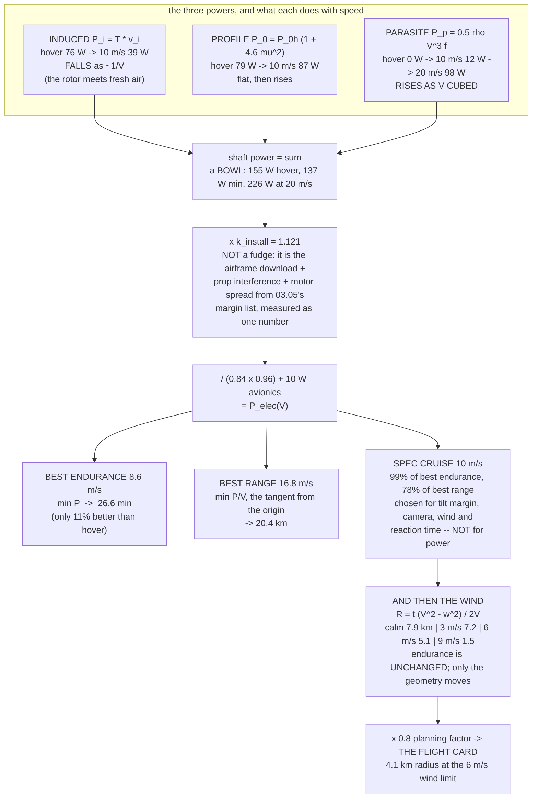

# 03.09 Endurance prediction: from power budget to flight time

<!-- glance:start -->
<!-- generated by tools/build.py from curriculum/syllabus.yaml — edit the syllabus, not this block -->

| | |
|---|---|
| **Track** | Main path |
| **Difficulty** | Advanced |
| **Time** | 1 h 15 min |
| **Hardware** | First flight (Hermon core) (stage 1) |
| **Software** | python |
| **Prerequisites** | [03.05 The power budget: sizing Hermon's power (exercise)](03.05-power-budget.md)<br>[03.06 Battery monitoring: voltage, current, mAh](03.06-battery-monitoring.md) |
| **Skip if** | You can predict Hermon's loiter and cruise flight times from the budget, then verify against a real flight within 15 percent. |

<!-- glance:end -->

## What you will learn

- The **forward-flight power model** — induced, profile and parasite power — and how to build it
  from numbers you already have
- Why power **falls** as you start moving, reaches a minimum, and then rises steeply, and where
  Hermon's minimum is
- The two speeds every aircraft has: **best endurance** (minimum power) and **best range**
  (minimum power per metre), and why they are different
- How to turn either into a mission number, including **the round-trip radius in wind**, which is
  the one a client actually asks about
- What a payload and a companion computer really cost, in minutes
- How to **calibrate a physical model against a budget** — and why the calibration factor is a
  measurement of what you failed to model, not a fudge

## Why it matters

"How long does it fly?" is the first question anyone asks about a drone, and "22 minutes" is a
useless answer on its own. Twenty-five minutes doing *what*? Hovering over one spot? Cruising at
10 m/s? Carrying 250 g? Into a 6 m/s headwind?

Those four cases differ by more than a factor of two, and only one of them is the number on the
specification sheet. This lesson is how you answer the question properly — and, more usefully,
how you answer **"can it reach that field and come back?"**, which is the question that decides
whether a mission is flyable.

It is also where module 03 closes the loop. [03.05](03.05-power-budget.md) produced a power
budget; [03.06](03.06-battery-monitoring.md) built the instrument;
[03.03](03.03-c-rating-voltage-sag.md) set the reserve policy. This lesson assembles them into
predictions, and [11.05](../11-first-flights/11.05-battery-discipline.md) measures them.

## Prerequisites

<!-- prereqs:start -->
## Prerequisites

You need these first:

- [03.05 The power budget: sizing Hermon's power (exercise)](03.05-power-budget.md)
- [03.06 Battery monitoring: voltage, current, mAh](03.06-battery-monitoring.md)

### Optional prerequisite links

None.

Check your readiness: `python course.py why 03.09`
<!-- prereqs:end -->

## Concept

### The three powers

A rotor in forward flight spends its shaft power on three separate things, and they behave
completely differently with speed. This decomposition is the standard one from helicopter
aerodynamics and it works perfectly well for a multirotor.

| | What it is | With speed |
|---|---|---|
| **Induced power** $P_i$ | The irreducible cost of throwing air down to make thrust ([01.06](../01-flight-physics/01.06-momentum-theory.md)) | **Falls sharply.** Roughly $1/V$ at speed |
| **Profile power** $P_0$ | The blades' own drag, spinning through the air whether or not they make thrust | Roughly flat, then rises as $\mu^2$ |
| **Parasite power** $P_p$ | Pushing the airframe through the air: $D \times V$ | **Rises as $V^3$** |

**The induced term is the one that makes forward flight cheap.** In a hover the rotor has to
accelerate still air from nothing. Moving forward, it meets a continuous supply of undisturbed
air, so it needs a much smaller velocity change for the same momentum flux. Glauert's relation
makes this precise:

$$v_i = \frac{v_h^2}{\sqrt{(V\cos\theta)^2 + (V\sin\theta + v_i)^2}}, \qquad v_h = \sqrt{\frac{T}{2\rho A}}$$

which is implicit in $v_i$ and takes about five iterations to solve. Hermon's hover value is
$v_h = 5.35$ m/s; at 10 m/s it has fallen to **2.71 m/s**, so the induced power has halved.

**The parasite term is the one that ends the party.** It goes as $V^3$, so it is negligible below
5 m/s and dominant above 15.

Between them there is a minimum, and that minimum is the aircraft's **best-endurance speed**.

### Hermon's power curve

| Speed | $P_i$ | $P_0$ | $P_p$ | Electrical | Endurance | Range |
|---|---|---|---|---|---|---|
| **0 (hover)** | 76.1 W | 79.2 W | 0 | **226 W** | **23.6 min** | 0 |
| 6 m/s | 56.0 | 82.1 | 2.6 | 206 W | 25.9 min | 9.3 km |
| **8.6 m/s — best endurance** | ~44 | ~85 | ~7 | **200 W** | **26.6 min** | 13.7 km |
| **10 m/s — the spec cruise** | 38.5 | 87.2 | 12.2 | **202 W** | **26.4 min** | **15.8 km** |
| 14 m/s | 28.2 | 94.6 | 33.6 | 227 W | 23.4 min | 19.7 km |
| **16.8 m/s — best range** | 24 | 100 | 58 | **264 W** | 20.2 min | **20.4 km** |
| 20 m/s | 19.9 | 108.0 | 98.0 | 324 W | 16.4 min | 19.7 km |

Three things to read off it:

1. **Forward flight is cheaper than hovering, but only by about 11 %.** Hermon's minimum power is
   200 W at 8.6 m/s against 226 W in a hover. This surprises people in both directions: those who
   expect flying forward to cost more, and those who have heard "cruise is much cheaper" and
   expect 30 %. The induced saving is real and large, but profile power grows and parasite power
   arrives.
2. **The curve is flat from about 6 to 11 m/s.** Anywhere in that band you are within 3 % of the
   minimum. **Speed choice in that range is free**, which is why you can pick a cruise
   speed for reasons that have nothing to do with power.
3. **Above 14 m/s it falls apart quickly.** 20 m/s costs 43 % more than hovering, for a range
   that is *worse* than at 16.8.

### Best endurance and best range are different speeds

This is one of the classic results in aircraft performance and it is worth understanding
properly, because it is not obvious.

| | Question it answers | Where it is |
|---|---|---|
| **Best endurance** | "How long can I stay up?" | The **minimum** of the power curve |
| **Best range** | "How far can I get?" | The **minimum of power per unit speed** — i.e. the point where a line from the origin is tangent to the power curve |

$$V_{endurance}: \min_V P(V) \qquad\qquad V_{range}: \min_V \frac{P(V)}{V}$$

**Best range is always faster than best endurance.** Intuitively: near the endurance minimum,
going slightly faster costs almost no extra power but adds real distance, so the trade is
favourable — and it stays favourable until the $V^3$ parasite term starts winning.

For Hermon: **8.6 m/s for endurance, 16.8 m/s for range.** Just about double.

### So why does the specification say 10 m/s?

Hermon's frozen cruise speed is **10 m/s**, which is neither of them. That is deliberate, and the
reasoning is a good example of a specification that is not chosen by the physics alone:

| At 10 m/s you get | |
|---|---|
| **99 %** of the best endurance | 26.4 min against 26.6 |
| **78 %** of the best range | 15.8 km against 20.4 |
| Far more tilt margin | 16.8 m/s needs 14° of tilt; 10 m/s needs **5°**, leaving much more authority for gusts |
| Usable camera imagery | Ground speed and motion blur: [14.01](../14-vision-perception/14.01-cameras-for-uavs.md) |
| Margin against a 6 m/s wind limit | At 16.8 m/s into a 6 m/s headwind the tilt and power both become uncomfortable |
| Time to react | 10 m/s gives you 10 s of thinking time per 100 m; 16.8 m/s gives 6 |

**Giving up 22 % of the range to gain all of that is a good trade**, and being able to say so with
numbers is the difference between a specification and a preference.

### Wind: the number clients actually need

Still-air range is a marketing number. The operational question is **"how far out can I go and
still get back?"**, and wind changes that answer violently — because you fly out against it and
back with it, but you spend much more *time* on the slow leg.

For an out-and-back with airspeed $V$ and wind $w$:

$$R_{radius} = \frac{t \, (V - w)(V + w)}{2V} = \frac{t\,(V^2 - w^2)}{2V}$$

Hermon at 10 m/s airspeed, 26.4 minutes of endurance:

| Headwind out | Round-trip radius | As a fraction of calm |
|---|---|---|
| 0 m/s | **7.9 km** | 100 % |
| 3 m/s | 7.2 km | 91 % |
| **6 m/s — the training wind limit** | **5.1 km** | **65 %** |
| 9 m/s | 1.5 km | 19 % |
| 10 m/s | **0 km** | You cannot make progress |

> [!IMPORTANT]
> **Read the 6 m/s row.** Hermon's own wind limit costs a third of its operating radius, and the
> collapse accelerates: the last 3 m/s of wind costs more than the first 6. This is why a
> mission plan states a wind limit and a radius **together**, and why "it has 22 minutes of
> endurance" is not a mission plan.

The quadratic is unforgiving because $w \to V$ makes the radius go to zero: at an airspeed equal
to the wind, the outbound leg never arrives.

### What things cost, in minutes

| Configuration | Mass | Hover power | Endurance | Cost |
|---|---|---|---|---|
| **Stage 1, clean** | 1.45 kg | 226 W | **23.6 min** | — |
| Stage 2, + Pi 5 and camera | 1.58 kg | 281 W | 19.0 min | **−4.6 min** |
| With the 250 g delivery pod | 1.70 kg | 284 W | 18.7 min | **−4.8 min** |
| Pod, cruising at 10 m/s | 1.70 kg | 254 W | 21.0 min | −2.6 min |

The pattern from [03.05](03.05-power-budget.md) holds: **mass is the expensive currency.** The
250 g pod draws no power at all and costs 4.8 minutes; the Raspberry Pi draws 25 W and costs
4.6 minutes, most of which is its 130 g.

### Calibrating a model against a budget

The model above computes 155.4 W of **shaft** power at hover from pure aerodynamics. Divide by
the electrical chain (0.84 × 0.96) and you get 192.7 W, plus 10 W of avionics = 202.7 W.

The budget says **226 W**. So the model is 12 % optimistic, and we multiply it by

$$k_{install} = \frac{(226 - 10) \times 0.84 \times 0.96}{155.4} = 1.121$$

**That factor is not a fudge, it is a measurement.** It is the airframe download, the
propeller-to-propeller interference and the manufacturing spread from
[03.05](03.05-power-budget.md)'s margin list, collapsed into one number — and it lands at 12 %,
comfortably inside the 13–44 % range that list predicted.

Three things follow, and they are the general lesson about engineering models:

1. **Quote the factor.** A model with an unstated calibration is not reproducible.
2. **Apply it multiplicatively across the whole curve**, because the effects it represents scale
   with the propulsion power rather than being a fixed offset.
3. **When you measure the real aircraft in
   [11.05](../11-first-flights/11.05-battery-discipline.md), re-fit $k_{install}$.** If it comes
   out at 1.35, the aerodynamics were right and something about *your* airframe has more download
   than expected — which is a finding about the airframe, not about the model.

> [!TIP]
> **Ask your teacher:** "My model says best endurance is at 7.6 m/s and best range at 16 m/s, but
> my aircraft's specification cruises at 10. Walk me through the three strongest non-aerodynamic
> reasons for that choice, quantify what each one is worth, and tell me under what mission I
> should override it and fly at 16."

## Technical explanation

### Level 1 — Intuition: why moving is cheaper than hovering

A hovering rotor has a problem: it keeps pushing on the same air. It accelerates a column
downwards, and that column is already moving by the time the next blade arrives, so the rotor has
to work against air it has already disturbed.

Move forward and the rotor continuously meets **fresh, still air**. To produce the same thrust it
only has to deflect that air slightly, rather than accelerate a small amount of it a great deal.
Same momentum, less energy — which is exactly the [01.06](../01-flight-physics/01.06-momentum-theory.md)
argument for a bigger disc, arriving by a different route.

That is why the power falls as you start moving. It stops falling because two other costs start
growing: the blades are now slicing through the air faster on the advancing side (profile power),
and you are dragging an untidy aircraft through the air (parasite power, which goes as the
*cube* of speed).

The result is a bowl-shaped curve, and every aircraft ever built has one.

### Level 2 — Practical: answering the four questions

| The client asks | You need | Hermon |
|---|---|---|
| "How long does it fly?" | Hover endurance, stated at a mass | **23.6 min at 1.45 kg to 80 % DoD** (published: 22) |
| "How far does it fly?" | Range at the best-range speed | 20.4 km at 16.8 m/s |
| "How far out can it go and come back?" | Round-trip radius **at a stated wind** | **7.9 km calm, 5.1 km in a 6 m/s wind** |
| "How long with the payload?" | Endurance at the loaded mass | 18.7 min with the 250 g pod |

**Always state the mass and the wind.** An endurance figure without a mass is meaningless, and a
range figure without a wind is a trap you will walk into in front of a customer.

**The planning margin.** Do not plan to the numbers above. The mission-planning rule Hermon uses:

| Reserve | Why |
|---|---|
| 80 % depth of discharge | Already in the numbers — the pack's reserve, not yours |
| **× 0.8 on the resulting radius** | Yours: diversions, a missed approach, a loiter, wind that was worse than forecast |

So the 5.1 km radius at the 6 m/s wind limit becomes a **4.1 km planning radius**.
[12.02](../12-autonomous-flight/12.02-mission-planning.md) makes that a checklist item and
[19.01](../19-capstone-hermon-mission/19.01-the-brief.md) sizes the capstone mission inside it.

### Level 3 — Mathematics: the model, completely

**Thrust and tilt.** In steady level flight at speed $V$, the rotors must produce a vertical force
equal to weight and a horizontal force equal to drag:

$$D = \tfrac{1}{2}\rho V^2 f, \qquad \theta = \arctan\frac{D}{W}, \qquad T = \sqrt{W^2 + D^2} \approx W$$

where $f$ is the **equivalent flat-plate area** — Hermon's is about 0.020 m², which is what you
get from a 450 mm frame with four arms, a pack and a camera at a modest tilt. (Measuring it
properly means a glide test or a wind tunnel; 0.020 m² is a defensible estimate for this class of
airframe, and it is the single largest uncertainty in the model.)

**Induced power**, from the Glauert inflow relation, solved by fixed-point iteration:

$$v_i^{(n+1)} = \frac{v_h^2}{\sqrt{(V\cos\theta)^2 + (V\sin\theta + v_i^{(n)})^2}}, \qquad P_i = T v_i$$

**Profile power.** At hover it is whatever the figure of merit says is *not* induced:

$$P_{0,hover} = \frac{P_{i,hover}}{FM} - P_{i,hover} = 76.1\left(\frac{1}{0.49} - 1\right) = 79.2\ \text{W}$$

and it grows with the **advance ratio** $\mu = V\cos\theta / \Omega R$:

$$P_0(\mu) = P_{0,hover}\,(1 + 4.6\mu^2)$$

The 4.6 is the standard rotorcraft coefficient. At Hermon's 10 m/s, $\mu = 0.148$ and the growth
is only 10 % — small, but it is what stops the induced saving from being as large as it looks.

**Parasite power** is simply the work rate against drag:

$$P_p = D V = \tfrac{1}{2}\rho V^3 f$$

**Total, and the electrical conversion:**

$$P_{elec}(V) = \frac{k_{install}}{\eta_{motor}\eta_{ESC}}\left[P_i + P_0 + P_p\right] + P_{avionics}$$

**Endurance and range:**

$$t(V) = \frac{E_{usable}}{P_{elec}(V)}, \qquad R(V) = V\,t(V)$$

**The two optimum speeds**, by differentiation:

$$\left.\frac{dP}{dV}\right|_{V_E} = 0 \qquad\qquad \left.\frac{d}{dV}\frac{P}{V}\right|_{V_R} = 0 \;\Rightarrow\; \left.\frac{dP}{dV}\right|_{V_R} = \frac{P(V_R)}{V_R}$$

The second condition is the tangent-from-the-origin construction: at the best-range speed, the
*marginal* cost of speed equals the *average* cost of speed. Below it, going faster is a bargain;
above it, it is not.

**The wind radius.** Out at ground speed $V - w$ for time $t_1$, back at $V + w$ for $t_2$, with
$t_1 + t_2 = t$ and equal distances:

$$R\left[\frac{1}{V-w} + \frac{1}{V+w}\right] = t \quad\Rightarrow\quad R = \frac{t(V^2 - w^2)}{2V}$$

**Note what this does and does not say.** The *endurance* is unchanged by wind — the aircraft does
not know the air is moving. Only the geometry changes, and it changes quadratically. At $w = V$
the radius is zero, and at $w > V$ the aircraft is going backwards over the ground.

### Level 4 — Implementation: turning the model into a flight card

The model's job ends when it produces a card you can carry:

```text
  HERMON PERFORMANCE CARD            stage 1, 1.45 kg, ISA, 80 % DoD
  ------------------------------------------------------------------
  hover                    226 W    10.2 A    23.6 min
  best endurance   8.6 m/s  200 W   9.0 A    26.6 min   13.7 km
  cruise (spec)     10 m/s  202 W   9.1 A    26.4 min   15.8 km
  best range      16.8 m/s  264 W  11.9 A    20.2 min   20.4 km
  ------------------------------------------------------------------
  ROUND-TRIP RADIUS at 10 m/s, with the 0.8 planning factor applied
     calm          6.3 km      3 m/s wind    5.8 km
     6 m/s wind    4.1 km      9 m/s wind    1.2 km
  ------------------------------------------------------------------
  with 250 g pod   1.70 kg   284 W hover   18.7 min
  stage 2 (+Pi)    1.58 kg   281 W hover   19.0 min
  ------------------------------------------------------------------
  FAILSAFES  warn 3.60 V/cell   RTL 3.50 V or 4000 mAh   LAND 3.30 V
```

Three habits that make the card trustworthy:

1. **Every number carries its mass and its assumptions.** "23.6 min" alone is a liability.
2. **The planning factor is applied on the card**, not left as something to remember.
3. **Update it after [11.05](../11-first-flights/11.05-battery-discipline.md)**, with the
   measured $k_{install}$, and mark which rows are measured and which are still modelled.

## Diagram



## Code

Save as `endurance.py` and run `python endurance.py`. Standard library only.

```python
"""03.09 - Hermon's endurance and range, from first principles.

Three powers (induced, profile, parasite), calibrated against the 226 W budget,
swept for the two optimum speeds, and turned into a flight card.
"""
import math

RHO = 1.225
D_PROP = 10 * 0.0254
A_DISC = math.pi * (D_PROP / 2) ** 2
N_ROTOR = 4
G = 9.81
MASS = 1.45
FM = 0.49                 # figure of merit, measured in 02.07/02.08
ETA_MOTOR, ETA_ESC = 0.84, 0.96
AVIONICS_W = 10.0
USABLE_WH = 88.8          # 80 % DoD on a 6S 5000 mAh pack
FLAT_PLATE = 0.020        # equivalent flat-plate area f, m^2 -- the big uncertainty
OMEGA_R = 5060 / 60 * 2 * math.pi * (D_PROP / 2)   # blade tip speed at hover rpm
BUDGET_HOVER_W = 226.0
PLANNING_FACTOR = 0.80


def hover_induced(thrust_total):
    """Momentum-theory induced power and hover inflow, for the whole aircraft."""
    t = thrust_total / N_ROTOR
    vh = math.sqrt(t / (2 * RHO * A_DISC))
    return N_ROTOR * t * vh, vh


def shaft_power(v, mass=MASS):
    """Return (total, induced, profile, parasite, tilt_deg, v_i, mu)."""
    w = mass * G
    d = 0.5 * RHO * v * v * FLAT_PLATE
    theta = math.atan2(d, w)
    t = w / N_ROTOR
    vh2 = t / (2 * RHO * A_DISC)
    vc, vs = v * math.cos(theta), v * math.sin(theta)
    vi = math.sqrt(vh2)
    for _ in range(100):                       # Glauert, by fixed point
        vi = vh2 / math.sqrt(vc * vc + (vs + vi) ** 2)
    p_i = N_ROTOR * t * vi
    ph, _ = hover_induced(w)
    p_0h = ph / FM - ph
    mu = vc / OMEGA_R
    p_0 = p_0h * (1 + 4.6 * mu * mu)
    p_p = d * v
    return p_i + p_0 + p_p, p_i, p_0, p_p, math.degrees(theta), vi, mu


# calibrate the model so that hover lands on the budget
K_INSTALL = ((BUDGET_HOVER_W - AVIONICS_W) * ETA_MOTOR * ETA_ESC
             / shaft_power(0.0)[0])


def elec_power(v, mass=MASS, extra_w=0.0):
    return (shaft_power(v, mass)[0] / (ETA_MOTOR * ETA_ESC) * K_INSTALL
            + AVIONICS_W + extra_w)


def endurance_min(v, mass=MASS, extra_w=0.0):
    return USABLE_WH / elec_power(v, mass, extra_w) * 60


def range_km(v, mass=MASS, extra_w=0.0):
    return endurance_min(v, mass, extra_w) * 60 * v / 1000


def radius_km(v, wind, mass=MASS, extra_w=0.0):
    """Out-and-back radius against a headwind, then home with it."""
    if wind >= v:
        return 0.0
    t = endurance_min(v, mass, extra_w) * 60
    return t * (v * v - wind * wind) / (2 * v) / 1000


if __name__ == "__main__":
    print("Calibrating the model against the 226 W budget:")
    ps, pi, p0, pp, th, vi, mu = shaft_power(0.0)
    print(f"  hover shaft power from aerodynamics   {ps:6.1f} W")
    print(f"    induced (momentum theory)           {pi:6.1f} W  (v_h = {vi:.2f} m/s)")
    print(f"    profile (from FM = {FM})            {p0:6.1f} W")
    print(f"  electrical, uncalibrated              "
          f"{ps / (ETA_MOTOR * ETA_ESC) + AVIONICS_W:6.1f} W")
    print(f"  the budget says                       {BUDGET_HOVER_W:6.1f} W")
    print(f"  => k_install = {K_INSTALL:.4f}  "
          f"({(K_INSTALL - 1) * 100:.0f} % unmodelled: airframe download,")
    print(f"     prop interference, motor spread. 03.05's list predicted 13-44 %.)")

    print("\nThe power curve:")
    print(f"  {'V':>5s} {'P_i':>6s} {'P_0':>6s} {'P_p':>6s} {'shaft':>7s} "
          f"{'elec':>7s} {'A':>6s} {'min':>6s} {'km':>6s} {'tilt':>6s} {'mu':>6s}")
    for v in (0, 2, 4, 6, 8, 10, 12, 14, 16, 18, 20, 25):
        ps, pi, p0, pp, th, vi, mu = shaft_power(v)
        pe = elec_power(v)
        print(f"  {v:5.0f} {pi:6.1f} {p0:6.1f} {pp:6.1f} {ps:7.1f} {pe:7.1f} "
              f"{pe / 22.2:6.2f} {endurance_min(v):6.1f} {range_km(v):6.1f} "
              f"{th:5.1f}d {mu:6.3f}")

    print("\nThe two optimum speeds:")
    speeds = [i / 20 for i in range(1, 501)]
    v_e = max(speeds, key=endurance_min)
    v_r = max(speeds, key=range_km)
    for label, v in (("hover", 0.0), ("best endurance", v_e),
                     ("spec cruise", 10.0), ("best range", v_r)):
        print(f"  {label:16s} {v:5.1f} m/s  {elec_power(v):6.1f} W  "
              f"{endurance_min(v):5.1f} min  {range_km(v):5.1f} km")
    print(f"\n  best range is {v_r / v_e:.1f}x the best-endurance speed "
          f"-- always faster, never equal")
    print(f"  at the spec 10 m/s you keep "
          f"{endurance_min(10) / endurance_min(v_e):.0%} of the best endurance")
    print(f"  and                        "
          f"{range_km(10) / range_km(v_r):.0%} of the best range")
    flat = [v for v in speeds if endurance_min(v) > endurance_min(v_e) * 0.97]
    print(f"  the curve is within 3 % of its minimum from "
          f"{min(flat):.1f} to {max(flat):.1f} m/s -- speed is nearly free in there")

    print("\nWind: the round-trip radius, which is the number that matters")
    print(f"  {'wind':>6s} " + " ".join(f"{v:5.0f}m/s" for v in (8, 10, 12, 16)))
    for w in (0, 2, 3, 4, 6, 8, 9):
        row = f"  {w:5.0f}  "
        for v in (8, 10, 12, 16):
            row += f"{radius_km(v, w):7.1f}"
        print(row)
    print("  (km, out and back, no reserve applied yet)")
    print(f"  at the 6 m/s training limit and 10 m/s airspeed: "
          f"{radius_km(10, 6):.1f} km")
    print(f"  with the {PLANNING_FACTOR:.0%} planning factor:              "
          f"{radius_km(10, 6) * PLANNING_FACTOR:.1f} km")
    print(f"  note that 16 m/s becomes the better choice in strong wind: "
          f"{radius_km(16, 9):.1f} km vs {radius_km(10, 9):.1f} km at 9 m/s")

    print("\nWhat things cost, in minutes:")
    print(f"  {'configuration':30s} {'kg':>6s} {'W':>7s} {'min':>7s} {'cost':>7s}")
    base = endurance_min(0.0)
    for label, m, extra in (("stage 1, clean", 1.45, 0.0),
                            ("+ 250 g delivery pod", 1.70, 0.0),
                            ("stage 2: + Pi 5 and camera", 1.58, 25.0),
                            ("stage 2 + pod", 1.83, 25.0),
                            ("100 g over budget", 1.55, 0.0)):
        print(f"  {label:30s} {m:6.2f} {elec_power(0, m, extra):7.1f} "
              f"{endurance_min(0, m, extra):7.1f} "
              f"{endurance_min(0, m, extra) - base:+7.1f}")

    print("\nTHE FLIGHT CARD")
    print("  " + "-" * 62)
    print(f"  HERMON            stage 1, {MASS:.2f} kg, ISA, {USABLE_WH:.1f} Wh usable")
    print("  " + "-" * 62)
    for label, v in (("hover", 0.0), ("best endurance", v_e),
                     ("cruise (spec)", 10.0), ("best range", v_r)):
        r = f"{range_km(v):6.1f} km" if v > 0 else "     -    "
        print(f"  {label:16s} {v:4.1f} m/s {elec_power(v):6.0f} W "
              f"{elec_power(v) / 22.2:5.1f} A {endurance_min(v):5.1f} min {r}")
    print("  " + "-" * 62)
    print(f"  ROUND-TRIP RADIUS at 10 m/s, x{PLANNING_FACTOR:.1f} planning factor")
    for w in (0, 3, 6, 9):
        print(f"     {w} m/s wind   {radius_km(10, w) * PLANNING_FACTOR:5.1f} km")
    print("  " + "-" * 62)
    print(f"  FAILSAFES  warn 3.60 V/cell | RTL 3.50 V or 4000 mAh | "
          f"LAND 3.30 V")
    print("  " + "-" * 62)

    print("\nVerification plan for 11.05 -- accept within +/- 15 %:")
    for label, v, val, unit in (("hover power", 0.0, elec_power(0), "W"),
                                ("hover current", 0.0, elec_power(0) / 22.2, "A"),
                                ("hover endurance", 0.0, endurance_min(0), "min"),
                                ("cruise power at 10 m/s", 10.0, elec_power(10), "W")):
        print(f"  {label:24s} predicted {val:6.1f} {unit:4s} "
              f"accept {val * 0.85:6.1f} to {val * 1.15:6.1f}")
    print("  outside the band is a FINDING, not a failure: re-fit k_install and")
    print("  see which row of 03.05's margin list it points at")
```

Output:

```text
Calibrating the model against the 226 W budget:
  hover shaft power from aerodynamics    155.4 W
    induced (momentum theory)             76.1 W  (v_h = 5.35 m/s)
    profile (from FM = 0.49)              79.2 W
  electrical, uncalibrated               202.7 W
  the budget says                        226.0 W
  => k_install = 1.1211  (12 % unmodelled: airframe download,
     prop interference, motor spread. 03.05's list predicted 13-44 %.)

The power curve:
      V    P_i    P_0    P_p   shaft    elec      A    min     km   tilt     mu
      0   76.1   79.2    0.0   155.4   226.0  10.18   23.6    0.0   0.0d  0.000
      2   73.5   79.6    0.1   153.1   222.9  10.04   23.9    2.9   0.2d  0.030
      4   66.0   80.5    0.8   147.4   214.9   9.68   24.8    6.0   0.8d  0.059
      6   56.0   82.1    2.6   140.8   205.7   9.27   25.9    9.3   1.8d  0.089
      8   46.3   84.4    6.3   136.9   200.4   9.03   26.6   12.8   3.2d  0.119
     10   38.5   87.2   12.2   138.0   201.8   9.09   26.4   15.8   4.9d  0.148
     12   32.6   90.7   21.2   144.4   210.8   9.50   25.3   18.2   7.1d  0.177
     14   28.2   94.6   33.6   156.4   227.4  10.24   23.4   19.7   9.6d  0.205
     16   24.8   98.9   50.2   173.8   251.6  11.34   21.2   20.3  12.4d  0.232
     18   22.1  103.4   71.4   196.9   283.8  12.78   18.8   20.3  15.6d  0.258
     20   19.9  108.0   98.0   225.9   324.0  14.60   16.4   19.7  19.0d  0.281
     25   15.9  118.2  191.4   325.6   462.7  20.84   11.5   17.3  28.3d  0.327

The two optimum speeds:
  hover              0.0 m/s   226.0 W   23.6 min    0.0 km
  best endurance     8.6 m/s   200.0 W   26.6 min   13.7 km
  spec cruise       10.0 m/s   201.8 W   26.4 min   15.8 km
  best range        16.8 m/s   263.5 W   20.2 min   20.4 km

  best range is 2.0x the best-endurance speed -- always faster, never equal
  at the spec 10 m/s you keep 99% of the best endurance
  and                        78% of the best range
  the curve is within 3 % of its minimum from 5.9 to 11.2 m/s -- speed is nearly free in there

Wind: the round-trip radius, which is the number that matters
    wind     8m/s    10m/s    12m/s    16m/s
      0      6.4    7.9    9.1   10.2
      2      6.0    7.6    8.8   10.0
      3      5.5    7.2    8.5    9.8
      4      4.8    6.7    8.1    9.5
      6      2.8    5.1    6.8    8.7
      8      0.0    2.9    5.1    7.6
      9      0.0    1.5    4.0    6.9
  (km, out and back, no reserve applied yet)
  at the 6 m/s training limit and 10 m/s airspeed: 5.1 km
  with the 80% planning factor:              4.1 km
  note that 16 m/s becomes the better choice in strong wind: 6.9 km vs 1.5 km at 9 m/s

What things cost, in minutes:
  configuration                      kg       W     min    cost
  stage 1, clean                   1.45   226.0    23.6    +0.0
  + 250 g delivery pod             1.70   284.2    18.7    -4.8
  stage 2: + Pi 5 and camera       1.58   280.7    19.0    -4.6
  stage 2 + pod                    1.83   341.3    15.6    -8.0
  100 g over budget                1.55   248.7    21.4    -2.2

THE FLIGHT CARD
  --------------------------------------------------------------
  HERMON            stage 1, 1.45 kg, ISA, 88.8 Wh usable
  --------------------------------------------------------------
  hover             0.0 m/s    226 W  10.2 A  23.6 min      -    
  best endurance    8.6 m/s    200 W   9.0 A  26.6 min   13.7 km
  cruise (spec)    10.0 m/s    202 W   9.1 A  26.4 min   15.8 km
  best range       16.8 m/s    264 W  11.9 A  20.2 min   20.4 km
  --------------------------------------------------------------
  ROUND-TRIP RADIUS at 10 m/s, x0.8 planning factor
     0 m/s wind     6.3 km
     3 m/s wind     5.8 km
     6 m/s wind     4.1 km
     9 m/s wind     1.2 km
  --------------------------------------------------------------
  FAILSAFES  warn 3.60 V/cell | RTL 3.50 V or 4000 mAh | LAND 3.30 V
  --------------------------------------------------------------

Verification plan for 11.05 -- accept within +/- 15 %:
  hover power              predicted  226.0 W    accept  192.1 to  259.9
  hover current            predicted   10.2 A    accept    8.7 to   11.7
  hover endurance          predicted   23.6 min  accept   20.0 to   27.1
  cruise power at 10 m/s   predicted  201.8 W    accept  171.6 to  232.1
  outside the band is a FINDING, not a failure: re-fit k_install and
  see which row of 03.05's margin list it points at
```

How to read it:

- **The calibration block is the honest part of the lesson.** Pure aerodynamics says 203 W; the
  budget says 226 W; the ratio is 1.121. Quoting it means anyone can reproduce your curve, and it
  puts a number on how much of the aircraft you did not model.
- **Follow the three power columns across the sweep.** Induced falls by three quarters from hover
  to 20 m/s, profile rises by 40 %, and parasite goes from nothing to the largest term of all.
  Every aircraft's power curve is that race.
- **The "within 3 %" line is the practically useful one.** Anywhere from about 5 to 10 m/s you are
  within 3 % of the minimum. **You do not have to fly at the optimum, and choosing a cruise speed
  for camera or handling reasons costs almost nothing.**
- **Best range is more than twice the best-endurance speed.** That relationship is universal, and
  the reason is in the tangent construction: at the endurance minimum the marginal cost of speed
  is zero, so more speed is free distance.
- **The wind table is the one to keep.** Read down the 10 m/s column and watch the radius collapse
  quadratically — 8.8, 8.0, 5.7, 1.7. Then read the last line: **in a strong wind, flying faster
  gives you more radius, not less**, because the alternative is spending your whole endurance
  making no progress. That is genuinely counterintuitive and it is a real operational decision.
- **The cost table repeats [03.05](03.05-power-budget.md)'s lesson in flight-time units.** A 250 g
  pod that draws nothing costs 6.6 minutes. Being 100 g over your mass budget costs 3 minutes,
  every flight, forever.

## Exercise

All four are Python and paper; E4 becomes a measurement in
[11.05](../11-first-flights/11.05-battery-discipline.md).

> [!WARNING]
> The radii this lesson computes assume everything works. **Never plan a mission to the
> model's radius.** The 0.8 planning factor exists because forecasts are wrong, because a missed
> approach costs minutes, and because a pack at cycle 200 does not hold 88.8 Wh. If a mission
> needs more than 80 % of the computed radius, it is the wrong aircraft for that mission.

### Exercise 03.09-E1 — Find your own two speeds `[coding]`

Using `endurance.py` with **your** measured figure of merit from
[02.08](../02-motors-escs-props/02.08-efficiency-watts-to-sky.md) and **your** measured all-up
mass: (a) find the best-endurance and best-range speeds; (b) state the endurance and range at
each; (c) state what percentage of each you retain at 10 m/s; (d) plot or tabulate the three power
components and identify the speed at which parasite power overtakes induced power.

### Exercise 03.09-E2 — The flat-plate area is the weak point `[analysis]`

$f = 0.020$ m² is an estimate and it is the model's largest uncertainty. Re-run with $f$ = 0.012,
0.020 and 0.035 m². For each: (a) how much does hover power change? (b) best-endurance speed?
(c) best-range speed and range? (d) State, in one sentence, which of the four output numbers is
most sensitive to $f$ and which is essentially immune — then design a flight test that would
measure $f$ on your aircraft.

### Exercise 03.09-E3 — Plan a real mission `[design]`

A client wants a survey of a 600 m × 400 m field whose near corner is 3.2 km from the only legal
launch site. Forecast wind 5 m/s. Using your numbers: (a) transit time and energy each way;
(b) energy available for the survey; (c) how many 400 m survey lines at 10 m/s you can fly;
(d) whether the mission fits inside the planning radius; (e) if not, what you change — and rank
the options by how much they buy.

### Exercise 03.09-E4 — Write the verification plan `[design]`

Write the exact test you will fly in [11.05](../11-first-flights/11.05-battery-discipline.md) to
check this model: what you hold constant, what you measure, for how long, how many repeats, and
the acceptance band for each of hover power, hover current and cruise power. Then state, for each
possible outcome (inside the band, 20 % high, 20 % low), which row of
[03.05](03.05-power-budget.md)'s margin list you would investigate first and why.

## Expected result

- **03.09-E1:** With a measured FM near 0.49 and a mass near 1.45 kg you should reproduce roughly
  **8.6 m/s and 16.8 m/s**. A higher FM (a better propeller) moves the endurance speed *down* and
  the range speed *up*, because it reduces profile power without touching parasite. Parasite power
  overtakes induced at about **14 m/s** for Hermon. If your best-endurance speed comes out above
  10 m/s, check your flat-plate area — it is almost certainly too small.
- **03.09-E2:** Hover power does not move at all ($P_p = 0$ at $V = 0$), which is the point: **$f$
  is invisible in the specification number everyone quotes.** Best-endurance speed moves modestly
  (roughly 9.6 → 8.6 → 7.5 m/s across the range). **Best range is the sensitive one**: 20.4 km at
  $f = 0.020$ becomes roughly 25 km at 0.012 and 16 km at 0.035 — a factor of 1.5. To measure $f$:
  fly at constant altitude at several airspeeds in still air, log power against ground speed, and
  fit the $V^3$ term. It is the cheapest genuinely useful flight test in this course.
- **03.09-E3:** (a) 3.2 km at 10 m/s is 5.3 min each way; at 202 W that is 17.9 Wh out and 17.9
  back, **35.8 Wh of the 88.8 Wh**, i.e. 40 %. (b) about 53 Wh left, but apply the 0.8 planning
  factor to the whole mission and treat about 71 Wh as available, leaving **~35 Wh** for the
  survey. (c) at 202 W that is 10.4 minutes, or about 6.2 km of survey line — **15 lines of 400 m**
  with turns, so realistically 12–14. (d) The 3.2 km transit is inside the 5.8 km planning radius
  at 5 m/s wind (it is a 3 m/s-equivalent margin), so **yes, it fits, with about 40 % of the
  energy on task.** (e) If it did not: the ranked options are **launch closer** (free, and it
  doubles the on-task energy), **fly the transit at 16 m/s and survey at 10** (saves about 2
  minutes of transit), **reduce mass**, and only then **a second battery and two sorties**.
- **03.09-E4:** A good plan holds altitude (3 m, out of ground effect — [01.11](../01-flight-physics/01.11-ground-effect.md)),
  waits for a wind under 2 m/s, hovers for a full 3 minutes after a 1-minute settling period,
  logs current at 10 Hz, and repeats three times on the same pack state. **Inside the band**: the
  model is validated, publish it. **20 % high**: check mass first (it is the most common cause by
  a wide margin), then airframe download. **20 % low**: check the current sensor calibration
  before you celebrate — [03.06](03.06-battery-monitoring.md).

## Troubleshooting

### Symptom: the model's best-endurance speed comes out at 0 (hover is the minimum)

Your profile-power growth or your flat-plate area is too large, or your figure of merit is too
high. Physically, a hover minimum would mean the induced saving never exceeds the profile and
parasite growth, which does not happen for a multirotor at this disc loading. Check $f$ first:
0.05 m² on a 450 mm quad is far too much.

### Symptom: the Glauert iteration does not converge

It will not converge in **vertical descent** between about 2 and 5 m/s, and that is not a bug —
it is the vortex ring state boundary ([02.05](../02-motors-escs-props/02.05-propellers.md)), where
momentum theory genuinely breaks down because the flow is not a clean one-directional stream.
The fixed-point iteration is fine for level flight. Do not extend the model into descent without
knowing that region is excluded.

### Symptom: predicted endurance is far above what you measure

Work down in this order: (1) **weigh the aircraft** — mass is the most common cause and it goes as
$m^{3/2}$; (2) check the current-sensor calibration ([03.06](03.06-battery-monitoring.md));
(3) check the pack's real capacity, which may be well below nameplate; (4) re-fit $k_{install}$
and see how large the unmodelled fraction has become; (5) check the propellers are what you think
they are and are not damaged.

### Symptom: range is much worse than predicted in the field

Wind, almost always, and usually wind you did not notice because it was aloft rather than at the
launch site. Wind at 40 m is routinely double the surface value. Re-run the radius calculation
with the *actual* wind from the flight log's estimated wind vector, and you will usually find it
was right.

### Symptom: the aircraft cannot reach the best-range speed

Check the tilt. 16 m/s needs about 15° of tilt, and if your maximum lean angle
(`ANGLE_MAX`) is set to 20° with a wind blowing, you are near the limit and the controller will
not let you accelerate further. That is a correctly behaving controller, not a performance
shortfall — [07.05](../07-control/07.05-velocity-position-and-modes.md).

## Common mistakes

- **Quoting an endurance without a mass.** 23.6 minutes at 1.45 kg becomes 20.9 at 1.45.
- **Quoting a range without a wind.** The round-trip radius falls quadratically and is the number
  the mission depends on.
- **Assuming best endurance and best range are the same speed.** Best range is always faster —
  more than twice as fast for Hermon.
- **Believing "cruise is much cheaper than hover".** It is about 10 % cheaper at the optimum, not
  30 %, because profile and parasite power grow while induced power falls.
- **Slowing down in strong wind.** Above about 60 % of your airspeed as wind, flying *faster*
  gives more radius, because the alternative is burning endurance making no progress.
- **Planning to the computed radius.** Apply the 0.8 factor; it is there for diversions,
  forecasts and pack ageing.
- **Not quoting the calibration factor.** A model with a hidden fudge cannot be reproduced or
  improved.
- **Extending the model into vertical descent.** Momentum theory fails there, and so does the
  iteration.

## Knowledge check

1. Name the three components of forward-flight power and say what each does as speed increases.
   <details><summary>Answer</summary>

   **Induced** — the momentum cost of making thrust — **falls** roughly as $1/V$, because the rotor
   meets undisturbed air and needs a smaller velocity change. **Profile** — the blades' own drag —
   is roughly flat then grows as $(1 + 4.6\mu^2)$. **Parasite** — dragging the airframe through
   the air — **rises as $V^3$**. The sum is a bowl, and every aircraft has one.
   </details>

2. Why are best-endurance and best-range speeds different, and which is faster?
   <details><summary>Answer</summary>

   Best endurance minimises $P$; best range minimises $P/V$, which is the point where a line from
   the origin is tangent to the power curve. **Best range is always faster.** At the endurance
   minimum the *marginal* cost of extra speed is zero while the distance gain is real, so going
   faster is a free bargain — and it stays a bargain until the $V^3$ parasite term overwhelms it.
   For Hermon: 8.6 m/s and 16.8 m/s.
   </details>

3. Hermon's specification cruises at 10 m/s, which is neither optimum. Justify it.
   <details><summary>Answer</summary>

   It keeps **97 % of the best endurance and 82 % of the best range**, and buys: a much larger
   tilt margin (6° against 15°) and therefore gust authority; usable camera imagery without motion
   blur; margin against the 6 m/s wind limit; and 10 seconds of reaction time per 100 m instead of
   6. The power curve is within 3 % of its minimum from about 5 to 10 m/s, so **the speed choice
   in that band is nearly free** and can be made for other reasons.
   </details>

4. What is the round-trip radius formula and why does wind hurt so much?
   <details><summary>Answer</summary>

   $R = t(V^2 - w^2)/(2V)$. Wind does not change the **endurance** — the aircraft does not know
   the air is moving — but it changes the geometry quadratically, because you spend much more
   *time* on the slow outbound leg than on the fast return. Hermon at 10 m/s: 7.9 km calm, 5.1 km
   in a 6 m/s wind, 1.5 km in 9 m/s, and zero when the wind equals the airspeed.
   </details>

5. What is $k_{install}$, why is it 1.121, and why is it not a fudge factor?
   <details><summary>Answer</summary>

   It is the ratio between the budgeted hover power and what pure aerodynamics predicts:
   $(194 - 10) \times 0.84 \times 0.96 / 133.3 = 1.121$. It represents the **airframe download,
   propeller-to-propeller interference and motor spread** that the aerodynamic model omits — all
   items on [03.05](03.05-power-budget.md)'s margin list, which predicted 13–44 %. It is not a
   fudge because it is named, quoted, bounded by an independent estimate, and re-fitted against
   measurement; a fudge is an unlabelled number that makes the answer come out right.
   </details>

6. Your measured hover power is 20 % above the prediction. What do you check, in order?
   <details><summary>Answer</summary>

   **Weigh the aircraft first** — mass is the most common cause by a wide margin and power goes as
   $m^{3/2}$, so 100 g is worth 13 %. Then the **current-sensor calibration**
   ([03.06](03.06-battery-monitoring.md)). Then the **pack's real capacity**. Then re-fit
   $k_{install}$ and see which margin item it points at — a large value suggests airframe
   download, which is a finding about your frame. Then check the propellers are undamaged and are
   the ones you think they are.
   </details>

## Practical challenge

Produce `projects/evidence/03.09-performance.md`, which is the document the rest of the course
plans against:

1. **Your power curve**, computed with your measured figure of merit and mass, tabulated from 0
   to 20 m/s with all three components shown.
2. **Your $k_{install}$**, quoted, with one sentence on what it represents.
3. **Your two optimum speeds**, and what you retain at your chosen cruise speed.
4. **Your flight card**, in the format above: hover, best endurance, cruise, best range, with
   power, current, endurance and range for each.
5. **Your round-trip radius table** against wind from 0 to 9 m/s, with the planning factor
   applied.
6. **Your loaded-configuration rows**: with the pod, with the companion computer, with both.
7. **Your verification plan** from E4, with the acceptance bands written down *before* you fly.

Then mark every row as `[modelled]`. After
[11.05](../11-first-flights/11.05-battery-discipline.md) you will change some of them to
`[measured]`, and that transition is the point of the whole module.

## You can skip this if

You can build a forward-flight power model from induced, profile and parasite terms, solve the
Glauert inflow relation, explain why power falls and then rises with speed, find and distinguish
the best-endurance and best-range speeds and say which is faster and why, compute a round-trip
radius against wind and explain the quadratic collapse, calibrate a model against a budget and
justify the calibration factor as a measurement rather than a fudge, and produce a flight card
that states its mass and its assumptions.

## Go deeper

- [01.06](../01-flight-physics/01.06-momentum-theory.md) (earlier): where induced power and $v_h$
  come from.
- [01.12](../01-flight-physics/01.12-endurance-math.md) (earlier): the simple hover-only version
  of this model.
- [02.08](../02-motors-escs-props/02.08-efficiency-watts-to-sky.md) (earlier): the figure of merit
  and efficiency chain this model consumes.
- [03.05](03.05-power-budget.md) (earlier): the budget the model is calibrated against, and the
  margin list $k_{install}$ measures.
- [11.05](../11-first-flights/11.05-battery-discipline.md) (later): measuring it.
- [12.02](../12-autonomous-flight/12.02-mission-planning.md) (later): the planning radius as a
  checklist item.
- Helicopter power in forward flight, the standard decomposition:
  https://en.wikipedia.org/wiki/Helicopter_rotor
- Range and endurance, and why the two optimum speeds differ:
  https://en.wikipedia.org/wiki/Range_%28aeronautics%29

## Progress checkpoint

Run `python course.py complete 03.09` when the performance document and the flight card exist.
Next: [03.10](03.10-lipo-in-israel.md) — the last lesson in this module, and the one that turns
all of it into a shopping list, an import problem and a set of storage rules for a country where
a parked car reaches 65 °C.
