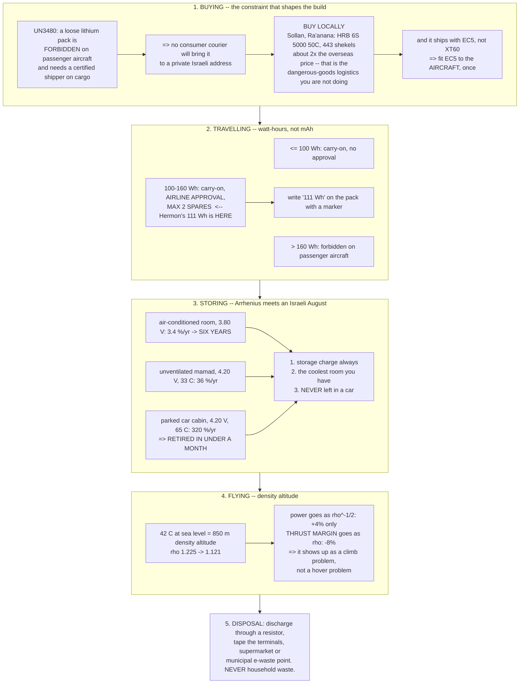

# 03.10 LiPo in Israel: buying, importing, storing, transporting

<!-- glance:start -->
<!-- generated by tools/build.py from curriculum/syllabus.yaml — edit the syllabus, not this block -->

| | |
|---|---|
| **Track** | Main path |
| **Difficulty** | Intermediate |
| **Time** | 45 min |
| **Hardware** | First flight (Hermon core) (stage 1) |
| **Software** | python |
| **Prerequisites** | [03.08 Battery safety (a LiPo is a fuel tank)](03.08-battery-safety.md) |
| **Skip if** | You can get a 6S pack into your hands legally in Israel and state the storage and transport rules for an Israeli summer. |

<!-- glance:end -->

## What you will learn

- Why **lithium packs are the one part of Hermon you cannot import**, and what that does to the
  price and the lead time
- Where to actually buy a 6S 5000 mAh pack in Israel, what it costs, and the connector surprise
  that comes with it
- The **$75 personal-import exemption**, 18 % VAT, and the arithmetic that decides what is worth
  importing at all
- The **IATA watt-hour bands** for carrying packs on an aircraft — and why Hermon's 111 Wh pack
  lands in the awkward middle one
- **Hot-climate storage**: what an Israeli summer actually does to a pack, in months of life, and
  the three rules that follow
- **Density altitude in a sharav**: what 40 °C air costs you in power and endurance
- Where to dispose of a dead pack, legally and locally

## Why it matters

Everything in this module so far has been physics, and physics is the same everywhere. This
lesson is the part that is not.

A 6S 5000 mAh pack is the single component of Hermon that **cannot be shipped to your door**, and
that one fact reshapes the build: it sets a floor on what you pay, it removes the option of
ordering a spare the week before a flight, and it means the pack you fly is whichever one an
Israeli shop had in stock. Meanwhile the climate attacks the pack from the other side — the
Arrhenius rule from [03.07](03.07-charging-balancing-storage.md) is merciless at 40 °C, and a
parked car in Tel Aviv in August is a pack-destroying machine.

And if you ever want to take Hermon abroad, the 111 Wh figure on the specification sheet turns
out to be a regulatory number as well as an engineering one.

> [!NOTE]
> **Version-sensitive.** Prices, exemption thresholds and stock were checked in **September
> 2026** and Israel's personal-import exemption moved three times in the preceding twelve months.
> Check the current figure before you order; the *structure* of the rules is stable, the numbers
> are not. Sources and dates:
> [`references/research/israel-drone-hardware-2026-09.md`](../references/research/israel-drone-hardware-2026-09.md).

## Prerequisites

<!-- prereqs:start -->
## Prerequisites

You need these first:

- [03.08 Battery safety (a LiPo is a fuel tank)](03.08-battery-safety.md)

### Optional prerequisite links

None.

Check your readiness: `python course.py why 03.10`
<!-- prereqs:end -->

## Concept

### Why you cannot import a battery

Lithium cells are **dangerous goods**. The classification that matters:

| UN number | What it covers | On a passenger aircraft | On a cargo aircraft |
|---|---|---|---|
| **UN3480** | Lithium-ion batteries shipped **alone** | **Forbidden** | Allowed, but at ≤ 30 % state of charge, by a certified shipper, with specific packaging and documentation |
| UN3481 | Lithium-ion batteries **packed with, or installed in, equipment** | Allowed with limits | Allowed with limits |

A spare LiPo pack bought online is UN3480. So:

- It **cannot** travel on a passenger aircraft, which is how most small international parcels
  move.
- It **can** travel as cargo, but the shipper must be certified, the packs must be at 30 % charge,
  and the paperwork is a commercial process. Consumer couriers decline it to residential
  addresses as a matter of policy.
- The remaining route is **sea freight**, which is six to ten weeks and is again a commercial
  import, not something a private buyer does for two packs.

**Net effect: you buy your packs in Israel.** This is not a preference or a patriotic suggestion;
it is the only practical route, and it is why
[`hardware/suppliers-israel.md`](../hardware/suppliers-israel.md) lists batteries separately from
everything else.

### What it costs, and where

| Supplier | What | Price | Notes |
|---|---|---|---|
| **Sollan** (Ra'anana) | HRB 6S 5000 mAh 50C, **EC5 plug** | **₪443** | Verified in stock 2026-09-22. Free pickup Sun–Thu; post or UPS ₪39; same-day Tel Aviv ₪129 |
| **RCBattery** | The widest Israeli LiPo catalogue (Pulse and others) | varies | Worth checking for 6S stock and alternatives |
| **C-Hobby** | LiPo safety bags | ≈ ₪35–50 | Buy one large enough for a 6S 5000 — the small 20×10 cm bags are not |

For comparison, the same pack lists at roughly **$55–70** overseas, which is ₪170–215 before
shipping. **The Israeli price is roughly double**, and that premium is the dangerous-goods
logistics you are not doing yourself. It is a fair price for a service you cannot buy any other
way.

**Budget two packs.** One pack is 27 minutes of flying per charging cycle, which makes a field
session almost pointless; two gives you **55 minutes**, with the 81-minute charge of the first
overlapping the flight of the second. Three is better and the third can wait until after the first flights.

> [!IMPORTANT]
> **The connector surprise.** The pack that is actually in stock in Israel ships with an **EC5**
> connector, not the XT60 that [03.04](03.04-power-distribution.md) specified and that most
> tutorials assume. EC5 is a perfectly good connector — rated higher than XT60, in fact — but you
> must choose one convention and apply it everywhere. **Fit EC5 to the aircraft**, rather than
> re-terminating every pack you ever buy: it is one soldering job instead of a recurring one, and
> re-terminating a pack means soldering on a live 22.2 V source with no fuse, which
> [03.08](03.08-battery-safety.md) would rather you did not do at all.

### Customs, VAT and the import arithmetic

Since batteries must be bought locally, the import rules matter for *everything else* — the
motors, the ESC, the flight controller, the radios.

| Threshold | What you owe |
|---|---|
| Up to **$75** | Nothing. The personal-import exemption |
| $75 to $500 | **18 % VAT** on the full value including shipping |
| Above $500 | 18 % VAT, plus customs duty and purchase tax where applicable |

Three practical consequences, and they are not obvious:

1. **The exemption is per shipment, not per year.** Splitting a large order into several
   shipments under $75 is legal, and it is also slow and increases the shipping cost, so it is
   rarely worth it above two or three parcels.
2. **Shipping counts toward the value.** A $70 item with $20 shipping is a $90 shipment and owes
   VAT on all $90.
3. **DigiKey Israel bills in shekels and clears customs for you.** For connectors, wire, heatshrink
   and anything catalogued, the premium is worth it because it removes the customs step entirely
   — which for a first build is worth more than the money.

**The arithmetic that decides:** import if
$\text{overseas} \times 1.18 + \text{shipping} < \text{Israeli price}$, and then add the risk of
a three-week delay and the impossibility of a warranty return. For batteries the comparison never
runs, because the left-hand side does not exist.

### Taking packs on an aircraft — the watt-hour bands

If you ever travel with Hermon, the number that matters is not the mAh on the label. It is the
**watt-hours**, and there are three bands:

| Energy | Rule |
|---|---|
| **≤ 100 Wh** | Carry-on. No approval needed. A reasonable number of spares |
| **100–160 Wh** | **Carry-on only, and requires the airline's prior approval. Maximum 2 spares** |
| **> 160 Wh** | **Forbidden on passenger aircraft**, checked or carry-on |

And always, in every band: **carry-on only** (never checked baggage), terminals insulated, each
pack in its own bag or with the terminals taped, and packs at a partial state of charge.

**Hermon's pack is 22.2 V × 5.0 Ah = 111 Wh, which lands squarely in the middle band.** That
means:

- You must contact the airline in advance and get approval.
- You may carry **two spares** plus whatever is installed in the aircraft.
- They must be in the cabin.
- Expect to be asked about them at security, and expect the person asking to want to read the
  watt-hour figure printed on the pack. **If your pack does not have Wh printed on it, write it
  on with a marker** — "111 Wh" — because arguing arithmetic at a security desk goes badly.

> [!TIP]
> **Ask your teacher:** "I want to take Hermon to a competition abroad. My 6S 5000 mAh packs are
> 111 Wh each. Work out how many packs I can legally carry, what approval I need, and then tell
> me what pack configuration I should have chosen instead if travelling were a design
> requirement — and what that choice would have cost me in endurance."

**And the design lesson**, which is worth noticing: a **6S 4000 mAh pack is 88.8 Wh** and a
**4S 5000 mAh pack is 74 Wh** — both under 100 Wh, both needing no approval and no spare limit.
An aircraft designed to travel would be designed around that line. Hermon was not, because the
endurance specification came first, and that is the correct priority for this aircraft — but it
is a real trade and you should know you made it.

### What an Israeli summer does to a pack

[03.07](03.07-charging-balancing-storage.md) gave the Arrhenius rule: **degradation doubles for
every 10 °C.** Here is what that means with real Israeli numbers.

| Where the pack is | Summer temperature | Full (4.20 V) | Storage (3.80 V) |
|---|---|---|---|
| Air-conditioned room | 23 °C | 17 %/yr | **3.5 %/yr** |
| Unventilated room or *mamad* | 33 °C | 35 %/yr | 7.0 %/yr |
| Storeroom or shed | 40 °C | 57 %/yr | 11.3 %/yr |
| **Car boot, parked, August** | **55 °C** | 160 %/yr | 32 %/yr |
| **Car cabin, parked in sun, August** | **65 °C** | **320 %/yr** | 64 %/yr |

Read the last row against the first. **A pack left fully charged in a parked car in an Israeli
August reaches its retirement threshold in under a month.** The same pack, at storage charge in
an air-conditioned room and flown twice a week, lasts **about two years and 200-odd flights** —
and at that point it is **cycle life** that retires it, not heat, which is exactly where you want
to be.

**The three rules, and they are all free:**

1. **Storage charge, always, unless you are flying within 48 hours.** The single highest-return
   habit in this course.
2. **Store in the coolest room you have, which in most Israeli homes means an air-conditioned
   one.** Not the *mamad*, not the storeroom, not the balcony cupboard.
3. **The pack never goes in the car except on the way to and from flying** — and on those trips it
   travels in the cabin with the air conditioning on, in a cool box, and it comes inside the
   moment you arrive. **Never left in a parked car, not for twenty minutes, not in the shade.**

Rule 3 is the one people break, and it is the one that costs the most.

### The field-day routine, for 35 °C

| | |
|---|---|
| **Transport** | A cool box (no ice in contact with the packs — condensation), in the cabin, out of the sun |
| **At the field** | Packs stay in the box and in the shade until the moment before flight |
| **After landing** | Pack out of the aircraft, back in the box. **Do not stack hot packs together** |
| **Before charging** | Cool to ambient — 20–30 min. Charging a 45 °C pack is charging above the limit |
| **Temperature check** | An IR thermometer on the pack after each flight. Above 45 °C means investigate the internal resistance ([03.03](03.03-c-rating-voltage-sag.md)) |
| **At home** | Storage charge that evening, indoors, air-conditioned |

**A pack that comes off the aircraft at 45 °C on a 35 °C day is telling you something.** At
Hermon's 10.2 A hover a healthy pack makes 3 W and should be within a few degrees of ambient. A
big rise means the internal resistance has grown, and hot operation accelerates that growth,
which raises the temperature further. It is a slow runaway and the only intervention is to notice
it.

### Density altitude: what a sharav costs

Hot air is thin air, and thrust scales with density. During a *sharav* (or *khamsin*) — the hot
dry wind that brings 40 °C+ to Israel several times a year — the air at sea level is as thin as
standard air at several hundred metres.

$$\rho = \frac{p}{RT}, \qquad T \propto \rho n^2, \qquad P \propto \rho n^3 \;\Rightarrow\; P \propto \rho^{-1/2} \text{ at constant thrust}$$

| Conditions | $\rho$ | Hover power | Endurance |
|---|---|---|---|
| ISA sea level, 15 °C | 1.225 | 226 W | 23.6 min |
| Tel Aviv summer day, 33 °C | 1.153 | 200 W | 26.6 min |
| **Sharav, 42 °C** | **1.120** | **203 W** | **26.3 min** |
| Golan, 1,000 m, 35 °C | 1.016 | 213 W | 25.0 min |
| Golan, 1,000 m, 42 °C | 0.993 | 215 W | 24.7 min |

**The power penalty is modest — 4 to 11 % — and the thrust-margin penalty is the real one.** At
1.120 kg/m³ your full-throttle thrust falls by the same 9 %, taking Hermon's thrust-to-weight from
3.78 to 4.17 clean, and from 3.78 to 3.46 with the pod. Still ample. But on a heavier aircraft, or
at altitude, or with a payload, the margin is where the problem shows up first — and it shows up
as an aircraft that will not climb, not as one that will not hover.

**Combine it with the pack.** A hot day means a hot pack, a hot pack means a higher internal
resistance... except that resistance *falls* with temperature
([03.03](03.03-c-rating-voltage-sag.md)), so a warm pack actually sags less on the day. The
penalty is entirely in the future: the pack ages faster. **Hot weather costs you a few percent
today and a large fraction of the pack's life over the season.**

### Disposal

Israel's Electronic Waste Law obliges retailers to accept batteries for recycling, so there are
more options than people expect:

| Where | Notes |
|---|---|
| **Supermarket battery bins** | Widespread; fine for small cells, and most accept LiPo packs |
| **Electronics retailers** | Obliged to take back batteries whether or not you bought them there |
| **Municipal collection points** | Check your local authority's site for the electronic-waste point |
| **The shop you bought it from** | Hobby shops generally accept dead packs |

**Before you hand it over**, follow [03.08](03.08-battery-safety.md)'s procedure: discharge fully
through a resistive load (not salt water), tape the terminals, and never put it in household
waste. A pack in a refuse truck is one compaction away from a fire in a vehicle full of paper.

## Technical explanation

### Level 1 — Intuition: two constraints that have nothing to do with flying

Hermon's pack has two problems that are not aerodynamic.

**The first is that nobody will carry it.** A lithium pack is, in transport law, a small tank of
flammable liquid that also contains its own oxidiser — which is exactly what
[03.08](03.08-battery-safety.md) showed it to be. Aircraft will not carry a loose one in the
hold, and the process for carrying it as cargo is designed for pallets and not for two packs to a
flat in Ra'anana. So the pack is the one component whose supply chain ends at an Israeli shop.

**The second is that the country is hot.** Every chemical process in the cell runs faster when it
is warm, including the ones that destroy it. The cell does not distinguish between "hot because
you flew it hard" and "hot because it was in the car" — it just ages. And the doubling-per-10 °C
rule means the difference between a cupboard and a car boot is not 20 % but a factor of eight.

Both constraints are solved by decisions, not by engineering: **buy locally, and keep it cool.**

### Level 2 — Practical: the buying and travelling checklist

**Buying:**

| | |
|---|---|
| 1 | Confirm the pack is genuinely 6S, 5000 mAh, ≥ 25C and physically fits your frame |
| 2 | Check the **connector** it ships with and decide your convention before you order |
| 3 | Buy **two**, and a large LiPo bag, in the same order |
| 4 | Weigh it on arrival. Shop listings for pack mass are frequently wrong |
| 5 | Measure resting voltage (expect ~3.85 V/cell) and internal resistance, and start its log ([03.07](03.07-charging-balancing-storage.md)) |
| 6 | Write on the pack, with a marker: **number, date, 111 Wh, as-new IR** |

Step 6's "111 Wh" is not decoration — it is what an airline or a security officer will ask for.

**Travelling:**

| | |
|---|---|
| 1 | Compute Wh: $V_{nominal} \times \text{Ah}$. Hermon's is **111 Wh** |
| 2 | Look up the airline's dangerous-goods page and follow their approval process |
| 3 | Maximum **2 spares** in the 100–160 Wh band |
| 4 | Carry-on only, terminals taped, each pack separately bagged |
| 5 | Packs at a partial charge, not full |
| 6 | Print the airline's own policy page and carry it |

### Level 3 — Mathematics: the three calculations that decide things

**1. The import decision.** Import when

$$C_{overseas}(1 + \text{VAT}) + C_{ship} + C_{risk} < C_{local}$$

where VAT is 0 below the $75 threshold and 0.18 above it, and $C_{risk}$ prices a three-week
delay and the absence of a warranty path. For a ₪443 pack at $55 overseas:
$55 \times 3.033 \times 1.18 + \text{shipping} = ₪197 + \text{shipping}$ — which would be an easy
win, **and it is unavailable at any price.** That is the point: the decision rule is fine, and the
feasible set excludes it.

**2. Pack life under Israeli conditions.** Combining
[03.07](03.07-charging-balancing-storage.md)'s two clocks:

$$\text{months to 80 \%} = \frac{20}{r_0(V)\,2^{(T-25)/10} + 12 f_{flights}\,c_{cycle}} \times 12$$

with $r_0(3.80) = 4$ and $r_0(4.20) = 20$ %/yr. **The temperature term is inside an exponential
and the flying term is not**, which is why storage conditions dominate every realistic Israeli
usage pattern.

**3. Density altitude.** Air density from the ideal gas law with the ISA pressure lapse:

$$p(h) = p_0\left(1 - 2.2557\times10^{-5} h\right)^{5.2559}, \qquad \rho = \frac{p}{R T}$$

and because thrust and power both scale with $\rho$ at a given rpm:

$$T \propto \rho n^2 \;\Rightarrow\; n \propto \rho^{-1/2} \text{ at constant } T, \qquad P \propto \rho n^3 \propto \rho^{-1/2}$$

**Power at constant thrust goes as $\rho^{-1/2}$** — a pleasantly weak dependence, which is why a
9 % density loss costs only 4 % of power. The *thrust margin*, by contrast, goes as $\rho$
directly and loses the full 9 %.

The equivalent **density altitude** — the ISA altitude with the same density — is what a pilot
would quote:

$$h_{DA} = \frac{1 - (\rho/\rho_0)^{1/4.2559}}{2.2557\times10^{-5}}$$

A 42 °C day at sea level is a density altitude of roughly **920 m**. The Golan at 1,000 m on the
same day is about **2,100 m**, and the summit of Mount Hermon itself is over **3,000 m**.

### Level 4 — Implementation: Hermon's Israeli operating rules

| Rule | Because |
|---|---|
| Packs are bought in Israel, from stock, two at a time | UN3480 |
| The aircraft uses **EC5**, matching what the local packs ship with | One soldering job, not a recurring one |
| Packs live in an air-conditioned room at 3.80 V/cell | Arrhenius |
| Packs travel in a cool box, in the cabin, and come indoors on arrival | 65 °C parked cars |
| IR thermometer on every pack after every flight; over 45 °C is investigated | Resistance growth |
| Summer performance figures are quoted at **33 °C**, not ISA | Honesty |
| A sharav day adds +5 % to the power budget and is a no-fly day for marginal missions | Density and margin |
| Dead packs are discharged, taped, and taken to a collection point | The law, and refuse trucks |
| **111 Wh** is written on every pack | Airlines and security |

## Diagram



## Code

Save as `israel.py` and run `python israel.py`. Standard library only.

```python
"""03.10 - the Israeli constraints, as arithmetic.

Import economics, the IATA watt-hour bands, hot-climate pack life, and what a
sharav costs in power and thrust margin.
"""
import math

ILS_PER_USD = 3.033       # 2026-09
VAT = 0.18
EXEMPTION_USD = 75.0
CELLS, CAP_AH, V_CELL = 6, 5.0, 3.7
PACK_ILS = 443.0
HOVER_W = 226.0
RHO0, P0, R_AIR = 1.225, 101325.0, 287.05
MASS, G = 1.45, 9.81
THRUST_FULL_N = 4 * 1.369 * 9.81   # 1369 g per motor at full throttle, ISA

CAL_RATE = {4.20: 20.0, 3.97: 10.0, 3.80: 4.0}


def landed_cost_ils(usd_item, usd_ship):
    """What an imported item really costs, delivered, in shekels."""
    total_usd = usd_item + usd_ship
    vat = total_usd * VAT if total_usd > EXEMPTION_USD else 0.0
    return (total_usd + vat) * ILS_PER_USD, vat * ILS_PER_USD


def watt_hours(cells=CELLS, ah=CAP_AH):
    return cells * V_CELL * ah


def iata_band(wh):
    if wh <= 100:
        return "carry-on, no approval, reasonable spares"
    if wh <= 160:
        return "carry-on ONLY, airline approval, MAX 2 spares"
    return "FORBIDDEN on passenger aircraft"


def calendar_rate(v_cell, temp_c):
    base = CAL_RATE[min(CAL_RATE, key=lambda k: abs(k - v_cell))]
    return base * 2 ** ((temp_c - 25) / 10)


def months_to_retire(v_cell, temp_c, flights_per_week=2.0, cycle_fade=0.06):
    per_year = calendar_rate(v_cell, temp_c) + flights_per_week * 52 * cycle_fade
    return 20.0 / per_year * 12


def density(temp_c, alt_m=0.0):
    p = P0 * (1 - 2.2557e-5 * alt_m) ** 5.2559
    return p / (R_AIR * (temp_c + 273.15))


def density_altitude(rho):
    return (1 - (rho / RHO0) ** (1 / 4.2559)) / 2.2557e-5


if __name__ == "__main__":
    print("1. The import decision (and why it does not apply to batteries)")
    print(f"  {'item':26s} {'USD':>6s} {'ship':>6s} {'VAT ILS':>8s} "
          f"{'landed ILS':>11s} {'verdict':>22s}")
    for name, usd, ship, local in (("6S 5000 mAh pack", 55, 25, PACK_ILS),
                                   ("4-in-1 ESC 65 A", 85, 20, 0),
                                   ("flight controller", 190, 25, 0),
                                   ("propellers x4 pairs", 40, 15, 0),
                                   ("XT60 + wire + heatshrink", 22, 12, 0)):
        landed, vat = landed_cost_ils(usd, ship)
        if local:
            v = f"{landed:.0f} < {local:.0f} BUT ILLEGAL"
        else:
            v = "import" if landed else "-"
        print(f"  {name:26s} {usd:6.0f} {ship:6.0f} {vat:8.0f} {landed:10.0f} "
              f"{v:>22s}")
    print(f"  the exemption is ${EXEMPTION_USD:.0f} PER SHIPMENT and shipping")
    print(f"  counts toward the value -- a $70 item with $20 post owes VAT on $90")

    print("\n2. The IATA watt-hour bands -- it is Wh, never mAh")
    print(f"  {'pack':22s} {'V':>6s} {'Ah':>5s} {'Wh':>7s}  band")
    for cells, ah in ((6, 5.0), (6, 4.0), (6, 3.0), (4, 5.0), (4, 6.5), (12, 5.0)):
        wh = watt_hours(cells, ah)
        tag = "  <-- Hermon" if (cells, ah) == (6, 5.0) else ""
        print(f"  {f'{cells}S {ah * 1000:.0f} mAh':22s} {cells * V_CELL:6.1f} "
              f"{ah:5.1f} {wh:7.1f}  {iata_band(wh)}{tag}")
    print("  a 6S 4000 or a 4S 5000 would have been under the 100 Wh line;")
    print("  Hermon chose endurance over portability, which is the right call")
    print("  for THIS aircraft -- but it is a real trade and you should know it")

    print("\n3. What an Israeli summer does to a pack (2 flights/week)")
    print(f"  {'where':32s} {'C':>4s} {'full %/yr':>10s} {'sto %/yr':>9s} "
          f"{'full mo':>8s} {'sto mo':>7s}")
    for place, t in (("air-conditioned room", 23), ("unventilated room / mamad", 33),
                     ("storeroom or shed", 40), ("car boot, parked, August", 55),
                     ("car cabin, parked in sun", 65)):
        print(f"  {place:32s} {t:4d} {calendar_rate(4.20, t):10.0f} "
              f"{calendar_rate(3.80, t):9.1f} {months_to_retire(4.20, t):8.1f} "
              f"{months_to_retire(3.80, t):7.1f}")
    best = months_to_retire(3.80, 23)
    worst = months_to_retire(4.20, 65)
    print(f"  best {best:.0f} months vs worst {worst:.1f} months "
          f"= a factor of {best / worst:.0f}")
    print("  and every one of the three rules that gets you there is free")

    print("\n4. Density altitude: what heat and height cost")
    print(f"  {'conditions':30s} {'rho':>6s} {'DA m':>6s} {'hover W':>8s} "
          f"{'min':>6s} {'T/W':>6s}")
    for label, t, alt in (("ISA sea level, 15 C", 15, 0),
                          ("Tel Aviv summer, 33 C", 33, 0),
                          ("sharav, 42 C", 42, 0),
                          ("Jerusalem 800 m, 35 C", 35, 800),
                          ("Golan 1000 m, 35 C", 35, 1000),
                          ("Golan 1000 m, 42 C", 42, 1000),
                          ("Hermon summit 2200 m, 25 C", 25, 2200)):
        rho = density(t, alt)
        ratio = rho / RHO0
        w = HOVER_W * ratio ** -0.5
        tw = THRUST_FULL_N * ratio / (MASS * G)
        print(f"  {label:30s} {rho:6.3f} {density_altitude(rho):6.0f} {w:7.1f}W "
              f"{88.8 / w * 60:5.1f} {tw:5.2f}")
    print("  power goes as rho^-1/2 (weak); THRUST MARGIN goes as rho (full)")
    print("  => heat shows up as a climb problem, not a hover problem")

    print("\n5. The field-day plan, costed")
    packs = 2
    print(f"  {packs} packs x {88.8 / HOVER_W * 60:.0f} min = "
          f"{packs * 88.8 / HOVER_W * 60:.0f} min of flying per charging cycle")
    print(f"  charge time 1C ~81 min, so the second pack covers the first's charge")
    print(f"  {packs} packs at {PACK_ILS:.0f} ILS = {packs * PACK_ILS:.0f} ILS, "
          f"plus a large LiPo bag ~50 = {packs * PACK_ILS + 50:.0f} ILS")
    print(f"  at {months_to_retire(3.80, 23):.0f} months of life that is "
          f"{(packs * PACK_ILS) / months_to_retire(3.80, 23):.0f} ILS/month stored well,")
    print(f"  or {(packs * PACK_ILS) / months_to_retire(4.20, 40):.0f} ILS/month "
          f"stored full in a shed")
```

Output:

```text
1. The import decision (and why it does not apply to batteries)
  item                          USD   ship  VAT ILS  landed ILS                verdict
  6S 5000 mAh pack               55     25       44        286  286 < 443 BUT ILLEGAL
  4-in-1 ESC 65 A                85     20       57        376                 import
  flight controller             190     25      117        769                 import
  propellers x4 pairs            40     15        0        167                 import
  XT60 + wire + heatshrink       22     12        0        103                 import
  the exemption is $75 PER SHIPMENT and shipping
  counts toward the value -- a $70 item with $20 post owes VAT on $90

2. The IATA watt-hour bands -- it is Wh, never mAh
  pack                        V    Ah      Wh  band
  6S 5000 mAh              22.2   5.0   111.0  carry-on ONLY, airline approval, MAX 2 spares  <-- Hermon
  6S 4000 mAh              22.2   4.0    88.8  carry-on, no approval, reasonable spares
  6S 3000 mAh              22.2   3.0    66.6  carry-on, no approval, reasonable spares
  4S 5000 mAh              14.8   5.0    74.0  carry-on, no approval, reasonable spares
  4S 6500 mAh              14.8   6.5    96.2  carry-on, no approval, reasonable spares
  12S 5000 mAh             44.4   5.0   222.0  FORBIDDEN on passenger aircraft
  a 6S 4000 or a 4S 5000 would have been under the 100 Wh line;
  Hermon chose endurance over portability, which is the right call
  for THIS aircraft -- but it is a real trade and you should know it

3. What an Israeli summer does to a pack (2 flights/week)
  where                               C  full %/yr  sto %/yr  full mo  sto mo
  air-conditioned room               23         17       3.5     10.1    24.7
  unventilated room / mamad          33         35       7.0      5.8    18.2
  storeroom or shed                  40         57      11.3      3.8    13.7
  car boot, parked, August           55        160      32.0      1.4     6.3
  car cabin, parked in sun           65        320      64.0      0.7     3.4
  best 25 months vs worst 0.7 months = a factor of 34
  and every one of the three rules that gets you there is free

4. Density altitude: what heat and height cost
  conditions                        rho   DA m  hover W    min    T/W
  ISA sea level, 15 C             1.225     -0   226.0W  23.6  3.78
  Tel Aviv summer, 33 C           1.153    627   233.0W  22.9  3.55
  sharav, 42 C                    1.120    923   236.4W  22.5  3.45
  Jerusalem 800 m, 35 C           1.041   1664   245.2W  21.7  3.21
  Golan 1000 m, 35 C              1.016   1906   248.2W  21.5  3.13
  Golan 1000 m, 42 C              0.993   2129   251.0W  21.2  3.06
  Hermon summit 2200 m, 25 C      0.906   3033   262.8W  20.3  2.79
  power goes as rho^-1/2 (weak); THRUST MARGIN goes as rho (full)
  => heat shows up as a climb problem, not a hover problem

5. The field-day plan, costed
  2 packs x 24 min = 47 min of flying per charging cycle
  charge time 1C ~81 min, so the second pack covers the first's charge
  2 packs at 443 ILS = 886 ILS, plus a large LiPo bag ~50 = 936 ILS
  at 25 months of life that is 36 ILS/month stored well,
  or 232 ILS/month stored full in a shed
```

How to read it:

- **The first table's second column is the joke.** A pack lands at ₪287 imported against ₪443
  locally — an obvious win that is simply unavailable. The decision rule is sound and the
  feasible set does not contain the answer.
- **The watt-hour table has one row in the awkward band and it is Hermon's.** 111 Wh needs
  approval and caps you at two spares. Drop to 6S 4000 mAh or 4S 5000 mAh and the problem
  disappears entirely — at the cost of 20 % or 33 % of the energy.
- **The summer table is the most consequential thing in this lesson.** Read the two extremes:
  **25 months in an air-conditioned room at storage charge, against three weeks in a parked car at
  full charge — a factor of 34.** And note what happens at the good end: the calendar term drops
  to 3.5 %/yr, which is *below* the cycle term, so the pack finally dies of flying rather than of
  sitting. All three rules that get you there cost nothing.
- **The density table separates the two effects cleanly.** Hover power barely moves — 194 to 203 W
  on a 42 °C day — because it goes as $\rho^{-1/2}$. The thrust-to-weight ratio moves fully,
  because it goes as $\rho$. **Heat does not stop you hovering; it stops you climbing, and on a
  loaded aircraft that is the margin you were relying on.**
- **The last block is the operating economics.** Two packs, 55 minutes of flying per charge cycle,
  and **₪36 a month stored well against ₪232 a month stored full in a shed** — a six-fold
  difference in running cost for a decision that takes twenty minutes a week.

## Exercise

E1 and E2 are Python. E3 and E4 are decisions you have to make anyway.

> [!WARNING]
> Everything in [03.08](03.08-battery-safety.md) applies with extra force in a hot climate:
> ambient 35 °C means you start only 25 °C below the temperature at which a cell begins to
> self-heat. **Never leave a pack in a car**, never charge a pack that is still hot from a flight,
> and keep the field kit's water and containment plan even at a dusty field where a fire would
> spread. [SAFETY.md](../SAFETY.md).

### Exercise 03.10-E1 — Price your actual build `[numerical]`

Take the stage-1 parts list from [`HARDWARE.md`](../HARDWARE.md). For each line: decide import or
local, compute the landed cost including VAT where it applies, and total it. Then: (a) what
fraction of the total is the two batteries? (b) how much would you save if batteries could be
imported? (c) what is the total VAT you pay, and could shipment-splitting reduce it legally?

### Exercise 03.10-E2 — Model your own storage `[coding]`

Measure the real summer temperature of the place you intend to store packs — a cheap logger or a
thermometer left overnight, not a guess. Then extend `israel.py` to compute your pack's expected
life in months and the cost per month, for your flying rate, at (a) your current location and
habit; (b) storage charge in the same place; (c) storage charge in the coolest room you have.
State what the change is worth in shekels per year.

### Exercise 03.10-E3 — Plan a trip `[design]`

You are taking Hermon to a demonstration abroad. Work out: (a) the Wh of every pack; (b) the
band each falls in; (c) how many you may carry and what approval you need; (d) what you do about
the pack installed in the aircraft; (e) what you would pack differently if you could rebuild the
power system for travel, and what it would cost in endurance. Write it as a one-page checklist.

### Exercise 03.10-E4 — The connector decision `[design]`

Decide, now, whether Hermon uses XT60 or EC5, and write down why. Then list every consequence:
which connectors you buy, what happens when you buy a pack with the other connector, whether you
will re-terminate packs or fit adapters, and what [03.08](03.08-battery-safety.md) says about
soldering on a live pack. State the rule you will follow for the life of the aircraft.

## Expected result

- **03.10-E1:** A stage-1 build comes out around **₪3,200–4,300**, of which **two packs at ₪443
  are ₪886 — roughly 22–28 %**. Imported at $55 each they would land near ₪286, so the batteries
  cost about **₪314 more than they "should"**; that is the price of the dangerous-goods route and
  it is not negotiable. Total VAT on the import lines is typically ₪250–400. Splitting shipments
  under $75 is legal but each split adds shipping and a week, so it pays only for one or two
  genuinely small orders.
- **03.10-E2:** Most Israeli homes have a storage cupboard that reaches **32–38 °C** in summer,
  which is 10–15 °C above an air-conditioned room, i.e. **one to one and a half doublings**. Expect
  the model to say that moving the packs to an air-conditioned room *and* storage-charging them
  turns roughly **4–6 months of pack life into about 25 months** — a five-fold improvement, worth
  several hundred shekels a year for two packs and costing nothing but twenty minutes a week.
- **03.10-E3:** Every 6S 5000 mAh pack is **111 Wh**, so all of them are in the 100–160 Wh band:
  **airline approval required, carry-on only, maximum two spares**. The pack *installed in* the
  aircraft is UN3481 and is treated more leniently, but the aircraft must still be carry-on or
  have the battery removed — check the airline, because policies differ and several refuse
  drones in the hold entirely. Rebuilt for travel you would fly **6S 4000 mAh (88.8 Wh)**, under
  the line, at a cost of **20 % of the endurance — about 5.5 minutes.**
- **03.10-E4:** The defensible answer is **EC5, because that is what the packs you can actually
  buy in Israel ship with.** Fit it to the aircraft once, and every future pack plugs straight in.
  The alternative — XT60 on the aircraft and re-terminating every pack — means repeatedly
  soldering on a live 22.2 V source with 0.04 Ω of internal resistance and no fuse, which is the
  exact configuration [03.08](03.08-battery-safety.md) tells you to avoid. **Let the supply chain
  choose your connector.**

## Troubleshooting

### Symptom: no Israeli shop has a 6S 5000 mAh pack in stock

Common, and it is why you order early and buy two. Options in order: call rather than trusting the
website; check RCBattery and the smaller hobby shops; accept a 6S 4500 or 5200 mAh, which changes
the endurance by a few percent and nothing else; or accept a different connector and fit it. What
you should **not** do is substitute a 4S pack, because that changes the motor KV requirement
([03.02](03.02-pack-configuration.md)) and the whole powertrain with it.

### Symptom: the pack you received weighs much more or less than the listing said

Listings for pack mass are frequently wrong — one verified Israeli listing states 225 g for a pack
that is 700–750 g. **Weigh it yourself** and use the real number in your mass budget
([03.05](03.05-power-budget.md)), because at 0.22 W per gram a 100 g surprise is 3 minutes of
endurance.

### Symptom: customs is holding your parcel

Usually a valuation question on a shipment over $75, occasionally a radio-equipment question on
the ELRS or SiK lines. Have the invoice ready, be accurate about the value, and expect a few
days. [`references/research/israel-drone-hardware-2026-09.md`](../references/research/israel-drone-hardware-2026-09.md)
has more detail on which lines get questioned.

### Symptom: the airline refuses to carry your packs

Check whether you asked in advance — the 100–160 Wh band requires prior approval, and turning up
with them is a refusal. If you did and they still refuse, that is their right; policies differ by
carrier and by route. The workaround is to buy or rent packs at the destination, which is why
knowing what the local standard pack is matters more than it sounds.

### Symptom: packs are noticeably warm after a normal summer flight

Separate the two causes. Ambient is 35 °C, so a pack at 40 °C has risen only 5 °C and is fine. A
pack at 50 °C on a 35 °C day has risen 15 °C, which at Hermon's 10.2 A hover it should not: check
the internal resistance ([03.03](03.03-c-rating-voltage-sag.md)). In summer the two effects stack,
and the only way to tell them apart is to know the ambient and to have a baseline.

### Symptom: the aircraft feels sluggish on hot days

It is, and the amount is computable. At 42 °C the air is 9 % thinner, so full-throttle thrust is
9 % lower and hover throttle is a few points higher. The hover is barely affected; **the climb
rate and the gust recovery are.** If a mission's margin depends on the difference, it is a no-fly
day for that mission.

## Common mistakes

- **Planning to import batteries.** UN3480 makes it impractical for a private buyer. Budget the
  local price from the start.
- **Ordering a pack the week before a flight.** Israeli stock is thin; order early and buy two.
- **Assuming the pack ships with XT60.** Check the connector and decide your convention before
  you solder anything.
- **Quoting mAh to an airline.** The regulation is in watt-hours, and Hermon's 111 Wh is in the
  approval-required band.
- **Leaving packs in the car.** In an Israeli August this destroys a pack in weeks. It is the
  single most expensive habit in this module.
- **Storing packs in the *mamad* or a storeroom.** They are the hottest rooms in the house.
  Air-conditioned space, always.
- **Charging a pack straight off the aircraft in summer.** It is already at 40 °C+.
- **Quoting ISA performance figures in an Israeli summer.** Quote 33 °C and state the derate.
- **Putting a dead pack in household waste.** Discharge, tape, and take it to a collection point.

## Knowledge check

1. Why can you not import a LiPo pack to a private Israeli address?
   <details><summary>Answer</summary>

   A loose lithium-ion pack is **UN3480** dangerous goods: **forbidden on passenger aircraft**,
   and allowed on cargo aircraft only at ≤ 30 % state of charge with a certified shipper and
   specific packaging and paperwork. Consumer couriers decline it to residential addresses as
   policy. The remaining route is sea freight, which is a six-to-ten-week commercial import. So
   you buy locally, at roughly twice the overseas price, and that premium is the dangerous-goods
   logistics you are not doing yourself.
   </details>

2. What band does Hermon's pack fall in for air travel, and what does that require?
   <details><summary>Answer</summary>

   22.2 V × 5.0 Ah = **111 Wh**, which is in the **100–160 Wh** band: **carry-on only, prior
   airline approval required, maximum two spares**, terminals protected and each pack separately
   bagged. Below 100 Wh needs no approval; above 160 Wh is forbidden on passenger aircraft
   entirely. A 6S 4000 mAh (88.8 Wh) or 4S 5000 mAh (74 Wh) pack would sit under the line.
   </details>

3. How much faster does a pack age in a parked car in an Israeli August than in an
   air-conditioned room?
   <details><summary>Answer</summary>

   A car cabin in the sun reaches about **65 °C**, which is four doublings above 25 °C — a factor
   of **16** on the Arrhenius rule — and if the pack is also stored full rather than at 3.80 V
   that is another factor of five, so **80× on the calendar term alone**. In service life, flying
   twice a week: a pack at storage charge in a 23 °C room lasts about **25 months**; the same pack
   full in a parked car is finished in **three weeks**. A factor of 34.
   </details>

4. What does 42 °C air cost Hermon, and where does it show up?
   <details><summary>Answer</summary>

   Density falls from 1.225 to about 1.120 kg/m³ — a **density altitude of roughly 920 m at sea
   level**. Hover power rises only about **4.6 %** (194 → 203 W), because power at constant thrust
   goes as $\rho^{-1/2}$. But **full-throttle thrust falls the full 9 %**, taking the
   thrust-to-weight ratio from 3.78 to 4.17, because thrust goes as $\rho$ directly. So heat shows up as a **climb and gust-margin problem, not a hover problem** —
   and on a loaded aircraft that is exactly the margin you were relying on.
   </details>

5. Which connector should Hermon use, and why is that not a free choice?
   <details><summary>Answer</summary>

   **EC5** — because the 6S 5000 mAh packs actually in stock in Israel ship with EC5, not the
   XT60 that most tutorials assume. Fitting EC5 to the aircraft is one soldering job; fitting
   XT60 means re-terminating every pack you ever buy, which means repeatedly soldering on a live
   22.2 V source with 0.04 Ω of internal resistance and no fuse — the configuration
   [03.08](03.08-battery-safety.md) specifically warns against. **Let the supply chain choose
   your connector.**
   </details>

6. What is the correct disposal route for a dead pack in Israel?
   <details><summary>Answer</summary>

   Discharge it fully through a **resistive load** (a car bulb across the main leads), not a salt
   water bath; tape the terminals; and take it to a supermarket battery bin, an electronics
   retailer (obliged to accept batteries under the Electronic Waste Law whether or not you bought
   it there), a municipal e-waste point, or the hobby shop you bought it from. **Never household
   waste** — a pack in a refuse truck is one compaction away from a vehicle fire.
   </details>

## Practical challenge

Write `projects/evidence/03.10-israel.md`, which is the operating document for the pack fleet:

1. **Your suppliers**, with what you bought, what it cost, when it arrived, and the connector it
   came with.
2. **Your connector decision**, with the rule you will follow for the life of the aircraft.
3. **Your storage location**, with its *measured* summer temperature, and your predicted pack life
   in months at your storage state and flying rate.
4. **Your travel card**: the Wh of each pack, its band, and the airline requirements — written now
   so it exists before you need it.
5. **Your summer performance derate**: hover power and thrust-to-weight quoted at 33 °C and at
   42 °C, and the mission types that become no-fly on a sharav day.
6. **Your disposal route**, named — the specific collection point.
7. **Your field-day kit list**: cool box, thermometer, LiPo bag, water, and where a burning pack
   goes at your usual flying site.

## You can skip this if

You can explain why lithium packs cannot be imported to a private address and what that costs,
name where to buy a 6S pack in Israel and what connector it arrives with, apply the $75 exemption
and 18 % VAT to an import decision, place a pack in the correct IATA watt-hour band and state the
requirements, compute pack life under Israeli storage temperatures using the Arrhenius rule,
convert a hot day into a density altitude and say whether the penalty appears in hover power or
in thrust margin, and name a legal disposal route.

## Go deeper

- [03.07](03.07-charging-balancing-storage.md) (earlier): the Arrhenius rule this lesson applies.
- [03.08](03.08-battery-safety.md) (earlier): the safety rules, which matter more in heat.
- [03.09](03.09-endurance-prediction.md) (earlier): the performance figures being derated here.
- [`HARDWARE.md`](../HARDWARE.md) and
  [`hardware/suppliers-israel.md`](../hardware/suppliers-israel.md): the full parts list and
  sourcing.
- [`hardware/importing-to-israel.md`](../hardware/importing-to-israel.md): the customs process in
  detail.
- [18.05](../18-civil-ops/18.05-part-107-and-the-legal-path.md) (later): the regulatory path for
  operating, as opposed to buying.
- IATA's lithium battery guidance for passengers, which is the source of the watt-hour bands:
  https://www.iata.org/en/programs/cargo/dgr/lithium-batteries/
- UN 38.3 and the transport classification of lithium cells:
  https://www.iata.org/en/programs/cargo/dgr/lithium-batteries/

## Progress checkpoint

Run `python course.py complete 03.10` when the Israeli operating document is written and your
packs are numbered, logged and stored properly. That completes **module 03** — you can now size,
buy, wire, monitor, charge, store, transport and predict the performance of Hermon's entire power
system.

Next: [04.01](../04-frame-and-assembly/04.01-frames.md) — the frame that all of this bolts to,
and the mass budget that decides whether any of these numbers survive contact with a real build.
