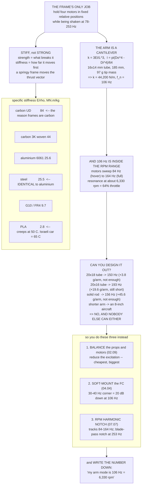

# 04.01 Frames: materials, sizes, topology

<!-- glance:start -->
<!-- generated by tools/build.py from curriculum/syllabus.yaml — edit the syllabus, not this block -->

| | |
|---|---|
| **Track** | Main path |
| **Difficulty** | Intermediate |
| **Time** | 1 h |
| **Hardware** | First flight (Hermon core) (stage 1) |
| **Software** | none |
| **Prerequisites** | [02.11 Selecting the motor–ESC–prop trio for Hermon (design exercise)](../02-motors-escs-props/02.11-hermon-powertrain-design.md) |
| **Skip if** | You can pick a frame for Hermon's mass and payload and say what wheelbase, arm stiffness and plate thickness each cost you. |

<!-- glance:end -->

## What you will learn

- What a frame is actually for — and why "hold the motors apart" is the whole job description
- **Materials**: carbon fibre, G10, aluminium and plastic compared by the number that matters
  (**specific stiffness**), and why carbon wins by a factor of three
- **Topology**: X, plus, H, deadcat and true-X, and what each one trades
- How to compute an **arm's first bending mode**, and the uncomfortable discovery that Hermon's
  sits inside its own rpm range
- Why that is normal, why it cannot be designed away at this scale, and what you do about it
  instead
- How to choose or specify a frame, and the five things to check before you buy one

## Why it matters

The frame is the only part of Hermon that does no work. It produces no thrust, consumes no power
and computes nothing. It exists to hold four motors in fixed positions relative to each other and
to a flight controller, and to keep doing so while being shaken at 253 Hz, dropped occasionally,
and left in a hot car.

That makes it easy to under-think. It is also **200 g of a 730 g dry mass** — 27 % of everything
that is not the battery — and it is the component that decides whether your vibration analysis in
[04.04](04.04-mounting-and-vibration.md) is a formality or a fight.

And it is the part that sets the propeller size, which sets the power, which sets the endurance.
[00.03](../00-orientation/00.03-hermon-the-build-vehicle.md) made that argument backwards — the
propeller chose the frame. This lesson is where you find out what the frame costs.

## Prerequisites

<!-- prereqs:start -->
## Prerequisites

You need these first:

- [02.11 Selecting the motor–ESC–prop trio for Hermon (design exercise)](../02-motors-escs-props/02.11-hermon-powertrain-design.md)

### Optional prerequisite links

None.

Check your readiness: `python course.py why 04.01`
<!-- prereqs:end -->

## Concept

### What the frame is for

Four requirements, in order of how often they are violated:

| Requirement | What happens if it fails |
|---|---|
| **Hold the motors in fixed relative positions** | Thrust vectors move; the controller fights an aircraft that is changing shape |
| **Be stiff enough that it does not resonate in the rpm range** | Vibration reaches the IMU, the estimator degrades ([06.06](../06-state-estimation/06.06-ekf-health-and-logs.md)) |
| **Survive a landing and a crash** | Obvious |
| **Be light** | 0.223 W per gram, every second of every flight |

**Notice that "be strong" is not on the list, and "be stiff" is.** They are different properties
and a frame can have one without the other. Strength is how much force it takes to break
something; stiffness is how much it deflects before it gets there. A frame that bends 3 mm under
load and springs back is perfectly strong and useless, because the motor is no longer where the
controller thinks it is.

### Materials, compared properly

The number that matters is **specific stiffness**: Young's modulus divided by density. It tells
you how much stiffness you get per unit of mass, which is exactly the trade an aircraft makes.

| Material | $E$ (GPa) | $\rho$ (kg/m³) | **$E/\rho$ (MN·m/kg)** | Notes |
|---|---|---|---|---|
| **Carbon fibre, unidirectional** | 135 | 1,600 | **84** | Along the fibres only |
| **Carbon fibre, 3K woven (quasi-isotropic)** | 70 | 1,600 | **44** | What frame plate actually is |
| Glass fibre / G10 / FR4 | 18 | 1,850 | 9.7 | Cheap, tough, heavy |
| Aluminium 6061-T6 | 69 | 2,700 | 25.6 | Machinable, dents rather than shatters |
| Steel | 200 | 7,850 | 25.5 | **Identical to aluminium** — see below |
| Nylon / PA12 (3D printed) | 1.7 | 1,010 | 1.7 | Tough, flexible, not stiff |
| PLA (3D printed) | 3.5 | 1,250 | 2.8 | Stiff for a plastic, brittle, creeps in heat |
| PETG | 2.1 | 1,270 | 1.7 | The compromise |

**Two things in that table are worth stopping on.**

**Steel and aluminium have the same specific stiffness**, to two significant figures, and this is
not a coincidence — it is true of almost all metals. Steel is three times stiffer and three times
denser. **For a stiffness-limited part there is no metal that beats another metal**, which is
why the interesting question was never "which metal" but "do we need a metal at all".

**Carbon beats everything by a factor of two to three**, and that is before you exploit its
anisotropy. A unidirectional carbon tube with the fibres running along the arm has 84 MN·m/kg in
the direction that matters, against aluminium's 25.6. That is the whole reason drone frames are
carbon.

**Where the others still belong:**

| Material | Use it for |
|---|---|
| G10/FR4 | Cheap first frames, non-structural plates, sacrificial arms on a training mule |
| Aluminium | Motor mounts, clamps, standoffs — small parts where machinability matters |
| PA12 / PETG | Feet, camera mounts, the payload pod ([17.06](../17-payloads-delivery/17.06-building-hermons-pod.md)), anything that should break first |
| PLA | Prototypes only. **It creeps at 50 °C**, which an Israeli car reaches in minutes |

> [!IMPORTANT]
> **The PLA warning is a real one and it is climate-specific.** PLA's glass transition is about
> 60 °C and it begins to soften and creep under load well below that. A parked car in Tel Aviv in
> August reaches 65 °C ([03.10](../03-power-system/03.10-lipo-in-israel.md)). A PLA motor mount
> that has spent an afternoon in a car is not the part you bolted on. Print structural parts in
> **PA12, PETG or ASA**, and keep PLA for things that are allowed to fail.

### Topology

The arrangement of the arms, and it is a bigger decision than it looks.

```text
      X                  PLUS (+)              H                DEADCAT
   1     2                  1              1---------2        1       2
    \   /                   |              |         |         \     /
      FC              4 -- FC -- 2         |   FC    |          --FC--
    /   \                   |              |         |         /     \
   4     3                  3              4---------3        4       3
                                                              (front arms
                                                               swept out)
```

| | Advantage | Cost | Used for |
|---|---|---|---|
| **X** | Symmetric in roll and pitch; all four motors contribute equally to both; most efficient use of a given wheelbase | Nothing significant | **Hermon**, and almost every modern multirotor |
| Plus (+) | Simpler mental model; the front motor is unambiguous | Only two motors contribute to each axis → half the control authority per axis | Historical; some agricultural machines |
| H | Long body for payload and battery; easy to build | Different roll and pitch inertia → the controller needs different gains per axis | Cinema rigs, long-body survey aircraft |
| Deadcat | Front arms swept out to keep propellers out of a forward-facing camera's view | Asymmetric inertia; the mixer needs per-motor geometry | FPV and camera aircraft |

**Hermon is X**, and the reasons are all in the second column: symmetric inertia means one set of
rate-loop gains works for both axes ([07.03](../07-control/07.03-rate-loops.md)), all four motors
contribute to every rotation ([01.02](../01-flight-physics/01.02-newton-torque-quad.md)), and the
wheelbase buys the largest propeller.

**The "true X" versus "stretched X" detail** matters for tuning: a true X has equal arm angles
(45° from each axis), so roll and pitch inertia are identical. A stretched X — longer in one
direction — does not, and ArduPilot's `FRAME_TYPE` has to know. Measure your frame rather than
assuming.

### The arm as a cantilever

An arm is a beam clamped at one end with a motor on the other. Two numbers describe it.

**Stiffness**, from beam theory:

$$k = \frac{3EI}{L^3}, \qquad I_{tube} = \frac{\pi(D_o^4 - D_i^4)}{64}$$

**First bending mode** — the frequency at which it resonates:

$$f_n = \frac{1}{2\pi}\sqrt{\frac{k}{m_{eff}}}, \qquad m_{eff} = m_{motor} + 0.24\,m_{arm}$$

Hermon's arm: a 16 × 14 mm carbon tube, 185 mm from the plate edge to the motor shaft, carrying
an 85 g motor and a 12 g propeller.

| | |
|---|---|
| Second moment of area $I$ | $1.33 \times 10^{-9}$ m⁴ |
| $E$ (woven carbon) | 70 GPa |
| $EI$ | 93.2 N·m² |
| Stiffness $k$ | **44,200 N/m** |
| Effective mass | 0.100 kg |
| **First bending mode $f_n$** | **≈ 106 Hz** |
| Static deflection under 3.56 N of hover thrust | 0.08 mm |

The deflection is negligible. The frequency is not.

### The uncomfortable discovery

Hermon's motors turn between **84 rev/s at hover and 164 rev/s at full throttle** — that is
**84 Hz to 164 Hz** of fundamental excitation from any imbalance, with the blade-pass harmonic
at three times that.

**The arm's first bending mode is 106 Hz. It is inside the range.**

That means there is an rpm — about **6,330**, or 64 % of full throttle — at which the motor's own
imbalance drives the arm at its resonant frequency. You cannot avoid passing through it, because it is between hover and full
throttle.

**Can you design it away?** Work out what it would take. To put $f_n$ above 1.3 × 164 = 213 Hz
you need $k$ to rise by $(213/106)^2 = 4.0\times$, and $k \propto EI/L^3$:

| Change | $k$ multiplier | New $f_n$ | Cost |
|---|---|---|---|
| 20 × 18 mm tube instead of 16 × 14 | 2.0 | **150 Hz** | +3.8 g per arm, still not enough |
| 20 × 16 mm tube (thicker wall) | 3.3 | **193 Hz** | +19.6 g per arm, still short |
| Solid 16 mm rod | 2.4 | **156 Hz** | +45.6 g per arm, still not enough |
| Shorten the arm 20 % (a 360 mm frame) | 1.95 | **148 Hz** | **An 8-inch propeller** — the whole design changes |
| A 50 g motor instead of 85 g | 1.5 (via mass) | **131 Hz** | Cannot spin a 10-inch propeller |
| 20 × 18 tube **and** 20 % shorter | 3.9 | **210 Hz** | Still 3 Hz short, and it is a 360 mm aircraft |

> [!IMPORTANT]
> **You cannot design the resonance out of a 450 mm 10-inch quad, and neither can anyone else.**
> Every aircraft in this class has an arm mode inside its rpm range. This is not a flaw in
> Hermon; it is a consequence of the geometry, and the industry's answer is not stiffer arms.

**What you do instead**, and all three are elsewhere in this course:

1. **Balance the propellers and motors** so there is little excitation at the fundamental in the
   first place ([02.09](../02-motors-escs-props/02.09-heat-vibration-noise.md)). This is the
   cheapest and most effective step by a wide margin.
2. **Soft-mount the flight controller** so that whatever the frame does, the IMU does not see it
   ([04.04](04.04-mounting-and-vibration.md)). A soft mount with a 30–40 Hz corner attenuates
   106 Hz by 20 dB.
3. **Notch it out in software.** The RPM-driven harmonic notch follows the motor frequency and
   removes it from the gyro signal before the controller sees it
   ([07.07](../07-control/07.07-filtering-and-methodic-tuning.md)). Hermon's blade-pass notch
   centre is **253 Hz at hover**; the fundamental notch tracks 78–164 Hz.

**And one thing you do at the bench:** sweep the motors slowly through the range with the
aircraft restrained and listen. A frame resonance is audible — a sudden change in the character
of the noise at one particular rpm — and it is worth knowing where yours is before you fly.

> [!TIP]
> **Ask your teacher:** "My arm's first bending mode is 106 Hz and my motors sweep 84 to 164 Hz.
> Walk me through exactly what happens at the 6,330 rpm crossing: what the gyro sees, what the
> rate controller does with it, and why the harmonic notch fixes it when a static low-pass filter
> would not."

### Choosing a frame

Five things to check, and only one of them is on the product page.

| Check | Hermon's requirement | How |
|---|---|---|
| **Propeller clearance** | 10 in with ≥ 30 mm between discs | Wheelbase / √2 − 254 mm. 450 mm gives 64 mm |
| **Arm construction** | Replaceable tube arms, clamped | A crash should cost one arm, not the frame |
| **Plate area for the stack** | 30 × 30 mm mount, room for the ESC beneath | Measure it; product photos lie about scale |
| **Battery mounting** | Flat, 150 × 50 mm, strap or tray, and it must be **movable** | The centre of mass is trimmed with the pack ([04.02](04.02-mass-and-center-of-mass.md)) |
| **Mass** | ≤ 200 g complete with hardware | The listing usually quotes the bare plates |

**The replaceable-arm point is the one people skip.** A crash that would write off a
one-piece frame costs one 16 mm tube — about ₪20 and ten minutes — on a clamped-arm frame. Over
the course of learning to fly, that is the difference between one frame and three.

**The mass point is the one listings lie about.** A frame advertised at "148 g" is the carbon
alone; with standoffs, screws, arm clamps, the battery tray and the feet it is 190–220 g. Budget
200 g and weigh what arrives ([04.02](04.02-mass-and-center-of-mass.md)).

## Technical explanation

### Level 1 — Intuition: a diving board with a motor on the end

Every arm is a diving board. Push down on the end and it bends; let go and it springs back and
oscillates at its own natural frequency. Make it thicker and it bends less and oscillates faster;
make it longer and it bends much more and oscillates much slower — **much**, because length
enters as the cube.

Now bolt a motor to the end and spin it. Any imbalance in the propeller shakes the end of the
diving board once per revolution. If the shaking rate happens to match the board's natural
frequency, small pushes add up and the end moves a lot. That is resonance, and on a 450 mm quad
it happens somewhere in the middle of the throttle range because the numbers land where they
land.

The fix is not a stiffer board. It is **shaking it less** (balance the propeller) and **not
listening to it** (soft-mount the flight controller, notch the frequency out).

### Level 2 — Practical: specifying or building a frame

If you are buying, the checklist above. If you are specifying or building:

| Parameter | Hermon | Rule of thumb |
|---|---|---|
| Wheelbase | 450 mm | Propeller diameter × √2 + 60 mm clearance |
| Arm tube | 16 × 14 mm carbon, 185 mm exposed | OD ≈ wheelbase / 28 |
| Plate thickness | 2 mm top, 2 mm bottom | 1.5 mm is enough for < 1 kg, 3 mm above 3 kg |
| Standoff height | 25–30 mm | Enough for the ESC, the wiring and airflow |
| Arm clamps | Aluminium, two bolts each | Not printed, and not one bolt |
| Total mass | ≤ 200 g | ~13 % of all-up mass is a good target |

**Bolt torque matters more than people expect.** Carbon plate crushes: an over-torqued M3 bolt
through a 2 mm plate delaminates it around the hole, and the joint that felt tight is now loose
after ten flights. [04.05](04.05-building-hermon.md) has the torque table; the headline is
**0.5 N·m for M3 into carbon, with a washer**, and thread-lock rather than force.

### Level 3 — Mathematics: the beam, and why length dominates

For a cantilever of length $L$ with a tip load:

$$\delta = \frac{FL^3}{3EI}, \qquad k = \frac{F}{\delta} = \frac{3EI}{L^3}$$

and for a hollow circular tube:

$$I = \frac{\pi}{64}\left(D_o^4 - D_i^4\right)$$

**Both of the important relationships are fourth or third powers**, which is why intuition fails:

| Change | Stiffness | First mode |
|---|---|---|
| +10 % tube outer diameter (bore unchanged) | **+112 %** | **+44 %** |
| +10 % wall thickness | +54 % | +23 % |
| +10 % arm length | **−25 %** ($1/L^3$) | −13 % |
| −10 % arm length | +37 % | +17 % |
| Carbon → aluminium | −1 % ($E$ is similar) | but **+69 % arm mass** |

**The tube's hollowness is the free lunch.** Compare a 16 mm solid rod with a 16 × 14 mm tube:
the tube has 41 % of the stiffness for **23 % of the mass**, so its stiffness-per-gram is
**1.8× better**. Material far from the neutral axis contributes as the fourth power of its
distance; material near the centre contributes almost nothing and weighs the same. That is why
every drone arm is a tube and no drone arm is a rod.

**The natural frequency**, with the standard cantilever effective-mass correction:

$$f_n = \frac{1}{2\pi}\sqrt{\frac{3EI}{L^3\left(m_{tip} + 0.24\,m_{beam}\right)}}$$

The 0.24 coefficient comes from equating the kinetic energy of the distributed beam mass to an
equivalent point mass at the tip. For Hermon the beam term is 3.3 g against a 97 g tip mass, so
it barely matters — **on a multirotor the arm's natural frequency is set by the motor, not by the
arm's own mass**, which is a useful thing to know when someone proposes saving weight by
thinning the tube.

**And the scaling law that explains the whole problem.** If you scale an aircraft geometrically
by a factor $s$, keeping materials and proportions:

$$f_n \propto \frac{1}{L}\sqrt{\frac{E}{\rho}} \times \frac{1}{s} \quad\text{while}\quad n_{motor} \propto \frac{1}{\sqrt{s}}$$

**The structural frequency falls faster than the rpm does.** Small aircraft have arm modes above
their rpm range; large ones have modes far below it; and somewhere in between there is a size at
which they cross. A 450 mm 10-inch quad is right at that crossing, which is exactly why this is
the lesson where it comes up.

### Level 4 — Implementation: Hermon's frame specification

| Item | Specification | Why |
|---|---|---|
| Type | 450 mm true-X quadcopter | Symmetric inertia, largest propeller |
| Arms | 16 × 14 mm carbon tube, clamped, replaceable | A crash costs an arm |
| Plates | 2 mm 3K carbon, top and bottom | Stiffness and a Faraday-ish shield for the stack |
| Standoffs | 30 mm aluminium, M3 | Room for the 4-in-1 ESC below the flight controller |
| Battery | Top plate, strap, **movable fore and aft** | Centre-of-mass trim |
| Feet | Printed PA12 or PETG, sacrificial | Should break before the frame does |
| Mass target | ≤ 200 g complete | 13 % of all-up mass |
| Bolt torque | 0.5 N·m M3 into carbon, with washers and thread-lock | Carbon crushes |
| **Known resonance** | **Arm first mode ≈ 106 Hz** | Documented, not designed out — see above |

**The last row belongs in your build documentation.** Writing down "my arm mode is about 106 Hz,
which is 6,360 rpm" means that when the aircraft does something odd at a particular throttle
setting six months from now, you have a hypothesis in ten seconds instead of an afternoon.

## Diagram



## Code

Save as `frame.py` and run `python frame.py`. Standard library only.

```python
"""04.01 - frame stiffness, arm resonance, and why it lands inside the rpm range.

Beam theory on a cantilever tube, plus the material comparison that explains
why every drone arm is carbon and every drone arm is hollow.
"""
import math

# Hermon's arm
E_CARBON = 70e9           # Pa, 3K woven quasi-isotropic
RHO_CARBON = 1600.0       # kg/m3
OD, ID = 0.016, 0.014     # m
L_ARM = 0.185             # m, plate edge to motor shaft
M_MOTOR = 0.085           # kg
M_PROP = 0.012            # kg
HOVER_N = 3.556           # N per motor
RPM_HOVER, RPM_FULL = 5060, 9836   # the motor's own sweep (02.06)
BLADES = 3

MATERIALS = [
    ("carbon fibre, unidirectional", 135e9, 1600),
    ("carbon fibre, 3K woven", 70e9, 1600),
    ("aluminium 6061-T6", 69e9, 2700),
    ("steel", 200e9, 7850),
    ("G10 / FR4", 18e9, 1850),
    ("PLA", 3.5e9, 1250),
    ("PETG", 2.1e9, 1270),
    ("PA12 (nylon)", 1.7e9, 1010),
]


def second_moment(od, id_):
    return math.pi * (od ** 4 - id_ ** 4) / 64


def tube_mass(od, id_, length, rho=RHO_CARBON):
    return math.pi / 4 * (od ** 2 - id_ ** 2) * length * rho


def stiffness(e, od, id_, length):
    return 3 * e * second_moment(od, id_) / length ** 3


def natural_hz(e, od, id_, length, m_tip, rho=RHO_CARBON):
    k = stiffness(e, od, id_, length)
    m_eff = m_tip + 0.24 * tube_mass(od, id_, length, rho)
    return math.sqrt(k / m_eff) / (2 * math.pi)


if __name__ == "__main__":
    print("Specific stiffness -- the number that decides the material:")
    print(f"  {'material':32s} {'E GPa':>7s} {'rho':>6s} {'E/rho MN.m/kg':>14s}")
    for name, e, rho in MATERIALS:
        print(f"  {name:32s} {e / 1e9:7.1f} {rho:6.0f} {e / rho / 1e6:13.1f}")
    print("  note steel and aluminium: identical to two figures.")
    print("  for a stiffness-limited part, no metal beats another metal.")

    print("\nHermon's arm, as a cantilever:")
    m_tip = M_MOTOR + M_PROP
    i = second_moment(OD, ID)
    k = stiffness(E_CARBON, OD, ID, L_ARM)
    m_arm = tube_mass(OD, ID, L_ARM)
    fn = natural_hz(E_CARBON, OD, ID, L_ARM, m_tip)
    for label, val in (("tube", f"{OD * 1000:.0f} x {ID * 1000:.0f} mm carbon"),
                       ("exposed length", f"{L_ARM * 1000:.0f} mm"),
                       ("second moment I", f"{i * 1e12:.0f} mm^4"),
                       ("EI", f"{E_CARBON * i:.1f} N.m^2"),
                       ("stiffness k", f"{k:,.0f} N/m"),
                       ("arm mass", f"{m_arm * 1000:.1f} g"),
                       ("tip mass (motor + prop)", f"{m_tip * 1000:.0f} g"),
                       ("deflection at hover thrust", f"{HOVER_N / k * 1000:.3f} mm"),
                       ("FIRST BENDING MODE", f"{fn:.0f} Hz")):
        print(f"  {label:28s} {val}")

    print("\nAnd where the motors actually live:")
    f_hover, f_full = RPM_HOVER / 60, RPM_FULL / 60
    print(f"  motor fundamental, hover to full  {f_hover:5.1f} - {f_full:5.1f} Hz")
    print(f"  blade pass ({BLADES} blades)            "
          f"{f_hover * BLADES:5.1f} - {f_full * BLADES:5.1f} Hz")
    if f_hover <= fn <= f_full:
        print(f"  => the arm mode at {fn:.0f} Hz IS INSIDE the range, at "
              f"{fn * 60:,.0f} rpm ({fn / f_full:.0%} throttle-ish)")
    else:
        print(f"  => the arm mode at {fn:.0f} Hz is outside the range")

    print("\nCan you design it out? (target: above 1.3 x full-throttle =",
          f"{1.3 * f_full:.0f} Hz)")
    print(f"  {'change':34s} {'f_n Hz':>7s} {'arm g':>7s} {'enough?':>8s}")
    options = [
        ("as built: 16 x 14 mm, 185 mm", OD, ID, L_ARM, m_tip),
        ("20 x 18 mm tube", 0.020, 0.018, L_ARM, m_tip),
        ("20 x 16 mm tube (thicker wall)", 0.020, 0.016, L_ARM, m_tip),
        ("solid 16 mm rod", 0.016, 0.0, L_ARM, m_tip),
        ("arm 20 % shorter (360 mm frame)", OD, ID, L_ARM * 0.8, m_tip),
        ("a 50 g motor instead of 85 g", OD, ID, L_ARM, 0.050 + M_PROP),
        ("20 x 18 AND 20 % shorter", 0.020, 0.018, L_ARM * 0.8, m_tip),
    ]
    for label, od, id_, ln, mt in options:
        f = natural_hz(E_CARBON, od, id_, ln, mt)
        g = tube_mass(od, id_, ln) * 1000
        print(f"  {label:34s} {f:7.0f} {g:6.1f}g {'YES' if f > 1.3 * f_full else 'no':>8s}")
    print("  every option that works changes the aircraft, not the arm.")

    print("\nWhy every arm is a TUBE and no arm is a ROD:")
    for label, od, id_ in (("solid 16 mm rod", 0.016, 0.0),
                           ("16 x 14 mm tube", 0.016, 0.014),
                           ("16 x 12 mm tube", 0.016, 0.012)):
        kk = stiffness(E_CARBON, od, id_, L_ARM)
        mm = tube_mass(od, id_, L_ARM)
        print(f"  {label:20s} k = {kk:8,.0f} N/m   {mm * 1000:5.1f} g   "
              f"{kk / (mm * 1000):6.0f} N/m per gram")
    print("  material far from the axis counts as the FOURTH power of distance;")
    print("  material at the centre weighs the same and does almost nothing.")

    print("\nSensitivity -- why intuition fails on beams:")
    base = natural_hz(E_CARBON, OD, ID, L_ARM, m_tip)
    for label, od, id_, ln in (("+10 % outer diameter", OD * 1.1, ID, L_ARM),
                               ("+10 % wall thickness", OD, ID - 0.0016, L_ARM),
                               ("+10 % arm length", OD, ID, L_ARM * 1.1),
                               ("-10 % arm length", OD, ID, L_ARM * 0.9)):
        kk = stiffness(E_CARBON, od, id_, ln)
        print(f"  {label:24s} k {kk / k - 1:+6.0%}   f_n "
              f"{natural_hz(E_CARBON, od, id_, ln, m_tip) / base - 1:+6.0%}")
```

Output:

```text
Specific stiffness -- the number that decides the material:
  material                           E GPa    rho  E/rho MN.m/kg
  carbon fibre, unidirectional       135.0   1600          84.4
  carbon fibre, 3K woven              70.0   1600          43.8
  aluminium 6061-T6                   69.0   2700          25.6
  steel                              200.0   7850          25.5
  G10 / FR4                           18.0   1850           9.7
  PLA                                  3.5   1250           2.8
  PETG                                 2.1   1270           1.7
  PA12 (nylon)                         1.7   1010           1.7
  note steel and aluminium: identical to two figures.
  for a stiffness-limited part, no metal beats another metal.

Hermon's arm, as a cantilever:
  tube                         16 x 14 mm carbon
  exposed length               185 mm
  second moment I              1331 mm^4
  EI                           93.2 N.m^2
  stiffness k                  44,153 N/m
  arm mass                     13.9 g
  tip mass (motor + prop)      97 g
  deflection at hover thrust   0.081 mm
  FIRST BENDING MODE           106 Hz

And where the motors actually live:
  motor fundamental, hover to full   84.3 - 163.9 Hz
  blade pass (3 blades)            253.0 - 491.8 Hz
  => the arm mode at 106 Hz IS INSIDE the range, at 6,334 rpm (64% throttle-ish)

Can you design it out? (target: above 1.3 x full-throttle = 213 Hz)
  change                              f_n Hz   arm g  enough?
  as built: 16 x 14 mm, 185 mm           106   13.9g       no
  20 x 18 mm tube                        150   17.7g       no
  20 x 16 mm tube (thicker wall)         193   33.5g       no
  solid 16 mm rod                        156   59.5g       no
  arm 20 % shorter (360 mm frame)        148   11.2g       no
  a 50 g motor instead of 85 g           131   13.9g       no
  20 x 18 AND 20 % shorter               210   14.1g       no
  every option that works changes the aircraft, not the arm.

Why every arm is a TUBE and no arm is a ROD:
  solid 16 mm rod      k =  106,697 N/m    59.5 g     1793 N/m per gram
  16 x 14 mm tube      k =   44,153 N/m    13.9 g     3165 N/m per gram
  16 x 12 mm tube      k =   72,938 N/m    26.0 g     2801 N/m per gram
  material far from the axis counts as the FOURTH power of distance;
  material at the centre weighs the same and does almost nothing.

Sensitivity -- why intuition fails on beams:
  +10 % outer diameter     k  +112%   f_n   +44%
  +10 % wall thickness     k   +54%   f_n   +23%
  +10 % arm length         k   -25%   f_n   -13%
  -10 % arm length         k   +37%   f_n   +17%
```

How to read it:

- **The specific-stiffness table settles the material question in one column.** Carbon is two to
  three times better than any metal, and steel and aluminium are indistinguishable — which tells
  you that "use steel, it's stiffer" is a misunderstanding of what stiffness costs.
- **The deflection is 0.08 mm and the frequency is 106 Hz.** Those two numbers are the whole
  lesson: the arm is plenty stiff *statically*, and that has almost nothing to do with whether it
  is stiff *enough*.
- **The resonance is inside the rpm range, at about 6,330 rpm**, which on Hermon is roughly 64 %
  throttle — squarely in normal flight.
- **Every option that fixes it changes the aircraft.** A 20 × 18 tube gets to 150 Hz; a 20 × 16
  reaches 193 Hz at +20 g per arm and is *still* short of the 213 Hz target. Shortening the arm enough means an 8-inch propeller,
  which means a different power, endurance and mission. **The honest engineering answer is to
  manage the resonance rather than eliminate it.**
- **The tube-versus-rod block is the clearest case of the fourth-power law you will meet.** The
  16 × 14 tube has 41 % of the solid rod's stiffness for **23 %** of its mass — **1.8×** the
  stiffness per gram — because the material you removed was doing almost nothing.
- **The sensitivity table is worth memorising.** +10 % outer diameter is +112 % stiffness;
  +10 % length is −25 %. **Arm length is the most expensive dimension on a multirotor**, and it is the one the
  propeller forces on you.

## Exercise

E1–E3 are Python and paper. E4 needs the frame in your hands.

> [!WARNING]
> E4 asks you to sweep the motors and listen for a resonance. **Propellers off, aircraft
> restrained, and nobody in the plane of rotation** — a resonance sweep is exactly the situation
> in which something comes loose. The full procedure is in
> [02.07](../02-motors-escs-props/02.07-static-thrust-test.md) and
> [SAFETY.md](../SAFETY.md).

### Exercise 04.01-E1 — Size an arm `[numerical]`

You are designing a 600 mm quad for 13-inch propellers, with 140 g motors. (a) The arm length.
(b) Using `frame.py`, find the tube size that puts the first bending mode above 1.3 × the
full-throttle frequency, assuming the motors turn at 7,500 rpm maximum. (c) The mass of four such
arms. (d) Is the answer practical, and if not, what do you do instead?

### Exercise 04.01-E2 — The material argument, checked `[analysis]`

A colleague proposes aluminium arms "because carbon is brittle". (a) Compute the tube outer
diameter an aluminium arm would need to match Hermon's stiffness at the same wall thickness.
(b) Its mass, against the carbon arm. (c) The resulting change in hover power and endurance for
four arms. (d) Then give the **strongest honest argument in favour of aluminium**, because there
is one.

### Exercise 04.01-E3 — Map your own resonance `[coding]`

Extend `frame.py` with `resonance_rpm(od, id, length, m_tip)` returning the motor rpm at which
the fundamental excites the arm mode, and the rpm for the blade-pass harmonic. For Hermon,
produce both. Then sweep arm lengths from 120 to 250 mm and plot or tabulate where each crossing
falls — and identify the arm length at which **both** crossings are outside the flight envelope,
if one exists.

### Exercise 04.01-E4 — Find it on the bench `[measurement]`

With the propellers **off** and the aircraft restrained: sweep the motors slowly from 20 % to
90 % throttle over about 30 seconds, listening and watching the arm tips. Note any throttle at
which the sound changes character or an arm visibly blurs. Convert that throttle to rpm and
compare against your computed mode. Then repeat with propellers fitted — **behind a barrier, at
three diameters, with safety glasses** — and note whether it moves. Report both, and explain why
they differ.

## Expected result

- **04.01-E1:** (a) $600/2 = 300$ mm centre-to-motor, so roughly **250 mm exposed**. (b) At
  7,500 rpm the full-throttle fundamental is 125 Hz, so the target is 163 Hz; with a 140 g tip
  mass and a 250 mm arm you need roughly a **25 × 23 mm tube** — and even that is marginal.
  (c) About 24 g each, **96 g for four**. (d) It is **not practical** for the same reason it was
  not on Hermon: the tube gets large and heavy before it gets stiff enough. The answer is the
  same three mitigations — balance, soft-mount, notch — which is why every large multirotor uses
  them and why the industry converged on RPM-driven notch filtering.
- **04.01-E2:** (a) Aluminium's $E$ is 69 GPa against carbon's 70, so at the same geometry the
  stiffness is essentially **identical** — no diameter increase is needed. (b) But the density
  is 2,700 against 1,600, so the arm weighs **1.69×** as much: 13.9 g against 8.2 g, or
  **+23 g for four arms**. (c) At 0.223 W per gram that is **+5 W** and about 0.5 minutes of
  endurance. (d) The honest argument for aluminium: **it dents instead of shattering**, it is
  machinable so you can make clamps and mounts locally, it does not produce conductive dust that
  shorts electronics, and it is far easier to inspect for damage — a bent aluminium arm is
  obvious and a delaminated carbon arm is not. On a training aircraft that will be crashed, that
  is a real argument, and 0.5 minutes is a cheap price.
- **04.01-E3:** Hermon's fundamental crossing is at about **6,330 rpm** and the blade-pass
  crossing (3 × rpm = 106 Hz) at about **2,110 rpm** — which is *below* hover, so you pass
  through it only on spin-up. Sweeping the arm length: **no length in the 120–250 mm range puts
  both crossings outside the envelope**, because shortening the arm raises the mode but a 10-inch
  propeller needs the length. That negative result is the point of the exercise.
- **04.01-E4:** Expect the audible resonance to appear **10–25 % below** the computed frequency.
  Beam theory assumes a perfectly rigid clamp; a real arm clamp has compliance, and the plate it
  is bolted to flexes too. With propellers fitted the mode drops further — typically another
  5–10 % — because the propeller adds tip mass and aerodynamic damping changes the response. A
  measured value 20 % below the calculation is a **correct calculation and a real clamp**, not an
  error.

## Troubleshooting

### Symptom: an arm has a hairline crack near the clamp

Retire the arm. Carbon does not crack gracefully — a visible crack means the fibres are broken
and the remaining strength is unpredictable. This is the failure mode the clamped-arm design
exists to make cheap. Check the clamp torque while you are there: over-torquing is the usual
cause.

### Symptom: the frame plate has gone soft or fuzzy around a bolt hole

Delamination from over-torque. The plate's layers have separated and the joint will loosen
repeatedly. Add a large washer to spread the load, reduce the torque to 0.5 N·m, and if the
damage is severe, replace the plate. **This is why carbon frames use washers and thread-lock
rather than force.**

### Symptom: the aircraft sounds different at one particular throttle setting

You have found your arm resonance, and knowing the rpm is genuinely useful. Confirm it with the
bench sweep, note it in your build documentation, and check that the harmonic notch is enabled
and tracking ([07.07](../07-control/07.07-filtering-and-methodic-tuning.md)). If it is audible
enough to notice, balance the propellers first
([02.09](../02-motors-escs-props/02.09-heat-vibration-noise.md)).

### Symptom: a 3D-printed part has deformed

If it is PLA and it has been in a car, in a shed, or in the sun, that is creep at temperature and
the part is no longer to dimension. Reprint it in PA12, PETG or ASA. If it is a structural part —
a motor mount, an arm clamp, a battery tray — **do not fly it in PLA in this climate at all**.

### Symptom: the frame arrived much heavier than advertised

Normal. Listings quote the bare carbon. Weigh every piece, update your mass budget
([04.02](04.02-mass-and-center-of-mass.md)), and recompute the endurance — at 0.223 W per gram a
50 g surprise is about a minute.

### Symptom: the propellers nearly touch

Measure the wheelbase you actually have rather than the one advertised, and compute
$\text{wheelbase}/\sqrt2 - D_{prop}$. Below 30 mm of clearance, adjacent discs interact
aerodynamically and the efficiency falls before they ever touch. If it is below 20 mm, fit
smaller propellers and accept the power penalty.

## Common mistakes

- **Confusing strength with stiffness.** A frame that bends and springs back is strong and
  useless.
- **Comparing materials by modulus alone.** Divide by density; that is what an aircraft pays.
- **Believing steel is a stiffness upgrade over aluminium.** Their specific stiffnesses are
  identical.
- **Printing structural parts in PLA.** It creeps at 50 °C and a parked car reaches 65 °C.
- **Over-torquing bolts into carbon.** It delaminates, and the joint loosens permanently.
- **Choosing a frame by wheelbase alone.** Check the stack area, the battery mount, the arm
  replaceability and the real mass.
- **Assuming a stiffer arm solves resonance.** It does not at this scale; balance, soft-mount and
  notch do.
- **Trusting the advertised frame mass.** It is the carbon only, and it is 20–30 % low.

## Knowledge check

1. What is the frame's job, and why is "stiff" the requirement rather than "strong"?
   <details><summary>Answer</summary>

   To hold four motors in fixed relative positions while being shaken at 78–253 Hz. **Strength**
   is the force needed to break it; **stiffness** is how far it moves before that. A frame that
   flexes and springs back is perfectly strong and useless, because the thrust vectors move and
   the controller is fighting an aircraft that changes shape.
   </details>

2. Why is carbon fibre the material, and why is steel not a stiffness upgrade over aluminium?
   <details><summary>Answer</summary>

   Because the figure of merit is **specific stiffness**, $E/\rho$. Woven carbon is 44 MN·m/kg
   against aluminium's 25.6 and G10's 9.7 — two to three times better, and unidirectional carbon
   is 84 along the fibres. Steel's $E/\rho$ is **25.5, identical to aluminium's 25.6**: it is
   three times stiffer *and* three times denser, so it buys nothing per gram. This is true of
   almost all metals.
   </details>

3. What is Hermon's arm's first bending mode, and why is that a problem?
   <details><summary>Answer</summary>

   About **106 Hz** for a 16 × 14 mm carbon tube, 185 mm long, carrying a 97 g motor and
   propeller. It is a problem because the motors sweep **84 Hz at hover to 164 Hz at full
   throttle**, so the arm resonates at about **6,330 rpm** — 64 % of full throttle, in the middle
   of normal flight, and unavoidable.
   </details>

4. Can that resonance be designed out, and what do you do instead?
   <details><summary>Answer</summary>

   **No, not at this scale.** Getting above 213 Hz needs a 4× stiffness increase: a 20 × 18 tube
   reaches only 150 Hz, a 20 × 16 reaches 193 Hz for +20 g per arm, a solid rod 156 Hz for
   +46 g, and shortening the arm
   enough means an 8-inch propeller and a different aircraft. Instead: **balance the propellers**
   (reduce the excitation), **soft-mount the flight controller** (do not let the IMU see it), and
   **notch it in software** with an RPM-tracking harmonic filter.
   </details>

5. Why is every drone arm a tube rather than a rod?
   <details><summary>Answer</summary>

   Because $I = \pi(D_o^4 - D_i^4)/64$: stiffness depends on the **fourth power** of the distance
   of material from the neutral axis, so material near the centre contributes almost nothing and
   weighs the same as material at the edge. Hermon's 16 × 14 mm tube has 41 % of a solid 16 mm
   rod's stiffness for **23 % of its mass** — 1.8× the stiffness per gram.
   </details>

6. Which dimension of an arm is the most expensive, and by how much?
   <details><summary>Answer</summary>

   **Length**, because stiffness goes as $1/L^3$: +10 % length is **−25 % stiffness**, against
   **+112 %** for +10 % of outer diameter and +54 % for +10 % of wall thickness. And length is the one
   dimension you do not control — the propeller diameter sets the wheelbase, which sets the arm.
   </details>

## Practical challenge

Write `projects/evidence/04.01-frame.md` containing:

1. The frame you chose, with the five checks from the Concept section answered: propeller
   clearance (computed), arm construction, stack area (measured), battery mount, and **measured**
   mass against the advertised one.
2. Your arm's dimensions — tube OD, ID, exposed length — and the tip mass you measured.
3. **Your computed first bending mode**, in Hz and in rpm, with the working.
4. Where that rpm sits in your throttle range, as a percentage.
5. Your bench-sweep result from E4: the rpm at which you actually heard or saw it, propellers off
   and on, and the ratio to your calculation.
6. The three mitigations, with the lesson where each is implemented, and a note of which you have
   done.

Keep this. When [06.06](../06-state-estimation/06.06-ekf-health-and-logs.md) shows you a vibration
plot with a peak in it, this document is how you recognise the peak.

## You can skip this if

You can state what a frame is for and why stiffness rather than strength is the requirement,
rank materials by specific stiffness and explain why steel and aluminium tie, choose between X,
plus, H and deadcat topologies with reasons, compute an arm's stiffness and first bending mode
from beam theory, explain why that mode lands inside a 450 mm quad's rpm range and why it cannot
be designed out, name the three mitigations, and list the five things to check before buying a
frame.

## Go deeper

- [00.03](../00-orientation/00.03-hermon-the-build-vehicle.md) (earlier): why 450 mm, and the
  propeller-clearance arithmetic.
- [02.09](../02-motors-escs-props/02.09-heat-vibration-noise.md) (earlier): the vibration sources
  this lesson's resonance responds to, and propeller balancing.
- [04.02](04.02-mass-and-center-of-mass.md) (next): what the frame costs in the mass budget.
- [04.04](04.04-mounting-and-vibration.md) (later): the soft mount, designed properly.
- [07.07](../07-control/07.07-filtering-and-methodic-tuning.md) (later): the RPM harmonic notch.
- Specific stiffness, with the material tables:
  https://en.wikipedia.org/wiki/Specific_modulus
- Euler–Bernoulli beam theory and cantilever natural frequencies:
  https://en.wikipedia.org/wiki/Euler%E2%80%93Bernoulli_beam_theory

## Progress checkpoint

Run `python course.py complete 04.01` when the frame document is written and your arm mode is
computed. Next: [04.02](04.02-mass-and-center-of-mass.md) — the frame is chosen; now weigh
everything, find out how far over 730 g you really are, and put the centre of mass where the
flight controller thinks it is.
