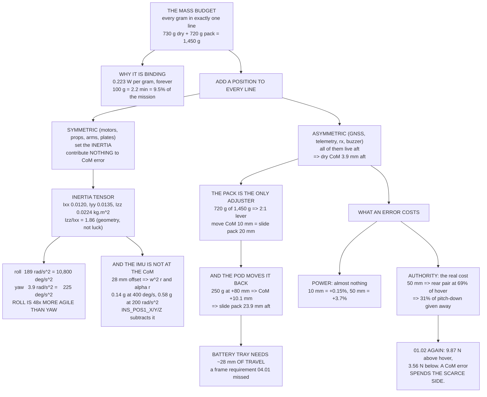

# 04.02 The mass budget and the centre of mass

<!-- glance:start -->
<!-- generated by tools/build.py from curriculum/syllabus.yaml — edit the syllabus, not this block -->

| | |
|---|---|
| **Track** | Main path |
| **Difficulty** | Intermediate |
| **Time** | 1 h 15 min |
| **Hardware** | First flight (Hermon core) (stage 1) |
| **Software** | python |
| **Prerequisites** | [04.01 Frames: materials, sizes, topology](04.01-frames.md)<br>[01.02 Newton & torque: why a quad needs four motors](../01-flight-physics/01.02-newton-torque-quad.md) |
| **Skip if** | You can build Hermon's mass budget to 730 g dry / 1.45 kg all-up and land the CoM within 5 mm of the geometric centre by component placement, on paper and on a scale. |

<!-- glance:end -->

## What you will learn

- How to write a **mass budget** that survives contact with a scale: every gram in exactly one
  line, every line in exactly one place
- Where Hermon's **730 g dry / 1.45 kg all-up** actually comes from, item by item
- What each gram you go over costs, in watts and in minutes, using the course's frozen exchange
  rate
- How to compute a **centre of mass** from a parts list, and where Hermon's really lands
- Why **the battery is the only adjuster you have**, and the 2 : 1 lever that governs it
- How much battery-tray travel a 250 g nose pod demands — a frame requirement
  [04.01](04.01-frames.md) never mentioned
- What a CoM error actually costs: almost no power, and a great deal of **control authority**
- The **inertia tensor** that falls out of the layout, and why roll is ~50× more agile than yaw
- Why the accelerometer is not at the centre of mass, and what ArduPilot does about it

## Why it matters

[03.05](../03-power-system/03.05-power-budget.md) showed that Hermon's hover power has no margin
in it. The margin lives in the mass. Every gram you add above budget is paid for at **0.223 W per
gram** for the whole flight, and 100 g costs you **2.2 minutes** — 9.5 % of the mission.

The mass budget is also the document that catches a design mistake while it is still free.
Revision 2 of [`references/hermon-numbers.md`](../references/hermon-numbers.md) exists because the
first version of this course froze an all-up mass of 1.20 kg. Four 3110 motors and a 6S 5000 pack
are 1,072 g on their own; 1.20 kg left 128 g for a frame, four propellers, an ESC, a flight
controller, two radios, a GNSS receiver, all the wiring and every screw. Nobody noticed until
somebody wrote the budget out line by line. **This lesson is that line-by-line.**

And the centre of mass is the difference between an aircraft that hovers with the sticks centred
and one that leans. A leaning quad is not merely untidy: it spends part of its thrust range on
holding itself level, and the range it spends is taken off the bottom, where — as
[01.02](../01-flight-physics/01.02-newton-torque-quad.md) established — a quadcopter has very
little to spare.

## Prerequisites

<!-- prereqs:start -->
## Prerequisites

You need these first:

- [04.01 Frames: materials, sizes, topology](04.01-frames.md)
- [01.02 Newton & torque: why a quad needs four motors](../01-flight-physics/01.02-newton-torque-quad.md)

### Optional prerequisite links

None.

Check your readiness: `python course.py why 04.02`
<!-- prereqs:end -->

## Concept

### A mass budget is an accounting document, not a wish

The rule that makes a mass budget useful is boring and absolute: **every gram appears in exactly
one line, and every line appears exactly once.** The failures are always double-counting or
no-counting, and both are invisible until the scale disagrees with you.

Hermon's motor is a good example. The datasheet says 80 g bare and about 88 g with its factory
leads. The budget line says **340 g for four motors — 85 g each**, because you trim roughly 3 g
of surplus lead off each motor before you solder it to the ESC. The 85 g is therefore *the motor
with the leads it actually flies with*, and the wiring-harness line contains **no motor wire at
all**. Put the leads in both lines and your budget is 20 g pessimistic; put them in neither and
you are 20 g light. [04.03](04.03-wiring-harness.md) does the harness properly and shows exactly
what the double count would cost you.

Write the rule down at the top of your own budget: *if you cannot say which single line a screw
belongs to, the budget is not finished.*

### Hermon's dry mass, item by item

| Line | Mass | What is in it |
|---|---:|---|
| Frame plates, clamps, standoffs | 124 g | Two 2 mm carbon plates, four arm clamps, the standoff set |
| Arms, 4 × 16 × 14 mm carbon tube | 56 g | 14 g each, 185 mm exposed ([04.01](04.01-frames.md)) |
| Motors, 4 × 3110 | 340 g | 85 g each: the motor **with its trimmed leads** |
| Propellers, 4 × 10 × 4.5 × 3 | 48 g | 12 g each, plus nuts |
| ESC, 4-in-1 65 A | 38 g | Board, heatsink, capacitor |
| Flight controller + mount | 18 g | FC, its soft-mount plate, the standoffs it sits on |
| GNSS + mast | 24 g | Receiver, the mast, the cable |
| ELRS receiver | 4 g | Receiver and antennas |
| SiK telemetry + antenna | 22 g | Radio, case, antenna, pigtail |
| Wiring harness | 34 g | Every wire *except* the motor leads, plus the XT60 |
| Hardware, feet, strap | 18 g | Screws, nylocs, thread lock, landing feet, battery strap |
| Buzzer, LEDs, switch | 4 g | The small stuff that always gets forgotten |
| **DRY MASS** | **730 g** | Everything except the pack |
| + Pack, 6S 5000 mAh | 720 g | [03.02](../03-power-system/03.02-pack-configuration.md) |
| **= ALL-UP, CLEAN** | **1,450 g** | The number every other lesson uses |
| + Delivery pod | 250 g | Module 17 |
| **= ALL-UP, WITH POD** | **1,700 g** | |
| MTOM | 2,000 g | 550 g of spare over clean |

Two proportions are worth carrying around. **The pack is 50 % of the all-up mass** — that is
normal for a multirotor and it is why [03.02](../03-power-system/03.02-pack-configuration.md)'s
pack-sizing argument mattered so much. And **the frame is 25 % of the dry mass**, which is why
[04.01](04.01-frames.md) spent a lesson on a part that does no work.

### The centre of mass, and the only lever you have

A centre of mass is a mass-weighted average of positions:

$$x_{CoM} = \frac{\sum m_i x_i}{\sum m_i}$$

Most of Hermon is symmetric — four motors, four propellers, four arms, the plates, the ESC, the
flight controller — and symmetric parts contribute nothing to the $x$ or $y$ sum. What moves the
centre of mass is the handful of parts that only exist once: the GNSS mast, the telemetry radio,
the receiver, the buzzer. All of them live at the back, because the front is where a payload
goes, and together they pull the dry airframe's CoM **3.9 mm aft**.

Add the pack, centred, and that becomes **1.9 mm aft** of the geometric centre — because the pack
is half the aircraft and it is sitting at zero, so it halves whatever error the airframe has.

> [!IMPORTANT]
> **The battery is the only adjuster you have, and it is a 2 : 1 lever.** Moving 720 g by 1 mm on
> a 1,450 g aircraft moves the CoM by 0.50 mm. So **to move the centre of mass 10 mm you slide the
> pack 20 mm.** Everything else on the aircraft is either symmetric, too light to matter, or
> bolted where it has to be. Design the battery tray with travel in it, and design it before you
> drill anything.

### The pod is a frame requirement in disguise

Module 17's delivery pod is 250 g, and it hangs under the nose at about $x = +80$ mm. On a
1,700 g aircraft that drags the CoM **10.1 mm forward**. Recovering it means sliding the pack
**23.9 mm aft**.

Add the 3.9 mm of forward trim the clean aircraft already wants and the battery tray must offer
roughly **28 mm of usable travel** — call it ±15 mm from centre, with hook-and-loop or a slotted
strap rather than two fixed screw holes. That is a specification for the frame you buy in
[04.01](04.01-frames.md), and it is the kind of requirement that only appears when you do the
arithmetic before the build rather than after it.

### What a CoM error actually costs

If the CoM sits a distance $d$ forward of the geometric centre, the weight vector makes a
nose-down moment $mgd$ about that centre. The mixer balances it by running the two front motors
harder and the two rear motors softer. On an X quad the pitch moment arm is
$l = r\cos 45° = 225 \times 0.707 = 159$ mm, and with four motors:

$$\delta T = \frac{m g d}{4l}$$

| CoM offset | Trim per motor | Front | Rear | Rear, as % of hover | Extra shaft power |
|---:|---:|---:|---:|---:|---:|
| 0 mm | 0.000 N | 3.556 N | 3.556 N | 100 % | 0.00 % |
| 5 mm | 0.112 N | 3.668 N | 3.444 N | 97 % | +0.04 % |
| 10 mm | 0.224 N | 3.780 N | 3.333 N | 94 % | +0.15 % |
| 20 mm | 0.447 N | 4.003 N | 3.109 N | 87 % | +0.59 % |
| 50 mm | 1.118 N | 4.674 N | 2.439 N | 69 % | +3.73 % |
| 100 mm | 2.235 N | 5.791 N | 1.321 N | 37 % | +15.24 % |

Read that table twice, because the obvious conclusion is the wrong one.

**The power cost is nearly nothing.** A 10 mm error costs 0.15 % of shaft power — about 0.2 W,
which is three seconds of endurance. Even 50 mm costs under 4 %. If power were the whole story
you could be sloppy.

**The authority cost is the real one.** The last column of the table that matters is the rear
motors' thrust as a fraction of hover, because that is how much room they have left to go *down*.
At a 50 mm offset the rear pair sits at 69 % of hover thrust, so you have given away 31 % of your
pitch-down authority before the pilot touches anything. At 100 mm the rear motors are at 37 % and
the aircraft is nearly out of pitch-down entirely — in a gust that wants a nose-up correction, it
has nothing left.

This is [01.02](../01-flight-physics/01.02-newton-torque-quad.md)'s finding again, from a
different direction: Hermon has 9.87 N of headroom above hover and only 3.56 N below it. **A CoM
error spends the scarce side.**

### The inertia that falls out of the layout

Once you have the mass and the positions you have the inertia for free, and the inertia is what
[07.03](../07-control/07.03-rate-loops.md) will tune against:

| | Value | |
|---|---:|---|
| $I_{xx}$ (roll) | 0.01199 kg·m² | |
| $I_{yy}$ (pitch) | 0.01350 kg·m² | 13 % higher — the GNSS and radio are aft lever arms |
| $I_{zz}$ (yaw) | 0.02236 kg·m² | $I_{zz}/I_{xx} = 1.86$, near the textbook 2 for an X quad |

The 2 : 1 ratio is geometry, not coincidence. For a point mass at radius $r$ on the diagonal,
$I_{zz} = mr^2$ but $I_{xx} = m(r\cos45°)^2 = mr^2/2$. Four motors on four arms give you exactly
that factor, and the battery and plates pull it slightly under 2.

Now feed it thrust. The roll moment available before a motor hits the floor is
$4 \times 3.556 \times 0.159 = 2.26$ N·m, so the roll acceleration is 189 rad/s² — **10,800 °/s²**.
Yaw is a different animal: yaw comes from the *reaction torque* of the motors, and at hover each
motor's shaft torque is only

$$Q = \frac{P_{shaft}}{2\pi n} = \frac{38.8}{2\pi \times 84.4} = 0.073 \text{ N·m}$$

A realistic ±30 % torque split gives 0.088 N·m of yaw moment and **3.9 rad/s² = 225 °/s²**.

> [!IMPORTANT]
> **Roll is about 48× more agile than yaw on Hermon.** Yaw is the weakest axis on every
> multirotor, by a factor of tens, because roll and pitch use thrust and yaw only gets the drag
> torque left over. That is why yaw is the axis that saturates first in wind, why
> [11.04](../11-first-flights/11.04-flying-in-wind.md)'s wind limit shows up as heading
> wander before it shows up as position error, and why an ESC or motor that is slightly slow
> shows up in yaw before anywhere else.

### The accelerometer is not at the centre of mass

The flight controller measures acceleration where the flight controller is. On Hermon it sits
28 mm from the centre of mass — almost all of it vertical, since the pack hangs 45 mm below the
plate and drags the CoM down with it.

A sensor offset $r$ from the CoM reads two extra accelerations that have nothing to do with the
aircraft translating: $\omega^2 r$ from rotating at a steady rate, and $\alpha r$ from angular
acceleration.

| Rotation | False acceleration | As a fraction of $g$ |
|---|---:|---:|
| 200 °/s sustained | 0.35 m/s² | 0.04 g |
| 400 °/s sustained | 1.38 m/s² | 0.14 g |
| 50 rad/s² flick | 1.42 m/s² | 0.14 g |
| 200 rad/s² (the maximum above) | 5.67 m/s² | 0.58 g |

In a gentle hover this is noise. In aggressive flight it is 0.1–0.6 g of acceleration that the
EKF in [06.04](../06-state-estimation/06.04-ekf-nonlinear.md) will happily integrate into a
velocity error. ArduPilot's `INS_POS1_X/Y/Z` parameters exist to subtract exactly this term —
you tell the estimator where the IMU is relative to the CoM and it does the algebra. **Mount the
flight controller close to the centre of mass and the correction is small whether you enter it or
not.**

> [!TIP]
> **Ask your teacher:** "My aircraft's CoM is 20 mm forward of centre and I can see the rear
> motors running 13 % below the front ones in the logs. Walk me through what the attitude
> controller's integrator is doing about that, why `MOT_THST_HOVER` still converges to a sensible
> number, and what specifically breaks first if I let the offset grow to 60 mm."

### Mounting order: decide before you drill

The build sequence in [04.05](04.05-building-hermon.md) is not arbitrary, and the reason is mass.
Work outwards from the things you cannot move:

1. **Fixed by geometry:** motors, props, arms, plates. These are symmetric; they set the inertia
   and contribute nothing to the CoM error.
2. **Fixed by function:** the ESC must be close to the pack (inrush, 03.04), the flight controller
   must be close to the CoM (this lesson), the GNSS must be away from the power wiring and high
   enough to see sky ([04.03](04.03-wiring-harness.md) and
   [05.04](../05-sensors/05.04-gnss-receiver.md)).
3. **Free, but heavy:** the pack. This is your only adjuster. Give it travel.
4. **Free, but light:** receiver, telemetry radio, buzzer, LEDs. Use them to trim the last few
   millimetres and to keep antennas away from each other.

And weigh every part on a 0.1 g scale **before** you mount it. Catalogue masses are optimistic by
5–15 %, and the budget is only a prediction until you have measured it. If you land 80 g over,
that is 17.8 W and **1.8 minutes** — recoverable if you find it during the build, not recoverable
once the wires are soldered.

## Technical explanation

### Level 1 — Intuition: balance it on a finger

Take the finished aircraft with the pack strapped in and the props off, and balance it front-to-
back on a ruler edge. Where it balances is the centre of mass in $x$. Turn it 90° and do it again
for $y$. If it balances over the flight controller, you are done. If it balances 2 cm behind the
flight controller, slide the pack 4 cm forward — the 2 : 1 lever.

That is the whole technique. Everything below is how to predict the answer before you own the
parts, and how to measure it to a millimetre instead of a centimetre.

### Level 2 — Practical: measuring it properly

The ruler-edge method is good to about 5 mm and it requires you to tilt a loaded aircraft, which
is how batteries end up on the floor. The two-scale method is better and safer.

Rest the front arms on one kitchen scale and the rear arms on another, aircraft level, and read
both. With the supports a distance $L$ apart, the CoM sits at

$$x = L \cdot \frac{W_{front}}{W_{front} + W_{rear}}$$

measured from the rear support. Two 1 g scales and a 318 mm support spacing give you the CoM to
about 1 mm, the aircraft never tilts, and you get the total mass as a free check on your budget.

For $z$ — which you need for the IMU offset and for understanding forward-flight pitch coupling —
hang the aircraft from one arm and photograph the vertical; repeat from a different arm; the
intersection of the two verticals in the photographs is the CoM.

### Level 3 — Mathematics: inertia from a parts list

The parallel-axis theorem is what lets you build an inertia tensor from a list of components
without any calculus:

$$I_{xx} = \sum_i \left[ I_{xx,i}^{(local)} + m_i (\Delta y_i^2 + \Delta z_i^2) \right]$$

where $\Delta$ is measured from the CoM. For a motor, a propeller or a receiver, the local term
is negligible — they are small compared with their distance from the centre — so a point-mass sum
is accurate to a few per cent. For the battery, the plates, the ESC and the FC, the local term
matters because they sit *at* the centre, and a rectangular box of dimensions $a \times b \times c$
contributes $m(b^2+c^2)/12$ about $x$.

The code below does both terms. It matters: dropping the battery's own inertia term understates
$I_{zz}$ by about 6 %, which is enough to send you chasing a yaw tune that was never wrong.

### Level 4 — Implementation: what you hand to the build

The output of this lesson is three things, and [04.05](04.05-building-hermon.md) consumes all
three:

1. **A budget table** with a measured column next to the predicted one, so the build closes
   against a number.
2. **A layout drawing** with every non-symmetric part's station in millimetres, and the battery
   tray's travel marked on it.
3. **A CoM target** and the pack position that achieves it — clean *and* with the pod, because
   they are 28 mm apart and you will fly both.

## Diagram



## Code

Save as `massbudget.py` and run `python massbudget.py`. Standard library only.

```python
"""04.02 - the mass budget, the centre of mass, and the inertia that follows.

Every gram in exactly one line; every line in exactly one place.
"""
import math

G = 9.81
R_ARM = 0.225                 # m, centre to motor shaft
L_CTRL = R_ARM * math.cos(math.radians(45))   # roll/pitch arm on an X quad
MASS_CLEAN = 1.450            # kg
HOVER_N = MASS_CLEAN * G / 4  # N per motor
P_SHAFT_HOVER = 155.0         # W total at the shafts (03.05)
RPM_HOVER = 5060
W_PER_G = 0.223               # W of extra hover power per extra gram
MIN_PER_G = 0.0223            # minutes of endurance lost per extra gram

# name, grams, x fwd, y right, z up (m), own box dims (m) or None.
# x = y = z = 0 is the geometric centre of the top plate.
BUILD = [
    ("frame plates, clamps, standoffs", 124, 0.000, 0.0, 0.000, (0.10, 0.10, 0.030)),
    ("arms, 4 x 16x14 carbon tube",      56, 0.000, 0.0, 0.005, None),
    ("motors, 4 x 3110",                340, 0.000, 0.0, 0.015, None),
    ("propellers, 4 x 10x4.5x3",         48, 0.000, 0.0, 0.035, None),
    ("ESC, 4-in-1 65 A",                 38, 0.000, 0.0, -0.008, (0.05, 0.05, 0.010)),
    ("flight controller + mount",        18, 0.000, 0.0, 0.012, (0.04, 0.04, 0.015)),
    ("GNSS + mast",                      24, -0.060, 0.0, 0.110, (0.04, 0.04, 0.010)),
    ("ELRS receiver",                     4, -0.030, 0.0, 0.010, None),
    ("SiK telemetry + antenna",          22, -0.050, 0.0, -0.005, None),
    ("wiring harness",                   34, 0.000, 0.0, -0.010, None),
    ("hardware, feet, strap",            18, 0.000, 0.0, -0.020, None),
    ("buzzer, LEDs, switch",              4, -0.040, 0.0, -0.010, None),
]
ON_THE_ARMS = {"arms, 4 x 16x14 carbon tube", "motors, 4 x 3110",
               "propellers, 4 x 10x4.5x3"}
PACK = ("battery, 6S 5000 mAh", 720, 0.000, 0.0, -0.045, (0.145, 0.047, 0.025))
POD = ("delivery pod + payload", 250, 0.080, 0.0, -0.055, (0.09, 0.07, 0.07))
Z_DISC = 0.035                # the propeller plane


def spread(item):
    """Return the point masses an item really is: 4-fold items sit on the arms."""
    name, g, x, y, z, box = item
    if name not in ON_THE_ARMS:
        return [(g, x, y, z, box)]
    is_arm = name.startswith("arms")
    rad = R_ARM / 2 if is_arm else R_ARM
    out = []
    for ang in (45, 135, 225, 315):
        a = math.radians(ang)
        out.append((g / 4, rad * math.cos(a), rad * math.sin(a), z,
                    (R_ARM, 0.016, 0.016) if is_arm else None))
    return out


def com(items):
    """Centre of mass (x, y, z in m) and total mass in g."""
    pts = [p for it in items for p in spread(it)]
    m = sum(p[0] for p in pts)
    return (sum(p[0] * p[1] for p in pts) / m,
            sum(p[0] * p[2] for p in pts) / m,
            sum(p[0] * p[3] for p in pts) / m, m)


def inertia(items):
    """Principal moments about the CoM, kg.m^2, by the parallel-axis theorem."""
    cx, cy, cz, _ = com(items)
    ixx = iyy = izz = 0.0
    for it in items:
        for g, x, y, z, box in spread(it):
            m = g / 1000
            dx, dy, dz = x - cx, y - cy, z - cz
            ixx += m * (dy * dy + dz * dz)
            iyy += m * (dx * dx + dz * dz)
            izz += m * (dx * dx + dy * dy)
            if box:                      # the part's own inertia matters at the centre
                a, b, c = box
                ixx += m * (b * b + c * c) / 12
                iyy += m * (a * a + c * c) / 12
                izz += m * (a * a + b * b) / 12
    return ixx, iyy, izz


def shaft_power(thrusts):
    """Total shaft power for four thrusts, using P proportional to T^1.5."""
    return sum(P_SHAFT_HOVER / 4 * (t / HOVER_N) ** 1.5 for t in thrusts)


def trim_for_offset(d, mass_kg):
    """Front and rear thrust when the CoM sits d metres forward of centre."""
    hover = mass_kg * G / 4
    delta = mass_kg * G * d / (4 * L_CTRL)
    return hover + delta, hover - delta, delta


def bar(title):
    print("\n" + "=" * 70)
    print(title)
    print("=" * 70)


if __name__ == "__main__":
    bar("1. THE DRY MASS BUDGET  (every gram in exactly one line)")
    dry = sum(g for _, g, *_ in BUILD)
    for name, g, *_ in BUILD:
        print(f"  {name:34s} {g:5d} g")
    print(f"  {'-' * 34} {'-' * 5}")
    for label, g in (("DRY MASS", dry),
                     ("+ pack, 6S 5000 mAh", PACK[1]),
                     ("= ALL-UP, CLEAN", dry + PACK[1]),
                     ("+ delivery pod", POD[1]),
                     ("= ALL-UP, WITH POD", dry + PACK[1] + POD[1]),
                     ("MTOM", 2000)):
        print(f"  {label:34s} {g:5d} g")
    print(f"  spare under MTOM, clean: {2000 - dry - PACK[1]} g")
    print(f"\n  pack is {PACK[1] / (dry + PACK[1]) * 100:.0f} % of all-up mass")
    print(f"  frame is {180 / dry * 100:.0f} % of dry mass  (plates 124 + arms 56)")

    print("\n  Landing over budget (catalogue masses lie by 5-15 %):")
    for over in (20, 50, 80, 120):
        print(f"    +{over:3d} g -> +{over * W_PER_G:4.1f} W"
              f" -> {-over * MIN_PER_G:5.2f} min"
              f" -> AUW {(dry + PACK[1] + over) / 1000:.2f} kg")

    bar("2. WHERE THE CENTRE OF MASS ACTUALLY LANDS")
    clean = BUILD + [PACK]
    cx, cy, cz, m = com(clean)
    dcx, dcy, dcz, _ = com(BUILD)
    print(f"  dry airframe        x {dcx * 1000:+7.1f} mm  y {dcy * 1000:+5.1f} mm"
          f"  z {dcz * 1000:+7.1f} mm")
    print(f"  clean, pack centred x {cx * 1000:+7.1f} mm  y {cy * 1000:+5.1f} mm"
          f"  z {cz * 1000:+7.1f} mm")
    print(f"  the propeller disc is at z = {Z_DISC * 1000:+.0f} mm, so the CoM hangs"
          f" {Z_DISC * 1000 - cz * 1000:.0f} mm below the thrust plane")

    print("\n  THE PACK IS THE ONLY REAL ADJUSTER:")
    print(f"    moving {PACK[1]} g by 1 mm moves {m:.0f} g by {PACK[1] / m:.2f} mm")
    print(f"    -> move the CoM 10 mm  =  slide the pack {10 * m / PACK[1]:.1f} mm")
    trim = -cx * m / PACK[1]
    print(f"    -> zero the {cx * 1000:+.1f} mm error = slide the pack"
          f" {trim * 1000:+.1f} mm")

    print("\n  AND THE POD MOVES IT AGAIN:")
    px, py, pz, pm = com(BUILD + [PACK, POD])
    print(f"    pod {POD[1]} g at x {POD[2] * 1000:+.0f} mm"
          f" -> CoM x {px * 1000:+.1f} mm on a {pm:.0f} g aircraft")
    shift = -px * pm / PACK[1]
    print(f"    -> slide the pack {shift * 1000:+.1f} mm to recover")
    print(f"    => BATTERY TRAY NEEDS >= "
          f"{abs(shift * 1000) + abs(trim * 1000):.0f} mm OF TRAVEL")

    bar("3. WHAT A CoM ERROR COSTS  (clean, 1.45 kg)")
    print(f"  {'offset':>7s} {'trim':>8s} {'front':>8s} {'rear':>8s}"
          f" {'rear/hover':>11s} {'extra power':>12s}")
    for mm in (0, 5, 10, 20, 50, 100):
        front, rear, delta = trim_for_offset(mm / 1000, m / 1000)
        p = shaft_power([front, front, rear, rear])
        print(f"  {mm:4d} mm {delta:7.3f}N {front:7.3f}N {rear:7.3f}N"
              f" {rear / HOVER_N * 100:10.0f} % {p / P_SHAFT_HOVER * 100 - 100:+11.2f} %")
    print("  rear/hover is the pitch-DOWN authority you have left.")
    print("  Power barely moves; authority falls off a cliff. The floor binds (01.02).")

    bar("4. THE INERTIA THAT FOLLOWS FROM THE LAYOUT")
    ixx, iyy, izz = inertia(clean)
    for lbl, v in (("Ixx (roll)", ixx), ("Iyy (pitch)", iyy), ("Izz (yaw)", izz)):
        print(f"  {lbl:14s} {v:.5f} kg.m^2")
    print(f"  Izz / Ixx = {izz / ixx:.2f}   (geometry gives 2 for four arms at 45 deg)")
    print(f"  Iyy / Ixx = {iyy / ixx:.2f}   (the GNSS and radio are aft lever arms)")

    q_hover = (P_SHAFT_HOVER / 4) / (2 * math.pi * RPM_HOVER / 60)
    m_roll = 4 * HOVER_N * L_CTRL       # floor-limited: the rear pair goes to zero
    a_roll = m_roll / ixx
    m_yaw = 4 * 0.30 * q_hover          # a realistic +-30 % torque split
    a_yaw = m_yaw / izz
    print(f"\n  roll moment (floor-limited)   {m_roll:6.2f} N.m")
    print(f"  roll acceleration             {a_roll:6.0f} rad/s^2"
          f" = {math.degrees(a_roll):,.0f} deg/s^2")
    print(f"  motor shaft torque at hover   {q_hover:6.3f} N.m")
    print(f"  yaw moment at +-30 % split    {m_yaw:6.3f} N.m")
    print(f"  yaw acceleration              {a_yaw:6.1f} rad/s^2"
          f" = {math.degrees(a_yaw):,.0f} deg/s^2")
    print(f"  ROLL IS {a_roll / a_yaw:,.0f}x MORE AGILE THAN YAW.")

    bar("5. THE ACCELEROMETER IS NOT AT THE CENTRE OF MASS")
    fc = [it for it in BUILD if it[0].startswith("flight")][0]
    rx, rz = fc[2] - cx, fc[4] - cz
    r = math.hypot(rx, rz)
    print(f"  FC is {rx * 1000:+.1f} mm x and {rz * 1000:+.1f} mm z from the CoM"
          f"  ->  r = {r * 1000:.1f} mm")
    print(f"  {'rotation':>22s} {'false accel':>14s} {'as g':>8s}")
    for lbl, kind, val in (("200 deg/s sustained", "w", math.radians(200)),
                           ("400 deg/s sustained", "w", math.radians(400)),
                           ("50 rad/s^2 flick", "a", 50.0),
                           ("200 rad/s^2 (the max)", "a", 200.0)):
        acc = val * val * r if kind == "w" else val * r
        print(f"  {lbl:>22s} {acc:11.2f} m/s^2 {acc / G:7.2f} g")
    print("  ArduPilot's INS_POS1_X/Y/Z subtract exactly this term.")
```

Output:

```text

======================================================================
1. THE DRY MASS BUDGET  (every gram in exactly one line)
======================================================================
  frame plates, clamps, standoffs      124 g
  arms, 4 x 16x14 carbon tube           56 g
  motors, 4 x 3110                     340 g
  propellers, 4 x 10x4.5x3              48 g
  ESC, 4-in-1 65 A                      38 g
  flight controller + mount             18 g
  GNSS + mast                           24 g
  ELRS receiver                          4 g
  SiK telemetry + antenna               22 g
  wiring harness                        34 g
  hardware, feet, strap                 18 g
  buzzer, LEDs, switch                   4 g
  ---------------------------------- -----
  DRY MASS                             730 g
  + pack, 6S 5000 mAh                  720 g
  = ALL-UP, CLEAN                     1450 g
  + delivery pod                       250 g
  = ALL-UP, WITH POD                  1700 g
  MTOM                                2000 g
  spare under MTOM, clean: 550 g

  pack is 50 % of all-up mass
  frame is 25 % of dry mass  (plates 124 + arms 56)

  Landing over budget (catalogue masses lie by 5-15 %):
    + 20 g -> + 4.5 W -> -0.45 min -> AUW 1.47 kg
    + 50 g -> +11.2 W -> -1.11 min -> AUW 1.50 kg
    + 80 g -> +17.8 W -> -1.78 min -> AUW 1.53 kg
    +120 g -> +26.8 W -> -2.68 min -> AUW 1.57 kg

======================================================================
2. WHERE THE CENTRE OF MASS ACTUALLY LANDS
======================================================================
  dry airframe        x    -3.9 mm  y  -0.0 mm  z   +12.1 mm
  clean, pack centred x    -1.9 mm  y  -0.0 mm  z   -16.3 mm
  the propeller disc is at z = +35 mm, so the CoM hangs 51 mm below the thrust plane

  THE PACK IS THE ONLY REAL ADJUSTER:
    moving 720 g by 1 mm moves 1450 g by 0.50 mm
    -> move the CoM 10 mm  =  slide the pack 20.1 mm
    -> zero the -1.9 mm error = slide the pack +3.9 mm

  AND THE POD MOVES IT AGAIN:
    pod 250 g at x +80 mm -> CoM x +10.1 mm on a 1700 g aircraft
    -> slide the pack -23.9 mm to recover
    => BATTERY TRAY NEEDS >= 28 mm OF TRAVEL

======================================================================
3. WHAT A CoM ERROR COSTS  (clean, 1.45 kg)
======================================================================
   offset     trim    front     rear  rear/hover  extra power
     0 mm   0.000N   3.556N   3.556N        100 %       +0.00 %
     5 mm   0.112N   3.668N   3.444N         97 %       +0.04 %
    10 mm   0.224N   3.780N   3.333N         94 %       +0.15 %
    20 mm   0.447N   4.003N   3.109N         87 %       +0.59 %
    50 mm   1.118N   4.674N   2.439N         69 %       +3.73 %
   100 mm   2.235N   5.791N   1.321N         37 %      +15.23 %
  rear/hover is the pitch-DOWN authority you have left.
  Power barely moves; authority falls off a cliff. The floor binds (01.02).

======================================================================
4. THE INERTIA THAT FOLLOWS FROM THE LAYOUT
======================================================================
  Ixx (roll)     0.01199 kg.m^2
  Iyy (pitch)    0.01350 kg.m^2
  Izz (yaw)      0.02236 kg.m^2
  Izz / Ixx = 1.86   (geometry gives 2 for four arms at 45 deg)
  Iyy / Ixx = 1.13   (the GNSS and radio are aft lever arms)

  roll moment (floor-limited)     2.26 N.m
  roll acceleration                189 rad/s^2 = 10,812 deg/s^2
  motor shaft torque at hover    0.073 N.m
  yaw moment at +-30 % split     0.088 N.m
  yaw acceleration                 3.9 rad/s^2 = 225 deg/s^2
  ROLL IS 48x MORE AGILE THAN YAW.

======================================================================
5. THE ACCELEROMETER IS NOT AT THE CENTRE OF MASS
======================================================================
  FC is +1.9 mm x and +28.3 mm z from the CoM  ->  r = 28.3 mm
                rotation    false accel     as g
     200 deg/s sustained        0.35 m/s^2    0.04 g
     400 deg/s sustained        1.38 m/s^2    0.14 g
        50 rad/s^2 flick        1.42 m/s^2    0.14 g
   200 rad/s^2 (the max)        5.67 m/s^2    0.58 g
  ArduPilot's INS_POS1_X/Y/Z subtract exactly this term.
```

## Exercise

> [!WARNING]
> Every measurement in this lesson is done **with the propellers off**. You will tilt, hang and
> rest the aircraft on its arms, and a 720 g pack that is not strapped down is the usual cause of
> a broken GNSS mast. Strap the pack before you lift the aircraft, never balance a loaded
> airframe over a hard floor, and never do any of this with a battery connected — a bench that
> wants both hands is a bench on which nobody should be able to arm.

### Exercise 04.02-E1 — Write your own budget `[numerical]`

Build the twelve-line budget for **your** parts, using catalogue masses, and total it.

1. State your dry mass and your all-up mass with the pack you actually bought.
2. If you are over 730 g, convert the excess into watts and minutes using 0.223 W/g and
   0.0223 min/g.
3. State which single line you would attack first to recover 20 g, and why that line and not
   another.

### Exercise 04.02-E2 — Find the CoM on paper, then on a scale `[analysis]`

1. Add an $x$ and a $z$ station, in millimetres from the plate centre, to every line of your
   budget. Compute $x_{CoM}$ and $z_{CoM}$ by hand or with the script.
2. Predict the pack position that zeroes $x_{CoM}$.
3. Once the aircraft exists ([04.05](04.05-building-hermon.md)), measure it with the two-scale
   method and compare. Report the error in millimetres.
4. If your prediction and measurement differ by more than 5 mm, find the line you got wrong.
   It is almost always a cable you did not weigh.

### Exercise 04.02-E3 — Your own layout, your own inertia `[coding]`

Replace `BUILD` in the script with your parts list and re-run it.

1. Report your $I_{xx}$, $I_{yy}$, $I_{zz}$ and the $I_{zz}/I_{xx}$ ratio.
2. Move your GNSS mast from $-60$ mm to $+60$ mm and report what happens to the CoM and to
   $I_{yy}$. Explain why one moves a lot and the other barely moves.
3. Add a 250 g payload at a station of your choosing and report the battery travel it demands.
   Find the station at which the required travel is zero, and explain what is special about it.

### Exercise 04.02-E4 — Measure the yaw inertia `[measurement]`

Hang the aircraft from two parallel strings of length $L$, attached symmetrically a distance $b$
either side of the CoM, and twist it gently about the vertical axis. It becomes a **bifilar
pendulum** with period

$$T = 2\pi\sqrt{\frac{I_{zz} L}{m g b^2}} \quad\Longrightarrow\quad I_{zz} = \frac{m g b^2 T^2}{4\pi^2 L}$$

Time twenty oscillations, divide by twenty, and compare with the script's prediction. Report both
numbers and the ratio. Anything inside ±15 % means your parts list is honest.

## Expected result

- **04.02-E1:** a budget that totals somewhere between 730 g and about 800 g. Landing 5–10 % over
  a catalogue budget is normal; landing 30 % over means you double-counted nothing and
  no-counted something heavy, usually the wiring.
- **04.02-E2:** a predicted CoM within a few millimetres of the geometric centre, and a measured
  one within 5 mm of your prediction. The usual discrepancy is the harness, which is never where
  you drew it.
- **04.02-E3:** $I_{zz}/I_{xx}$ near 1.9. Moving the GNSS 120 mm shifts the CoM by about 2 mm but
  changes $I_{yy}$ by under 1 % — mass near the centre barely counts for inertia, because inertia
  is a *squared*-distance sum. The payload station at which the battery travel is zero is
  directly under the CoM, because a mass added at the CoM does not move the CoM.
- **04.02-E4:** a measured $I_{zz}$ of roughly 0.020–0.026 kg·m². Bifilar measurements read high
  if the strings are not vertical and low if you twisted far enough to swing.

## Troubleshooting

### Symptom: the finished aircraft is 15 % heavier than the budget

Weigh each subassembly and compare it with its line. The three lines that are almost always
short are the **wiring harness** (solder, heatshrink, connectors and the length you actually
needed rather than the length you drew), **hardware** (every screw you replaced with a longer
one, plus thread lock and zip ties), and the **frame**, because carbon plate thickness tolerance
is real. See 04.02-E1 for what to do about it.

### Symptom: the aircraft drifts in one direction in a stable hover

Either the CoM is off or the trim is. Land, disarm, remove the props and do the two-scale
measurement. If the CoM is within 5 mm, the problem is not mass — it is accelerometer level
calibration or a wind bias, and [11.01](../11-first-flights/11.01-first-flight.md) is the lesson
to reread.

### Symptom: two motors are noticeably hotter than the other two after a hover

That is the trim table on this page, in the flesh. The hot pair is the pair the mixer is running
harder, so the CoM is displaced towards them. Slide the pack the other way by twice the offset
you think you have, and check again. Persistent asymmetry with a correct CoM points at a bent arm
or a twisted motor mount instead ([04.05](04.05-building-hermon.md)).

### Symptom: the battery strap is at the end of its travel and the CoM is still off

Your tray has less travel than this lesson's 28 mm. Move something light and aft-mounted forward
— the telemetry radio is the usual candidate at 22 g — or accept a CoM error and read the trim
table to see what it costs you. Do not shim a battery with anything that is not attached to the
airframe.

### Symptom: the EKF reports velocity innovations during aggressive manoeuvres only

Suspect the IMU position offset. Measure how far the flight controller sits from the CoM in all
three axes and set `INS_POS1_X/Y/Z`. If the offset is more than about 40 mm, consider moving the
flight controller instead; see [06.06](../06-state-estimation/06.06-ekf-health-and-logs.md) for
how to read the innovation traces.

### Symptom: yaw is sluggish and overshoots, but roll and pitch are crisp

That is not a tuning fault, it is the 48 : 1 authority ratio. Yaw has one-fiftieth of roll's
angular acceleration available because it is driven by drag torque rather than thrust. Expect it,
tune yaw gently, and if it is genuinely unusable check propeller pitch and direction before you
touch a gain ([07.03](../07-control/07.03-rate-loops.md)).

## Common mistakes

- **Counting the motor leads twice.** They live in the motor line, at their trimmed length, and
  nowhere else. Write that rule at the top of your budget before you total it.
- **Treating catalogue masses as measurements.** They are marketing figures with a tolerance
  nobody publishes. Weigh every part before it goes on.
- **Believing that a CoM error is mainly a power problem.** It costs 0.15 % of power at 10 mm and
  6 % of your pitch-down authority. The power number is a distraction.
- **Trimming the CoM with the light parts.** They cannot do it. A 22 g radio moved 50 mm shifts
  the CoM by 0.8 mm; the pack moved 50 mm shifts it by 25 mm.
- **Forgetting that the payload moves the CoM back again.** If you only ever balance the clean
  aircraft, the first pod flight is a surprise. Balance both and record both pack positions.
- **Mounting the flight controller wherever there is room.** The IMU offset term is real —
  0.14 g at 400 °/s on a 28 mm offset. Put it near the CoM and the correction stays small.
- **Assuming $I_{xx} = I_{yy}$ because the frame is symmetric.** The *frame* is symmetric; the
  aircraft is not. Hermon's pitch inertia is 13 % higher than its roll inertia purely because
  the GNSS and the telemetry radio live at the back.
- **Budgeting to the MTOM instead of to the design mass.** The 550 g between 1.45 kg and 2.0 kg
  is payload and margin, not permission to be sloppy — spend it and the endurance goes with it.

## Knowledge check

<details>
<summary>Hermon's motors are 88 g each with their factory leads, but the budget line says 340 g for four. Where did the other 12 g go, and why?</summary>

**Onto the bench floor.** You trim about 3 g of surplus lead off each motor before soldering it
to the ESC, so the 85 g in the budget is the motor with the leads it actually flies with. The
consequence for the rest of the budget is that the wiring-harness line contains no motor wire at
all — count it there as well and you are 20 g pessimistic, and you will spend an evening hunting
for mass that was never on the aircraft.
</details>

<details>
<summary>You need to move the centre of mass 15 mm forward. How far do you slide the 720 g pack on the 1,450 g clean aircraft, and why is it not 15 mm?</summary>

**About 30 mm.** Moving a mass $m_p$ by $\Delta$ moves the CoM of a total mass $M$ by
$m_p\Delta/M$ — here $720/1450 = 0.50$, so the pack moves twice as far as the CoM does. It is not
15 mm because the pack is only half the aircraft; the other half stays where it was and averages
the movement down.
</details>

<details>
<summary>A 50 mm CoM error costs under 4 % of shaft power. Why is it still a serious problem?</summary>

Because of **control authority**, not power. The mixer trims it by running the rear pair at 69 %
of hover thrust, which means 31 % of the pitch-down authority is spent before the pilot or the
controller asks for anything. [01.02](../01-flight-physics/01.02-newton-torque-quad.md) showed
Hermon has 9.87 N of headroom above hover and only 3.56 N below it — a CoM error spends the
scarce side, and the scarce side is the one you need in a gust.
</details>

<details>
<summary>Why is $I_{zz}$ almost exactly twice $I_{xx}$ on an X quad, and what makes Hermon's ratio 1.86 rather than 2.00?</summary>

For a point mass at radius $r$ on a 45° diagonal, $I_{zz} = mr^2$ while
$I_{xx} = m(r\cos 45°)^2 = mr^2/2$ — a factor of two from geometry alone, and the four motors
dominate both sums. The ratio falls slightly below 2 because the battery, the plates and the ESC
sit near the centre: they contribute their own box inertia to all three axes and add the
vertical-offset term $m\Delta z^2$ to $I_{xx}$ and $I_{yy}$ but not to $I_{zz}$.
</details>

<details>
<summary>Roll gets 10,800 °/s² and yaw gets 225 °/s². Where does that factor of 48 come from?</summary>

From the two axes being driven by completely different physics. Roll and pitch use **thrust**
differences across a 159 mm arm — newtons times a long lever. Yaw uses only the **reaction torque**
of the motors, which at hover is 0.073 N·m each; a realistic ±30 % split gives 0.088 N·m total,
against roll's 2.26 N·m. Yaw also works against the largest moment of inertia. It is why yaw is
the first axis to saturate in wind on every multirotor.
</details>

<details>
<summary>Your flight controller sits 28 mm from the CoM. What does it read during a 400 °/s yaw that has nothing to do with the aircraft translating, and what do you do about it?</summary>

A centripetal acceleration $\omega^2 r = (6.98)^2 \times 0.028 = 1.38$ m/s², about **0.14 g**,
pointing at the CoM. The EKF will integrate it into a velocity error unless it is told the sensor
is offset. Set ArduPilot's `INS_POS1_X/Y/Z` to the measured offset — or, better, mount the flight
controller closer to the centre of mass so the correction is small whether you enter it or not.
</details>

<details>
<summary>You add a 250 g payload directly beneath the centre of mass. How much battery travel does it demand, and why?</summary>

**None.** A mass added at the CoM does not move the CoM — the weighted average of positions is
unchanged when the new position equals the old average. It still costs you endurance
(250 g × 0.0223 = 5.6 minutes) and it still changes the inertia, but it demands no rebalancing.
That is why payload bays are designed under the centre plate whenever the mission allows it.
</details>

## Practical challenge

Write **`docs/mass-and-balance.md`** for your aircraft and keep it with the frame document from
[04.01](04.01-frames.md). It must contain:

1. The twelve-line budget with **two columns**: catalogue mass and measured mass. Leave the
   measured column blank until [04.05](04.05-building-hermon.md) fills it in.
2. A station for every non-symmetric part, in millimetres from the plate centre, in $x$ and $z$.
3. Your computed $x_{CoM}$ and $z_{CoM}$, clean and with the payload.
4. **Two marked pack positions** — clean and podded — and the tray travel between them.
5. Your computed inertia tensor and the roll-to-yaw agility ratio.
6. The measured IMU offset and the `INS_POS1_X/Y/Z` values you will set.
7. One sentence stating what you will attack first if the build lands over budget.

When [07.03](../07-control/07.03-rate-loops.md) asks you why your yaw gains want to be different
from your roll gains, this document is the answer.

## You can skip this if

You can write a mass budget in which every gram appears in exactly one line and justify the
motor-lead bookkeeping, reproduce Hermon's 730 g dry / 1.45 kg all-up figures item by item,
convert an overweight build into watts and minutes, compute a centre of mass from a parts list,
explain the 2 : 1 battery lever and size the tray travel a 250 g nose pod demands, argue why a
CoM error costs control authority rather than power, compute an inertia tensor by the
parallel-axis theorem and explain the $I_{zz}/I_{xx} \approx 2$ result, state why roll is roughly
fifty times more agile than yaw, and describe what an IMU mounted away from the centre of mass
reads during rotation.

## Go deeper

- [01.02](../01-flight-physics/01.02-newton-torque-quad.md) (earlier): the mixer, and why the
  thrust floor binds before the ceiling does.
- [03.05](../03-power-system/03.05-power-budget.md) (earlier): where 0.223 W per gram comes from.
- [04.01](04.01-frames.md) (earlier): the frame this budget weighs, and its 106 Hz arm mode.
- [04.03](04.03-wiring-harness.md) (next): the 34 g line, sized properly.
- [04.04](04.04-mounting-and-vibration.md) (later): the payload bay, designed so it does not move
  the CoM.
- [07.03](../07-control/07.03-rate-loops.md) (later): the inertia tensor, used.
- The parallel-axis theorem and inertia tensors:
  https://en.wikipedia.org/wiki/Parallel_axis_theorem
- ArduPilot's IMU position-offset parameters and what they correct:
  https://ardupilot.org/copter/docs/parameters.html#ins-pos1-x-imu-accelerometer-x-position

## Progress checkpoint

Run `python course.py complete 04.02` when `docs/mass-and-balance.md` exists and your predicted
CoM is written down. Next: [04.03](04.03-wiring-harness.md) — the 34 g harness line is the one
you are most likely to have underestimated, and it is also the one carrying 57 A.
