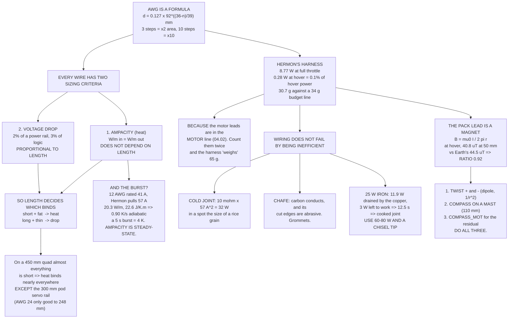

# 04.03 The wiring harness: gauge, length, connectors, routing

<!-- glance:start -->
<!-- generated by tools/build.py from curriculum/syllabus.yaml — edit the syllabus, not this block -->

| | |
|---|---|
| **Track** | Main path |
| **Difficulty** | Intermediate |
| **Time** | 1 h 30 min |
| **Hardware** | First flight (Hermon core) (stage 1) |
| **Software** | none |
| **Prerequisites** | [03.04 Power distribution: PDB, BEC, UBEC, fuses](../03-power-system/03.04-power-distribution.md)<br>[04.02 The mass budget and the centre of mass](04.02-mass-and-center-of-mass.md) |
| **Optional prerequisites** | [FEL.04 Brushless motors from zero](../optional-foundations/drone-electronics-power/FEL.04-bldc-from-zero.md) |
| **Skip if** | You can size every wire on Hermon from its current and length, and solder an XT60 that survives a pull test. |

<!-- glance:end -->

## What you will learn

- What **AWG** actually is — a formula, not a lookup table — and the three-steps-is-double rule
- The **two criteria** that size a wire, heat and voltage drop, and how **length** decides which
  one binds
- Why an ampacity rating is a steady-state number, and why Hermon's 57 A burst through 12 AWG is
  fine
- Every segment of Hermon's harness, with its drop, its loss and its mass
- Why the harness weighs **30.7 g against a 34 g budget line** — and what counting the motor
  leads twice would have done to that number
- Connectors: XT60, EC5 and why contact resistance is not a rounding error
- Why a 25 W iron cannot solder 12 AWG, derived rather than asserted
- **The pack lead is a magnet**: at hover its field equals the Earth's at 50 mm, which is the
  whole reason the compass lives on a mast
- Routing, strain relief and chafe — the failures that kill aircraft that were wired correctly

## Why it matters

Wiring is where a correct design becomes an incorrect aircraft. Everything in modules 02 and 03
assumed the electrons get from the pack to the motors without incident; this lesson is the
"without incident".

Three things go wrong, and they go wrong in increasing order of seriousness.

**Undersized wire wastes power.** This is the one everybody worries about and it is the least
important: Hermon's entire harness loses **0.28 W at hover**, one tenth of one per cent.

**A bad joint becomes a fire.** A cold solder joint on the pack lead is a resistor in series with
57 A. Ten milliohms — a joint that looks fine — is 32 W in a spot the size of a grain of rice.
[03.08](../03-power-system/03.08-battery-safety.md) explained what happens next.

**Chafed insulation becomes a crash.** A 12 AWG positive lead rubbing on a carbon arm is two
conductive surfaces and a few hundred flight-minutes. Carbon fibre conducts.

And there is a fourth, quieter one: the pack lead is a **current-carrying conductor next to a
magnetometer**. At hover it produces a field comparable to the Earth's at 50 mm. Get the routing
wrong and your compass is a current sensor.

## Prerequisites

<!-- prereqs:start -->
## Prerequisites

You need these first:

- [03.04 Power distribution: PDB, BEC, UBEC, fuses](../03-power-system/03.04-power-distribution.md)
- [04.02 The mass budget and the centre of mass](04.02-mass-and-center-of-mass.md)

### Optional prerequisite links

New to any of these? Take the foundation lesson first; skip it if you already know it.

- [FEL.04 Brushless motors from zero](../optional-foundations/drone-electronics-power/FEL.04-bldc-from-zero.md)

Check your readiness: `python course.py why 04.03`
<!-- prereqs:end -->

## Concept

### AWG is a formula

American Wire Gauge looks like an arbitrary list of numbers. It is not — it is a geometric
sequence, defined so that AWG 36 is 0.005 in and AWG 0000 is 0.46 in, with 39 steps between them:

$$d_{mm} = 0.127 \times 92^{(36-n)/39}$$

Two consequences fall straight out and they are the only two you need to memorise:

- **Three AWG steps double the area** (and halve the resistance). 12 AWG is twice the copper of
  15 AWG, which is twice 18.
- **Ten AWG steps are a factor of ten in area.** 12 AWG has ten times the copper of 22 AWG.

Note the direction: **bigger number, thinner wire.** It counts the drawing dies the wire was
pulled through, so a high gauge has been through more of them.

| AWG | Ø mm | mm² | mΩ/m @20 °C | mΩ/m @70 °C | A (free air) | g/m |
|---:|---:|---:|---:|---:|---:|---:|
| 8 | 3.26 | 8.366 | 2.06 | 2.47 | 75 | 91.0 |
| 10 | 2.59 | 5.261 | 3.28 | 3.92 | 55 | 59.0 |
| **12** | **2.05** | **3.309** | **5.21** | **6.23** | **41** | **38.2** |
| 14 | 1.63 | 2.081 | 8.28 | 9.91 | 32 | 24.8 |
| **16** | **1.29** | **1.309** | **13.17** | **15.76** | **22** | **16.0** |
| 18 | 1.02 | 0.823 | 20.95 | 25.06 | 16 | 10.2 |
| 20 | 0.81 | 0.518 | 33.31 | 39.85 | 11 | 6.8 |
| **22** | **0.64** | **0.326** | **52.96** | **63.37** | **7** | **4.5** |
| 24 | 0.51 | 0.205 | 84.21 | 100.76 | 3.5 | 3.0 |
| **26** | **0.40** | **0.129** | **133.90** | **160.21** | **2.2** | **2.0** |
| 28 | 0.32 | 0.081 | 212.90 | 254.74 | 1.4 | 1.4 |

The bolded rows are the four gauges Hermon actually uses. Note the two columns at 20 °C and
70 °C: **copper is 20 % more resistive at 70 °C**, and a wire carrying 57 A inside a hot airframe
in an Israeli summer is not at 20 °C. Every calculation in this lesson uses the hot number.

### Two criteria, and length decides between them

A wire is big enough when it satisfies **both** of:

1. **Ampacity** — it does not get hot enough to damage its own insulation or anything touching
   it. Silicone is good to about 200 °C; PVC gives up at 80 °C, which is one of several reasons
   nobody uses PVC on an aircraft.
2. **Voltage drop** — the load still gets the voltage it needs. Conventionally 2 % of a power
   rail and about 3 % of a logic rail.

Here is the part people get wrong. **Ampacity does not depend on length.** A wire dissipates
watts per metre and sheds watts per metre; make it longer and both scale together. **Voltage drop
is directly proportional to length.** So which criterion binds is decided almost entirely by how
long the run is:

| Rail | Continuous A | Length | Min by heat | Min by drop | Use | Binds |
|---|---:|---:|---:|---:|---:|---|
| Pack trunk | 25.0 | 0.12 m | 14 | 22 | **14** | heat |
| Motor phase | 6.0 | 0.18 m | 22 | 28 | **22** | heat |
| 5 V to FC | 1.5 | 0.08 m | 26 | 28 | **26** | heat |
| 5 V to GNSS | 0.10 | 0.22 m | 28 | 28 | **28** | tie |
| 5 V to pod servo | 3.0 | 0.30 m | 24 | 22 | **22** | drop |
| 5 V LED loom | 2.0 | 0.45 m | 26 | 22 | **22** | drop |

And the same thing expressed as the length at which each rail crosses over:

| Rail | The heat-sized gauge stays inside the drop budget to |
|---|---:|
| Pack trunk (AWG 14) | 896 mm |
| Motor phase (AWG 22) | 1,168 mm |
| 5 V to FC (AWG 26) | 312 mm |
| 5 V to GNSS (AWG 28) | 2,944 mm |
| 5 V to pod servo (AWG 24) | **248 mm** — and the run is 300 mm |
| 5 V LED loom (AWG 26) | **234 mm** — and the run is 450 mm |

> [!IMPORTANT]
> **Short and fat: heat binds. Long and thin: drop binds.** On a 450 mm quad almost every run is
> short, so almost everything is ampacity-limited — which is why "just use the gauge on the
> ampacity chart" usually works on a small drone and stops working the moment you run a servo
> rail out to a payload pod or a light bar to the arm tips.

### The table gives minimums; the build rounds up

The table says the pack trunk needs AWG 14 and Hermon uses **AWG 12**. That is deliberate and it
is not superstition:

- **Mechanical margin.** The trunk is the wire that gets yanked every time you change a battery.
  Two gauges of extra copper is two gauges of extra tensile strength.
- **It is what you can buy.** XT60 pigtails come with 12 AWG tails, and splicing 14 to 12 adds a
  joint for no benefit.
- **Burst headroom.** See below.

Round up on the trunk. Do not round up on the signal looms — 26 AWG silicone is already stronger
than the connector it terminates in, and every gram of surplus wire is 0.223 W forever
([04.02](04.02-mass-and-center-of-mass.md)).

### The burst problem, and why it is not a problem

12 AWG is rated 41 A and Hermon pulls **57 A at full throttle**. That looks like a violation.

It is not, because **an ampacity rating is a steady-state number and a wire has thermal mass.**
Work it out: 12 AWG at 57 A and 70 °C dissipates 20.3 W per metre, and a metre of it (copper plus
silicone) has a heat capacity of 22.6 J/K. With *no cooling at all* it heats at **0.90 K/s**.

| Wire | W/m at 57 A | J/K per m | Adiabatic rise | 5 s burst | 30 s burst |
|---|---:|---:|---:|---:|---:|
| AWG 12 | 20.3 | 22.6 | 0.90 K/s | 4 K | 27 K |
| AWG 14 | 32.2 | 15.2 | 2.12 K/s | 11 K | 64 K |

A five-second full-throttle burst warms the 12 AWG trunk by four degrees, and that is the
worst case — real wire also convects and conducts into the connectors. Even AWG 14 survives the
burst; it is the thirty-second case where the margin disappears.

[02.11](../02-motors-escs-props/02.11-hermon-powertrain-design.md) already told you that
**Hermon's full throttle is a burst condition, not a cruise**. Size the trunk on the continuous
current — roughly 25 A in energetic flight — and check the burst against thermal mass. Size it on
the burst and you carry copper you never needed.

### Hermon's harness, electrically

| Segment | AWG | Length | Current | Drop | Loss |
|---|---:|---:|---:|---:|---:|
| Pack lead, + and − | 12 | 0.120 m | 57.0 A | 85.3 mV | 4.86 W |
| Motor leads, 4 × 3 phases | 16 | 0.180 m | 14.1 A | 40.0 mV | 2.26 W |
| ESC signal loom | 26 | 0.150 m | 0.05 A | 1.2 mV | 0.00 W |
| FC to GNSS | 26 | 0.220 m | 0.10 A | 3.5 mV | 0.00 W |
| FC to SiK radio | 26 | 0.150 m | 0.15 A | 3.6 mV | 0.00 W |
| FC to receiver | 26 | 0.120 m | 0.08 A | 1.5 mV | 0.00 W |
| Buzzer, LED, arm switch | 26 | 0.200 m | 0.10 A | 3.2 mV | 0.00 W |
| 5 V rail, BEC to FC | 22 | 0.080 m | 1.50 A | 15.2 mV | 0.02 W |
| XT60 pair, 0.5 mΩ | — | — | 57.0 A | 28.5 mV | 1.62 W |
| **Total at full throttle** | | | | | **8.77 W** |
| The same harness at hover | | | 10.2 A | | **0.28 W** |

The 1.50 mΩ of pack-lead wire plus the 0.5 mΩ of XT60 is 2.0 mΩ, and
[03.04](../03-power-system/03.04-power-distribution.md) budgeted about 5.1 mΩ for everything
outside the pack. The remaining 3 mΩ is the ESC's input path, the capacitor leads and the solder
joints. **This lesson is where that 5.1 mΩ came from.**

And notice the shape of it. Copper loss goes as $I^2$, so the harness costs 8.8 W at full
throttle and **0.28 W at hover — 0.1 % of hover power**. Wiring is not an endurance problem on
an aircraft this size. It is a heat problem, and the heat arrives at exactly the moment the ESC
is already hot.

### Hermon's harness, on the scale

| Item | Mass |
|---|---:|
| Pack lead, + and − | 9.2 g |
| ~~Motor leads, 4 × 3 phases~~ | ~~34.6 g~~ — **in the MOTOR line** ([04.02](04.02-mass-and-center-of-mass.md)) |
| ESC signal loom | 1.5 g |
| FC to GNSS | 2.6 g |
| FC to SiK radio | 1.5 g |
| FC to receiver | 0.7 g |
| Buzzer, LED, arm switch | 1.6 g |
| 5 V rail, BEC to FC | 0.7 g |
| XT60 male, aircraft side | 4.5 g |
| Heatshrink and spiral wrap | 3.0 g |
| Solder | 2.0 g |
| Zip ties, anchors, grommets | 3.5 g |
| **HARNESS TOTAL** | **30.7 g** |
| 04.02 budget line | 34.0 g |
| | **3.3 g under** |

This is the accounting rule from [04.02](04.02-mass-and-center-of-mass.md) paying for itself. The
motor leads are 34.6 g of wire and they live in the **motor** line, at their trimmed length.
Count them here as well and the harness "weighs" 65 g against a 34 g line — you are 31 g over
budget, you go looking for 31 g that were never on the aircraft, and you will find them by
deleting something you needed.

> [!TIP]
> **Ask your teacher:** "My pack lead loses 4.9 W at full throttle and 0.16 W at hover, and my
> whole harness is 0.1 % of hover power. So why does anyone care about wire gauge on a drone?
> Walk me through the three failure modes that actually matter and rank them by how likely they
> are to end a flight."

### Connectors are resistors you plug in

An XT60 pair is about **0.5 mΩ** when new, clean and fully seated. At 57 A that is 28.5 mV and
1.6 W, dissipated inside a plastic shell with no airflow — which is why a hard-flown XT60 gets
warm and why a worn one gets *hot*.

| Connector | Rated | Contact R | At 57 A | Notes |
|---|---:|---:|---:|---|
| XT30 | 30 A | ~1.0 mΩ | 3.2 W | Too small for Hermon's trunk |
| **XT60** | 60 A | ~0.5 mΩ | 1.6 W | What this course specifies |
| XT90 | 90 A | ~0.3 mΩ | 1.0 W | Heavier; has an anti-spark variant |
| **EC5** | 120 A | ~0.2 mΩ | 0.65 W | **What Israeli stock mostly comes with** |
| Deans / T | 60 A | ~0.7 mΩ | 2.3 W | Hard to solder well; legacy |

Two practical notes. **Contact resistance rises with cycles and with corrosion**, and a connector
that has been plugged 500 times is not the connector in the datasheet — which is why
[04.06](04.06-preflight-and-airworthiness.md) has you look at the contacts. And
[03.10](../03-power-system/03.10-lipo-in-israel.md) noted that packs bought in Israel usually
arrive on **EC5**: that is electrically better than XT60 and you should not fight it. Put the
matching connector on the aircraft and keep one clearly labelled adapter, not five.

Finally, the inrush. [03.04](../03-power-system/03.04-power-distribution.md) computed 420 A and
0.21 J per connection into Hermon's capacitor bank — the spark you see when you plug in. It pits
the contacts a little every time. An anti-spark connector or an XT90-S in the loop trades a few
grams for a connector that lasts the life of the aircraft.

### Why a 25 W iron cannot solder 12 AWG

This is usually presented as folklore. It is arithmetic.

To make a joint you must (a) deliver enough energy to bring the copper up to solder temperature
and (b) keep delivering, because the copper is conducting heat away into the rest of the wire the
entire time.

For 15 mm of 12 AWG going from 25 °C to 250 °C the energy is $mc\Delta T$ = **38.5 J**. The
steady drain is $2kA\Delta T/L$ with $k = 400$ W/m·K over a 50 mm reach — **11.9 W, continuously,
just to hold the joint hot.**

| AWG | Energy to heat | Drained continuously | 25 W iron | 40 W | 60 W | 80 W |
|---:|---:|---:|---:|---:|---:|---:|
| 12 | 38.5 J | 11.9 W | **12.5 s** | 3.2 s | 1.6 s | 1.1 s |
| 16 | 15.2 J | 4.7 W | 1.5 s | 0.8 s | 0.5 s | 0.4 s |
| 22 | 3.8 J | 1.2 W | 0.3 s | 0.2 s | 0.1 s | 0.1 s |
| 26 | 1.5 J | 0.5 W | 0.1 s | 0.1 s | 0.0 s | 0.0 s |

(Assuming about 60 % of the iron's rated power reaches the tip.)

A 25 W iron has roughly 15 W at the tip and the wire drains 11.9 W of it, so **3 W is doing the
actual work** and the joint takes twelve seconds — during which the silicone shrinks back, the
flux burns off, and you get a dull grey joint that is mechanically weak and electrically a
resistor. A 60 W iron with a chisel tip finishes in under two seconds and the insulation never
knows.

Use 60–80 W, the biggest tip that fits, fresh flux, and **tin both parts separately before you
join them**. A joint that took ten seconds is a joint to cut off and redo.

### Routing: the failures that kill correctly-wired aircraft

**Chafe.** Carbon fibre is conductive and its cut edges are abrasive. Every wire that crosses a
plate edge or enters an arm tube gets a grommet, a chamfer, or at minimum a wrap of self-
amalgamating tape. The pack lead is the one that matters, because it is the one at 22.2 V with no
fuse in front of it.

**Strain relief.** Every connector is anchored within 30 mm so that a pull on the wire is taken
by a zip tie and not by a solder pad. The test is simple: hold the airframe, pull the wire firmly,
and nothing should move. Do this before the first flight and again at every 20-flight service.

**Slack, but not loops.** Wires need a service loop so you can unplug things without tension.
They must not have a *large* loop, because a loop of wire carrying switching current is an
antenna, and the ESC's phase wires switch at tens of kHz.

**Separation.** Keep the pack trunk and the motor phases away from the GNSS cable, the receiver
antennas and the compass. Cross them at right angles where you must cross them at all. And
**twist the pack lead**, which brings us to the last and least obvious part of this lesson.

### The pack lead is a magnet

A straight conductor carrying current $I$ produces a field at distance $r$:

$$B = \frac{\mu_0 I}{2\pi r}$$

Earth's magnetic field in Israel is about **44.5 µT**, and that is the signal your compass is
trying to measure. Here is the competition:

| Distance | At 10.2 A (hover) | At 57 A (full) | Hover field ÷ Earth's |
|---:|---:|---:|---:|
| 10 mm | 204.0 µT | 1,140 µT | 4.58 |
| 20 mm | 102.0 µT | 570 µT | 2.29 |
| 30 mm | 68.0 µT | 380 µT | 1.53 |
| **50 mm** | **40.8 µT** | **228 µT** | **0.92** |
| 80 mm | 25.5 µT | 142.5 µT | 0.57 |
| 120 mm | 17.0 µT | 95.0 µT | 0.38 |
| 200 mm | 10.2 µT | 57.0 µT | 0.23 |

At 50 mm from a single hover-current conductor, the interference **equals the Earth's field**. For
it to fall under 10 %, a single conductor would have to be **458 mm away** — further than Hermon
is wide.

You do not have 458 mm. You have three things instead:

1. **Twist the positive and negative together.** They carry equal and opposite current, so at any
   distance large compared with the twist pitch the fields cancel to first order and what is left
   is a dipole falling as $1/r^2$ instead of $1/r$. This is free and it is the single most
   effective thing in this lesson.
2. **Put the compass on a mast.** The GNSS/compass module's 110 mm mast in
   [04.02](04.02-mass-and-center-of-mass.md)'s layout is not about satellites. It is about
   getting the magnetometer away from the trunk, the ESC and the motor phases.
3. **Calibrate what is left.** ArduPilot's `COMPASS_MOT` learns the residual field as a function
   of current or throttle and subtracts it ([05.03](../05-sensors/05.03-compass-and-baro.md)).

Do all three. Skipping the twist and relying on `COMPASS_MOT` works until the day the compensation
runs out of range, and that day is a toilet-bowl in Loiter.

## Technical explanation

### Level 1 — Intuition: wires are pipes with friction

Current is flow, voltage is pressure, resistance is friction. A thin wire is a narrow pipe: you
can push the same flow through it, but you lose more pressure and the pipe gets warm. Double the
cross-section and you halve the friction.

Everything else in this lesson is that picture with numbers on it — plus the two things the pipe
analogy does not capture: a wire carrying current makes a *magnetic field*, and a joint in a wire
is where both the heat and the failures concentrate.

### Level 2 — Practical: the recipe

For every run on the aircraft:

1. Write down the **continuous** current, the **burst** current, and the **one-way length**.
2. Look up the smallest gauge whose ampacity covers the continuous current.
3. Compute the drop at 70 °C over the round-trip length. If it exceeds 2 % of a power rail or 3 %
   of a logic rail, go up until it does not.
4. Check the burst against thermal mass, not against the ampacity rating.
5. Round the trunk up one or two gauges for mechanical margin. Do not round anything else up.
6. Decide the routing before you cut: grommets at every edge, strain relief within 30 mm of every
   connector, twisted power pair, right-angle crossings.

### Level 3 — Mathematics: where the numbers come from

Resistance of a conductor, with the temperature coefficient that everyone forgets:

$$R = \frac{\rho_{20} L}{A}\left[1 + \alpha (T - 20)\right], \quad
\rho_{20} = 1.724\times10^{-8}\ \Omega\text{m}, \quad \alpha = 0.00393\ \text{K}^{-1}$$

Adiabatic heating of a conductor under a burst — the balance that justifies exceeding an ampacity
rating for a few seconds:

$$\frac{dT}{dt} = \frac{I^2 R'}{c'}$$

where $R'$ is Ω/m and $c'$ is the heat capacity per metre of the copper **and** its insulation.

Heat conduction out of a solder joint, which is what defeats a small iron:

$$P = \frac{2kA\Delta T}{L}, \quad k_{Cu} = 400\ \text{W/m·K}$$

And the field around a long straight conductor, from Ampère's law:

$$B = \frac{\mu_0 I}{2\pi r}, \quad \mu_0 = 4\pi\times10^{-7}\ \text{T·m/A}$$

### Level 4 — Implementation: Hermon's harness specification

| Run | Gauge | Insulation | Length | Termination | Routing |
|---|---|---|---|---|---|
| Pack lead | 12 AWG silicone | 200 °C | 120 mm | XT60 male (EC5 in Israel) | Twisted pair, grommet through the plate, strain relief 25 mm from the plug |
| Motor phases | As supplied on the motor, trimmed | — | ~180 mm | Soldered to ESC pads | Inside the arm tube, grommet at the tube mouth |
| ESC signal loom | 26 AWG, supplied | — | 150 mm | JST-SH 8 pin | Away from the phases, right-angle crossings |
| GNSS | 26 AWG, supplied | — | 220 mm | JST-GH 6 pin | Up the mast, clear of the trunk |
| Telemetry | 26 AWG, supplied | — | 150 mm | JST-GH 6 pin | Antenna vertical, away from the receiver's |
| Receiver | 26 AWG | — | 120 mm | JST-GH 3 pin | Antennas 90° apart, clear of carbon |
| 5 V rail | 22 AWG | — | 80 mm | Soldered | Short and direct |

## Diagram



## Code

Save as `harness.py` and run `python harness.py`. Standard library only.

```python
"""04.03 - sizing every wire on Hermon, and what the harness really weighs."""
import math

RHO_CU = 1.724e-8         # ohm.m at 20 C
ALPHA_CU = 0.00393        # per K
K_CU = 400.0              # W/m.K, thermal conductivity
C_CU = 385.0              # J/kg.K
D_CU = 8960.0             # kg/m3
D_SIL = 1200.0            # kg/m3, silicone insulation
V_PACK = 22.2
I_HOVER, I_FULL = 10.2, 57.0
EARTH_UT = 44.5           # microtesla, Israel
BUDGET_G = 34             # the 04.02 harness line

AWG = [8, 10, 12, 14, 16, 18, 20, 22, 24, 26, 28]
WALL_MM = {8: 1.0, 10: 0.9, 12: 0.8, 14: 0.7, 16: 0.6, 18: 0.5,
           20: 0.45, 22: 0.4, 24: 0.35, 26: 0.3, 28: 0.3}
# chassis-wiring ampacity, silicone-insulated stranded wire in free air
AMP = {8: 75, 10: 55, 12: 41, 14: 32, 16: 22, 18: 16, 20: 11, 22: 7, 24: 3.5,
       26: 2.2, 28: 1.4}


def dia_mm(n):
    return 0.127 * 92 ** ((36 - n) / 39)


def area_mm2(n):
    return math.pi * dia_mm(n) ** 2 / 4


def ohm_per_m(n, temp_c=20.0):
    return (RHO_CU / (area_mm2(n) * 1e-6)) * (1 + ALPHA_CU * (temp_c - 20.0))


def gram_per_m(n):
    a = area_mm2(n) * 1e-6
    d_in = dia_mm(n) / 1000
    d_out = d_in + 2 * WALL_MM[n] / 1000
    ins = math.pi / 4 * (d_out ** 2 - d_in ** 2) * D_SIL
    return (a * D_CU + ins) * 1000


# name, awg, one-way length m, current A, number of conductors, counted here?
HARNESS = [
    ("pack lead, + and -",        12, 0.120, I_FULL, 2, True),
    ("motor leads, 4 x 3 phases", 16, 0.180, 14.1, 12, False),
    ("ESC signal loom",           26, 0.150, 0.05, 5, True),
    ("FC to GNSS",                26, 0.220, 0.10, 6, True),
    ("FC to SiK radio",           26, 0.150, 0.15, 5, True),
    ("FC to receiver",            26, 0.120, 0.08, 3, True),
    ("buzzer, LED, arm switch",   26, 0.200, 0.10, 4, True),
    ("5 V rail, BEC to FC",       22, 0.080, 1.50, 2, True),
]
EXTRAS = [("XT60 male, aircraft side", 4.5),
          ("heatshrink and spiral wrap", 3.0),
          ("solder", 2.0),
          ("zip ties, anchors, grommets", 3.5)]
# rail, CONTINUOUS A, burst A, one-way length m, drop allowance, two-wire run?
RAILS = [("pack trunk", 25.0, 57.0, 0.12, 0.02, True),
         ("motor phase", 6.0, 14.1, 0.18, 0.02, False),
         ("5 V to FC", 1.5, 1.5, 0.08, 0.03, True),
         ("5 V to GNSS", 0.10, 0.10, 0.22, 0.03, True),
         ("5 V to pod servo", 3.0, 5.0, 0.30, 0.03, True),
         ("5 V LED loom, 900 mm", 2.0, 2.0, 0.45, 0.03, True)]


def drop_v(n, cur, length, runs, temp_c=70.0):
    return cur * ohm_per_m(n, temp_c) * length * runs


def field_ut(i, r_m):
    """B = mu0 I / 2 pi r, in microtesla."""
    return 2e-7 * i / r_m * 1e6


def solder_watts(n, reach_mm=50.0, t_joint=250.0, t_amb=25.0):
    """Heat conducted away down the copper from a joint held at t_joint."""
    a = area_mm2(n) * 1e-6
    return 2 * K_CU * a * (t_joint - t_amb) / (reach_mm / 1000)


def solder_joules(n, hot_mm=15.0, t_joint=250.0, t_amb=25.0):
    m = area_mm2(n) * 1e-6 * hot_mm / 1000 * D_CU
    return m * C_CU * (t_joint - t_amb)


def bar(t):
    print("\n" + "=" * 70)
    print(t)
    print("=" * 70)


if __name__ == "__main__":
    bar("1. THE AWG TABLE, DERIVED  (d = 0.127 x 92^((36-n)/39) mm)")
    print(f"  {'AWG':>4s} {'dia mm':>7s} {'mm^2':>7s} {'mohm/m':>8s}"
          f" {'@70C':>8s} {'amps':>6s} {'g/m':>6s}")
    for n in AWG:
        print(f"  {n:4d} {dia_mm(n):7.2f} {area_mm2(n):7.3f}"
              f" {ohm_per_m(n) * 1000:8.2f} {ohm_per_m(n, 70) * 1000:8.2f}"
              f" {AMP[n]:6.1f} {gram_per_m(n):6.1f}")
    print("  Three AWG steps = a factor of two in area:")
    for a, b in ((10, 13), (12, 15), (22, 25)):
        print(f"    AWG {a} -> {b}: area ratio {area_mm2(a) / area_mm2(b):.2f}")
    print(f"  Copper at 70 C is {ohm_per_m(12, 70) / ohm_per_m(12) - 1:.0%}"
          f" more resistive than at 20 C. Size for the hot case.")

    bar("2. HERMON'S HARNESS: THE ELECTRICAL TABLE")
    print(f"  {'segment':26s} {'AWG':>4s} {'m':>6s} {'A':>6s}"
          f" {'drop mV':>8s} {'loss W':>7s}")
    tot_w = 0.0
    for name, n, length, cur, cond, counted in HARNESS:
        runs = 2 if cond == 2 else 1
        d = drop_v(n, cur, length, runs)
        w = d * cur * (4 if name.startswith("motor") else 1)
        tot_w += w
        print(f"  {name:26s} {n:4d} {length:6.3f} {cur:6.2f}"
              f" {d * 1000:8.1f} {w:7.2f}")
    xt60 = 0.5e-3
    print(f"  {'XT60 pair, 0.5 mohm':26s} {'--':>4s} {'--':>6s}"
          f" {I_FULL:6.2f} {I_FULL * xt60 * 1000:8.1f}"
          f" {I_FULL ** 2 * xt60:7.2f}")
    tot_w += I_FULL ** 2 * xt60
    print(f"  {'-' * 26}")
    print(f"  {'TOTAL, AT FULL THROTTLE':26s} {'':4s} {'':6s} {'':6s}"
          f" {'':8s} {tot_w:7.2f}")
    print(f"  the same harness at hover ({I_HOVER} A):"
          f" {tot_w * (I_HOVER / I_FULL) ** 2:.2f} W"
          f"  ({tot_w * (I_HOVER / I_FULL) ** 2 / 226 * 100:.1f} % of hover power)")
    print("  Copper loss goes as I^2: it is a full-throttle problem, not a")
    print("  hover problem. But full throttle is when the ESC is hottest.")

    bar("3. HERMON'S HARNESS: THE MASS TABLE")
    print(f"  {'item':30s} {'g':>6s}  note")
    tot_m = 0.0
    for name, n, length, cur, cond, counted in HARNESS:
        g = gram_per_m(n) * length * cond
        if counted:
            tot_m += g
            print(f"  {name:30s} {g:6.1f}")
        else:
            print(f"  {name:30s} {g:6.1f}  NOT COUNTED HERE -- these are")
            print(f"  {'':30s} {'':6s}  trimmed factory leads, in the")
            print(f"  {'':30s} {'':6s}  MOTOR line of the 04.02 budget")
    for name, g in EXTRAS:
        tot_m += g
        print(f"  {name:30s} {g:6.1f}")
    print(f"  {'-' * 30} {'-' * 6}")
    print(f"  {'HARNESS TOTAL':30s} {tot_m:6.1f}")
    print(f"  {'04.02 budget line':30s} {BUDGET_G:6.1f}")
    diff = tot_m - BUDGET_G
    print(f"  => {'OVER' if diff > 0 else 'UNDER'} BY {abs(diff):.1f} g"
          f"  ({abs(diff) * 0.223:.1f} W, {abs(diff) * 0.0223:.2f} min)")
    print(f"  Count the motor leads here as well and the harness 'weighs'")
    print(f"  {tot_m + gram_per_m(16) * 0.18 * 12:.0f} g against a 34 g line --"
          f" and you spend an evening")
    print("  hunting for 31 g that were never on the aircraft.")

    bar("4. TWO SIZING CRITERIA, AND WHICH ONE BINDS")
    print("  Size on the CONTINUOUS current. Bursts are handled below.")
    print(f"  {'rail':21s} {'contA':>6s} {'m':>5s} {'allow mV':>9s}"
          f" {'by heat':>8s} {'by drop':>8s} {'use':>5s} {'binds':>7s}")
    for name, cont, burst, length, frac, two in RAILS:
        v_ref = V_PACK if cont > 5 else 5.0
        allow = v_ref * frac
        runs = 2 if two else 1
        by_heat = max(n for n in AWG if AMP[n] >= cont)
        ok = [n for n in AWG if drop_v(n, cont, length, runs) <= allow]
        by_drop = max(ok) if ok else min(AWG)
        use = min(by_heat, by_drop)
        binds = ("heat" if by_heat < by_drop
                 else "drop" if by_drop < by_heat else "tie")
        print(f"  {name:21s} {cont:6.1f} {length:5.2f} {allow * 1000:9.0f}"
              f" {by_heat:8d} {by_drop:8d} {use:5d} {binds:>7s}")
    print("  Allowances: 2 % of 22.2 V on power, 3 % of 5 V on the rails.")
    print("  LENGTH decides which criterion binds. Ampacity does not care")
    print("  how long the wire is; voltage drop is proportional to it.")
    print("  Short and fat -> heat binds. Long and thin -> drop binds.")
    print("  The crossover length, for each rail:")
    for name, cont, burst, length, frac, two in RAILS:
        v_ref = V_PACK if cont > 5 else 5.0
        allow = v_ref * frac
        runs = 2 if two else 1
        by_heat = max(n for n in AWG if AMP[n] >= cont)
        cross = allow / (cont * ohm_per_m(by_heat, 70) * runs)
        flag = "  <-- you are past it" if length > cross else ""
        print(f"    {name:21s} AWG {by_heat:2d} stays inside the drop budget"
              f" to {cross * 1000:5.0f} mm{flag}")

    print("\n  AND THE BURST? 12 AWG is rated 41 A and Hermon pulls 57 A.")
    for n in (12, 14):
        w_per_m = ohm_per_m(n, 70) * I_FULL ** 2
        a = area_mm2(n) * 1e-6
        d_in, d_out = dia_mm(n) / 1000, dia_mm(n) / 1000 + 2 * WALL_MM[n] / 1000
        c_per_m = (a * D_CU * C_CU
                   + math.pi / 4 * (d_out ** 2 - d_in ** 2) * D_SIL * 1300)
        rate = w_per_m / c_per_m
        print(f"    AWG {n}: {w_per_m:5.1f} W/m at 57 A, {c_per_m:5.1f} J/K.m"
              f"  ->  {rate:.2f} K/s with NO cooling at all")
        print(f"            a 5 s full-throttle burst raises it"
              f" {rate * 5:.0f} K, a 30 s burst {rate * 30:.0f} K")
    print("  Ampacity ratings are steady-state. A wire has thermal mass, and")
    print("  Hermon's 57 A is a burst (02.11), not a cruise. 12 AWG is right.")

    bar("5. THE TRUNK IS A MAGNET  (why the compass is on a mast)")
    print(f"  Earth's field in Israel: {EARTH_UT:.1f} uT")
    print(f"  {'distance':>9s} {'at 10.2 A':>11s} {'at 57 A':>10s}"
          f" {'hover / Earth':>14s}")
    for mm in (10, 20, 30, 50, 80, 120, 200):
        r = mm / 1000
        print(f"  {mm:6d} mm {field_ut(I_HOVER, r):10.1f} uT"
              f" {field_ut(I_FULL, r):9.1f} uT"
              f" {field_ut(I_HOVER, r) / EARTH_UT:13.2f}")
    need = 2e-7 * I_HOVER / (EARTH_UT * 0.10 * 1e-6)
    print(f"  A SINGLE conductor carrying the hover current has to be"
          f" {need * 1000:.0f} mm")
    print("  away before its field drops under 10 % of Earth's. You do not")
    print("  have 458 mm. So you TWIST + and - together: the pair is a")
    print("  dipole whose field falls as 1/r^2, and you put the compass on")
    print("  a mast as well. COMPASS_MOT (05.03) cleans up what is left.")

    bar("6. WHY A 25 W IRON CANNOT SOLDER 12 AWG")
    print(f"  {'AWG':>4s} {'J to heat':>10s} {'W drained':>10s}"
          f" {'25 W iron':>10s} {'40 W':>7s} {'60 W':>7s} {'80 W':>7s}")
    for n in (12, 16, 22, 26):
        j = solder_joules(n)
        drain = solder_watts(n)
        row = []
        for p in (25, 40, 60, 80):
            net = p * 0.6 - drain          # ~60 % of rated power reaches the tip
            row.append(f"{j / net:6.1f}s" if net > 0 else "  never")
        print(f"  {n:4d} {j:9.1f} J {drain:9.1f} W"
              f" {row[0]:>10s} {row[1]:>7s} {row[2]:>7s} {row[3]:>7s}")
    print("  The 'W drained' column is heat conducted away down 50 mm of")
    print("  copper by a joint held at 250 C. On 12 AWG it is 12 W, so a")
    print("  25 W iron has almost nothing left over and never gets there --")
    print("  it just cooks the silicone while you wait. Use 60-80 W, a")
    print("  chisel tip, and finish the joint in under two seconds.")
```

Output:

```text

======================================================================
1. THE AWG TABLE, DERIVED  (d = 0.127 x 92^((36-n)/39) mm)
======================================================================
   AWG  dia mm    mm^2   mohm/m     @70C   amps    g/m
     8    3.26   8.366     2.06     2.47   75.0   91.0
    10    2.59   5.261     3.28     3.92   55.0   59.0
    12    2.05   3.309     5.21     6.23   41.0   38.2
    14    1.63   2.081     8.28     9.91   32.0   24.8
    16    1.29   1.309    13.17    15.76   22.0   16.0
    18    1.02   0.823    20.95    25.06   16.0   10.2
    20    0.81   0.518    33.31    39.85   11.0    6.8
    22    0.64   0.326    52.96    63.37    7.0    4.5
    24    0.51   0.205    84.21   100.76    3.5    3.0
    26    0.40   0.129   133.90   160.21    2.2    2.0
    28    0.32   0.081   212.90   254.74    1.4    1.4
  Three AWG steps = a factor of two in area:
    AWG 10 -> 13: area ratio 2.01
    AWG 12 -> 15: area ratio 2.01
    AWG 22 -> 25: area ratio 2.01
  Copper at 70 C is 20% more resistive than at 20 C. Size for the hot case.

======================================================================
2. HERMON'S HARNESS: THE ELECTRICAL TABLE
======================================================================
  segment                     AWG      m      A  drop mV  loss W
  pack lead, + and -           12  0.120  57.00     85.3    4.86
  motor leads, 4 x 3 phases    16  0.180  14.10     40.0    2.26
  ESC signal loom              26  0.150   0.05      1.2    0.00
  FC to GNSS                   26  0.220   0.10      3.5    0.00
  FC to SiK radio              26  0.150   0.15      3.6    0.00
  FC to receiver               26  0.120   0.08      1.5    0.00
  buzzer, LED, arm switch      26  0.200   0.10      3.2    0.00
  5 V rail, BEC to FC          22  0.080   1.50     15.2    0.02
  XT60 pair, 0.5 mohm          --     --  57.00     28.5    1.62
  --------------------------
  TOTAL, AT FULL THROTTLE                                   8.77
  the same harness at hover (10.2 A): 0.28 W  (0.1 % of hover power)
  Copper loss goes as I^2: it is a full-throttle problem, not a
  hover problem. But full throttle is when the ESC is hottest.

======================================================================
3. HERMON'S HARNESS: THE MASS TABLE
======================================================================
  item                                g  note
  pack lead, + and -                9.2
  motor leads, 4 x 3 phases        34.6  NOT COUNTED HERE -- these are
                                         trimmed factory leads, in the
                                         MOTOR line of the 04.02 budget
  ESC signal loom                   1.5
  FC to GNSS                        2.6
  FC to SiK radio                   1.5
  FC to receiver                    0.7
  buzzer, LED, arm switch           1.6
  5 V rail, BEC to FC               0.7
  XT60 male, aircraft side          4.5
  heatshrink and spiral wrap        3.0
  solder                            2.0
  zip ties, anchors, grommets       3.5
  ------------------------------ ------
  HARNESS TOTAL                    30.7
  04.02 budget line                34.0
  => UNDER BY 3.3 g  (0.7 W, 0.07 min)
  Count the motor leads here as well and the harness 'weighs'
  65 g against a 34 g line -- and you spend an evening
  hunting for 31 g that were never on the aircraft.

======================================================================
4. TWO SIZING CRITERIA, AND WHICH ONE BINDS
======================================================================
  Size on the CONTINUOUS current. Bursts are handled below.
  rail                   contA     m  allow mV  by heat  by drop   use   binds
  pack trunk              25.0  0.12       444       14       22    14    heat
  motor phase              6.0  0.18       444       22       28    22    heat
  5 V to FC                1.5  0.08       150       26       28    26    heat
  5 V to GNSS              0.1  0.22       150       28       28    28     tie
  5 V to pod servo         3.0  0.30       150       24       22    22    drop
  5 V LED loom, 900 mm     2.0  0.45       150       26       22    22    drop
  Allowances: 2 % of 22.2 V on power, 3 % of 5 V on the rails.
  LENGTH decides which criterion binds. Ampacity does not care
  how long the wire is; voltage drop is proportional to it.
  Short and fat -> heat binds. Long and thin -> drop binds.
  The crossover length, for each rail:
    pack trunk            AWG 14 stays inside the drop budget to   896 mm
    motor phase           AWG 22 stays inside the drop budget to  1168 mm
    5 V to FC             AWG 26 stays inside the drop budget to   312 mm
    5 V to GNSS           AWG 28 stays inside the drop budget to  2944 mm
    5 V to pod servo      AWG 24 stays inside the drop budget to   248 mm  <-- you are past it
    5 V LED loom, 900 mm  AWG 26 stays inside the drop budget to   234 mm  <-- you are past it

  AND THE BURST? 12 AWG is rated 41 A and Hermon pulls 57 A.
    AWG 12:  20.3 W/m at 57 A,  22.6 J/K.m  ->  0.90 K/s with NO cooling at all
            a 5 s full-throttle burst raises it 4 K, a 30 s burst 27 K
    AWG 14:  32.2 W/m at 57 A,  15.2 J/K.m  ->  2.12 K/s with NO cooling at all
            a 5 s full-throttle burst raises it 11 K, a 30 s burst 64 K
  Ampacity ratings are steady-state. A wire has thermal mass, and
  Hermon's 57 A is a burst (02.11), not a cruise. 12 AWG is right.

======================================================================
5. THE TRUNK IS A MAGNET  (why the compass is on a mast)
======================================================================
  Earth's field in Israel: 44.5 uT
   distance   at 10.2 A    at 57 A  hover / Earth
      10 mm      204.0 uT    1140.0 uT          4.58
      20 mm      102.0 uT     570.0 uT          2.29
      30 mm       68.0 uT     380.0 uT          1.53
      50 mm       40.8 uT     228.0 uT          0.92
      80 mm       25.5 uT     142.5 uT          0.57
     120 mm       17.0 uT      95.0 uT          0.38
     200 mm       10.2 uT      57.0 uT          0.23
  A SINGLE conductor carrying the hover current has to be 458 mm
  away before its field drops under 10 % of Earth's. You do not
  have 458 mm. So you TWIST + and - together: the pair is a
  dipole whose field falls as 1/r^2, and you put the compass on
  a mast as well. COMPASS_MOT (05.03) cleans up what is left.

======================================================================
6. WHY A 25 W IRON CANNOT SOLDER 12 AWG
======================================================================
   AWG  J to heat  W drained  25 W iron    40 W    60 W    80 W
    12      38.5 J      11.9 W      12.5s    3.2s    1.6s    1.1s
    16      15.2 J       4.7 W       1.5s    0.8s    0.5s    0.4s
    22       3.8 J       1.2 W       0.3s    0.2s    0.1s    0.1s
    26       1.5 J       0.5 W       0.1s    0.1s    0.0s    0.0s
  The 'W drained' column is heat conducted away down 50 mm of
  copper by a joint held at 250 C. On 12 AWG it is 12 W, so a
  25 W iron has almost nothing left over and never gets there --
  it just cooks the silicone while you wait. Use 60-80 W, a
  chisel tip, and finish the joint in under two seconds.
```

## Exercise

> [!WARNING]
> **Never solder on a live circuit, and never with a battery connected.** A soldering iron across
> a 22.2 V pack is a short circuit with a handle. Unplug the pack, put it in its bag, and put the
> bag on the other side of the bench. Solder with ventilation — flux fumes are a respiratory
> irritant and leaded solder is not something to breathe. And when you test the finished harness,
> test **propellers off**, because the first power-up is when a mis-wired motor spins.

### Exercise 04.03-E1 — Size your own harness `[numerical]`

For each run on your aircraft, write down the continuous current, the burst current and the
one-way length, then size it.

1. Produce the table: run, continuous A, length, gauge by heat, gauge by drop, gauge used.
2. State which runs are heat-limited and which are drop-limited, and check that the pattern
   matches "short binds on heat, long binds on drop".
3. Compute your harness's total loss at full throttle and at hover, and express the hover figure
   as a percentage of 226 W.

### Exercise 04.03-E2 — Weigh it, and reconcile `[analysis]`

1. Compute your harness mass from the gauge table and your lengths.
2. Compare it with your [04.02](04.02-mass-and-center-of-mass.md) harness line. State the
   difference in grams, watts and minutes.
3. **Prove you have not double-counted.** For every gram of wire on the aircraft, name the single
   budget line it belongs to. The motor leads are the trap.

### Exercise 04.03-E3 — The compass standoff `[coding]`

Extend the script.

1. Compute the distance at which your hover current's field equals 10 % of the Earth's 44.5 µT.
2. Now model a **twisted pair** as two antiparallel conductors separated by $s$ (the wire
   diameter, about 4 mm for 12 AWG with insulation) and compute the field at distance $r$:
   $B \approx \mu_0 I s / (2\pi r^2)$. Recompute the 10 % standoff.
3. Report the ratio. State how far your compass actually is from your pack lead, and whether
   twisting alone is enough.

### Exercise 04.03-E4 — Pull test and thermal check `[measurement]`

Once the harness is built:

1. **Pull test.** Hold the airframe, pull each wire firmly near its connector. Nothing moves.
   Report any joint that failed and what you did about it.
2. **Thermal check.** Hover for two minutes, land, disarm, unplug, and immediately touch — or
   better, photograph with a thermal camera or an infrared thermometer — the XT60, the pack lead
   and the ESC. Report the temperatures.
3. Anything more than about 20 K above ambient is telling you something. Find out what.

## Expected result

- **04.03-E1:** almost every run on a 450 mm quad is heat-limited. If a short run comes out
  drop-limited, you have used an unrealistically tight drop allowance; if a long run comes out
  heat-limited, check the length you entered. Your hover loss should be well under 1 % of 226 W.
- **04.03-E2:** a harness between roughly 25 g and 40 g. If you are wildly over, you have almost
  certainly counted the motor leads in both the motor line and the harness line — that single
  error is worth 34.6 g.
- **04.03-E3:** twisting buys you roughly a factor of $r/s$ in field strength — at 100 mm with a
  4 mm separation, about 25×. The 458 mm single-conductor standoff becomes about 90 mm, which is
  a distance you do have. This is why the twist matters more than the mast.
- **04.03-E4:** a correctly built XT60 after a two-minute hover is barely warm — the hover
  current is 10.2 A and the connector dissipates 0.05 W. If it is hot, it is worn, dirty or not
  fully seated, and it will be hotter at 57 A.

## Troubleshooting

### Symptom: a solder joint is dull, grey and grainy

That is a cold joint: the copper never reached solder temperature. Cut it off, re-strip, re-tin
both parts separately with fresh flux, and use a bigger iron. On 12 AWG a 25 W iron needs twelve
seconds and will fail; 60–80 W with a chisel tip does it in under two. Do not try to "fix" a cold
joint by adding solder to it.

### Symptom: the XT60 is hot after a flight

Three causes in order of likelihood: it is not fully seated, the contacts are pitted from
repeated inrush sparking, or one of the two solder joints inside it is bad. Inspect the contacts,
replace the connector if they are pitted, and consider an anti-spark solution
([03.04](../03-power-system/03.04-power-distribution.md)). A connector that runs hot at 10 A will
be dangerous at 57 A.

### Symptom: the compass calibration fails, or the heading swings with throttle

The magnetometer is seeing the pack current, not the Earth. Check three things in this order: is
the pack lead **twisted**; is the GNSS/compass on its mast and at least 100 mm from the trunk and
the ESC; has `COMPASS_MOT` been run. A heading that moves with throttle is the diagnostic
signature and it is almost always routing, not a faulty sensor
([05.03](../05-sensors/05.03-compass-and-baro.md)).

### Symptom: a motor stutters or desyncs, but only in flight

Look for a phase wire that has worked loose or chafed inside an arm, and for signal wires routed
parallel to phase wires. ESC phase wires switch hard at tens of kHz and a signal loom run
alongside them for 150 mm is an antenna. Separate them, cross at right angles, and check the
strain relief on the motor leads.

### Symptom: a wire has worn through against the frame

Grommet every edge it crosses, or chamfer the carbon, or wrap the wire. Then find out why it was
moving: a wire that is properly anchored does not chafe. The usual cause is a service loop with
no anchor at its far end.

### Symptom: the aircraft loses telemetry or RC link at high throttle

Antenna placement and separation. The receiver's antennas should be 90° to each other and clear
of carbon and of the power wiring; the telemetry antenna should be vertical and not adjacent to
the receiver's. High throttle correlates because the phase currents and their harmonics are at
their worst there. See [09.01](../09-telemetry-datalink/09.01-rf-and-link-budget.md).

## Common mistakes

- **Sizing the trunk on the burst current.** 57 A through 12 AWG for five seconds is a four-degree
  temperature rise. Size on the continuous current and check the burst against thermal mass.
- **Using the 20 °C resistance.** Copper is 20 % more resistive at 70 °C, and the wire you care
  about is the one that is hot.
- **Counting the motor leads in the harness *and* in the motor line.** 34.6 g of imaginary mass,
  and an evening wasted.
- **Rounding every gauge up "for safety".** Copper is 0.223 W per gram forever. Round the trunk
  up; leave the signal looms alone.
- **Trying to solder 12 AWG with a 25 W iron.** The copper drains 11.9 W of it. You will cook the
  insulation and produce a joint that is a resistor.
- **Running the pack lead as two separate wires.** Twist them. It is free, it takes ten seconds,
  and it is the single most effective interference fix available to you.
- **Trusting `COMPASS_MOT` to fix bad routing.** It compensates a residual; it cannot compensate
  a field several times the Earth's, and when it runs out of range you get a toilet-bowl in
  Loiter.
- **No strain relief.** Every connector anchored within 30 mm. The solder pad is not a mechanical
  fastener.
- **Assuming PVC-insulated wire is fine because it is cheaper.** PVC gives up at 80 °C, silicone
  at 200 °C, and the wire next to a 65 A ESC in an Israeli summer is not going to stay at 40 °C.

## Knowledge check

<details>
<summary>Without a table: how much more copper is in 12 AWG than in 18 AWG, and how do you know?</summary>

**Four times.** Three AWG steps double the area, so six steps quadruple it. The rule comes
straight from the definition $d = 0.127 \times 92^{(36-n)/39}$ mm: a change of 3 in $n$ multiplies
the diameter by $92^{3/39} = 1.42$, and the area by $1.42^2 = 2.0$. Ten steps give a factor of
ten in area.
</details>

<details>
<summary>Hermon's 12 AWG trunk is rated 41 A and the aircraft pulls 57 A at full throttle. Why is that acceptable, and what would make it unacceptable?</summary>

Because **an ampacity rating is a steady-state number**. At 57 A the wire generates 20.3 W/m and
has a heat capacity of 22.6 J/K per metre, so even with no cooling at all it warms at 0.90 K/s —
four degrees in a five-second burst. It becomes unacceptable if full throttle stops being a burst:
thirty seconds is 27 K, and a sustained climb at full power in a hot airframe would put the
silicone under real stress. The rule is: size on the continuous current, check the burst against
thermal mass.
</details>

<details>
<summary>Your harness loses 0.28 W at hover — one tenth of one per cent. So why does gauge matter at all?</summary>

Because wiring does not fail by being inefficient. It fails three other ways: a **cold joint** is
a resistor in series with 57 A (10 mΩ is 32 W in a spot the size of a rice grain), **chafed
insulation** against conductive carbon fibre is a short, and the copper loss that is trivial at
hover is 8.8 W at full throttle — arriving at precisely the moment the ESC is already at its
hottest. Efficiency is the least important reason to size a wire correctly.
</details>

<details>
<summary>Why is the 300 mm servo rail to the payload pod drop-limited when the much higher-current pack trunk is heat-limited?</summary>

Because **ampacity does not depend on length and voltage drop does.** The trunk is 120 mm of very
thick wire: heat binds and it would stay inside its drop budget out to 896 mm. The servo rail is
3 A over 300 mm each way on a 5 V supply where 3 % is only 150 mV — the heat-sized AWG 24 is good
to 248 mm and the run is 300 mm, so drop takes over and you go to AWG 22. Short and fat binds on
heat; long and thin binds on drop.
</details>

<details>
<summary>A 25 W iron is "25 watts". Why can it not solder a 12 AWG joint in a reasonable time?</summary>

Because most of those watts never reach the joint and most of what does gets conducted away.
About 60 % of the rating reaches the tip — call it 15 W — and a joint held at 250 °C drains
$2kA\Delta T/L$ = **11.9 W** down 50 mm of copper in each direction. That leaves roughly 3 W to
deliver the 38.5 J the joint needs, which takes twelve seconds. In twelve seconds the silicone
has shrunk back and the flux has burned off. A 60 W iron has about 45 W at the tip, 33 W of it
useful, and finishes in 1.6 s.
</details>

<details>
<summary>Earth's field is 44.5 µT. How close can a single conductor carrying Hermon's 10.2 A hover current get to the compass before it contributes 10 % of that, and what do you do about the fact that the answer is impossible?</summary>

$B = \mu_0 I / 2\pi r$, so for $B = 4.45$ µT you need $r = $ **458 mm** — further than the
aircraft is wide. You do three things instead: **twist** the positive and negative together so
the pair becomes a dipole whose field falls as $1/r^2$ rather than $1/r$ (worth a factor of
roughly $r/s$, about 25× at 100 mm); put the compass on a **mast**; and run `COMPASS_MOT` to
learn and subtract the residual. The twist is the one that does most of the work.
</details>

<details>
<summary>Packs bought in Israel usually come on EC5 rather than XT60. Is that a problem, and what should you do?</summary>

It is an *improvement* — EC5 is rated 120 A with about 0.2 mΩ of contact resistance against
XT60's 60 A and 0.5 mΩ, which at 57 A is 0.65 W instead of 1.6 W. Fit the connector your packs
actually have, keep one clearly labelled adapter for anything that does not match, and do not
maintain a fleet of adapters — every adapter is two more contact pairs and two more things to be
worn, dirty or not fully seated.
</details>

## Practical challenge

Produce **`docs/harness.md`** for your aircraft, and build the harness to it.

1. The full run table: every wire, its continuous and burst current, its length, its gauge, which
   criterion bound it, its drop at 70 °C and its loss.
2. Total loss at hover and at full throttle, the hover figure as a percentage of 226 W.
3. Total harness mass, reconciled against your [04.02](04.02-mass-and-center-of-mass.md) line,
   with an explicit statement of where the motor leads are counted.
4. A routing drawing: where the trunk runs, where it is twisted, where the grommets are, where
   every strain relief is, and where the signal looms cross the power wiring.
5. Your compass standoff, computed for a twisted pair, and the mast height it implies.
6. A connector decision — XT60 or EC5 — with the reason, and a note of any adapter you own.

Photograph every joint before you heatshrink it. When [04.05](04.05-building-hermon.md)'s smoke
test does something unexpected, those photographs are the fastest diagnostic you will have.

## You can skip this if

You can derive a wire's area and resistance from its AWG number, state the two sizing criteria
and explain why length decides which one binds, justify running 57 A through a 41 A-rated wire
using thermal mass, size every run on a 450 mm quad including a long servo rail, compute a
harness's loss at hover and at full throttle and say why the hover figure is not the reason gauge
matters, explain from first principles why a small iron cannot solder heavy wire, compute the
magnetic field a pack lead puts on a compass and name the three fixes in order of effectiveness,
and list the routing rules that prevent chafe, strain and interference failures.

## Go deeper

- [03.04](../03-power-system/03.04-power-distribution.md) (earlier): the power tree, the 5.1 mΩ
  outside the pack, and the inrush this lesson's connectors survive.
- [04.02](04.02-mass-and-center-of-mass.md) (earlier): the 34 g budget line this lesson spends.
- [04.04](04.04-mounting-and-vibration.md) (next): mounting, and the payload bay the servo rail
  runs to.
- [05.03](../05-sensors/05.03-compass-and-baro.md) (later): `COMPASS_MOT`, and what the residual
  field does to a heading.
- [09.01](../09-telemetry-datalink/09.01-rf-and-link-budget.md) (later): antenna placement, the other
  half of the routing problem.
- American Wire Gauge, with the defining formula:
  https://en.wikipedia.org/wiki/American_wire_gauge
- The magnetic field of a straight conductor (Ampère's law):
  https://en.wikipedia.org/wiki/Biot%E2%80%93Savart_law

## Progress checkpoint

Run `python course.py complete 04.03` when `docs/harness.md` is written and every joint has passed
a pull test. Next: [04.04](04.04-mounting-and-vibration.md) — the arm resonance from
[04.01](04.01-frames.md) meets the flight controller, and you design the soft mount that keeps
106 Hz out of the gyro.
