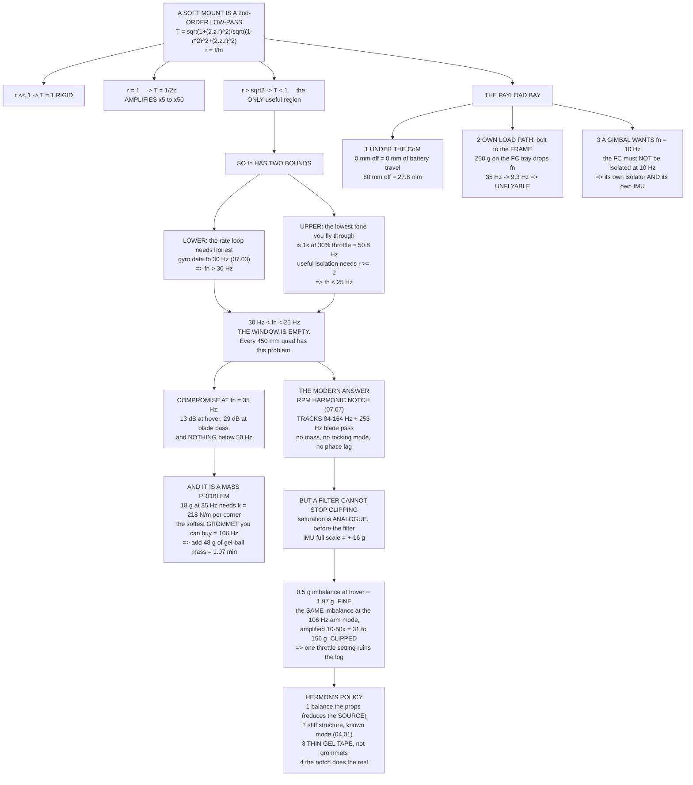

# 04.04 Mounting, vibration isolation and the payload bay

<!-- glance:start -->
<!-- generated by tools/build.py from curriculum/syllabus.yaml — edit the syllabus, not this block -->

| | |
|---|---|
| **Track** | Main path |
| **Difficulty** | Intermediate |
| **Time** | 1 h 15 min |
| **Hardware** | First flight (Hermon core) (stage 1) |
| **Software** | python |
| **Prerequisites** | [04.03 The wiring harness: gauge, length, connectors, routing](04.03-wiring-harness.md)<br>[02.09 Heat, vibration and mechanical noise](../02-motors-escs-props/02.09-heat-vibration-noise.md) |
| **Skip if** | You can show from transmissibility whether a mount helps or amplifies, justify Hermon's mount choice against an RPM harmonic notch, and design a payload bay that does not move the CoM. |

<!-- glance:end -->

## What you will learn

- What a soft mount actually is — a second-order low-pass — and the **transmissibility** formula
  that decides whether it helps or hurts
- Why a mount that is not soft enough **amplifies** the very thing you were trying to kill
- The two bounds a mount's natural frequency has to satisfy, and the discovery that on Hermon
  **the window between them is empty**
- Why a soft mount is a **mass** problem rather than a spring problem, and why every commercial
  damping plate uses gel
- The one job a physical mount does that no digital filter can ever do: **stop the accelerometer
  clipping**
- Why the modern answer on a 1.45 kg quad is a stiff mount and an RPM harmonic notch
- Flight-controller orientation, and the parameter that saves you from remounting it
- How to design a payload bay that costs you no battery travel, and why a gimbal needs a
  completely different mount from the one the flight controller needs

## Why it matters

[04.01](04.01-frames.md) found that Hermon's arm has a first bending mode at **106 Hz**, that
this is **6,330 rpm — 64 % throttle**, and that it cannot be designed out.
[02.09](../02-motors-escs-props/02.09-heat-vibration-noise.md) showed that half a gram of
propeller imbalance produces a rotating force of **14.0 N**, which is the entire weight of the
aircraft. This lesson is where those two facts meet the flight controller.

Vibration is the single most common reason a correctly-built multirotor flies badly. It corrupts
the gyro, which corrupts the rate loop. It corrupts the accelerometer, which corrupts the EKF's
velocity and position. And when it is bad enough it **clips** the accelerometer, at which point
the estimator is receiving fiction and no amount of filtering will recover the truth.

The usual response is to soft-mount the flight controller. This lesson works out what that
actually buys, and the answer is more interesting than the folklore: on an aircraft this size, a
soft mount **cannot** do the job it is famous for, and the thing it *can* do is different from
what most people think they are buying.

## Prerequisites

<!-- prereqs:start -->
## Prerequisites

You need these first:

- [04.03 The wiring harness: gauge, length, connectors, routing](04.03-wiring-harness.md)
- [02.09 Heat, vibration and mechanical noise](../02-motors-escs-props/02.09-heat-vibration-noise.md)

### Optional prerequisite links

None.

Check your readiness: `python course.py why 04.04`
<!-- prereqs:end -->

## Concept

### A soft mount is a second-order low-pass filter made of rubber

Put a mass $m$ on springs of total stiffness $k$ with damping ratio $\zeta$. The fraction of the
airframe's vibration amplitude that reaches the mass, at frequency $f$, is the
**transmissibility**:

$$T(r) = \frac{\sqrt{1 + (2\zeta r)^2}}{\sqrt{(1-r^2)^2 + (2\zeta r)^2}},
\qquad r = \frac{f}{f_n}, \qquad f_n = \frac{1}{2\pi}\sqrt{\frac{k}{m}}$$

Three regions, and only one of them is isolation:

- **$r \ll 1$** — $T \approx 1$. The mount is rigid. The mass follows the airframe exactly.
- **$r \approx 1$** — $T \approx 1/(2\zeta)$. **Resonance.** A mount with $\zeta = 0.1$ amplifies
  by five.
- **$r > \sqrt2$** — $T < 1$ at last. This is the only region where a mount does anything useful,
  and it only starts at $\sqrt2$, not at 1.

Here is what that means for Hermon's actual excitations, at four candidate mount frequencies:

| Frequency | What it is | $f_n$=25 | $f_n$=35 | $f_n$=50 | $f_n$=80 |
|---:|---|---:|---:|---:|---:|
| 50.8 Hz | 1× rpm, 30 % throttle | 0.342 | 0.910 | **4.960** | 1.652 |
| 84.3 Hz | 1× rpm, **hover** | 0.116 | 0.230 | 0.563 | **4.296** |
| 106.0 Hz | the arm mode ([04.01](04.01-frames.md)) | 0.077 | 0.143 | 0.309 | **1.292** |
| 163.9 Hz | 1× rpm, full throttle | 0.039 | 0.065 | 0.122 | 0.335 |
| 253.0 Hz | blade pass at hover | 0.022 | 0.034 | 0.058 | 0.131 |
| 492.0 Hz | blade pass, full throttle | 0.011 | 0.015 | 0.023 | 0.043 |

> [!IMPORTANT]
> **Read the $f_n$ = 80 Hz column.** That mount *amplifies* the hover fundamental by 4.3× and the
> arm mode by 1.3×. It is not a weak soft mount; it is an active vibration amplifier bolted under
> your flight controller. And 80 Hz is roughly what you get if you put a 20 g flight controller
> on four "anti-vibration" silicone grommets straight out of the bag. **A mount that is not soft
> enough is very much worse than no mount at all.**

### The two bounds — and the empty window

**The lower bound comes from the control loop.** Below $f_n$ the mount is effectively rigid, so
the gyro reports the airframe's real motion. Near and above $f_n$ the flight controller is
measuring the *mount's* motion, with a phase lag, and feeding that into a loop that is trying to
stabilise the *airframe*. The rate loop in [07.03](../07-control/07.03-rate-loops.md) needs
honest data out to roughly **30 Hz**, so:

$$f_n > 30\ \text{Hz}$$

**The upper bound comes from the excitation.** Isolation begins at $r = \sqrt2$ and is only worth
having at $r \geq 2$. The lowest excitation you routinely fly through is not the hover
fundamental — it is the 1× tone at low throttle, when you are descending. At 30 % throttle
Hermon's motors turn 3,048 rpm, which is **50.8 Hz**:

$$f_n < 50.8/\sqrt2 = 36\ \text{Hz (isolation begins)}, \qquad
f_n < 50.8/2 = 25\ \text{Hz (isolation is useful)}$$

$$\boxed{30\ \text{Hz} < f_n < 25\ \text{Hz}}$$

**The window is empty.** There is no natural frequency that both tells the rate loop the truth
and usefully isolates the lowest tone the aircraft produces. This is not a failure of your parts
list. It is a consequence of a small aircraft whose lowest vibration frequency is only a factor
of 1.7 above its own control bandwidth, and every 450 mm quadcopter has the same problem.

So you compromise. The usual landing spot is **$f_n \approx 35$ Hz**, and this is exactly what it
buys:

| Excitation | | Transmitted | |
|---|---:|---:|---|
| 1× rpm, 30 % throttle | 50.8 Hz | ×0.910 | 0.8 dB — **nothing** |
| 1× rpm, hover | 84.3 Hz | ×0.230 | 12.8 dB |
| the arm mode | 106.0 Hz | ×0.143 | 16.9 dB |
| 1× rpm, full throttle | 163.9 Hz | ×0.065 | 23.7 dB |
| blade pass at hover | 253.0 Hz | ×0.034 | 29.3 dB |
| blade pass, full | 492.0 Hz | ×0.015 | 36.4 dB |

Thirteen decibels at hover, twenty-nine at blade pass, and **nothing at all at low throttle.**
That is not a badly built mount. That is what a correctly built one does.

### A soft mount is a mass problem, not a spring problem

Now try to build the 35 Hz mount. The flight-controller assembly is **18 g**
([04.02](04.02-mass-and-center-of-mass.md)), so:

$$k_{total} = m(2\pi f_n)^2 = 0.018 \times (2\pi \times 35)^2 = 870\ \text{N/m}
= 218\ \text{N/m per corner}$$

That is extraordinarily soft. Here is what you can actually buy:

| Mount (×4) | $k$ each | $k$ total | $f_n$ at 18 g | Mass needed for 35 Hz | Extra |
|---|---:|---:|---:|---:|---:|
| Silicone M3 grommet, hard | 20,000 | 80,000 | 336 Hz | 1,654 g | +1,636 g |
| Silicone M3 grommet, soft | 8,000 | 32,000 | 212 Hz | 662 g | +644 g |
| 3M VHB foam pad, 20 × 20 | 5,000 | 20,000 | 168 Hz | 414 g | +396 g |
| Nitrile O-ring, 2 mm | 2,000 | 8,000 | 106 Hz | 165 g | +147 g |
| **Silicone gel ball, 10 mm** | **800** | **3,200** | **67 Hz** | **66 g** | **+48 g** |
| **Silicone gel ball, 15 mm** | **300** | **1,200** | **41 Hz** | **25 g** | **+7 g** |

Every grommet on that list sits between 100 and 340 Hz with an 18 g flight controller on it — in
other words, **every one of them amplifies the thing you bought it to isolate.**

The fix is not a softer spring; there isn't one. The fix is **more mass**, and mass costs
0.0223 minutes per gram, forever:

| Mount | Extra mass | Endurance cost |
|---|---:|---|
| 3M VHB foam pad | +396 g | 8.82 min — **37 % of the flight** |
| Nitrile O-ring | +147 g | 3.29 min — 14 % |
| Silicone gel ball, 10 mm | +48 g | 1.07 min — 4.6 % |
| Silicone gel ball, 15 mm | +7 g | 0.15 min — 0.6 % |

Only the gel rows are affordable. **That is why every commercial damping plate uses gel balls
rather than grommets**, and it is why "just use softer grommets" is the wrong instinct: you need
two orders of magnitude, and grommets do not go there.

### The one thing a filter cannot do

ArduPilot's **RPM harmonic notch** ([07.07](../07-control/07.07-filtering-and-methodic-tuning.md))
does in software what the mount was supposed to do in rubber, and does it better:

- It tracks the fundamental across **84–164 Hz** instead of sitting at one fixed $f_n$.
- It puts a second notch on blade pass, centred at **253 Hz** at hover.
- It costs no mass, adds no rocking mode, and introduces no phase lag below 30 Hz.

A mount with one natural frequency cannot track. A notch can. So on a modern flight controller
the mount has lost its old job.

But there is one thing the notch cannot do, and it is the reason you still care about the
physical mount. **Accelerometer clipping happens in the analogue front end, before any filter
runs.** The IMU has a full scale of ±16 g. Once the input exceeds it, the sample is a lie, and a
lie that arrives before the filter cannot be filtered out.

How close are you? At hover, with realistic imbalance:

| Prop imbalance | Force per motor | Airframe acceleration | As $g$ | Fraction of clip |
|---:|---:|---:|---:|---:|
| 0.2 g | 5.6 N | 7.7 m/s² | 0.79 | 0.05 |
| 0.5 g | 14.0 N | 19.3 m/s² | 1.97 | 0.12 |
| 1.0 g | 28.1 N | 38.7 m/s² | 3.94 | 0.25 |

Comfortable. Now put the same 0.5 g imbalance at **106 Hz**, where
[04.01](04.01-frames.md)'s arm mode amplifies it:

| Structural $\zeta$ | Amplification | At the FC | As $g$ | Fraction of clip |
|---:|---:|---:|---:|---:|
| 0.01 (bare carbon tube) | 50× | 1,530 m/s² | 155.9 | **9.7** |
| 0.02 | 25× | 765 m/s² | 78.0 | **4.9** |
| 0.05 (bolted, cabled, taped) | 10× | 306 m/s² | 31.2 | **1.9** |
| 0.10 | 5× | 153 m/s² | 15.6 | 1.0 |

**That is how an aircraft that vibrates perfectly acceptably everywhere else clips its
accelerometers at one particular throttle setting** — the setting where the excitation crosses a
structural mode. And 64 % throttle is exactly where [04.01](04.01-frames.md) predicted Hermon's
mode to be.

> [!IMPORTANT]
> **Hermon's mounting policy, and the reasoning behind it.**
> 1. **Balance the propellers** ([02.09](../02-motors-escs-props/02.09-heat-vibration-noise.md)).
>    This is the only step that reduces the excitation rather than treating it. ₪40 and ten
>    minutes.
> 2. **Keep the structure stiff and know where its mode is**
>    ([04.01](04.01-frames.md)). Damping matters more than you think: a bolted, cable-wrapped,
>    gel-taped arm is five times better damped than a bare tube.
> 3. **Mount the flight controller on thin gel tape**, not on grommets and not rigidly. The tape
>    adds damping and kills the high-frequency content without creating a 100 Hz amplifier.
> 4. **Do the rest with the RPM harmonic notch**
>    ([07.07](../07-control/07.07-filtering-and-methodic-tuning.md)).
>
> Do **not** bolt 50 g of lead to your aircraft to solve a problem the software solves for free.

### If you do build a soft mount

Sometimes you have to — a heavy camera payload, a flight controller with a known-bad IMU, or a
frame whose mode sits right on top of the hover tone. Then:

| $f_n$ | Static sag | At 3.78 g | Design clearance |
|---:|---:|---:|---:|
| 20 Hz | 0.62 mm | 2.35 mm | 7.04 mm |
| 25 Hz | 0.40 mm | 1.50 mm | 4.51 mm |
| 35 Hz | 0.20 mm | 0.77 mm | 2.30 mm |
| 50 Hz | 0.10 mm | 0.38 mm | 1.13 mm |

Design for **three times the manoeuvre deflection**, because a soft mount that touches anything
is a rigid mount. And remember that **every cable into a soft-mounted flight controller is a
spring in parallel with the gel** — a 26 AWG loom is stiffer than a 10 mm gel ball, so route
cables in a generous loop and anchor them on the *airframe* side, not halfway.

> [!TIP]
> **Ask your teacher:** "My mount comes out at 80 Hz with my 20 g flight controller on it, and
> the transmissibility table says that amplifies my hover tone by 4.3×. Walk me through what that
> actually looks like in a log — what `VIBE.VibeZ` does, what the clip counters do, and how I
> would tell that apart from an unbalanced propeller."

### Orientation: the parameter that saves the build

The flight controller has an arrow on it and the arrow must point forward — except that on a
crowded plate, "forward" is often the one direction the connectors will not allow.

ArduPilot's `AHRS_ORIENTATION` takes 40-odd values covering every 45° rotation and every flip.
Set it and the board can be mounted sideways, backwards or upside down. Three rules:

1. **Set it before the first accelerometer calibration**, because the calibration is performed in
   the corrected frame.
2. **Write it in the build document.** A parameter that only exists in the flight controller is a
   parameter you will lose with the next firmware wipe.
3. **Mount the board flat to within a degree or two** anyway. `AHRS_TRIM` corrects small angles,
   but a board mounted on a visible wedge will fight you every time you recalibrate.

And, from [04.02](04.02-mass-and-center-of-mass.md): mount it **close to the centre of mass**.
Hermon's 28 mm offset costs 0.14 g of false acceleration at 400 °/s. `INS_POS1_X/Y/Z` corrects
it, and a small offset makes the correction unimportant either way.

### The payload bay

Three requirements, in order of how expensive they are to get wrong.

**1. Put it under the centre of mass.** [04.02](04.02-mass-and-center-of-mass.md) computed the
battery travel a 250 g pod demands as a function of how far off the CoM it hangs:

| Pod offset from CoM | Battery slide required |
|---:|---:|
| 0 mm | 0.0 mm |
| 20 mm | 6.9 mm |
| 40 mm | 13.9 mm |
| 80 mm | 27.8 mm |

A bay directly under the centre plate demands nothing. Putting it anywhere else is a decision
that should have a reason.

**2. Give it its own load path.** The pod bolts to the **frame**, never to the flight-controller
tray. Hang 250 g off a 35 Hz soft mount and the natural frequency falls to **9.3 Hz** — well
inside the rate loop's bandwidth, and the aircraft becomes unflyable. This is a mistake that is
easy to make when the tray is the only flat surface with holes in it.

**3. A gimbal needs a different mount, not the same one.** A rolling-shutter camera shows
"jello" — the characteristic wobble of a rolling shutter sampling a vibrating scene — from about
5 Hz up. So a gimbal wants $f_n$ near 10 Hz:

| Gimbal $f_n$ | Hover 1× | Blade pass | At 5 Hz |
|---:|---:|---:|---:|
| 8 Hz | 0.030 | 0.0095 | 2.10 |
| 12 Hz | 0.048 | 0.0144 | 1.22 |
| 20 Hz | 0.096 | 0.0247 | 1.07 |

Ten hertz is exactly where the flight controller must **not** be isolated. These are
irreconcilable requirements on one airframe, which is why a gimbal gets its own isolator **and**
its own IMU: it is stabilising a camera against a different set of frequencies from the ones the
autopilot is stabilising the aircraft against.

## Technical explanation

### Level 1 — Intuition: a hand holding a glass of water

Hold a glass of water and walk. Slow, big movements — you turning, stopping, starting — pass
straight through your arm to the glass; that is $r \ll 1$, the mount is rigid. Small fast
movements — your footfalls — your arm absorbs; that is $r > \sqrt2$, isolation.

Now try to find an arm stiffness that passes your deliberate turns while absorbing your
footfalls, when your footfalls happen only 1.7 times faster than your turns. You cannot. That is
Hermon's empty window.

### Level 2 — Practical: the mounting recipe

1. Balance every propeller. Nothing else on this list reduces the *source*.
2. Torque every motor screw and every arm clamp, and check them at every service. A loose joint
   is both an excitation and a change in the structure's damping.
3. Mount the flight controller on **thin gel tape** (0.5–1 mm), flat, close to the centre of mass,
   with the arrow forward if the connectors allow it and `AHRS_ORIENTATION` set if they do not.
4. Route every cable into the FC in a loop with slack, anchored on the airframe side.
5. Fly, log, read `VIBE.VibeX/Y/Z` and `VIBE.Clip0/1/2`.
6. Configure the RPM harmonic notch
   ([07.07](../07-control/07.07-filtering-and-methodic-tuning.md)).
7. Only if `VIBE` is still above 30 m/s² or any clip counter is non-zero should you consider a
   gel-ball mount with added mass — and you now know it will cost you about 48 g.

### Level 3 — Mathematics: where the transmissibility comes from

A mass $m$ on a spring $k$ and damper $c$, driven by base motion $x_b(t) = X_b e^{j\omega t}$:

$$m\ddot{x} + c(\dot{x} - \dot{x}_b) + k(x - x_b) = 0$$

Substituting $x = Xe^{j\omega t}$ and dividing through:

$$\frac{X}{X_b} = \frac{k + jc\omega}{k - m\omega^2 + jc\omega}$$

With $\omega_n^2 = k/m$, $\zeta = c/(2\sqrt{km})$ and $r = \omega/\omega_n$, the magnitude is the
transmissibility above. Two limits worth knowing by heart:

- At $r = 1$: $T = \sqrt{1 + 1/(2\zeta)^2} \approx 1/(2\zeta)$.
- At $r \gg 1$: $T \to 2\zeta/r$ — so **more damping makes high-frequency isolation *worse*.**
  That is the isolator designer's dilemma: damping tames the resonant peak and spoils the
  isolation. Gel is popular precisely because it is a reasonable compromise, around
  $\zeta = 0.1$–$0.2$.

The structural amplification used in the clipping table is the same formula at $r = 1$, applied
to the arm rather than the mount: $Q = 1/(2\zeta)$, with $\zeta \approx 0.01$ for a bare carbon
tube and $\approx 0.05$ for an assembled, cable-wrapped arm.

### Level 4 — Implementation: Hermon's mounting specification

| Item | Mount | Why |
|---|---|---|
| Flight controller | 0.8 mm silicone gel tape, four pads, flat on the top plate, arrow forward | Damping and high-frequency kill without a 100 Hz amplifier |
| GNSS + compass | Rigid, on a 110 mm mast, 100 mm+ from the trunk | It is magnetics, not vibration ([04.03](04.03-wiring-harness.md)) |
| ESC (4-in-1) | Rigid, under the top plate, on standoffs | It has no inertial sensors and it needs the heat path |
| Telemetry radio | Rigid, aft, antenna vertical | Nothing on it cares about vibration |
| Battery | Strap over a non-slip pad, ±15 mm of travel | The CoM adjuster ([04.02](04.02-mass-and-center-of-mass.md)) |
| Payload bay | Bolted to the **frame**, directly under the centre plate | Zero battery travel, own load path |
| Gimbal (if fitted) | Its own 10 Hz isolator and its own IMU | Incompatible requirement with the FC's |

## Diagram



## Code

Save as `mounting.py` and run `python mounting.py`. Standard library only.

```python
"""04.04 - the soft mount, the window it cannot fit in, and the payload bay."""
import math

G = 9.81
M_FC = 0.018              # kg, flight controller + mount (04.02)
MASS_CLEAN = 1.450
T_W = 3.78                # thrust-to-weight, clean
F_MIN_1X = 50.8           # Hz, 1x rpm at 30 % throttle (3,048 rpm)
F_HOVER_1X = 84.3         # Hz, at hover (5,060 rpm)
F_ARM = 106.0             # Hz, the arm's first bending mode (04.01)
F_FULL_1X = 163.9         # Hz, at full throttle (9,836 rpm)
F_BLADE_HOVER = 253.0     # Hz, 3 blades at hover
F_BLADE_FULL = 492.0      # Hz
BW_RATE = 30.0            # Hz, the rate loop's useful bandwidth (07.03)
CLIP_G = 16.0             # the IMU's full-scale accelerometer range
MIN_PER_G = 0.0223        # minutes of endurance per gram (04.02)
FN_PRACTICAL = 35.0       # Hz, the compromise this lesson lands on

EXCITE = [(F_MIN_1X, "1x rpm, 30 % throttle"),
          (F_HOVER_1X, "1x rpm, HOVER"),
          (F_ARM, "the arm mode (04.01)"),
          (F_FULL_1X, "1x rpm, full throttle"),
          (F_BLADE_HOVER, "blade pass at hover"),
          (F_BLADE_FULL, "blade pass, full")]

GROMMETS = [("silicone M3 grommet, hard", 20000),
            ("silicone M3 grommet, soft", 8000),
            ("3M VHB foam pad, 20 x 20", 5000),
            ("nitrile O-ring, 2 mm", 2000),
            ("silicone gel ball, 10 mm", 800),
            ("silicone gel ball, 15 mm", 300)]


def transmissibility(f, fn, zeta):
    r = f / fn
    return (math.sqrt(1 + (2 * zeta * r) ** 2)
            / math.sqrt((1 - r * r) ** 2 + (2 * zeta * r) ** 2))


def fn_of(k_total, m):
    return math.sqrt(k_total / m) / (2 * math.pi)


def mass_for(fn, k_total):
    return k_total / (2 * math.pi * fn) ** 2


def imbalance_n(grams, f_hz, radius=0.10):
    """Rotating force from an imbalance, F = m r omega^2 (02.09)."""
    return grams / 1000 * radius * (2 * math.pi * f_hz) ** 2


def bar(t):
    print("\n" + "=" * 70)
    print(t)
    print("=" * 70)


if __name__ == "__main__":
    bar("1. A SOFT MOUNT IS A SECOND-ORDER LOW-PASS")
    print("  T = sqrt(1 + (2.z.r)^2) / sqrt((1-r^2)^2 + (2.z.r)^2),  r = f/fn")
    print("  It AMPLIFIES below r = sqrt(2) and only isolates above it.")
    print(f"\n  {'f Hz':>6s} {'what it is':22s}", end="")
    for fn in (25, 35, 50, 80):
        print(f" {'fn=' + str(fn):>7s}", end="")
    print()
    for f, what in EXCITE:
        print(f"  {f:6.1f} {what:22s}", end="")
        for fn in (25, 35, 50, 80):
            print(f" {transmissibility(f, fn, 0.10):7.3f}", end="")
        print()
    print("  Read the fn = 80 Hz column: it AMPLIFIES the hover fundamental")
    print("  by 4.3x and the arm mode by 1.3x. A mount that is not soft")
    print("  enough is very much worse than no mount at all.")

    bar("2. THE WINDOW THE MOUNT HAS TO LIVE IN -- AND DOES NOT FIT")
    hi_begin = F_MIN_1X / math.sqrt(2)
    hi_useful = F_MIN_1X / 2.0
    print("  LOWER BOUND. Below fn the mount is rigid and the gyro sees the")
    print("  airframe faithfully; near and above fn it lies. The rate loop")
    print(f"  needs the truth to about {BW_RATE:.0f} Hz (07.03), so:")
    print(f"      fn must be ABOVE ......................... {BW_RATE:.0f} Hz")
    print("  UPPER BOUND. Isolation begins at r = sqrt(2) and is only worth")
    print("  having at r >= 2. The lowest thing you fly through is the 1x")
    print(f"  fundamental at 30 % throttle, {F_MIN_1X:.0f} Hz:")
    print(f"      isolation begins at fn below ............. {hi_begin:.0f} Hz")
    print(f"      isolation is USEFUL at fn below .......... {hi_useful:.0f} Hz")
    print(f"\n  {BW_RATE:.0f} Hz < fn < {hi_useful:.0f} Hz HAS NO SOLUTIONS."
          f"  The window is empty.")
    print("  On a 450 mm quad that descends at 30 % throttle there is no")
    print("  natural frequency that both tells the rate loop the truth and")
    print("  usefully isolates the lowest excitation. YOU MUST CHOOSE.")
    print(f"\n  The usual compromise is fn = {FN_PRACTICAL:.0f} Hz."
          f" Here is exactly what you get:")
    for f, what in EXCITE:
        t = transmissibility(f, FN_PRACTICAL, 0.10)
        note = "  <- nothing" if t > 0.7 else ""
        print(f"    {what:24s} {f:6.1f} Hz  x{t:6.3f}"
              f"  ({-20 * math.log10(t):5.1f} dB){note}")
    print("  13 dB at hover, 29 dB at blade pass, and NOTHING at low")
    print("  throttle. That is not a badly built mount; that is what a")
    print("  correctly built one does.")

    bar("3. WHAT IT TAKES: A MASS PROBLEM, NOT A SPRING PROBLEM")
    k_need = M_FC * (2 * math.pi * FN_PRACTICAL) ** 2
    print(f"  The FC assembly is {M_FC * 1000:.0f} g (04.02)."
          f"  For fn = {FN_PRACTICAL:.0f} Hz:")
    print(f"    k_total = m(2.pi.fn)^2 = {k_need:.0f} N/m"
          f"  = {k_need / 4:.0f} N/m per corner")
    print("  Real mounting hardware is nowhere near that soft:")
    print(f"  {'mount, x4':30s} {'k each':>7s} {'k total':>8s}"
          f" {'fn at 18 g':>11s} {'mass for 35 Hz':>15s} {'extra':>7s}")
    for name, k in GROMMETS:
        kt = 4 * k
        m = mass_for(FN_PRACTICAL, kt)
        print(f"  {name:30s} {k:7.0f} {kt:8.0f}"
              f" {fn_of(kt, M_FC):10.0f} Hz {m * 1000:12.0f} g"
              f" {(m - M_FC) * 1000:+6.0f} g")
    print("  Every grommet on that list is 100 to 340 Hz at 18 g -- i.e.")
    print("  every one of them AMPLIFIES what you are trying to isolate.")
    print("  You fix that by adding MASS, not by looking for a softer part,")
    print("  and mass is 0.0223 min/g forever:")
    for name, k in GROMMETS[2:]:
        extra = mass_for(FN_PRACTICAL, 4 * k) - M_FC
        print(f"    {name:30s} {extra * 1000:+6.0f} g"
              f" = {extra * 1000 * MIN_PER_G:6.2f} min"
              f" ({extra * 1000 * MIN_PER_G / 23.6 * 100:5.1f} % of the flight)")
    print("  The only affordable rows are the gel balls. THAT is why every")
    print("  commercial damping plate uses gel, and why 'softer grommets'")
    print("  is the wrong instinct.")

    bar("4. IF YOU BUILD ONE: SAG AND CLEARANCE")
    print(f"  {'fn':>5s} {'static sag':>11s} {'at 3.78 g':>11s} {'clearance':>11s}")
    for fn in (20, 25, 35, 50):
        k = M_FC * (2 * math.pi * fn) ** 2
        sag = M_FC * G / k
        print(f"  {fn:3d} Hz {sag * 1000:8.2f} mm {sag * T_W * 1000:8.2f} mm"
              f" {sag * T_W * 3 * 1000:8.2f} mm")
    print("  Design for three times the manoeuvre deflection, because a")
    print("  soft mount that touches anything is a rigid mount. And every")
    print("  cable into a soft-mounted FC is a spring in PARALLEL with the")
    print("  gel -- a 26 AWG loom is stiffer than a 10 mm gel ball.")

    bar("5. THE MODERN ANSWER: A STIFF MOUNT AND A NOTCH")
    print("  ArduPilot's RPM harmonic notch (07.07) tracks the motor")
    print("  fundamental and its harmonics in software:")
    print(f"    fundamental notch tracks  {F_HOVER_1X:.0f}-{F_FULL_1X:.0f} Hz")
    print(f"    blade-pass notch centre   {F_BLADE_HOVER:.0f} Hz at hover")
    print("  No mass, no rocking mode, no phase lag below 30 Hz, and it")
    print("  TRACKS -- which a mount with one fixed fn can never do.")
    print("\n  SO WHAT IS THE PHYSICAL MOUNT STILL FOR? Exactly one thing a")
    print("  filter cannot do: stop the accelerometer CLIPPING. Saturation")
    print("  happens in the analogue front end, BEFORE any filter runs.")
    print(f"    the IMU's full scale is +-{CLIP_G:.0f} g"
          f" = {CLIP_G * G:.0f} m/s^2")
    print(f"\n  {'prop imbalance':>16s} {'force/motor':>12s} {'airframe':>10s}"
          f" {'as g':>7s} {'vs clip':>9s}")
    for grams in (0.2, 0.5, 1.0):
        f1 = imbalance_n(grams, F_HOVER_1X)
        a = 2 * f1 / MASS_CLEAN
        print(f"  {grams:13.1f} g {f1:10.1f} N {a:7.1f} m/s^2"
              f" {a / G:7.2f} {a / G / CLIP_G:8.2f}")
    print("  Comfortably inside the range. Now put the SAME 0.5 g imbalance")
    print(f"  at the {F_ARM:.0f} Hz arm mode, where the structure amplifies:")
    a_res = 2 * imbalance_n(0.5, F_ARM) / MASS_CLEAN
    print(f"  {'structural zeta':>16s} {'amplification':>14s} {'at the FC':>11s}"
          f" {'as g':>7s} {'vs clip':>9s}")
    for z in (0.01, 0.02, 0.05, 0.10):
        amp = 1 / (2 * z)
        print(f"  {z:16.2f} {amp:13.0f}x {a_res * amp:8.0f} m/s^2"
              f" {a_res * amp / G:7.1f} {a_res * amp / G / CLIP_G:8.1f}")
    print("  Bare carbon tube is about 1 %; a bolted, cable-wrapped, gel-")
    print("  taped arm is nearer 5 %. Either way the same imbalance that is")
    print("  harmless at hover CLIPS THE ACCELEROMETER at one particular")
    print("  throttle setting -- and clipping cannot be filtered out.")
    print("\n  => Balance the props (02.09). Keep the structure stiff and")
    print("     know where its mode is (04.01). Put THIN gel tape under the")
    print("     FC to kill the high-frequency content and add damping.")
    print("     Do the rest with the notch. Do NOT bolt 50 g of lead to")
    print("     your aircraft to solve a problem software solves for free.")

    bar("6. THE PAYLOAD BAY")
    print("  1. UNDER THE CoM. Battery travel demanded by a 250 g pod:")
    for arm_mm in (0, 20, 40, 80):
        print(f"       pod {arm_mm:3d} mm off the CoM"
              f" -> slide the pack {250 * arm_mm / 720:5.1f} mm")
    print("     A bay directly under the centre plate demands nothing, and")
    print("     that is the only reason to put it anywhere else.")
    print("\n  2. ITS OWN LOAD PATH. The pod bolts to the FRAME, never to")
    print("     the FC tray. Hang 250 g off a soft mount and:")
    k = M_FC * (2 * math.pi * FN_PRACTICAL) ** 2
    print(f"       fn falls from {FN_PRACTICAL:.0f} Hz to"
          f" {fn_of(k, M_FC + 0.250):.1f} Hz -- well inside the rate")
    print("       loop's bandwidth. The aircraft becomes unflyable.")
    print("\n  3. A GIMBAL NEEDS A DIFFERENT MOUNT, NOT THE SAME ONE.")
    print("     A rolling-shutter camera shows 'jello' from about 5 Hz up,")
    print("     so a gimbal wants fn near 10 Hz -- which is exactly where")
    print("     the FC must NOT be isolated.")
    print(f"       {'gimbal fn':>10s} {'hover 1x':>10s} {'blade pass':>12s}"
          f" {'at 5 Hz':>9s}")
    for fn_g in (8, 12, 20):
        print(f"       {fn_g:7d} Hz"
              f" {transmissibility(F_HOVER_1X, fn_g, 0.15):10.3f}"
              f" {transmissibility(F_BLADE_HOVER, fn_g, 0.15):12.4f}"
              f" {transmissibility(5.0, fn_g, 0.15):9.2f}")
    print("     Incompatible requirements on one airframe: which is why a")
    print("     gimbal gets its own isolator AND its own IMU.")
```

Output:

```text

======================================================================
1. A SOFT MOUNT IS A SECOND-ORDER LOW-PASS
======================================================================
  T = sqrt(1 + (2.z.r)^2) / sqrt((1-r^2)^2 + (2.z.r)^2),  r = f/fn
  It AMPLIFIES below r = sqrt(2) and only isolates above it.

    f Hz what it is               fn=25   fn=35   fn=50   fn=80
    50.8 1x rpm, 30 % throttle    0.342   0.910   4.960   1.652
    84.3 1x rpm, HOVER            0.116   0.230   0.563   4.296
   106.0 the arm mode (04.01)     0.077   0.143   0.309   1.292
   163.9 1x rpm, full throttle    0.039   0.065   0.122   0.335
   253.0 blade pass at hover      0.022   0.034   0.058   0.131
   492.0 blade pass, full         0.011   0.015   0.023   0.043
  Read the fn = 80 Hz column: it AMPLIFIES the hover fundamental
  by 4.3x and the arm mode by 1.3x. A mount that is not soft
  enough is very much worse than no mount at all.

======================================================================
2. THE WINDOW THE MOUNT HAS TO LIVE IN -- AND DOES NOT FIT
======================================================================
  LOWER BOUND. Below fn the mount is rigid and the gyro sees the
  airframe faithfully; near and above fn it lies. The rate loop
  needs the truth to about 30 Hz (07.03), so:
      fn must be ABOVE ......................... 30 Hz
  UPPER BOUND. Isolation begins at r = sqrt(2) and is only worth
  having at r >= 2. The lowest thing you fly through is the 1x
  fundamental at 30 % throttle, 51 Hz:
      isolation begins at fn below ............. 36 Hz
      isolation is USEFUL at fn below .......... 25 Hz

  30 Hz < fn < 25 Hz HAS NO SOLUTIONS.  The window is empty.
  On a 450 mm quad that descends at 30 % throttle there is no
  natural frequency that both tells the rate loop the truth and
  usefully isolates the lowest excitation. YOU MUST CHOOSE.

  The usual compromise is fn = 35 Hz. Here is exactly what you get:
    1x rpm, 30 % throttle      50.8 Hz  x 0.910  (  0.8 dB)  <- nothing
    1x rpm, HOVER              84.3 Hz  x 0.230  ( 12.8 dB)
    the arm mode (04.01)      106.0 Hz  x 0.143  ( 16.9 dB)
    1x rpm, full throttle     163.9 Hz  x 0.065  ( 23.7 dB)
    blade pass at hover       253.0 Hz  x 0.034  ( 29.3 dB)
    blade pass, full          492.0 Hz  x 0.015  ( 36.4 dB)
  13 dB at hover, 29 dB at blade pass, and NOTHING at low
  throttle. That is not a badly built mount; that is what a
  correctly built one does.

======================================================================
3. WHAT IT TAKES: A MASS PROBLEM, NOT A SPRING PROBLEM
======================================================================
  The FC assembly is 18 g (04.02).  For fn = 35 Hz:
    k_total = m(2.pi.fn)^2 = 870 N/m  = 218 N/m per corner
  Real mounting hardware is nowhere near that soft:
  mount, x4                       k each  k total  fn at 18 g  mass for 35 Hz   extra
  silicone M3 grommet, hard        20000    80000        336 Hz         1654 g  +1636 g
  silicone M3 grommet, soft         8000    32000        212 Hz          662 g   +644 g
  3M VHB foam pad, 20 x 20          5000    20000        168 Hz          414 g   +396 g
  nitrile O-ring, 2 mm              2000     8000        106 Hz          165 g   +147 g
  silicone gel ball, 10 mm           800     3200         67 Hz           66 g    +48 g
  silicone gel ball, 15 mm           300     1200         41 Hz           25 g     +7 g
  Every grommet on that list is 100 to 340 Hz at 18 g -- i.e.
  every one of them AMPLIFIES what you are trying to isolate.
  You fix that by adding MASS, not by looking for a softer part,
  and mass is 0.0223 min/g forever:
    3M VHB foam pad, 20 x 20         +396 g =   8.82 min ( 37.4 % of the flight)
    nitrile O-ring, 2 mm             +147 g =   3.29 min ( 13.9 % of the flight)
    silicone gel ball, 10 mm          +48 g =   1.07 min (  4.6 % of the flight)
    silicone gel ball, 15 mm           +7 g =   0.15 min (  0.6 % of the flight)
  The only affordable rows are the gel balls. THAT is why every
  commercial damping plate uses gel, and why 'softer grommets'
  is the wrong instinct.

======================================================================
4. IF YOU BUILD ONE: SAG AND CLEARANCE
======================================================================
     fn  static sag   at 3.78 g   clearance
   20 Hz     0.62 mm     2.35 mm     7.04 mm
   25 Hz     0.40 mm     1.50 mm     4.51 mm
   35 Hz     0.20 mm     0.77 mm     2.30 mm
   50 Hz     0.10 mm     0.38 mm     1.13 mm
  Design for three times the manoeuvre deflection, because a
  soft mount that touches anything is a rigid mount. And every
  cable into a soft-mounted FC is a spring in PARALLEL with the
  gel -- a 26 AWG loom is stiffer than a 10 mm gel ball.

======================================================================
5. THE MODERN ANSWER: A STIFF MOUNT AND A NOTCH
======================================================================
  ArduPilot's RPM harmonic notch (07.07) tracks the motor
  fundamental and its harmonics in software:
    fundamental notch tracks  84-164 Hz
    blade-pass notch centre   253 Hz at hover
  No mass, no rocking mode, no phase lag below 30 Hz, and it
  TRACKS -- which a mount with one fixed fn can never do.

  SO WHAT IS THE PHYSICAL MOUNT STILL FOR? Exactly one thing a
  filter cannot do: stop the accelerometer CLIPPING. Saturation
  happens in the analogue front end, BEFORE any filter runs.
    the IMU's full scale is +-16 g = 157 m/s^2

    prop imbalance  force/motor   airframe    as g   vs clip
            0.2 g        5.6 N     7.7 m/s^2    0.79     0.05
            0.5 g       14.0 N    19.3 m/s^2    1.97     0.12
            1.0 g       28.1 N    38.7 m/s^2    3.94     0.25
  Comfortably inside the range. Now put the SAME 0.5 g imbalance
  at the 106 Hz arm mode, where the structure amplifies:
   structural zeta  amplification   at the FC    as g   vs clip
              0.01            50x     1530 m/s^2   155.9      9.7
              0.02            25x      765 m/s^2    78.0      4.9
              0.05            10x      306 m/s^2    31.2      1.9
              0.10             5x      153 m/s^2    15.6      1.0
  Bare carbon tube is about 1 %; a bolted, cable-wrapped, gel-
  taped arm is nearer 5 %. Either way the same imbalance that is
  harmless at hover CLIPS THE ACCELEROMETER at one particular
  throttle setting -- and clipping cannot be filtered out.

  => Balance the props (02.09). Keep the structure stiff and
     know where its mode is (04.01). Put THIN gel tape under the
     FC to kill the high-frequency content and add damping.
     Do the rest with the notch. Do NOT bolt 50 g of lead to
     your aircraft to solve a problem software solves for free.

======================================================================
6. THE PAYLOAD BAY
======================================================================
  1. UNDER THE CoM. Battery travel demanded by a 250 g pod:
       pod   0 mm off the CoM -> slide the pack   0.0 mm
       pod  20 mm off the CoM -> slide the pack   6.9 mm
       pod  40 mm off the CoM -> slide the pack  13.9 mm
       pod  80 mm off the CoM -> slide the pack  27.8 mm
     A bay directly under the centre plate demands nothing, and
     that is the only reason to put it anywhere else.

  2. ITS OWN LOAD PATH. The pod bolts to the FRAME, never to
     the FC tray. Hang 250 g off a soft mount and:
       fn falls from 35 Hz to 9.1 Hz -- well inside the rate
       loop's bandwidth. The aircraft becomes unflyable.

  3. A GIMBAL NEEDS A DIFFERENT MOUNT, NOT THE SAME ONE.
     A rolling-shutter camera shows 'jello' from about 5 Hz up,
     so a gimbal wants fn near 10 Hz -- which is exactly where
     the FC must NOT be isolated.
        gimbal fn   hover 1x   blade pass   at 5 Hz
             8 Hz      0.030       0.0095      1.60
            12 Hz      0.048       0.0144      1.21
            20 Hz      0.096       0.0247      1.07
     Incompatible requirements on one airframe: which is why a
     gimbal gets its own isolator AND its own IMU.
```

## Exercise

> [!WARNING]
> Exercise E4 involves hovering and reading a log. Do it **only** after
> [04.06](04.06-preflight-and-airworthiness.md)'s pre-flight checks and only in an area you are
> allowed to fly in. If `VIBE.Clip0/1/2` is non-zero on the first hover, **land and fix it before
> flying again** — a clipped accelerometer means the EKF's position estimate is fiction, and a
> fictional position estimate in Loiter is how aircraft end up in trees.

### Exercise 04.04-E1 — Find your own empty window `[numerical]`

1. Compute your aircraft's 1× frequency at 30 % throttle, at hover and at full throttle.
2. State your lower bound (3× your rate-loop bandwidth, or 30 Hz if you do not know it yet) and
   your upper bound (lowest 1× ÷ 2).
3. Say whether your window is empty. If it is not, you have either a very large aircraft or a
   mistake — check which.

### Exercise 04.04-E2 — Price the mount `[analysis]`

1. Weigh your flight-controller assembly.
2. For a 35 Hz target, compute the total stiffness you need and the per-corner stiffness.
3. Pick the softest mounting hardware you can actually buy and compute the mass you would have to
   add to reach 35 Hz with it.
4. Convert that mass to minutes at 0.0223 min/g and state, in one sentence, whether you are going
   to build it.

### Exercise 04.04-E3 — The clipping map `[coding]`

Extend the script to answer: **at what throttle setting does your aircraft clip?**

1. Sweep throttle from 20 % to 100 %, computing the 1× frequency at each step.
2. At each step compute the imbalance force for 0.5 g of imbalance, and multiply by the structural
   amplification $1/(2\zeta)$ evaluated with the transmissibility formula at your arm's mode
   frequency (not just at resonance — use $T(f, f_{arm}, \zeta)$ with $\zeta = 0.03$).
3. Plot or tabulate acceleration in $g$ against throttle, and mark the ±16 g line.
4. Report the throttle band in which you are predicted to clip, and compare it with 04.01's
   prediction of 64 %.

### Exercise 04.04-E4 — Measure it `[measurement]`

1. Hover for 60 seconds in a stable hover, then climb gently through the full throttle range and
   descend again. Land.
2. From the log, report `VIBE.VibeX`, `VibeY`, `VibeZ` and all three clip counters.
3. Use the FFT tools in [07.07](../07-control/07.07-filtering-and-methodic-tuning.md) to find the
   peaks, and identify each one: 1×, blade pass, or a fixed frequency that does not move.
4. Compare the fixed peak, if any, with your 04.01 arm-mode calculation. Report the ratio.

## Expected result

- **04.04-E1:** an empty window. Every 450 mm class quadcopter has one; a 1.2 m hexacopter with
  15-inch propellers does not, because its 1× tone at low throttle is around 20 Hz and its rate
  loop is slower.
- **04.04-E2:** a required per-corner stiffness in the low hundreds of N/m, which nothing in a
  hardware shop will supply, and an added mass of 50–400 g depending on what you picked. The
  correct one-sentence answer is almost always "no".
- **04.04-E3:** a clipping band centred near the throttle setting at which 1× crosses your arm
  mode — 64 % on Hermon. Away from that band, 0.5 g of imbalance produces about 2 g and nothing
  clips.
- **04.04-E4:** on a well-balanced, correctly assembled Hermon, `VIBE` below 15 m/s² and zero
  clips. Peaks that track rpm are 1× and blade pass; a peak that stays put as rpm changes is
  structural, and it should land within about 20 % of your 04.01 calculation.

## Troubleshooting

### Symptom: vibration got *worse* after fitting an anti-vibration mount

You built an amplifier. Compute $f_n$ for the mass you actually put on it: a 20 g flight
controller on four silicone grommets lands near 200–340 Hz, and at 80 Hz the transmissibility is
still above 1. Either add enough mass to get $f_n$ into the thirties, or take the grommets off and
use thin gel tape. There is no useful middle.

### Symptom: `VIBE` is fine but the clip counters are non-zero

Clipping is a peak phenomenon and `VIBE` is an averaged one — you can have a low average and
still saturate at one frequency. Look for a structural resonance: sweep the throttle slowly and
find the setting at which it happens. That setting, converted to rpm and to hertz, is your
structure's mode, and [04.01](04.01-frames.md) tells you what to do about it.

### Symptom: the aircraft is twitchy and the rate loop will not tune

Check whether you have soft-mounted the flight controller into the control bandwidth. A 250 g
payload accidentally carried on the FC tray drops a 35 Hz mount to 9.3 Hz, which is inside the
rate loop. Give the payload its own load path to the frame. The same thing happens if the mount
has a low **rocking** mode — a tall, narrow FC stack on four corner grommets can rock at well
under its translational $f_n$.

### Symptom: a soft-mounted FC behaves differently with the canopy on

The canopy is touching it. So is the GNSS cable, probably. A soft mount that touches anything is
a rigid mount, and the parallel stiffness of a stiff 6-wire loom is easily greater than the gel's.
Check clearance at three times the manoeuvre deflection, and re-route cables in a loose loop
anchored on the airframe side.

### Symptom: the horizon is level on the bench but the aircraft leans in flight

Two candidates. Either the board is not mounted flat and `AHRS_TRIM` is compensating for a fixed
wedge, or the centre of mass is off and the mixer is trimming it
([04.02](04.02-mass-and-center-of-mass.md)). Do the two-scale CoM measurement first — it is
faster and it rules out the more expensive of the two.

### Symptom: the camera shows jello but the flight controller logs are clean

They are different requirements. The autopilot cares about 50–500 Hz; a rolling shutter cares
about 5–50 Hz, which the aircraft's own soft mount deliberately passes. The camera needs its own
isolator at around 10 Hz. Do not soften the FC mount to fix a camera problem — you will make the
aircraft unflyable and the camera will still show jello.

## Common mistakes

- **Fitting grommets without checking $f_n$.** With an 18 g flight controller, every grommet on
  the market is between 100 and 340 Hz — an amplifier, not an isolator.
- **Believing a soft mount can replace propeller balancing.** Balancing reduces the source by a
  factor of five for ₪40. A mount attenuates what is left, and only above $\sqrt2 f_n$.
- **Adding damping to improve isolation.** At $r \gg 1$, $T \to 2\zeta/r$: **more damping makes
  high-frequency isolation worse.** Damping is for surviving the resonant peak, not for
  isolating.
- **Soft-mounting into the control bandwidth.** Below about 30 Hz the mount is lying to the rate
  loop about what the airframe is doing. This is how a "vibration fix" becomes an oscillation.
- **Hanging the payload off the flight-controller tray.** 250 g takes a 35 Hz mount to 9.3 Hz.
- **Assuming a filter can fix clipping.** Saturation is analogue and happens before the filter.
  The physical mount and the propeller balance are the only tools that address it.
- **Forgetting `AHRS_ORIENTATION` before the accelerometer calibration.** The calibration is done
  in the corrected frame; set the orientation first or redo both.
- **Using the same isolator for the flight controller and the camera.** Their requirements are on
  opposite sides of the control bandwidth.
- **Routing cables into a soft-mounted FC without slack.** Every cable is a spring in parallel,
  and a 6-wire loom outstiffens a gel ball.

## Knowledge check

<details>
<summary>You fit four "anti-vibration" silicone grommets under a 20 g flight controller and the vibration gets worse. What happened?</summary>

You built an amplifier. Silicone M3 grommets are roughly 8,000–20,000 N/m each; with 18–20 g of
mass that puts $f_n$ between 200 and 340 Hz. A mount only isolates above $r = \sqrt2$, so at
Hermon's 84 Hz hover tone you are at $r \approx 0.3$ — the rigid region at best, and if $f_n$ lands
near an excitation you get $1/(2\zeta)$ amplification. At $f_n$ = 80 Hz the hover fundamental is
amplified **4.3×**.
</details>

<details>
<summary>Why is Hermon's soft-mount design window empty, and what would have to change for it not to be?</summary>

The lower bound is the rate loop: it needs honest gyro data to about **30 Hz**, and below $f_n$ the
mount is rigid, so $f_n$ must be above 30 Hz. The upper bound is the lowest tone you fly through —
the 1× fundamental at 30 % throttle, **50.8 Hz** — and useful isolation needs $r \geq 2$, so
$f_n < 25$ Hz. 30 < $f_n$ < 25 has no solutions. It would stop being empty on a larger aircraft:
bigger propellers turn slower, so the lowest 1× tone drops, while the rate loop stays about the
same. A 1.2 m hexacopter has room; a 450 mm quad does not.
</details>

<details>
<summary>Why is a soft mount described as a mass problem rather than a spring problem?</summary>

Because $f_n = \frac{1}{2\pi}\sqrt{k/m}$ and there is a floor on how soft $k$ can be in a part you
can buy and trust. To reach 35 Hz with 18 g you need 218 N/m per corner; the softest thing on the
shelf — a 15 mm silicone gel ball — is 300 N/m, and everything else is 800 to 20,000. Since you
cannot reduce $k$ far enough, you increase $m$: 48 g of added mass gets 10 mm gel balls to 35 Hz.
That mass costs 1.07 minutes of endurance at 0.0223 min/g, which is why the decision is usually
"no".
</details>

<details>
<summary>The RPM harmonic notch does the mount's job in software. So what is the physical mount still for?</summary>

**Preventing accelerometer clipping.** Saturation happens in the analogue front end, before any
digital filter runs, so a clipped sample is unrecoverable. The IMU's full scale is ±16 g; 0.5 g of
propeller imbalance at hover produces about 2 g, which is fine — but the same imbalance at the
106 Hz arm mode, amplified by $1/(2\zeta)$, produces 31 g at $\zeta = 0.05$ and 156 g at
$\zeta = 0.01$. That is the only vibration problem a filter cannot touch.
</details>

<details>
<summary>Increasing damping improves the resonant peak. Why can it make the mount worse?</summary>

Because at $r \gg 1$ the transmissibility tends to $2\zeta/r$ — **isolation gets worse in
proportion to damping.** A very lightly damped mount isolates beautifully at high frequency and
has a terrifying peak at $f_n$; a heavily damped one has a mild peak and poor isolation. Gel sits
around $\zeta = 0.1$–$0.2$ because that is a defensible compromise, not because it is optimal for
either job.
</details>

<details>
<summary>Why must the payload bay bolt to the frame rather than to the flight-controller tray, and what number makes the case?</summary>

Because mass on the mount changes its natural frequency. Adding a 250 g pod to an 18 g assembly
on a 35 Hz mount takes it to $35\sqrt{18/268} =$ **9.3 Hz** — well inside the rate loop's 30 Hz
bandwidth. The flight controller would then be reporting the pod's motion rather than the
aircraft's, and the aircraft becomes unflyable. The pod needs its own load path into the
structure.
</details>

<details>
<summary>Your camera shows jello and your logs are clean. Should you soften the flight-controller mount?</summary>

**No.** A rolling shutter shows jello from about 5 Hz upwards, so a camera wants an isolator near
10 Hz — precisely the region in which the flight controller must *not* be isolated, because that
is inside the control bandwidth. Soften the FC mount to fix the camera and you will get an
unflyable aircraft and a camera that still shows jello. Give the gimbal its own 10 Hz isolator and
its own IMU.
</details>

## Practical challenge

Write **`docs/mounting.md`** and mount everything to it.

1. Your 1× frequencies at 30 %, hover and full throttle, and your blade-pass frequencies.
2. Your empty-window calculation: lower bound, upper bound, and the statement that it is empty.
3. Your mount decision, with the arithmetic: what you chose, what it costs in grams and minutes,
   and what you get in dB at each excitation.
4. A mounting table: every component, rigid or isolated, and one line of reasoning each.
5. Your `AHRS_ORIENTATION` value and your measured `INS_POS1_X/Y/Z` offsets.
6. Your payload-bay design: where it bolts, how far it is from the CoM, and the battery travel it
   demands.
7. A predicted clipping throttle band from E3, so that when [11.01](../11-first-flights/11.01-first-flight.md)
   produces a log you already know what to look for.

Keep this with the frame document from [04.01](04.01-frames.md) and the mass document from
[04.02](04.02-mass-and-center-of-mass.md). Together they are the aircraft's design file, and
[07.07](../07-control/07.07-filtering-and-methodic-tuning.md) will ask you for all three.

## You can skip this if

You can write down the transmissibility of a base-excited single-degree-of-freedom system and say
what happens in each of its three regions, derive the lower and upper bounds on a soft mount's
natural frequency for a given aircraft and show that a 450 mm quad's window is empty, explain why
reaching a usable $f_n$ is a mass problem rather than a spring problem and price it in minutes of
endurance, state the one vibration problem a digital filter cannot solve and why, justify a stiff
gel-tape mount plus an RPM harmonic notch over a gel-ball soft mount on a 1.45 kg aircraft, set a
flight controller's orientation and position offsets correctly, and design a payload bay that
demands no battery travel and does not load the flight-controller mount.

## Go deeper

- [02.09](../02-motors-escs-props/02.09-heat-vibration-noise.md) (earlier): the sources — imbalance
  forces, the frequencies, and how to balance a propeller.
- [04.01](04.01-frames.md) (earlier): the 106 Hz arm mode that this lesson's clipping table
  depends on.
- [04.02](04.02-mass-and-center-of-mass.md) (earlier): the 18 g FC assembly, the CoM, and the
  payload arithmetic.
- [04.05](04.05-building-hermon.md) (next): mounting everything, in order, with torque values.
- [06.06](../06-state-estimation/06.06-ekf-health-and-logs.md) (later): reading `VIBE` and the
  innovation traces.
- [07.07](../07-control/07.07-filtering-and-methodic-tuning.md) (later): the RPM harmonic notch,
  configured properly.
- Vibration isolation and transmissibility, with the derivation:
  https://en.wikipedia.org/wiki/Vibration_isolation
- ArduPilot's vibration damping guidance and `VIBE` thresholds:
  https://ardupilot.org/copter/docs/common-vibration-damping.html

## Progress checkpoint

Run `python course.py complete 04.04` when `docs/mounting.md` is written and everything is
mounted. Next: [04.05](04.05-building-hermon.md) — four lessons of design become one aircraft,
in order, with a torque value and a photograph for every joint.
