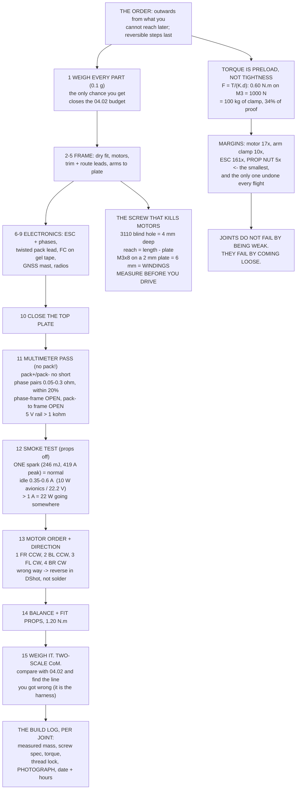

# 04.05 Building Hermon: the full assembly (practical)

<!-- glance:start -->
<!-- generated by tools/build.py from curriculum/syllabus.yaml — edit the syllabus, not this block -->

| | |
|---|---|
| **Track** | Main path |
| **Difficulty** | Intermediate |
| **Time** | 4 h |
| **Hardware** | First flight (Hermon core) (stage 1) |
| **Software** | none |
| **Prerequisites** | [04.04 Mounting, vibration isolation and the payload bay](04.04-mounting-and-vibration.md)<br>[03.07 Charging, balancing and storage](../03-power-system/03.07-charging-balancing-storage.md) |
| **Skip if** | Hermon is built, every joint is documented, and the first power-up passed the smoke test with props off. |

<!-- glance:end -->

## What you will learn

- The **assembly order**, and why it is that order rather than any other
- Torque, **preload**, and why every fastener number on a drone looks too small
- Which thread lock goes where, and the three places you must never put it
- **The screw that kills motors** — a two-minute check that saves a ₪180 part
- The **multimeter pass**: five measurements before the pack ever touches the aircraft
- The **smoke test**, with the numbers your meter should show at each step
- Motor numbering, motor direction, and how to fix a wrong one
- What goes in the **build log**, and why the photographs matter more than the notes

## Why it matters

Four lessons of design become one aircraft here. [04.01](04.01-frames.md) chose the frame,
[04.02](04.02-mass-and-center-of-mass.md) budgeted the mass and placed the centre of it,
[04.03](04.03-wiring-harness.md) sized and routed every wire, and
[04.04](04.04-mounting-and-vibration.md) decided how each component is held. This lesson is the
four hours in which all of that either happens or quietly does not.

Two things make a build go wrong, and neither is difficulty.

**Irreversibility.** A screw driven 6 mm too far into a motor shorts a winding, and no amount of
care afterwards recovers it. A soldering iron on a live pack is a short circuit with a handle. An
ESC plugged in backwards is a puff of smoke and a new ESC. The countermeasure is not skill; it is
**sequence** — do the reversible things first and check before every irreversible one.

**Undocumented decisions.** You will make about sixty small decisions in this build — this screw
not that one, this routing not that one, this torque. In four weeks, when the aircraft does
something strange, every one of those decisions is a candidate and you will remember none of
them. The build log is not paperwork. It is the diagnostic tool that modules 06, 07 and 11 will
ask you for.

## Prerequisites

<!-- prereqs:start -->
## Prerequisites

You need these first:

- [04.04 Mounting, vibration isolation and the payload bay](04.04-mounting-and-vibration.md)
- [03.07 Charging, balancing and storage](../03-power-system/03.07-charging-balancing-storage.md)

### Optional prerequisite links

None.

Check your readiness: `python course.py why 04.05`
<!-- prereqs:end -->

## Concept

### The order, and why it is the order

Build outwards from the things you cannot get at later, and leave the reversible steps as late as
possible.

| # | Step | Why here |
|---|---|---|
| 1 | **Weigh every part** on a 0.1 g scale and write it down | The only chance you get. Closes [04.02](04.02-mass-and-center-of-mass.md)'s budget |
| 2 | Dry-fit the frame with no wires and no thread lock | Finds a bent plate or a missing screw while it is free |
| 3 | Fit motors to arm clamps, **check screw length first** | Motors are the most expensive irreversible mistake |
| 4 | Trim and route the motor leads inside the arms | Cannot be done after the plates close |
| 5 | Fit the arms to the bottom plate | The last step with full access to both sides |
| 6 | Mount the ESC and solder the motor phases | Needs access; direction is fixed later in software |
| 7 | Make the pack lead, twisted, with its grommet and strain relief | [04.03](04.03-wiring-harness.md) |
| 8 | Mount the flight controller on gel tape, arrow forward | [04.04](04.04-mounting-and-vibration.md) |
| 9 | Fit GNSS mast, receiver, telemetry radio, buzzer | Light, movable, last to be trimmed |
| 10 | Close the top plate | The point of no easy return |
| 11 | **Multimeter pass** | Before any energy enters the aircraft |
| 12 | **Smoke test**, propellers off | The first energy |
| 13 | Motor order and direction, propellers off | Software; reversible |
| 14 | Balance and fit propellers, torque the nuts | Last, because everything before this is safer without them |
| 15 | Weigh the finished aircraft; find the CoM on two scales | Closes the loop on 04.02 |

Steps 1, 11, 12 and 15 are the ones people skip and the ones that pay for themselves.

### Torque and preload: why the numbers look so small

A bolted joint is not held together by the screw's shear strength. It is held by **friction
between the clamped faces**, and the friction comes from the **preload** — the tension you put in
the screw by torquing it.

$$F_{preload} = \frac{T}{K d}$$

with $K \approx 0.20$ for dry steel threads and $d$ the nominal diameter. So 0.60 N·m on an M3 is
1,000 N of clamp — a hundred kilograms — and that is why the torque figures on a drone look
absurdly small next to the forces involved.

| Screw | Torque | Preload | % of proof load | Friction available |
|---|---:|---:|---:|---:|
| M2 class 8.8 | 0.25 N·m | 625 N | 52 % | 94 N |
| M2.5 class 8.8 | 0.50 N·m | 1,000 N | 51 % | 150 N |
| M3 class 8.8 | 0.90 N·m | 1,500 N | 51 % | 225 N |
| **M3, reduced for carbon** | **0.60 N·m** | **1,000 N** | **34 %** | **150 N** |
| M4 class 8.8 | 2.00 N·m | 2,500 N | 49 % | 375 N |
| M5 propeller nut | 1.20 N·m | 1,200 N | 15 % | 180 N |

A correctly torqued fastener sits at **50–75 % of its proof load**, and that is the design, not a
risk. An under-torqued screw frets, works loose and fails; a properly preloaded one does not move
at all. The carbon row is reduced deliberately: carbon plate crushes under a small steel washer
long before the screw yields, so you trade preload for not damaging the laminate — and you make
up for it with thread lock.

Now check whether the joints actually hold. Two different mechanisms:

- **Torque about the clamped face** is resisted by friction: $M = \mu F n r$.
- **Bending** is resisted by preload: the joint opens when $M > F s$, with $s$ the spacing between
  the bolt rows.

| Joint | n | Mode | Capacity | Load | Margin |
|---|---:|---|---:|---:|---:|
| Motor to arm clamp | 4 | friction | 4.80 N·m | 0.28 N·m | 17× |
| Arm clamp to plate | 2 | preload | 24.00 N·m | 2.48 N·m | 10× |
| ESC to standoffs | 4 | friction | 12.00 N·m | 0.07 N·m | 161× |
| **Propeller nut** | 1 | friction | **1.44 N·m** | **0.28 N·m** | **5×** |

> [!IMPORTANT]
> **Nothing on this aircraft is close to failing in strength, and the propeller nut has the
> smallest margin on it.** It is also the only joint that is undone and redone before every
> flight. That combination is why a loose propeller nut is the number-one item on every
> pre-flight checklist ever written, and why [04.06](04.06-preflight-and-airworthiness.md) opens
> with it. **Joints on a drone do not fail because they were too weak. They fail because they
> came loose.**

### Thread lock: where, and where not

| Grade | Colour | Where on Hermon |
|---|---|---|
| Medium strength (242/243) | Blue | Motor screws, arm-clamp screws, standoffs, anything steel-into-steel that must not move and must be serviceable |
| High strength (270/271) | Red | **Nowhere.** You will never get it apart without heat, and heat near carbon or a motor is not a tool you have |
| Low strength (222) | Purple | M2 and smaller, where blue would exceed the screw's strength on removal |

Three places you must **not** put thread lock:

1. **Nylon, plastic or 3D-printed parts.** Anaerobic thread lock attacks many plastics and will
   crack a printed mount days later.
2. **Propeller nuts on a self-tightening thread.** They are designed to tighten under torque; the
   nyloc insert or the shoulder does the job.
3. **Anything you intend to adjust**, including the battery strap hardware and the GNSS mast
   clamp.

And one rule about nylocs: **a nyloc nut is single-use in principle and three-use in practice.**
If it spins on by hand, it is finished.

### The screw that kills motors

A 3110-class motor has blind mounting holes about **4 mm** deep. Below the bottom of the thread
are the stator windings. How far a screw reaches into the motor is simply length minus plate
thickness:

| Screw | 2.0 mm plate | 2.5 mm plate | 3.0 mm plate | 4.0 mm plate |
|---|---|---|---|---|
| M3 × 6 | 4.0 mm ok | 3.5 mm ok | 3.0 mm ok | 2.0 too short |
| M3 × 8 | **6.0 WINDINGS** | **5.5 WINDINGS** | **5.0 WINDINGS** | 4.0 mm ok |
| M3 × 10 | **8.0 WINDINGS** | **7.5 WINDINGS** | **7.0 WINDINGS** | **6.0 WINDINGS** |
| M3 × 12 | **10.0 WINDINGS** | **9.5 WINDINGS** | **9.0 WINDINGS** | **8.0 WINDINGS** |

Read the M3 × 12 row. On a 2 mm plate that screw reaches 10 mm into a 4 mm hole. It does not
strip and it does not stop — it drives straight through the base and shorts a winding, and the
motor is scrap. It will often still spin on the bench, badly, which is worse than failing
outright.

**Measure every screw against the hole before you drive it.** Two minutes, four motors, ₪720 of
parts.

### The multimeter pass: five measurements, no pack

Propellers off, pack in its bag on the other side of the bench.

| Measure | Expect | What a wrong reading means |
|---|---|---|
| Pack + to pack − | No short; rises as the caps charge | A dead short is a reversed capacitor or a solder bridge |
| Each motor phase pair | 0.05–0.3 Ω, all four within 20 % | A low reading is a shorted turn |
| Any phase to the frame | Open | A chafed lead inside an arm |
| Pack − to the frame | Open | Carbon conducts; a reading is a ground fault |
| 5 V rail to ground | > 1 kΩ | A low reading is a reversed cap or a short |

The phase-to-phase check is the one people skip. A 3110's phase-to-phase resistance is about
**0.15 Ω**. A motor reading 20 % low has a shorted turn, and at full throttle it draws roughly
**1.25×** the current of the others — it is the one that will burn, and it will do it in the air.

### The smoke test

Plugging a 6S pack into a 1,000 µF capacitor bank puts **246 mJ** into the connector and draws a
peak of about **419 A** for a few microseconds
([03.04](../03-power-system/03.04-power-distribution.md)). **The spark is normal.** A spark that
*keeps going* is not.

| # | Step | Expect | Stop if |
|---|---|---|---|
| 1 | Propellers off, pack on the bench | — | anything is warm |
| 2 | Plug in, count to five | one spark | a second spark, or smoke |
| 3 | Idle current, nothing armed | 0.35–0.6 A | > 1 A |
| 4 | Touch the ESC, FC, BEC, XT60 | cool | anything warm |
| 5 | USB to the ground station | boots | no heartbeat in 10 s |
| 6 | Motor test, 5 % each in turn | spins, quiet | a motor is silent |
| 7 | Check each direction | per the diagram | any wrong → swap two phases |
| 8 | Arm, 10 % throttle, 5 s | all four smooth | any stutter |
| 9 | Unplug, touch everything | hand-warm | too hot to hold |

Step 3's number is not a guess. The flight controller, GNSS, receiver and telemetry radio are
about **10 W** of the hover budget ([03.05](../03-power-system/03.05-power-budget.md)), which on
22.2 V is **0.45 A**. Add the ESC's own standby and 0.35–0.6 A is the window. **One amp means
something is dissipating 22 W with the propellers off**, and you have a few seconds to find out
what before it becomes visible.

### Motor numbering and direction

ArduPilot's Quad X layout, looking down from above with the nose away from you:

| Motor | Position | Direction | Propeller |
|---|---|---|---|
| 1 | Front right | **CCW** | CCW ("pusher") |
| 2 | Back left | **CCW** | CCW |
| 3 | Front left | **CW** | CW ("normal") |
| 4 | Back right | **CW** | CW |

Two diagonally opposite motors spin the same way, which is what cancels the yaw torque
([01.02](../01-flight-physics/01.02-newton-torque-quad.md)).

To reverse a brushless motor you **swap any two of its three phases** — or, on a DShot ESC, set
the direction in software and never touch the solder ([02.04](../02-motors-escs-props/02.04-esc-firmware.md)).
Prefer the software route: it is reversible, it is logged, and it does not put an iron near a
finished harness.

> [!TIP]
> **Ask your teacher:** "My motor test spins all four motors and they all sound identical, but
> motor 3 is turning the wrong way and I am using DShot. Walk me through exactly what happens if
> I arm it like that — what the mixer commands, what the aircraft does in the first half second,
> and why the yaw axis is where it shows up first."

### The build log

For every joint, record five things:

1. The part, with its **actually measured mass** in grams.
2. The screw: size, length, head type, how many.
3. The torque, and whether you used thread lock.
4. **A photograph, taken before the heatshrink went on.**
5. The date, and the airframe hours at the time.

The measured-mass column closes [04.02](04.02-mass-and-center-of-mass.md)'s budget. The torque
column is what [04.06](04.06-preflight-and-airworthiness.md) has you re-check at every
twenty-flight service. And the photographs are the fastest diagnostic you will ever have — when
something is wrong inside an arm you closed three weeks ago, a photograph beats disassembly every
single time.

## Technical explanation

### Level 1 — Intuition: a screw is a very stiff spring

Turning a screw stretches it. A stretched screw pulls the two parts together, and the friction
between them is what carries the load. The screw itself hardly ever sees the working force
directly.

That is why torque matters so much and why "just tight" is not a specification. Too little and
the joint relies on the screw's shear — it fretts, elongates the hole, and works loose. Too much
and you crush the carbon or strip the thread. The right number is the one that puts the screw at
about half to three-quarters of the tension it can take.

### Level 2 — Practical: the tools that matter

| Tool | Why |
|---|---|
| 0.1 g kitchen scale | Step 1. Every part, before it goes on |
| Torque driver, 0.2–2 N·m | The difference between a specification and a hope |
| 60–80 W iron, chisel tip | [04.03](04.03-wiring-harness.md) proved a 25 W iron cannot do it |
| Multimeter with continuity | The five-measurement pass |
| Watt meter or an inline current sensor | Step 3's 0.35–0.6 A |
| Propeller balancer, ~₪40 | [02.09](../02-motors-escs-props/02.09-heat-vibration-noise.md) |
| Two kitchen scales | The CoM measurement in [04.02](04.02-mass-and-center-of-mass.md) |
| A phone camera | Every joint, before the heatshrink |

### Level 3 — Mathematics: preload, friction and joint separation

The preload from an applied torque, with $K$ the nut factor (0.20 dry, 0.15 lubricated — which is
why you never oil a threadlocked screw):

$$F = \frac{T}{Kd}$$

A joint resisting **torque about its clamped face** slips when the applied moment exceeds the
friction moment:

$$M_{slip} = \mu F n r$$

A joint resisting **bending** separates when the applied moment exceeds the preload times the
bolt-row spacing:

$$M_{open} = F s$$

And the reason a loose joint destroys itself rather than merely being loose: once it slips, the
screw carries the load in shear at a stress concentration, the hole elongates, the preload falls
further, and the cycle accelerates. There is no stable partly-tight state.

### Level 4 — Implementation: Hermon's fastener schedule

| Joint | Screw | Torque | Thread lock |
|---|---|---:|---|
| Motor to arm clamp | M3 × 6 cap head, ×4 | 0.60 N·m | Blue |
| Arm clamp to plate | M3 × 10 cap head, ×2 | 0.60 N·m | Blue |
| Plate standoffs | M3 × 20 + M3 nyloc | 0.60 N·m | Blue on the standoff, nyloc on top |
| ESC to standoffs | M3 × 8, ×4 | 0.60 N·m | Blue |
| FC to top plate | Gel tape, no screws | — | — |
| GNSS mast clamp | M3 × 8 | hand tight + nyloc | **None** (adjustable) |
| Landing feet | M3 × 12 + nyloc | 0.60 N·m | Blue |
| Propeller nut | M5 self-tightening | 1.20 N·m | **None** |
| Battery strap hardware | M3 × 8 + nyloc | hand tight | **None** (adjustable) |

Every screw length in that table assumes a 2 mm plate. **Recheck them against your own plate
thickness** using the table above before you drive a single one.

## Diagram



## Code

Save as `build.py` and run `python build.py`. Standard library only.

```python
"""04.05 - the build: torque, thread engagement, and the smoke test."""
import math

G = 9.81
T_MAX_N = 13.43           # N per motor at full throttle
Q_MAX_NM = 0.276          # N.m shaft torque per motor at full throttle
V_PACK = 22.2
I_HOVER, I_FULL = 10.2, 57.0
C_BANK_UF = 1000.0        # the ESC's input capacitance

K_NUT = 0.20              # nut factor, dry steel into aluminium/steel
MU = 0.15                 # friction coefficient, dry clamped joint
# screw, dia mm, torque N.m (dry, class 8.8 into steel), proof load N
SCREWS = [("M2 class 8.8", 2.0, 0.25, 1200),
          ("M2.5 class 8.8", 2.5, 0.50, 1970),
          ("M3 class 8.8", 3.0, 0.90, 2920),
          ("M3, reduced for carbon", 3.0, 0.60, 2920),
          ("M4 class 8.8", 4.0, 2.00, 5090),
          ("M5 propeller nut", 5.0, 1.20, 8240)]

# joint, screw, count, lever m, mode, what the load is, load N.m
JOINTS = [("motor to arm clamp", "M3, reduced for carbon", 4, 0.008,
           "friction", "motor reaction torque", Q_MAX_NM),
          ("arm clamp to plate", "M3, reduced for carbon", 2, 0.024,
           "preload", "arm bending at full thrust", T_MAX_N * 0.185),
          ("ESC to standoffs", "M3, reduced for carbon", 4, 0.020,
           "friction", "its own 38 g at 10 g", 0.038 * 10 * G * 0.020),
          ("propeller nut", "M5 propeller nut", 1, 0.008,
           "friction", "propeller reaction torque", Q_MAX_NM)]

# what you measure BEFORE the first power-up
CHECKS = [
    ("pack + to pack -", "no short", "open, then rising as the caps charge"),
    ("each motor phase pair", "0.05-0.3 ohm", "all four motors within 20 %"),
    ("any phase to frame", "open", "a reading here is a chafed lead"),
    ("pack - to frame", "open", "carbon conducts; a reading is a ground fault"),
    ("5 V rail to GND", "> 1 kohm", "a low reading is a reversed cap or a short"),
]


def preload_n(torque_nm, dia_mm):
    """F = T / (K d): the classic fastener preload estimate."""
    return torque_nm / (K_NUT * dia_mm / 1000)


def bar(t):
    print("\n" + "=" * 70)
    print(t)
    print("=" * 70)


if __name__ == "__main__":
    bar("1. TORQUE, PRELOAD AND WHY THE NUMBERS ARE SO SMALL")
    print("  F = T / (K.d) with K = 0.20. Preload is what makes a joint;")
    print("  the screw's job is to CLAMP, not to carry shear.")
    print(f"  {'screw':30s} {'N.m':>6s} {'preload N':>10s}"
          f" {'% of proof':>11s} {'friction N':>11s}")
    for name, d, t, proof in SCREWS:
        f = preload_n(t, d)
        print(f"  {name:30s} {t:6.2f} {f:10.0f} {f / proof * 100:10.0f} %"
              f" {MU * f:10.0f}")
    print("  Note the % of proof column: a correctly torqued fastener sits")
    print("  at 50-75 % of its proof load. That is not a safety problem, it")
    print("  is the DESIGN -- a loose screw fails by fretting and backing")
    print("  out, a properly preloaded one does not move at all.")

    bar("2. DOES EACH JOINT ACTUALLY HOLD?")
    tbl = {n: (d, t, y) for n, d, t, y in SCREWS}
    print("  Two different mechanisms. A joint loaded in TORQUE about the")
    print("  clamped face is held by friction: M = mu.F.n.r. A joint loaded")
    print("  in BENDING is held by preload: it opens when M > F.s, where s")
    print("  is the spacing between the bolt rows.")
    print(f"  {'joint':22s} {'n':>2s} {'mode':>9s} {'capacity':>10s}"
          f" {'load':>10s} {'margin':>7s}")
    for joint, screw, n, lever, mode, what, load in JOINTS:
        d, t, proof = tbl[screw]
        f = preload_n(t, d)
        cap = MU * f * n * lever if mode == "friction" else f * lever
        print(f"  {joint:22s} {n:2d} {mode:>9s} {cap:7.2f} N.m"
              f" {load:7.2f} N.m {cap / load:6.0f}x")
    print("  Nothing here is close to failing in strength. Note the")
    print("  PROPELLER NUT: it has the smallest margin on the aircraft, and")
    print("  it is the one joint that is undone and redone every flight.")
    print("  Joints on a drone do not fail because they were too weak. They")
    print("  fail because they CAME LOOSE -- a vibration problem (04.04)")
    print("  and a thread-locking problem, not a strength problem.")

    bar("3. THE SCREW THAT KILLS MOTORS")
    hole = 4.0                      # mm of thread in a 3110's base
    print(f"  A 3110's mounting holes are blind, about {hole:.0f} mm deep.")
    print("  Below the bottom of the thread are the stator windings.")
    print("  How far a screw reaches INTO the motor = length - plate:")
    print(f"  {'screw':>8s}", end="")
    for plate in (2.0, 2.5, 3.0, 4.0):
        print(f" {str(plate) + ' mm plate':>14s}", end="")
    print()
    for length in (6, 8, 10, 12):
        print(f"  {'M3 x ' + str(length):>8s}", end="")
        for plate in (2.0, 2.5, 3.0, 4.0):
            reach = length - plate
            if reach > hole:
                tag = f"{reach:4.1f} WINDINGS"
            elif reach < 3.0:
                tag = f"{reach:4.1f} too short"
            else:
                tag = f"{reach:4.1f} mm  ok"
            print(f" {tag:>14s}", end="")
        print()
    print(f"  'ok' is {3.0:.0f}-{hole:.0f} mm of reach: 1.0 to 1.3 diameters of")
    print("  engagement, which is plenty in a steel-threaded motor base.")
    print("  Read the M3 x 12 row. On a 2 mm plate that screw reaches 10 mm")
    print("  into a 4 mm hole. It does not strip -- it drives straight")
    print("  through and shorts a winding, and the motor is scrap.")
    print("  MEASURE THE SCREW AGAINST THE HOLE. This is the single most")
    print("  common way a first build destroys a motor and it costs")
    print("  nothing to avoid.")

    bar("4. BEFORE THE FIRST POWER-UP: THE MULTIMETER PASS")
    print("  Props OFF. Pack NOT connected. Meter on the bench.")
    print(f"  {'measure':26s} {'expect':16s} note")
    for what, expect, note in CHECKS:
        print(f"  {what:26s} {expect:16s} {note}")
    r_phase = 0.15
    print(f"\n  Why phase-to-phase matters: a 3110's phase-to-phase")
    print(f"  resistance is about {r_phase:.2f} ohm. If one motor reads")
    print(f"  20 % low you have a shorted turn; at full throttle that")
    print(f"  motor draws roughly {1 / 0.8:.2f}x the current of the others")
    print(f"  and it is the one that will burn.")

    bar("5. THE SMOKE TEST, WITH NUMBERS TO CHECK AGAINST")
    e_spark = 0.5 * C_BANK_UF * 1e-6 * V_PACK ** 2
    i_inrush = V_PACK / 0.053          # 53 mohm of source + wiring (03.04)
    print(f"  Plugging in: {C_BANK_UF:.0f} uF charging to {V_PACK:.1f} V")
    print(f"    energy in the spark   {e_spark * 1000:.2f} mJ")
    print(f"    peak inrush current   {i_inrush:.0f} A (for microseconds)")
    print(f"    => THE SPARK IS NORMAL. A spark that KEEPS going is not.")
    print(f"\n  {'step':34s} {'expect':>12s} {'stop if':>22s}")
    steps = [
        ("1. props off, pack on a bench", "--", "anything is warm"),
        ("2. plug in, count to five", "one spark", "a second spark, or smoke"),
        ("3. idle current, nothing armed", "0.35-0.6 A", "> 1 A"),
        ("4. touch ESC, FC, BEC, XT60", "cool", "anything warm"),
        ("5. USB to ground station", "boots", "no heartbeat in 10 s"),
        ("6. motor test, 5 % each", "spins, quiet", "a motor is silent"),
        ("7. check each direction", "per the diagram", "any wrong -> swap 2"),
        ("8. arm, 10 % throttle, 5 s", "all four smooth", "any stutter"),
        ("9. unplug, touch everything", "hand-warm", "too hot to hold"),
    ]
    for s, e, stop in steps:
        print(f"  {s:34s} {e:>12s} {stop:>22s}")
    print(f"\n  Step 3's number: the FC, GNSS, receiver and telemetry radio")
    print(f"  together are about 10 W of the hover budget (03.05), which on")
    print(f"  {V_PACK:.1f} V is {10 / V_PACK:.2f} A. Add the ESC's own")
    print(f"  standby and you should see 0.35 to 0.6 A. One amp means")
    print(f"  something is dissipating 22 W with the propellers off.")

    bar("6. THE BUILD LOG -- WHAT TO RECORD FOR EVERY JOINT")
    fields = [
        "the part, with its actual measured mass in grams",
        "the screw: size, length, head type, and how many",
        "the torque you used, and whether you used thread lock",
        "a photograph, taken BEFORE the heatshrink went on",
        "the date, and the flight-hours reading when you did it",
    ]
    for i, f in enumerate(fields, 1):
        print(f"  {i}. {f}")
    print("  The measured-mass column closes the 04.02 budget. The torque")
    print("  column is what you check at every 20-flight service (04.06).")
    print("  The photographs are the fastest diagnostic you will ever have.")
```

Output:

```text

======================================================================
1. TORQUE, PRELOAD AND WHY THE NUMBERS ARE SO SMALL
======================================================================
  F = T / (K.d) with K = 0.20. Preload is what makes a joint;
  the screw's job is to CLAMP, not to carry shear.
  screw                             N.m  preload N  % of proof  friction N
  M2 class 8.8                     0.25        625         52 %         94
  M2.5 class 8.8                   0.50       1000         51 %        150
  M3 class 8.8                     0.90       1500         51 %        225
  M3, reduced for carbon           0.60       1000         34 %        150
  M4 class 8.8                     2.00       2500         49 %        375
  M5 propeller nut                 1.20       1200         15 %        180
  Note the % of proof column: a correctly torqued fastener sits
  at 50-75 % of its proof load. That is not a safety problem, it
  is the DESIGN -- a loose screw fails by fretting and backing
  out, a properly preloaded one does not move at all.

======================================================================
2. DOES EACH JOINT ACTUALLY HOLD?
======================================================================
  Two different mechanisms. A joint loaded in TORQUE about the
  clamped face is held by friction: M = mu.F.n.r. A joint loaded
  in BENDING is held by preload: it opens when M > F.s, where s
  is the spacing between the bolt rows.
  joint                   n      mode   capacity       load  margin
  motor to arm clamp      4  friction    4.80 N.m    0.28 N.m     17x
  arm clamp to plate      2   preload   24.00 N.m    2.48 N.m     10x
  ESC to standoffs        4  friction   12.00 N.m    0.07 N.m    161x
  propeller nut           1  friction    1.44 N.m    0.28 N.m      5x
  Nothing here is close to failing in strength. Note the
  PROPELLER NUT: it has the smallest margin on the aircraft, and
  it is the one joint that is undone and redone every flight.
  Joints on a drone do not fail because they were too weak. They
  fail because they CAME LOOSE -- a vibration problem (04.04)
  and a thread-locking problem, not a strength problem.

======================================================================
3. THE SCREW THAT KILLS MOTORS
======================================================================
  A 3110's mounting holes are blind, about 4 mm deep.
  Below the bottom of the thread are the stator windings.
  How far a screw reaches INTO the motor = length - plate:
     screw   2.0 mm plate   2.5 mm plate   3.0 mm plate   4.0 mm plate
    M3 x 6     4.0 mm  ok     3.5 mm  ok     3.0 mm  ok  2.0 too short
    M3 x 8   6.0 WINDINGS   5.5 WINDINGS   5.0 WINDINGS     4.0 mm  ok
   M3 x 10   8.0 WINDINGS   7.5 WINDINGS   7.0 WINDINGS   6.0 WINDINGS
   M3 x 12  10.0 WINDINGS   9.5 WINDINGS   9.0 WINDINGS   8.0 WINDINGS
  'ok' is 3-4 mm of reach: 1.0 to 1.3 diameters of
  engagement, which is plenty in a steel-threaded motor base.
  Read the M3 x 12 row. On a 2 mm plate that screw reaches 10 mm
  into a 4 mm hole. It does not strip -- it drives straight
  through and shorts a winding, and the motor is scrap.
  MEASURE THE SCREW AGAINST THE HOLE. This is the single most
  common way a first build destroys a motor and it costs
  nothing to avoid.

======================================================================
4. BEFORE THE FIRST POWER-UP: THE MULTIMETER PASS
======================================================================
  Props OFF. Pack NOT connected. Meter on the bench.
  measure                    expect           note
  pack + to pack -           no short         open, then rising as the caps charge
  each motor phase pair      0.05-0.3 ohm     all four motors within 20 %
  any phase to frame         open             a reading here is a chafed lead
  pack - to frame            open             carbon conducts; a reading is a ground fault
  5 V rail to GND            > 1 kohm         a low reading is a reversed cap or a short

  Why phase-to-phase matters: a 3110's phase-to-phase
  resistance is about 0.15 ohm. If one motor reads
  20 % low you have a shorted turn; at full throttle that
  motor draws roughly 1.25x the current of the others
  and it is the one that will burn.

======================================================================
5. THE SMOKE TEST, WITH NUMBERS TO CHECK AGAINST
======================================================================
  Plugging in: 1000 uF charging to 22.2 V
    energy in the spark   246.42 mJ
    peak inrush current   419 A (for microseconds)
    => THE SPARK IS NORMAL. A spark that KEEPS going is not.

  step                                     expect                stop if
  1. props off, pack on a bench                --       anything is warm
  2. plug in, count to five             one spark a second spark, or smoke
  3. idle current, nothing armed       0.35-0.6 A                  > 1 A
  4. touch ESC, FC, BEC, XT60                cool          anything warm
  5. USB to ground station                  boots   no heartbeat in 10 s
  6. motor test, 5 % each            spins, quiet      a motor is silent
  7. check each direction            per the diagram    any wrong -> swap 2
  8. arm, 10 % throttle, 5 s         all four smooth            any stutter
  9. unplug, touch everything           hand-warm        too hot to hold

  Step 3's number: the FC, GNSS, receiver and telemetry radio
  together are about 10 W of the hover budget (03.05), which on
  22.2 V is 0.45 A. Add the ESC's own
  standby and you should see 0.35 to 0.6 A. One amp means
  something is dissipating 22 W with the propellers off.

======================================================================
6. THE BUILD LOG -- WHAT TO RECORD FOR EVERY JOINT
======================================================================
  1. the part, with its actual measured mass in grams
  2. the screw: size, length, head type, and how many
  3. the torque you used, and whether you used thread lock
  4. a photograph, taken BEFORE the heatshrink went on
  5. the date, and the flight-hours reading when you did it
  The measured-mass column closes the 04.02 budget. The torque
  column is what you check at every 20-flight service (04.06).
  The photographs are the fastest diagnostic you will ever have.
```

## Exercise

> [!WARNING]
> **This is the lesson with the real hazards in it.** Propellers stay off the aircraft until step
> 14, and the pack stays in its bag until step 12. Never solder with a battery connected — an
> iron across 22.2 V is a short circuit with a handle. Wear eye protection when you cut carbon or
> trim zip ties, and do not breathe carbon dust: cut it wet or outdoors, and vacuum, never blow.
> For the first arm, the aircraft is restrained, the propellers are off, and nobody is in the
> plane of rotation. Read [SAFETY.md](../SAFETY.md) before you start and keep it open.

### Exercise 04.05-E1 — Build it `[hardware]`

Work through steps 1–15 in order. Do not skip steps 1, 11, 12 or 15.

1. Record the measured mass of every part as you fit it.
2. Photograph every joint before it is covered.
3. Record the torque and thread lock for every fastener.
4. Report the total time it took you, honestly, and which step took longest.

### Exercise 04.05-E2 — Close the mass budget `[analysis]`

1. Total your measured masses and compare with your
   [04.02](04.02-mass-and-center-of-mass.md) prediction, line by line.
2. State the three largest discrepancies and which direction they went.
3. Convert the total difference into watts (×0.223) and minutes (×0.0223).
4. Measure the finished aircraft's CoM with the two-scale method and compare with your prediction.
   Report the error in millimetres and the pack position that corrects it.

### Exercise 04.05-E3 — Your own fastener schedule `[coding]`

Extend the script with **your** parts.

1. Replace the `SCREWS` and `JOINTS` tables with your own sizes, torques and lever arms, and
   report the margin on each joint.
2. Regenerate the screw-length matrix for your plate thickness and your motor's hole depth —
   **measure the hole depth**, do not assume 4 mm.
3. Identify the joint with the smallest margin on your aircraft and state what you will do about
   it.

### Exercise 04.05-E4 — The smoke test, measured `[measurement]`

1. Perform the five multimeter measurements and record every value, not just "passed".
2. Record the idle current, and compare with the 0.35–0.6 A window.
3. Run the motor test at 5 % and record which motor is which number and which way each turns.
4. After the first 5-second armed run, record the temperature of the ESC, the XT60 and each
   motor. Anything more than about 20 K above ambient is a finding, not a result.

## Expected result

- **04.05-E1:** four to six hours for a first build, and the step that takes longest is almost
  always soldering the motor phases — twelve joints, each needing a properly hot iron.
- **04.05-E2:** a measured dry mass between about 730 g and 800 g. Landing 5–10 % over a catalogue
  budget is normal. The three largest discrepancies are usually the wiring harness, the hardware
  line, and the frame, in that order. Your CoM should be within 5 mm of prediction; if it is not,
  the harness is not where you drew it.
- **04.05-E3:** the propeller nut will have the smallest margin on your aircraft too. That is a
  property of small multirotors, not of your build.
- **04.05-E4:** all five measurements clean, idle current in the window, all four motors spinning
  at 5 %, and everything hand-warm after five seconds. If any motor is silent, the phase joints
  are the first suspect; if everything is silent, check the arming switch and the safety switch
  before anything else.

## Troubleshooting

### Symptom: a motor does not spin during the motor test

In order: check the ESC output the ground station is actually commanding (motor A is not always
motor 1), check the three phase joints with a meter, check the phase-to-phase resistance against
the other three motors, and only then suspect the ESC. A motor that spins roughly or "cogs" has
one phase disconnected — that is two of the three joints working and one not.

### Symptom: a motor spins the wrong way

Set the direction in your ESC's configurator (BLHeli32/AM32) or with ArduPilot's motor-direction
parameters. Do not unsolder phases on a finished harness unless you have no software option;
every joint you reopen is a joint you have to re-test.

### Symptom: idle current is over one amp

Something is dissipating 22 W with no propellers turning. Unplug immediately. The usual causes are
a partially shorted BEC output, a reversed capacitor, a solder bridge on the ESC's signal header,
or a GNSS/telemetry device wired to the wrong rail. Go back to the multimeter pass — the five
measurements will find it.

### Symptom: the frame will not sit flat / an arm is twisted

Loosen every arm clamp, put the aircraft on a flat surface, press it down and retighten from the
centre outwards in a diagonal pattern, like a wheel. If one arm still sits proud, the plate or
the clamp is out of tolerance — [04.01](04.01-frames.md)'s buying checklist covers what to look
for. Do not shim it with anything soft; a shim under a clamp is a joint that will come loose.

### Symptom: a screw turns forever and never tightens

The thread is stripped. In a motor base that usually means the screw was too long and bottomed
out. Do **not** fit a longer screw. Fit a slightly larger one if the motor's base allows it, or
replace the motor. In a carbon plate, use a through-bolt with a nyloc instead of a tapped
standoff.

### Symptom: the aircraft weighs 15 % more than the budget

Weigh each subassembly and compare with its budget line. The wiring harness, the hardware line
and the frame are the three that are almost always short — see
[04.03](04.03-wiring-harness.md)'s reconciliation, and check in particular that you have not
counted the motor leads in two places or in none.

### Symptom: the ESC gets warm during the 10 % armed run

Ten per cent throttle on the bench is a few amps and should produce no measurable heat. Warmth
means switching losses from a bad timing setting
([02.10](../02-motors-escs-props/02.10-esc-tuning.md)), a partially shorted phase, or a motor with
a shorted turn. Check the phase resistances again before you fly it.

## Common mistakes

- **Not weighing parts before fitting them.** Step 1 is the only chance you get, and without it
  [04.02](04.02-mass-and-center-of-mass.md)'s budget stays a prediction forever.
- **Driving a screw into a motor without checking its length.** M3 × 8 into a 2 mm plate reaches
  6 mm into a 4 mm hole. The motor is scrap and it may still spin.
- **Red thread lock.** You will never get it apart, and the heat needed is heat you cannot apply
  near carbon or a motor.
- **Thread lock on plastic.** It attacks many plastics and cracks printed parts days later.
- **Skipping the multimeter pass** because "it looks fine". Five measurements, two minutes, and
  they catch the two faults that destroy hardware.
- **Doing the smoke test with propellers on.** There is no version of this that ends well.
- **Reversing a motor by unsoldering phases when DShot would do it in software.** Reversible
  beats permanent.
- **Torquing by feel.** 0.60 N·m on an M3 is 1,000 N of preload; your fingers cannot resolve
  ±50 % of that, and ±50 % is the difference between a joint that holds and one that fretts.
- **Not photographing joints before covering them.** The photograph is worth an hour of
  disassembly, every time.
- **Fitting propellers before the direction check.** Step 13 before step 14, always.

## Knowledge check

<details>
<summary>Why is 0.60 N·m the right torque for an M3 into a carbon plate when 0.90 N·m is the right torque for the same screw into steel?</summary>

Because the limit is not the screw, it is the **laminate**. At 0.90 N·m the M3 carries 1,500 N of
preload — 51 % of its proof load, which the screw is perfectly happy with — but that force under
a small washer crushes and delaminates carbon plate. Reducing to 0.60 N·m gives 1,000 N, which the
plate survives, and you make up the loss of security with blue thread lock rather than with more
torque. Use a larger washer if you want the preload back.
</details>

<details>
<summary>You have M3 × 8 screws and a 2 mm arm clamp. Your motor's blind holes are 4 mm deep. What happens, and what do you do?</summary>

The screw reaches **6 mm** into a **4 mm** hole. It does not stop at the bottom of the thread — it
drives through the base and shorts a stator winding. The motor is scrap, and it will often still
spin badly on the bench, which is worse than failing outright. You need M3 × 6, giving 4 mm of
reach and about 1.3 diameters of engagement, which is plenty in a steel-threaded base. **Measure
every screw against the hole before you drive it.**
</details>

<details>
<summary>Every joint on Hermon has a strength margin between 5× and 161×. So why do joints fail on drones?</summary>

Because they **come loose**, not because they break. A bolted joint is held by friction generated
by preload; once vibration lets the preload fall, the joint slips, the screw starts carrying the
load in shear at a stress concentration, the hole elongates, the preload falls further, and it
accelerates. There is no stable partly-tight state. That is why the answer is thread lock,
correct torque and a periodic re-check — not bigger screws.
</details>

<details>
<summary>Your idle current with nothing armed and no propellers is 1.4 A. What is that telling you and what do you do?</summary>

Unplug. The flight controller, GNSS, receiver and telemetry radio total about 10 W, which on
22.2 V is 0.45 A; with the ESC's standby the expected window is 0.35–0.6 A. At 1.4 A something is
dissipating about **31 W** with nothing turning, and in a few seconds that will be visible. Go
back to the five-measurement multimeter pass: the usual causes are a partially shorted BEC, a
reversed capacitor, a solder bridge on a signal header, or a device wired to the wrong rail.
</details>

<details>
<summary>The spark when you plug in the pack — is it a fault?</summary>

No. A 6S pack charging a 1,000 µF ESC capacitor bank delivers about **246 mJ** into the connector
at a peak of roughly **419 A** for a few microseconds
([03.04](../03-power-system/03.04-power-distribution.md)). That is the spark, it is expected, and
it is why anti-spark connectors exist. What is **not** normal is a spark that keeps going, a
second spark, or any smoke — that is a genuine short and you should already have unplugged.
</details>

<details>
<summary>On an ArduPilot Quad X, which motors turn which way, and why does it have to be that way?</summary>

Motor 1 (front right) and motor 2 (back left) turn **counter-clockwise**; motors 3 (front left)
and 4 (back right) turn **clockwise**. Diagonally opposite motors share a direction so that the
two CCW reaction torques cancel the two CW ones in a hover
([01.02](../01-flight-physics/01.02-newton-torque-quad.md)). Differential torque between the two
pairs is the *only* source of yaw authority, which is why
[04.02](04.02-mass-and-center-of-mass.md) found yaw to be about 48× weaker than roll.
</details>

<details>
<summary>Why does the build log ask for a photograph of every joint before the heatshrink goes on?</summary>

Because three weeks later, when something inside a closed arm is wrong, the photograph is the
difference between five minutes and an afternoon of disassembly. It also records things you did
not think to write down — the routing, the slack, how much wire is actually in there, whether the
grommet went on. Of the five fields in the log, the photograph is the one that repays itself most
often.
</details>

## Practical challenge

Produce **`docs/build-log.md`** — the aircraft's birth certificate.

1. The measured mass of every part, in a column next to the
   [04.02](04.02-mass-and-center-of-mass.md) prediction, with a total and a difference.
2. The fastener schedule you actually used: joint, screw size and length, count, torque, thread
   lock.
3. Your five multimeter readings, as numbers.
4. Your smoke-test results: idle current, each motor's number and direction, the temperatures
   after the 5-second run.
5. The finished aircraft's measured mass and measured CoM, and the pack position that centres it —
   clean and with the payload.
6. A photograph index: every joint, dated.
7. **One paragraph of things you would do differently.** Write it now, while you remember.

This document plus `docs/frame.md` ([04.01](04.01-frames.md)), `docs/mass-and-balance.md`
([04.02](04.02-mass-and-center-of-mass.md)), `docs/harness.md`
([04.03](04.03-wiring-harness.md)) and `docs/mounting.md`
([04.04](04.04-mounting-and-vibration.md)) is the aircraft's design file. Keep it with the
aircraft for as long as the aircraft exists.

## You can skip this if

Hermon is built; every joint is documented with its screw, torque and thread lock; every part was
weighed before fitting and the budget closes against the measurement; the five multimeter checks
were made and recorded as numbers; the first power-up passed the smoke test with propellers off
and the idle current inside 0.35–0.6 A; all four motors are numbered and turning the correct way;
and the finished aircraft's mass and centre of mass have been measured and compared with the
prediction.

## Go deeper

- [02.09](../02-motors-escs-props/02.09-heat-vibration-noise.md) (earlier): balancing the
  propellers you fit in step 14.
- [03.04](../03-power-system/03.04-power-distribution.md) (earlier): where the 419 A inrush and
  the 246 mJ spark come from.
- [04.02](04.02-mass-and-center-of-mass.md) (earlier): the budget this build closes.
- [04.03](04.03-wiring-harness.md) (earlier): the soldering this build does twelve times.
- [04.06](04.06-preflight-and-airworthiness.md) (next): the checklist that keeps it airworthy,
  starting with the propeller nut.
- [11.01](../11-first-flights/11.01-first-flight.md) (later): the first hover, which this
  document is the prerequisite for.
- Bolted joint preload and the nut factor:
  https://en.wikipedia.org/wiki/Bolted_joint
- ArduPilot's motor order and direction diagrams for every frame class:
  https://ardupilot.org/copter/docs/connect-escs-and-motors.html

## Progress checkpoint

Run `python course.py complete 04.05` when the aircraft is built, the smoke test has passed and
`docs/build-log.md` is written. Next: [04.06](04.06-preflight-and-airworthiness.md) — the aircraft
exists; now learn to decide, in four minutes and before every flight, whether it is fit to fly.
