# 04.06 Pre-flight inspection, prop safety and airworthiness

<!-- glance:start -->
<!-- generated by tools/build.py from curriculum/syllabus.yaml — edit the syllabus, not this block -->

| | |
|---|---|
| **Track** | Main path |
| **Difficulty** | Intermediate |
| **Time** | 1 h |
| **Hardware** | First flight (Hermon core) (stage 1) |
| **Software** | none |
| **Prerequisites** | [04.05 Building Hermon: the full assembly (practical)](04.05-building-hermon.md) |
| **Skip if** | You have written and used a pre-flight checklist for Hermon that catches a loose prop nut, a chafed wire and a stale compass calibration. |

<!-- glance:end -->

## What you will learn

- What a spinning propeller is actually carrying: **9 J at hover, 34 J at full throttle**, and
  what that does to a finger
- Why a checklist works, in arithmetic rather than exhortation — and why it works *even when you
  are careful*
- Hermon's **three-minute pre-flight**, item by item, with what each item catches
- The longer-interval checks, and where their intervals come from
- **Arming discipline**: the rules that make the aircraft safe to stand next to
- What Hermon's ingress protection rating is (**IPX0**) and what that means in Negev dust,
  coastal salt and a 42 °C car
- What it costs per flight to keep flying, and why the checklist is the cheapest insurance on the
  aircraft
- Why the airworthiness decision is **binary**, and the three rules that keep it that way

## Why it matters

[04.05](04.05-building-hermon.md) found that every joint on Hermon has a strength margin between
5× and 161×, and that **the smallest margin on the aircraft belongs to the propeller nut** — the
one joint that is undone and redone before every flight.

That is the shape of the whole problem. Nothing on a well-designed multirotor fails because it
was too weak. Things fail because they **came loose**, or **chafed**, or **were calibrated three
hardware changes ago**. All three are visible, all three are cheap to find on the ground, and all
three are expensive to find at 30 metres.

A pre-flight inspection is not a ritual and it is not about being careful. It is a procedure that
converts a diffuse, hard-to-remember set of failure modes into a fixed sequence of ten things,
done identically every time, in about three minutes. This lesson works out what it catches, what
it costs, and why the arithmetic favours it so heavily.

## Prerequisites

<!-- prereqs:start -->
## Prerequisites

You need these first:

- [04.05 Building Hermon: the full assembly (practical)](04.05-building-hermon.md)

### Optional prerequisite links

None.

Check your readiness: `python course.py why 04.06`
<!-- prereqs:end -->

## Concept

### What a propeller is carrying

A 10 × 4.5 × 3 propeller weighs 12 g. Treat each of its three blades as a rod from hub to tip and
its moment of inertia is $I = mR^2/3 = 6.45\times10^{-5}$ kg·m². Then:

| Condition | rpm | Tip speed | | Energy | Force, stopping in 10 mm |
|---|---:|---:|---:|---:|---:|
| Idle | 1,500 | 19.9 m/s | 72 km/h | 0.80 J | 80 N |
| 30 % throttle | 3,048 | 40.5 m/s | 146 km/h | 3.29 J | 329 N |
| **Hover** | **5,060** | **67.3 m/s** | **242 km/h** | **9.06 J** | **906 N** |
| 80 % throttle | 7,915 | 105.3 m/s | 379 km/h | 22.16 J | 2,216 N |
| Full throttle | 9,836 | 130.8 m/s | 471 km/h | 34.22 J | 3,422 N |

The last column is what a blade delivers to a finger if it stops in 10 mm. **At hover that is
91 kilograms of force. At full throttle, 349.** And unlike a bullet, the motor keeps driving the
blade through whatever it hit.

For scale: an air-rifle pellet carries about 10 J. Hermon's propeller at hover carries the same
energy, in a 254 mm blade edge, and there are four of them.

> [!WARNING]
> **There is no version of a "quick test with the propellers on".** Not on the bench, not
> restrained, not "just to hear it". Every motor test, every direction check, every calibration
> and every configuration change happens with the propellers off. This is the one rule in this
> course that has no exceptions and no engineering judgement attached to it.

### Why a checklist works, in arithmetic

The case for a checklist is usually made by exhortation. Here it is as a calculation instead.

Hermon has about **24 fasteners that matter** — sixteen motor screws and eight arm-clamp screws.
Suppose each has a **0.2 %** chance per flight of losing enough preload to be detectable by hand.
That is a small number; it means a given screw goes five hundred flights before it needs
attention.

Then the chance that **at least one** of the 24 is loose after a single flight is
$1 - 0.998^{24} = 4.7\ \%$. And it compounds:

| Flights | No checks | With checks | Ratio |
|---:|---:|---:|---:|
| 1 | 4.7 % | 0.5 % | 10.0× |
| 5 | 21.4 % | 2.3 % | 9.2× |
| 10 | 38.2 % | 4.6 % | 8.3× |
| 20 | 61.7 % | 9.0 % | 6.9× |
| 50 | **90.9 %** | 21.0 % | 4.3× |
| 100 | **99.2 %** | 37.5 % | 2.6× |

After fifty flights with no checks, you are **91 % likely** to be flying with at least one loose
fastener on the aircraft. A checklist that catches 90 % of what it looks at brings that to 21 %.

> [!IMPORTANT]
> **The argument does not depend on you being careful.** It depends on you doing the same thing
> every time. A careful person who inspects thoroughly but inconsistently gets a lower catch rate
> than a bored person working through a fixed list, because the bored person never forgets an
> item. That is the entire idea behind checklists in aviation, and it is why they are read aloud
> rather than remembered.

### Hermon's pre-flight: ten items, three minutes

| Item | Time | What it catches |
|---|---:|---|
| Propeller nuts, all four, by hand | 20 s | the 5× margin joint ([04.05](04.05-building-hermon.md)) |
| Propeller blades: nicks, cracks, play | 20 s | imbalance and a thrown blade |
| Motor bells: spin each, feel for grit | 20 s | a dying bearing |
| Arms: grip and twist each one | 15 s | a loose clamp, a cracked tube |
| Wiring: chafe, strain relief, the trunk | 25 s | the [04.03](04.03-wiring-harness.md) failure modes |
| Pack: puffing, voltage, strap tension | 25 s | a swollen cell, a loose pack |
| CoM: lift by the centre — does it hang level? | 10 s | a pod or pack that moved |
| GNSS mast and antennas upright and clear | 10 s | interference, a poor fix |
| Sticks, switches, flight mode on the transmitter | 15 s | the wrong mode on arming |
| Ground station: its battery, the link, the home point | 20 s | no telemetry when it matters |

**Three minutes against a 22-minute flight — 14 % overhead.**

Three of those items deserve a note.

**The CoM check is one second of real information.** Lift the aircraft by a finger under the
centre plate. If it hangs level, the pack and the payload are where you left them. If it noses
down, something moved, and [04.02](04.02-mass-and-center-of-mass.md)'s trim table tells you what
it is about to cost you in pitch-down authority.

**The mode check is the one that prevents the most dramatic failures.** More first flights are
ruined by arming in the wrong mode than by any hardware fault. Look at the switch; say the mode
out loud.

**The ground station's own battery is on the list because it is not on the aircraft.** Nobody
thinks to check it, and the moment you need telemetry is exactly the moment you will not have it.

### The longer intervals, and where they come from

| Interval | Check | Time | Why this interval |
|---|---|---:|---|
| Every 10 flights | Compass calibration age | 5 s | Any hardware change invalidates it ([05.03](../05-sensors/05.03-compass-and-baro.md)) |
| Every 20 flights | Fastener torque check, all 24 | 4 min | From the 62 % figure above — the point at which "probably loose" becomes likely |
| Every 20 flights | Connector contacts: pitting, seating | 1 min | Inrush pits contacts a little every mate ([04.03](04.03-wiring-harness.md)) |
| Every 50 flights | Motor bearing free-spin time | 1 min | Compare against the number you recorded when new |
| Every 200 flights | Full disassembly inspection | 30 min | Roughly the pack's cycle life — a natural overhaul point |

The bearing check needs a baseline, so **record it during [04.05](04.05-building-hermon.md)**:
spin each bell by hand and count the seconds it takes to stop. A bearing that has gone from eight
seconds to three is telling you something that no amount of looking will.

### Arming discipline

Four rules, and they are about geometry as much as procedure.

1. **The only safe assumption is that it can arm at any moment.** Not "it is disarmed"; not "the
   safety switch is on". Treat a powered aircraft the way you would treat a loaded firearm.
2. **Nobody is in the plane of rotation.** A thrown blade leaves along the disc plane, not
   upwards. Stand *behind* the aircraft, never beside a spinning arm, and do not lean over it.
3. **Arm last, at the aircraft's distance, with the aircraft pointing away from you.** Then walk
   backwards.
4. **Disarm before you approach, and wait.** ArduPilot's `DISARM_DELAY` gives you an automatic
   disarm on the ground; do not rely on it, but do not disable it either.

And leave `ARMING_CHECK` fully enabled. Every check it refuses to arm for is a check that was
added because somebody's aircraft did something expensive. If it refuses, the answer is to find
out why, not to turn the check off.

> [!TIP]
> **Ask your teacher:** "My aircraft refuses to arm with a `PreArm: Compass not calibrated`
> message and I am at the field with 40 minutes of daylight left. Walk me through the argument
> for and against setting `ARMING_CHECK` to skip the compass just for today — what specifically
> is being protected, what the failure looks like in flight, and what a professional operator
> would actually do."

### Hermon's ingress protection is IPX0

Hermon has **no sealing at all**. Not IP54, not IP43 — nothing. The ESC is an open board, the
motors are open, the flight controller sits under a plate that keeps rain off it in the same way
a table keeps rain off the floor.

| Environment | What it does | The rule |
|---|---|---|
| Negev dust | Fine silica into motor bearings | Land on a mat, never on bare sand; blow out the bells afterwards |
| Coastal salt air | Corrodes solder joints and contacts | Do not rinse. Wipe down; inspect connectors every 20 flights |
| Dew, at a 05:00 launch | Condensation on a cold board at dawn | Let the case warm to ambient before you open it |
| A 42 °C parked car | PLA creeps at 60 °C; a LiPo ages four times faster | Never leave the aircraft or a pack in a car ([03.10](../03-power-system/03.10-lipo-in-israel.md)) |

And the rule that follows from having no rating at all: **if it is raining, or the grass is wet,
or there is spray, Hermon does not fly.** There is no judgement call to make. Water on a 22.2 V
board with no conformal coating is not a risk you manage; it is a fault you have already caused.

### What it costs to keep flying

A 22-minute flight is 0.37 flight-hours. At Israeli prices
([hardware/stage-1-first-flight.md](../hardware/stage-1-first-flight.md)):

| Part | ₪ each | Qty | Life | ₪/flight | ₪/hour |
|---|---:|---:|---:|---:|---:|
| Propellers | 20 | 4 | 50 flights | 1.60 | 4.36 |
| Motors | 180 | 4 | 100 hours | 2.64 | 7.20 |
| 6S 5000 pack | 443 | 1 | 200 flights | 2.21 | 6.04 |
| ESC, 4-in-1 | 400 | 1 | 300 hours | 0.49 | 1.33 |
| Arm tubes | 60 | 4 | 200 hours | 0.44 | 1.20 |
| XT60 / EC5 pair | 10 | 1 | 500 flights | 0.02 | 0.05 |
| **Total** | | | | **7.40** | **20.19** |

**Flying Hermon costs about ₪7 an outing in parts.** Rebuilding it after a crash costs about
**₪4,300** — which is **581 flights' worth of consumables**. Three minutes of checklist is the
cheapest insurance on the aircraft by a very wide margin, and that is before you count the
aircraft it did not land on.

### The airworthiness decision is binary

A pre-flight produces exactly one of two outputs: **GO** or **NO-GO**. It never produces "probably
fine".

1. **Any item you cannot complete is a NO-GO.** Not a note to self, not "I will watch it". If you
   cannot check the propeller nuts because you left the tool at home, the aircraft does not fly.
2. **Any finding you fix at the field means the whole checklist again, from the top.** Fixing one
   thing is exactly the circumstance in which you disturb another, and "I was already most of the
   way through" is how items get skipped.
3. **If you are rushing, tired, or being watched, you are exactly the person the checklist was
   written for.** Those three states are when the internal voice saying "it is fine" is loudest
   and least reliable.

Write the checklist down, laminate it or put it on your phone, and read it. Do not perform it
from memory — the whole value is in never forgetting an item, and memory is the component that
fails first.

## Technical explanation

### Level 1 — Intuition: the aircraft is a machine, not a pet

You do not "get a feel" for whether a bolted joint has lost preload. Preload is invisible and its
loss is gradual; by the time an arm feels loose it has been loose for several flights and the
hole has probably elongated. The checklist exists because human judgement is very good at
recognising a *change* it has seen before and very bad at noticing a slow drift it has not.

### Level 2 — Practical: writing your own checklist

1. **Ten items or fewer for the every-flight list.** Longer lists get skipped, and a skipped list
   catches nothing.
2. **Each item is a physical action with a pass/fail result**, not an observation. "Grip and
   twist each arm" beats "check the arms".
3. **Fixed order, always the same**, and physically walk the aircraft in that order so the
   sequence is spatial as well as written.
4. **Say each item out loud** and answer it out loud. This is not superstition: verbalising is
   what stops the eye from sliding over an item it has seen a hundred times.
5. **Put the longer-interval items on a separate sheet** with a flight counter, so the
   every-flight list stays at three minutes.

### Level 3 — Mathematics: why the odds compound the way they do

For $n$ independent fasteners each with per-flight failure probability $p$, the chance that at
least one is in a failed state after one flight is

$$P_1 = 1 - (1-p)^n$$

and over $N$ flights with no inspection between them, treating each flight as an independent
opportunity:

$$P_N = 1 - (1-P_1)^N$$

With an inspection that catches a fraction $c$ of existing faults, the residual per-flight
probability becomes $P_1(1-c)$ and the compounded figure falls accordingly. The interesting
property is in the **ratio** column of the table: the benefit of checking is largest in the first
few flights and shrinks as $N$ grows, because with enough flights *everything* eventually
approaches certainty. That is the mathematical argument for **also** having the 20-flight torque
check: the every-flight visual catches the loose ones, and the periodic torque check resets the
preload before it drifts.

### Level 4 — Implementation: Hermon's airworthiness card

The card that lives in the case, one side each:

**Side A — every flight (3 min).** The ten items above, in walking order, with a GO/NO-GO box.

**Side B — the counters.** Flight number, pack cycle number, airframe hours, and four tick boxes:
compass cal (10), torque + connectors (20), bearings (50), teardown (200). Update it in the field,
in pen, before you pack up.

## Diagram

```mermaid
flowchart TD
  PROP["WHAT A PROPELLER IS CARRYING<br/>10x4.5x3, 12 g, I = 6.45e-5 kg.m^2"]
  PROP --> PE["hover 5,060 rpm: tip 67 m/s, 9.1 J<br/>full  9,836 rpm: tip 131 m/s, 34.2 J<br/>stopping in 10 mm = 906 N / 3,422 N<br/>= 91 kg / 349 kg of force"]
  PE --> RULE0["AND THE MOTOR KEEPS DRIVING IT.<br/>THERE IS NO 'QUICK TEST WITH PROPS ON'."]

  ODDS["WHY A CHECKLIST, IN ARITHMETIC<br/>24 fasteners x 0.2% per flight<br/>=> 4.7% chance one is loose EVERY flight"]
  ODDS --> COMP["compounded with no checks:<br/>20 flights -> 62%<br/>50 flights -> 91%<br/>with a 90%-catch checklist: 9% / 21%"]
  COMP --> KEY["IT DOES NOT DEPEND ON BEING CAREFUL.<br/>IT DEPENDS ON DOING THE SAME THING<br/>EVERY TIME. That is why you READ it."]

  LIST["THE PRE-FLIGHT: 10 ITEMS, 3 MINUTES<br/>= 14% of a 22-minute flight"]
  LIST --> I1["prop nuts / blades / bells / arms"]
  LIST --> I2["wiring / pack / CoM hang test"]
  LIST --> I3["GNSS + antennas / MODE / ground station"]

  LIST --> LONG["LONGER INTERVALS<br/>10: compass cal age<br/>20: torque all 24 + connectors<br/>50: bearing free-spin vs baseline<br/>200: full teardown (= pack cycle life)"]

  ARM["ARMING DISCIPLINE"]
  ARM --> A1["assume it can arm AT ANY MOMENT"]
  ARM --> A2["never in the PLANE OF ROTATION<br/>a thrown blade leaves along the disc"]
  ARM --> A3["arm last, pointing away, walk backwards"]
  ARM --> A4["leave ARMING_CHECK fully enabled"]

  IP["HERMON IS IPX0 -- NO SEALING AT ALL"]
  IP --> IP1["Negev dust -> land on a mat"]
  IP --> IP2["salt air -> wipe, never rinse"]
  IP --> IP3["dew -> warm to ambient in the case"]
  IP --> IP4["42 C car -> never. PLA creeps, LiPo ages 4x"]
  IP --> IP5["RAIN OR WET GRASS = NO FLIGHT.<br/>No judgement call to make."]

  COST["THE ECONOMICS<br/>7.40 ILS per flight in consumables<br/>4,300 ILS to rebuild after a crash<br/>= 581 flights of consumables"]
  COST --> GO["SO: GO or NO-GO. NEVER 'probably fine'.<br/>1 cannot complete an item = NO-GO<br/>2 fixed something = start the list AGAIN<br/>3 rushing/tired/watched = you are exactly<br/>   the person it was written for"]
```



## Code

Save as `preflight.py` and run `python preflight.py`. Standard library only.

```python
"""04.06 - the pre-flight decision: prop energy, fastener odds, and the schedule."""
import math

G = 9.81
M_PROP = 0.012            # kg, one 10x4.5x3
R_PROP = 0.127            # m
BLADES = 3
RPM = [("idle", 1500), ("30 % throttle", 3048), ("HOVER", 5060),
       ("80 % throttle", 7915), ("full throttle", 9836)]
FLIGHT_MIN = 22.0         # published endurance
N_FASTENERS = 24          # motor 16, arm clamps 8 -- the ones that matter
P_LOOSEN = 0.002          # per fastener per flight
P_CATCH = 0.90            # a checklist item done properly

# item, seconds, interval (flights), what it catches
CHECKLIST = [
    ("propeller nuts, all four, by hand", 20, 1, "the 5x-margin joint (04.05)"),
    ("propeller blades: nicks, cracks, play", 20, 1, "imbalance and a thrown blade"),
    ("motor bells: spin, feel for grit", 20, 1, "a dying bearing"),
    ("arms: grip and twist each one", 15, 1, "a loose clamp, a cracked tube"),
    ("wiring: chafe, strain relief, the trunk", 25, 1, "the 04.03 failure modes"),
    ("pack: puffing, voltage, strap tension", 25, 1, "a swollen cell, a loose pack"),
    ("CoM: lift by the centre, does it hang level", 10, 1, "a pod or pack that moved"),
    ("GNSS mast and antennas upright and clear", 10, 1, "interference, poor fix"),
    ("control surfaces of the mind: sticks, modes", 15, 1, "the wrong mode on arming"),
    ("ground station: battery, link, home point", 20, 1, "no telemetry when it matters"),
    ("compass calibration age", 5, 10, "a stale cal after a hardware change"),
    ("fastener torque check, all 24", 240, 20, "preload loss"),
    ("connector contacts: pitting, seating", 60, 20, "resistance rise (04.03)"),
    ("motor bearing free-spin time", 60, 50, "bearing wear"),
    ("full disassembly inspection", 1800, 200, "everything you cannot see"),
]

# part, unit price ILS, qty on the aircraft, life in flights, life in hours
CONSUMABLES = [
    ("propellers", 20, 4, 50, 0),
    ("motors", 180, 4, 0, 100),
    ("6S 5000 pack", 443, 1, 200, 0),
    ("ESC, 4-in-1", 400, 1, 0, 300),
    ("arm tubes", 60, 4, 0, 200),
    ("XT60 / EC5 pair", 10, 1, 500, 0),
]
REBUILD_ILS = 4300        # stage 1, recommended path (hardware/stage-1)


def prop_inertia():
    """Three blades as rods from hub to tip: I = 3 * (m/3) R^2 / 3."""
    return M_PROP * R_PROP ** 2 / 3


def bar(t):
    print("\n" + "=" * 70)
    print(t)
    print("=" * 70)


if __name__ == "__main__":
    bar("1. WHAT A PROPELLER IS CARRYING")
    i_prop = prop_inertia()
    print(f"  one 10x4.5x3 propeller: {M_PROP * 1000:.0f} g,"
          f" I = {i_prop:.2e} kg.m^2")
    print(f"  {'condition':16s} {'rpm':>6s} {'tip m/s':>8s} {'km/h':>7s}"
          f" {'energy J':>9s} {'force over 10 mm':>17s}")
    for name, rpm in RPM:
        w = rpm * 2 * math.pi / 60
        tip = R_PROP * w
        ke = 0.5 * i_prop * w * w
        print(f"  {name:16s} {rpm:6d} {tip:8.1f} {tip * 3.6:7.0f}"
              f" {ke:9.2f} {ke / 0.010:14.0f} N")
    print("  The last column is what a blade delivers to a finger if it")
    print("  stops in 10 mm. At HOVER that is 91 kg of force; at full")
    print("  throttle, 349 kg. And the motor keeps driving it afterwards.")
    print("  For scale: an air-rifle pellet is about 10 J.")
    print("  There is no 'quick test with the props on'.")

    bar("2. WHY A CHECKLIST, IN ARITHMETIC")
    print(f"  Assume {N_FASTENERS} fasteners that matter, each with a"
          f" {P_LOOSEN * 100:.1f} % chance")
    print("  per flight of losing enough preload to be detectable.")
    p_any = 1 - (1 - P_LOOSEN) ** N_FASTENERS
    print(f"  P(at least one loose after ONE flight) = {p_any * 100:.1f} %")
    print(f"\n  {'flights':>8s} {'no checks':>11s} {'with checks':>13s}"
          f" {'ratio':>7s}")
    p_resid = p_any * (1 - P_CATCH)
    for n in (1, 5, 10, 20, 50, 100):
        no = 1 - (1 - p_any) ** n
        yes = 1 - (1 - p_resid) ** n
        print(f"  {n:8d} {no * 100:10.1f} % {yes * 100:12.1f} %"
              f" {no / yes:6.1f}x")
    print(f"  A checklist that catches {P_CATCH * 100:.0f} % of what it looks")
    print("  at turns a near-certainty into a small risk. That is the whole")
    print("  argument, and it does not depend on you being careful -- it")
    print("  depends on you doing the same thing every time.")

    bar("3. THE CHECKLIST")
    every = [c for c in CHECKLIST if c[2] == 1]
    t_every = sum(c[1] for c in every)
    print(f"  EVERY FLIGHT ({len(every)} items, {t_every} s ="
          f" {t_every / 60:.1f} min):")
    for item, secs, iv, catches in every:
        print(f"    {item:42s} {secs:3d} s   {catches}")
    print(f"\n  That is {t_every / 60:.1f} minutes against a"
          f" {FLIGHT_MIN:.0f}-minute flight:"
          f" {t_every / 60 / FLIGHT_MIN * 100:.0f} % overhead.")
    for iv in (10, 20, 50, 200):
        grp = [c for c in CHECKLIST if c[2] == iv]
        if not grp:
            continue
        t = sum(c[1] for c in grp)
        span = f"{t} s" if t < 60 else f"{t / 60:.0f} min"
        print(f"\n  EVERY {iv} FLIGHTS ({span}):")
        for item, secs, _, catches in grp:
            print(f"    {item:42s} {secs:4d} s  {catches}")

    bar("4. WHAT IT COSTS TO KEEP FLYING")
    hours_per_flight = FLIGHT_MIN / 60
    print(f"  A flight is {FLIGHT_MIN:.0f} min ="
          f" {hours_per_flight:.2f} flight-hours.")
    print(f"  {'part':20s} {'ILS ea':>7s} {'qty':>4s} {'life':>13s}"
          f" {'ILS/flight':>11s} {'ILS/hour':>9s}")
    total_fl = 0.0
    for name, price, qty, life_fl, life_hr in CONSUMABLES:
        if life_fl:
            per_flight = price * qty / life_fl
            life_s = f"{life_fl} flights"
        else:
            per_flight = price * qty / (life_hr / hours_per_flight)
            life_s = f"{life_hr} hours"
        total_fl += per_flight
        print(f"  {name:20s} {price:7d} {qty:4d} {life_s:>13s}"
              f" {per_flight:10.2f} {per_flight / hours_per_flight:8.2f}")
    print(f"  {'-' * 20}")
    print(f"  {'TOTAL, WHOLE AIRCRAFT':20s} {'':7s} {'':4s} {'':13s}"
          f" {total_fl:10.2f} {total_fl / hours_per_flight:8.2f}")
    print(f"  Flying Hermon costs about {total_fl:.0f} ILS an outing in parts.")
    print(f"  Rebuilding it after a crash costs about"
          f" {REBUILD_ILS:,} ILS (hardware/stage-1),")
    print(f"  which is {REBUILD_ILS / total_fl:.0f} flights' worth of"
          f" consumables. A 3-minute")
    print("  checklist is the cheapest insurance on the aircraft.")

    bar("5. HERMON'S INGRESS PROTECTION IS IPX0")
    print("  Hermon has NO sealing. Not IP54, not IP43 -- nothing. The ESC")
    print("  is open, the motors are open, the FC is under a plate. Four")
    print("  Israeli environments to think about:")
    env = [
        ("Negev dust", "fine silica, gets into bearings",
         "land on a mat, never on bare sand; blow out bells after"),
        ("coastal salt air", "corrodes solder joints and contacts",
         "rinse nothing; wipe down, inspect connectors every 20 flights"),
        ("dew, 05:00 flights", "condensation on a cold board at dawn",
         "let it warm to ambient in the case before you open it"),
        ("42 C parked car", "PLA creeps at 60 C, LiPo ages 4x faster",
         "never leave the aircraft or a pack in a car (03.10)"),
    ]
    for what, why, rule in env:
        print(f"    {what:20s} {why}")
        print(f"    {'':20s} -> {rule}")
    print("\n  And the rule that follows from having no rating at all:")
    print("  IF IT IS RAINING, OR THE GRASS IS WET, OR THERE IS SPRAY,")
    print("  HERMON DOES NOT FLY. There is no judgement call to make.")

    bar("6. THE AIRWORTHINESS DECISION IS BINARY")
    print("  A pre-flight produces exactly one of two outputs: GO or NO-GO.")
    print("  It never produces 'probably fine'. Three rules:")
    rules = [
        "ANY item you cannot complete is a NO-GO. Not a note to self.",
        "ANY finding you fix at the field gets the whole checklist again,"
        " from the top.",
        "If you are rushing, tired, or being watched, you are exactly the"
        " person the checklist was written for.",
    ]
    for i, r in enumerate(rules, 1):
        print(f"    {i}. {r}")
```

Output:

```text

======================================================================
1. WHAT A PROPELLER IS CARRYING
======================================================================
  one 10x4.5x3 propeller: 12 g, I = 6.45e-05 kg.m^2
  condition           rpm  tip m/s    km/h  energy J  force over 10 mm
  idle               1500     19.9      72      0.80             80 N
  30 % throttle      3048     40.5     146      3.29            329 N
  HOVER              5060     67.3     242      9.06            906 N
  80 % throttle      7915    105.3     379     22.16           2216 N
  full throttle      9836    130.8     471     34.22           3422 N
  The last column is what a blade delivers to a finger if it
  stops in 10 mm. At HOVER that is 91 kg of force; at full
  throttle, 349 kg. And the motor keeps driving it afterwards.
  For scale: an air-rifle pellet is about 10 J.
  There is no 'quick test with the props on'.

======================================================================
2. WHY A CHECKLIST, IN ARITHMETIC
======================================================================
  Assume 24 fasteners that matter, each with a 0.2 % chance
  per flight of losing enough preload to be detectable.
  P(at least one loose after ONE flight) = 4.7 %

   flights   no checks   with checks   ratio
         1        4.7 %          0.5 %   10.0x
         5       21.4 %          2.3 %    9.2x
        10       38.2 %          4.6 %    8.3x
        20       61.7 %          9.0 %    6.9x
        50       90.9 %         21.0 %    4.3x
       100       99.2 %         37.5 %    2.6x
  A checklist that catches 90 % of what it looks
  at turns a near-certainty into a small risk. That is the whole
  argument, and it does not depend on you being careful -- it
  depends on you doing the same thing every time.

======================================================================
3. THE CHECKLIST
======================================================================
  EVERY FLIGHT (10 items, 180 s = 3.0 min):
    propeller nuts, all four, by hand           20 s   the 5x-margin joint (04.05)
    propeller blades: nicks, cracks, play       20 s   imbalance and a thrown blade
    motor bells: spin, feel for grit            20 s   a dying bearing
    arms: grip and twist each one               15 s   a loose clamp, a cracked tube
    wiring: chafe, strain relief, the trunk     25 s   the 04.03 failure modes
    pack: puffing, voltage, strap tension       25 s   a swollen cell, a loose pack
    CoM: lift by the centre, does it hang level  10 s   a pod or pack that moved
    GNSS mast and antennas upright and clear    10 s   interference, poor fix
    control surfaces of the mind: sticks, modes  15 s   the wrong mode on arming
    ground station: battery, link, home point   20 s   no telemetry when it matters

  That is 3.0 minutes against a 22-minute flight: 14 % overhead.

  EVERY 10 FLIGHTS (5 s):
    compass calibration age                       5 s  a stale cal after a hardware change

  EVERY 20 FLIGHTS (5 min):
    fastener torque check, all 24               240 s  preload loss
    connector contacts: pitting, seating         60 s  resistance rise (04.03)

  EVERY 50 FLIGHTS (1 min):
    motor bearing free-spin time                 60 s  bearing wear

  EVERY 200 FLIGHTS (30 min):
    full disassembly inspection                1800 s  everything you cannot see

======================================================================
4. WHAT IT COSTS TO KEEP FLYING
======================================================================
  A flight is 22 min = 0.37 flight-hours.
  part                  ILS ea  qty          life  ILS/flight  ILS/hour
  propellers                20    4    50 flights       1.60     4.36
  motors                   180    4     100 hours       2.64     7.20
  6S 5000 pack             443    1   200 flights       2.21     6.04
  ESC, 4-in-1              400    1     300 hours       0.49     1.33
  arm tubes                 60    4     200 hours       0.44     1.20
  XT60 / EC5 pair           10    1   500 flights       0.02     0.05
  --------------------
  TOTAL, WHOLE AIRCRAFT                                  7.40    20.19
  Flying Hermon costs about 7 ILS an outing in parts.
  Rebuilding it after a crash costs about 4,300 ILS (hardware/stage-1),
  which is 581 flights' worth of consumables. A 3-minute
  checklist is the cheapest insurance on the aircraft.

======================================================================
5. HERMON'S INGRESS PROTECTION IS IPX0
======================================================================
  Hermon has NO sealing. Not IP54, not IP43 -- nothing. The ESC
  is open, the motors are open, the FC is under a plate. Four
  Israeli environments to think about:
    Negev dust           fine silica, gets into bearings
                         -> land on a mat, never on bare sand; blow out bells after
    coastal salt air     corrodes solder joints and contacts
                         -> rinse nothing; wipe down, inspect connectors every 20 flights
    dew, 05:00 flights   condensation on a cold board at dawn
                         -> let it warm to ambient in the case before you open it
    42 C parked car      PLA creeps at 60 C, LiPo ages 4x faster
                         -> never leave the aircraft or a pack in a car (03.10)

  And the rule that follows from having no rating at all:
  IF IT IS RAINING, OR THE GRASS IS WET, OR THERE IS SPRAY,
  HERMON DOES NOT FLY. There is no judgement call to make.

======================================================================
6. THE AIRWORTHINESS DECISION IS BINARY
======================================================================
  A pre-flight produces exactly one of two outputs: GO or NO-GO.
  It never produces 'probably fine'. Three rules:
    1. ANY item you cannot complete is a NO-GO. Not a note to self.
    2. ANY finding you fix at the field gets the whole checklist again, from the top.
    3. If you are rushing, tired, or being watched, you are exactly the person the checklist was written for.
```

## Exercise

> [!WARNING]
> This lesson's exercises are the safety discipline itself, so they have no exceptions.
> **Propellers off** for anything that is not a flight. **Nobody in the plane of rotation, ever.**
> Do not test a checklist by deliberately leaving a fastener loose — a loose motor screw at
> 5,060 rpm throws a motor, and a motor leaving an arm at 67 m/s is not a teaching moment. Test
> the checklist by *using* it. See [SAFETY.md](../SAFETY.md).

### Exercise 04.06-E1 — Compute your own propeller energy `[numerical]`

1. Weigh one propeller and measure its radius.
2. Compute its moment of inertia as three rods, its tip speed and its kinetic energy at your
   hover rpm and at full throttle.
3. Express the full-throttle energy as a multiple of an air-rifle pellet's 10 J, and state the
   force it delivers stopping in 10 mm.
4. Write the full-throttle number on the inside of your aircraft case.

### Exercise 04.06-E2 — Your own checklist odds `[analysis]`

1. Count the fasteners on **your** aircraft that would matter if they came loose.
2. Using the script, compute the probability that at least one is loose after 1, 10, 20 and 50
   flights, with and without checks.
3. Choose your own torque-check interval from the table rather than copying 20, and justify it in
   one sentence.
4. State the assumption in this model you are least comfortable with, and what would change if it
   were wrong.

### Exercise 04.06-E3 — Write and print the card `[coding]`

Extend the script to emit **your** checklist card.

1. Replace `CHECKLIST` with your items, times and intervals.
2. Add a `--card` mode that prints the every-flight side in walking order and the counter side
   separately.
3. Keep the every-flight side to ten items or fewer and under four minutes. If it does not fit,
   move something to the 10-flight list and say why that is acceptable.
4. Print it, laminate it, put it in the case.

### Exercise 04.06-E4 — Baseline your bearings `[measurement]`

1. With the propellers off and the pack disconnected, spin each motor bell briskly by hand and
   time how long it takes to stop. Record all four.
2. Repeat after your first ten flights and again after fifty.
3. Report the four numbers each time and the trend.
4. State the spin-down time at which you would replace a motor, and how you arrived at it.

## Expected result

- **04.06-E1:** around 34 J at full throttle on a 10-inch three-blade propeller — three and a half
  air-rifle pellets — and about 3,400 N stopping in 10 mm. If you get a wildly different number,
  check whether you used radius or diameter.
- **04.06-E2:** roughly 5 % per flight and 60 % over twenty flights for a typical fastener count.
  The assumption you should be least comfortable with is the 0.2 % per-fastener rate: it is an
  estimate, it is certainly not independent between fasteners on the same arm, and the real
  distribution is bimodal — most screws never move and a few move a lot.
- **04.06-E3:** a card that fits on one side of A6. If yours does not fit, you have written
  observations rather than actions.
- **04.06-E4:** five to fifteen seconds on a new 3110 with no propeller, and all four within
  about 20 % of each other. The threshold for replacement is not an absolute number — it is
  **half your own baseline**, or any grittiness you can feel, whichever comes first.

## Troubleshooting

### Symptom: a propeller nut was finger-loose on the pre-flight

Do not simply retighten it and fly. Take the propeller off, check the shaft threads and the
propeller's hub bore for damage, check that the self-tightening direction matches the motor's
rotation, and torque it to 1.20 N·m. Then inspect the *other three*, because whatever caused it —
usually a wrong-handed propeller on a motor — may apply to more than one.

### Symptom: a motor bell has grit in it or spins for half as long as its neighbours

A bearing is failing. Replace the motor; bearing replacement on a 3110 is possible but it is
fiddly and the new bearing is rarely as well seated. A failing bearing raises vibration, which
raises the clipping risk at the arm mode ([04.04](04.04-mounting-and-vibration.md)), so this is
not a "watch it" finding.

### Symptom: the aircraft will not arm and gives a `PreArm` message

Read the message and fix the cause. `ARMING_CHECK` exists because every one of those checks was
added after somebody's aircraft did something expensive. If the message is about the compass,
recalibrate; if it is about GPS, wait or move; if it is about a parameter, look it up. Disabling
the check is a decision to fly without the protection, and it should be a deliberate, documented
one, not a field workaround.

### Symptom: you found something wrong halfway through the checklist

Fix it, then **start the checklist again from the top**. This is rule 2 and it feels
disproportionate every single time. It exists because fixing one thing is exactly the
circumstance in which you disturb another, and because "I was already most of the way through" is
how items get skipped.

### Symptom: the aircraft noses down when you lift it by the centre plate

The centre of mass has moved. The pack has shifted in its strap, or a payload is fitted that was
not fitted last time, or something aft has fallen off. Land — that is, do not take off — and find
it. [04.02](04.02-mass-and-center-of-mass.md)'s trim table tells you what a given offset costs in
pitch-down authority, and the answer is always more than you expect.

### Symptom: you flew from wet grass and now something is intermittent

Hermon is IPX0 and you have water somewhere. Disconnect the pack, open the airframe, and dry it
properly — several hours at room temperature, or an hour in front of a fan; not a hairdryer and
not in the sun. Inspect every connector for corrosion before you power it again. Then do not fly
from wet grass.

## Common mistakes

- **Performing the checklist from memory.** The whole value is in never forgetting an item, and
  memory is the component that fails first. Read it.
- **Treating a finding as information rather than a decision.** "The left arm is a bit loose"
  is a NO-GO, not a note.
- **Doing a "quick test" with propellers on.** 9 J at hover, 906 N stopping in 10 mm.
- **Standing beside a spinning arm.** A thrown blade leaves along the disc plane. Stand behind
  the aircraft.
- **Disabling an `ARMING_CHECK` at the field.** If you need to disable it, you need to understand
  it first, and understanding it takes longer than the daylight you have left.
- **Not recording a bearing baseline during the build.** Without it, the 50-flight check has
  nothing to compare against and becomes decorative.
- **Forgetting the ground station's own battery.** It is not on the aircraft, so nobody checks
  it, and it fails at the worst moment.
- **Flying from wet grass "just this once".** No conformal coating, no sealing, 22.2 V.
- **Letting the every-flight list grow past ten items.** A list that takes ten minutes gets
  skipped, and a skipped list catches nothing.
- **Leaving the aircraft or a pack in a car.** 42 °C ambient is 65 °C inside; PLA creeps and a
  LiPo ages four times faster ([03.10](../03-power-system/03.10-lipo-in-israel.md)).

## Knowledge check

<details>
<summary>How much energy is in one of Hermon's propellers at hover, and what does that mean physically?</summary>

About **9.1 J** — a 12 g propeller with $I = 6.45\times10^{-5}$ kg·m² at 5,060 rpm. That is the
energy of an air-rifle pellet, delivered by a 254 mm blade edge travelling at **67 m/s
(242 km/h)**. If a blade stops in 10 mm against a finger it delivers about **906 N — 91 kg of
force** — and the motor keeps driving it afterwards. At full throttle it is 34 J and 3,422 N.
</details>

<details>
<summary>Each of Hermon's 24 important fasteners has only a 0.2 % chance per flight of loosening. Why does that justify a checklist before every flight?</summary>

Because it compounds twice over. With 24 fasteners the chance that **at least one** is loose after
a single flight is $1-0.998^{24} = 4.7\ \%$, and repeated over flights that becomes **62 % after
twenty** and **91 % after fifty**. A checklist that catches 90 % of what it inspects brings those
to 9 % and 21 %. A very small per-item probability becomes a near-certainty at the aircraft level,
which is exactly the kind of risk human intuition handles worst.
</details>

<details>
<summary>Why is a bored person working through a written list safer than a careful person inspecting thoroughly from memory?</summary>

Because the risk is **inconsistency**, not thoroughness. The careful person inspects some items
brilliantly and forgets others, and which ones they forget varies. The bored person with a list
inspects every item to the same modest standard, every time — and the maths above depends on the
catch *rate* across all items, not on the quality of any one inspection. This is why aviation
checklists are read aloud rather than recalled.
</details>

<details>
<summary>What does IPX0 mean, and what single operational rule follows from it?</summary>

It means **no tested protection against water at all** — the X means dust was not rated either.
Hermon's ESC is an open board, its motors are open and nothing is conformally coated. The rule
that follows is absolute and needs no judgement: **if it is raining, if the grass is wet, or if
there is spray, the aircraft does not fly.** Water on a 22.2 V unsealed board is not a risk you
manage; it is a fault you have already caused.
</details>

<details>
<summary>Consumables cost about ₪7.40 per flight and a rebuild costs about ₪4,300. What does that comparison tell you about the checklist?</summary>

That a crash is worth about **581 flights** of consumables. Three minutes of pre-flight is 14 %
of a 22-minute flight, and it has to prevent only one crash in several hundred outings to pay for
itself many times over — before you count the aircraft or person it did not land on. The
checklist is the cheapest item on the aircraft by a very wide margin.
</details>

<details>
<summary>You find a loose arm clamp at item 4 of 10, fix it, and want to carry on from item 5. Why not?</summary>

Because **fixing something is exactly the circumstance in which you disturb something else** —
you have had tools on the aircraft, moved wiring, and had your attention on one component rather
than the sequence. Rule 2 says the whole list starts again from the top. It feels
disproportionate every single time, which is precisely why it has to be a rule rather than a
judgement.
</details>

<details>
<summary>Why does the 50-flight bearing check require something you must do during the build?</summary>

Because it is a **comparative** measurement, not an absolute one. A new 3110 bell spins down in
five to fifteen seconds depending on the motor, the propeller and how hard you spun it, so there
is no universal threshold. You record all four spin-down times when the aircraft is new
([04.05](04.05-building-hermon.md)) and replace a motor when it reaches **half its own baseline**
or when you can feel grit. Without the baseline the check is decorative.
</details>

## Practical challenge

Produce **`docs/airworthiness.md`** and the printed card that goes with it.

1. Your propeller energy numbers at hover and full throttle, and the force stopping in 10 mm.
2. Your fastener count and your compounded odds table, with your chosen torque-check interval and
   its justification.
3. **Side A of the card**: your ten every-flight items, in walking order, timed, totalling under
   four minutes.
4. **Side B**: the counter sheet — flight number, pack cycle, airframe hours, and tick boxes for
   the 10, 20, 50 and 200-flight checks.
5. Your four bearing baseline times from the build.
6. Your arming discipline, written as four rules in your own words.
7. Your environmental rules for where you actually fly — dust, salt, dew, heat — and the one
   unconditional no-fly condition.

Print it. Laminate it. Put it in the case with the aircraft. Then go and use it, out loud, on a
flight you were about to make anyway.

## You can skip this if

You can compute a propeller's stored energy and the force it delivers, and you would never test
anything with propellers fitted; you can make the numerical case for a checklist from a
per-fastener loosening rate; you have a written ten-item pre-flight that takes under four minutes
and you perform it by reading rather than from memory; you know where each longer-interval check's
interval comes from and you have a bearing baseline to compare against; you can state Hermon's
ingress protection and the unconditional rule that follows from it; and you treat the
airworthiness decision as binary, restarting the whole checklist after any field fix.

## Go deeper

- [02.09](../02-motors-escs-props/02.09-heat-vibration-noise.md) (earlier): propeller balancing,
  and what an unbalanced blade is doing.
- [03.10](../03-power-system/03.10-lipo-in-israel.md) (earlier): the 42 °C car, and Arrhenius
  ageing in an Israeli summer.
- [04.05](04.05-building-hermon.md) (earlier): the 5× propeller-nut margin and the bearing
  baseline this lesson depends on.
- [11.01](../11-first-flights/11.01-first-flight.md) (next): the first flight, which starts with
  this checklist.
- [11.06](../11-first-flights/11.06-emergencies-and-the-logbook.md) (later): the logbook this
  card's counter side feeds.
- [SAFETY.md](../SAFETY.md): the course's standing safety rules.
- Checklists in aviation, and why they are read rather than recalled:
  https://en.wikipedia.org/wiki/Preflight_checklist
- IP code — what each digit actually certifies:
  https://en.wikipedia.org/wiki/IP_code

## Progress checkpoint

Run `python course.py complete 04.06` when `docs/airworthiness.md` exists and the card is printed
and in the case. That completes module 04: the aircraft is designed, built, documented and
airworthy. Next is module 05 — the sensors it is about to start trusting.
