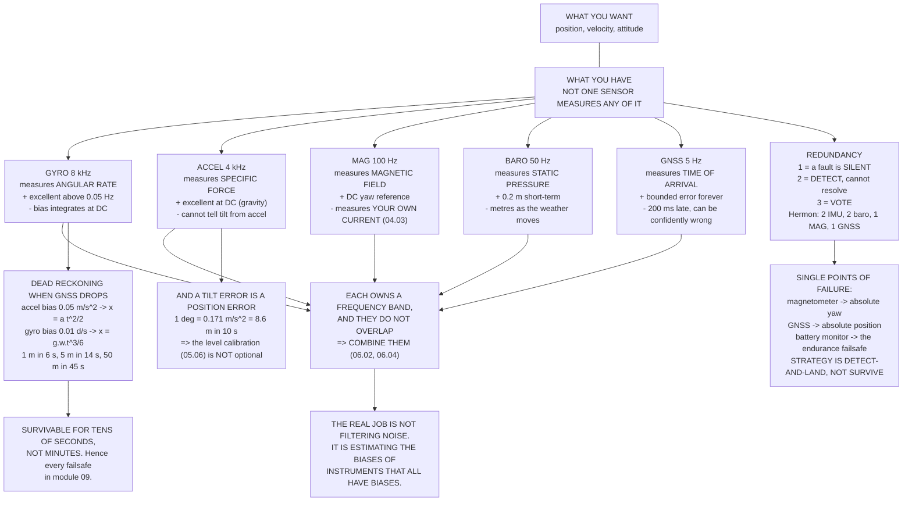

# 05.01 Sensor roles: what each one buys you

<!-- glance:start -->
<!-- generated by tools/build.py from curriculum/syllabus.yaml — edit the syllabus, not this block -->

| | |
|---|---|
| **Track** | Main path |
| **Difficulty** | Beginner |
| **Time** | 45 min |
| **Hardware** | none |
| **Software** | none |
| **Prerequisites** | [04.06 Pre-flight inspection, prop safety and airworthiness](../04-frame-and-assembly/04.06-preflight-and-airworthiness.md) |
| **Skip if** | You can name every sensor on Hermon, the state it observes, and what the aircraft loses when it fails. |

<!-- glance:end -->

## What you will learn

- Every sensor on Hermon, its rate, and what it physically measures — which is never the thing
  you actually want to know
- **Observability**: which states have a direct observer, which are only reachable by
  integration, and the two that have no observer at all
- What a GNSS outage actually costs, in metres per second of elapsed time
- Why **one degree of level error is 8.6 metres of drift in ten seconds**
- The difference between **detecting** a sensor fault, **isolating** it and **voting** it out,
  and why two of something is much less useful than people assume
- Hermon's single points of failure, named
- Why every sensor is accurate only in a particular **frequency band**, and why that observation
  is the whole of module 06

## Why it matters

Module 04 finished a machine that can hold four motors in the right places and not shake itself
apart. It has no idea where it is, which way up it is, or how fast it is going.

The uncomfortable fact about the next five lessons is this: **not one sensor on Hermon measures
anything you actually want.** You want attitude; the gyro measures angular *rate* and the
accelerometer measures *specific force*. You want position; the GNSS measures *time of arrival
from four satellites* and the barometer measures *static pressure*. You want yaw; the
magnetometer measures *the local magnetic field*, which includes your own pack current
([04.03](../04-frame-and-assembly/04.03-wiring-harness.md)).

Every one of these is a proxy. Each proxy is good in a narrow range of conditions and confidently
wrong outside it. This lesson maps which is which, so that when module 06 combines them you
already know what each one is contributing and what it is quietly getting wrong.

## Prerequisites

<!-- prereqs:start -->
## Prerequisites

You need these first:

- [04.06 Pre-flight inspection, prop safety and airworthiness](../04-frame-and-assembly/04.06-preflight-and-airworthiness.md)

### Optional prerequisite links

None.

Check your readiness: `python course.py why 05.01`
<!-- prereqs:end -->

## Concept

### Hermon's sensor suite

| Sensor | Rate | n | Measures | Trusted band |
|---|---:|---:|---|---|
| Gyroscope | 8,000 Hz | 2 | angular rate, 3 axes | 0.05 Hz and up |
| Accelerometer | 4,000 Hz | 2 | specific force, 3 axes | DC to 0.5 Hz |
| Magnetometer | 100 Hz | 1 | magnetic field, 3 axes | DC to 1 Hz |
| Barometer | 50 Hz | 2 | static pressure | DC to 2 Hz |
| GNSS | 5 Hz | 1 | position + velocity | DC to 0.5 Hz |
| ESC rpm telemetry | 100 Hz | 4 | motor speed | 0.1 Hz and up |
| Battery monitor | 10 Hz | 1 | pack volts and amps | DC to 1 Hz |

Two things are worth noticing before anything else.

**The rates span five orders of magnitude.** The gyro produces 8,000 samples a second; the GNSS
produces five. The estimator has to reconcile a measurement that arrives every 125 µs with one
that arrives every 200 ms and is already 100–200 ms old when it does.

**Nothing measures position and attitude together.** The fast sensors know about rotation and
nothing about where you are; the slow ones know where you are and very little about which way you
are pointing. That gap is the entire subject of module 06.

### What observes what

| State | Directly | Indirectly |
|---|---|---|
| Roll, pitch | accelerometer (gravity) | gyro |
| Yaw | magnetometer | gyro; GNSS course when moving |
| Angular rate | gyro | — |
| Altitude | barometer, GNSS | accelerometer (twice) |
| Vertical speed | barometer, GNSS | accelerometer |
| Horizontal position | GNSS | accelerometer (twice), optical flow |
| Horizontal velocity | GNSS | accelerometer, optical flow |
| **Gyro bias** | **— (estimated)** | accelerometer + magnetometer, over time |
| **Accel bias** | **— (estimated)** | GNSS + barometer, over time |
| Wind | — (estimated) | GNSS velocity vs attitude ([06.05](../06-state-estimation/06.05-ekf3-in-ardupilot.md)) |

> [!IMPORTANT]
> **Two of the states in that table have no direct observer at all — the sensor biases — and they
> are the states that decide everything else.** A gyro bias becomes an attitude error; an attitude
> error becomes a horizontal acceleration error; a horizontal acceleration error becomes a
> position error that grows as $t^3$. The estimator's real job is not to filter noise. It is to
> **estimate the biases of the instruments it is using**, using instruments that also have biases.

### What it costs when one stops

Suppose the GNSS drops out and the estimator has to dead-reckon on the IMU alone, starting from a
perfect state. Use a **0.01 °/s** gyro bias and a **0.05 m/s²** accelerometer bias — both
*post-calibration* figures for a decent MEMS part after warm-up.

| Elapsed | Tilt error | False accel | Position error (gyro) | Position error (accel) |
|---:|---:|---:|---:|---:|
| 1 s | 0.010° | 0.0017 m/s² | 0.00 m | 0.03 m |
| 5 s | 0.050° | 0.0086 m/s² | 0.04 m | 0.62 m |
| 10 s | 0.100° | 0.0171 m/s² | 0.29 m | **2.50 m** |
| 30 s | 0.300° | 0.0514 m/s² | 7.70 m | **22.50 m** |
| 60 s | 0.600° | 0.1027 m/s² | **61.64 m** | **90.00 m** |
| 5 min | 3.000° | 0.5134 m/s² | 7,704 m | 2,250 m |

And the same thing read the other way — how long until the error reaches a size you care about:

| Error | Gyro bias alone | Accel bias alone |
|---:|---:|---:|
| 1 m | 15 s | **6 s** |
| 5 m | 26 s | **14 s** |
| 50 m | 56 s | **45 s** |

The accelerometer bias dominates the first minute because its error grows as $t^2$; the gyro bias
takes over after it because its error grows as $t^3$ — the bias becomes a tilt, the tilt becomes
an acceleration, and *that* gets integrated twice.

**Either way, a GNSS outage is survivable for tens of seconds, not minutes.** That single number
is behind every failsafe in module 09, every "GPS glitch" response in module 13, and the reason
[05.05](05.05-flow-and-rangefinders.md)'s optical flow exists at all.

### A tilt error is a position error

This is the most important line in the module and it follows from
[01.09](../01-flight-physics/01.09-attitude-orientation.md): an accelerometer cannot distinguish
a tilt from a horizontal acceleration. Both produce exactly the same reading. So an attitude
error of $\theta$ produces a **permanent** false horizontal acceleration of $g\sin\theta$:

| Tilt error | False accel | Drift after 10 s | After 60 s |
|---:|---:|---:|---:|
| 0.1° | 0.017 m/s² | 0.9 m | 31 m |
| 0.5° | 0.086 m/s² | 4.3 m | 154 m |
| **1.0°** | **0.171 m/s²** | **8.6 m** | 308 m |
| 2.0° | 0.342 m/s² | 17.1 m | 616 m |
| 5.0° | 0.855 m/s² | 42.7 m | 1,539 m |

One degree of level error is 8.6 metres of drift in ten seconds if nothing corrects it. A degree
is nothing — it is the angle you get from mounting the flight controller on a slightly proud
standoff, or from calibrating it on a table that was not flat.

That is why [05.06](05.06-noise-bias-and-calibration.md)'s level calibration is not optional, and
it is why the *slow, noisy, vibration-ridden* accelerometer is nevertheless indispensable: it is
the only thing that pins attitude at DC, and without that pin the position estimate runs away
cubically.

### Detect, isolate, vote

The usual instinct about redundancy is "have two". It is worth being precise about what two buys
you:

| n | You can | What Hermon has |
|---:|---|---|
| 1 | **Nothing.** A fault is silent. | magnetometer, GNSS, battery monitor |
| 2 | **Detect** a disagreement — not resolve it | IMU (gyro + accel), barometer |
| 3 | **Vote**: isolate and exclude the odd one | nothing |
| 4 | Vote, and survive one more failure afterwards | ESC rpm (in a sense) |

With two sensors that disagree you know one of them is wrong and you have **no principled way to
decide which**. ArduPilot will pick one using secondary evidence — consistency with the other
sensors, innovation magnitude — but that is inference, not voting. Three is where voting starts.

**Hermon's single points of failure, named:**

- **Magnetometer** → absolute yaw. Without it, yaw drifts at the gyro's bias rate and can only be
  re-established from GNSS course over ground, which requires the aircraft to be *moving*.
- **GNSS** → absolute position and velocity. The table above says what that costs per second.
- **Battery monitor** → the endurance failsafe
  ([03.06](../03-power-system/03.06-battery-monitoring.md)).

This is a deliberate cost decision, not an oversight. A triple-redundant airframe is a different
class of aircraft with a different price. But it *is* why module 09's failsafes carry so much
weight on this vehicle: the strategy on Hermon is not "survive the failure", it is "detect it and
land".

> [!TIP]
> **Ask your teacher:** "My aircraft has two IMUs and they disagree by 0.3° in pitch. ArduPilot
> has picked one. Walk me through exactly what evidence EKF3 uses to make that choice, why it is
> not really a vote, and what I would actually see in the log if it picked the wrong one."

### Every sensor owns a frequency band

Nothing in the table is "accurate". Each one is accurate **somewhere**:

| Sensor | Good at | Bad at |
|---|---|---|
| Gyro | Excellent above 0.05 Hz | Drifts at DC — the bias integrates |
| Accelerometer | Excellent at DC (gravity is a reference) | Useless above ~1 Hz: vibration, and it cannot tell tilt from acceleration |
| Magnetometer | Good at DC for yaw | Slow, and it measures your own pack current ([04.03](../04-frame-and-assembly/04.03-wiring-harness.md)) |
| Barometer | Good to ~0.2 m short-term | Drifts *metres* as the weather moves |
| GNSS | Bounded position error, forever | 5 Hz, 100–200 ms late, and it can be confidently wrong |

Look at the first two rows. The gyro is good at exactly the frequencies where the accelerometer
is useless, and vice versa. That is not a coincidence you got lucky with — it is the structural
reason multirotors are possible at all, and it is the design principle behind the complementary
filter ([06.02](../06-state-estimation/06.02-complementary-filter.md)) and then EKF3
([06.04](../06-state-estimation/06.04-ekf-nonlinear.md)).

**There is no sensor you can buy that solves this.** A better gyro drifts more slowly; it still
drifts. A better accelerometer is still blind to the difference between leaning and accelerating.
The solution is arithmetic, and you will write it yourself in module 06.

## Technical explanation

### Level 1 — Intuition: five unreliable witnesses

Imagine reconstructing a car journey from five witnesses. One remembers every turn precisely but
has no idea where the journey started. One knows the direction of "down" and nothing else, and
gets confused whenever the car accelerates. One knows roughly which way north is but only when
the engine is off. One can tell you the altitude but changes their mind when the weather does.
And one knows exactly where you were, but only reports every two hundred milliseconds and is
sometimes flatly wrong.

Nobody in that list is reliable. But their failures are **uncorrelated**, and that is enough. The
job is to work out, continuously, how much to believe each one.

### Level 2 — Practical: reading Hermon's sensor health

Before every flight in an automatic mode, check four things and know what each threshold means:

| Check | Where | Threshold |
|---|---|---|
| GNSS fix type and satellite count | HUD / `GPS_STATUS` | 3D fix, ≥ 10 sats ([05.04](05.04-gnss-receiver.md)) |
| HDOP | HUD | < 1.5 to arm in an auto mode |
| `VIBE.VibeX/Y/Z` and clip counters | log | < 30 m/s², zero clips ([04.04](../04-frame-and-assembly/04.04-mounting-and-vibration.md)) |
| EKF innovation bars | ground station | all green ([06.06](../06-state-estimation/06.06-ekf-health-and-logs.md)) |

Any of those out of range means a sensor is contributing an error the estimator is having to work
around, and the estimator will not tell you loudly — it will simply become less right.

### Level 3 — Mathematics: why the errors grow as they do

An accelerometer bias $b_a$ integrates twice into position:

$$x(t) = \tfrac{1}{2} b_a t^2$$

A gyro bias $b_g$ integrates once into a tilt, $\theta(t) = b_g t$. That tilt produces a false
horizontal acceleration $g\sin\theta \approx g b_g t$, which integrates twice more:

$$x(t) = \frac{g\, b_g\, t^3}{6}$$

The $t^3$ is the whole story. At small $t$ the accelerometer bias wins because $t^2 \gg t^3$; the
crossover is at $t = 3b_a/(g b_g)$, which for Hermon's numbers is about **88 seconds**. After
that, the gyro is the dominant error source and it grows without limit.

**Observability**, formally, is whether a state can be determined from the measurement history at
all. A quadcopter in a steady hover, with no GNSS and no magnetometer, has an **unobservable** yaw
— nothing in the remaining measurements distinguishes one heading from another. Start moving and
GNSS course over ground makes it observable again. This is why "fly forward for ten seconds to
let the EKF settle" is real advice and not folklore.

### Level 4 — Implementation: the sensor register

Keep a table for your own aircraft with one row per sensor: part number, bus and address, update
rate, the ArduPilot parameter that enables it, the log message it appears in, and the state it
observes. When something goes wrong in module 11, this table is how you get from "the aircraft
did something odd" to "which instrument was lying".

## Diagram



## Code

Save as `sensor_roles.py` and run `python sensor_roles.py`. Standard library only.

```python
"""05.01 - what each sensor observes, and what it costs when it stops."""
import math

G = 9.81

# sensor, rate Hz, what it MEASURES, trusted band, count on Hermon
SUITE = [
    ("gyroscope", 8000, "angular rate, 3 axes", "0.05 Hz and up", 2),
    ("accelerometer", 4000, "specific force, 3 axes", "DC to 0.5 Hz", 2),
    ("magnetometer", 100, "magnetic field, 3 axes", "DC to 1 Hz", 1),
    ("barometer", 50, "static pressure", "DC to 2 Hz", 2),
    ("GNSS", 5, "position + velocity", "DC to 0.5 Hz", 1),
    ("ESC rpm telemetry", 100, "motor speed", "0.1 Hz and up", 4),
    ("battery monitor", 10, "pack V and A", "DC to 1 Hz", 1),
]

# state, what observes it DIRECTLY, what observes it after integration
STATES = [
    ("roll, pitch", "accelerometer (gravity)", "gyro"),
    ("yaw", "magnetometer", "gyro; GNSS course when moving"),
    ("angular rate", "gyro", "--"),
    ("altitude", "barometer, GNSS", "accelerometer (twice)"),
    ("vertical speed", "barometer, GNSS", "accelerometer"),
    ("horizontal position", "GNSS", "accelerometer (twice), flow"),
    ("horizontal velocity", "GNSS", "accelerometer, flow"),
    ("gyro bias", "-- (estimated)", "accel + mag over time"),
    ("accel bias", "-- (estimated)", "GNSS + baro over time"),
    ("wind", "-- (estimated)", "GNSS vs attitude (06.05)"),
]

GYRO_BIAS_DPS = 0.01       # deg/s, a calibrated MEMS gyro after warm-up
ACCEL_BIAS = 0.05          # m/s^2, residual after calibration
THRESHOLDS = (1.0, 5.0, 50.0)   # metres of position error that matter


def tilt_to_accel(deg):
    """A tilt error deg makes the estimator think gravity is horizontal."""
    return G * math.sin(math.radians(deg))


def pos_err_from_gyro(t):
    """Gyro bias -> tilt -> false horizontal accel -> position, x = a t^3 / 6."""
    # tilt grows linearly: theta = w t, so a(t) = g sin(w t) ~ g w t
    w = math.radians(GYRO_BIAS_DPS)
    return G * w * t ** 3 / 6


def pos_err_from_accel(t):
    return 0.5 * ACCEL_BIAS * t * t


def time_to(err_fn, target, hi=100000.0):
    lo = 0.0
    for _ in range(200):
        mid = (lo + hi) / 2
        if err_fn(mid) < target:
            lo = mid
        else:
            hi = mid
    return (lo + hi) / 2


def fmt_t(s):
    if s < 120:
        return f"{s:.0f} s"
    if s < 7200:
        return f"{s / 60:.1f} min"
    return f"{s / 3600:.1f} h"


def bar(t):
    print("\n" + "=" * 70)
    print(t)
    print("=" * 70)


if __name__ == "__main__":
    bar("1. HERMON'S SENSOR SUITE")
    print(f"  {'sensor':22s} {'rate':>7s} {'n':>2s} {'measures':26s} trusted band")
    for name, rate, meas, band, n in SUITE:
        print(f"  {name:22s} {rate:6d}Hz {n:2d} {meas:26s} {band}")
    print("\n  Note the rates: five orders of magnitude between the gyro and")
    print("  the GNSS. Nothing here measures POSITION and ATTITUDE at the")
    print("  same time, at the same rate, with the same trustworthiness.")
    print("  That gap is the entire subject of module 06.")

    bar("2. WHAT OBSERVES WHAT")
    print(f"  {'state':22s} {'directly':26s} indirectly")
    for st, direct, indirect in STATES:
        print(f"  {st:22s} {direct:26s} {indirect}")
    print("\n  Two states have NO direct observer at all -- the sensor")
    print("  biases -- and they are the ones that decide everything else.")

    bar("3. WHAT IT COSTS WHEN ONE STOPS")
    print("  Dead reckoning on the IMU alone, starting from a perfect state.")
    print(f"  gyro bias assumed {GYRO_BIAS_DPS} deg/s,"
          f" accel bias {ACCEL_BIAS} m/s^2 (both post-calibration)")
    print(f"\n  {'elapsed':>8s} {'tilt error':>11s} {'false accel':>12s}"
          f" {'pos err (gyro)':>15s} {'pos err (accel)':>16s}")
    for t in (1, 5, 10, 30, 60, 300):
        tilt = GYRO_BIAS_DPS * t
        print(f"  {fmt_t(t):>8s} {tilt:10.3f}d {tilt_to_accel(tilt):9.4f} m/s^2"
              f" {pos_err_from_gyro(t):12.2f} m {pos_err_from_accel(t):13.2f} m")
    print(f"\n  {'error':>8s} {'gyro bias alone':>18s} {'accel bias alone':>18s}")
    for target in THRESHOLDS:
        print(f"  {target:6.0f} m {fmt_t(time_to(pos_err_from_gyro, target)):>18s}"
              f" {fmt_t(time_to(pos_err_from_accel, target)):>18s}")
    print("  The accel bias dominates in the first minute; the gyro bias")
    print("  takes over after it, because its error grows as t^3 and the")
    print("  accelerometer's only as t^2.")
    print("  EITHER WAY: a GNSS outage is survivable for TENS of seconds,")
    print("  not minutes. That is the number behind every failsafe in")
    print("  module 09 and every 'GPS glitch' in module 13.")

    bar("4. A TILT ERROR IS A POSITION ERROR")
    print("  The estimator cannot tell a tilt from a horizontal acceleration")
    print("  (01.09). So every degree of attitude error is a permanent")
    print("  horizontal acceleration error:")
    print(f"  {'tilt':>7s} {'false accel':>13s} {'after 10 s':>12s}"
          f" {'after 60 s':>12s}")
    for deg in (0.1, 0.5, 1.0, 2.0, 5.0):
        a = tilt_to_accel(deg)
        print(f"  {deg:5.1f} d {a:10.3f} m/s^2 {0.5 * a * 100:10.1f} m"
              f" {0.5 * a * 3600:10.0f} m")
    print("  ONE DEGREE of level error is 0.17 m/s^2 -- 8.6 m of drift in")
    print("  ten seconds if nothing corrects it. That single line is why")
    print("  05.06's level calibration is not optional and why the")
    print("  accelerometer is the sensor that fixes attitude at DC.")

    bar("5. REDUNDANCY: DETECT, ISOLATE, VOTE")
    print(f"  {'n':>2s} {'you can':42s} what Hermon has")
    rows = [(1, "nothing. A fault is silent.",
             "magnetometer, GNSS, battery monitor"),
            (2, "DETECT a disagreement, not resolve it",
             "IMU (gyro + accel), barometer"),
            (3, "VOTE: isolate and exclude the odd one", "nothing"),
            (4, "vote, and survive one failure afterwards", "ESC rpm (sort of)")]
    for n, can, has in rows:
        print(f"  {n:2d} {can:42s} {has}")
    print("\n  SINGLE POINTS OF FAILURE ON HERMON:")
    for name, rate, meas, band, n in SUITE:
        if n == 1:
            print(f"    {name:22s} -> loses: ", end="")
            loses = {"magnetometer": "absolute yaw",
                     "GNSS": "absolute position and velocity",
                     "battery monitor": "the endurance failsafe (03.06)"}
            print(loses.get(name, "?"))
    print("  Two IMUs let you SEE a disagreement and nothing more. Three is")
    print("  where voting starts. This is a deliberate cost decision, not an")
    print("  oversight -- and it is why module 09's failsafes matter so much")
    print("  on an aircraft with one compass and one GNSS.")

    bar("6. EACH SENSOR OWNS A FREQUENCY BAND")
    print("  Nothing here is 'accurate'. Each one is accurate SOMEWHERE.")
    band = [
        ("gyro", "excellent above 0.05 Hz", "drifts at DC: bias integrates"),
        ("accelerometer", "excellent at DC (gravity)",
         "useless above ~1 Hz: vibration + it cannot tell tilt from accel"),
        ("magnetometer", "good at DC for yaw",
         "slow, and it measures your own current (04.03)"),
        ("barometer", "good to ~0.2 m short-term",
         "drifts metres as weather moves"),
        ("GNSS", "bounded position error forever",
         "5 Hz, 100-200 ms late, and it can lie confidently"),
    ]
    for name, good, bad in band:
        print(f"  {name:16s} + {good}")
        print(f"  {'':16s} - {bad}")
    print("\n  COMBINE THEM SO EACH COVERS THE OTHER'S BAD BAND. That is")
    print("  the complementary filter (06.02) and then the EKF (06.04).")
    print("  There is no sensor to buy that solves this. The solution is")
    print("  arithmetic.")
```

Output:

```text

======================================================================
1. HERMON'S SENSOR SUITE
======================================================================
  sensor                    rate  n measures                   trusted band
  gyroscope                8000Hz  2 angular rate, 3 axes       0.05 Hz and up
  accelerometer            4000Hz  2 specific force, 3 axes     DC to 0.5 Hz
  magnetometer              100Hz  1 magnetic field, 3 axes     DC to 1 Hz
  barometer                  50Hz  2 static pressure            DC to 2 Hz
  GNSS                        5Hz  1 position + velocity        DC to 0.5 Hz
  ESC rpm telemetry         100Hz  4 motor speed                0.1 Hz and up
  battery monitor            10Hz  1 pack V and A               DC to 1 Hz

  Note the rates: five orders of magnitude between the gyro and
  the GNSS. Nothing here measures POSITION and ATTITUDE at the
  same time, at the same rate, with the same trustworthiness.
  That gap is the entire subject of module 06.

======================================================================
2. WHAT OBSERVES WHAT
======================================================================
  state                  directly                   indirectly
  roll, pitch            accelerometer (gravity)    gyro
  yaw                    magnetometer               gyro; GNSS course when moving
  angular rate           gyro                       --
  altitude               barometer, GNSS            accelerometer (twice)
  vertical speed         barometer, GNSS            accelerometer
  horizontal position    GNSS                       accelerometer (twice), flow
  horizontal velocity    GNSS                       accelerometer, flow
  gyro bias              -- (estimated)             accel + mag over time
  accel bias             -- (estimated)             GNSS + baro over time
  wind                   -- (estimated)             GNSS vs attitude (06.05)

  Two states have NO direct observer at all -- the sensor
  biases -- and they are the ones that decide everything else.

======================================================================
3. WHAT IT COSTS WHEN ONE STOPS
======================================================================
  Dead reckoning on the IMU alone, starting from a perfect state.
  gyro bias assumed 0.01 deg/s, accel bias 0.05 m/s^2 (both post-calibration)

   elapsed  tilt error  false accel  pos err (gyro)  pos err (accel)
       1 s      0.010d    0.0017 m/s^2         0.00 m          0.03 m
       5 s      0.050d    0.0086 m/s^2         0.04 m          0.62 m
      10 s      0.100d    0.0171 m/s^2         0.29 m          2.50 m
      30 s      0.300d    0.0514 m/s^2         7.70 m         22.50 m
      60 s      0.600d    0.1027 m/s^2        61.64 m         90.00 m
   5.0 min      3.000d    0.5134 m/s^2      7704.76 m       2250.00 m

     error    gyro bias alone   accel bias alone
       1 m               15 s                6 s
       5 m               26 s               14 s
      50 m               56 s               45 s
  The accel bias dominates in the first minute; the gyro bias
  takes over after it, because its error grows as t^3 and the
  accelerometer's only as t^2.
  EITHER WAY: a GNSS outage is survivable for TENS of seconds,
  not minutes. That is the number behind every failsafe in
  module 09 and every 'GPS glitch' in module 13.

======================================================================
4. A TILT ERROR IS A POSITION ERROR
======================================================================
  The estimator cannot tell a tilt from a horizontal acceleration
  (01.09). So every degree of attitude error is a permanent
  horizontal acceleration error:
     tilt   false accel   after 10 s   after 60 s
    0.1 d      0.017 m/s^2        0.9 m         31 m
    0.5 d      0.086 m/s^2        4.3 m        154 m
    1.0 d      0.171 m/s^2        8.6 m        308 m
    2.0 d      0.342 m/s^2       17.1 m        616 m
    5.0 d      0.855 m/s^2       42.7 m       1539 m
  ONE DEGREE of level error is 0.17 m/s^2 -- 8.6 m of drift in
  ten seconds if nothing corrects it. That single line is why
  05.06's level calibration is not optional and why the
  accelerometer is the sensor that fixes attitude at DC.

======================================================================
5. REDUNDANCY: DETECT, ISOLATE, VOTE
======================================================================
   n you can                                    what Hermon has
   1 nothing. A fault is silent.                magnetometer, GNSS, battery monitor
   2 DETECT a disagreement, not resolve it      IMU (gyro + accel), barometer
   3 VOTE: isolate and exclude the odd one      nothing
   4 vote, and survive one failure afterwards   ESC rpm (sort of)

  SINGLE POINTS OF FAILURE ON HERMON:
    magnetometer           -> loses: absolute yaw
    GNSS                   -> loses: absolute position and velocity
    battery monitor        -> loses: the endurance failsafe (03.06)
  Two IMUs let you SEE a disagreement and nothing more. Three is
  where voting starts. This is a deliberate cost decision, not an
  oversight -- and it is why module 09's failsafes matter so much
  on an aircraft with one compass and one GNSS.

======================================================================
6. EACH SENSOR OWNS A FREQUENCY BAND
======================================================================
  Nothing here is 'accurate'. Each one is accurate SOMEWHERE.
  gyro             + excellent above 0.05 Hz
                   - drifts at DC: bias integrates
  accelerometer    + excellent at DC (gravity)
                   - useless above ~1 Hz: vibration + it cannot tell tilt from accel
  magnetometer     + good at DC for yaw
                   - slow, and it measures your own current (04.03)
  barometer        + good to ~0.2 m short-term
                   - drifts metres as weather moves
  GNSS             + bounded position error forever
                   - 5 Hz, 100-200 ms late, and it can lie confidently

  COMBINE THEM SO EACH COVERS THE OTHER'S BAD BAND. That is
  the complementary filter (06.02) and then the EKF (06.04).
  There is no sensor to buy that solves this. The solution is
  arithmetic.
```

## Exercise

> [!WARNING]
> Exercise E4 asks you to fly with a sensor deliberately degraded. Do this **only** in a
> stabilised manual mode, at low altitude, in a large open area, with a clear plan to land
> immediately — and never by disabling a sensor in software at the field. Simulate the loss in
> [SITL](../10-simulation/10.01-why-simulate.md) first. A dead-reckoned aircraft moves 50 metres
> in 45 seconds, and it does not tell you it is doing so.

### Exercise 05.01-E1 — Build your own sensor register `[analysis]`

Make the table described in Level 4 for your aircraft: part, bus and address, rate, the parameter
that enables it, the log message it appears in, and the state it observes.

1. Mark every sensor of which you have only one.
2. For each, write one sentence saying what the aircraft loses when it fails.
3. Compare with the single-points-of-failure list in this lesson. Do you have more or fewer?

### Exercise 05.01-E2 — Price your own outage `[numerical]`

1. Look up your IMU's datasheet bias stability for the gyro and the accelerometer.
2. Compute the time to 1 m, 5 m and 50 m of dead-reckoned position error for each.
3. Compute the crossover time at which the gyro term overtakes the accelerometer term.
4. State the GNSS-outage duration after which you would want the aircraft to stop trying to
   navigate and simply land, and justify it with one of your numbers.

### Exercise 05.01-E3 — The tilt budget `[coding]`

Extend the script.

1. Compute how much level error you can tolerate if the aircraft must hold position to within
   2 m over a 5-second GNSS gap.
2. Now do it for a 20-second gap.
3. Express both as a mounting-angle tolerance in degrees, and compare them with the flatness you
   can actually achieve mounting a flight controller by hand.
4. State which of the two requirements is achievable and what you would do about the other.

### Exercise 05.01-E4 — Watch the estimator work `[measurement]`

1. Power the aircraft on a bench, propellers off, and leave it perfectly still for five minutes
   with logging on.
2. From the log, plot the estimated gyro biases (`XKF*` / `NKF*` bias fields) against time.
3. Report how long they take to settle and by how much they moved.
4. Repeat from cold and from warm. Report the difference, and explain what that implies about
   powering up and arming immediately.

## Expected result

- **05.01-E1:** most builds have three or four single points of failure, and the compass is
  always one of them.
- **05.01-E2:** a typical ICM-42688 or BMI088 gives numbers within a factor of two or three of
  this lesson's, so your times to 1/5/50 m should land in the same order — seconds to tens of
  seconds. The crossover is usually between 60 and 150 s.
- **05.01-E3:** about **0.5°** for the 5-second requirement and about **0.03°** for the
  20-second one. The first is achievable by careful mounting plus a level calibration; the second
  is not achievable by mounting at all, which is precisely why the estimator has to *estimate*
  the residual tilt rather than have it removed mechanically.
- **05.01-E4:** biases settle over tens of seconds and move noticeably more from cold. That is
  the real reason for the "let it sit for a moment after power-up" habit — not superstition, but
  bias convergence.

## Troubleshooting

### Symptom: the aircraft drifts in Loiter although GNSS says 3D fix, 14 satellites, HDOP 0.8

Good GNSS does not rescue a bad attitude. Check your level calibration and `VIBE` first: a 1°
level error is 0.17 m/s² of false acceleration that the estimator has to fight continuously, and
in Loiter it shows up as a slow, steady lean. See
[05.06](05.06-noise-bias-and-calibration.md).

### Symptom: yaw slowly rotates during a long hover

The magnetometer is either being overridden by your own pack current
([04.03](../04-frame-and-assembly/04.03-wiring-harness.md)) or it has effectively stopped
contributing and yaw is being carried by the gyro alone, which drifts. Fly forward for ten
seconds and watch whether it snaps back — if it does, GNSS course over ground is doing the job
the magnetometer should be doing.

### Symptom: the EKF takes a long time to become healthy after power-up

That is bias convergence and it is normal, especially from cold. E4 measures how long yours takes.
Resist the habit of arming the instant the pre-arm checks pass; give it the time your own
measurement says it needs.

### Symptom: the two IMUs disagree and the ground station says nothing useful

With two of anything you can detect and not resolve. Look at which one EKF3 has selected and at
the innovation magnitudes for each ([06.06](../06-state-estimation/06.06-ekf-health-and-logs.md)).
If the disagreement is in pitch or roll and it is constant, it is a mounting or calibration
difference; if it grows with throttle, it is vibration.

### Symptom: altitude wanders by several metres over a twenty-minute flight

That is the barometer following the weather, and it is expected. The estimator blends it with
GNSS altitude precisely because neither alone is good enough
([05.03](05.03-compass-and-baro.md)). If you need better, you need a rangefinder
([05.05](05.05-flow-and-rangefinders.md)) or RTK (module 13).

## Common mistakes

- **Believing a sensor measures the thing it is named after.** A "gyro" does not measure
  attitude; an "accelerometer" does not measure acceleration in the frame you care about.
- **Assuming two sensors give you redundancy.** Two gives you detection. Three gives you a vote.
- **Treating the GNSS as the primary sensor.** It updates at 5 Hz and it is 200 ms old. Between
  fixes, the IMU is flying the aircraft.
- **Dismissing a 1° level error as negligible.** It is 8.6 m in ten seconds.
- **Trying to solve an estimation problem by buying a better sensor.** Better sensors drift more
  slowly. They still drift.
- **Arming immediately after power-up.** Biases have not converged, and the bias *is* the error.
- **Forgetting that the magnetometer measures your own current.** It is the sensor most affected
  by decisions you made in [04.03](../04-frame-and-assembly/04.03-wiring-harness.md).
- **Expecting the estimator to announce a problem.** It degrades quietly. That is what the
  innovation traces are for.

## Knowledge check

<details>
<summary>Name a state on Hermon with no direct observer, and explain why it matters more than the ones that have one.</summary>

**The sensor biases** — gyro bias and accelerometer bias. Nothing measures them; they have to be
estimated from the consistency of everything else. They matter most because they are the *source*
of every other error: a gyro bias becomes a tilt error, a tilt error becomes a false horizontal
acceleration of $g\sin\theta$, and that gets integrated twice into position, growing as $t^3$.
The estimator's real job is bias estimation, not noise filtering.
</details>

<details>
<summary>The GNSS drops out. How long before the position estimate is 5 m wrong, and which error source dominates?</summary>

About **14 seconds**, and the **accelerometer bias** dominates at that timescale. With a 0.05 m/s²
residual bias, $x = \frac{1}{2}b_a t^2$ reaches 5 m at 14 s; the gyro's $x = g b_g t^3/6$ term
needs 26 s. The gyro overtakes at about 88 s because of the extra power of $t$. Either way the
honest summary is: **tens of seconds, not minutes.**
</details>

<details>
<summary>Why is a 1° level error worth taking seriously?</summary>

Because an accelerometer cannot distinguish tilt from horizontal acceleration
([01.09](../01-flight-physics/01.09-attitude-orientation.md)), so a 1° attitude error is a
permanent false acceleration of $g\sin 1° = 0.171$ m/s². Integrated twice that is **8.6 m in ten
seconds** and 308 m in a minute. One degree is the amount you get from a slightly proud standoff
or a calibration done on a table that was not flat.
</details>

<details>
<summary>Hermon has two IMUs. What does that actually buy, and what would three buy?</summary>

Two buys **detection**: if they disagree you know one is wrong, but you have no principled way to
say which. ArduPilot chooses using secondary evidence — innovation magnitudes and consistency with
other sensors — which is inference, not voting. **Three** is where voting starts: the odd one out
can be isolated and excluded. Hermon has three of nothing, so its strategy is detect-and-land
rather than survive-and-continue.
</details>

<details>
<summary>Why is the accelerometer indispensable even though it is noisy, vibration-ridden and cannot tell tilt from acceleration?</summary>

Because it is the only sensor that provides an **attitude reference at DC**. Gravity is a fixed
vector; averaged over enough time, it pins roll and pitch absolutely. Without that pin, attitude
is carried by the gyro alone, whose bias integrates without limit — and a growing tilt error
produces a position error growing as $t^3$. The accelerometer is bad at exactly the frequencies
where the gyro is excellent, and excellent at exactly the frequencies where the gyro drifts.
</details>

<details>
<summary>Why does "fly forward for ten seconds to let the EKF settle" work, and what is the formal name for what is happening?</summary>

**Observability.** In a stationary hover with a degraded magnetometer, nothing in the remaining
measurements distinguishes one heading from another — yaw is formally unobservable. Once the
aircraft moves, GNSS course over ground can be compared with the body-frame velocity direction,
and yaw becomes observable again. The same argument applies to the accelerometer biases, which
become better observed under varied acceleration.
</details>

<details>
<summary>The rates in the suite table span five orders of magnitude. Why is that a problem rather than a convenience?</summary>

Because the estimator must reconcile a measurement arriving every 125 µs with one arriving every
200 ms *and already 100–200 ms stale*. It cannot simply average them: it has to propagate the
fast sensors forward in time, hold the state history, and correct retrospectively when the slow
measurement arrives describing where the aircraft *was*. That is why EKF3 keeps a buffer of past
states, and it is why GNSS latency is a parameter you have to set
([06.05](../06-state-estimation/06.05-ekf3-in-ardupilot.md)).
</details>

## Practical challenge

Write **`docs/sensors.md`** for your aircraft.

1. The full sensor register from E1: part, bus, address, rate, enabling parameter, log message,
   state observed.
2. Every single point of failure, with what the aircraft loses.
3. Your own dead-reckoning table from E2: time to 1 m, 5 m and 50 m for your parts, and the
   crossover time.
4. Your tilt budget from E3, with the mounting tolerance it implies.
5. Your measured bias-settling times from E4, cold and warm, and the power-up wait you will
   adopt because of them.
6. One paragraph: given your single points of failure, what should the aircraft **do** when each
   one fails? You will implement those decisions in module 09.

## You can skip this if

You can name every sensor on Hermon with its rate and what it physically measures, list which
states have a direct observer and which are only reachable by integration, explain why the sensor
biases are the states that matter most, compute how fast a dead-reckoned position error grows
from a gyro bias and from an accelerometer bias and say which dominates when, state what a 1°
level error costs in metres, distinguish detection from isolation from voting and say what Hermon
can do, name its single points of failure, and explain why every sensor is trustworthy only
within a frequency band.

## Go deeper

- [01.09](../01-flight-physics/01.09-attitude-orientation.md) (earlier): why an accelerometer
  cannot tell tilt from acceleration.
- [04.03](../04-frame-and-assembly/04.03-wiring-harness.md) (earlier): why the magnetometer
  measures your own pack current.
- [04.04](../04-frame-and-assembly/04.04-mounting-and-vibration.md) (earlier): the vibration that
  decides whether the accelerometer is usable at all.
- [05.02](05.02-imu.md) (next): the gyro and the accelerometer in detail, and Allan variance.
- [06.02](../06-state-estimation/06.02-complementary-filter.md) (later): the simplest way to
  combine two sensors with complementary bands.
- [06.04](../06-state-estimation/06.04-ekf-nonlinear.md) (later): the principled way.
- Observability in state estimation:
  https://en.wikipedia.org/wiki/Observability
- ArduPilot's EKF3 overview, including which sensors feed which states:
  https://ardupilot.org/copter/docs/common-apm-navigation-extended-kalman-filter-overview.html

## Progress checkpoint

Run `python course.py complete 05.01` when `docs/sensors.md` exists and your register is
complete. Next: [05.02](05.02-imu.md) — the two sensors that do most of the work, what their
datasheets actually promise, and how to measure their noise yourself.
