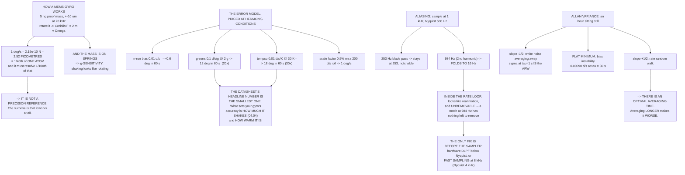

# 05.02 The IMU: gyroscopes and accelerometers

<!-- glance:start -->
<!-- generated by tools/build.py from curriculum/syllabus.yaml — edit the syllabus, not this block -->

| | |
|---|---|
| **Track** | Main path |
| **Difficulty** | Intermediate |
| **Time** | 1 h 30 min |
| **Hardware** | First flight (Hermon core) (stage 1) |
| **Software** | python |
| **Prerequisites** | [05.01 Sensor roles: what each one buys you](05.01-sensor-roles.md)<br>[01.09 Attitude & orientation: frames, Euler angles, quaternions (light)](../01-flight-physics/01.09-attitude-orientation.md) |
| **Skip if** | You can explain why integrating a gyro drifts, why an accelerometer alone cannot tell tilt from acceleration, and what an Allan-variance plot tells you about a MEMS part. |

<!-- glance:end -->

## What you will learn

- How a MEMS gyroscope actually works, and the number that explains everything about it: **1 °/s
  deflects the proof mass by 2.5 picometres**
- How a MEMS accelerometer works, and why it has its own resonance you need to care about
- The **full error model** — turn-on bias, in-run bias, scale factor, cross-axis, g-sensitivity,
  temperature coefficient and noise density
- Why the two errors that dominate in flight are **not** the ones on the datasheet's front page
- **Aliasing**: why a 984 Hz vibration becomes a 16 Hz one, and why no filter downstream can
  remove it
- **Allan variance**: how to read a gyro's character from an hour of it sitting still, and how to
  find the averaging time past which averaging makes things *worse*
- What all of that means for how you set up and warm up Hermon

## Why it matters

The IMU is the only sensor fast enough to fly the aircraft. At 8,000 samples a second the gyro is
the instrument the rate loop in [07.03](../07-control/07.03-rate-loops.md) actually closes around,
and the accelerometer is the only thing that stops attitude drifting away entirely
([05.01](05.01-sensor-roles.md)).

It is also, by a wide margin, the sensor whose datasheet is least useful. Every IMU datasheet
leads with **in-run bias stability**, and on Hermon that turns out to be the *smallest* of the
error terms that matter. The two that dominate — vibration coupling and temperature — are
quantified on page eleven if at all, and both of them are consequences of decisions you made in
module 04 rather than of which chip you bought.

This lesson is about learning to read an IMU the way it actually behaves, which is a different
document from the one the manufacturer wrote.

## Prerequisites

<!-- prereqs:start -->
## Prerequisites

You need these first:

- [05.01 Sensor roles: what each one buys you](05.01-sensor-roles.md)
- [01.09 Attitude & orientation: frames, Euler angles, quaternions (light)](../01-flight-physics/01.09-attitude-orientation.md)

### Optional prerequisite links

None.

Check your readiness: `python course.py why 05.02`
<!-- prereqs:end -->

## Concept

### How a MEMS gyroscope works, and how absurd that is

There is no spinning wheel. A MEMS gyroscope is a tiny mass driven into oscillation along one
axis; when the package rotates, the **Coriolis force** pushes that oscillating mass sideways, and
a capacitive pickoff measures the sideways motion.

$$F_{Coriolis} = 2 m v \Omega$$

Put real numbers in. A typical proof mass is about **5 nanograms**, driven ±10 µm at 20 kHz,
giving a peak velocity of 1.26 m/s. The sense axis has a stiffness of about 87 N/m:

| Rate | Coriolis force | Deflection | As a fraction of one atom |
|---:|---:|---:|---:|
| 0.01 °/s | 2.19 × 10⁻¹² N | 0.025 pm | 0.0003× |
| **1 °/s** | **2.19 × 10⁻¹⁰ N** | **2.52 pm** | **0.025×** |
| 100 °/s | 2.19 × 10⁻⁸ N | 252 pm | 2.5× |
| 2,000 °/s | 4.39 × 10⁻⁷ N | 5,039 pm | 50× |

**One degree per second deflects the proof mass by two and a half picometres — one fortieth of
the diameter of a single atom.** And the part has to resolve a hundredth of that to give you a
useful hover.

> [!IMPORTANT]
> Everything else in this lesson follows from that one number. A MEMS gyro is a superb instrument
> operating at the absolute edge of what is physically measurable for a few dollars. It is **not
> a precision reference**, and the surprise is not that it drifts — the surprise is that it works
> at all.

Two consequences fall straight out of the mechanism:

**It is sensitive to linear acceleration.** The proof mass is on springs; shake the package and
the mass moves, and some of that motion appears on the sense axis. That is **g-sensitivity**, and
it is the reason [04.04](../04-frame-and-assembly/04.04-mounting-and-vibration.md) mattered.

**It has resonances.** The drive mode is at 20 kHz and the sense mode is deliberately offset (say
21 kHz). External vibration near either is amplified enormously. This is why acoustic noise —
a sufficiently loud sound at the right frequency — can disable a MEMS gyro entirely, and why
some flight controllers have foam over the IMU.

### How a MEMS accelerometer works

Simpler: a proof mass on springs with a differential capacitive pickoff. The mass lags when the
package accelerates and the capacitance changes. The sensor measures **specific force** — the
non-gravitational force per unit mass — which is why it reads 1 g upward when sitting on a table
and **zero in free fall**.

Its proof mass is larger and its resonance is much lower, typically 3–6 kHz. Since Hermon's blade
pass at full throttle is 492 Hz and its harmonics run into the kilohertz, that resonance is not
as far away as you would like.

### The full error model

| Error | Gyro | Accel |
|---|---:|---:|
| Turn-on bias repeatability | 0.5 °/s | 0.04 m/s² |
| In-run bias stability | 0.01 °/s | 0.005 m/s² |
| Scale-factor error | 0.5 % | 0.5 % |
| Cross-axis sensitivity | 1.0 % | 1.0 % |
| **g-sensitivity** | **0.10 °/s per g** | — |
| **Temperature coefficient** | **0.01 °/s per K** | 0.002 m/s² per K |
| Noise density | 0.004 °/s/√Hz | 0.0007 m/s²/√Hz |

Now convert each into something you can compare, using Hermon's real operating conditions —
2 g RMS of vibration from a 0.5 g propeller imbalance
([04.04](../04-frame-and-assembly/04.04-mounting-and-vibration.md)) and a 30 K rise from a cold
bench to a hot airframe:

| Term | Worth |
|---|---:|
| In-run bias, over 60 s of hover | **0.600° of attitude** |
| g-sensitivity at 2 g of vibration | **12.000° in 60 s** |
| Temperature coefficient over a 30 K warm-up | **18.000° in 60 s** |
| Scale-factor error on a 200 °/s roll | 1.000° per second of roll |

> [!IMPORTANT]
> **The in-run bias stability — the number every datasheet leads with — is the smallest of them.**
> Vibration coupling is **20×** larger and the warm-up drift is **30×** larger. So the two things
> that actually set your gyro's accuracy are **how much the aircraft shakes** and **how warm it
> is**, and neither is a property of the chip you chose. Both are properties of the aircraft you
> built.

That is also why ArduPilot's temperature calibration (`INS_TCAL*`) exists, and why the estimator
spends so much of its effort estimating gyro bias *continuously* rather than trusting a
calibration from three flights ago.

### Aliasing: the failure no filter can undo

The flight controller samples the IMU at some rate — call it 1,000 Hz, which is the rate
ArduPilot's main loop has traditionally used. Nyquist is 500 Hz. **Anything above Nyquist does
not disappear. It folds down.**

| Vibration | f | Lands at | Verdict |
|---|---:|---:|---|
| 1× rpm at hover | 84 Hz | 84 Hz | below Nyquist, notchable |
| 1× rpm, full throttle | 164 Hz | 164 Hz | below Nyquist, notchable |
| Blade pass at hover | 253 Hz | 253 Hz | below Nyquist, notchable |
| Blade pass, full throttle | 492 Hz | 492 Hz | below Nyquist, notchable |
| **2nd harmonic of blade pass** | **984 Hz** | **16 Hz** | **INSIDE THE RATE LOOP** |
| 3rd harmonic | 1,476 Hz | 476 Hz | aliased; looks like a real tone |
| **4th harmonic** | **1,968 Hz** | **32 Hz** | **INSIDE THE RATE LOOP** |

The second harmonic of blade pass at full throttle is 984 Hz. Sampled at 1 kHz it emerges at
**16 Hz** — squarely inside the rate loop's bandwidth, indistinguishable from real aircraft
motion, and **unremovable**, because by the time you can see it, it *is* 16 Hz. A notch tuned to
984 Hz cannot help; the signal at 984 Hz no longer exists anywhere in the system. A soft mount
cannot help either, because the mount sits upstream of the sensor, not upstream of the sampler.

The only fix is to **filter before sampling**:

- The sensor's own **hardware low-pass** (the DLPF), set below the sampling Nyquist frequency.
  This is analogue-domain filtering inside the chip, before the ADC.
- **Fast sampling**: read the gyro at 8 kHz and decimate in software, which moves Nyquist to
  4 kHz and puts every harmonic that matters below it.

This is what `INS_GYRO_FILTER` and ArduPilot's fast-sampling option are for, and it is the one
IMU setting you genuinely must not get wrong. Everything else in the filtering chain
([07.07](../07-control/07.07-filtering-and-methodic-tuning.md)) operates on data that has already
been sampled, and cannot undo a fold.

> [!TIP]
> **Ask your teacher:** "My logs show a clean 16 Hz peak that does not move when I change
> throttle, and my aircraft has a wobble I cannot tune out. Walk me through how I would decide
> whether that is a real 16 Hz structural mode or an aliased 984 Hz tone, using only the log and
> a throttle sweep."

### Allan variance: reading a gyro's character

Leave a gyro perfectly still for an hour, log it, and ask a single question: **if I average the
output over a window of length τ, how repeatable is that average?** Plot the answer against τ on
log–log axes and you get the Allan deviation, which separates the noise processes by their slope.

Here is an hour of a synthetic gyro with a known angle random walk of 0.004 °/s/√Hz and a known
rate random walk:

| τ | σ (°/s) | Slope | What it means |
|---:|---:|---:|---|
| 0.01 s | 0.03996 | | |
| 0.03 s | 0.02310 | −0.50 | white noise (ARW) dominates |
| 0.10 s | 0.01266 | −0.50 | white noise dominates |
| 0.30 s | 0.00735 | −0.50 | white noise dominates |
| **1.00 s** | **0.00402** | −0.50 | **read ARW here** |
| 3.00 s | 0.00233 | −0.50 | white noise dominates |
| 10.00 s | 0.00126 | −0.51 | white noise dominates |
| **30.00 s** | **0.00090** | −0.30 | **the bias-instability floor** |
| 100.0 s | 0.00121 | +0.24 | past the floor |
| 300.0 s | 0.00232 | +0.60 | rate random walk dominates |

Three regions, three slopes, three different physical processes:

- **Slope −1/2** — white noise averaging away, exactly as $1/\sqrt{N}$ says it should. The value
  at τ = 1 s is the **angle random walk**, and here it recovers 0.00402 against a true 0.00400.
- **The flat minimum** — the **bias instability**, the floor below which averaging does not help.
  This is the number datasheets quote, and here it is 0.00090 °/s at τ = 30 s.
- **Slope +1/2** — **rate random walk**, a drift that grows with time. Past the minimum,
  **averaging for longer makes your estimate worse.**

That last point is the practical one. There is an optimal averaging time for a gyro — about 30 s
for this part — and both shorter and longer are worse. It is why a gyro calibration that takes
five seconds is not improved by taking five minutes, and it is why the estimator's bias tracking
uses a time constant rather than a running average from power-up.

### What this means for Hermon

| Do this | Because |
|---|---|
| Warm up before you arm | 0.30 °/s of tempco drift over a 30 K warm-up |
| Balance the propellers | 0.20 °/s of gyro bias from 2 g of vibration alone |
| Set the hardware filter below Nyquist, or use fast sampling | 984 Hz folds to 16 Hz and nothing downstream can remove it |
| Do not average the gyro for longer than τ_min | 30 s on this part; past that the drift grows |
| Never trust turn-on bias | 0.5 °/s of turn-on repeatability is 30° in a minute if nothing estimates it |

Notice how many of those are things you do to the *aircraft* rather than settings you change.
That is the honest summary of this lesson.

## Technical explanation

### Level 1 — Intuition: a tuning fork that notices you turning

Hold a vibrating tuning fork and turn around. The tines, which were moving in and out, are now
also being swept sideways — and because they are moving, the sideways sweep produces a force at
right angles to both. Measure that force and you have measured your rotation.

That is a MEMS gyroscope. The tines are 5 nanograms of silicon, the vibration is 20,000 times a
second, and the sideways force at one degree per second is two hundred picoNewtons.

### Level 2 — Practical: the IMU settings that matter

| Setting | Typical | Why |
|---|---|---|
| `INS_GYRO_FILTER` | 20–42 Hz | The software low-pass ahead of the rate loop. Too low adds phase lag; too high passes vibration |
| `INS_ACCEL_FILTER` | 10–20 Hz | The accelerometer only has authority at DC anyway |
| Fast sampling | enabled | Moves Nyquist from 500 Hz to 4 kHz. **This is the aliasing fix** |
| `INS_TCAL_*` | learned | Temperature calibration. Worth 18° per minute over a warm-up |
| `INS_POS1_X/Y/Z` | measured | The 28 mm CoM offset from [04.02](../04-frame-and-assembly/04.02-mass-and-center-of-mass.md) |
| `INS_USE2`, `INS_USE3` | enabled | Use both IMUs so disagreements are at least visible |

### Level 3 — Mathematics: the noise processes behind the slopes

The Allan variance at averaging time τ, for a signal sampled into clusters of mean $\bar y_i$:

$$\sigma_A^2(\tau) = \frac{1}{2(K-1)}\sum_{i=1}^{K-1}(\bar y_{i+1} - \bar y_i)^2$$

Each noise process contributes a term with a characteristic power of τ:

| Process | $\sigma_A(\tau)$ | Slope on log–log |
|---|---|---:|
| Quantisation noise | $\sqrt3 Q/\tau$ | −1 |
| Angle random walk (white) | $N/\sqrt\tau$ | −1/2 |
| Bias instability (flicker) | $0.664\,B$ | 0 |
| Rate random walk | $K\sqrt{\tau/3}$ | +1/2 |
| Rate ramp | $R\tau/\sqrt2$ | +1 |

Because they add in quadrature, the measured curve is the envelope of all five, and you read each
parameter off the region where its term dominates. The white-noise term is why $N$ is quoted in
°/s/√Hz: integrate white rate noise once into an angle and the angle performs a random walk whose
standard deviation grows as $\sqrt t$ — hence "angle random walk", usually quoted in °/√hour.

For the aliasing argument, a tone at $f$ sampled at $f_s$ appears at

$$f_{alias} = \left|\,f - f_s\,\text{round}(f/f_s)\right|$$

and this is **not invertible**: many input frequencies map to the same output, so no
post-sampling operation can recover which one it was.

### Level 4 — Implementation: measuring your own gyro

1. Mount the flight controller on something massive and stationary — a concrete floor, not a
   desk — and let it reach thermal equilibrium for twenty minutes.
2. Log raw gyro at the highest rate you can sustain for at least an hour. In ArduPilot,
   `LOG_BITMASK` with `IMU_RAW`, or better, use a `BATCH` log
   ([07.07](../07-control/07.07-filtering-and-methodic-tuning.md)).
3. Run the Allan-deviation code below on the recorded series instead of the synthetic one.
4. Read off the ARW at τ = 1 s and the bias-instability floor and its τ.
5. Compare with the datasheet. A factor of two is normal; a factor of ten means the "stationary"
   surface was not.

## Diagram



## Code

Save as `imu.py` and run `python imu.py`. Standard library only; it synthesises an hour of gyro
data, so give it a second or two.

```python
"""05.02 - what a MEMS IMU actually does, and every way it lies about it."""
import math
import random

G = 9.81

# --- the mechanical part -------------------------------------------------
M_PROOF = 5e-9            # kg, a typical MEMS proof mass
F_DRIVE = 20000.0         # Hz, drive-mode resonance
A_DRIVE = 10e-6           # m, drive amplitude
F_SENSE = 21000.0         # Hz, sense-mode resonance (deliberately offset)
ATOM_M = 1e-10            # m, a hydrogen atom, for scale

# --- the error model -----------------------------------------------------
# name, gyro value, unit, accel value, unit
ERRORS = [
    ("turn-on bias repeatability", 0.5, "deg/s", 0.04, "m/s^2"),
    ("in-run bias stability", 0.01, "deg/s", 0.005, "m/s^2"),
    ("scale-factor error", 0.5, "%", 0.5, "%"),
    ("cross-axis sensitivity", 1.0, "%", 1.0, "%"),
    ("g-sensitivity", 0.10, "deg/s per g", 0.0, "--"),
    ("temperature coefficient", 0.01, "deg/s per K", 0.002, "m/s^2 per K"),
    ("noise density", 0.004, "deg/s/rtHz", 0.0007, "m/s^2/rtHz"),
]

VIB_G_RMS = 2.0           # g, the 0.5-g-imbalance hover figure from 04.04
DT_TEMP = 30.0            # K, a 20 C bench to a 50 C airframe in summer
MANOEUVRE_DPS = 200.0     # deg/s, a brisk roll

# --- sampling ------------------------------------------------------------
FS_FC = 1000.0            # Hz, the rate the flight controller samples at
VIBS = [(84, "1x rpm at hover"), (164, "1x rpm, full throttle"),
        (253, "blade pass at hover"), (492, "blade pass, full"),
        (984, "2nd harmonic of blade pass"), (1476, "3rd harmonic"),
        (1968, "4th harmonic")]

# --- Allan variance ------------------------------------------------------
FS_LOG = 100.0            # Hz, a realistic logging rate for a long static run
N_SAMPLES = 360000        # one hour at 100 Hz
ARW_TRUE = 0.004          # deg/s/rtHz, white noise density
RRW_TRUE = 2e-4           # deg/s * rtHz, rate random walk


def coriolis_n(rate_dps):
    v = 2 * math.pi * F_DRIVE * A_DRIVE
    return 2 * M_PROOF * v * math.radians(rate_dps)


def sense_stiffness():
    return M_PROOF * (2 * math.pi * F_SENSE) ** 2


def alias(f, fs):
    """Where a tone at f lands after sampling at fs."""
    f_mod = f % fs
    return min(f_mod, fs - f_mod)


def synth_gyro(n, fs, arw, rrw, seed=20260923):
    """White noise + rate random walk, the two terms Allan variance separates."""
    rnd = random.Random(seed)
    dt = 1.0 / fs
    white = arw * math.sqrt(fs)          # deg/s, per-sample sigma
    walk_step = rrw / math.sqrt(fs)      # deg/s, per-sample increment
    out, drift = [], 0.0
    for _ in range(n):
        drift += rnd.gauss(0.0, walk_step)
        out.append(drift + rnd.gauss(0.0, white))
    return out


def allan_dev(x, fs, taus):
    """Overlapping-free (classic) Allan deviation at each averaging time."""
    dt = 1.0 / fs
    out = []
    for tau in taus:
        m = int(round(tau / dt))
        k = len(x) // m
        if k < 3:
            out.append(None)
            continue
        means = [sum(x[i * m:(i + 1) * m]) / m for i in range(k)]
        s = sum((means[i + 1] - means[i]) ** 2 for i in range(k - 1))
        out.append(math.sqrt(s / (2 * (k - 1))))
    return out


def bar(t):
    print("\n" + "=" * 70)
    print(t)
    print("=" * 70)


if __name__ == "__main__":
    bar("1. HOW SMALL THE SIGNAL IS")
    v = 2 * math.pi * F_DRIVE * A_DRIVE
    k = sense_stiffness()
    print(f"  drive mass {M_PROOF * 1e9:.0f} ng, amplitude {A_DRIVE * 1e6:.0f} um"
          f" at {F_DRIVE / 1000:.0f} kHz")
    print(f"  => peak drive velocity {v:.2f} m/s")
    print(f"  sense-mode stiffness   {k:.4f} N/m")
    print(f"  {'rate':>12s} {'Coriolis force':>16s} {'deflection':>14s}"
          f" {'vs an ATOM':>12s}")
    for dps in (0.01, 1.0, 100.0, 2000.0):
        f = coriolis_n(dps)
        x = f / k
        print(f"  {dps:8.2f} d/s {f:13.2e} N {x * 1e12:11.4f} pm"
              f" {x / ATOM_M:11.4f}x")
    print("  ONE DEGREE PER SECOND deflects the proof mass by 2.5")
    print("  PICOMETRES -- one fortieth of the diameter of a single atom --")
    print("  and the part has to resolve a hundredth of THAT.")
    print("  Everything else in this lesson follows from that number:")
    print("  a MEMS gyro is a superb instrument operating at the very")
    print("  edge of what is physically measurable, and it is NOT a")
    print("  precision reference.")

    bar("2. THE ERROR MODEL: SIX WAYS IT LIES")
    print(f"  {'error':30s} {'gyro':>10s} {'unit':>14s}"
          f" {'accel':>8s} {'unit':>14s}")
    for name, gv, gu, av, au in ERRORS:
        print(f"  {name:30s} {gv:10.4f} {gu:>14s} {av:8.4f} {au:>14s}")

    print("\n  What each one is worth in practice:")
    tab = []
    gyro_bias = dict((e[0], e[1]) for e in ERRORS)
    tab.append(("in-run bias, 60 s of hover",
                gyro_bias["in-run bias stability"] * 60, "deg of attitude"))
    tab.append(("g-sensitivity at %.0f g of vibration" % VIB_G_RMS,
                gyro_bias["g-sensitivity"] * VIB_G_RMS * 60, "deg in 60 s"))
    tab.append(("tempco over a %.0f K warm-up" % DT_TEMP,
                gyro_bias["temperature coefficient"] * DT_TEMP * 60,
                "deg in 60 s"))
    tab.append(("scale factor on a %.0f deg/s roll" % MANOEUVRE_DPS,
                gyro_bias["scale-factor error"] / 100 * MANOEUVRE_DPS * 1.0,
                "deg per second of roll"))
    for what, val, unit in tab:
        print(f"    {what:44s} {val:8.3f} {unit}")
    print("\n  READ THOSE FOUR LINES AGAIN. The in-run bias -- the number")
    print("  everyone quotes from the datasheet -- is the SMALLEST of them.")
    ratio_g = (gyro_bias["g-sensitivity"] * VIB_G_RMS
               / gyro_bias["in-run bias stability"])
    ratio_t = (gyro_bias["temperature coefficient"] * DT_TEMP
               / gyro_bias["in-run bias stability"])
    print(f"    vibration coupling is {ratio_g:.0f}x the in-run bias")
    print(f"    the warm-up drift is  {ratio_t:.0f}x the in-run bias")
    print("  So: the two things that actually set your gyro's accuracy are")
    print("  HOW MUCH THE AIRCRAFT SHAKES (04.04) and HOW WARM IT IS.")
    print("  Neither is on the datasheet's front page.")

    bar("3. ALIASING: THE FAILURE NO FILTER CAN UNDO")
    print(f"  The flight controller samples at {FS_FC:.0f} Hz."
          f"  Nyquist is {FS_FC / 2:.0f} Hz.")
    print("  Anything above Nyquist does not disappear -- it FOLDS DOWN:")
    print(f"  {'vibration':30s} {'f Hz':>7s} {'lands at':>10s} {'verdict':>28s}")
    for f, what in VIBS:
        a = alias(f, FS_FC)
        if f < FS_FC / 2:
            verdict = "below Nyquist, notchable"
        elif a < 40:
            verdict = "*** INSIDE THE RATE LOOP ***"
        else:
            verdict = "aliased, looks like a real tone"
        print(f"  {what:30s} {f:7.0f} {a:9.0f} {verdict:>28s}")
    print("  The 2nd harmonic of blade pass at full throttle is 984 Hz.")
    print(f"  Sampled at {FS_FC:.0f} Hz it comes out at"
          f" {alias(984, FS_FC):.0f} Hz -- inside the rate loop's")
    print("  bandwidth, indistinguishable from real aircraft motion, and")
    print("  UNREMOVABLE, because by the time you see it, it IS 16 Hz.")
    print("  A notch cannot help. A soft mount cannot help (04.04).")
    print("  The ONLY fix is to filter BEFORE sampling:")
    print("    - the sensor's own hardware low-pass (DLPF), set below Nyquist")
    print("    - ArduPilot's fast sampling: read the gyro at 8 kHz and")
    print("      decimate in software, which pushes Nyquist to 4 kHz")
    print("  This is why INS_GYRO_FILTER and fast sampling exist, and it is")
    print("  the one IMU setting you must not get wrong.")

    bar("4. ALLAN VARIANCE: READING A GYRO'S CHARACTER")
    print(f"  {N_SAMPLES / FS_LOG / 60:.0f} minutes of a stationary gyro at"
          f" {FS_LOG:.0f} Hz, synthesised with")
    print(f"  angle random walk {ARW_TRUE} deg/s/rtHz and rate random walk"
          f" {RRW_TRUE} deg/s.rtHz.")
    data = synth_gyro(N_SAMPLES, FS_LOG, ARW_TRUE, RRW_TRUE)
    taus = [0.01, 0.03, 0.1, 0.3, 1.0, 3.0, 10.0, 30.0, 100.0, 300.0]
    devs = allan_dev(data, FS_LOG, taus)
    print(f"\n  {'tau s':>8s} {'sigma deg/s':>13s} {'slope':>8s} what it means")
    prev = None
    for tau, d in zip(taus, devs):
        if d is None:
            continue
        slope = ""
        meaning = ""
        if prev:
            s = (math.log10(d) - math.log10(prev[1])) / (
                math.log10(tau) - math.log10(prev[0]))
            slope = f"{s:+.2f}"
            if s < -0.35:
                meaning = "white noise (ARW) dominates"
            elif s > 0.35:
                meaning = "rate random walk dominates"
            else:
                meaning = "<-- BIAS INSTABILITY floor"
        print(f"  {tau:8.2f} {d:13.5f} {slope:>8s} {meaning}")
        prev = (tau, d)
    best = min((d for d in devs if d), default=None)
    tau_best = taus[devs.index(best)]
    arw_read = [d for t, d in zip(taus, devs) if t == 1.0][0]
    print(f"\n  READ OFF THE PLOT:")
    print(f"    ARW at tau = 1 s .......... {arw_read:.5f} deg/s"
          f"   (true {ARW_TRUE * math.sqrt(1.0) * 1:.5f}-ish)")
    print(f"    bias instability floor .... {best:.5f} deg/s"
          f" at tau = {tau_best:.0f} s")
    print("  The -1/2 slope is white noise averaging away. The floor is the")
    print("  bias instability -- the number the datasheet quotes. The +1/2")
    print("  slope is the drift you cannot average away, and it is why")
    print("  averaging a gyro for longer eventually makes it WORSE.")
    print(f"  Averaging beyond tau = {tau_best:.0f} s gains you nothing at all.")

    bar("5. WHAT THIS MEANS FOR HERMON")
    facts = [
        ("Warm up before you arm",
         f"{gyro_bias['temperature coefficient'] * DT_TEMP:.2f} deg/s of"
         f" tempco drift over a {DT_TEMP:.0f} K warm-up"),
        ("Balance the propellers",
         f"{gyro_bias['g-sensitivity'] * VIB_G_RMS:.2f} deg/s of gyro bias"
         f" from {VIB_G_RMS:.0f} g of vibration alone"),
        ("Set the gyro's hardware filter below Nyquist",
         f"984 Hz folds to {alias(984, FS_FC):.0f} Hz and nothing downstream"
         f" can remove it"),
        ("Do not average the gyro for longer than tau_min",
         f"{tau_best:.0f} s on this part; past that the drift grows"),
        ("Do not trust turn-on bias",
         f"{gyro_bias['turn-on bias repeatability']:.1f} deg/s of turn-on"
         f" repeatability = {gyro_bias['turn-on bias repeatability'] * 60:.0f}"
         f" deg in a minute if nothing estimates it"),
    ]
    for what, why in facts:
        print(f"  {what}")
        print(f"      -> {why}")
```

Output:

```text

======================================================================
1. HOW SMALL THE SIGNAL IS
======================================================================
  drive mass 5 ng, amplitude 10 um at 20 kHz
  => peak drive velocity 1.26 m/s
  sense-mode stiffness   87.0499 N/m
          rate   Coriolis force     deflection   vs an ATOM
      0.01 d/s      2.19e-12 N      0.0252 pm      0.0003x
      1.00 d/s      2.19e-10 N      2.5195 pm      0.0252x
    100.00 d/s      2.19e-08 N    251.9526 pm      2.5195x
   2000.00 d/s      4.39e-07 N   5039.0527 pm     50.3905x
  ONE DEGREE PER SECOND deflects the proof mass by 2.5
  PICOMETRES -- one fortieth of the diameter of a single atom --
  and the part has to resolve a hundredth of THAT.
  Everything else in this lesson follows from that number:
  a MEMS gyro is a superb instrument operating at the very
  edge of what is physically measurable, and it is NOT a
  precision reference.

======================================================================
2. THE ERROR MODEL: SIX WAYS IT LIES
======================================================================
  error                                gyro           unit    accel           unit
  turn-on bias repeatability         0.5000          deg/s   0.0400          m/s^2
  in-run bias stability              0.0100          deg/s   0.0050          m/s^2
  scale-factor error                 0.5000              %   0.5000              %
  cross-axis sensitivity             1.0000              %   1.0000              %
  g-sensitivity                      0.1000    deg/s per g   0.0000             --
  temperature coefficient            0.0100    deg/s per K   0.0020    m/s^2 per K
  noise density                      0.0040     deg/s/rtHz   0.0007     m/s^2/rtHz

  What each one is worth in practice:
    in-run bias, 60 s of hover                      0.600 deg of attitude
    g-sensitivity at 2 g of vibration              12.000 deg in 60 s
    tempco over a 30 K warm-up                     18.000 deg in 60 s
    scale factor on a 200 deg/s roll                1.000 deg per second of roll

  READ THOSE FOUR LINES AGAIN. The in-run bias -- the number
  everyone quotes from the datasheet -- is the SMALLEST of them.
    vibration coupling is 20x the in-run bias
    the warm-up drift is  30x the in-run bias
  So: the two things that actually set your gyro's accuracy are
  HOW MUCH THE AIRCRAFT SHAKES (04.04) and HOW WARM IT IS.
  Neither is on the datasheet's front page.

======================================================================
3. ALIASING: THE FAILURE NO FILTER CAN UNDO
======================================================================
  The flight controller samples at 1000 Hz.  Nyquist is 500 Hz.
  Anything above Nyquist does not disappear -- it FOLDS DOWN:
  vibration                         f Hz   lands at                      verdict
  1x rpm at hover                     84        84     below Nyquist, notchable
  1x rpm, full throttle              164       164     below Nyquist, notchable
  blade pass at hover                253       253     below Nyquist, notchable
  blade pass, full                   492       492     below Nyquist, notchable
  2nd harmonic of blade pass         984        16 *** INSIDE THE RATE LOOP ***
  3rd harmonic                      1476       476 aliased, looks like a real tone
  4th harmonic                      1968        32 *** INSIDE THE RATE LOOP ***
  The 2nd harmonic of blade pass at full throttle is 984 Hz.
  Sampled at 1000 Hz it comes out at 16 Hz -- inside the rate loop's
  bandwidth, indistinguishable from real aircraft motion, and
  UNREMOVABLE, because by the time you see it, it IS 16 Hz.
  A notch cannot help. A soft mount cannot help (04.04).
  The ONLY fix is to filter BEFORE sampling:
    - the sensor's own hardware low-pass (DLPF), set below Nyquist
    - ArduPilot's fast sampling: read the gyro at 8 kHz and
      decimate in software, which pushes Nyquist to 4 kHz
  This is why INS_GYRO_FILTER and fast sampling exist, and it is
  the one IMU setting you must not get wrong.

======================================================================
4. ALLAN VARIANCE: READING A GYRO'S CHARACTER
======================================================================
  60 minutes of a stationary gyro at 100 Hz, synthesised with
  angle random walk 0.004 deg/s/rtHz and rate random walk 0.0002 deg/s.rtHz.

     tau s   sigma deg/s    slope what it means
      0.01       0.03996          
      0.03       0.02310    -0.50 white noise (ARW) dominates
      0.10       0.01266    -0.50 white noise (ARW) dominates
      0.30       0.00735    -0.50 white noise (ARW) dominates
      1.00       0.00402    -0.50 white noise (ARW) dominates
      3.00       0.00233    -0.50 white noise (ARW) dominates
     10.00       0.00126    -0.51 white noise (ARW) dominates
     30.00       0.00090    -0.30 <-- BIAS INSTABILITY floor
    100.00       0.00121    +0.24 <-- BIAS INSTABILITY floor
    300.00       0.00232    +0.60 rate random walk dominates

  READ OFF THE PLOT:
    ARW at tau = 1 s .......... 0.00402 deg/s   (true 0.00400-ish)
    bias instability floor .... 0.00090 deg/s at tau = 30 s
  The -1/2 slope is white noise averaging away. The floor is the
  bias instability -- the number the datasheet quotes. The +1/2
  slope is the drift you cannot average away, and it is why
  averaging a gyro for longer eventually makes it WORSE.
  Averaging beyond tau = 30 s gains you nothing at all.

======================================================================
5. WHAT THIS MEANS FOR HERMON
======================================================================
  Warm up before you arm
      -> 0.30 deg/s of tempco drift over a 30 K warm-up
  Balance the propellers
      -> 0.20 deg/s of gyro bias from 2 g of vibration alone
  Set the gyro's hardware filter below Nyquist
      -> 984 Hz folds to 16 Hz and nothing downstream can remove it
  Do not average the gyro for longer than tau_min
      -> 30 s on this part; past that the drift grows
  Do not trust turn-on bias
      -> 0.5 deg/s of turn-on repeatability = 30 deg in a minute if nothing estimates it
```

## Exercise

> [!WARNING]
> E4 involves running the motors to measure vibration coupling. **Propellers off**, aircraft
> restrained, nobody in the plane of rotation — the full procedure is in
> [02.07](../02-motors-escs-props/02.07-static-thrust-test.md) and
> [SAFETY.md](../SAFETY.md). Motors without propellers reach very high rpm very quickly, so use
> short dwells and keep the throttle low.

### Exercise 05.02-E1 — Price your own error terms `[numerical]`

From your IMU's datasheet, extract the seven error terms in this lesson's table.

1. Convert each into degrees of attitude error over 60 seconds, using **your** measured `VIBE`
   level and a realistic warm-up ΔT.
2. Rank them. State which is largest and whether it is a property of the chip or of your
   aircraft.
3. State what you would change first to improve your gyro's accuracy, and note that it is
   probably not a purchase.

### Exercise 05.02-E2 — Find your own aliases `[analysis]`

1. List every vibration frequency your aircraft produces from idle to full throttle: 1×, blade
   pass, and their second, third and fourth harmonics.
2. For your flight controller's actual IMU sampling rate, compute where each one lands.
3. Identify any that fold into the 0–40 Hz band.
4. State what you have configured — hardware DLPF, fast sampling, or neither — and whether it is
   sufficient.

### Exercise 05.02-E3 — Allan variance on your own data `[coding]`

1. Record at least one hour of stationary raw gyro (see Level 4).
2. Replace `synth_gyro` with a reader for your log and run `allan_dev` on it.
3. Report your ARW at τ = 1 s, your bias-instability floor and the τ at which it occurs.
4. Compare with the datasheet and explain any discrepancy larger than 2×.

### Exercise 05.02-E4 — Measure your g-sensitivity `[measurement]`

1. With the aircraft restrained and **propellers off**, log the gyro with motors stopped for
   60 s. Record the mean of each axis.
2. Repeat at 20 %, 40 % and 60 % throttle, 20 s each, and record the mean of each axis and the
   `VIBE` level.
3. Plot the gyro mean against `VIBE` and fit a slope. That slope is your **effective
   g-sensitivity**, and it includes your mount, not just your chip.
4. Compare with the datasheet's figure. A large discrepancy means you are measuring your mount.

## Expected result

- **05.02-E1:** temperature or vibration will be the largest term on almost every real aircraft.
  The in-run bias is essentially never the binding constraint outside a laboratory.
- **05.02-E2:** with fast sampling enabled, nothing folds — every harmonic below 4 kHz stays
  where it is. Without it, at 1 kHz, you should find at least one harmonic landing under 40 Hz.
- **05.02-E3:** an ARW within a factor of two of the datasheet and a bias-instability floor
  somewhere between 5 and 100 s. If your curve never flattens, your surface was moving; if it
  rises from the start, you have a temperature ramp rather than a stationary run.
- **05.02-E4:** a measurable slope. If your measured g-sensitivity is far above the datasheet's,
  you are seeing the *mount* and the structure, which is exactly the point of
  [04.04](../04-frame-and-assembly/04.04-mounting-and-vibration.md).

## Troubleshooting

### Symptom: a strong low-frequency peak in the log that does not move with throttle

Two candidates, and they look identical on a spectrum: a **structural mode** (fixed frequency,
genuinely there) or an **alias** of a high-frequency tone. Distinguish them with a slow throttle
sweep: a structural mode stays exactly put; an alias moves, but *backwards* — as rpm rises past a
multiple of the sampling rate, the aliased tone sweeps downwards. If you see a peak sweeping the
wrong way, you have an aliasing problem and no notch will fix it.

### Symptom: attitude drifts noticeably in the first minute after power-up, then settles

Temperature. 0.01 °/s per K over a 30 K warm-up is 0.3 °/s, which is 18° in a minute. Let the
aircraft sit powered for a few minutes before arming, and run `INS_TCAL` so the firmware learns
the coefficients.

### Symptom: the gyro is noticeably worse in flight than on the bench

g-sensitivity. Measure it with E4. If your effective figure is much worse than the datasheet's,
the problem is the mount or the propeller balance, not the chip
([02.09](../02-motors-escs-props/02.09-heat-vibration-noise.md),
[04.04](../04-frame-and-assembly/04.04-mounting-and-vibration.md)).

### Symptom: the Allan-deviation curve never flattens out

Your "stationary" run was not stationary. Building vibration, a fan, traffic, or someone walking
past a desk will all show up. Use a concrete floor and repeat overnight. A curve that keeps
falling at −1/2 for an hour means white noise still dominates and you have not run long enough to
see the floor.

### Symptom: both IMUs read differently by a fixed offset in pitch

That is a mounting or calibration difference, not a fault — the two chips are physically at
different places on the board and soldered with their own tolerances. Run the accelerometer
calibration ([05.06](05.06-noise-bias-and-calibration.md)), which calibrates each IMU separately.
A *growing* difference, rather than a fixed one, is a different problem and usually vibration.

### Symptom: the aircraft flies well but logs a lot of gyro noise above 200 Hz

That is normal and it is what the software filter is for. Do not lower `INS_GYRO_FILTER` to make
the plot look nicer — the filter costs phase lag in the rate loop, which costs you tune. Use the
RPM harmonic notch to remove the specific tones instead
([07.07](../07-control/07.07-filtering-and-methodic-tuning.md)).

## Common mistakes

- **Choosing an IMU on its in-run bias stability.** It is the smallest error term on a real
  aircraft, by a factor of twenty or thirty.
- **Believing a notch can fix an alias.** Once a tone has folded, the original frequency no
  longer exists anywhere in the data.
- **Leaving fast sampling off.** It is the single most effective IMU setting on a multirotor.
- **Arming immediately after power-up.** 18° of attitude error per minute during a warm-up, if
  nothing has estimated the temperature coefficient.
- **Averaging a gyro "for longer, to be sure".** Past the Allan minimum, longer is worse.
- **Calibrating on a desk.** A desk moves. So does a table, a workbench and a car bonnet.
- **Treating g-sensitivity as a chip property.** What you measure in flight is the chip *and*
  the mount *and* the propeller balance.
- **Lowering the gyro filter until the log looks clean.** You are buying a pretty plot with
  phase lag, and phase lag is what makes a quadcopter oscillate.

## Knowledge check

<details>
<summary>How far does a MEMS gyro's proof mass move at 1 °/s, and why does that number explain the rest of the lesson?</summary>

About **2.5 picometres** — one fortieth of the diameter of a single atom — from a Coriolis force
of 2.19 × 10⁻¹⁰ N acting on a 5 ng mass through an 87 N/m spring. The part has to resolve a
hundredth of that. Every error term in the lesson is a consequence of measuring something that
small: any competing effect that moves the mass by a comparable amount — thermal expansion,
vibration, package stress — appears as a rotation that did not happen.
</details>

<details>
<summary>Your datasheet quotes 0.01 °/s in-run bias stability. Why is that not the number that limits your aircraft?</summary>

Because on a real airframe two other terms are much larger. **g-sensitivity** at 0.1 °/s per g,
with Hermon's 2 g of vibration, is 0.2 °/s — **20×** the in-run bias. The **temperature
coefficient** at 0.01 °/s per K, over a 30 K warm-up, is 0.3 °/s — **30×**. Both are properties
of the aircraft you built and how you operate it, not of the chip you bought, which is why
[04.04](../04-frame-and-assembly/04.04-mounting-and-vibration.md) and a warm-up habit are worth
more than a better IMU.
</details>

<details>
<summary>A 984 Hz vibration is sampled at 1 kHz. What happens, and why can no filter fix it?</summary>

It **folds to 16 Hz** — $|984 - 1000|$ — landing inside the rate loop's bandwidth where it is
indistinguishable from real aircraft motion. No downstream filter can remove it because the
mapping from input frequency to aliased frequency is **not invertible**: many frequencies map to
16 Hz, and nothing in the sampled data records which one it was. The fix has to be *before* the
sampler: the sensor's hardware low-pass, or fast sampling at 8 kHz which moves Nyquist to 4 kHz.
</details>

<details>
<summary>What are the three slopes on an Allan-deviation plot and what does each one tell you?</summary>

**−1/2** is white noise (angle random walk) averaging away as $1/\sqrt N$; read the ARW off at
τ = 1 s. **Flat** is the bias-instability floor — the value datasheets quote, and the best
averaging can ever do. **+1/2** is rate random walk, a drift that grows with time. The minimum
between the −1/2 and +1/2 regions is the **optimal averaging time**; here, 0.00090 °/s at 30 s.
</details>

<details>
<summary>Why does averaging a gyro for longer eventually make the estimate worse?</summary>

Because two processes compete. White noise falls as $1/\sqrt\tau$, so longer averaging helps — but
rate random walk grows as $\sqrt\tau$, so longer averaging hurts. They cross at the Allan minimum,
around 30 s for this part. Past that the drift term dominates and your average is measuring where
the bias has wandered to rather than where it is. It is why bias tracking in an estimator uses a
time constant rather than a running mean since power-up.
</details>

<details>
<summary>Why does an accelerometer read 1 g upward on a table and zero in free fall?</summary>

Because it measures **specific force**, not acceleration — the non-gravitational force per unit
mass. On a table the table is pushing up at 1 g and nothing else is; in free fall nothing is
pushing at all, and the proof mass and its frame fall together. This is also the root of the
problem in [05.01](05.01-sensor-roles.md): a tilt and a horizontal acceleration produce identical
specific-force readings, so a 1° attitude error is a permanent 0.171 m/s² error.
</details>

<details>
<summary>Why do some flight controllers have foam over the IMU, and what has that to do with the 20 kHz drive mode?</summary>

Because the drive and sense modes are mechanical resonances at around 20–21 kHz, and external
excitation near them is amplified by the resonance's Q. That includes **acoustic** excitation —
loud sound at the right frequency has been demonstrated to saturate or disable MEMS gyros
entirely. The foam is an acoustic barrier, not a vibration isolator, and it is also why the
propeller's blade-pass harmonics climbing into the kilohertz is something to watch rather than
ignore.
</details>

## Practical challenge

Add an **IMU section to `docs/sensors.md`**.

1. Your seven error terms from the datasheet, each converted into degrees of attitude error per
   minute using **your** measured vibration and warm-up.
2. Your ranked list, with a sentence on whether each is a chip property or an aircraft property.
3. Your alias table from E2, and the setting you use to prevent folding.
4. Your Allan-deviation results from E3: ARW, bias-instability floor and the τ at which it
   occurs, with the plot.
5. Your measured g-sensitivity from E4, and whether it matches the datasheet.
6. Your power-up procedure, with the warm-up time your own measurements justify.

When [07.07](../07-control/07.07-filtering-and-methodic-tuning.md) asks you to set up filtering,
this section is where you will get the numbers.

## You can skip this if

You can describe how a MEMS gyroscope and accelerometer work mechanically and explain why the
deflections involved are picometres; list the seven error terms and convert each into attitude
error over a minute; show that g-sensitivity and temperature dominate in-run bias on a real
airframe; compute where a given vibration frequency folds for a given sampling rate and explain
why no downstream filter can undo it; read angle random walk, bias instability and rate random
walk off an Allan-deviation plot and identify the optimal averaging time; and state the setup and
warm-up procedure your own measurements justify.

## Go deeper

- [01.09](../01-flight-physics/01.09-attitude-orientation.md) (earlier): what the IMU's output is
  used to construct.
- [04.04](../04-frame-and-assembly/04.04-mounting-and-vibration.md) (earlier): the vibration that
  sets your effective g-sensitivity.
- [05.01](05.01-sensor-roles.md) (earlier): what a gyro bias costs in metres.
- [05.03](05.03-compass-and-baro.md) (next): the two slow sensors that keep the IMU honest.
- [05.06](05.06-noise-bias-and-calibration.md) (later): the calibration procedures.
- [07.07](../07-control/07.07-filtering-and-methodic-tuning.md) (later): the filtering chain that
  sits downstream of everything here.
- Allan variance and the IEEE noise-parameter identification it comes from:
  https://en.wikipedia.org/wiki/Allan_variance
- ArduPilot's IMU notch filtering and fast sampling documentation:
  https://ardupilot.org/copter/docs/common-imu-notch-filtering.html

## Progress checkpoint

Run `python course.py complete 05.02` when your IMU section is written and your Allan-deviation
plot exists. Next: [05.03](05.03-compass-and-baro.md) — the magnetometer, which measures your own
pack current, and the barometer, which measures the weather.
