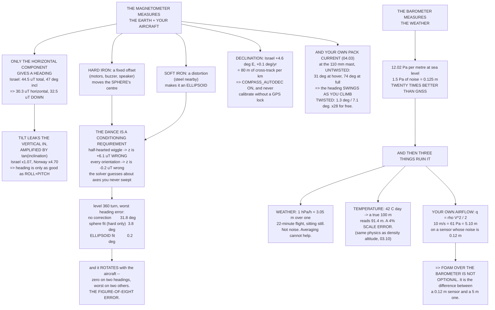

# 05.03 The magnetometer and the barometer

<!-- glance:start -->
<!-- generated by tools/build.py from curriculum/syllabus.yaml — edit the syllabus, not this block -->

| | |
|---|---|
| **Track** | Main path |
| **Difficulty** | Intermediate |
| **Time** | 1 h 15 min |
| **Hardware** | First flight (Hermon core) (stage 1) |
| **Software** | python |
| **Prerequisites** | [05.02 The IMU: gyroscopes and accelerometers](05.02-imu.md) |
| **Skip if** | You can explain hard- and soft-iron error, apply declination, and say why a barometer's altitude moves when weather does. |

<!-- glance:end -->

## What you will learn

- Why **only the horizontal component** of the Earth's field gives you a heading, and why that
  makes a compass a latitude-dependent instrument
- Why a 1° attitude error becomes a **1.07° heading error in Israel** and a 4.7° one in Norway —
  the $\tan(\text{inclination})$ amplification
- **Hard iron** and **soft iron**: what each one is, what each one costs, and why the calibration
  dance is not superstition but a conditioning requirement
- **Declination**: 4.6° East in Israel, and what that is worth in metres of cross-track
- How much heading error your own pack current causes, and what twisting the lead buys
- Why the barometer resolves **12 centimetres** and still gives you **five metres** of error the
  moment you fly forward
- The three things that ruin a barometer: weather, temperature and your own propwash

## Why it matters

These are the two sensors that keep the IMU honest at DC. The magnetometer is the only absolute
yaw reference on the aircraft; the barometer is the only altitude reference good enough to hold a
height. Both are single points of failure in the sense of
[05.01](05.01-sensor-roles.md) — Hermon has one compass — and both are far more affected by
**decisions you made in module 04** than by which part you bought.

The magnetometer, in particular, has a property no other sensor on the aircraft shares: **it
measures the aircraft itself.** Four motors are four permanent magnets. The pack lead is a
current-carrying conductor. The frame may have steel in it. The field the sensor reports is the
Earth's field *plus* all of that, and separating them is the whole of the calibration problem.

The barometer is more subtle. It is an extraordinarily good sensor — 12 cm of resolution — and it
is ruined by three effects that have nothing to do with its specification.

## Prerequisites

<!-- prereqs:start -->
## Prerequisites

You need these first:

- [05.02 The IMU: gyroscopes and accelerometers](05.02-imu.md)

### Optional prerequisite links

None.

Check your readiness: `python course.py why 05.03`
<!-- prereqs:end -->

## Concept

### Only the horizontal field gives you a heading

The Earth's magnetic field is a vector. Near the equator it lies almost flat; near the poles it
points almost straight down. The angle below horizontal is the **inclination**, and **only the
horizontal component tells you which way you are facing.**

| Place | Total | Inclination | **Horizontal** | 0.3 µT noise → heading | 1° tilt → heading |
|---|---:|---:|---:|---:|---:|
| **Israel (Tel Aviv)** | **44.5 µT** | **47.0°** | **30.3 µT** | **0.57°** | **1.07°** |
| Equator (Nairobi) | 33.0 µT | −20.0° | 31.0 µT | 0.55° | 0.36° |
| UK (London) | 49.0 µT | 66.5° | 19.5 µT | 0.88° | 2.30° |
| Norway (Tromsø) | 52.5 µT | 78.0° | 10.9 µT | 1.57° | 4.70° |

In Israel the field is 44.5 µT but only **30.3 µT** of it points at the horizon. The other
32.5 µT points **down**, and contributes nothing to heading — until you tilt.

> [!IMPORTANT]
> **When you tilt, the vertical field leaks into the horizontal plane and becomes a heading
> error, amplified by $\tan(\text{inclination})$.** In Israel that is ×1.07, so the 1° of level
> error from [05.01](05.01-sensor-roles.md) is 1.07° of heading error. In Tromsø the same 1° is
> **4.7°**. Your heading is only ever as good as your roll and pitch — which means it is only ever
> as good as your accelerometer calibration ([05.06](05.06-noise-bias-and-calibration.md)).

Israel is, as it happens, a good place to fly a compass: a large horizontal component and a
modest inclination. Almost everything written about compass problems on the internet comes from
higher latitudes, where the same hardware behaves considerably worse.

### Hard iron and soft iron

**Hard iron** is a fixed offset added by the permanent magnets you bolted on — four motors, a
buzzer, a speaker. It moves the centre of the sphere of readings away from the origin.

**Soft iron** is a distortion. Ferrous material nearby concentrates and redirects the field, so
the sphere becomes an **ellipsoid**, differently scaled along each body axis.

Simulate it with a hard iron of (12, −7, 4) µT and a soft iron of (1.00, 0.88, 1.06), then spin
the aircraft and fit a sphere to the readings. Here is the same fit with three different
calibration dances:

| Sweep | x | y | z | Radius | **z error** |
|---|---:|---:|---:|---:|---:|
| Half-hearted (±30°) | 11.83 | −6.97 | 10.13 | 40.43 | **+6.13** |
| Thorough (±90°) | 11.93 | −6.89 | 5.76 | 43.39 | **+1.76** |
| Every orientation | 12.04 | −6.91 | 3.77 | 43.84 | **−0.23** |
| **True** | **12.00** | **−7.00** | **4.00** | **44.50** | |

Read the last column. A half-hearted wiggle barely tips the aircraft, so the readings never sweep
the vertical axis, so the fit is **ill-conditioned in z and essentially guesses**. It is not that
the maths is worse; it is that the data does not contain the answer.

> [!IMPORTANT]
> **The calibration dance is not superstition.** Rotating the aircraft through every orientation —
> nose up, nose down, on each side, inverted — is what makes the fit well-conditioned. Skip it and
> the solver returns a confident number for an axis it has no information about. This is also why
> ArduPilot's calibration bar fills per-axis and why it refuses to finish until all of them do.

Now fly a level 360° turn with the corrected sensor and measure the worst heading error:

| Correction applied | Worst heading error |
|---|---:|
| None at all | **31.8°** |
| Hard iron only (sphere fit) | 3.8° |
| Hard + soft iron (ellipsoid fit) | **0.2°** |

Thirty-two degrees, uncalibrated — and it is **not a constant offset you can trim out**. It
rotates with the aircraft, so it is near zero on two headings and worst on two others. That is
the classic "figure-of-eight" compass error, and it is why a compass that seems fine pointing
north can be 30° wrong pointing east.

A sphere fit removes most of it. The ellipsoid fit removes the rest. That is exactly why
ArduPilot fits an ellipsoid and not a sphere.

### Declination: magnetic north is not north

The magnetometer finds magnetic north. Your mission is written in true north. The difference is
the **declination**, it varies with place and with year, and it is a constant heading bias —
which means a constant **cross-track** error:

| Place | Declination | Cross-track at 1 km | At 5 km |
|---|---:|---:|---:|
| **Israel (Tel Aviv)** | **+4.6° E** | **80 m** | **401 m** |
| Equator (Nairobi) | +1.0° | 17 m | 87 m |
| UK (London) | +0.5° | 9 m | 44 m |
| Norway (Tromsø) | +11.0° | 191 m | 954 m |

Israel's declination is about **+4.6° East** and it drifts by roughly +0.1° a year, so a hard-coded
value from an old tutorial is wrong by a degree per decade. ArduPilot looks it up from the World
Magnetic Model using your GNSS position, which is why `COMPASS_AUTODEC` should stay **on** — and
why **a compass calibrated with no GPS lock has been calibrated against the wrong north**.

### Your own pack current, again

[04.03](../04-frame-and-assembly/04.03-wiring-harness.md) computed the field around the pack lead.
Here is the same calculation expressed as what actually matters — heading error against Israel's
30.3 µT horizontal component:

| Standoff | At hover (10.2 A) | Heading error | At full (57 A) | Heading error |
|---:|---:|---:|---:|---:|
| 30 mm | 68.0 µT | 65.9° | 380.0 µT | 85.4° |
| 50 mm | 40.8 µT | 53.4° | 228.0 µT | 82.4° |
| 80 mm | 25.5 µT | 40.0° | 142.5 µT | 78.0° |
| **110 mm (the mast)** | **18.5 µT** | **31.4°** | **103.6 µT** | **73.7°** |
| 200 mm | 10.2 µT | 18.6° | 57.0 µT | 62.0° |
| 458 mm | 4.5 µT | 8.3° | 24.9 µT | 39.4° |

Hermon's compass sits on a 110 mm mast. With an **untwisted** single conductor that is **31° of
heading error at hover and 74° at full throttle** — so the heading *swings as you climb*, which is
the diagnostic signature you should learn to recognise.

Twist the pair 4 mm apart and it becomes a dipole falling as $1/r^2$:

| | Untwisted | Twisted |
|---|---:|---:|
| At hover | 18.5 µT (31.4°) | **0.67 µT (1.3°)** |
| At full throttle | 103.6 µT (73.7°) | **3.77 µT (7.1°)** |

**A factor of twenty-eight, for ten seconds of work.** Then let `COMPASS_MOT` learn the residual
— which is a correction of a few degrees rather than an impossible seventy.

> [!TIP]
> **Ask your teacher:** "My heading reads fine on the ground and rotates by about 15° as I climb
> to altitude at high throttle. Walk me through how I would tell that apart from a genuine
> declination error or a bad calibration, using only the log — what exactly correlates with what."

### The barometer: twelve pascals per metre

Atmospheric pressure falls by about **12.02 Pa per metre** at sea level. A modern MEMS barometer
after filtering has roughly 1.5 Pa of noise:

| Altitude | Pressure | Pa per m | Noise → metres |
|---:|---:|---:|---:|
| 0 m | 101,325 Pa | 12.02 | **0.125 m** |
| 100 m | 100,129 Pa | 11.90 | 0.126 m |
| 500 m | 95,459 Pa | 11.45 | 0.131 m |
| 1,000 m | 89,871 Pa | 10.90 | 0.138 m |
| 2,000 m | 79,488 Pa | 9.87 | 0.152 m |

**Twelve centimetres of resolution** — twenty times better than GNSS vertical. It is an
outstanding sensor. And then three things ruin it.

**(a) Weather.** Synoptic pressure changes of about 1 hPa/h are ordinary:

| Elapsed | Pressure change | Apparent altitude |
|---:|---:|---:|
| 5 min | 8.3 Pa | 0.69 m |
| **22 min (one flight)** | **36.7 Pa** | **3.05 m** |
| 60 min | 100.0 Pa | 8.32 m |

Three metres of drift over one flight with the aircraft perfectly still. **This is not noise and
averaging does not touch it** — which is why the estimator blends barometric altitude with GNSS
altitude instead of trusting either.

**(b) Temperature.** The barometric formula assumes a standard atmosphere at 15 °C. On a hot day
the air column is less dense, so the same pressure corresponds to a greater height:

| Day | A true 100 m reads | Error |
|---|---:|---:|
| 15 °C | 100.0 m | −0.0 m |
| 25 °C | 96.6 m | −3.4 m |
| 35 °C | 93.5 m | −6.5 m |
| **42 °C (an Israeli summer)** | **91.4 m** | **−8.6 m** |

That is a **4 % scale error**, and it is the same physics as the density altitude in
[03.10](../03-power-system/03.10-lipo-in-israel.md) — the air that makes your barometer read low
is the air that makes your propellers less effective.

**(c) Your own airflow.** This is the big one, and it is a mounting problem rather than a sensor
problem. Any airflow past a static port changes the pressure it sees:

| Airspeed | $q = \frac12 \rho V^2$ | Apparent altitude |
|---:|---:|---:|
| 0 m/s | 0.0 Pa | 0.00 m |
| 3 m/s | 5.5 Pa | 0.46 m |
| 6 m/s | 22.1 Pa | 1.83 m |
| **10 m/s (cruise)** | **61.2 Pa** | **5.10 m** |
| 16.8 m/s (best range) | 172.9 Pa | 14.39 m |

**A 10 m/s cruise is five metres of apparent altitude**, appearing the instant you accelerate, on
a sensor whose own noise is twelve centimetres. Propwash over an unshielded port does the same
thing in a hover, which is why altitude sometimes jumps at takeoff.

> [!IMPORTANT]
> **Foam over the barometer is not optional.** A small piece of open-cell foam over the sensor
> turns a port that sees dynamic pressure into one that sees static pressure, and it is the
> difference between a 0.12 m sensor and a 5 m one. It also stops direct sunlight heating the
> die, which is its own error source. Every commercial flight controller ships with it, and it
> is the first thing that falls off during a build.

## Technical explanation

### Level 1 — Intuition: two sensors that measure their surroundings

A compass does not measure heading. It measures the magnetic field *where it is*, and that field
is the Earth's plus everything magnetic you put near it. A barometer does not measure altitude.
It measures the air pressure *where it is*, and that pressure depends on the weather, the
temperature and whether air is moving past the hole.

Both are excellent instruments reporting honestly about a quantity that is only loosely related
to the one you wanted.

### Level 2 — Practical: setting them up

| Setting | Value | Why |
|---|---|---|
| `COMPASS_AUTODEC` | 1 (on) | Looks up declination from the World Magnetic Model and your GNSS position |
| `COMPASS_USE`, `_USE2` | external on, internal **off** | The internal compass sits on the FC, in the middle of everything |
| `COMPASS_MOT_*` | learned | The residual current coupling, after twisting |
| `COMPASS_LEARN` | 0 in flight | Learn on the bench, not while navigating |
| `BARO_PRIMARY` | the shielded one | If your FC has two barometers, know which is under the foam |
| `EK3_SRC1_POSZ` | baro | Baro for height, GNSS to correct its drift |

And the physical setup: compass **on the mast**, pack lead **twisted**, foam **over the
barometer**, calibration done **outdoors with a GNSS lock** and away from cars, reinforced
concrete and steel benches.

### Level 3 — Mathematics

**Heading from a tilt-compensated magnetometer.** With roll $\phi$ and pitch $\theta$ from the
attitude estimate, rotate the body-frame field into the horizontal plane:

$$X_h = m_x\cos\theta + m_y\sin\phi\sin\theta + m_z\cos\phi\sin\theta$$
$$Y_h = m_y\cos\phi - m_z\sin\phi$$
$$\psi_{mag} = \operatorname{atan2}(-Y_h,\, X_h), \qquad \psi_{true} = \psi_{mag} + \delta$$

with $\delta$ the declination. Differentiating with respect to a tilt error gives the
$\tan(I)$ amplification in the table above, where $I$ is the inclination.

**Calibration.** The measurement model is

$$\mathbf{m}_{meas} = \mathbf{S}\,\mathbf{m}_{true} + \mathbf{b}$$

with $\mathbf b$ the hard iron and $\mathbf S$ the soft-iron matrix. Since
$|\mathbf m_{true}| = B_{earth}$ is constant, the measurements lie on an ellipsoid; fitting it
recovers $\mathbf S$ and $\mathbf b$. With $\mathbf S = \mathbf I$ the ellipsoid is a sphere and
the fit is linear:

$$x^2+y^2+z^2 = 2ax + 2by + 2cz + d$$

which is the four-parameter least-squares problem the code solves. The conditioning of that
system depends entirely on how well the samples cover the sphere — hence the dance.

**The barometric formula**, in the troposphere:

$$P(h) = P_0\left(1 - \frac{L h}{T_0}\right)^{g/(R L)}, \qquad L = 0.0065\ \text{K/m}$$

Differentiating near sea level gives $dP/dh = -\rho g = -12.0$ Pa/m, and the temperature
sensitivity is the $T_0$ in the denominator — a 10 K error in assumed temperature is a 3.5 %
error in height.

**Dynamic pressure** at a static port: $q = \frac12\rho V^2$, which converted to apparent altitude
is $q/(\rho g) = V^2/(2g)$ — note that this is independent of air density, and that it is exactly
the "velocity head" of elementary fluid mechanics.

### Level 4 — Implementation: the calibration procedure that works

1. **Outdoors**, at least 5 m from cars, reinforced concrete, steel benches and buried pipework.
2. **With a GNSS 3D fix**, so declination is looked up correctly.
3. **Battery connected and the aircraft complete** — you are calibrating the aircraft, not the
   sensor. Anything you add afterwards invalidates it.
4. Rotate through **every orientation**, slowly, for the full duration: level spin, nose up, nose
   down, on the left side, on the right side, inverted, and a spin in each.
5. Accept only if the reported offsets are under about 300 in ArduPilot's units and the fitness
   is "good".
6. Then run `COMPASS_MOT` with the propellers **off** and the aircraft restrained, sweeping
   throttle, so the firmware learns the current coupling.
7. Record the offsets in your build document. If they change a lot between calibrations,
   something magnetic is moving.

## Diagram



## Code

Save as `compass_baro.py` and run `python compass_baro.py`. Standard library only.

```python
"""05.03 - the magnetometer measures your aircraft; the barometer, the weather."""
import math
import random

G = 9.81
RHO = 1.225
P0 = 101325.0             # Pa
T0 = 288.15               # K
L_RATE = 0.0065           # K/m, standard lapse rate
R_SPEC = 287.05           # J/kg.K
M_EXP = G / (R_SPEC * L_RATE)

# --- the magnetic field --------------------------------------------------
# place, total field uT, inclination deg, declination deg (2026)
PLACES = [("Israel (Tel Aviv)", 44.5, 47.0, 4.6),
          ("equator (Nairobi)", 33.0, -20.0, 1.0),
          ("UK (London)", 49.0, 66.5, 0.5),
          ("Norway (Tromso)", 52.5, 78.0, 11.0)]
ISRAEL = PLACES[0]
MAG_NOISE_UT = 0.3        # uT, a decent MEMS magnetometer after filtering
TILT_ERR_DEG = 1.0        # deg of attitude error (05.01)
I_HOVER, I_FULL = 10.2, 57.0
MAST_M = 0.110            # the GNSS mast height (04.02)
TWIST_SEP_M = 0.004       # centre-to-centre of a twisted 12 AWG pair

# --- hard and soft iron --------------------------------------------------
HARD_IRON = (12.0, -7.0, 4.0)        # uT, from motor magnets and the buzzer
SOFT_IRON = (1.00, 0.88, 1.06)       # diagonal scale from nearby steel
N_CAL = 800

# --- the barometer -------------------------------------------------------
BARO_NOISE_PA = 1.5       # Pa RMS after filtering
WEATHER_HPA_PER_H = 1.0   # a brisk synoptic change
FLIGHT_MIN = 22.0
SPEEDS = [0, 3, 6, 10, 16.8]


def h_component(total_ut, incl_deg):
    return total_ut * math.cos(math.radians(incl_deg))


def heading_noise_deg(total_ut, incl_deg, noise_ut=MAG_NOISE_UT):
    return math.degrees(noise_ut / h_component(total_ut, incl_deg))


def tilt_to_heading_deg(incl_deg, tilt_deg=TILT_ERR_DEG):
    """A tilt error leaks the VERTICAL field into the horizontal plane."""
    return tilt_deg * abs(math.tan(math.radians(incl_deg)))


def field_ut(i, r_m):
    """B = mu0 I / 2 pi r, in microtesla (04.03)."""
    return 2e-7 * i / r_m * 1e6


def pressure_at(h, t0=T0):
    return P0 * (1 - L_RATE * h / t0) ** M_EXP


def dp_dh(h, t0=T0):
    return pressure_at(h + 0.5, t0) - pressure_at(h - 0.5, t0)


def alt_from_p(p, t0=T0):
    return t0 / L_RATE * (1 - (p / P0) ** (1 / M_EXP))


def solve4(a, b):
    """Gaussian elimination with partial pivoting on a 4x4 system."""
    n = 4
    m = [row[:] + [b[i]] for i, row in enumerate(a)]
    for c in range(n):
        p = max(range(c, n), key=lambda r: abs(m[r][c]))
        m[c], m[p] = m[p], m[c]
        for r in range(n):
            if r == c:
                continue
            f = m[r][c] / m[c][c]
            for k in range(c, n + 1):
                m[r][k] -= f * m[c][k]
    return [m[i][n] / m[i][i] for i in range(n)]


def fit_sphere(pts):
    """x^2+y^2+z^2 = 2ax + 2by + 2cz + d  ->  centre (a,b,c) and radius."""
    a = [[0.0] * 4 for _ in range(4)]
    b = [0.0] * 4
    for p in pts:
        x, y, z = p[0], p[1], p[2]
        row = [2 * x, 2 * y, 2 * z, 1.0]
        rhs = x * x + y * y + z * z
        for i in range(4):
            for j in range(4):
                a[i][j] += row[i] * row[j]
            b[i] += row[i] * rhs
    cx, cy, cz, d = solve4(a, b)
    return (cx, cy, cz), math.sqrt(d + cx * cx + cy * cy + cz * cz)


def synth_samples(total_ut, incl_deg, hard, soft, n=N_CAL, sweep=0.5,
                  seed=20260923):
    """Rotate through many attitudes and record what the sensor reads.

    `sweep` is how far you tip the aircraft, in radians: 0.5 rad is the
    half-hearted wiggle, pi is the full 'every orientation' dance.
    """
    rnd = random.Random(seed)
    incl = math.radians(incl_deg)
    fn, fe, fd = (total_ut * math.cos(incl), 0.0, total_ut * math.sin(incl))
    out = []
    for _ in range(n):
        yaw = rnd.uniform(0, 2 * math.pi)
        pitch = rnd.uniform(-sweep, sweep)
        roll = rnd.uniform(-sweep, sweep)
        bx = fn * math.cos(yaw) + fe * math.sin(yaw)
        by = -fn * math.sin(yaw) + fe * math.cos(yaw)
        bz = fd
        bx, bz = (bx * math.cos(pitch) - bz * math.sin(pitch),
                  bx * math.sin(pitch) + bz * math.cos(pitch))
        by, bz = (by * math.cos(roll) + bz * math.sin(roll),
                  -by * math.sin(roll) + bz * math.cos(roll))
        out.append((bx * soft[0] + hard[0], by * soft[1] + hard[1],
                    bz * soft[2] + hard[2], yaw, pitch, roll))
    return out


def level_sweep(total_ut, incl_deg, hard, soft, n=360):
    """What the sensor reads while the aircraft turns through 360 deg, level."""
    incl = math.radians(incl_deg)
    fn, fd = total_ut * math.cos(incl), total_ut * math.sin(incl)
    out = []
    for i in range(n):
        yaw = 2 * math.pi * i / n
        bx, by, bz = fn * math.cos(yaw), -fn * math.sin(yaw), fd
        out.append((bx * soft[0] + hard[0], by * soft[1] + hard[1],
                    bz * soft[2] + hard[2], yaw, 0.0, 0.0))
    return out


def heading_err(pts, hard=(0.0, 0.0, 0.0), soft=(1.0, 1.0, 1.0)):
    """Worst heading error over a level sweep, after a given correction."""
    worst = 0.0
    for bx, by, bz, yaw, pitch, roll in pts:
        cx = (bx - hard[0]) / soft[0]
        cy = (by - hard[1]) / soft[1]
        est = math.atan2(-cy, cx) % (2 * math.pi)
        worst = max(worst, abs((est - yaw + math.pi) % (2 * math.pi) - math.pi))
    return math.degrees(worst)


def bar(t):
    print("\n" + "=" * 70)
    print(t)
    print("=" * 70)


if __name__ == "__main__":
    bar("1. ONLY THE HORIZONTAL FIELD GIVES YOU A HEADING")
    print(f"  {'place':20s} {'total':>7s} {'incl':>6s} {'HORIZONTAL':>11s}"
          f" {'noise->hdg':>11s} {'1 deg tilt':>11s}")
    for name, tot, incl, decl in PLACES:
        print(f"  {name:20s} {tot:6.1f}u {incl:5.1f}d"
              f" {h_component(tot, incl):10.1f}u"
              f" {heading_noise_deg(tot, incl):10.2f}d"
              f" {tilt_to_heading_deg(incl):10.2f}d")
    name, tot, incl, decl = ISRAEL
    print(f"\n  In Israel the field is {tot:.1f} uT but only"
          f" {h_component(tot, incl):.1f} uT of it")
    print(f"  points at the horizon. The other"
          f" {tot * math.sin(math.radians(incl)):.1f} uT points DOWN and")
    print("  contributes nothing to heading -- until you TILT, at which")
    print(f"  point it leaks in and a {TILT_ERR_DEG:.0f} deg attitude error"
          f" becomes a {tilt_to_heading_deg(incl):.2f} deg")
    print("  heading error. The amplification is tan(inclination).")
    print("  So a compass is worse near the poles, and your heading is only")
    print("  ever as good as your ROLL AND PITCH (05.02).")

    bar("2. HARD IRON AND SOFT IRON")
    print("  HARD iron is a fixed offset added by the permanent magnets you")
    print("  bolted on: four motors, a buzzer, a speaker. SOFT iron is a")
    print("  distortion -- steel nearby concentrates the field, so the")
    print("  sphere of readings becomes an ellipsoid.")
    print(f"  Simulated: hard iron {HARD_IRON} uT, soft iron {SOFT_IRON}.")
    print("\n  Now the calibration dance. Same maths, three different sweeps:")
    print(f"  {'sweep':>24s} {'x':>7s} {'y':>7s} {'z':>7s} {'radius':>8s}"
          f" {'z error':>9s}")
    fits = {}
    for label, sweep in (("half-hearted (+-30 deg)", 0.5),
                         ("thorough (+-90 deg)", math.pi / 2),
                         ("every orientation", math.pi)):
        pts = synth_samples(tot, incl, HARD_IRON, SOFT_IRON, sweep=sweep)
        centre, radius = fit_sphere(pts)
        fits[label] = (centre, radius, pts)
        print(f"  {label:>24s} {centre[0]:7.2f} {centre[1]:7.2f}"
              f" {centre[2]:7.2f} {radius:8.2f}"
              f" {centre[2] - HARD_IRON[2]:+9.2f}")
    print(f"  {'TRUE':>24s} {HARD_IRON[0]:7.2f} {HARD_IRON[1]:7.2f}"
          f" {HARD_IRON[2]:7.2f} {tot:8.2f}")
    print("  READ THE z ERROR COLUMN. A half-hearted wiggle barely tips the")
    print("  aircraft, so the readings never sweep the vertical axis, so the")
    print("  fit is ILL-CONDITIONED in z and simply guesses. The dance is")
    print("  not superstition -- it is what makes the problem solvable.")

    centre, radius, _ = fits["every orientation"]
    pts = level_sweep(tot, incl, HARD_IRON, SOFT_IRON)
    print(f"\n  Now fly a level 360 deg turn and check the heading:")
    print(f"  {'correction applied':36s} {'worst heading error':>20s}")
    for label, hard, soft in (("none at all", (0.0, 0.0, 0.0), (1.0, 1.0, 1.0)),
                              ("hard iron only (sphere fit)", centre,
                               (1.0, 1.0, 1.0)),
                              ("hard + soft (ellipsoid fit)", centre,
                               SOFT_IRON)):
        print(f"  {label:36s} {heading_err(pts, hard, soft):17.1f} deg")
    print("  Uncalibrated the error is tens of degrees, and it is NOT a")
    print("  constant offset you can trim out: it rotates with the aircraft,")
    print("  so it is zero on two headings and worst on two others -- the")
    print("  classic figure-of-eight. The sphere fit takes out most of it;")
    print("  the ellipsoid fit takes out the rest. That is exactly why")
    print("  ArduPilot fits an ellipsoid and not a sphere.")

    bar("3. DECLINATION: MAGNETIC NORTH IS NOT NORTH")
    print(f"  {'place':20s} {'declination':>12s} {'cross-track, 1 km':>19s}"
          f" {'at 5 km':>10s}")
    for nm, t_, i_, d_ in PLACES:
        print(f"  {nm:20s} {d_:11.1f}d"
              f" {1000 * math.sin(math.radians(d_)):16.0f} m"
              f" {5000 * math.sin(math.radians(d_)):7.0f} m")
    print("  Israel's declination is about +4.6 deg EAST and it drifts by")
    print("  roughly +0.1 deg a year. ArduPilot looks it up from the World")
    print("  Magnetic Model using your GNSS position, which is why")
    print("  COMPASS_AUTODEC stays ON -- and why a compass calibrated with")
    print("  no GPS lock has been calibrated against the wrong north.")

    bar("4. THE AIRCRAFT'S OWN FIELD (04.03, AGAIN)")
    hz = h_component(tot, incl)
    print(f"  Horizontal Earth field to beat, in Israel: {hz:.1f} uT")
    print(f"  A single UNTWISTED conductor:")
    print(f"  {'standoff':>9s} {'at hover':>10s} {'hdg err':>9s}"
          f" {'at full':>10s} {'hdg err':>9s}")
    for mm in (30, 50, 80, 110, 200, 458):
        r_m = mm / 1000
        bh, bf = field_ut(I_HOVER, r_m), field_ut(I_FULL, r_m)
        print(f"  {mm:6d} mm {bh:9.1f}u"
              f" {math.degrees(math.atan2(bh, hz)):8.1f}d"
              f" {bf:9.1f}u {math.degrees(math.atan2(bf, hz)):8.1f}d")
    r_m = MAST_M
    print(f"\n  Hermon's compass is on a {MAST_M * 1000:.0f} mm mast."
          f" Untwisted, a single conductor")
    print(f"  there costs"
          f" {math.degrees(math.atan2(field_ut(I_HOVER, r_m), hz)):.0f}"
          f" deg at hover and"
          f" {math.degrees(math.atan2(field_ut(I_FULL, r_m), hz)):.0f} deg"
          f" at full throttle --")
    print("  so the heading SWINGS AS YOU CLIMB, which is the diagnostic")
    print("  signature. TWIST THE PACK LEAD: the pair becomes a dipole")
    print("  falling as 1/r^2, worth roughly a factor of r/s.")
    gain = r_m / TWIST_SEP_M
    bh, bf = field_ut(I_HOVER, r_m) / gain, field_ut(I_FULL, r_m) / gain
    print(f"  Twisted ({TWIST_SEP_M * 1000:.0f} mm apart), at"
          f" {MAST_M * 1000:.0f} mm: {bh:.2f} uT at hover"
          f" ({math.degrees(math.atan2(bh, hz)):.1f} deg)")
    print(f"  and {bf:.2f} uT at full ({math.degrees(math.atan2(bf, hz)):.1f}"
          f" deg). A factor of {gain:.0f} for free.")
    print("  THEN let COMPASS_MOT learn what is left.")

    bar("5. THE BAROMETER: 12 Pa PER METRE")
    print(f"  {'altitude':>9s} {'pressure':>11s} {'Pa per m':>10s}"
          f" {'noise -> m':>11s}")
    for h in (0, 100, 500, 1000, 2000):
        grad = abs(dp_dh(h))
        print(f"  {h:6d} m {pressure_at(h):10.0f}Pa {grad:9.2f}"
              f" {BARO_NOISE_PA / grad:10.3f}")
    print(f"  {BARO_NOISE_PA:.1f} Pa of sensor noise is"
          f" {BARO_NOISE_PA / abs(dp_dh(0)):.2f} m of altitude noise --")
    print("  better than GNSS vertical by a factor of twenty.")
    print("  Now the three things that ruin it.")

    print(f"\n  (a) WEATHER, at {WEATHER_HPA_PER_H:.1f} hPa/h:")
    for mins in (5, 22, 60):
        dpa = WEATHER_HPA_PER_H * 100 * mins / 60
        print(f"      {mins:3d} min -> {dpa:6.1f} Pa ->"
              f" {dpa / abs(dp_dh(0)):5.2f} m of apparent altitude")
    print(f"      Over a {FLIGHT_MIN:.0f}-minute flight that is"
          f" {WEATHER_HPA_PER_H * 100 * FLIGHT_MIN / 60 / abs(dp_dh(0)):.1f} m"
          f" of drift with the")
    print("      aircraft perfectly still. It is not noise, and averaging")
    print("      does not touch it.")

    print("\n  (b) TEMPERATURE. The formula assumes a standard atmosphere:")
    for t_c in (15, 25, 35, 42):
        p = pressure_at(100.0, 273.15 + t_c)
        print(f"      {t_c:2d} C day: a true 100 m reads {alt_from_p(p):6.1f} m"
              f"  ({alt_from_p(p) - 100.0:+5.1f} m)")
    print("      An Israeli summer afternoon is a 4 % altitude scale error")
    print("      -- and the same effect is the density altitude of 03.10.")

    print("\n  (c) YOUR OWN AIRFLOW, at the static port:")
    print(f"      {'airspeed':>9s} {'q = rho V^2/2':>14s} {'apparent alt':>13s}")
    for v in SPEEDS:
        q = 0.5 * RHO * v * v
        print(f"      {v:6.1f} m/s {q:12.1f} Pa {q / abs(dp_dh(0)):10.2f} m")
    print("      A 10 m/s cruise is 61 Pa -- FIVE METRES of apparent")
    print("      altitude, appearing the moment you accelerate, on a sensor")
    print("      whose own noise is twelve centimetres.")
    print("      => FOAM OVER THE BAROMETER IS NOT OPTIONAL. It is the")
    print("         difference between a 0.12 m sensor and a 5 m one.")
```

Output:

```text

======================================================================
1. ONLY THE HORIZONTAL FIELD GIVES YOU A HEADING
======================================================================
  place                  total   incl  HORIZONTAL  noise->hdg  1 deg tilt
  Israel (Tel Aviv)      44.5u  47.0d       30.3u       0.57d       1.07d
  equator (Nairobi)      33.0u -20.0d       31.0u       0.55d       0.36d
  UK (London)            49.0u  66.5d       19.5u       0.88d       2.30d
  Norway (Tromso)        52.5u  78.0d       10.9u       1.57d       4.70d

  In Israel the field is 44.5 uT but only 30.3 uT of it
  points at the horizon. The other 32.5 uT points DOWN and
  contributes nothing to heading -- until you TILT, at which
  point it leaks in and a 1 deg attitude error becomes a 1.07 deg
  heading error. The amplification is tan(inclination).
  So a compass is worse near the poles, and your heading is only
  ever as good as your ROLL AND PITCH (05.02).

======================================================================
2. HARD IRON AND SOFT IRON
======================================================================
  HARD iron is a fixed offset added by the permanent magnets you
  bolted on: four motors, a buzzer, a speaker. SOFT iron is a
  distortion -- steel nearby concentrates the field, so the
  sphere of readings becomes an ellipsoid.
  Simulated: hard iron (12.0, -7.0, 4.0) uT, soft iron (1.0, 0.88, 1.06).

  Now the calibration dance. Same maths, three different sweeps:
                     sweep       x       y       z   radius   z error
   half-hearted (+-30 deg)   11.83   -6.97   10.13    40.43     +6.13
       thorough (+-90 deg)   11.93   -6.89    5.76    43.39     +1.76
         every orientation   12.04   -6.91    3.77    43.84     -0.23
                      TRUE   12.00   -7.00    4.00    44.50
  READ THE z ERROR COLUMN. A half-hearted wiggle barely tips the
  aircraft, so the readings never sweep the vertical axis, so the
  fit is ILL-CONDITIONED in z and simply guesses. The dance is
  not superstition -- it is what makes the problem solvable.

  Now fly a level 360 deg turn and check the heading:
  correction applied                    worst heading error
  none at all                                       31.8 deg
  hard iron only (sphere fit)                        3.8 deg
  hard + soft (ellipsoid fit)                        0.2 deg
  Uncalibrated the error is tens of degrees, and it is NOT a
  constant offset you can trim out: it rotates with the aircraft,
  so it is zero on two headings and worst on two others -- the
  classic figure-of-eight. The sphere fit takes out most of it;
  the ellipsoid fit takes out the rest. That is exactly why
  ArduPilot fits an ellipsoid and not a sphere.

======================================================================
3. DECLINATION: MAGNETIC NORTH IS NOT NORTH
======================================================================
  place                 declination   cross-track, 1 km    at 5 km
  Israel (Tel Aviv)            4.6d               80 m     401 m
  equator (Nairobi)            1.0d               17 m      87 m
  UK (London)                  0.5d                9 m      44 m
  Norway (Tromso)             11.0d              191 m     954 m
  Israel's declination is about +4.6 deg EAST and it drifts by
  roughly +0.1 deg a year. ArduPilot looks it up from the World
  Magnetic Model using your GNSS position, which is why
  COMPASS_AUTODEC stays ON -- and why a compass calibrated with
  no GPS lock has been calibrated against the wrong north.

======================================================================
4. THE AIRCRAFT'S OWN FIELD (04.03, AGAIN)
======================================================================
  Horizontal Earth field to beat, in Israel: 30.3 uT
  A single UNTWISTED conductor:
   standoff   at hover   hdg err    at full   hdg err
      30 mm      68.0u     65.9d     380.0u     85.4d
      50 mm      40.8u     53.4d     228.0u     82.4d
      80 mm      25.5u     40.0d     142.5u     78.0d
     110 mm      18.5u     31.4d     103.6u     73.7d
     200 mm      10.2u     18.6d      57.0u     62.0d
     458 mm       4.5u      8.3d      24.9u     39.4d

  Hermon's compass is on a 110 mm mast. Untwisted, a single conductor
  there costs 31 deg at hover and 74 deg at full throttle --
  so the heading SWINGS AS YOU CLIMB, which is the diagnostic
  signature. TWIST THE PACK LEAD: the pair becomes a dipole
  falling as 1/r^2, worth roughly a factor of r/s.
  Twisted (4 mm apart), at 110 mm: 0.67 uT at hover (1.3 deg)
  and 3.77 uT at full (7.1 deg). A factor of 28 for free.
  THEN let COMPASS_MOT learn what is left.

======================================================================
5. THE BAROMETER: 12 Pa PER METRE
======================================================================
   altitude    pressure   Pa per m  noise -> m
       0 m     101325Pa     12.02      0.125
     100 m     100129Pa     11.90      0.126
     500 m      95459Pa     11.45      0.131
    1000 m      89871Pa     10.90      0.138
    2000 m      79488Pa      9.87      0.152
  1.5 Pa of sensor noise is 0.12 m of altitude noise --
  better than GNSS vertical by a factor of twenty.
  Now the three things that ruin it.

  (a) WEATHER, at 1.0 hPa/h:
        5 min ->    8.3 Pa ->  0.69 m of apparent altitude
       22 min ->   36.7 Pa ->  3.05 m of apparent altitude
       60 min ->  100.0 Pa ->  8.32 m of apparent altitude
      Over a 22-minute flight that is 3.1 m of drift with the
      aircraft perfectly still. It is not noise, and averaging
      does not touch it.

  (b) TEMPERATURE. The formula assumes a standard atmosphere:
      15 C day: a true 100 m reads  100.0 m  ( -0.0 m)
      25 C day: a true 100 m reads   96.6 m  ( -3.4 m)
      35 C day: a true 100 m reads   93.5 m  ( -6.5 m)
      42 C day: a true 100 m reads   91.4 m  ( -8.6 m)
      An Israeli summer afternoon is a 4 % altitude scale error
      -- and the same effect is the density altitude of 03.10.

  (c) YOUR OWN AIRFLOW, at the static port:
       airspeed  q = rho V^2/2  apparent alt
         0.0 m/s          0.0 Pa       0.00 m
         3.0 m/s          5.5 Pa       0.46 m
         6.0 m/s         22.1 Pa       1.83 m
        10.0 m/s         61.2 Pa       5.10 m
        16.8 m/s        172.9 Pa      14.39 m
      A 10 m/s cruise is 61 Pa -- FIVE METRES of apparent
      altitude, appearing the moment you accelerate, on a sensor
      whose own noise is twelve centimetres.
      => FOAM OVER THE BAROMETER IS NOT OPTIONAL. It is the
         difference between a 0.12 m sensor and a 5 m one.
```

## Exercise

> [!WARNING]
> `COMPASS_MOT` requires running the motors. **Propellers off**, aircraft restrained, nobody in
> the plane of rotation — see [02.07](../02-motors-escs-props/02.07-static-thrust-test.md) and
> [SAFETY.md](../SAFETY.md). And do the compass calibration itself with the **propellers off
> too**: you will be tipping the aircraft into every orientation with a battery connected, and
> that is not a moment to have blades fitted.

### Exercise 05.03-E1 — Your own field `[numerical]`

1. Look up the total field, inclination and declination at your flying site (NOAA's magnetic
   field calculator or the World Magnetic Model).
2. Compute the horizontal component, the heading noise your magnetometer's specification implies,
   and the tilt amplification $\tan(I)$.
3. Compute your declination's cross-track cost over your longest planned mission leg.
4. State how much level error you can tolerate if heading must be good to 2°.

### Exercise 05.03-E2 — Watch the conditioning fail `[coding]`

Using the script:

1. Run the sphere fit at sweeps of 0.2, 0.5, 1.0, 1.57 and 3.14 radians and tabulate the z error.
2. Plot z error against sweep. Identify the sweep at which it becomes acceptable.
3. Add a fourth "sweep" that rotates only in yaw, perfectly level, and report what happens.
4. Explain, in one sentence, why the x and y estimates are fine throughout.

### Exercise 05.03-E3 — Calibrate, and prove it `[measurement]`

1. Calibrate the compass properly, per Level 4. Record the offsets and the fitness.
2. Fly or walk a level 360° turn with logging on, and plot reported heading against a reference
   (a phone compass held well away from the aircraft, or a surveyed line).
3. Report the worst error and its shape. Is it a figure-of-eight?
4. Deliberately do a half-hearted calibration, repeat, and report the difference.

### Exercise 05.03-E4 — Your barometer, before and after foam `[measurement]`

1. With the aircraft on the ground and logging, record barometric altitude for five minutes.
   Report the drift. That is your weather.
2. Remove the foam (if fitted), hover for 30 s, then fly a straight 10 m/s pass. Report the
   altitude excursion.
3. Refit the foam and repeat.
4. Compare the two excursions with the 5.10 m predicted by $V^2/2g$.

## Expected result

- **05.03-E1:** in Israel, a horizontal component near 30 µT, a tilt amplification near 1.07, and
  a declination cost around 80 m per kilometre. For 2° of heading you can tolerate about 1.8° of
  level error — comfortable, and much tighter at high latitudes.
- **05.03-E2:** the z error falls roughly as the vertical coverage improves and is acceptable
  somewhere past ±60°. A yaw-only sweep gives a **completely arbitrary** z offset: the data
  contains no information about that axis at all, and the solver will still return a number.
- **05.03-E3:** a well-calibrated compass on a twisted-lead aircraft should hold within a few
  degrees around a level turn. A half-hearted calibration typically leaves 5–15° and a clear
  two-lobed shape.
- **05.03-E4:** roughly 0.5–3 m of weather drift over five minutes, and a forward-flight
  excursion that is several metres without foam and a few tens of centimetres with it. The
  $V^2/2g$ prediction is usually within a factor of two — the port is not a perfect stagnation
  point.

## Troubleshooting

### Symptom: the heading rotates as the aircraft climbs at high throttle

Current coupling. Check the pack lead is **twisted**, check the compass is on its mast and at
least 100 mm from the trunk and the ESC, then run `COMPASS_MOT`. The signature to look for in the
log is heading error correlating with **current**, not with altitude or time.
[04.03](../04-frame-and-assembly/04.03-wiring-harness.md) has the field arithmetic.

### Symptom: the compass is right pointing north and wrong pointing east

That is the figure-of-eight signature of an uncalibrated hard iron — the error rotates with the
aircraft and is zero on two headings. Recalibrate properly, through every orientation, outdoors,
with a GNSS lock and the aircraft complete.

### Symptom: calibration keeps failing or reports poor fitness

Usually one of four things: indoors (reinforced concrete is full of steel), on a steel bench, an
incomplete dance, or something magnetic that moved between the start and end of the calibration —
a loose battery strap buckle is a classic. Do it outdoors, on grass, away from cars.

### Symptom: the aircraft flies a mission consistently to one side of the planned track

Declination. Check `COMPASS_AUTODEC` is on and that the aircraft had a 3D fix when it calibrated.
In Israel, 4.6° is 80 m per kilometre of leg, which is exactly the size of error people describe
as "it flies parallel to the line".

### Symptom: altitude jumps by several metres when the aircraft accelerates

Dynamic pressure at the static port. At 10 m/s that is 61 Pa, or 5.10 m of apparent altitude.
Fit foam over the barometer; if it already has foam, check the canopy has not been left off or a
vent has not been opened, because the whole airframe interior is your static chamber.

### Symptom: barometric altitude drifts a few metres over a long flight

Weather, and it is expected: 1 hPa/h is 8.3 m an hour. The estimator handles it by blending with
GNSS altitude. If you need better than a metre or two, you need a rangefinder
([05.05](05.05-flow-and-rangefinders.md)) or RTK (module 13).

## Common mistakes

- **Calibrating indoors.** Reinforced concrete is a soft-iron distortion the size of a building.
- **Calibrating without a GNSS lock.** Declination is looked up from position; no position means
  the wrong north.
- **A half-hearted dance.** The fit is ill-conditioned in any axis you did not sweep, and it will
  return a confident wrong number rather than an error.
- **Calibrating before the build is finished.** You are calibrating the aircraft. Anything
  magnetic added afterwards invalidates it.
- **Relying on `COMPASS_MOT` instead of twisting the pack lead.** Twisting is worth ×28; the
  compensation is for the few degrees that are left, not for seventy.
- **Leaving the internal compass enabled.** It sits on the flight controller, surrounded by
  everything.
- **Trusting barometric altitude in forward flight without foam.** 5 m at cruise.
- **Removing the barometer foam because it looks untidy.** It is the single most cost-effective
  component on the aircraft.
- **Assuming barometric drift is noise.** It is the weather; averaging does nothing.

## Knowledge check

<details>
<summary>The Earth's field in Israel is 44.5 µT. Why is the number that matters for heading only 30.3 µT?</summary>

Because the field is inclined 47° below horizontal, and **only the horizontal component gives a
heading**: $44.5\cos 47° = 30.3$ µT. The remaining 32.5 µT points downwards and contributes
nothing — until the aircraft tilts, at which point it leaks into the horizontal plane amplified by
$\tan 47° = 1.07$. At higher latitudes the horizontal component shrinks and the amplification
grows: Tromsø has 10.9 µT horizontal and a ×4.7 amplification.
</details>

<details>
<summary>Why does a half-hearted compass calibration produce a confidently wrong z offset?</summary>

Because the sphere fit is a least-squares problem whose conditioning depends on how well the
samples cover the sphere. If you only tip the aircraft ±30°, the readings barely move along the
vertical axis, so the normal equations are nearly singular in z — the data simply does not contain
the answer. The solver still returns a number: in the simulation, **+6.13 µT of error** against
−0.23 µT for a full sweep. Rotating through every orientation is a conditioning requirement, not
a ritual.
</details>

<details>
<summary>An uncalibrated hard iron gives 31.8° of heading error. Why can you not just subtract a constant?</summary>

Because the offset is fixed in the **body** frame while the Earth's field is fixed in the **world**
frame. As the aircraft turns, the offset rotates relative to the field, so the heading error varies
around the turn — near zero on two headings and worst on two others. That two-lobed pattern is the
"figure-of-eight" error, and no single constant can cancel it. You have to remove the offset in
the body frame, which is what calibration does.
</details>

<details>
<summary>What does twisting the pack lead buy, in degrees of heading?</summary>

At Hermon's 110 mm compass mast, an untwisted conductor gives **31.4° of error at hover and 73.7°
at full throttle**. Twisted 4 mm apart, the pair becomes a dipole whose field falls as $1/r^2$
instead of $1/r$ — worth roughly a factor of $r/s = 28$ — giving **1.3° and 7.1°**. That turns
`COMPASS_MOT` from an impossible task into a small residual correction.
</details>

<details>
<summary>A barometer resolves 12 cm. Why is its altitude wrong by five metres at cruise?</summary>

**Dynamic pressure at the static port.** At 10 m/s, $q = \frac12\rho V^2 = 61.2$ Pa, and at
12.02 Pa/m that is 5.10 m of apparent altitude — appearing the instant you accelerate. In terms
of altitude it is simply $V^2/2g$, independent of air density. Foam over the sensor converts a
port that sees dynamic pressure into one that sees static pressure, which is the difference
between a 0.12 m sensor and a 5 m one.
</details>

<details>
<summary>Your barometric altitude drifts 3 m over a 22-minute flight with the aircraft hovering. Is the sensor faulty?</summary>

No — that is the weather. A synoptic pressure change of 1 hPa/h is 100 Pa/h, and at 12.02 Pa/m
that is 8.3 m/h, or **3.05 m over 22 minutes**. It is a real change in the quantity the sensor
measures, so it is not noise and averaging does not reduce it. The estimator handles it by
blending barometric height with GNSS height, each covering the other's failure mode.
</details>

<details>
<summary>Why does an Israeli summer afternoon make your barometer read low?</summary>

Because the barometric formula assumes a standard 15 °C atmosphere. Hot air is less dense, so
pressure falls more slowly with height, so a given pressure corresponds to a *greater* true
altitude than the standard formula reports. On a 42 °C day a true 100 m reads **91.4 m** — a 4 %
scale error. It is the same physics as the density altitude in
[03.10](../03-power-system/03.10-lipo-in-israel.md): the air that fools your barometer is the air
that makes your propellers less effective.
</details>

## Practical challenge

Add a **compass and barometer section to `docs/sensors.md`**.

1. Your site's total field, inclination, declination and horizontal component, with the source
   and the date you looked them up.
2. Your tilt amplification and the level-error budget it implies for your heading requirement.
3. Your compass calibration offsets, the fitness, the date, and the aircraft configuration they
   were taken with.
4. Your `COMPASS_MOT` results, before and after twisting the pack lead.
5. Your measured level-turn heading error from E3, with the plot.
6. Your barometer's measured weather drift and your with/without-foam forward-flight excursion.
7. A one-line rule for yourself: when must you recalibrate the compass? (Any change to anything
   magnetic, any change of site by a few hundred kilometres, any repair.)

## You can skip this if

You can explain why only the horizontal field component yields a heading and compute it from
total field and inclination, derive the $\tan(I)$ tilt amplification and use it to set a level-error
budget, distinguish hard from soft iron and explain why the calibration dance is a conditioning
requirement rather than a ritual, quantify what declination costs in cross-track, compute your own
pack current's heading error and what twisting the lead buys, state the barometer's resolution in
pascals per metre, and account for weather drift, temperature scale error and dynamic pressure at
the static port with numbers.

## Go deeper

- [04.03](../04-frame-and-assembly/04.03-wiring-harness.md) (earlier): the field arithmetic and
  the twisted-pair fix.
- [05.01](05.01-sensor-roles.md) (earlier): why yaw becomes unobservable without a compass.
- [05.02](05.02-imu.md) (earlier): the attitude estimate that tilt-compensates the magnetometer.
- [05.04](05.04-gnss-receiver.md) (next): the sensor that supplies the position declination is
  looked up from.
- [05.06](05.06-noise-bias-and-calibration.md) (later): the calibration procedures in full.
- [03.10](../03-power-system/03.10-lipo-in-israel.md): density altitude, the same temperature
  physics from the propeller's side.
- The World Magnetic Model and a field calculator for your own site:
  https://www.ncei.noaa.gov/products/world-magnetic-model
- ArduPilot's compass setup and `COMPASS_MOT` procedure:
  https://ardupilot.org/copter/docs/common-compass-setup-advanced.html

## Progress checkpoint

Run `python course.py complete 05.03` when your compass is calibrated, `COMPASS_MOT` is run and
the barometer has its foam. Next: [05.04](05.04-gnss-receiver.md) — the sensor that bounds every
other error, and the four numbers that tell you whether to trust it.
