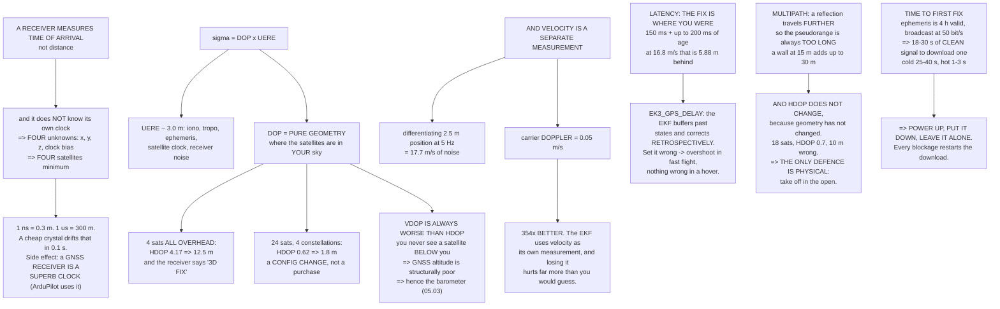

# 05.04 The GNSS receiver on a drone: fix types, HDOP, and what the FC does with it

<!-- glance:start -->
<!-- generated by tools/build.py from curriculum/syllabus.yaml — edit the syllabus, not this block -->

| | |
|---|---|
| **Track** | Main path |
| **Difficulty** | Intermediate |
| **Time** | 1 h 15 min |
| **Hardware** | First flight (Hermon core) (stage 1) |
| **Software** | none |
| **Prerequisites** | [05.03 The magnetometer and the barometer](05.03-compass-and-baro.md) |
| **Optional prerequisites** | [FGL.01 Earth coordinates and datums: what a latitude really is](../optional-foundations/gnss-navigation-math/FGL.01-earth-coordinates-and-datums.md) |
| **Skip if** | You can read a GNSS status line (fix type, satellites, HDOP) and say whether it is safe to arm in an auto mode. |

<!-- glance:end -->

## What you will learn

- Why a GNSS receiver solves for **four** unknowns rather than three, and why one microsecond of
  clock error is 300 metres
- **Dilution of precision**: why four satellites can give a 3D fix and a 12-metre error, and why
  satellite count alone is not a quality measure
- Why **VDOP is structurally worse than HDOP**, always
- Why GNSS **velocity is a completely separate measurement** from position, and 354× better than
  differentiating it
- What **latency** costs: the fix describes where you *were*, and at cruise that is metres
- **Multipath**: the error that only goes one way, and that HDOP cannot detect
- The fix types, what each is worth, and an honest note about **SBAS in Israel**
- Time to first fix, and why the aircraft should sit still while it acquires

## Why it matters

[05.01](05.01-sensor-roles.md) showed that without GNSS the position estimate is 5 m wrong after
14 seconds and 50 m wrong after 45. GNSS is the sensor that **bounds** every other error: it is
the only thing on the aircraft whose error does not grow with time.

That makes it tempting to treat as ground truth. It is not. It is a 5 Hz measurement, 150 ms
late, with an error that depends on where satellites happen to be, that can be tens of metres
wrong next to a building while reporting excellent quality, and that is the most commonly
degraded sensor on any real flight.

Four numbers on the ground station tell you whether to trust it. This lesson is about what those
four numbers mean, and about the two things they do not tell you.

## Prerequisites

<!-- prereqs:start -->
## Prerequisites

You need these first:

- [05.03 The magnetometer and the barometer](05.03-compass-and-baro.md)

### Optional prerequisite links

New to any of these? Take the foundation lesson first; skip it if you already know it.

- [FGL.01 Earth coordinates and datums: what a latitude really is](../optional-foundations/gnss-navigation-math/FGL.01-earth-coordinates-and-datums.md)

Check your readiness: `python course.py why 05.04`
<!-- prereqs:end -->

## Concept

### Four unknowns, not three

A receiver does not measure distance. It measures the **time of arrival** of a signal whose
transmission time is encoded in it, and multiplies by the speed of light. The difficulty is that
it does not know its own clock error:

| Clock error | Range error |
|---:|---:|
| 1 ns | 0.3 m |
| 10 ns | 3.0 m |
| 100 ns | 30.0 m |
| **1 µs** | **299.8 m** |
| 1 ms | 299,792.5 m |

A receiver's crystal is worth a few parts per million, so it drifts a microsecond — three hundred
metres — in a fraction of a second. Correcting it externally is hopeless. So the receiver solves
for the clock bias as a **fourth unknown** alongside $x$, $y$, $z$, which is why four satellites
is the minimum and not three.

The side effect is worth knowing: having solved for its own clock against atomic standards in
orbit, **a GNSS receiver is an exceptionally good clock**. That is why ArduPilot takes system
time from it, why log timestamps are GPS time, and why a flight with no fix has log times that
start at zero.

### Dilution of precision: geometry sets your error

The position error is the product of two independent things:

$$\sigma_{position} = \text{DOP} \times \text{UERE}$$

**UERE** is the user-equivalent range error — everything that makes one pseudorange wrong:
ionosphere, troposphere, satellite clock and ephemeris error, receiver noise. For
single-frequency civilian GPS it is about **3 m**.

**DOP** is pure geometry. It depends only on *where the satellites are in your sky*, and it can
be calculated before you turn anything on:

| Scenario | GDOP | PDOP | HDOP | VDOP | Horizontal error |
|---|---:|---:|---:|---:|---:|
| **4 sats, all high (60–85°)** | 27.34 | 20.16 | **4.17** | 19.73 | **12.5 m** |
| 4 sats, well spread (15–85°) | 4.49 | 3.86 | 2.04 | 3.27 | 6.1 m |
| 8 sats, well spread | 3.62 | 3.09 | 1.46 | 2.72 | 4.4 m |
| 16 sats, well spread | 1.83 | 1.54 | 0.83 | 1.30 | 2.5 m |
| **24 sats, 4 constellations** | **1.27** | 1.09 | **0.62** | 0.90 | **1.8 m** |
| 12 sats, a wall to the north | 5.62 | 4.36 | 2.79 | 3.35 | 8.4 m |
| 8 sats, deep urban (45–85°) | 9.89 | 7.58 | 2.17 | 7.26 | 6.5 m |

> [!IMPORTANT]
> **Four satellites all overhead is a terrible solution, and the receiver still reports "3D
> fix".** The lines of sight are nearly parallel, so horizontal position is barely constrained —
> 4.17 HDOP, 12.5 m of error, on a fix that looks valid. **Satellite count alone is not a quality
> measure.** You need count *and* HDOP, and even then see multipath below.

Notice something structural in that table: **VDOP is always worse than HDOP.** You can see
satellites above you and never below you, so the vertical geometry is one-sided and cannot be
fixed by adding satellites. GNSS altitude is intrinsically worse than GNSS horizontal position by
roughly a factor of 1.5–2, which is why the barometer exists
([05.03](05.03-compass-and-baro.md)) and why `EK3_SRC1_POSZ` defaults to baro.

The numbers you actually use:

| HDOP | Quality | Error at UERE 3.0 | With SBAS 1.8 |
|---:|---|---:|---:|
| 0.8 | ideal | 2.4 m | 1.4 m |
| 1.0 | excellent | 3.0 m | 1.8 m |
| **1.5** | **good** | **4.5 m** | 2.7 m |
| 2.0 | moderate | 6.0 m | 3.6 m |
| 5.0 | poor | 15.0 m | 9.0 m |
| 10.0 | unusable | 30.0 m | 18.0 m |

**Arm threshold for an automatic mode: 3D fix, ≥ 10 satellites, HDOP < 1.5.** That is about 4.5 m
of expected horizontal error, and it is the number every waypoint tolerance in module 12 is built
on.

### Velocity is a separate — and much better — measurement

This one surprises almost everybody. **A GNSS receiver does not get velocity by differentiating
position.** It measures the **carrier Doppler shift**, which is a direct measurement of range
rate, and it is far better:

| Method | Noise |
|---|---:|
| Differentiating 2.5 m position at 5 Hz | **17.7 m/s** |
| Carrier Doppler | **0.05 m/s** |
| | **354× better** |

Differentiating a noisy position at 5 Hz amplifies the noise by the sample rate, which is
catastrophic. Doppler measurement is essentially independent of the position solution's quality.

That factor of three hundred is why the EKF uses GNSS **velocity** as its own measurement
alongside position, and why losing velocity while keeping position degrades the estimate far more
than you would guess. It is also why a receiver that reports velocity in a mode where it is
actually differentiating (some cheap modules do) is much worse than its position accuracy
suggests.

### Latency: the fix describes where you were

A 5 Hz receiver with 150 ms of processing and transport delay reports a position that is already
150 ms old, plus up to another 200 ms of age since the last fix arrived:

| Ground speed | Lag at 150 ms | Worst case (+200 ms) |
|---:|---:|---:|
| 0 m/s | 0.00 m | 0.00 m |
| 3 m/s | 0.45 m | 1.05 m |
| 6 m/s | 0.90 m | 2.10 m |
| **10 m/s (cruise)** | **1.50 m** | **3.50 m** |
| 16.8 m/s (best range) | 2.52 m | **5.88 m** |

At best-range speed the fix is nearly six metres behind the aircraft. The EKF handles this by
keeping a buffer of past states and applying each correction **retrospectively**, to the state
the aircraft had when the measurement was taken. That is what `EK3_GPS_DELAY` configures, and
getting it wrong shows up as **position overshoot in fast flight and not in a hover** — which is
a useful diagnostic, because almost nothing else has that signature.

### Multipath: the error that only goes one way

A reflected signal travels further than a direct one, so a multipath-contaminated pseudorange is
always **too long**. Multipath cannot make you appear closer to a satellite.

| Reflector | Distance | Extra path | Against a 4.5 m budget |
|---|---:|---:|---:|
| The ground, at a 2 m hover | 2 m | 4 m | 1× |
| A person standing near you | 3 m | 6 m | 1× |
| A parked van | 10 m | 20 m | 4× |
| **A building wall** | **15 m** | **30 m** | **7×** |
| A hangar across the field | 50 m | 100 m | 22× |

A wall fifteen metres away can add thirty metres to one pseudorange. The solution shifts, the
residual is spread across the other satellites — **and the receiver reports exactly the same HDOP
as before**, because HDOP is geometry and the geometry has not changed.

> [!IMPORTANT]
> **HDOP does not detect multipath.** It is the single most important limitation of the quality
> numbers you are shown. You can have 18 satellites, HDOP 0.7 and a position ten metres out
> because you are standing next to a shipping container. The only defences are physical: take off
> in the open, away from walls and vehicles, and treat a position that jumps while the aircraft is
> stationary as the definitive symptom.

### Fix types

| Type | Code | Needs | Meaning |
|---|---:|---|---|
| No fix | 0 | — | Do not arm in any mode that needs position |
| 2D fix | 2 | 3 sats | lat/lon only, altitude assumed. **Never arm on this** |
| **3D fix** | **3** | 4+ sats | the minimum. Usable with good HDOP and count |
| 3D + SBAS/DGPS | 4 | 4+ and a correction | ~1.8 m UERE instead of 3.0 |
| RTK float | 5 | base + rover | decimetres; the ambiguities are not fixed |
| RTK fixed | 6 | base + rover | centimetres. Module 13 |

> [!IMPORTANT]
> **A note for Israel.** SBAS here means **EGNOS**, whose ionospheric grid was designed for Europe
> and whose coverage over the eastern Mediterranean sits at the edge of the service area. The
> geostationary satellites are visible from Israel; whether the corrections usefully apply to your
> position is another matter. **Do not budget for the 1.8 m UERE — budget for 3.0 m and treat any
> improvement as a bonus.** If you need better than metres in Israel, the answer is **RTK**
> (module 13), not SBAS. **[S]**

Constellations matter more than SBAS here. A modern u-blox M9 or M10 tracks GPS, Galileo, GLONASS
and BeiDou simultaneously, and the "24 satellites, 4 constellations" row of the DOP table —
HDOP 0.62, 1.8 m — is what that buys. It is the cheapest accuracy improvement available to you
and it is a configuration setting, not a purchase.

### Time to first fix

| Start | What it already has | Typical |
|---|---|---|
| Cold | no almanac, no ephemeris, no time | 25–40 s |
| Warm | almanac and time; ephemeris stale | 25–30 s |
| **Hot** | everything valid, less than ~2 h old | **1–3 s** |
| After a long move | almanac valid, position wrong by > 100 km | 30–60 s |

Ephemeris data is valid for about four hours and is broadcast at **50 bit/s**, so re-downloading
one takes 18–30 seconds of clean, uninterrupted signal. That is why a fix takes so long after a
week in a cupboard, and why **moving the aircraft while it acquires makes it worse** — every
momentary blockage restarts a 30-second download.

Power it up, put it down, and leave it alone. The waiting is not the receiver being slow; it is
50 bits per second being 50 bits per second.

> [!TIP]
> **Ask your teacher:** "My ground station shows 3D fix, 14 satellites, HDOP 0.8 — and the
> aircraft's reported position wanders by eight metres while it sits on the ground. Walk me
> through what could produce that combination, how I would confirm it from the log, and what
> `EK3_GLITCH_RAD` would do about it in flight."

## Technical explanation

### Level 1 — Intuition: four clocks and a stopwatch

Four satellites each shout the time. You hear each shout late, by an amount proportional to how
far away it is. If you knew the exact time you could turn each delay into a distance and
trilaterate. You do not know the exact time, so you have one extra unknown — and one extra
satellite pins it down.

Then: if all four shouts come from roughly the same direction, the four distances barely
distinguish left from right. That is dilution of precision.

### Level 2 — Practical: configuring and checking a receiver

| Setting | Value | Why |
|---|---|---|
| Constellations | GPS + Galileo + GLONASS (+ BeiDou) | HDOP 0.62 instead of 1.46 |
| Update rate | 5 Hz | Above that the receiver trades accuracy for rate |
| `GPS_HDOP_GOOD` | 140 (= 1.4) | The arm threshold |
| `AHRS_GPS_MINSATS` | 6 | Minimum for the AHRS to use it |
| `EK3_GPS_DELAY` | measured, ~150 ms | Retrospective correction |
| `EK3_GLITCH_RAD` | 25 m default | How far a fix can jump before it is rejected |
| Antenna | on the mast, ground plane under it | Sky view, and away from the trunk ([04.03](../04-frame-and-assembly/04.03-wiring-harness.md)) |

And the four numbers to read before every automatic flight: **fix type, satellite count, HDOP,
and whether the reported position is stationary** while the aircraft is.

### Level 3 — Mathematics: where DOP comes from

Linearise the pseudorange equations about an approximate position. For each satellite $i$ at
azimuth $a_i$ and elevation $e_i$, the row of the geometry matrix is the unit vector to it, plus
a 1 for the clock:

$$\mathbf H_i = \begin{bmatrix} -\cos e_i \sin a_i & -\cos e_i \cos a_i & -\sin e_i & 1\end{bmatrix}$$

The covariance of the solution, for unit range error, is

$$\mathbf Q = (\mathbf H^T \mathbf H)^{-1}$$

and the DOPs are the square roots of its diagonal:

$$\text{HDOP} = \sqrt{Q_{11}+Q_{22}}, \quad \text{VDOP}=\sqrt{Q_{33}},
\quad \text{PDOP}=\sqrt{Q_{11}+Q_{22}+Q_{33}}, \quad \text{GDOP}=\sqrt{\operatorname{tr}\mathbf Q}$$

Two structural facts fall out. $\mathbf H^T\mathbf H$ becomes nearly singular when the unit
vectors are nearly parallel — hence the 27 GDOP for four satellites overhead. And because
$-\sin e_i$ is negative for every visible satellite (they are all above the horizon), the third
column never changes sign, which is exactly why VDOP cannot be made as good as HDOP no matter how
many satellites you add.

### Level 4 — Implementation: the pre-flight GNSS decision

1. Power up, put the aircraft down, and **do not touch it**.
2. Wait for 3D fix. If it takes more than 60 s, you have a sky-view or interference problem, not
   a patience problem.
3. Read the four numbers. Fix ≥ 3, sats ≥ 10, HDOP < 1.5.
4. Watch the reported position for 30 s. If it wanders more than a couple of metres while
   stationary, you have multipath or interference. Move.
5. Confirm the home point is set and is where you are.
6. Only then consider an automatic mode.

## Diagram



## Code

Save as `gnss.py` and run `python gnss.py`. Standard library only.

```python
"""05.04 - GNSS: four unknowns, the geometry that sets your error, and latency."""
import math
import random

C_LIGHT = 299792458.0
UERE_M = 3.0              # m, single-frequency user-equivalent range error
UERE_SBAS = 1.8           # m, with a working SBAS correction
GNSS_HZ = 5.0
GNSS_LATENCY_S = 0.150    # typical for a u-blox M9 over UART at 5 Hz
POS_NOISE_M = 2.5         # m, 1-sigma horizontal
DOPPLER_NOISE = 0.05      # m/s, 1-sigma, from carrier Doppler
SPEEDS = [0, 3, 6, 10, 16.8]

FIXES = [
    ("No fix", 0, "--", "nothing. Do not arm in any mode that needs position"),
    ("2D fix", 2, "3 sats", "lat/lon only, altitude assumed. Never arm on this"),
    ("3D fix", 3, "4+ sats", "the minimum. Usable with good HDOP and sat count"),
    ("3D + SBAS/DGPS", 4, "4+ and a correction", "~1.8 m UERE instead of 3.0"),
    ("RTK float", 5, "base + rover", "decimetres; the ambiguities are not fixed"),
    ("RTK fixed", 6, "base + rover", "centimetres. Module 13"),
]


def inv4(a):
    """Gauss-Jordan inverse of a 4x4 matrix."""
    n = 4
    m = [a[i][:] + [1.0 if i == j else 0.0 for j in range(n)] for i in range(n)]
    for c in range(n):
        p = max(range(c, n), key=lambda r: abs(m[r][c]))
        m[c], m[p] = m[p], m[c]
        pv = m[c][c]
        m[c] = [v / pv for v in m[c]]
        for r in range(n):
            if r == c:
                continue
            f = m[r][c]
            m[r] = [vr - f * vc for vr, vc in zip(m[r], m[c])]
    return [row[n:] for row in m]


def dop(sats):
    """sats = [(azimuth deg, elevation deg)] -> (GDOP, PDOP, HDOP, VDOP, TDOP)."""
    h = []
    for az, el in sats:
        a, e = math.radians(az), math.radians(el)
        h.append([-math.cos(e) * math.sin(a), -math.cos(e) * math.cos(a),
                  -math.sin(e), 1.0])
    ata = [[sum(r[i] * r[j] for r in h) for j in range(4)] for i in range(4)]
    try:
        q = inv4(ata)
    except ZeroDivisionError:
        return None
    gd = math.sqrt(max(q[0][0] + q[1][1] + q[2][2] + q[3][3], 0))
    pd = math.sqrt(max(q[0][0] + q[1][1] + q[2][2], 0))
    hd = math.sqrt(max(q[0][0] + q[1][1], 0))
    vd = math.sqrt(max(q[2][2], 0))
    td = math.sqrt(max(q[3][3], 0))
    return gd, pd, hd, vd, td


def spread(n, el_min, el_max, seed=20260923):
    rnd = random.Random(seed)
    return [(rnd.uniform(0, 360), rnd.uniform(el_min, el_max)) for _ in range(n)]


def half_sky(n, seed=20260923):
    """A wall to the north: only azimuths 90-270 are visible."""
    rnd = random.Random(seed)
    return [(rnd.uniform(90, 270), rnd.uniform(15, 85)) for _ in range(n)]


def bar(t):
    print("\n" + "=" * 70)
    print(t)
    print("=" * 70)


if __name__ == "__main__":
    bar("1. FOUR UNKNOWNS, NOT THREE")
    print("  A receiver measures TIME OF ARRIVAL, not distance. It does not")
    print("  know its own clock error, so the unknowns are x, y, z AND the")
    print("  clock bias -- four of them. Hence four satellites minimum.")
    print(f"  {'clock error':>14s} {'range error':>13s}")
    for ns in (1, 10, 100, 1000, 1e6):
        print(f"  {ns:11.0f} ns {ns * 1e-9 * C_LIGHT:10.1f} m")
    print("  ONE MICROSECOND IS 300 METRES. A 10 ppm crystal drifts a")
    print("  microsecond in a tenth of a second, so solving for the clock is")
    print("  not a refinement -- it is the whole problem. The side effect is")
    print("  that a GNSS receiver is an extremely good CLOCK, which is why")
    print("  ArduPilot takes system time from it.")

    bar("2. GEOMETRY SETS YOUR ERROR: DILUTION OF PRECISION")
    print("  sigma_position = DOP x UERE. The DOP comes ONLY from where the")
    print("  satellites are in your sky; the UERE from everything else.")
    scenes = [
        ("4 sats, all high (60-85 deg)", spread(4, 60, 85)),
        ("4 sats, well spread (15-85)", spread(4, 15, 85)),
        ("8 sats, well spread", spread(8, 15, 85)),
        ("16 sats, well spread", spread(16, 15, 85)),
        ("24 sats, 4 constellations", spread(24, 10, 88)),
        ("12 sats, a wall to the north", half_sky(12)),
        ("8 sats, deep urban (45-85)", spread(8, 45, 85)),
    ]
    print(f"  {'scenario':32s} {'GDOP':>6s} {'PDOP':>6s} {'HDOP':>6s}"
          f" {'VDOP':>6s} {'horiz err':>10s}")
    for name, sats in scenes:
        d = dop(sats)
        if not d:
            print(f"  {name:32s}  singular -- no solution")
            continue
        gd, pd, hd, vd, td = d
        print(f"  {name:32s} {gd:6.2f} {pd:6.2f} {hd:6.2f} {vd:6.2f}"
              f" {hd * UERE_M:8.1f} m")
    print("  FOUR SATELLITES ALL OVERHEAD is a terrible solution even though")
    print("  the receiver reports a 3D fix: the lines of sight are nearly")
    print("  parallel, so horizontal position is barely constrained.")
    print("  THIS IS WHY SATELLITE COUNT ALONE IS NOT A QUALITY MEASURE.")
    print("  Note also that VDOP is always worse than HDOP: you can only")
    print("  ever see satellites ABOVE you, never below, so the vertical")
    print("  geometry is one-sided. GNSS altitude is structurally worse")
    print("  than GNSS horizontal position, by roughly a factor of 1.5-2.")

    print(f"\n  {'HDOP':>6s} {'quality':14s} {'err at UERE 3.0':>16s}"
          f" {'with SBAS 1.8':>15s}")
    for h, q in ((0.8, "ideal"), (1.0, "excellent"), (1.5, "good"),
                 (2.0, "moderate"), (5.0, "poor"), (10.0, "unusable")):
        print(f"  {h:6.1f} {q:14s} {h * UERE_M:14.1f} m"
              f" {h * UERE_SBAS:13.1f} m")
    print("  ARM THRESHOLD for an automatic mode: 3D fix, >= 10 satellites,")
    print("  HDOP < 1.5. That is about 4.5 m of expected horizontal error,")
    print("  which is the number every waypoint tolerance is built on.")

    bar("3. VELOCITY IS A SEPARATE, MUCH BETTER MEASUREMENT")
    print("  A receiver does NOT get velocity by differentiating position.")
    print("  It measures the carrier DOPPLER SHIFT, which is a direct")
    print("  measurement of range rate. Compare the two:")
    diff_noise = POS_NOISE_M * math.sqrt(2) * GNSS_HZ
    print(f"    differentiating position: {POS_NOISE_M:.1f} m of noise at"
          f" {GNSS_HZ:.0f} Hz")
    print(f"      -> {diff_noise:.1f} m/s of velocity noise")
    print(f"    carrier Doppler:            {DOPPLER_NOISE:.2f} m/s")
    print(f"    RATIO: {diff_noise / DOPPLER_NOISE:.0f}x BETTER")
    print("  That factor of three hundred is why the EKF uses GNSS velocity")
    print("  as its own measurement and why losing velocity (but keeping")
    print("  position) degrades the estimate far more than you would guess.")

    bar("4. LATENCY: THE FIX DESCRIBES WHERE YOU WERE")
    print(f"  A {GNSS_HZ:.0f} Hz receiver with {GNSS_LATENCY_S * 1000:.0f} ms"
          f" of processing and transport delay")
    print(f"  reports a position that is already"
          f" {GNSS_LATENCY_S * 1000:.0f} ms old, plus up to")
    print(f"  {1000 / GNSS_HZ:.0f} ms of age since the last fix.")
    print(f"  {'ground speed':>13s} {'lag at 150 ms':>15s}"
          f" {'worst case +200 ms':>19s}")
    for v in SPEEDS:
        print(f"  {v:10.1f} m/s {v * GNSS_LATENCY_S:12.2f} m"
              f" {v * (GNSS_LATENCY_S + 1 / GNSS_HZ):16.2f} m")
    print("  At best-range speed the fix is nearly SIX METRES behind the")
    print("  aircraft. The EKF compensates by keeping a buffer of past")
    print("  states and applying the correction retrospectively -- which is")
    print("  what EK3_GPS_DELAY is for, and why setting it wrong shows up")
    print("  as position overshoot in fast flight and not in a hover.")

    bar("5. MULTIPATH: THE ERROR THAT ONLY GOES ONE WAY")
    print("  A reflected signal travels FURTHER, so the pseudorange is")
    print("  always too LONG. Multipath cannot make you closer.")
    budget = 1.5 * UERE_M
    print(f"  {'reflector':28s} {'distance':>9s} {'extra path':>11s}"
          f" {'vs a 4.5 m budget':>18s}")
    for dist, what in ((2, "the ground, at 2 m hover"),
                       (3, "a person standing near you"),
                       (10, "a parked van"),
                       (15, "a building wall"),
                       (50, "a hangar across the field")):
        print(f"  {what:28s} {dist:7.0f} m {2 * dist:9.0f} m"
              f" {2 * dist / budget:15.0f}x")
    print("  A wall 15 m away can add 30 m to one pseudorange. The solution")
    print("  shifts, the residual goes into the other satellites, and the")
    print("  receiver reports the SAME HDOP as before -- because HDOP is")
    print("  geometry, and geometry has not changed.")
    print("  => HDOP DOES NOT DETECT MULTIPATH. Take off in the open.")

    bar("6. FIX TYPES, AND WHAT EACH ONE IS WORTH")
    print(f"  {'type':18s} {'code':>5s} {'needs':>22s}  meaning")
    for name, code, needs, meaning in FIXES:
        print(f"  {name:18s} {code:5d} {needs:>22s}  {meaning}")
    print("\n  A NOTE FOR ISRAEL: SBAS here means EGNOS, whose ionospheric")
    print("  grid was designed for Europe and whose coverage over the")
    print("  eastern Mediterranean is at the edge of the service area. The")
    print("  geostationary satellites are visible; the corrections may not")
    print("  apply. Do not budget for the 1.8 m UERE -- budget for 3.0 m and")
    print("  treat any improvement as a bonus. If you need better than")
    print("  metres in Israel, the answer is RTK (module 13), not SBAS.")

    bar("7. TIME TO FIRST FIX")
    ttff = [("cold start", "no almanac, no ephemeris, no time", "25-40 s"),
            ("warm start", "almanac + time, ephemeris stale", "25-30 s"),
            ("hot start", "everything valid, < 2 h old", "1-3 s"),
            ("after a long move", "almanac valid, position wrong by > 100 km",
             "30-60 s")]
    for what, has, t in ttff:
        print(f"  {what:18s} {has:36s} {t}")
    print("  Ephemeris is valid for about 4 hours and is broadcast at 50")
    print("  bit/s, so re-downloading one takes 18-30 seconds of clean")
    print("  signal. That is why a fix takes so long after a week in a")
    print("  cupboard, and why moving the aircraft during acquisition makes")
    print("  it worse. Power it up, put it down, and leave it alone.")
```

Output:

```text

======================================================================
1. FOUR UNKNOWNS, NOT THREE
======================================================================
  A receiver measures TIME OF ARRIVAL, not distance. It does not
  know its own clock error, so the unknowns are x, y, z AND the
  clock bias -- four of them. Hence four satellites minimum.
     clock error   range error
            1 ns        0.3 m
           10 ns        3.0 m
          100 ns       30.0 m
         1000 ns      299.8 m
      1000000 ns   299792.5 m
  ONE MICROSECOND IS 300 METRES. A 10 ppm crystal drifts a
  microsecond in a tenth of a second, so solving for the clock is
  not a refinement -- it is the whole problem. The side effect is
  that a GNSS receiver is an extremely good CLOCK, which is why
  ArduPilot takes system time from it.

======================================================================
2. GEOMETRY SETS YOUR ERROR: DILUTION OF PRECISION
======================================================================
  sigma_position = DOP x UERE. The DOP comes ONLY from where the
  satellites are in your sky; the UERE from everything else.
  scenario                           GDOP   PDOP   HDOP   VDOP  horiz err
  4 sats, all high (60-85 deg)      27.34  20.16   4.17  19.73     12.5 m
  4 sats, well spread (15-85)        4.49   3.86   2.04   3.27      6.1 m
  8 sats, well spread                3.62   3.09   1.46   2.72      4.4 m
  16 sats, well spread               1.83   1.54   0.83   1.30      2.5 m
  24 sats, 4 constellations          1.27   1.09   0.62   0.90      1.8 m
  12 sats, a wall to the north       5.62   4.36   2.79   3.35      8.4 m
  8 sats, deep urban (45-85)         9.89   7.58   2.17   7.26      6.5 m
  FOUR SATELLITES ALL OVERHEAD is a terrible solution even though
  the receiver reports a 3D fix: the lines of sight are nearly
  parallel, so horizontal position is barely constrained.
  THIS IS WHY SATELLITE COUNT ALONE IS NOT A QUALITY MEASURE.
  Note also that VDOP is always worse than HDOP: you can only
  ever see satellites ABOVE you, never below, so the vertical
  geometry is one-sided. GNSS altitude is structurally worse
  than GNSS horizontal position, by roughly a factor of 1.5-2.

    HDOP quality         err at UERE 3.0   with SBAS 1.8
     0.8 ideal                     2.4 m           1.4 m
     1.0 excellent                 3.0 m           1.8 m
     1.5 good                      4.5 m           2.7 m
     2.0 moderate                  6.0 m           3.6 m
     5.0 poor                     15.0 m           9.0 m
    10.0 unusable                 30.0 m          18.0 m
  ARM THRESHOLD for an automatic mode: 3D fix, >= 10 satellites,
  HDOP < 1.5. That is about 4.5 m of expected horizontal error,
  which is the number every waypoint tolerance is built on.

======================================================================
3. VELOCITY IS A SEPARATE, MUCH BETTER MEASUREMENT
======================================================================
  A receiver does NOT get velocity by differentiating position.
  It measures the carrier DOPPLER SHIFT, which is a direct
  measurement of range rate. Compare the two:
    differentiating position: 2.5 m of noise at 5 Hz
      -> 17.7 m/s of velocity noise
    carrier Doppler:            0.05 m/s
    RATIO: 354x BETTER
  That factor of three hundred is why the EKF uses GNSS velocity
  as its own measurement and why losing velocity (but keeping
  position) degrades the estimate far more than you would guess.

======================================================================
4. LATENCY: THE FIX DESCRIBES WHERE YOU WERE
======================================================================
  A 5 Hz receiver with 150 ms of processing and transport delay
  reports a position that is already 150 ms old, plus up to
  200 ms of age since the last fix.
   ground speed   lag at 150 ms  worst case +200 ms
         0.0 m/s         0.00 m             0.00 m
         3.0 m/s         0.45 m             1.05 m
         6.0 m/s         0.90 m             2.10 m
        10.0 m/s         1.50 m             3.50 m
        16.8 m/s         2.52 m             5.88 m
  At best-range speed the fix is nearly SIX METRES behind the
  aircraft. The EKF compensates by keeping a buffer of past
  states and applying the correction retrospectively -- which is
  what EK3_GPS_DELAY is for, and why setting it wrong shows up
  as position overshoot in fast flight and not in a hover.

======================================================================
5. MULTIPATH: THE ERROR THAT ONLY GOES ONE WAY
======================================================================
  A reflected signal travels FURTHER, so the pseudorange is
  always too LONG. Multipath cannot make you closer.
  reflector                     distance  extra path  vs a 4.5 m budget
  the ground, at 2 m hover           2 m         4 m               1x
  a person standing near you         3 m         6 m               1x
  a parked van                      10 m        20 m               4x
  a building wall                   15 m        30 m               7x
  a hangar across the field         50 m       100 m              22x
  A wall 15 m away can add 30 m to one pseudorange. The solution
  shifts, the residual goes into the other satellites, and the
  receiver reports the SAME HDOP as before -- because HDOP is
  geometry, and geometry has not changed.
  => HDOP DOES NOT DETECT MULTIPATH. Take off in the open.

======================================================================
6. FIX TYPES, AND WHAT EACH ONE IS WORTH
======================================================================
  type                code                  needs  meaning
  No fix                 0                     --  nothing. Do not arm in any mode that needs position
  2D fix                 2                 3 sats  lat/lon only, altitude assumed. Never arm on this
  3D fix                 3                4+ sats  the minimum. Usable with good HDOP and sat count
  3D + SBAS/DGPS         4    4+ and a correction  ~1.8 m UERE instead of 3.0
  RTK float              5           base + rover  decimetres; the ambiguities are not fixed
  RTK fixed              6           base + rover  centimetres. Module 13

  A NOTE FOR ISRAEL: SBAS here means EGNOS, whose ionospheric
  grid was designed for Europe and whose coverage over the
  eastern Mediterranean is at the edge of the service area. The
  geostationary satellites are visible; the corrections may not
  apply. Do not budget for the 1.8 m UERE -- budget for 3.0 m and
  treat any improvement as a bonus. If you need better than
  metres in Israel, the answer is RTK (module 13), not SBAS.

======================================================================
7. TIME TO FIRST FIX
======================================================================
  cold start         no almanac, no ephemeris, no time    25-40 s
  warm start         almanac + time, ephemeris stale      25-30 s
  hot start          everything valid, < 2 h old          1-3 s
  after a long move  almanac valid, position wrong by > 100 km 30-60 s
  Ephemeris is valid for about 4 hours and is broadcast at 50
  bit/s, so re-downloading one takes 18-30 seconds of clean
  signal. That is why a fix takes so long after a week in a
  cupboard, and why moving the aircraft during acquisition makes
  it worse. Power it up, put it down, and leave it alone.
```

## Exercise

> [!WARNING]
> Do not arm in an automatic mode — Loiter, Auto, RTL or Guided — on a fix you have not checked.
> A 2D fix, a fix with four satellites overhead, or a position that is wandering on the ground
> will all produce an aircraft that flies confidently to the wrong place, and RTL will return it
> to the wrong home. Fly [11.01](../11-first-flights/11.01-first-flight.md)'s manual modes first
> and always have a way back to manual control.

### Exercise 05.04-E1 — Compute your own DOP `[coding]`

1. Get a real satellite azimuth/elevation list — from your receiver's u-center output, from a
   GNSS planning tool, or from your ground station's satellite view.
2. Run it through `dop()` and compare the computed HDOP with the one your receiver reports.
3. Remove the satellites below 30° elevation (simulating a wall or trees) and recompute. Report
   the degradation.
4. Add a second constellation's worth of satellites and report the improvement.

### Exercise 05.04-E2 — The four numbers, logged `[measurement]`

1. Power up outdoors in the open and log fix type, satellite count and HDOP against time from
   cold.
2. Report your time to 3D fix, to 10 satellites, and to HDOP < 1.5. They are not the same moment.
3. Repeat next to a building, and report all three again.
4. State the wait you will build into your own pre-flight, with the evidence.

### Exercise 05.04-E3 — Find multipath `[measurement]`

1. With the aircraft stationary in the open, log reported position for five minutes. Compute the
   standard deviation and the peak-to-peak wander.
2. Move to within 3 m of a building wall or a vehicle and repeat.
3. Report the HDOP in both cases, and the position wander in both cases.
4. State, in one sentence, what that pair of results proves about HDOP.

### Exercise 05.04-E4 — Velocity versus differentiated position `[analysis]`

1. From a flight log, extract GNSS position and GNSS velocity.
2. Numerically differentiate the position to get a second velocity estimate.
3. Plot both against time and compute the noise of each.
4. Report the ratio and compare it with this lesson's 354×.

## Expected result

- **05.04-E1:** your computed HDOP should match the receiver's to within about 10 % — the
  remaining difference is satellites the receiver is tracking but excluding. Cutting off below
  30° typically doubles HDOP; a second constellation typically improves it by 30–40 %.
- **05.04-E2:** 3D fix arrives well before HDOP is good. Typical open-sky cold start: 3D fix at
  30 s, ten satellites at 45 s, HDOP < 1.5 at 60–90 s. Next to a building all three are slower
  and HDOP may never get there.
- **05.04-E3:** in the open, a metre or two of wander; near a wall, five to fifteen metres — with
  **the HDOP essentially unchanged**. That is the proof: HDOP is geometry, and multipath is not
  geometry.
- **05.04-E4:** differentiated position is dramatically noisier. A factor of 100–400 depending on
  your receiver and speed. If yours is *not*, your receiver is differentiating internally and you
  should know that about it.

## Troubleshooting

### Symptom: a 3D fix appears quickly but HDOP stays above 2

Not enough satellites, or they are badly distributed. Check which constellations are enabled —
GPS alone gives roughly half the satellites of a four-constellation configuration, and the DOP
table shows what that costs. Also check the antenna: a mast, a ground plane under the patch, and
distance from the pack trunk and the ESC.

### Symptom: the position wanders several metres with the aircraft on the ground

Multipath or interference. HDOP will not tell you — move to open ground and repeat. If it
persists in the open, suspect interference from the aircraft itself: video transmitters, the
ESC's switching harmonics and poorly shielded USB are all known GNSS jammers, and the fix is
separation and shielding.

### Symptom: cold start takes several minutes

Either poor sky view, or the receiver is re-downloading ephemeris at 50 bit/s and losing the
signal part-way through each attempt. Put the aircraft down in the open and do not touch it.
If it is persistently slow in the open, check the antenna connection and whether the backup
battery that preserves almanac and time is dead.

### Symptom: the aircraft overshoots waypoints in fast flight but holds position perfectly

That is the latency signature. Measure and set `EK3_GPS_DELAY`. At 16.8 m/s the fix is nearly six
metres behind the aircraft, and an EKF that does not know that will place the aircraft ahead of
where it is.

### Symptom: "GPS Glitch" messages in flight

The fix jumped further than `EK3_GLITCH_RAD` allows, so the EKF rejected it. Common causes are
flying past a building, a constellation change as a satellite sets, or genuine interference. An
occasional glitch that clears is normal; repeated glitches mean you are flying somewhere the
receiver cannot work, and the aircraft is dead-reckoning during each one — see
[05.01](05.01-sensor-roles.md) for how fast that degrades.

### Symptom: the home point is in the wrong place

It was set before the fix was good. Home is captured at arming (or at first 3D fix, depending on
configuration), so arming early on a poor fix puts home tens of metres away — and RTL will fly
there. Wait for the four numbers before arming, every time.

## Common mistakes

- **Treating satellite count as a quality measure.** Four satellites overhead is a 3D fix with a
  12.5 m error.
- **Trusting HDOP to catch multipath.** It cannot; the geometry is unchanged.
- **Arming on a 2D fix.** Altitude is assumed, and the assumption is wrong.
- **Taking off next to a wall, a van or a shipping container.** A reflector at 15 m adds up to
  30 m to a pseudorange.
- **Leaving extra constellations disabled.** Enabling them takes HDOP from 1.46 to 0.62 for free.
- **Expecting SBAS to help in Israel.** EGNOS is at the edge of its service area here. Budget
  3.0 m of UERE.
- **Carrying the aircraft around while it acquires.** Every blockage restarts a 30-second
  ephemeris download.
- **Assuming GNSS velocity is the derivative of GNSS position.** It is a separate Doppler
  measurement and it is 354× better.
- **Ignoring `EK3_GPS_DELAY`.** Six metres of lag at speed, invisible in a hover.

## Knowledge check

<details>
<summary>Why does a GNSS receiver need four satellites rather than three?</summary>

Because it solves for **four** unknowns, not three: $x$, $y$, $z$ **and its own clock bias**. It
measures time of arrival, not distance, and a cheap crystal drifts a microsecond — **300 metres**
— in a fraction of a second, so the clock error cannot be neglected or calibrated externally. The
fourth satellite pins it down. A useful side effect is that the receiver ends up as an extremely
accurate clock, disciplined against atomic standards in orbit.
</details>

<details>
<summary>Your receiver reports "3D fix, 4 satellites, HDOP 4.17". What is your likely position error and why?</summary>

About **12.5 m**, from $\sigma = \text{HDOP} \times \text{UERE} = 4.17 \times 3.0$. The high HDOP
says all four satellites are bunched in one part of the sky — typically high overhead — so their
lines of sight are nearly parallel and horizontal position is barely constrained. The fix is
geometrically valid and numerically poor, which is exactly why **satellite count alone is not a
quality measure**.
</details>

<details>
<summary>Why is VDOP always worse than HDOP, no matter how many satellites you add?</summary>

Because you can only ever see satellites **above** you. In the geometry matrix the vertical
component $-\sin e_i$ is negative for every visible satellite, so the vertical direction is
constrained only from one side, while the horizontal directions are constrained from all around.
Adding satellites improves both but cannot remove the asymmetry — GNSS altitude stays
intrinsically 1.5–2× worse than GNSS horizontal position. It is why the barometer is the primary
height source.
</details>

<details>
<summary>How does a GNSS receiver measure velocity, and why does it matter that it is not the derivative of position?</summary>

From the **carrier Doppler shift**, which is a direct measurement of range rate. Differentiating a
2.5 m position at 5 Hz would give about **17.7 m/s** of velocity noise — the sample rate amplifies
the position noise — whereas Doppler gives about **0.05 m/s**, a factor of **354**. The EKF
therefore uses GNSS velocity as an independent measurement, and an aircraft that loses velocity
while keeping position degrades far more than the position accuracy suggests.
</details>

<details>
<summary>You have 18 satellites and HDOP 0.7, and the position is ten metres out. What is happening?</summary>

**Multipath**, and HDOP cannot see it. A reflected signal travels further, so the contaminated
pseudorange is always *too long*; a wall 15 m away adds up to 30 m. The solution shifts and the
residual is distributed across the other satellites, but **the geometry has not changed**, so the
DOP is unchanged. The only defences are physical: take off in the open, away from walls and
vehicles, and treat a position that wanders while the aircraft is stationary as the definitive
symptom.
</details>

<details>
<summary>Why can a cold start take forty seconds while a hot start takes two?</summary>

Because ephemeris data — the precise orbital parameters for each satellite — is valid for about
four hours and is broadcast at **50 bits per second**. Downloading one takes 18–30 seconds of
clean, uninterrupted signal, and every momentary blockage restarts it. A hot start already has
valid ephemeris, time and position, so it only has to reacquire the signals. This is also why
moving the aircraft while it acquires makes things worse: put it down and leave it alone.
</details>

<details>
<summary>Should you expect SBAS to improve your accuracy in Israel?</summary>

Not reliably. SBAS here means **EGNOS**, whose ionospheric correction grid was designed for
Europe; Israel sits at the edge of the service area. The geostationary satellites are visible,
but whether the corrections usefully apply is another question. **Budget for the 3.0 m
single-frequency UERE and treat any improvement as a bonus.** The accuracy gain that *is*
reliably available here is enabling more constellations — GPS + Galileo + GLONASS + BeiDou takes
HDOP from about 1.46 to 0.62 — and beyond that, RTK (module 13).
</details>

## Practical challenge

Add a **GNSS section to `docs/sensors.md`**.

1. Your receiver's part, the constellations you have enabled, and the update rate.
2. Your computed and reported HDOP for a real satellite geometry (E1), with the degradation when
   low satellites are cut off.
3. Your measured acquisition times from cold, in the open and next to a building (E2).
4. Your stationary position wander in the open and near a reflector, **with the HDOP in both
   cases** (E3).
5. Your measured GNSS latency and the `EK3_GPS_DELAY` you set.
6. Your arming thresholds — fix type, satellite count, HDOP — and the expected horizontal error
   they correspond to.
7. One paragraph on where you will and will not take off, with the multipath arithmetic that
   justifies it.

## You can skip this if

You can explain why a receiver solves four unknowns and what a microsecond of clock error is
worth, compute DOP from a satellite geometry and explain why four satellites overhead is a poor
fix that still reports 3D, explain why VDOP is structurally worse than HDOP, state how GNSS
velocity is actually measured and why it is hundreds of times better than differentiating
position, quantify the position lag from receiver latency and say what `EK3_GPS_DELAY` does about
it, explain why multipath is one-sided and invisible to HDOP, and read a GNSS status line and
decide whether it is safe to arm in an automatic mode.

## Go deeper

- [04.03](../04-frame-and-assembly/04.03-wiring-harness.md) (earlier): antenna placement and
  separation from the power wiring.
- [05.01](05.01-sensor-roles.md) (earlier): what a GNSS outage costs per second.
- [05.03](05.03-compass-and-baro.md) (earlier): the barometer that covers VDOP's weakness, and the
  declination GNSS position is used to look up.
- [05.05](05.05-flow-and-rangefinders.md) (next): what replaces GNSS when there isn't any.
- [06.05](../06-state-estimation/06.05-ekf3-in-ardupilot.md) (later): how EKF3 uses position,
  velocity and delay together.
- Module 13 (later): RTK, and centimetre positioning in Israel.
- Dilution of precision, with the geometry-matrix derivation:
  https://en.wikipedia.org/wiki/Dilution_of_precision_%28navigation%29
- ArduPilot's GPS configuration and the parameters in this lesson:
  https://ardupilot.org/copter/docs/common-gps-how-it-works.html

## Progress checkpoint

Run `python course.py complete 05.04` when your GNSS section is written and you have measured
your own acquisition times and stationary wander. Next:
[05.05](05.05-flow-and-rangefinders.md) — what the aircraft uses for position when there is no
GNSS at all.
