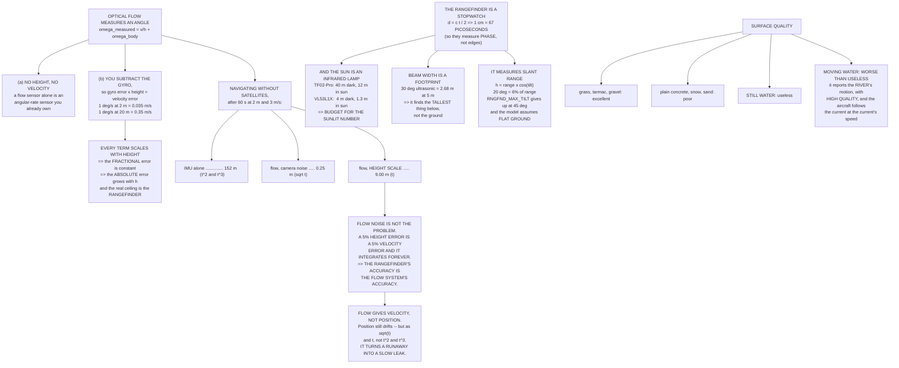

# 05.05 Optical flow and rangefinders

<!-- glance:start -->
<!-- generated by tools/build.py from curriculum/syllabus.yaml — edit the syllabus, not this block -->

| | |
|---|---|
| **Track** | Main path |
| **Difficulty** | Intermediate |
| **Time** | 1 h 15 min |
| **Hardware** | Onboard computer & vision (stage 2) |
| **Software** | python |
| **Prerequisites** | [05.04 The GNSS receiver on a drone: fix types, HDOP, and what the FC does with it](05.04-gnss-receiver.md) |
| **Skip if** | You can explain how flow plus a rangefinder produces a velocity, and when that pair replaces GNSS. |

<!-- glance:end -->

## What you will learn

- Why an optical-flow sensor measures an **angular rate**, not a velocity, and why that makes a
  rangefinder mandatory rather than optional
- Why every error term in a flow system scales **linearly with height**, and what actually limits
  its ceiling
- How flow-based navigation compares with IMU dead reckoning: **9 m against 152 m after a minute**
- Why the binding error in a flow system is the **height scale**, not the camera noise
- Why a rangefinder resolving one centimetre is a **67-picosecond stopwatch**
- What full Mediterranean sun does to an infrared rangefinder's range — the Israeli column
- Why a rangefinder measures **slant range** and what `RNGFND_MAX_TILT` is protecting you from
- Surface quality, and the one surface that makes a flow sensor confidently, dangerously wrong

## Why it matters

[05.01](05.01-sensor-roles.md) established the problem: without GNSS, the position estimate is
50 m wrong after 45 seconds, because an accelerometer bias integrates as $t^2$ and a gyro bias as
$t^3$. That is the reason a multirotor cannot fly indoors on an IMU alone.

Optical flow plus a rangefinder is the standard answer, and it works for a specific reason worth
stating up front: **it measures velocity directly.** A velocity measurement, integrated once, gives
a position error that grows as $\sqrt t$ from noise and as $t$ from scale error — instead of $t^2$
and $t^3$. It converts a runaway into a slow leak.

It is also the sensor pair with the most ways to be quietly wrong, and one of them — a river — will
carry your aircraft downstream at exactly the speed of the current, with perfect confidence.

## Prerequisites

<!-- prereqs:start -->
## Prerequisites

You need these first:

- [05.04 The GNSS receiver on a drone: fix types, HDOP, and what the FC does with it](05.04-gnss-receiver.md)

### Optional prerequisite links

None.

Check your readiness: `python course.py why 05.05`
<!-- prereqs:end -->

## Concept

### Flow measures an angle, not a velocity

A flow sensor is a tiny camera that correlates successive frames and reports how far the image
moved. That motion is **angular**. To turn it into a speed you have to know how far away the
ground is:

$$\omega_{measured} = \frac{v}{h} + \omega_{body}
\qquad\Longrightarrow\qquad
v = \left(\omega_{measured} - \omega_{gyro}\right) \times h$$

Two consequences fall straight out, and between them they are the whole lesson.

**(a) No height, no velocity.** A flow sensor without a rangefinder is an angular-rate sensor,
and you already have three of those.

**(b) The gyro error is multiplied by the height.** You subtract the aircraft's own rotation using
the gyro, so every degree per second of residual gyro error becomes a velocity error of
$h \times 0.0175$ m/s.

| Height | Camera resolution | Gyro leak (1 °/s) | Max speed | Noise floor |
|---:|---:|---:|---:|---:|
| 0.5 m | 0.024 m/s | 0.009 m/s | 3.7 m/s | **0.026 m/s** |
| 1 m | 0.048 m/s | 0.017 m/s | 7.4 m/s | 0.051 m/s |
| **2 m** | **0.097 m/s** | **0.035 m/s** | **14.8 m/s** | **0.103 m/s** |
| 5 m | 0.241 m/s | 0.087 m/s | 37.0 m/s | 0.257 m/s |
| 10 m | 0.483 m/s | 0.175 m/s | 74.0 m/s | 0.514 m/s |
| 20 m | 0.966 m/s | 0.349 m/s | 148.0 m/s | **1.027 m/s** |
| 50 m | 2.415 m/s | 0.873 m/s | 370.0 m/s | 2.568 m/s |

(A PMW3901-class sensor: 42° lens over 30 pixels at 100 fps, 1/16 pixel of correlation
resolution, averaged down to the 10 Hz the estimator uses, with 1 °/s of residual gyro error.)

> [!IMPORTANT]
> **Every column scales linearly with height.** The *fractional* velocity error is
> height-independent, so the *absolute* error grows in proportion to how high you are: 0.103 m/s
> at 2 m, 1.027 m/s at 20 m — the same fraction, ten times the metres.
>
> And the real ceiling is not the camera. It is that your **rangefinder runs out**. Optical flow
> is a low-altitude sensor because the height sensor is.

The max-speed column is the sensor's own angular-rate limit (about 7.4 rad/s on a PMW3901) times
the height. Low **and** fast is the combination that saturates it — which is exactly what a fast
low pass over a landing pad looks like.

### What flow actually buys you

Compare three ways of navigating without satellites, from a perfect starting state, at 2 m and
3 m/s with a 5 % error in the height used to scale the flow:

| Elapsed | IMU only | Flow: random walk | Flow: scale error | Flow: total |
|---:|---:|---:|---:|---:|
| 1 s | 0.03 m | 0.032 m | 0.15 m | 0.18 m |
| 5 s | 0.66 m | 0.073 m | 0.75 m | 0.82 m |
| 10 s | 2.79 m | 0.103 m | 1.50 m | 1.60 m |
| 30 s | 30.20 m | 0.178 m | 4.50 m | 4.68 m |
| **60 s** | **151.64 m** | **0.252 m** | **9.00 m** | **9.25 m** |
| 300 s | 9,954.76 m | 0.563 m | 45.00 m | 45.56 m |

After a minute: **152 m on the IMU alone, 9.3 m with flow.** A factor of sixteen, and the gap
widens without limit because the IMU's error is cubic.

But look at *which* flow term dominates. The random walk from camera noise after a whole minute
is **25 centimetres**. The height-scale error is **nine metres**.

> [!IMPORTANT]
> **Flow noise is not the problem. Knowing your height is the problem.** A 5 % height error is a
> 5 % velocity error, and a velocity error integrates linearly and forever. **The rangefinder's
> accuracy is the flow system's accuracy** — which is why the rest of this lesson is mostly about
> the rangefinder.

### The rangefinder is a stopwatch

Time of flight: the pulse goes out and comes back, so $d = ct/2$. What that demands of the timing:

| Resolution | Round trip |
|---:|---:|
| 100 cm | 6,671 ps |
| 10 cm | 667 ps |
| **1 cm** | **66.7 ps** |
| 1 mm | 6.7 ps |

**One centimetre is sixty-seven picoseconds.** As with the gyro's picometres in
[05.02](05.02-imu.md), the specification is absurd and the part costs ₪140 — which is why ToF
sensors do not actually time a single edge. They emit a modulated waveform and measure its
**phase**, which turns a timing problem into an amplitude-ratio problem that cheap silicon can
do.

| Sensor | Min | Max (dark) | **In sun** | Beam | Spot at 5 m | ≈ ₪ |
|---|---:|---:|---:|---:|---:|---:|
| HC-SR04 ultrasonic | 0.02 m | 4.0 m | 4.0 m | 30.0° | **2.68 m** | 15 |
| VL53L1X ToF | 0.04 m | 4.0 m | **1.3 m** | 27.0° | 2.40 m | 60 |
| **TF-Luna** | 0.20 m | 8.0 m | **3.0 m** | 2.0° | 0.17 m | 140 |
| TFmini-S | 0.10 m | 12.0 m | 4.0 m | 2.0° | 0.17 m | 190 |
| **TF02-Pro** | 0.10 m | 40.0 m | **12.0 m** | 3.0° | 0.26 m | 480 |
| LightWare SF20 | 0.20 m | 100.0 m | 50.0 m | 0.2° | 0.02 m | 1,400 |

> [!IMPORTANT]
> **The "in sun" column is the Israeli column.** An infrared time-of-flight sensor is competing
> against the sun's own infrared, and the sun is a very bright broadband emitter. In full
> Mediterranean sun a 12 m sensor becomes a 4 m one and a 4 m sensor becomes useless. **Budget for
> the sunlit number**, fly at dawn if you need the dark number, and never design a landing
> sequence around a range you have only measured indoors. [E]

The **beam** column matters too, and it is why ultrasonic sensors have essentially disappeared
from multirotors. A 30° cone is a **2.68 m footprint at 5 m** — it will happily report the
distance to the tallest thing anywhere under the aircraft, which is not the ground. Propwash noise
finishes the job.

### A rangefinder measures slant range, not height

$h = \text{range} \times \cos(\text{tilt})$. Uncorrected, leaning costs you altitude:

| Tilt | cos | Error at 2 m | At 10 m | At 40 m |
|---:|---:|---:|---:|---:|
| 0° | 1.0000 | 0.00 m | 0.00 m | 0.00 m |
| 5° | 0.9962 | 0.01 m | 0.04 m | 0.15 m |
| 10° | 0.9848 | 0.03 m | 0.15 m | 0.61 m |
| **20°** | **0.9397** | 0.12 m | 0.60 m | **2.41 m** |
| 30° | 0.8660 | 0.27 m | 1.34 m | 5.36 m |
| 45° | 0.7071 | 0.59 m | 2.93 m | 11.72 m |
| 60° | 0.5000 | 1.00 m | 5.00 m | 20.00 m |

At 20° — an ordinary translation — the uncorrected error is **6 % of range**. ArduPilot applies
the $\cos(\text{tilt})$ correction automatically and stops using the sensor past
`RNGFND_MAX_TILT` (default 45°).

But note what the correction assumes: **flat ground, directly below.** Over a slope, a wall, or a
parked car, $\cos(\text{tilt})$ is simply the wrong model, and the reading is about a different
piece of the world entirely. A rangefinder gives you **height above whatever is under the beam**,
which is a genuinely different quantity from altitude — and exactly the quantity you want for
terrain following, and exactly the wrong one for holding a level height over a hillside.

### Surface quality: flow needs something to look at

| Surface | Flow quality | Why |
|---|---|---|
| Tarmac, dry, daylight | excellent | texture at every scale |
| Grass | excellent | the best surface there is |
| Gravel | excellent | high contrast, strong features |
| Patterned carpet | good | why indoor demos always work |
| Plain concrete, shaded | poor | no contrast to correlate |
| Fresh snow / white sand | poor | uniform and over-exposed |
| Still water | useless | it reflects the sky, not the ground |
| **Moving water** | **worse than useless** | **it reports the water's motion** |
| At night, no light | useless | unless the sensor carries its own LED |

> [!IMPORTANT]
> **Moving water is the one that bites people.** The sensor faithfully reports the apparent motion
> of whatever it can see, and over a river that is the river. The estimator reads the water's
> motion as the aircraft drifting the *other* way, the controller corrects, and **the aircraft
> follows the current downstream at the speed of the current** — with complete confidence and no
> error flag. The same applies to a crowd, a road with traffic, or a field of wind-blown wheat.

ArduPilot publishes a surface-quality figure (`FLOW.Qual`, 0–255) and EKF3 stops using flow below
`FLOW_QUAL_MIN`. **Check it in the log before you rely on flow for anything**, and remember that
quality is high over moving water — the correlation is excellent, it is just correlating the wrong
thing.

> [!TIP]
> **Ask your teacher:** "My aircraft holds position beautifully over grass and drifts steadily in
> one direction over a car park. `FLOW.Qual` is above 150 in both cases. Walk me through the three
> things that could produce that, how I would separate them from the log, and which one I should
> suspect first."

### So when do you use what?

| Situation | Use | Why |
|---|---|---|
| Outdoors, open sky | GNSS + baro | flow adds little above 10 m |
| Outdoors, under canopy | flow + rangefinder | GNSS is multipath ([05.04](05.04-gnss-receiver.md)) |
| Indoors | flow + rangefinder | there is no alternative |
| Precision landing | flow + rangefinder + vision | GNSS is 4.5 m; you need 0.2 m |
| Terrain following | rangefinder, primary | baro gives height above **home**, not ground |
| **Over water** | **GNSS only** | flow is actively *wrong* |
| GNSS-denied, at altitude | IMU + whatever you have | seconds, not minutes ([05.01](05.01-sensor-roles.md)) |

And the sentence to carry away: **flow gives you velocity, not position.** Velocity integrates, so
position still drifts — but as $\sqrt t$ from noise and $t$ from scale error, instead of the IMU's
$t^2$ and $t^3$. It converts a runaway into a slow leak, and a slow leak is something a mission
can be designed around.

## Technical explanation

### Level 1 — Intuition: looking out of a train window

Look down from a moving train and the ground streaks past. How fast it streaks depends on two
things: how fast the train is going, and how far away the ground is. Look at the sleepers just
below and they blur; look at a distant field and it drifts slowly.

So the streak rate alone does not tell you the speed. You need the distance. And if you also turn
your head while looking, some of the streak is your head and not the train — which is why you
subtract the gyro.

### Level 2 — Practical: setting up flow and a rangefinder

| Setting | Value | Why |
|---|---|---|
| `RNGFND1_TYPE` | per your sensor | I²C, serial or PWM |
| `RNGFND1_MIN_CM` / `_MAX_CM` | **the sunlit numbers** | Not the datasheet's dark figures |
| `RNGFND1_ORIENT` | 25 (down) | |
| `RNGFND1_POS_X/Y/Z` | measured | Offset from the CoM ([04.02](../04-frame-and-assembly/04.02-mass-and-center-of-mass.md)) |
| `RNGFND_MAX_TILT` | 45° default | Past this the geometry is meaningless |
| `FLOW_TYPE` | per your sensor | |
| `FLOW_POS_X/Y/Z` | measured | The lever arm matters — rotation moves the sensor |
| `FLOW_FXSCALER` / `FYSCALER` | **calibrated** | This is the height-scale term; do not skip it |
| `EK3_SRC1_VELXY` | flow, when GNSS-denied | |
| `FLOW_QUAL_MIN` | 50 default | Below this, flow is ignored |

The flow scale calibration is the one people skip and it is the one the table above says matters
most. ArduPilot has an in-flight procedure (`FLOW_CAL`) that flies a pattern and fits the scale;
use it.

### Level 3 — Mathematics

**The flow equation in full.** For a downward-facing sensor at height $h$ above flat ground, the
apparent angular rate of the image has a translational and a rotational part:

$$\boldsymbol{\omega}_{flow} = \frac{1}{h}\begin{bmatrix} v_y \\ -v_x \end{bmatrix}
+ \begin{bmatrix} \omega_x \\ \omega_y\end{bmatrix}$$

and if the sensor is not at the centre of mass, rotation also *translates* it, adding
$\boldsymbol\omega \times \mathbf r$ to the velocity — which is why `FLOW_POS_*` exists and is the
same lever-arm correction as `INS_POS1_*` in
[04.02](../04-frame-and-assembly/04.02-mass-and-center-of-mass.md).

**Error propagation.** With $v = \omega h$:

$$\frac{\sigma_v}{v} = \sqrt{\left(\frac{\sigma_\omega}{\omega}\right)^2 +
\left(\frac{\sigma_h}{h}\right)^2}$$

The second term is a *scale* error, which does not average away and integrates linearly into
position: $\Delta x = (\sigma_h/h)\, v\, t$. The first is noise, which integrates into a random
walk: $\sigma_x = \sigma_v\sqrt{t\,\Delta t}$. Over sixty seconds at 3 m/s, the first gives
0.25 m and the second 9 m.

**Time of flight.** $d = ct/2$, so $\Delta d = c\,\Delta t/2$ and one centimetre needs 66.7 ps.
Phase-based sensors instead measure $\phi = 2\pi f_{mod}\,(2d/c)$, trading the timing requirement
for an unambiguous range of $c/(2 f_{mod})$ — which is why these sensors have a maximum range set
by their modulation frequency as well as by their signal-to-noise ratio.

### Level 4 — Implementation: proving your flow system works

1. **Bench the rangefinder first.** Measure a known distance — 1 m, 2 m, 5 m — indoors and then
   in full sun. Record both. The sunlit numbers are your real limits.
2. **Check the beam.** Put the aircraft over a step and move it across: the reading should jump
   cleanly. If it ramps, your beam is wide.
3. **Check `FLOW.Qual`** over every surface you intend to fly over, on the ground, with the
   aircraft moved by hand.
4. **Calibrate the flow scale** with the in-flight procedure. This is the 9-metres-per-minute
   term.
5. **Fly a known distance** in a GNSS-denied mode and compare estimated with actual. Repeat at
   two heights; the error should scale with height.
6. **Write the numbers down.** The rangefinder's sunlit maximum is a mission constraint.

## Diagram



## Code

Save as `flow.py` and run `python flow.py`. Standard library only.

```python
"""05.05 - optical flow and rangefinders: velocity without satellites."""
import math

C_LIGHT = 299792458.0
G = 9.81

# --- the flow sensor -----------------------------------------------------
FOV_DEG = 42.0            # PMW3901-class lens
PIXELS = 30               # across the array
FPS = 100.0               # frames per second
SUBPIXEL = 0.0625         # correlation resolution, in pixels (1/16)
MAX_RATE = 7.4            # rad/s, the sensor's own angular-rate limit
GYRO_ERR_DPS = 1.0        # deg/s of residual gyro error after calibration
HEIGHTS = [0.5, 1, 2, 5, 10, 20, 50]

# --- dead reckoning ------------------------------------------------------
ACCEL_BIAS = 0.05         # m/s^2 (05.01)
GYRO_BIAS_DPS = 0.01      # deg/s (05.01)
FLOW_HZ = 10.0
CRUISE_MS = 3.0           # m/s, a realistic indoor / GNSS-denied speed
H_SCALE_ERR = 0.05        # 5 % error in the height used to scale the flow

# --- rangefinders --------------------------------------------------------
# name, min m, max m (dark), max m (bright sun), beam deg, ~ILS
RANGERS = [
    ("HC-SR04 ultrasonic", 0.02, 4.0, 4.0, 30.0, 15),
    ("VL53L1X ToF", 0.04, 4.0, 1.3, 27.0, 60),
    ("TF-Luna", 0.20, 8.0, 3.0, 2.0, 140),
    ("TFmini-S", 0.10, 12.0, 4.0, 2.0, 190),
    ("TF02-Pro", 0.10, 40.0, 12.0, 3.0, 480),
    ("LightWare SF20", 0.20, 100.0, 50.0, 0.2, 1400),
]
TILTS = [0, 5, 10, 20, 30, 45, 60]


def pixel_rad():
    return math.radians(FOV_DEG) / PIXELS


def flow_resolution_ms(h):
    """Velocity noise at height h, after averaging FPS frames down to FLOW_HZ."""
    omega_noise = SUBPIXEL * pixel_rad() * math.sqrt(FPS * FLOW_HZ)
    return omega_noise * h


def gyro_leak_ms(h, dps=GYRO_ERR_DPS):
    """A gyro error of dps leaks straight into velocity, scaled by height."""
    return math.radians(dps) * h


def max_speed_ms(h):
    """The sensor has a maximum angular rate; above it the flow is lost."""
    return MAX_RATE * h


def imu_pos_err(t):
    """05.01's dead reckoning: accel bias t^2/2 plus gyro bias g w t^3/6."""
    return (0.5 * ACCEL_BIAS * t * t
            + G * math.radians(GYRO_BIAS_DPS) * t ** 3 / 6)


def flow_pos_err(t, h, v=CRUISE_MS):
    """Random walk from flow noise, plus a linear term from height scale error."""
    sigma_v = math.hypot(flow_resolution_ms(h), gyro_leak_ms(h))
    walk = sigma_v * math.sqrt(t / FLOW_HZ)
    bias = H_SCALE_ERR * v * t
    return walk, bias, walk + bias


def slant_err(range_m, tilt_deg):
    """A rangefinder measures slant range; height = range x cos(tilt)."""
    return range_m * (1 - math.cos(math.radians(tilt_deg)))


def bar(t):
    print("\n" + "=" * 70)
    print(t)
    print("=" * 70)


if __name__ == "__main__":
    bar("1. FLOW MEASURES AN ANGLE, NOT A VELOCITY")
    print("  The image moves at an ANGULAR rate. To turn that into a speed")
    print("  you must know how far away the ground is:")
    print("      omega_measured = v / h  +  omega_body")
    print("      =>   v = ( omega_measured - omega_gyro ) x h")
    print("  Two consequences, and both of them are the whole lesson:")
    print("    (a) NO HEIGHT, NO VELOCITY. A flow sensor without a")
    print("        rangefinder is an angular-rate sensor you already have.")
    print("    (b) THE GYRO ERROR IS MULTIPLIED BY THE HEIGHT.")
    print(f"\n  {'height':>8s} {'resolution':>12s} {'gyro leak':>12s}"
          f" {'max speed':>11s} {'noise floor':>12s}")
    for h in HEIGHTS:
        res = flow_resolution_ms(h)
        leak = gyro_leak_ms(h)
        print(f"  {h:6.1f} m {res:9.3f} m/s {leak:9.3f} m/s"
              f" {max_speed_ms(h):8.1f} m/s {math.hypot(res, leak):9.3f} m/s")
    print(f"  ({GYRO_ERR_DPS:.0f} deg/s of residual gyro error, 1/16 px of")
    print(f"   correlation resolution, a {FOV_DEG:.0f} deg lens over {PIXELS}"
          f" pixels at {FPS:.0f} fps,")
    print(f"   averaged down to the {FLOW_HZ:.0f} Hz the estimator uses)")
    print("\n  EVERY COLUMN SCALES LINEARLY WITH HEIGHT, and that is the")
    print("  structural fact about optical flow: the FRACTIONAL velocity")
    print("  error is height-independent, so the ABSOLUTE error grows in")
    print("  proportion to how high you are.")
    print(f"    at  2 m the noise floor is"
          f" {math.hypot(flow_resolution_ms(2), gyro_leak_ms(2)):.3f} m/s")
    print(f"    at 20 m it is"
          f" {math.hypot(flow_resolution_ms(20), gyro_leak_ms(20)):.3f} m/s"
          f" -- the same fraction, ten times the metres")
    print("  And the real ceiling is not the camera at all: it is that your")
    print("  RANGEFINDER runs out (section 3). FLOW IS A LOW-ALTITUDE")
    print("  SENSOR BECAUSE THE HEIGHT SENSOR IS.")
    print("  The max-speed column is the sensor's own angular-rate limit")
    print(f"  ({MAX_RATE:.1f} rad/s) times the height: low AND fast is the")
    print("  combination that saturates it.")

    bar("2. WHAT REPLACES GNSS, AND HOW WELL")
    print("  All three of these are 'navigating without satellites'.")
    print("  They fail at completely different rates.")
    h = 2.0
    print(f"  (flow at {h:.0f} m, {CRUISE_MS:.0f} m/s,"
          f" {H_SCALE_ERR * 100:.0f} % height-scale error)")
    print(f"  {'elapsed':>8s} {'IMU only':>11s} {'flow: walk':>12s}"
          f" {'flow: scale':>12s} {'flow total':>12s}")
    for t in (1, 5, 10, 30, 60, 300):
        walk, bias, tot = flow_pos_err(t, h)
        print(f"  {t:6d} s {imu_pos_err(t):9.2f} m {walk:9.3f} m"
              f" {bias:9.2f} m {tot:9.2f} m")
    walk, bias, tot = flow_pos_err(60, h)
    print(f"\n  At 60 s: IMU alone {imu_pos_err(60):.0f} m,"
          f" flow {tot:.1f} m -- a factor of {imu_pos_err(60) / tot:.0f}.")
    print("  But look at WHICH flow term dominates. The random walk after")
    print(f"  60 s is only {walk:.2f} m; the height-SCALE error is {bias:.1f} m.")
    print("  Flow noise is not the problem. THE PROBLEM IS KNOWING YOUR")
    print("  HEIGHT: a 5 % height error is a 5 % velocity error, and a")
    print("  velocity error integrates linearly and forever.")
    print("  => THE RANGEFINDER'S ACCURACY IS THE FLOW SYSTEM'S ACCURACY.")

    bar("3. THE RANGEFINDER IS A STOPWATCH")
    print("  Time of flight: the pulse goes out and comes back, so")
    print("  distance = c t / 2. What that demands of the timing:")
    print(f"  {'resolution':>12s} {'round trip':>14s}")
    for cm in (100, 10, 1, 0.1):
        t_s = 2 * (cm / 100) / C_LIGHT
        print(f"  {cm:9.1f} cm {t_s * 1e12:11.1f} ps")
    print("  ONE CENTIMETRE IS 67 PICOSECONDS. Like the gyro's picometres")
    print("  (05.02), the specification is absurd and the part costs 140")
    print("  shekels -- which is why ToF sensors correlate a modulated")
    print("  waveform rather than actually timing a single edge.")

    print(f"\n  {'sensor':22s} {'min':>6s} {'max dark':>9s} {'in SUN':>8s}"
          f" {'beam':>6s} {'spot at 5 m':>12s} {'~ILS':>6s}")
    for name, lo, hi, sun, beam, ils in RANGERS:
        spot = 2 * 5.0 * math.tan(math.radians(beam / 2))
        print(f"  {name:22s} {lo:5.2f}m {hi:8.1f}m {sun:7.1f}m"
              f" {beam:5.1f}d {spot:10.2f} m {ils:5d}")
    print("  THE 'IN SUN' COLUMN IS THE ISRAELI COLUMN. An infrared ToF")
    print("  sensor competes against the sun's own infrared; in full")
    print("  Mediterranean sun a 12 m sensor becomes a 4 m one and a 4 m")
    print("  sensor becomes useless. Budget for the sunlit number, fly at")
    print("  dawn if you need the dark number, and never design a landing")
    print("  sequence around a range you have only measured indoors.")
    print("  THE BEAM COLUMN MATTERS TOO: a 30 deg ultrasonic cone is a")
    print("  2.7 m footprint at 5 m -- it will find the tallest thing under")
    print("  the aircraft, not the ground.")

    bar("4. A RANGEFINDER MEASURES SLANT RANGE, NOT HEIGHT")
    print("  h = range x cos(tilt). Uncorrected, leaning costs you altitude:")
    print(f"  {'tilt':>6s} {'cos':>7s} {'error at 2 m':>13s}"
          f" {'at 10 m':>10s} {'at 40 m':>10s}")
    for td in TILTS:
        print(f"  {td:4d} d {math.cos(math.radians(td)):7.4f}"
              f" {slant_err(2, td):11.2f} m {slant_err(10, td):8.2f} m"
              f" {slant_err(40, td):8.2f} m")
    print("  At 20 deg -- an ordinary translation -- the uncorrected error")
    print("  is 6 % of range. ArduPilot applies the cos(tilt) correction")
    print("  automatically and gives up past RNGFND_MAX_TILT (default 45")
    print("  deg), because beyond that the beam is no longer pointing at")
    print("  anything you can reason about.")
    print("  AND: the correction assumes FLAT GROUND DIRECTLY BELOW. Over a")
    print("  slope, a wall or a parked car, cos(tilt) is the wrong model and")
    print("  the reading is simply about a different piece of the world.")

    bar("5. SURFACE QUALITY: FLOW NEEDS SOMETHING TO LOOK AT")
    surfaces = [
        ("tarmac, dry, daylight", "excellent", "texture at every scale"),
        ("grass", "excellent", "the best surface there is"),
        ("gravel", "excellent", "high contrast, strong features"),
        ("patterned carpet", "good", "why indoor demos always work"),
        ("plain concrete, shaded", "poor", "no contrast to correlate"),
        ("fresh snow / white sand", "poor", "uniform and over-exposed"),
        ("still water", "useless", "reflects the sky, not the ground"),
        ("moving water", "WORSE than useless", "it reports the WATER's motion"),
        ("at night, no light", "useless", "unless the sensor has its own LED"),
    ]
    print(f"  {'surface':26s} {'flow quality':18s} why")
    for what, q, why in surfaces:
        print(f"  {what:26s} {q:18s} {why}")
    print("  'Moving water' is the one that bites people. The sensor")
    print("  faithfully reports the apparent motion of what it can see, and")
    print("  over a river that is the river. The estimator reads that as the")
    print("  aircraft drifting the OTHER way, the controller corrects, and")
    print("  the aircraft FOLLOWS THE CURRENT DOWNSTREAM at the current's")
    print("  speed -- with perfect confidence and no error flag.")
    print("  ArduPilot publishes a surface-quality figure (FLOW.Qual, 0-255)")
    print("  and EKF3 stops using flow below FLOW_QUAL_MIN. CHECK IT IN THE")
    print("  LOG BEFORE you rely on flow for anything.")

    bar("6. SO WHEN DO YOU USE WHAT?")
    rows = [
        ("outdoors, open sky", "GNSS + baro", "flow adds little above 10 m"),
        ("outdoors, under canopy", "flow + rangefinder", "GNSS is multipath"),
        ("indoors", "flow + rangefinder", "there is no alternative"),
        ("precision landing", "flow + rangefinder + vision",
         "GNSS is 4.5 m; you need 0.2 m"),
        ("terrain following", "rangefinder, primary",
         "baro gives height above HOME, not ground"),
        ("over water", "GNSS only", "flow is actively WRONG"),
        ("GNSS-denied, high", "IMU + whatever you have",
         "seconds, not minutes (05.01)"),
    ]
    print(f"  {'situation':26s} {'use':30s} why")
    for sit, use, why in rows:
        print(f"  {sit:26s} {use:30s} {why}")
    print("\n  And the sentence to remember: FLOW GIVES YOU VELOCITY, NOT")
    print("  POSITION. Velocity integrates, so position still drifts -- but")
    print("  as sqrt(t) from noise and t from scale error, instead of the")
    print("  IMU's t^2 and t^3. It converts a runaway into a slow leak.")
```

Output:

```text

======================================================================
1. FLOW MEASURES AN ANGLE, NOT A VELOCITY
======================================================================
  The image moves at an ANGULAR rate. To turn that into a speed
  you must know how far away the ground is:
      omega_measured = v / h  +  omega_body
      =>   v = ( omega_measured - omega_gyro ) x h
  Two consequences, and both of them are the whole lesson:
    (a) NO HEIGHT, NO VELOCITY. A flow sensor without a
        rangefinder is an angular-rate sensor you already have.
    (b) THE GYRO ERROR IS MULTIPLIED BY THE HEIGHT.

    height   resolution    gyro leak   max speed  noise floor
     0.5 m     0.024 m/s     0.009 m/s      3.7 m/s     0.026 m/s
     1.0 m     0.048 m/s     0.017 m/s      7.4 m/s     0.051 m/s
     2.0 m     0.097 m/s     0.035 m/s     14.8 m/s     0.103 m/s
     5.0 m     0.241 m/s     0.087 m/s     37.0 m/s     0.257 m/s
    10.0 m     0.483 m/s     0.175 m/s     74.0 m/s     0.514 m/s
    20.0 m     0.966 m/s     0.349 m/s    148.0 m/s     1.027 m/s
    50.0 m     2.415 m/s     0.873 m/s    370.0 m/s     2.568 m/s
  (1 deg/s of residual gyro error, 1/16 px of
   correlation resolution, a 42 deg lens over 30 pixels at 100 fps,
   averaged down to the 10 Hz the estimator uses)

  EVERY COLUMN SCALES LINEARLY WITH HEIGHT, and that is the
  structural fact about optical flow: the FRACTIONAL velocity
  error is height-independent, so the ABSOLUTE error grows in
  proportion to how high you are.
    at  2 m the noise floor is 0.103 m/s
    at 20 m it is 1.027 m/s -- the same fraction, ten times the metres
  And the real ceiling is not the camera at all: it is that your
  RANGEFINDER runs out (section 3). FLOW IS A LOW-ALTITUDE
  SENSOR BECAUSE THE HEIGHT SENSOR IS.
  The max-speed column is the sensor's own angular-rate limit
  (7.4 rad/s) times the height: low AND fast is the
  combination that saturates it.

======================================================================
2. WHAT REPLACES GNSS, AND HOW WELL
======================================================================
  All three of these are 'navigating without satellites'.
  They fail at completely different rates.
  (flow at 2 m, 3 m/s, 5 % height-scale error)
   elapsed    IMU only   flow: walk  flow: scale   flow total
       1 s      0.03 m     0.032 m      0.15 m      0.18 m
       5 s      0.66 m     0.073 m      0.75 m      0.82 m
      10 s      2.79 m     0.103 m      1.50 m      1.60 m
      30 s     30.20 m     0.178 m      4.50 m      4.68 m
      60 s    151.64 m     0.252 m      9.00 m      9.25 m
     300 s   9954.76 m     0.563 m     45.00 m     45.56 m

  At 60 s: IMU alone 152 m, flow 9.3 m -- a factor of 16.
  But look at WHICH flow term dominates. The random walk after
  60 s is only 0.25 m; the height-SCALE error is 9.0 m.
  Flow noise is not the problem. THE PROBLEM IS KNOWING YOUR
  HEIGHT: a 5 % height error is a 5 % velocity error, and a
  velocity error integrates linearly and forever.
  => THE RANGEFINDER'S ACCURACY IS THE FLOW SYSTEM'S ACCURACY.

======================================================================
3. THE RANGEFINDER IS A STOPWATCH
======================================================================
  Time of flight: the pulse goes out and comes back, so
  distance = c t / 2. What that demands of the timing:
    resolution     round trip
      100.0 cm      6671.3 ps
       10.0 cm       667.1 ps
        1.0 cm        66.7 ps
        0.1 cm         6.7 ps
  ONE CENTIMETRE IS 67 PICOSECONDS. Like the gyro's picometres
  (05.02), the specification is absurd and the part costs 140
  shekels -- which is why ToF sensors correlate a modulated
  waveform rather than actually timing a single edge.

  sensor                    min  max dark   in SUN   beam  spot at 5 m   ~ILS
  HC-SR04 ultrasonic      0.02m      4.0m     4.0m  30.0d       2.68 m    15
  VL53L1X ToF             0.04m      4.0m     1.3m  27.0d       2.40 m    60
  TF-Luna                 0.20m      8.0m     3.0m   2.0d       0.17 m   140
  TFmini-S                0.10m     12.0m     4.0m   2.0d       0.17 m   190
  TF02-Pro                0.10m     40.0m    12.0m   3.0d       0.26 m   480
  LightWare SF20          0.20m    100.0m    50.0m   0.2d       0.02 m  1400
  THE 'IN SUN' COLUMN IS THE ISRAELI COLUMN. An infrared ToF
  sensor competes against the sun's own infrared; in full
  Mediterranean sun a 12 m sensor becomes a 4 m one and a 4 m
  sensor becomes useless. Budget for the sunlit number, fly at
  dawn if you need the dark number, and never design a landing
  sequence around a range you have only measured indoors.
  THE BEAM COLUMN MATTERS TOO: a 30 deg ultrasonic cone is a
  2.7 m footprint at 5 m -- it will find the tallest thing under
  the aircraft, not the ground.

======================================================================
4. A RANGEFINDER MEASURES SLANT RANGE, NOT HEIGHT
======================================================================
  h = range x cos(tilt). Uncorrected, leaning costs you altitude:
    tilt     cos  error at 2 m    at 10 m    at 40 m
     0 d  1.0000        0.00 m     0.00 m     0.00 m
     5 d  0.9962        0.01 m     0.04 m     0.15 m
    10 d  0.9848        0.03 m     0.15 m     0.61 m
    20 d  0.9397        0.12 m     0.60 m     2.41 m
    30 d  0.8660        0.27 m     1.34 m     5.36 m
    45 d  0.7071        0.59 m     2.93 m    11.72 m
    60 d  0.5000        1.00 m     5.00 m    20.00 m
  At 20 deg -- an ordinary translation -- the uncorrected error
  is 6 % of range. ArduPilot applies the cos(tilt) correction
  automatically and gives up past RNGFND_MAX_TILT (default 45
  deg), because beyond that the beam is no longer pointing at
  anything you can reason about.
  AND: the correction assumes FLAT GROUND DIRECTLY BELOW. Over a
  slope, a wall or a parked car, cos(tilt) is the wrong model and
  the reading is simply about a different piece of the world.

======================================================================
5. SURFACE QUALITY: FLOW NEEDS SOMETHING TO LOOK AT
======================================================================
  surface                    flow quality       why
  tarmac, dry, daylight      excellent          texture at every scale
  grass                      excellent          the best surface there is
  gravel                     excellent          high contrast, strong features
  patterned carpet           good               why indoor demos always work
  plain concrete, shaded     poor               no contrast to correlate
  fresh snow / white sand    poor               uniform and over-exposed
  still water                useless            reflects the sky, not the ground
  moving water               WORSE than useless it reports the WATER's motion
  at night, no light         useless            unless the sensor has its own LED
  'Moving water' is the one that bites people. The sensor
  faithfully reports the apparent motion of what it can see, and
  over a river that is the river. The estimator reads that as the
  aircraft drifting the OTHER way, the controller corrects, and
  the aircraft FOLLOWS THE CURRENT DOWNSTREAM at the current's
  speed -- with perfect confidence and no error flag.
  ArduPilot publishes a surface-quality figure (FLOW.Qual, 0-255)
  and EKF3 stops using flow below FLOW_QUAL_MIN. CHECK IT IN THE
  LOG BEFORE you rely on flow for anything.

======================================================================
6. SO WHEN DO YOU USE WHAT?
======================================================================
  situation                  use                            why
  outdoors, open sky         GNSS + baro                    flow adds little above 10 m
  outdoors, under canopy     flow + rangefinder             GNSS is multipath
  indoors                    flow + rangefinder             there is no alternative
  precision landing          flow + rangefinder + vision    GNSS is 4.5 m; you need 0.2 m
  terrain following          rangefinder, primary           baro gives height above HOME, not ground
  over water                 GNSS only                      flow is actively WRONG
  GNSS-denied, high          IMU + whatever you have        seconds, not minutes (05.01)

  And the sentence to remember: FLOW GIVES YOU VELOCITY, NOT
  POSITION. Velocity integrates, so position still drifts -- but
  as sqrt(t) from noise and t from scale error, instead of the
  IMU's t^2 and t^3. It converts a runaway into a slow leak.
```

## Exercise

> [!WARNING]
> Flow-based position hold has a specific and dangerous failure mode: it fails **silently and
> confidently**. Test it at low altitude, in a large open area, with a clear escape to a manual
> mode on a switch you have already practised using. **Never** test flow position hold over water.
> And if you use a laser rangefinder, do not look into the aperture, and do not point it at
> anyone — Class 1 is eye-safe by design, which is a statement about normal use and not an
> invitation.

### Exercise 05.05-E1 — Your own flow budget `[numerical]`

1. From your flow sensor's datasheet, get the field of view, the pixel count, the frame rate and
   the maximum angular rate.
2. Compute the velocity noise floor and the maximum speed at 1 m, 2 m, 5 m and 10 m.
3. Compute the height at which your **rangefinder's sunlit maximum** becomes the binding limit.
4. State your flow system's usable envelope as a height band and a speed band.

### Exercise 05.05-E2 — Height scale dominates `[analysis]`

1. Using the script, compute the position error after 60 s at 2 m and at 10 m, for height-scale
   errors of 1 %, 5 % and 10 %.
2. At each, state whether the random walk or the scale error dominates.
3. Compute the height-scale accuracy you need for a 2 m position error after a 60-second
   GNSS-denied leg at 3 m/s.
4. State whether your rangefinder can deliver that, with evidence.

### Exercise 05.05-E3 — Bench your rangefinder, twice `[measurement]`

1. Measure a known 1 m, 2 m and 5 m indoors. Record the reading and the error.
2. Repeat outdoors in full midday sun, over the same surfaces.
3. Report the maximum usable range in each condition and compare with the datasheet.
4. Repeat over a dark surface and a bright one. Report the difference.

### Exercise 05.05-E4 — Map your surfaces `[measurement]`

1. Power the aircraft, propellers off, and move it by hand over each surface you intend to fly
   over. Log `FLOW.Qual` and the flow rates.
2. Tabulate quality by surface, including at least one poor one.
3. **Over moving water, if you can do so safely from a bank with the aircraft in your hands**,
   record the quality and the reported flow with the sensor held still. Report what it says.
4. State your own `FLOW_QUAL_MIN` and justify it from your measurements.

## Expected result

- **05.05-E1:** a usable band of roughly 0.3–8 m in height for a TF-Luna-class rangefinder in
  sun, and a speed limit that rises with height. The binding constraint at the top is almost
  always the rangefinder, not the camera.
- **05.05-E2:** the scale error dominates at every height beyond the first second or two. For a
  2 m error after 60 s at 3 m/s you need better than **1.1 %** height accuracy — which at 2 m is
  2 cm, and is achievable with a good ToF sensor and a proper scale calibration, but not with an
  ultrasonic one.
- **05.05-E3:** the sunlit maximum is typically a third of the dark figure, and dark surfaces cut
  it further. If your outdoor figure matches the datasheet, check you were actually in direct sun.
- **05.05-E4:** grass and tarmac above 200; shaded plain concrete below 50; still water near
  zero. **Moving water gives high quality and a non-zero flow with the sensor stationary** — which
  is the whole point of the exercise.

## Troubleshooting

### Symptom: position hold works indoors and drifts outdoors

Two candidates. The rangefinder's range has collapsed in sunlight, so the height scale is wrong or
missing; or the surface outdoors has worse texture than the patterned carpet indoors. Check
`FLOW.Qual` and check the rangefinder is still reporting at your test height in daylight.

### Symptom: the aircraft drifts steadily in one direction at a constant speed

A scale error, and probably in the height. A 5 % height error gives 5 % of your airspeed as a
steady drift. Run the flow scale calibration, and check `RNGFND1_POS_*` and `FLOW_POS_*` are set —
a flow sensor mounted away from the centre of mass sees rotation as translation.

### Symptom: flow quality is high and the position estimate is wrong

Look at what is under the aircraft. Moving water, traffic, a crowd or wind-blown vegetation all
correlate beautifully and report the *scene's* motion. This failure has no error flag, which is
why the surface map from E4 is a real deliverable and not busywork.

### Symptom: the rangefinder reads correctly in a hover and wrongly when translating

Slant range. At 20° of lean the uncorrected error is 6 % of range. Confirm ArduPilot has the
sensor's orientation and offsets set so the $\cos(\text{tilt})$ correction is applied, and check
whether you are exceeding `RNGFND_MAX_TILT`.

### Symptom: altitude jumps when flying over a wall, a car or a slope

That is the sensor working correctly. A rangefinder measures height above **whatever is under the
beam**, not altitude. For terrain following that is the quantity you want; for holding a level
height it is not. Use `EK3_SRC*_POSZ` deliberately and know which one you have selected.

### Symptom: an ultrasonic rangefinder is erratic in flight and fine on the bench

Propwash. Ultrasonic sensors are acoustic receivers and a multirotor is an acoustic source. They
also have a 30° cone, which at 5 m is a 2.68 m footprint. This is why they have disappeared from
multirotors; replace it with a ToF sensor.

## Common mistakes

- **Fitting a flow sensor without a rangefinder.** It measures an angle. Without a height it is
  not a velocity sensor at all.
- **Skipping the flow scale calibration.** It is the term worth nine metres a minute.
- **Using the datasheet's dark range.** In full Israeli sun, expect a third of it.
- **Testing over water.** Moving water produces high-quality, completely wrong flow.
- **Assuming a rangefinder gives altitude.** It gives height above whatever is under the beam.
- **Ignoring the sensor's offset from the centre of mass.** Rotation translates an offset sensor,
  and the estimator will read that as velocity.
- **Believing a high `FLOW.Qual` means the estimate is good.** Quality measures correlation, not
  correctness.
- **Using an ultrasonic rangefinder on a multirotor.** Propwash and a 30° cone.
- **Expecting flow to work at altitude.** The error is a fixed fraction of height, and the
  rangefinder gives up first.

## Knowledge check

<details>
<summary>Why can an optical-flow sensor not report a velocity on its own?</summary>

Because it measures an **angular** rate — how fast the image moves across its array. The relation
is $\omega = v/h + \omega_{body}$, so converting to a velocity requires both the aircraft's own
rotation (from the gyro, which you subtract) and **the height above the ground** (from a
rangefinder, which you multiply by). Without a height, a flow sensor is an angular-rate sensor,
and the aircraft already has three of those.
</details>

<details>
<summary>After 60 s of GNSS-denied flight at 2 m and 3 m/s, flow gives 9.3 m of position error. Which part of that is camera noise?</summary>

**Twenty-five centimetres.** The other nine metres is the **height-scale error** — a 5 % error in
the height used to scale the flow becomes a 5 % velocity error, which integrates linearly and
forever. Camera noise integrates as a random walk ($\sqrt t$) and stays small. The practical
consequence is that the rangefinder's accuracy *is* the flow system's accuracy, and that the
flow scale calibration is the most valuable ten minutes you will spend on it.
</details>

<details>
<summary>Why is one centimetre of rangefinder resolution a hard problem?</summary>

Because light travels 30 cm in a nanosecond, and the pulse makes a round trip: $d = ct/2$, so one
centimetre is **66.7 picoseconds**. Timing an edge to that precision is laboratory work. Cheap ToF
sensors avoid it entirely by emitting a **modulated** waveform and measuring its phase, which
converts a picosecond timing problem into an amplitude-ratio measurement — at the cost of an
ambiguous range set by the modulation frequency.
</details>

<details>
<summary>Your rangefinder is specified to 12 m. Why should you plan missions around 4 m?</summary>

Because the specification is measured in the dark and you are flying in Israel. An infrared ToF
sensor competes against the sun's own broadband infrared; in full Mediterranean sun the
signal-to-noise ratio collapses and a 12 m sensor typically becomes a 4 m one. Budget for the
sunlit figure, measure it yourself on the surfaces you will actually fly over, and never design a
landing sequence around a range you only confirmed indoors.
</details>

<details>
<summary>Why does ArduPilot stop using the rangefinder past 45° of tilt?</summary>

Because a rangefinder measures **slant range**, and the conversion $h = \text{range}\cos(\theta)$
assumes flat ground directly below. At 20° that correction is already 6 % of range; past about
45° the cosine is changing fast, small attitude errors matter a lot, and — more importantly — the
beam is pointing at a piece of the world that has nothing to do with the height below the
aircraft. `RNGFND_MAX_TILT` is the point at which the model stops being worth applying.
</details>

<details>
<summary>An aircraft trying to hold position over a river ends up travelling downstream at the current speed. Explain.</summary>

The flow sensor reports the apparent motion of **whatever it can see**, and over a river that is
the water. Water moving downstream past the lens produces the same image motion as an aircraft
moving *upstream* over still ground, so the estimator believes the aircraft is drifting upstream.
The controller dutifully corrects by flying downstream — and since the apparent motion never goes
away, it keeps correcting, ending up travelling downstream at exactly the current's speed. It does
so with a high `FLOW.Qual`, because the correlation is excellent; the sensor is not failing, it is
succeeding at the wrong problem. This is why flow must never be the position source over water.
</details>

<details>
<summary>Flow-based position still drifts. Why is it nevertheless transformative compared with IMU dead reckoning?</summary>

Because of the **power of t**. Flow measures velocity directly, so noise integrates once into a
random walk ($\sqrt t$) and scale error integrates once linearly ($t$). IMU dead reckoning
integrates an accelerometer bias twice ($t^2$) and a gyro bias — via the tilt error it produces —
three times ($t^3$). After sixty seconds that is 9 m against 152 m, and the gap widens without
limit. Flow does not stop the drift; it converts a runaway into a slow leak that a mission can be
designed around.
</details>

## Practical challenge

Add a **flow and rangefinder section to `docs/sensors.md`**, or write it now even if you are not
building stage 2 yet.

1. Your flow sensor's specification and your computed velocity noise floor and maximum speed at
   four heights.
2. Your rangefinder's **measured** minimum and maximum, indoors and in full sun, over a dark and
   a light surface.
3. Your usable envelope: the height band and the speed band in which the pair actually works.
4. Your height-scale accuracy requirement from E2, and whether your hardware meets it.
5. Your surface-quality map from E4, including at least one surface where it fails.
6. The parameters you set, including `FLOW_POS_*`, `RNGFND1_POS_*`, the scale factors and
   `FLOW_QUAL_MIN`.
7. **A written no-fly rule for flow**, which must include water.

## You can skip this if

You can derive the flow equation and explain why a rangefinder is mandatory, show that every error
term scales linearly with height and identify what really limits the ceiling, compare flow-based
drift with IMU dead reckoning and explain the difference in terms of powers of $t$, show that the
height scale dominates the camera noise and compute the height accuracy a given mission needs,
state the timing resolution a centimetre demands and why ToF sensors measure phase instead,
account for sunlight and beam width when choosing a rangefinder, apply the slant-range correction
and say what it assumes, and name the surfaces on which flow fails — including the one on which it
fails confidently.

## Go deeper

- [05.01](05.01-sensor-roles.md) (earlier): the dead-reckoning arithmetic this lesson improves on.
- [05.02](05.02-imu.md) (earlier): the gyro whose residual error is multiplied by height here.
- [05.04](05.04-gnss-receiver.md) (earlier): what flow is replacing, and when.
- [05.06](05.06-noise-bias-and-calibration.md) (next): the calibrations that make all of this
  work.
- [06.05](../06-state-estimation/06.05-ekf3-in-ardupilot.md) (later): how EKF3 blends flow,
  rangefinder and GNSS, and the `EK3_SRC` source sets.
- Module 15 (later): precision landing, which is this lesson plus a camera.
- Optical flow, from the computer-vision side:
  https://en.wikipedia.org/wiki/Optical_flow
- ArduPilot's optical-flow setup and calibration procedure:
  https://ardupilot.org/copter/docs/common-optical-flow-sensor-setup.html

## Progress checkpoint

Run `python course.py complete 05.05` when your flow and rangefinder section is written and your
surface map exists. Next: [05.06](05.06-noise-bias-and-calibration.md) — the calibrations that
turn all six of these sensors from raw hardware into something an estimator can trust.
